# خواننده تلگرام

<!-- TOP_NAV START -->

<!-- TOP_NAV END -->

<!-- MSG START -->

---
📅 بروزرسانی: 1405/02/25 21:36
---

## persian_trend_official — post 14208

تا دقایقی دیگه لایو شروع میشه

## persian_trend_official — post 14207

  

📌 @persian_trend_official
پرشین ترند | متفاوت‌ترین کانال نظامی

## persian_trend_official — post 14204

🔴تصاویری از ساختمانی که عزالدین حداد، در آن حذف شده است.

پ ن : چقدر شبیه انفجار گاز های ایران تخریب شده ...

🫆:Tony

📌 @persian_trend_official
پرشین ترند | متفاوت‌ترین کانال نظامی

## persian_trend_official — post 14203

  

🔴نتانیاهو

💢نیروهای دفاعی اسرائیل (IDF) عزالدین الحدّاد، فرمانده نظامی حماس در غزه را هدف قرار داده‌اند.

🫆:Tony

📌 @persian_trend_official
پرشین ترند | متفاوت‌ترین کانال نظامی

## persian_trend_official — post 14202

## persian_trend_official — post 14201

  <a href="telegram/content/persian_trend_official_14201_1778868362.webm" target="_blank">🎬 Download video</a>

منابع آگاه روز جمعه به بلومبرگ گفتند، امارات متحده عربی تلاش کرد کشورهای همسایه خلیج فارس، از جمله عربستان سعودی و قطر، را متقاعد کند تا در جریان جنگ اخیر، واکنش نظامی هماهنگ به حملات موشکی، راکتی و پهپادی ایران داشته باشند، اما پاسخ آنها امارات را ناامید کرد !
چرا؟
امشب در لایو توضیح میدم ...

📌 @persian_trend_official
پرشین ترند | متفاوت‌ترین کانال نظامی

## OfficialPersiaTwiter — post 498693

رئیس سازمان استخدامی: والدینی که هر ۲ شاغل هستند و فرزند مدرسه‌ای دارند یک ساعت شناوری برای آن‌ها لحاظ می‌شود.

🔹این موضوع دربارۀ مادران سرپرست خانوار هم صدق می‌کند.

🔹کارمندان بانک‌ها ار فردا باید از ساعت ۷ خدمت‌رسانی را شروع کنند و اگر نیاز به آماده‌کردن سیستم‌ها دارند باید زودتر در محل کار حاضر شوند.

》OPT《

@OfficialPersiaTwiter

## OfficialPersiaTwiter — post 498692

نتانیاهو مدعی ترور فرمانده عزالدین قسام در غزه شد 🔹بنیامین نتانیاهو و اسرائیل کاتس وزیر جنگ اسرائیل مدعی ترور عزالدین حداد فرمانده گردان‌‌های عزالدین قسام در غزه شدند. 🔹رسانه‌های اسرائیلی مدعی شده‌اند که عزالدین حداد در بمباران آپارتمانی در محله الریمال در…

## OfficialPersiaTwiter — post 498691

  

هنری کویل آتیش بگیره اون نتفلیکس😑 *Zizi ✨* @OfficialPersiaTwiter

## OfficialPersiaTwiter — post 498690

صبح یکی پیام داد
سلام کلانتری هستم
نوشتم حتما یه گوهی خوردی که گرفتنت
گفت مودب باش آقا مدیر ساختمونم چرا شارژتون رو واریز نمیکنید ۶ ماهه

》علیرضا باشم خوبه《

@OfficialPersiaTwiter

## OfficialPersiaTwiter — post 498689

جانسون: عملیات خشم حماسی به پایان رسیده است

رئیس جمهوری‌خواه مجلس نمایندگان آمریکا:
🔹عملیات «خشم حماسی» آمریکا علیه ایران به پایان رسیده و ایالات متحده هم‌اکنون به دنبال بازگشایی تنگه هرمز است.
🔹دولت آمریکا در حال حاضر به جای اقدام نظامی، در حال مذاکره با ایران است.

》OPT《

@OfficialPersiaTwiter

## OfficialPersiaTwiter — post 498688

  

نتانیاهو مدعی ترور فرمانده عزالدین قسام در غزه شد

🔹بنیامین نتانیاهو و اسرائیل کاتس وزیر جنگ اسرائیل مدعی ترور عزالدین حداد فرمانده گردان‌‌های عزالدین قسام در غزه شدند.
🔹رسانه‌های اسرائیلی مدعی شده‌اند که عزالدین حداد در بمباران آپارتمانی در محله الریمال در غزه به شهادت رسیده است/yjc

》OPT《

@OfficialPersiaTwiter

## OfficialPersiaTwiter — post 498684

  <a href="telegram/content/OfficialPersiaTwiter_498684_1778868364.mp4" target="_blank">🎬 Download video</a>

یک پهپاد اسرائیلی مناره مسجدی در محله المحطه در خان یونس در جنوب غزه را هدف قرار داد. 》OPT《 @OfficialPersiaTwiter

## OfficialPersiaTwiter — post 498683

رفیقم سیصد میلیون ازم طلب داشت!
اومد گفت بیا امتیاز وام دارم بهت میدم خودت وامش رو بگیر و پول منو بده!
امتیازشو انتقال داد! گفتم ضامن ندارم! خودشم ضامنم شد و خداروشکر پولشو پس دادم!
الان چند ماهه قسطاشو ندادم از حساب خودش برمیدارن

》ramin tafti《

@OfficialPersiaTwiter

## OfficialPersiaTwiter — post 498682

  <a href="telegram/content/OfficialPersiaTwiter_498682_1778868365.mp4" target="_blank">🎬 Download video</a>

حمله ترکیبی حزب‌الله به شمال فلسطین اشغالی   🔹رسانه‌های عبری از شلیک انبوهی از پهپادها و موشک‌ها به سمت شمال فلسطین اشغالی خبر دادند.   🔹این رسانه‌ها اعلام کردند که آژیر هشدار از راس الناقوره تا نهاریا در شمال فلسطین اشغالی به صدا درآمده است.   🔹از سوی دیگر…

## OfficialPersiaTwiter — post 498681

  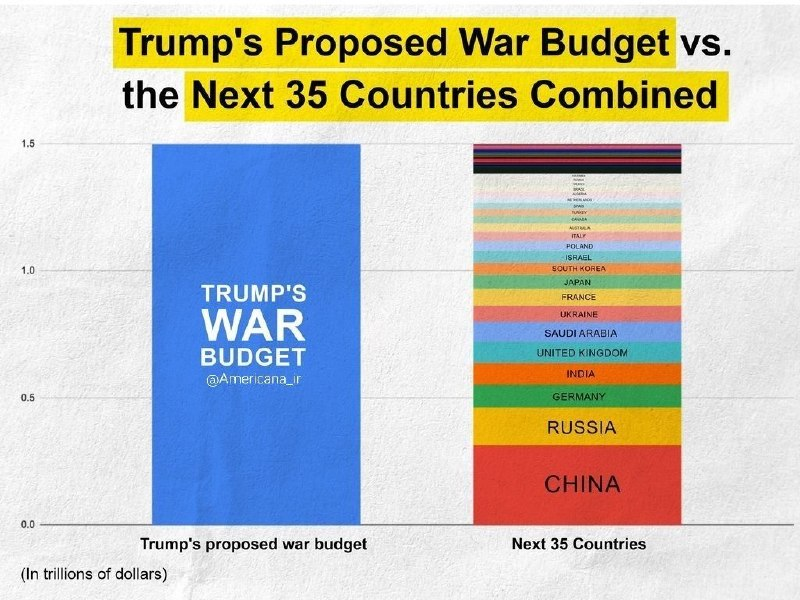

درخواست بزرگترین هزینه نظامی تاریخ جهان توسط وزارت جنگ آمریکا 🔷وزارت جنگ آمریکا روز سه‌شنبه یک پیشنهاد بودجه ۱.۵ تریلیون دلاری برای سال مالی ۲۰۲۷ اعلام کرد. نکات اصلی: 🔹این بودجه ۴۲٪ بیشتر از سال قبل است و گفته می‌شود بزرگ‌ترین هزینه نظامی در تاریخ مدرن…

## OfficialPersiaTwiter — post 498680

الجزیره: ایالات متحده و چین توافق کردند: «جنگ باید پایان یابد» و تنگه هرمز باید باز شود جزئیات کمی درباره‌ی آنچه رئیس‌جمهور ترامپ در مذاکرات خود با چین فاش کرده، منتشر شده است، اما او در اظهارات خود به‌روشنی اعلام کرد که ایالات متحده و چین در دو موضوع توافق…

## OfficialPersiaTwiter — post 498679

دیروز تو اتاق انتظار نشسته بودم، یه دختر خانوم کنارم نشست گفت:
«شما از نتیجه تراپی‌تون راضی بودید؟»

گفتم آره، چند ساله میرم و واقعا کمکم کرده.

بعد بی‌مقدمه گفت:
«من خیلی با خودم مکالمه دارم، برای همین اومدم دکتر… با خودم گفتم همه با خودشون حرف میزنن.»
داشتم گوشیمو چک میکردم که یهو شنیدم گفت:
«شلوار خاکستریمو بپوشم شب یا لیمویی برمودا؟ … نه برمودا نه، خشتکش پاره‌ست.»

اونجا بود که فهمیدم منظورش از “مکالمه با خودم” در حد پادکست زنده بوده.

》موکاخانِم《

@OfficialPersiaTwiter

## OfficialPersiaTwiter — post 498678

پسرم چون دلش برای مامانش تنگ شده غمگینه؛ یه ربع پیش بهش گفتم بابایی پاشو بریم برات برگر بخرم.
گفت ولی بابا دو ماهه حقوق نگرفتی، پول داری؟ گفتم بچه جان تو به این چیزا کار نداشته باش.
خلاصه داریم می‌ریم بیرون براش از این پاستیلا که شکل برگره بخرم عشق کنه.

》SiaVash《

@OfficialPersiaTwiter

## OfficialPersiaTwiter — post 498677

  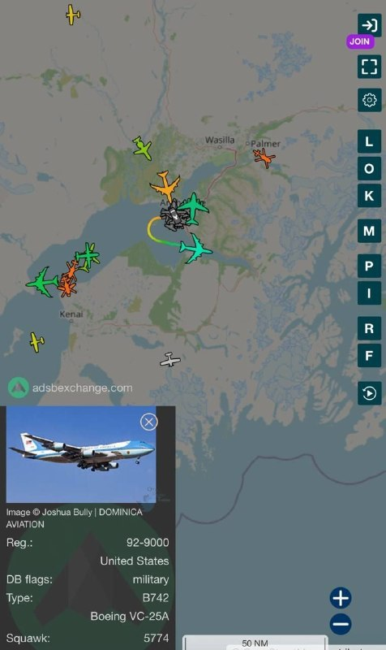

ترامپ چند دقیقه پیش از آلاسکا به سمت واشنگتن پرواز کرد. پس از توقف برای سوخت‌گیری در انکوریج

》OPT《

@OfficialPersiaTwiter

## OfficialPersiaTwiter — post 498676

  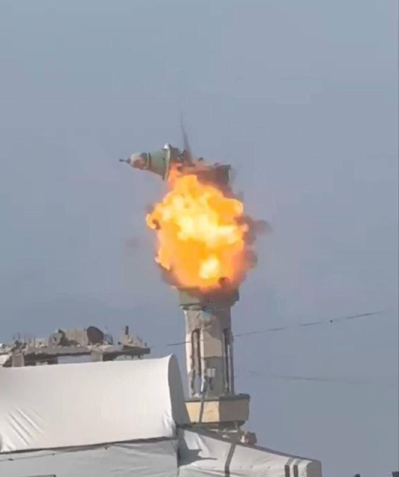

یک پهپاد اسرائیلی مناره مسجدی در محله المحطه در خان یونس در جنوب غزه را هدف قرار داد.

》OPT《

@OfficialPersiaTwiter

## bbcpersian — post 281148

  <a href="https://t.me/bbcpersian/281148" target="_blank">📎 Download file</a>

پادکست جام جهان‌نما جمعه جمعه ۲۵ اردیبهشت ۱۴۰۵

در این برنامه می‌شنوید:
پایان سفر ترامپ به چین،
پکن برای توافق صلح ایران و آمریکا قول کمک داد
سایه جنگ خاورمیانه بر نشست بریکس ...
بدنبال اختلاف ایران و امارات، نشست امسال بدون بیانیه مشترک پایان یافت
توافق‌های دفاعی و اقتصادی در سفر نخست‌وزیر هند به ابوظبی
مودی حملات ایران به امارات را به‌شدت محکوم کرد
و در روز فردوسی و زبان فارسی، نگاهی میکنیم به رابطه جمهوری اسلامی با نمادهای ملی، احترام واقعی یا نیاز سیاسی؟
این برنامه رادیویی را می‌توانید هر شب ساعت ۲۰ به وقت ایران، روی موج متوسط ۷۰۲ کیلوهرتز و موج کوتاه ۹۴۶۵ کیلوهرتز بشنوید.
تکرار برنامه را هم می‌توانید ساعت ۲۱:۳۰ روی موج متوسط ۷۰۲ کیلوهرتز و موج کوتاه ۵۳۹۵ کیلوهرتز گوش کنید.
@BBCPersian

## bbcpersian — post 281147

  <a href="telegram/content/bbcpersian_281147_1778868368.mp4" target="_blank">🎬 Download video</a>

🔻دونالد ترامپ، رئیس‌جمهور آمریکا، در گفتگو با خبرنگاران در هواپیمای ویژه ریاست‌جمهوری آمریکا، با اشاره به وضعیت تنگه هرمز گفت، برای بازگشایی این گذرگاه آبی، از چین نخواسته است که بر ایران فشار وارد کند، زیرا «به لطف کسی نیاز ندارد.» او گفت ایران بر اثر محاصره دریایی در دو هفته و نیم گذشته «روزی ۵۰۰ میلیون دلار» ضرر می‌‌‌کند.

آقای ترامپ گفت که به باورش شی جین‌پینگ، رئیس‌جمهور چین «طبیعتا مایل است تنگه باز شود» چرا که چین بخش قابل توجهی از انرژی خود را از این مسیر تامین می‌کند.

رئیس‌جمهور آمریکا درباره برنامه هسته‌ای ایران تاکید کرد که تهران «به‌هیچ‌ وجه نباید به سلاح هسته‌ای دست یابد» موضعی که به گفته او رئیس‌جمهور چین هم با آن موافق است.

دونالد ترامپ گفت با ازسرگیری احتمالی فعالیت‌های هسته‌ای ایران «پس از ۲۰ سال موافق است»، مشروط بر آنکه این دوره با تضمین‌های «معتبر» همراه باشد و «به هیچ شکلی هسته‌ای نداشته باشند.».»

https://bbc.in/43aBphT
@BBCPersian

## bbcpersian — post 281146

🔻پس از آنکه اندی بِرنهام، شهردار منچستر، اعلام کرد میخواهد در انتخابات میان‌دوره‌ای شرکت کند و به پارلمان بازگردد، گمانه‌زنی درباره سرنوشت کی‌یر استارمر، رهبر حزب کارگر و نخست وزیر بریتانیا، افزایش یافته. آقای برنهام برای ورود به رقابت بر سر رهبری حزب، ابتدا باید دوباره به‌عنوان نماینده وارد پارلمان شود. او برای نامزدی از حوزه انتخابیه اش در منچستر نیاز به تأیید کمیته اجرایی حزب کارگر دارد. بحث کناره گیری و جایگزینی آقای استارمر بعد از انتخابات محلی اخیر قوت گرفت، انتخاباتی که حزب کارگر در آن بسیاری از کرسی هایش را از دست داد. گزارش هری هارلی را ببینیم.
@BBCPersian

## bbcpersian — post 281145

با وصل شدن اندک اندک بعضی شهروندان ایران به اینترنت که بیش از دو ماه و نیم از قطع آن می‌گذرد، تصاویر جدیدی از  جنگ و آسیب‌های آن منتشر می‌شود.
 
یکی از شهروندان به تازگی تصاویری از جزیره شیدور (مارو) در نزدیکی جزیره لاوان در اینستاگرامش منتشر کرده که نشان می‌دهد در پی حمله هوایی ۱۹ فروردین ۱۴۰۵ به پالایشگاه لاوان در خلیج فارس، آلودگی نفتی این منطقه و جانوران بومی آن را آلوده کرده است.

مدیرکل حفاظت محیط زیست استان هرمزگان با تائید آلودگی نفتی در لاوان و مارو، ۱۰ اردیبهشت اعلام کرد این آلودگی نفتی «تبعات ماندگاری بر ساحل صخره‌ای و مرجان‌های این جزیره خواهد گذاشت.»
@BBCPersian

## bbcpersian — post 281144

🔻امارات ایران را به «تلاش برای توجیه» حملاتش به آن کشور متهم کرد

امارات متحده عربی یک روز پس از اینکه عباس عراقچی این کشور را به داشتن «نقش فعال» در حملات به ایران متهم کرد، این اظهارات را «تلاش‌ برای توجیه حملات تروریستی ایران» خواند و آن را رد کرد.

خلیفه بن شاهین المرار، از مقامات وزارت خارجه امارات متحده عربی که به نمایندگی این کشور در نشست وزرای خارجه بریکس در دهلی‌نو شرکت داشت، گفت «امارات متحده عربی به دنبال حمایت سایر کشورها نیست و کاملا قادر به جلوگیری از این تجاوز بی‌دلیل است.»

بر اساس بیانیه وزارت خارجه امارات،‌ آقای المرار به حملات ایران به امارات متحده در طول جنگ اخیر اشاره کرد و گفت: «از ۲۸ فوریه (۹ اسفند) امارات متحده عربی در معرض حملات تروریستی مکرر و غیرقابل توجیه ایران قرار گرفته است. پدافند هوایی امارات حدود سه هزار حمله شامل موشک‌های بالستیک، موشک‌های کروز و پهپادها را که عمدا و مستقیما تاسیسات غیرنظامی و زیرساخت‌های حیاتی از جمله فرودگاه‌ها، بنادر، تاسیسات نفتی، کارخانه‌های آب شیرین‌کن،‌ شبکه‌های انرژی، تاسیسات خدماتی و مناطق مسکونی را هدف قرار دادند،‌ رهگیری کرده است.»

این مقام اماراتی تاکید کرد که کشورش حق کامل و مشروع خود را برای دفاع از حاکمیت و تمامیت ارضی خود و تضمین امنیت شهروندان و ساکنان و بازدیدکنندگان از این کشور مطابق با ماده ۵۱ منشور سازمان ملل محفوظ می‌داند.

عباس عراقچی دیروز در حاشیه نشست بریکس، در تلگرامش امارات متحده عربی را «شریک فعال» آمریکا و اسرائیل در حمله به ایران توصیف کرده و گفته بود که این کشور مستقیما در جنگ آمریکا و اسرائیل با ایران «دخیل» بوده است.

https://bbc.in/3RIul9G
@BBCPersian

## Lichargoo — post 24883

  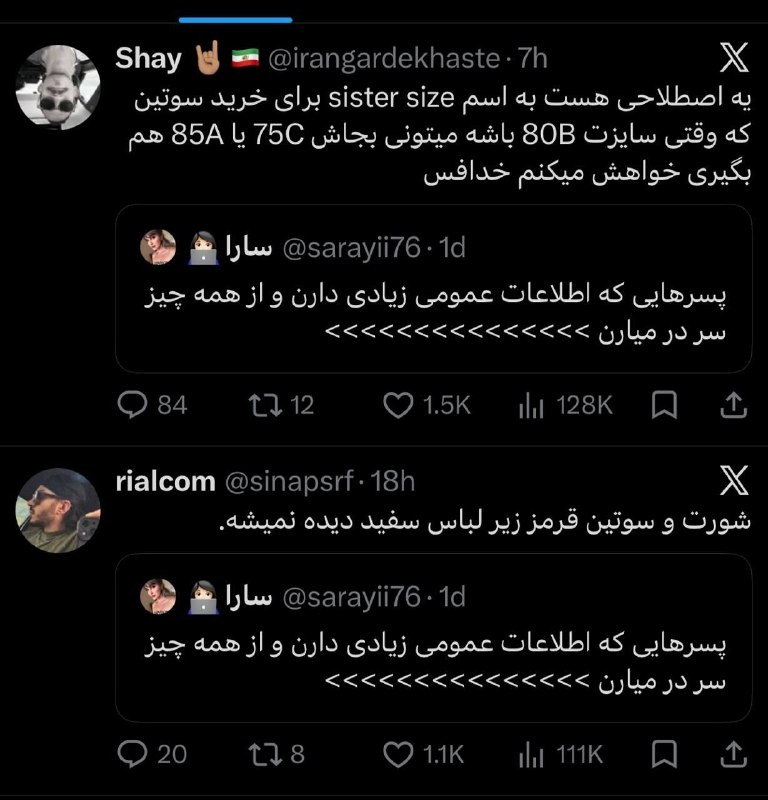

اینارو از کجا یاد گرفتن؟

@Lichargoo

## hamclasixii — post 75382

🔴 حضوری شدن امتحانات دانشگاه پیام نور!

🔹 تا این تاریخ و طبق اعلام معاونت آموزشی دانشگاه ، با عنایت به شرایط فعلی حاکم بر کشور، امتحانات پایان ترم دانشگاه پیام نور از ۱۶ خرداد لغایت ۳ تیر و به صورت حضوری برگزار می گردد.

📚 @hamclasix 📚

## withyashar — post 11320

شاهزاده رضا پهلوی : هم‌میهنان عزیزم،

در روزهایی که شما با شجاعت در برابر رژیم اشغالگر ایران ایستاده‌اید، این نظام منفور و منزوی، همچنان به تجاوز به جان و مال مردم ادامه می‌دهد تا سرنگونی حتمی خود را اندکی به تعویق اندازد. در چنین شرایطی، وظیفه خود می‌دانم که تصویر عدالت در فردای ایران را برای کسانی که با جنایتکاران همکاری کنند، روشن‌تر ترسیم کنم.

در این راستا، از «کمیته‌ تدوین مقررات عدالت انتقالی ایران» خواستم درباره‌ دو موضوع مهم، نظر مشورتی خود را ارائه کند: نخست، موضوع مسئولیت کیفری افرادی که با ساختارهای سرکوبگر جمهوری اسلامی همکاری می‌کنند؛ و دوم، موضوع مصادره‌ اموال معترضان و خانواده‌های آنان.
@withyashar
این کمیته اکنون نخستین نظر مشورتی خود را صادر کرده و پیام آن روشن است: این اقدامات، همکاری‌های ساده یا بی‌اهمیت نیستند؛ بلکه «یاری‌رسانی به جنایت علیه بشریت» محسوب می‌شوند. هیچ مقام، هیچ دستور و هیچ بهانه‌ای نمی‌تواند مسئولیت کیفری فردی را از میان ببرد. بنابراین، هر فردی که آگاهانه و داوطلبانه با ساختارهای سرکوبگر رژیم همکاری کند، چه در داخل و چه در خارج از ایران، باید بداند که در معرض مسئولیت کیفری قرار خواهد گرفت:

خواه این همکاری از نوع گزارش‌دهی یا خبرچینی باشد؛
خواه از نوع مشارکت در ایست‌های بازرسی‌ باشد؛
خواه از نوع به‌کارگیری کودکان و نوجوانان در سرکوب معترضان باشد؛
و خواه از نوع تحصیل، انتقال یا خرید و فروش اموالی باشد که در جریان سرکوب از معترضان و خانواده‌های آنان مصادره شده‌ است.
@withyashar
از این رو، نه‌تنها افرادی که در صدور دستور، اجرای آن، یا تسهیل این مصادره‌ها نقش دارند در معرض مسئولیت قرار خواهند گرفت، بلکه کسانی که آگاهانه و داوطلبانه به خرید و فروش این اموال می‌پردازند نیز باید پاسخگو باشند. این مسئولیت، استفاده از اموال یا دارایی‌های آنان برای جبران خسارت واردشده به مالکان اصلی را نیز شامل می‌‌شود.

بنابراین، به همه‌ کسانی که امروز در صدد همکاری با دستگاه سرکوب رژیم هستند هشدار می‌دهم: پیش از آن‌که دست به اقدامی بزنید که به مردم ایران آسیب جانی، مالی و یا اجتماعی برساند، به آینده‌ خود و خانواده‌تان بیندیشید. به آن روز بیندیشید که ایران آزاد خواهد شد؛ روزی که حقیقت پنهان نخواهد ماند؛ روزی که اسامی آشکار خواهد شد؛ روزی که هیچ متجاوز و جنایتکاری از پاسخ‌گویی در برابر قانون در امان نخواهد ماند.

آن روز، ملت ایران حکومتی خواهد داشت که حقوق ایرانیان را محترم می‌دارد و ایران را به سرزمینی آزاد و آباد بدل می‌کند.

پاینده ایران،
رضا پهلوی
@withyashar

## withyashar — post 11319

## withyashar — post 11318

سازمان سازمان مجاهدین خلق ایران (که در آمریکا با نام‌های MEK یا PMOI شناخته می‌شود) به‌صورت رسمی در تاریخ ۲۸ سپتامبر ۲۰۱۲ از فهرست «سازمان‌های تروریستی خارجی» وزارت خارجه آمریکا خارج شد. این تصمیم توسط وزارت خارجه دولت هیلاری کلینتون اعلام شد و همان روز اجرایی گردید
@withyashar

## withyashar — post 11317

## withyashar — post 11316

یاشار مجاهدین الان دارن از کجا تغذیه میشن؟

## withyashar — post 11315

## withyashar — post 11314

آخرین فیلم مخفی وحید بنی عامریان، نخبه ریاضی در زندان اوین که از دفاعیه اش در مقابل بیدادگاه آخوندی می گوید. وحید روز 15 فروردین 1405 اعدام شد @withyashar

## withyashar — post 11313

## withyashar — post 11312

یاشار مجاهدین خیلی دارن به دانشجو های داخل ایران پیام میدن، واسه خودم تا الان از دو نفر مختلف پیش اومده، شروع میکنن به توضیح تاریخچه خودشون و همه چیزای خوب رو هم میچسبونن به خودشون و فلان
نمیدونم چه پروژه ای راه انداختن ولی از طریق

## withyashar — post 11311

## withyashar — post 11310

  

نخست‌وزیر و وزیر دفاع اسرائیل در بیانیه‌ای اعلام کردند ارتش این کشور عزالدین حداد، فرمانده شاخه نظامی حماس، را در یک حمله هوایی هدف قرار داده

@withyashar

## withyashar — post 11309

## withyashar — post 11308

## withyashar — post 11307

امریکا زمانی حمله میکنه که کسی منتظر نیس.

## withyashar — post 11306

## withyashar — post 11305

  <a href="telegram/content/withyashar_11305_1778868370.mp4" target="_blank">🎬 Download video</a>

🎬 Video

## withyashar — post 11304

## withyashar — post 11303

کانال ۱۳ اسرائیل:

سیستم امنیتی معتقد است که ترامپ با حمله‌ای محدود به ایران موافقت خواهد کرد.
@withyashar

## withyashar — post 11302

## withyashar — post 11301

یاشار بیا مثل سیاه جامگان یا حسن صباح یه فرقه راه بنداز 😅

---
📅 بروزرسانی: 1405/02/25 19:57
---

## persian_trend_official — post 14200

  <a href="telegram/content/persian_trend_official_14200_1778862473.webm" target="_blank">🎬 Download video</a>

بجا مانده از رزمایش خامنه ای !!! به نظر شما چه چیزی در این تصویر جلب توجه میکند ؟ اضافه وزن نیروی سپاه پاسداران که اصلا شبیه یک نظامی ورزیده نیست . به مدل نشستن رو زاپاس هم اصلا نمیپردازیم ! وقتی میگم سپاه پاسداران از یک ارتش حرفه ای به یک گروه مسلح تبدیل…

## persian_trend_official — post 14199

  <a href="telegram/content/persian_trend_official_14199_1778862473.webm" target="_blank">🎬 Download video</a>

بجا مانده از رزمایش خامنه ای !!!

به نظر شما چه چیزی در این تصویر جلب توجه میکند ؟

اضافه وزن نیروی سپاه پاسداران که اصلا شبیه یک نظامی ورزیده نیست .
به مدل نشستن رو زاپاس هم اصلا نمیپردازیم !

وقتی میگم سپاه پاسداران از یک ارتش حرفه ای به یک گروه مسلح تبدیل شده دلیلش این هست.
تازه عرزشی ها اعتقاد دارن جنگ زمینی تخصص اون هاست !

📌 @persian_trend_official
پرشین ترند | متفاوت‌ترین کانال نظامی

## persian_trend_official — post 14198

  

واقعا چرا ؟

📌 @persian_trend_official
پرشین ترند | متفاوت‌ترین کانال نظامی

## persian_trend_official — post 14197

  <a href="telegram/content/persian_trend_official_14197_1778862475.mp4" target="_blank">🎬 Download video</a>

محمد منان رئیسی، نماینده مجلس: خسارت مستقیم جنگ به ایران فقط ۳۰ میلیارد دلار برآورد می‌شود در حالی که درآمد هر سال عوارض تنگه هرمز ۵۰ میلیارد دلار خواهد بود !!!

📌 @persian_trend_official
پرشین ترند | متفاوت‌ترین کانال نظامی

## OfficialPersiaTwiter — post 498675

الجزیره: ترامپ قبلاً خواستار توقف کامل غنی‌سازی ایران بود؛ حالا اوضاع فرق کرده است سلطان برکات، استاد دانشگاه قطر، می‌گوید بازگشت به جنگ تمام‌عیار با ایران به نفع دولت ترامپ نیست. او افزود که رئیس‌جمهور آمریکا تلاش می‌کند «گام‌به‌گام عقب‌نشینی کند، در حالی…

## OfficialPersiaTwiter — post 498674

نورالدین الدغیر خبرنگار الجزیره در تهران: پاسخ آمریکا به پیشنهاد ایران به تهران رسید به گفته یک منبع آگاه، · واشنگتن پیشنهاد ایران را رد کرده است و به نظر می‌رسد که این عدم پذیرش، مربوط به پنج نکته‌ای باشد که ایران پیش از ورود به مذاکرات هسته‌ای بر آنها…

## OfficialPersiaTwiter — post 498673

مامان و بابام سر شبکه کارتون و اخبار دعواشون شد
شاید فکر کنید بابام میخواست اخبار ببینه، نع خیررررر، مامانم دعواش کرد گفت بسه دیگه دو دقیقه بزن اخبار میخوام ببینم این زرد عقدی رفت چین چیکار کرد، بابامم میگفت دارم تام و جری میبینم.

》سیگاری《

@OfficialPersiaTwiter

## OfficialPersiaTwiter — post 498672

  <a href="telegram/content/OfficialPersiaTwiter_498672_1778862476.mp4" target="_blank">🎬 Download video</a>

حمله نیروی هوایی اسرائیل به صور لبنان 》OPT《 @OfficialPersiaTwiter

## OfficialPersiaTwiter — post 498671

‏اونایی که مثلاً ۱۰ سال پیش فارغ التحصیل شدن چقدر راحت هر جای دنیا که می‌خواستن رفتن. مدرک آزاد می‌شد، پوزیشن فاندد بود، ویزا در دسترس و دلار مفت. چقدر همه چیز برای نسل‌های قبلی راحت‌تر بود.

》LEwilliams《

@OfficialPersiaTwiter

## OfficialPersiaTwiter — post 498670

وزارت نیروهای مسلح فرانسه: ناو هواپیمابر شارل دوگل در دریای عرب است و احتمالاً ماموریت آن بازگرداندن ناوبری در تنگه هرمز است. 》OPT《 @OfficialPersiaTwiter

## OfficialPersiaTwiter — post 498666

اقدام جالب متروی تهران در روز بزرگداشت زبان فارسی

میزبانی از بزرگان ادب فارسی در طرح «ایستگاه شاعرانه» در ایستگاه‌های مترو

》OPT《

@OfficialPersiaTwiter

## OfficialPersiaTwiter — post 498656

۲۵ اردیبهشت روز بزرگداشت فردوسی

🔹حکیم «ابوالقاسم فردوسی طوسی» زاده ۳۱۹ خورشیدی و در گذشته پیش از ۳۹۷ خورشیدی سخن‌سرای نامی ایران و سراینده شاهنامه حماسه ملی ایران است. فردوسی را بزرگ‌ترین سراینده پارسی‌گو دانسته‌اند.

📸 عکاس: «محمدحسین طاقی- نیما نجف زاده»

》OPT《

@OfficialPersiaTwiter

## bbcpersian — post 281143

  

⚽️شکیرا،‌ مدونا و گروه پاپ کره‌ای بی‌تی‌اس قرار است بین دو نیمه فینال جام جهانی ۲۰۲۶ در ۱۹ جولای در نیوجرسی کنسرتی برگزار کنند.

این اجرا برای نخستین بار در تاریخ جام جهانی برگزار می‌شود و مشابه شوهای بین دو نیمه «سوپربال» فوتبال آمریکایی طراحی شده است. زمانش حدود ۱۱ دقیقه پیش‌بینی شده، هرچند برخی گزارش‌ها از طولانی‌تر بودن آن خبر داده‌اند.

شکیرا که پیش‌تر آهنگ «واکا واکا» را برای جام جهانی ۲۰۱۰ خوانده، قرار است دوباره ترانه رسمی جدیدی منتشر کند. مدونا در آستانه انتشار آلبوم جدید خود است و بی‌تی‌اس هم پس از وقفه‌ خدمت سربازی، در حال بازگشت و برگزاری تور جهانی هستند.

این برنامه را کریس مارتین، خواننده گروه راک کلدپلی سازماندهی می‌کند و هدف آن جمع‌آوری کمک مالی برای آموزش کودکان در جهان است. رئیس فیفا این رویداد را «لحظه‌ای تاریخی برای بزرگ‌ترین رویداد ورزشی جهان» توصیف کرده است.

طبق قوانین فوتبال، استراحت بین دو نیمه نباید بیش از ۱۵ دقیقه باشد
اما تجربه‌های مشابه، مانند فینال جام باشگاه‌های جهان ۲۰۲۵ در آمریکا، نشان داد که این اجراها زمان استراحت را به بیش از ۲۴ دقیقه هم می‌رسانند.
@bbcpersian

## bbcpersian — post 281142

  

🔻اصغر فرهادی، کارگردان ایرانی برنده اسکار، در یک کنفرانس مطبوعاتی در جشنواره کن در پاسخ به سوال خبرنگار شبکه اینترنشنال هم حملات آمریکا و اسرائیل به ایران و هم سرکوب معترضان دی ۱۴۰۴ از سوی جمهوری اسلامی را محکوم کرد و گفت «کشته شدن هر انسانی، یک جنایت است چه در جنگ چه با اعدام و چه در اعتراضات.»

آقای فرهادی که برای اکران فیلم «داستان‌های موازی» در جشنواره کن حضور دارد، روز جمعه گفت: «من هفته گذشته تهران بودم و هنوز اثر این اتفاقات همراه من هست. یکی از این اتفاقات کشته شدن شمار زیادی از انسان‌های بی‌گناه، کودکان و غیرنظامیانی در جریان جنگ بود و مدتی قبل از آن، کشته شدن تعداد زیادی از معترضان در خیابان‌ها در دی ماه،انسان‌های بی‌گناه که معترض بودند. هردو بسیار دردناک است و هرگز فراموش نخواهد شد.»

او اضافه کرد که «مخالفت با کشته شدن بی‌گناهان و غیرنظامیان و انسان‎‌های عادی در جنگ به معنی موافقت با کشته شدن معترضان در خیابان‌ها نیست.»

اصغر فرهادی در ادامه گفت: «کشته شدن هر انسانی، یک جنایت است و با هر دیدگاهی، کشتن و قتل انسان‌ها برای من قابل پذیرش نیست، چه با جنگ، چه اعدام، چه کشتن معترضان.»
📷Getty
@BBCPersian

## Tans_Footbali — post 236318

  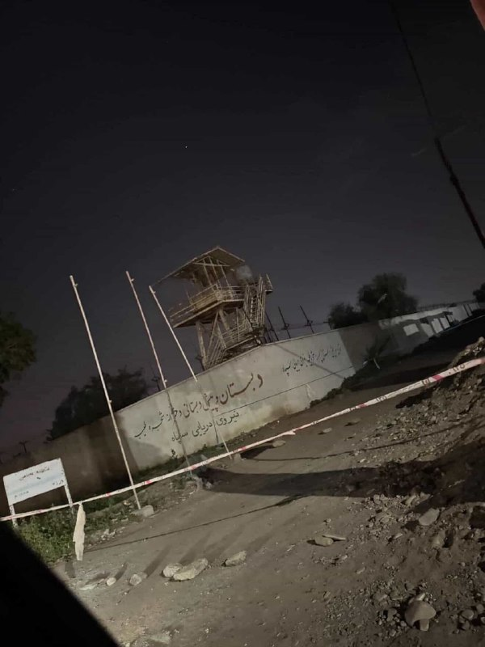

برجک سپاه پاسداران در مدرسه طیبه میناب! مدرسه رسما پادگان نظامی بوده

گروه سپاه تروریستی با سپر انسانی باعث مرگ کودکان میناب شد

@Tans_Footbali

## Tans_Footbali — post 236317

خبرنگار: از [فرماندهی] سنتکام دیروز درباره حمله به مدرسه دخترانه در اولین روز جنگ سوال شد.

ترامپ: اوه، اون تحت بررسیه. داری درباره مورد اصلی صحبت می‌کنی. این تنها موردیه که در حال حاضر به خاطر تلفات غیرنظامی تحت بررسیه.

خبرنگار: فکر می‌کنم چند مورد تحت بررسی داریم...

ترامپ: اما اون... اون مورد تحت بررسیه.

خبرنگار: آیا می‌تونید تأیید کنید که اون یک موشک آمریکایی بوده؟

ترامپ ؛شما با کی هستید؟

خبرنگار: با بی‌بی‌سی، برای رادیو.

ترامپ: بی‌بی‌سیِ متقلب. منظورت همون‌هایی هستن که هوش مصنوعی (AI) رو در [صدای] من گذاشتند؟

💛@Tans_Footbali

## Tans_Footbali — post 236316

خبرنگار: «آیا رئیس‌جمهور شی تعهد قطعی داد که برای بازگشایی تنگه هرمز بر ایرانی‌ها فشار بیاورد؟»

ترامپ:

«من از کسی تقاضای لطف نمی‌کنم. چون وقتی تقاضای لطف می‌کنید، باید در مقابل لطفی انجام دهید. ما به لطف نیاز نداریم. ما نیروهای مسلح خودمان را آنجا داریم.

شاید مجبور شویم کمی "کار پاکسازی" انجام دهیم چون یک آتش‌بس کوتاه داشتیم - فکر کنم بشود اسمش را این گذاشت - اما محاصره‌ای داریم که آنقدر مؤثر است که به همین دلیل آتش‌بس را پذیرفتیم.«ما واقعاً آتش‌بس را به درخواست کشورهای دیگر انجام دادیم.

من خودم چندان موافقش نبودم، اما به عنوان لطفی به پاکستان - که مردم فوق‌العاده‌ای هستند، فیلد مارشال و نخست‌وزیرشان - این کار را کردیم

💛@Tans_Footbali

## hamclasixii — post 75381

تصور اینکه خارجیا نت روشن میکنن و بعد برنامه رو باز میکنن همه چی براشون میاره ،برام عجیب و غریبه
بعد من باید اینو روشن کنم اونو کپی کنم فلان و فعال کنم تا بتونم چهارتا توییت کصشعر بخونم

📚 @hamclasix 📚

## hamclasixii — post 75380

🔴 آزمون های داخلی استان اردبیل مدرسه محور برگزار خواهد شد

🔹 با توجه به تداوم شرایط جنگی در کشور، آزمون‌ها به صورت مجازی برگزار خواهد شد؛ با توجه به اینکه برگزاری هماهنگ آزمون‌ های نهایی در حال حاضر به صورت مجازی مقدور نیست، وزارت آموزش و پرورش در پی آن است که آزمون‌های دوره یازدهم و دوازدهم به صورت حضوری برگزار شود.
🔹 مدیرکل آموزش و پرورش استان اردبیل افزود: بنابر تصمیم ستاد عالی آزمون وزارتخانه پیش از برگزاری آزمون‌ها، نزدیک ۱۵ روز به دانش‌آموزان فرصت مطالعه داده خواهد شد ولی تاثیر قطعی میانگین نمره‌های پایه یازدهم در گرو بررسی شورای عالی آموزش و پرورش و تصویب شورای عالی انقلاب فرهنگی است.

📚 @hamclasix 📚

## withyashar — post 11294

وزیر خارجه چین:
رئیس‌جمهور شی جین‌پینگ طبق دعوت ترامپ در پاییز به آمریکا سفر خواهد کرد
@withyashar

## withyashar — post 11293

طبق گزارش خبرنگار همراه هیئت آمریکایی، پیش از سوار شدن به «ایرفورس وان»، کارکنان آمریکایی تمام وسایل و ههدایایی را که طرف چینی داده بود از جمله کارت‌ها، نشان‌ها، تلفن‌های موقت و اقلام هدیه جمع کردند و داخل سطل زباله انداختند و اجازه ندادند چیزی از چین وارد هواپیما شود.
@withyashar

---
📅 بروزرسانی: 1405/02/25 18:06
---

## persian_trend_official — post 14195

  

بیا تا جهان را به بد نسپریم
به کوشش همه دست نیکی بریم
نباشد همی نیک و بد پایدار
همان به که نیکی بود یادگار

روز گرامیداشت فردوسی

🫆:Tony

📌 @persian_trend_official
پرشین ترند | متفاوت‌ترین کانال نظامی

## persian_trend_official — post 14194

  

💢ترامپ:

💢چین یک سالن رقص دارد، و آمریکا هم باید داشته باشد!

💢این سالن در حال ساخت است، جلوتر از برنامه زمان‌بندی، و بهترین مرکز از نوع خود در سراسر آمریکا خواهد بود. از تمام حمایت‌هایی که برای پیشبرد این پروژه دریافت کرده‌ام، سپاسگزارم. افتتاح برنامه‌ریزی شده حدود سپتامبر ۲۰۲۸ خواهد بود.

💢مردی که با او قدم می‌زنم، رئیس‌جمهور شی، از چین، یکی از رهبران بزرگ جهان است!

🫆:Tony

📌 @persian_trend_official
پرشین ترند | متفاوت‌ترین کانال نظامی

## persian_trend_official — post 14193

  <a href="telegram/content/persian_trend_official_14193_1778855801.mp4" target="_blank">🎬 Download video</a>

#طنز_تلخ

روش تضمینی پولدار شدن. ✅️

پ.ن: صداش رو در نیارید که الان دلار 1,800,000 ریال هست. 🤫🗿

📝 Nick

📌 @persian_trend_official
پرشین ترند | متفاوت‌ترین کانال نظامی

## persian_trend_official — post 14192

  <a href="telegram/content/persian_trend_official_14192_1778855803.mp4" target="_blank">🎬 Download video</a>

🔴ترامپ در پاسخ به گفتگو در مورد حملات سایبری با شی جین پینگ پاسخ داد :

💢آره، بهش گفتم . اونم شروع کرد درباره کارایی که ما تو چین کردیم حرف زد

💢خب میدونی ، هرکاری اونا بکنن ماهم میکنیم . ماهم ازشون جاسوسی میکنیم .

💢بهش گفتم ما یه عالمه کارها علیه شما میکنیم که اصلا خبر ندارین

پ ن : نخود در دهن ترامپ خیس نمیخورد ...

🫆:Tony

📌 @persian_trend_official
پرشین ترند | متفاوت‌ترین کانال نظامی

## persian_trend_official — post 14191

🔴 صدراعظم آلمان: ایران باید فوراً به میز مذاکره بازگردد

💢فریدریش مرتس، صدراعظم آلمان، اعلام کرد در مسیر بازگشت از چین با دونالد ترامپ گفت‌وگوی تلفنی داشته است.

💢مرتس گفت:

▪️ او و ترامپ توافق دارند ایران باید فوراً به مذاکرات بازگردد
▪️ ایران نباید به سلاح هسته‌ای دست پیدا کند
▪️ تهران باید تنگه هرمز را باز کند

💢این اظهارات در حالی مطرح می‌شود که عباس عراقچی، وزیر خارجه ایران، پیش‌تر گفته بود تنگه هرمز برای کشورهای «دوست» باز است؛ مشروط به هماهنگی با مقام‌های ایرانی، اما این موضوع شامل کشورهای «دشمن» نمی‌شود.

🫆:Tony

📌 @persian_trend_official
پرشین ترند | متفاوت‌ترین کانال نظامی

## persian_trend_official — post 14190

🔴 حزب‌الله مدعی حمله به تجهیزات و نیروهای اسرائیلی در جنوب لبنان شد

💢حزب‌الله لبنان در چند بیانیه جداگانه اعلام کرد مواضع و تجهیزات ارتش اسرائیل را در جنوب لبنان هدف قرار داده است.

بر اساس ادعای حزب‌الله:

▪️ یک تانک اسرائیلی در نزدیکی منطقه «البیاضه» هدف قرار گرفته است
▪️ سه بولدوزر نظامی ارتش اسرائیل در شهر «الخيام» مورد حمله قرار گرفته‌اند
▪️ همچنین تجمعی از نیروهای اسرائیلی در منطقه «رشاف» با راکت و توپخانه هدف قرار گرفته است

🫆:Tony

📌 @persian_trend_official
پرشین ترند | متفاوت‌ترین کانال نظامی

## OfficialPersiaTwiter — post 498647

وزیر دفاع بلژیک: به ابتکار فرانسه و انگلیس برای پاکسازی تنگه هرمز از مین‌های دریایی و بازگشت به دریانوردی آزاد خواهیم پیوست. 》OPT《 @OfficialPersiaTwiter

## OfficialPersiaTwiter — post 498646

چین خواستار بازگشایی سریع تنگه هرمز شد

رویترز به نقل از وزیر امور خارجه چین:
ما ایالات متحده و ایران را تشویق می‌کنیم که به حل اختلافات خود از طریق گفتگو ادامه دهند.

ما خواستار بازگشایی تنگه هرمز در اسرع وقت هستیم.

》OPT《

@OfficialPersiaTwiter

## OfficialPersiaTwiter — post 498645

صداوسیما به‌نقل از نیروی دریایی سپاه: از شب گذشته تاکنون ۳۰ فروند کشتی از تنگۀ هرمز با مجوز ایران عبور کرده‌اند. • OPT • @OfficialPersiaTwiter

## OfficialPersiaTwiter — post 498644

اسامی معرفی‌شدگان چندبرابر ظرفیت آزمون ورودی مقطع دكتری «.Ph.D» نیمه‌متمركز سال ۱۴۰۵ اعلام شد

رئیس سازمان سنجش آموزش کشور:
🔺️ متقاضیانی كه در كدرشته‌محل‌های انتخابی دارای حدنصاب نمره مصاحبه دانشگاه هستند، لازم است مطابق برنامه‌زمانی و با همراه داشتن مدارک اعلام شده در درگاه اطلاع رسانی سازمان سنجش، برای شركت در مرحله مصاحبه و بررسی سوابق آموزشی، پژوهشی و فناوری به دانشگاه‌ها و مؤسسات آموزش عالی مراجعه کنند.

🔺در آزمون ورودی مقطع دکتری نیمه‌متمرکز سال ۱۴۰۵ ، ۱۷۲ هزار و ۴۲ متقاضی ثبت‌نام کردند که ۱۳۷ هزار و ۹۷۴ متقاضی مجاز به انتخاب رشته شدند. در این مرحله ۴۸ هزار و ۸۲۶ متقاضی برای مرحله ارزیابی تخصصی به دانشگاه‌ها و مراکز آموزش عالی حداقل برای یک کد رشته محل معرفی شده‌اند.

》OPT《

@OfficialPersiaTwiter

## OfficialPersiaTwiter — post 498643

چت کردن در هر مکانی جز تلگرام در شان یک انسان نیست.

》پگاه《

@OfficialPersiaTwiter

## OfficialPersiaTwiter — post 498642

  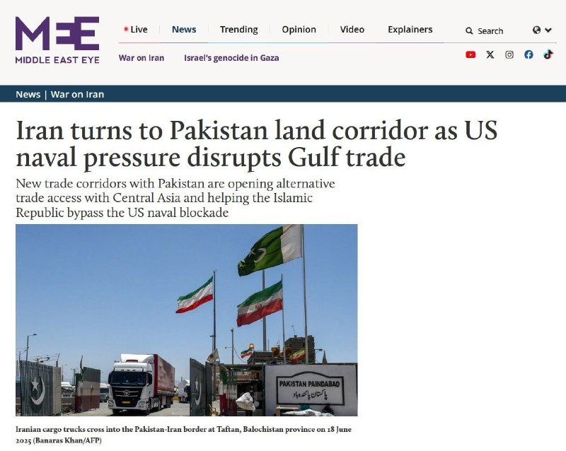

🔹فارس: پاکستان شش گذرگاه با ایران باز کرده است تا تحریم‌های آمریکا را دور بزند، بیش از ۳۰۰۰ کانتینر به مقصد ایران از طریق زمینی عبور می‌کنند.. *OPT* @OfficialPersiaTwiter

## OfficialPersiaTwiter — post 498641

هشدار نارنجی باد شدید و گردوغبار

🔹بر اساس پیش‌بینی سازمان هواشناسی وزش باد شدید در روزهای شنبه و یکشنبه منجر به نفوذ گردوخاک و غبارآلودگی هوا در بیشتر مناطق کشور خواهد شد‌.

🔹روز شنبه در کرمانشاه، کردستان، ایلام، لرستان، همدان، مرکزی، جنوب زنجان، قزوین، البرز، تهران، قم، اصفهان، چهارمحال و بختیاری، کهگیلویه و بویراحمد، شمال فارس، شمال سیستان و بلوچستان وزش باد و غبارآلودگی هوا دور از انتظار نیست.

🔹در روز یکشنبه هم فارس، جنوب اصفهان، یزد، کرمان و سمنان متاثر از این پدیده خواهند بود.

》OPT《

@OfficialPersiaTwiter

## OfficialPersiaTwiter — post 498640

نورالدین الدغیر خبرنگار الجزیره در تهران: پاسخ آمریکا به پیشنهاد ایران به تهران رسید به گفته یک منبع آگاه، · واشنگتن پیشنهاد ایران را رد کرده است و به نظر می‌رسد که این عدم پذیرش، مربوط به پنج نکته‌ای باشد که ایران پیش از ورود به مذاکرات هسته‌ای بر آنها…

## OfficialPersiaTwiter — post 498639

بلومبرگ: امارات متحده عربی تلاش کرد عربستان سعودی، قطر و دیگر همسایگان خلیجی را به پیوستن به یک واکنش نظامی هماهنگ علیه ایران ترغیب کند، اما رد شد. شیخ محمد بن زاید شخصاً با محمد بن سلمان و دیگر رهبران تماس گرفت. هیچ‌کدام موافقت به مشارکت نکردند. در نهایت…

## OfficialPersiaTwiter — post 498638

  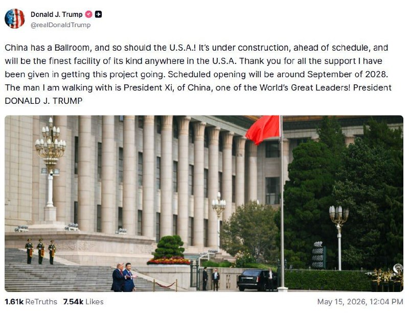

ترامپ:
چین یک سالن رقص دارد، و آمریکا هم باید داشته باشد!

این سالن در حال ساخت است، جلوتر از برنامه زمان‌بندی، و بهترین مرکز از نوع خود در سراسر آمریکا خواهد بود. از تمام حمایت‌هایی که برای پیشبرد این پروژه دریافت کرده‌ام، سپاسگزارم. افتتاح برنامه‌ریزی شده حدود سپتامبر ۲۰۲۸ خواهد بود.

مردی که با او قدم می‌زنم، رئیس‌جمهور شی، از چین، یکی از رهبران بزرگ جهان است!

》OPT《

@OfficialPersiaTwiter

## OfficialPersiaTwiter — post 498637

تتلو خارج از فهرست عفو؛ جزئیاتی جدید از پرونده امیرحسین مقصودلو 🔹مجید نقشی، وکیل مدافع امیرحسین مقصودلو (تتلو)، با انتشار متنی در صفحه شخصی خود، ، اعلام کرد که پیگیری نهایی مسئله عفو موکلش همچنان ادامه دارد. 🔹وی توضیح داد: نام تتلو در مناسبت‌های پیشین عفو،…

## OfficialPersiaTwiter — post 498636

پایان سفر ترامپ به چین 🔹دونالد ترامپ، رئیس جمهور ایالات متحده آمریکا، پکن را ترک کرد و سفر خود به جمهوری خلق چین را به پایان رساند. 🔹شی جین‌پینگ، رئیس‌جمهور چین در آخرین روز سفر رئیس جمهور ایالات متحده گفت که دونالد ترامپ به دنبال «بازگرداندن عظمت آمریکا»…

## OfficialPersiaTwiter — post 498635

پایان دور نخست مذاکرات لبنان و اسرائیل در واشنگتن 🔹 منابع خبری اعلام کردند که دور نخست گفت و گوهای فشرده میان هیأت های لبنانی و اسرائیلی در واشنگتن پایان یافت. 🔹 شبکه المیادین گزارش داد که این مرحله پس از ۸ ساعت رایزنی مستمر به پایان رسیده است. این گفت و…

## OfficialPersiaTwiter — post 498633

اعلام سقف ارزی جدید برای واردات برنج و نهاده‌های روغنی

وزارت جهاد کشاورزی:
🔺️ قیمت‌های جدید اعلامی در سامانه مربوطه ثبت شده است.

🔺مهلت اصلاح قیمت ثبت‌سفارش این کالاها نیز از یک ماه به دو ماه افزایش یافت.

🔺 ملاک بررسی ارزش ثبت‌سفارش واردات برای مباشرین و شرکت‌های دولتی، تاریخ صدور کد مجوز موردی خواهد بود.

🔺هدف از این تصمیم، تسهیل تأمین کالاهای اساسی و هماهنگی با نوسانات قیمت جهانی عنوان شده است.

》OPT《

@OfficialPersiaTwiter

## OfficialPersiaTwiter — post 498632

یکی از دوستای ما یه بار شوهرش خیلی اذیتش کرد تو جمع و هی تخریبش کرد این دختره هم عصبانی شد و یهو گفت خفه شو باقررررر،بعد ۱۰ سال فهمیدیم اسم آقا رامتین نیست و باقر بوده :))))

》زن《

@OfficialPersiaTwiter

## OfficialPersiaTwiter — post 498631

واکنش ترامپ به سوال خبرنگار درباره حمله به مدرسه میناب: رسانه شما جعلی است 🔹خبرنگار: دیروز از دریاسالار کوپر درباره حمله به مدرسه دخترانه در اولین روز جنگ سوال شد. 🔹ترامپ: شما درباره مورد اصلی صحبت می‌کنید — که در حال بررسی است. 🔹خبرنگار: آیا می‌توانید…

## OfficialPersiaTwiter — post 498630

  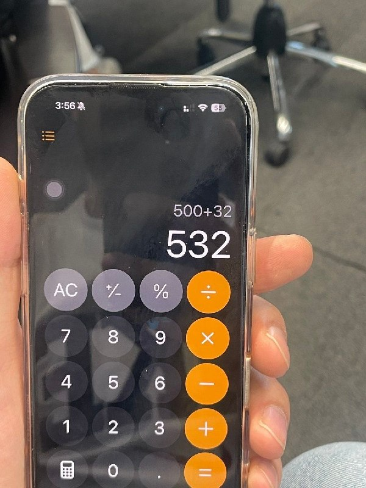

گوشی همکارم:

》میگ میگ《

@OfficialPersiaTwiter

## OfficialPersiaTwiter — post 498629

مرتس و ترامپ درباره ایران، هرمز و اوکراین رایزنی کردند

دولت آلمان اعلام کرد فریدریش مرتس صدراعظم آلمان، و دونالد ترامپ درباره وضعیت ایران، جنگ اوکراین و نشست آینده ناتو در آنکارا گفت وگو کرده‌اند.

طبق گزارش رسمی برلین، مرتس مدعی شد ایران نباید به سلاح هسته‌ای برسد و باید برنامه موشکی خود را متوقف کند. همچنین تنگه هرمز به طور کامل برای تمام کشتی‌ها باز شود.

》OPT《

@OfficialPersiaTwiter

## OfficialPersiaTwiter — post 498628

  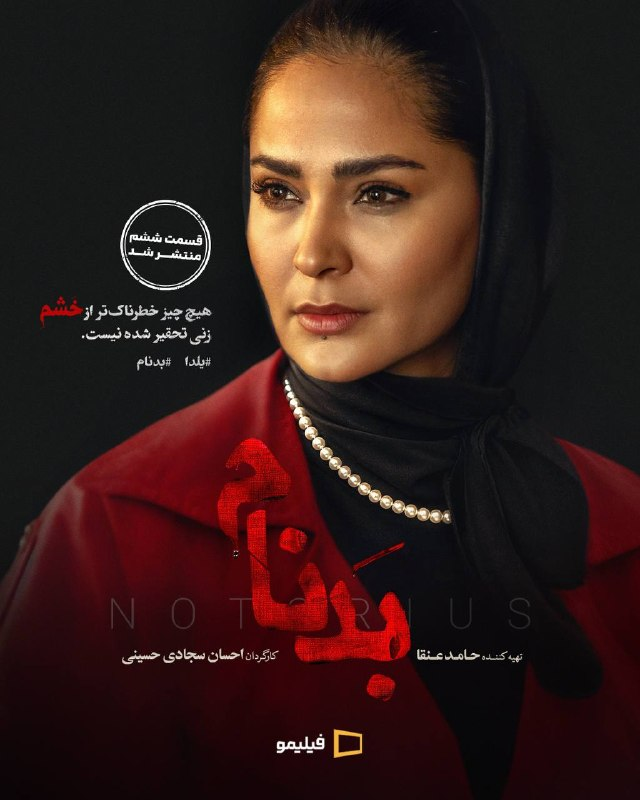

«من اون دوست دارمی رو می‌شنوم که چشات می‌گه!»

قسمت ششم درام عاشقانه‌ی #بدنام، همین‌ حالا، به‌صورت اختصاصی در #فیلیمو

با حضور حسن پورشیرازی، امیر آقایی، سینا مهراد، ستایش رجایی نیا، سولماز غنی، سید مهرداد ضیایی و لعیا زنگنه

کارگردان: احسان سجادی حسینی
طراح، نویسنده و تهیه‌کننده: حامد عنقا

📽 r.filimo.com/Tbadnam6

@filimo

## bbcpersian — post 281141

🔻مرتس: در گفتگو با ترامپ بر بازگشت ایران به مذاکره و جلوگیری از دستیابی به سلاح هسته‌ای تأکید کردیم

فریدریش مرتس، صدراعظم آلمان روز جمعه گفت «پس از سفر دونالد ترامپ به چین، گفت‌وگوی تلفنی خوبی با او داشته است و دو طرف بر این موضوع توافق کرده‌اند که ایران باید به میز مذاکره بازگردد، تنگه هرمز را باز کند و اجازه نداشته باشد به سلاح هسته‌ای دست یابد.»

آقای مرتس در پستی در شبکه اجتماعی ایکس گفت که او و دونالد ترامپ همچنین درباره راه‌حل صلح‌آمیز برای اوکراین گفت‌وگو کرده و مواضع خود را پیش از نشست ناتو در آنکارا هماهنگ کرده‌اند.

او افزود که «ایالات متحده و آلمان شرکای قوی در یک ناتوی قدرتمند هستند.»

https://bbc.in/3RIul9G
@BBCPersian

## bbcpersian — post 281140

🔻ثبت ۲۵۰ هزار شکایت در ایران علیه «جنایات جنگی آمریکا و اسرائیل»

مقام‌های قضایی ایران گفته‌اند حدود ۲۵۰ هزار شکایت حقوقی و کیفری درباره «جنایات جنگی آمریکا و اسرائیل» در دادگاه‌های ایران ثبت شده و در دست بررسی است.

عبدالصمد میرحسینی، معاون قضایی دادستان کل به میزان، خبرگزاری قوه قضائیه ایران گفته است که این پرونده‌ها در«شعب ویزه دادسرا و دادگاه» بررسی می‌شوند و روند «مستندسازی» آنها با همکاری نهادهای مختلف ادامه دارد.

او همچنین از شکایت ایران علیه ایالات متحده آمریکا در «دیوان داوری لاهه» در هلند بر اساس مفاد بیانیه‌های الجزایر خبر داد و گفت که تهران امیدوار است احکام احتمالی بتواند به «توقیف اموال» و دریافت غرامت منجر شود.

در سال‌های گذشته مقامات جمهوری اسلامی ایران بارها ایالات متحده آمریکا و اسرائیل را به دست داشتن در حملات، تحریم‌ها و اقداماتی متهم کرده‌اند که به گفته آنها سبب خسارت جانی و مالی به شهروندان ایرانی شده است.

آقای میرحسینی در این گفت‌وگو به جزئیات دقیق این پرونده‌ها اشاره نکرده است.

ایران پیش از این هم در برخی پرونده‌ها از جمله اختلافات ناشی از تحریم‌های آمریکا، دعاوی حقوقی را در مراجع بین‌المللی دنبال کرده است.

https://bbc.in/3RIul9G
@BBCPersian

## bbcpersian — post 281139

  <a href="telegram/content/bbcpersian_281139_1778855810.mp4" target="_blank">🎬 Download video</a>

🔻سرخط خبرهای جمعه ۲۵ اردیبهشت
@BBCPersian

## bbcpersian — post 281138

  

🔻وزیر خارجه جمهوری اسلامی می‌گوید که ایران پیام‌هایی از واشنگتن دریافت کرده است که نشان‌ می‌دهد آمریکا مایل به ادامه مذاکرات با ایران است.

عباس عراقچی که در کنفرانس خبری در حاشیه اجلاس بریکس در دهلی نو صحبت می‌کرد، گفت گزارش‌ها مبنی بر اینکه آمریکا پاسخ ایران را رد کرده است «مربوط به چند روز پیش بوده که ترامپ توییت زد و نوشت که 'غیرقابل قبول' است، اما بعد از آن مجددا پیام‌هایی را از طرف آمریکایی‌ها گرفتیم که مایل به گفت‌وگو و تعامل هستند.»

با این حال آقای عراقچی در مورد جدی بودن آمریکا ابراز تردید کرد: «در مورد جدیت آمریکایی‌ها در مذاکرات تردید داریم؛ اما به محض اینکه احساس کنیم و اطمینان حاصل کنیم آنها جدی هستند و آماده یک توافق عادلانه هستند ما به مذاکرات برمی‌گردیم.»

📷 EPA
https://bbc.in/3PKqg4i
@BBCPersian

## bbcpersian — post 281136

🔻کره جنوبی بقایای یک کشتی آسیب‌دیده در تنگه هرمز را برای بررسی به کشور بازگرداند

وزارت خارجه کره جنوبی روز جمعه اعلام کرد بقایای یک کشتی باری آسیب‌دیده در اثر آتش‌سوزی را به این کشور منتقل کرده است. این کشتی در تنگه هرمز هدف حمله هواپیماهای ناشناس قرار گرفته بود.

از زمان آغاز جنگ آمریکا و اسرائیل با ایران، این کشور تا حد زیادی عبور کشتی‌ها از تنگه هرمز را محدود کرده است.

به گفته مقام‌های سئول، کشتی باری «اچ‌ام‌ام نامو» در چهارم مه (۱۴ اردیبهشت) هدف «دو هواپیمای ناشناس» قرار گرفت. این حمله باعث آسیب رسیدن به کشتی و آتش‌سوزی در موتورخانه شد.

این کشتی با پرچم پاناما و تحت مدیریت شرکت کشتیرانی کره‌ای «اچ‌ام‌ام» هفته گذشته برای بررسی به دوبی منتقل شده بود.

وزارت خارجه کره جنوبی اعلام کرد بقایای این کشتی پس از هماهنگی با دولت امارات متحده عربی، روز جمعه از طریق هوایی به کره جنوبی منتقل شده است.

به گفته این وزارتخانه، قرار است یک نهاد تخصصی، بقایای کشتی را تحلیل دقیق و بررسی کند.

سئول همچنین اعلام کرد هواپیماهای دخیل در این حمله در تصاویر دوربین‌های مداربسته ثبت شده‌اند، اما شناسایی دقیق نوع، محل پرتاب و ابعاد آن‌ها امکان‌پذیر نیست.

یک مقام ارشد دولت کره جنوبی این هفته به رسانه‌های محلی گفته بود که «احتمال این که عامل این حمله کشوری غیر از ایران باشد، پایین است.»

تهران مسئولیت این حمله را رد کرده و سفارت ایران در سئول هم در بیانیه‌ای اعلام کرده است که «هرگونه ادعا درباره دخالت نیروهای ایرانی را قاطعانه رد می‌کند.»

کره جنوبی این حمله را به‌شدت محکوم کرده و گفته است امیدوار است از طریق تحقیقات کامل، عاملان آن شناسایی شوند.

کره جنوبی، چهارمین اقتصاد بزرگ آسیا، وابستگی زیادی به واردات سوخت از خاورمیانه دارد؛ وارداتی که در شرایط عادی عمدتاً از طریق تنگه هرمز انجام می‌شود.

بسته شدن این آبراه، کره جنوبی را که یکی از تولیدکنندگان بزرگ پتروشیمی و پالایش‌کنندگان نفت است، وادار کرده که نخستین بار در نزدیک به ۳۰ سال گذشته برای قیمت سوخت، سقف تعیین کند.

@BBCPersian

## bbcpersian — post 281134

🔻نارندرا مودی، نخست‌وزیر هند در دیدار با محمد بن زاید آل نهیان،‌ رئیس امارات، ضمن قدرانی از او برای حمایت از جامعه هندی‌های مقیم امارات،‌ حملات به این کشور را «به‌شدت» محکوم کرد. آقای مودی روز جمعه ۲۵ اردیبهشت پیش از آغاز مجموعه سفرش به کشورهای اروپایی هلند،…

## bbcpersian — post 281133

  

🔻نارندرا مودی، نخست‌وزیر هند در دیدار با محمد بن زاید آل نهیان،‌ رئیس امارات، ضمن قدرانی از او برای حمایت از جامعه هندی‌های مقیم امارات،‌ حملات به این کشور را «به‌شدت» محکوم کرد.

آقای مودی روز جمعه ۲۵ اردیبهشت پیش از آغاز مجموعه سفرش به کشورهای اروپایی هلند، سوئد،‌ نروژ و ایتالیا وارد ابوظبی شد. سفر او در سایه نگرانی‌ها درباره تنش‌ در خلیج فارس و مساله تامین انرژی انجام می‌شود.

دفتر آقای مودی در شبکه ایکس اعلام کرد که در این سفر «توافق‌نامه‌های مهم در زمینه انرژی، دفاع، زیرساخت‌ها، کشتیرانی و فناوری پیشرفته امضا شده است.»

هند همچنین می‌گوید که ابوظبی متعهد شده است که ۵ میلیارد دلار در هند سرمایه‌گذاری کند، هرچند جزئیات بیشتری ارائه نشده است.

آقای مودی در ویدئویی که وزارت خارجه هند منتشر کرد، گفت: «حفظ آزادی، باز بودن و امنیت تنگه هرمز بالاترین اولویت ماست و در این زمینه، پایبندی به قوانین بین‌المللی ضروری است.»

رئیس امارات شخصا از نخست وزیر هند استقبال کرد. اقدامی که حاکی از روابط دوستانه و عمیق میان دو کشور ارزیابی شده است.

📷 UAE Presidential Court / Reuters
https://bbc.in/4uVxpxP
@BBCPersian

## bbcpersian — post 281132

  

شرکت صاحب آپارات، سکوی نمایش محتوای آنلاین در ایران می‌گوید که در پی شکایت صداوسیما به دادگاه، بابت «نشر، پخش و عرضه اثر فرهنگی بدون اجازه» به پرداخت سه هزار و ۶۰۰ میلیارد تومان جریمه محکوم شده است.

در بیانیه‌ای که همراه با تصویر رای دادگاه در وبسایت آپارات منتشر شده آمده است که «مدیرعامل و شرکت فناوران ایده‌پرداز صبا به پرداخت حدود ۳/۶ همت خسارت بابت انتشار محتوایی که توسط کاربران بر بستر این پلتفرم بارگذاری شده محکوم شده و دادگاه، مسئولیت این محتوا را متوجه پلتفرم دانسته است.»

آپارات که پلتفرمی بومی و شبیه یوتوب در ایران است، چند سال پس از فیلتر شدن یوتیوب و سکوهای مشابه بارگذاری و تماشای ویدیو، در سال ۱۳۸۹ در ایران راه‌اندازی و با رشد چشمگیر کاربران ایرانی مواجه شد.

آپارات می‌گوید که پیشتر در شکایتی مشابه از سوی این سازمان، از دیوان عالی کشور رای برائت گرفته بود.

در رای دادگاه کیفری کارکنان دولت آمده است که این پلتفرم در خصوص نمایش ۷۵۵ اثر تلویزیونی بدون اجازه و منتفع شدن از درآمدهای تبلیغات ترافیک وبسایت میزبان، حق انحصاری پخش این آثار را نقض کرده است.

این حکم قابل تجدیدنظرخواهی است.
@bbcpersian

## Lichargoo — post 24882

  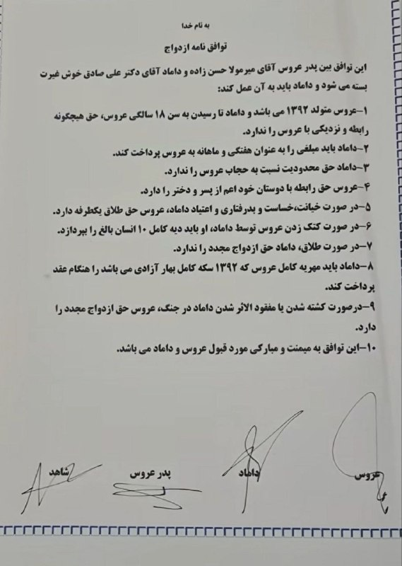

عجیب ترین توافق نامه ازدواج که توی دوران جنگ رقم خورد:

@Lichargoo

## Pesari_Ke_Konie — post 44940

خدایی دیگه این راهو کسی نرفته.

‏[گلیشفته تو راه هتل مکرون]

@Pesari_Ke_Konie

## Tans_Footbali — post 236315

  <a href="telegram/content/Tans_Footbali_236315_1778855817.mp4" target="_blank">🎬 Download video</a>

ترامپ :

ما درباره ایران صحبت کردیم. احساس ما نسبت به ایران بسیار مشابه است. ما می‌خواهیم این موضوع پایان یابد. نمی‌خواهیم آنها سلاح هسته‌ای داشته باشند. می‌خواهیم تنگه‌ها باز باشند.

ما اکنون آن را می‌بندیم. آنها آن را بستند و ما روی آن بستیم. اما می‌خواهیم تنگه‌ها باز باشند.

می‌خواهیم این موضوع پایان یابد چون چیز دیوانه‌کننده‌ای است. آنها کمی دیوانه هستند و این خوب نیست.

آنها نمی‌توانند سلاح هسته‌ای داشته باشند.

💛@Tans_Footbali

## Tans_Footbali — post 236314

  <a href="telegram/content/Tans_Footbali_236314_1778855820.webm" target="_blank">🎬 Download video</a>

⚽ استون ویلا 
🏴 - 
🏴 لیورپول

🏆 لیگ برتر انگلیس 
🏴

🕔 جمعه ساعت ۲۲:۳۰
🏟 ورزشگاه ویلا پارک

🎲 با بیش از ۵۵۰ نوع آپشن پیش‌بینی

👆 ضرایب شگفت‌انگیز

🚨نکاتی در مورد بازی‌های رودررو:
در پنج تقابل اخیر دو تیم، لیورپول موفق به کسب پیروزی در سه دیدار شده‌ است و دو بازی با نتیجه مساوی به پایان رسیده است.

📝 حقایق داور:
🟨 میانگین کارت زرد : ۳.۶۸ کارت در هر بازی
🟥 میانگین کارت قرمز : ۰.۱۲ کارت در هر بازی

🧠 قبل از ورود، بدترین سناریو را مرور کنید.

E

👍 ورود به سایت با فیلترشکن

کلیک کنید BetForward.com
کلیک کنید BetForward.com

💻 @BetForward

## Tans_Footbali — post 236313

  <a href="telegram/content/Tans_Footbali_236313_1778855821.mp4" target="_blank">🎬 Download video</a>

ترامپ :

امیدوارم ایران در حال تماشا باشد. ما دقیقاً می‌دانیم چه چیزی را به نمایش گذاشته‌اند.

می‌دانید، آنها کمی استراحت داشتند، بنابراین سعی می‌کنند چند چیز را جمع کنند. آنها چند موشک را از زیر زمین برداشته‌اند. همه آن‌ها در یک روز از بین خواهد رفت.

هر کاری که در چهار هفته گذشته انجام داده‌اند، در یک روز از بین خواهد رفت.

💛@Tans_Footbali

## Tans_Footbali — post 236312

  <a href="telegram/content/Tans_Footbali_236312_1778855823.mp4" target="_blank">🎬 Download video</a>

صحبت دقیق ترامپ دربارهٔ تعلیق بیست‌ساله:

خبرنگار: می‌دانم درباره سفر به چین سؤال‌های زیادی خواهد بود، اما اول درباره ایران؛ آیا آخرین پیشنهاد ایران را رد کرده‌اید یا وضعیتش چیست؟

ترامپ: خب، من نگاهش کردم، و اگر جمله اولش را دوست نداشته باشم، همان‌جا دورش می‌اندازم.

خبرنگار: جمله اول چه بود؟

ترامپ: یک جمله غیرقابل‌قبول؛ چون آن‌ها کاملاً موافقت کرده‌اند که هیچ برنامه هسته‌ای نداشته باشند، و اگر هر نوع فعالیت هسته‌ای، به هر شکلی، داشته باشند، من بقیه نامه را نمی‌خوانم.

خبرنگار: پس ۲۰ سال برای شما کافی نیست؟ باید دائمی باشد...

ترامپ: نه، ۲۰ سال کافی است، اما سطح تضمینی که از طرف آن‌ها می‌آید… یعنی باید یک ۲۰ سال واقعی باشد، نه یک ۲۰ سال قلابی که فقط روی کاغذ ارائه کنند.

@Tans_Footbali

## hamclasixii — post 75379

یه خواستگار پر و پا قرص دارم.
دیروز ابراز علاقه کرد و درخواست ازدواجش رو مطرح کرد. حالا درسته پنج سالشه ولی تو تصمیمش خیلی جدیه!

📚 @hamclasix 📚

## withyashar — post 11292

وزیر نیروهای مسلح فرانسه: ناو هواپیمابر «شارل دوگل» در دریای عرب مستقر شده و ماموریت آن «دفاعی» است.
@withyashar

## withyashar — post 11291

  <a href="telegram/content/withyashar_11291_1778855826.mp4" target="_blank">🎬 Download video</a>

خبرنگار: دیروز از دریادار کوپر درباره حمله به مدرسه دخترانه(میناب)در روز اول جنگ سؤال شد.
ترامپ: منظورتون همون حمله اولیه‌ست؟ اون موضوع هنوز تحت تحقیق قرار داره.
خبرنگار: می‌تونید تأیید کنید که موشک آمریکایی بوده؟
ترامپ: شما از کدوم رسانه‌ای هستید؟
خبرنگار: بی‌بی‌سی.
ترامپ: بی‌بی‌سی فیکه با من حرف نزن.
@withyashar

---
📅 بروزرسانی: 1405/02/25 15:39
---

## persian_trend_official — post 14189

ترامپ مدعی شد: رئیس جمهور چین به من اطمینان داد که با داشتن سلاح هسته‌ای توسط ایران مخالف است. 🔹من از رئیس جمهور چین چیزی در رابطه با ایران نخواستم. 🔹من از رئیس جمهور چین نخواستم که به ایران برای باز کردن تنگه هرمز فشار بیاورد. 🔹ظرف چند روز آینده در مورد…

## persian_trend_official — post 14188

  <a href="telegram/content/persian_trend_official_14188_1778846960.webm" target="_blank">🎬 Download video</a>

🔴ترامپ: «من دیگر خیلی بیشتر از این صبر نخواهم کرد. آنها باید توافق را امضا کنند.» 💢آخرین چیزی که الان به آن نیاز داریم جنگ است، ایران میتواند اورانیوم غنی شده خود را به چین یا آمریکا تحویل دهد 🫆:Tony 📌 @persian_trend_official پرشین ترند | متفاوت‌ترین کانال…

## persian_trend_official — post 14187

🔴ترامپ اشاره کرد که می‌تواند توقف ۲۰ ساله فعالیت‌های هسته‌ای ایران را بپذیرد: ۲۰ سال کافی است. اما سطح تضمین از طرف آنها... باید واقعاً ۲۰ سال باشد. 🫆:Tony 📌 @persian_trend_official پرشین ترند | متفاوت‌ترین کانال نظامی

## persian_trend_official — post 14186

  <a href="telegram/content/persian_trend_official_14186_1778846961.mp4" target="_blank">🎬 Download video</a>

🔴ترامپ اشاره کرد که می‌تواند توقف ۲۰ ساله فعالیت‌های هسته‌ای ایران را بپذیرد:

۲۰ سال کافی است. اما سطح تضمین از طرف آنها... باید واقعاً ۲۰ سال باشد.

🫆:Tony

📌 @persian_trend_official
پرشین ترند | متفاوت‌ترین کانال نظامی

## persian_trend_official — post 14184

  <a href="telegram/content/persian_trend_official_14184_1778846962.mp4" target="_blank">🎬 Download video</a>

💢عراقچی: خبر رد پیشنهاد جمهوری اسلامی توسط آمریکا برای چند روز پیش هست/ پیام‌های از آمریکا گرفتیم که مایل به ادامه گفتگو و تعامل هستند

🔹وزیر امورخارجه در نشست خبری:

💢اینکه مطرح شده آمریکا پیشنهاد یا پاسخ ایران را رد کرده مربوط به چند روز پیش هست که آقای ترامپ توییت زد و گفت که غیر قابل قبول هست و ولی بعد از ما مجدد پیام‌هایی را از طرف آمریکایی‌ها گرفتیم که مایل به ادامه گفتگوها و ادامه تعامل هستند.

💢اینکه امروز چطوری دوباره این موضوع در رسانه‌ها برجسته شده، من اطلاع ندارم ولی قضیه مربوط به چند روز پیش هست.

🫆:Tony

📌 @persian_trend_official
پرشین ترند | متفاوت‌ترین کانال نظامی

## OfficialPersiaTwiter — post 498623

فرود اضطراری هواپیمایی سوخت‌رسان آمریکا در فرودگاه بن گوریون

رسانه‌های عبری:
🔹️یک فروند هواپیمای سوخت‌رسانی نیروی هوایی ایالات متحده که از فرودگاه بن گوریون در تل‌آویو برخاسته بود، در پرواز برگشت خود به این فرودگاه، در حال گشت‌زنی‌های متعدد بر فراز شمال اردن مشاهده شد.

🔹️این هواپیما کد اضطراری (۷۷۰۰) را صادر کرد و پس از اعلام وضعیت اضطراری، در باند ۲۶ فرود آمد.

》OPT《

@OfficialPersiaTwiter

## OfficialPersiaTwiter — post 498622

  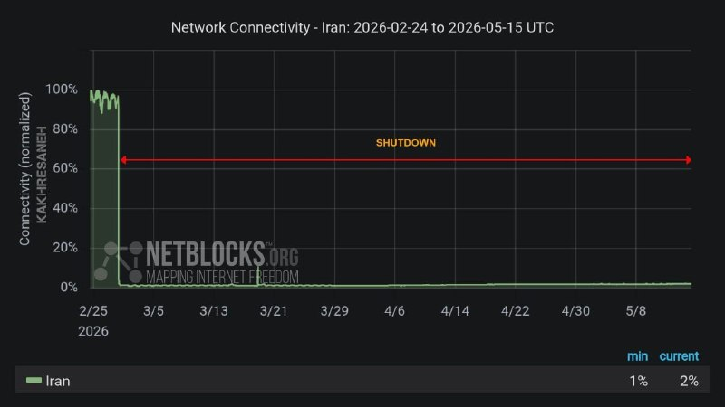

نت‌بلاکس: قطعی اینترنت در ایران اکنون وارد روز ۶۷ شده و از ۱۵۸۴ ساعت گذشته است. 》OPT《 @OfficialPersiaTwiter

## OfficialPersiaTwiter — post 498621

  <a href="telegram/content/OfficialPersiaTwiter_498621_1778846964.mp4" target="_blank">🎬 Download video</a>

ترامپ درباره دیکتاتور بودن شی: این را شما باید تشخیص دهید

خبرنگاری از دونالد ترامپ پرسید آیا شی جین پینگ را دیکتاتور میداند یا نه.

ترامپ پاسخ داد:«او حاکم چین است، رئیس جمهور چین است. من به این موضوع فکر نمیکنم. شما با چیزی که وجود دارد طرف میشوید. من به او احترام میگذارم، خیلی باهوش است و کشورش را دوست دارد.»

ترامپ در ادامه گفت: «اینکه او دیکتاتور هست یا نه، چیزی است که شما باید تشخیص دهید.»

》OPT《

@OfficialPersiaTwiter

## OfficialPersiaTwiter — post 498620

پریشب توی پارک که نشسته بودم، یک خانمی کنارم دست پسربچه‌اش رو گرفت و بهش گفت:«باید وقتی که دوستات می‌خوان برن، بهشون اجازه بدی برن. نباید گریه کنی یا شونه‌هات رو شل کنی. باید بری و دوست‌های جدید پیدا کنی.»

》پـرستو《

@OfficialPersiaTwiter

## OfficialPersiaTwiter — post 498619

  

پایان تحریم روسیه و بلاروس توسط اتحادیه جهانی کشتی

اتحادیه جهانی کشتی:
🔹️از این پس کشتی‌گیران روسیه و بلاروس می‌توانند بدون هیچ محدودیتی در مسابقات پیش‌روی این اتحادیه شرکت کنند.

🔹️این تصمیم فوراً اجرایی خواهد شد.

》OPT《

@OfficialPersiaTwiter

## OfficialPersiaTwiter — post 498618

واکنش لاوروف به درخواست واشنگتن از چین درباره تنگه هرمز/آمریکا آغازگر جنگ بود نه ایران

🔹وزیر خارجه روسیه در پاسخ به پرسشی درباره اظهارات وزیر امور خارجه آمریکا مبنی بر درخواست از چین برای اعمال فشار بر ایران در موضوع حل‌وفصل درگیری و تنگه هرمز گفت:‌ چین چه ربطی به این موضوع دارد؟ جنگ را آمریکایی‌ها آغاز کرده‌اند.

🔹سرگئی لاوروف در کنفرانس مطبوعاتی در جریان نشست وزیران خارجه عضو بریکس: تنگه هرمز بسته نبود؛ تا ۲۸ فوریه(نهم اسفند ۱۴۰۴) که آمریکا و اسرائیل برای دومین بار در ۶ ماه گذشته به جمهوری اسلامی ایران تجاوز کردند، این تنگه کاملاً برای کشتیرانی آزاد بود.

》OPT《

@OfficialPersiaTwiter

## OfficialPersiaTwiter — post 498617

جومونگ میدونه ترامپ با امپراطوری هان بسته؟ 》Simple Developer《 @OfficialPersiaTwiter

## OfficialPersiaTwiter — post 498616

ترامپ مدعی شد: رئیس جمهور چین به من اطمینان داد که با داشتن سلاح هسته‌ای توسط ایران مخالف است. 🔹من از رئیس جمهور چین چیزی در رابطه با ایران نخواستم. 🔹من از رئیس جمهور چین نخواستم که به ایران برای باز کردن تنگه هرمز فشار بیاورد. 🔹ظرف چند روز آینده در مورد…

## OfficialPersiaTwiter — post 498615

🔴ادعای ترامپ: «من دیگر خیلی بیشتر از این صبر نخواهم کرد. آنها باید توافق را امضا کنند.» آخرین چیزی که الان به آن نیاز داریم جنگ است، ایران میتواند اورانیوم غنی شده خود را به چین یا آمریکا تحویل دهد 》OPT《 @OfficialPersiaTwiter

## OfficialPersiaTwiter — post 498614

  <a href="telegram/content/OfficialPersiaTwiter_498614_1778846966.mp4" target="_blank">🎬 Download video</a>

امتحانات حضوری دبستان‌های استان تهران لغو شد مدیرکل آموزش‌وپرورش شهرستان‌های تهران: ارزشیابی نهایی حضوری برای دانش‌آموزان دبستانی منتفی است و نمره نهایی براساس عملکرد مستمر کلاسی توسط معلم و تأیید مدیر مدرسه اعلام می‌‎شود. 》OPT《 @OfficialPersiaTwiter

## OfficialPersiaTwiter — post 498613

عراقچی: احتمال بازگشت به یک جنگ تمام‌عیار وجود دارد ولی ما هم برای جنگ و هم مذاکره آماده‌ایم وزیر امورخارجه کشورمان در نشست خبری: 🔸ما برای هر دو سناریو آماده‌ایم یا به میدان مبارزه و جنگ برمی‌گردیم یا به میز مذاکره برمی‌گردیم و مذاکره می‌کنیم و راه دیپلماسی…

## OfficialPersiaTwiter — post 498612

  <a href="telegram/content/OfficialPersiaTwiter_498612_1778846968.mp4" target="_blank">🎬 Download video</a>

🔴ادعای ترامپ: مخالفتی ندارم که ایران برنامه هسته‌ای خود را به مدت ۲۰ سال متوقف کند، اما به شرط تعهدی واقعی. 》OPT《 @OfficialPersiaTwiter

## OfficialPersiaTwiter — post 498611

عراقچی: خبر رد پیشنهاد ایران توسط آمریکا برای چند روز پیش هست/ پیام‌هایی از آمریکا گرفتیم که مایل به ادامه گفتگو و تعامل هستند وزیر امورخارجه کشورمان در نشست خبری: 🔸اینکه مطرح شده آمریکا پیشنهاد یا پاسخ ایران را رد کرده مربوط به چند روز پیش هست که آقای ترامپ…

## OfficialPersiaTwiter — post 498610

  <a href="telegram/content/OfficialPersiaTwiter_498610_1778846969.mp4" target="_blank">🎬 Download video</a>

عراقچی: به محض اینکه مطمئن شویم آمریکایی‌ها جدی بوده و آماده یک توافق عادلانه هستند، ما به مذاکرات برمی‌گردیم وزیر امورخارجه کشورمان در نشست خبری: 🔸آمریکایی‌ها پیام‌های متناقضی می‌فرستند، ما نمی‌دانیم که دقیقا نیت آمریکایی ها چیست. 🔸در مورد جدییت آمریکایی‌ها…

## OfficialPersiaTwiter — post 498609

  <a href="telegram/content/OfficialPersiaTwiter_498609_1778846971.mp4" target="_blank">🎬 Download video</a>

عراقچی: موضوع اورانیوم غنی‌شده به بن‌بست رسیده و فعلا در دستور کار مذاکره قرار ندارد وزیر امورخارجه کشورمان در نشست خبری: 🔸موضوع اورانیوم غنی‌شده برای ما بسیار پیچیده است و به بن بست رسیده برای همین تصمیم گرفتیم آن را به زمان دیگری موکول کنیم و در مراحل بعدی…

## OfficialPersiaTwiter — post 498608

  <a href="telegram/content/OfficialPersiaTwiter_498608_1778846972.mp4" target="_blank">🎬 Download video</a>

عراقچی: تنگه هرمز باز است/ به جز کشتی‌های متعلق به متجاوزین، همه کشتی‌ها می‌توانند از تنگه عبور کنند وزیر امورخارجه کشورمان در نشست خبری: 🔸ما یک برنامه صلح آمیز هسته‌ای داریم و همیشه آماده بودیم تا اطمینان حاصل کنیم که این برنامه صلح آمیز هست و صلح آمیز باقی…

## OfficialPersiaTwiter — post 498607

  <a href="telegram/content/OfficialPersiaTwiter_498607_1778846973.mp4" target="_blank">🎬 Download video</a>

عراقچی: چیزهایی که آمریکایی‌ها نتوانستند از طریق نظامی به دست بیاورند در میز مذاکره هم نمی‌توانند/ فقط مذاکره و میز دیپلماسی یک راه‌حل برد-برد است 🔸  مذاکرات فعلی از کمبود اعتماد رنج می‌برد. 》OPT《 @OfficialPersiaTwiter

## OfficialPersiaTwiter — post 498606

  <a href="telegram/content/OfficialPersiaTwiter_498606_1778846975.mp4" target="_blank">🎬 Download video</a>

علی هاشم خبرنگار الجزیره؛ یک منبع آگاه ایرانی به من گفته است که تهران به طور رسمی پاسخ آمریکا را به پیشنهاد ایران دریافت کرده و واشنگتن تمام شرایط ایران را به طور کامل رد کرده است. تیم مذاکره کننده ایرانی شامل پنج شرط بود که پیش از ورود به مذاکرات درباره…

## bbcpersian — post 281131

  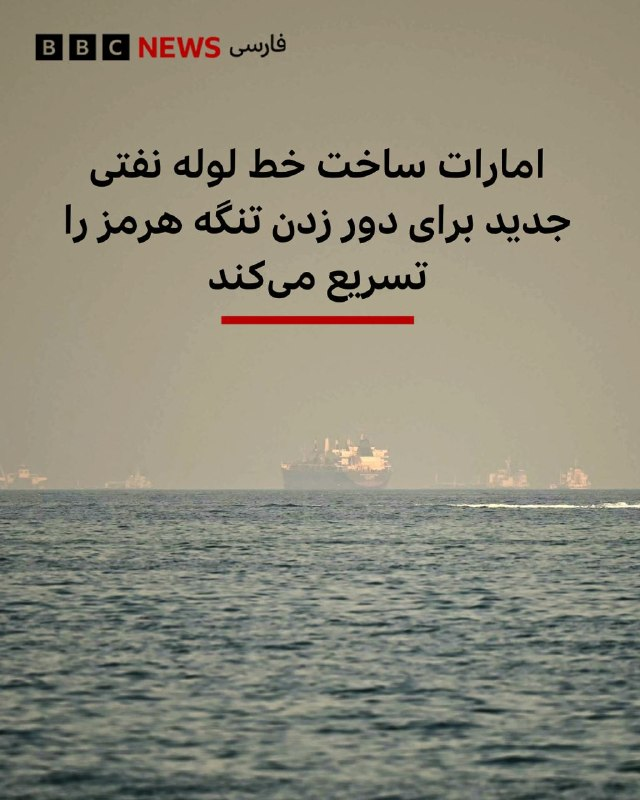

🔻امارات متحده عربی از تسریع ساخت خط‌ لوله‌ای خبر داده است که این کشور امیدوار است با اتکا به آن ظرفیت صادرات نفت خود از مسیر فجیره را تا سال ۲۰۲۷ دو برابر کند و وابستگی به تنگه هرمز را کاهش دهد.

دفتر رسانه‌ای دولت ابوظبی روز جمعه گزارش داد که شیخ خالد بن محمد بن زاید، ولیعهد این شیخ‌نشین، به شرکت ملی نفت امارات دستور داده است که پروژه خط لوله غرب به شرق با سرعت بیشتری اجرا شود. به گفته مقام‌های اماراتی، این پروژه هم‌اکنون در حال ساخت است.

امارات در حال حاضر از طریق خط لوله حبشان–فجیره، که ظرفیت انتقال روزانه تا ۱/۸ میلیون بشکه نفت خام را دارد، بخشی از صادرات نفت خود را بدون عبور از تنگه هرمز انجام می‌دهد. این خط لوله نقش مهمی در انتقال مستقیم نفت به سواحل دریای عمان ایفا کرده است.

در میان کشورهای حوزه خلیج فارس، تنها امارات متحده عربی و عربستان سعودی دارای خطوط لوله‌ای هستند که امکان صادرات نفت خام را خارج از مسیر تنگه هرمز فراهم می‌کند.

عمان هم به‌دلیل داشتن خط ساحلی طولانی در دریای عمان، دسترسی مستقیم‌تری به آب‌های آزاد دارد.

📸 Getty

https://bbc.in/3R12525
@BBCPersian

## bbcpersian — post 281130

🔻دیدار نخست‌وزیر هند و رئیس‌ امارات؛ مودی حملات به امارات را محکوم کرد

نارندرا مودی، نخست‌وزیر هند در دیدار با محمد بن زاید آل نهیان،‌ رئیس امارات، ضمن قدرانی از او برای حمایت از جامعه هندی‌های مقیم امارات،‌ حملات به این کشور را «به‌شدت» محکوم کرد.

آقای مودی روز جمعه ۲۵ اردیبهشت پیش از آغاز مجموعه سفرش به کشورهای اروپایی هلند، سوئد،‌ نروژ و ایتالیا وارد ابوظبی شد. سفر او در سایه نگرانی‌ها درباره تنش‌ در خلیج فارس و مساله تامین انرژی انجام می‌شود.

دفتر آقای مودی در شبکه ایکس اعلام کرد که در این سفر «توافق‌نامه‌های مهم در زمینه انرژی، دفاع، زیرساخت‌ها، کشتیرانی و فناوری پیشرفته امضا شده است.»

هند همچنین می‌گوید که ابوظبی متعهد شده است که ۵ میلیارد دلار در هند سرمایه‌گذاری کند، هرچند جزئیات بیشتری ارائه نشده است.

آقای مودی در ویدئویی که وزارت خارجه هند منتشر کرد، گفت: «حفظ آزادی، باز بودن و امنیت تنگه هرمز بالاترین اولویت ماست و در این زمینه، پایبندی به قوانین بین‌المللی ضروری است.»

رئیس امارات شخصا از نخست وزیر هند استقبال کرد. اقدامی که حاکی از روابط دوستانه و عمیق میان دو کشور ارزیابی شده است.

امارات متحده عربی در یک اقدام ویژه، با جنگنده‌های اف‌۱۶ هواپیمای حامل نارندرا مودی،‌ نخست‌وزیر هند را از بدو ورود به حریم هوایی امارات، اسکورت کرد.

آقای مودی در دیدار با محمد بن زاید آل نهیان،‌ رئیس امارات، گفت: «نحوه‌ای که نیروی هوایی شما امروز من را اسکورت کرد،‌ افتخاری برای مردم هند است.»

https://bbc.in/3R12525
@BBCPersian

## bbcpersian — post 281129

  

🔻وزیر خارجه ایران آمریکا را به ارسال پیام‌های‌ متناقض متهم کرده و جدیت واشنگتن را در مورد مذاکره زیر سوال برده است.

عباس عراقچی که در حاشیه نشست بریکس در دهلی نو صحبت می‌کرد، گفت: «آمریکایی‌ها پیام‌های متناقضی می‌فرستند، ما نمی‌دانیم که دقیقا نیت آمریکایی ها چیست.»

وزیر خارجه ایران افزود: «در مورد جدییت آمریکایی‌ها در مذاکرات تردید داریم؛ اما به محض اینکه احساس کنیم و اطمینان حاصل کنیم آنها جدی هستند و آماده یک توافق عادلانه هستند ما به مذاکرات برمی‌گردیم.»

آقای عراقچی همچنین آتش‌بس را «ناپایدار» توصیف کرد اما گفت که ایران سعی دارد آن را حفظ کند.

او در عین حال تاکید کرد که برای این مناقشه «هیچ راه‌ حل نظامی وجود ندارد.»

«ما در برابر هرگونه فشار و تحریم مقاومت می‌کنیم. کشور من بیش از چهل سال هدف تحریم‌های شدید آمریکا بوده اما این سیاست‌های ما را تغییر نداد.»

📷 EPA
https://bbc.in/4wwmkVm
@BBCPersian

## bbcpersian — post 281128

🔻پایان نشست وزرای خارجه بریکس بدون صدور بیانیه مشترک

نشست وزیران خارجه گروه بریکس بدون صدور بیانیه مشترک پایان یافت؛ موضوعی که نشان‌دهنده اختلافات عمیق میان اعضا بر سر جنگ ایران و بحران خاورمیانه است.

این نشست دو روزه در دهلی‌ نو برگزار شد و کشورهای عضو درباره موضوعاتی مانند امنیت دریایی،‌ حاکمیت کشورها، وضعیت تنگه هرمز و جنگ غزه گفت‌وگو کردند.

با این حال اختلاف دیدگاه‌ها به ویژه میان ایران و امارات متحده عربی،‌ مانع دستیابی به موضعی واحد شد.

ایران خواستار آن بود که بریکس اقدامات آمریکا و اسرائیل را محکوم کند.

عباس عراقچی، وزیر خارجه ایران، از کشورهای عضو خواست در برابر «سیاسی کردن نهادهای بین‌المللی» مقاومت کنند و موضعی قاطع‌تر بگیرند. اما برخی اعضا از جمله امارات متحده عربی با این رویکرد موافق نبودند.

در پایان، هند که ریاست دوره‌ای بریکس را برعهده دارد،‌ به جای بیانیه مشترک فقط «بیانیه رئیس نشست» را منتشر کرد،‌ اقدامی که معمولا زمانی انجام می‌شود که اعضا نتوانند بر سر متن نهایی به توافق برسند.

در بیانیه ریاست نشست که توسط وزارت خارجه هند منتشر شد، آمده است که «دیدگاه‌های متفاوتی در بین برخی از اعضا درباره وضعیت در منطقه غرب آسیا/ خاورمیانه» وجود دارد.

این اختلافات نشان می‌دهد که بریکس گسترش یافته، که اکنون شامل کشورهایی مانند ایران،‌ امارات،‌ مصر، اتیوپی و اندونزی هم هست،‌ در حفظ انسجام سیاسی با چالش روبرو شده است،‌ به ویژه زمانی که اعضای آن در بحران‌های منطقه‌ای در جبهه‌های متفاوت قرار دارند.

https://bbc.in/3R12525
@BBCPersian

## bbcpersian — post 281125

🔻روابط عمومی سپاه پاسداران استان لرستان از خنتی‌‌سازی یک بمب از زمان جنگ اسرائیل و آمریکا با ایران در شهرستان دلفان خبر داد. آلبوم را ورق بزنید و در این باره بیشتر بخوانید.

📷 Mehr New Agency / IRIB
https://bbc.in/4wOawOH
@BBCPersian

## bbcpersian — post 281124

🔻عراقچی: پیام‌های آمریکایی‌ها متناقض و نیت‌شان نامشخص است

وزیر خارجه ایران آمریکا را به ارسال پیام‌های‌ متناقض متهم کرده و جدیت واشنگتن را در مورد مذاکره زیر سوال برده است.

عباس عراقچی که در حاشیه نشست بریکس در دهلی نو صحبت می‌کرد، گفت: «آمریکایی‌ها پیام‌های متناقضی می‌فرستند، ما نمی‌دانیم که دقیقا نیت آمریکایی ها چیست.»

وزیر خارجه ایران افزود: «در مورد جدییت آمریکایی‌ها در مذاکرات تردید داریم؛ اما به محض اینکه احساس کنیم و اطمینان حاصل کنیم آنها جدی هستند و آماده یک توافق عادلانه هستند ما به مذاکرات برمی‌گردیم.»

آقای عراقچی همچنین آتش‌بس را «ناپایدار» توصیف کرد اما گفت که ایران سعی دارد آن را حفظ کند.

او در عین حال تاکید کرد که برای این مناقشه «هیچ راه‌ حل نظامی وجود ندارد.»

«ما در برابر هرگونه فشار و تحریم مقاومت می‌کنیم. کشور من بیش از چهل سال هدف تحریم‌های شدید آمریکا بوده اما این سیاست‌های ما را تغییر نداد.»

https://bbc.in/3R12525
@BBCPersian

## bbcpersian — post 281123

  <a href="telegram/content/bbcpersian_281123_1778846977.mp4" target="_blank">🎬 Download video</a>

🔻کل‌بی، شرکت بزرگ تولید تنقلات در ژاپن اعلام کرده که به‌دلیل اختلال در تامین مواد اولیه جوهر چاپ در پی جنگ ایران و توقف نفتکش‌ها در تنگه هرمز، بسته‌بندی‌ بعضی میان‌وعده‌‌هایش را به‌طور موقت سیاه‌وسفید کرده است.

بنابر اعلام این شرکت، ۱۴ محصول از جمله چیپس و میگوی ترد آن از ۲۵ مه در این بسته‌بندی‌های جدید در فروشگاه‌های ژاپن عرضه می‌شود.

چاپ سیاه‌وسفید در مقایسه با چاپ با جوهرهای رنگی ارزان‌تر تمام می‌شود، اما بعضی تحلیلگران معتقدند این اقدام ممکن است نوعی ترفند بازاریابی برای این شرکت ژاپنی، همزمان با بسته بودن تنگه هرمز باشد.

بسته بودن تنگه هرمز بر قیمت بسیاری مواد اولیه تاثیر گذاشته است. ایران در واکنش به حملات آمریکا و اسرائیل، عملا تنگه راهبردی هرمز را بسته و در نتیجه، حجم عظیمی از نفت پشت این تنگه متوقف شده است.

@BBCPersian

## Lichargoo — post 24881

تازگیا رزومه میفرستی انگار نامه میندازی‌ توو چاه جمکران

## networkti — post 356

⚠️ مراقب تبلیغاتی که بقیه توی کانال من میذارن باشید

تلگرام اجازه خاموش کردن تبلیغات رو نمیده و هر کسی با کمی پول میتونه توی کانال تبلیغ کنه

معمولا تبلیغات فیلترشکن کلاهبرداریه و باید مراقب باشید

📍 شکل تبلیغات اینجوریه که مثل یک پست هست ولی یکم رنگش فرق داره و کنارش نوشته Ad

## networkti — post 355

اخبار این روش شیر و خورشید و اسکنرش و بقیه چیزهاشو میتونید از کانال متین سنپای و چندتا کانال دیگه که توی کانفیگ‌ فیلترشکن دفید هم هستند چک کنید

من نمیرسم دیگه ای پی پیدا کنم واسش

## networkti — post 354

اینها مثل اینکه وصله واسه شیرو خورشید

## networkti — post 352

95.101.137.74 95.101.78.25 2.23.245.35 2.16.168.107 2.17.100.250 2.16.245.188 2.17.100.130 95.100.110.28 2.22.89.43 2.18.63.33 95.100.153.186 2.22.151.140 95.100.177.68 95.101.61.215 95.101.27.71 2.23.227.218 2.23.227.209 2.23.227.221 2.17.100.218 2.17.97.198 95.101.27.101 2.17.240.5 2.16.106.222 95.101.234.87 2.21.33.113 23.194.20.27 95.101.38.176 95.101.35.113 2.17.100.225 2.16.168.214 2.17.113.121 2.23.227.212 2.23.227.219 23.212.110.218 95.101.35.96 2.17.96.158 2.16.168.208 2.16.245.174 2.16.245.173 23.192.237.219 2.17.152.213 2.17.100.200 2.22.112.208 2.23.172.114 2.23.227.199 2.23.227.215 2.21.134.89 2.17.100.136 2.23.90.148 95.101.111.168 23.219.79.75 2.16.168.122 2.16.168.123 95.100.177.112 23.192.24.7 23.12.157.106 2.16.245.133 23.52.22.3 2.17.147.218 23.216.134.80 23.55.163.135 23.46.188.71 2.17.100.169 95.101.234.88 2.22.151.152 2.17.241.119 95.101.122.131 95.101.111.161 2.21.245.14 2.18.172.59 95.101.234.90 23.11.41.157 95.101.38.158

## networkti — post 351

104.88.70.105 92.123.10.153 96.16.248.152 104.83.197.160 96.16.248.133 96.16.249.54 96.16.248.162 173.222.249.155 184.87.193.138 96.6.34.243 96.17.96.7 96.16.248.137 104.110.191.32 184.51.97.129 104.116.98.32 184.87.193.139 184.84.221.34 96.16.248.139 96.16.249.52 88.221.0.39 96.16.249.28 96.16.248.142 96.17.72.48 104.117.76.106 104.109.128.163 96.17.72.51 96.17.72.75 104.109.250.11 104.115.39.202 96.16.249.38 184.85.134.164 104.76.210.6 104.117.76.16 104.117.76.8 184.84.81.125 23.66.101.71 96.16.248.177 92.123.10.217 184.85.155.41 88.221.0.52 173.222.146.221 184.51.102.248 96.17.72.80 96.17.72.58 173.222.249.146 104.115.39.104 96.17.72.57 173.222.249.153 173.222.108.57 96.17.72.10 23.67.142.129 173.222.108.49 88.221.0.58 96.16.248.182 104.110.191.39 104.110.191.41 96.16.248.159 96.16.248.156 96.16.248.153 104.110.191.14 88.221.0.38 88.221.0.44 104.108.86.50 96.7.105.201 96.16.248.166 173.222.249.160 96.16.248.183 88.221.0.56 184.51.102.88 96.16.249.23 88.221.0.50 104.68.103.205 96.16.248.170 104.116.96.159 96.16.249.20
88.221.0.36
96.17.180.45
96.16.249.11
96.16.248.181 104.83.197.135 173.222.108.120
23.64.59.9
92.122.16.5
104.120.56.96 104.117.76.147 92.123.10.232 184.86.103.159 104.117.76.137 104.117.76.145 104.117.76.139 104.117.76.114
104.69.81.4
104.117.76.104 104.117.76.99 104.117.76.179 104.117.76.153 104.120.90.56 104.117.76.90 104.117.76.91
96.6.33.250
104.117.76.67 104.117.76.72 104.117.76.64 104.117.76.57 104.117.76.58 104.117.76.19 184.86.103.20 184.86.103.12 184.86.103.23 184.86.103.14 184.86.103.19 173.223.109.20
96.17.96.31
104.76.220.65 173.222.148.49
184.51.96.7
104.76.220.42 184.51.149.33 104.108.238.182 104.80.48.203
92.122.17.9
92.123.8.93
104.76.210.216 104.76.220.112 23.64.224.224 173.222.168.212 173.222.168.191 92.123.8.87
92.123.10.140 184.51.102.58 184.51.102.177 104.76.220.170 104.76.220.168 92.122.6.109
173.223.29.67
92.123.8.100
23.65.117.219 173.222.148.43
23.75.23.33
184.86.103.223 184.86.103.217 184.86.103.196 23.67.129.53 184.86.103.139 184.86.103.142 104.108.237.97 184.86.103.13 104.112.135.94
23.64.59.26
92.122.9.160 104.120.80.245 173.223.239.52 92.122.1.249 173.222.116.88 96.16.249.50
96.16.249.3
96.16.249.60
96.16.248.151 96.16.248.145 96.16.248.148 96.16.248.176 96.16.248.136 96.16.248.154 96.16.248.143
92.123.8.77 104.124.165.104 96.16.249.12
96.16.248.155 96.16.248.179 96.16.248.171 96.16.248.147 96.16.248.144
23.65.124.89
96.16.249.9
23.65.124.88
96.16.249.16
96.16.249.6
96.16.248.174 96.16.248.167 96.16.248.164
92.123.8.99
92.123.8.94
23.65.124.104
92.123.8.74
23.65.124.91
23.65.124.106 23.65.124.105 104.108.231.170 23.66.101.79 184.85.137.131 104.120.82.77 104.120.77.233 23.64.12.168
104.120.89.53
104.120.76.148
23.44.201.206
23.221.28.5
23.220.163.205
23.209.46.33
23.10.34.11
23.39.185.35
23.32.152.106
23.218.232.181
23.206.188.212
2.21.2.89
23.208.222.120
23.48.203.248
23.44.201.136
23.44.201.151
23.44.201.149
2.21.2.58
23.3.90.48
23.44.201.41
2.19.204.184
23.218.232.188
23.44.201.12
23.212.253.227
23.201.31.155
23.220.163.203
23.44.201.185
23.52.116.66
23.44.201.17
23.62.54.24
23.218.239.132
23.39.149.69
23.52.40.147
23.58.95.144
2.16.244.58
23.212.253.137
2.17.106.176
23.62.54.137
2.17.106.5
23.203.134.233
23.212.253.232
23.206.188.197 
23.44.201.170
23.54.127.39
23.214.170.83 
23.52.40.89
23.55.176.73
23.202.229.140
23.215.56.61
2.17.106.166
23.222.126.108
184.25.85.224
23.1.241.123
23.3.90.43
184.26.13.91
23.54.210.170
2.22.151.154 2.22.151.155 2.22.151.156 2.22.151.157 2.22.151.158 2.22.151.159 2.22.151.161 2.22.151.162 2.22.151.163 2.22.151.164 2.22.151.168 2.22.151.169 2.22.151.170 2.22.151.171 2.22.151.173 2.22.151.175 2.22.151.179 2.22.151.181 2.22.151.182 2.22.151.183 2.22.151.184 2.22.151.185 2.22.151.186 2.22.151.188 2.22.151.189 2.22.151.190 2.22.151.191 2.22.151.193 2.22.151.194 2.22.151.195 2.19.204.87 2.19.204.137 2.19.204.144 2.19.204.145 2.19.204.170 2.19.204.184 2.19.204.185 2.19.204.202 2.19.204.210 2.17.147.11 2.18.64.9 2.18.64.4 2.18.64.5 2.22.114.98 95.100.153.184 95.101.27.196 2.17.96.131

## networkti — post 350

اگر شیر و خورشید وصل نمی‌شود، طبق راهنمای زیر عمل کنید. وارد بخش Options اپلیکیشن 
👑 شوید، گزینه‌ی More Options را انتخاب کنید و در قسمت CDN Edge IPs، آی‌پی زیر و در قسمت CDN SNI Hostname، نام دامنه زیر را وارد کرده و OK را بزنید. CDN Edge IPs: 151.101.192.223…

## Tans_Footbali — post 236311

🔴 زاکانی، شهردار تهران: ما قصد داشتیم قبل از جنگ بیت رهبری رو با معماری جدید بازسازی کنیم، اما آمریکا عملیات تخریب رو که بسیار هزینه‌بر هم بود برای ما رایگان انجام داد. @Tans_Footbali

## Tans_Footbali — post 236310

  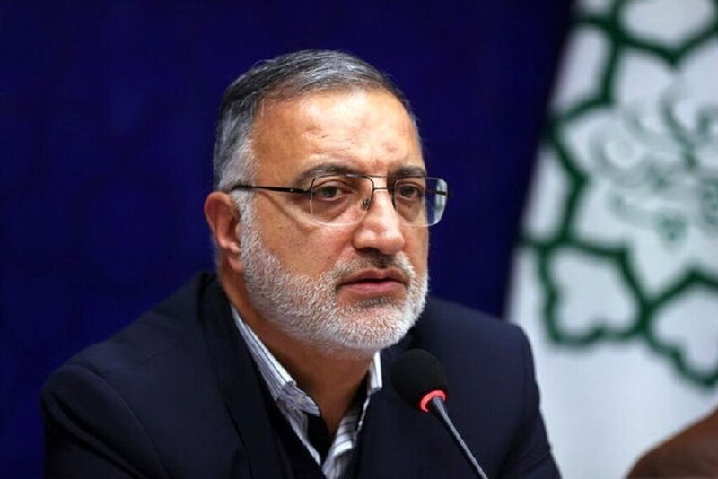

🔴 زاکانی، شهردار تهران: ما قصد داشتیم قبل از جنگ بیت رهبری رو با معماری جدید بازسازی کنیم، اما آمریکا عملیات تخریب رو که بسیار هزینه‌بر هم بود برای ما رایگان انجام داد.
@Tans_Footbali

## hamclasixii — post 75378

  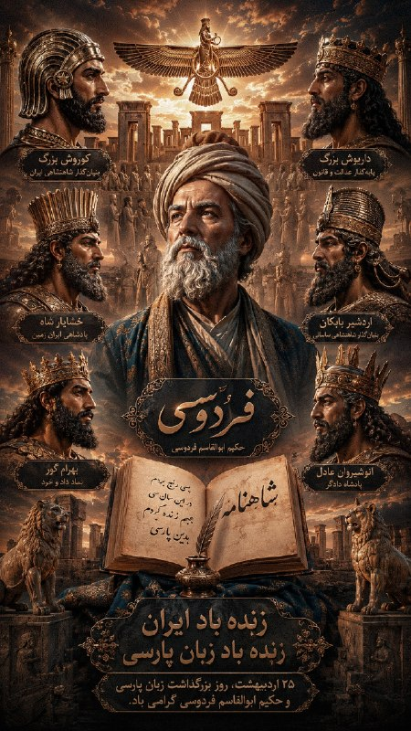

🔴امروز ۲۵ اردیبهشت، روز پاسداشت زبان فارسی و بزرگداشت حکیم ابوالقاسم فردوسیه.

📚 @hamclasix 📚

## withyashar — post 11290

  <a href="telegram/content/withyashar_11290_1778846979.mp4" target="_blank">🎬 Download video</a>

🥲 @withyashar

## withyashar — post 11289

  <a href="telegram/content/withyashar_11289_1778846980.mp4" target="_blank">🎬 Download video</a>

امروز 25 اردیبهشت روز پاسداشت زبان فارسی و بزرگداشت فردوسیه
@withyashar

## withyashar — post 11288

  <a href="telegram/content/withyashar_11288_1778846982.mp4" target="_blank">🎬 Download video</a>

روانه شدن نفت در سواحل جزایر خلیج فارس جمهموری اسلامی داره نفتو تو دریا میریزه و جان موجودات دریایی و زیست بوم ها رو به خطر انداخته
@withyashar

## withyashar — post 11287

  <a href="telegram/content/withyashar_11287_1778846983.mp4" target="_blank">🎬 Download video</a>

کارشناس صداسیما : نتانیاهو نه خسته شده نه عقب میخواد بکشه بنظرم واقعا مَرده واقعا مَرده و میخواد ایرانو
از 100 درصد به 20 درصد برسونه

همین الانم اماده ترین عنصر برای
حمله به ایران؛ اسرائیله
نتانیاهو نه کم آورده نه علائمی از خستگی داره نه پشیمانه
@withyashar

## withyashar — post 11286

ترامپ به فاکس‌نیوز: ما می‌توانستیم پل‌ها و شبکه‌های برق ایران را نابود کنیم و می‌توانیم ظرف دو روز همه چیز را در آنجا از بین ببریم.
@withyashar

## withyashar — post 11285

ترامپ به فاکس‌نیوز : ما ارتش ایران را نابود کرده‌ایم و شاید باید یک پاکسازی سبک انجام دهیم.
میتوانیم نیروگاه‌های ایران را تنها در دو روز از بین ببریم
اگر ایران اورانیوم های غنی شده خودش رو تحویل نده وارد ایران میشیم
@withyashar

## withyashar — post 11284

Voice message

## withyashar — post 11283

مارو به قاهره میبره؟
خب پس بذار هرچی میخواد بگه

## withyashar — post 11282

ترامپ به فاکس‌نیوز:
پیشنهاد ایرانیا که برام رسید همون‌ جمله ی اول متنشونو که خوندم برام قابل قبول نبود و سریع ردش کردم
@withyashar

## withyashar — post 11281

  <a href="telegram/content/withyashar_11281_1778846985.mp4" target="_blank">🎬 Download video</a>

ترامپ وسط پرواز به فاکس نیوز اعلام کرد که ممکن است توقف ۲۰ سالهٔ فعالیت هسته‌ای ایران را بپذیرد.

ترامپ:“بیست سال کافی است. اما میزان تضمینی که از طرف آن‌ها می‌گیریم… باید واقعاً یک بیست سالِ واقعی باشد.”»
@withyashar

## withyashar — post 11280

ترامپ وسط‌ پرواز به فاکس‌نیوز : «من دیگر خیلی بیشتر از این صبر نخواهم کرد. آنها باید توافق را امضا کنند.»
«مواد هسته‌ای» ایران، ممکنه به چین یا آمریکا تحویل داده شه!
@withyashar

## withyashar — post 11279

ترامپ وسط پرواز به فاکس نیوز :
اما در نهایت فکر می‌کنم الان آخرین چیزی که دنیا نیاز دارد جنگ است، مخصوصاً جنگی که هزاران کیلومتر دورتر است.

شی درباره مسائل مختلفی مثل ، حملات سایبری و جاسوسی صحبت کرد. گفت هم آن‌ها جاسوسی می‌کنند و هم ما. این یک واقعیت است و همه این کار را انجام می‌دهند، اما معمولاً درباره‌اش صحبت نمی‌شود.

او گفت آمریکا در چین جاسوسی می‌کند. من گفتم ما هم همین کار را انجام می‌دهیم. این یک واقعیت است و مسئله‌ای است که همه طرف‌ها درگیر آن هستند
@withyashar

## withyashar — post 11278

ترامپ وسط پرواز به فاکس نیوز :
شین گفت برخورد شما قوی‌تر از قبل بوده، چون ما با انها(حکومت ایران) رابطه داریم و ما درباره این موضوع صحبت کردیم. من گفتم این مثل جنگ است و حق با من بود. موضوع قدرت بود و همه با آن درگیر شدیم. این موضوع روی رابطه ما تأثیر گذاشت، اما قبل و بعد از آن رابطه خوبی داشتیم و الان هم رابطه‌مان قوی است. حتی به جایی رفتم که او زندگی می‌کند، که اتفاق نادری است. با هم ناهار خوردیم و درک خوبی بین ما وجود دارد. فکر می‌کنم او معتقد است اتفاقات مثبتی بین دو کشور در حال رخ دادن است
@withyashar

## withyashar — post 11277

ترامپ وسط پرواز به فاکس نیوز :
نیویورک تایمز هم گزارش‌هایی داده بود درباره تحریم شرکت‌های چینی که نفت ایران می‌خرند. درباره آن صحبت کردیم و بعداً هم صحبت خواهیم کرد
@withyashar

## withyashar — post 11276

ترامپ وسط پرواز به فاکس نیوز : شین گفته جنگ باید متوقف شود. من چنین حرفی نمی‌زنم. فکر می‌کنم او آدم خوبی است، اما از بعضی حرف‌هایش خوشم نیامد. مثلاً گفته کشتی‌ها باید بعد از پایان کار نفت متوقف شوند. ما هم از نظر نظامی تقریباً کار را تمام کرده‌ایم، اما هنوز کامل نشده است.
ما حدود ۷۰ تا ۷۵ درصد کار را انجام داده‌ایم، نه همه‌اش را. برمی‌گردیم و بقیه را هم تمام می‌کنیم. بعضی بخش‌ها هنوز باقی مانده است. توان موشکی و پرتابگرهای موشک هنوز به طور کامل از بین نرفته‌اند، هرچند گفته می‌شود حدود ۸۰ درصد آن‌ها نابود شده است. تولید موشک هم بیشتر آن از بین رفته است
@withyashar

---
📅 بروزرسانی: 1405/02/25 13:38
---

## persian_trend_official — post 14183

  <a href="telegram/content/persian_trend_official_14183_1778839683.mp4" target="_blank">🎬 Download video</a>

💢ضیافت شام پکن، لحظه‌ای که شی جین‌پینگ برای چند دقیقه میز رو ترک می‌کنه…

▪️دونالد ترامپ هم از فرصت استفاده می‌کنه و می‌ره سراغ دفترچه شخصی 😁

🫆:Tony

📌 @persian_trend_official
پرشین ترند | متفاوت‌ترین کانال نظامی

## persian_trend_official — post 14182

🔴وزیر امور خارجه عباس عراقچی اعلام کرده که پیام‌های متناقض از سوی واشنگتن روند مذاکرات را پیچیده کرده است.

او در اظهاراتی که از سوی رسانه رسمی ایران منتشر شده، تأکید کرده ایران مسئول اختلالات در تنگه هرمز نیست و آغازگر جنگ هم نبوده و صرفاً در حال دفاع از خود است.

💢عراقچی همچنین موضع تهران را تکرار کرده که تنگه هرمز برای عبور کشتی‌های کشور‌های «دوست» باز است، به شرط هماهنگی با مقامات ایرانی، اما برای کشور‌های «دشمن» محدود خواهد بود.

🫆:Tony

📌 @persian_trend_official
پرشین ترند | متفاوت‌ترین کانال نظامی

## persian_trend_official — post 14181

  <a href="telegram/content/persian_trend_official_14181_1778839685.webm" target="_blank">🎬 Download video</a>

🔴 الجزیره: آمریکا تمامی شروط ایران را رد کرده است

💢خبرنگار الجزیره گزارش داد تهران به‌صورت رسمی پاسخ واشینگتن به پیشنهاد ارائه‌شده از سوی ایران را دریافت کرده است.

بر اساس این گزارش:

▪️ ایالات متحده تمامی شروط مطرح‌شده از سوی ایران را رد کرده است

🫆:Tony

📌 @persian_trend_official
پرشین ترند | متفاوت‌ترین کانال نظامی

## persian_trend_official — post 14180

💢رئیس ستاد کل ارتش اسرائیل در جریان جنگ ایران به طور مخفیانه به امارات متحده عربی سفر کرد و با شیخ محمد بن زاید دیدار کرد — که به فهرست فزاینده‌ای از مقامات ارشد اسرائیلی پیوست که سفرهای مخفیانه در زمان جنگ به ابوظبی داشتند.

💢امارات متحده عربی همچنان این دیدارها را انکار می‌کند.

🫆:Tony

📌 @persian_trend_official
پرشین ترند | متفاوت‌ترین کانال نظامی

## persian_trend_official — post 14179

  <a href="telegram/content/persian_trend_official_14179_1778839685.webm" target="_blank">🎬 Download video</a>

🔴 آمریکا برای اطلاعات درباره واحد تولید پهپاد سپاه جایزه تعیین کرد

💢وزارت خارجه آمریکا اعلام کرد برای دریافت اطلاعات درباره ۶ فرد مرتبط با واحد تولید پهپاد نیروی قدس سپاه پاسداران جایزه مالی تعیین کرده است.

بر اساس بیانیه واشینگتن:

▪️ این افراد با شرکت «کیمیا پارت سیوان» مرتبط هستند
▪️ آمریکا مدعی است این مجموعه در آزمایش، توسعه و تأمین پهپادها نقش دارد
▪️ اطلاعات درباره این افراد، همکاران یا شبکه‌های مالی آن‌ها می‌تواند مشمول جایزه شود

💢برنامه پاداش امنیتی وزارت خارجه آمریکا اعلام کرده میزان این جایزه تا ۱۵ میلیون دلار خواهد بود.

💢در متن منتشرشده آمده است:

▪️ «به ما کمک کنید به منابع مالی سپاه ضربه بزنیم»

🫆:Tony

📌 @persian_trend_official
پرشین ترند | متفاوت‌ترین کانال نظامی

## persian_trend_official — post 14178

  <a href="telegram/content/persian_trend_official_14178_1778839685.webm" target="_blank">🎬 Download video</a>

🔴 ترامپ پکن را ترک کرد؛ پایان سفر رئیس‌جمهور آمریکا به چین

💢دونالد ترامپ پس از پایان سفر خود به چین، سوار بر هواپیمای ریاست‌جمهوری آمریکا پکن را ترک کرد.

در مراسم بدرقه:

▪️ فرش قرمز برای رئیس‌جمهور آمریکا پهن شده بود
▪️ حاضران پرچم‌های آمریکا و چین را در دست داشتند
▪️ یک گروه موسیقی نظامی نیز در مراسم خداحافظی اجرا داشت

💢سفر ترامپ به چین با دیدارهای مهم با شی جین‌پینگ و گفت‌وگو درباره موضوعاتی از جمله ایران، تایوان، تجارت و تنگه هرمز همراه بود.

🫆:Tony

📌 @persian_trend_official
پرشین ترند | متفاوت‌ترین کانال نظامی

## persian_trend_official — post 14177

  <a href="telegram/content/persian_trend_official_14177_1778839686.webm" target="_blank">🎬 Download video</a>

🔴 ارتش اسرائیل مدعی انهدام پرتابگر راکتی حزب‌الله شد

💢ارتش اسرائیل اعلام کرد یک سکوی پرتاب راکت متعلق به حزب‌الله را که برای شلیک به شمال اسرائیل استفاده شده بود، هدف قرار داده و منهدم کرده است.

بر اساس ادعای ارتش اسرائیل:

▪️ این پرتابگر در منطقه «زبقین» در جنوب لبنان قرار داشته است
▪️ حمله پس از شلیک راکت‌ها به سمت شمال اسرائیل انجام شده
▪️ این موضع متعلق به نیروهای حزب‌الله بوده است

🫆:Tony

📌 @persian_trend_official
پرشین ترند | متفاوت‌ترین کانال نظامی

## persian_trend_official — post 14176

  <a href="telegram/content/persian_trend_official_14176_1778839686.webm" target="_blank">🎬 Download video</a>

🔴 چین خواستار مذاکره برای پایان جنگ ایران شد

💢وزارت خارجه چین اعلام کرد ثبات در خلیج فارس و خاورمیانه در شرایط کنونی مهم‌ترین مسئله است و ادامه جنگ ایران پیامدهای خطرناکی برای منطقه به‌دنبال دارد.

💢سخنگوی وزارت خارجه چین تأکید کرد:

▪️ باید هرچه سریع‌تر راهی برای پایان جنگ پیدا شود
▪️ فرصت آغاز مذاکرات و پایان درگیری‌ها نباید از دست برود
▪️ بازگشایی و حفظ تردد آزاد در تنگه هرمز ضروری است
▪️ گفت‌وگو و مذاکره تنها مسیر مناسب برای حل بحران محسوب می‌شود

💢پکن همچنین هشدار داد هرگونه اختلال در تنگه هرمز می‌تواند تبعات گسترده‌ای برای اقتصاد و امنیت جهانی داشته باشد.

🫆:Tony

📌 @persian_trend_official
پرشین ترند | متفاوت‌ترین کانال نظامی

## persian_trend_official — post 14175

  

🔴 امارات ظرفیت صادرات نفت بدون عبور از تنگه هرمز را دو برابر می‌کند

💢امارات متحده عربی اعلام کرد تا سال ۲۰۲۷ ظرفیت صادرات نفت خام خود بدون نیاز به عبور از تنگه هرمز را دو برابر خواهد کرد.

بر اساس گزارش‌ها:

▪️ شرکت ملی نفت ابوظبی در حال ساخت خط لوله جدیدی به بندر فجیره در دریای عمان است
▪️ هدف این پروژه کاهش وابستگی به تنگه هرمز عنوان شده است
▪️ بسته‌شدن مسیر هرمز در جریان جنگ ایران، بازارهای جهانی را دچار بحران کرده است

💢امارات هم‌اکنون نیز یک خط لوله با ظرفیت روزانه ۱.۵ میلیون بشکه از میادین نفتی داخلی به بندر فجیره در اختیار دارد؛ مسیری که در جریان تنش‌های اخیر نقش حیاتی برای صادرات نفت این کشور ایفا کرده است.

🫆:Tony

📌 @persian_trend_official
پرشین ترند | متفاوت‌ترین کانال نظامی

## OfficialPersiaTwiter — post 498605

مامانم زنگ زده کجایی؟
میگم اومدم کلینیک بچمو عقیم کنم
بنده خدا غش کرد فکر کرد پسرمو میگم
گربمم بچمه دیگه مادر من

》میگائیل《

@OfficialPersiaTwiter

## OfficialPersiaTwiter — post 498601

  <a href="telegram/content/OfficialPersiaTwiter_498601_1778839687.mp4" target="_blank">🎬 Download video</a>

حمله نیروی هوایی اسرائیل به صور لبنان

》OPT《

@OfficialPersiaTwiter

## OfficialPersiaTwiter — post 498600

🔴 الجزیره: تهران رسما پاسخ واشنگتن به پیشنهاد ۱۴ بندی‌اش را دریافت کرده است و آمریکا تمام شروط ایران را رد کرده است. 》OPT《 @OfficialPersiaTwiter

## OfficialPersiaTwiter — post 498599

  <a href="telegram/content/OfficialPersiaTwiter_498599_1778839688.mp4" target="_blank">🎬 Download video</a>

این خیلی خوبه، تو ضیافت پکن یه لحظه شی جین پینگ پا میشه بره بیرون ترامپ دفترچه شخصی طرف رو یواشکی نگاه میکنه ببینه چی نوشته 😂

》Ali《

@OfficialPersiaTwiter

## OfficialPersiaTwiter — post 498596

خنثی‌سازی بمب یک‌تنی در عمق ۱۸ متری زمین

سپاه لرستان: پس از ۶ روز عملیات گودبرداری توسط مهندسی ناحیه مقاومت بسیج دلفان با بررسی‌های تخصصی، یک بمب ۲۰۰۰ پوندی از نوع mk84 را در عمق ۱۸ متری زمین در شهرستان دلفان شناسایی و خنثی نمایند.

》OPT《

@OfficialPersiaTwiter

## OfficialPersiaTwiter — post 498595

  <a href="telegram/content/OfficialPersiaTwiter_498595_1778839689.mp4" target="_blank">🎬 Download video</a>

عراقچی: مشکل اصلی اینه که آمریکا هر روز یه حرف می‌زنه و پیام‌های ضدونقیض می‌فرسته

🔹در مورد ایران هیچ راه‌حل نظامی‌ای جواب نمی‌ده

🔹این همه مدت هی تهدید کردن، ولی نه نتیجه‌ای گرفتن نه از جنگی که راه انداختن چیزی گیرشون اومد

🔹هرچی بیشتر تهدید کنن، بیشتر شکست می‌خورن.

》OPT《

@OfficialPersiaTwiter

## OfficialPersiaTwiter — post 498594

غریب‌آبادی‌: امارات به ایران خیانت کرد معاون وزیر خارجه ایران: 🔹امارات نقشی قابل توجه در حمایت و تسهیل تجاوز نظامی علیه جمهوری اسلامی ایران ایفا کرده است. 🔹طرفی که خود در شکل‌گیری و تشدید تنش‌ها سهیم بوده، فاقد جایگاه لازم برای طرح اتهامات و ادعاهای سیاسی…

## OfficialPersiaTwiter — post 498593

جاده چالوس از ساعت ۱۴ امروز یکطرفه می‌شود

🔹رئیس پلیس راه: از ساعت ۱۴ امروز ورود خودروها به مقصد چالوس از آزادراه تهران-شمال ممنوع خواهد شد.
🔹از ساعت ۱۵ مسیر پل زنگوله تا چالوس به‌طور کامل مسدود می‌شود.
🔹از ساعت ۱۶ محور مرزن‌آباد به سمت تهران یک‌طرفه می شود و این محدودیت‌ها تا ساعت ۲۴ ادامه دارد.

》OPT《

@OfficialPersiaTwiter

## OfficialPersiaTwiter — post 498592

  <a href="telegram/content/OfficialPersiaTwiter_498592_1778839690.mp4" target="_blank">🎬 Download video</a>

سلفی بنیانگذار و مدیرعامل شیائومی با ایلان ماسک که سوژه رسانه‌ها شد • OPT • @OfficialPersiaTwiter

## OfficialPersiaTwiter — post 498591

پارچ به جای آب معدنی؛ دولت استفاده از PET را ممنوع می‌کند

🔹یک نهاد اندیشه‌ورز فعال در حوزه اقتصاد پیشنهاد داد، مصرف وسایل و خوراکی‌های نیازمند PET (مواد اولیهٔ وسایل بسته‌بندی) در دولت ممنوع شود.
🔹پیشتر یکی از پتروشیمی‌های تولیدکننده PET در اثر جنگ اخیر علیه ایران تولید خود را متوقف کرده بود.
🔹ماده اولیه PET در صنایع بسته‌بندی از جمله آب معدنی، نوشابه و ... کاربرد دارد و بخش قابل توجهی از خوراکی‌ها در دپلت مورد استفاده است. برای مثال می‌توان به جای آب معدنی در جلسات از پارچ و لیوان استفاده کرد‌.

》OPT《

@OfficialPersiaTwiter

## OfficialPersiaTwiter — post 498590

  <a href="telegram/content/OfficialPersiaTwiter_498590_1778839692.mp4" target="_blank">🎬 Download video</a>

برف و کولاک در نوریلسک روسیه؛ زمستان در میانه بهار

🔹ویدئوهای منتشرشده از شهر نوریلسک روسیه نشان می‌دهد این منطقه با وجود قرار داشتن در میانه بهار، همچنان شاهد برف، سرمای شدید و وزش بادهای سرد است.
🔹نوریلسک که یکی از سردترین شهرهای جهان به شمار می‌رود، به آب‌وهوای سخت و طولانی بودن زمستان‌هایش شهرت دارد.
🔹 تصاویر تازه، خیابان‌ها و ساختمان‌های این شهر را در میان کولاک و برف نشان می‌دهد.

》OPT《

@OfficialPersiaTwiter

## OfficialPersiaTwiter — post 498589

  

واقعا وضعیت عجیبی شده
این وسط هم پوبون داره برای درمان دوست دختر جدیدش از مردم پول جمع میکنه

》سباستین《

@OfficialPersiaTwiter

## OfficialPersiaTwiter — post 498588

  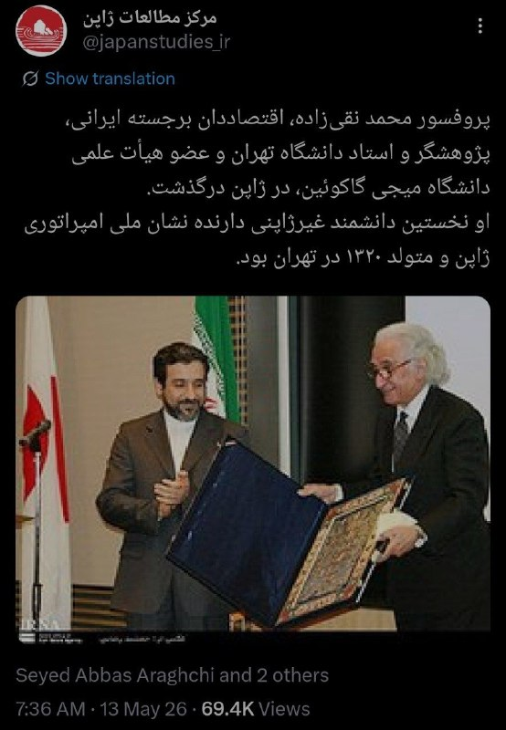

راز ته‌دیگ پارس‌خزر؛ پروژه‌ای که ژاپنی‌ها برای ایرانی‌ها ساختند

ته‌دیگ معروف پلوپزهای پارس‌خزر اتفاقی نبود؛ دهه ۴۰، مهندسان شرکت ژاپنی ماتسوشیتا (پاناسونیک فعلی) با کمک دکتر نقی‌زاده، حدود دو ماه روی سلیقه ایرانی‌ها تحقیق کردند تا پلوپزی بسازند که ته‌دیگش به ذائقه ایرانی نزدیک باشد.

می‌گویند مادر دکتر نقی‌زاده هر روز مدل‌های مختلف را امتحان می‌کرد تا بهترین نتیجه به دست بیاید؛ پروژه‌ای که بعد از حدود ۶۰ سال هنوز طعمش در خانه‌های ایرانی مانده است.

روح پروفسور نقی‌زاده عزیز شاد و یادش گرامی باد.

》OPT《

@OfficialPersiaTwiter

## OfficialPersiaTwiter — post 498587

‏لیلا حاتمی تو یه فیلمه که اسمش یادم نیست داشت گریه می‌کرد و می‌گفت خدایا چرا هر کی به من می‌رسه می‌فهمه من آدمی‌ام که میشه بهش توهین کرد؟
زیاد به این دیالوگ فکر می‌کنم.

》کاردیونا《

@OfficialPersiaTwiter

## OfficialPersiaTwiter — post 498586

  <a href="telegram/content/OfficialPersiaTwiter_498586_1778839694.mp4" target="_blank">🎬 Download video</a>

ویدیوبی از لحظه دست ندادن سیدعباس عراقچی با خانم معاون وزیر خارجه ویتنام در اجلاس وزرای خارجه بریکس در هند که بسیار پربازدید شد/آوش

》OPT《

@OfficialPersiaTwiter

## bbcpersian — post 281122

🔻اجتناب وزارت خارجه چین از پاسخ به سوالات در مورد توافق‌های اعلام شده از سوی ترامپ

سخنگوی وزارت خارجه چین در کنفرانس خبری از پاسخ دادن به سوالات در مورد توافق‌های تجاری‌ای که رئیس‌جمهور آمریکا اعلام کرده است، اجتناب کرد.

پیشتر دونالد ترامپ به شبکه فاکس‌نیوز گفت که شی‌ جین‌پینگ، رئیس‌جمهور چین، متعهد به چندین توافق تجاری با آمریکا شده است، از جمله خرید ۲۰۰ فروند هواپیمای بوئینگ، نفت آمریکا و همچنین محصولات کشاروزی مانند سویا.

سخنگوی وزارت خارجه چین بدون تایید یا تکذیب این توافق‌های تجاری، در عوض بر اهمیت «اتفاق نظر» دو رهبر در جریان سفر دونالد ترامپ تاکید کرد.

این سخنگو در پاسخ به سوالی دیگر گفت: «اساس روابط اقتصادی و تجاری چین و آمریکا مبتنی بر منفعت دوجانبه و همکاری برد-برد است.»

https://bbc.in/3R12525
@BBCPersian

## bbcpersian — post 281121

  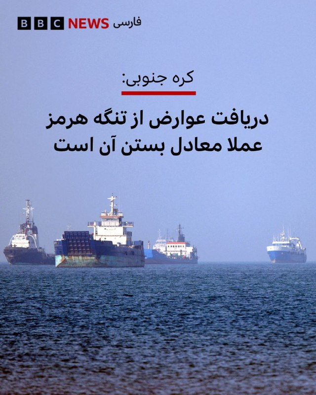

🔻کره جنوبی با طرح مطرح شده از سوی ایران برای دریافت عوارض از کشتی‌های عبوری از تنگه هرمز مخالفت کرده و می‌گوید که چنین اقدامی با اصل آزادی کشتیرانی در آب‌های بین‌امللی مغایرت دارد.

مجلس ایران پیگیر طرحی است که هدف آن دریافت عوارض از کشتی‌های عبوری از تنگه هرمز حتی در شرایط صلح است.

هوانگ جونگ وو، وزیر اقیانوس‌ها و شیلات کره جنوبی گفت که دریافت عوارض از این تنگه «عملا معادل مسدود کردن این آبراه» است.

او تنگه هرمز را با کانال سوئز مقایسه کرد و گفت که «سوئز یک کانال مصنوعی است که دریافت عوارض در آن امری عادی محسوب می‌شود، اما تنگه هرمز یک گذرگاه بین‌المللی دریایی است که تحت قوانین بین‌المللی قرار دارد.»

سئول بارها اعلام کرده است که قصد پرداخت چنین عوارضی را ندارد و «آزادی ناوبری» را اصلی اساسی می‌داند.

بخش بزرگی از واردات انرژی‌ کره جنوبی از خاورمیانه و از مسیر تنگه هرمز انجام می‌شود.

کمتر از دو هفته پیش یک کشتی کره جنوبی هم در منطقه تنگه هرمز هدف حمله قرار گرفت.

📸 Amirhossein KHORGOOEI / ISNA / AFP via Getty Images

https://bbc.in/3R12525
@BBCPersian

## bbcpersian — post 281120

🔻افزایش قیمت سوخت در هند در پی جهش قیمت جهانی نفت

شرکت‌های دولتی عرضه سوخت در هند برای نخستین بار در چهار سال اخیر قیمت‌ها را افزایش دادند .

جهش قیمت جهانی نفت پس از آغاز جنگ ایران و محدود شدن رفت‌وآمد در تنگه هرمز، باعث فشار بر ذخایر ارزی هند شده است.

هند، سومین واردکننده بزرگ نفت در جهان، از آخرین اقتصادهای بزرگ محسوب می‌شود که قیمت سوخت در جایگاه‌ها را افزایش می‌دهد.

این تصمیم باعث افزایش هزینه کالاهای روزمره برای صدها میلیون نفر خواهد شد.

این اقدام تنها چند روز پس از آن صورت می‌گیرد که نارندرا مودی، نخست‌وزیر هند، از مردم خواست که در مصرف سوخت صرفه‌جویی کنند.

https://bbc.in/3R12525
@BBCPersian

## Lichargoo — post 24880

گذشته رو‌ نگاه میکنی ۲۵۰۰ سال تمدن، آینده رو‌ نگاه میکنی ۲۶ کیر

## Pesari_Ke_Konie — post 44939

  

🔴قیمت جهانی استارلینک مینی با تخفیف به زیر ۲۰۰دلار (۳۶میلیون تومن) رسیده و پایین‌تر هم میاد. سایز دیشش هم اندازه‌ی یه کاغذ A4 هس و براحتی همه جا مخفی میشه و با وضعیت ایران هیچ رقمه نمیشه جلوی موج قاچاقش رو گرفت.

@Pesari_Ke_Konie

## Tans_Footbali — post 236309

  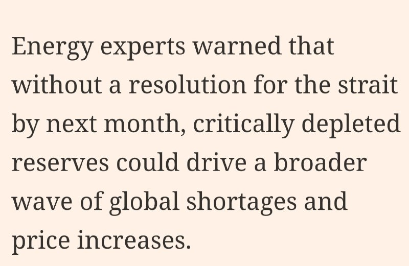

فایننشال‌تایمز: اگر تا ماه آینده تنگهٔ هرمز باز نشود، به‌دلیل تخلیهٔ ذخایر استراتژیک شاهد موج گسترده‌تری از کمبودهای جهانی و افزایش قیمت‌ها در حوزهٔ انرژی خواهیم بود

💛@Tans_Footbali

## hamclasixii — post 75377

  

دکمه را بزن شسته شوم بلکه این کثافت غم بالاخره از دلم پاک شود

📚 @hamclasix 📚

## hamclasixii — post 75376

  

🔴 امروز May 15، روز جهانی هدیه دادنِ گل به کسیه که دوسش داریم
🌹

📚 @hamclasix 📚

## withyashar — post 11275

## withyashar — post 11274

خبرنگار الجزیره:
تهران به‌طور رسمی پاسخ واشنگتن به پیشنهاد خود را دریافت کرده و ایالات متحده تمامی شروط ایران رو رد کرده.
@withyashar

## withyashar — post 11273

😂😂🙌🏾 @withyashar

## withyashar — post 11272

ترامپ در تروث : پژوهشگر چینی به CNN گفت که به نشست ترامپ و شی نمره «۹.۹۹ از ۱۰» می‌دهد.
@withyashar

## withyashar — post 11271

  

محمد قنطاری، کاردار جدید سوریه در واشنگتن دی سی😬🍔
@withyashar

## withyashar — post 11270

@withyashar part3

## withyashar — post 11269

  

😂😂🙌🏾 @withyashar

## withyashar — post 11268

هم‌اکنون حمله سنگین جمهوری اسلامی به مقر گروه های مخالف در عراق
@withyashar

## withyashar — post 11267

طبق گزارش روزنامه «ساوت چاینا مورنینگ پست» و بازنشر آن توسط «بلومبرگ»، انتظار می‌رود «ولادیمیر پوتین» در حدود ۲۰ مه به «پکن» سفر کند؛ تنها حدود ۵ روز پس از دیدار «شی جین‌پینگ» و «دونالد ترامپ» در پکن.

رسانه‌ها می‌گویند این سفر احتمالاً فقط یک روز طول می‌کشد و بیشتر در قالب یک دیدار کاری و هماهنگی سیاسی انجام می‌شود. همچنین برخلاف سفر ترامپ، ظاهراً خبری از تشریفات بزرگ، رژه رسمی یا استقبال بسیار گسترده نخواهد بود و این سفر در سطحی ساده‌تر و کم‌نمایش‌تر برگزار می‌شود
@withyashar

## withyashar — post 11266

@withyashar part2

---
📅 بروزرسانی: 1405/02/25 11:12
---

## persian_trend_official — post 14174

  <a href="telegram/content/persian_trend_official_14174_1778830969.webm" target="_blank">🎬 Download video</a>

کم کم داره جدی میشه !!!!

## OfficialPersiaTwiter — post 498577

  <a href="telegram/content/OfficialPersiaTwiter_498577_1778830970.mp4" target="_blank">🎬 Download video</a>

🔹ترامپ در گفتگو با فاکس‌ نیوز ادعا کرد که ایران حتی قادر به رسیدن به اورانیوم‌های موجود در تاسیسات نیست، زیرا کوه روی آن فرو ریخته است. و تنها کشورهایی که تکنولوژی رسیدن به آن را دارند، ایالات متحده و چین هستند!

》OPT《

@OfficialPersiaTwiter

## OfficialPersiaTwiter — post 498576

  <a href="telegram/content/OfficialPersiaTwiter_498576_1778830972.mp4" target="_blank">🎬 Download video</a>

رهبر چین, ترامپ رو برده تمام فضای اطراف کاخ رو بهش نشون بده ترامپ از مترجم همراهش میپرسه: از رئیس جمهور XI بپرسید... آیا او رهبران دیگر کشورها و نخست‌وزیرها را هم به اینجا میاره؟ که xi در جوابش گفت معمولا نه!

》OPT《

@OfficialPersiaTwiter

## OfficialPersiaTwiter — post 498575

صداى هلى كوپتر اومد
بچه‌م هراسون اومد گفت: مامان نترسم؟

》بانيال《

@OfficialPersiaTwiter

## OfficialPersiaTwiter — post 498574

دونالد ترامپ: 🔹ما درباره ایران هم گفت‌وگو کردیم. دیدگاه‌های ما درباره ایران بسیار به هم نزدیک است. ما می‌خواهیم این وضعیت پایان پیدا کند. نمی‌خواهیم آن‌ها به سلاح هسته‌ای دست پیدا کنند. ما می‌خواهیم تنگه‌ها باز بمانند. 🔹الان داریم آن را می‌بندیم. آن‌ها بستند…

## OfficialPersiaTwiter — post 498573

اسپرسو سازم خراب شده بود خودم باز کردم تعمیرش کردم الان قهوه ترک میده

》darvizh《

@OfficialPersiaTwiter

## OfficialPersiaTwiter — post 498572

ایتالیا بازگشت پروازها به تل‌آویو را به تعویق انداخت

🔹️شرکت هواپیمایی ایتالیا تصمیم گرفته است تا از سرگیری پروازهای خود به اسرائیل را به یکم ژوئیه موکول کند.

》OPT《

@OfficialPersiaTwiter

## OfficialPersiaTwiter — post 498571

  <a href="telegram/content/OfficialPersiaTwiter_498571_1778830975.mp4" target="_blank">🎬 Download video</a>

ترامپ در مصاحبه با فاکس‌نیوز:

🔹افزایش قیمت بنزین، بهایی است که آمریکایی‌ها باید برای جلوگیری از دستیابی ایران به سلاح هسته‌ای بپردازند.

》OPT《

@OfficialPersiaTwiter

## OfficialPersiaTwiter — post 498570

اعلام تاریخ برگزاری امتحانات دانش آموزان هر پایه/ معطلی یازدهم و دوازدهمی ها تا آخر تیرماه سخنگوی وزارت آموزش و پرورش: 🔹امتحانات پایه‌های هفتم تا دهم از ۹خرداد به صورت استانی و منطقه‌ای و با "مجوز" شورای تأمین هر استان به صورت حضوری یا غیرحضوری برگزار می‌شود.…

## OfficialPersiaTwiter — post 498569

  <a href="telegram/content/OfficialPersiaTwiter_498569_1778830978.mp4" target="_blank">🎬 Download video</a>

پایان سفر ترامپ به چین

🔹دونالد ترامپ، رئیس جمهور ایالات متحده آمریکا، پکن را ترک کرد و سفر خود به جمهوری خلق چین را به پایان رساند.
🔹شی جین‌پینگ، رئیس‌جمهور چین در آخرین روز سفر رئیس جمهور ایالات متحده گفت که دونالد ترامپ به دنبال «بازگرداندن عظمت آمریکا» است و او نیز متعهد به هدایت مردم چین برای تحقق «رستاخیز ملی» است.
🔹شی جین‌پینگ همچنین تأکید کرده است که چین و آمریکا می‌توانند از طریق تقویت همکاری‌ها، روند توسعه و پیشرفت خود را تسریع کنند.

》OPT《

@OfficialPersiaTwiter

## OfficialPersiaTwiter — post 498568

یک منبع آگاه به فارس: ایران بدون انجام ۵ شرط اعتمادساز وارد دور دوم مذاکرات با آمریکا نمی‌شود 🔹یک منبع آگاه تأکید کرد که پیش‌شرط‌های اعلامی ایران، تضامین حداقلی اعتمادساز برای آغاز هرگونه مذاکره با آمریکا است. 🔹پنج پیش‌شرط ایران برای طرف آمریکایی شامل «پایان…

## OfficialPersiaTwiter — post 498567

  <a href="telegram/content/OfficialPersiaTwiter_498567_1778830981.mp4" target="_blank">🎬 Download video</a>

ترامپ: شی جین‌پینگ ۲۴ سپتامبر به آمریکا سفر می‌کند

🔹دونالد ترامپ، رئیس جمهور آمریکا اعلام کرد که شی جین‌پینگ، رئیس‌جمهور چین، قرار است در تاریخ ۲۴ سپتامبر (۲ مهر) به ایالات متحده سفر کند.
🔹ترامپ این سفر را متقابل توصیف کرد و گفت امیدوار است شی جین‌پینگ پس از سفر به آمریکا، بسیار تحت تأثیر قرار بگیرد. همان‌طور که من هم بسیار تحت تأثیر چین قرار گرفته‌ام.

》OPT《

@OfficialPersiaTwiter

## OfficialPersiaTwiter — post 498566

  <a href="telegram/content/OfficialPersiaTwiter_498566_1778830984.mp4" target="_blank">🎬 Download video</a>

دونالد ترامپ، رئیس‌جمهور آمریکا:

🔹این سفر فوق‌العاده‌ای بود. فکر می‌کنم اتفاقات بسیار خوبی از آن حاصل شد. ما توافق‌های تجاری فوق‌العاده‌ای انجام دادیم که برای هر دو کشور عالی هستند.
🔹شی جین‌پینگ فردی است که احترام زیادی برایش قائلم. حالا حدود ۱۱ سال است، نزدیک به ۱۲ سال، که یکدیگر را می‌شناسیم؛ این مدت زمان زیادی است. ما مشکلات مختلف زیادی را حل‌وفصل کرده‌ایم؛ مشکلاتی که افراد دیگر قادر به حل آن‌ها نبودند.
🔹این رابطه، رابطه‌ای بسیار قوی است. فکر می‌کنم واقعاً کارهای فوق‌العاده‌ای انجام داده‌ایم.

》OPT《

@OfficialPersiaTwiter

## OfficialPersiaTwiter — post 498565

  <a href="telegram/content/OfficialPersiaTwiter_498565_1778830986.mp4" target="_blank">🎬 Download video</a>

دونالد ترامپ:

🔹ما درباره ایران هم گفت‌وگو کردیم. دیدگاه‌های ما درباره ایران بسیار به هم نزدیک است. ما می‌خواهیم این وضعیت پایان پیدا کند. نمی‌خواهیم آن‌ها به سلاح هسته‌ای دست پیدا کنند. ما می‌خواهیم تنگه‌ها باز بمانند.
🔹الان داریم آن را می‌بندیم. آن‌ها بستند و ما هم در واکنش، آن را بستیم. اما ما می‌خواهیم تنگه‌ها باز باشند.
🔹ما می‌خواهیم این ماجرا پایان یابد، چون موضوع دیوانه‌واری است. آن‌ها کمی غیرقابل‌پیش‌بینی هستند و این وضعیت خوب نیست.
🔹آن‌ها نباید سلاح هسته‌ای داشته باشند.

》OPT《

@OfficialPersiaTwiter

## OfficialPersiaTwiter — post 498564

  <a href="telegram/content/OfficialPersiaTwiter_498564_1778830988.mp4" target="_blank">🎬 Download video</a>

🔹مارکو روبیو: مردم کوبا باید بدانند که در حال حاضر ۱۰۰ میلیون دلار غذا و دارو برای آن‌ها موجود است و تنها دلیلی که این کمک‌ها به دستشان نمی‌رسد، رژیم کوبا است.

》OPT《

@OfficialPersiaTwiter

## OfficialPersiaTwiter — post 498563

  <a href="telegram/content/OfficialPersiaTwiter_498563_1778830992.mp4" target="_blank">🎬 Download video</a>

وزیر خارجۀ آمریکا: در مورد ایران، درخواستی از چین نداشتیم

🔹ترامپ هیچ درخواستی از رئیس‌جمهور چین نکرد. منظورم این است که ما در مورد ایران به‌دنبال کمک چین نیستیم؛ ما نیازی به کمک آن‌ها نداریم.

🔹ما مسئله را بازگو می‌کنیم تا موضع خود را به‌روشنی تبیین و آن را شفاف کنیم تا آن‌ها درک کنند.

》OPT《

@OfficialPersiaTwiter

## OfficialPersiaTwiter — post 498562

  <a href="telegram/content/OfficialPersiaTwiter_498562_1778830993.mp4" target="_blank">🎬 Download video</a>

وزیر خارجۀ آمریکا: ایرانی‌ها در آستانهٔ ایجاد یک توانمندی متعارف دفاعی بودند و به‌همین‌دلیل به آن‌ها حمله کردیم

🔹ایرانی‌ها در تلاش بودند آن‌قدر موشک و پهپاد داشته باشند که نتوان علیه آن‌ها اقدامی انجام داد.
🔹آن‌ها قصد داشتند پشت آن سپر دفاعیِ متعارف پنهان شوند تا در آینده هر کاری که می‌خواهند با برنامهٔ هسته‌ای خود انجام دهند.
🔹به‌همین‌دلیل بود که ترامپ تصمیم به اقدام گرفت.

》OPT《

@OfficialPersiaTwiter

## OfficialPersiaTwiter — post 498561

اعلام تاریخ برگزاری امتحانات دانش آموزان هر پایه/ معطلی یازدهم و دوازدهمی ها تا آخر تیرماه

سخنگوی وزارت آموزش و پرورش:
🔹امتحانات پایه‌های هفتم تا دهم از ۹خرداد به صورت استانی و منطقه‌ای و با "مجوز" شورای تأمین هر استان به صورت حضوری یا غیرحضوری برگزار می‌شود.

🔹برگزاری آزمون‌های "نهایی" پایه‌های یازدهم و دوازدهم منوط به تثبیت شرایط تا اواخر تیرماه است.

》OPT《

@OfficialPersiaTwiter

## OfficialPersiaTwiter — post 498560

بانک‌ها مجاز به خرید و فروش ارز تا سقف ۱۰۰۰ یورو شدند 🔹براساس دستورالعمل بانک مرکزی، هر فردی می‌تواند تا سقف ۱۰۰۰ یورو (یا معادل آن به دلار) در سال، ارز اسکناس برای نیازهای ضروری خرد از شعب بانکی خریداری کند. 🔹منبع این اسکناس‌ها، خرید از صادرکنندگان است و…

## OfficialPersiaTwiter — post 498559

پایان دور نخست مذاکرات لبنان و اسرائیل در واشنگتن

🔹 منابع خبری اعلام کردند که دور نخست گفت و گوهای فشرده میان هیأت های لبنانی و اسرائیلی در واشنگتن پایان یافت.

🔹 شبکه المیادین گزارش داد که این مرحله پس از ۸ ساعت رایزنی مستمر به پایان رسیده است. این گفت و گوها با حضور هیئت لبنانی به ریاست «سیمون کرم» و هیئت اسرائیلی شامل سفیر این رژیم در آمریکا و معاون مشاور امنیت این رژیم انجام شد.

》OPT《

@OfficialPersiaTwiter

## OfficialPersiaTwiter — post 498558

  <a href="telegram/content/OfficialPersiaTwiter_498558_1778830995.mp4" target="_blank">🎬 Download video</a>

قطعنامه پیشنهادی دموکرات‌ها در مجلس نمایندگان آمریکا برای توقف جنگ علیه ایران آرای کافی را به دست نیاورد و از تصویب بازماند

رای‌گیری روز پنجشنبه با نتیجه ۲۱۲ در برابر ۲۱۲ به تساوی رسید و در نهایت با اختلاف یک رای نتوانست به اکثریت لازم برسد و رد شد.
این سومین بار است که چنین ابتکاری برای مهار اختیارات نظامی رییس‌جمهوری در مجلس نمایندگان آمریکا شکست می‌خورد.

》OPT《

@OfficialPersiaTwiter

## bbcpersian — post 281119

🔻سفر ترامپ با تشریفات فراوان و دستاوردهای سیاسی اندک همراه بود

🖌لورا بیکر- بی‌بی‌سی

این سفر بیشتر بر تشریفات و نمایش‌های رسمی متمرکز بود، اما تا اینجا توافق‌های سیاسی بسیار کمی میان دو طرف حاصل شده است.

به نظر می‌رسد که جنگ ایران بر نشستی سایه انداخت که قرار بود محور اصلی آن تجارت باشد.

دونالد ترامپ مدعی شده است که شی جین‌پینگ متعهد شده از ارسال تجهیزات نظامی به ایران خودداری کند. وزارت خارجه چین هم بیانیه‌ای منتشر کرده که در آن آمده پکن «بی‌وقفه» برای کمک به پایان دادن به این درگیری تلاش کرده است.موضوعی که نشان می‌دهد مقامات چینی پشت‌پرده در حال تلاش هستند تا متحد خود ایران را به سمت میز مذاکره سوق دهند.

آقای ترامپ همچنین گفته است که چین در حال گفت‌وگو برای خرید ۲۰۰ فروند هواپیمای بوئینگ و حتی احتمالاً نفت آمریکا است.

انتظار می‌رود که اعلام شود که دو طرف همچنین توافق کرده‌اند آتش‌بس تجاری‌ای را که در اکتبر گذشته در بوسان حاصل شده بود، ادامه دهند.

شاید دستاورد واقعی این باشد که اصلاً این مذاکرات انجام شده است.

https://bbc.in/3R12525
@BBCPersian

## bbcpersian — post 281118

🔻ارتش اسرائیل برای پنج روستا در جنوب لبنان دستور تخلیه صادر کرد

ارتش اسرائیل روز جمعه از ساکنان پنج روستا در جنوب لبنان خواست تا فوراً این مناطق را تخلیه کنند. اقدامی که در آستانه حملات احتمالی علیه حزب‌الله و با وجود آتش‌بسی که برای توقف درگیری‌ها برقرار شده بود، انجام می‌شود.

آویخای ادرعی، سخنگوی عرب‌زبان ارتش اسرائیلدر شبکه اجتماعی ایکس اعلام کرد که «با توجه به نقض توافق آتش‌بس از سوی حزب‌الله، ارتش ناچار به اقدام قاطع علیه آن است» و نام پنج روستا در نزدیکی شهر صور در ساحل جنوبی لبنان را منتشر کرد.

او همچنین هشدار داد: «برای حفظ جان خود، فوراً خانه‌هایتان را تخلیه کنید و حداقل هزار متر از این مناطق فاصله بگیرید.»

https://bbc.in/3R12525
@BBCPersian

## bbcpersian — post 281117

  

🔻اکنون گزارشی از رسانه‌های دولتی چین درباره دور نهایی گفت‌وگوها میان شی جین‌پینگ، رهبر چین و دونالد ترامپ، رئیس جمهور آمریکا در ژونگ‌نان‌های منتشر شده است.

شی جین‌پینگ این دیدار را «تاریخی و مهم» توصیف کرده و گفته است دو رهبر «جایگاه جدیدی برای روابط سازنده، استراتژیک و باثبات» میان دو کشور خود ایجاد کرده‌اند.

او در ادامه گفته است: «رئیس‌جمهور ترامپ امیدوار است آمریکا را دوباره بزرگ کند و من نیز متعهد هستم مردم چین را برای تحقق احیای عظمت ملت چین رهبری کنم» و افزوده که دو طرف باید «اجماع مهم» حاصل‌شده را اجرا کنند.

در همین حال، بر اساس روایت رسانه‌های چینی، آقای ترامپ این سفر را «بسیار موفق، شناخته‌شده در سطح جهانی و فراموش‌نشدنی» توصیف کرده و شی جین‌پینگ را «دوستی قدیمی» خوانده و گفته است: «احترام زیادی برای او قائلم.»

او همچنین گفته است که مایل است «ارتباط صمیمانه و عمیق را با شی جین‌پینگ حفظ کند و مشتاق است میزبان او در واشنگتن باشد.»

📸 Reuters

https://bbc.in/3R12525
@BBCPersian

## bbcpersian — post 281116

🔻این هفته در پرگار: سلامت روانی

🔻سلامت روانی چیست و عوامل موثر در حفظ آن چه هستند؟ سلامت روانی شاخص‌های شناخته شده‌ی جهانی دارد یا متاثر از محیط فرهنگی و اجتماعی است؟

میهمان‌ها:
نازی اکبری، متخصص در روان درمانی بین فرهنگی
رضا کاظم زاده، روانشناس بالینی
ارشیا صدیق، متخصص مغز و اعصاب

این برنامه یک بار دیگر پیش از این پخش شده است.

@BBCPersian

## bbcpersian — post 281109

🖌پاول آکسیونوف, تحلیلگر نظامی بخش روسی بی‌بی‌سی:

🔻روسیه از موفقیت‌آمیز بودن آزمایش موشک بالستیک قاره‌پیمای «سارمات» خبر داد. سرگی کاراکایف، فرمانده نیروهای موشکی راهبردی، این موضوع را در گزارشی به ولادیمیر پوتین اطلاع داده است. هم‌زمان، وزارت دفاع روسیه ویدیویی از لحظه پرتاب این موشک منتشر کرده است.

منابع مستقل غربی هنوز درباره پرتاب این موشک روسی اظهارنظر نکرده‌اند. مسیر پرواز آن نیز نامشخص است.

این دومین آزمایش موفق موشک بالستیک سنگین جدید است. نخستین پرتاب در سال ۲۰۲۲ انجام شد.

📸GettyImages/ HANDOUT/EPA/Shutterstock/ Anadolu via Getty Images/ Planet Labs/ AFP via Getty Images/ Official channel of the Russian Ministry of Defense

https://bbc.in/4395RJj
@BBCPersian

## bbcpersian — post 281108

  

🔻نارندرا مودی، نخست‌وزیر هند، روز جمعه سفر خود به پنج کشور را آغاز می‌کند؛ این سفر با ورود به امارات متحده عربی شروع می‌شود و سپس با دیدار از کشورهای اروپایی ادامه می‌یابد. این سفر در حالی انجام می‌شود که نگرانی‌ها درباره انرژی و اختلال در زنجیره تأمین به‌دلیل جنگ ایران افزایش یافته است.

اختلال در مسیر کشتیرانی در تنگه هرمز همچنان باعث نوسان در بازارهای نفت و گاز است و فشار بیشتری بر کشورهای واردکننده انرژی، از جمله هند، وارد می‌کند.

اما این سفر همچنین نشان دهنده تلاش گسترده‌تر هند برای تنوع بخشیدن به مشارکت‌های اقتصادی و استراتژیک است، در حالی که خود را به عنوان یک مرکز بزرگ تولید و فناوری معرفی می‌کند.

این سفر شش‌روزه که شامل دیدار از هلند، سوئد، نروژ و ایتالیا هم خواهد بود، پس از آن انجام می‌شود که هند و اتحادیه اروپا در ماه ژانویه یک توافق تجارت آزاد امضا کردند؛ توافقی که نارندرا مودی از آن با عنوان «مادر همه توافق‌ها» یاد کرده است.

این سفر فشرده با امارات متحده عربی آغاز می‌شود؛ کشوری که میزبان جامعه‌ حدود ۴.۵ میلیون نفری از هندی‌هاست.

📸 Getty

https://bbc.in/3R12525
@BBCPersian

## bbcpersian — post 281107

  

🔻فاطمه وحدت، نایب رئیس اتحادیه زنان کارگر سراسر ایران در مورد تاثیرات جنگ بر وضعیت اشتغال زنان گفت که در شرایط بحرانی «زنان کارگر بیشتر در معرض اخراج قرار می‌گیرند و زنانی که سرپرست خانوار هستند، بیشترین آسیب را متحمل می‌شوند.»

به گفته خانم وحدت ادامه این روند می‌تواند پیامدهای اجتماعی گسترده‌ای داشته باشد.

نایب رئیس اتحادیه زنان کارگر ضمن انتقاد از نبود حمایت کافی برای زنان کارگر تاکید کرد که «بسیاری از مسئولان از شرایط فعلی اطلاع دارند، اما نظارت جدی در این مورد وجود ندارد.»

او همچنین گفت که نشانه‌های گسترده فقر در جامعه مشهود است و برخی از مردم حتی برای خرید نان مشکل دارند.

📸 Getty

https://bbc.in/3R12525
@BBCPersian

## bbcpersian — post 281104

🔻دونالد ترامپ، رئیس جمهور آمریکا و شی جین‌پینگ،‌ رهبر چین بار دیگر امروز با هم دیدار و گفتگو کردند.

دو رهبر پیش از مذاکرات امروز صبح، در ژونگ‌نان‌های، مجتمعی که رهبری مرکزی چین در آن اقامت دارد، قدم زدند.

📸 Reuters

https://bbc.in/3R12525
@BBCPersian

## bbcpersian — post 281096

🖌نسرین حاطوم, خبرنگار بی‌بی‌سی عربی در امور خلیج فارس

🔻در پی هدف قرار گرفتن امارات با موشک‌های بالستیک و پهپاد در روزهای اخیر، که مقام‌های امارات آن را به ایران نسبت داده‌اند، تماس تلفنی بنیامین نتانیاهو، نخست‌وزیر اسرائیل، با محمد بن زاید آل نهیان، رئیس امارات متحده عربی، توجه‌ها را به خود جلب کرد.

آقای نتانیاهو در این تماس گفت که اسرائیل در کنار «نزدیک‌ترین متحدانش» ایستاده است و بر تعهد کشورش به تلاش مشترک برای صلح و امنیت تاکید کرد. بر اساس بیانیه سفارت اسرائیل در امارات، او در این گفت‌وگو حملات ایران علیه غیرنظامیان و زیرساخت‌های امارات را محکوم کرد و آن را «نقض جدی حاکمیت و تهدیدی برای ثبات منطقه‌ای» خواند.

وزارت دفاع امارات اعلام کرده بود که سامانه‌های پدافند هوایی این کشور طی روزهای گذشته چندین موشک و پهپاد ایرانی را رهگیری کرده‌اند.

📸GettyImages/ AFP via Getty Images/ NurPhoto via Getty Images/ Bloomberg via Getty Images

https://bbc.in/4dL0TbK
@BBCPersian

## Lichargoo — post 24879

  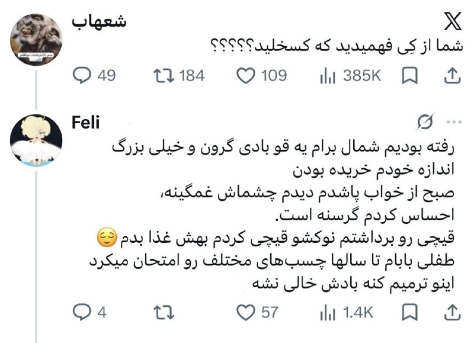

پاره شدممممم😂😂😂

@Lichargoo

## Tans_Footbali — post 236308

  

قیمت جهانی استارلینک مینی با تخفیف به زیر ۲۰۰دلار(۳۶میلیون تومن) رسیده و پایینتر هم میاد. سایز دیشش هم اندازه‌ی یه برگ A4ئه و براحتی همه جا استتار میشه و با وضعیت ایران هیچ رقمه نمیشه جلوی موج قاچاقش رو گرفت.

رویای آخوند برای کنترل بلندمدت اینترنت فقط یه توهمه

@Tans_Footbali

## Tans_Footbali — post 236307

  <a href="telegram/content/Tans_Footbali_236307_1778831001.mp4" target="_blank">🎬 Download video</a>

قطعنامه پیشنهادی دموکرات‌ها در مجلس نمایندگان آمریکا برای توقف جنگ علیه ایران آرای کافی را به دست نیاورد و از تصویب بازماند

رای‌گیری روز پنجشنبه با نتیجه ۲۱۲ در برابر ۲۱۲ به تساوی رسید و در نهایت با اختلاف یک رای نتوانست به اکثریت لازم برسد و رد شد.
این سومین بار است که چنین ابتکاری برای مهار اختیارات نظامی رییس‌جمهوری در مجلس نمایندگان آمریکا شکست می‌خورد.

💛@Tans_Footbali

## Tans_Footbali — post 236306

  <a href="telegram/content/Tans_Footbali_236306_1778831002.webm" target="_blank">🎬 Download video</a>

⚽ استون ویلا 
🏴 - 
🏴 لیورپول

🏆 لیگ برتر انگلیس 
🏴

🕔 جمعه ساعت ۲۲:۳۰
🏟 ورزشگاه ویلا پارک

🎲 با بیش از ۵۵۰ نوع آپشن پیش‌بینی

👆 ضرایب شگفت‌انگیز

🚨نکاتی در مورد بازی‌های رودررو:
در پنج تقابل اخیر دو تیم، لیورپول موفق به کسب پیروزی در سه دیدار شده‌ است و دو بازی با نتیجه مساوی به پایان رسیده است.

📝 حقایق داور:
🟨 میانگین کارت زرد : ۳.۶۸ کارت در هر بازی
🟥 میانگین کارت قرمز : ۰.۱۲ کارت در هر بازی

🧠 قبل از ورود، بدترین سناریو را مرور کنید.

D

👍 ورود به سایت با فیلترشکن

کلیک کنید BetForward.com
کلیک کنید BetForward.com

💻 @BetForward

## Tans_Footbali — post 236304

  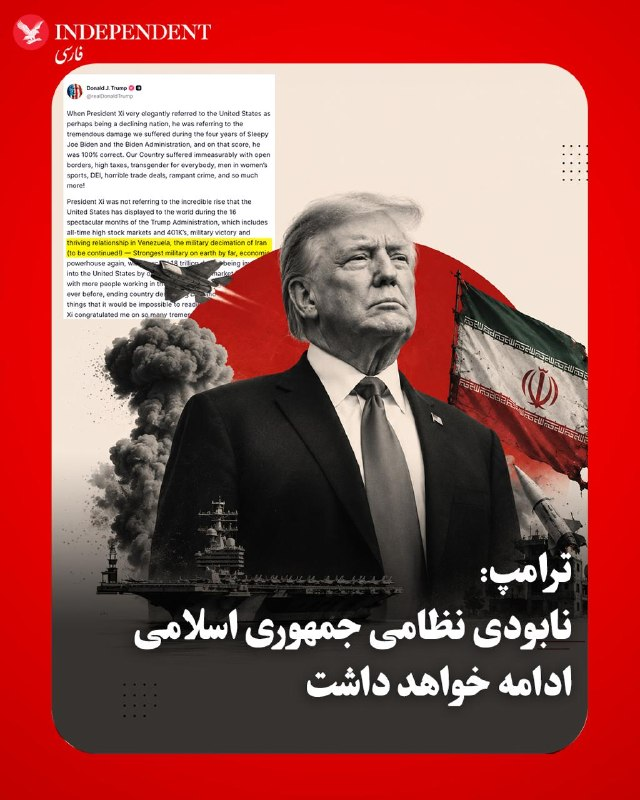

پرزيدنت دونالد جی ترامپ، رئیس‌جمهوری ایالات متحده آمریکا، پنجشنبه شب با انتشار پیامی در شبکه اجتماعی «تروث سوشال» اعلام کرد روند «تضعیف نظامی جمهوری اسلامی» که به گفته او در دوره ریاست‌جمهوری‌اش آغاز شده، ادامه خواهد یافت.

ترامپ در این پیام، در کنار اشاره به آنچه دستاوردهای اقتصادی و نظامی دولت خود خواند، از «نابودی نظامی جمهوری اسلامی» نام برد و نوشت این روند «ادامه خواهد داشت».
او همچنین نوشت دولتش آمریکا را دوباره به یک قدرت اقتصادی و نظامی تبدیل کرده است

💛@Tans_Footbali

## hamclasixii — post 75375

🔴اعلام تاریخ برگزاری امتحانات دانش آموزان هر پایه/ معطلی یازدهم و دوازدهمی ها تا آخر تیرماه

سخنگوی وزارت آموزش و پرورش:
🔹امتحانات پایه‌های هفتم تا دهم از ۹ خرداد به صورت استانی و منطقه‌ای و با «مجوز» شورای تأمین هر استان به صورت حضوری یا غیرحضوری برگزار می‌شود.
🔹برگزاری آزمون‌های «نهایی» پایه‌های یازدهم و دوازدهم منوط به تثبیت شرایط تا اواخر تیرماه است.

📚 @hamclasix 📚

## hamclasixii — post 75374

🔴شروط برگزاری «حضوری» امتحانات

سخنگوی وزارت آموزش و پرورش:
🔹اگر شورای تامین استان و همچنین شورای تامین شهرستان اجازه دادند، امتحانات حضوری برگزار می شود.
🔹 به استان‌ها و مناطق تاکید و اجازه دادیم اگر امتحانات حضوری شد به نحوی برگزار کنند که با حداقل تعداد حضور دانش آموز در ساعت مشخصی در مدرسه امتحان برگزار شود یعنی اینگونه نباشد که ساعت ۸ تا ۱۰ تعداد زیادی دانش آموز در مدرسه امتحان داشته باشند ولی ساعت ۱۰ تا ۱۲ مدرسه خالی باشد، بنابراین امتحانات بین ساعت ها و روزهای متفاوت با حداقل حضور جمعیت دانش آموزی در مدارس باید سرشکن باشد.
🔹 اگر استان و منطقه اجازه نداد، آزمون به صورت غیر حضوری و برخط توسط معلم برگزار خواهد شد.

📚 @hamclasix 📚

## withyashar — post 11265

ترامپ در تروث : «وقتی رئیس‌جمهور شی با بیانی بسیار سنجیده از ایالات متحده به‌عنوان کشوری که شاید در حال افول باشد یاد کرد، منظور او آسیب عظیمی بود که ما در چهار سال دوران جو بایدنِ خواب‌آلود و دولت بایدن متحمل شدیم؛ و در این مورد، او صددرصد درست می‌گفت. کشور…

## withyashar — post 11264

@withyashar

## withyashar — post 11263

  <a href="telegram/content/withyashar_11263_1778831004.mp4" target="_blank">🎬 Download video</a>

@withyashar منتظر ری اکشننن

## withyashar — post 11262

نظرت چیه؟قبل جام جهانی میزنع یا بعد؟

## withyashar — post 11261

کانال 13 اسرائیل:اسرائیل انتظار دارد حمله احتمالی آمریکا در ایران از فردا با بازگشت ترامپ از چین آغاز شود
@withyashar

## withyashar — post 11260

  <a href="telegram/content/withyashar_11260_1778831006.mp4" target="_blank">🎬 Download video</a>

پایان سفر ترامپ به چین

دونالد ترامپ، رئیس جمهور آمریکا، پکن را ترک کرد و سفر خود به جمهوری خلق چین را به پایان رساند.

شی جین‌پینگ، رئیس‌جمهور چین در آخرین روز سفر رئیس جمهور ایالات متحده گفت که دونالد ترامپ به دنبال بازگرداندن عظمت آمریکا است و او نیز متعهد به هدایت مردم چین برای تحقق رستاخیز ملی است.

شی جین‌پینگ همچنین تأکید کرده است که چین و آمریکا می‌توانند از طریق تقویت همکاری‌ها، روند توسعه و پیشرفت خود را تسریع کنند.
@withyashar

## withyashar — post 11259

  <a href="telegram/content/withyashar_11259_1778831008.mp4" target="_blank">🎬 Download video</a>

ترامپ: امیدوارم ایران تماشا کند. ما دقیقاً می‌دانیم چه چیزی را آماده کرده‌اند. می‌دانید، آن‌ها کمی استراحت داشتند، بنابراین سعی دارند چند چیز را با هم جمع کنند. آن‌ها موشک‌هایی را از زیر زمین بیرون آورده‌اند. همه این‌ها در یک روز از بین خواهند رفت. امیدوارم این رو ببینند چون همه کارهایی که در چهار هفته گذشته انجام داده‌اند، در یک روز از بین خواهد رفت.
@withyashar
یاشار:خوب دیگه رسمأ داره میگه جنگ میشه و هم داره میگه حمله خیلی سریع و محکم انجام میشه همانطور که گفتیم

## withyashar — post 11258

آمریکا پیشنهاد ۱۴ ماده‌ای ایران را رد کرد

طبق اطلاعات رسیده به تهران تایمز، دولت آمریکا پاسخ پیشنهاد مکتوب ایران درباره پایان جنگ را داده است.

گفتنی است ایران پیشنهاد خود را مبتنی بر مذاکرات دو مرحله ای ارائه کرده بود که در مرحله اول منجر به پایان جنگ در همه جبهه ها شده و در صورت تحقق شروط ایران، مرحله دوم مذاکرات که درباره موضوع هسته ای بود، آغاز می شد
@withyashar

## withyashar — post 11257

مجلس نمایندگان آمریکا برای سومین بار طرح دموکرات‌ها جهت محدود کردن اختیارات نظامی ترامپ علیه جمهوری اسلامی رو رد کرد.

این طرح با نتیجه ۲۱۲ در برابر ۲۱۲ به تساوی رسید و در نهایت با اختلاف یک رای شکست خورد.
@withyashar

## withyashar — post 11256

ترامپ، به شبکه فاکس نیوز: مذاکره با ایران درباره کنار گذاشتن غبار هسته‌ای به دلیل تضاد در تصمیمات ایران، رفت و برگشت دارد تأسیسات هسته‌ای ایران تحت نظارت مداوم ۹ دوربین، ۲۴ ساعته قرار دارند. هرگونه تحرک ایرانی در داخل تأسیسات هسته‌ای با واکنش مستقیم نظامی…

## withyashar — post 11255

  <a href="telegram/content/withyashar_11255_1778831011.mp4" target="_blank">🎬 Download video</a>

‏ ترامپ: ما مشکلات زیادی را حل کرده‌ایم که دیگران قادر نبودند و این رابطه یک رابطه بسیار قوی است. فکر می‌کنم در مورد ایران کارهای فوق‌العاده‌ای انجام داده‌ایم، ما هم صحبت کردیم.

‏ما در مورد ایران بسیار مشابه‌ایم، می‌خواهیم این وضعیت پایان یابد. نمی‌خواهیم آن‌ها به سلاح هسته‌ای دست پیدا کنند. می‌خواهیم تنگه‌ها باز باشند و ما آن را برایشان می‌بندیم، آن‌ها تنها تنگه را بستند و بعد ما هم روی سرشان بستیم.
@withyashar

## withyashar — post 11254

ترامپ، به شبکه فاکس نیوز: مذاکره با ایران درباره کنار گذاشتن غبار هسته‌ای به دلیل تضاد در تصمیمات ایران، رفت و برگشت دارد
تأسیسات هسته‌ای ایران تحت نظارت مداوم ۹ دوربین، ۲۴ ساعته قرار دارند.
هرگونه تحرک ایرانی در داخل تأسیسات هسته‌ای با واکنش مستقیم نظامی مواجه خواهد شد.
@withyashar

---
📅 بروزرسانی: 1405/02/25 07:48
---

## persian_trend_official — post 14173

  <a href="telegram/content/persian_trend_official_14173_1778818730.mp4" target="_blank">🎬 Download video</a>

صبحتون بخیر ☕️😆

📝 Nick
📌 @persian_trend_official
پرشین ترند | متفاوت‌ترین کانال نظامی

## persian_trend_official — post 14172

  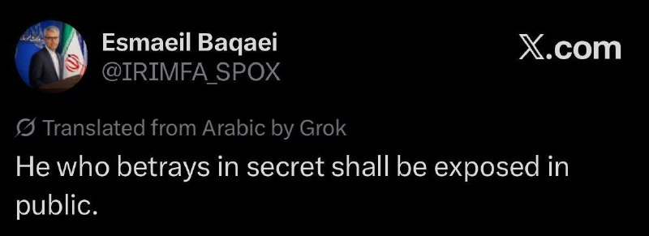

💢اسماعیل بقایی

«کسی که در خفا خیانت کند، در برابر افکار عمومی رسوا خواهد شد»

🫆:Tony

📌 @persian_trend_official
پرشین ترند | متفاوت‌ترین کانال نظامی

## persian_trend_official — post 14171

  <a href="telegram/content/persian_trend_official_14171_1778818733.mp4" target="_blank">🎬 Download video</a>

💢خلاقیت و نوآوری با کمترین هزینه را از اوکراین بخواهید ❗️

💢اپراتورای پهپاد اوکراینی با یه پهپاد FPV که روی آن تفنگ ساچمه زن بستن، دارن پهپادهای FPV روسی رو می‌زنن

🫆:Tony

📌 @persian_trend_official
پرشین ترند | متفاوت‌ترین کانال نظامی

## bbcpersian — post 281075

‌ ‌ ‌
دونالد ترامپ، رئیس‌جمهور آمریکا، اخیرا مدعی شد که نیروی دریایی ایران را «کاملا نابود کرده» و آن را به «چند قایق کوچک مجهز به مسلسل» تقلیل داده است.

اما همین «قایق‌های کوچک» که برخی تحلیلگران غربی آنها را «ناوگان پشه‌ای» می‌نامند، قدرت آسیب‌زنی قابل توجهی دارند.

این قایق‌ها ماه‌هاست به حکومت ایران کمک کرده‌اند تا در تنگه هرمز، یکی از مهم‌ترین مسیرهای کشتیرانی جهان، اختلال شدید ایجاد کند؛ اقدامی که به گفته کارشناسان با هدف ضربه زدن به اقتصاد جهانی و وادار کردن واشنگتن به کنار گذاشتن جنگ با تهران انجام می‌شود.

https://bbc.in/4ufoYgT
📸GettyImages/ Reuters/ Anadolu via Getty Images/ AFP via Getty Images/ NurPhoto via Getty Images/ Handout Photo by the U.S. Navy via Getty Images
@BBCPersian

## bbcpersian — post 281068

‌ ‌ ‌
در عراق جنجال بر سر تحرکات نظامی که به گفته دولت از سوی «نیروهای ناشناس و بدون مجوز» انجام شده، دوباره بالا گرفته است. این تحرکات در ماه مارس گذشته در مناطق بیابانی جنوب غرب عراق رخ داد و منجر به کشته شدن یک سرباز عراقی در پی درگیری با یک «نیروی نظامی ناشناس» شد.

این موضوع پس از آن مطرح شد که روزنامه آمریکایی وال‌استریت ژورنال در روز ۹ مه به نقل از منابع بی‌نام، از جمله مقام‌های آمریکایی، گزارش داد اسرائیل یک پایگاه لجستیک نظامی مخفی در منطقه‌ای بیابانی در عراق ایجاد کرده تا برای پشتیبانی از عملیات نظامی خود علیه ایران از آن استفاده کند. اما مرکز اطلاع‌رسانی امنیتی عراق تاکید کرد که هیچ‌گونه نیروی خارجی در آن منطقه شناسایی نشده است.

https://bbc.in/4dvEez7
📸GettyImages/Popular Mobilization Forces/ AFP via Getty Images
@BBCPersian

## bbcpersian — post 281067

🔻 درگیری لفظی تند میان محافظان ترامپ و شی بر سر ورود به معبد بهشت

بنابر گزارش تیم خبرنگاران اعزامی همراه دونالد ترامپ به پکن، روز پنجشنبه و هنگام بازدید دونالد ترامپ و شی جین پینگ از «معبد بهشت»، یک مامور مخفی تیم محافظت از رئیس جمهور آمریکا که با تیم خبرنگاران همراه بوده هنگام ورود به معبد با ممانعت ماموران امنیتی چینی روبرو می‌شود.

افسران امنیتی چین به این مامور آمریکایی گفته‌اند که حق ورود با سلاح را ندارد و همین موضوع به رویارویی تند میان دو طرف انجامیده است.

به گزارش تیم خبرنگاران حاضر در محل این رویارویی حدود نیم ساعت ادامه داشته است.

سفر آقای ترامپ در راس یک هیات بزرگ دولتی و تجاری به پکن، با تدابیر امنیتی شدید و مفصل همراه بوده است. به طوری که در پایتخت چین بسیاری از پارک ها و خیابان‌ها با تدابیر ویژه روبرو شده‌اند.

روز گذشته هم به هنگام ورود هواپیمای حامل رئیس جمهور آمریکا به آسمان پکن، حدود ۳۰ پرواز لغو و آسمان پایتخت برای دقایقی خلوت شد.

https://bbc.in/438NqEx
@BBCPersian

## bbcpersian — post 281066

  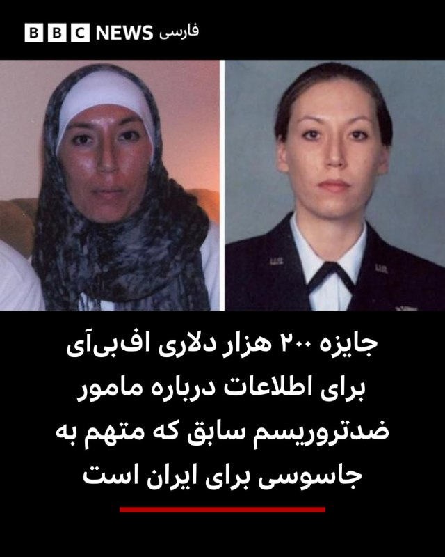

‌ ‌ ‌ ‌
مقر پلیس آگاهی فدرال آمریکا - اف‌بی‌آی - در واشنگتن، با صدور اطلاعیه‌ای از اختصاص جایزه ۲۰۰ هزار دلاری برای هرگونه اطلاعات درباره مونیکا ویت، متخصص اطلاعاتی و مامور ضدجاسوسی سابق نیروی هوایی این کشور، خبر داده است.

در اطلاعیه روز پنجشنبه - ۱۴ مه / ۲۴ اردیبهشت - دفتر اف‌بی‌آی در واشنگتن آمده است: «مونیکا ویت، متخصص اطلاعاتی سابق نیروی هوایی آمریکا و مامور ویژه دفتر تحقیقات ویژه نیروی هوایی، بین سال‌های ۱۹۹۷ تا ۲۰۰۸ در ارتش خدمت کرد و سپس تا سال ۲۰۱۰ به عنوان پیمانکار دولت آمریکا فعالیت داشت. خدمت نظامی و فعالیت پیمانکاری او دسترسی به اطلاعات محرمانه و فوق محرمانه مرتبط با اطلاعات خارجی و ضدجاسوسی، از جمله هویت واقعی نیروهای مخفی جامعه اطلاعاتی آمریکا، را برایش فراهم کرده بود.»

https://bbc.in/4uOSYjh
📷 FBI
@BBCPersian

## bbcpersian — post 281065

🔻 قاضی کانادایی طومار درخواست استقلال آلبرتا را رد کرد

یک قاضی در استان آلبرتا دادخواستی را که خواستار جدایی این استان از کانادا بود، رد کرد؛ پس از آنکه گروه‌های بومی استدلال کردند استقلال آلبرتا بدون مشورت با آنان، حقوق معاهده‌ای‌شان با دولت فدرال کانادا را نقض می‌کند.

این حکم ۳۷ صفحه‌ای روز چهارشنبه توسط قاضی شاینا لئونارد در دادگاهی در ادمونتون آلبرتا صادر شد.

این تصمیم پس از آن اتخاذ شد که گروه «آزاد بمان آلبرتا - Stay Free Alberta»، که پشت کارزار مردمی استقلال آلبرتا قرار دارد، اعلام کرد بیش از ۳۰۰ هزار امضا جمع‌آوری کرده؛ رقمی که برای برگزاری همه‌پرسی سراسری در استان کافی است.

قاضی لئونارد تا زمان صدور رأی درباره شکایت حقوقی اقوام بومی، روند تایید امضاها را متوقف کرده بود.

در بخشی از این حکم، قاضی اعلام کرد که در مورد مشورت با اقوام آتاباسکا چیپویان، بلاد ترایب، پیکانی نیشن و سیکسیکا نیشن کوتاهی صورت گرفته است.

او در حکم خود نوشت: «از منظر منطق و عقل سلیم، هیچ تردیدی وجود ندارد که جدایی آلبرتا از کانادا بر» دو معاهده‌ای که در قرن نوزدهم میان مردم بومی اولیه ساکن اینجا و نظام سلطنتی بریتانیا امضا شد، «تاثیر خواهد گذاشت.»

قاضی لئونارد افزود با وجود تاثیر آشکار جدایی، «هیچ مشورتی انجام نشده است» و تاکید کرد: «دولت آلبرتا وظیفه خود برای مشورت با شاکیان را نقض کرده است.»

https://bbc.in/42D9Eyp
@BBCPersian

## bbcpersian — post 281064

  

‌ ‌ ‌ ‌
پدرو سانچز، نخست‌وزیر اسپانیا با حمایت از لامین یامال، فوق ستاره تیم بارسلونا که پرچم فلسطین را در مراسم قهرمانی این تیم بلند کرده بود گفته است:

«کسانی که برافراشتن پرچم یک کشور را «تحریک به نفرت» می‌دانند، یا قضاوت خود را از دست داده‌اند یا حقارت‌شان کورشان کرده است. لامین تنها همبستگی با فلسطین را ابراز کرده است؛ احساسی که میلیون‌ها اسپانیایی آن را دارند. دلیلی دیگر برای افتخار به او.»

بارسلونا روز یکشنبه با شکست رقیب سنتی خود - رئال مادرید - سه هفته مانده به پایان مسابقات لالیگا امسال، قهرمان شد. بازیکنان این تیم روز بعد در جشن خیابانی میان هواداران بارسلونا حاضر شدند که در جریان این جشن لامین یامال با بلند کردن پرچم اسرائیل موجب هیجان در میان جمعیت حاضر شد اما پس از آن با موجی از انتقادها در شبکه‌های مجازی روبرو شد.

اسپانیا از کشورهای پیشگام در اروپا است که کشور مستقل فلسطینی را به رسمیت شناخته است.

https://bbc.in/4eNo0DM
📷INSTAGRAM/Reuters
@BBCPersian

## bbcpersian — post 281063

  

‌ ‌ ‌
دولت کوبا اعلام کرد که جان رتکلیف، رئیس سازمان سیا، پس از تمدید پیشنهاد کمک ۱۰۰ میلیون دلاری ایالات متحده برای کاهش اثرات محاصره نفتی، با همتای کوبایی خود در وزارت کشور در هاوانا دیدار کرده است.

در بیانیه‌ای که از سوی دولت کوبا منتشر شده گفته شده این دیدار تلاشی برای بهبود گفتگو بوده و به مقامات آمریکایی گفته شده است که هاوانا تهدیدی برای امنیت ملی ایالات متحده نیست.

کمبود سوخت مانند گازوئیل و نفت کوره، به دلیل فشار اعمال شده از سوی ایالات متحده بر تامین مواد ضروری این کشور کمونیستی تشدید شده و باعث شده بیمارستان‌های کوبا نتوانند به طور عادی کار کنند و مدارس و ادارات دولتی تعطیل شوند.

به طور جداگانه، میگل دیاز-کانل، رئیس جمهور کوبا، گفت که به جای ارائه کمک، اگر ایالات متحده محاصره خود را لغو کند، شرایط می‌تواند سریع‌تر بهبود یابد.

در بیانیه کوبا آمده است: «هر دو طرف همچنین بر علاقه خود به توسعه همکاری‌های دوجانبه بین سازمان‌های مجری قانون به نفع امنیت هر دو کشور و همچنین امنیت منطقه‌ای و بین‌المللی تاکید کردند.»

https://bbc.in/4wuy5vF
📷Reuters
@BBCPersian

---
📅 بروزرسانی: 1405/02/25 03:41
---

## persian_trend_official — post 14170

  <a href="telegram/content/persian_trend_official_14170_1778803901.mp4" target="_blank">🎬 Download video</a>

🔴یک نیروی حزب‌الله تا از محل اختفا خودش بیرون آمد توسط نیرو های تیپ گولانی هدف قرار گرفت و کشته شد.

🫆:Tony

📌 @persian_trend_official
پرشین ترند | متفاوت‌ترین کانال نظامی

## bbcpersian — post 281062

  

‌ ‌ ‌
وزارت خارجه ایتالیا اعلام کرد که پنج شهروند این کشور در یک حادثه غواصی در مالدیو جان باختند.

این وزارتخانه با بیان اینکه این اتفاق در جزیره واوو آتول رخ داده است، اعلام کرد: «گمان می‌رود غواصان هنگام تلاش برای کاوش غارها در عمق ۵۰ متری جان خود را از دست داده‌اند.»

ارتش مالدیو اعلام کرد که یک جسد در غاری در حدود ۶۰ متری زیر آب پیدا شده و گمان می‌رود چهار غواص دیگر نیز در آنجا باشند.

به گفته ارتش مالدیو غواصانی با تجهیزات ویژه به منطقه اعزام شده‌اند و عملیات جستجو را بسیار پرخطر توصیف کرده است.

اعتقاد بر این است که این حادثه بدترین حادثه غواصی در این کشور کوچک اقیانوس هند است که به دلیل رشته جزایر مرجانی خود، یک مقصد گردشگری محبوب است.

خدمه کشتی که غواص‌ها با آن سفر می‌کردند، پس از آنکه نتوانستند با غواص‌ها تماس برقرار کنند و آنها به سطح آب بازنگشتند، مفقود شدن آنها را گزارش کردند.

📷 Reinhard Dirscherl/ullstein bild via Getty Images
@BBCPersian

---
📅 بروزرسانی: 1405/02/25 02:44
---

## bbcpersian — post 281061

  

‌ ‌ ‌ ‌
الناز و الهه محمدی، خبرنگاران ایرانی از سوی بنیاد بین‌المللی زنان رسانه که در واشنگتن آمریکاست، به عنوان برندگان جایزه سال ۲۰۲۶ در زمینه «شجاعت در روزنامه‌نگاری» شدند.

این بنیاد روز پنجشنبه - ۱۴ مه / ۲۴ اردیبهشت - در بیانیه اعلام برندگان جوایز امسال گفت: «ما با افتخار فراوان اعلام می‌کنیم که برندگان جوایز «شجاعت در روزنامه‌نگاری» سال ۲۰۲۶ عبارتند از الهه محمدی و الناز محمدی از ایران.»

الهه محمدی، خبرنگار روزنامه هم‌میهن در سال ۱۴۰۱ به محل خاکسپاری مهسا امینی رفت و گزارشی از آن منتشر نمود و با شروع اعتراضات سراسری آن سال در ایران به همراه نیلوفر حامدی بازداشت و محاکمه شدند و بیش از یکسال در زندان بودند. خواهر او، الناز محمدی هم دبیر گروه جامعه روزنامه هم میهن است.

https://bbc.in/4eMEfRt
📷@parsaee_d
@BBCPersian

## bbcpersian — post 281060

🔻 راستی‌آزمایی بی‌بی‌سی؛ ادعاهای گمراه‌کننده درباره تشریفات لحظه رسیدن ترامپ و اوباما به پکن

ادعاهای گمراه‌کننده درباره مقایسه استقبال فرش قرمز از رئیس‌جمهور آمریکا، دونالد ترامپ، در سفر رسمی این هفته به پکن با استقبال کم‌تشریفات‌تر از باراک اوباما در سفرش به چین، میلیون‌ها بار در اینترنت دیده شده است.

بنی جانسون، مفسر محافظه‌کار آمریکایی، در شبکه ایکس نوشت: «وقتی اوباما به چین رفت، حتی برایش پله هم پای هواپیما نیاوردند»، و افزود: «ترامپ با استقبال قهرمانانه و فرش قرمز روبه‌رو شد.» این پست بیش از پنج میلیون بازدید داشته است.

بنی جانسون ویدیویی را نیز منتشر کرد که اوباما را هنگام پیاده شدن از پله‌های داخلی هواپیمای ایر فورس وان در زمان ورود به پکن در سال ۲۰۱۶ نشان می‌دهد.

اما آن سفر مربوط به نشست گروه ۲۰ بود که چین در همان سال میزبانی آن را بر عهده داشت؛ نه یک سفر رسمی دولتی مانند سفر کنونی دونالد ترامپ، که معمولا با تشریفات و مراسم بیشتری برای رهبران آمریکا همراه است.

مقایسه مناسب‌تر، سفر رسمی اوباما به چین در سال ۲۰۰۹ است. در آن سفر نیز مراسم استقبالی مشابه سفر آقای ترامپ برگزار شد؛ جایی که رئیس‌جمهور وقت آمریکا از پله‌های اصلی هوایپمای خصوصی روسای جمهوری آمریکا - ایر فورس وان - پایین آمد و توسط گارد احترام نظامی مورد استقبال قرار گرفت.

https://bbc.in/4ds1ttM
@BBCPersian

---
📅 بروزرسانی: 1405/02/25 01:38
---

## OfficialPersiaTwiter — post 498557

خبرگزاری فاکس‌نیوز:
ترامپ و تیم همراهش از ترس این که مبادا چینی‌ها لپتاپ و گوشی‌هاشونو هک کنن یا نرم‌افزار جاسوسی روشون نصب کنن، همگی از گوشی و لپتاپ‌های جایگزین برای سفر به چین استفاده کردند.

》OPT《

@OfficialPersiaTwiter

## OfficialPersiaTwiter — post 498556

  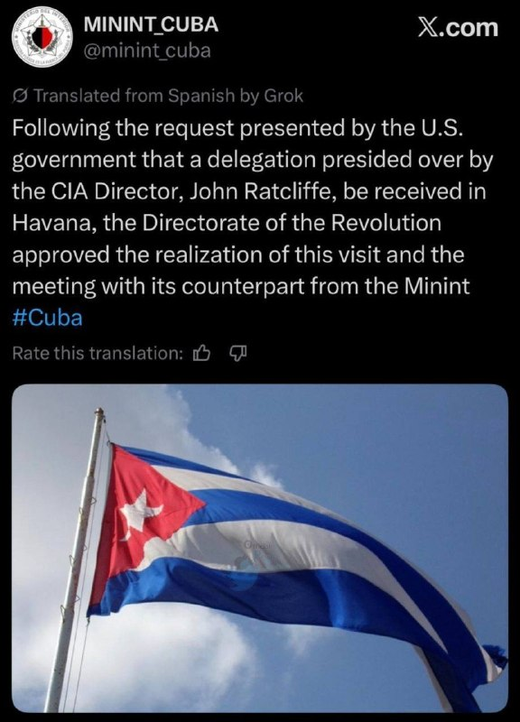

بلومبرگ: کوبا با کمبود سوخت مواجه شد و کشور را در تاریکی فرو برد کوبا اعلام کرد که کشور به‌طور کامل از دیزل و نفت مورد نیاز برای تأمین نیروگاه‌های خود خالی شده است. وزیر انرژی کوبا گفت: «سیستم، یک بار دیگر، بدون هیچ ذخیره سوختی باقی مانده است»، او ادامه…

## OfficialPersiaTwiter — post 498555

  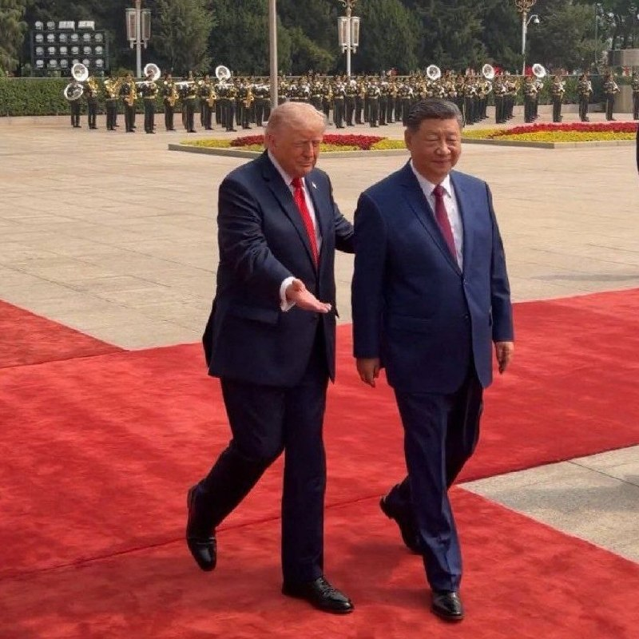

زن به شوهرش: تعارف نکنی بیان داخل!
همون لحظه شوهره:

》سباستین《

@OfficialPersiaTwiter

## OfficialPersiaTwiter — post 498554

🔴 سفر هفته آینده رئیس جمهور اسرائیل به آمریکا به طور ناگهانی لغو شد.

》OPT《

@OfficialPersiaTwiter

## bbcpersian — post 281059

  

‌ ‌ ‌ ‌
دادگاه وابسته به سازمان ملل متحد درخواست آزادی راتکو ملادیچ، جنایتکار جنگی صرب بوسنیایی، را به دلیل نزدیک بودن به پایان عمرش رد کرد.

قاضی گراسیلا گاتی سانتانا ضمن پذیرش اینکه او «در مراحل پایانی زندگی خود» است، گفت که شرایط زندان سازمان ملل و بیمارستان آن در لاهه «از چنان کیفیت بالایی برخوردار است که می‌توان آسایش ملادیچ را به حداکثر برساند.»

او گفت: «هیچ درمان اضافی دیگری که در هلند در دسترس نباشد، در جای دیگری در دسترس نیست.»

ملادیچ، ۸۴ ساله، در سال ۲۰۱۷ به جرم نسل‌کشی، جنایات جنگی و جنایات علیه بشریت در طول جنگ‌های یوگسلاوی سابق در سال‌های ۱۹۹۲ تا ۱۹۹۵ به حبس ابد محکوم شد.

حکم او که به «قصاب بوسنی» معروف است، در سال ۲۰۲۱ در دادگاه تجدیدنظر تایید شد.

قاضی گاتی سانتانا روز پنجشنبه در حکمی کتبی اذعان کرد که «وضعیت فعلی ملادیچ وخیم است.»

اما او افزود که آقای ملادیچ «همچنان از سوی پزشکان، پرستاران و کارکنان زندان واجد شرایط، تحت درمان جامع و دلسوزانه قرار دارد.»

https://bbc.in/49BVSQn
📷Reuters
@BBCPersian

## bbcpersian — post 281058

‌ ‌ ‌ ‌ ‌ حساب محمدباقر قالیباف، رئیس مجلس شورای اسلامی ایران، در پستی تازه به گزارش روز گذشته درباره تورم و افزایش نرخ بهره در آمریکا به عنوان یکی از پیامدهای جنگ با ایران واکنش نشان داده و خطاب به دونالد ترامپ، رئیس جمهور آمریکا نوشته است: «پس شما در حال…

## bbcpersian — post 281057

  

‌ ‌ ‌ ‌ ‌
حساب محمدباقر قالیباف، رئیس مجلس شورای اسلامی ایران، در پستی تازه به گزارش روز گذشته درباره تورم و افزایش نرخ بهره در آمریکا به عنوان یکی از پیامدهای جنگ با ایران واکنش نشان داده و خطاب به دونالد ترامپ، رئیس جمهور آمریکا نوشته است:

«پس شما در حال تأمین مالی (پیت) هگست، مجری تلویزیونی شکست‌خورده، با نرخ‌هایی هستید که از سال ۲۰۰۷ بی‌سابقه بوده، تا او بتواند در حیاط خلوت ما در تنگه هرمز، نقش «وزیر جنگ» را بازی کند؟»

حساب کاربری آقای قالیباف که از زمان آغاز جنگ آمریکا و اسرائیل علیه ایران، بارها واکنش‌های اغلب همراه با طعنه خطاب به دونالد ترامپ مورد توجه قرار گرفته است، در ادامه پست روز پنجشنبه - ۲۴ اردیبهشت - نوشته است:

«می‌دانید چه چیزی دیوانه‌کننده‌تر از بدهی ۳۹ تریلیون دلاری است؟ این که برای تامین مالی این جنگ‌، نرخ بهره‌ای به اندازه دوران پیش از بحران مالی جهانی در سال ۲۰۰۸ بپردازید و در نهایت فقط یک بحران مالی جهانی جدید نصیب‌تان شود.»

https://bbc.in/4f6noJB
📷shahraranews
@BBCPersian

## networkti — post 349

اگر شیر و خورشید وصل نمی‌شود، طبق راهنمای زیر عمل کنید. وارد بخش Options اپلیکیشن 
👑 شوید، گزینه‌ی More Options را انتخاب کنید و در قسمت CDN Edge IPs، آی‌پی زیر و در قسمت CDN SNI Hostname، نام دامنه زیر را وارد کرده و OK را بزنید. CDN Edge IPs: 151.101.192.223…

## networkti — post 348

ShirOKhorshid-2026.05.14.apk

## networkti — post 347

برای اسکنر آیپی که خیلی‌هاتون پرسیده بودید دایرکت، ساده‌ترین راه اینه توی ترمینال(چه cmd ویندوز چه ترمینال termux) بنویسید
ping 20.20.20.20(آیپی مورد نظر)
حالا اگر اسکنر هوشمند بخواید، میتونیت از پروژه سم استفاده کنید که اصلش برای کلودفلره، اما میتونید کلا لیست آیپی بدید اسکن کنه:
https://github.com/SamNet-dev/cfray

## networkti — post 346

  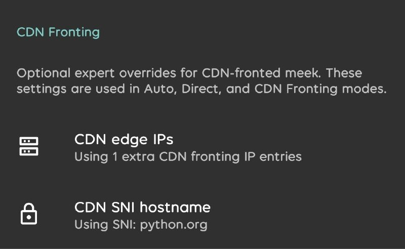

اگر شیر و خورشید وصل نمی‌شود، طبق راهنمای زیر عمل کنید.

وارد بخش Options اپلیکیشن 
👑 شوید، گزینه‌ی More Options را انتخاب کنید و در قسمت CDN Edge IPs، آی‌پی زیر و در قسمت CDN SNI Hostname، نام دامنه زیر را وارد کرده و OK را بزنید.

CDN Edge IPs: 151.101.192.223
CDN SNI Hostname: python.org

در انتها OK را بزنید، به صفحه‌ی اصلی بازگشته و START را بزنید.

@break_the_barriers

## Tans_Footbali — post 236303

سنتکام: از آغاز محاصره دریایی بنادر ایران، 72 کشتی تجاری را منحرف و 4 کشتی را از کار انداختیم

💛@Tans_Footbali

## Tans_Footbali — post 236302

  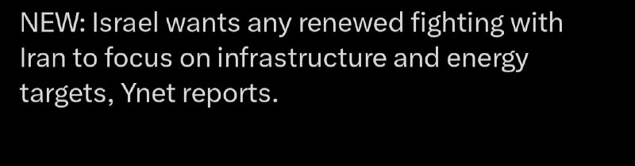

یدیعوت آحارونوت: اسرائیل می‌خواد اگه درگیری با ایران دوباره شروع بشه،تمرکزش روی زدن زیرساخت‌ها و اهداف انرژی باشه

💛@Tans_Footbali

## withyashar — post 11253

https://t.me/boost/withyashar

## withyashar — post 11252

آقا ما استیکر حامله میخوایم

## withyashar — post 11251

ترامپ در تروث : «وقتی رئیس‌جمهور شی با بیانی بسیار سنجیده از ایالات متحده به‌عنوان کشوری که شاید در حال افول باشد یاد کرد، منظور او آسیب عظیمی بود که ما در چهار سال دوران جو بایدنِ خواب‌آلود و دولت بایدن متحمل شدیم؛ و در این مورد، او صددرصد درست می‌گفت.

کشور ما با مرزهای باز، مالیات‌های سنگین، ترویج تغییر جنسیت برای همه، حضور مردان در ورزش زنان، سیاست‌های موسوم به تنوع و شمول، توافق‌های تجاری وحشتناک، جرم و جنایت گسترده و بسیاری مسائل دیگر، آسیب غیرقابل‌تصوری دید!
@withyashar
رئیس‌جمهور شی به هیچ‌وجه به رشد شگفت‌انگیزی اشاره نمی‌کرد که ایالات متحده در طول شانزده ماه فوق‌العاده دولت ترامپ به جهان نشان داده است؛ دورانی که شامل رکورد تاریخی بازار بورس و صندوق‌های بازنشستگی، پیروزی نظامی و روابط شکوفا با ونزوئلا، درهم‌کوبیدن نظامی ایران (ادامه دارد!)، قدرتمندترین ارتش جهان با اختلاف بسیار زیاد، تبدیل دوباره آمریکا به یک قدرت اقتصادی عظیم، جذب رکورد هجده تریلیون دلار سرمایه‌گذاری خارجی در آمریکا، بهترین بازار کار تاریخ ایالات متحده با بیشترین تعداد شاغلان تاریخ کشور، پایان دادن به سیاست‌های ویرانگر موسوم به تنوع و شمول و بسیاری موفقیت‌های دیگر بوده که فهرست کردن همه آنها ممکن نیست.

در حقیقت، رئیس‌جمهور شی بابت این همه موفقیت بزرگ در چنین مدت کوتاهی به من تبریک گفت.

دو سال پیش، ما واقعاً کشوری در حال افول بودیم. در این مورد کاملاً با رئیس‌جمهور شی موافقم! اما حالا ایالات متحده داغ‌ترین و پررونق‌ترین کشور جهان است و امیدوارم رابطه ما با چین از همیشه قوی‌تر و بهتر باشد!»
@withyashar

## withyashar — post 11250

فاکس نیوز : تو سفر ترامپ، بین مأموران سرویس مخفی آمریکا و پلیس چین، تنش ایجاد شده و درگیری لفظی و حتی فیزیکی هم پیش اومده.
@withyashar

## withyashar — post 11249

  

کت کش ها در مراسم اربعین کتلت سرلشکر سیدعبدالرحیم موسوی در قم
@withyashar

## withyashar — post 11248

  <a href="telegram/content/withyashar_11248_1778796542.mp4" target="_blank">🎬 Download video</a>

‏ترامپ به دلیل مرگ برادر بزرگترش که بر اثر نوشیدن الکل جانش را از دست داد ،مشروب نمیخوره ،ولی اینجا جرعه‌ای از آن را مینوشه و به نشانه احترام به رئیس جمهور شی جین پینگ
‏ولی داشت بالا می‌آورد
@withyashar

---
📅 بروزرسانی: 1405/02/25 00:23
---

## persian_trend_official — post 14169

  <a href="telegram/content/persian_trend_official_14169_1778792030.mp4" target="_blank">🎬 Download video</a>

شبتون بخیر ❤️🥱

📝 Nick

📌 @persian_trend_official
پرشین ترند | متفاوت‌ترین کانال نظامی

## persian_trend_official — post 14168

  <a href="telegram/content/persian_trend_official_14168_1778792031.webm" target="_blank">🎬 Download video</a>

🔴 جایزه جمهوری اسلامی برای کشتن ترامپ

🔹عزیزی، رئیس کمیسیون امنیت ملی مجلس: پیش بینی کرده‌ایم دولت به هر کسی که این رسالت دینی (کشتن ترامپ) را انجام دهد، به عنوان پاداش ۵۰ میلیون یورو بپردازد

🫆:Tony

📌 @persian_trend_official
پرشین ترند | متفاوت‌ترین کانال نظامی

## persian_trend_official — post 14167

  

⭕️سریعترین اینترنت های جهان در یک نگاه...

📌خاموشی اینترنت هم در ایران به بیش از 1800 ساعت رسیده و وارد روز ۷۷ ام شده

🫆:Tony

📌 @persian_trend_official
پرشین ترند | متفاوت‌ترین کانال نظامی

## persian_trend_official — post 14166

⭕️بولتن خبری و شبانه پرشین ترند

🔻🔻🔻🔻🔻🔻🔻🔻🔻

💢 دیدار ترامپ و شی جین‌پینگ در پکن با محوریت ایران، تایوان و تنگه هرمز
────────── ──
💢 شی جین‌پینگ: تایوان خط قرمز چین است
────────── ──
💢 ترامپ: برای پایان جنگ با ایران به کمک چین نیاز نداریم
────────── ──
💢 چین: روابط با آمریکا مهم‌ترین رابطه جهان است
────────── ──
💢 روبیو: چین باید ایران را به عقب‌نشینی وادار کند
────────── ──
💢 واشینگتن‌پست: چین از جنگ ایران سود راهبردی می‌برد
────────── ──
💢 آتش‌بس ایران و آمریکا در آستانه فروپاشی
────────── ──
💢 عراقچی: تنگه هرمز را آمریکا بسته است، نه ایران
────────── ──
💢 ابراهیم رضایی: غنی‌سازی ۹۰ درصدی یکی از گزینه‌های ایران است
────────── ──
💢 ادعای توقیف یک شناور نزدیک فجیره توسط ایران
────────── ──
💢 امارات اطراف مخازن نفتی دبی موانع ضدپهپادی نصب کرد
────────── ──
💢 تنش تازه میان ایران و کویت بر سر بازداشت ۴ ایرانی
────────── ──
💢 رویترز: جنگنده‌های سعودی مواضع گروه‌های عراقی را هدف قرار دادند
────────── ──
💢 روسیه یکی از بزرگ‌ترین حملات جنگ را علیه اوکراین انجام داد
────────── ──
💢 شلیک بیش از ۱۴۰۰ پهپاد و ۵۰ موشک روسی به اوکراین
────────── ──
💢 روسیه زیردریایی‌های هسته‌ای بوری را با تور ضدپهپاد پوشاند
────────── ──
💢 انتشار تصاویر آزمایش موشک سارمات روسیه
────────── ──
💢 مشاهده سامانه پدافندی چینی در دست سرباز اوکراینی
────────── ──
💢 چین تولید جنگنده پنهانکار جی-۲۰ را با کارخانه تمام‌خودکار افزایش داد
────────── ──
💢 طوفان مرگبار در هند ده‌ها کشته برجای گذاشت
────────── ──
💢 وزیر بهداشت دولت بریتانیا علیه استارمر استعفا داد

🫆:Tony

📌 @persian_trend_official
پرشین ترند | متفاوت‌ترین کانال نظامی

## persian_trend_official — post 14164

  

🔴وزیر بهداشت انگلیس استعفا کرد؛ شورش در کابینه استارمر

🔹وس استریتینگ، وزیر بهداشت انگلیس روز پنجشنبه با صدور نامه‌ای به کی‌یر استارمر نخست‌وزیر این کشور از سمت خود استعفا داد.

🔹او با بیان اینکه «اعتماد خود را به رهبری» نخست‌وزیر از دست داده تصریح کرد که به باور او ماندن در دولت اقدامی «ناپسند» خواهد بود.

🔹استارمر از زمانی که حزب کارگر در انتخابات محلی انگلستان و پارلمان اسکاتلند و ولز شکست سنگینی خورد، با شورش در حزب خود مواجه شده است.

🔹نزدیک به ۹۰ نماینده کارگر به طور علنی خواستار استعفای او شده‌اند. استریتینگ اولین عضو کابینه استارمر است که از زمان شروع این شورش استعفا می‌دهد.

🔹در روزهای گذشته دفتر نخست‌وزیری انگلیس که در داونینگ استریت مستقر است بارها تأکید کرده که استارمر قصد استعفا ندارد.

🔹او روز دوشنبه در سخنرانی خود قول داد که در پست خود بماند و گفت تغییر رهبری، بریتانیا را دوباره به «هرج‌ومرجی» فرو خواهد برد که در دوران حزب محافظه‌کار حاکم بود.

🫆:Tony

📌 @persian_trend_official
پرشین ترند | متفاوت‌ترین کانال نظامی

## persian_trend_official — post 14163

  

🔴 ابراهیم عزیزی، رییس کمیسیون امنیت ملی مجلس،

💢اماده‌ایم در تنگه هرمز و سایر میادین، بار دیگر دشمن را شکست بدهیم.»

💢به دشمنان هشدار می‌دهیم اگر دچار خطای محاسباتی شده و به امنیت ما خدشه‌ای وارد کنند، امنیت آن‌ها را در هر کجای جهان که باشد، سلب خواهیم کرد

💢او افزود: «امروز دشمن در تنگه هرمز در حال غرق‌شدن و تجربه شکست دیگری است و پیام ما به دشمن این است که هر اقدام محاسبه‌نشده، پاسخی دردناک به همراه خواهد داشت.»

🫆:Tony

📌 @persian_trend_official
پرشین ترند | متفاوت‌ترین کانال نظامی

## OfficialPersiaTwiter — post 498553

  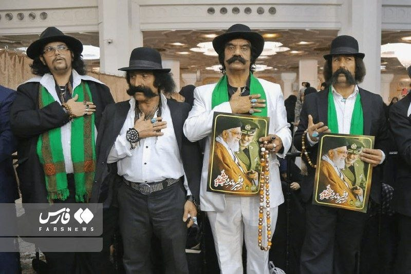

تصویر متفاوت فارس از مراسم اربعین شهید سرلشکر سیدعبدالرحیم موسوی در قم

》OPT《

@OfficialPersiaTwiter

## OfficialPersiaTwiter — post 498552

ترامپ پس از بازگشت از چین درباره آینده جنگ ایران تصمیم می‌گیرد؟ 🔹برخی مقامات اسرائیلی معتقدند دونالد ترامپ پس از بازگشت از چین در پایان هفته، درباره آینده تنش‌ها با ایران تصمیم‌گیری خواهد کرد. 🔹به گزارش فرارو به نقل از شبکه تلویزیونی کان اسرائیل، مقامات…

## OfficialPersiaTwiter — post 498551

🔺کانال ۱۲ اسرائیل: اسرائیل سطح هشدار خود را به بالاترین حد ممکن افزایش می‌دهد تا برای احتمال جنگی تازه با ایران پس از بازگشت ترامپ از چین آماده شود • OPT • @OfficialPersiaTwiter

## OfficialPersiaTwiter — post 498550

  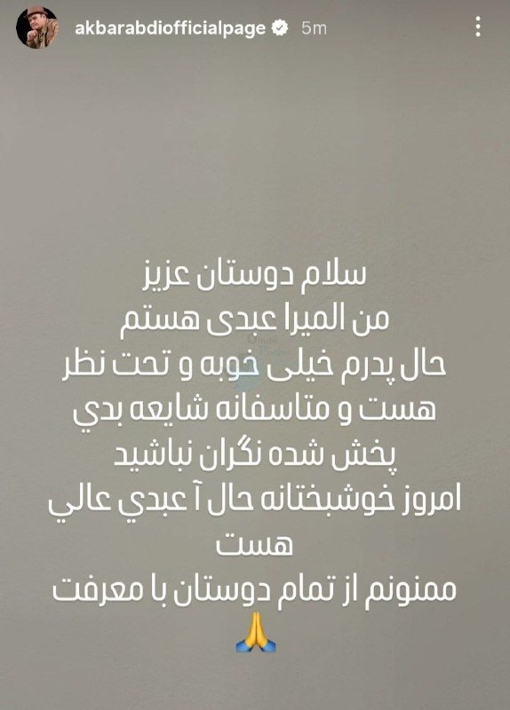

خبر خوش دختر اکبر عبدی درباره شرایط پدرش 🔹 اکبر عبدی با بهبود حال عمومی تا چند روز آینده از بیمارستان مرخص می‌شود. 🔹 المیرا عبدی، دختر اکبر عبدی امروز درباره آخرین وضعیت این بازیگر سینما، تئاتر و تلویزیون گفت: ایشان دچار یک سکته خفیف شدند و الان خدا را شکر…

## OfficialPersiaTwiter — post 498549

  

محمد قنطری، سرپرست جدید امور سوریه در واشنگتن دی.سی، در دیدار با فرستاده ویژه آمریکا، تام باراک

》OPT《

@OfficialPersiaTwiter

## OfficialPersiaTwiter — post 498548

رهایی مرد ۴۲ ساله از چنگ آدم ربایان بعد از ۶ ماه

🔹سرهنگ میر حبیبی رییس پلیس آگاهی استان کرمان در تشریح این خبر چنین گفت: مردی ۴۲ ساله در آبان ماه سال ۱۴۰۴ توسط ۴ نفر آدم ربا مسلح از شهر کرمان ربوده شد و گروگانگیرهابرای آزادی وی درخواست ۳ کیلو گرم طلا کرده بودند.
🔹کار آگاهان پلیس آگاهی پس از چند ماه کار اطلاعاتی و فنی محل حضور ربوده شده را در شهرستان ایرانشهر را شناسایی و با اعزام دو تیم تلفیقی از نیروهای ضربت و کارآگاهان پلیس آگاهی کرمان ربوده شده آزاد و سه نفر آدم ربا نیز دستگیر گردید.
🔹بعد از گذشت قریب به ۶ ماه این مرد به آغوش خانواده بازگشت و متهمین به مرجع قضایی معرفی شدند.

》OPT《

@OfficialPersiaTwiter

## OfficialPersiaTwiter — post 498547

ثبت دمای بالاتر از ۴۰ درجه در چند شهر کشور

🔹آسمان شمال شرق و شرق کشور امروز ابری بود و از شیروان و مانه و سملقان خراسان شمالی رعد و برق و رگبار ملایم باران گزارش شد.

🔹دمای هوا در ارتفاعات و دامنه‌های البرز امروز به کم‌تر از ۱۰ درجه و در شهرهای خوزستان، بوشهر، هرمزگان، کرمان و سیستان و بلوچستان به ۴۰ درجه سلسیوس رسید.

🔹دمای هوا در برخی شهرها مثل بستک هرمزگان، بندر دیر بوشهر، شهداد کرمان و زهک و زابل سیستان و بلوچستان از ۴۰ درجه هم فراتر رفت.

》OPT《

@OfficialPersiaTwiter

## OfficialPersiaTwiter — post 498546

فراکسیون حزب‌الله: لبنان به مذاکرات مستقیم با اسرائیل پایان دهد

🔹فراکسیون وفاداری به مقاومت در پارلمان لبنان: جنایات اشغالگران صهیونیست باعث شده مردم لبنان به استفاده از گزینه مقاومت، مصمم‌تر شوند.

🔹این فراکسیون که وابسته به حزب الله است با بیان اینکه مردم لبنان تمام ابزارهای قدرت را برای آزادسازی سرزمین خود دارند، تاکید کرد: مذاکرات مستقیمی که دولت با رژیم صهیونیستی انجام می‌دهد، همزمان با ادامه جنایات و تلاش آن برای گسترش اشغالگری‌اش صورت می‌گیرد./باشگاه خبرنگاران

》OPT《

@OfficialPersiaTwiter

## OfficialPersiaTwiter — post 498545

  <a href="telegram/content/OfficialPersiaTwiter_498545_1778792035.mp4" target="_blank">🎬 Download video</a>

انفجار بسته باروت در دست مرد هندی؛ مرد ۵۲ ساله زخمی شد

🔹یک مرد ۵۲ ساله در هند پس از افتادن بسته‌ای حاوی باروت از دستش، دچار حادثه شد و زخمی گردید.

🔹 این بسته پس از برخورد با زمین منفجر شد. با وجود شدت انفجار، این مرد زنده ماند و با جراحات از محل حادثه منتقل شد.

》OPT《

@OfficialPersiaTwiter

## OfficialPersiaTwiter — post 498544

جای خالیت تویِ جدول تناوبی مندلیف به شدت احساس میشه، به عنوان سست ترین عنصر موجود.

》hesamita《

@OfficialPersiaTwiter

## OfficialPersiaTwiter — post 498543

  <a href="telegram/content/OfficialPersiaTwiter_498543_1778792036.mp4" target="_blank">🎬 Download video</a>

تهدید کویت توسط عضو کمیسیون امنیت ملی مجلس

خضریان:
🔹کویت فراموش نکند که تنها در ۹۰ دقیقه توسط صدام تسخیر شد و امروز هم حد و حدود خود را بداند که جمهوری اسلامی بسیار قدرتمند است.

》OPT《

@OfficialPersiaTwiter

## OfficialPersiaTwiter — post 498542

🔴 جایزه دولت برای کشتن ترامپ

🔹عزیزی، رئیس کمیسیون امنیت ملی مجلس: پیش بینی کرده‌ایم دولت به هر کسی که این رسالت دینی (کشتن ترامپ) را انجام دهد، به عنوان پاداش ۵۰ میلیون یورو بپردازد

》OPT《

@OfficialPersiaTwiter

## bbcpersian — post 281056

  

‌🔻ایتامار بن گوویر، وزیر امنیت ملی اسرائیل، که گرایشات راست افراطی دارد، قوانین دیرینه اماکن مذهبی این کشور را زیر پا گذاشته و یک پرچم اسرائیل را در کنار مسجدالاقصی به حرکت درآورده است. یهودیان به این مکان، کوه معبد می‌گویند.

در فیلمی که از این وزیر اسرائیلی بعد از برافراشتن پرچم اسرائیل گرفته شده، دیده می‌شود که او رقص‌کنان، آواز «کوه معبد در دستان ماست» را سرمی‌دهد. پس از آن، ده‌ها هزار اسرائیلی در یک مراسم سالیانه مذهبی و ملی در بخش قدیمی بیت‌المقدس راهپیمایی کردند.

«راهپیمایی پرچم» به مناسبت سالگرد تصرف بیت‌المقدس شرقی ا‌ز سوی اسرائیل در جنگ سال ۱۹۶۷ برگزار می‌شود.

خبرنگار بی‌بی‌سی در بیت‌المقدس می‌گوید این مراسم معمولا با خشونت و شعارهای نژادپرستانه علیه ساکنان فلسطینی این منطقه از بیت‌المقدس همراه است.

امسال، ده‌ها فعال صلح‌طلب اسرائیل تلاش کردند با این آزار و اذیت‌ها مقابله کنند.

📷Reuters
https://bbc.in/490B5pq

@BBCPersian

## bbcpersian — post 281055

  <a href="telegram/content/bbcpersian_281055_1778792039.mp4" target="_blank">🎬 Download video</a>

🔻آخرین خبرهای مهم روز پنجشنبه ۲۴ اردیبهشت ۱۴۰۵
@BBCPersian

## Lichargoo — post 24878

  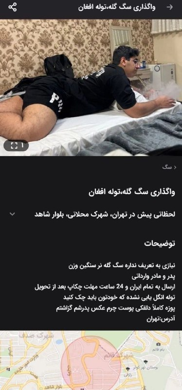

عادی ترین شوخی پسرا😂 :

@Lichargoo

## networkti — post 345

CDN Edge IPs: 151.101.192.223
CDN SNI Hostname: python.org

مثل اینکه با این مقدار ها کار‌میکنه هنوز

## Pesari_Ke_Konie — post 44938

رفیقم بعد ۸۰ روز ان شده الان استوریش وا کردم دیدم نوشته استارلینک ۵ گیگ ۱ تومن

@Pesari_Ke_Konie

## Pesari_Ke_Konie — post 44937

آکسیوس:
امشب شب جمعه‌ست و خیلی از پاها بالاست

@Pesari_Ke_Konie

## Tans_Footbali — post 236301

  <a href="telegram/content/Tans_Footbali_236301_1778792041.mp4" target="_blank">🎬 Download video</a>

عزیزی، رئیس کمیسیون امنیت ملی و سیاست خارجی:
پیش بینی کردیم هرکس که ترامپ رو به قتل برسونه، 50 میلیون یورو پاداش دریافت کنه.

💛@Tans_Footbali

## Tans_Footbali — post 236300

  <a href="telegram/content/Tans_Footbali_236300_1778792042.mp4" target="_blank">🎬 Download video</a>

نتانیاهو : بخش‌های بزرگی از محور شرارت ایران رو زدیم

محوری که از همه طرف دور و برمون رو گرفته بود

یه خطر جدی و فوری رو از خودمون دور کردیم

بمب‌های هسته‌ای و هزاران موشک بالستیکی که ایران داشت توسعه می‌داد

💛@Tans_Footbali

## Tans_Footbali — post 236299

  <a href="telegram/content/Tans_Footbali_236299_1778792044.mp4" target="_blank">🎬 Download video</a>

نتانیاهو : در واقع، منطقه داره به بلوک اضافه می‌شه، ولی ما ورق رو برگردوندیم

رژیم وحشت تو ایران از همیشه ضعیف‌تر شده و دولت اسرائیل از همیشه قوی‌تره

💛@Tans_Footbali

## withyashar — post 11247

سفر هفته آینده ناتانیاهو به آمریکا به طور ناگهانی لغو شد.
@withyashar

## withyashar — post 11246

طبق گزارش فاکس نیوز : رئیس‌جمهور ترامپ و هیئت همراهش در طول سفر به چین از تلفن‌ها و لپ‌تاپ‌های جایگزین استفاده کردند به دلیل نگرانی‌هایی که داشتند مبنی بر اینکه مقامات چینی ممکن است از آن‌ها برای نصب نرم‌افزار جاسوسی استفاده کنند
@withyashar

## withyashar — post 11245

همینجور این پیغام میاد دم همتون گرم مخصوصا عزیزی که یاد کرد از من🥹🙌🏾❤️‍🩹 میامممم میاممم

## withyashar — post 11244

یکی اومد رو خط برنامه کامبیز تو اینترنشنال گفتش از همه مجریای اینترنشنال تشکر میکنم ، حتی یاشار وار روم توی تلگرام ک خیلیا اخبارا رو ازونجا دنبال میکنن دمتون گرم

## withyashar — post 11242

دیده شده پهپاد شناسایی و صدای پدافند غرب تهران
@withyashar

## withyashar — post 11241

اعتراضات کوبا شروع شد کشور در حال فروپاشی

طبق گزارش‌ها، شبکه برق کوبا در بامداد امروز دچار فروپاشی شد و مناطق شرقی از جمله شهر مهم سانتیاگو دِ کوبا بدون برق ماندند. مردم به خیابان آمدند، قابلمه‌ها را به هم کوبیدند، زباله آتش زدند و شعار «برق را وصل کنید» سر دادند.
دولت کوبا علت اصلی را تحریم‌ها و فشار آمریکا بر صادرات سوخت به کوبا می‌داند. رسانه‌هایی مانند رویترز و گاردین نوشته‌اند که پس از تهدیدهای جدید دولت ترامپ علیه کشورهایی که به کوبا سوخت می‌فرستند، ارسال نفت از ونزوئلا و مکزیک کاهش یافته و کوبا عملاً ذخیره سوختش را از دست داده است. وزیر انرژی کوبا گفته:
«ما مطلقاً هیچ گازوئیل و هیچ نفت کوره‌ای نداریم.»
در بعضی مناطق مردم تا ۲۰ یا حتی ۲۲ ساعت در روز برق ندارند. این وضعیت باعث خراب شدن مواد غذایی، اختلال در بیمارستان‌ها، حمل‌ونقل و حتی تعطیلی برخی خدمات عمومی شده است.
@withyashar

## withyashar — post 11240

  <a href="telegram/content/withyashar_11240_1778792045.mp4" target="_blank">🎬 Download video</a>

پیروزی بزرگ برای‌ ترامپ ، فاکس نیوز تایید کرد رئیس جمهور چین، شی جین پینگ دستور داد در مورد ایران، «هر چیزی که ترامپ نیاز دارد» را به آمریکا بدهید.

از ‌آمریکا سویای بیشتری بخرید.

نفت بیشتری از آمریکا بخرید.

از آمریکا گاز مایع طبیعی بیشتری بخرید.

۲۰۰ جت بوئینگ ۷۳۷ مکس بخرید.
@withyashar

## withyashar — post 11239

خبر خوب 😍

---
📅 بروزرسانی: 1405/02/24 22:49
---

## persian_trend_official — post 14162

  <a href="telegram/content/persian_trend_official_14162_1778786386.mp4" target="_blank">🎬 Download video</a>

🔴 تهدید کویت توسط عضو کمیسیون امنیت ملی مجلس

علی خضریان:
🔹کویت فراموش نکند که تنها در ۹۰ دقیقه توسط صدام تسخیر شد و امروز هم حد و حدود خود را بداند که جمهوری اسلامی بسیار قدرتمند است.

🫆:Tony

📌 @persian_trend_official
پرشین ترند | متفاوت‌ترین کانال نظامی

## persian_trend_official — post 14161

https://youtube.com/live/SFBV2nP6Gs4?feature=share

## persian_trend_official — post 14160

  <a href="https://t.me/persian_trend_official/14160" target="_blank">📎 Download file</a>

فایل صوتی لایو اول
نسخه کم حجم - 8.26 مگابایت

اتاق جنگ پنجشنبه 24 اردیبهشت | توافق چین و آمریکا در مورد ایران

📝 Nick

📌 @persian_trend_official
پرشین ترند | متفاوت‌ترین کانال نظامی

## persian_trend_official — post 14159

  

🇺🇸🇨🇳 لی جون، بنیان‌گذار و مدیرعامل شرکت شیائومی، در حال گرفتن عکس سلفی با ایلان ماسک، ثروتمندترین فرد جهان و تاریخ.

📝 Nick

📌 @persian_trend_official
پرشین ترند | متفاوت‌ترین کانال نظامی

## persian_trend_official — post 14156

  <a href="telegram/content/persian_trend_official_14156_1778786388.webm" target="_blank">🎬 Download video</a>

🔴اسرائیل در حال توزیع تورهای ضد پهپاد به نیروهای خود در جنوب لبنان برای مقابله با پهپادهای FPV حزب‌الله است.

▪️تا کنون ۱۵۸٬۰۰۰ متر مربع نصب شده و ۱۸۸٬۰۰۰ متر مربع دیگر در سفارش است.

🫆:Tony

📌 @persian_trend_official
پرشین ترند | متفاوت‌ترین کانال نظامی

## OfficialPersiaTwiter — post 498541

  

شوک در فهرست فرانسه؛ کاماوینگا از جام جهانی ۲۰۲۶ خط خورد

🔹تیم ملی فرانسه فهرست نهایی خود برای جام جهانی ۲۰۲۶ را اعلام کرد و غیبت ادواردو کاماوینگا، هافبک رئال مادرید، یکی از بزرگ‌ترین شگفتی‌های این فهرست بود.
🔹 کاماوینگا، که یکی از بااستعدادترین بازیکنان نسل جدید فوتبال فرانسه شناخته می‌شود، از ترکیب نهایی «خروس‌ها» کنار گذاشته شده و جام جهانی را از خانه دنبال خواهد کرد.
🔹این تصمیم در حالی گرفته شده که فرانسه به دنبال کسب سومین قهرمانی جهان در تاریخ خود است. با وجود توانایی فنی بالای کاماوینگا، به نظر می‌رسد عملکرد نه‌چندان باثبات و شرایط دشوار او در فصل اخیر، در تصمیم دیدیه دشان تأثیرگذار بوده است.

》OPT《

@OfficialPersiaTwiter

## OfficialPersiaTwiter — post 498540

شبکه اسرائیلی: علت تکذیب سفر نتانیاهو به امارات، ترس از ایران است 🔹شبکه ۱۲ اسرائیل» تکذیب سفر نتانیاهو از سوی مسئولان اماراتی‌ ناشی از ترس است؛ زیرا ابوظبی می‌ترسد به عنوان یک طرف در محور ضد ایران، ظاهر شود. 🔹ابوظبی نگران است که به خاطر روابط با اسرائیل،…

## OfficialPersiaTwiter — post 498539

یاد آقوی همساده کلاه قرمزی افتادم، توی یکی از خاطره‌هاش میگفت طی اون اتفاق من به طور کامل مُردم. :))

》Ehsan《

@OfficialPersiaTwiter

## OfficialPersiaTwiter — post 498538

انتشار اطلاعات پرواز نتانیاهو به امارات 🔹بعد از تکذیبیه امارات عربی متحده درباره سفر مخفیانه نخست‌وزیر رژیم صهیونیستی به این کشور، برخی فعالان اطلاعاتی، مسیر و داده‌های پرواز دو هواپیمای شخصی در تاریخ ۲۶ مارس (۶ فروردین) از تل‌آویو به شهر «العین» را منتشر…

## OfficialPersiaTwiter — post 498537

  <a href="telegram/content/OfficialPersiaTwiter_498537_1778786390.mp4" target="_blank">🎬 Download video</a>

ترامپ درباره توسعه و زیاد بودن رستوران‌های چینی صحبت می‌کند:

«تعداد رستوران‌های چینی در آمریکا امروز از مجموع پنج رستوران زنجیره‌ای بزرگ فست فود در ایالات متحده بیشتر است. این حرف خیلی بزرگی است.»

🔹ترامپ در ضیافت شام با شی در پکن:

«رابطه بین مردم آمریکا و چین به زمان تأسیس آمریکا برمی‌گردد... دو قرن و نیم بعد، آن اولین ارتباط به یکی از مهم‌ترین روابط در تاریخ جهان تبدیل شده است.»

》OPT《

@OfficialPersiaTwiter

## OfficialPersiaTwiter — post 498536

جدی من خیلی خاک بر سرم همه‌چیو تو زندگیم وسطتش ول کرد‌م. شنا، فرانسوی، باله٫ اسکیت٫ والیبال. فقط این یک الاغ رو نمیدونم چرا نمیتونم ول کنم خدایا

》el《

@OfficialPersiaTwiter

## OfficialPersiaTwiter — post 498535

سازمان بهداشت جهانی: میزان مرگ و میر مرتبط با شیوع هانتاویروس حدود ۲۷ درصد است و هیچ واکسن یا درمان خاصی برای ویروسی که می‌تواند باعث سندرم حاد تنفسی شدید شود، وجود ندارد 》OPT《 @OfficialPersiaTwiter

## OfficialPersiaTwiter — post 498534

هانتاویروس اصلا شرایطی شبیه کووید ۱۹ ندارد محرز، فوق تخصص بیماری‌های عفونی: 🔹این بیماری برخلاف کووید۱۹، سرعت انتشار بالایی ندارد و عمدتا از طریق تماس با جوندگان و فضولات آن‌ها به انسان انتقال پیدا می‌کند. 🔹تاکنون موردی از هانتاویروس در ایران گزارش نشده است.…

## OfficialPersiaTwiter — post 498533

نخست وزیر هند: کشورهای بریکس برای ایجاد یک نظم جهانی فراگیرتر همکاری می‌کنند

🔹نارندرا مودی نخست وزیر هند گفت که دهلی‌نو در دوره ریاست بر بریکس با کشورهای این بلوک برای ایجاد یک نظم جهانی فراگیرتر و تقویت چندجانبه‌گرایی همکاری می‌کند.

🔹مودی پنجشنبه در شبکه اجتماعی ایکس نوشت: از تعامل با وزیران خارجه و رئیسان هیات‌های کشورهای بریکس خوشحال شدم. بریکس به عنوان یک سکوی مهم برای پیشبرد همکاری میان اقتصادهای در حال ظهور و دادن صدا به آمال جنوب جهانی ظاهر شده است.

》OPT《

@OfficialPersiaTwiter

## OfficialPersiaTwiter — post 498532

دارم می‌رم یه چیزی رو از دوستم بپرسم و بعدش به نظرش هیچ اهمیتی ندم و کار خودمو بکنم.

• کیان•

@OfficialPersiaTwiter

## OfficialPersiaTwiter — post 498531

🔺️بدون شلیک یک گلوله برنامه هسته‌ای ایران را متوقف کردیم 

اوباما، رئیس‌جمهور اسبق آمریکا:

ما بدون شلیک یک گلوله آن را متوقف کردیم. ۹۷ درصد اورانیوم آنها را خارج کردیم.

هیچ بحثی وجود ندارد که آن توافق را کار کرد و لازم نبود ما عده زیادی آدم بکشیم یا تنگه هرمز را ببندیم.

• OPT •

@OfficialPersiaTwiter

## OfficialPersiaTwiter — post 498530

تو زندگیم پول های زیادی به سم گاو زدم اما هیچی اندازه خرید کانفیگ به ماتحتم زور نمیاره.

• پوچیده •

@OfficialPersiaTwiter

## OfficialPersiaTwiter — post 498529

🔺کانال ۱۲ اسرائیل: اسرائیل سطح هشدار خود را به بالاترین حد ممکن افزایش می‌دهد تا برای احتمال جنگی تازه با ایران پس از بازگشت ترامپ از چین آماده شود

• OPT •

@OfficialPersiaTwiter

## OfficialPersiaTwiter — post 498528

از ویژگی های بله بگم
شماره یارو رو تا الان‌سه بار پاک کردم هنو استوری هاش میاد

• عمو‌ ‌پـی •

@OfficialPersiaTwiter

## bbcpersian — post 281054

  <a href="telegram/content/bbcpersian_281054_1778786392.mp4" target="_blank">🎬 Download video</a>

🔻مادری که در سال گذشته دخترش را به دلیل یک عارضه قلبی از دست داده بود موفق شد پس از مرگ او دستانش را دوباره بگیرد.

جرجی وقتی ۱۷ سال داشت فرم اهدای عضو را پر کرده بود و یک سال پیش، پس از مرگ او اعضای بدنش به فردی که هر چهار دست و پای خود را از دست داده بود پیوند داده شد و حالا مادر جرجی دستان دخترش را در جان فردی که او نجات داده است می‌تواند دوباره ببیند و لمس کند.

فردی که جرجی اعضای بدنش را به او اهدا کرده بود می‌گوید که حالا و پس از پیوند عضو استقلال عمل زیادی دارد و می‌تواند خیلی از کارها را انجام دهد.

برای مادر جرجی در دست گرفتن دستان دخترش پس از از دست دادن او تجربه‌ای بی‌نظیر و خارق‌العاده است.
@BBCPersian

## bbcpersian — post 281046

‌🖊وایر دیویس، خبرنگار امور خاورمیانه
در,گزارش از عصاعصه، کرانه غربی

🔻محمد عصاعصه تازه پس از خاکسپاری حسین، پدر ۸۰ ساله‌اش، به خانه بازگشته بود که چند کودک دوان‌دوان وارد خانه شدند و فریاد زدند: «شهرک‌نشین‌ها دارند قبر را می‌کنند.»

در روستای کوچک عصاعصه، نزدیک جنین در کرانه غربی، روستایی که خانواده نام خود را از آن گرفته است، حسین پیش از مرگش به دلایل طبیعی، چهره‌ای شناخته‌شده و بسیار محترم بود.

طبق شعائر اسلامی، این مرد سالخورده، که پیش‌تر تاجر دام بود و ۱۰ فرزند داشت، در قبری ساده در گورستانی روی تپه‌ای کوچک، در سوی دیگر روستا و دور از خانه، به خاک سپرده شد.

محمد می‌گوید برای اطمینان از این‌ که مشکلی در روند خاکسپاری پیش نیاید، پیشاپیش از یک پایگاه نظامی اسرائیل در نزدیکی محل، برای برگزاری مراسم خاکسپاری اجازه گرفته بود.

اما کمتر از نیم ساعت بعد، محمد و برادرانش بار دیگر به ورودی گورستان بازگشتند و با صحنه‌ای هولناک روبه‌رو شدند.

متن کامل خبر در لینک زیر:
https://bbc.in/4tFB41J
📷BBC Images/ Getty Images/ AFP via Getty Images

@BBCPersian

## bbcpersian — post 281045

🔻سومین دور مذاکرات لبنان و اسرائیل در واشنگتن آغاز شد

🔻نمایندگان دولت‌های اسرائیل و لبنان سومین دور از مذاکرات خود را درواشنگتن آغاز کرده‌اند. این مذاکرات در حالی آغاز شده که آتش‌بس لبنان چند روز دیگر به پایان می‌رسد.

اسرائیل امروز هم در جنوب لبنان به حملات خود به چندین هدف که می‌گوید متعلق به حزب‌الله است، ادامه داد و چندین اسرائیلی هم با یک پهپاد انفجاری حزب‌الله مجروح شدند.

گروه حزب‌الله که تحت حمایت ایران است، در مذاکرات واشنگتن شرکت ندارد و آن را رد کرده است.

در حالی که دولت لبنان از اسرائیل خواسته است به حملات خود به خاک لبنان پایان دهد، اسرائیل خواهان خلع سلاح حزب‌الله است.

در دوره آتش‌بس، صدها نفر از مردم لبنان در حملات روزانه اسرائیل کشته شده‌اند و حزب‌الله هم به راکت‌پراکنی به داخل اسرائیل ادامه داده است.
https://bbc.in/3PHiUyz
@BBCPersian

## bbcpersian — post 281044

  <a href="https://t.me/bbcpersian/281044" target="_blank">📎 Download file</a>

🔻پادکست جام جهان‌نما پنجشنبه ۲۴ اردیبهشت ۱۴۰۵

🔻در این برنامه می‌شنوید:
دیدار دو ساعته ترامپ و شی در پکن... کاخ سفید می‌گوید آمریکا و چین بر سر باز شدن تنگه هرمز توافق دارند
همزمان در ایران گزارش‌ها از عبور بیشتر کشتی‌های چینی از تنگه هرمز حکایت دارد خبرگزاری فارس نوشته تهران به درخواست پکن این مجوز را صادر کرده نزدیکتر شدن آمریکا و چین، معادله جنگ را به نفع کدام‌ طرف تغییر می‌دهد؟
نشست وزیران خارجه بریکس در هند زیر سایه تنش میان اعضا... عراقچی در حاشیه این نشست، امارات را متهم کرد که مستقیم در اقدام تجاوزکارانه علیه ایران دست داشته
و... تکذیب سفر نتانیاهو به امارات در میانه جنگ ایران از سوی ابوظبی.... تهران با وجود این، هشدار داد دشمنی با ایران قماری احمقانه است

این برنامه رادیویی را می‌توانید هر شب ساعت ۲۰ به وقت ایران، روی موج متوسط ۷۰۲ کیلوهرتز و موج کوتاه ۹۴۶۵ کیلوهرتز بشنوید.
تکرار برنامه را هم می‌توانید ساعت ۲۱:۳۰ روی موج متوسط ۷۰۲ کیلوهرتز و موج کوتاه ۵۳۹۵ کیلوهرتز گوش کنید.
@BBCPersian

## bbcpersian — post 281043

🔻تدابیر تازه هند برای مقابله با اختلال در عرضه سوخت از خاورمیانه

🔻مقامات دهلی‌نو، پایتخت هند، اقداماتی را برای صرفه‌جویی در مصرف سوخت اعلام کرده‌اند.

این تدابیر در پی درخواست نارندرا مودی، نخست‌وزیر هند برای کاهش مصرف انرژی جهت مقابله با اختلال در عرضه سوخت از خاورمیانه در نظر گرفته شده است.

بر اساس این اقدامات که قرار است به مدت سه ماه اجرا شود، کارکنان ادارات دولتی دو روز در هفته «از خانه» کار خواهند کرد. سفرهای رسمی کاهش می‌یابد و استفاده از وسایل نقلیه شخصی هم کمتر خواهد شد.

همچنین در چارچوب این اقدامات، تمام رویدادهای عمومی و رسمی بزرگ لغو شده است و دولت هم خرید خودروهای جدید بنزینی، دیزلی و گاز طبیعی را به مدت شش ماه متوقف خواهد کرد.

نخست‌وزیر هند روز یکشنبه گفت که کشورش باید ارز کمتری را برای واردات سوخت هزینه کند.

https://bbc.in/4nraZ4K
@BBCPersian

## Lichargoo — post 24877

‏بازو یا قد؟
تخم عزیزم ، خایه ، جسارت ،امنیت ، آرامش ، عرضه

## networkti — post 343

Sarto | سارتو pinned «📱 آموزش کار با برنامه دفید (Thefeed): برای دریافت آخرین نسخه و کانفیگ‌ها، به کانال زیر بروید و برنامه را نصب‌ کنید و لینک کانفیگ را کپی کنید: @thefeedconfig ورود به برنامه: ۱. برنامه را باز کنید و زبان را انتخاب نمایید. ۲. در قسمت مشخص شده (thefeed://...)،…»

## Pesari_Ke_Konie — post 44936

  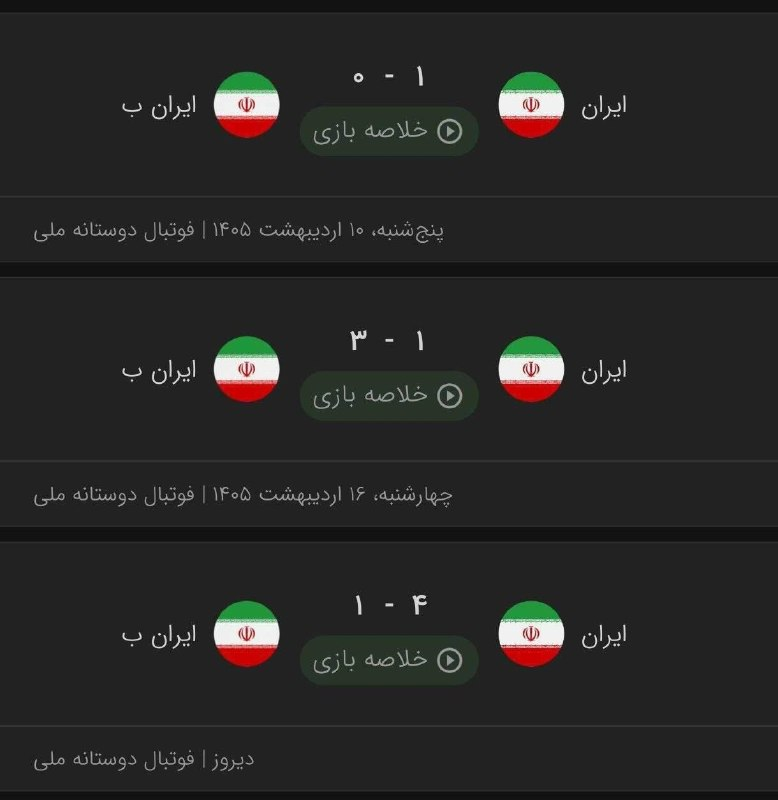

فکر کن حریفای جمهوری اسلامی بخوان بازیهای تدارکاتیشو آنالیز کنن بدبختا کسپر میشن...

@Pesari_Ke_Konie

## Tans_Footbali — post 236298

  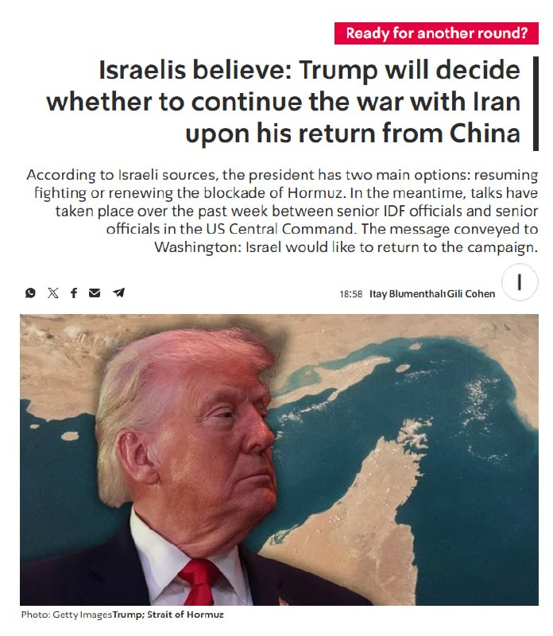

کان‌نیوز :
ترامپ از چین که برگرده، درباره حمله مجدد به ایران تصمیم‌گیری میکنه

💛@Tans_Footbali

## Tans_Footbali — post 236297

  <a href="telegram/content/Tans_Footbali_236297_1778786396.webm" target="_blank">🎬 Download video</a>

⚽ استون ویلا 
🏴 - 
🏴 لیورپول

🏆 لیگ برتر انگلیس 
🏴

🕔 جمعه ساعت ۲۲:۳۰
🏟 ورزشگاه ویلا پارک

🎲 با بیش از ۵۵۰ نوع آپشن پیش‌بینی

👆 ضرایب شگفت‌انگیز

🚨نکاتی در مورد بازی‌های رودررو:
در پنج تقابل اخیر دو تیم، لیورپول موفق به کسب پیروزی در سه دیدار شده‌ است و دو بازی با نتیجه مساوی به پایان رسیده است.

📝 حقایق داور:
🟨 میانگین کارت زرد : ۳.۶۸ کارت در هر بازی
🟥 میانگین کارت قرمز : ۰.۱۲ کارت در هر بازی

🧠 قبل از ورود، بدترین سناریو را مرور کنید.

👍 ورود به سایت با فیلترشکن

کلیک کنید BetForward.com
کلیک کنید BetForward.com

💻 @BetForward

## Tans_Footbali — post 236296

  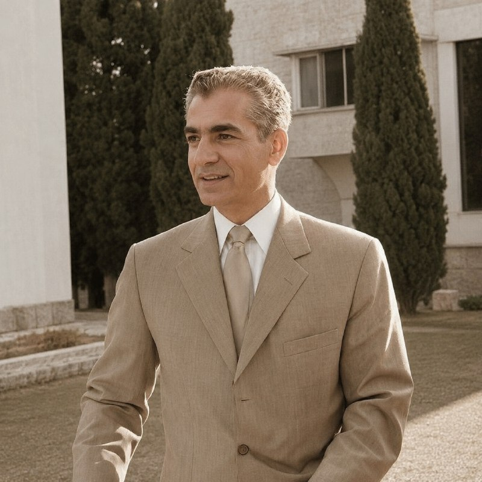

👑 مناسب برای پروفایل

💛@Tans_Footbali

## Tans_Footbali — post 236295

  <a href="https://t.me/Tans_Footbali/236295" target="_blank">📎 Download file</a>

300 آیپی جدید برای استفاده در برنامه شیر و خورشید

آیپی‌ ها رو از داخل فایل کپی کنید و طبق آموزش در برنامه قرار بدید و وصل بشید.

💛@Tans_Footbali

## Tans_Footbali — post 236294

  <a href="https://t.me/Tans_Footbali/236294" target="_blank">📎 Download file</a>

🔴 نسخه جدید برنامه شیر و خورشید (اندروید)

• نسخه 2026.05.14

یک نسخه غیررسمی از برنامه سایفون

🛡 با این نسخه انجام بدید دیگه نیازی به V2rayNG، سرتیفیکیت، cert یا تنظیمات پیچیده نیست و همه چیز داخل خود برنامه انجام میشه.
━━━━━━━━━━━━━━━
🔹مراحل اتصال:
1️⃣ وارد برنامه شیروخورشید (آخرین نسخه) بشید
2️⃣ از نوار بالا وارد Options بعد More Options بشید
3️⃣ در بخش Connection Protocol گزینه CDN Fronting رو انتخاب کنید
4️⃣ در بخش CDN Edge IPs این IP ها رو کپی و وارد کنید:

2.19.204.87
2.19.204.137
2.19.204.144
2.19.204.145
2.19.204.170
2.19.204.184
2.19.204.185
2.19.204.202
2.19.204.210
92.122.123.128

5️⃣ برگردید به صفحه اصلی و روی اتصال بزنید و کمی صبر کنید تا وصل بشه.

📥لینک دانلود داخلی

💛@Tans_Footbali

## hamclasixii — post 75373

یادش بخیر یه زمانی امنیت vpn برام مهم بود، الان دیگه بیان برن تو شورتمم تفتیش و نظاره کنن مهم نیست... فقط وصل شه.

📚 @hamclasix 📚

## withyashar — post 11238

  <a href="telegram/content/withyashar_11238_1778786398.mp4" target="_blank">🎬 Download video</a>

نتانیاهو: دشمنان ما به دنبال نابودی همه ما هستند. همه ما
آنها بین راست و چپ، سکولار و مذهبی، یهودی و عرب تفاوتی قائل نمی‌شوند.
@withyashar
نتانیاهو: اورشلیم را تحت حاکمیت اسرائیل برای همیشه حفظ خواهیم کرد

## withyashar — post 11237

## withyashar — post 11236

سومین دور مذاکرات مستقیم لبنان و اسرائیل در واشنگتن آغاز شد
@withyashar

## withyashar — post 11235

ترامپ اعلام کرد که انتظار می‌رود پکن ۲۰۰ هواپیما از بوئینگ سفارش دهد.
@withyashar

## withyashar — post 11234

کان نیوز : مقامات ارشد ارتش اسرائیل و سنتکام هفته گذشته جلسه داشتن و منتظرن ببینن فردا ترامپ بعد اتمام سفرش چه تصمیمی میگیره
@withyashar

---
📅 بروزرسانی: 1405/02/24 20:58
---

## persian_trend_official — post 14155

https://youtube.com/live/SFBV2nP6Gs4?feature=share

## persian_trend_official — post 14154

تا دقایقی دیگه لایو شروع میشه

## persian_trend_official — post 14153

❤️ اگر از مخاطبان پرشین ترند هستید و تلگرام پرمیوم دارید،
با بوست کردن کانال کمک بزرگی به رشد و دیده‌شدن بیشتر پرشین ترند می‌کنید.
این بوست‌ها باعث می‌شود امکانات بیشتری برای انتشار محتوا، استوری و قابلیت‌های ویژه کانال فعال شود و در شرایط فعلی، به ادامه پوشش سریع و تحلیل‌های روزانه کمک زیادی می‌کند.
🙏 اگر مایل بودید، از طریق لینک زیر کانال را بوست کنید:
https://t.me/boost/persian_trend_official
📌 @persian_trend_official
پرشین ترند | متفاوت‌ترین کانال نظامی

## persian_trend_official — post 14152

  

💎 تراست vpn رو چندین بار معرفی کردم
و بازخوردتون خیلی خوب بود

✅ همین الان بهشون پیام بدین و سرورتون رو دریافت کنین تا با سرعت بالا و بدون لگ ویدئوهای اینستاگرام و یوتیوب رو ببینین.

🔻 بهشون گفتم قیمتاشونم یه کاهش قیمت بدن

به ایدی زیر پیام بدین 👇

@trusstvpnn_admin
@trusstvpnn_admin
@trusstvpnn_admin

## persian_trend_official — post 14151

  

💢شبکه CNN: ادعاهای ترامپ درباره توان نظامی ایران با گزارش‌های اطلاعاتی مغایر است

🔹دولت ترامپ در حالی بر طبل نابودی کامل توان نظامی ایران می‌کوبد که گزارش‌های نهادهای اطلاعاتی تصویری متفاوت از واقعیت‌های میدان نبرد ارائه می‌دهند.

🔹ارزیابی‌های اطلاعاتی سی‌ان‌ان و نیویورک تایمز نشان می‌دهد که ایران بخش قابل‌توجهی از توان پهپادی و موشک‌های ساحلی خود را حفظ کرده است.
🔹در جلسات استماع سنا، مقامات ارشد نظامی از جمله کین (رئیس ستاد مشترک) و هگست (وزیر جنگ) از تأیید یا تکذیب آمارهای ترامپ (مانند نابودی ۸۰ درصد توان موشکی ایران) خودداری کرده و این جزئیات را «محرمانه» خواندند.
🔹تحلیل‌گران معتقدند اظهارات ترامپ درباره جنگ ایران بخشی از یک الگوی بزرگتر از بزرگ‌نمایی و تحریف حقایق برای پیشبرد اهداف سیاسی ست.

🫆:Tony

📌 @persian_trend_official
پرشین ترند | متفاوت‌ترین کانال نظامی

## OfficialPersiaTwiter — post 498527

  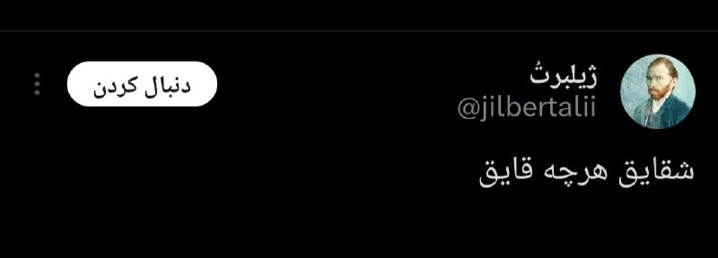

ملایر هر چه لایر

•ژیلبرت •

@OfficialPersiaTwiter

## OfficialPersiaTwiter — post 498526

مسکو: سلاح‌های ارسالی غربی ها به اوکراین از سوریه و آفریقا سر درآورد

🔹معاون وزیر امور خارجه روسیه گفت: سلاح‌های غربی که توسط اوکراین فروخته شده‌اند، در اختیار گروه‌های تروریستی در بورکینافاسو، نیجر، سودان، سومالی و سوریه قرار گرفته‌اند.

• OPT •

@OfficialPersiaTwiter

## OfficialPersiaTwiter — post 498525

یادش بخیر یه زمانی اینترنت انقدر مفت بود که از ویدیوهای اینستا به عنوان چراغ‌قوه استفاده میکردم

• ida⋆ •

@OfficialPersiaTwiter

## OfficialPersiaTwiter — post 498524

  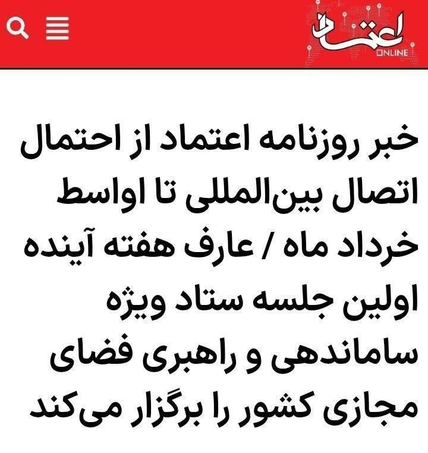

🔴روزنامه اعتماد متعلق به الیاس حضرتی رییس شورای اطلاع‌رسانی دولت مدعی شد: اینترنت بین الملل خرداد ماه وصل می‌شود

• OPT •

@OfficialPersiaTwiter

## OfficialPersiaTwiter — post 498523

واشنگتن پست:

چین از جنگ آمریکا علیه ایران برای تقویت روابط با کشورهایی مانند تایلند، استرالیا و فیلیپین، با ارائه سوخت و فناوری سبز، استفاده می‌کند، آن هم در زمانی که به نظر می‌رسد دولت ترامپ علاقه کمتری به رهبری تلاش‌های بین‌المللی برای مقابله با بحران جهانی انرژی دارد

• OPT •

@OfficialPersiaTwiter

## OfficialPersiaTwiter — post 498522

🔴ادعای ترامپ: رهبر چین پیشنهاد کمک در مورد مسئله ایران را داد او قول داد که تجهیزات نظامی به آنها منتقل نکند. او می‌خواهد تنگه هرمز باز بماند. • OPT • @OfficialPersiaTwiter

## OfficialPersiaTwiter — post 498521

بچه ها چرا انقدر میدویید؟ چیزی شده بگید ما هم فرار کنیم.

• Better call naz •

@OfficialPersiaTwiter

## OfficialPersiaTwiter — post 498520

ما حیف بودیم عزیز من
تلاشگر بودیم، مسئولیت پذیر بودیم، پای کار بودیم، با اراده بودیم، متعهد بودیم، منضبط بودیم، از خودگذشتگی داشتیم، ولی حیف بودیم
واسه این دوره از تاریخ حیف بودیم عزیز من.

• 30.06 •

@OfficialPersiaTwiter

## OfficialPersiaTwiter — post 498519

سخنگوی وزارت خارجه پاکستان:

اسلام‌آباد از نقش چین در میانجی‌گری برای حل‌وفصل تنش‌ها میان ایران و آمریکا حمایت می‌کند.

• OPT •

@OfficialPersiaTwiter

## OfficialPersiaTwiter — post 498518

‏امروز با یه آقایی آشنا شدم که فامیلش میلادی بود، قدیمی‌ترین دوستم فامیلش شمسی هست، اگه شخصی با فامیلی قَمَری میشناسید لطفا به من معرفی کنید که تقویمم کامل بشه

• سین صاد •

@OfficialPersiaTwiter

## OfficialPersiaTwiter — post 498517

📌فاکس‌نیوز | رئیس گشت مرزی آمریکا به‌طور ناگهانی استعفا داد

🔹مایک بنکس، رئیس گشت مرزی ایالات متحده، اعلام کرد که با اثر فوری از سمت خود کناره‌گیری می‌کند.

🔹او در گفت‌وگو با فاکس‌نیوز گفت پس از «۳۷ سال» خدمت، زمان آن رسیده که مسئولیت را واگذار کرده و وقت بیشتری را با خانواده بگذراند.

🔹بنکس مدعی شد در دوره مدیریت خود مرز آمریکا را از وضعیتی «آشفته و ناامن» به «امن‌ترین وضعیت در تاریخ کشور» بازگردانده است.

• OPT •

@OfficialPersiaTwiter

## OfficialPersiaTwiter — post 498516

بلومبرگ: کوبا با کمبود سوخت مواجه شد و کشور را در تاریکی فرو برد

کوبا اعلام کرد که کشور به‌طور کامل از دیزل و نفت مورد نیاز برای تأمین نیروگاه‌های خود خالی شده است.

وزیر انرژی کوبا گفت: «سیستم، یک بار دیگر، بدون هیچ ذخیره سوختی باقی مانده است»، او ادامه داد «به‌طور مطلق هیچ چیزی وجود ندارد.»

• OPT •

@OfficialPersiaTwiter

## OfficialPersiaTwiter — post 498515

🔴شبکه MS NOW: شرکت‌های خصوصی چینی در حال بررسی فروش موشک‌های ضدهوایی به ایران هستند

🔹دولت چین بارها فروش تسلیحات به تهران را تکذیب کرده، اما یک مقام آمریکایی گفته: «قطعا فعالیت‌هایی در جریان است.»

🔹بر اساس گزارش‌های دریافتی، برخی پیمانکاران نظامی خصوصی در چین، وارد گفتگوهای مقدماتی برای تجهیز پدافند هوایی ایران شده‌اند. این تحرکات که در میانه تنش‌های منطقه‌ای صورت می‌گیرد، نگرانی مقامات آمریکا را برانگیخته است.

• OPT •

@OfficialPersiaTwiter

## OfficialPersiaTwiter — post 498514

  <a href="telegram/content/OfficialPersiaTwiter_498514_1778779720.mp4" target="_blank">🎬 Download video</a>

بلومنتال: آیا موافقید که در اختیار گرفتن اورانیوم‌های غنی‌شدهٔ ایران مستلزم حضور نیروی زمینی و تلفات قابل توجه برای آمریکاست؟

فرمانده سنتکام: با توجه به ماهیت محرمانهٔ برنامه‌ها، صحبت دربارهٔ برنامه هسته‌ای بسیار نامناسب است.

بلومنتال: دشمنان ما بسیاری از چیزهایی که ما می‌دانیم را می‌دانند. کسانی که از حقایق بی‌خبرند، مردم آمریکا هستند.

• OPT •

@OfficialPersiaTwiter

## OfficialPersiaTwiter — post 498513

ایلان ماسک درباره مذاکرات آمریکا و چین :

«من حس خوبی نسبت به این مذاکرات دارم. فکر می‌کنم نتیجه خوبی حاصل شود.»

• OPT •

@OfficialPersiaTwiter

## OfficialPersiaTwiter — post 498512

  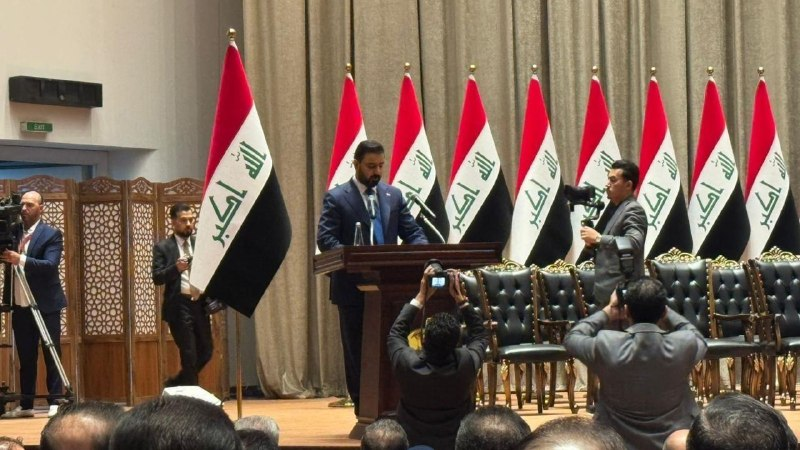

ترامپ از نخست‌وزیر مکلف عراق برای سفر به واشنگتن دعوت کرد خبرگزاری رسمی عراق اعلام کرد دونالد ترامپ، رئیس دولت آمریکا، به علی فالح الزیدی به مناسبت مأموریت رسمی برای تشکیل دولت جدید عراق تبریک گفت. ترامپ همچنین از نخست‌وزیر مکلف عراق دعوت کرد پس از تشکیل…

## OfficialPersiaTwiter — post 498511

  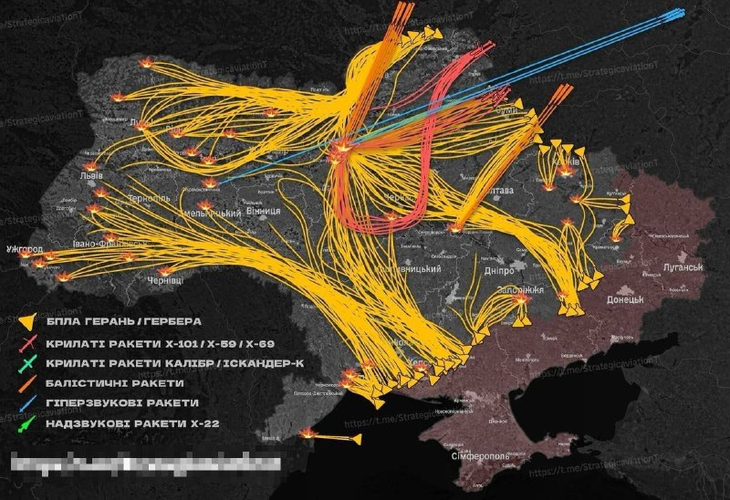

🔴 روسیه یکی از سنگین‌ترین حملات خود را علیه اوکراین انجام داد

💢گزارش‌ها حاکی است روسیه طی ۲۴ ساعت گذشته یکی از بزرگ‌ترین حملات هوایی خود از آغاز جنگ را علیه اوکراین انجام داده است.

💢بر اساس اطلاعات منتشرشده:

▪️ بیش از ۱۴۰۰ پهپاد در این حمله استفاده شده است
▪️ همچنین بیش از ۵۰ موشک به‌سمت اهداف مختلف شلیک شده‌اند
▪️ موج نخست حملات مناطق غربی اوکراین را هدف قرار داد
▪️ سپس حملات به سمت کی‌یف گسترش یافت

• OPT •

@OfficialPersiaTwiter

## OfficialPersiaTwiter — post 498510

فایننشال تایمز:

برنارد هیکل، استاد مطالعات خاور نزدیک در دانشگاه پرینستون که با محمد بن سلمان، ولیعهد عربستان، در ارتباط است، ادعا کرد:

«به نظر می‌رسد [حمله نظامی سعودی به ایران در جنگ اخیر] به شکلی بسیار حساب‌شده و هماهنگ انجام شده؛ به‌طوری که ایرانی‌ها از سوی سعودی‌ها در جریان قرار گرفته بودند و هدف، رسیدن به نوعی همزیستی و تفاهم عملی بوده است.»

• OPT •

@OfficialPersiaTwiter

## bbcpersian — post 281042

🔻دیدار عراقچی و لاوروف در حاشیه اجلاس وزرای خارجه بریکس

🔻وزارت خارجه روسیه اعلام کرد که سرگئی لاوروف، وزیر خارجه آن کشور، در حاشیه نشست وزرای خارجه کشورهای بریکس در دهلی نو، با همتای ایرانی خود عباس عراقچی دیدار و گفت‌وگو کرده است.

بنابر این گزارش، طرفین «به طور عمیق و محرمانه» درباره روند مذاکرات با هدف حل و فصل جنگ خاورمیانه تبادل نظر کردند.

وزارت خارجه روسیه می‌گوید که آقای لاوروف در این دیدار بر اهمیت حفظ آتش‌بس و صلح شکننده و همچنین جلوگیری از اختلال در تلاش‌های سیاسی و دیپلماتیک برای دستیابی به توافق جامع ایران و آمریکا تاکید کرد.

بر اساس این گزارش، سرگئی لاوروف در این دیدار بار دیگر آمادگی روسیه را برای ارائه تسهیلات به طرفین جهت یافتن و اجرای راه‌حل‌های قابل قبول دوجانبه اعلام کرد.

وزارت خارجه روسیه می‌گوید که دو طرف همچنین در مورد مسائل جاری همکاری‌های دوجانبه بحث و گفت‌وگو کرده و تعهد متقابل خود را برای تقویت مستمر مشارکت جامع راهبردی بین دو کشور، تایید کردند.

https://bbc.in/43cQEqw
@BBCPersian

## bbcpersian — post 281041

  

‌🔻‌روابط عمومی سپاه پاسداران اکنون با تایید گزارش‌های پیشین می‌گوید «با تصمیم جمهوری اسلامی، امکان عبور تعدادی از کشتی‌های چینی از تنگه هرمز با رعایت پروتکل مدیریت ایرانی تنگه میسر شد.»

بر اساس این بیانیه، پس از پیگیری‌های وزیر خارجه چین و سفیر این کشور در ایران، «در نهایت جمع‌بندی شد که تعدادی کشتی چینی مورد درخواست این کشور پس از تفاهم درباره پروتکل‌های مدیریت ایرانی تنگه از این منطقه عبور کنند که این عبور از شب گذشته آغاز شده است.»

بر اساس گزارش‌ها، ایران از شب گذشته به کشتی‌های چینی بیشتری اجازه عبور از تنگه هرمز را داده است.

خبرگزاری فارس به نقل از یک منبع آگاه گزارش داده است که این اقدام به دنبال درخواست‌های وزیر امور خارجه چین و سفیر پکن در ایران انجام شده است.

خبرگزاری فارس نوشته طی روزهای گذشته دست‌کم شش نفتکش و کشتی فله‌بر با مالکیت یا بهره‌برداری عملیاتی چین از تنگه هرمز عبور کرده‌اند.

بی‌بی‌سی وریفای هم تایید کرده که دستکم یک ابرنفتکش چین روز گذشته از تنگه هرمز عبور کرده است.

عکس استفاده شده آرشیوی است.

📷NurPhoto via Getty Images
https://bbc.in/4fl3qdR

@BBCPersian

## bbcpersian — post 281040

🔻ونگارد: کشتی توقیف شده از سوی ایران یک «انبار مهمات شناور» است

🔻پیشتر در مورد توقیف یک کشتی در نزدیکی امارات گزارش کرده بودیم که اکنون جزئیات بیشتری در مورد آن منتشر شده است.

به گزارش شرکت مدیریت ریسک دریایی «ونگارد»، یک کشتی که به عنوان «انبار مهمات شناور» در دریای عمان فعالیت می‌کرده، توسط نیروهای نظامی ایران توقیف شده است.

سازمان عملیات تجارت دریایی بریتانیا اعلام کرد که این کشتی اکنون «در مسیر آب‌های سرزمینی ایران» قرار دارد.

بی‌بی‌سی وریفای با بررسی داده‌های ردیابی کشتی‌ها از سامانه «مارین ترافیک» تایید کرده که این شناور که ونگارد آن را «هویی چوان» با پرچم هندوراس معرفی کرده، آخرین بار روز چهارشنبه در فاصله ۷۰ کیلومتری شمال شرق فجیره در امارات متحده عربی موقعیتش را مخابره کرده است.

اپراتورهای «هویی چوان» به ونگارد گفته‌اند که این کشتی به عنوان اسلحه‌خانه شناور فعالیت می‌کرده و در آن برای شرکت‌های امنیتی که از کشتی‌ها در برابر حملات دزدان دریایی محافظت می‌کنند، سلاح نگهداری می‌شده است.

بی‌بی‌سی وریفای نمی‌تواند تایید کند چه محموله‌ای در این کشتی بوده یا در اختیار چه کسانی بوده است.

بی‌بی‌سی پیشتر گزارش داده بود که این گونه شناورها در دریای سرخ، خلیج عدن و دریای عمان مستقر می‌شوند تا محافظان امنیتی بتوانند به راحتی سلاح و مهمات خود را تحویل گرفته یا تحویل دهند.

https://bbc.in/438NvYU
@BBCPersian

## bbcpersian — post 281039

  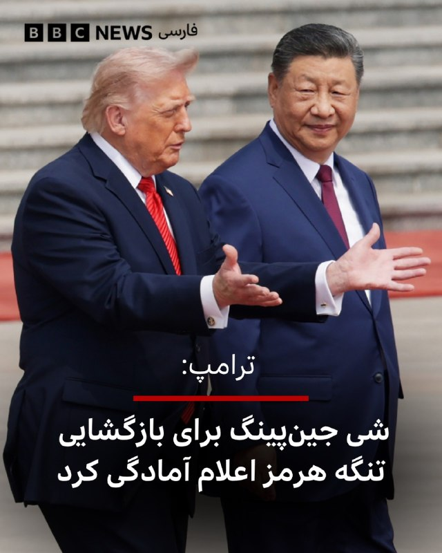

🔻دونالد ترامپ می‌گوید که شی جین‌پینگ، رئیس‌جمهور چین، پیشنهاد داده تا پکن برای بازگشایی تنگه هرمز کمک کند.

آقای ترامپ،‌ پس از مذاکراتش در پکن به فاکس نیوز گفت که آقای شی به او گفته «به هر شکلی که بتواند مایل به این کار است.»

او افزود که رئیس‌جمهور چین همچنین به او اطمینان داده که پکن هیچ کمک نظامی به ایران در جنگ با اسرائیل و آمریکا ارسال نخواهد کرد.

پیش‌تر، شی جین‌پینگ در ضیافت رسمی به افتخار آقای ترامپ گفته بود که آمریکا و چین باید «شریک باشند، نه رقیب» و روابط دو کشور را «مهم‌ترین رابطه جهان» توصیف کرده بود.

آقای ترامپ نیز لحن مثبتی در قبال این دیدار داشت و از رهبر چین برای سفر به کاخ سفید در ماه سپتامبر دعوت کرد.

دو رئیس‌جمهور حدود دو ساعت گفت‌وگو کردند؛ مذاکراتی که کاخ سفید آن را «مثبت» توصیف کرده و گفته تمرکز آن بر تقویت روابط اقتصادی بوده است.

📷Getty Images
https://bbc.in/4uaHPJP

@BBCPersian

## bbcpersian — post 281038

  

‌🔻دریاسالار برد کوپر، فرمانده سنتکام، طی یک جلسه استماع در مورد جنگ با ایران در سنای آمریکا گفت که توانایی ایران برای تهدید همسایگان خود و منافع ایالات متحده در منطقه به طور چشمگیری کاهش یافته است.

او گفت عملیات نظامی ما زیرساخت صنعتی توانمندی‌های موشکی، دریایی و ساخت پهپاد ایران را تا ۹۰ درصد تضعیف کرده و بازسازی نیروی دریایی این کشور دستکم یک نسل به طول می‌انجامد.

آقای کوپر در جلسه کمیته سنا گفت: «تهدید ایران به طور قابل توجهی کاهش یافته است و آنها دیگر به روش‌هایی که پیش از این قادر بودند، در همه حوزه‌ها، شرکای منطقه‌ای یا ایالات متحده را تهدید نمی‌کنند. آنها به طور قابل ملاحظه‌ای تضعیف شده‌اند.»

او در عین حال گفت ایران به خاطر وسعت و قابلیت‌هایش همچنان یک تهدید باقی مانده است.

📷Reuters
https://bbc.in/4dGZanU

@BBCPersian

## bbcpersian — post 281037

  <a href="telegram/content/bbcpersian_281037_1778779727.mp4" target="_blank">🎬 Download video</a>

🔻کارشناسان می‌گویند در پی جنگ با ایران و درگیری و مشغول شدن نیروهای دریایی با آن، دزدی دریایی در آبهای سومالی دوباره در حال افزایش است.

دزدان دریایی سومالی دست‌کم سه کشتی بزرگ تجاری را برای اخاذی و باج‌گیری ربوده‌اند. از جمله نفتکش آنر۲۵ که کاپیتانش اشاری سامادیکون اهل اندونزی است.

همسر کاپیتان می‌گوید که او به دزدان دریایی گفته که مسلمان است و از آنها خواسته به خاطر هم‌کیشی به او و خدمه‌اش رحم کنند.

@BBCPersian

## Lichargoo — post 24876

شی جین پینگ اگه غرورش رو بذاره کنار و به ترامپ بگه چقدر نابغه‌ست تا اخر تابستون تایوان رو گرفته.

## Pesari_Ke_Konie — post 44935

🔴 ترامپ رفته چین؛ همراهاش :

رئیس شرکت‌های اپل، تسلا، بلک راک، گلدمن، مسترکارت، سیسکو، متا، ویزا

حالا ‌پزشکیان رفته بود چین؛ همراهاش:

دخترش، دامادش، پسرش و عروسش :))

@Pesari_Ke_Konie

## Tans_Footbali — post 236293

  <a href="telegram/content/Tans_Footbali_236293_1778779729.mp4" target="_blank">🎬 Download video</a>

⚜️جدال لفظی جالب وزیر جنگ پیت هگست و سناتور لیندسی گراهام بر سر جنگ ایران.

@Tans_Footbali

## Tans_Footbali — post 236292

وزیر جنگ پیت هگست:

با وجود آنچه ممکن است در رسانه‌ها بشنوید، آمریکا در حال افول نیست. ما همچنان قوی‌ترین قدرت نظامی روی زمین هستیم، اما این قدرت نیاز به تجدید دارد.

با تهدیدات جهانی که به طور مداوم در حال تحول هستند، زمان آن رسیده است که سرمایه‌گذاری ۱.۵ تریلیون دلاری، یک پیش‌پرداخت نسلی، انجام شود.

این سرمایه‌گذاری تضمین می‌کند که ایالات متحده برای نسل‌های آینده قدرت غالب و بازدارندگی بی‌نظیر در برابر هر دشمنی را حفظ کند.

💛@Tans_Footbali

## Tans_Footbali — post 236291

جایی که اگه همه هم قطع شن، باز وصله اینجاست  🙌

ما این سرویسو تست کردیم و کیفیتش واقعاً خوب بوده

تو‌ رباتش جوین شید قیمتارو چک کنید، گیگی ۲۵۰ است

@cloobvpn_bot
✅ کد تخفیف هم مخصوص بچه های طنز فوتبالی!
کد: tanz

جوین باشید حتما یچیز میدونم میگم😉

## hamclasixii — post 75372

روزی میرسه که به مشکلات امروزت میخندی و از پنجره بیمارستان روانی به بیرون خیره میشی.

📚 @hamclasix 📚

## hamclasixii — post 75371

  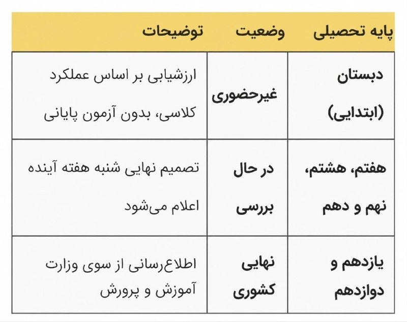

🔴جزئیات برگزاری امتحانات نوبت دوم مدارس تهران

📚 @hamclasix 📚

## withyashar — post 11233

  <a href="telegram/content/withyashar_11233_1778779731.mp4" target="_blank">🎬 Download video</a>

اتاق جنگ با یاشار ، شواهد نشان دهنده حمله غافلگیر کننده برای کتلت پزون است
@withyashar

## withyashar — post 11232

  <a href="telegram/content/withyashar_11232_1778779734.mp4" target="_blank">🎬 Download video</a>

در سال ۱۹۷۲، شهبانو فرح پهلوی به دعوت رسمی دولت چین به این کشور سفر کرد؛ سفری تاریخی و بی‌سابقه که در اوج جنگ سرد، نماد دیپلماسی بی‌طرفانه ایران بود
@withyashar

## withyashar — post 11231

آیا درباره حمایت چین از ایران با رئیس جمهور چین صحبت کردید؟ ترامپ: ما در مورد این موضوع صحبت کردیم. منظورم اینه که وقتی میگید «حمایت»، آنها با ما جنگ نمی‌کنن یا چیزی شبیه این. او گفت که تجهیزات نظامی ارائه نخواهد کرد، این یک بیانیه بزرگه. اما در عین حال گفت…

## withyashar — post 11230

Voice message

---
📅 بروزرسانی: 1405/02/24 19:12
---

## thisisermia — post 61

از دقایقی پیش شایعاتی توسط یکی از کاربران منتشر شده مبنی بر اینکه اطلاعاتش از طریق وگ افشا شده. ما این ادعا رو کاملاً بی‌اساس می‌دونیم و مطرح شدن چنین چیزی رو غیرواقعی و عجیب تلقی می‌کنیم. با این حال، چون این شایعه برای تعدادی از کاربران نگرانی ایجاد کرده و ما خودمون رو در قبال شما مسئول می‌دونیم، لازم دیدیم دوباره شفاف توضیح بدیم.

توی وگ هیچ اطلاعاتی که منجر به شناسایی یا افشای هویت شما بشه، نه درخواست میشه و نه ذخیره. شما صرفاً به عنوان یک کاربر ناشناس و آزاد در سطح اینترنت داخلی فعالیت می‌کنید.

ضمناً لازمه بگیم که وگ در حال حاضر یک شبکه اجتماعی مستقل با سرویس‌های متنوعه و استفاده از اون هیچ خطری برای کاربران ایجاد نمی‌کنه.

بعضی از دوستان با شنیدن این شایعات، ناخواسته نگرانی بقیه رو بیشتر می‌کنن. در حالی که حتی آدرس آی‌پی شما هم در وگ لاگ یا ذخیره نمی‌شه.

یه توضیح دیگه هم لازمه بدیم. ممکنه بعضی از کاربران پیامک‌هایی از سمت نهادهایی مثل سپاه پاسداران یا وزارت اطلاعات دریافت کرده باشن؛ برای مثال پیام‌هایی با این مضمون که فعالیت شما در یکی از رسانه‌های معاند شناسایی شده. این پیامک‌ها معمولاً به‌صورت دسته‌جمعی (bulk) و بدون الگوی مشخص ارسال می‌شن و هدفشون چیزی جز ایجاد ترس، نگرانی و دور کردن شما از این فضاها نیست. اگر چنین پیامکی دریافت کردید، بدونید هیچ ارتباطی با حساب کاربری شما در وگ نداره.

در آخر، ما همچنان بر این باوریم که حضور شما در وگ هیچ مشکل امنیتی‌ای برای شما ایجاد نمی‌کنه. در اصل شما به هیچ جرمی در فضای مجازی بر علیه هیچ نهاد یا شرایط سیاسی‌ای مرتکب نشدید. شما صرفاً به یک شبکه اجتماعی مستقل پیوستید تا دسترسی‌تون به محتوایی که در شرایط قطعی اینترنت امکان‌پذیر نیست بیشتر بشه.

ما حتی گذاشتن عکس پروفایل از خودتون رو هم خطری نمی‌بینیم. فقط توصیه می‌کنیم اگر ناشناس موندن براتون مهمه، از گذاشتن لینک‌های مرتبط با پیام‌رسان‌های داخلی و همین‌طور ادامه دادن ارتباط با افراد داخل وگ در این پلتفرم‌ها خودداری کنید. وگ فضای ارتباط رو تا حد زیادی برای شما فراهم کرده و می‌تونید ارتباطاتتون رو همون‌جا ادامه بدید.

ما هم مثل شما خواستار بازگشت دسترسی به اینترنت و بهتر شدن وضعیت دیجیتال کشوریم. زندگی، کار، تحصیل و خیلی از برنامه‌های روزمره ما هم وابسته به همین اینترنت بوده و هست. با ادامه این وضعیت و این محدودیت‌های گسترده، نه‌تنها تغییری توی شرایط ایجاد نمیشه، بلکه فقط کسب‌وکارها آسیب می‌بینن و فعالیت‌هایی مثل یادگیری، آموزش، رشد فردی و مهم‌تر از همه ارتباطات مردم مختل میشه.

به امید روزهای بهتر برای ایران
تیم وگ 🤍

## persian_trend_official — post 14150

  <a href="telegram/content/persian_trend_official_14150_1778773378.webm" target="_blank">🎬 Download video</a>

💢حمید رسایی، نماینده تهران در مجلس،

▪️جریانی «شناخته‌شده» در دولت چهاردهم که راه‌حل را «آزاد کردن و گران کردن» می‌داند، قصد دارد سهمیه بنزین هزار و ۵۰۰ تومانی و سه هزار تومانی را کاهش دهد و قیمت بنزین پنج هزار تومانی را به ۱۵ تا ۲۰ هزار تومان افزایش دهد.

💢او افزود همان جریان در دولت چهاردهم پیش‌تر با حذف ارز ترجیحی ۲۸ هزار و ۵۰۰ تومانی و گران کردن ارز، به گفته او، «بالاترین تورم پس از انقلاب ۵۷» را به مردم تحمیل کرده بود.

💢رسایی نوشت محمدباقر قالیباف با «پلمپ کردن بدون توجیه و دلیل مجلس»، راه نظارت نمایندگان بر تصمیمات دولت را بسته است. او افزود انجام تکلیف نمایندگی سخت شده، اما تلاش می‌کند مجلس را از این «مرگ تعمدی» بیرون بیاورد و جلوی این تصمیمات «عجیب» را در موقعیت «سخت و جنگی» فعلی بگیرد.

🫆:Tony

📌 @persian_trend_official
پرشین ترند | متفاوت‌ترین کانال نظامی

## persian_trend_official — post 14149

  <a href="telegram/content/persian_trend_official_14149_1778773379.mp4" target="_blank">🎬 Download video</a>

🔴مارکو روبیو:

💢نیروهای مسلح اوکراین در حال حاضر قوی‌ترین و قدرتمندترین نیروهای مسلح در سراسر اروپا هستند.

🫆:Tony

📌 @persian_trend_official
پرشین ترند | متفاوت‌ترین کانال نظامی

## persian_trend_official — post 14148

  <a href="telegram/content/persian_trend_official_14148_1778773381.mp4" target="_blank">🎬 Download video</a>

🔴 چین درخواست ترامپ برای عدم خرید نفت از ایران را رد کرد

🔹مجری فاکس‌ نیوز:
آیا در مورد حمایت چین از ایران با شی جین‌پینگ صحبت کردید؟

🔹ترامپ:
«ما در مورد آن صحبت کردیم. منظورم این است که وقتی می‌گویید «حمایت از ایران»، آنها با ما جنگ یا چیزی شبیه به این نمی‌کنند. او گفت که قرار نیست تجهیزات نظامی به ایران بدهد. این حرف بزرگی است. اما او در عین حال گفت که آنها مقدار زیادی از نفت خود را از ایران می‌خرند و دوست دارند به این کار ادامه دهند!»

🫆:Tony

📌 @persian_trend_official
پرشین ترند | متفاوت‌ترین کانال نظامی

## persian_trend_official — post 14147

  

ٖغریب‌آبادی در بریکس: امارات متجاوز است نه ایران؛۱۳۰ هزار هدف غیرنظامی مورد حمله با مشارکت امارات /مستندات را به شورای امنیت ارسال کرده‌ایم

غریب‌آبادی در پاسخ به ادعای وزیر مشاور امارات مبنی بر متجاوز بودن ایران، گفت:

🔹امارات خود متجاوز است، نه ایران. زیرا امارات نقش قابل توجهی در حمایت و تسهیل تجاوز نظامی علیه ایران ایفا کرده است.

🔹استناد به قطعنامه ۱۹۷۴ مجمع عمومی سازمان ملل؛ هر کشوری که به متجاوزین تسهیلات و خدمات دهد، اقدامش برابر با تجاوز است، نه صرفا کمک به متجاوز.

🔹ایران به تمامی پایگاه‌های آمریکا و تأسیسات مرتبط با آمریکا در امارات حمله کرد. این اقدام مطابق با منشور ملل متحد و در چارچوب حق دفاع مشروع بود. ایران پیش از حمله، به امارات هشدار داده بود که در صورت کمک به متجاوز، تأسیساتشان هدف قرار می‌گیرد.

🔹در جریان تجاوز با مشارکت امارات، ۱۳۰ هزار هدف غیرنظامی مورد حمله قرار گرفت و بیش از ۴ هزار غیرنظامی به شهادت رسیدند.

🫆:Tony

📌 @persian_trend_official
پرشین ترند | متفاوت‌ترین کانال نظامی

## persian_trend_official — post 14146

  

🔴 روسیه یکی از سنگین‌ترین حملات خود را علیه اوکراین انجام داد 💢گزارش‌ها حاکی است روسیه طی ۲۴ ساعت گذشته یکی از بزرگ‌ترین حملات هوایی خود از آغاز جنگ را علیه اوکراین انجام داده است. 💢بر اساس اطلاعات منتشرشده: ▪️ بیش از ۱۴۰۰ پهپاد در این حمله استفاده شده…

## persian_trend_official — post 14143

🔴 مشاهده سامانه پدافندی چینی در دست سرباز اوکراینی

💢تصاویری منتشر شده که یک سرباز اوکراینی را در حال استفاده از سامانه پدافند هوایی دوش‌پرتاب «اف‌ان-۱۶» ساخت چین نشان می‌دهد.

▪️ «اف‌ان-۱۶» یک موشک دوش‌پرتاب کوتاه‌برد ضداهداف هوایی است

▪️ این سامانه برای مقابله با:

بالگردها
پهپادها
و هواگردهای کم‌ارتفاع طراحی شده است.

نحوه رسیدن این سامانه چینی به نیروهای اوکراینی مشخص نیست و تاکنون توضیح رسمی درباره آن منتشر نشده است.

🫆:Tony

📌 @persian_trend_official
پرشین ترند | متفاوت‌ترین کانال نظامی

## persian_trend_official — post 14142

  <a href="telegram/content/persian_trend_official_14142_1778773385.mp4" target="_blank">🎬 Download video</a>

💢فرمانده سنتکام، برد کوپر:

💢کار ما آماده بودن است و ما آماده‌ایم
مذاکرات حساس ادامه دارد

🫆:Tony

📌 @persian_trend_official
پرشین ترند | متفاوت‌ترین کانال نظامی

## persian_trend_official — post 14141

  

🔴 روسیه زیردریایی‌های هسته‌ای «بوری» را با تور ضدپهپاد پوشاند

💢تصاویر ماهواره‌ای جدید نشان می‌دهد روسیه دو زیردریایی هسته‌ای کلاس «بوری» را در پایگاه کامچاتکا در اقیانوس آرام به‌طور کامل با تورهای ضدپهپادی پوشانده است.

🔹بر اساس گزارش‌ها:

▪️ این پایگاه حدود ۷۴۰۰ کیلومتر با اوکراین فاصله دارد

▪️ برای نخستین‌بار کل بدنه زیردریایی‌ها، نه فقط اسکله یا برجک آن‌ها، زیر پوشش تور قرار گرفته است

▪️ این اقدام احتمالاً با هدف مقابله با تهدید پهپادها انجام شده است

🔹زیردریایی‌های کلاس «بوری» بخشی از مهم‌ترین توان هسته‌ای دریایی روسیه محسوب می‌شوند و هرکدام توان حمل:

▪️ ۱۶ موشک بالستیک قاره‌پیما با چندین کلاهک هسته‌ای مستقل را دارند.

💢این اقدام نشان می‌دهد نگرانی روسیه از تهدید پهپادها اکنون حتی به پایگاه‌های راهبردی هسته‌ای در دوردست‌ترین مناطق این کشور نیز رسیده است.

🫆:Tony

📌 @persian_trend_official
پرشین ترند | متفاوت‌ترین کانال نظامی

## persian_trend_official — post 14140

🔴 شی جین‌پینگ: روابط چین و آمریکا مهم‌ترین رابطه دوجانبه جهان است

💢رئیس‌جمهور چین اعلام کرد روابط پکن و واشینگتن مهم‌ترین رابطه دوجانبه در جهان محسوب می‌شود و دو کشور باید از تقابل پرهیز کنند.

🔹شی جین‌پینگ پس از دیدار با دونالد ترامپ گفت:

▪️ چین و آمریکا بیشترین منفعت را از همکاری مشترک می‌برند

▪️ دو کشور در صورت تقابل، متحمل خسارت خواهند شد

▪️ پکن و واشینگتن باید شریک باشند، نه رقیب

🔹او همچنین افزود:

▪️ در دیدار با ترامپ درباره روابط دوجانبه و تحولات منطقه‌ای و جهانی گفت‌وگوهای عمیقی انجام شده است

▪️ دو طرف بر ایجاد روابطی «سازنده و با ثبات راهبردی» توافق کرده‌اند

▪️ هدف از این رویکرد، کمک به صلح، ثبات و توسعه پایدار در جهان عنوان شده است

🫆:Tony

📌 @persian_trend_official
پرشین ترند | متفاوت‌ترین کانال نظامی

## persian_trend_official — post 14139

  

🔴 طوفان مرگبار در هند؛ دست‌کم ۸۹ کشته 💢تصاویر منتشرشده از ایالت اوتار پرادش هند، شدت طوفان و بادهای سهمگین در این منطقه را نشان می‌دهد 💢 خبرگزاری رویترز گزارش داده طوفان شدید در ایالت اوتار پرادش هند دست‌کم ۸۹ تا ۱۰۴ کشته برجا گذاشته است. ▪️ در ویدئوهای…

## persian_trend_official — post 14137

  <a href="telegram/content/persian_trend_official_14137_1778773391.mp4" target="_blank">🎬 Download video</a>

🔴 طوفان مرگبار در هند؛ دست‌کم ۸۹ کشته

💢تصاویر منتشرشده از ایالت اوتار پرادش هند، شدت طوفان و بادهای سهمگین در این منطقه را نشان می‌دهد

💢 خبرگزاری رویترز گزارش داده طوفان شدید در ایالت اوتار پرادش هند دست‌کم ۸۹ تا ۱۰۴ کشته برجا گذاشته است.

▪️ در ویدئوهای منتشرشده از شهر بریلی، لحظه بلند شدن یک مرد توسط شدت باد دیده می‌شود

️▪️طبق گزارش‌ها، آن مرد همراه با سقف فلزی توسط باد به هوا پرتاب شد اما زنده مانده و دچار شکستگی دست و پا شده است.

🫆:Tony

📌 @persian_trend_official
پرشین ترند | متفاوت‌ترین کانال نظامی

## persian_trend_official — post 14136

  <a href="telegram/content/persian_trend_official_14136_1778773393.webm" target="_blank">🎬 Download video</a>

🔴 چین تولید جنگنده پنهانکار «جی-۲۰» را با کارخانه تمام‌خودکار افزایش داد

💢گزارش‌ها حاکی است چین به‌صورت بی‌سروصدا بهره‌وری تولید پیشرفته‌ترین جنگنده پنهانکار خود را بیش از دو برابر کرده است.

🔹بر اساس گزارش «ساوت چاینا مورنینگ پست»:

▪️ یکی از کارخانه‌های چنگدو به یک «کارخانه تاریک» تمام‌خودکار تبدیل شده است

▪️ در این مجموعه، ماشین‌ها و خودروهای خودران مبتنی بر هوش مصنوعی تقریباً به‌صورت ۲۴ ساعته فعالیت می‌کنند

▪️ به‌دلیل خودکار بودن فرایندها، نیاز چندانی به روشنایی و نیروی انسانی وجود ندارد

💢این کارخانه اکنون قطعات ساختاری جنگنده پنهانکار «جی-۲۰» ملقب به «اژدهای قدرتمند» را تولید می‌کند؛ جنگنده‌ای که از آن به‌عنوان رقیب چینی «اف-۲۲» آمریکا یاد می‌شود.

🔹بر اساس این گزارش:

▪️ استفاده گسترده از اتوماسیون باعث کاهش هزینه تولید شده است

▪️ وابستگی به نیروی انسانی شبانه‌روزی کاهش یافته

▪️ تولید انبوه جنگنده «جی-۲۰» از سال ۲۰۲۰ آغاز شده است

🫆:Tony

📌 @persian_trend_official
پرشین ترند | متفاوت‌ترین کانال نظامی

## persian_trend_official — post 14135

  

اکانت کاخ سفید در شبکه ایکس:
تاریخ در حرکت است.

☆Phantom☆

📌 @persian_trend_official
پرشین ترند | متفاوت‌ترین کانال نظامی

## persian_trend_official — post 14134

خدارو شکر دیگه کم کم هر ننه قمری فاز کوسه برداشته و میخواد به حساب دیگران رسیدگی کنه! جناب کریم شیره ای، شما اگر خیلی حساب و کتاب سرت میشه برو پول بساطت رو با ساقی محل حساب کن .

## persian_trend_official — post 14131

  <a href="telegram/content/persian_trend_official_14131_1778773394.webm" target="_blank">🎬 Download video</a>

کانال هذیان گو اخبار سوریه، با محتوایی سمی و تخیلی ۶۰۰ میلیون از وزارت نفت به اسم تبلیغات !!! هزینه میگیره !

ادعای خط انرژی در مورد دریافتی ۶۰۰ میلیون تومانی مالک کانال ارزشی، قلم به مزد و دروغ پرداز اخبار سوریه از پتروشیمی آریا

در این کشور برای هر نوع چریدن و هدر دادن بیت المال پول کافی وجود دارد اما برای خرج های اصلی مملکت یا ساخت ارتشی توانمند دچار کسری بودجه ایم!

https://farsnews.ir/Khate_energy/1778660394098111565/%D8%A7%D8%B2-%D8%A7%D8%AE%D8%A8%D8%A7%D8%B1-%D8%B3%D9%88%D8%B1%DB%8C%D9%87-%D8%AA%D8%A7-%D9%88%D8%B2%D8%A7%D8%B1%D8%AA-%D9%86%D9%81%D8%AA-%D9%88-%D9%BE%D8%AA%D8%B1%D9%88%D8%B4%DB%8C%D9%85%DB%8C-%D8%A2%D8%B1%DB%8C%D8%A7%D8%B3%D8%A7%D8%B3%D9%88%D9%84-%DA%86%D8%B1%D8%A7-%D8%A8%D9%87-%D8%AE%D8%B7-%D8%A7%D9%86%D8%B1%DA%98%DB%8C-%D8%AD%D9%85%D9%84%D9%87-%D9%85%DB%8C-%DA%A9%D9%86%D9%86%D8%AF

📌 @persian_trend_official
پرشین ترند | متفاوت‌ترین کانال نظامی

## OfficialPersiaTwiter — post 498509

🔵 وزیر دفاع پاکستان: نتانیاهو مایه شرمساری بشریت است

• OPT •

@OfficialPersiaTwiter

## OfficialPersiaTwiter — post 498508

عراقچی: امارات مستقیماً در اقدام تجاوزکارانه علیه کشور من دخیل بود عراقچی وزیر امور خارجه در نشست وزرای خارجه بریکس در دهلی‌نو در پاسخ به ادعاهای بی‌اساس نماینده امارات گفت: 🔹️من در سخنرانی‌ خود نام امارات متحده عربی را ذکر نکردم، به خاطر حفظ وحدت و ترجیح…

## OfficialPersiaTwiter — post 498507

‏دوم دبستان یه معلم مذهبی داشتیم که میگف "بچه ها عرق جزو نجاساته", منم اون موقع هیچ درکی از عرق سگی و اینا نداشتم همیشه موقع ورزش دهنمو میبستم عرقم نره تو دهنم • ژیلبرت • @OfficialPersiaTwiter

## OfficialPersiaTwiter — post 498506

  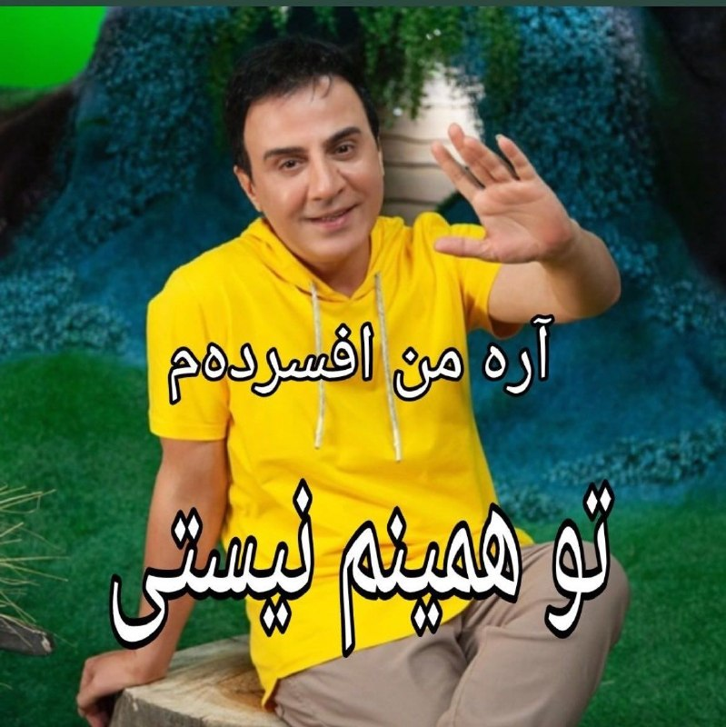

Mood: • Helia • @OfficialPersiaTwiter

## OfficialPersiaTwiter — post 498505

مارکو روبیو: نیروهای مسلح اوکراین در حال حاضر قوی ترین و قدرتمندترین نیروهای مسلح در تمام اروپا هستند.

• OPT •

@OfficialPersiaTwiter

## OfficialPersiaTwiter — post 498504

🔴ادعای ترامپ: رهبر چین پیشنهاد کمک در مورد مسئله ایران را داد

او قول داد که تجهیزات نظامی به آنها منتقل نکند.

او می‌خواهد تنگه هرمز باز بماند.

• OPT •

@OfficialPersiaTwiter

## OfficialPersiaTwiter — post 498503

  <a href="telegram/content/OfficialPersiaTwiter_498503_1778773396.mp4" target="_blank">🎬 Download video</a>

🔴 چین درخواست ترامپ برای عدم خرید نفت از ایران را رد کرد

🔹مجری فاکس‌ نیوز:
آیا در مورد حمایت چین از ایران با شی جین‌پینگ صحبت کردید؟

🔹ترامپ:
«ما در مورد آن صحبت کردیم. منظورم این است که وقتی می‌گویید «حمایت از ایران»، آنها با ما جنگ یا چیزی شبیه به این نمی‌کنند. او گفت که قرار نیست تجهیزات نظامی به ایران بدهد. این حرف بزرگی است. اما او در عین حال گفت که آنها مقدار زیادی از نفت خود را از ایران می‌خرند و دوست دارند به این کار ادامه دهند!»

• OPT •

@OfficialPersiaTwiter

## OfficialPersiaTwiter — post 498502

‏مامان من همیشه استیکر رو با اسنیکرز قاطی میکرد . خیلی زمان برد تا بهش بگیم کدوم اسم مال کدوم تا اینکه خاهرم رف کفش اسکیچرز خرید.
مامانم سوخت

• گیلبرث •

@OfficialPersiaTwiter

## OfficialPersiaTwiter — post 498501

🔻آمریکا تحقق اهدافش در ایران را به ۴۰ روز دیگر حواله داد

🔹رئیس فرماندهی مرکزی ایالات متحده آمریکا، سنتکام در یک جلسه در مجلس سنا تحقق اهداف جنگی این کشور در ایران را به ۴۰ روز دیگر حواله داده است.

🔹این مقام نظامی آمریکا در جلسه استماع سنا گفت که ارتش آمریکا می‌تواند ظرف کمتر از ۴۰ روز اهدافش در ایران را محقق کند.

🔹ادعای فرمانده سنتکام در حالی مطرح شده که رئیس‌جمهور آمریکا دونالد ترامپ هنگام آغاز جنگ در ایران گفته بود که این عملیات بین ۴ تا ۶ هفته به طول خواهد انجامید.

🔹شماری از نماینده‌های کنگره بعد از اتمام ضرب‌الاجل ۶۰ روزه در نامه‌ای به دونالد ترامپ تصریح کرده بودند که هیچ‌یک از سه هدف تعیین‌شده برای جنگ علیه ایران محقق نشده‌اند.

• OPT •

@OfficialPersiaTwiter

## OfficialPersiaTwiter — post 498500

‏دویست متر مغازه اجاره کرده بود
تابلوش این بود
هایپر فود ننجون
رو شیشه ها با نئون نوشته بود
قیمه نثار موجود است
قهوه موجود است
آبمیوه های طبیعی موجود است

امروز رد میشدم یه بنر زده بود این مغازه با کلیه لوازم واگذار میشود

بیزبنسی که میخواد به همه بفروشه به هیچ کس نمیفروشه

•صرفا آدمیزاد •

@OfficialPersiaTwiter

## OfficialPersiaTwiter — post 498499

وزارت خارجه هند: حمله دیروز به یک کشتی با پرچم هند در سواحل عمان غیرقابل قبول است

🚨 وال استریت ژورنال: یک کشتی با پرچم هند این هفته پس از آنکه در نزدیکی سواحل عمان هدف حمله قرار گرفت، در تنگه هرمز غرق شد؛ را مقام‌های عمانی و یک شرکت داده‌های دریایی اعلام کردند

🔹وزارت خارجه هند اعلام کرد که مقام‌های عمانی تمام خدمه کشتی را نجات داده‌اند، بدون آنکه مشخص کنند چه کسی پشت این حمله بوده است.
🔹شرکت داده‌های دریایی وایندوارد اعلام کرد که این کشتی پس از یک حمله مشکوک پهپادی غرق شده است.
🔹دو مقام عمانی آگاه از ماجرا گفتند که کشتی هنگام حمله، محموله بز حمل می‌کرد. این مقام‌ها افزودند که شرایط و جزئیات غرق شدن کشتی همچنان تحت بررسی است.
🔹شرکت وایندوارد همچنین گفت که کشتی هنگام وقوع حادثه، فرستنده شناسایی (ترانسپوندر) خود را خاموش کرده بود؛ اقدامی که معمولاً با «ناوگان سایه» مرتبط دانسته می‌شود. با این حال، اکنون کشتی‌های بیشتری برای عبور مخفیانه و بدون شناسایی از تنگه هرمز نیز از این روش استفاده می‌کنند.

• OPT •

@OfficialPersiaTwiter

## OfficialPersiaTwiter — post 498498

🔺ستاد فرماندهی مرکزی ایالات متحده:

🔹از زمان آغاز محاصره دریایی ایران، ۷۰ کشتی تجاری را منحرف و ۴ کشتی را از کار انداخته‌ایم

• OPT •

@OfficialPersiaTwiter

## OfficialPersiaTwiter — post 498497

  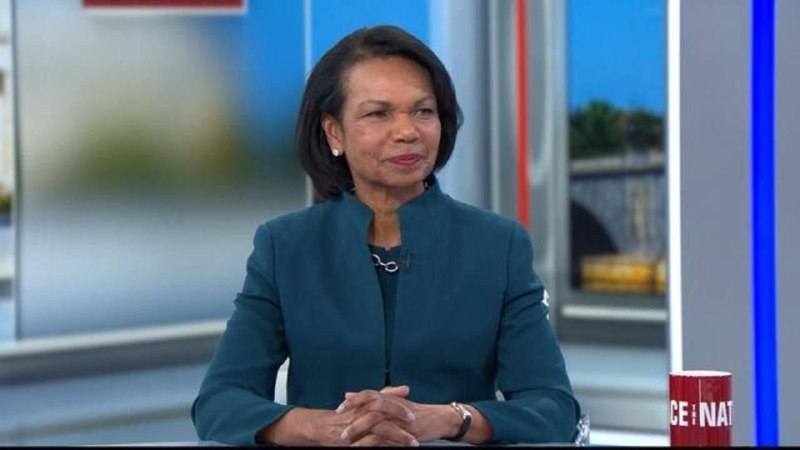

جهان بدون ایرانیان‌ واقعا جای کسل‌کننده‌ای میشد • خانه‌ دوست • @OfficialPersiaTwiter

## OfficialPersiaTwiter — post 498496

صداوسیما تبدیل شده به اون بچه لوس و نُنری که هرچقدر پول براش خرج می‌کنی باز هم از همه طلبکاره و خون به دل بقیه می‌کنه!
الان هم از سایت آپارات شکایت کرده و این سایت باید ۳۶۰۰ میلیارد تومن به آقای جبلی پول بده!

• آیدین •

@OfficialPersiaTwiter

## OfficialPersiaTwiter — post 498495

العربی: بحرین، امارات، عربستان سعودی، قطر، کویت و اردن در یک بیانیه مشترک خطاب به آنتونیو گوترش، دبیرکل سازمان ملل متحد، و فو کونگ، رئیس چینی شورای امنیت، ادعا کردند: اظهارات اخیر ایران درباره تحمیل «مدیریت» یا «قواعد حقوقی» جدید برای تنگه هرمز را محکوم…

## OfficialPersiaTwiter — post 498494

بچه بودم از مدرسه بردنمون نمایشگاه کتاب. از یه کتابی خیلی خوشم اومد، سه‌تا ازش خریدم. برگشتم خونه برا بابا تعریف کردم، حتی رغبت نکرد کتکم بزنه. 》بازوکا《 @OfficialPersiaTwiter

## OfficialPersiaTwiter — post 498493

رادیوی ارتش رژیم صهیونیستی:

دور جدید مذاکرات میان لبنان و اسرائیل در واشنگتن آغاز شده است.

• OPT •

@OfficialPersiaTwiter

## OfficialPersiaTwiter — post 498492

‏جوری که باب راس یهو وسط نقاشی هاش درخت اضافه میکرد خدا بلا نازل میکنه

• Alireza Aliabadi •

@OfficialPersiaTwiter

## OfficialPersiaTwiter — post 498491

هشدار وزیر نیرو به مردم تهران/ وضعیت آبی تهران چندان مناسب نیست

🔹عباس علی‌آبادی: وضعیت آبی تهران چندان مناسب نیست؛ توزیع نابرابر بارش باعث شده ۱۰ استان با جمعیت بیش از ۳۵ میلیون نفر همچنان در شرایط زیرنرمال قرار داشته باشند.

🔹با وجود افزایش ۴ درصدی بارش نسبت به بلندمدت و افزایش ۶۶ درصدی نسبت به سال گذشته، شش سال متوالی خشکسالی و انباشت کسری مخازن به‌ویژه در آب‌های زیرزمینی، نگرانی کسری مخازن آب سطحی و زیرزمینی را همچنان به عنوان یک چالش جدی مطرح کرده است.

• OPT •

@OfficialPersiaTwiter

## OfficialPersiaTwiter — post 498489

  <a href="telegram/content/OfficialPersiaTwiter_498489_1778773399.mp4" target="_blank">🎬 Download video</a>

سلفی بنیانگذار و مدیرعامل شیائومی با ایلان ماسک که سوژه رسانه‌ها شد • OPT • @OfficialPersiaTwiter

## bbcpersian — post 281036

  

‌🔻مصطفی پوردهقان، دبیر دوم کمیسیون صنایع و معادن مجلس گفته است که مصوبه شورای عالی امنیت ملی در مورد اینترنت پرو در اجرا به «قلکی برای همراه اول، ایرانسل و رایتل» تبدیل شده است.

او در مورد انتخاب محمدرضا عارف، به عنوان رئیس ستاد ویژه ساماندهی فضای مجازی گفت که «مجلس در این مورد چیزی نمی‌داند» و این حکم مسعود پزشکیان، رئیس‌جمهور را «تزئينی» خوانده است.

به گفته این نماینده مجلس این قبیل اقدامات بیشتر جنبه «روانی » دارد و قرار نیست که «اتفاق خاصی» در این مورد بیفتد.

آقای پوردهقان همچنین گفته است که بدتر از قطعی اینترنت، تعطیلی مجلس است و اکنون مجلس با بسیاری از وزرای دولت به لحاظ نظارتی هیچ ارتباط خاصی درمورد عملکردشان ندارد که یکی از همین موارد موضوع اینترنت است و هنوز یک جلسه ویژه نداریم که فردی بیاید و شرایط را توضیح دهد.

بیش از ۷۰ روز است که دسترسی به اینترنت جهانی در ایران قطع شده است.

پس از اعتراضات دی ۱۴۰۴ و سپس جنگ آمریکا و اسرائیل با ایران، دسترسی به اینترنت جهانی به طور کامل قطع شد.

لینک خبر کامل:

📷NurPhoto via Getty Images
https://bbc.in/492rMp0

@BBCPersian

## bbcpersian — post 281035

  <a href="telegram/content/bbcpersian_281035_1778773402.mp4" target="_blank">🎬 Download video</a>

🔻‌‌‌دونالد ترامپ با هیئتی از مقامات سیاسی و تجاری از جمله چندین نفر از مدیران ارشد شرکت‌های بزرگ، مانند ایلان ماسک، موسس تسلا و اسپیس‌اکس، تیم کوک، مدیرعامل اپل و جنسن هوانگ، مدیر اجرایی انویدیا به چین سفر کرده است.

دونالد ترامپ و شی جین‌پینگ، رئیس‌جمهور چین حدود دو ساعت با هم مذاکره کردند که دو برابر مدت زمانی بود که در ابتدا برای آن برنامه‌ریزی شده بود. آقای ترامپ در پاسخ به خبرنگاران این گفتگوها را «عالی» توصیف کرد.

اما حضور مارکو روبیو، وزیر امور خارجه آمریکا حتی پیش از ورودش به چین هم خبرساز شده بود. آقای روبیو از سال ۲۰۲۰ تحت دو تحریم دولت چین است، چون در دورانی که سناتور ایالت فلوریدا بود مواضعی سرسختانه درباره هنگ‌کنگ، اقلیت مسلمان اویغور و حقوق بشر در چین داشت.

اما پکن از زمان انتصاب او به وزارت خارجه آمریکا راهکاری برای دور زدن تحریم‌های خود به کار می‌بندد. آنها بخش نخست نام خانوادگی روبیو را در زبان چینی با حرف «لو» می‌نویسند تا تحریم‌ها را اجرا نکنند و لغو هم نکرده باشند.

https://bbc.in/4wyYEzS
@BBCPersian

## bbcpersian — post 281034

🔻دولت اسرائیل از نیویورک‌تایمز به خاطر مقاله‌اش شکایت می‌کند

🔻دفتر نخست‌وزیری اسرائیل روز پنج‌شنبه با صدور بیانیه‌ای اعلام کرد که این کشور علیه روزنامه نیویورک تایمز به دلیل انتشار یادداشتی از نیکلاس کریستوف که شامل اتهاماتی مبنی بر سوءاستفاده جنسی جدی از فلسطینیان در زندان‌های اسرائیل بود، اقدام قانونی خواهد کرد.

مقاله کریستف با عنوان «سکوتی که تجاوز به فلسطینیان با آن روبرو می‌شود» روز دوشنبه ۱۱ مه در نیویورک‌تایمز منتشر شده است.

دفتر نخست‌وزیری اسرائیل که این اتهام را «یکی از زشت‌ترین و تحریف‌شده‌ترین دروغ‌هایی که تاکنون علیه دولت اسرائیل منتشر شده» خوانده و گفته که بنیامین نتانیاهو، نخست‌وزیر، و گیدعون سعر، وزیر خارجه، به مقامات دستور داده‌اند تا مقدمات طرح شکایت افترا علیه این نشریه را آغاز کنند.

روزنامه نیویورک‌تایمز روز چهارشنبه با انتشار بیانیه‌ای ضمن دفاع از انتشار این مطلب، اعلام کرده بود که روایت ۱۴ زن و مردی که در این مطلب مورد اشاره قرار گرفته‌اند راستی‌آزمایی و با روایت شاهدان دیگر مقایسه شده است.

https://bbc.in/49yqhit
@BBCPersian

## bbcpersian — post 281033

  <a href="telegram/content/bbcpersian_281033_1778773405.mp4" target="_blank">🎬 Download video</a>

🔻سرخط خبرهای روز پنجشنبه ۲۴ اردیبهشت ماه ۱۴۰۵

@BBCPersian

## bbcpersian — post 281032

🔻وزیر بهداشت بریتانیا در اعتراض به رهبری استارمر استعفا داد

🔻وس استریتینگ، وزیر بهداشت بریتانیا با انتشار استعفانامه خود در شبکه ایکس، نوشت که «اعتماد به رهبری» کی‌یر استارمر، نخست‌وزیر بریتانیا را «از دست داده‌» و ادامه حضورش در دولت را «غیراخلاقی و برخلاف اصول» می‌داند.

او در بخشی از نامه، از کی‌یر استارمر بابت «شجاعت و دولتمردی» در عرصه بین‌المللی تمجید کرد و نوشت که نخست‌وزیر بریتانیا توانسته کشورش را «از جنگ با ایران دور نگه دارد.»

او همچنین می‌گوید که جنگ‌ها در اروپا و خاورمیانه، مشکلات داخلی بریتانیا را دشوارتر کرده‌اند.

آقای استریتینگ پس از نتایج فاجعه‌بار حزب کارگر در انتخابات شوراهای محلی هفته گذشته، تصمیم به استعفا گرفت.

از متن نامه استعفای او مشخص نیست که آیا از حمایت کافی برای به چالش کشیدن مستقیم کی‌یر استارمر برخوردار است و قصد دارد او را از رهبری کنار بزند یا نه.

https://bbc.in/42uHsOd
@BBCPersian

## bbcpersian — post 281031

🔻گزارش‌ها از تسهیل عبور کشتی‌های چینی از تنگه هرمز

🔻بر اساس گزارش‌ها، ایران از شب گذشته به کشتی‌های چینی بیشتری اجازه عبور از تنگه هرمز را داده است.

خبرگزاری فارس به نقل از یک منبع آگاه گزارش داده است که این اقدام به دنبال درخواست‌های وزیر امور خارجه چین و سفیر پکن در ایران انجام شده است.

خبرگزاری فارس نوشته طی روزهای گذشته دست‌کم شش نفتکش و کشتی فله‌بر با مالکیت یا بهره‌برداری عملیاتی چین از تنگه هرمز عبور کرده‌اند.

بی‌بی‌سی وریفای هم تایید کرده که دستکم یک ابرنفتکش چین روز گذشته از تنگه هرمز عبور کرده است.

ابرنفتکش با پرچم چین به نام «یوان هوا هو» بر اساس سیگنال موقعیت‌یابش، اوایل ماه مارس در بصره عراق پهلو گرفته و محموله نفت بارگیری کرده است.

این کشتی در ساعات اولیه بامداد چهارشنبه (۲۳ اردیبهشت) از تنگه هرمز عبور کرده و موقعیت خود را تنها به مدت حدود ۹۰ دقیقه در آب‌های ایران و در نزدیکی جزیره لارک نشان داده است.

به گزارش بی‌بی‌سی وریفای، این کشتی بیش از ۱۲ ساعت بعد، زمانی که در حال حرکت در وسط دریای عمان و شرق شهر صحار عمان بود، دوباره شروع به پخش موقعیت خود کرد.

مقصد اعلام‌شده این کشتی، بندر ژوشان چین است و طبق اطلاعات موجود در دسترس عموم، قرار است اوایل ژوئن (اواسط خرداد) به آنجا برسد.

مقام‌های چین هنوز این خبر را تایید نکرده‌اند.

ایران در طول جنگ آمریکا و اسرائیل، اعلام کرد که تنها «کشتی‌های بی‌طرف»، می‌توانند از این تنگه عبور کنند و گفته می‌شود که بسیاری از این کشتی‌ها از جمله متعلق به چین است.

https://bbc.in/4uNikya
@BBCPersian

## bbcpersian — post 281030

  

🔻اسکات بسنت، وزیر دارایی آمریکا، در گفت‌وگویی با شبکه سی‌ان‌بی‌سی در حاشیه سفر رئیس‌جمهور آمریکا، در یک مصاحبه از پیش ضبط‌شده گفت که معتقد است چین از نفوذش بر تهران برای بازگشایی تنگه هرمز استفاده خواهد کرد.

او گفت: «فکر می‌کنم آن‌ها (چینی‌ها) هر کاری از دستشان بربیاید انجام خواهند داد.»

آقای بسنت افزود: « بازگشایی تنگه هرمز بسیار به نفع چین است. فکر می‌کنم آن‌ها پشت پرده تلاش خواهند کرد، البته اگر اصلا کسی بتواند بر تصمیم‌های رهبری ایران تاثیر بگذارد.»

به اعتقاد وزیر دارایی آمریکا، چین به‌زودی سفارش بزرگی از هواپیماهای بوئینگ را اعلام خواهد کرد و افزود دو طرف در حال گفت‌وگو درباره بهبود روابط تجاری از جمله صادرات انرژی هستند.

📷Reuters
@BBCPersian

## bbcpersian — post 281029

  <a href="telegram/content/bbcpersian_281029_1778773408.mp4" target="_blank">🎬 Download video</a>

🔻حضور هیئت ایرانی در اجلاس بریکس به‌طور کامل در سایه جنگ آمریکا و اسرائیل با ایران و تنش‌های منطقه‌ای است.
عباس عراقچی، وزیر خارجه ایران در سخنرانی در صحن اجلاس از ناکارآمدی اقدامات نظامی علیه این کشور گفت و پس از سخنرانی در کانال تلگرامش به‌‌صراحت امارات متحده عربی را به دخالت مستقیم در حمله به ایران متهم کرد.

عباس عراقچی، همچنین از کشورهای عضو اجلاس وزرای خارجه بریکس خواست تا «نقض حقوق بین‌الملل از سوی آمریکا و اسرائیل» را محکوم کنند و وزیر خارجه هند هم تردد آزاد در تنگه هرمز را برای اقتصاد جهان «حیاتی» خواند.
رسانه‌های ایران گمانه‌زنی کرده‌اند که امارات «مانع از صدور بیانیه پایانی شود.»

آقای عراقچی همچنین گفت: «تنگه هرمز اکنون بیش از هر چیز از تجاوز آمریکا و محاصره‌ای که بر آن تحمیل کرده، آسیب می‌بیند. از نظر ما، تنگه هرمز برای تمامی کشتی‌های تجاری باز است، اما آن‌ها باید با نیروهای دریایی ما همکاری کنند.»

📷Shutterstock
@BBCPersian

## bbcpersian — post 281028

چین؛ بازیگردان پشت‌پرده ایران؟
🖋️آنتونی زوکر و لورا بیکر، بی‌بی‌سی

🔻دیدار عباس عراقچی، وزیر خارجه ایران، از پکن در هفته گذشته ظاهرا با هدف نشان دادن میزان نفوذ و اثرگذاری چین در خاورمیانه انجام شد.

ایالات متحده با دقت این موضوع را زیر نظر داشت.

مارکو روبیو، وزیر خارجه آمریکا گفت: «امیدوارم چینی‌ها به او آن چه را که باید گفته شود، بگویند و آن این است که کاری که شما در تنگه انجام می‌دهید باعث شده در سطح جهانی منزوی شوید. شما در این ماجرا طرف بد هستید.»

علی واین، مشاور ارشد تحقیات و حمایت در امور روابط آمریکا و چین در گروه بین‌المللی بحران، می‌گوید: « فکر می‌کنم اگر بخواهیم ایران را به شکلی پایدار و بلندمدت به میز مذاکره برگردانیم، ایالات متحده این را می‌پذیرد که چین قرار است نقشی در این میان داشته باشد.»

به نظر می‌رسد که دونالد ترامپ هم به نوبه خود نسبت به روابط نزدیک چین با تهران، بی‌تفاوت است. در حالی که آمریکا اخیرا یک پالایشگاه مستقر در چین را به دلیل انتقال نفت ایران تحریم کرد، آقای ترامپ هفته گذشته هرگونه حمایت چین از ایران در جریان این درگیری را کم‌اهمیت جلوه داد.

https://bbc.in/4d7TQd4
@BBCPersian

## bbcpersian — post 281027

  <a href="telegram/content/bbcpersian_281027_1778773411.mp4" target="_blank">🎬 Download video</a>

🎶 بُرشی از اجرای «خالی»، تک‌آهنگی از پیمان سلیمی که با تنظیمی تازه، همراه با گروه آلوفونز در استودیوی بی‌بی‌سی اجرا شده است.

او در گفت‌وگویی در حاشیه این اجرا از درس‌هایی که از کار گروهی گرفته، مخاطرات خودمحوری، اهمیت شنیدن حرف‌های دیگران و پیچیدگی‌های روابط عاطفی می‌گوید.

پیمان سلیمی، خواننده، آهنگساز و نوازنده ایرانی-ایتالیایی، فعالیت موسیقایی خود را با نواختن کیبورد آغاز کرد و در نوجوانی به سراغ گیتار رفت. او تحصیلات خود را در رشته موسیقی کلاسیک در دانشکده هنرهای زیبا ادامه داد و سپس برای ادامه تحصیل به فلورانس ایتالیا مهاجرت کرد.

پیمان سال‌ها به‌عنوان نوازنده و آهنگساز فعالیت داشت و نخستین آثارش را در نوجوانی با مضامین عاشقانه خلق کرد. ورود حرفه‌ای‌اش به خوانندگی پس از مهاجرت به فلورانس و همکاری با جمعی از نوازندگان ایتالیایی شکل گرفت.

گفت‌وگو و اجرای او را در «رنگآهنگ» این هفته پنجشنبه از تلویزیون و یوتیوب بی‌بی‌سی فارسی ببینید.

@BBCPersian

## bbcpersian — post 281026

🔻وزارت خارجه هند انفجار و غرق شدن یک کشتی باری این کشور در سواحل عمان را «غیرقابل قبول» خواند

🔻وزارت خارجه هند حمله به یک کشتی با پرچم این کشور را در نزدیکی سواحل عمان «غیرقابل قبول» توصیف کرد. سازمان‌های نظارت دریایی گزارش دادند که این کشتی باری دیروز هدف قرار گرفته و غرق شده است.

دهلی جزئیات بیشتری درباره این حمله ارائه نکرد، اما اعلام کرد که همه خدمه کشتی سالم هستند و از مقامات عمان برای نجات جان خدمه کشتی قدردانی کرد.

در بیانیه وزارت خارجه هند که روز پنجشنبه ۲۴ اردیبهشت ماه منتشر شده، آمده است: «حمله به یک کشتی با پرچم هند در سواحل عمان در روز گذشته غیرقابل قبول است و ما از این که کشتی‌های تجاری و ملوانان غیرنظامی همچنان هدف قرار می‌گیرند بسیار متاسفیم.»

شرکت امنیت دریایی «وانگارد» نام این کشتی را شناور باری حاج علی اعلام کرد که با ۱۴ خدمه در نزدیکی سواحل عمان در جنوب تنگه هرمز روزچهارشنبه پس از وقوع انفجار در نزدیکی آن غرق شد.

شرکت وانگارد می‌گوید که این کشتی در حال حمل دام زنده از بربره در منطقه سومالی لند به بندر شارجه در امارات متحده عربی بوده که در اثر «انفجاری مشکوک که احتمالا ناشی از حمله پهپادی یا موشکی» بوده،‌ آتش گرفته است.

وبسایت رهگیری ترافیک کشتی‌ها،‌ این کشتی را یک لنچ چوبی به طول ۵۴ متر معرفی کرده است.

عباس عراقچی در سخنرانی خود در دهلی به این حمله اشاره‌ای نکرد، اما تاکید کرد که تنگه هرمز «برای همه کشتی‌های تجاری که با نیروی دریایی ایران همکاری کنند،‌ باز است.»

https://bbc.in/4tDRd7V
@BBCPersian

## bbcpersian — post 281025

  

🔻درگیری بین ایران و امارات به نشست عمومی نخستین روز اجلاس وزرای خارجه بریکس هم کشیده شد، جایی که عباس عراقچی، وزیر خارجه ایران بدون ذکر نام امارات گفت: «ائتلاف شما با اسرائیلی‌ها نیز از شما محافظت نکرد. در سیاست خود در قبال ایران بازنگری کنید.»

او ساعاتی پس از سخنرانی در نشست بریکس در کانال تلگرام خود نوشت: «من در سخنرانی‌ خود نام امارات متحده عربی را ذکر نکردم، به خاطر حفظ وحدت و ترجیح دادم به آن اشاره نکنم. اما در واقع باید بگویم که امارات مستقیماً در اقدام تجاوزکارانه علیه کشور من دخیل بود. زمانی که این تجاوز آغاز شد، آنها حتی از محکوم کردن آن خودداری کردند. آنها اجازه دادند از سرزمین‌شان برای شلیک توپخانه و تجهیزات علیه ما استفاده شود.»

جنگ ایران، اجماع نظر بر سر بیانیه مشترک را برای این گروه دشوارتر کرده است، به ویژه به خاطر عضویت ایران و امارات متحده عربی که در جنگ اخیر در دو سوی مقابل قرار دارند.

متن کامل خبر در لینک زیر:
https://bbc.in/3RnsqY1
📷EPA

@BBCPersian

## bbcpersian — post 281024

🔻لبنان در مذاکرات واشنگتن در پی اجرای آتش‌بس از سوی اسرائیل است

🔻یک مقام ارشد لبنانی اعلام کرد که کشورش در مذاکرات رو در رو با اسرائیل که قرار است امروز در واشنگتن برگزار شود، خواستار اجرای آتش‌بس از سوی اسرائیل خواهد شد.

این مقام لبنانی گفت که هیئت لبنانی به دنبال «آتش‌بسی است که اسرائیل آن را اجرا کند.»

این مذاکرات، سومین دیدار میان نمایندگان لبنان و اسرائیل از زمان ازسرگیری درگیری‌ها میان حزب‌الله و اسرائیل در بیش از دو ماه گذشته است. بیروت با وجود مخالفت شدید حزب‌الله در این مذاکرات شرکت می‌کند.

درگیری‌ها میان حزب‌الله و اسرائیل، با وجود آتش‌بس اعلام‌شده با میانجی‌گری آمریکا در ماه گذشته، همچنان ادامه دارد.

وزارت بهداشت لبنان اعلام کرد که حملات اسرائیل در روز گذشته ۲۲ کشته، از جمله هشت کودک، برجای گذاشته است.

ارتش اسرائیل هم گفته است که امروز موج تازه‌ای از حملات را علیه مواضع حزب‌الله در جنوب لبنان انجام داده است. حزب‌الله هم می‌گوید که دیروز ۱۷ حمله علیه نیروهای اسرائیلی در جنوب انجام داده است.

آمریکا در حالی میانجی‌گری میان لبنان و اسرائیل را دنبال می‌کند که هم‌زمان تلاش‌های دیپلماتیک برای پایان دادن به تنش‌های گسترده‌تر میان آمریکا و ایران نیز ادامه دارد.

https://bbc.in/4uOASy5
@BBCPersian

## bbcpersian — post 281023

  

‌🔻به گزارش شبکه خبری آرتی، کرملین اعلام کرد که ولادیمیر پوتین، رئیس‌جمهور روسیه، به‌زودی به چین سفر خواهد کرد.

این خبر در حالی اعلام شده است که دونالد ترامپ،‌ رئیس جمهور آمریکا در حال دیدار از چین است.

هنوز تاریخی برای سفر آقای پوتین اعلام نشده، اما دیمیتری پسکوف، سخنگوی کرملین، گفته است که تمام مقدمات این سفر تکمیل شده است.

آخرین سفر آقای پوتین به چین در سپتامبر ۲۰۲۵ بود، زمانی که او در رژه بزرگ نظامی پکن و یک نشست سران شرکت کرد.

رسانه‌های روسی پیش‌تر گزارش داده بودند که این سفر ممکن است حتی در هفته آینده انجام شود.

📷 Reuters
https://bbc.in/43byntG

@BBCPersian

## bbcpersian — post 281022

🔻عراقچی: امارات در حملات به ایران «شریک فعال» بوده است

🔻عباس عراقچی، وزیر خارجه ایران که برای شرکت در نشست وزرای خارجه بریکس در دهلی به سر می‌برد، می‌گوید که در سخنرانی خود در بریکس نام امارات متحده عربی را ذکر نکرده است، اما امارات متحده عربی را «شریک فعال» آمریکا و اسرائیل در حمله به ایران توصیف کرد و گفت که این کشور مستقیما در جنگ آمریکا و اسرائیل با ایران «دخیل» بوده است.

او ساعاتی پس از ایراد سخنرانی خود در نشست بریکس در کانال تلگرام خود نوشت: «من در سخنرانی‌ خود نام امارات متحده عربی را ذکر نکردم، به خاطر حفظ وحدت و ترجیح دادم به آن اشاره نکنم. اما در واقع باید بگویم که امارات مستقیماً در اقدام تجاوزکارانه علیه کشور من دخیل بود. زمانی که این تجاوز آغاز شد، آنها حتی از محکوم کردن آن خودداری کردند. آنها اجازه دادند از سرزمین‌شان برای شلیک توپخانه و تجهیزات علیه ما استفاده شود.»

او به خبر روز گذشته درباره سفر بنیامین نتانیاهو در زمان جنگ به امارات و ابوظبی اشاره کرد. رسانه‌های بین‌المللی این خبر را به نقل از دفتر نخست وزیر اسرائیل منتشر کردند اما وزارت خارجه امارات در بیانیه‌ای رسمی آن را تکذیب کرد.

آقای عراقچی در تلگرامش نوشت: «همین دیروز فاش شد که نتانیاهو در زمان جنگ به امارات و ابوظبی سفر کرده بود. همچنین آشکار شد که آنها در این حملات مشارکت داشته‌اند و شاید حتی مستقیماً علیه ما اقدام کرده باشند. بنابراین امارات شریک فعال این تجاوز است و هیچ تردیدی در این باره وجود ندارد.»

خبرگزاری فرانسه گزارش داد که آقای عراقچی، امارات را متهم کرد که مانع موضعگیری واحد از سوی کشورهای بریکس در محکوم کردن جنگ آمریکا و اسرائیل با ایران شده است.

به نظر می‌رسد اختلاف‌نظرها درباره جنگ ایران، تلاش‌ها برای صدور بیانیه مشترک در نشست دهلی را سخت کرده است.

در بیانیه وزارت خارجه امارات که روز چهارشنبه منتشر شد،‌ آماده بود: «امارات متحده عربی گزارش‌های منتشرشده درباره سفر نخست‌وزير اسرائيل يا استقبال از يک هيات نظامی اسرائيلی را تکذيب می‌کند.»

https://bbc.in/4daHQrk
@BBCPersian

## bbcpersian — post 281021

📽بالاخره کار حکومت‌های ایران و آمریکا به جنگ رو در رو و موشک و بمب و کشتار کشید. بعدش هم به مذاکره رو در رو . دستکم تا این لحظه. ولی دیپلماسی مردمی که نه در جنگ دخالتی دارند و نه در صلح چی هست؟ آنها می‌توانند کاری بکنند؟

🔹روزگاری آقای نادری که از آن نادره‌های دوران هست ، برای حل این بست بوجود آمده بین این طرف‌های جنگ، یک دیپلماسی خیلی خلاق را پیشنهاد کرد.

🔹با دیپلماسی شکست ناپذیر آقای نادری آشنا بشید.

📺برنامه این هفته آپارات
«دیپلماسی شکست ناپذیر آقای نادری»

🎬کار مشترک بهتاش صناعی ها و مریم مقدم

🔹ساعات پخش
جمعه ۹:۰۰ شب
شنبه ۶:۳۰ صبح
شنبه ۱۱:۰۰ صبح
دو‌شنبه۲:۰۰ بامداد
سه‌شنبه ۱۱:۰۰ صبح
تکرار جمعه ۱۱:۰۰ صبح

🔻از برنامه آپارات همیشه فیلم متفاوت ببینید.
@BBCPersian

## bbcpersian — post 281020

  

‌🔻کاخ سفید اعلام کرد که دونالد ترامپ و شی جین‌پینگ، در پکن توافق کردند که ایران هرگز نباید به سلاح هسته‌ای دست پیدا کند و تنگه هرمز باید باز بماند.

آمریکا این گفت‌وگوی دو ساعته را «خوب» توصیف کرده و می‌گوید که دو رهبر در حال تلاش برای تقویت همکاری‌های اقتصادی هستند.

در بیانیه کاخ سفید، رئیس‌جمهور شی همچنین «علاقه‌مندی خود را» برای خرید بیشتر نفت آمریکا ابراز کرد تا وابستگی چین به تنگه هرمز را کاهش دهد.

همچنین گفته شد که مدیران برخی از بزرگ‌ترین شرکت‌های آمریکایی هم در بخشی از این دیدار حضور داشتند.

آن‌ها همچنین درباره اهمیت پایان دادن به ورود مواد اولیه برای ساخت ماده مخدر فنتانیل به آمریکا هم صحبت کردند.

https://bbc.in/4uHk6Rf
📷Reuters

@BBCPersian

## Lichargoo — post 24875

گوشیم چرا وقتی تو شارژه هم شارژ کم میکنه؟ نمیدونید مشکلش چیه؟ میترسم آخوندا کم‌کم از تو پریز همه‌چیمونو بکشن تو.

## Lichargoo — post 24874

همیشه واسه مهمون شویدپلو درست می‌کنم تا متوجه سیبیل‌های داخلش نشه!

## networkti — post 342

تعداد زیادی ای پی‌وایت لیست برای روش جدیده توی گوشی با مرورگر بازش کنید و یک تعدادیشو کپی کنید و توی برنامه شیر و خورشید توی قسمت CDN edge IPs وارد کنید و بزنید وصل میشه (اول شیرو خورشید رو که بالا فرستادم نصب کنید و طبق اموزشی که زیرش نوشته مراحل رو پیش…

## networkti — post 341

ShirOKhorshid-2026.05.14.apk

## networkti — post 340

تعداد زیادی ای پی‌وایت لیست برای روش جدیده

توی گوشی با مرورگر بازش کنید و یک تعدادیشو کپی کنید و توی برنامه شیر و خورشید توی قسمت
CDN edge IPs
وارد کنید و بزنید وصل میشه

(اول شیرو خورشید رو که بالا فرستادم نصب کنید و طبق اموزشی که زیرش نوشته مراحل رو پیش برید و بعد اینکاری که الان گفتم رو انجام بدید)

## networkti — post 339

  <a href="https://t.me/networkti/339" target="_blank">📎 Download file</a>

📎 Document

## networkti — post 338

کانال من یدونه عرزشی مادر طبقاتی داره که هی ری اکشن بر عکس میزنه 
🤣

## networkti — post 335

Mahdavi:
در قسمت CDN edge IPs اگه IP های وایت لیست شده آکامای رو بذارید سرعت اتصال بهتر میشه.

Kharabam:

63 تا IP وایت لیست Akamai:

2.22.151.4
2.22.151.9
2.22.151.12
2.22.151.13
2.22.151.15
2.22.151.17
2.22.151.20
2.22.151.22
2.22.151.23
2.22.151.32
2.22.151.36
2.22.151.37
2.22.151.39
2.22.151.47
2.22.151.51
2.22.151.53
2.22.151.54
2.22.151.58
2.22.151.60
2.22.151.62
2.22.151.135
2.22.151.138
2.22.151.139
2.22.151.141
2.22.151.142
2.22.151.143
2.22.151.144
2.22.151.146
2.22.151.149
2.22.151.150
2.22.151.151
2.22.151.152
2.22.151.153
2.22.151.154
2.22.151.155
2.22.151.156
2.22.151.157
2.22.151.158
2.22.151.159
2.22.151.161
2.22.151.162
2.22.151.163
2.22.151.164
2.22.151.168
2.22.151.169
2.22.151.170
2.22.151.171
2.22.151.173
2.22.151.175
2.22.151.179
2.22.151.181
2.22.151.182
2.22.151.183
2.22.151.184
2.22.151.185
2.22.151.186
2.22.151.188
2.22.151.189
2.22.151.190
2.22.151.191
2.22.151.193
2.22.151.194
2.22.151.195

## networkti — post 334

ShirOKhorshid-2026.05.14.apk

## networkti — post 333

  <a href="https://t.me/networkti/333" target="_blank">📎 Download file</a>

🛡مهم: اگر این نسخه رو نصب کنید دیگه دردسر ستاپ کردن MITM و... ندارید!
این نسخه حدودا یک ساعت پیش توسط برنامه‌نویس شیر و خورشید آپدیت شد و به راحتی می‌تونید طبق این آموزش بهش وصل بشید:
1- وارد اپلیکیشن شیر و خورشید(آخرین نسخه که امروز منتشر شده) می‌شید
2- وارد بخش Options میشید از نوار بالا
3- روی More Options کلیک میکنید
4- گزینه‌ی Connection Protocol رو قرار میدید روی CDN Fronting
5- میرید و عادی کانکت میشید و به راحتی وصل میشه!

## Pesari_Ke_Konie — post 44934

شراب چینی ایلان ماسکو کصخل کرده، هر کی میاد باهاش عکس بگیره شکلک در میاره :))) @Pesari_Ke_Konie

## Pesari_Ke_Konie — post 44933

  <a href="telegram/content/Pesari_Ke_Konie_44933_1778773418.mp4" target="_blank">🎬 Download video</a>

شراب چینی ایلان ماسکو کصخل کرده، هر کی میاد باهاش عکس بگیره شکلک در میاره :)))

@Pesari_Ke_Konie

## Tans_Footbali — post 236290

  <a href="telegram/content/Tans_Footbali_236290_1778773420.mp4" target="_blank">🎬 Download video</a>

هانیتی از فاکس: آیا درباره حمایت چین از ایران با شی صحبت کردید؟

ترامپ: او گفت که تجهیزات نظامی نخواهد داد. این یک بیانیه بزرگ است.

اما در عین حال، گفت که آنها مقدار زیادی نفت از آنجا می‌خرند و دوست دارند این کار را ادامه دهند.

💛@Tans_Footbali

## Tans_Footbali — post 236289

  <a href="telegram/content/Tans_Footbali_236289_1778773423.mp4" target="_blank">🎬 Download video</a>

ترامپ :

شی دوست دارد شاهد انجام یک توافق باشد. او گفت: «اگر بتوانم به هر نحوی کمک کنم، دوست دارم کمک کنم.»

هر کسی که این مقدار نفت می‌خرد، قطعاً نوعی رابطه دارد و او دوست دارد تنگه هرمز باز باشد.

💛@Tans_Footbali

## Tans_Footbali — post 236288

  <a href="telegram/content/Tans_Footbali_236288_1778773425.mp4" target="_blank">🎬 Download video</a>

روبیو خبر دیشب رویترز رو تایید کرد :

طرف چینی گفت که آنها موافق نظامی کردن تنگه هرمز یا سیستم عوارضی نیستند و این موضع ما است.

💛@Tans_Footbali

## Tans_Footbali — post 236287

  <a href="telegram/content/Tans_Footbali_236287_1778773427.mp4" target="_blank">🎬 Download video</a>

اسرائیل کاتز :

ماموریت ما کامل نشده است.

ما برای احتمال اینکه ممکن است مجبور به اقدام دوباره شویم - شاید حتی به زودی - آماده‌ایم.

اگر اهداف تأمین نشوند، دوباره اقدام خواهیم کرد.

💛@Tans_Footbali

## Tans_Footbali — post 236286

مدیر سرویس اطلاعات خارجی روسیه: هیچ نشانه ای از پایان درگیری نظامی بر سر ایران وجود ندارد و نمی توان موج جدیدی از تشدید تنش را رد کرد.

آمریکا و «اسرائیل» برای پیروزی نسبتاً آسان بر ایران شرط بندی کردند، اما شرط آنها به نتیجه نرسید.

💛@Tans_Footbali

## Tans_Footbali — post 236285

  <a href="telegram/content/Tans_Footbali_236285_1778773429.mp4" target="_blank">🎬 Download video</a>

سناتور گراهام درباره حمایت چین از ایران: اگر آنها تغییر کنند، چین پاداش خواهد گرفت.

اگر تغییر نکنند، مجازات خواهند شد

💛@Tans_Footbali

## Tans_Footbali — post 236284

⚽ رئال مادرید - رئال اویدو

🏆 لالیگا اسپانیا 
🇪🇸

🕔 پنج‌شنبه ساعت ۲۳:۰۰
🏟 ورزشگاه برنابئو

🎲 با بیش از ۵۵۰ نوع آپشن پیش‌بینی

👆 ضرایب شگفت‌انگیز

📊 نگاهی به آمار دو تیم:

✅ رئال مادرید در ۵ دیدار اخیر خود در لالیگا دو برد و دو تساوی کسب کرده و یک بازی را واگذار کرده است.

✅ رئال اویدو در ۵ دیدار اخیر خود در لالیگا تنها یک مرتبه موفق به برد شده و دو تساوی کسب کرده و دو بازی را واگذار کرده است.

📈 میانگین گل در ۱۰ دیدار اخیر رئال مادرید در لالیگا ۲.۸ گل در هر بازی بوده است.

📈 میانگین گل در ۱۰ دیدار اخیر رئال اویدو در لالیگا ۲.۴ گل در هر بازی بوده است.

🧠 نه گفتن بخش مهمی از استراتژی است.

D

👍 ورود به سایت با فیلترشکن

کلیک کنید BetForward.com
کلیک کنید BetForward.com

💻 @BetForward

## Tans_Footbali — post 236283

  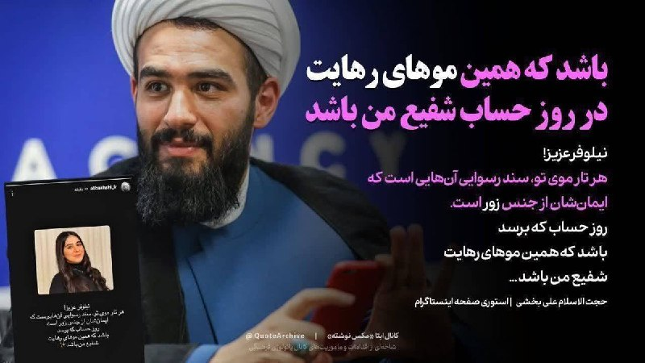

آخوند علی بخشی: نیلوفر عزیز؛ باشد که همین موهای رهایت در روز حساب شفیع من باشد

همین پفیوزها صدها نفر رو با روایتهای تخمی که بی حجابو از موهاش آویزون می کنند و یه تار مو هم آتش میزنه دنیارو و... ازار دادند شکنجه دادند و کشتند حالا داره اینجوری تفت میده چون کارشون گیر افتاده
اول تکلیف اون روایتهاتون رو مشخص کنید بعد اینارو تلاوت کنید

@Tans_Footbali

## hamclasixii — post 75370

🔴خبرگزاری اعتمادآنلاین: احتمال میره که تا اواسط ماه آینده اینترنت بین‌الملل برای همه‌ی مردم وصل بشه؛ اگه نشد ماه بعد دوباره همینو بخونین.

📚 @hamclasix 📚

## hamclasixii — post 75369

  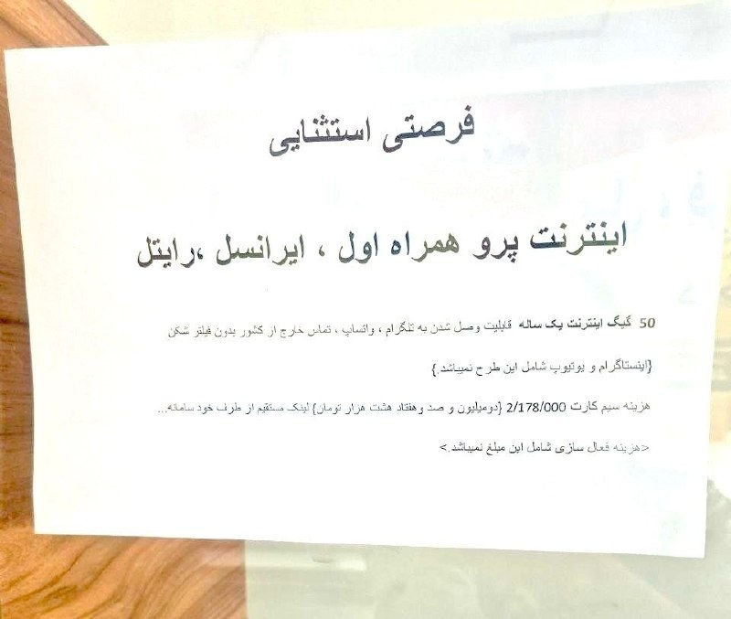

🔴اینترنت پرو که قرار بود فقط برای کسب و کارها در ایام قطع اینترنت باشه؛ حالا بصورت گسترده و عمومی داره با مبالغ سنگین و بدون هیچ محدودیت و نظارتی به فروش میرسه؛ ظاهرا باید به این شرایط و قیمت جدید اینترنت بین‌الملل عادت کنیم!

📚 @hamclasix 📚

## hamclasixii — post 75368

🔴امروز 14 May، روز عشق مجازی و روابط لانگ دیستنسه. 📚 @hamclasix 📚

## hamclasixii — post 75367

  

🔴امروز 14 May، روز عشق مجازی و روابط لانگ دیستنسه.

📚 @hamclasix 📚

## hamclasixii — post 75366

  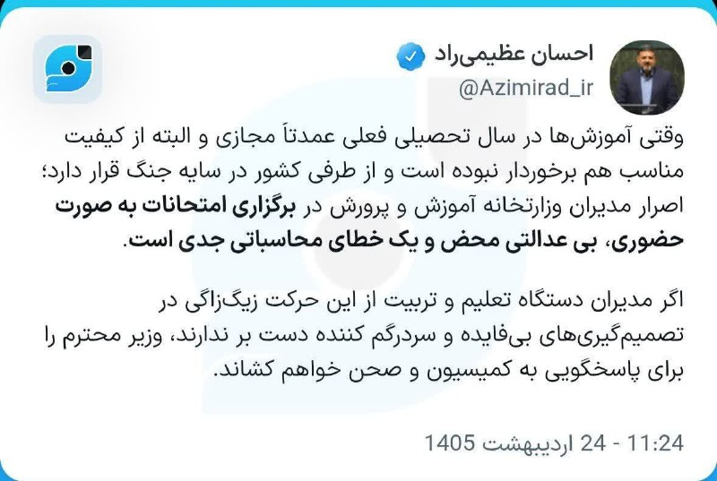

🔴 عظیمی‌‌راد(سخنگوی کمیسیون آموزش مجلس): وقتی آموزش‌ها در سال تحصیلی فعلی عمدتا مجازی و البته از کیفیت مناسب هم برخوردار نبوده است و از طرفی کشور در سایه جنگ قرار دارد؛ اصرار مدیران وزارتخانه آموزش و پرورش در برگزاری امتحانات به صورت حضوری، بی عدالتی محض و یک خطای محاسباتی جدی است.

📚 @hamclasix 📚

## hamclasixii — post 75365

  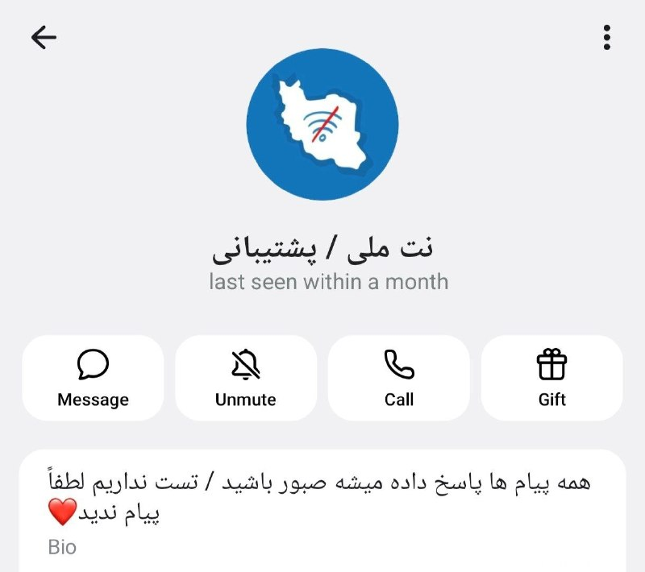

ما که پرقدرت وصلیم

📚 @hamclasix 📚

## hamclasixii — post 75364

🔴شورای آموزشی دانشگاه خوارزمی: آزمون جامع دانشجویان دکتری در تیرماه ۱۴۰۵ برگزار می شود

📚 @hamclasix 📚

## withyashar — post 11229

«دریادار برد کوپر»، فرمانده سنتکام: «فرماندهی مرکزی ایالات متحده (سنتکام) مستقیماً در پاسخ به تهدیدهایی که جمهوری اسلامی ایران ایجاد می‌کرد، تأسیس شد. رژیم ایران طی ۴۷ سال گذشته منطقه را دچار هراس و بی‌ثباتی کرده و دشمنی با آمریکا را به یکی از اصول اساسی…

## withyashar — post 11228

## withyashar — post 11227

خسته نباشی یاشار
نظرت راجب سیم‌کارت پرو چیه به مردم عادی هم دارن میدن الان

## withyashar — post 11226

لطفا عکس از اس ام اس هایی که رژیم میده برام نفرستید ! خیلی خوشم میاد ! اگه قرار‌باشه هر روز اونا اس ام اس بدن شمام همتون اسکرین بفرستین که نمیشه ! به هیچ عنوان اسکرین ندید دیگه مخصوصا ‌جانفدا رو … مرسی اه

## withyashar — post 11225

ترامپ: رهبر چین پیشنهاد کمک در مورد مسئله ایران را داد
او قول داد که تجهیزات نظامی به آنها منتقل نکند.
او می‌خواهد تنگه هرمز باز بماند.
@withyashar

## withyashar — post 11224

سناتور کنگره خطاب به برد کوپر:
برجام توانایی هسته ای ایران رو محدود میکرد ولی ترامپ پاره کرد، الان وارد یه جنگ بی‌پایان شدیم، آیا ترامپ هیچ وقت به شما نگفت چرا برجام رو پاره کرد؟

کوپر فرمانده سنتکام:
خانم سناتور زمانی که این ۸ سال پیش اتفاق افتاد من یک سمت دیگه داشتم! من سیاستمدار نیستم و نمیتونم جواب این سوال رو بدم!
@withyashar

## withyashar — post 11223

  <a href="telegram/content/withyashar_11223_1778773436.mp4" target="_blank">🎬 Download video</a>

«دریادار برد کوپر»، فرمانده سنتکام:

«فرماندهی مرکزی ایالات متحده (سنتکام) مستقیماً در پاسخ به تهدیدهایی که جمهوری اسلامی ایران ایجاد می‌کرد، تأسیس شد.

رژیم ایران طی ۴۷ سال گذشته منطقه را دچار هراس و بی‌ثباتی کرده و دشمنی با آمریکا را به یکی از اصول اساسی حاکمیت خود تبدیل کرده است.

سابقه خصمانه و مرگبار آنها علیه ایالات متحده کاملاً مستند و ثبت‌شده است
@withyashar

## withyashar — post 11222

آیا درباره حمایت چین از ایران با رئیس جمهور چین صحبت کردید؟

ترامپ: ما در مورد این موضوع صحبت کردیم. منظورم اینه که وقتی میگید «حمایت»، آنها با ما جنگ نمی‌کنن یا چیزی شبیه این. او گفت که تجهیزات نظامی ارائه نخواهد کرد، این یک بیانیه بزرگه. اما در عین حال گفت که آنها مقدار زیادی نفت خودشون رو از ایران میخرن و دوست دارن این کار رو ادامه بدن.
@withyashar

## withyashar — post 11221

برد کوپر فرمانده سنتکام مدعی شد: توانمندی‌های موشکی، دریایی، پهپادی و صنعتی ایران 90 درصد تضعیف شده است. او افزود که نیروی دریایی ایران تا یک نسل دیگر نیز به سطحی که پیش از جنگ در اختیار داشت باز نخواهد گشت
@withyashar

## withyashar — post 11220

  <a href="telegram/content/withyashar_11220_1778773439.mp4" target="_blank">🎬 Download video</a>

ایلان ماسک و پسرش «اِکس اَش اِی-توئلو» «X Æ A-Xii» در پکن
@withyashar

## withyashar — post 11219

فرمانده سنت‌کام: ظرف کمتر از ۴۰ روز می‌توانیم به اهدافمان در ایران دست پیدا کنیم
@withyashar

## withyashar — post 11218

نتانیاهو، نخست‌وزیر، و گیدعون سعر، وزیر خارجه، به مقامات دستور داده‌اند تا مقدمات طرح شکایت افترا علیه نیویورک تایمز را آغاز کنند.
این شکایت به دلیل انتشار یادداشتی از نیکلاس کریستوف که شامل اتهاماتی مبنی بر سوءاستفاده جنسی از فلسطینیان در زندان‌های اسرائیل بوده،
مقاله کریستف با عنوان «سکوتی که تجاوز به فلسطینیان با آن روبرو می‌شود» روز دوشنبه ۱۱ مه در نیویورک‌تایمز منتشر شده بود.
@withyashar

## withyashar — post 11217

  

INDOPACOM، فرماندهی نظامی آمریکا برای منطقهٔ «هندو-پاسیفیک»ایندوپکام: تفنگداران دریایی ایالات متحده، واحد یازدهم اعزامی تفنگداران دریایی، در حال انجام تیراندازی رزمی بر روی ناو جنگی یو اس اس کامستاک (LSD 45) در اقیانوس هند هستند. واحد یازدهم اعزامی دریایی، که بر روی گروه آماده آبی-خاکی باکسر(USS BOXER) مستقر شده است، یک نیروی پایدار و قابل اعتماد رزمی است که به بازدارندگی و واکنش به بحران در منطقه عملیاتی ناوگان هفتم ایالات متحده کمک می‌کند.
@withyashar
یاشار: ساده بگم ناو باکسر وسط راه مونده داره تمرین میکنه و معلوم نیست کی بیاد !

## withyashar — post 11215

  <a href="telegram/content/withyashar_11215_1778773443.mp4" target="_blank">🎬 Download video</a>

گوشیT1 "ترامپ موبایل" بعد از نزدیک
یه سال تأخیر بالاخره داره عرضه میشه
یه گوشی طلایی ۴۹۹ دلاری با برند ترامپه که
چیپ اسنپدراگون سری ۷، رم ۱۲ گیگ، حافظه
۵۱۲ گیگ و دوربین سه‌گانه ۵۰ مگاپیکسلی دارهبه نظر میاد در اصل یه گوشی ساخت چین باشه که فقط مونتاژ نهاییشو تو آمریکا انجام دادن
@withyashar

## withyashar — post 11214

مارکو روبیو : ترامپ موضوع ایران رو با چین مطرح کرد و این خیلی مهم بود

طرف چینی گفت ما موافق نظامی‌کردن تنگه هرمز نیستیم
با سیستم عوارض‌گیری هم مخالفیم، و این موضع ما هم هست
@withyashar

## withyashar — post 11213

وزیر خزانه داری آمریکا:ایران رو انقدر تحت فشار اقتصادی قرار دادیم که توی پرداخت حقوق نیروهاشم به مشکل خورده. دارن نفسای آخرشونو میکشن
@withyashar

## withyashar — post 11212

  <a href="telegram/content/withyashar_11212_1778773446.mp4" target="_blank">🎬 Download video</a>

وزیر دفاع اسرائیل، اسرائیل کاتز درباره ایران:

ماموریت ما کامل نشده است.ما برای احتمال اینکه ممکن است مجبور شویم دوباره اقدام کنیم - شاید حتی به زودی - آماده‌ایم. اگر اهداف تأمین نشوند، دوباره اقدام خواهیم کرد.
@withyashar

## withyashar — post 11211

  

سلفی لی جون، بنیانگذار و مدیرعامل شیائومی با ایلان ماسک
@withyashar

## withyashar — post 11210

الجزیره: چین با آمریکا در مورد ایران انعطاف دارد، اما در مورد تایوان نه

مسئولان چینی پیام واضحی به ایالات متحده ارسال کرده‌اند:
چین در بسیاری از مسائل مانند ایران، تجارت و فناوری آماده انعطاف و پذیرش اختلاف نظر است، اما در یک موضوع حساس، انعطاف‌پذیر نیست و آن تایوان است.
@withyashar

## withyashar — post 11209

  <a href="telegram/content/withyashar_11209_1778773449.mp4" target="_blank">🎬 Download video</a>

ایلان لوله لول سر میز شمام 😂
@withyashar

---
📅 بروزرسانی: 1405/02/24 13:18
---

## persian_trend_official — post 14112

  <a href="telegram/content/persian_trend_official_14112_1778752117.mp4" target="_blank">🎬 Download video</a>

🔴 عراقچی: این آمریکا است که تنگه هرمز را بسته، نه ایران

💢عباس عراقچی، وزیر خارجه جمهوری اسلامی ، اعلام کرد تهران تنگه هرمز را نبسته و این آمریکا است که با اقدامات خود محاصره ایجاد کرده است.

💢او گفت:

▪️ از نگاه جمهوری اسلامی ، تنگه هرمز برای تمامی کشتی‌های تجاری باز است

▪️ کشتی‌ها باید با نیروهای دریایی حمهوری اسلامی همکاری و هماهنگی داشته باشند

▪️ جمهوری اسلامی هیچ مانعی در مسیر عبور کشتی‌ها ایجاد نکرده است

▪️ آنچه اکنون در منطقه رخ می‌دهد، ناشی از محاصره و اقدامات آمریکا است

🫆:Tony

📌 @persian_trend_official
پرشین ترند | متفاوت‌ترین کانال نظامی

## persian_trend_official — post 14111

  <a href="telegram/content/persian_trend_official_14111_1778752119.mp4" target="_blank">🎬 Download video</a>

🔴ویدیویی از انفجار شناور کلاس سلیمانی نیرو دریایی سپاه در جنگ اخیر

🫆:Tony

📌 @persian_trend_official
پرشین ترند | متفاوت‌ترین کانال نظامی

## persian_trend_official — post 14110

  <a href="telegram/content/persian_trend_official_14110_1778752120.webm" target="_blank">🎬 Download video</a>

‼️🏦 یک مقام کاخ سفید:

✅ رئیس جمهور ترامپ و همتای چینی او بر سر لزوم باز نگه داشتن تنگه هرمز توافق کردند.
✅ ترامپ و همتای چینی‌اش توافق کردند که ایران نمی‌تواند سلاح هسته‌ای داشته باشد.

📝 Nick

📌 @persian_trend_official
پرشین ترند | متفاوت‌ترین کانال نظامی

## persian_trend_official — post 14109

  <a href="telegram/content/persian_trend_official_14109_1778752121.webm" target="_blank">🎬 Download video</a>

⭕️ سوپراپلیکیشن ایتا اعلام کرد امکان ارسال فایل تا حجم ۲۰ مگابایت مجدداً برای همه کاربران فراهم شده است!

کاش تلگرام بیاد از شما یاد بگیره 🤯

📝 Nick

📌 @persian_trend_official
پرشین ترند | متفاوت‌ترین کانال نظامی

## persian_trend_official — post 14108

  <a href="telegram/content/persian_trend_official_14108_1778752121.webm" target="_blank">🎬 Download video</a>

💢زلزله ای در کرمان رخ داده است 🫆:Tony 📌 @persian_trend_official پرشین ترند | متفاوت‌ترین کانال نظامی

## persian_trend_official — post 14107

💢زلزله ای در کرمان رخ داده است

🫆:Tony

📌 @persian_trend_official
پرشین ترند | متفاوت‌ترین کانال نظامی

## persian_trend_official — post 14106

  

🔴 روسیه یکی از سنگین‌ترین حملات خود را علیه اوکراین انجام داد

💢گزارش‌ها حاکی است روسیه طی ۲۴ ساعت گذشته یکی از بزرگ‌ترین حملات هوایی خود از آغاز جنگ را علیه اوکراین انجام داده است.

💢بر اساس اطلاعات منتشرشده:

▪️ بیش از ۱۴۰۰ پهپاد در این حمله استفاده شده است
▪️ همچنین بیش از ۵۰ موشک به‌سمت اهداف مختلف شلیک شده‌اند
▪️ موج نخست حملات مناطق غربی اوکراین را هدف قرار داد
▪️ سپس حملات به سمت کی‌یف گسترش یافت

🫆:Tony

📌 @persian_trend_official
پرشین ترند | متفاوت‌ترین کانال نظامی

## persian_trend_official — post 14105

  <a href="telegram/content/persian_trend_official_14105_1778752122.mp4" target="_blank">🎬 Download video</a>

⭕️ اتوبوس تیم ملی فوتبال رو با شعار مرگ بر آمریکا بدرقه کردن تا بره آمریکا...

پ.ن: چی بگم والا...

📝 Nick

📌 @persian_trend_official
پرشین ترند | متفاوت‌ترین کانال نظامی

## persian_trend_official — post 14104

  

🔴 گزارش‌ها از توقیف یک شناور در نزدیکی فجیره توسط ایران

💢برخی گزارش‌ها حاکی است یک فروند شناور در فاصله حدود ۳۸ مایل دریایی از بندر فجیره امارات توسط نیروهای ایرانی توقیف شده و در حال حرکت به‌سمت آب‌های سرزمینی ایران است.

🫆:Tony

📌 @persian_trend_official
پرشین ترند | متفاوت‌ترین کانال نظامی

## persian_trend_official — post 14103

⭕️ وزیر آموزش‌ و پرورش:

امتحانات نهایی ۲ هفته بعد از عادی شدن شرایط و پایان جنگ برگزار خواهند شد. ضمن اینکه در استان‌ها تصمیم‌گیری دربارۀ نحوۀ برگزاری امتحانات برعهدۀ استانداران خواهد بود.

پ.ن: دانش آموزان عزیز دعا کنید ماجرا مثل صدام عراق نشه که امتحانات‌تون یه 11 سالی‌ طول خواهد کشید. 🗿😂

📝 Nick

📌 @persian_trend_official
پرشین ترند | متفاوت‌ترین کانال نظامی

## persian_trend_official — post 14102

گزارش صداوسیما از احسان افرشته و روایت عجیب از جاسوسی ! 📌 @persian_trend_official پرشین ترند | متفاوت‌ترین کانال نظامی

## persian_trend_official — post 14101

  <a href="telegram/content/persian_trend_official_14101_1778752124.mp4" target="_blank">🎬 Download video</a>

گزارش صداوسیما از احسان افرشته و روایت عجیب از جاسوسی !

📌 @persian_trend_official
پرشین ترند | متفاوت‌ترین کانال نظامی

## OfficialPersiaTwiter — post 498445

🔺️ بلومبرگ: ۴ روز است که از خارک بارگیری نفت نمی‌شود و اسکله‌های نفتی کاملاً خالی است

• OPT •

@OfficialPersiaTwiter

## OfficialPersiaTwiter — post 498444

نصرالله معین، خواننده لس‌آنجلسی خبر منتشر شده از سمت مهدی تاج رییس فدراسیون فوتبال ایران مبنی بر اجرای آهنگی برای تیم ملی جمهوری اسلامی ایران را تکذیب کرد. 》OPT《 @OfficialPersiaTwiter

## OfficialPersiaTwiter — post 498443

  <a href="telegram/content/OfficialPersiaTwiter_498443_1778752125.mp4" target="_blank">🎬 Download video</a>

ترامپ بعد از ۵۰ سال اولین رئیس‌ جمهور آمریکاست که به معبد آسمان چین رفت.

• OPT •

@OfficialPersiaTwiter

## OfficialPersiaTwiter — post 498439

دستگاهی جدیدا طراحی شده که به پارتنرها کمک می کنه که هنگام تماس تصویری از راه دور برای هم بوس بفرستن
این دستگاه حرکت و فشار لب هارو ثبت میکنه و همون لحظه برای طرف مقابل بازسازی میکنه.

هنگامی که یک کاربر لب های خود را به دستگاه فشار می دهد ، سنسورها حرکت و فشار دقیق بوسه را ثبت می کنند و بلافاصله آن داده ها را به شریک زندگی خود ارسال می کنند.

در داخل، 13 سیستم کوچک "عصب" کابل کش زیر یک سطح نرم می کشند و آزاد می شوند، و حرکات دقیق لب های شخص دیگر را در زمان واقعی بازسازی می کنند. توسعه دهندگان می گویند نتیجه، لحظه ای شگفت انگیز و واقعی از ارتباط است، تبدیل یک تماس ویدیویی ساده به چیزی که تقریبا احساس می کند با هم بودن است.

》OPT《

@OfficialPersiaTwiter

## OfficialPersiaTwiter — post 498438

خوانندگان فینا جام جهانی آمریکا مشخص شدند

گروه BTS، شکیرا و مدونا در فینال جام جهانی اجرا خواهند داشت.

• OPT •

@OfficialPersiaTwiter

## OfficialPersiaTwiter — post 498437

خبرگزاری فرانسه: چین قول می‌دهد درها را به روی شرکت‌ها بازتر کند شی جین پینگ، رئیس جمهور چین، در دیدار با رهبران تجاری آمریکا، با تأکید بر تمایل پکن برای تقویت همکاری اقتصادی و تجاری با ایالات متحده، تأیید کرد که درهای چین «حتی گسترده‌تر» به روی جهان باز…

## OfficialPersiaTwiter — post 498436

ادعای کاخ سفید: 🔹رئیس جمهور ترامپ و همتای چینی او بر سر لزوم باز نگه داشتن تنگه هرمز توافق کردند. 🔹ترامپ و همتای چینی‌اش توافق کردند که ایران نمی‌تواند سلاح هسته‌ای داشته باشد. 🔹دیدار ترامپ با همتای چینی‌اش خوب بود و آنها در مورد راه‌های ارتقای همکاری‌های…

## OfficialPersiaTwiter — post 498435

واکنش جالب روبیو، وزیر خارجه ترامپ، از دیدنِ سالنِ دیدارهای ریاست‌جمهوری چین 》OPT《 @OfficialPersiaTwiter

## OfficialPersiaTwiter — post 498434

🔴 توافق چین و آمریکا بر سر تنگه هرمز 🔹طبق گزارش رویترز، ایالات متحده و چین توافق کردند که هیچ کشوری نباید اجازه داشته باشد عوارض حمل و نقل در تنگه هرمز را دریافت کند. 》OPT《 @OfficialPersiaTwiter

## OfficialPersiaTwiter — post 498433

  <a href="telegram/content/OfficialPersiaTwiter_498433_1778752127.mp4" target="_blank">🎬 Download video</a>

انضباط یک افسر نظامی چینی در فرودگاه پکن درحالی که هواپیمای غول‌پیکر ریاست جمهوری ایالات متحده آمریکا در پشت سر او در حال حرکت است و این افسر بدون هیچ حرکتی در جای خود ایستاده است مورد توجه بسیاری از رسانه‌ها قرار گرفته است

》OPT《

@OfficialPersiaTwiter

## OfficialPersiaTwiter — post 498432

استارلینک با مجوز جدید FCC یک قدم به ارائه اینترنت ماهواره‌ای بر روی موبایل نزدیک‌تر شد

🔹 اسپیس‌ ایکس موفق شد یکی از مهم‌ترین مجوزهای قانونی را برای اجرایی‌کردن پروژه اتصال مستقیم ماهواره به موبایل دریافت کند. کمیسیون ارتباطات فدرال (FCC) با واگذاری حدود ۶۵ مگاهرتز از طیف فرکانسی شرکت EchoStar به استارلینک موافقت کرد. این مجوز به معنای دستیابی اسپیس‌ایکس به یک پهنای باند اختصاصی و پیوسته است که به کاربران اجازه می‌دهد بدون نیاز به تجهیزات اضافی مانند دیش، مستقیماً از طریق گوشی‌های معمولی به اینترنت ماهواره‌ای مشابه 5G متصل شوند.
🔹 این توافق که ارزش آن حدود ۱۷ میلیارد دلار تخمین زده می‌شود، شامل سه باند فرکانسی مجزای AWS-3 ،AWS-4 و H-Block است که مجموعاً یک طیف باند میانی ایده‌آل برای شبکه 5G را تشکیل می‌دهند. اهمیت این طیف اختصاصی در این است که برخلاف شبکه‌های اشتراکی یا تکه‌تکه شده، ظرفیت و پایداری لازم برای یک شبکه سلولی واقعی را فراهم می‌کند و می‌تواند ظرفیت سیستم‌های نسل قبل اسپیس‌ایکس را تا بیش از ۱۰۰ برابر افزایش دهد. هدف نهایی این پروژه، ارائه اینترنتی مشابه با استانداردهای LTE زمینی از اعماق فضا به هر گوشی در سراسر ایالات‌متحده است.

》OPT《

@OfficialPersiaTwiter

## OfficialPersiaTwiter — post 498431

  <a href="telegram/content/OfficialPersiaTwiter_498431_1778752128.mp4" target="_blank">🎬 Download video</a>

تصاویری از فیلم‌برداری جالب ایلان ماسک در چین

》OPT《

@OfficialPersiaTwiter

## OfficialPersiaTwiter — post 498430

رتبه‌های برتر اوپک اعلام شد/ عربستان و ایران در صدر جدول تولیدکنندگان نفت

سازمان کشورهای صادرکننده نفت (اوپک) اعلام کرد:
🔹عربستان با تولید روزانه ۶ میلیون و ۷۶۸ هزار بشکه و ایران با تولید روزانه ۲ میلیون و ۸۵۴ هزار بشکه، به‌ترتیب جایگاه‌های اولین و دومین تولیدکننده در میان اعضای سازمان کشورهای صادرکننده نفت را به خود اختصاص دادند.

》OPT《

@OfficialPersiaTwiter

## OfficialPersiaTwiter — post 498428

  <a href="telegram/content/OfficialPersiaTwiter_498428_1778752129.mp4" target="_blank">🎬 Download video</a>

تصاویر تکان‌دهنده از طوفان در ایالت اوتار پرادش هند

این طوفان وحشتناک در هند ۹۰ کشته بر جای گذاشت

در تصاویر منتشر شده از شهر بریلی هند، مرد جوانی که توسط باد بلند شد و به هوا رفت دیده میشود

》OPT《

@OfficialPersiaTwiter

## OfficialPersiaTwiter — post 498427

دقایقی پیش زمین‌لرزه‌ای ۵ ریشتری در عمق ۸ کیلومتری شهرستان بردسیر کرمان را لرزاند

》OPT《

@OfficialPersiaTwiter

## OfficialPersiaTwiter — post 498426

  <a href="telegram/content/OfficialPersiaTwiter_498426_1778752129.mp4" target="_blank">🎬 Download video</a>

لحظه‌ی دست دادن ترامپ و شی جین پینگ که ترامپ برای دست دادن جلو رفت و شی جین پینگ از جای خود حرکتی نکرد هم خیلی مورد توجه رسانه ها قرار گرفته است

》OPT《

@OfficialPersiaTwiter

## bbcpersian — post 281019

🔻مرکز تجارت دریایی بریتانیا: یک کشتی در نزدیکی امارات تصرف شده و به سمت ایران در حرکت است

یک کشتی در نزدیکی سواحل امارات متحده عربی و حوالی تنگه هرمز «به تصرف افراد ناشناس درآمده و اکنون در حال حرکت به سمت آب‌های سرزمینی ایران است.»

مرکز تجارت دریایی بریتانیا روز پنج‌شنبه با اعلام این خبر گفت که این کشتی در فاصله حدود ۷۰ کیلومتری شمال‌شرقی فجیره به «تصرف افراد ناشناس درآمده است.»

تنگه هرمز، به عنوان حیاتی‌ترین گذرگاه انرژی جهان، یک محور مهم اختلافات ایران و آمریکاست.

پس از جنگ آمریکا و اسرائیل علیه ایران، تهرن این تنگه را مسدود کرد و آمریکا هم از ۱۳ آوریل (۲۴ فروردین) یک محاصره دریایی را بر تمام بنادر و سواحل جنوبی ایران اجرا کرده است، به‌طوری که هیچ کشتی اجازه حرکت از مبدا و به مقصد بنادر ایرانی را ندارد.

حدود ۲۰ درصد از نفت و گاز طبیعی مایع جهان از این آبراه حیاتی منتقل می‌شود که مسدود شدن آن باعث افزایش شدید قیمت‌ها در سطح جهان شده است.
https://bbc.in/4fkRCIA
@BBCPersian

## bbcpersian — post 281018

  

عباس عراقچی، وزیر خارجه ایران برای شرکت در نشست وزیران امور خارجه بریکس به هند سفر کرده است. جنگ ایران و بحران سوخت مرتبط با آن، بر گفت‌وگوهای این نشست دو روزه سایه انداخته است.

هند میزبان این نشست نسبت به «نوسان قابل توجه» در وضعیت بین‌المللی هشدار داد و گفت درگیری‌ها باعث بی‌ثباتی اقتصادی و ناامنی انرژی شده‌اند.

سوبرامانیام جایشانکار، وزیر امور خارجه هند، در سخنرانی افتتاحیه خود گفت: «ما در زمانی با نوسان قابل توجه در روابط بین‌الملل گرد هم آمده‌ایم.»

آقای جایشانکار افزود: «درگیری‌های جاری، نااطمینانی‌های اقتصادی و چالش‌ها در تجارت، فناوری و اقلیم، در حال شکل دادن به چشم‌انداز جهانی هستند.»

او گفت: «انتظار فزاینده‌ای، به‌ویژه از سوی اقتصادهای نوظهور و کشورهای در حال توسعه، وجود دارد که بریکس نقش سازنده و تثبیت‌کننده‌ای ایفا کند.»

بریکس نام گروهی به رهبری برخی از کشورهایی است که اقتصادی نوظهور در جهان دارند. برزیل، روسیه، هند، چین و آفریقای جنوبی اعضای اصلی بریکس هستند. نام بریکس از حروف اول نام کشورهای عضو به زبان انگلیسی گرفته شده است.

📷EPA/Shutterstock
https://bbc.in/4fkRCIA
@BBCPersian

## bbcpersian — post 281009

‌
دختر کیم جونگ‌اون بیشتر از همیشه با لباس‌هایی از برندهای لوکس طراحان غربی در عکس‌ها ظاهر می‌شود، برندهایی که در کره شمالی به دلیل «ضدسوسیالیستی» بودن ممنوع‌اند.

اما لباس‌های کیم جو ئه، از لباس‌های چرمی و مدل موی «خروسی» گرفته تا حتی پیراهن با آستین توری، بیش از آنکه نشانه سرکشی نوجوانانه باشد، نشان می‌دهد او برای جانشینی مقام رهبر عالی کره شمالی آماده می‌شود.

او برای نخستین بار در ۹ سالگی، در نوامبر ۲۰۲۲، در حالی که کنار پدرش در برابر یک موشک بالستیک قاره‌پیمای عظیم قدم می‌زد، به شکل رسمی دیده شد. اما همان زمان هم با موهای بسته از پشت، شلوار مشکی و کاپشن سفید پفی، ظاهری حساب‌شده داشت.

از آن زمان، مدل موی او هرچه بیشتر آراسته و شیک شده و پوشش او نیز به‌تدریج ظریف‌تر، مجلل‌تر و پخته‌تر جلوه می‌کند.

اکنون گزارش‌ها حاکی است که برخی می‌خواهند از سبک شیک و آراسته جو آئه الگوبرداری کنند.

مطلب را از لینک ⬇️ در سایت بی‌بی‌سی فارسی بخوانید.
https://bbc.in/3Pfgjf9

📸GettyImages/ News1/ Reuters/ EPA/Shutterstock/ LightRocket via Getty Images/ AFP via Getty Images

@BBCPersian

## Lichargoo — post 24873

بگایی واقعی فقط اونجا که بعد از یک عمر لر بودن،امروز رفتم و سویا خریدم.

## thefeedconfig — post 76

📱 آموزش کار با برنامه دفید (Thefeed):
برای دریافت آخرین نسخه و کانفیگ‌ها، به کانال زیر بروید و برنامه را نصب‌ کنید و لینک کانفیگ را کپی کنید:
@thefeedconfig

ورود به برنامه:
۱. برنامه را باز کنید و زبان را انتخاب نمایید.
۲. در قسمت مشخص شده (thefeed://...)، کانفیگ کپی شده را وارد کرده و دکمه «وارد کردن» را بزنید تا ثبت شود.

عملکرد برنامه:
پس از وارد کردن اولین کانفیگ، برنامه ریزالورهای موجود در کانفیگ را بررسی کرده (چند دقیقه طول میکشد) و سپس لیست کانال‌ها را دریافت می‌کند. شما می‌توانید کانال‌ها را باز کرده، پست‌ها را مشاهده و عکس، ویدیو، ویس و فایل‌ها را دانلود کنید.

نکته: لیست کانال‌ها فقط توسط سازنده کانفیگ قابل تغییر است. (جلو تر یک‌روش دیگر برای کانال های دلخواه شما نیز نوشته ام)

افزودن کانفیگ جدید:
در صفحه اصلی با زدن دکمه + می‌توانید کانفیگ جدید وارد کنید یا کانفیگ‌های موجود دیگر را فعال نمایید.

🛠️ بخش ریزالور ها:
در این بخش می‌توانید ریزالورها را مدیریت کنید. دکمه‌ای به نام «بانک ریزالور» وجود دارد که لیست کامل را نمایش می‌دهد. همچنین یک لیست فعال به نام Default وجود دارد که پس از بررسی اولیه، ریزالورهای فعال را در خود نگه می‌دارد. شما می‌توانید برای اینترنت‌های مختلف، لیست‌های فعال متفاوتی داشته باشید. و با زدن دکمه «بررسی مجدد»، می‌توانید از بانک ریزالور فعال برای اینترنت خود را پیدا کرده و به لیست جدید اضافه کنید.

🔍 بخش پیدا کردن ریزالور:
این بخش بسیار مهم است. با استفاده از یک لیست پیش‌فرض ۵۰ هزارتایی، می‌توانید ریزالورهایی که برای اینترنت شما کار می‌کنند را پیدا کنید (زمانی که سرعت برنامه کم شده بود و یا کار‌ نمی‌کرد).
روش کار:
۱. وارد بخش شوید.
۲. دکمه بارگذاری لیست پیش‌فرض را بزنید.
۳. دکمه شروع اسکن را بزنید.
۴. برنامه شروع به پیدا کردن می‌کند. وقتی حدود ۱۰ تا ریزالور پیدا شد، توقف را بزنید و سپس دکمه «افزودن به لیست فعال» را بزنید.
*توجه:* حتماً باید VPN خاموش باشد.

📺 بخش کانال‌های دلخواه (teleMirror):
این بخش کاملاً از قسمت‌های قبلی جداست و مکانیزم متفاوتی دارد. این بخش از طریق سرویس‌های گوگل، پیام و عکس کانال‌های عمومی تلگرام را می‌آورد و نمایش می‌دهد.
*محدودیت‌ها:* این بخش نمی‌تواند ویدیو پخش کند یا فایل دانلود کند (به خاطر محدودیت‌های گوگل). همچنین برخی کانال‌های عمومی اجازه اشتراک‌گذاری در سایت را نمی‌دهند، و پست هایشان در این قسمت نمایش داده نمی‌شود.
نکته مهم: این بخش فقط زمانی کار می‌کند که گوگل در دسترس باشد. اگر گوگل مسدود شود، فقط قسمت اصلی برنامه (معرفی شده در اول پست) کار خواهد کرد. همچنین سرویس‌های گوگل محدودیت تعداد درخواست دارند که ممکن است شما را محدود کنند.

🔔 برای اخبار پروژه حتما کانال اصلی را دنبال کنید:
@networkti

## networkti — post 332

کانال متین سنپای داره آموزش یک روش جدید وصل شدن رایگان با سرعت بالا رو آماده میکنه:

https://t.me/MatinSenPaii

کانال متین رو میتونید از توی کانفیگ‌ مخصوص فیلترشکن TheFeed هم چک کنید تا وقتی آموزش رو گذاشت استفاده کنید.

## Pesari_Ke_Konie — post 44932

  <a href="telegram/content/Pesari_Ke_Konie_44932_1778752131.mp4" target="_blank">🎬 Download video</a>

اتوبوس تیم ملی فوتبال رو با شعار مرگ بر آمریکا بدرقه کردن تا بره آمریکا.

@Pesari_Ke_Konie

## hamclasixii — post 75363

  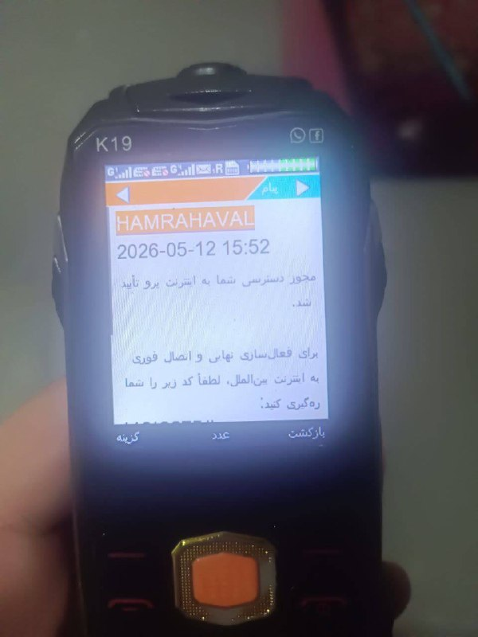

پدر بزرگ من که ۷۰ سالشه و مدت ها قبل کارگر ساختمانی بوده و اصلا اینترنت نمیدونه چیه و حتی نت ملی هم نداره پیامک اومده واسه اینترنت پرو دسترسی شما تائید شد

📚 @hamclasix 📚

## withyashar — post 11195

اتاق جنگ با یاشار : جابجای‌های غول آسا دو شماره یک «AirForce1» هواپیمای ویژه ریاست جمهوری و «B1 »بمب افکن اسطورهی آمریکا و خبر ویژه از داخل ایران https://www.instagram.com/reel/DYQCr39RJ4i/?igsh=MThycjJiYWZmbnJ3dA== کارای اداریش رو انجام بدید تا بعدش بریم…

## withyashar — post 11194

آکسیوس به نقل از مقامات اسرائیلی:

در پی احتمال تصمیم ترامپ برای از سرگیری جنگ، در اسرائیل حالت آماده‌باش حداکثری در طول تعطیلات آخر هفته برقرار خواهد شد.
@withyashar

## withyashar — post 11193

یک مقام کاخ سفید به فاکس‌نیوز:

رئیس‌جمهور چین علاقه‌مند است نفت بیشتری از آمریکا خریداری کند تا وابستگی کشورش به تنگه هرمز را کاهش دهد.
@withyashar

## withyashar — post 11192

جان بولتون: مذاکره با ایران برای یک توافق هسته‌ای هدر دادن اکسیژن است.

این افراد دهه‌ها پیش تصمیم استراتژیکی برای دستیابی به سلاح‌های هسته‌ای گرفتند و در این ۴۷ سال هیچ مدرکی وجود ندارد که نشان دهد آن‌ها این هدف را رها کرده‌اند.
@withyashar

## withyashar — post 11191

  <a href="telegram/content/withyashar_11191_1778752133.mp4" target="_blank">🎬 Download video</a>

ترامپ بعد از ۵۰ سال، اولین رئیس‌ جمهوری شد که به معبد آسمان چین رفت
@withyashar

## withyashar — post 11190

کاخ سفید : ترامپ و شی توافق کردن که تنگه هرمز باید باز بمونه
@withyashar

## withyashar — post 11189

  <a href="telegram/content/withyashar_11189_1778752134.mp4" target="_blank">🎬 Download video</a>

فاکس نیوز با حیرت : داداش بزرگه نگات میکنه ، لبخند بزنید شما با دوربین ها رصد میشوید
خبرنگار فاکس‌نیوز گزارش داد که خودروی آن‌ها در چین تنها دو دقیقه در محدوده «توقف ممنوع» پکن ایستاد و بلافاصله پیامک جریمه ۴۰ دلاری برای راننده صادر شد. به گفته او، در این کشور دوربین‌های نظارتی همه‌جا فعال هستند و تخلفات رانندگی در لحظه ثبت و اعمال می‌شود.
@withyashar

## withyashar — post 11188

هند: حمله به یک کشتی ما در نزدیکی
سواحل عمان غیرقابل قبول است

یک کشتی هندی توسط افراد ناشناس دزدیده شده و به سمت ایران اسکورت میشود
@withyashar

## withyashar — post 11187

بر اساس داده ها , شرکت تتر مبلغ 344 میلیون دلار USDT مرتبط با بانک مرکزی ایران رو فریز کرده و دلیلش هم بخاطر دور زدن تحریم‌ها بوده که شرکت آرکهام کیف پول‌های مرتبط رو شناسایی کرده
@withyashar

## withyashar — post 11186

تسنیم: کیفرخواست زیباکلام و مدیرمسئول خبرگزاری آنا صادر شد ممنوعیت زیباکلام از انجام هرگونه فعالیت رسانه‌ای به مدت سه ماه صادر شده
@withyashar

## withyashar — post 11185

  

دقایقی پیش زمین‌لرزه‌ای بسیار شدید ۵ ریشتری در عمق ۸ کیلومتری بردسیر کرمان را لرزاند
@withyashar

## withyashar — post 11184

نتانیاهو در دادگاه حظور پیدا کرد و گفت: «فیک نیوزها گفتند من به بیماری لاعلاجی مبتلا هستم - این یک صنعت دروغگویی تمام‌عیار است»
@withyashar

## withyashar — post 11183

تاج : در جریان آهنگی که معین برای تیم ملی در جام جهنی ۲۰۲۶ می خواند هستیم @withyashar

## withyashar — post 11182

اتاق جنگ با شما : زمین لرزه خیلی شدید کرمان یک دقیقه پیش
@withyashar

## withyashar — post 11181

  <a href="telegram/content/withyashar_11181_1778752136.mp4" target="_blank">🎬 Download video</a>

تصویربرداری عجیب یا اسکن ۳۶۰ ایلان ماسک از موقعیت با گوشی خودش
@withyashar

## withyashar — post 11180

  <a href="telegram/content/withyashar_11180_1778752138.mp4" target="_blank">🎬 Download video</a>

صحنه ای زیبا در چین که کودکان به ترامپ و شی خوشامد میگویند
@withyashar

---
📅 بروزرسانی: 1405/02/24 10:55
---

## persian_trend_official — post 14099

⭕️ وضعیت از 57 تا امروز... 🗿

(نسخه کم حجم توی کامنت ها)
📝 Nick

📌 @persian_trend_official
پرشین ترند | متفاوت‌ترین کانال نظامی

## persian_trend_official — post 14098

  <a href="telegram/content/persian_trend_official_14098_1778743547.webm" target="_blank">🎬 Download video</a>

⭕️ وزیر انرژی و معادن کوبا اعلام کرد که کشور به طور کامل از دیزل و نفت کوره خالی شده و تولید برق به صورت کامل متوقف شده است، در حالی که ایالات متحده جزیره را محاصره کرده است.

بسیاری از محله‌ها در پایتخت کوبا در حال حاضر با خاموشی‌هایی مواجه هستند که ۲۰ تا ۲۲ ساعت در روز طول می‌کشد.

📝 Nick

📌 @persian_trend_official
پرشین ترند | متفاوت‌ترین کانال نظامی

## persian_trend_official — post 14093

  <a href="telegram/content/persian_trend_official_14093_1778743548.webm" target="_blank">🎬 Download video</a>

باز مانده از رزمایش ضد هلی برن «قائد شهید» سپاه حضرت محمد رسول اللّه (ص) تهران بزرگ !!!

درسته جنگ زمینی تخصص شماست، فقط متخصصین عزیز پوتین نداشتید ؟

📌 @persian_trend_official
پرشین ترند | متفاوت‌ترین کانال نظامی

## persian_trend_official — post 14092

کانال رسمی پرشین ترند pinned a voice message

## persian_trend_official — post 14091

هر شب خواب رفیقای شهیدمو می‌بینم ! 📌 @persian_trend_official پرشین ترند | متفاوت‌ترین کانال نظامی

## persian_trend_official — post 14090

  <a href="telegram/content/persian_trend_official_14090_1778743549.mp4" target="_blank">🎬 Download video</a>

هر شب خواب رفیقای شهیدمو می‌بینم !

📌 @persian_trend_official
پرشین ترند | متفاوت‌ترین کانال نظامی

## persian_trend_official — post 14087

📍بولتن خبری ۲۴ ساعت اخیر پرشین ترند
🗓 ۲۴ اردیبهشت ۱۴۰۵

گرد آوری = آرشیو تحریریه پرشین ترند

◾️ نیویورک تایمز: ایران ۷۰ درصد از ذخایر موشکی خود را حفظ کرده و به ۳۰ سایت از ۳۳ سایت موشکی در تنگه هرمز دسترسی مجدد یافته است

◾️ رویترز: ایران رویکرد خود را از مسدودسازی هرمز به «کنترل دسترسی» تغییر داده؛ عراق و پاکستان به توافق جداگانه برای عبور نفتکش‌هایشان دست یافته‌اند

◾️خبرگزاری Wsj: عبور و مرور «خاموش» کشتی‌ها در تنگه هرمز ۶۰۰ درصد افزایش یافته

◾️ مجلس سنای آمریکا برای هفتمین بار قطعنامه پایان جنگ با ایران را رد کرد

◾️ پنتاگون: هزینه جنگ با ایران به ۲۹ میلیارد دلار رسید؛ تحلیلگران هشدار می‌دهند رقم نهایی به یک تریلیون دلار خواهد رسید

◾️ وزارت بهداشت ایران: تعداد مجروحان بستری جنگ به زیر ۴۰ نفر رسیده است

◾️سخنگوی وزارت خارجه ایران: آمریکا اهمیت فرصت مذاکره را درک نمی‌کند؛ ارزیابی دقیق‌تری از موضع آمریکا از طریق میانجیان پاکستانی دریافت خواهد شد

◾️سخنگوی کمیسیون امنیت ملی: غنی‌سازی ۹۰ درصدی یکی از گزینه‌های مطرح ایران است

◾️وزیر انرژی آمریکا: ایران به طرز نگران‌کننده‌ به غنی‌سازی درجه تسلیحاتی نزدیک شده و ممکن است چند هفته با آستانه ۹۰ درصد فاصله داشته باشد

◾️نروژ با سفر معاون وزیر خارجه به تهران، عمان و پاکستان در حال آزمودن نقش میانجیگری اروپایی است

◾️روسیه آمادگی خود را برای حمایت از تلاش‌های دیپلماتیک پاکستان در حل تنش خاورمیانه اعلام کرد

◾️ایتالیا اعلام کرد در صورت برقراری آتش‌بس پایدار، دو فروند مین‌روب به تنگه هرمز اعزام خواهد کرد

◾️ترامپ وارد پکن شد؛ ایران محور اصلی مذاکرات با شی جین‌پینگ عنوان شده است

◾️ترامپ: آمریکا برای پایان جنگ با ایران به کمک چین نیاز ندارد؛ «به هر شکل پیروز خواهیم شد»

◾️روبیو: واشنگتن امیدوار است پکن ایران را به عقب‌نشینی از رفتارهایش در منطقه متقاعد کند

◾️روبیو و وانگ یی توافق کردند هیچ کشوری حق دریافت عوارض حمل‌ونقل در تنگه هرمز را ندارد

◾️واشنگتن‌پست: گزارش محرمانه اطلاعاتی آمریکا نشان می‌دهد چین از جنگ ایران بهره راهبردی می‌برد؛ پکن در حین حملات ایران به کشورهای خلیج فارس تسلیحات فروخته است

◾️نیویورک تایمز: شرکت‌های چینی درباره فروش مخفیانه سلاح به ایران از طریق کشورهای ثالث مذاکره کرده‌اند

◾️گزارش‌ها حاکی است ایلان ماسک، تیم کوک، جنسن هوانگ و لری فینک در هیئت همراه ترامپ در سفر به پکن حضور دارند

◾️شهباز شریف از ۳ تا ۶ خرداد به پکن سفر می‌کند؛ میانجیگری میان ایران و آمریکا با مشارکت چین از دستور کار اصلی است

◾️وال استریت ژورنال: رئیس موساد دیوید بارنیا در جریان جنگ حداقل دو بار به‌صورت مخفیانه به امارات سفر کرده است

◾️دفتر نخست‌وزیری اسرائیل: نتانیاهو در میانه جنگ سفری محرمانه به امارات داشته؛ امارات این ادعا را تکذیب کرد

◾️داده‌های پروازی منتشرشده نشان می‌دهد دو هواپیمای شخصی در ۲۶ مارس از تل‌آویو به شهر العین امارات پرواز کرده‌اند

◾️وال استریت ژورنال: امارات فراتر از میانجیگری دیپلماتیک عمل کرده؛ حمله به جزیره لاوان و میزبانی سامانه‌های دفاع هوایی اسرائیل به این کشور نسبت داده شده است

◾️رویترز: جنگنده‌های عربستان سعودی اهداف شبه‌نظامیان وابسته به ایران را در نزدیکی مرز عراق بمباران کردند

◾️رویترز: کویت در دو نوبت حملات موشکی تلافی‌جویانه به مواضع شبه‌نظامیان در جنوب عراق انجام داده است

◾️عراقچی: کویت به‌صورت غیرقانونی به شناور ایرانی حمله و ۴ تبعه ایران را در خلیج فارس بازداشت کرده ؛ایران خواستار آزادی فوری آن‌هاست

◾️ احسان افرشته ۳۳ ساله بامداد چهارشنبه به اتهام همکاری با موساد اعدام شد؛ او پیش از بازگشت به ایران داوطلبانه خود را معرفی کرده بود

◾️ عضو کمیسیون بودجه مجلس: ۳۰ درصد از گرانی‌ها ناشی از جنگ و ۳۵ درصد ناشی از ناکارآمدی دستگاه‌هاست

◾️ شبکهNDTV تصاویر ماهواره‌ای منتشر کرد که حضور هواپیمای ترابری C-130H ایران در پایگاه هوایی نورخان پاکستان را تأیید می‌کند

◾️ وزیر دفاع پاکستان: ترکیه و قطر ممکن است به توافق دفاعی متقابل پاکستان و عربستان سعودی بپیوندند

◾️ رایمتال آلمان تولید انبوه پهپاد FV-014 با برد ۱۰۰ کیلومتر و استقامت ۷۰ دقیقه‌ای را آغاز کرد

◾️پنتاگون به‌طور غیرمنتظره اعزام تیپ رزمی زرهی «بلک‌جک» به لهستان را لغو کرد؛ برخی نیروها در مسیر بودند که دستور توقف صادر شد

◾️بلومبرگ: نزدیک به ۴۰ درصد از تأمین‌کنندگان سازندگان موشک دولتی چین در ۲۰۲۵ به درآمد رکوردی رسیدند

◾️ پوتین به تسلط کامل بر دونباس تا پاییز متمرکز شده و قصد دارد از آن برای درخواست قلمرو بیشتر در مذاکرات آتی بهره ببرد

◾️ ترکیه و ارمنستان آماده‌سازی‌های لازم برای راه‌اندازی تجارت مستقیم را تا ۱۱ مه ۲۰۲۶ تکمیل کردند

📌 @persian_trend_official
پرشین ترند | متفاوت‌ترین کانال نظامی

## OfficialPersiaTwiter — post 498417

ایران، یک کشتی را توقیف کرد؟

سازمان عملیات تجاری دریایی بریتانیا:
🔹حادثه برای یک کشتی در فاصله ۳۸ مایل دریایی شمال فجیره امارات دریافت کردیم
🔹این کشتی تصرف و تحت کنترل افراد غیرمجاز قرار گرفت و به سمت آب های ایران در حرکت است
🔹هویت این کشتی و نیرویی که کنترل آن را برعهده گرفته،اعلام نشده است.

》OPT《

@OfficialPersiaTwiter

## OfficialPersiaTwiter — post 498416

  <a href="telegram/content/OfficialPersiaTwiter_498416_1778743551.mp4" target="_blank">🎬 Download video</a>

🔹 خرید از ربات در چین توسط خبرنگار فاکس‌نیوز: این بار خرید قهوه

》OPT《

@OfficialPersiaTwiter

## OfficialPersiaTwiter — post 498415

  <a href="telegram/content/OfficialPersiaTwiter_498415_1778743554.mp4" target="_blank">🎬 Download video</a>

🔹 گزارش خبرنگار فاکس‌نیوز از ربات فروشنده در چین و درخواست خرید سوسیس از این ربات

》OPT《

@OfficialPersiaTwiter

## OfficialPersiaTwiter — post 498414

عراقچی: هیچ‌ راه‌حل نظامی درباره ایران وجود ندارد

🔹عراقچی در نشست وزرای امور خارجه کشورهای عضو بریکس گفت که همان‌گونه که همگی شاهد بوده‌اید، کشور من طی کمتر از یک سال، دو بار هدف تجاوزی وحشیانه و غیرقانونی از سوی ایالات متحده و اسرائیل قرار گرفته است.
🔹حقیقت آن است که ایران، همانند بسیاری از کشورهای مستقل، قربانی توسعه‌طلبی غیرقانونی و جنگ‌افروزی شده است. این‌ها پدیده‌هایی زشت هستند که هیچ جایگاهی در جهان امروز ندارند.
🔹همان‌طور که بارها تأکید کرده‌ام، هیچ‌گونه راه‌حل نظامی برای هر موضوعی که به ایران مربوط باشد وجود ندارد. ما ایرانیان هرگز در برابر هیچ فشار یا تهدیدی سر خم نمی‌کنیم، اما به زبان احترام پاسخ متقابل می‌دهیم.
🔹هرچند نیروهای مسلح قدرتمند ما آماده‌اند پاسخی کوبنده و ویرانگر به متجاوزان خارجی بدهند، اما مردم ما صلح‌طلب هستند و خواهان جنگ نیستند. در این وضعیت شرم‌آور، ما متجاوز نیستیم؛ بلکه طرفی هستیم که مورد ظلم و تجاوز قرار گرفته است.

》OPT《

@OfficialPersiaTwiter

## OfficialPersiaTwiter — post 498413

عراقچی:

🔹تنگه هرمز اکنون بیش از هر چیز از تجاوز آمریکا و محاصره‌ای که بر آن تحمیل کرده، آسیب می‌بیند.

🔹از نظر ما، تنگه هرمز برای تمامی کشتی‌های تجاری باز است، اما آن‌ها باید با نیروهای دریایی ما همکاری کنند.

🔹ما هیچ مانعی ایجاد نکرده‌ایم؛ این آمریکاست که محاصره ایجاد کرده است، و امیدوارم این وضعیت با رفع این محاصره غیرقانونیِ تحمیل‌شده از سوی آمریکا پایان یابد.

》OPT《

@OfficialPersiaTwiter

## OfficialPersiaTwiter — post 498412

  <a href="telegram/content/OfficialPersiaTwiter_498412_1778743556.mp4" target="_blank">🎬 Download video</a>

بدرقه‌ی اتوبوس تیم ملی فوتبال ایران با شعار مرگ بر آمریکا برای سفر به آمریکا.

》OPT《

@OfficialPersiaTwiter

## OfficialPersiaTwiter — post 498411

  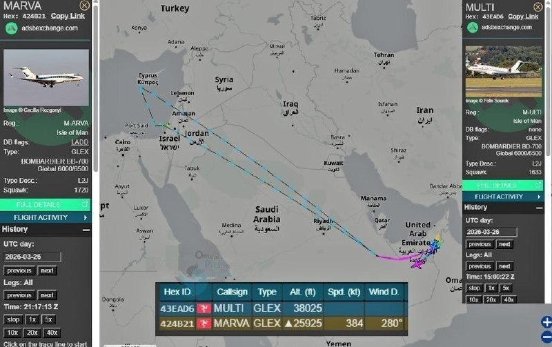

مقام اسرائیلی تکذیب امارات را رد کرد/ نتانیاهو در ابوظبی مورد استقبال سلطنتی قرار گرفت 🔹«زیو آگمون» رئیس دفتر نتانیاهو که به تازگی استعفا کرده و در زمان سفر به امارات همراه وی بوده است، ادعای مقامات ابوظبی مبنی بر تکذیب سفر نخست وزیر اسرائیل به این کشور یا…

## OfficialPersiaTwiter — post 498410

شریعتمداری: بحرین که جزء جدانشدنی خاک ماست باید به ایران بازگردانده شود

مدیرمسئول روزنامه کیهان نوشت:
🔹دولت حاکم بر جزیره ایرانی بحرین، تعداد زیادی از روحانیون، دانشجویان و مردم بحرین را به دلیل حمایت از جمهوری اسلامی ایران بازداشت و محکوم کرده است.
🔹مردم بحرین با نگاه وطن اصلی خود به ایران می‌نگرند و اعتراض دارند که چرا بخشی از ایران به پایگاهی علیه کشورمان تبدیل شده است.
🔹بحرین بخشی از خاک ایران بوده و هست و در سال ۱۳۵۰ در جریان یک زد و بند خیانت‌آمیز از ایران جدا شد.
🔹یکی از اصلی‌ترین خواسته‌های مردم بحرین از زمان جدایی، بازگشت این استان جداشده به سرزمین مادری خود یعنی ایران اسلامی است.
🔹همه‌پرسی واقعی درباره جدایی بحرین هرگز برگزار نشد و به جای آن رؤسای چند قبیله وابسته به انگلیس درباره سرنوشت بحرین تصمیم گرفتند.
🔹قبیله آل خلیفه که حاکمان کنونی بحرین هستند، به نیابت از انگلیس حاکمیت این کشور را برعهده گرفتند.
🔹در این واقعیت که بحرین کماکان بخشی از سرزمین ایران است، کمترین تردیدی وجود ندارد.
🔹جمهوری اسلامی ایران باید سازوکار قانونی بازپس‌گیری بحرین را در دستور کار فوری خود قرار دهد.

》OPT《

@OfficialPersiaTwiter

## OfficialPersiaTwiter — post 498409

  <a href="telegram/content/OfficialPersiaTwiter_498409_1778743560.mp4" target="_blank">🎬 Download video</a>

مارکو روبیو درباره ناتو:
🔹من از ناتو حمایت کردم زیرا به ما اجازه داد تا پایگاه‌هایی در اروپا داشته باشیم که می‌توانیم در شرایط اضطراری، مانند اتفاقی در خاورمیانه، از آن‌ها استفاده کنیم.
وقتی شرکای ناتو اجازه استفاده از آن پایگاه‌ها را به ما نمی‌دهند، پس هدف این اتحادیه چیست؟

》OPT《

@OfficialPersiaTwiter

## OfficialPersiaTwiter — post 498408

  <a href="telegram/content/OfficialPersiaTwiter_498408_1778743563.mp4" target="_blank">🎬 Download video</a>

مارکو روبیو درباره ترامپ:
🔹او مایل است کاری را انجام دهد که دیگران درباره آن صحبت می‌کنند اما انجام نمی‌دهند.
🔹وقتی می‌گویید: «خب، نمی‌توانیم آن کار را انجام دهیم»، او می‌پرسد: «چرا؟» او مایل است کارهای ناتمام را حل کند و آن‌ها را برای نفر بعدی، مرد یا زن، باقی نگذارد.
🔹بخشی از تیم او بودن بسیار لذت‌بخش است.

》OPT《

@OfficialPersiaTwiter

## OfficialPersiaTwiter — post 498407

  <a href="telegram/content/OfficialPersiaTwiter_498407_1778743567.mp4" target="_blank">🎬 Download video</a>

مارکو روبیو، درباره ایران:
🔹آن‌ها قصد داشتند آن‌قدر پهپاد و موشک داشته باشند که هیچ‌کس نتواند به ایران حمله کند، زیرا نتیجه آن برای منطقه فاجعه‌بار خواهد بود.
🔹به محض اینکه آن‌ها به این مصونیت رسیدند، به سمت دستیابی به سلاح هسته‌ای می‌شتافتند. دونالد ترامپ اجازه نخواهد داد که این اتفاق در دوران ریاست‌جمهوری او رخ دهد.

》OPT《

@OfficialPersiaTwiter

## OfficialPersiaTwiter — post 498406

پلیس راهور: اگر در ایام جنگ کارت خودرو را‌ تحویل نگرفتید، دوباره ارسال می‌کنیم

🔹 در جریان جنگ تحمیلی رمضان، برخی شهروندان محل سکونت خود را ترک کرده و موفق به دریافت کارت خودروی خود نشدند.

🔹 حالا رئیس مرکز شماره‌گذاری پلیس راهور اعلام کرده، که کارت خودروها، دوباره و در بازۀ زمانی ۱ تا ۱۵ خردادماه به نشانی ثبت شده شهروندان ارسال خواهد شد.

》OPT《

@OfficialPersiaTwiter

## OfficialPersiaTwiter — post 498405

  <a href="telegram/content/OfficialPersiaTwiter_498405_1778743569.mp4" target="_blank">🎬 Download video</a>

واکنش جالب روبیو، وزیر خارجه ترامپ، از دیدنِ سالنِ دیدارهای ریاست‌جمهوری چین

》OPT《

@OfficialPersiaTwiter

## OfficialPersiaTwiter — post 498404

خسارت خودروها در جنگ را هنوز بیمه‌ها پرداخت نکرده‌اند؟

روزنامه همشهری نوشت:
🔹با گذشت بیش از ۷۰ روز از آغاز جنگ تحمیلی سوم، بسیاری از شهروندان همچنان در انتظار دریافت خسارت خودرو و خانه‌های آسیب‌دیده خود هستند.
🔹این تأخیر در پرداخت‌ها باعث افزایش نگرانی‌های اقتصادی و معیشتی خانواده‌ها شده است.
🔹براساس برآوردها حدود ۳۰ هزار خودرو در جریان جنگ آسیب دیده‌اند و میزان خسارت آنها حدود ۶ هزار میلیارد تومان تخمین زده شده است.
🔹رئیس‌کل بیمه مرکزی اعلام کرد هماهنگی‌ های لازم برای تسریع در پرداخت خسارت‌ها انجام شده است.
🔹کارشناسان توصیه می‌کنند شهروندان برای تهیه بیمه‌نامه‌هایی با پوشش خسارت‌های ناشی از جنگ اقدام کنند.
🔹داشتن پوشش جنگ در بیمه بدنه خودرو باعث می‌شود فرآیند دریافت خسارت سریع‌تر و با پیچیدگی کمتری انجام شود.
🔹بیمه مرکزی در روزهای ابتدایی جنگ اعلام کرد ارائه پوشش خسارت‌های ناشی از جنگ در برخی بیمه‌نامه‌ها بلامانع است.
🔹چند روز پس از آغاز جنگ نیز مجوز ارائه بیمه‌نامه‌های متنوع با پوشش‌های ویژه جنگی به شرکت‌های بیمه داده شد.

》OPT《

@OfficialPersiaTwiter

## OfficialPersiaTwiter — post 498403

  <a href="telegram/content/OfficialPersiaTwiter_498403_1778743571.mp4" target="_blank">🎬 Download video</a>

ترامپ به سوال دربارهٔ تایوان جواب نداد

🔹خبرنگار: گفت‌وگوها چطور بود؟
🔹ترامپ: عالی بود. چین زیباست.

🔹خبرنگار: آیا دربارهٔ تایوان صحبت کردید؟
🔹ترامپ هیچ پاسخی نداد.

》OPT《

@OfficialPersiaTwiter

## OfficialPersiaTwiter — post 498402

شی‌جین پینگ: تایوان مهم‌ترین مسئله در روابط چین و آمریکا است

🔹رئیس‌جمهور چین، در جریان گفت‌وگو با دونالد ترامپ، تایوان را «مهم‌ترین مسئله در روابط چین و آمریکا» خواند
🔹شی تأکید کرد که اگر این مسئله «به درستی» مدیریت شود، دو کشور می‌توانند از یک رابطه باثبات بهره‌مند شوند، اما در غیر این صورت، «دو کشور دچار تنش و حتی درگیری خواهند شد و کل روابط را در معرض خطر قرار خواهند داد»!
🔹وی همچنین افزود که استقلال تایوان و صلح در تنگه تایوان «به اندازه آتش و آب ناسازگارند»

》OPT《

@OfficialPersiaTwiter

## OfficialPersiaTwiter — post 498401

امارات متحده عربی دیدار مخفیانه نتانیاهو از ابوظبی در طول جنگ با ایران را تکذیب کرد 》OPT《 @OfficialPersiaTwiter

## OfficialPersiaTwiter — post 498400

ترامپ: هر وقت هم مشکلی پیش آمده، آن را با هم حل کرده‌ایم

دونالد ترامپ خطاب به رئیس‌جمهور چین:
🔹باید بگویم این افتخاری بود که کمتر کسی تا به حال نظیرش را دیده است. من و شما حالا مدت زیادی است که یکدیگر را می‌شناسیم. در واقع، طولانی‌ترین رابطه میان رؤسای جمهور دو کشورمان را داشته‌ایم و این برای من یک افتخار است.
🔹 ما رابطه‌ای فوق‌العاده داشته‌ایم. همیشه با هم کنار آمده‌ایم. هر وقت هم مشکلی پیش آمده، آن را حل کرده‌ایم. من به شما زنگ می‌زدم و شما به من زنگ می‌زدید. و هر زمان مشکلی داشتیم -چیزی که مردم نمی‌دانند- خیلی سریع آن را حل می‌کردیم. و قرار است آینده‌ای فوق‌العاده در کنار هم داشته باشیم.
🔹 احترام بسیار زیادی برای چین و کاری که انجام داده‌اید قائلم. شما رهبر بزرگی هستید. این را به همه می‌گویم. شما رهبر بزرگی هستید. بعضی‌ها دوست ندارند من این را بگویم، اما باز هم می‌گویم چون حقیقت دارد. من فقط حقیقت را می‌گویم.
🔹 بودن در کنار شما برای من افتخار است. افتخار می‌کنم که دوست شما هستم. رابطه میان چین و ایالات متحده بهتر از هر زمان دیگری خواهد شد. خیلی متشکرم. ممنون.

》OPT《

@OfficialPersiaTwiter

## OfficialPersiaTwiter — post 498399

  <a href="telegram/content/OfficialPersiaTwiter_498399_1778743574.mp4" target="_blank">🎬 Download video</a>

🔹«شی جین‌پینگ» رئیس‌جمهور چین نیز به ترامپ گفت که مشتاق است درباره مسائل مهم با دونالد ترامپ گفت‌وگو و تبادل نظر کند.

🔹رئیس‌جمهور چین تأکید کرد: همواره معتقد بوده‌ام که منافع مشترک میان چین و آمریکا بیش از اختلافات دو کشور است.

🔹او همچنین خطاب به ترامپ گفت: تمام جهان در حال تماشای دیدار ما است

🔹در مقابل، ترامپ نیز گفت روابط میان آمریکا و چین «بهتر از هر زمان دیگری» خواهد شد.

》OPT《

@OfficialPersiaTwiter

## OfficialPersiaTwiter — post 498398

  <a href="telegram/content/OfficialPersiaTwiter_498398_1778743576.mp4" target="_blank">🎬 Download video</a>

ترامپ به رئیس‌ جمهور چین:

🔹شما یک رهبر بزرگ هستید. به همه می‌گویم که شما یک رهبر بزرگ هستید. گاهی مردم از گفتن این حرف توسط من خوششان نمی‌آید، اما با این حال می‌گویم چون حقیقت است.

🔹من فقط حقیقت را می‌گویم.

》OPT《

@OfficialPersiaTwiter

## bbcpersian — post 281007

‌ یونهاپ،‌ خبرگزاری رسمی کره‌جنوبی، روز پنج‌شنبه به نقل از یک مقام ارشد در سئول گزارش داد احتمال این که طرفی غیر از ایران مسئول حمله به یک کشتی باری کره‌جنوبی در نزدیکی تنگه هرمز باشد، کم است. در این گزارش به نقل از یک مقام ارشد کره‌جنوبی آمده است که این…

## bbcpersian — post 281006

  

‌
یونهاپ،‌ خبرگزاری رسمی کره‌جنوبی، روز پنج‌شنبه به نقل از یک مقام ارشد در سئول گزارش داد احتمال این که طرفی غیر از ایران مسئول حمله به یک کشتی باری کره‌جنوبی در نزدیکی تنگه هرمز باشد، کم است.

در این گزارش به نقل از یک مقام ارشد کره‌جنوبی آمده است که این کشور در حال بررسی اطلاعاتی است که آمریکا درباره حمله چهارم مه (۱۴ اردیبهشت) به کشتی «نامو» متعلق به شرکت کشتیرانی «اچ‌ام‌ام» کره‌جنوبی در اختیارش گذاشته است. این حمله باعث آتش‌سوزی و آسیب به بخشی از بدنه کشتی شد.

این مقام ارشد وزارت خارجه کره‌جنوبی به خبرنگاران گفت:«وقتی تحقیقات را کامل کنیم و شواهد را ارائه دهیم، اطمینان دارم طرف ایرانی واکنشی مناسب نشان خواهد داد.»

وزارت خارجه کره‌جنوبی تاکنون اظهارات این مقام را تأیید نکرده است.

📷South Korean Foreign Ministry/Reuters
@BBCPersian
⬇️

## bbcpersian — post 281005

🔻یک کمیسیون تحقیق اسرائیلی: حماس در حملات هفت اکتبر از خشونت جنسی به عنوان «سلاح» استفاده کرد

یک کمیسیون مستقل اسرائیلی جزئیات تکان‌دهنده‌ای از خشونت جنسی «سیستماتیک و گسترده» توسط حماس و سایر گروه‌های مسلح فلسطینی در جریان حملات ۷ اکتبر ۲۰۲۳ و علیه گروگان‌ها منتشر کرده است.

گزارش ۳۰۰ صفحه‌ای این کمیسیون نتیجه‌گیری می‌کند که تجاوز و شکنجه جنسی «با هدف به حداکثر رساندن درد و رنج» انجام شده است.

در حالی که سازمان ملل متحد و دیگران گزارش‌هایی در مورد خشونت جنسی در جریان این حملات منتشر کرده‌اند گفته می‌شود که گزارش این کمیسیون مستقل جامع‌ترین گزارش است.

حماس در حمله هفتم اکتبر ۲۰۲۳، حدود ۱۲۰۰ نفر را کشت و ۲۵۱ نفر را گروگان گرفت.

این گزارش بر اساس ۴۳۰ مصاحبه فیلمبرداری شده با بازماندگان و شاهدان آن حمله، بیش از ۱۰ هزار عکس و فیلم گرفته شده توسط مهاجمان و سوابق و مدارک رسمی از محل‌های حمله تهیه شده است.

بیشتر بخوانید:

https://bbc.in/4divTP2
@BBCPersian

## bbcpersian — post 280997

‌‌
رسانه‌ها و محافل سیاسی تندرو در ایران، به شکل روزافزونی تنگه هرمز را نه‌تنها به عنوان یک گلوگاه انرژی، بلکه به عنوان مسیری استراتژیک برای ترافیک جهانی اینترنت معرفی می‌کنند.

آنها معتقدند اهرم فشار جدید ایران در زیر آب‌های تنگه و در قالب کابل‌های بین‌المللی انتقال داده پنهان شده است. این بحث در شرایطی مطرح می‌شود که پس از درگیری‌های نظامی اخیر در اطراف تنگه هرمز، تنش‌ها میان ایران، آمریکا و کشورهای خلیج فارس افزایش یافته است. بر اساس این دیدگاه، ایران می‌تواند بر کابل‌های زیردریایی عبوری از تنگه، نظارت امنیتی و مقرراتی اعمال کند یا حتی برای عبور آنها عوارض تعیین کند.

هرچند چنین اقدامی با موانع حقوقی و فنی بسیار زیادی روبه‌رو است، اما این بحث نشان‌دهنده تلاش جدی ایران برای گسترش ابزارهای بازدارندگی نامتقارن به حوزه حساس زیرساخت‌های دیجیتال و فراتر از نفتکش‌ها است.

آیا کابل‌های زیردریایی اینترنت به سلاح تازه ایران در خلیج فارس تبدیل می‌شود؟

از لینک ⬇️ این مطلب را در سایت بی‌بی‌سی فارسی بخوانید.
https://bbc.in/4dGOl58

📸GettyImages/ AFP via Getty Images/ FARS
@BBCPersian

## bbcpersian — post 280995

🔻حضور شماری از رهبران ارشد تجاری در هیئت همراه ترامپ

شماری از مقامات تجاری برجسته از جمله ایلان ماسک،‌ مدیرعامل شرکت تسلا، تیم کوک، مدیرعامل اپل و جنسن هوانگ، مدیر اجرایی انویدیا، در سفر به چین دونالد ترامپ را همراهی می‌کنند.

نلویزیون دولتی چین ویدئویی منتشر کرده است که آن ها را در حال ورود به اتاقی نشان می‌دهد که دیدار دو رئیس‌جمهور در آن برگزار شده بود.

این افراد بعداً هنگام خروج از محل نشست دیده شدند و خبرنگاران از آن‌ها درباره این رویداد درخواست اظهارنظر کردند.
https://bbc.in/4fkRCIA
@BBCPersian

## bbcpersian — post 280994

🔻شی از مذاکرات مثبت میان وزرا و مدیران دو کشور سخن گفت

به گزارش رسانه‌های دولتی چين، شی جين‌پينگ گفته است تيم‌های تجاری امريکا و چين در نشست روز گذشته - سه شنبه - به «نتایجی متوازن و مثبت» دست يافتند.

اسکات بسنت، وزیر داراییآمریکا، روز گذشته در کره‌جنوبی با هه لی‌فنگ، معاون نخست‌وزیر چین دیدار کرد؛ نشستی که پیش از دیدار مورد انتظار روسای جمهور دو کشور انجام شد.

آقای شی همچنين گفت: «واقعيت بارها ثابت کرده است که در جنگ تجاری هيچ برنده‌ای وجود ندارد و ماهيت روابط اقتصادی و تجاری چين و امريکا بر پايه منافع متقابل و همکاری برد-برد است.»

او افزود: «دو طرف بايد برای حفظ روند مثبت و ارزشمندی که با دشواری به دست آمده، با يکديگر همکاری کنند.»

https://bbc.in/4doK2tY
@BBCPersian
@BBCPersian

## bbcpersian — post 280993

🔻گفتگوهای ترامپ و شی بر سر چیست؟

به گفته کلی گريکو از برنامه «بازانديشی راهبرد کلان امريکا» در مرکز استيمسون، سخنان دوستانه دونالد ترامپ خطاب به شی جين‌پينگ، در آستانه مذاکرات، چين را در جايگاهی برابر با امريکا قرار می‌دهد.

کلی گريکو به بی‌بی‌سی گفت ترامپ مشتاق خواهد بود توافق‌هايی به دست آورد که بر اساس آنها چين محصولات کشاورزی، هواپيما و ساير کالاهای امريکايی را خريداری کند تا «بتواند بگويد توافق‌های خوبی را به کشور بازگردانده است.»

اما موقعيت چانه‌زنی ايالات متحده امريکا تضعيف شده، زيرا تعرفه‌های ترامپ در يک سال گذشته عليه چين نتيجه مطلوبی نداشته‌اند.

پکن نيز در مقابل، اهرم فشار خود را در زمينه عناصر خاکی کمياب — فلزاتی حياتی برای توليد تجهيزات الکترونيک و نيمه‌رساناها — نشان داده است.

آقای ترامپ همچنين تلاش خواهد کرد چين را متقاعد کند تا برای پايان دادن به جنگ، بر ايران فشار وارد کند.

کلی گريکو معتقد است اگر چين بخواهد در اين زمينه کمک کند، «قطعا در مقابل چيزی خواهد خواست.»

https://bbc.in/4f4kBAD
@BBCPersian
@BBCPersian

## bbcpersian — post 280992

🔻دونالد ترامپ و شی جین پینگ، روسای جمهور دو اقتصاد بزرگ جهان در پکن دیدار کردند.

این دیدار که با مراسم‌های متعدد و پر زرق و برق همراه بود، صبح پنجشنبه در پکن و در حالی که هر دو رهبر را هیات‌های بلندپایه‌ای همراهی می‌کردند روی داد.

تصویر دست دادن این دو خیلی زود به صدر اخبار جهان راه یافت و احتمالا خیلی زود بر بازارهای جهانی که صبح پنجشنبه از شرق آسیا گشوده شدند، تاثیر خواهد گذاشت.

در سخنان آغازين دیدار با دونالد ترامپ، شی جين پينگ گفت: «تمام جهان نشست ما را زير نظر دارد. در حال حاضر، تحولاتی که در يک قرن گذشته بی‌سابقه بوده‌اند، با شتاب در سراسر جهان در حال وقوع است و وضعيت بين‌المللی سيال و پرتلاطم شده است.»

دونالد ترامپ، در سخنان آغازين خود گفت که ديدار امروز با شی جين پينگ «باعث افتخار» او است.

آقای ترامپ گفت: «ما روابط خوبی داشته‌ايم و هر زمان مشکلی پيش آمده، آن را حل کرده‌ايم. من به شما زنگ می‌زدم و شما هم به من زنگ می‌زديد.»

او افزود: «مردم نمی‌دانند، اما هر وقت مشکلی داشتيم، خيلی سريع آن را حل می‌کرديم.»

🎥APTN/ REUTERS
https://bbc.in/4wsi891
@BBCPersian

## Lichargoo — post 24872

‏با انداختن گلشیفته به فرانسویا تا حدی تونستیم انتقام وقایع سال ۵۷ رو ازشون بگیریم.

## Tans_Footbali — post 236282

#طوفان‌الاقصی @Tans_Footbali

## Tans_Footbali — post 236281

  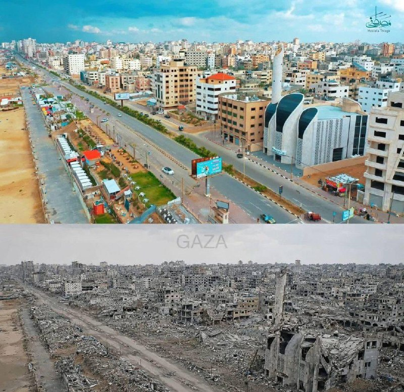

#طوفان‌الاقصی

@Tans_Footbali

## Tans_Footbali — post 236280

گل اول لیونل مسی 
⚫️@FootyRadar

## Tans_Footbali — post 236279

  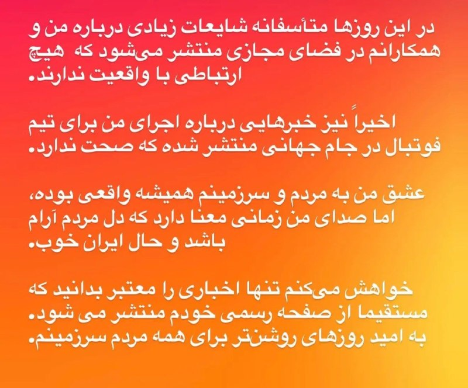

معین خبر خوندن موزیک جام‌جهانی رو تکذیب کرد

💛@Tans_Footbali

## hamclasixii — post 75362

🔴امروز کانکور ۱۴۰۵ افغانستان در ۱۵ ولایت به گونه‌ی رسمی آغاز شد.

🔹امروز (پنج‌شنبه، ۲۴ ثور) نخستین دور کانکور سال روان خورشیدی در میدان‌وردک، پروان، غزنی، کنر، بغلان، فاریاب، بادغیس، لوگر، کاپیسا، پکتیکا، هرات، سرپل، ارزگان، غور و پنج حوزه‌ی بدخشان، برگزار شده است.
🔹اداره‌ی عمومی امتحانات، افزوده که اطلاعات بایومتریک اشتراک‌کنندگان این دور در ۲۲ و ۲۳ ثور ثبت شده است. به گفته‌ی این اداره، در ۱۵ ولایت یادشده فردا نیز کانکور برگزار خواهد شد.

📚 @hamclasix 📚

## hamclasixii — post 75361

همه دماغشونو عمل کردن دیگه من موندم و کلی اکسیژن

📚 @hamclasix 📚

## hamclasixii — post 75360

🔴آخرین وضعیت نحوۀ برگزاری امتحانات دورۀ متوسطۀ شهر تهران 🔹آموزش‌وپرورش تهران از پیش‌بینی دو سناریو برای نحوۀ برگزاری امتحانات پایه‌های هفتم تا دهم خبر داد. 🔹سناریوی نخست: در صورت تداوم شرایط فعلی، احتمالا امتحانات داخلی دانش‌آموزان پایه‌های هفتم، هشتم، نهم…

## hamclasixii — post 75359

🔴آخرین وضعیت نحوۀ برگزاری امتحانات دورۀ متوسطۀ شهر تهران

🔹آموزش‌وپرورش تهران از پیش‌بینی دو سناریو برای نحوۀ برگزاری امتحانات پایه‌های هفتم تا دهم خبر داد.
🔹سناریوی نخست: در صورت تداوم شرایط فعلی، احتمالا امتحانات داخلی دانش‌آموزان پایه‌های هفتم، هشتم، نهم و دهم از تاریخ ۹ خردادماه به صورت حضوری و مدرسه‌ای, با رعایت اصل پراکندگی (کلاس به کلاس) برگزار خواهد شد.
🔹سناریوی دوم: در صورت ناپایدار شدن شرایط و بروز محدودیت‌های احتمالی، امتحانات داخلی این پایه‌ها به صورت غیرحضوری برگزار شود.
🔹این موضوع پس از بررسی‌های دقیق‌تر و اخذ مجوزهای لازم، ظرف روزهای آینده به مدارس ابلاغ خواهد شد.

📚 @hamclasix 📚

## withyashar — post 11179

  <a href="telegram/content/withyashar_11179_1778743580.mp4" target="_blank">🎬 Download video</a>

خبرنگار: آقای رئیس‌جمهور، مذاکرات چطور بود؟

ترامپ : عالی بود. چین زیباست.

خبرنگار: دربارهٔ تایوان هم صحبت کردید؟

ترامپ: (پاسخی نداد)
@withyashar

---
📅 بروزرسانی: 1405/02/24 07:46
---

## persian_trend_official — post 14086

  <a href="telegram/content/persian_trend_official_14086_1778732164.mp4" target="_blank">🎬 Download video</a>

صبحتون بخیر ☕️

📝 Nick
📌 @persian_trend_official
پرشین ترند | متفاوت‌ترین کانال نظامی

## persian_trend_official — post 14085

🔴 روبیو: امیدواریم چین ایران را به عقب‌نشینی از رفتارهایش متقاعد کند

💢مارکو روبیو، وزیر خارجه آمریکا، اعلام کرد واشینگتن امیدوار است چین نقش فعال‌تری برای متقاعد کردن ایران به عقب‌نشینی از رفتارهایش در منطقه ایفا کند.

▪️روبیو همچنین گفت:

▪️ آمریکا به‌دنبال مدیریت راهبردی روابط پیچیده خود با چین است
▪️ چین بزرگ‌ترین چالش ژئوپلیتیکی و سیاسی پیش‌روی آمریکا محسوب می‌شود
▪️ واشینگتن خواهان جلوگیری از تشدید تنش‌ها در منطقه است

🫆:Tony

📌 @persian_trend_official
پرشین ترند | متفاوت‌ترین کانال نظامی

## persian_trend_official — post 14084

🔴 واشینگتن‌پست: چین از جنگ ایران سود راهبردی می‌برد

💢روزنامه «واشینگتن‌پست» به‌نقل از یک گزارش محرمانه اطلاعاتی آمریکا مدعی شد چین در حال کسب مزایای راهبردی از جنگ ایران است؛ در حالی که آمریکا منابع نظامی و اقتصادی خود را در این درگیری مصرف می‌کند.

▪️بر اساس این ارزیابی:

▪️ چین در جریان حملات ایران، به کشورهای خلیج فارس تسلیحات فروخته است
▪️ پکن به برخی کشورها برای مدیریت بحران انرژی پس از بسته‌شدن تنگه هرمز کمک کرده است
▪️ جنگ باعث کاهش ذخایر موشکی و سامانه‌های دفاعی آمریکا شده و نگرانی‌هایی درباره آمادگی واشینگتن برای درگیری احتمالی بر سر تایوان ایجاد کرده است
▪️ چین عملیات‌های نظامی آمریکا را زیر نظر دارد و از پیام‌های ضدجنگ برای نمایش آمریکا به‌عنوان عامل بی‌ثباتی استفاده می‌کند

💢تحلیلگران معتقدند ادامه این درگیری می‌تواند نفوذ جهانی چین را افزایش داده و جایگاه آمریکا نزد متحدانش را تضعیف کند.

🫆:Tony

📌 @persian_trend_official
پرشین ترند | متفاوت‌ترین کانال نظامی

## persian_trend_official — post 14083

  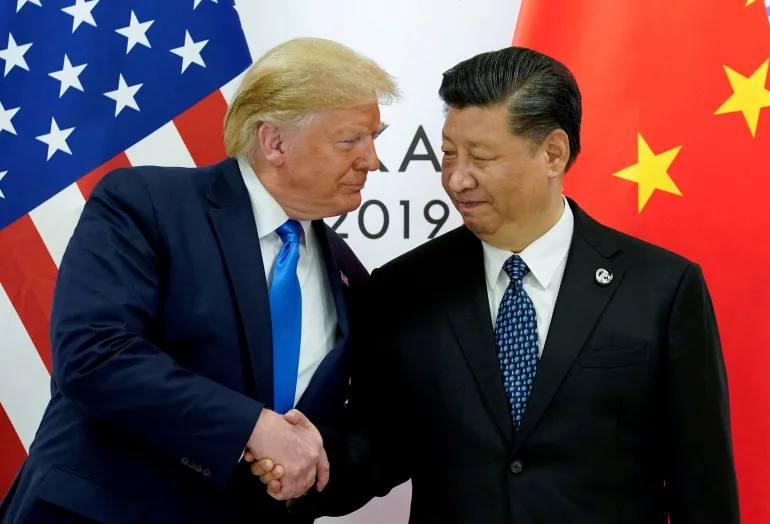

🔴 ترامپ: آمریکا برای پایان جنگ با ایران به کمک چین نیاز ندارد

💢دونالد ترامپ اعلام کرد آمریکا برای پایان دادن به جنگ با ایران و کاهش تنش‌ها در تنگه هرمز، نیازی به کمک چین ندارد.

▪️ «فکر نمی‌کنم برای موضوع ایران به کمکی نیاز داشته باشیم»
▪️ «به هر شکلی پیروز خواهیم شد؛ چه از راه صلح و چه غیر از آن»

💢گزارش‌ها حاکی است موضوع جنگ ایران در دیدار ترامپ و شی جین‌پینگ طی دو روز آینده مطرح خواهد شد، اما ترامپ نقش پکن در پایان درگیری را کم‌اهمیت توصیف کرده است.

در همین حال، رسانه‌ها گزارش می‌دهند در ایران نیز دیدار ترامپ و رئیس‌جمهور چین تهدیدی برای روابط تهران و پکن تلقی نمی‌شود.

بر اساس این گزارش:

▪️ مقام‌ها و تحلیلگران ایرانی روابط دو کشور را «راهبردی و مستقل» توصیف می‌کنند
▪️ به توافق ۲۵ ساله ایران و چین که در سال ۲۰۲۰ امضا شد اشاره شده است
▪️ این توافق حوزه‌های سیاسی، اقتصادی و فرهنگی را شامل می‌شود

🫆:Tony

📌 @persian_trend_official
پرشین ترند | متفاوت‌ترین کانال نظامی

## persian_trend_official — post 14082

  <a href="telegram/content/persian_trend_official_14082_1778732166.webm" target="_blank">🎬 Download video</a>

🔴دیوار نوشته‌ای در تهران؛

💢ورود سگ‌ها و آمریکایی‌ها به تنگهٔ هرمز ممنوع...🚫

🫆:Tony

📌 @persian_trend_official
پرشین ترند | متفاوت‌ترین کانال نظامی

## bbcpersian — post 280991

🔻ترامپ به شی: از دوستی با شما افتخار می‌کنم

دونالد ترامپ، در سخنان آغازين خود گفت که ديدار امروز با شی جين پينگ «باعث افتخار» او است.

آقای ترامپ گفت: «ما روابط خوبی داشته‌ايم و هر زمان مشکلی پيش آمده، آن را حل کرده‌ايم. من به شما زنگ می‌زدم و شما هم به من زنگ می‌زديد.»

او افزود: «مردم نمی‌دانند، اما هر وقت مشکلی داشتيم، خيلی سريع آن را حل می‌کرديم.»

رئیس جمهور آمریکا همچنين خطاب به همتای چینی خود گفت: «هميشه به همه می‌گويم که شما يک رهبر بزرگ هستيد.»

وی گفت که در اين سفر «بهترين [رهبران تجاری] جهان» را همراه خود آورده است. او افزود: «امروز فقط برترين افراد اينجا حضور دارند تا به شما ادای احترام کنند.»

آقای ترامپ ادامه داد که برخی اين نشست را «بزرگ‌ترين اجلاس تاريخ» توصيف کرده‌اند و گفت که «بسيار مشتاق» گفت‌وگوهای پيش رو است.

او در پايان گفت: «بودن در کنار شما افتخار است و افتخار می‌کنم که دوست شما هستم»، و افزود روابط ايالات متحده امريکا و چين «بهتر از هر زمان ديگری خواهد شد.»

مارکو روبیو، وزیر خارجه؛ پیت هگست، وزیر دفاع (جنگ)؛ اسکات بسنت، وزیر دارایی آمریکا به همراه مدیران اقتصادی چون ایلان ماسک، تیم کوک و کلی اورتبرگ (بوئینگ) همراه آقای ترامپ در سفر هستند.

https://bbc.in/4tvc7Wr
@BBCPersian

## bbcpersian — post 280990

🔻شی جین پینگ: جهان دیدار ما را زیر نظر دارد

در سخنان آغازين دیدار با دونالد ترامپ، شی جين پينگ گفت: «تمام جهان نشست ما را زير نظر دارد. در حال حاضر، تحولاتی که در يک قرن گذشته بی‌سابقه بوده‌اند، با شتاب در سراسر جهان در حال وقوع است و وضعيت بين‌المللی سيال و پرتلاطم شده است.»

او افزود: «جهان به يک دوراهی تازه رسيده است. آيا چين و امريکا می‌توانند از «دام توسيديد» عبور کنند و الگويی جديد برای روابط دوجانبه ايجاد کنند؟ آيا می‌توانيم با چالش‌های جهانی مشترکا مقابله کرده و ثبات بيشتری برای جهان فراهم آوريم؟ آيا می‌توانيم به خاطر جهان، مردم دو کشور و آينده بشريت، آينده‌ای روشن‌تر برای روابط دوجانبه خود بسازيم؟»

(اصطلاح «دام توسیدید» که رئیس جمهور چین به کار برده، اشاره به مثال تاریخی یونان باستان و جنگ میان اسپارت و آتن دارد که اشاره‌ای به تنش میان یک قدرت نوظهور با قدرت فعلی است که اوضاع را به سوی جنگ و رویارویی می‌کشاند.)

آقای شی ادامه داد: «اينها پرسش‌هايی حياتی برای تاريخ، جهان و مردم هستند. اينها پرسش‌های زمانه ما هستند که من و شما به عنوان رهبران قدرت‌های بزرگ بايد به آنها پاسخ دهيم.»

او همچنين دويست و پنجاهمين سالگرد استقلال ايالات متحده امريکا را به دونالد ترامپ و مردم امريکا تبريک گفت.

آقای شی گفت: «من همواره باور داشته‌ام که دو کشور ما منافع مشترک بيشتری نسبت به اختلافات دارند. موفقيت يک طرف، فرصتی برای طرف ديگر است و روابط باثبات دوجانبه به سود جهان خواهد بود.»

او افزود: «چين و امريکا هر دو از همکاری سود می‌برند و از تقابل زيان خواهند ديد.»

رييس‌جمهور چين همچنين تاکيد کرد: «ما بايد شريک باشيم، نه رقيب. بايد به يکديگر برای موفقيت و شکوفايی کمک کنيم و راه درست تعامل قدرت‌های بزرگ در عصر جديد را پيدا کنيم.»

او در پايان گفت که مشتاق گفت‌وگو با ترامپ و «همکاری با شما برای تعيين مسير و هدايت کشتی عظيم روابط چين و امريکا» است تا «سال ۲۰۲۶ به سالی تاريخی تبديل شود که فصل تازه‌ای را می‌گشايد.»

https://bbc.in/4ffpG96
@BBCPersian

## bbcpersian — post 280989

🔻ترامپ و شی طی مراسمی پر زرق و برق دیدار کردند

دونالد ترامپ و شی جین پینگ، روسای جمهور دو اقتصاد بزرگ جهان در پکن دیدار کردند.

این دیدار که با مراسم‌های متعدد و پر زرق و برق همراه بود، صبح پنجشنبه در پکن و در حالی که هر دو رهبر را هیات‌های بلندپایه‌ای همراهی می‌کردند روی داد.

تصویر دست دادن این دو خیلی زود به صدر اخبار جهان راه یافت و احتمالا خیلی زود بر بازارهای جهانی که صبح پنجشنبه از شرق آسیا گشوده شدند، تاثیر خواهد گذاشت.

https://bbc.in/4npvAq6
@BBCPersian

## bbcpersian — post 280988

💢ترامپ در پکن به دنبال چه اهدافی است؟
🖌سورانجانا تیواری - بی‌بی‌سی آسیا - گزارشگر اقتصادی

در صدر دستور کار چين، آتش‌بس تجاری ميان دو کشور قرار خواهد داشت؛ توافقی که اکتبر گذشته حاصل شد. اين توافق از تشديد بيشتر تعرفه‌ها ميان دو طرف جلوگيری کرد، اما قرار است در ماه نوامبر منقضی شود.

همچنين انتظار می‌رود پکن افزايش خريد کالاهای آمريکايی را مطرح کند؛ موضوعی که برخی تحليلگران آن را «پنج ب» نامیده‌اند: هواپيماهای بوئينگ، گوشت گاو، دانه‌های سويا، و همچنين پيشنهاد تشکيل شورای تجارت و شورای سرمايه‌گذاری برای افزايش مبادلات آينده.

در مقابل، پکن مذاکرات را حول «سه ت» تنظيم کرده است: تعرفه‌ها، فناوری و تايوان؛ منطقه‌ای که چين همچنان آن را بخشی از قلمرو خود می‌داند.

فناوری و زنجيره‌های تامين همچنان يکی از اصلی‌ترين نقاط اختلاف باقی مانده‌اند. چين خواهان کاهش محدوديت‌های امريکا بر تراشه‌های پيشرفته و تجهيزات ساخت تراشه است، در حالی که واشنگتن به دنبال جريان باثبات مواد معدنی کمياب مورد نياز صنايع خودرو و هوافضا است.

دونالد ترامپ در اين مذاکرات همراه با رهبران تجاری از جمله ايلان ماسک (تسلا)* تيم کوک (اپل) و کلی اورتبرگ (بوئینگ) حضور خواهد داشت؛ موضوعی که نشان می‌دهد زنجيره‌های تامين شرکت‌ها تا چه اندازه به روابط دو کشور وابسته‌اند.

انتظار می‌رود مذاکرات همچنين جنگ ايران و امنيت دريايی، از جمله تنگه هرمز - مسيری حياتی برای انتقال نفت و گاز طبيعی مايع به آسيا - را دربر بگيرد.

حتی تغييرات جزئی در لحن يا واژگان به‌کاررفته در اين گفت‌وگوها می‌تواند پيامدهای گسترده‌ای برای بازارها و امنيت منطقه‌ای داشته باشد.
https://bbc.in/4dipXFK
@BBCPersian

## bbcpersian — post 280978

🖋دانیل رازنی

چند لحظه پس از آن ‌که اتریش در ماه مه گذشته از اسرائیل پیشی گرفت و برنده مسابقه آواز یوروویژن شد و در نتیجه حق میزبانی مسابقه امسال را به دست آورد، بینندگان بریتانیایی شنیدند که گراهام نورتون، گزارشگر برنامه، گفت برگزارکنندگان «احتمالا بزرگ‌ترین نفس راحت عمرشان را کشیده‌اند که مجبور نیستند سال آینده با فینالی در تل‌آویو روبه‌رو شوند».

پیش از برگزاری مسابقه، اعتراض‌های ضداسرائیلی شدت گرفته بود. در تجمعی با حضور چند صد نفر در شهر بازل سوئیس، جایی که فینال سال گذشته برگزار شد، معترضان پرچم فلسطین در دست داشتند و بدن خود را با خون مصنوعی پوشانده بودند تا نمادی از کشتارها در غزه باشد.

در جریان فینال، اجرای یووال رافائل خواننده اسرائیلی نیز با اعتراض همراه شد و دو نفر تلاش کردند وارد صحنه شوند. این معترضان به سوی اجراکنندگان رنگ پرتاب کردند که به یکی از اعضای گروه اجرایی یوروویژن برخورد کرد.
ادامه مطلب⬇️

📸GettyImages/ Reuters/ Anadolu via Getty Images/ WireImage/ AFP via Getty Images/ Gamma-Rapho via Getty Images
https://bbc.in/4npdrZz
@BBCPersian

## bbcpersian — post 280973

🔹دیوید کاماچو خودش شاید عنوان این مطلب را دوست نداشته باشد.

اول به این دلیل که او خود را مصداق عنوان «کودک نابغه» نمی‌داند. هر چند ضریب هوشی (آی‌کیو) ۱۶۲ او بالاتر از ضریب هوشی ۱۳۰ است که سازمان بهداشت جهانی برای حداقل میزان توانایی‌های بیشتر و موهبت هوش برتر در افراد تعیین کرده است.

او فروتنانه به بی‌بی‌سی موندو می‌گوید: «نابغه‌ها دیگر در میان ما نیستند و اگر نابغه هستند به دلیل آن است که کارهای بزرگی انجام داده‌اند».

دومین دلیل هم این است که او دلش نمی‌خواهد با ذهن‌های درخشان فیزیکدانانی مانند استیون هاوکینگ و آلبرت اینشتین که ضریب هوشی ۱۶۰ داشته‌اند هم‌تراز شود.

او با لبخندی بر لب اصرار دارد: «من ده سالم است و تازه شروع کرده‌ام. شاید وقتی هفتاد ساله شدم نابغه شدم اما فقط در صورتی که کارهای بزرگی در طول زندگی‌ام انجام دهم».

ادامه مطلب⬇️

📸Marcos González Díaz/ Courtesy/ POT
https://bbc.in/3PdBOgl
@BBCPersian

## bbcpersian — post 280972

🔸مهدی تاج، رئیس فدراسیون فوتبال ایران، که روز چهارشنبه به همراه بازیکنان تیم ملی در میدان انقلاب تهران حضور داشت، به خبرنگاران گفت از تهیه سرودی برای تیم ملی ایران توسط معین،‌ خواننده برجسته ایرانی مقیم خارج از این کشور، مطلع است و از آن استقبال می‌کند.

روز چهارشنبه بازیکنان تیم ملی فوتبال ایران در میان جمع بزرگی که در میدان انقلاب تهران حضور داشتند، با خواندن میثاق نامه خود و رد شدن از زیر قرآن - کتاب مقدس مسلمانان - رسما برای حضور در مسابقات جام جهانی ۲۰۲۶ بدرقه شدند.

در این مراسم سرود رسمی تیم ملی ایران که پرواز همای، خواننده ایرانی، تهیه کرده بود با حضور خود او خوانده شد.

پرواز همای گفته است برای تهیه این سرود از سه ماه پیش به سفارش فدراسیون فوتبال ایران مشغول به کار شده است اما امیدوار است که تولید سرود توسط معین هم به واقعیت تبدیل شود.

تیم ملی به زودی راهی اردوی تدارکاتی در ترکیه خواهد شد و کمتر از یک ماه دیگر در کرانه غربی آمریکا به میدان خواهد رفت.
🎥IRNA/ BORNA
@BBCPersian

---
📅 بروزرسانی: 1405/02/24 03:46
---

## bbcpersian — post 280971

🔻در اوج دور جدید جنگ میان حزب‌الله و ارتش اسرائیل ساختمانی مسکونی در بیروت در مقابل دوربینها و پخش زنده تلویزیونی توسط جنگنده‌ های اسرائیلی بمباران و ویران شد. صحنه‌ای که از زوایای مختلف به تصویر کشیده شد و ذهنها ماند.

اسرائیل گفت یکی از زیرساختهای مالی مربوط به حزب‌الله را هدف گرفته. در این حمله که بعد از هشدار تخلیه بود، کسی کشته نشد اما دهها خانواده بی‌خانمان شدند. ساکنان محله و صاحبخانه‌ها در گفتگو با بی‌بی‌سی ادعای اسرائیل را رد کردند. پیگیریهای بی‌بی‌سی از این ارتش درباره جزییات این منابع مالی ادعایی بی‌جواب ماند.

این درحالیست که گروه‌های حقوق بشری می‌گویند این نوع حملات خلاف قوانین بین‌المللی هستند و می‌توانند جنایت جنگی محسوب شوند.

گزارش تحقیقی نفیسه کوهنورد از بیروت را ببینیم

@BBCPersian

## withyashar — post 11178

مارکو روبیو تایید کرد چین و آمریکا به توافق رسیدن که ایران نباید تو تنگه عوارض بگیره از کشوری

این «توافق» فعلاً در حد موضع مشترک سیاسی و دیپلماتیک گزارش شده، نه یک پیمان رسمی یا قطعنامه بین‌المللی.
چین هنوز در بسیاری از موضوعات از ایران فاصله نگرفته و حتی در شورای امنیت بعضی قطعنامه‌های ضد ایران را وتو کرده است.
دلیل حساسیت موضوع این است که حدود یک‌پنجم نفت جهان از تنگه هرمز عبور می‌کند و هرگونه عوارض یا محدودیت می‌تواند قیمت جهانی انرژی را به شدت تحت تأثیر قرار دهد
@withyashar

## withyashar — post 11177

@withyashar سفر قاهره

---
📅 بروزرسانی: 1405/02/24 02:35
---

## persian_trend_official — post 14081

  <a href="telegram/content/persian_trend_official_14081_1778713503.mp4" target="_blank">🎬 Download video</a>

شبتون بخیر ❤️🔥

📝 Nick
📌 @persian_trend_official
پرشین ترند | متفاوت‌ترین کانال نظامی

## OfficialPersiaTwiter — post 498396

🔴 توافق چین و آمریکا بر سر تنگه هرمز

🔹طبق گزارش رویترز، ایالات متحده و چین توافق کردند که هیچ کشوری نباید اجازه داشته باشد عوارض حمل و نقل در تنگه هرمز را دریافت کند.

》OPT《

@OfficialPersiaTwiter

## bbcpersian — post 280970

  

🔻فرماندهی مرکزی ارتش آمریکا، سنتکام، در منطقه در اطلاعیه‌ای گفته است از زمان آغاز محاصره بنادر ایران به ۱۵ کشتی حامل کمک‌های بشردوستانه اجازه عبور داده است.

این نهاد در اطلاعیه‌ای اعلام کرده است: «چهار هفته پیش، سنتکام اجرای محاصره کشتی‌هایی را که به بنادر ایران وارد و از آنها خارج می‌شدند، آغاز کرد. تا امروز، نیروهای آمریکایی ۶۷ کشتی تجاری را مجبور به تغییر مسیر کردند، به ۱۵ کشتی حامل کمک‌های بشردوستانه اجازه عبور دادند و ۴ کشتی را برای اطمینان از رعایت محاصره، غیرفعال کردند.»

در ادامه این اطلاعیه آمده است: «اوایل این هفته، نیروهای سنتکام پس از برقراری ارتباط رادیویی و شلیک گلوله‌های هشدار دهنده با سلاح‌های سبک، از بازگشت دو کشتی تجاری برای رعایت محاصره مطمئن شدند و به وضوح نشان دادند که اجرای قوانین ایالات متحده همچنان به طور کامل ادامه دارد.»

📸U.S. Navy via Getty Images
https://bbc.in/3RDx18x
@BBCPersian

## bbcpersian — post 280969

  <a href="https://t.me/bbcpersian/280969" target="_blank">📎 Download file</a>

🔻پادکست برنامه شصت دقیقه 
چهارشنبه ۲۳ اردیبهشت ۱۴۰۵ 

این نسخه رادیویی برنامه شصت دقیقه تلویزیون فارسی بی‌بی‌سی است که هرشب بعد از پخش، با حجم کم از اپلیکیشن‌های پادگیر و صفحه تلگرام بی‌بی‌سی فارسی در دسترس است. 
با هشتگ BBCPersianRadio# با ما در ارتباط باشید.
@BBCPersian

## networkti — post 331

📱 آموزش کار با برنامه دفید (Thefeed):
برای دریافت آخرین نسخه و کانفیگ‌ها، به کانال زیر بروید و برنامه را نصب‌ کنید و لینک کانفیگ را کپی کنید:
@thefeedconfig

ورود به برنامه:
۱. برنامه را باز کنید و زبان را انتخاب نمایید.
۲. در قسمت مشخص شده (thefeed://...)، کانفیگ کپی شده را وارد کرده و دکمه «وارد کردن» را بزنید تا ثبت شود.

عملکرد برنامه:
پس از وارد کردن اولین کانفیگ، برنامه ریزالورهای موجود در کانفیگ را بررسی کرده (چند دقیقه طول میکشد) و سپس لیست کانال‌ها را دریافت می‌کند. شما می‌توانید کانال‌ها را باز کرده، پست‌ها را مشاهده و عکس، ویدیو، ویس و فایل‌ها را دانلود کنید.

نکته: لیست کانال‌ها فقط توسط سازنده کانفیگ قابل تغییر است. (جلو تر یک‌روش دیگر برای کانال های دلخواه شما نیز نوشته ام)

افزودن کانفیگ جدید:
در صفحه اصلی با زدن دکمه + می‌توانید کانفیگ جدید وارد کنید یا کانفیگ‌های موجود دیگر را فعال نمایید.

🛠️ بخش ریزالور ها:
در این بخش می‌توانید ریزالورها را مدیریت کنید. دکمه‌ای به نام «بانک ریزالور» وجود دارد که لیست کامل را نمایش می‌دهد. همچنین یک لیست فعال به نام Default وجود دارد که پس از بررسی اولیه، ریزالورهای فعال را در خود نگه می‌دارد. شما می‌توانید برای اینترنت‌های مختلف، لیست‌های فعال متفاوتی داشته باشید. و با زدن دکمه «بررسی مجدد»، می‌توانید از بانک ریزالور فعال برای اینترنت خود را پیدا کرده و به لیست جدید اضافه کنید.

🔍 بخش پیدا کردن ریزالور:
این بخش بسیار مهم است. با استفاده از یک لیست پیش‌فرض ۵۰ هزارتایی، می‌توانید ریزالورهایی که برای اینترنت شما کار می‌کنند را پیدا کنید (زمانی که سرعت برنامه کم شده بود و یا کار‌ نمی‌کرد).
روش کار:
۱. وارد بخش شوید.
۲. دکمه بارگذاری لیست پیش‌فرض را بزنید.
۳. دکمه شروع اسکن را بزنید.
۴. برنامه شروع به پیدا کردن می‌کند. وقتی حدود ۱۰ تا ریزالور پیدا شد، توقف را بزنید و سپس دکمه «افزودن به لیست فعال» را بزنید.
*توجه:* حتماً باید VPN خاموش باشد.

📺 بخش کانال‌های دلخواه (teleMirror):
این بخش کاملاً از قسمت‌های قبلی جداست و مکانیزم متفاوتی دارد. این بخش از طریق سرویس‌های گوگل، پیام و عکس کانال‌های عمومی تلگرام را می‌آورد و نمایش می‌دهد.
*محدودیت‌ها:* این بخش نمی‌تواند ویدیو پخش کند یا فایل دانلود کند (به خاطر محدودیت‌های گوگل). همچنین برخی کانال‌های عمومی اجازه اشتراک‌گذاری در سایت را نمی‌دهند، و پست هایشان در این قسمت نمایش داده نمی‌شود.
نکته مهم: این بخش فقط زمانی کار می‌کند که گوگل در دسترس باشد. اگر گوگل مسدود شود، فقط قسمت اصلی برنامه (معرفی شده در اول پست) کار خواهد کرد. همچنین سرویس‌های گوگل محدودیت تعداد درخواست دارند که ممکن است شما را محدود کنند.

🔔 برای اخبار پروژه حتما کانال اصلی را دنبال کنید:
@networkti

## Pesari_Ke_Konie — post 44931

وقتی به “بله” می گید سوپر اپلیکیشن، حس بقالی رو دارم که رو تابلوش زده هایپر مارکت!

@Pesari_Ke_Konie

## Tans_Footbali — post 236278

  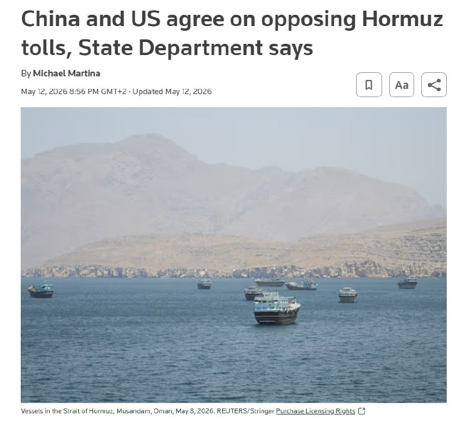

طبق گزارش رویترز، ایالات متحده و چین توافق کردند که هیچ کشوری نباید اجازه داشته باشد عوارض حمل و نقل در تنگه هرمز را دریافت کند.

وزیر امور خارجه چین، وانگ یی، و وزیر امور خارجه ایالات متحده، مارکو روبیو، این موضوع را در تماس تلفنی آوریل مورد بحث قرار دادند.

💛@Tans_Footbali

## withyashar — post 11176

قصه بگم ؟ شایدم بهترین شرحی ‌باشه که لازم دارید بشنوید …

## withyashar — post 11175

## withyashar — post 11174

  <a href="telegram/content/withyashar_11174_1778713507.mp4" target="_blank">🎬 Download video</a>

🎬 Video

---
📅 بروزرسانی: 1405/02/24 01:23
---

## thisisermia — post 60

Finally we have been together for 365 days and I have loved u for more than a year ermiaaaa🩷

## persian_trend_official — post 14080

  

به این وضعیت اقتصادی می‌گویید امنیت؟ امنیت کجاست وقتی یک پدر شرمنده زن و بچه‌اش است چون سفره‌اش خالی مانده و حقوقش حتی کفاف اجاره خانه را نمی‌دهد؟

امنیت کجاست وقتی جوانی نمی‌تواند یک متر زمین بخرد و رؤیاهایش زیر بار تورم و فساد دفن شده است؟ امنیت کجاست وقتی جوانی عمر و آرزوهایش را در صف مهاجرت یا بیکاری از دست می‌دهد؟

امنیت اجتماعی بدون رفاه پایدار وجود ندارد. جامعه‌ای که نرخ بیکاری جوانانش بالاست تورم افسارگسیخته دارد و سرمایه انسانی‌اش مهاجرت می‌کند در واقع در وضعیت ناامنی ساختاری است. شما نام این فروپاشی را امنیت گذاشته‌اید. این تحریف واژه‌هاست واژه‌ها را از معنا تهی کرده‌اید تا واقعیت تلخ را بپوشانید.

امنیت واقعی همان چیزی است که مردم در همه‌پرسی انتخاب خواهند کرد آزادی، اینترنت، اقتصاد سالم، و زندگی انسانی. امنیت یعنی امید به آینده نه ترس از فردا.

امنیتی که شما از آن دم می‌زنید، در واقع پوششی است برای فقر، سرکوب، و بی‌عدالتی. امنیت یعنی آرامش روانی، یعنی آینده‌ای قابل پیش‌بینی یعنی فرصت رشد و شکوفایی. اما آنچه امروز مردم ایران تجربه می‌کنند چیزی جز اضطراب فروپاشی اقتصادی و نابودی امید نیست.

📝 Nick

📌 @persian_trend_official
پرشین ترند | متفاوت‌ترین کانال نظامی

## persian_trend_official — post 14079

⭕️ بنیامین نتانیاهو: من می‌خواهم دانش‌آموزان اسرائیلی در استفاده از ChatGPT، Claude و پیشرفته‌ترین ابزارهای هوش مصنوعی جهان - و حتی قبل از فارغ‌التحصیلی از دبیرستان - بهترین باشند. 📝 Nick 📌 @persian_trend_official پرشین ترند | متفاوت‌ترین کانال نظامی

## persian_trend_official — post 14078

  <a href="telegram/content/persian_trend_official_14078_1778709204.mp4" target="_blank">🎬 Download video</a>

⭕️ بنیامین نتانیاهو:

من می‌خواهم دانش‌آموزان اسرائیلی در استفاده از ChatGPT، Claude و پیشرفته‌ترین ابزارهای هوش مصنوعی جهان - و حتی قبل از فارغ‌التحصیلی از دبیرستان - بهترین باشند.

📝 Nick

📌 @persian_trend_official
پرشین ترند | متفاوت‌ترین کانال نظامی

## persian_trend_official — post 14077

  <a href="telegram/content/persian_trend_official_14077_1778709207.webm" target="_blank">🎬 Download video</a>

💢امارات متحده عربی دیدار مخفیانه نتانیاهو از ابوظبی در طول جنگ با ایران را تکذیب کرد

🫆:Tony

📌 @persian_trend_official
پرشین ترند | متفاوت‌ترین کانال نظامی

## persian_trend_official — post 14076

  <a href="telegram/content/persian_trend_official_14076_1778709208.mp4" target="_blank">🎬 Download video</a>

🔴 انهدام پهپاد انتحاری روسی توسط سرباز اوکراینی در لحظات آخر

ویدئویی منتشر شده که نشان می‌دهد یک سرباز اوکراینی با استفاده از سلاح «آکا-۷۴» موفق می‌شود یک پهپاد انتحاری کواد را تنها لحظاتی پیش از برخورد منهدم کند.

🫆:Tony

📌 @persian_trend_official
پرشین ترند | متفاوت‌ترین کانال نظامی

## persian_trend_official — post 14075

  <a href="https://t.me/persian_trend_official/14075" target="_blank">📎 Download file</a>

فایل صوتی لایو اول
نسخه کم حجم - 6.71 مگابایت

اتاق جنگ چهارشنبه 23 اردیبهشت | جمهوری اسلامی ناو امریکایی را تهدید به حمله کرد.

فورمت mp3 همیشگی

📝 Nick

📌 @persian_trend_official
پرشین ترند | متفاوت‌ترین کانال نظامی

## OfficialPersiaTwiter — post 498395

یه کلیپ تو اینستا بود داماد عروسو بغل کرد گریه کرد.
یکی زیرش کامنت گذاشته بود مردم شانس دارن، شوهر من تو نامزدیمون مامانشو بغل کرد گریه کرد انگار میخواستن از شیر بگیرنش :))))))

》ةیچرالملوک《

@OfficialPersiaTwiter

## OfficialPersiaTwiter — post 498394

  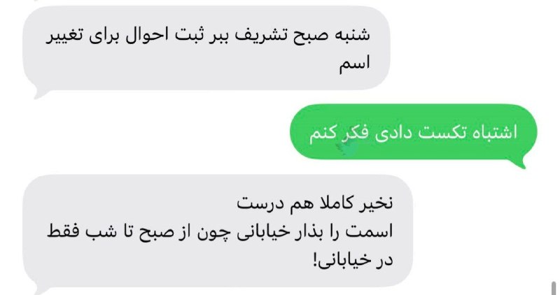

پدرجان :))))))

》Alee《

@OfficialPersiaTwiter

## OfficialPersiaTwiter — post 498393

‏میخوام یه کانفیگ رو سنگ حکاکی کنم، بذارم زیر خاک چند صد سال بعد یه باستان‌شناس پیداش کرد گوه گیجه بگیره.

》عین جیم《

@OfficialPersiaTwiter

## OfficialPersiaTwiter — post 498392

مامانم برام یه روتختی گرفته بود من رنگش رو دوست نداشتم، امروز برد پسش بده زنگ زد به من که رنگای دیگه‌ رو بگه زنه گیر داد که تعویض نداریم مامانم عصبی شد گفت خانم من که بهتون گفته بودم این عن اخلاقه هرچیزی سلیقش نیست :)))

》هانی‌مون《

@OfficialPersiaTwiter

## OfficialPersiaTwiter — post 498391

  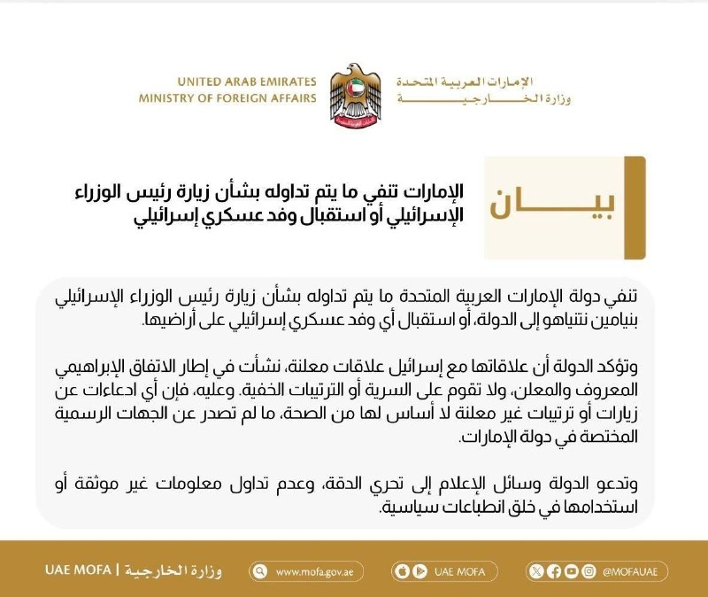

جزئیات میزبانی بن‌زاید از نتانیاهو هنگام جنگ علیه ایران 🔹 دفتر نخست وزیر رژیم صهیونیستی تأیید کرد که دیدار نتانیاهو با بن‌زاید منجر به یک پیشرفت تاریخی در روابط بین اسرائیل و امارات متحده عربی شده است اما این دیدار تاکنون به دلیل حساسیت سیاسی و امنیتی آن…

## OfficialPersiaTwiter — post 498390

  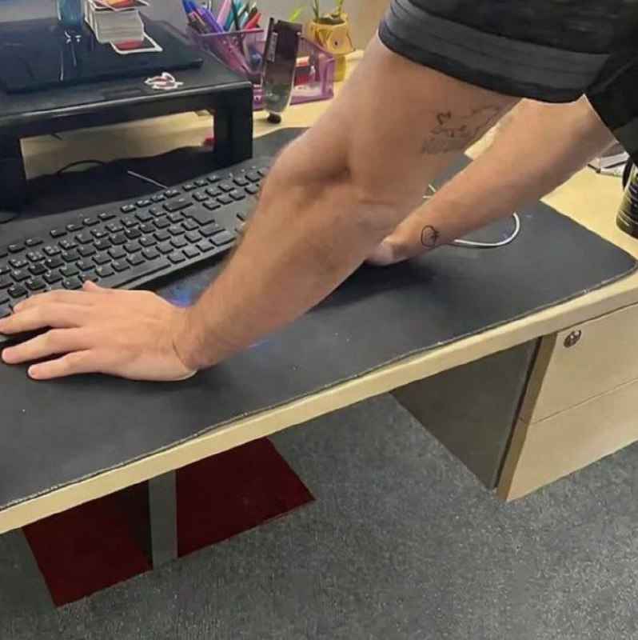

پوزیشن معمول اون آدمی که میاد و مشکلات رو حل میکنه

》میکاسا《

@OfficialPersiaTwiter

## OfficialPersiaTwiter — post 498389

  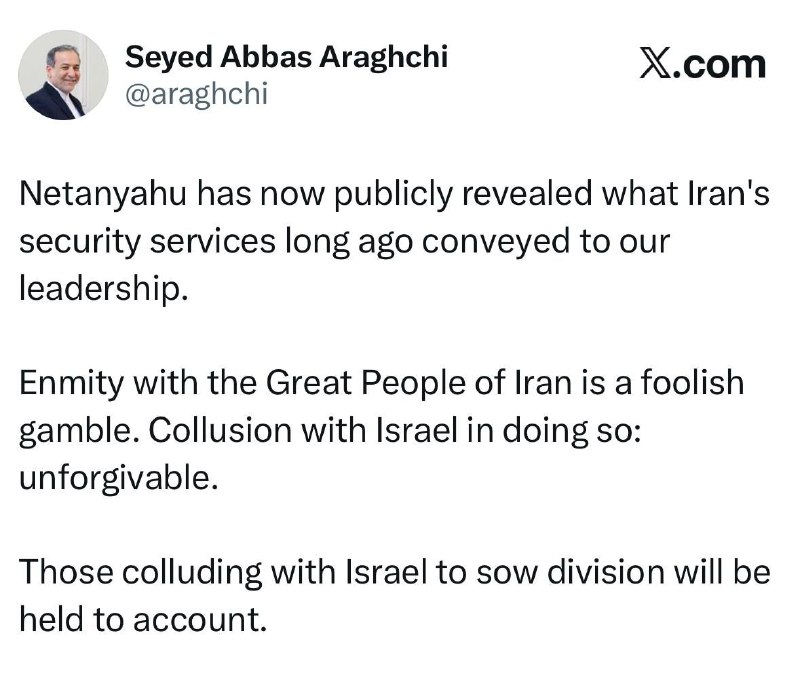

واکنش عراقچی وزیر امور خارجه به اظهارات اخیر نتانیاهو؛ همدستی با رژیم اسرائیل غیرقابل بخشش است

🔺نتانیاهو اکنون به‌صورت علنی آنچه را که نهادهای امنیتی ایران مدت‌ها قبل به رهبری ما منتقل کرده بودند، افشا کرده است.

🔺دشمنی با ملت بزرگ ایران، قماری احمقانه‌ است؛ و همکاری و همدستی با اسرائیل در این مسیر، غیرقابل بخشش است.

🔺کسانی که در همدستی با اسرائیل برای ایجاد تفرقه نقش دارند، باید پاسخگو باشند.

》OPT《

@OfficialPersiaTwiter

## bbcpersian — post 280968

  

🔻وزارت خارجه امارات متحده عربی با انتشار بیانیه‌ای سفر بنیامین نتانیاهو به این کشور در خلال جنگ آمریکا و اسرائیل با ایران را تکذیب کرده است.

در بیانیه وزارت خارجه امارات آماده است: «امارات متحده عربی گزارش‌های منتشرشده درباره سفر نخست‌وزير اسرائيل يا استقبال از يک هيات نظامی اسرائيلی را تکذيب می‌کند.»

اين تکذيب در حالی مطرح می‌شود که رسانه‌های بين‌المللی از جمله رويترز و سی‌بی‌اس نيوز روز چهارشنبه به نقل از دفتر نخست‌وزير اسرائيل گزارش داده بودند که بنیامین نتانياهو در جريان جنگ ايران، سفری محرمانه به امارات داشته و با محمد بن زايد آل نهيان ديدار کرده است.

📸GettyImages
https://bbc.in/4tEOL0N
@BBCPersian

## bbcpersian — post 280967

  

🔻عباس عراقچی، وزیر امورخارجه ایران، به علنی شدن خبر سفر بنیامین نتانیاهو به امارات متحده عربی واکنش نشان داده و گفته است: «نتانیاهو اکنون به‌صورت علنی آنچه را که نهادهای امنیتی ایران مدت‌ها قبل به رهبری ما منتقل کرده بودند، افشا کرده است.»

آقای عراقچی همچنین در اظهاراتی تند که می‌تواند مخاطب آن امارات و کشورهای حاشیه خلیج فارس باشد گفته است: «دشمنی با ملت بزرگ ایران، قماری احمقانه‌ است؛ و همکاری و همدستی با اسرائیل در این مسیر، غیرقابل بخشش است. کسانی که در همدستی با اسرائیل برای ایجاد تفرقه نقش دارند، باید پاسخگو باشند.»

علاوه بر علنی شدن خبر سفر نخست وزیر اسرائیل به امارات در خلال جنگ، در چند روز گذشته اخبار رسانه‌های امریکایی درباره حملات نظامی مخفیانه امارات و عربستان به ایران هم بسیار بازتاب داشته است.

📸AFP via Getty Images
https://bbc.in/3R9GXqf
@BBCPersian

## bbcpersian — post 280965

🔻بعد از خبر حملات امارات به ایران، رویترز می‌گوید عربستان هم در خلال جنگ حملات متعددی علیه ایران انجام داده است

گزیده‌هایی از مصاحبه موسی شریفی، تحلیلگر جهان عرب از ریاض عربستان را با پریزاد نوبخت ببیند که می‌گوید که عربستان برخلاف امارات به‌دنبال شکست ایران نیست و نمی‌‌خواهد توازن قدرت در منطقه دچار خلاء شود.

@BBCPersian

## Lichargoo — post 24871

اگه همزمان با زلزله، B2 سایت موشکی یزد رو میزد، ایران اورگاسم واژینال می‌شد.

## Pesari_Ke_Konie — post 44930

00:00
کص ننش هر جا که هستش🙂❤️

## Tans_Footbali — post 236276

هزینه نجومی رجیستری گوشی آیفون ۱۷ و گلکسی سامسونگ

رجیستری پایین ترین گیگ آیفون ۱۷ پرومکس: ۶۰۰ دلار

💛@Tans_Footbali

## withyashar — post 11173

درودی دوباره یاشار جان
میشه سوال منو ج بدین چرا ترامپ وقتی وارد چین شد نیومد ریس جمهور استقبالش در صورتی که باید بیاد ؟

## withyashar — post 11172

کانال N12: ترامپ داره به صدور دستور برای از سرگیری درگیری با ایران فکر می‌کنه
@withyashar

## withyashar — post 11171

ائتلاف حاکم در اسرائیل پیشنهاد انحلال کنست در تدارک برای برگزاری انتخابات زودهنگام را ارائه کرد.
@withyashar

## withyashar — post 11170

  

دارن تحلیل میکنن چیکار کنن 😂😅
@withyashar

## withyashar — post 11169

خوش‌چشم: ترامپ رفته چین التماس کنه تا میانجی بشه که ایران جنگ رو تموم کنه
@withyashar

---
📅 بروزرسانی: 1405/02/23 23:53
---

## persian_trend_official — post 14074

https://youtube.com/live/xKXwDy6wYig?feature=share

## persian_trend_official — post 14073

  <a href="https://t.me/persian_trend_official/14073" target="_blank">📎 Download file</a>

فایل صوتی لایو اول
نسخه کم حجم - 5.1 مگابایت

اتاق جنگ چهارشنبه ۲۳ اردیبهشت | جمهوری اسلامی ناو آمریکایی را تهدید به حمله کرد

🫆:Tony

📌 @persian_trend_official
پرشین ترند | متفاوت‌ترین کانال نظامی

## persian_trend_official — post 14072

  <a href="telegram/content/persian_trend_official_14072_1778703800.webm" target="_blank">🎬 Download video</a>

🔴چت جی پی تی وارد پرونده قتل شد!

💢رسانه‌های کره جنوبی گزارش دادن زنی متهم شده قبل از مسموم کردن چند نفر، از ChatGPT درباره ترکیب الکل و قرص خواب‌آور سؤال کرده

💢طبق گزارش‌ها، این زن پرسیده بوده:
اگه الکل و داروی خواب‌آور باهم مصرف بشن چی میشه؟
چه دوزی خطرناکه؟
و آیا ممکنه باعث مرگ بشه؟
پلیس میگه بعد از همین جستجوها، به سه مرد نوشیدنی آلوده داده شده که دو نفرشون جونشونو از دست دادن 💀

💢حالا نکته عجیب‌تر:
دادگاه از گفتگوهای ChatGPT به‌عنوان مدرک برای اثبات «نیت قتل» استفاده کرده!

💢وکیل پرونده گفته این شاید یکی از اولین پرونده‌هاییه که چت‌های AI به‌عنوان شاهد مستقیم تو پرونده قتل پذیرفته میشن..

🫆:Tony

📌 @persian_trend_official
پرشین ترند | متفاوت‌ترین کانال نظامی

## OfficialPersiaTwiter — post 498388

گوشی ۱۱۰۰ دلاری تو ایران ۳۰۰۰ دلار فروخته میشه! آدم باورش نمیشه نیم میلیارد تومن پول یه گوشی 》Hadi《 @OfficialPersiaTwiter

## OfficialPersiaTwiter — post 498387

انجام ۲۰۲ پرواز در فرودگاه امام طی یک هفته آرتیمانی معاون بهره‌برداری فرودگاهی شهر فرودگاهی امام: در بازه زمانی ۵ تا ۱۱ تعداد ۲۰۲ پرواز شامل ۱۰۰پرواز خروجی و ۱۰۲ پرواز ورودی انجام داده‌ایم. هفته گذشته فرودگاه میزبان ۲۱ هزار و ۵۴۹ مسافر بود که از این تعداد،…

## OfficialPersiaTwiter — post 498386

  <a href="telegram/content/OfficialPersiaTwiter_498386_1778703801.mp4" target="_blank">🎬 Download video</a>

💻خب توی این مدت GPT Image 2 نسل جدید تصویر سازی Open Ai ارائه شد . 👌🏽👌🏽👌🏽

در ادامه کامل و دقیق به بررسی این جهش و آپدیت فوق العاده می‌پردازیم.

برای کاهش حجم دانلود کیفیت ویدئو رو نصف کردم که راحت تر بتونید مشاهده کنید .

https://t.me/NewElizaium
@ElizaiumHelp

## OfficialPersiaTwiter — post 498385

یه کانفیگ دارم خدا خیرش بده انقدر سرعتش پایینه اصلا نمیذاره حجمش تموم‌ شه

》iman《

@OfficialPersiaTwiter

## OfficialPersiaTwiter — post 498383

۱۵ ثانیه قبل از تحویل دادن ۲۸۰ هزار تومنم به کانفیگ فروش.

》سَجّی《

@OfficialPersiaTwiter

## OfficialPersiaTwiter — post 498382

دفتر نخست‌وزیری رژیم صهیونیستی: در میانهٔ جنگ اخیر، بنیامین نتانیاهو سفری مخفیانه به امارات متحدهٔ عربی داشته و با شیخ محمد بن زاید، رئیس‌جمهور امارات، دیدار کرده است 》OPT《 @OfficialPersiaTwiter

## OfficialPersiaTwiter — post 498381

خبرنگار: شما با نظر ترامپ موافقید که وضعیت مالی مردم آمریکا نباید توی تصمیم‌گیری درباره ایران تأثیر داشته باشه؟ جی‌دی ونس: نه، فکر نمی‌کنم رئیس‌جمهور همچین چیزی گفته باشه،برداشت اشتباهی از حرفشه - ولی در کل، من با رئیس‌جمهور موافقم که ایران نباید سلاح هسته‌ای…

## OfficialPersiaTwiter — post 498380

  <a href="telegram/content/OfficialPersiaTwiter_498380_1778703803.mp4" target="_blank">🎬 Download video</a>

ویدئویی پربازخورد در فضای مجازی از تشبیه فروشندگان vpn به خوک

》OPT《

@OfficialPersiaTwiter

## OfficialPersiaTwiter — post 498379

  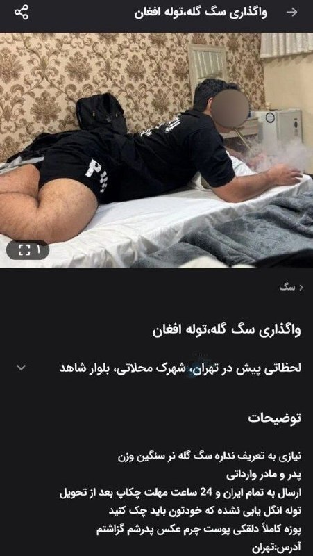

عادی‌ترین شوخی پسرا:

》ꜱᴀʟᴠᴀᴅᴏʀ《

@OfficialPersiaTwiter

## OfficialPersiaTwiter — post 498378

شی هنوز ترامپ را ندیده است / خبرنگار فاکس‌نیوز در پکن:

"ترامپ هنوز پرزیدنت شی را ندیده است، این اتفاق قرار است چند ساعت دیگر طی مراسم استقبال رسمی دولتی از پرزیدنت ترامپ در تالار بزرگ خلق رخ دهد.

ما انتظار داریم که این مراسم اساساً شبیه نسخه چینی از کاری باشد که ایالات متحده چند هفته پیش در چمن جنوبی کاخ سفید برای پادشاه چارلز انجام داد."

》OPT《

@OfficialPersiaTwiter

## OfficialPersiaTwiter — post 498377

خدا نسبت به مردم ایران این‌جوریه که نبینم یه جا نشستید، منتظر چی هستید؟ 》مسعودانته《 @OfficialPersiaTwiter

## OfficialPersiaTwiter — post 498376

واقعا باشگاه مردونه جای جالبیه، واستاده بودم یهو تایتانیک پلی کردن ۲ تا خرس گریزلی ۱۹۰ سانتی شروع کردن باهم تانگو رقصیدن.

》بِل مونت《

@OfficialPersiaTwiter

## OfficialPersiaTwiter — post 498375

آغاز مجدد حملات هوایی ارتش رژیم اسرائیل در لبنان؛ همزمان منابع محلی از شنیده شدن صدای چندین انفجار خبر می‌دهند. 》OPT《 @OfficialPersiaTwiter

## OfficialPersiaTwiter — post 498374

  <a href="telegram/content/OfficialPersiaTwiter_498374_1778703805.mp4" target="_blank">🎬 Download video</a>

ونس معاون ترامپ: وقتی ترامپ سفره و من اینجام، حس اون بچه‌ی فیلم Home Alone رو دارم! - میام کاخ سفید، همه‌جا ساکته و خالیه، بعد یهو یادم میاد چه خبره 》OPT《 @OfficialPersiaTwiter

## OfficialPersiaTwiter — post 498373

ادعای نیویورک تایمز: شرکت‌‌های چینی به دنبال فروش سلاح به ایران هستند و قصد دارند آنها را از طریق کشورهای دیگر ارسال کنند تا منبع خود را پنهان کنند

》OPT《

@OfficialPersiaTwiter

## OfficialPersiaTwiter — post 498372

هیچوقت کانسپت موزیک پیشوازو نمیفهمم یکی ۱۲ تومن کشیده بالا فراریه از صبح صد بار بهش زنگ میزنیم محسن ابراهیم زاده میخونه دونه دونه دونه دونه این حسی که الان بینمونه

》SOL《

@OfficialPersiaTwiter

## bbcpersian — post 280958

🖊روناک فرجی، روزنامه‌نگار

جشنواره فیلم جشنواره فیلم کن امسال در حالی کار خود را در ساحل «کروآزت» آغاز کرده که برخلاف برخی دوره‌های اخیر، تمرکز اصلی آن دوباره به سینمای مؤلف و فیلم‌سازان شناخته‌شده اروپایی و آسیایی بازگشته است.

هفتاد و نهمین دوره جشنواره بین‌المللی فیلم کن با حضور ستارگان سینما، فیلمسازان و اعضای هیئت داوران در جنوب فرانسه آغاز شد و فرش قرمز این رویداد میزبان چهره‌های سرشناس صنعت سینما بود.

جشنواره این دوره شمار بی‌سابقه‌ای از شرکت‌کنندگان را جذب کرده است؛ افرادی که برای خرید آثار اغلب مستقل و کم‌هزینه رقابت می‌کنند، در حالی که استودیوهای بزرگ محتاط‌‌تر شده‌اند و کمتر ریسک می‌کنند.

حدود ۱۶ هزار نفر از فعالان صنعت سینما برای حضور در بزرگ‌ترین بازار فیلم جهان ثبت‌نام کرده‌اند که از ۱۲ تا ۲۰ مه همزمان با جشنواره فیلم کن برگزار می‌شود.

در مراسم افتتاحیه جشنواره، نخل طلای افتخاری برای یک عمر فعالیت هنری به پیتر جکسون، کارگردان فیلم‌های «ارباب حلقه‌ها» و «کینگ کونگ»، اهدا شد.

برای خواندن ادامه مطلب به لینک زیر مراجعه کنید:

https://bbc.in/4dhST0w
📷Getty Images
@BBCPersian

## bbcpersian — post 280957

  <a href="telegram/content/bbcpersian_280957_1778703806.mp4" target="_blank">🎬 Download video</a>

🔻آخرین خبرهای مهم روز چهارشنبه۲۳ اردیبهشت ۱۴۰۵

@BBCPersian

## bbcpersian — post 280956

  

🔻خبرگزاری میزان، وابسته قوه قضائیه می‌گوید محمد عباسی از بازداشت شدگان اعتراضات دی ماه امروز(چهارشنبه ۲۳ اردیبهشت) اعدام شده است.

قوه قضائیه جمهوری اسلامی او را به «کشتن» یک نظامی در جریان اعتراضات زمستان پارسال متهم کرد و می‌گوید خانواده فرد نظامی او را «قصاص کرده‌اند.»

قوه قضائیه همچنین گفته است اجرای حکم اعدام با تایید و ابرام دیوان عالی ایران و به تقاضای اولیا انجام شده است.

دیوان عالی ایران همچنین حکم ۲۵ سال حبس فاطمه عباسی، دختر آقای عباسی که در بند زنان زندان اوین زندانیست را تایید کرده است.

این دومین مورد اعدامی است که قوه قضائیه امروز گزارش کرده است؛ احسان افرشته هم صبح امروز به اتهام «جاسوسی و همکاری اطلاعاتی به نفع اسرائیل» اعدام شد.

با احتساب محمد عباسی، تاکنون ۳۲ زندانی پس از آغاز جنگ آمریکا و اسرائیل با ایران در این کشور اعدام شده‌اند.

غلامحسین محسنی اژه‌ای، رئیس قوه قضائیه، بارها از دادستان‌ها خواسته است بدون اغماض و به‌ سرعت به پرونده کسانی که بعد از شروع جنگ و یا در اعتراضات دی ماه بازداشت شده‌اند رسیدگی کنند و احکامشان صادر و اجرا شود.

📷Mizan
@bbcpersian

## bbcpersian — post 280955

🔻سنتکام: از آغاز محاصره بنادر ایران به ۱۵ کشتی حامل کمک‌های بشردوستانه اجازه عبور دادیم

فرماندهی مرکزی ارتش آمریکا، سنتکام، در منطقه در اطلاعیه‌ای گفته است از زمان آغاز محاصره بنادر ایران به ۱۵ کشتی حامل کمک‌های بشردوستانه اجازه عبور داده است.

این نهاد در اطلاعیه‌ای اعلام کرده است: «چهار هفته پیش، سنتکام اجرای محاصره کشتی‌هایی را که به بنادر ایران وارد و از آنها خارج می‌شدند، آغاز کرد. تا امروز، نیروهای آمریکایی ۶۷ کشتی تجاری را مجبور به تغییر مسیر کردند، به ۱۵ کشتی حامل کمک‌های بشردوستانه اجازه عبور دادند و ۴ کشتی را برای اطمینان از رعایت محاصره، غیرفعال کردند.»

در ادامه این اطلاعیه آمده است: «اوایل این هفته، نیروهای سنتکام پس از برقراری ارتباط رادیویی و شلیک گلوله‌های هشدار دهنده با سلاح‌های سبک، از بازگشت دو کشتی تجاری برای رعایت محاصره مطمئن شدند و به وضوح نشان دادند که اجرای قوانین ایالات متحده همچنان به طور کامل ادامه دارد.»

@bbcpersian

## bbcpersian — post 280954

🔻اسرائیل: انبارهای تسلیحاتی و پرتابگرهای آماده شلیک حزب‌الله را هدف قرار دادیم

ارتش اسرائیل در بیانیه‌ای گفته است «انبارهای تسلیحاتی، پرتابگرهای بارگذاری‌شده و آماده شلیک» و سایر زیرساخت‌های حزب‌الله لبنان را در چندین منطقه در جنوب لبنان هدف قرار داده است.

این بیانیه می‌گوید: «در محل‌های شلیک که هدف قرار گرفتند، پرتابگرهای راکتی که به سمت منطقه فعالیت نیروهای ارتش اسرائیل و به سمت خاک اسرائیل هدف‌گیری شده بودند، منهدم شدند.»

پیشتر وزارت بهداشت لبنان اعلام کرده بود که در حملات امروز اسرائیل ۱۲ نفر کشته شده‌اند، که اغلب آنها در جنوب بیروت بوده‌اند.

این حملات با وجود آتش‌بس میان اسراییل و حزب‌الله انجام شده است.

حملات جدید که مناطق مختلف جنوب لبنان را هدف قرار داد، در آستانه دور تازه‌ای از مذاکرات مستقیم میان لبنان و اسرائیل در واشنگتن با میانجیگری ایالات متحده انجام شد.

حزب‌الله به‌شدت با این مذاکرات مخالف است.

@bbcpersian

## Lichargoo — post 24870

لاشیا حالا که من ۶ ماهه دارم مثل گاو غذا می‌خورم باید بگید منظورتون از "پسر بالای ۱۹۰" قدش بوده نه وزنش؟

## Pesari_Ke_Konie — post 44929

سرور نامحدود یک ماهه فقط ۹۹۰ تومن :))) مخصوص تلگرام فقط

هرکی خواست تو چنل زیر نوشته توضیحاتشو :
@nexvpn_vip

## Pesari_Ke_Konie — post 44928

سلام خواستم یه تشکری کنم ازت

خیلی سال پیش تقریبا سال 2018 اینا بود تو چنلت زده بودی راننده نیسانی که راهنما بزنه کونیه اقا منم از ترس اینکه کونی نباشم راهنما نمیزدم

یه روز بدون راهنما پیچیدم چپ یه دختری دستشو گذاشت رو بوق اقا زد بهم پیاده شدیم و این داستانا اقا کم کم از این دختره خوشم اومد شمارشو گرفتم کارت ماشینمو گذاشتم پیشش که ماشینشو اوکی کنم، ماشینش که اوکی شد ولی نتونستم بهش فکر نکنم بهش زنگ میزدم باهاش حرف میزدم طرفم اوکی بود خوشش میومد ازم هیچی دیگه الان بعد چند سال باهاش ازدواج کردم😂

## Tans_Footbali — post 236275

  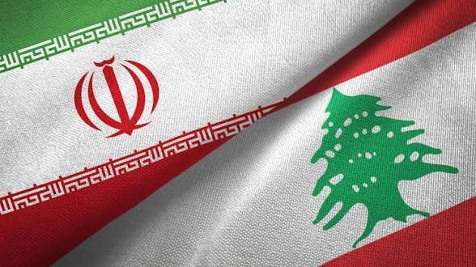

امروز لبنان🇱🇧 شکایتی رسمی از ایران به سازمان ملل ارائه کرده و ایران رو به 3مورد زیر متهم کرده:

1-نقض کنوانسیون وین:
عدم هماهنگی سفارت ایران با مقامات لبنانی برای جابه‌جایی دیپلمات‌ها قبل از حمله اسرائیل (8 مارس)، ثبت نکردن برخی افراد کشته‌شده به عنوان دیپلمات رسمی، و استفاده از اماکن دیپلماتیک برای فعالیت‌های ناسازگار با وظایف دیپلماتیک.
2-دخالت مستقیم و آشکار ایران تو لبنان:
دخالت مستقیم سپاه و سفارت ایران در امور داخلی لبنان و نادیده گرفتن تصمیمات دولت لبنان.
3-کشوندن لبنان به جنگ:
درگیرکردنِ لبنان تو جنگ ویرانگر بدون اراده دولت لبنان، که منجر به هزاران کشته، بیش از یک میلیون آواره، ویرانی زیاد و اشغال بخش‌هایی توسط اسرائیل شده.

@Tans_Footbali

## Tans_Footbali — post 236274

  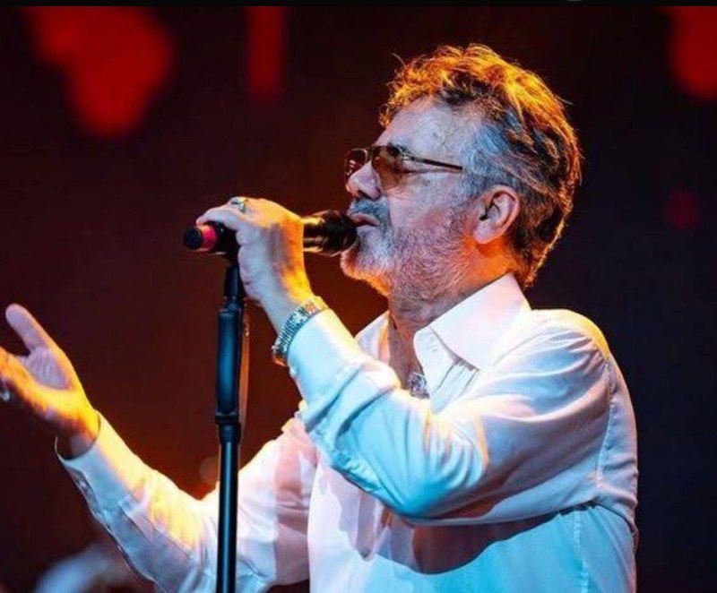

مهدی تاج: شنیده ایم معین برای تیم ملی تو جام جهانی قراره موزیک بخونه، ما دخالتی در این موزیک نداشتیم ولی اگه بخونه ازش حمایت می‌کنیم

💛@Tans_Footbali

## Tans_Footbali — post 236273

⚽ رئال مادرید - رئال اویدو

🏆 لالیگا اسپانیا 
🇪🇸

🕔 پنج‌شنبه ساعت ۲۳:۰۰
🏟 ورزشگاه برنابئو

🎲 با بیش از ۵۵۰ نوع آپشن پیش‌بینی

👆 ضرایب شگفت‌انگیز

📊 نگاهی به آمار دو تیم:

✅ رئال مادرید در ۵ دیدار اخیر خود در لالیگا دو برد و دو تساوی کسب کرده و یک بازی را واگذار کرده است.

✅ رئال اویدو در ۵ دیدار اخیر خود در لالیگا تنها یک مرتبه موفق به برد شده و دو تساوی کسب کرده و دو بازی را واگذار کرده است.

📈 میانگین گل در ۱۰ دیدار اخیر رئال مادرید در لالیگا ۲.۸ گل در هر بازی بوده است.

📈 میانگین گل در ۱۰ دیدار اخیر رئال اویدو در لالیگا ۲.۴ گل در هر بازی بوده است.

🧠 نه گفتن بخش مهمی از استراتژی است.

👍 ورود به سایت با فیلترشکن

کلیک کنید BetForward.com
کلیک کنید BetForward.com

💻 @BetForward

## Tans_Footbali — post 236272

  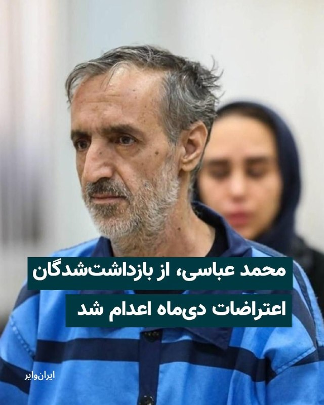

صبح امروز احسان افراشته به اتهام جاسوسی برای موساد توسط جمهوری شیطانی اسلامی به دار آویخته شد. @Tans_Footbali

## hamclasixii — post 75358

‏cigarettes after تموم شدن کانفیگ

📚 @hamclasix 📚

## withyashar — post 11168

کامنتم زیر پست ترامپ

https://www.instagram.com/reel/DYSl8QEMZja/?igsh=MTNieGh0eTQyOWtnYQ==
بترکونینننن 💥🙌🏾حملههههه

## withyashar — post 11167

  <a href="telegram/content/withyashar_11167_1778703811.mp4" target="_blank">🎬 Download video</a>

لحظه استقبال از دونالد ترامپ در پکن، چین
@withyashar

## withyashar — post 11166

## withyashar — post 11165

## withyashar — post 11164

پیام سد مجید موسی ، فرمانده نیروی هوافضای ۳پا تیم ملی رو هم بردن وسط میدون مثل میمونای سیرک @withyashar

## withyashar — post 11163

  <a href="telegram/content/withyashar_11163_1778703812.mp4" target="_blank">🎬 Download video</a>

پیام سد مجید موسی ، فرمانده نیروی هوافضای ۳پا
تیم ملی رو هم بردن وسط میدون مثل میمونای سیرک
@withyashar

---
📅 بروزرسانی: 1405/02/23 21:59
---

## persian_trend_official — post 14071

  

🔴دفتر نخست وزیر اسرائیل :

💢در حين عملیات «غرش شیران»، نخست وزیر نتانیاهو مخفیانه از امارات متحده عربی بازدید و با شیخ محمد بن زاید، رئیس امارات متحده عربی دیدار کرد.

💢این دیدار منجر به یک پیشرفت تاریخی در روابط بین اسرائیل و امارات متحده عربی شد.

## persian_trend_official — post 14070

  <a href="telegram/content/persian_trend_official_14070_1778696989.webm" target="_blank">🎬 Download video</a>

https://youtube.com/live/xKXwDy6wYig?feature=share

## persian_trend_official — post 14069

تا ده دقیقه دیکه لایو آغاز میشه

## persian_trend_official — post 14068

🔴 رویترز مدعی حملات جنگنده‌های سعودی به مواضع گروه‌های عراقی شد

💢خبرگزاری رویترز به‌نقل از منابعی مدعی شد جنگنده‌های عربستان سعودی در جریان جنگ اخیر، مواضع گروه‌های مسلح عراقی را هدف قرار داده‌اند.

تاکنون نیز عربستان سعودی به‌صورت رسمی واکنشی به این ادعا نشان نداده است.

🫆:Tony

📌 @persian_trend_official
پرشین ترند | متفاوت‌ترین کانال نظامی

## OfficialPersiaTwiter — post 498371

  <a href="telegram/content/OfficialPersiaTwiter_498371_1778696990.mp4" target="_blank">🎬 Download video</a>

تلاش ترامپ برای تحت فشار گذاشتن ایران از طریق چین پولیتیکو، به نقل از یک مقام ارشد دولت ترامپ: 🔹من انتظار دارم ترامپ در دیدار با همتای چینی خود، او را در مورد ایران تحت فشار قرار دهد. 🔹چین پیش از این به ایران برای رسیدن به توافق فشار آورده است. 》OPT《…

## OfficialPersiaTwiter — post 498370

  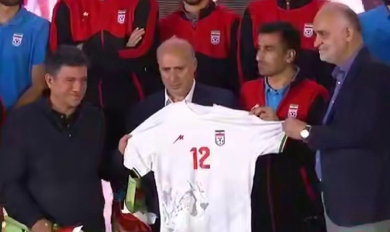

تاج: در جریان آهنگی که معین برای تیم ملی خوانده هستیم رئیس فدراسیون فوتبال: هر کسی از ایران حمایت کند مورد تایید ماست. 》OPT《 @OfficialPersiaTwiter

## OfficialPersiaTwiter — post 498369

العربیه به نقل از مشاور رئیس امارات: اولویت ما راه‌حل‌های سیاسی است/ روابط عربی-ایرانی نباید بر پایه تنش باشد

به گزارش الجزیره، مشاور رئیس امارات متحده عربی امروز در اظهاراتی تأکید کرد که کشورش همواره بر اهمیت راه‌حل سیاسی و مسیر مذاکره در منطقه تأکید داشته است.

وی با اشاره به روابط کشورهای عربی و ایران افزود: روابط عربی-ایرانی را نمیتوان بر پایه رویارویی‌ها و منازعات بنا نهاد.

این مقام اماراتی در ادامه تصریح کرد: اولویت امارات، همواره بر ترجیح راه‌حلهای سیاسی باقی خواهد ماند. / انتخاب

》OPT《

@OfficialPersiaTwiter

## OfficialPersiaTwiter — post 498368

روایت جدید از مذاکرات اسلام‌آباد

نبویان عضو همراه تیم مذاکره‌کننده ایران:
🔹در جلسه نخست، «جی‌دی ونس» اعلام کرد آمریکا دو خواسته اصلی از ایران دارد؛ نخست بازگشایی کامل تنگه هرمز و دوم خروج تمام مواد غنی‌شده ۶۰ درصدی از ایران.

🔹قالیباف در جواب اینکه آمریکا میتوانست زیر ساخت‌های شما را نابود کند، تأکید کرده بود که اگرچه آمریکا توان ضربه زدن به زیرساخت‌های ایران را داشت، اما ایران نیز می‌توانست «در کمتر از نصف روز تمام زیرساخت‌های منطقه را با خاک یکسان کند.

🔹آمریکایی‌ها علاوه بر طرح دوباره موضوع تنگه هرمز و خروج مواد غنی‌شده، پیشنهاد داده بودند در صورت همکاری ایران، ۶ میلیارد دلار از دارایی‌های بلوکه‌شده آزاد شود.

🔹ونس پس از تماس با ترامپ پیشنهاد داده بود مذاکرات بر اساس طرح ارائه‌شده آمریکا ادامه یابد و قالیباف نیز بررسی این پیشنهاد را پذیرفته بود.

🔹پس از نزدیک شدن دیدگاه‌های دو طرف، ونس ناگهان اعلام کرد ترامپ این توافق را نمی‌پذیرد و در جواب قالیباف که گفته بود این که طرح خودتان است گفته بود طرح ارائه‌شده در واقع متعلق به عاصم منیر بوده است.

》OPT《

@OfficialPersiaTwiter

## OfficialPersiaTwiter — post 498367

  <a href="telegram/content/OfficialPersiaTwiter_498367_1778696993.mp4" target="_blank">🎬 Download video</a>

پست رئیس فیفا برای ایران در جام جهانی «جیانی اینفانتینو» رئیس فیفا با انتشار پستی در صفحه رسمی خود، به حضور تیم ملی ایران در جام جهانی ۲۰۲۶ واکنش نشان داد‌ و نوشت: برای تیم ملی ایران در چهارمین حضور متوالی در جام جهانی آرزوی موفقیت می‌کنم. • OPT • @Off…

## OfficialPersiaTwiter — post 498366

ترامپ برای احتمال مرگ یا کشته‌شدنش نامه نوشته است

🔹در حالی که دونالد ترامپ، رئیس‌جمهور ایالات متحده، در بحبوحه تهدیدات امنیتی فزاینده سفر دیپلماتیک خود به چین را آغاز کرده است، افشای وجود یک نامه محرمانه در کاخ سفید توجه رسانه‌ها را به خود جلب کرد.

🔹«سباستین گورکا»، از مقامات ارشد ضدتروریسم کاخ سفید، فاش کرد که ترامپ نامه‌ای خطاب به معاون خود، «جی‌دی ونس» نوشته که در کشوی میزش در کاخ سفید نگه داشته می‌شود تا در صورت مرگ یا ترور احتمالی وی، مورد استفاده قرار گیرد.

🔹این افشاگری در زمانی صورت می‌گیرد که ترامپ در آستانه ۸۰ سالگی قرار دارد و موضوع سن و سلامت جسمانی او به یکی از مباحث داغ سیاسی تبدیل شده است.

🔹با توجه به اینکه او در کمتر از دو سال اخیر از سه سوءقصد نافرجام (از جمله تیراندازی در پنسیلوانیا و توطئه‌های خنثی شده در فلوریدا و واشینگتن) جان سالم به در برده، تدابیر مربوط به جانشینی ریاست‌جمهوری اهمیت دوچندانی یافته است.

》OPT《

@OfficialPersiaTwiter

## OfficialPersiaTwiter — post 498365

  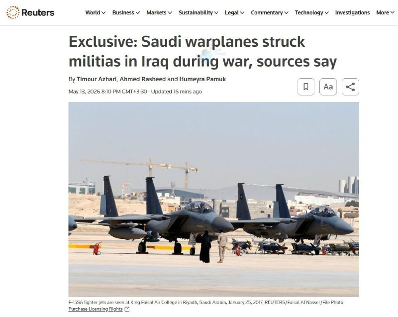

وزیر امور خارجه، عباس عراقچی: در تلاشی آشکار برای ایجاد تفرقه، کویت به طور غیرقانونی یک کشتی ایرانی را مورد حمله قرار داد و چهار نفر از شهروندان ما را در خلیج فارس بازداشت کرد. این اقدام غیرقانونی در نزدیکی جزیره‌ای رخ داد که ایالات متحده از آن برای حمله…

## OfficialPersiaTwiter — post 498364

🔴ادعای وزیر انرژی آمریکا: ایران به سلاح هسته‌ای نزدیک شده است!

🔹کریس رایت وزیر انرژی آمریکا در جلسه کمیته نیروهای مسلح سنای آمریکا مدعی شد: ایران تنها چند هفته با غنی‌سازی اورانیوم تا سطح تسلیحاتی فاصله دارد. البته پس از آن هنوز فرآیند تبدیل آن به سلاح وجود دارد، اما آنها بسیار نزدیک شده‌اند.

》OPT《

@OfficialPersiaTwiter

## OfficialPersiaTwiter — post 498363

  

ببین گلشیفته از علی سنتوری رسید به رئیس جمهور فرانسه؛ پس هیچوقت از رویاهاتون دست نکشید 》Ebi Zandi《 @OfficialPersiaTwiter

## OfficialPersiaTwiter — post 498362

لو پاریزین: نزدیکان بریژیت مکرون، همسر رئیس جمهور فرانسه اخبار منتشره درمورد سیلی او به مکرون به خاطر رابطه عاطفی با گلشیفته فراهانی را تکذیب کردند آنها گفتند «بانوی اول هرگز در تلفن همسرش تجسس نمی‌کند.» 》OPT《 @OfficialPersiaTwiter

## OfficialPersiaTwiter — post 498361

سفیر آمریکا در اسرائیل: 🔹اسرائیل به تازگی باتری‌های گنبد آهنین و پرسنل برای عملیات آن‌ها را به امارات فرستاده است. 🔹رابطه‌ای فوق‌العاده بین امارات و اسرائیل وجود دارد. 🔹وقتی همه خطوط هوایی دیگر پرواز به اسرائیل را متوقف کردند، اماراتی‌ ها ادامه دادند. 🔹امارات…

## OfficialPersiaTwiter — post 498360

احتمال برگزاری حضوری امتحانات دانشگاه‌ها معاون آموزشی وزارت علوم: 🔹در صورت مهیا بودن شرایط، امتحانات پایان‌ترم دانشجویان به‌صورت حضوری برگزار می‌شود و دانشگاه‌ها برنامه‌ریزی‌های خود را بر همین اساس انجام داده اند. 》OPT《 @OfficialPersiaTwiter

## OfficialPersiaTwiter — post 498359

  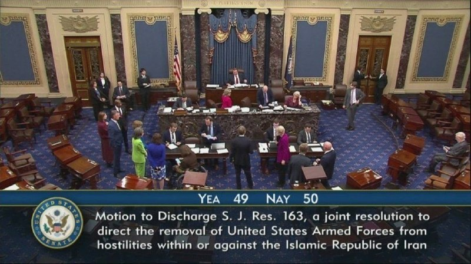

رهبر دموکرات‌های سنا: قطعنامه محدود کردن اختیارات جنگی ترامپ را دوباره به رای می‌گذاریم 🔹«چاک شومر» رهبر اقلیت دموکرات سنای آمریکا با متهم کردن «دونالد ترامپ» رئیس‌جمهور این کشور به این که بدون مجوز کنگره آمریکا را به جنگی «بی‌هدف و بی‌پایان» کشانده است،…

## OfficialPersiaTwiter — post 498358

وزیر نیرو: تابستان خاموشی نخواهیم داشت عباس علی‌آبادی وزیر نیرو: با همکاری مردم و افزایش ظرفیت تولید، وضعیت امسال از سال گذشته به مراتب بهتر خواهد بود و امید است تابستان بدون خاموشی سپری شود. 》OPT《 @OfficialPersiaTwiter

## bbcpersian — post 280953

  <a href="telegram/content/bbcpersian_280953_1778696998.mp4" target="_blank">🎬 Download video</a>

⭕️در روزهای اخیر انتشار تصاویری از تظاهرات گروهی از هواداران شاهزاده رضا پهلوی در آلمان که در آن با لباس‌های یک‌شکل با نشان ساواک راهپیمایی کرده‌اند، واکنش‌برانگیز شده است.
 
در بیانیه‌ای که در تجمع رگنزبورگ آلمان خوانده شد، افرادی که خود را «گروه مردمی ساواک» معرفی می‌کنند، با ستایش از عملکرد ساواک در دوران محمدرضاشاه پهلوی، خواهان «احیا و گسترش ساواک برای شناسایی عوامل جمهوری اسلامی و اپوزیسیون‌های جعلی و نفوذی» شدند.
 
یک روز پیش از آن، گروه دیگری از ایرانیان در دانمارک با لباس‌هایی یکدست شبیه یونیفرم نظامی و پیشتر در شهرهایی از جمله لندن، منچستر و گلاسگو گروهی یک‌دست سیاهپوش با عنوان «گارد جاویدان» تجمع کرده بودند.
 
ساواک، سازمان اطلاعات و امنیت کشور در ایران بود که از ۱۳۳۵ تا ۱۳۵۷ فعالیت می‌کرد. گروهی از پادشاهی‌خواهان با ارجاع به برخورد ساواک با چهره‌هایی از جمله آنهایی که بعدها از سران جمهوری اسلامی شدند، عملکرد آن را موجه می‌دانند.
 
مخالفان اما ساواک را به «خشونت و شکنجه سیستماتیک» متهم می‌کنند. آنها می‌گویند با رژه‌های اخیر نگران «ترویج خشونت و رویکردهای اقتدارگرا و فاشیستی» شده‌اند.
@bbcpersian

## bbcpersian — post 280952

  

🔻دفتر بنیامین نتنانیاهو، نخست‌وزیر اسرائیل، اعلام کرده است که آقای نتانیاهو پیش از آتش‌بس و زمانی که جنگ با ایران در جریان بود به طور مخفیانه به امارات متحده عربی سفر کرد و با شیخ محد بن زاید، رئیس‌جمهور امارات، هم دیدار کرده است.

دفتر نخست وزیر اسرائیل در اطلاعیه‌ای اعلام کرده است: «این سفر منجر به یک پیشرفت تاریخی در روابط بین اسرائیل و امارات متحده عربی شده است.»

اخیرا روزنامه «اسرائیل هیوم» به نقل از سفیر آمریکا در سازمان ملل نوشت که اسرائیل در جریان جنگ اخیر، سامانه پدافند گنبد آهنین در اختیار امارات متحده عربی قرار داده است.

این روزنامه از مایک والتس، سفیر آمریکا در سازمان ملل، نقل کرد که «ما شاهد استفاده امارات از (سامانه) گنبد آهنین بودیم که اسرائیل در اختیار آنها قرار داده است.»

هفته پیش شدیدترین درگیری‌ها در تنگه هرمز و اطراف آن از زمان آغاز آتش‌بس یک ماه پیش به‌وقوع پیوست و امارات متحده عربی نیز روز جمعه بار دیگر هدف حمله قرار گرفت.

📷Getty Images

## bbcpersian — post 280951

🔻ترکیه می‌خواهد «چهار کشور خلیج فارس را به نشست ناتو دعوت کند»

یک رسانه ترکیه‌ای به همراه شبکه خبری بلومبرگ آمریکا گزارش داده ‌ند در حالی که موضوع جنگ ایران در در دستور کار نشست بعدی ناتو قرار دارد، ترکیه می‌خواهد چهار کشور حوزه خلیج فارس را به این نشست دعوت کند.

وب‌سایت انگلیسی‌زبان ترکیه تودی که روزنامه حامی دولت است اعلام کرده است که ترکیه امیدوار است قطر، کویت، امارات متحده عربی و بحرین را به نشست ناتو دعوت کند که قرار است از هفتم ژوئیه (۱۵ تیر) به مدت دو روز در آنکارا برگزار شود.

این چهار کشور در جریان حملات اسرائیل و آمریکا به ایران، هدف حملات متقابل نظامی جمهوری اسلامی ایران بودند.

در این گزارش، به نقل از منابع امنیتی آمده است که آنکارا در حال رایزنی با متحدان ناتو درباره دعوت از این کشورها به‌عنوان اعضای «ابتکار همکاری استانبول» است.

این گزارش می‌گوید که مشارکت اعضای این ائتلاف در نشست ناتو می‌تواند «فرصتی واقعی برای احیای سازوکاری باشد که مدت‌ها عملکرد ضعیفی داشته است».

همچنین گزارش شده است که منابع ترکیه‌ای هرگونه قصد آنکارا برای دعوت از احمد شرع، رئیس‌جمهور سوریه، به این نشست را رد کرده‌اند.
https://bbc.in/4uDhzre
@bbcpersian

## bbcpersian — post 280950

  <a href="https://t.me/bbcpersian/280950" target="_blank">📎 Download file</a>

پادکست رادیویی جام جهان‌نما چهارشنبه ۲۳ اردیبهشت ۱۴۰۵
در پی تحولات اخیر ایران و قطع و اختلال در اینترنت که امکان دسترسی مخاطبان در ایران به رسانه‌ها را با مشکل مواجه کرده است، بی‌بی‌سی فارسی از ۱۵ بهمن پخش رادیویی برنامه‌های خود را دوباره آغاز کرده است.

برنامه‌ جام جهان‌نما از این پس همه روزه از ساعت ۱۶:۳۰ گرینویچ (۲۰:۰۰ ایران) روی موج متوسط ۷۰۲ کیلوهرتز و موج کوتاه ۹۴۶۵ کیلوهرتز پخش می‌شود.

تکرار این برنامه از ساعت ۱۸:۰۰ گرینویچ (۲۱:۳۰ ایران) روی موج متوسط ۷۰۲ کیلوهرتز و موج کوتاه ۵۹۳۵ کیلوهرتز پخش می‌شود.
@bbcpersian

## bbcpersian — post 280949

.🔻«قیمت‌های عمده فروشی در آمریکا به بالاترین سطح از دسامبر ۲۰۲۲ تاکنون افزایش یافت»

به گفته اداره آمار کار آمریکا، قیمت‌های عمده‌فروشی در این کشور در ماه آوریل به‌شدت افزایش یافت.

این افزایش تحت تأثیر جهش هزینه‌های انرژی مرتبط با جنگ ایران رخ داد و بالاترین رشد ۱۲ ماهه در بیش از سه سال گذشته را ثبت کرد.

اداره آمار کار آمریکا امروز اعلام کرد شاخص قیمت تولیدکننده در ۱۲ ماه منتهی به آوریل به بالاترین سطح از دسامبر ۲۰۲۲ تاکنون افزایش یافت.

قیمت‌ها نسبت به ماه قبل نیز ۱/۴ درصد افزایش یافت که بسیار بالاتر از پیش‌بینی‌ها و بالاترین رشد از مارس ۲۰۲۲ است.

اقتصاد جهان از زمان همه‌گیری بیماری کرونا با تورم سرسختانه و صعودی مواجه بوده است و تعرفه‌های تجاری امضاشده توسط دونالد ترامپ، و همچنین جنگ آمریکا و اسرائیل با ایران فشار بیشتری بر قیمت‌ها وارد کرده‌اند.

https://bbc.in/4uGc0ID
@BBCPersian

## hamclasixii — post 75357

🔴 امتحانات حضوری دبستان‌های استان تهران لغو شد

🔹 مدیرکل آموزش‌وپرورش شهرستان‌های تهران: ارزشیابی نهایی حضوری برای دانش‌آموزان دبستانی منتفی است و نمره نهایی براساس عملکرد مستمر کلاسی توسط معلم و تأیید مدیر مدرسه اعلام می‌‎شود.

📚 @hamclasix 📚

## withyashar — post 11162

  <a href="telegram/content/withyashar_11162_1778697003.mp4" target="_blank">🎬 Download video</a>

رقص امشب از گلشیفته 😅
@withyashar

## withyashar — post 11161

تاج : در جریان آهنگی که معین برای تیم ملی در جام جهنی ۲۰۲۶ می خواند هستیم
@withyashar

## withyashar — post 11160

طبق گزارش NBC که به داده‌های ناوبری استناد کرده است.چندین کشتی باری و نفتکش مرتبط با چین در ۲۴ ساعت گذشته از تنگه هرمز عبور کرده‌اند
@withyashar

## withyashar — post 11159

شکست هفتمین رأی‌گیری سنای امریکا برای پایان جنگ علیه ایران
@withyashar

---
📅 بروزرسانی: 1405/02/23 20:12
---

## persian_trend_official — post 14067

  

🔴 عراقچی: کویت به یک قایق ایرانی حمله کرده و ۴ شهروند ایرانی را بازداشت کرده است

💢عباس عراقچی، وزیر خارجه ایران، اعلام کرد کویت در اقدامی «غیرقانونی» به یک قایق ایرانی در خلیج فارس حمله کرده و ۴ شهروند ایرانی را بازداشت کرده است.

او مدعی شد:

▪️ این اقدام با هدف ایجاد اختلاف و تنش در منطقه انجام شده است
▪️ حادثه در نزدیکی جزیره‌ای رخ داده که آمریکا از آن برای حمله به ایران استفاده کرده است
▪️ تهران خواستار آزادی فوری شهروندان بازداشت‌شده شده
▪️ ایران حق پاسخ‌گویی به این اقدام را برای خود محفوظ می‌داند

💢این اظهارات پس از آن مطرح می‌شود که کویت اعلام کرده ۴ فرد وابسته به سپاه پاسداران را هنگام ورود دریایی به جزیره بوبیان بازداشت کرده است؛ ادعایی که تهران آن را رد کرده و گفته ورود قایق به آب‌های کویت ناشی از اختلال در سامانه ناوبری بوده است.

🫆:Tony

📌 @persian_trend_official
پرشین ترند | متفاوت‌ترین کانال نظامی

## persian_trend_official — post 14066

⭕️ خلاصه اخبار چند روز گذشته

🔸اینترنت بین‌الملل به گیمرها ارائه می‌شود؛ ثبت درخواست در سامانه همگرا (اینترنت طبقاتی)

🔹دولت و مجلس به دنبال حمایت تازه از پیام‌رسان‌های داخلی (رانت و فساد جدید)

🔸نماینده مردم تهران در مجلس: درباره خسارت‌های قطعی اینترنت جوسازی می‌شود. (حرف مفت)

🔹معاون رئیس‌جمهور: اینترنت بین‌الملل حتما وصل می‌شود؛ دولت قصد دائمی‌کردن محدودیت‌ها را ندارد. (حرف الکی)

🔸برآورد انجمن بلاکچین: خسارت ۳۰۰ تا ۷۰۰ هزار میلیاردی از قطعی اینترنت.

🔹معاون رئیس جمهور: محدودیت حجم و گرانی اینترنت پرو برای جلوگیری از استفاده غیرضروری است. (عجب بابا عجب)

🔸قطع اینترنت به هفتاد و پنجمین روز خود رسید.

📝 Nick

📌 @persian_trend_official
پرشین ترند | متفاوت‌ترین کانال نظامی

## persian_trend_official — post 14065

## OfficialPersiaTwiter — post 498357

  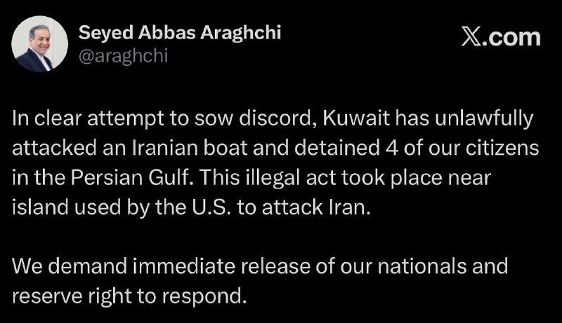

تهران ادعای کویت در رابطه با ۴ شهروند ایرانی را رد کرد جمهوری اسلامی ایران ادعاهای مطرح‌شده در بیانیه‌های وزارت خارجه و وزارت کشور کویت مبنی بر برنامه‌ریزی ایران برای انجام اقدامات خصمانه علیه کویت را مطلقاً بی‌اساس و مردود دانست. 》OPT《 @OfficialPersiaTwiter

## OfficialPersiaTwiter — post 498356

  <a href="telegram/content/OfficialPersiaTwiter_498356_1778690541.mp4" target="_blank">🎬 Download video</a>

آتش‌سوزی در مخازن نفت شهر «مرسین» ترکیه

🔹این آتش‌سوزی تاکنون یک کشته داشته است.

》OPT《

@OfficialPersiaTwiter

## OfficialPersiaTwiter — post 498355

دوم دبستان یه معلم مذهبی داشتیم که میگف "بچه ها عرق جزو نجاساته", منم اون موقع هیچ درکی از عرق سگی و اینا نداشتم همیشه موقع ورزش دهنمو میبستم عرقم نره تو دهنم
اولین بار اینجا بود که فهمیدم اسکلم

》ژیلبرتُ《

@OfficialPersiaTwiter

## OfficialPersiaTwiter — post 498354

  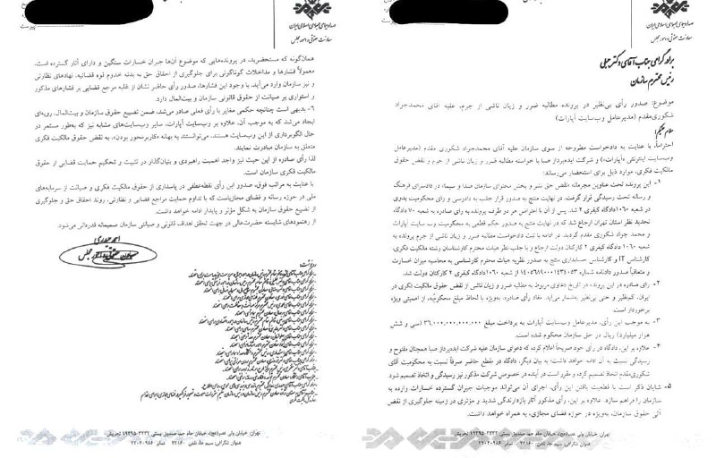

ذوق‌زدگی معاون جبلی از حکم عجیب دادگاه علیه آپارات: از رهنمودهای شما برای صدور این رای بی‌نظیر قدردانی می‌شود!

این نامه در شبکه‌های اجتماعی منتشر شده.

》OPT《

@OfficialPersiaTwiter

## OfficialPersiaTwiter — post 498353

مردم باید برق مصرفی خود را از بورس تهیه کنند/دولت خود را از بازار برق بیرون می‌کشد 🔹فارس نوشت: مشترکان برق با مصرف بالای ۱۵۰ کیلووات شامل بخش‌های خانگی، صنعتی و کشاورزی از تاریخ ۲۲ تیر باید برق خود را به جای دولت از بورس انرژی خریداری کنند. 🔹پیشتر برنامه…

## OfficialPersiaTwiter — post 498352

  <a href="telegram/content/OfficialPersiaTwiter_498352_1778690545.mov" target="_blank">🎬 Download video</a>

عراقچی وارد هند شد

وزیر امور خارجه کشورمان جهت شرکت در نشست وزرای امور خارجه کشورهای عضو بریکس وارد دهلی نو شد.

🔹نشست وزرای امور خارجه کشورهای عضو بریکس قرار است روزها پنجشنبه و جمعه در دهلی نو با تمرکز بر همکاری چندجانبه، ثبات منطقه‌ای و تاب اوری اقتصادی برگزار شود.

🔹قرار است در این سفر عراقچی با همتای هندی خود و سایر مقامات شرکت کننده دیدار و گفتگو‌ کند. هند ریاست فعلی این اتحاد اقتصادی را بر عهده دارد.

🔹ایران،‌ برزیل، روسیه، هند، چین، آفریقای جنوبی، مصر، اتیوپی، امارات متحده عربی و اندونزی  ۱۰ عضو گروه بریکس را تشکیل می‌دهند. این گروه همچنین دسته جدیدی با عنوان شریک را برای کشورهای علاقه‌مند به همکاری ایجاد کرده است.

》OPT《

@OfficialPersiaTwiter

## OfficialPersiaTwiter — post 498351

ثبت ۱۵ زمین‌لرزه در رودهن- بومهن -پردیس استان تهران 🔹مرکز تحقیقات راه مسکن و شهرسازی اعلام کرد: ۱۵ زمین‌لرزه در رودهن- بومهن -پردیس استان تهران توسط ایستگاه‌های این مرکز به ثبت رسید. 》OPT《 @OfficialPersiaTwiter

## OfficialPersiaTwiter — post 498350

اداره کل بنادر و دریانوردی هرمزگان: روزانه به ۱۰ تا ۱۵ کشتی معطل‌مانده در تنگهٔ هرمز از سوی مردم محلی خدمات‌رسانی می‌شود

این خدمات شامل تامین آب، سوخت، نیازهای درمانی و دارویی، نیازهای فنی و تعمیراتی سیار و... است.

》OPT《

@OfficialPersiaTwiter

## OfficialPersiaTwiter — post 498344

دو وزیر دولت بریتانیا در اعتراض به استارمر استعفا دادند گزارش‌ها حاکی است دو وزیر دولت بریتانیا در مخالفت با سیاست‌ها و عملکرد «کی یر استارمر» از سمت خود استعفا داده‌اند. این استعفاها در حالی رخ می‌دهد که فشارهای سیاسی بر نخست‌وزیر بریتانیا افزایش یافته…

## OfficialPersiaTwiter — post 498343

خداحافظی مردم با قیمت قطعی خودرو!

تصمیمی که اخیرا با حذف حمایت قیمتی از خودروهای مونتاژی آغاز شد، امروز به محصولات داخلی نیز رسیده است؛ به‌طوریکه در جدیدترین طرح‌های فروش ایران‌خودرو و سایپا، خریداران باید نیمی از مبلغ خودرو را امروز بپردازند، بدون آنکه بدانند در زمان تحویل چه قیمتی انتظارشان را می‌کشد/ایسنا

》OPT《

@OfficialPersiaTwiter

## OfficialPersiaTwiter — post 498342

داری با ریمیکس‌ حمید خارجی حس میگیری، یهو وسط آهنگ میگه اسپانسر این پادکست سنگ توالت سازی باصفا واقع در سعادت آباد، با مدیریت غلامرضا قره‌خانلو…!

》Mohammad Heidari《

@OfficialPersiaTwiter

## OfficialPersiaTwiter — post 498341

امروز هیچ مراسم عمومی برای ترامپ برگزار نمی‌شود دونالد ترامپ، از هواپیمای ریاست جمهوری در پکن پیاده شد و مورد استقبال مقامات چینی و جمعیت مشتاق قرار گرفت. ترامپ پس از ورودش هیچ مراسم عمومی دیگری ندارد، اما قرار است روزهای پنجشنبه و جمعه چندین بار با رئیس…

## OfficialPersiaTwiter — post 498340

ادعای نشریه فرانسوی: سیلی خوردن امانوئل مکرون از همسرش به دلیل رابطه با گلشیفته فراهانی بود فلوریان تاردیف: مکرون چندين ماه با گلشیفته فراهانی، بازیگر ایرانی رابطه افلاطونی داشته (رابطه‌ای احساسی - عاطفی که جنبه فیزیکی نداره)؛ اتفاقا دلیل چَک خوردن رئیس‌جمهور…

## OfficialPersiaTwiter — post 498339

مردم باید برق مصرفی خود را از بورس تهیه کنند/دولت خود را از بازار برق بیرون می‌کشد

🔹فارس نوشت: مشترکان برق با مصرف بالای ۱۵۰ کیلووات شامل بخش‌های خانگی، صنعتی و کشاورزی از تاریخ ۲۲ تیر باید برق خود را به جای دولت از بورس انرژی خریداری کنند.
🔹پیشتر برنامه هفتم توسعه دولت را مکلف به خروج از بازار برق کرده بود؛ از سال آینده دامنه خرید و فروش برق در بورس برای مشترکان بالای ۳۰ کیلووات نیز برقرار خواهد شد.

》OPT《

@OfficialPersiaTwiter

## OfficialPersiaTwiter — post 498338

آخرین وضعیت اکبر عبدی از زبان ده‌نمکی 🔹مسعود ده‌نمکی: اکبر عبدی یک یا دو مورد سکته خفیف داشت و در حال حاضر به دلیل عوارض قبلی در آی‌سی‌یو است و وضعیتش تثبیت نشده است. 🔹آقای عبدی چند روزی هم در خواب مصنوعی بود و امیدواریم که با تلاش پزشکان بهتر شود. 》OPT《…

## bbcpersian — post 280948

  <a href="telegram/content/bbcpersian_280948_1778690547.mp4" target="_blank">🎬 Download video</a>

🔻علیرضا ‌رئیسی، معاون وزیر بهداشت ایران در نشستی خبری امروز ۲۳ اردیبهشت در رابطه با احتمال ورود ویروس هانتا در ایران تاکید کرد که این ویروس «تاکنون مشاهده نشده است.»

شیوع ویروس هانتا، اوایل ماه مه در کشتی بزرگ تفریحی ام‌وی هاندی‌یوس که از آرژانتین به سمت قطب جنوب از مسیر اقیانوس اطلس در حرکت بوده، رخ داد.

معاون وزیر بهداشت با اشاره به این موضوع و بسته بودن تنگه هرمز احتمال ورود این ویروس به ایران از طریق مشابه را تقریبا محال دانست و به شوخی گفت: اگر حتی یک قایق بادی از این تنگه عبور کند در هوا می‌زنندش.»

سازمان جهانی بهداشت می‌گوید انتقال این ویروس از طریق انسان به انسان ممکن است، اما خطر گسترش عفونت در سطح جهانی همچنان پایین است.

آزمایش‌هایی برای تشخیص این عفونت وجود دارد، اما درمان اختصاصی برای آن وجود ندارد.
@BBCPersian

## bbcpersian — post 280947

🔻آژانس بین‌المللی انرژی: عرضه جهانی نفت امسال از تقاضا کمتر است

آژانس بین‌المللی انرژی روز چهارشنبه با تغییر پیش‌بینی قبلی خود درباره وجود مازاد عرضه نفت، اعلام کرد که عرضه جهانی نفت امسال از کل تقاضا کمتر خواهد بود.

به گفته این نهاد، جنگ آمریکا و اسرائیل با ایران تولید نفت خاورمیانه را مختل کرده و حجم ذخایر را با سرعت بی‌سابقه‌ای کاهش می‌دهد.

از نظر آژانس بین‌المللی انرژی، جنگ ایالات متحده و اسرائیل با ایران و آسیب‌ به زیرساخت‌های نفتی ایران و کشورهای خلیج فارس و بسته شدن عملی تنگه هرمز، بزرگترین بحران عرضه نفت در تاریخ را رقم زده و به جهش قیمت نفت منجر شده است.

این آژانس در گزارش ماهانه خود اعلام کرد: «با توجه به اینکه تردد نفتکش‌ها در تنگه هرمز همچنان محدود است، مجموع کاهش عرضه تولیدکنندگان نفت خلیج فارس از یک میلیارد بشکه فراتر رفته و بیش از ۱۴ میلیون بشکه نفت در روز متوقف شده است که این یک شوک بی‌سابقه در عرضه محسوب می‌شود.»

آژانس بین‌المللی انرژی اعلام کرده است که به دلیل جنگ، عرضه جهانی نفت در سال ۲۰۲۶ حدود ۳‌/۹ میلیون بشکه در روز کاهش خواهد یافت.

پیش‌بینی قبلی این سازمان ۱/۵ میلیون بشکه کاهش در روز بود.

@BBCPersian

## bbcpersian — post 280946

🔻اهمیت سفر دو روزه ترامپ به چین در چیست

🖊بن هاتن، خبرنگار بی‌بی‌سی

دونالد ترامپ، رئیس‌جمهور آمریکا، برای اولین بار در نزدیک به یک دهه گذشته وارد چین شده است تا در مذاکراتی حساس با شی جین‌پینگ، همتای چینی‌اش شرکت کند.

برخی از بزرگ‌ترین چهره‌های صنعت آمریکا نیز در هواپیمای ریاست‌جمهوری آمریکا هنگام فرود در پکن حضور داشتند؛ از جمله ایلان ماسک، میلیاردر حوزه فناوری، جنسن هوانگ مدیر انویدیا، و کلی اورتبرگ از شرکت بوئینگ.

انتظار می‌رود تجارت یکی از اصلی‌ترین محورهای مذاکرات باشد. دونالد ترامپ گفته است «اولین درخواست» او این خواهد بود که چین «درهایش را باز کند تا این افراد نابغه بتوانند جادوی خود را به کار بگیرند.»

روابط آمریکا و چین در حوزه تجارت پرتنش بوده است. آقای ترامپ در آغاز دومین دوره ریاست‌جمهوری خود، جنگ تجاری‌ای را که در دوره اول آغاز کرده بود دوباره شعله‌ور کرد، هرچند دو طرف در اکتبر گذشته بر سر یک آتش‌بس تجاری توافق کردند.

اما موضوعات دیگری هم روی میز قرار دارد. به‌طور گسترده تصور می‌شود چین می‌تواند بر ایران نفوذ داشته باشد؛ کشوری که ترامپ به‌دنبال دستیابی به توافق صلح با آن است، هرچند تأکید کرده برای این کار به کمک چین نیازی ندارد. با این حال، پکن منافع خاص خود را در منطقه دارد؛ و برآورد می‌شود حدود ۹۰ درصد صادرات نفت ایران را خریداری کند.

مراسم رسمی و رویدادهای اصلی دیپلماتیک قرار است روزهای پنجشنبه و جمعه برگزار شود.

https://bbc.in/4uEGyKS
@BBCPersian

## bbcpersian — post 280945

  

🔻«تایم‌اوت»، مجله اینترنتی جهانی، لندن را به‌عنوان بهترین شهر فرهنگی جهان معرفی کرد.

در این مجله از پایتخت بریتانیا به‌دلیل برخورداری از صحنه فرهنگی گسترده، باکیفیت و در دسترس تقدیر شد؛ صحنه‌ای که شامل «تئاتر، گالری‌های هنری، موزه‌ها، جشنواره‌های ادبی، موسیقی زنده و برنامه‌های کمدی» می‌شود.

این رتبه‌بندی بر اساس نظرسنجی از بیش از ۲۴ هزار شهروند در سراسر جهان و همچنین ارزیابی کارشناسان و دبیران مجله تایم‌اوت تهیه شده است.

جاستین سایمونز، معاون شهردار لندن در امور فرهنگ و صنایع خلاق، لندن را «یک پایتخت فرهنگی جهانی» توصیف کرد و گفت: «فرهنگ بخشی از دی‌ان‌ای لندن است. این بخش ۶۴ میلیارد پوند برای اقتصاد لندن ارزش دارد و دلیل اصلی سفر بیشتر گردشگران به این شهر است.»

در این رتبه‌بندی، پاریس در جایگاه دوم و نیویورک در رتبه سوم قرار گرفتند.

📷Getty Images
@BBCPersian

## bbcpersian — post 280936

🖊سو میچل, بی‌بی‌سی

تحقیقات بی‌بی‌سی هویت یکی از سردسته‌های قاچاقچیان انسان در ارتباط با انتقال مهاجران با قایق‌های کوچک به بریتانیا را فاش کرده است؛ فردی که گفته می‌شود شبکه‌اش در سال‌های اخیر مسئول بخش عمده عبورهای غیرقانونی از کانال مانش بوده است.

این مرد ۲۸ ساله که کرد عراقی است، سال‌ها با استفاده از نام مستعار «کاردو رانیه» از بازداشت گریخته بود.او نام واقعی خود را به شدت مخفی نگه داشته بود و این مسئله تلاش نهادهای مجری قانون برای صدور حکم بین‌المللی بازداشت علیه او را با مشکل روبه‌رو کرده بود.

نبود اطلاعات درباره نام واقعی کاردو رانیه همچنین باعث شده بود نیروهای پلیس در کشورهای مختلف اروپایی نتوانند به راحتی محل حضور او را ردیابی کنند یا سرنخ‌ها را فراتر از مرزهای خود دنبال کنند.

اما من و همکارم راب لاوری، با استفاده از رابط‌هایی در دنیای قاچاق، توانستیم ردپایی را از اردوگاه‌های مهاجران در سواحل شمالی فرانسه تا اقلیم کردستان دنبال کنیم؛ مسیری که در نهایت به شناسایی هویت واقعی و جزئیات مربوط به کاردو رانیه و سپس رویارویی مستقیم با او منجر شد.
https://bbc.in/431R0jQ
📸BBC/ GettyImages/ AFP via Getty

## bbcpersian — post 280935

🔻قوه قضائیه ایران، اموال ۲۴ شهروند ایرانی در استان هرمزگان را توقیف کرد

مجتبی قهرمانی، رئیس دادگستری استان هرمزگان می‌گوید که اموال ۲۴ شهروند ایرانی در این استان را توقیف کرده است که در خارج از ایران سکونت دارند.

آقای قهرمانی این افراد را به «همکاری با دشمن» متهم کرد که منظورش اسرائیل و آمریکاست.

در هفته‌های اخیر قوه قضائیه ایران چندین بار با انتشار فهرستی از شهروندان ساکن استان‌های مختلف گفته که اموال آنها را توقیف کرده است.

در میان شهروندانی که اموالشان توقیف شده است، طیف وسیعی از اقشار جامعه از خبرنگاران تا بازیگران سابق و فعالان سیاسی و هنرمندان، دیده می‌شوند.

فعالان مجازی حامی جمهوری اسلامی در جریان جنگ ۴۴ روزه، اقدام به فراخوان‌هایی برای معرفی مخالفان جمهوری اسلامی کرده بودند. آنها این مخالفان را «حامی جنگ» خوانده‌اند.

قوه قضائیه ایران پس از جنگ آمریکا و اسرائیل با ایران، با استناد به قانون «تشدید مجازات جاسوسی» معترضان و مخالفان را به «همراهی با دشمن» متهم کرد. در پی این جنگ، سرکوب مخالفان جمهوری اسلامی شدت یافته است.

اما این توقیف‌ها به موضوع جنگ محدود نیست؛ در زمان اعتراضات دی‌ماه هم اموال بعضی از چهره‌های شناخته شده در داخل ایران ضبط شد.

محمد ساعدی‌نیا، مالک کافه‌های «ساعدی‌نیا» یکی از آنها بود که قوه قضائیه به اتهام اینکه «مردم را دعوت به اغتشاش و آشوب کرده بود» او را بازداشت و دستور توقیف کلیه اموال و حساب‌های بانکی‌اش را صادر کرد.

@BBCPersian

## bbcpersian — post 280934

🔻افزایش مشکلات معیشتی شهروندان در ایران؛ کارگروه آرد و نان اتاق اصناف، «افزایش قیمت نان» را رد کرد

هم‌زمان با گزارش‌ها در ایران از افزایش بسیاری از اقلام خوراکی، محمدجواد کرمی، رئیس کارگروه آرد و نان اتاق اصناف ایران، انتشار نرخ‌های جدید نان را رد کرده است.

آقای کرمی گفت: «قیمت‌های جدید نرخ نان که در فضای مجازی دست به دست می‌شود اشتباه است و نرخ جدیدی برای نان تصویب نشده است.»

او گفته است که از دیروز فهرست قیمت‌های جدید نان در فضای مجازی می‌چرخد و حتی در خیابان‌ها مردم از افزایش قیمت از امروز خبر می‌دادند اما تاکید کرد که تصمیم جدیدی در این زمینه ابلاغ نشده است.

حدود چهار روز پیش ابوذر گل‌محمدی، رییس اتحادیه نانوایان همدان نرخ‌های جدیدی را برای اردیبهشت ماه اعلام کرد و گفت نانوایان ملزم به رعایت آن هستند.

بر اساس نرخ‌‌های جدیدی که او اعلام کرد، قیمت نان لواش ۲ هزار تومان، نان سنگک هشت هزار تومان، نان بربری ساده ۶ هزار و ۵۰۰ تومان و نان محلی و تافتون سه هزار و ۵۰۰ تومان تعیین شده است.

پیشتر هم رئیس اتاق اصناف به مشکلات در عرضه بعضی از نان‌ها اشاره کرده بود.

او گفته بود که «در حال حاضر در حوزه نان، تنها در بخش نان‌های بربری و سنگک با برخی مشکلات مواجه هستیم.»

مشکلات صنف نانوایی در ایران در حالی ادامه دارد که نانوایان از درآمد خود رضایت ندارند و از نحوه تخصیص یارانه‌ها گله‌مندند.

مشکلات گرانی در ایران البته محدود به نان نیست، از آغاز جنگ آمریکا و اسرائیل قیمت اقلام چند برابر شده است.

بر اساس گزارش آمار مرکز آمار ایران، تورم نقطه‌ای کالاهای اساسی خوراکی در فروردین ماه امسال (۱۴۰۵) به سطح کم‌سابقه‌ای رسید.

در این گزارش روغن نباتی جامد با افزایش ۳۷۵ درصدی قیمت (نقطه به نقطه) در صدر مواد خوراکی گران قرار گرفت.

پس از آن روغن مایع با ۳۰۸ درصد و برنج خارجی با ۲۰۹ درصد افزایش قیمت، در رتبه‌های بعدی گرانی قرار دارند.

@BBCPersian

## bbcpersian — post 280933

  

🔻روزنامه شرق در گزارشی با عنوان «تعدیل شده‌ها پشت درهای بسته بیمه» به مشکلات دریافت بیمه بیکاری در موج تازه تعدیل نیرو در ایران پرداخته است.

در این گزارش با اشاره به «موج فزاینده تعداد بیکاران»، آمده است که «نداشتن قرارداد کاری یا در اختیار نداشتن نسخه‌ای از قرارداد» به یکی از معضلات متقضیان برای شروع روند اداری درخواست بیمه بیکاری تبدیل شده است.

در اصنافی مانند رسانه‌های ایران، نداشتن قرارداد موضوعی بسیار رایج است.

به‌نوشته روزنامه شرق، «بسیاری از متقاضیان می‌گویند که پس از ثبت درخواست، در نوعی بلاتکلیفی میان اداره کار و سازمان تأمین اجتماعی گرفتار می‌شوند؛ جایی که هیچ‌کدام مسئولیت تأخیرها را نمی‌پذیرند و متقاضی نیز نمی‌داند دقیقا باید از چه نهادی پاسخ بخواهد.»

بعضی متقاضیان که شرق با آنها گفتگو کرده، از قطع بیمه بیکاری پس از اشتغال کوتاه‌مدت یا پروژه‌ای انتقاد دارند.

«شرق» گفته است که برای پیگیری ماجرا به سراغ بیمه تامین اجتماعی رفته است اما روابط‌عمومی این سازمان می‌گوید که «این موضوع به آنها مربوط نمی‌شود و وزارت کار متولی است.»

📷SNN
@BBCPersian

## bbcpersian — post 280932

🔻ایران، تعرفه‌های تجاری وسرمایه‌گذاری؛ موضوعاتی که ترامپ در سفرش به چین ممکن است پیگیر آنها باشد

🖊تام بیتمن، خبرنگار امور وزارت خارجه آمریکا، گزارش از پکن

همان‌طور که همیشه درباره دونالد ترامپ صادق است، بخش بزرگی از این سفر صرفا به تصاویر و نمایش‌های رسانه‌ای مربوط می‌شود؛ او دوست دارد در کنار رهبران قدرتمند و در میان تشریفات دولتی دیده شود. اما از منظر سیاست‌گذاری، تصویر بسیار پیچیده‌تر است.

آقای ترامپ به‌شدت به یک موفقیت نیاز دارد تا از فشار ناشی از سقوط محبوبیتش و احتمال شکست جمهوری‌خواهان در انتخابات میان‌دوره‌ای امسال بکاهد، که به دلیل افزایش هزینه‌های زندگی تشدید شده است.

با توجه به این‌که بخشی از این فشار اقتصادی به جنگ ایران مرتبط است، گفت‌وگو با شی جین‌پینگ می‌تواند مفید باشد. البته اگر پکن حاضر شود بر تهران فشار وارد کند، هرچند این هدف برای ترامپ بسیار دشوار است.

در مقابل، شی جین‌پینگ ممکن است از آقای ترامپ امتیازاتی درباره حمایت واشنگتن از تایوان مطالبه کند. به‌ویژه فروش تسلیحات به تایوان که پکن آن را بخشی از خاک خود می‌داند.

با این حال، کاخ سفید پیشاپیش اعلام کرده است که سیاستش درباره تایوان تغییر نخواهد کرد.

پیروزی‌های آسان‌تر برای آقای ترامپ در حوزه تجارت خواهد بود. انتظار می‌رود که آتش‌بس کنونی در جنگ تعرفه‌ای که او پاییز گذشته با شی به آن رسید، حفظ شود. این موضوع به تداوم جریان صادرات عناصر نادر خاکی و آهنرباهای چینی کمک می‌کند که برای فناوری آمریکا، از جمله صنایع دفاعی، حیاتی هستند.

همچنین ممکن است وعده‌هایی درباره سرمایه‌گذاری چین در آمریکا مطرح شود. از جمله آنها خرید هواپیماهای بوئینگ و واردات بیشتر سویا از آمریکاست.

موضوعی که برای کشاورزان ناراضی در برخی ایالت‌های کلیدی انتخاباتی، اهمیت زیادی دارد.

https://bbc.in/3R8zyHJ
@BBCPersian

## bbcpersian — post 280931

🔻سفر مقام‌های ایرانی به هند برای اجلاس وزرای خارجه کشورهای عضو بریکس

در آستانه اجلاس وزرای خارجه کشورهای عضو بریکس، کاظم غریب‌آبادی، معاون وزیر خارجه ایران به دهلی‌نو سفر و با مقام های هند دیدار کرده است.

نشست وزرای خارجه بریکس قرار است از فردا به مدت دو روز به ریاست هند تشکیل شود و مقدمه اجلاس رهبران را که در شهریور به میزبانی همین کشور است، فراهم کند.

اسماعیل بقایی، سخنگوی وزارت خارجه ایران به یک روزنامه هندی گفته است که نشست فردا برای تهران اهمیت زیادی دارد و ایران امیدوار است در حاشیه آن دیدارهای دوجانبه‌ای از جمله با وزیر خارجه هند برگزار شود.

آقای بقایی درباره احتمال حمله مجدد آمریکا به ایران به روزنامه ایندیا تودی گلوبال گفته است «می‌توانم اطمینان دهم نیروهای مسلح ما برای هر سناریویی آماده هستند» و ادامه داده «هر کسی که جرأت کند پا به خاک ایران بگذارد، به‌شدت از این اقدام پشیمان خواهد شد.»

@BBCPersian

## Lichargoo — post 24869

یادش بخیر یه زمانی اینترنت اینقد مفت بود که از ریلزای اینستا به عنوان چراغ قوه استفاده میکردم.

## Lichargoo — post 24868

  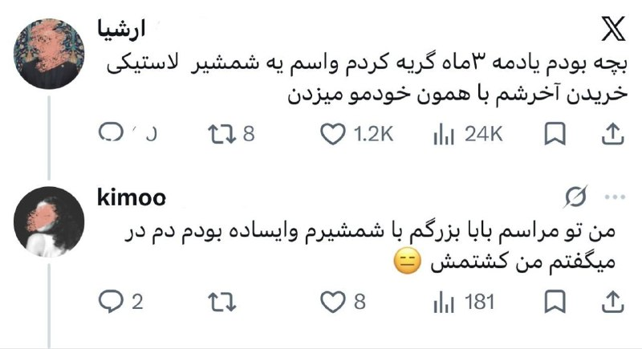

😂😂😂😂😂

@Lichargoo

## Tans_Footbali — post 236271

  <a href="telegram/content/Tans_Footbali_236271_1778690553.mp4" target="_blank">🎬 Download video</a>

در اعتراف اجباری عرفان شکورزاده مجبورش کردند بگه در ایران به آدم‌ها القا می‌کنند که حتی اگر درس بخونند، آینده‌ای ندارند

سناریونویس نادان جمله درستی در دهان عرفان گذاشت؛عرفان ۲۹ ساله و شاگرد اول دوره ارشد خودش مثالی بود که ثابت کرد با وجود درس خوندن، آینده نداشت و اعدام شد

@Tans_Footbali

## Tans_Footbali — post 236270

  

ترامپ تمام غول های مالی و امپراطوری های سرمایه‌داران آمریکایی را همراه خود به چین برده است

@Tans_Footbali

## Tans_Footbali — post 236267

  <a href="telegram/content/Tans_Footbali_236267_1778690555.mp4" target="_blank">🎬 Download video</a>

کتاب جدید یک خبرنگار مجله پاریس مچ ادعا می‌کند که رئیس‌جمهور فرانسه، مکرون، یک رابطه «عشق افلاطونی» چند ماهه با بازیگر فرانسوی-ایرانی گلشیفته فراهانی داشته است که در آن پیام‌هایی از جمله «از نظر من تو خیلی زیبا هستی» رد و بدل شده است.

حادثه باند فرودگاه ویتنام در مه ۲۰۲۵ که در آن به نظر می‌رسید بریژیت همسر مکرون به او سیلی زده است، در واقع یک دعوای زوجین بود پس از اینکه او پیام‌ مکرون به گلشیفته را وسط پرواز در تلفن او دید.

کمپ بریژیت این موضوع را رد می‌کند.

فراهانی در مورد این ادعای خاص اظهار نظری نکرده است.

💛@Tans_Footbali

## hamclasixii — post 75356

🔴وزیر نیرو: تابستان خاموشی نخواهیم داشت

🔹علی‌آبادی: با همکاری مردم و افزایش ظرفیت تولید، وضعیت امسال از سال گذشته به مراتب بهتر خواهد بود و امید است تابستان بدون خاموشی سپری شود.

📚 @hamclasix 📚

## hamclasixii — post 75355

  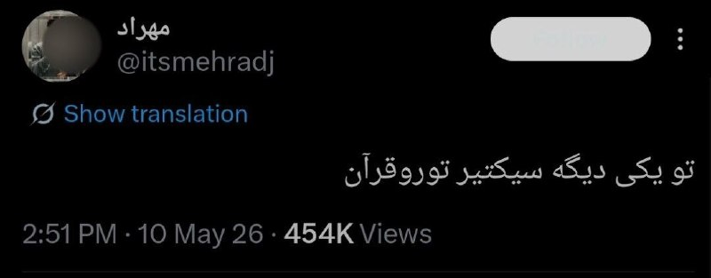

لایه‌ی 3d وقتی منتظره که الکترون بگیره ولی یهو میبینه لایه‌ی 4s ازش زد جلو.

📚 @hamclasix 📚

## withyashar — post 11158

  <a href="telegram/content/withyashar_11158_1778690558.mp4" target="_blank">🎬 Download video</a>

امشب چین 😂
@withyashar

## withyashar — post 11157

  <a href="telegram/content/withyashar_11157_1778690561.mp4" target="_blank">🎬 Download video</a>

همراهان ترامپ در چین
@withyashar

## withyashar — post 11156

سد عباس چپقچی وارد هند شد
@withyashar

## withyashar — post 11155

احسان افرشته، به اتهام جاسوسی و همکاری اطلاعاتی با موساد اعدام شد به گفته رژیم وی چند مرحله تماس از طریق پیام‌رسان‌ها داشته و در ادامه از طریق پست الکترونیک باهم در ارتباط بوده‌اند بیش از ۳۰۰ پیام بین آنها رد و بدل شده است. افرشته در ابتدا در پوشش راننده تاکسی…

---
📅 بروزرسانی: 1405/02/23 17:57
---

## persian_trend_official — post 14064

  

🔴دبیرکل حزب‌الله: حمایت‌های ایران باعث شد ما مقابل اشغالگری ایستادگی کنیم

💢شیخ نعیم قاسم دبیرکل حزب‌الله لبنان:

حمایت‌های جمهوری اسلامی ایران از همان آغاز تأسیس حزب‌الله در سال 1982 به فرمان امام خمینی و تداوم این پشتیبانی‌ها تحت نظارت امام خامنه‌ای و از طریق «سپاه پاسداران» به‌ویژه «نیروی قدس»، ما را قادر ساخت تا جنوب لبنان را در سال 2000 آزاد کنیم و تا به امروز در برابر تجاوزات مکرر بایستیم.

🫆:Tony

📌 @persian_trend_official
پرشین ترند | متفاوت‌ترین کانال نظامی

## persian_trend_official — post 14063

🔴 لاوروف: آمریکا به‌دنبال کنترل بازار جهانی انرژی است

💢سرگئی لاوروف، وزیر خارجه روسیه، در اظهاراتی دولت ترامپ را متهم کرده که تلاش می‌کند نفوذ خود را بر بازار جهانی انرژی «تحمیل» کند.

💢او گفته است هدف آمریکا این است که شرکت‌های انرژی روسیه مانند لوک‌اویل و روس‌نفت را از بازارهای بین‌المللی خارج کند و مسیرهای اصلی تأمین انرژی جهان را تحت کنترل خود بگیرد.

💢لاوروف همچنین تأکید کرده:
آمریکا در اسناد راهبردی خود به دنبال تسلط بر بازار انرژی جهانی است و قصد دارد همه مسیرهای مهم انرژی را تحت نفوذ خود قرار دهد.

🫆:Tony

📌 @persian_trend_official
پرشین ترند | متفاوت‌ترین کانال نظامی

## persian_trend_official — post 14061

🚨🇮🇱🇱🇧 حملات هوایی جدید اسرائیل دقایقی پیش مناطقی در لبنان را هدف قرار داد؛ همزمان منابع محلی از شنیده شدن صدای چندین انفجار خبر می‌دهند.

☆Phantom☆

📌 @persian_trend_official
پرشین ترند | متفاوت‌ترین کانال نظامی

## persian_trend_official — post 14059

ترامپ تمام افراد ثروتمند آمریکا را با Air Force One خود به پکن برده است.

📝 Nick

📌 @persian_trend_official
پرشین ترند | متفاوت‌ترین کانال نظامی

## persian_trend_official — post 14058

  <a href="telegram/content/persian_trend_official_14058_1778682470.mp4" target="_blank">🎬 Download video</a>

⭕️ فارس:

تصاویر دیده‌نشده از رزمایش ضد هلی‌برن سپاه تهران بزرگ

📝 Nick

📌 @persian_trend_official
پرشین ترند | متفاوت‌ترین کانال نظامی

## persian_trend_official — post 14057

  

⭕️ برخی از رسانه‌های فرانسوی دست به انتشار گزارشی به نقل از «فلورین تاردیف» خبرنگار «پاری‌مچ» زده‌اند که حکایت از روابط پنهانی امانوئل ماکرون و گلشیفته فراهانی دارد.

این خبرنگار فرانسوی در گزارش خود نوشته که سیلی که زن ماکرون به او در کنار در خروجی هواپیما زد، به خاطر همین رابطه بوده.

منبع خبر

📝 Nick

📌 @persian_trend_official
پرشین ترند | متفاوت‌ترین کانال نظامی

## persian_trend_official — post 14056

⭕️ در حالی که اینترنت در ایران به مدت ۷۵ روز قطع است، شرکت اپل دیروز به صورت رسمی اولین نمایندگی خود را در افغانستان افتتاح نمود. تکذیب شد. 📝 Nick 📌 @persian_trend_official پرشین ترند | متفاوت‌ترین کانال نظامی

## persian_trend_official — post 14055

  

🔴 ادعای وال‌استریت ژورنال درباره نقش امارات و سفر مقامات امنیتی اسرائیل

💢بر اساس گزارشی که به وال‌استریت ژورنال نسبت داده شده، گفته می‌شود رئیس موساد اسرائیل حداقل دو بار به‌صورت محرمانه به امارات متحده عربی سفر کرده تا درباره هماهنگی‌های مرتبط با درگیری‌های جاری با ایران گفت‌وگو کند.

▪️در این گزارش همچنین ادعا شده:

💢امارات فراتر از نقش دیپلماتیک عمل کرده و در برخی اقدامات نظامی علیه ایران نقش داشته است.

▪️از جمله، حمله به یک هدف نفتی در جزیره لاوان به امارات نسبت داده شده است.
▪️همچنین گفته شده امارات میزبان برخی سامانه‌ها و نیروهای مرتبط با دفاع هوایی اسرائیل بوده است.
▪️در ادامه، به سفرهای مشابه رئیس شین‌بت اسرائیل در همان بازه زمانی نیز اشاره شده است.

🫆:Tony

📌 @persian_trend_official
پرشین ترند | متفاوت‌ترین کانال نظامی

## persian_trend_official — post 14054

  <a href="telegram/content/persian_trend_official_14054_1778682475.mp4" target="_blank">🎬 Download video</a>

🔴 ترامپ وارد پکن شد

هواپیمای ریاست‌جمهوری آمریکا (ایرفورس وان) لحظاتی پیش در پایتخت چین به زمین نشست و دونالد ترامپ سفر خود را برای دیدار و نشست با شی جین‌پینگ آغاز کرد.

🫆:Tony

📌 @persian_trend_official
پرشین ترند | متفاوت‌ترین کانال نظامی

## persian_trend_official — post 14053

🔴 نشت سوخت نفتکش اماراتی پس از حمله پهپادی در سواحل عمان

💢خبرگزاری رویترز گزارش داد یک نفتکش وابسته به شرکت ملی نفت ابوظبی پس از حمله پهپادی منتسب به ایران در نزدیکی سواحل عمان دچار نشت محدود سوخت شده است.

💢بر اساس این گزارش:

▪️ نفتکش «برکه» همچنان در سواحل عمان لنگر انداخته است
▪️ شرکت اماراتی اعلام کرده مقدار کمی سوخت کشتی وارد آب شده است
▪️ این کشتی هنگام حمله بارگیری نشده بود
▪️ هیچ آسیبی به خدمه وارد نشده است

💢شرکت اماراتی اعلام کرده در حال همکاری با مقام‌های عمان و تیم‌های تخصصی برای مدیریت وضعیت است.

🫆:Tony

📌 @persian_trend_official
پرشین ترند | متفاوت‌ترین کانال نظامی

## OfficialPersiaTwiter — post 498334

دعوت از شيخ‌نشین‌های خلیج فارس برای حضور در نشست ناتو با محوریت جنگ ایران

🔹سازمان پیمان آتلانتیک شمالی (ناتو) قصد دارد از نمایندگان چهار کشور حوزه خلیج فارس برای حضور در نشست آنکارا دعوت کند.

🔹به گزارش ترکیه تودی، انتظار می‌رود وزرای خارجه کشورهای بحرین، کویت، قطر و امارات متحده عربی به نشست ۷ تا ۸ جولای (دو ماه دیگر) در پایتخت ترکیه دعوت شوند، اگرچه دفتر مطبوعاتی ناتو از اظهارنظر در این باره خودداری کرد.

🔹این نشست در پی افزایش تنش‌های فراآتلانتیک بر سر جنگ ایران برگزار می‌شود. دونالد ترامپ، رئیس‌جمهور آمریکا، متحدان ناتو را به دلیل عدم کمک برای بازگشایی تنگه هرمز مورد انتقاد قرار داده و متعاقباً از خروج حدود ۵۰۰۰ سرباز از آلمان خبر داد.

》OPT《

@OfficialPersiaTwiter

## OfficialPersiaTwiter — post 498333

  

با اینترنت پرو فقط با حجم مشخص می‌توانید از سایت‌های خارجی استفاده کنید!

》OPT《

@OfficialPersiaTwiter

## OfficialPersiaTwiter — post 498332

‏برا زلزله باید کف خونه‌ها رو چسب ضربدری بزنیم؟ 》دودوک《 @OfficialPersiaTwiter

## OfficialPersiaTwiter — post 498331

رئیس ستاد ارتش رژیم اسرائیل:

🔹جنگ با ایران پایان نیافته است،
برای از سرگیری جنگ در هوشیاری کامل قرار داریم!

》OPT《

@OfficialPersiaTwiter

## OfficialPersiaTwiter — post 498329

آغاز مجدد حملات هوایی ارتش رژیم اسرائیل در لبنان؛ همزمان منابع محلی از شنیده شدن صدای چندین انفجار خبر می‌دهند.

》OPT《

@OfficialPersiaTwiter

## OfficialPersiaTwiter — post 498328

هشدار چین به آمریکا در مورد فروش تسلیحات به تایوان

🔹رویترز: چین امروز و پیش از دیدار ترامپ و «شی جین پینگ»، بار دیگر مخالفت شدید خود را با فروش تسلیحات آمریکا به تایوان اعلام کرد و از واشنگتن خواست به تعهدات خود در این زمینه عمل کند.

》OPT《

@OfficialPersiaTwiter

## OfficialPersiaTwiter — post 498327

بلومبرگ: جهش بی‌سابقه در تولید موشک‌های چین

بر اساس تحلیلی که بلومبرگ منتشر کرده، چین در سال گذشته میلادی تولید موشک‌های خود را به بالاترین میزان از زمان به قدرت رسیدن «شی جین پینگ»، رئیس‌جمهور این کشور در سال ۲۰۱۳ رسانده است.

بر اساس این گزارش، تعداد شرکت‌هایی که از تولید قطعات کلیدی موشک‌ها خبر داده‌اند، در سال گذشته به ۸۱ شرکت رسیده که این رقم بیش از دو برابر آمار سال اول ریاست‌جمهوری شی جین پینگ است.

تحلیل بلومبرگ حاکی از آن است که این گسترش موشکی نشان می‌دهد پکن انباری عظیم از موشک‌ها در اختیار دارد. در مقابل، ذخایر موشکی آمریکا بر اثر جنگ دونالد ترامپ، با ایران تخلیه شده و این مسئله نگرانی‌هایی را برای تایوان و متحدان واشنگتن در منطقه ایجاد کرده است.

》OPT《

@OfficialPersiaTwiter

## OfficialPersiaTwiter — post 498326

سنتکام: محاصره دریایی ایران همچنان پابرجاست /تغییر مسیر ۶۵ کشتی تجاری

🔹فرماندهی مرکزی ارتش آمریکا (سنتکام) اعلام کرد همچنان به اعمال محاصره علیه کشتی‌هایی که به داخل ایران وارد می‌شوند یا از آنها خارج می‌شوند، ادامه می‌دهند.
🔹سنتکام مدعی شد که در جریان این عملیات، مسیر ۶۵ کشتی تجاری را تغییر داده و چهار کشتی دیگر را از کار انداخته‌است.

》OPT《

@OfficialPersiaTwiter

## OfficialPersiaTwiter — post 498325

رویترز: عراق و پاکستان مجوز عبور از تنگه هرمز را از ایران گرفتند 🔹منابع مطلع به رویترز گفتند بغداد و اسلام‌آباد برای انتقال نفت و LNG از خلیج فارس، مجوز و هماهنگی لازم را از ایران دریافت کرده‌اند. 🔹به گفته رویترز، این موضوع نشان‌دهنده نقش و نفوذ ایران در…

## OfficialPersiaTwiter — post 498324

  

ادعای نشریه فرانسوی: سیلی خوردن امانوئل مکرون از همسرش به دلیل رابطه با گلشیفته فراهانی بود

فلوریان تاردیف:
مکرون چندين ماه با گلشیفته فراهانی، بازیگر ایرانی رابطه افلاطونی داشته (رابطه‌ای احساسی - عاطفی که جنبه فیزیکی نداره)؛

اتفاقا دلیل چَک خوردن رئیس‌جمهور فرانسه هم گلشیفته بوده؛ چون مکرون به این بازیگر ایرانی پیام داده بود که از نظر من تو خیلی زیاد خوشگلی و اینو زنش دیده بود...

》OPT《

@OfficialPersiaTwiter

## OfficialPersiaTwiter — post 498323

دولت سوریه به طور رسمی از روسیه خواسته است که بشار اسد را برای محاکمه و پاسخ دادن به جنایات جنگی تحویل بدهد.

》OPT《

@OfficialPersiaTwiter

## OfficialPersiaTwiter — post 498322

لیونل مسی همچنان پردرآمدترین ورزشکار در لیگ آمریکا است

🔹مسی با دو برابر کردن حقوق پایه خود در اینتر میامی، سالانه ۲۸ میلیون دلار درآمد خواهد داشت.
🔹 الجزیره نوشت: انجمن بازیکنان MLS می‌گوید: لیونل مسی با حقوق پایه سالانه ۲۵ میلیون دلار، بیش از دو برابر سون هیونگ مین، دومین بازیکن پردرآمد، همچنان پردرآمدترین بازیکن لیگ برتر فوتبال است.
🔹طبق آمار منتشر شده، حقوق پایه مسی دو برابر شده است، در حالی که در مجموع این قرارداد او را به ۲۸.۳ میلیون دلار تضمین شده می‌رساند. آخرین فهرست حقوق بازیکنان که توسط اتحادیه منتشر شده نشان می‌دهد که مسی تا سال ۲۰۲۸ در این تیم فلوریدایی حضور خواهد داشت.
🔹سون، ستاره کره جنوبی و کاپیتان سابق تاتنهام که در ماه اوت گذشته با مبلغ رکوردشکن ۲۶ میلیون دلار در نقل و انتقالات MLS با لس‌آنجلس اف‌سی قرارداد امضا کرد، حقوق پایه ۱۰.۳۶ میلیون دلار دارد و مجموع حقوق تضمین‌شده او ۱۱.۲ میلیون دلار است/شفقنا

》OPT《

@OfficialPersiaTwiter

## OfficialPersiaTwiter — post 498321

ایتالیا اعلام کرده می‌تواند دو فروند مین‌روب به عنوان بخشی از یک مأموریت بین‌المللی به تنگه هرمز اعزام کند، اما فقط در صورتی که آتش‌بس پایدار برقرار شود.

🔹گویدو کروستو، وزیر دفاع ایتالیا، در سخنرانی خود در پارلمان گفت که برای هرگونه استقرار نیرو، باید «آتش‌بس واقعی، قابل اعتماد و پایدار، یا بهتر از آن، صلح قطعی» برقرار شده باشد.

🔹او افزود که رسیدن مین‌روب‌ها به منطقه هفته‌ها طول می‌کشد و ایتالیا ابتدا آن‌ها را به صورت «پیش‌استقرار» به شرق مدیترانه و سپس به دریای سرخ می‌فرستد.

🔹کروستو گفت: «صرفاً به عنوان یک اقدام احتیاطی، … در حال ترتیب دادن این هستیم که دو مین‌روب در موقعیتی نسبتاً نزدیک‌تر به تنگه مستقر شوند.»/انتخاب

》OPT《

@OfficialPersiaTwiter

## OfficialPersiaTwiter — post 498320

توافق بایرن مونیخ با نویر ۴۰ ساله برای تمدید قرارداد

🔹شبکه تلویزیونی «اسکای اسپورت» آلمان خبر داد که بایرن مونیخ و نویر 40 ساله برسر تمدید یکساله قرارداد به توافق کامل رسیده‌اند. طبق این گزارش؛ دروازه‌بان کهنه‌کار باوارایی‌ها با کاهش دستمزدش موافقت کرده و اگر همه چیز طبق برنامه پیش برود، انتظار می‌رود که قرارداد جدید تا پیش از بازی یکشنبه با اف‌سی کلن در چارچوب هفته پایانی بوندس‌لیگا امضا شود.

》OPT《

@OfficialPersiaTwiter

## OfficialPersiaTwiter — post 498319

  <a href="telegram/content/OfficialPersiaTwiter_498319_1778682479.mp4" target="_blank">🎬 Download video</a>

تیراندازی در مجلس سنای فیلیپین

به گزارش رویترز حداقل 12 گلوله در مجلس سنای فیلیپین شلیک شد اما یکی از نمایندگان تاکید کرد در این حادثه هیچ فردی زخمی یا کشته نشده است.

هنوز علت این حادثه اعلام نشده است.

》OPT《

@OfficialPersiaTwiter

## OfficialPersiaTwiter — post 498318

امروز هیچ مراسم عمومی برای ترامپ برگزار نمی‌شود

دونالد ترامپ، از هواپیمای ریاست جمهوری در پکن پیاده شد و مورد استقبال مقامات چینی و جمعیت مشتاق قرار گرفت.

ترامپ پس از ورودش هیچ مراسم عمومی دیگری ندارد، اما قرار است روزهای پنجشنبه و جمعه چندین بار با رئیس جمهور شی جین پینگ دیدار کند.

این دیدار در برهه‌ای حساس از ریاست جمهوری ترامپ انجام می‌شود، زیرا محبوبیت او در داخل کشور به دلیل جنگ آمریکا و اسرائیل علیه ایران و افزایش تورم در نتیجه این درگیری کاهش یافته است.

رئیس جمهور با امضای قراردادهایی با چین برای خرید بیشتر مواد غذایی و هواپیماهای آمریکایی به دنبال پیروزی است و قبل از عزیمت گفت که با شی جین پینگ "بیش از هر چیز دیگری" در مورد تجارت صحبت خواهد کرد.

》OPT《

@OfficialPersiaTwiter

## OfficialPersiaTwiter — post 498317

  <a href="telegram/content/OfficialPersiaTwiter_498317_1778682482.mp4" target="_blank">🎬 Download video</a>

استقبال از ترامپ در فرودگاه پکن

》OPT《

@OfficialPersiaTwiter

## OfficialPersiaTwiter — post 498316

  <a href="telegram/content/OfficialPersiaTwiter_498316_1778682485.mp4" target="_blank">🎬 Download video</a>

ترامپ به همراه ایلان ماسک وارد پکن شد

》OPT《

@OfficialPersiaTwiter

## OfficialPersiaTwiter — post 498315

  

امارات شروع به نصب موانع ضد پهپاد در اطراف انبارهای نفت نزدیک فرودگاه بین‌المللی دبی از طریق سازه‌ها و شبکه‌های فلزی کرده است.

》OPT《

@OfficialPersiaTwiter

## bbcpersian — post 280930

  <a href="telegram/content/bbcpersian_280930_1778682487.mp4" target="_blank">🎬 Download video</a>

🔻رسانه‌های ایران از برگزاری رزمایش پنج روزه سپاه تهران بزرگ با محوریت مقابله با عملیات «هلی برن» نیروهای متخاصم برای پیاده کردن سرباز در خاک ایران خبر دادند.

به نوشته خبرگزاری فارس این رزمایش برای «تقابل با تهدیدات احتمالی اجرا شده و در آن رده‌های تابعه سپاه تهران بزرگ شامل؛ لشکر ۲۷ محمد رسول‌الله، تیپ یکم امنیت حضرت زهرا، تیپ دوم امنیت آل محمد و یگان فاتحین حضور داشته‌‌اند.»

در تصاویری که فارس و تسنیم نزدیک به سپاه پاسداران از این رزمایش منتشر کردند، گروهی از نیروهای پیاده، موتورسوار و وانت‌سوار با سلاح‌های سبک، نیمه‌سنگین و پهپاد به اهداف فرضی تعیین‌شده از جمله تصویر یک هلی‌کوپتر شلیک می‌کنند.
‌
پیشتر در فروردین ۱۴۰۵ و در جریان عملیات جستجو و نجات خلبان دوم جنگنده اف-۱۵ آمریکا که مورد هدف قرار گرفته و در مناطق کوهستانی جنوب غربی ایران سرنگون‌شده بود، تصاویری از ورود هلی‌کوپترهای بلک‌هاوک و هواپیمای تانکر سوخت‌رسان به خاک ایران و شلیک ماموران پلیس و شماری از مردم محلی به آنها منتشر شد.
متن کامل این گزارش را اینجا بخوانید.

@BBCPersian

## bbcpersian — post 280929

  <a href="telegram/content/bbcpersian_280929_1778682489.mp4" target="_blank">🎬 Download video</a>

🔻سرخط خبرهای چهارشنبه ۲۳ اردیبهشت ۱۴۰۵

@BBCPersian

## bbcpersian — post 280928

🔻تشدید حملات اسرائیل به غزه از زمان آغاز آتش‌بس ایران

اسرائیل در پنج هفته‌ای که از آتش‌بس در ایران گذشته، حملات به غزه را تشدید کرده است.

بر اساس اعلام اداره بهداشت غزه، که حماس آن را اداره می‌کند، از زمان توقف جنگ در ایران در ۸ آوریل، ۱۲۰ فلسطینی کشته شده‌اند؛ این تلفات ۲۰ درصد بیشتر از زمانی است که اسرائیل به همراه آمریکا در جنگ با ایران مشارکت داشت.

سازمان دیده‌بان درگیری‌ها، «اکلد»، که داده‌های مربوط به مکان و رویداد درگیری‌های مسلحانه در جهان، از جمله حملات اسرائیل به غزه را رصد می‌کند، در گزارش ماهانه خود اعلام کرد که اسرائیل ماه گذشته(آوریل) ۳۵ درصد حملات بیشتری در مقایسه با ماه مارس در این باریکه انجام داد.

این افزایش حملات نشانه دیگری از پیشرفت‌های متوقف شده در طرح دونالد ترامپ برای پایان جنگ در غزه و آغاز بازسازی آنجاست.

یک مقام نظامی اسرائیل که نخواست نامش فاش شود به رویترز گفت، آتش‌بس غزه به اسرائیل اجازه می‌دهد تا علیه «تهدیدات قریب‌الوقوع» اقدام کند.

او همچنین گفت که ارتش اسرائیل «برای هر سناریویی آماده است»؛ از جمله برنامه‌های جنگی گسترده‌تری برای از سرگیری جنگ در غزه تدوین شده است، هرچند هنوز هنوز چنین دستوری داده نشده است.

@BBCPersian

## bbcpersian — post 280921

🔻روابط ایران و آمریکا در یکی از پیچیده‌ترین بن‌بست‌های دهه‌های اخیر گرفتار شده است. پس از گذشت بیش از ده هفته از آغاز حملات آمریکا و اسرائیل علیه ایران و در حالی که آتش‌بسی شکننده برقرار است، دو طرف از طریق میانجی‌هایی مانند پاکستان همچنان در حال چانه‌زنی هستند.

تبادل پیشنهادها و پاسخ‌ها در حالی انجام می‌شود که پنج موضوع محوری، به عنوان موارد اصلی اختلافات حل‌نشده میان ایران و آمریکا مطرح است: برنامه غنی‌سازی اورانیوم، سرنوشت ذخایر اورانیوم غنی‌شده در ایران، کنترل و آزادی تردد در تنگه هرمز، فعالیت‌های گروه‌های نیابتی ایران در منطقه و برنامه موشکی بالستیک.

دونالد ترامپ،‌ رئیس‌جمهور آمریکا، پاسخ ایران به آخرین پیشنهاد آمریکا را «کاملا غیرقابل قبول» خوانده و بار دیگر تاکید کرده است که آمریکا هرگز اجازه نخواهد داد ایران به سلاح هسته‌ای دست یابد.

بیشتر بخوانید:
https://bbc.in/4wsm0ag
📷Getty Images
@BBCPersian

## bbcpersian — post 280920

🔻نشت سوخت در سواحل عمان یک هفته پس از حمله ایران به یک نفت‌کش

یک واحد وابسته به شرکت ملی نفت ابوظبی روز چهارشنبه اعلام کرد که یک نفت‌کش‌ این شرکت که هفته گذشته هدف حمله پهپادهای جمهوری اسلامی قرار گرفت، مقدار کمی سوخت در سواحل عمان نشت داده است که این موضوع از خطرات زیست‌محیطی ناشی از جنگ آمریکا و اسرائیل با ایران حکایت دارد.

بسته شدن تنگه هرمز، دریانوردی در این آبراه حیاتی کشتیرانی را به مسیری پرخطر تبدیل کرده است و هم اکنون صدها کشتی در خلیج فارس گرفتارند.

شرکت لجستیک و خدمات «ادنوک» اعلام کرد که وضعیت مربوط به کشتی خود، «ام‌وی‌باراکا»، را زیر نظر دارد و «با مقامات مربوطه و تیم‌های واکنش تخصصی» در حال همکاری است.

سخنگوی این شرکت گفت: «کشتی باراکا، متعلق به شرکت ادنوک، پس از آنکه در تاریخ ۴ مه توسط دو پهپاد ایرانی هدف قرار گرفت، همچنان در سواحل عمان لنگر انداخته است. متاسفانه مقدار کمی از آنچه که گمان می‌رود سوخت بانکر باشد، در نتیجه این اتفاق ریخته شده است.»

او البته درباره حجم نشت اظهار نظر نکرد.

در زمان حمله، این نفت‌کش هیچ محموله‌ای حمل نمی‌کرد و خدمه هم آسیب ندیدند.

@BBCPersian

## bbcpersian — post 280919

  

هواپیمای حامل دونالد ترامپ و همراهانش دقایقی پیش در پکن به زمین نشست.

دونالد ترامپ در حالی وارد پکن شده است که اولین سفر رسمی یک رئیس جمهور آمریکا به چین را در تقریبا یک دهه گذشته آغاز می‌کند.

انتظار می‌رود که مذاکرات آقای ترامپ با شی جین پینگ، رئیس جمهور چین، شامل روابط تجاری پرتنش آنها، جنگ در ایران و فروش تسلیحات آمریکا به تایوان باشد.

آقای ترامپ که با یک هیئت تجاری بلندپایه سفر می‌کند، قرار است با استقبال باشکوهی از جمله توقف در ژونگ‌نان‌های، مجتمع محل زندگی و کار رهبران چین، روبرو شود.

هیئتی از رهبران تجاری جمله جنسن هوانگ، مدیرعامل انویدیا و ایلان ماسک، رئيس‌جمهور آمریکا را در این سفر همراهی می‌کنند.

ساعاتی پیش از ورود او، مقامات چین و ایالات متحده مذاکرات تجاری را در کره جنوبی برگزار کردند و هر دو طرف مشتاق بودند از اعمال مجدد تعرفه‌های بیش از حد جلوگیری کنند. رسانه‌های دولتی چین این مذاکرات را صریح، عمیق و سازنده توصیف کردند.

📷Getty Images
@BBCPersian

## bbcpersian — post 280918

  

🔻 بریتانیا اعلام کرده است که پهپادها و جت‌های جنگنده و نیز یک کشتی جنگی را به ماموریت مشترکی با هدف حفاظت از کشتیرانی در تنگه هرمز اعزام خواهد کرد.

جان هیلی، وزیر دفاع بریتانیا، این بسته را در نشست مجازی وزرای دفاع چندین کشور در روز سه‌شنبه (۱۲ مه) اعلام کرد. این بسته شامل سیستم‌های خودکار برای شناسایی و پاکسازی مین‌های دریایی، قایق‌های بدون سرنشین، و جت‌های تایفون برای گشت‌های هوایی است.

بیش از ۴۰ کشور دیگر هم در این ماموریت شرکت دارند که به گفته آقای هیلی، زمانی که شرایط مهیا باشد آغاز خواهد شد.

ماه‌هاست که ایران در تلافی حملات آمریکا و اسرائیل که ۲۸ فوریه (۹ اسفند) آغاز شد، در تنگه هرمز که یکی از شلوغ‌ترین کانال‌های حمل‌ونقل نفت جهان است، اعمال کنترل و ایجاد ناامنی کرده است.

آمریکا هم به نوبه خود، برای اعمال فشار بر تهران جهت پذیرش شرایطش، بنادر ایران را مسدود کرده است؛ اقدامی که ایران را خشمگین کرده است.

بیشتر بخوانید:
https://bbc.in/4ffIRQ3
📸UK MOD Crown copyright
@BBCPersian

## bbcpersian — post 280917

  

🔻نسرین ستوده، وکیل دادگستری و فعال حقوق بشر، امروز چهارشنبه ۲۳ اردیبهشت به قید وثیقه آزاد شد.

این خبر در صفحه مهراوه خندان، فرزند خانم ستوده منتشر شد.

چهارشنبه ۱۲ فروردین ۱۴۰۵، این وکیل دادگستری و فعال سیاسی در خانه خود در تهران بازداشت شد. نیروهای امنیتی حین بازداشت تمامی لوازم الکترونیک شخصی، از جمله گوشی موبایل و لب‌تاپ او را ضبط کردند.

نسرین ستوده، از اوایل دهه ۸۰، وکالت پرونده‌هایی را به عهده گرفت که برای حاکمیت حساسیت امنیتی داشتند.

او بارها بازداشت، محرومیت از وکالت و با احکام زندان طولانی روبه‌رو شد.

همسرش رضا خندان، یک فعال مدنی و سیاسی است که هم اکنون در زندان به‌سر می‌برد.

📷Mehraveh Khandan
خانم خندان با انتشار این تصویر نوشت: عکس قدیمی است و متاسفانه به‌دلیل قطعی اینرنت عکس جدیدی پس از آزادی به دستم نرسیده است.
@BBCPersian

## bbcpersian — post 280915

🔻حمله اسرائیل به دو خودرو در جنوب بیروت

خبرگزاری دولتی لبنان گزارش داد که اسرائیل طی دو حمله جداگانه روز چهارشنبه دو خودرو را در منطقه جیه لبنان در جنوب بیروت هدف قرار داد.

اطلاعاتی در مورد تلفات این دو حمله و اهداف احتمالی آن منتشر نشده است.

در حملات روز سه‌شنبه اسرائیل به لبنان هم ۱۳ نفر از جمله دو امدادگر کشته شدند.

ارتش اسرائیل اعلام کرده که به اهداف حزب‌الله حمله می‌کند و برای چندین روستا هشدار تخلیه صادر کرده است.

آتش‌بسی که ماه گذشته به اجرا درآمد، نتوانسته است جنگ را متوقف کند. وزارت بهداشت لبنان می‌گوید که از زمان آغاز آتش‌بس، ۳۸۰ نفر کشته شده‌اند.

@BBCPersian

## Tans_Footbali — post 236265

  

🇮🇱ایال زامیر ، رئیس ستاد ارتش اسرائیل:

«نبرد تمام نشده است، ارتش اسرائیل آماده از سرگیری نبرد در صورت نیاز از کرانه باختری تا تهران است»

@Tans_Footbali

## hamclasixii — post 75354

🔴معاون ارتباطات دفتر رئیس‌جمهور: اینترنت بین‌الملل حتما وصل می‌شود

🔹دسترسی به اینترنت همانند بسیاری از خدمات عمومی، حق طبیعی شهروندان است و دولت نیز قصد سلب این حق را ندارد، اما در شرایط خاص و اضطراری، مسئله امنیت کشور بر بسیاری از حوزه‌های دیگر تقدم پیدا می‌کند.

📚 @hamclasix 📚

## hamclasixii — post 75353

  

🔴24 نمونه کارنامه درصدهای کنکور و نمرات امتحان نهایی - کنکور 1404

🔹رتبه‌های ۵۰۰ تا ۲۰۰۰
🔹منطقه ۱، ۲، ۳
🔹رشته تجربی

📚 @hamclasix 📚

## withyashar — post 11154

  <a href="telegram/content/withyashar_11154_1778682497.mp4" target="_blank">🎬 Download video</a>

بی‌حرکت ایستادن کامل افسر چینی هنگام عبور هواپیمای رئیس جمهور آمریکا (ایر فورس وان) در چند متری او، توجه بسیاری از رسانه‌ها را به خود جلب کرد
@withyashar

## withyashar — post 11153

یک مقام ارشد کُرد در گفتگو با کانال۱۳ اسرائیل:
در واقع خود پرزیدنت ترامپ مانع از طرح اقدام ما علیه حکومت ایران شد و اتهامات او در مورد ضبط سلاح های معترضین در ایران توسط کُردها، ناعادلانه و غیرمنطقی است
@withyashar

## withyashar — post 11152

اتاق جنگ با شما : گزارش از جنگنده های ناشناس پرواز در ارتفاع پایین در‌ ارومیه و انفجار در شیراز
@withyashar

## withyashar — post 11151

ایال زامیر ، رئیس ستاد ارتش اسرائیل:
نبرد تمام نشده است، ارتش اسرائیل آماده از سرگیری نبرد در صورت نیاز از کرانه باختری تا تهران است
@withyashar

## withyashar — post 11150

  

برنامه های ترامپ با حاکم چین به این ترتیبه : مراسم استقبال تو تالار بزرگ خلق
چهارشنبه رسیدن به پکن ، استقرار و استراحت
پنج شنبه ۱۴ مه
- ملاقات با شی - ضیافت دولتی با شی

جمعه تاریخ ۱۵ مه
- جلسه عکس با شی- چای با شی
- ناهار با شی و حرکت از پکن به آمریکا،
@withyashar

## withyashar — post 11149

  <a href="telegram/content/withyashar_11149_1778682501.mp4" target="_blank">🎬 Download video</a>

لحظه ورود ترامپ به چین-پکن همراه ایلان ماسک و همراهان
@withyashar

## withyashar — post 11148

بلومبرگ: صادرات نفت ایران از جزیره خارک برای اولین بار از زمان شروع جنگ متوقف شده است و تصاویر ماهواره‌ای نشان می‌دهد که مخازن ذخیره‌سازی نفت تقریباً به ظرفیت کامل خود رسیده‌اند.
@withyashar

## withyashar — post 11147

  

ترامپ به پکن رسید
@withyashar

## withyashar — post 11146

  

امانوئل مکرون ظاهراً برای چندین ماه با بازیگر ایرانی گلشیفته فراهانی رابطه‌ای داشته که شامل «پیام‌هایی بوده که گفته می‌شود تا حد زیادی پیش رفته بودند». این موضوع ظاهراً باعث تنش در زندگی مشترک زوج ریاست‌جمهوری فرانسه شده …گفته می‌شود سیلی‌ای که سال گذشته بریژیت به امانوئل مکرون زد، به پیامی مربوط بوده که در تلفن رئیس‌جمهور پیدا شده بود. بانوی اول فرانسه ظاهراً گفت‌وگویی با یک بازیگر ایرانی دیده که در آن، امانوئل مکرون نوشته بوده: «تو خیلی زیبا هستی.
@withyashar

---
📅 بروزرسانی: 1405/02/23 15:23
---

## persian_trend_official — post 14051

⭕️ در حالی که اینترنت در ایران به مدت ۷۵ روز قطع است، شرکت اپل دیروز به صورت رسمی اولین نمایندگی خود را در افغانستان افتتاح نمود.

📝 Nick

📌 @persian_trend_official
پرشین ترند | متفاوت‌ترین کانال نظامی

## persian_trend_official — post 14050

  

🔴 امارات اطراف مخازن نفتی دبی موانع ضدپهپادی نصب می‌کند

گزارش‌ها حاکی است امارات روند نصب موانع و سازه‌های ضدپهپادی را در اطراف مخازن نفتی نزدیک فرودگاه بین‌المللی دبی آغاز کرده است.

بر اساس اطلاعات منتشرشده:

▪️ این موانع شامل سازه‌ها و شبکه‌های فلزی هستند
▪️ هدف از این اقدام، مقابله با تهدید پهپادهای انتحاری و حملات هوایی کم‌ارتفاع عنوان شده است
▪️ مخازن نفتی و زیرساخت‌های انرژی اطراف دبی در هفته‌های اخیر تحت تدابیر امنیتی شدیدتری قرار گرفته‌اند

🫆:Tony

📌 @persian_trend_official
پرشین ترند | متفاوت‌ترین کانال نظامی

## persian_trend_official — post 14049

  <a href="telegram/content/persian_trend_official_14049_1778673199.webm" target="_blank">🎬 Download video</a>

فارس | فیلم سینمایی حمله‌ٔ اف-۵های ایران به پایگاه آمریکا تولید می‌شود

💢فیلم سینمایی «ببرها» روایت حمله‌ٔ تاریخی و حماسی ۲ جنگندهٔ اف-۵ نیروی هوایی ارتش به پایگاه آمریکایی بوهرینگ کویت در روز دوم جنگ رمضان به نویسندگی مهدی یزدانی‌خرم و تهیه‌کنندگی حبیب والی‌نژاد تولید خواهد شد.

🫆:Tony

📌 @persian_trend_official
پرشین ترند | متفاوت‌ترین کانال نظامی

## persian_trend_official — post 14048

  

🔴تویت خواهر جاوید نام ‎#مجتبی_روستایی ؛

از افتخارات ما خوانواده جاوید نامان اين است که با افتخار پیکر عزیزانمون رو تشیع کرديم 💔
و یکی از ذلت بارترین افتخارات عرزشیها، ۴ماه جنازه روی دستشون مونده ،دريغ از یه تشیع پنهانی!

📣@persian_trend_official

## persian_trend_official — post 14047

  <a href="telegram/content/persian_trend_official_14047_1778673201.mp4" target="_blank">🎬 Download video</a>

💢تصاویر ماهواره ای با کیفیت از میزان تخریب سایت نظامی یزد زیر ضرب حملات امریکا و اسرائیل

🫆:Tony

📌 @persian_trend_official
پرشین ترند | متفاوت‌ترین کانال نظامی

## persian_trend_official — post 14046

⭕️ طبق گزارش وال استریت ژورنال، دیوید بارنیا، رئیس موساد، حداقل دو بار در طول جنگ به امارات متحده عربی سفر کرد تا هماهنگی کمپین علیه ایران (جمهوری اسلامی) را انجام دهد.

📝 Nick

📌 @persian_trend_official
پرشین ترند | متفاوت‌ترین کانال نظامی

## persian_trend_official — post 14045

  <a href="telegram/content/persian_trend_official_14045_1778673203.webm" target="_blank">🎬 Download video</a>

📝 Nick

📌 @persian_trend_official
پرشین ترند | متفاوت‌ترین کانال نظامی

## persian_trend_official — post 14044

  <a href="telegram/content/persian_trend_official_14044_1778673204.mp4" target="_blank">🎬 Download video</a>

🔴در فلوریدا، یک آتش‌نشان در حین مهار آتش‌سوزی‌های جنگلی که تاکنون بیش از 48500 هکتار را سوزانده است، جان خود را از دست داد

💢به گزارش رسانه ها حداقل 120 خانه در جورجیا ویران شده است.

💢مقامات ایالتی آمریکا آتش‌سوزی‌های جنگلی فعلی را از مخرب‌ترین آتش‌سوزی‌ها در ده سال گذشته می‌دانند. خشکسالی و گرمای هوا مقصر هستند.

🫆:Tony

📌 @persian_trend_official
پرشین ترند | متفاوت‌ترین کانال نظامی

## persian_trend_official — post 14043

⭕️ علی‌حسین قاضی زاده:

احمقانه‌ترین پرسش این روزها این است که «آیا موافق جنگ هستید یا خیر؟»
ساده‌ترین پاسخ این پرسش احمقانه این است که خیر.

چه کسی می‌تواند در حالت کلی موافق جنگ باشد؟
اما جنگ گاهی ابزاری است برای پیشگیری از کشته شدن بیشتر.
اگر جنگ ۱۲روزه به سقوط حکومت منجر می‌شد، کشتار ۱۸ و ۱۹ دی رخ می‌داد؟
این همه اعدام ادامه می‌یافت؟
اگر جنگ چیزی جز سیاهی مطلق نیست، چرا بخش بزرگی از مردم ایران، کمک نظامی را برای ساقط کردن این حکومت طلب کرده‌اند؟
وقتی در کره شمالی زندگی می‌کنید یا در ایران زیر حکومت ج.ا. پرسش اصلی این نیست فلان مسیر برای مردم هزینه‌ای دارد یا خیر، سوال این مردمان این است که کدام مسیر با حداقل هزینه، به نجات کشور منجر می‌شود.
ممکن است پاسخ این سوال، جلب حمایت نظامی یا همان جنگ باشد.
جنگ سیاه است اما وقتی در ایران یا کره شمالی زندگی می‌کنید، سیاه‌تر از جنگ، تداوم این حکومت‌هاست.

📝 Nick

📌 @persian_trend_official
پرشین ترند | متفاوت‌ترین کانال نظامی

## persian_trend_official — post 14042

  

شات گان اون هم با لوله کروم که زیر نور آفتاب طوری برق میزنه که از یک کیلومتری دیده میشه. تو آمریکا حتی غیر نظامی هایی که عشق اسلحه هستن و سرشون در میاد هم اگر اسلحه با لوله کروم بخری مسخرت میکنن میگن باربی جواهرآلات جدید خریده! سپاه روز به روز از یک نیروی…

## OfficialPersiaTwiter — post 498310

  

یه خبر جالب و عجیب در فرانسه

یک دختر ۱۹ ساله سه هفته در کما بوده، در این سه هفته در یک دنیای موازی هفت سال زندگی کرده، عاشق شده، ازدواج کرده و سه قلو به دنیا آورده که یکی از بچه هاش رو از دست داده.
حالا که به هوش اومده، داره برای بچه هاش که توی اون دنیا موندن گریه و عزاداری می‌کنه!

》OPT《

@OfficialPersiaTwiter

## OfficialPersiaTwiter — post 498309

هشدار نسبت به احتمال رخداد طوفان در تهران

اداره کل هواشناسی استان تهران:
🔹شب چهارشنبه تا صبح پنج شنبه (۲۳ تا ۲۴ اردیبهشت‌ماه) در نیمه جنوبی، غربی، مناطق مرکزی و ارتفاعات وزش باد خیلی شدید و احتمال رخداد طوفان و در مناطق جنوبی و غربی گاهی خیزش یا انتقال گرد و خاک و کاهش محسوس شعاع دید پیش‌بینی می‌شود.
🔹کاهش محسوس دما از شنبه تا صبح دوشنبه بین ۴ تا ۶ درجه سلسیوس به‌ویژه در مناطق شمالی پیش‌بینی می‌شود.

》OPT《

@OfficialPersiaTwiter

## OfficialPersiaTwiter — post 498308

  

یادگیری توقف نداره!
لپ‌تاپ و لیوان قهوه‌ات رو آماده کن☕️
چون با دانشکار قراره به یه تحلیل‌گر داده حرفه‌ای تبدیل بشی💻
🌱 بهار امسال یادگیری رو با بوت‌کمپ Data Analysis دانشکار ادامه بده
و صفر تا صد تحلیل داده رو در ۵ ماه یاد بگیر👇
🔗https://dnkr.ir/2QAMQ

## OfficialPersiaTwiter — post 498307

نان گران نشده است

رئیس کارگروه آرد و نان:
🔹قیمت‌های جدید نرخ نان که در فضای مجازی دست به دست می‌شود اشتباه است و نرخ جدیدی برای نان تصویب نشده است.

🔹از دیروز فهرست قیمت‌های جدید نان در فضای مجازی می‌چرخد و حتی در خیابان‌ها مردم از افزایش قیمت از امروز خبر می‌دادند.

🔹هفتهٔ گذشته بررسی هزینه‌ها طبق روال سالانه به سازمان حمایت از مصرف‌کنندگان و تولیدکنندگان ارسال شده و آنها هنوز تصمیم جدیدی ابلاغ نکرده‌اند.

》OPT《

@OfficialPersiaTwiter

## OfficialPersiaTwiter — post 498306

  

ترامپ نسخه‌ای از پوستر نمادین جنگ جهانی اول «من تو را برای ارتش ایالات متحده می‌خواهم» اثر جیمز مونتگومری فلاگ را منتشر کرده است که خودش جایگزین او شده است: «من تو را می‌خواهم!»

》OPT《

@OfficialPersiaTwiter

## OfficialPersiaTwiter — post 498305

نرخ رشد جمعیت نسبت به سال قبل در ایران همچنان منفی‌ است

معاون وزیر بهداشت:
🔹آمار تولدها به زیر ۹۰۰ هزار نفر رسیده بود و در سال ۱۴۰۳ تعداد ۹۷۳ هزار نفر موالید داشتیم که در سال ۱۴۰۴ به ۸۹۲ هزار و ۲۶۸ نفر رسیده است. این آمار نشانگر سیر نزولی جمعیت است هرچند شیب کاهش جمعیت کند شده است.

》OPT《

@OfficialPersiaTwiter

## OfficialPersiaTwiter — post 498303

روز گذشته شرکت اپل به صورت رسمی اولین نمایندگی خود را در کشور افغانستان افتتاح کرد.

》OPT《

@OfficialPersiaTwiter

## OfficialPersiaTwiter — post 498301

گزارش مرکز ژئوفیزیک از شدت ۹ زمین‌لرزه بالای ۲.۵ ریشتر در پردیس از روز گذشته تاکنون 🔹ساعت ۲۰:۴۱ — بزرگی ۳.۴ ریشتر 🔹 ساعت ۲۳:۴۶ — بزرگی ۴.۶ ریشتر 🔹 ساعت ۲۳:۵۰ — بزرگی ۲.۶ ریشتر 🔹 ساعت ۰۰:۲۰ — بزرگی ۲.۶ ریشتر 🔹 ساعت ۰۰:۲۶ — بزرگی ۴ ریشتر 🔹 ساعت ۰۰:۳۲…

## OfficialPersiaTwiter — post 498300

ساعات کاری بانک‌ها از ۲۶ اردیبهشت تغییر می کند تمامی شعب بانک‌ها در سراسر کشور موظف‌اند در بازه زمانی ۲۶ اردیبهشت تا ۱۵ شهریورماه فعالیت روزانه خود را از ساعت ۷صبح آغاز کرده و در ساعت ۱۳ به پایان برسانند. 》OPT《 @OfficialPersiaTwiter

## OfficialPersiaTwiter — post 498299

  

برآورد می‌شود که در کف اقیانوس‌ها ۱۱۳ میلیون بشکه نفت در داخل کشتی‌هایی که در طول جنگ جهانی دوم غرق شده‌اند، وجود دارد. یعنی تقریباً معادل حجم تولید روزانه نفت در جهان در حال حاضر

》OPT《

@OfficialPersiaTwiter

## OfficialPersiaTwiter — post 498298

تولید کنندگان کیف و کفش و لباس کاش بتونید جلوی خودتونو بگیرید لوگوی dior,Chanel,versace٫ysl نزنید روی محصولات
به خدا اینارو نزنید شیک تره :/

》zeinab《

@OfficialPersiaTwiter

## OfficialPersiaTwiter — post 498297

  <a href="telegram/content/OfficialPersiaTwiter_498297_1778673210.webm" target="_blank">🎬 Download video</a>

🛍 خرید اشتراک gemini pro تنها با 299 هزار تومان در پریم استور.

اقتصادی ترین گزینه حال حاضر

❔ چرا پریم استور؟

🕖تحویل سریع (بین 1 تا 3 ساعت)

🔒  بدون نیاز به اطلاعات و لاگین حساب شما
ضمانت کامل 30 روز
علاوه بر جمنای، اشتراک سرویس‌های زیر هم برای خرید موجود است:

(Claude • Chatgpt plus, go  • Grok • Perplexity • Cursor • Leonardo • Gemini ultra •.....)

🛒 شروع خرید از طریق ربات :

🤖 @prem_store_bot

🌐 وب سایت | 
💡 کانال تلگرام | 
💬 ارتباط با پشتیبانی

## OfficialPersiaTwiter — post 498296

انجام آزمون، مصاحبه و دریافت شهریه در مدارس هیئت امنایی ممنوع شد

محمودزاده رئیس سازمان مدارس و مراکز غیردولتی:
🔹تا زمان تصویب نهایی، مدارس هیئت امنایی موجود موظف به ثبت‌نام دانش‌آموزان صرفاً بر اساس محدوده جغرافیایی هستند و دریافت شهریه برگزاری آزمون و مصاحبه در زمان ثبت نام ممنوع خواهد بود.
🔹فعالیت این مدارس بر اساس آیین‌نامه مصوب سال‌های گذشته شورای عالی آموزش‌وپرورش انجام می‌شود، اما مقرر شده است فعلاً این مدارس موظف باشند تمامی دانش‌آموزان محدوده جغرافیایی خود را ثبت‌نام کنند.
🔹ثبت‌نام در این مدارس باید صرفاً بر اساس محدوده و جغرافیایی تعیین‌شده از سوی منطقه و استان انجام شود و هیچ آزمون یا مصاحبه‌ای برای پذیرش دانش‌آموزان برگزار نشود.
🔹اکنون حدود ۳۵۰۰ مدرسه هیئت امنایی در کشور فعال هستند و نزدیک به یک میلیون و ۲۰۰ هزار دانش‌آموز در این مدارس تحصیل می‌کنند./تسنیم

》OPT《

@OfficialPersiaTwiter

## OfficialPersiaTwiter — post 498295

  <a href="telegram/content/OfficialPersiaTwiter_498295_1778673210.mp4" target="_blank">🎬 Download video</a>

مجری صداوسیما:
اگه خیلی به اینترنت و مسترکارت علاقه دارید برید سوریه و افغانستان و عراق زندگی کنید.

》OPT《

@OfficialPersiaTwiter

## OfficialPersiaTwiter — post 498294

نشستن زیاد؛ خطری هم‌تراز با سیگار برای بدن

🔹نشستن طولانی‌مدت به «سیگار جدید» معروف شده چون خطر بیماری‌های مزمن را افزایش می‌دهد.
🔹پژوهش‌ها نشان می‌دهد بی‌تحرکی با بیماری قلبی، دیابت و چاقی ارتباط مستقیم دارد.
🔹وقتی ساعت‌ها می‌نشینیم، سوخت‌وساز بدن و فعالیت عضلات کاهش پیدا می‌کند.
🔹این وضعیت می‌تواند گردش خون و تنظیم قند خون را مختل کند.
🔹حتی ورزش روزانه هم همیشه اثر کامل نشستن طولانی را جبران نمی‌کند.
🔹متخصصان توصیه می‌کنند هر ۳۰ تا ۶۰ دقیقه چند دقیقه راه برویم یا کشش انجام دهیم.
🔹به همین دلیل دانشمندان نشستن مداوم را تهدیدی جدی برای سلامت عمومی می‌دانند.

》OPT《

@OfficialPersiaTwiter

## OfficialPersiaTwiter — post 498293

جاده چالوس از ساعت ۱۴ امروز یکطرفه می شود

🔹جانشین پلیس راه: به دلیل ایجاد ترافیک سنگین(۵ کیلومتر) در جاده چالوس و آزادراه تهران–شمال، به‌منظور تخلیه بار ترافیکی و تسهیل در عبور و مرور مسافران، از ساعت ۱۴:۰۰ امروز ۲۳ اردیبهشت ماه، تردد تمامی وسایل نقلیه از سمت چالوس به تهران (شمال به جنوب) ممنوع خواهد بود.
🔹این محدودیت تا زمان روان‌سازی کامل مسیر ادامه داشته و ۲ محور (جاده چالوس و آزادراه تهران–شمال) در مسیر (جنوب به شمال) به‌ صورت یک‌طرفه مدیریت خواهد شد و این طرح تا تخلیه کامل بار ترافیکی ادامه دارد.

》OPT《

@OfficialPersiaTwiter

## OfficialPersiaTwiter — post 498292

  <a href="telegram/content/OfficialPersiaTwiter_498292_1778673213.mp4" target="_blank">🎬 Download video</a>

اسرائیل به بیش از ۴۰ نقطه در جنوب لبنان حمله کرد

》OPT《

@OfficialPersiaTwiter

## OfficialPersiaTwiter — post 498291

بقائی: تا وقتی عضو NPT هستیم حق بهره مندی از انرژی هسته‌ای را داریم

سخنگوی وزارت امور خارجه:
🔹ما قرار نیست در برابر خواسته‌های حداکثری آن‌ها تسلیم شویم، چون معتقدیم این خواسته‌ها اساساً ناعادلانه است. این بخشی از کارزار ناعادلانه آن‌ها بوده؛ جنگی ناعادلانه و تجاوزی غیرقانونی علیه ایران.
🔹در این مرحله آن‌ها اعلام کرده‌اند که نمی‌توانند با پیشنهاد ایران همراه شوند، اما فکر می‌کنم از طریق میانجی‌های پاکستانی ارزیابی دقیق‌تری از وضعیت دریافت خواهیم کرد.
🔹در این مرحله ما وارد جزئیات برنامه هسته‌ای خود نشده‌ایم، چون منطق این است که ما در کمتر از یک سال، دو بار درباره برنامه هسته‌ای صحبت کردیم و نتوانستیم به نتیجه برسیم؛ آن هم به‌خاطر رویکرد غیرعقلائی آمریکا نسبت به برنامه هسته‌ای ایران.
🔹 آمریکا دچار نوعی شیفتگی افراطی نسبت به قدرت نظامی خود شده است. اینگونه نقض همه هنجارها و اصول حقوق بین‌الملل، بی‌سابقه است که مدام ایران را تهدید می‌کنند. آن‌ها به‌طور مستمر منشور سازمان ملل را نقض می‌کنند.

》OPT《

@OfficialPersiaTwiter

## OfficialPersiaTwiter — post 498290

مهدکودک‌ها فعلا باز نمی‌شوند

رئیس سازمان ملی تعلیم و تربیت کودک:
🔹به صورت رسمی، مهدهای کودک در سراسر کشور فعلا بازگشایی نمی‌شوند.

🔹با تدبیر اندیشیده شده، ارائه خدمات به خانواده‌ها به صورت موردی و بر مبنای رضایت خانواده، مربی و موسس، در محل‌های مورد اعتماد و به صورت محدود، امکان‌پذیر است.

》OPT《

@OfficialPersiaTwiter

## bbcpersian — post 280914

🔻وزارت خارجه ایران: چهار مامور به دلیل اختلال ناوبری، وارد آب‌های کویت شدند

پس از آن که کویت اعلام کرد چهار عضو سپاه را حین ورود غیرقانونی به این کشور بازداشت کرده است، وزارت خارجه ایران اعلام کرده «چهار مامور جمهوری اسلامی ایران» به دلیل «اختلال سامانه ناوبری قایق‌شان به اشتباه» وارد آب‌های کویت شدند.

وزارت خارجه ایران گفته آن‌ها «در چارچوب مأموریت مرسوم گشت‌زنی دریایی» مشغول انجام وظیفه بوده‌اند.

بر اساس بیانیه وزارت خارجه ایران، «ادعاهای مطرح شده در بیانیه‌های وزارت خارجه و وزارت کشور کویت مبنی بر برنامه ریزی ایران برای انجام اقدامات خصمانه علیه کویت، مطلقا بی اساس و مردود هستند.»

وزارت خارجه کویت این اقدام را «اقدامی خصمانه» و «حمله‌ای آشکار» به حاکمیت کویت خوانده بود.

وزارت کشور کویت هم روز گذشته اعلام کرد که «چهار نفوذی وابسته به سپاه پاسداران» که تلاش می‌کردند از طریق دریا به این کشور وارد شوند را بازداشت کرده است.

بر اساس بیانیه وزارت کشور کویت، دستگیرشدگان دو سرهنگ، یک سروان و یک ستوان نیروی دریایی سپاه بوده‌اند که «اذعان» کرده‌اند ماموریت داشتند به جزیره بوبیان «نفوذ» کنند.

https://bbc.in/4d3ACoU
@BBCPersian

## bbcpersian — post 280913

  

🔻مسعود پزشکیان، رئیس‌جمهور ایران، محمدرضا عارف، معاون اول خود، را به ریاست «ستاد ویژه ساماندهی و راهبری فضای مجازی کشور» منصوب کرد.

در حکم آقای پزشکیان بر «حکمرانی یکپارچه» در فضای مجازی، پایان دادن به «چندصدایی» و جلوگیری از «موازی‌کاری» میان نهادهای مسئول تأکید شده است.

این انتصاب در حالی انجام می‌شود که امروز هفتاد و پنجمین روز اختلال و محدودیت گسترده اینترنت در ایران است.

حکومت ایران از ۹ اسفند (۲۸ فوریه) و همزمان با حملات اسرائیل و آمریکا، دسترسی به اینترنت بین‌الملل را قطع کرد و تماس‌ تلفنی با خارج از ایران هم با اختلال جدی رو‌به‌رو است.

📷SHARGH
@BBCPersian

## bbcpersian — post 280912

  

🔻 یک کمیسیون مستقل اسرائیلی جزئیات تکان‌دهنده‌ای از خشونت جنسی «سیستماتیک و گسترده» توسط حماس و سایر گروه‌های مسلح فلسطینی در جریان حملات ۷ اکتبر ۲۰۲۳ و علیه گروگان‌ها منتشر کرده است.

گزارش ۳۰۰ صفحه‌ای این کمیسیون نتیجه‌گیری می‌کند که تجاوز و شکنجه جنسی «با هدف به حداکثر رساندن درد و رنج» انجام شده است.

در حالی که سازمان ملل متحد و دیگران گزارش‌هایی در مورد خشونت جنسی در جریان این حملات منتشر کرده‌اند گفته می‌شود که گزارش این کمیسیون مستقل جامع‌ترین گزارش است.

حماس در حمله هفتم اکتبر ۲۰۲۳، حدود ۱۲۰۰ نفر را کشت و ۲۵۱ نفر را گروگان گرفت.

این گزارش بر اساس ۴۳۰ مصاحبه فیلمبرداری شده با بازماندگان و شاهدان آن حمله، بیش از ۱۰ هزار عکس و فیلم گرفته شده توسط مهاجمان و سوابق و مدارک رسمی از محل‌های حمله تهیه شده است.

بیشتر بخوانید:

https://bbc.in/3R7ooD9
📷Reuters
@BBCPersian

## bbcpersian — post 280911

  <a href="telegram/content/bbcpersian_280911_1778673217.mp4" target="_blank">🎬 Download video</a>

🔻در پی زمین‌لرزه‌های دیشب و بامداد امروز به وقت محلی که دماوند و تهران را لرزاند، ساکنان مناطقی که این زلزله‌ها را حس کردند از جمله در بومهن و پردیس، شب را از خارج از خانه و در خیابان ها و پارک‌ها به‌سر بردند.

به گزارش خبرگزاری مهر زمین‌لرزه در تهران بین ۵ تا ۱۰ ثانیه طول کشید.
مرکز لرزه‌نگاری دانشگاه تهران اعلام کرده بزرگی زلزله دیشب ۴/۶ و کانون آن در حوالی پردیس، حد فاصل بین استان‌های تهران و مازندران و در عمق ۱۰ کیلومتری زمین بوده است.
در تهران پس از زلزله اول در ساعت ۳۰ دقیقه بامداد امروز یک پس‌لرزه دیگر و در مجموع تا کنون هشت زمین‌لرزه خفیف ثبت شده است.

بنابر گزارش رسانه‌های ایران تاکنون اخباری مبنی بر خسارت‌های احتمالی زمین لرزه در تهران اعلام نشده و بررسی‌های اولیه نهادهای امدادرسانی حاکی از این است که زلزله تا این لحظه در تهران مصدومی نداشته است.

وقوع این زمین‌لرزه در پایتخت ایران، هم‌زمان با طوفانی با سرعت ۵۵ کیلومتر بر ساعت در تهران و قطعی برق در برخی مناطق تهران همراه شد.
متن کامل خبر را اینجا بخوانید.
🎥IRIB
@BBCPersian

## bbcpersian — post 280910

🔻سایه جنگ ایران بر نشست وزیران خارجه بریکس در دهلی‌نو

انتظار می‌رود که جنگ آمریکا و اسرائیل علیه ایران بر نشست دو روزه وزیران خارجه گروه بریکس که از فردا پنجشنبه در دهلی‌نو آغاز می‌شود، سایه بیفکند؛ نشستی که به‌گزارش رویترز، توان این بلوک را برای رسیدن به موضعی واحد و صدور بیانیه مشترک،‌ محک خواهد زد.

این گروه که در ابتدا شامل برزیل، روسیه، هند، چین و آفریقای جنوبی بود، طی سال‌های اخیر با پیوستن مصر، اتیوپی، اندونزی، ایران و امارات متحده عربی گسترش یافته است.

ایران از اعضای بریکس خواسته که اقدامات آمریکا و اسرائیل را محکوم کنند، اما اختلاف‌ها با امارات متحده عربی آشکار شده است.

هند با وجود تنش‌ها همچنان به دنبال دستیابی به بیانیه مشترک در نشست وزیران خارجه بریکس است.

کشورهای بریکس با فشار اقتصادی ناشی از افزایش قیمت انرژی در پی جنگ روبه‌رو شده‌اند.

گفته می‌شود که احتمالا عباس عراقچی، وزیر خارجه ایران، امشب برای شرکت در این نشست وارد دهلی‌نو شود.

همچنین انتظار می‌رود سرگئی لاوروف، وزیر خارجه روسیه، نیز در این نشست حضور داشته باشد.

https://bbc.in/4u4bsfN
@BBCPersian

## bbcpersian — post 280909

🔻وزارت بهداشت ایران: حدود ۴۰ مجروح جنگ، هنوز در بیمارستان بستری هستند

حسین کرمانپور، رئیس مرکز روابط عمومی و اطلاع‌رسانی وزارت بهداشت ایران می‌گوید که حدود چهل نفر از مجروحان جنگ اخیر همچنان در بیمارستان‌ها بستری هستند.

او همچنین گفته طی دوران جنگ «کادر درمان به ۴۰هزار مجروح خدمات درمانی و بستری» ارائه داده‌اند.

این مقام وزارت بهداشت ایران تعداد کشته‌های جنگ آمریکا و اسرائیل علیه ایران را هم بر اساس آمار وزارت بهداشت، ۳ هزار و ۴۸۳ نفر اعلام کرده است.
https://bbc.in/4tAXKjn
@BBCPersian

## bbcpersian — post 280908

🔻نتبلاکس: قطع اینترنت در ایران وارد هفتادوپنجمین روز متوالی شد

به‌گزارش نت‌بلاکس که وضعیت اینترنت در جهان را بررسی می‌کند، قطعی اینترنت در ایران اکنون از ۱۷۷۶ ساعت گذشته و وارد هفتاد و پنجمین روز خود شده است.

نت‌بلاکس می‌گوید: «این سانسور دیجیتال، به سودجویی و کاهش امنیت دیجیتال منجر شده» وهمچنین «زمینه فساد و کلاه‌برداری را فراهم کرده‌ است.»

فاطمه مهاجرانی، سخنگوی دولت ایران دیروز از تداوم قطع اینترنت دفاع کرد و وعده داد که با پایان شرایط جنگی، وضعیت اینترنت بهبود پیدا خواهد کرد.

نت‌بلاکس می‌گوید که دسترسی آزاد به شبکه جهانی وب یک حق اساسی است که زمینه‌ساز سایر آزادی‌ها محسوب می‌شود، و محرومیت از آن، توان عمومی برای ثبت، مستندسازی و پیگیری نقض‌ اساسی حقوق بشر را به‌شدت محدود می‌کند.

مقام‌های جمهوری اسلامی ایران از ۹ اسفند (۲۸ فوریه) و همزمان با حملات اسرائیل و آمریکا، دسترسی به اینترنت بین‌الملل را قطع کردند. تماس‌ تلفنی با خارج از ایران هم با اختلال جدی رو‌به‌رو است.

همزمان استفاده از اینترنت ماهواره‌ای در ایران جرم شناخته شده و ماموران حکومت، کاربران آن را تحت تعقیب قرار می‌دهند.

@BBCPersian

## bbcpersian — post 280901

🔻نشست این هفته ترامپ و شی جین‌پینگ می‌تواند روابط میان این دو قدرت جهانی را برای سال‌های آینده شکل دهد؛ روابطی که پیامدهای گسترده‌ای برای مردم سراسر جهان خواهد داشت.

در حالی که این دو غول تجاری خود را برای دیدار در پکن آماده می‌کنند، در این پست نگاهی می‌اندازیم به این‌که برخی از دیدارهای پیشین آنها چگونه پیش رفته است.

برای جزئیات بیشتر آلبوم را ورق بزنید.

📷Getty Images
@BBCPersian

## Lichargoo — post 24867

  

همین کارارو کردین ۲۰۷ شده ۲.۵ میلیارد

@Lichargoo

## Pesari_Ke_Konie — post 44927

  

🔴 بدبختی پشت بدبختی؛ دانشمندان اعلام کردن ویروس جدید هانتا میتونه سایز آلت تناسلی رو تا 7.6 سانت کاهش بده!

@Pesari_Ke_Konie

## Pesari_Ke_Konie — post 44926

  

زندگی تو ایران که استرس نداره بابا
ممد ۲۰ ساله:

@Pesari_Ke_Konie

## Tans_Footbali — post 236264

  

🚨اولین نمایندگی آیفون در افغانستان افتتاح شد. @Tans_Footbali

## Tans_Footbali — post 236263

  

🚨اولین نمایندگی آیفون در افغانستان افتتاح شد.

@Tans_Footbali

## Tans_Footbali — post 236262

مهندس ارتباطات حزب‌الله که پشت توسعه پهپادهای انفجاری این سازمان بود، توسط ارتش اسرائیل ترور شد.

مصطفی احمد الزین در حمله‌ای اسرائیلی در منطقه بعلبک کشته شد؛ او برای نیروی قدس فعالیت می‌کرد و متخصص فناوری فیبر نوری بود.

💛@Tans_Footbali

## hamclasixii — post 75352

  

🔴دیروز اپل به صورت رسمی اولین نمایندگی خودشو در افغانستان افتتاح کرد!

📚 @hamclasix 📚

## hamclasixii — post 75351

🔴معاون شرکت مخابرات : اینترنت بعد از تموم شدن شرایط جنگی به حالت عادی برمیگرده، ولی منطقی نیست اینترنت داخلی و بین‌الملل یه قیمت باشن؛
هزینه اینترنت خارجی بیشتره و طبیعتاً باید با قیمت بالاتری ارائه بشه!

📚 @hamclasix 📚

## hamclasixii — post 75350

  

در حال لایک کردن دسته گلای این و اون:

📚 @hamclasix 📚

## withyashar — post 11145

این پیری رئیس باند medea benjamin از باند نایاک و از مهره های ماله کش ظریف هستش شخصی هم که به سخنان شاهزاده حمله کرده اسمش «بیتا» هست … اطلاعات تکمیلی به زودی … @withyashar

## withyashar — post 11144

  

این پیری رئیس باند medea benjamin از باند نایاک و از مهره های ماله کش ظریف هستش شخصی هم که به سخنان شاهزاده حمله کرده اسمش «بیتا» هست … اطلاعات تکمیلی به زودی …
@withyashar

## withyashar — post 11142

  <a href="telegram/content/withyashar_11142_1778673226.mp4" target="_blank">🎬 Download video</a>

حمله دیروز گروه «کد پینک» به سخنرانی شاهزاده رضا پهلوی و وزیر جنگ هگست
@withyashar

## withyashar — post 11141

  

یه گروهی اومده بنام « کد پینگ » سر دسته شونم این پیری هست
Medea Bejamin
حمله کردن به سخنرانی شاهزاده و وزیر جنگ
@withyashar

## withyashar — post 11140

ایتالیا اعلام کرد که کشتی‌های مین‌روب خود را به نزدیکی آب‌های خلیج فارس اعزام خواهند کرد ولی شروع مین‌روبی‌ ، به دستیابی به یک آتش‌بس دائم و پایدار بستگی دارد.
@withyashar

## withyashar — post 11139

سلام یاشار جان خسته نباشی❤️ تو یه اتفاق جالب با همکلاسیم نشسته بودیم تو سلف دانشگاه غذا میخوردیم،دوستم پرسید اخبار چک میکنی گفتم اره،بعد نشون هم دادیم گوشیامونو😅چند روز پیش کانالتو براش فرستادم،البته از اینستا میشناختت ولی کانالتو نداشت،و پیجتم دنبال نمیکرد…

## withyashar — post 11138

  

سلام یاشار جان خسته نباشی❤️
تو یه اتفاق جالب با همکلاسیم نشسته بودیم تو سلف دانشگاه غذا میخوردیم،دوستم پرسید اخبار چک میکنی گفتم اره،بعد نشون هم دادیم گوشیامونو😅چند روز پیش کانالتو براش فرستادم،البته از اینستا میشناختت ولی کانالتو نداشت،و پیجتم دنبال نمیکرد فقط چندبار دیده بود.
دوستم‌گفت بهت بگم‌ همش اخبارو چک میکنیم و منتظر اخبار بعدی میمونیم😅

## withyashar — post 11137

  

اولین «نمایندگی رسمی مجاز اپل» یا Apple Authorized Reseller در افغانستان افتتاح شد
@withyashar

## withyashar — post 11136

دیو دی‌کمپ، روزنامه نگار آمریکایی: شاید ظرف یک هفته آینده شاهد بازگشت به عملیات نظامی بزرگ آمریکا علیه ایران باشیم
@withyashar

## withyashar — post 11135

نیویورک تایمز: قصد ترامپ از تغییر نام عملیات «خشم حماسی» به «چکش سنگین» این است که یک عملیات جدید ۶۰ روزه حمله به ایران شروع کند @withyashar

---
📅 بروزرسانی: 1405/02/23 13:03
---

## persian_trend_official — post 14041

کانال رسمی پرشین ترند pinned a file

## persian_trend_official — post 14040

  <a href="https://t.me/persian_trend_official/14040" target="_blank">📎 Download file</a>

🚀تصمیم گرفتم پیش‌بینی‌ها و تحلیل‌هایی را که از بهمن‌ماه تا شب ۸ اسفند درباره احتمال جنگ ایران و آمریکا مطرح کرده بودم، دوباره بررسی کنم تا ببینم عملکرد تحلیلی‌ام در این بازه چطور بوده است.

برای اینکه بررسی دقیق‌تر و بی‌طرفانه‌تر باشد، فایل زیرنویس لایوها را به هوش مصنوعی دادم و از آن خواستم تمام پیش‌بینی‌ها، سناریوها و تحلیل‌هایی را که در آن لایوها مطرح کرده بودم، استخراج و به‌ترتیب زمانی دسته‌بندی کند.

نتیجه برای خودم هم جالب بود. بر اساس مواردی که در فایل استخراج‌شده آمده، و تأکید می‌کنم چیزی سانسور یا حذف نشده، بیش از ۹۰ درصد تحلیل‌ها و پیش‌بینی‌هایی که مطرح کرده بودم با روند بعدی تحولات همخوانی داشته است.

من این متن را برای شما هم می‌گذارم تا خودتان بررسی کنید. طبیعتاً تحلیل سیاسی و نظامی همیشه درصدی از خطا و عدم قطعیت دارد، اما مهم این است که ببینیم چارچوب تحلیلی، نشانه‌خوانی‌ها، سناریوسازی‌ها و هشدارهایی که در آن زمان مطرح شده بود، تا چه اندازه به واقعیت نزدیک بوده است.

این بررسی برای من فقط جنبه دفاع از گذشته ندارد؛ بیشتر یک ارزیابی جدی از کیفیت تحلیل‌هاست. اینکه کجا درست دیدیم، کجا زودتر از دیگران نشانه‌ها را تشخیص دادیم، و کجا باید در آینده با احتیاط یا دقت بیشتری تحلیل کنیم.

متن کامل استخراج‌شده را در ادامه می‌گذارم تا شما هم قضاوت کنید.

📌 @persian_trend_official
پرشین ترند | متفاوت‌ترین کانال نظامی

## persian_trend_official — post 14039

  <a href="telegram/content/persian_trend_official_14039_1778664793.webm" target="_blank">🎬 Download video</a>

⭕️ مارکو روبیو همان لباس ورزشی خاکستری Nike را پوشیده که نیکلاس مادورو در عکس‌های دستگیری‌اش به تن داشت.

📝 Nick

📌 @persian_trend_official
پرشین ترند | متفاوت‌ترین کانال نظامی

## persian_trend_official — post 14038

  

شبکه تلویزیونی NDTV تصاویر ماهواره‌ای با وضوح بالا را که از پایگاه هوایی ونتور گرفته شده، منتشر کرده است که ظاهراً گزارش‌های مبنی بر پناه دادن حداقل یک هواپیمای ترابری نظامی C-130H نیروی هوایی ایران در پایگاه هوایی نورخان پاکستان را تأیید می‌کند.

📝 Nick

📌 @persian_trend_official
پرشین ترند | متفاوت‌ترین کانال نظامی

## persian_trend_official — post 14037

  <a href="telegram/content/persian_trend_official_14037_1778664794.mp4" target="_blank">🎬 Download video</a>

🔴محمد رضا شهبازی مجری صدا‌وسیما :

💢اگر اینترنت و مستر کارت برایتان مهم است بروید افغانستان و سوریه زندگی کنید ...❗️

🫆:Tony

📌 @persian_trend_official
پرشین ترند | متفاوت‌ترین کانال نظامی

## persian_trend_official — post 14036

  

🚀 اینترنت پرسرعت و پایدار،
💰 قیمت هر گیگ ۲۵۰ تومن!
🎁 تخفیف ویژه: ۱۰٪ تخفیف اختصاصی برای اعضای پرشین ترند
⚡ پایداری بالا: کمترین قطعی ممکن در بدترین شرایط
🛡️ تضمین کیفیت: پشتیبانی ۲۴ ساعته + گارانتی بازگشت وجه

🛒 جهت خرید و مشاوره پیام دهید:

🆔 @shayan1057

🆔 @shayan1057

🆔 @shayan1057

## persian_trend_official — post 14035

  

شات گان اون هم با لوله کروم که زیر نور آفتاب طوری برق میزنه که از یک کیلومتری دیده میشه. تو آمریکا حتی غیر نظامی هایی که عشق اسلحه هستن و سرشون در میاد هم اگر اسلحه با لوله کروم بخری مسخرت میکنن میگن باربی جواهرآلات جدید خریده!

سپاه روز به روز از یک نیروی نظامی داره به یک باند گانگستری شبیه تر میشه. امروز فردا فرماندهانش هم کلت با بدنه آب طلا خواهند بست.

📌 @persian_trend_official
پرشین ترند | متفاوت‌ترین کانال نظامی

## persian_trend_official — post 14034

  

فیک نیوز در یک کانال مثلا خبری با بیش از چهارصد هزار دنبال کننده در پیام‌رسان بله!
اگر اینترنت در ایران مثل کره شمالی بود و شبکه های ماهواه ای فارسی زبان وجود نداشتن، آخوندها به مراتب از کره شمالی میتونستن دروغگوتر باشن به شکلی که تا الان نتانیاهو و ترامپ هم اسیر شده بودند !
خاطرتون هست میگفتن نتانیاهو کشته شده و اسرائیل تصاویرش رو با هوش مصنوعی میسازه !

پ.ن : خدایا ما رو با طرفدارات تنها نزار ...

📌 @persian_trend_official
پرشین ترند | متفاوت‌ترین کانال نظامی

## OfficialPersiaTwiter — post 498287

بانک‌ها مجاز به خرید و فروش ارز تا سقف ۱۰۰۰ یورو شدند

🔹براساس دستورالعمل بانک مرکزی، هر فردی می‌تواند تا سقف ۱۰۰۰ یورو (یا معادل آن به دلار) در سال، ارز اسکناس برای نیازهای ضروری خرد از شعب بانکی خریداری کند.
🔹منبع این اسکناس‌ها، خرید از صادرکنندگان است و کاملاً از منابع ارزی حواله‌ای که برای واردات کالاهای اساسی و مواد اولیه استفاده می‌شود؛ جداست.
🔹بانکها موظفند ضمن الزام به رعایت سایر ضوابط و مقررات ارزی در اجرای این بخشنامه، مراتب را به تمامی شعب و واحدهاي ارزي ذي‌ربط ابلاغ و بر حسن اجراي آن نيز نظارت کنند.‏

》OPT《

@OfficialPersiaTwiter

## OfficialPersiaTwiter — post 498286

صنف کفاشان و اغذیه فروشان هم شامل دریافت اینترنت پرو شدن! به‌زودی کل مردم ایران شامل اینترنت پرو میشن که دقیقا همون اینترنت قبل از جنگه فقط به جای گیگی ۵ هزار تومن باید گیگی ۴۰ هزار تومن پول بدید. و فقط اونایی که توانشو دارن میتونن از این کالای لوکس بهره‌مند…

## OfficialPersiaTwiter — post 498285

مدیرعامل یک موسسه مالی با ۱۳ هزار شاکی دستگیر شد

🔹دادستان مرکز استان کهگیلویه‌وبویراحمد از بازداشت مدیرعامل یک موسسه مالی به‌اتهام کلاهبرداری و فعالیت غیرمجاز خبر داد و گفت: در این پرونده بیش از ۱۳ هزار نفر مال‌باخته شناسایی شده است.
🔹این موسسه در ابتدا مجوز بانک مرکزی را داشته اما از سال ۱۴۰۲ بدون تمدید یا دریافت مجوز به فعالیت خود ادامه داده و این تخلف با گزارش پرداخت‌های گزینشی احراز شده است.
🔹براساس نظریه اولیه کارشناس رسمی، مانده اصل سپرده‌ها حدود ۱۶۵ میلیارد تومان و مانده تسهیلات پرداختی در اختیار اشخاص حدود ۸۵ میلیارد تومان براورد شده است.

》OPT《

@OfficialPersiaTwiter

## OfficialPersiaTwiter — post 498284

  

صنف کفاشان و اغذیه فروشان هم شامل دریافت اینترنت پرو شدن!

به‌زودی کل مردم ایران شامل اینترنت پرو میشن که دقیقا همون اینترنت قبل از جنگه فقط به جای گیگی ۵ هزار تومن باید گیگی ۴۰ هزار تومن پول بدید.
و فقط اونایی که توانشو دارن میتونن از این کالای لوکس بهره‌مند بشن

》Hami《

@OfficialPersiaTwiter

## OfficialPersiaTwiter — post 498283

تیراندازی پلیس به تعقیب سارقان پراید در تهران ختم شد؛ زن و مرد سارق بازداشت شدند

🔹زن و مردی که با یک دستگاه پراید اقدام به سرقت‌های متعدد می‌کردند، پس از تعقیب و گریز پلیس در خیابان پیروزی تهران دستگیر شدند.
🔹سرهنگ عبدالوهاب اعلایی، سرکلانتری پنجم تهران، اعلام کرد در پی گزارش چند سرقت مشابه با خودروی پراید و حضور یک زن در خودرو، بررسی موضوع در دستور کار پلیس قرار گرفت. مأموران با بررسی دوربین‌های مداربسته زمان و محل سرقت‌ها را شناسایی کردند.
🔹به گفته او، متهمان بامداد ۲۰ اردیبهشت حدود ساعت ۴ صبح شناسایی شدند اما با مشاهده مأموران قصد فرار داشتند. پلیس برای متوقف کردن خودرو تیر هوایی شلیک کرد، اما راننده به فرار ادامه داد.
🔹در نهایت خودرو در خیابان پیروزی و با حضور ایست بازرسی بسیج پس از برخورد با گاردریل متوقف شد و دو متهم ۳۲ و ۳۵ ساله دستگیر شدند.
🔹آن‌ها پس از انتقال به کلانتری به سرقت لوازم خودرو اعتراف کردند و با دستور قضایی برای ادامه تحقیقات در اختیار پایگاه پنجم پلیس آگاهی تهران قرار گرفتند./هفت صبح

》OPT《

@OfficialPersiaTwiter

## OfficialPersiaTwiter — post 498282

پزشک از دستگاه پوز میوه فروشی استفاده می کرد تا مالیات کمتری بدهد/ او از یک عابربانک هم به نفع خود استفاده می کرد

مدیرکل امور مالیاتی خراسان رضوی:
🔹در یکی از پرونده‌ها فعالیت یک مطب در مشهد با توجه به حجم فعالیت و میزان مالیات پرداختی مورد ارزیابی قرار گرفت؛ مشخص شد که این مطب با دستگاه پوز مربوط به فعالیت میوه‌فروشی فعالیت می کند و دلیلش هم این بود که بر اساس اینتاکد میوه فروشی ها کمترین سهم مالیاتی را پرداخت می کنند.
🔹اما این تمام ماجرا نبود و در ساختمان مطب یک دستگاه عابربانک تعبیه شده بود و مراجعه کنندگان ناچار بودند که هزینه های ویزیت را نقد پرداخت کنند و باید از همین دستگاه عابر پول برداشت می کردند و قابل تأمل آن که شارژ دستگاه عابر و قرار دادن پول در این دستگاه ها در اختیار مطب بود یعنی از یک طرف پول نقد را از بیماران می گرفت و مجدد در دستگاه عابر بارگذاری می کرد که دستگاه بدون پول نباشد و به این طریق فعالیت می کرد که پرونده آن در مراحل رسیدگی حقوقی است. /خراسان

》OPT《

@OfficialPersiaTwiter

## OfficialPersiaTwiter — post 498281

  <a href="telegram/content/OfficialPersiaTwiter_498281_1778664798.mp4" target="_blank">🎬 Download video</a>

منم تو زندگیم دقیقا همینقدر بلاتکلیفم 😂

》SaRa《

@OfficialPersiaTwiter

## OfficialPersiaTwiter — post 498280

ایرانیان چقدر در ماه سرم می‌زنند؟

معاون وزیر بهداشت:
🔹ماهانه حدود ۲۳ میلیون واحد سرم در کشور مصرف می‌شود؛ رقمی که با استانداردهای جهانی فاصله دارد و ضرورت بازنگری در رویه‌های تجویز را بیش از پیش آشکار می‌سازد.
🔹همزمان با مصرف بالای سرم، بیش از یک‌سوم نسخ سرپایی نیز حاوی آنتی‌بیوتیک است. تداوم این الگوی مصرف، علاوه بر تحمیل بار مالی غیرضروری به نظام سلامت، می‌تواند زمینه‌ساز مقاومت میکروبی و کاهش اثربخشی درمان‌ها در بلندمدت شود. /ایلنا

》OPT《

@OfficialPersiaTwiter

## OfficialPersiaTwiter — post 498279

  <a href="telegram/content/OfficialPersiaTwiter_498279_1778664799.mp4" target="_blank">🎬 Download video</a>

نائب رئیس اتحادیه مشاورای املاک تهران در صداوسیما: وام مسکنی که همین الان در حال ارائه هست آنقدر ارزش پایینی دارد که در بعضی از مناطق تهران نمیشود با آن یک متر خانه خرید!

》OPT《

@OfficialPersiaTwiter

## OfficialPersiaTwiter — post 498278

سقف جدید تعرفه پیامک فارسی و انگلیسی تصویب شد

🔹کمیسیون تنظیم مقررات ارتباطات سقف جدید تعرفه پیامک‌های فارسی و انگلیسی را برای سیم‌کارت‌های دائمی و اعتباری تصویب و ابلاغ کرد.

در این مصوبه آمده است:
🔹سقف تعرفه هر پیامک به زبان فارسی در سیم کارت دائمی 116 ریال تعیین می شود.
🔹سقف تعرفه هر پیامک به حروف انگلیسی در سیم کارت دائمی 289 ریال تعیین می شود.
🔹 سقف تعرفه هر پیامک در سیم کارت های اعتباری، بیست درصد بیشتر از سیم کارت های دائمی است.

》OPT《

@OfficialPersiaTwiter

## OfficialPersiaTwiter — post 498277

  <a href="telegram/content/OfficialPersiaTwiter_498277_1778664801.mp4" target="_blank">🎬 Download video</a>

فرود هواپیمای ترامپ در ایالت آلاسکا برای استراحت و پرواز مجدد به سمت چین

》OPT《

@OfficialPersiaTwiter

## OfficialPersiaTwiter — post 498276

محدودیت‌های ترافیکی در محورهای پرتردد کشور از ۲۳ تا ۲۶ اردیبهشت اجرا می‌شود

رئیس پلیس راه راهور فراجا:
🔹از ساعت ۱۲ روز چهارشنبه ۲۳ اردیبهشت ۱۴۰۵ تا ساعت ۶ صبح شنبه ۲۶ اردیبهشت، تردد موتورسیکلت‌ها در محورهای کرج–چالوس، هراز، فیروزکوه و همچنین محور تهران– سمنان– مشهد در هر دو مسیر ممنوع خواهد بود.
🔹تردد خودروهای سنگین شامل تریلر، کامیون و کامیونت در محور کرج–چالوس همچنان ممنوع است و در صورت افزایش حجم ترافیک، محدودیت‌های مقطعی یک‌طرفه در بازه‌های زمانی مشخص در روزهای چهارشنبه، پنجشنبه و شنبه اعمال خواهد شد.

》OPT《

@OfficialPersiaTwiter

## OfficialPersiaTwiter — post 498275

پردیس روی خط تنش؛ تمرکز لرزه‌ها در تلاقی دو گسل مهم تهران زارع، استاد پژوهشگاه بین‌المللی زلزله‌شناسی: 🔹محل تلاقی گسل مشا و گسل شمال تهران در ۱۰ کیلومتری شمال پردیس واقع شده است. 🔹توالی زلزله‌های کوچک با بزرگای کمتر از ۵ نشانگر تخلیه تدریجی انرژی در منطقه‌ای…

## OfficialPersiaTwiter — post 498274

  <a href="telegram/content/OfficialPersiaTwiter_498274_1778664802.mp4" target="_blank">🎬 Download video</a>

حمله پهپادی اسرائیل به یک خودرو در بیروت 🔹منابع خبری از حمله پهپاد اسرائیل به خودرویی در جاده ساحلی «الجیه» در جنوب بیروت خبر دادند. 》OPT《 @OfficialPersiaTwiter

## OfficialPersiaTwiter — post 498273

بازداشت معاون دبیرکل سازمان ملل در فرودگاه بن‌گوریون

🔹یک مقام سازمان ملل از بازداشت و بازجویی خود در فرودگاه بن‌گوریون، به علت سفر قبلی‌اش به غزه که با هماهنگی تل‌آویو انجام شده بود، خبر داد.

🔹او به نشانه اعتراض، جلسات خود در اسرائیل را لغو کرد.

》OPT《

@OfficialPersiaTwiter

## OfficialPersiaTwiter — post 498272

ساعات کاری بانک‌ها از ۲۶ اردیبهشت تغییر می کند

تمامی شعب بانک‌ها در سراسر کشور موظف‌اند در بازه زمانی ۲۶ اردیبهشت تا ۱۵ شهریورماه فعالیت روزانه خود را از ساعت ۷صبح آغاز کرده و در ساعت ۱۳ به پایان برسانند.

》OPT《

@OfficialPersiaTwiter

## OfficialPersiaTwiter — post 498271

  <a href="telegram/content/OfficialPersiaTwiter_498271_1778664803.mp4" target="_blank">🎬 Download video</a>

حمله پهپادی اسرائیل به یک خودرو در بیروت

🔹منابع خبری از حمله پهپاد اسرائیل به خودرویی در جاده ساحلی «الجیه» در جنوب بیروت خبر دادند.

》OPT《

@OfficialPersiaTwiter

## OfficialPersiaTwiter — post 498270

ویزای ۵ ستاره عراق برای جام جهانی رد شد! 🔹آمریکا در تازه‌ترین اقدام غیرورزشی خود در آستانه جام جهانی ۲۰۲۶ ویزای ۵ بازیکن کلیدی تیم ملی عراق از جمله علی الحمادی (ستاره لوتون تاون)، مهند علی و حیدر عبدالکریم را رد کرد. 》OPT《 @OfficialPersiaTwiter

## OfficialPersiaTwiter — post 498269

  <a href="telegram/content/OfficialPersiaTwiter_498269_1778664804.mp4" target="_blank">🎬 Download video</a>

توهین زشت تلویزیون به سرود نوستالوژیک «مادر برام قصه بگو»

سرود مذکور که در دهه ۶۰ منتشر شد، درددل یک فرزند شهید با مادرش بود و اخیرا نیز این سرود و ملودی خاطره‌انگیز برای شهادت رهبر انقلاب بازسازی و پخش شد.

سریال کلینیک رویا، از شبکه سه پخش می‌شود و مانند دهه‌های گذشته با تمسخر و تحقیر مردم غیر تهرانی قصد خنده‌گرفتن از مردم دارد.

》OPT《

@OfficialPersiaTwiter

## OfficialPersiaTwiter — post 498268

وضعیت طوری شده که انگار همه آزمون‌های الهی اینجا برگزار میشه...

》سباستین《

@OfficialPersiaTwiter

## bbcpersian — post 280900

  <a href="telegram/content/bbcpersian_280900_1778664805.mp4" target="_blank">🎬 Download video</a>

🔻‌‌ویروس هانتا از جمله ویروس‌هایی است که توسط جوندگان منتقل می‌شود، در حالی که ویروس کرونا عمدتا از انسان به انسان انتقال پیدا می‌کند.

سازمان بهداشت جهانی‌تاکید کرده که شیوع ویروس هانتا که در یک کشتی تفریحی اتفاق افتاد و باعث مرگ چند مسافر شد، شروع یک همه‌گیری جهانی نیست.

با این حال، پس از آنکه آخرین مسافران این کشتی تفریحی را ترک کردند، سه مورد جدید دیگر و‌مرتبط با این بیماری مرگبار شناسایی شده‌است.

دامینیک هیوز، خبرنگار بخش سلامت بی‌بی‌سی، در این ویدیو درباره تفاوت این دو ویروس و نحوه انتقال آن‌ها توضیح می‌دهد.

https://bbc.in/4ntA6Ee
@BBCPersian

## bbcpersian — post 280899

🔻اعتراض ایران به لغو مجوز فعالیت مدارس ایرانی در امارات متحده عربی

ستاد حقوق بشر ایران با انتشار بیانیه‌ای به لغو مجوز فعالیت مدارس ایرانی در امارات متحده عربی اعتراض کرده است.

در بخشی از این بیانیه آمده است که قدام اخیر دولت امارات متحده عربی «در سایه تنش‌های سیاسی و با انگیزه‌های خصمانه صورت پذیرفته، تنها یک اقدام اداری ساده نیست، بلکه مصداق بارز نقض سیستماتیک تعهدات بین‌المللی دولت امارات ذیل معاهدات حقوق بشری، مشخصاً کنوانسیون حقوق کودک و میثاق بین‌المللی حقوق اقتصادی، اجتماعی و فرهنگی است.»

ستاد حقوق بشر ایران از زیرمجموعه‌های شورای عالی امنیت ملی و به لحاظ اداری بخشی از قوه قضائیه است.

بر اساس گزارش‌ها، با آغاز جنگ آمریکا و اسرائیل با ایران و حملات تلافی‌جویانه ایران به امارات متحده عربی، تعدادی از ایرانیان مقیم این کشور با مشکلات اقامتی هم مواجه شده‌اند.

بی‌بی‌سی فارسی درباره این مشکلات با اداره کل مهاجرت، هویت و مرزبانی امارات، اداره کل اقامت و امور خارجیان دبی و وزارت کار امارات تماس گرفته اما هنوز پاسخی دریافت نکرده است.

https://bbc.in/4tAXKjn
@BBCPersian

## bbcpersian — post 280898

🔻نماینده مجلس ایران: آمریکا و اسرائیل بنای یک عملیات گسترده علیه ایران را دارند

کامران غضنفری، نماینده مجلس ایران با اشاره به ادامه انتقال تجهیزات و نیرو از سوی آمریکا به خاورمیانه، می‌گوید «آمریکا و اسرائیل بنای یک عملیات گسترده» علیه ایران را دارند.

آقای غضنفری به خبرآنلاین گفته آمریکا و اسرائیل «احتمالاً قصد تصرف برخی از جزایر ما در جنوب را دارند.»

او با اشاره به خواسته‌های آمریکا از ایران در مورد تعطیلی غنی‌سازی، خروج اورانیوم غنی‌شده و توقف حمایت از گروه‌های موسوم به «محور مقاومت» گفته «جمهوری اسلامی قاعدتاً زیر بار این خواسته‌ها نمی‌رود.»

به گفته این نماینده مجلس، «ما وسط جنگ هستیم و اکنون در حال جنگ با دشمن هستیم. در همین یک هفته اخیر، دو عملیات علیه ما انجام دادند و با ناوهایشان به برخی مراکز ما حمله کردند.»~

https://bbc.in/4tAXKjn
@BBCPersian

## bbcpersian — post 280897

🔻سامانه دفاع موشکی «گنبد طلایی» ترامپ هزار و دویست میلیارد دلار خرج دارد

بر اساس برآورد دفتر بودجه کنگره امريکا، سامانه دفاع موشکی آينده‌نگر «گنبد طلایی» دونالد ترامپ حدود ۱/۲ تريليون دلار (۱۲۰۰ میلیارد دلار) هزينه خواهد داشت تا طی دو دهه تولید، استقرار و بهره‌برداری شود.

اين رقم به‌مراتب بيشتر از بودجه اوليه ۱۷۵ ميليارد دلاری است که پيش‌تر برای اين پروژه در نظر گرفته شده بود.

با اين حال، سامانه‌ای که برای محافظت از ايالات متحده امريکا در برابر موشک‌های بالستيک و کروز طراحی شده، ممکن است حتی کارايی کامل نداشته باشد.

گزارش جديد دفتر بودجه کنگره هشدار می‌دهد «گلدن دوم - گنبد طلایی» می‌تواند در برابر حمله گسترده از سوی روسيه يا چين آسيب‌پذير باشد.

اين نهاد غيرحزبی اعلام کرده تنها هزينه‌های تامين تجهيزات از ۱ تريليون دلار فراتر خواهد رفت؛ از جمله برای لايه‌های رهگير موشکی و سامانه هشدار و رهگيری موشک مبتنی بر فضا.

عبور برخی از پهپادها و موشک‌های ایرانی از گنبد آهنین اسرائیل و همچنین پوشش پدافندی آمریکا در کشورهای حوزه خلیج فارس، ارزیابی‌ها درباره کارآمدی کامل این طرح را هم تحت تاثیر قرار داده است.

https://bbc.in/4tAXKjn
@BBCPersian

## bbcpersian — post 280896

🔻ترامپ نقشه ونزوئلا را با عنوان «ایالت ۵۱» منتشر کرد

دونالد ترامپ که در حال عزیمت به چین برای دیدار با شی جین پینگ است، سه شنبه شب در شبکه اجتماعی خود - تروث سوشال - نقشه ونزوئلا در حالی که روی آن با پرچم آمریکا پوشانده شده بود را منتشر کرد و بالای آن نوشت:‌ «ایالت ۵۱».

روز دوشنبه -۲۱ اردیبهشت - هم یک خبرنگار فاکس نیوز گفت که آقای ترامپ در تماس تلفنی با او گفته به انضمام ونزوئلا تحت عنوان ایالت پنجاه و یکم آمریکا «فکر می‌کند».

کانادا و گرینلند هم پیش از این القاب مشابهی از سوی رئیس جمهور آمریکا دریافت کرده بودند که با اعتراض جدی دولت و شهروندان این کشورها روبرو شده بود.

https://bbc.in/4tAXKjn
@BBCPersian

## bbcpersian — post 280895

🔻اکبر عبدی به علت عارضه قلبی در بیمارستان بستری شد

بنابر گزارش رسانه‌های ایران، اکبر عبدی، بازیگر و کمدین سرشناس ایرانی، به علت عارضه قلبی در بخش مراقبت‌های ویژه بستری شده است.

مهران غفوریان، بازیگر و کمدین با انتشار ویدیویی در مقابل بیمارستان محل بستری آقای عبدی این خبر را تایید کرده است.

آقای عبدی در دهها فیلم سینمایی و مجموعه‌های تلویزیونی ایران ایفای نقش کرده و یکی از کمدین‌های سرشناس نیم قرن گذشته در این کشور است.
https://bbc.in/4tAXKjn
@BBCPersian

## Lichargoo — post 24866

‏این bdsm و این کسشرا چیه یاد گرفتین دختر مردمو می‌بندین به داربست کتک متک میزنین، کسخلید؟
بیفت پاهاشو بوس کن بگو خدیاشکرت، موجود به اون نازی و لطیفی.

## Tans_Footbali — post 236261

  <a href="https://t.me/Tans_Footbali/236261" target="_blank">📎 Download file</a>

یه کوچولو روحمون آروم شه

💛@Tans_Footbali

## Tans_Footbali — post 236260

نیویورک تایمز:

قصد ترامپ از تغییر نام عملیات «خشم حماسی» به «چکش سنگین» این است که یک عملیات جدید ۶۰ روزه حمله به ایران شروع کند

💛@Tans_Footbali

## Tans_Footbali — post 236259

گزارش مرکز ژئوفیزیک از شدت ۹ زمین‌لرزه بالای ۲.۵ ریشتر در پردیس از روز گذشته تاکنون

🔻ساعت ۲۰:۴۱ — بزرگی ۳.۴ ریشتر
🔻 ساعت ۲۳:۴۶ — بزرگی ۴.۶ ریشتر
🔻 ساعت ۲۳:۵۰ — بزرگی ۲.۶ ریشتر
🔻 ساعت ۰۰:۲۰ — بزرگی ۲.۶ ریشتر
🔻 ساعت ۰۰:۲۶ — بزرگی ۴ ریشتر
🔻 ساعت ۰۰:۳۲ — بزرگی ۳.۴ ریشتر
🔻 ساعت ۰۰:۵۴ — بزرگی ۲.۶ ریشتر
🔻 ساعت ۰۳:۲۹ — بزرگی ۳.۱ ریشتر
🔻ساعت ۰۵:۵۷ — بزرگی ۳.۳ ریشتر

💛@Tans_Footbali

## Tans_Footbali — post 236258

  <a href="telegram/content/Tans_Footbali_236258_1778664807.webm" target="_blank">🎬 Download video</a>

⚽ لاتزیو 
🇮🇹 - 
🇮🇹 اینتر میلان

🏆 فینال جام حذفی ایتالیا 
🇮🇹

🕔 امشب ساعت ۲۲:۳۰
🏟 ورزشگاه المپیک رم

🎲 با بیش از ۵۵۰ نوع آپشن پیش‌بینی

👆 با بالاترین ضرایب پیش‌بینی

📊 نگاهی به آمار دو تیم:

✅ لاتزیو در ۱۰ دیدار اخیر خود تنها دو بازی را واگذار کرده است.

✅ اینتر میلان در ۱۰ دیدار اخیر خود تنها یک بازی را واگذار کرده است.

📈 میانگین گل در ۱۰ دیدار اخیر لاتزیو ۲.۵ گل در هر بازی بوده است.

📈 میانگین گل در ۱۰ دیدار اخیر اینتر میلان ۳.۶ گل در هر بازی بوده است.

🧠 آرامش ذهن، دقیق‌ترین ابزار تحلیل است.

D

👍 ورود به سایت با فیلترشکن

کلیک کنید BetForward.com
کلیک کنید BetForward.com

💻 @BetForward

## hamclasixii — post 75349

یکی از چیزایی که این روزا خیلی داره اذیتم میکنه احساس هدر رفتنه. هدر رفتن جوونیم،کاراییم، روزها و زمان. انگار همشون دارن هدر میرن و من هیچ کاری از دستم برنمیاد.

📚 @hamclasix 📚

## hamclasixii — post 75348

🔴 مدیرکل آموزش و پرورش ایلام: نحوه برگزاری امتحانات دانش‌آموزان پایه‌های هفتم تا دهم در ایلام تا ۱۵ روز آینده اعلام می شود.

📚 @hamclasix 📚

## hamclasixii — post 75347

‏این لایه اوزون که بچه بودیم میگفتن داره نابود میشه چی شد آخر؟

📚 @hamclasix 📚

## withyashar — post 11134

سخنگوی وزارت خارجه: ما عملاً در یک آتش‌بس اسمی قرار داریم، اما طبق حقوق بین‌الملل، خودِ محاصره یک اقدام جنگی محسوب می‌شود.
@withyashar

## withyashar — post 11133

کانال 13 اسرائیل:
نتانیاهو امشب جلسه امنیتی ویژه در مورد ایران برگزار خواهد کر‌د
@withyashar

## withyashar — post 11132

  

📷 Photo

## withyashar — post 11131

فدراسیون فوتبال: امشب مراسم بدرقه تیم ملی فوتبال به جام جهانی، در میان تجمع حامیان حکومت در میدان انقلاب تهران برگزار می‌شود و قرار است در این مراسم از پیراهن تیم نیز رونمایی شود.
@withyashar

## withyashar — post 11130

عبور ابرنفتکش چینی از تنگه هرمز همزمان با سفر ترامپ به این کشور
داده‌های مارین ترافیک نشان می‌دهد که کشتی یوان هوآ هو صبح چهارشنبه در حال حرکت به سمت شرق از طریق تنگه دیده شده است.
برخی بر این باور هستند که عبور این کشتی نوعی اقدام مبتنی بر حسن نیت از سوی ترامپ برای جلب نظر شی جین پینگ است.
@withyashar

## withyashar — post 11129

یک مقام ارشد سابق موساد: ایران ممکن است ظرف چند ماه از نظر اقتصادی سقوط کند اگر محاصره ادامه یابد
@withyashar

## withyashar — post 11128

@withyashar

## withyashar — post 11127

پروژه هارپ یه پروژه برای تغییر در آب و هوا بود طوفان میتونست درست کنه ولی زلزله نظر اکثر کارشناسان بر این بوده که امکانشرو نداشته و فقط تغیید در لایه های جو بوده به هر حال دهه نود ساخته شد و ۲۰۱۴ امریکا گفت پروژه کنسل شده ، ولی تئوری توطئه زیاد هست درباره این پروژه
@withyashar

## withyashar — post 11126

سلام مرسی از همه زحمت هات
زلزله میتونه پروژه هارپ باشه؟

## withyashar — post 11125

درود یاشار جان، خسته نباشی. مرسی ک تحمل این روزای سخت رو با حضورت و زحمتی ک میکشی، برامون قابل تحمل میکنی. داداش میشه توضیح بدی ک چرا اکثر مواقع حساس کشور، ایران میره روی ویبره؟! قبل از خشم حماسی هم این اتفاق میفتاد، طلوع شیران هم همینطور یا مثلا چند سال قبل…

## withyashar — post 11124

درود یاشار جان، خسته نباشی.
مرسی ک تحمل این روزای سخت رو با حضورت و زحمتی ک میکشی، برامون قابل تحمل میکنی.
داداش میشه توضیح بدی ک چرا اکثر مواقع حساس کشور، ایران میره روی ویبره؟!
قبل از خشم حماسی هم این اتفاق میفتاد، طلوع شیران هم همینطور یا مثلا چند سال قبل ۴۰۱ بود فک کنم.
بنظرت میتونه چیزی بجز گسل و دلایل طبیعی باشه؟

## withyashar — post 11123

  

مهندس ارتباطات حزب‌الله که متخصص فیبرنوری بوده و پشت توسعه پهپادهای انفجاری این سازمان بود، توسط ارتش اسرائیل به هلاکت رسید.
@withyashar

## withyashar — post 11122

نیویورک تایمز: قصد ترامپ از تغییر نام عملیات «خشم حماسی» به «چکش سنگین» این است که یک عملیات جدید ۶۰ روزه حمله به ایران شروع کند
@withyashar

## withyashar — post 11121

گزارش مرکز ژئوفیزیک از شدت ۹ زمین‌لرزه بالای ۲.۵ ریشتر در پردیس از روز گذشته تاکنون

ساعت ۲۰:۴۱ — بزرگی ۳.۴ ریشتر
ساعت ۲۳:۴۶ — بزرگی ۴.۶ ریشتر
ساعت ۲۳:۵۰ — بزرگی ۲.۶ ریشتر
ساعت ۰۰:۲۰ — بزرگی ۲.۶ ریشتر
ساعت ۰۰:۲۶ — بزرگی ۴ ریشتر
ساعت ۰۰:۳۲ — بزرگی ۳.۴ ریشتر
ساعت ۰۰:۵۴ — بزرگی ۲.۶ ریشتر
ساعت ۰۳:۲۹ — بزرگی ۳.۱ ریشتر
ساعت ۰۵:۵۷ — بزرگی ۳.۳ ریشتر

@withyashar

## withyashar — post 11120

غضنفری:شواهد و قرائن نشان می‌دهد که آمریکا و اسرائیل قصد انجام یک عملیات گسترده برای تصرف برخی از جزایر جنوب را دارند
@withyashar

## withyashar — post 11119

  <a href="telegram/content/withyashar_11119_1778664809.mp4" target="_blank">🎬 Download video</a>

حضور 53 جنگنده F-16 آمریکایی در پایگاه شاهزاده سلطان عربستان هواپیما جاسوسی آواکس هم که دیشب نشون دادم از این پایگاه نظامی بلند شده بود
@withyashar

## withyashar — post 11118

احسان افرشته، به اتهام جاسوسی و همکاری اطلاعاتی با موساد اعدام شد به گفته رژیم وی چند مرحله تماس از طریق پیام‌رسان‌ها داشته و در ادامه از طریق پست الکترونیک باهم در ارتباط بوده‌اند بیش از ۳۰۰ پیام بین آنها رد و بدل شده است. افرشته در ابتدا در پوشش راننده تاکسی…

## withyashar — post 11116

  

عکس وایرال شده مارک روبیو در هواپیمای ایرفورس وان که همون ست گرمکن مادارو را پوشیده. نکته ای که کسی به آن توجه نکرده کفشهایش است که مارک آدیداس هست.
@withyashar

## withyashar — post 11114

  

احسان افرشته، به اتهام جاسوسی و همکاری اطلاعاتی با موساد اعدام شد به گفته رژیم وی چند مرحله تماس از طریق پیام‌رسان‌ها داشته و در ادامه از طریق پست الکترونیک باهم در ارتباط بوده‌اند بیش از ۳۰۰ پیام بین آنها رد و بدل شده است. افرشته در ابتدا در پوشش راننده تاکسی اینترنتی دستورات افسران موساد را اجرا می‌کرد.
@withyashar

## withyashar — post 11112

  

تصاویر ماهواره‌ای نشان می‌دهد که یک هواپیمای باری جمهوری اسلامی مدل C-130 در پایگاه‌ هوایی نور خان پاکستان پناه گرفته است
@withyashar

---
📅 بروزرسانی: 1405/02/23 10:11
---

## persian_trend_official — post 14033

  

🔴 سفارت چین در آمریکا چهار خط قرمز پکن را اعلام کرد
این اعلام در آستانه سفر ترامپ به پکن و دیدار با شی جین‌پینگ مطرح شد:
▪️ مسئله تایوان
▪️ دموکراسی و حقوق بشر
▪️ مسیرها و نظام‌های سیاسی
▪️ حق توسعه چین
💢 پیام پکن به واشنگتن روشن است: روی این چهار خط حساب باز نکنید.
📌 @persian_trend_official
پرشین ترند | متفاوت‌ترین کانال نظامی

## persian_trend_official — post 14026

احسان افرشته اعدام شد؛

بامداد امروز چهارشنبه خبرگزاری میزان وابسته به قوه قضائیه در خبری مدعی شد که احسان افرشته به اتهام جاسوسی برای موساد اعدام شد. جمهوری اسلامی او را جاسوسی توصیف می‌کند که اطلاعات حساس کشور را می‌فروخت.

اما سوالاتی که بی‌پاسخ مانده‌اند:

محاکمه به صورت کامل علنی برگزار نشد
هیچ وکیل مستقلی امکان دسترسی کامل به پرونده را نداشت

اتهامات صرفاً بر اساس روایت یک‌طرفه دستگاه قضایی مطرح شده

جمهوری اسلامی مدعی است افرشته در نپال توسط موساد آموزش دیده، به سه زبان مسلط شده و با نام سازمانی «جیمز» بیش از ۳۰۰ پیام با افسران اسرائیلی رد و بدل کرده است.

در کشوری که شفافیت قضایی وجود ندارد، مرز میان جاسوس واقعی و قربانی یک پرونده‌سازی را چه کسی می‌تواند تشخیص دهد؟

☆Phantom☆

📌 @persian_trend_official
پرشین ترند | متفاوت‌ترین کانال نظامی

## persian_trend_official — post 14025

#صبحانه_خبری

📍بولتن صبحگاهی پرشین ترند
🗓 ۲۳ اردیبهشت ۱۴۰۵

━━━━━━━━━━━━━━

◾️ پیت هگست: آتش‌بس با ایران در حال اجراست و وضعیت «بسیار پویا» دارد

◾️ ترامپ: آتش‌بس با دستگاه تنفس نفس می‌کشد؛ در حال بررسی احیای «پروژه آزادی» هستم

◾️ سی ان ان : ترامپ از مذاکرات ناامید شده و به طور جدی احیای عملیات نظامی را بررسی می‌کند

◾️ کاخ سفید: مذاکرات با ایران باید «بدون عجله» پیش برود

◾️ سرلشگر جعفری: تا تحقق پیش‌شرط‌ها، هیچ مذاکره‌ای انجام نخواهد شد

◾️ عراقچی: عامل اصلی وضعیت تنگه هرمز، تجاوز نظامی آمریکا و اسرائیل است

◾️ پنتاگون در کنگره: آمریکا تاکنون نزدیک به ۲۹ میلیارد دلار در جنگ ایران هزینه کرده

◾️ گوترش: کاهش تنش در هرمز فوری و ضروری است؛ هرگونه ازسرگیری درگیری پیامدهای وحشتناکی دارد

◾️ مقام ارشد نیروی دریایی سپاه: ایران تعریف تنگه هرمز را به «منطقه عملیاتی گسترده» تغییر داده

◾️ عبور نفتکش‌های قطری از تنگه هرمز تأیید شد؛ بلومبرگ عبور دومین نفتکش را تأیید کرد.

◾️«ترامپ در حالی راهی پکن شد که جنگ و تورم بر ریاست‌جمهوری‌اش سنگینی می‌کنند»

◾️ ترامپ از ۲۳ تا ۲۵ اردیبهشت به چین سفر رسمی می‌کند؛ ایران محور اصلی مذاکرات با شی

◾️ ترامپ ، بدنبال «پنجاه‌و‌یکمین ایالت» !

◾️ سناتور گراهام: به پاکستان اعتماد ندارم؛ احتمال پارک هواپیماهای نظامی ایران در پایگاه‌های پاکستانی

◾️ سی‌بی‌اس: پاکستان در حین میانجیگری، پناهگاه امن برای هواپیماهای نظامی ایران فراهم کرده

◾️ وزیر جنگ آمریکا در کنگره درباره جنگ با ایران و بودجه ۱.۵ تریلیون دلاری دفاعی بازخواست می‌شود

◾️ کویت مدعی بازداشت ۴ افسر نیروی دریایی سپاه در جزیره بوبیان شد

◾️ احضار سفیر ایران به وزارت خارجه کویت و تحویل یادداشت اعتراضی

◾️ تهران ادعاهای کویت علیه ۴ شهروند ایرانی را «کاملاً بی‌اساس» خواند

◾️ رویترز: عربستان سعودی در اواخر مارس حملات هوایی محرمانه تلافی‌جویانه علیه ایران انجام داده

◾️ ارتش اسرائیل: بیش از ۳۵۰ نیروی حزب‌الله در جنوب لبنان کشته و ۱۱۰۰ هدف مورد حمله قرار گرفت

◾️ پهپاد شلیک‌شده از یمن به سمت ایلات توسط اسرائیل منهدم شد

◾️ نتانیاهو رئیس جدید موساد را منصوب کرد

◾️ کره جنوبی مشارکت مرحله‌ای در تأمین امنیت تنگه هرمز را بررسی می‌کند

◾️ فعالیت سنگین نیروی دریایی آمریکا در اطراف باب‌المندب برای پوشش خروج ناو شارل دوگل

◾️ هواپیمای شناسایی U-2S «دراگون‌لیدی» به سمت پایگاه فیرفورد بریتانیا حرکت کرد

◾️بی وان لانسر《B1.B》آمریکا در مأموریت آموزشی بر فراز خاورمیانه پرواز کرد

◾️ رزمایش ضدهلی‌برن سپاه؛ تحلیلگران: فاقد سامانه‌های دوش‌پرتاب برای مقابله با بالگرد

◾️ احتمال شنیده شدن صدای انفجار در جنوب تهران از ساعت ۸ صبح چهارشنبه اعلام شد

◾️ تورم آمریکا در آوریل به ۳.۸ درصد رسید؛ بالاتر از پیش‌بینی بازار

◾️ تولید نفت اوپک در آوریل به پایین‌ترین سطح از سال ۲۰۰۰ رسید

◾️ کشتی روسی حامل احتمالی راکتورهای هسته‌ای با مقصد کره شمالی در مدیترانه غرق شد

◾️ روسیه تصاویر آزمایش موشک قاره‌پیمای «سارمات» با برد ۱۸ هزار کیلومتر را منتشر کرد

◾️ دو وزیر دولت بریتانیا در اعتراض به استارمر استعفا دادند

◾️ سخنگوی دولت ایران: اینترنت حق شهروندی است؛ پس از رفع تهدیدات شرایط عادی می‌شود

◾️ سخنگوی کمیسیون امنیت ملی مجلس: غنی‌سازی ۹۰ درصدی یکی از گزینه‌های ایران است

◾️ زلزله ۴.۵ ریشتری تهران را لرزاند

◾️ طوفان و وزش باد ۵۵ کیلومتر بر ساعت در تهران

#تحریریه_پرشین_ترند
━━━━━━━━━━━━━━
📌 @persian_trend_official
پرشین ترند | متفاوت‌ترین کانال نظامی

## OfficialPersiaTwiter — post 498261

فهرست کامل مدیران شرکت‌های بزرگ آمریکایی که دونالد ترامپ را در سفر به چین همراهی خواهند کرد 》OPT《 @OfficialPersiaTwiter

## OfficialPersiaTwiter — post 498260

قطع اینترنت نه امنیت می‌آورد نه ثبات؛ فقط هزینه‌ها را انباشته می‌کند

قادر باستانی تبریزی، استاد ارتباطات و عضو هیات مدیره انجمن صنفی روزنامه‌نگاران:
🔹داده‌های افکارسنجی و تجربه مردم نشان می‌دهد وضعیت اینترنت موجب افزایش نارضایتی و عصبانیت جامعه شده است.
🔹ادامه قطع اینترنت پس از آتش‌بس برای افکار عمومی قابل‌درک نیست و بسیاری از کسب‌وکارها آسیب دیده‌اند.
🔹اینترنت طبقاتی و اینترنت پرو، مغایر عدالت رسانه‌ای و دسترسی برابر به اطلاعات است.
🔹اینترنت امروز مانند آب و برق به بخشی از زیرساخت زندگی مردم تبدیل شده است.
🔹قطع اینترنت در بلندمدت به عقب‌ماندگی فناورانه و افزایش هزینه‌های توسعه منجر می‌شود.
🔹 ریشه بحران اینترنت در ابهام در حقوق دیجیتال و نبود پاسخگویی نهادهای تصمیم‌گیر است.
🔹رسانه ملی هنوز نتوانسته تنوع اجتماعی را به رسمیت بشناسد و همچنان تک‌صدایی عمل می‌کند.
🔹اینترنت تهدید نیست و در صورت حکمرانی درست می‌تواند به ابزار توسعه اقتصادی و فناوری کشور تبدیل شود./ایلنا

》OPT《

@OfficialPersiaTwiter

## OfficialPersiaTwiter — post 498259

افزایش مصدومان طوفان پایتخت

سخنگوی اورژانس تهران:
🔹طوفان و باد سه‌شنبه‌شب در پایتخت ۱۷ مصدوم بر جای گذاشت که شش نفر در محل درمان و یازده نفر به بیمارستان منتقل شدند.

》OPT《

@OfficialPersiaTwiter

## OfficialPersiaTwiter — post 498258

امشب ؛ آخرین فرصت ثبت نام مدارس سمپاد و نمونه دولتی  است

🔹️سازمان سنجش آموزش کشور: مهلت ثبت‌نام برای آزمون های مدارس استعدادهای درخشان (سمپاد) و نمونه دولتی امشب به پایان می رسد.

🔹تا کنون بیش از ۵۰۰ هزار نفر در این آزمون ها ثبت نام کرده اند.

🔹متقاضیانی برای ثبت نام  به پایگاه اطلاع رسانی سازمان سنجش به نشانی sanjesh.org  مراجعه کنند.

》OPT《

@OfficialPersiaTwiter

## OfficialPersiaTwiter — post 498257

احتمال دایر بودن کلاس‌های درس در پنج‌شنبه و جمعه ۷ و ۸ خرداد

معاون آموزش متوسطه آموزش‌وپرورش:
با توجه به اینکه امسال دانش‌آموزان حدود ٣  ماه آموزش مجازی و دو هفته تعطیلات غیرمترقبه داشتند، یک هفته به زمان آموزش اضافه شد و امتحانات به جای اول خرداد از ٩ خرداد برگزار می‌شود.

اگر دبیری احساس کند نیاز به رفع اشکال وجود دارد حتی روزهای پنج‌شنبه و جمعه ٧ و ٨ خرداد، کلاس‌ها برگزار است.

》OPT《

@OfficialPersiaTwiter

## OfficialPersiaTwiter — post 498256

کیهان: اگر مذاکره کنیم جنگ می‌شود؛ مذاکره نکنیم جنگ نمی‌شود

》OPT《

@OfficialPersiaTwiter

## OfficialPersiaTwiter — post 498255

  

ویزای ۵ ستاره عراق برای جام جهانی رد شد!

🔹آمریکا در تازه‌ترین اقدام غیرورزشی خود در آستانه جام جهانی ۲۰۲۶ ویزای ۵ بازیکن کلیدی تیم ملی عراق از جمله علی الحمادی (ستاره لوتون تاون)، مهند علی و حیدر عبدالکریم را رد کرد.

》OPT《

@OfficialPersiaTwiter

## OfficialPersiaTwiter — post 498254

رییس شورای امنیت ملی مجلس: «به دولت‌ها، از جمله دولت‌های کوچک مانند بحرین هشدار می‌دهیم که اتخاذ موضعی در حمایت از قطعنامه مورد حمایت آمریکا پیامدهای جدی به همراه خواهد داشت.تنگه هرمز خط حیات حیاتی است؛ هرگز ریسک نکنید که آن را برای خودتان برای همیشه ببندید.»…

## OfficialPersiaTwiter — post 498253

زلزله ای که توی این اوضاع میاد فقط دنبال دیده شدنه

》alinasiri《

@OfficialPersiaTwiter

## OfficialPersiaTwiter — post 498252

حال و هوای خیا‌بان‌های پردیس ساعاتی پس از وقوع زلزله 》OPT《 @OfficialPersiaTwiter

## OfficialPersiaTwiter — post 498251

  

ترامپ نقشهٔ ونزوئلا را، با طرح پرچم آمریکا و تیترِ «پنجاه‌و‌یکمین ایالت» پست کرد!

》OPT《

@OfficialPersiaTwiter

## bbcpersian — post 280887

🖋 الکسی کالمیکوف، بی‌بی‌سی روسی

🔻جنگ آمریکا و اسرائیل با ایران منجر به بحران انرژی شده است؛ بحرانی که از آسیا آغاز شد و به تدریج به اروپا نزدیک می‌شود. نخستین ضربه را کشورهای فقیر متحمل شدند، اما در میان کشورهای ثروتمند نیز قربانیانی وجود دارد. بریتانیا نخستین کشوری خواهد بود که بیش از دیگران آسیب می‌بیند. دلیل این امر چیست؟

نخست به این دلیل که بریتانیا بیش از دیگر کشورهای گروه هفت به واردات منابع انرژی وابسته است و به همین دلیل، هرگونه کمبود انرژی بلافاصله بر قیمت‌ها در داخل این کشور تاثیر می‌گذارد.

آلمان، ژاپن و فرانسه نیز واردکننده انرژی هستند، اما برخلاف بریتانیا ذخایر گاز دارند و می‌توانند موقتا بخشی از نیاز خود را با زغال‌سنگ تامین کنند. آمریکا و کانادا هم نه‌تنها در زمینه انرژی خودکفا هستند، بلکه مازاد تولید خود را صادر می‌کنند.

بیشتر بخوانید:
https://bbc.in/4d8oV0h
📸GettyImages/ EPA/Shutterstock/ In Pictures via Getty Images/ AFP via Getty Images/ Bloomberg via Getty Images/ NurPhoto via Getty Images
@BBCPersian

## bbcpersian — post 280886

  

🔻رسانه‌های دولتی لبنان می‌گویند حملات هوایی اسرائیل حداقل ۱۳ نفر را در جنوب لبنان کشته است که دو نفرشان از کارکنان اورژانس بوده‌اند.

به گزارش خبرگزاری ملی لبنان، طی ۲۴ ساعت گذشته، شش نفر در اثر اصابت گلوله به خانه‌ای در کفر دونین کشته و هفت نفر دیگر زخمی شدند.

بعد از ظهر سه‌شنبه، وزارت بهداشت لبنان اعلام کرد که دو امدادگر از سرویس اورژانس دفاع مدنی لبنان که توسط دولت اداره می‌شود، در حمله اسرائیل به نبطیه کشته و یک نفر دیگر زخمی شده است. بر اساس این گزارش، آنها در حال انجام ماموریتی در پاسخ به حمله قبلی بودند که منجر به کشته شدن یک نفر شد.

ارتش اسرائیل اعلام کرد که در حال بررسی گزارش‌ها است.

جوزف عون، رئیس جمهور لبنان، «غم و اندوه و تأسف خود را از کشته شدن دو عضو دفاع مدنی» در نبطیه به نام‌های حسین جابر و احمد نوره ابراز کرد و تأکید کرد که «تجاوز مداوم اسرائیل مانع تلاش‌ها برای برقراری آرامش می‌شود».

وزارت بهداشت لبنان نیروهای اسرائیلی را به هدف قرار دادن عمدی امدادگران متهم کرد.

📷EPA
@BBCPersian

## bbcpersian — post 280885

  

🔻مرکز رسانه‌ای قوه قضائیه ایران اعلام کرده است که احسان افرشته به جرم «جاسوسی برای اسرائیل» بامداد امروز (چهارشنبه) اعدام شده است.

آقای افرشته متهم شده بود که ابتدا «در پوشش راننده تاکسی اینترنتی» دستورات ماموران موساد را اجرا می‌کرده و سپس با استخدام در یک شرکت وابسته به یک نهاد نظامی اطلاعات حساسی را به اسرائیل منتقل کرده است.

به گزارش شبکه حقوق بشر هرانا، احسان افرشته متولد ۱۳۷۲ بوده و در سال ۱۴۰۳ پس از بازگشت به ایران از ترکیه بازداشت شده است.

با پایان جنگ ایران با آمریکا و اسرائیل، قوه قضائیه اجرای احکام اعدام تسریع و تشدید کرده است.

به گفته گزارشگر ویژه شورای حقوق بشر سازمان ملل متحد در یک سال اخیر تعداد اعدام‌ها در ایران به شکل کم‌سابقه‌ای افزایش یافته، این روند پس از جنگ اخیر که نهم اسفند (۲۸ فوریه) با حملات اسرائیل و آمریکا آغاز شد، شتاب بیشتری گرفته است.

نهادهای حقوق بشر از دادرسی‌های ناعادلانه، نقض حقوق متهم و موج اعدام‌ها بر اساس «اعترافات» زیر شکنجه و فشار ابراز نگرانی کرده‌اند.

📷MIZAN
@BBCPersian

## bbcpersian — post 280884

🔻ان‌بی‌سی؛ ترامپ به دنبال تغییر نام عملیات نظامی علیه ایران است تا از محدودیت ۶۰ روزه کنگره پرهیز کند

رسانه‌های آمریکا می‌گویند به گفته دو مقام امريکايی، پنتاگون در حال بررسی اين موضوع است که اگر آتش‌بس کنونی با ايران فروبپاشد و دونالد ترامپ تصميم به ازسرگيری عمليات گسترده نظامی بگيرد، نام جنگ رسما به «عمليات پتک‌ سنگین» تغيير يابد.

بحث‌ها درباره احتمال جايگزينی نام «عمليات خشم حماسی» با «عمليات پتک سنگین» نشان می‌دهد دولت امريکا تا چه اندازه احتمال ازسرگيری جنگی را که در ۲۸ فوريه آغاز شد، جدی می‌گيرد.

اين تغيير نام همچنين می‌تواند به آقای ترامپ امکان دهد استدلال کند که با آغاز عمليات جديد، مهلت ۶۰ روزه مورد نياز برای دريافت مجوز جنگ از کنگره دوباره از نو آغاز می‌شود.

در چند هفته گذشته و در خلال حضور مقام‌های دولت آمریکا در کنگره، نمایندگان به مفاد قانونی اشاره کردند که به موجب آن دولت آمریکا حتی در پی عملیات نظامی به بهانه «تهدید فوری» باید پس از ۶۰ روز از آغاز این حملات، برای ادامه جنگ از کنگره که قانونا حق تصمیم‌گیری درباره اعلان و آغاز جنگ را دارد، مجوز بگیرد.

https://bbc.in/4tAXKjn
@BBCPersian

## Lichargoo — post 24865

قدیم اگه همچین زلزله‌ای میومد ملت تا صبح تو ماشینا و پارکا می‌خوابیدن، ببین چقدر پوستمون کلفت شده که کیرمونم نیست.

## Tans_Footbali — post 236257

اوضاع زندگی و خورد و خوراکتون چطوره؟
اگه دوست داشتید بگید

💛@Tans_Footbali

## Tans_Footbali — post 236256

  

صبح امروز احسان افراشته به اتهام جاسوسی برای موساد توسط جمهوری شیطانی اسلامی به دار آویخته شد. @Tans_Footbali

## Tans_Footbali — post 236255

  

​عرفان شکورزاده، دانشجوی ۲۹ ساله و رتبه اول رشته هوافضا صبح امروز توسط جمهوری تروریستی اسلامی اعدام شد💔 @Tans_Footbali

## hamclasixii — post 75346

  

🔴#فوری | دقایقی پیش زمین‌لرزه‌ای تهران را لرزاند 📚 @hamclasix 📚

## hamclasixii — post 75345

🔴آموزش‌و‌پرورش: احتمال دایر بودن کلاس‌ها در پنج‌شنبه، جمعه ۷ و ۸ خرداد

معاون آموزش متوسطه آموزش‌وپرورش:
🔹 با توجه به اینکه امسال دانش‌آموزان حدود ٣  ماه آموزش مجازی و دو هفته تعطیلات غیرمترقبه داشتند، یک هفته به زمان آموزش اضافه شد و امتحانات به جای اول خرداد از ٩ خرداد برگزار می‌شود.
🔹 اگر دبیری احساس کند نیاز به رفع اشکال وجود دارد حتی روزهای پنج‌شنبه و جمعه ٧ و ٨ خرداد، کلاس‌ها برگزار است.

📚 @hamclasix 📚

## withyashar — post 11111

الجزیره: منابع دیپلماتیک می‌گویند که ۱۱۲ کشور هم‌اکنون از پیش‌نویس قطعنامه پیشنهادی آمریکا به شورای امنیت سازمان ملل درباره تنگه هرمز حمایت می‌کنند.
@withyashar

## withyashar — post 11110

کیهان: اگر مذاکره کنیم جنگ می‌شود؛ مذاکره نکنیم جنگ نمی‌شود
@withyashar

## withyashar — post 11109

ویزای ۵ ستاره عراق برای جام جهانی رد شد!
آمریکا در تازه‌ترین اقدام خود در آستانه جام‌جهانی ۲۰۲۶ ویزای ۵ بازیکن کلیدی تیم ملی عراق از جمله علی الحمادی (ستاره لوتون تاون)، مهند علی و حیدر عبدالکریم را رد کرد.
@withyashar

## withyashar — post 11108

ترامپ در تروث : شبکه سی‌ان‌بی‌سی به‌اشتباه گزارش داد که جنسن هوانگِ بزرگ از شرکت انویدیا به گردهمایی شگفت‌انگیز بزرگ‌ترین زنان و مردان دنیای تجارت که با افتخار راهی چین هستند دعوت نشده است. در حقیقت، جنسن همین حالا در هواپیمای ریاست‌جمهوری آمریکا حضور دارد و مگر اینکه من از او بخواهم آنجا را ترک کند که بسیار بعید است گزارش سی‌ان‌بی‌سی اشتباه است یا همان‌طور که در سیاست می‌گویند: اخبار جعلی!

مایه افتخار است که جنسن، ایلان ماسک ، تیم کوک، لری فینک، استیون شوارتزمن، کلی اورتبرگ از بوئینگ، برایان سایکس از کارگیل، جین فریزر از سیتی، لری کالپ از جی‌ای ایرواسپیس، دیوید سولومون از گلدمن ساکس، سانجای مهروترا از مایکرون، کریستیانو آمون از کوالکام و بسیاری دیگر، در این سفر به کشور بزرگ چین همراه هستند؛ جایی که من از رئیس‌جمهور شی، رهبری با جایگاهی برجسته و استثنایی، خواهم خواست که چین را «بازتر» کند تا این افراد درخشان بتوانند توانایی‌های خارق‌العاده خود را به کار بگیرند و به جمهوری خلق چین کمک کنند به سطحی حتی بالاتر برسد!

در واقع، قول می‌دهم وقتی تا چند ساعت دیگر کنار هم باشیم، این نخستین درخواست من خواهد بود. هرگز ایده‌ای ندیده یا نشنیده‌ام که برای کشورهای فوق‌العاده ما از این سودمندتر باشد!
@withyashar

## withyashar — post 11107

  

ترامپ در تروث پستی گزاشته که ونزوئلا رو به عنوان ایالت ۵١ ام آمریکا نشون میده
@withyashar

---
📅 بروزرسانی: 1405/02/23 07:07
---

## persian_trend_official — post 14024

  <a href="telegram/content/persian_trend_official_14024_1778643437.mp4" target="_blank">🎬 Download video</a>

صبحتون بخیر ☕️

📝 Nick
📌 @persian_trend_official
پرشین ترند | متفاوت‌ترین کانال نظامی

## bbcpersian — post 280883

🔻 نیویورک تایمز: ایران هنوز به ۳۰ سکوی موشکی از مجموع ۳۳ سکوی خود در حاشیه خلیج فارس دسترسی دارد

روزنامه نیویورک تایمز در گزارش که روز سه‌شنبه - ۱۲ مه / ۲۲ اردیبهشت - منتشر کرده نوشته ایران همچنان به ۳۰ سکو از ۳۳ سکوی موشکی خود در حاشیه خلیج فارس دسترسی دارد.

این روزنامه آمریکایی نوشته این موضوع از توان بیشتر نظامی ایران نسبت به آنچه ارتش آمریکا و کاخ‌سفید در جریان جنگ مشترک با اسرائیل مدعی نابودی آنها شده بودند، حکایت دارد.

در همین حال، دونالد ترامپ که روز سه‌شنبه برای دیدار با همتای خود - شی جین پینگ - راهی چین شد، در پستی که می‌تواند واکنش به این گزارش نیویورک تایمز تلقی شود گزارش‌هايی را که حاکی از وضعیت نظامی ايران هستند، «اخبار جعلی» توصيف کرده و گفته اين گزارش‌ها به تهران «اميد واهی» می‌دهند.

او چنين پوشش رسانه‌ای را «خيانت» خواند و مدعی شد نيروهای ايرانی متحمل شکست‌های سنگينی شده‌اند.

آقای ترامپ همچنين ادعا کرد ايران پيش‌تر ۱۵۹ شناور نظامی در اختيار داشته، اما «اکنون همه آنها در کف دريا قرار دارند».

او در ادامه مدعی شد ايران ديگر نيروی دريايی موثری ندارد و نيروی هوايی و فناوری‌های نظامی اين کشور نيز «کاملا نابود شده‌اند».

با این حال، پیش‌تر گزارش دیگری که بازتاب گسترده‌ای در رسانه‌های آمریکا داشت مدعی شده بود ایران همچنان تا حدود زیادی توان نظامی خود از جمله موشکی و پهپادی، را حفظ کرده است.

@BBCPersian

## bbcpersian — post 280882

  <a href="https://t.me/bbcpersian/280882" target="_blank">📎 Download file</a>

یک معترض به جنگ آمریکا با ایران در جریان نشستی که روز سه‌شنبه از سوی نشریه پولتیکو و کارخانه تسلیحات‌سازی لاکهید در واشنگتن برگزار شده بود، در میان سخنرانی شاهزاده رضا پهلوی به روبروی صحنه رفت و در حالی که فریاد می‌زد خطاب به او گفت:

«شما کجا بودید وقتی مردم ما داشتند فرزندانشان را از زیر آوار بمب‌هایی که شما به کشورمان دعوت کرده‌اید بیرون می‌کشیدند؟ چطور می‌توانید بگویید «مردم من! ایران من!» و بعد‌ آنها را دعوت به بمباران مردم کنید؟ شرم بر شما!»

ماموران امنیتی خیلی زود این زن معترض را از محل سخنرانی بیرون بردند. با این حال، ویدیو مربوط به این رویداد سه‌شنبه عصر در شبکه‌های اجتماعی بازخورد فراوانی پیدا کرد.

آقای پهلوی در این نشست که چند نفر از وزرا و مقام‌های ارشد فعلی و سابق آمریکا هم در آن شرکت داشتند، در بخشی از سخنان خود از مذاکره با حکومت در ایران پس از آتش‌بس با آمریکا انتقاد کرد و ان را با آنچه تلاش برای نجات مردم ایران از «رژیم» جمهوری اسلامی خواند، در تناقض ارزیابی کرد.

🎥 Bita_4liberation / Instgram
@BBCPersian

---
📅 بروزرسانی: 1405/02/23 03:48
---

## thisisermia — post 59

مرسی که این مدت صبر کردید 🤍 اینکه این‌قدر با وگ همراه بودید واقعاً برامون ارزشمنده. خوشحالیم بگیم وگ دوباره در دسترس قرار گرفته و این بار به یه دیتاسنتر بهتر منتقل شده. منابع سرور هم ارتقا پیدا کرده. متأسفانه ارائه‌دهنده قبلی اجازه گرفتن بکاپ رو نداد و بخشی…

## thisisermia — post 58

مرسی که این مدت صبر کردید 🤍 اینکه این‌قدر با وگ همراه بودید واقعاً برامون ارزشمنده.

خوشحالیم بگیم وگ دوباره در دسترس قرار گرفته و این بار به یه دیتاسنتر بهتر منتقل شده. منابع سرور هم ارتقا پیدا کرده.

متأسفانه ارائه‌دهنده قبلی اجازه گرفتن بکاپ رو نداد و بخشی از فایل‌ها از دست رفت، ولی هنوز پیگیرش هستیم و هر خبری باشه بهتون اطلاع می‌دیم.

خبر خوب اینکه سایت به یه استوریج و فضای ذخیره‌سازی مطمئن وصل شده و همین باعث میشه بتونیم بعضی از محدودیت‌ها رو هم کمتر کنیم و تجربه بهتری براتون بسازیم.

## thisisermia — post 45

سلام.

اول از همه جا داره بگم خوشحالم که ۵۱ هزار نفره شدیم. واقعاً نمی‌دونم جواب این همه محبت، انرژی و حس مثبتی که بهم دادید رو چطور باید بدم. فقط بدونید تک‌تک پیام‌هاتون برام ارزش داشته و باعث شده هنوز با انگیزه ادامه بدم.

یه سری مسائل هست که حس کردم لازمه شفاف درباره‌شون باهاتون صحبت کنم، چون انگار خیلی از دوستان درگیرش بودن و نگرانی‌هایی داشتن.

وگ از ۲۵ فروردین فعال شد و ۱ اردیبهشت به دلایل امنیتی خاموشش کردیم. حالا می‌خوام صادقانه توضیح بدم چی شد. یه نفر اومده بود پیوی من و کامل اطلاعات شخصیم رو گفت و حتی خبر از تشکیل پرونده برای من توی واجا داد. دقیقاً همون شب قبلش، ما خودمون وگ رو بستیم چون دیدیم یه سری گزارش‌های عجیب و کاملاً نامرتبط درباره وگ برای اکانت‌های واجا توی پیام‌رسان‌های داخلی ارسال شده بود.

در نهایت شب ۱۰ اردیبهشت دوباره سایت رو بالا آوردیم، ولی این بار تصمیم گرفتیم توی بعضی مسائل تجدیدنظر کنیم. بیشتر هم به درخواست اطرافیانم و دوست‌دخترم؛ فقط برای اینکه امنیت من حفظ بشه و آینده‌ی من از بین نره.

ما تا امروز تمام هزینه‌های وگ رو خودمون پرداخت کردیم و کل پروژه هم به‌صورت تک‌نفره توسعه داده شده و از صفر نوشته شده. حتی یک ریال هم از هیچ شخص یا نهادی دریافت نکردیم. برای همین وقتی بعضی‌ها میگن ما داریم به جایی باج می‌دیم یا وابستگی خاصی داریم، واقعاً ناراحت‌کننده و ناعادلانه‌ست.

در مورد امنیت سایت هم چیزی که خیلیاتون نگرانش بودید رو شفاف بگم؛ ما عملاً به‌جز اطلاعات پروفایل و پسورد هش‌شده چیزی ذخیره نمی‌کنیم. حتی IP شما هم جایی لاگ یا نگهداری نمی‌شه.

بخش محتوای تلگرام هم از طریق یه سری روش‌های جعل IP مبتنی بر IPX نوشته شده و با کتابخونه Telethon کار می‌کنه. تقریباً توی هر شرایطی هم قابل استفاده‌ست و بدون اغراق می‌تونم بگم کمتر پروژه یا پلتفرم مستقلی توی این سطح چنین چیزی پیاده کرده.

بذارید صادقانه‌تر هم حرف بزنم. ما مثل خیلی از پلتفرم‌های مشابه، امکان راه‌اندازی زیرساخت فروش VPN یا به اصطلاح وگ‌پروکسی رو هم داریم؛ اونم با قیمت‌هایی حدود گیگی ۳۰ تا ۵۰ هزار تومن که عملاً می‌تونه بازار بزرگی برامون بسازه. حتی امکان لایو کردن اکثر شبکه‌های ماهواره‌ای، مخصوصاً شبکه‌های خبری رو هم داریم. ولی وسط همه این‌ها، چیزی که همیشه بیشتر از هر چیزی برامون مهم بوده امنیت و ادامه داشتن این مسیره.

من حق می‌دم که نگران باشید. خیلیاتون وگ رو به پیام‌رسان‌های داخلی ترجیح دادید و زمان زیادی داخلش گذروندید. طبیعیه که امنیت و فضای اینجا براتون مهم باشه. فقط خواهش می‌کنم ما رو هم درک کنید.

در واقع الان وگ برای من از یه پروژه کوچیک تبدیل شده به یه کار تمام‌وقت. حتی بعضی وقت‌ها دیگه نمی‌تونم برای زندگی شخصیم زمان بذارم. پیش اومده که دوستام و نزدیکانم کل روز از من بی‌خبر باشن و نتونن باهام ارتباط بگیرن. با همه این‌ها، صادقانه بگم که از انجامش خوشحالم.

من ۱۷ سالمه و واقعاً دارم آینده و زندگیمو وسط یه خطر واقعی می‌ذارم تا این فضا زنده بمونه.

در آخر ببخشید که خیلی طولانی شد، ولی مرسی که هنوز کنار مایید 🤍

## thisisermia — post 39

بعد از مدت‌ها فشار و استرسی که رومون بود، بالاخره تونستیم با یه آپدیت نسبتاً بزرگ برگردیم. مرسی از همراهیتون، مرسی از پیام‌های محبت‌آمیزتون. امیدوارم قابلیت‌های جدید مورد پسندتون باشه. http://vag.gateserve.ir:8080

## thisisermia — post 37

  

بعد از مدت‌ها فشار و استرسی که رومون بود، بالاخره تونستیم با یه آپدیت نسبتاً بزرگ برگردیم.

مرسی از همراهیتون، مرسی از پیام‌های محبت‌آمیزتون.

امیدوارم قابلیت‌های جدید مورد پسندتون باشه.
http://vag.gateserve.ir:8080

## thisisermia — post 35

سلام دوستان، امیدوارم حالتون خوب باشه. واقعاً نمی‌دونم از کجا شروع کنم و چی بگم؛ فقط می‌دونم توی این چند روز از ۳۲ هزار نفر شما، چیزی جز عشق و انگیزه نگرفتم. از لطف‌هایی که بهم داشتید و حرف‌هایی که زدید، حس باارزش بودن گرفتم. واقعاً ممنونم از ارزشی که برام…

## thisisermia — post 34

## thisisermia — post 32

در مورد وگ و قطعی اینترنت، واقعاً الان خودم هم تصویر روشنی از اینکه دقیقاً چی داره اتفاق می‌افته و به کجا می‌رسه ندارم.

فقط می‌خوام یه کم زمان بدیم، فکر کنیم، مشورت کنیم و ببینیم اصلاً شرایط برای من و ادامه مسیر به چه شکلی پیش میره.

برای بعدش هم یه سری برنامه‌ها و ایده‌ها داریم، ولی فعلاً ترجیح می‌دم با عجله درباره‌ش تصمیم‌گیری نکنیم تا همه‌چیز شفاف‌تر بشه.

## thisisermia — post 31

سلام دوستان، امیدوارم حالتون خوب باشه. واقعاً نمی‌دونم از کجا شروع کنم و چی بگم؛ فقط می‌دونم توی این چند روز از ۳۲ هزار نفر شما، چیزی جز عشق و انگیزه نگرفتم. از لطف‌هایی که بهم داشتید و حرف‌هایی که زدید، حس باارزش بودن گرفتم. واقعاً ممنونم از ارزشی که برام…

## thisisermia — post 30

سلام دوستان، امیدوارم حالتون خوب باشه.

واقعاً نمی‌دونم از کجا شروع کنم و چی بگم؛ فقط می‌دونم توی این چند روز از ۳۲ هزار نفر شما، چیزی جز عشق و انگیزه نگرفتم. از لطف‌هایی که بهم داشتید و حرف‌هایی که زدید، حس باارزش بودن گرفتم. واقعاً ممنونم از ارزشی که برام قائل شدید.

هدف پروژه «وگ» از اول فقط ایجاد یه راه ارتباطی کوچیک بود. هیچ نگاه یا هدف سیاسی‌ای پشتش نبود، چون اصلاً در حد و اندازه‌ای نبودیم که بخوایم وارد این فضاها بشیم. وگ کاملاً مستقل بود؛ نه وابستگی‌ای به جایی داشت، نه حمایتی از جایی گرفت. تمام هزینه‌هاش رو خودمون دادیم و حتی یک ریال هم از هیچ شخص یا نهادی دریافت نکردیم.

واقعیت اینه که ما چند شب پیش، قبل از هر چیزی، به این نتیجه رسیدیم که کنترل فضا از توانمون خارج شده و به همین خاطر خودمون پروژه رو متوقف کردیم.

اما بعدش متوجه شدیم که متأسفانه برخی افراد، گزارش‌هایی نادرست درباره فعالیت‌های وگ به وزارت اطلاعات (واجا) ارسال کردن. از دیشب هم یه سری شایعات درباره تشکیل پرونده و حتی افشای هویت من به گوشم رسیده که واقعاً نمی‌دونم چقدرش درسته.

الان که دارم اینو می‌نویسم، نمی‌دونم ممکنه چه بلایی سرم بیاد و این احتمال هم هست که هر لحظه تصمیمات جدی‌تری از سمت نهادهای بالادست گرفته بشه.

وضعیت آینده‌ی من واقعاً نامشخصه. همون‌طور که خیلیاتون می‌دونید، سن زیادی ندارم و فقط ۱۷ سالمه. از بچگی به حوزه IT علاقه داشتم و سال‌ها دنبالش کردم و الان به این نقطه رسیدم. با همه این‌ها، خوشحالم که توی این شرایط خاموشی دیجیتال تونستم در حد یه چت‌روم ساده، چند ساعتی شما رو از فشاری که روی هممون هست دور کنم.

من به شخصه امیدوارم با عادی‌تر شدن شرایط، حداقل دسترسی به اینترنت برای همه برقرار بشه. چیزی که این مدت دیدیم، قطع کامل ارتباطات بود. اینترنتی که محدودیت روزانه داره و فقط به یه عده خاص داده میشه، واقعاً اسمش اینترنت نیست و بعیده تأثیری روی بهتر شدن وضعیت دیجیتال کشور داشته باشه.

در آخر باز هم از لطف و محبتی که بهم داشتید ممنونم. باز هم میگم، وضعیت من کاملاً نامشخصه. این گزارش‌ها به احتمال زیاد به دست واجا رسیده. در کل امیدوارم اتفاق بدی نیفته.

نمی‌دونم این پیام دقیقاً چه زمانی به دستتون می‌رسه یا کی فرصت خوندنش رو پیدا می‌کنید، اما بدونید توی این چند روز، واقعاً با تک‌تکتون ارتباط گرفتم. دوستون دارم و از ته دل برای همتون آرزوی موفقیت می‌کنم. 🤍

## thisisermia — post 1

Channel created

## persian_trend_official — post 14023

  <a href="telegram/content/persian_trend_official_14023_1778631530.mp4" target="_blank">🎬 Download video</a>

شبتون بخیر ❤️🔥

📝 Nick
📌 @persian_trend_official
پرشین ترند | متفاوت‌ترین کانال نظامی

## persian_trend_official — post 14022

🇰🇷 یو نی‌هاپ: وزیر دفاع کره جنوبی، آن گیوبک، می‌گوید سئول پس از گفتگو با مقامات آمریکایی در واشنگتن، مشارکت مرحله‌ای در تأمین امنیت ترافیک دریایی در تنگه هرمز را مد نظر قرار خواهد داد، از جمله احتمال به اشتراک‌گذاری اطلاعات و حمایت نظامی محدود.

📝 Nick

📌 @persian_trend_official
پرشین ترند | متفاوت‌ترین کانال نظامی

## persian_trend_official — post 14021

  <a href="telegram/content/persian_trend_official_14021_1778631532.mp4" target="_blank">🎬 Download video</a>

مجری:
اگر رژیم سقوط کند شما خود را در موقعیت رهبری دوران گذار میبینید و شما حدود 50 سال در ایران نبودید و رییس جمهور ترامپ گفت که مطمئن نیست شما به اندازه کافی در ایران حامی داشته باشید. به ایرانیان داخل و خارج از کشور که خواهان سقوط رژیم فعلی هستند اما شما را به عنوان رهبر بعدی نمیبینند، چه میگویید؟

شاهزاده رضا پهلوی:
من فکر می‌کنم میلیون‌ها نفری که به فراخوان من پاسخ دادند، گواه زنده‌ای بر این واقعیت هستند که من از حمایت گسترده‌ای در داخل ایران برخوردارم. و باز هم می‌گویم، به محض اینکه این قطع اینترنت برطرف شود، شما خواهید توانست دقیقاً بشنوید که مردم ایران چه می‌گویند.
پیام آخر من قبل از قطعی اینترنت نود میلیون بازدید داشت که پس از قطعی اینترنت به نزدیک شش میلیون رسید. این یعنی تمام پایگاه مخاطبان من در ایران هستند، همان افرادی که به فراخوان من پاسخ دادند.
ما گروگان این رژیم هستیم و گاهی اوقات گروگان‌ها نمی‌توانند بدون کمک خارجی خود را آزاد کنند. به همین دلیل است که ما به کمک خارجی نیاز داریم. باقی کارها را خودمان انجام خواهیم داد و دخالت خارجی را در این موارد نمی‌پذیریم.

📌 @persian_trend_official

## persian_trend_official — post 14020

  <a href="telegram/content/persian_trend_official_14020_1778631535.mp4" target="_blank">🎬 Download video</a>

⭕️ بنیامین نتانیاهو:

تنها کسی که رئیس موساد را منصوب می‌کند، نخست وزیر است. رومن توسط من به عنوان رئیس بعدی موساد کشور اسرائیل انتخاب شد - و او موساد را از قدرتی به قدرت دیگر رهبری خواهد کرد.

📝 Nick

📌 @persian_trend_official
پرشین ترند | متفاوت‌ترین کانال نظامی

## persian_trend_official — post 14019

  <a href="telegram/content/persian_trend_official_14019_1778631538.mp4" target="_blank">🎬 Download video</a>

⭕️ ویدئو منتشر شده در اینستاگرام بنیامین نتانیاهو:

*لیکود اسم یک حزب راست‌گرا است به معنای استحکام. (حزبی که بنیامین نتانیاهو عضو آن است.)

📝 Nick

📌 @persian_trend_official
پرشین ترند | متفاوت‌ترین کانال نظامی

## persian_trend_official — post 14018

  <a href="telegram/content/persian_trend_official_14018_1778631541.webm" target="_blank">🎬 Download video</a>

#طنز_تلخ

⭕️ بیانیه عرش الهی:

مجدد زلزله ای زیبا نازل کردیم.
خواهیم دید چه خواهد شد.
از توجه شما به این موضوع سپاس گزاریم.

📝 Nick

📌 @persian_trend_official
پرشین ترند | متفاوت‌ترین کانال نظامی

## persian_trend_official — post 14017

  <a href="telegram/content/persian_trend_official_14017_1778631541.mp4" target="_blank">🎬 Download video</a>

💢این ویدئو بهت نشون میده که پناه‌گیری درست چطور جانت رو حفظ می‌کنه در زمان زلزله

🫆:Tony

📌 @persian_trend_official
پرشین ترند | متفاوت‌ترین کانال نظامی

## persian_trend_official — post 14016

🔴کولیوند: زلزله پردیس تهران، خسارت مالی و جانی نداشت

💢 رئیس جمعیت هلال احمر: مردم نگران نباشند؛ زلزله پردیس تهران، خسارت مالی و جانی در پی نداشته است.

💢 ۲ پس لرزه ۴ و ۳.۴ ریشتری دیگر تهران را لرزاند.

🫆:Tony

📌 @persian_trend_official
پرشین ترند | متفاوت‌ترین کانال نظامی

## persian_trend_official — post 14015

🔴آماده باش مدیریت بحران پردیس؛ در پی زلزله مردم پردیس از خانه‌ها خارج شدند

💢در حالی که فرماندار شهرستان پردیس گفت: در پی وقوع زمین لرزه استان ستاد مدیریت بحران شهرستان در آماده باش کامل است، خبرنگار ایرنا از پردیس گزارش می‌دهد شهروندان پردیسی از خانه‌ها خارج شده و در پارک‌ها و خودروها مستقر شده‌اند.

🫆:Tony

📌 @persian_trend_official
پرشین ترند | متفاوت‌ترین کانال نظامی

## persian_trend_official — post 14014

🔴گزارش جدیدترین پس‌لرزه در استان تهران

بزرگی: 3.4
محل وقوع: حوالی پرديس
تاریخ و زمان وقوع به وقت محلی: 1405/02/23 00:32:44
طول جغرافیایی: 51.83
عرض جغرافیایی: 35.83
عمق زمین‌لرزه: 10 کیلومتر

نزدیک‌ترین شهرها:
10 کیلومتری پرديس (تهران)
11 کیلومتری بومهن (تهران)
12 کیلومتری رودهن (تهران)

نزدیکترین مراکز استان:
41 کیلومتری تهران
76 کیلومتری كرج

🫆:Tony

📌 @persian_trend_official
پرشین ترند | متفاوت‌ترین کانال نظامی

## persian_trend_official — post 14013

🔴 سخنگوی اورژانس تهران:

در پی زمین لرزه در تهران تا این لحظه مصدومی گزارش نشده است

🫆:Tony

📌 @persian_trend_official
پرشین ترند | متفاوت‌ترین کانال نظامی

## persian_trend_official — post 14012

  <a href="telegram/content/persian_trend_official_14012_1778631544.webm" target="_blank">🎬 Download video</a>

🔴حین و بعد از زلزله چه باید کرد؟

🫆:Tony

📌 @persian_trend_official
پرشین ترند | متفاوت‌ترین کانال نظامی

## persian_trend_official — post 14010

  <a href="telegram/content/persian_trend_official_14010_1778631545.webm" target="_blank">🎬 Download video</a>

🔴زلزله در تهران احساس شد 🫆:Tony 📌 @persian_trend_official پرشین ترند | متفاوت‌ترین کانال نظامی

## persian_trend_official — post 14009

خب دیگه بلا های آسمانی هم سر شوخی رو با مردم ایران باز کردن 🤦🏻‍♂️

📝 Nick

## persian_trend_official — post 14008

🔴زلزله در تهران احساس شد 🫆:Tony 📌 @persian_trend_official پرشین ترند | متفاوت‌ترین کانال نظامی

## persian_trend_official — post 14007

🔴زلزله در تهران احساس شد

🫆:Tony

📌 @persian_trend_official
پرشین ترند | متفاوت‌ترین کانال نظامی

## persian_trend_official — post 14006

https://youtube.com/live/rrGzLhyQoaY?feature=share

## persian_trend_official — post 14005

  

🇸🇦🇮🇷 — خبرگزاری رویترز درگزارشی مدعیست که عربستان سعودی در اواخر ماه مارس، حملات هوایی محرمانه‌ تلافی جویانه ای را در پاسخ به ایران انجام داده است.

☆Phantom☆

📌 @persian_trend_official
پرشین ترند | متفاوت‌ترین کانال نظامی

## persian_trend_official — post 14004

  <a href="telegram/content/persian_trend_official_14004_1778631546.mp4" target="_blank">🎬 Download video</a>

🔴ویدیو منتشر شده از کشتی کره ای آسیب دیده در حملات جمهوری اسلامی در روز های گذشته

🫆:Tony

📌 @persian_trend_official
پرشین ترند | متفاوت‌ترین کانال نظامی

## OfficialPersiaTwiter — post 498248

  <a href="telegram/content/OfficialPersiaTwiter_498248_1778631548.mp4" target="_blank">🎬 Download video</a>

من زدم تمام گسل‌هایشان را تحریک کردم ما بهترین محرک‌های گسل جهان را داریم توییت ترامپ به زودی.....! 》T_G《 @OfficialPersiaTwiter

## OfficialPersiaTwiter — post 498247

الان تو تهران آدم نمیدونه شیشه خونه رو چسب بزنه یا دنبال کانفیگ بگرده یا زیر میز بخوابه 》Arsalan《 @OfficialPersiaTwiter

## OfficialPersiaTwiter — post 498246

قدیم اگه همچین زلزله‌ای میومد ملت تا صبح تو ماشینا و پارکا می‌خوابیدن، ببین چقدر پوستمون کلفت شده که همه برگشتن تو تختخوابشون. 》بل‌مونت《 @OfficialPersiaTwiter

## OfficialPersiaTwiter — post 498245

رقابت ایران و آمریکا، این‌بار در طبیعت. کالیفرنیا هم چند دقیقه قبل و بعد تهران لرزیده. 》Maryam《 @OfficialPersiaTwiter

## OfficialPersiaTwiter — post 498244

  

معاون امداد و نجات هلال احمر استان تهران: پس از زلزله اصلی دو پس لرزه را شاهد بودیم/ تا الان گزارش هیچ گونه آسیب یا تخریبی نداشته‌ایم 🔹مردم شهرستان پردیس و اطراف طی ساعات آتی در مکان‌های امن و مستحکم‌تر مستقر شوند. 》OPT《 @OfficialPersiaTwiter

## OfficialPersiaTwiter — post 498243

چند وقت دیگه که فضایی‌ها برعکس سناریوی فیلم‌های هالیوودی بجای حمله به لندن و وگاس حمله کردن به ورامین و قرچک دلتون برا همین زلزله‌ها هم تنگ میشه. 》خلافکار《 @OfficialPersiaTwiter

## OfficialPersiaTwiter — post 498242

کولیوند: زلزله پردیس تهران، خسارت مالی و جانی نداشت رئیس جمعیت هلال احمر: مردم نگران نباشند؛ زلزله پردیس تهران، خسارت مالی و جانی در پی نداشته است. 》OPT《 @OfficialPersiaTwiter

## OfficialPersiaTwiter — post 498241

آخرین آمار زلزله ها تا ساعت ۱۲:۳۲ 》OPT《 @OfficialPersiaTwiter

## OfficialPersiaTwiter — post 498240

  

خدایا ما را از شر طوفان، زلزله و مصاحبه‌های ترامپ مصون بدار. 》ژنرال《 @OfficialPersiaTwiter

## OfficialPersiaTwiter — post 498239

گزارش سومین زلزله تهران بزرگی: 3.4 محل وقوع:  حوالی پرديس تاریخ و زمان وقوع به وقت محلی: 1405/02/23 00:32:44 طول جغرافیایی: 51.83 عرض جغرافیایی: 35.83 عمق زمین‌لرزه: 10 کیلومتر نزدیک‌ترین شهرها: 10 کیلومتری پرديس (تهران) 11 کیلومتری بومهن (تهران) 12 کیلومتری…

## OfficialPersiaTwiter — post 498238

گزارش مقدماتی زمین‌لرزه مجدد در تهران بزرگی: ۴ ریشتر محل وقوع: حوالی پرديس زمان: ۲۶ دقیقه بامداد عمق زمین‌لرزه: ۸ کیلومتر نزدیک‌ترین شهرها: ۹ کیلومتری پرديس (تهران) ۱۱ کیلومتری بومهن (تهران) ۱۲ کیلومتری رودهن (تهران)      نزدیکترین مراکز استان: ۴۰ کیلومتری…

## OfficialPersiaTwiter — post 498237

آخرین آمار زلزله ها تا ساعت ۱۲:۲۰ 》OPT《 @OfficialPersiaTwiter

## OfficialPersiaTwiter — post 498236

  

زندگی تو ایران واقعا جالبه! همینجوری که نمیدونی آتش بس تموم شده یا صدای طوفانه یهو زلزله میاد که حوصلت سر نره. 》مادر پسرها《 @OfficialPersiaTwiter

## OfficialPersiaTwiter — post 498235

مگه گربه نباید زلزله رو پیش بینی کنه؟ وضعیت گربه من موقع وقوع زلزله: 》هیچ و هوچ《 @OfficialPersiaTwiter

## OfficialPersiaTwiter — post 498234

  

🔴فوری تهران دوباره لرزید 》OPT《 @OfficialPersiaTwiter

## OfficialPersiaTwiter — post 498233

ترامپ الان زلزله رو هم کنار نیرو دریایی فاکتور می‌کنه. 》Prime《 @OfficialPersiaTwiter

## OfficialPersiaTwiter — post 498232

⭕️بیانیه زلزله در پی حمله چند دقیقه پیشش به تهران : اسم عملیات امشب «لرزش حماسی» بود، مسئول‌های ایران خیلی مغرورن، فکر میکنن هیچ چیزی تکونشون نمیده، ولی ما یه لرزش خیلی خوشگل رو فرستادیم! میدونید ما لرزشای زیبایی داریم، خیلی زیبا. لرزش‌های ما در دنیا بهترین…

## OfficialPersiaTwiter — post 498231

بابام داشت میگفت الویت من خانوادست من جونم رو هم واسه خانوادم میدم، صحبتش تموم نشده بود زلزله اومد دیدم بابام نیست، سریع تر از ما رفته بود تو خیابون :))))) نکشیمون سوپرمن 》SaRa《 @OfficialPersiaTwiter

## Lichargoo — post 24864

ترامپ الان زلزله رو هم کنار نیرو دریایی فاکتور می‌کنه.

## Lichargoo — post 24863

بیانیه خدا درباره زلزله چند دقیقه پیش تهران :

مسئول‌های ایران خیلی مغرورن، فکر میکنن هیچ چیزی تکونشون نمیده، ولی ما فرستادیم یه لرزش خیلی خوشگل رو!
میدونید ما لرزشای زیبایی داریم، خیلی زیبا. لرزش‌های ما در دنیا بهترین هستن همونطور که خودمون هستیم.
این فقط شروعی برای ما بود، با عزرائیل هماهنگ کردم، اگه اونا به ظلم ادامه بدن، اتفاقات بدی براشون میفته، خیلی بد...
از توجه شما به این موضوع سپاسگزارم
خداوند الرحمن الرحیم

## Lichargoo — post 24862

  

رحم در ‌واکنش به لیوان چهارم دمنوش زعفرون:

@Lichargoo

## Lichargoo — post 24861

‏هانتا ویروس رو برای زن ها ساختن،
وگرنه مرد ها که با یه سرماخوردگی ساده هم منقرض میشن

## Lichargoo — post 24860

ما زودانزال نیستیم، ما فقط میخاییم این بساط فساد زودتر جمع شه

## Lichargoo — post 24859

مجتبی ما گفتیم رهبری رو نبینی. نه که کلا هیچکسی رو نبینی و حتی ویسم ندی

## Lichargoo — post 24858

زندگی تو خاورمیانه اینطوریه که
یا جنگ خواهیم داشت
یا جنگی خواهیم ساخت

## Lichargoo — post 24857

اگه اینترنت غزه ۷۳ روز قطع می‌شد گرتا تونبرگ به نشانه‌ی اعتراض ۷۳ متر کابل اینترنت رو می‌کرد تو کونش.

## Lichargoo — post 24856

نجات دهنده سفارته. ویزاست. بلیط هواپیماست.

## Lichargoo — post 24855

فشار روانی فقط اونجا که آقای وی پی انی که تو معرفیش کردی به دوستات، کانفیگاش وصل نمیشه

## kobsihub — post 27752

‏این حقارت کیلوبایت و مگابایت شماری هیچ‌جوره برام عادی نمیشه، هر ثانیه و هر دقیقه فشارش روی اعصاب و روانمه.
Saad @kobsihub

## kobsihub — post 27751

میگم چرا نت مارو وصل نمیکنید
یعنی اون جاسوس دیوث موساد
نداره ۵۰۰ تومن بده کانفیگ؟

Saad @kobsihub

## kobsihub — post 27750

‏روکش دندونم افتاد قورتش دادم :)))
‏رفتم دندون پزشکی گفت اینقد هزینه اش میشه
‏گفتم همون روکش رو نمیشه دوباره بچسبونی؟
‏گفت مگه داریش؟
‏گفتم یکی دو روزه جورش میکنم :)

Saad @kobsihub

## kobsihub — post 27749

‏شما یادتون نمیاد یه زمانی بدون فیلترشکن میشد بری تو Weather وضعیت آب و هوا رو ببینی.

Saad @kobsihub

## kobsihub — post 27748

هم‌اکنون با شروع مجدد درگیری و احتمال حمله آمریکا به ج.ا؛ شاخص قیمت کانفیگ هم داره میره بالا!

Saad @kobsihub

## kobsihub — post 27747

فکر میکنم یکی از بزرگترین دلایل افسردگی این جامعه بلا تكليفيه، شما هیچ برنامه ریزی ای نمیتونی برای یک ماه آینده ات بکنی چون معلوم نیس چه اتفاقی میخواد بیوفته.

Saad @kobsihub

## kobsihub — post 27746

من ریدم تو این‌ زندگی‌ای که تو کرونا با سه تا ماسک داشتم ازش محافظت می‌کردم.

Saad @kobsihub

## kobsihub — post 27745

‏لاته ۴۰۰ تومن؟ با این قیمت لاته نیست دیگه لامه عزیزم

Saad @kobsihub

## kobsihub — post 27744

سلام دوستان امیدوارم همه صحیح سالم باشید
از فردا و تا جایی که اینترنت داشته باشم براتتون توییت میزارم و ادامه میدیم ❤️

## kobsihub — post 27740

به گدائه هزاری دادم برگشت گفت مگه هنوز هزاری هست؟ هزاری رو گرفتم پونصدی بهش دادم بدونه پونصدی هم هست.

sara @kobsihub

## kobsihub — post 27739

‏من دیگه امیدی به ترامپ ندارم. چطوری میتونیم کارتل مکزیک رو بیاریم تو تیم خودمون؟

◡̈🦦 @kobsihub

## kobsihub — post 27738

  

دوسپسرم هر۳۰ ثانیه یه بار:

sara @kobsihub

## kobsihub — post 27737

ازدواج خیلی عجیبه‌ها
فک کن بابات با دستای خودش میفرستت که بری بدی

sara @kobsihub

## kobsihub — post 27736

یونی بت راهی برای افزایش سرمایتون👌
همین حالا عضو شین و امار سوداش چک‌کن

## kobsihub — post 27735

  

💡 میخوای یاد بگیری چطوری با همین گوشی تو دستت از پیش بینی فوتبال سود کنی؟ سیگنال ضریب بالا و کم ریسک میخوای؟ فرصتو از دست نده همین الان عضو کانال VIP یونی بت شو👇

➖➖➖➖➖
🎁کسب درامد از پیش بینی فوتبال راحته اگ این کانال داشته باشی چون کارش بلده:aa7
https://t.me/+YwYFluMQ5-kyNmY8
https://t.me/+YwYFluMQ5-kyNmY8

## kobsihub — post 27734

خدایا یه دوست پسر بهم بده ببینم گرایشم چیه دادن بلدم یا اصلا لزم

sara @kobsihub

## kobsihub — post 27733

  

دارک شد

sara @kobsihub

## kobsihub — post 27732

شاید عیدی بهت ندم
ولی عید بهت میدم

sara @kobsihub

## kobsihub — post 27731

چرا وقتی میرین دسشویی کونتون رو با مایع نمیشورین؟
اما دستتون رو که کونی شده با مایع میشورین!؟

sara @kobsihub

## kobsihub — post 27730

  

تایپ من همیشه :

sara @kobsihub

## thefeedconfig — post 75

اکانت گیتهابم ساسپند شده
فعلا کانفیگ ها و نسخه اخر برنامه رو میتونید از همینجا دانلود کنید
نگران نباشید، درستش میکنم 😄

## thefeedconfig — post 74

  <a href="https://t.me/thefeedconfig/74" target="_blank">📎 Download file</a>

✅ thefeed-android-v0.17.5-arm64-v8a.apk

📊 Size: 8.9 MB
🔐 SHA256:
02d56658de1ca4afcc3e77256c6deb3170cd7e1d8fdbcf44c602b2a499d5068f

نسخه جدید TheFeed (v0.17.5) 🚀

🟧 تغیرات بخش اصلی:

🔸 رفع مشکل دکمه "دیگر نمایش نده" در پاپ آپ اپدیت
🔸 رفع مشکل اشتباه ذخیره شدن اسم بعضی فایل ها در اندروید (اسم فایل های npv درست ذخیره نمیشد)
🔸 دیگه نسخه اندروید روی پورت تکراری میاد بالا تا لوکال استوریج پاک نشه (اینجوری عکس های که دانلود کردید هم نیاز به دانلود مجدد ندارن و همینکه کانال رو باز کنید عکس‌هایی که قبلا دانلود شدن رو نشون میده)
🔸 اعلان نسخه جدید و دکمه دانلود نسخه جدید رو واسه نسخه IOS برداشتم

بخش teleMirror تغییر زیادی نداشته (یکم باگ فیکس کوچیک داشته)

کانال اصلیم:
@networkti

کانال کانفیگ برای برنامه:
@thefeedconfig

لینک دانلود نسخه جدید برای تمام سیستم‌عامل‌ها از داخل ایران (با گیتهاب):

https://github.com/sartoopjj/thefeed-files/archive/refs/heads/main.zip 📥

## thefeedconfig — post 56

اگر ریزالور هاتون کند شده میتونید از بخش "پیدا کردن ریزالور" ریزالور های جدید مخصوص شبکه خودتون پیدا کنید

خودش یک‌ لیست ۵۰ هزارتایی از ریزالور های ایران رو داره که میتونید انتخابش کنید و بعد دکمه شروع رو بزنید

## thefeedconfig — post 33

کانفیگ دفید مخصوص شبکه و پیدا کردن فیلتر شکن 👆

💥اختصاصی کانال

## thefeedconfig — post 32

thefeed://cfg.emjjey.de/sarto?r=78.157.41.60%3A53%2C193.186.32.32%3A53%2C94.184.10.131%3A53%2C5.160.125.234%3A53%2C10.224.254.58%3A53%2C84.241.53.153%3A53%2C217.219.141.170%3A53%2C10.104.204.215%3A53%2C94.74.128.185%3A53%2C87.107.9.170%3A53%2C185.208.183.29%3A53%2C78.111.11.11%3A53%2C81.16.124.73%3A53%2C109.230.223.75%3A53%2C10.104.33.246%3A53%2C217.219.66.8%3A53%2C93.118.123.9%3A53%2C82.99.247.45%3A53%2C2.186.117.93%3A53%2C89.144.189.135%3A53%2C89.144.166.195%3A53%2C77.104.115.239%3A53%2C10.104.209.247%3A53%2C185.117.139.84%3A53%2C2.186.118.255%3A53%2C10.104.209.71%3A53%2C5.202.37.55%3A53%2C78.38.26.132%3A53%2C93.118.148.214%3A53%2C93.118.125.5%3A53%2C82.99.230.170%3A53%2C5.190.8.113%3A53%2C80.191.60.36%3A53%2C93.118.128.38%3A53%2C2.180.31.174%3A53%2C5.22.203.102%3A53%2C78.38.0.82%3A53%2C10.104.204.183%3A53%2C188.75.65.221%3A53%2C185.42.225.197%3A53%2C91.92.187.10%3A53%2C37.255.206.180%3A53%2C2.187.33.174%3A53%2C80.210.58.59%3A53%2C78.39.80.9%3A53%2C81.16.121.93%3A53%2C5.160.1.42%3A53%2C46.100.55.232%3A53%2C77.238.123.238%3A53%2C2.181.234.140%3A53%2C91.106.67.85%3A53%2C109.125.169.20%3A53%2C5.202.171.82%3A53%2C94.182.192.170%3A53%2C217.218.127.127%3A53%2C93.118.164.193%3A53%2C80.210.47.149%3A53%2C94.183.127.163%3A53%2C94.183.24.50%3A53%2C80.191.202.15%3A53%2C89.46.61.219%3A53%2C109.125.140.186%3A53%2C78.39.117.48%3A53%2C2.180.6.146%3A53%2C2.187.249.178%3A53%2C78.38.26.130%3A53%2C217.219.196.226%3A53%2C46.100.49.96%3A53%2C81.163.0.138%3A53%2C92.246.144.205%3A53%2C31.25.134.99%3A53%2C109.230.72.243%3A53%2C84.241.3.105%3A53%2C81.16.112.6%3A53%2C5.202.97.22%3A53%2C78.38.26.124%3A53%2C185.129.236.194%3A53%2C194.147.167.221%3A53%2C78.38.26.135%3A53%2C94.183.28.24%3A53%2C80.210.40.54%3A53%2C109.230.78.13%3A53%2C91.92.190.84%3A53%2C2.182.253.245%3A53%2C217.218.155.155%3A53%2C10.104.204.55%3A53%2C10.104.204.63%3A53%2C10.104.204.247%3A53%2C87.107.9.173%3A53%2C10.104.204.207%3A53%2C109.125.136.149%3A53%2C81.91.139.18%3A53%2C185.14.161.36%3A53%2C185.255.89.57%3A53%2C109.230.79.12%3A53%2C109.95.61.243%3A53%2C176.65.240.86%3A53%2C178.131.180.73%3A53%2C178.252.178.205%3A53%2C185.112.36.134%3A53%2C185.125.244.3%3A53%2C185.208.148.211%3A53%2C185.231.181.206%3A53%2C185.24.255.148%3A53%2C185.24.255.80%3A53%2C188.121.96.94%3A53%2C185.112.149.118%3A53%2C185.208.76.103%3A53%2C10.104.204.79%3A53%2C80.210.54.182%3A53%2C94.182.17.206%3A53%2C89.46.219.198%3A53%2C91.222.196.8%3A53%2C185.208.76.106%3A53%2C37.191.79.105%3A53%2C5.202.78.2%3A53%2C109.109.32.10%3A53%2C80.210.44.187%3A53%2C78.157.52.10%3A53%2C80.210.53.97%3A53%2C109.109.32.125%3A53%2C109.109.32.102%3A53%2C109.109.32.110%3A53%2C109.109.32.21%3A53%2C94.182.17.205%3A53%2C89.46.219.84%3A53%2C93.115.122.89%3A53%2C93.118.131.12%3A53%2C217.219.120.82%3A53%2C217.144.107.162%3A53%2C37.202.186.29%3A53%2C46.209.48.5%3A53%2C31.47.32.34%3A53%2C46.100.90.168%3A53%2C194.53.122.168%3A53%2C93.118.115.240%3A53%2C194.53.122.139%3A53%2C2.189.44.68%3A53%2C2.189.44.98%3A53%2C51.38.215.195%3A53%2C2.189.44.92%3A53%2C2.189.44.91%3A53%2C2.189.44.90%3A53%2C2.189.44.93%3A53%2C2.189.44.94%3A53%2C2.189.44.85%3A53%2C2.189.44.82%3A53%2C2.189.44.83%3A53%2C2.189.44.86%3A53%2C2.189.44.84%3A53%2C2.188.21.138%3A53%2C2.189.44.14%3A53%2C194.61.120.143%3A53%2C151.232.36.4%3A53%2C162.158.209.131%3A53%2C193.178.200.3%3A53%2C2.144.6.75%3A53%2C46.100.14.49%3A53%2C94.184.10.132%3A53%2C89.40.78.92%3A53%2C2.144.198.247%3A53%2C94.184.10.135%3A53%2C5.236.104.215%3A53%2C85.185.163.4%3A53%2C78.111.11.12%3A53%2C87.107.9.233%3A53%2C217.219.34.66%3A53%2C185.137.25.210%3A53%2C85.185.1.10%3A53%2C178.252.129.108%3A53%2C31.7.78.205%3A53%2C185.121.129.66%3A53%2C80.75.14.102%3A53%2C193.186.32.141%3A53%2C185.224.179.176%3A53%2C2.189.101.0%3A53%2C46.100.132.34%3A53%2C217.218.249.240%3A53&n=%D9%81%DB%8C%D9%84%D8%AA%D8%B1%D8%B4%DA%A9%D9%86

## thefeedconfig — post 31

کانفیگ‌ دفید مخصوص اخبار و تحلیل 👆

💥اختصاصی کانال

## thefeedconfig — post 30

thefeed://nws.emjjey.de/sarto?r=78.157.41.60%3A53%2C193.186.32.32%3A53%2C94.184.10.131%3A53%2C5.160.125.234%3A53%2C10.224.254.58%3A53%2C84.241.53.153%3A53%2C217.219.141.170%3A53%2C10.104.204.215%3A53%2C94.74.128.185%3A53%2C87.107.9.170%3A53%2C185.208.183.29%3A53%2C78.111.11.11%3A53%2C81.16.124.73%3A53%2C109.230.223.75%3A53%2C10.104.33.246%3A53%2C217.219.66.8%3A53%2C93.118.123.9%3A53%2C82.99.247.45%3A53%2C2.186.117.93%3A53%2C89.144.189.135%3A53%2C89.144.166.195%3A53%2C77.104.115.239%3A53%2C10.104.209.247%3A53%2C185.117.139.84%3A53%2C2.186.118.255%3A53%2C10.104.209.71%3A53%2C5.202.37.55%3A53%2C78.38.26.132%3A53%2C93.118.148.214%3A53%2C93.118.125.5%3A53%2C82.99.230.170%3A53%2C5.190.8.113%3A53%2C80.191.60.36%3A53%2C93.118.128.38%3A53%2C2.180.31.174%3A53%2C5.22.203.102%3A53%2C78.38.0.82%3A53%2C10.104.204.183%3A53%2C188.75.65.221%3A53%2C185.42.225.197%3A53%2C91.92.187.10%3A53%2C37.255.206.180%3A53%2C2.187.33.174%3A53%2C80.210.58.59%3A53%2C78.39.80.9%3A53%2C81.16.121.93%3A53%2C5.160.1.42%3A53%2C46.100.55.232%3A53%2C77.238.123.238%3A53%2C2.181.234.140%3A53%2C91.106.67.85%3A53%2C109.125.169.20%3A53%2C5.202.171.82%3A53%2C94.182.192.170%3A53%2C217.218.127.127%3A53%2C93.118.164.193%3A53%2C80.210.47.149%3A53%2C94.183.127.163%3A53%2C94.183.24.50%3A53%2C80.191.202.15%3A53%2C89.46.61.219%3A53%2C109.125.140.186%3A53%2C78.39.117.48%3A53%2C2.180.6.146%3A53%2C2.187.249.178%3A53%2C78.38.26.130%3A53%2C217.219.196.226%3A53%2C46.100.49.96%3A53%2C81.163.0.138%3A53%2C92.246.144.205%3A53%2C31.25.134.99%3A53%2C109.230.72.243%3A53%2C84.241.3.105%3A53%2C81.16.112.6%3A53%2C5.202.97.22%3A53%2C78.38.26.124%3A53%2C185.129.236.194%3A53%2C194.147.167.221%3A53%2C78.38.26.135%3A53%2C94.183.28.24%3A53%2C80.210.40.54%3A53%2C109.230.78.13%3A53%2C91.92.190.84%3A53%2C2.182.253.245%3A53%2C217.218.155.155%3A53%2C10.104.204.55%3A53%2C10.104.204.63%3A53%2C10.104.204.247%3A53%2C87.107.9.173%3A53%2C10.104.204.207%3A53%2C109.125.136.149%3A53%2C81.91.139.18%3A53%2C185.14.161.36%3A53%2C185.255.89.57%3A53%2C109.230.79.12%3A53%2C109.95.61.243%3A53%2C176.65.240.86%3A53%2C178.131.180.73%3A53%2C178.252.178.205%3A53%2C185.112.36.134%3A53%2C185.125.244.3%3A53%2C185.208.148.211%3A53%2C185.231.181.206%3A53%2C185.24.255.148%3A53%2C185.24.255.80%3A53%2C188.121.96.94%3A53%2C185.112.149.118%3A53%2C185.208.76.103%3A53%2C10.104.204.79%3A53%2C80.210.54.182%3A53%2C94.182.17.206%3A53%2C89.46.219.198%3A53%2C91.222.196.8%3A53%2C185.208.76.106%3A53%2C37.191.79.105%3A53%2C5.202.78.2%3A53%2C109.109.32.10%3A53%2C80.210.44.187%3A53%2C78.157.52.10%3A53%2C80.210.53.97%3A53%2C109.109.32.125%3A53%2C109.109.32.102%3A53%2C109.109.32.110%3A53%2C109.109.32.21%3A53%2C94.182.17.205%3A53%2C89.46.219.84%3A53%2C93.115.122.89%3A53%2C93.118.131.12%3A53%2C217.219.120.82%3A53%2C217.144.107.162%3A53%2C37.202.186.29%3A53%2C46.209.48.5%3A53%2C31.47.32.34%3A53%2C46.100.90.168%3A53%2C194.53.122.168%3A53%2C93.118.115.240%3A53%2C194.53.122.139%3A53%2C2.189.44.68%3A53%2C2.189.44.98%3A53%2C51.38.215.195%3A53%2C2.189.44.92%3A53%2C2.189.44.91%3A53%2C2.189.44.90%3A53%2C2.189.44.93%3A53%2C2.189.44.94%3A53%2C2.189.44.85%3A53%2C2.189.44.82%3A53%2C2.189.44.83%3A53%2C2.189.44.86%3A53%2C2.189.44.84%3A53%2C2.188.21.138%3A53%2C2.189.44.14%3A53%2C194.61.120.143%3A53%2C151.232.36.4%3A53%2C162.158.209.131%3A53%2C193.178.200.3%3A53%2C2.144.6.75%3A53%2C46.100.14.49%3A53%2C94.184.10.132%3A53%2C89.40.78.92%3A53%2C2.144.198.247%3A53%2C94.184.10.135%3A53%2C5.236.104.215%3A53%2C85.185.163.4%3A53%2C78.111.11.12%3A53%2C87.107.9.233%3A53%2C217.219.34.66%3A53%2C185.137.25.210%3A53%2C85.185.1.10%3A53%2C178.252.129.108%3A53%2C31.7.78.205%3A53%2C185.121.129.66%3A53%2C80.75.14.102%3A53%2C193.186.32.141%3A53%2C185.224.179.176%3A53%2C2.189.101.0%3A53%2C46.100.132.34%3A53%2C217.218.249.240%3A53&n=%D8%A7%D8%AE%D8%A8%D8%A7%D8%B1%20%D9%88%20%D8%AA%D8%AD%D9%84%DB%8C%D9%84

## thefeedconfig — post 23

کانفیگ جدید 👆
این کانفیگ تمرکزش روی تویتر هست

## thefeedconfig — post 22

thefeed://t.happylets.win/IraneAzad?r=188.213.209.146%2C212.33.203.10%2C185.147.40.88%2C31.7.78.133%2C5.160.13.83%2C188.121.103.250%2C2.188.167.236%2C5.160.139.74%2C2.188.174.222%2C46.100.63.131%2C2.186.229.200%2C5.106.18.134%2C5.160.119.225%2C80.210.41.48%2C62.220.116.100%2C78.38.50.218%2C81.12.121.19%2C31.214.174.163%2C37.156.12.65%2C5.106.18.218%2C85.185.159.76%2C2.188.26.10%2C2.188.20.5%2C109.109.32.124%2C185.208.149.226%2C176.65.242.54%2C185.129.216.60%2C109.109.32.18%2C185.174.250.131%2C109.230.83.155%2C109.109.32.152%2C188.121.97.36%2C185.235.197.34%2C185.208.76.104%2C109.109.34.118%2C109.109.32.11%2C185.206.229.34%2C185.235.197.59%2C109.109.32.155%2C185.81.99.44%2C2.180.31.171%2C2.189.91.202%2C2.190.0.142%2C45.92.94.208%2C37.148.33.206%2C194.225.101.8%2C185.235.197.2%2C62.60.206.68%2C45.159.197.99%2C37.32.4.61%2C217.218.155.155%2C10.104.204.55%2C10.104.204.63%2C10.104.204.247%2C10.104.204.215%2C10.104.204.207%2C109.125.136.149%2C109.125.169.20%2C109.230.72.243%2C109.230.78.13%2C109.230.79.12%2C109.95.61.243%2C176.65.240.86%2C178.131.180.73%2C178.173.144.224%2C178.252.147.146%2C178.252.147.84%2C178.252.170.222%2C178.252.178.205%2C185.112.36.134%2C185.112.36.64%2C185.125.244.3%2C185.128.138.2%2C185.159.153.254%2C185.172.215.219%2C185.181.183.56%2C185.206.92.250%2C185.208.148.211%2C185.231.181.206%2C185.24.255.148%2C185.24.255.80%2C185.51.201.243%2C185.8.174.140%2C185.83.91.3%2C188.121.96.94%2C185.112.149.118%2C185.208.76.103%2C10.104.204.79%2C109.230.83.243%2C185.51.200.1%2C10.104.204.191%2C185.206.238.3%2C2.144.20.150%2C109.230.79.10%2C2.144.7.110%2C185.49.86.202%2C10.3.96.10%2C195.211.47.199%2C37.32.121.130%2C10.104.36.24%2C78.39.139.149%2C80.210.54.182%2C45.92.94.207%2C81.91.145.7%2C81.91.145.2%2C5.202.248.74%2C93.126.24.8%2C185.23.128.161%2C93.126.2.252%2C93.126.35.228%2C93.114.111.108%2C89.46.219.16%2C89.46.219.197%2C45.135.243.61%2C2.190.233.153%2C93.115.126.157%2C94.183.163.248%2C94.182.17.202%2C94.182.17.206%2C89.46.219.198%2C91.222.196.8%2C185.208.76.106%2C37.191.79.105%2C5.202.78.2%2C109.109.32.10%2C80.210.44.187%2C78.157.52.10%2C80.210.53.97%2C109.109.32.125%2C109.109.32.102%2C109.109.32.110%2C109.109.32.21%2C94.182.17.205%2C89.46.219.84%2C93.115.122.89%2C93.118.131.12%2C217.219.120.82%2C217.144.107.162%2C37.202.186.29%2C46.209.48.5%2C31.47.32.34%2C46.100.90.168%2C194.53.122.168%2C93.118.115.240%2C194.53.122.139%2C81.12.47.235%2C80.210.22.217%2C185.129.197.235%2C79.175.190.166%2C185.173.171.252%2C212.23.216.12%2C2.177.236.183%2C89.46.219.199%2C194.53.122.91%2C151.233.49.80%2C212.80.20.132%2C94.232.173.145%2C2.180.43.13%2C10.104.205.79%2C10.104.209.7%2C78.157.56.101%2C80.210.44.184%2C78.38.24.122%2C93.118.101.153%2C185.224.179.27%2C5.159.48.40%2C93.118.137.221%2C217.144.107.239%2C217.144.106.113%2C93.118.138.109%2C5.145.114.83%2C45.81.18.141%2C93.118.140.224%2C2.144.23.164%2C109.238.188.148%2C109.230.91.226%2C2.188.21.230%2C85.185.157.181%2C185.208.76.105%2C5.239.245.240%2C2.188.21.100%2C109.230.90.86%2C2.188.21.240%2C2.188.21.190%2C2.188.21.120%2C2.188.21.90%2C2.188.21.20%2C2.144.22.69%2C2.188.21.130%2C2.188.21.200%2C87.10.19.84%2C45.147.75.243%2C93.126.22.206%2C80.191.92.188%2C95.38.132.6%2C2.181.0.54%2C2.144.21.157%2C2.177.161.64%2C194.225.62.80%2C194.225.62.66

## thefeedconfig — post 7

این یکی‌کانفیگ عمومی کانال مرتضی باشسیز هست ☝️

## thefeedconfig — post 6

درود دوستان
من هم اینو درست کردم که پابلیک هست و میتونید استفادش کنید

thefeed://nokhod.ciron.net/f72887bd-3ec7-4c57-ac8f-1415c2d9ed9d?r=1.1.1.1%2C4.2.2.4%2C185.112.149.118%2C185.208.76.103%2C10.104.204.79%2C109.230.83.243%2C185.51.200.1%2C10.104.204.191%2C185.206.238.3%3A53%2C2.144.20.150%2C109.230.79.10%2C2.144.7.110%2C185.49.86.202%2C10.3.96.10%2C195.211.47.199%2C37.32.121.130%2C10.104.36.24%2C188.213.209.146%2C212.33.203.10%2C151.233.49.80%2C185.147.40.88%2C2.188.21.190%2C31.7.78.133%2C5.160.13.83%2C5.202.78.2%2C188.121.103.250%2C2.188.167.236%2C5.160.139.74%2C2.188.174.222%2C46.100.63.131%2C2.186.229.200%2C5.106.18.134%2C5.160.119.225%2C80.210.41.48%2C62.220.116.100%2C78.38.50.218%2C80.210.44.187%2C81.12.121.19%2C31.214.174.163%2C37.156.12.65%2C5.106.18.218%2C85.185.159.76%2C95.38.102.86%2C2.188.26.10%2C2.188.21.200%2C2.188.20.5%2C2.188.21.190%2C2.188.21.240%2C2.188.21.120%2C2.188.21.90%2C2.188.21.230%2C2.188.21.100%2C2.198.1.1%2C5.160.13.83%2C5.160.13.86%2C87.107.109.107%2C5.160.13.83%2C87.107.110.109%2C95.38.102.86%2C80.210.22.217%2C2.180.43.13%2C80.210.44.184%2C81.12.47.235%2C93.118.101.153%2C2.177.236.183%2C93.118.115.240%2C185.153.208.77%2C185.129.197.235%2C185.239.3.134%2C45.159.197.99%2C10.3.96.10%2C2.188.167.236%2C81.12.121.19%2C2.186.229.200%2C188.213.209.146%2C37.156.12.65%2C130.185.76.52%2C193.186.32.184%2C185.8.174.123%2C5.160.13.86%2C87.107.110.109%2C62.3.14.154%2C62.3.14.153%2C2.180.36.105%2C2.180.36.174%2C77.104.85.90%2C212.86.75.96%2C5.160.236.158%2C5.160.61.2%2C5.160.233.16%2C176.101.32.62%2C79.127.75.52%2C80.191.100.199%2C84.241.18.174%2C2.189.130.3%2C37.255.203.116%2C84.241.30.103%2C212.86.73.97%2C84.241.24.55%2C84.241.16.54%2C2.188.162.210%2C80.71.112.51%2C188.240.212.214%2C91.108.150.24%2C77.104.115.239%2C84.241.36.194%2C84.241.8.225%2C84.241.12.138%2C84.241.26.149%2C188.240.212.213%2C94.182.194.184%2C46.209.142.53%2C84.241.1.248%2C84.241.25.239%2C84.241.25.131%2C94.182.54.202%2C94.182.194.149%2C84.241.36.116%2C94.182.194.120%2C94.182.35.249%2C10.104.205.79%2C10.104.216.232%2C2.189.130.4%2C2.188.215.103%2C31.47.51.2%2C78.38.250.6%2C37.228.139.165%2C91.241.20.13%2C46.209.251.94%2C94.182.31.13%2C78.158.191.224%2C81.12.99.227%2C84.241.12.165%2C84.241.44.106%2C80.66.177.5%2C128.65.176.139%2C128.65.177.254%2C128.65.179.177%2C79.127.7.226%2C94.183.6.229%2C128.65.184.207%2C84.241.3.199%2C178.216.248.237%2C185.132.81.109%2C93.115.148.129%2C93.115.148.165%2C79.127.6.65%2C93.115.148.237%2C94.182.36.134%2C37.156.146.2%2C37.255.223.40%2C79.127.5.161%2C93.115.144.159%2C79.127.4.41%2C93.115.149.8%2C5.160.237.118%2C93.115.147.218%2C185.112.36.188%2C87.247.171.4%2C178.216.248.236%2C80.66.177.4%2C91.242.44.96%2C37.156.11.6%2C79.127.110.91%2C185.112.39.7%2C2.181.0.73%2C176.65.253.49%2C79.127.4.49%2C93.115.147.230%2C62.60.140.47%2C93.115.145.105%2C188.213.79.116%2C93.115.148.136%2C93.115.147.225%2C178.216.248.235%2C31.25.93.8%2C176.65.253.69%2C87.107.103.250%2C79.127.6.227%2C95.38.105.66%2C93.115.149.54%2C46.245.94.178%2C5.160.186.158%2C94.182.18.137%2C5.201.133.162%2C93.115.144.40%2C5.159.55.150

فعلا لیست کانالهاش اینا هستند
@MortezaBashsiz
@vahidonline
@jangaavaran1390
@mamlekate
@networkti

## thefeedconfig — post 5

این دوتا کانفیگ های عمومی کانال اصلی پروژه TheFeed هستند ☝️

## thefeedconfig — post 2

Channel photo updated

## thefeedconfig — post 1

Channel created

## networkti — post 330

از اونجایی که اکانت گیتهابم ساسپند شده و تا باز بشه یکم طول میکشه

من نسخه کلاینت واسه چندتا از سیستم عامل های مهم رو فرستادم اینجا، البته واسه BSD و یا نسخه اندروید Termux رو نفرستادم و اگر بخواید میتونید از این کانال خودتون برشون دارید (حتی نسخه سمت سرور هم هست):

https://t.me/PersianGithubMirror

از این کانال هم میتونید کانفیگ بردارید واسه برنامه؛

@thefeedconfig

در تلاشم اکانت رو سریعتر باز کنم

## networkti — post 322

  <a href="https://t.me/networkti/322" target="_blank">📎 Download file</a>

🚀 New Release: #theFeed

📦 Version: v0.17.5
🏷️ Type: Stable
📅 Date: 2026-05-09T08:54:27Z

⚓️ Github: https://github.com/sartoopjj/thefeed
🔗 https://github.com/sartoopjj/thefeed/releases

## networkti — post 321

الان بیلد برنامه واسه سیستم عامل های مختلف رو میفرستم توی کانال

## networkti — post 320

نگران نباشید درستش میکنم

از این کانال میتونید برنامه رو نصب کنید و کانفیگ بردارید

https://t.me/thefeedconfig

## networkti — post 319

اکانت گیتهابم ساسپند شده

## networkti — post 318

اکانت گیتهابم ساسپند شده

## networkti — post 317

توی این کانال هم چندتا روش واسه دانلود از طریق‌ گیتهاب آموزش دادم: @githubdownload درحال حاضر توی ایران از قسمت رلیز های گیتهاب امکان دانلود وجود نداره ولی اگر فایل توی ریپازیتوری باشه دانلود میشه توی این کانال یک سری روش هست که باهاش میتونید از طریق گیتهاب…

## networkti — post 316

بیش از ۱۰۰۰ ساعت هست که فیلترنت رو قطع کردن تقریبا از وسطاش من نتونستم وی پی ان بخرم و نتونستم با dnstt/vaydns/masterdns به تلگرام وصل بشم و اخبار آزاد بگیرم، تلوزیون هم نداشتم که اینترنشنال گوش کنم. نزدیک به یک ملیون هم سرم کلاه رفت سر خرید وی پی ان! اونم…

## networkti — post 315

توی این کانال هم چندتا روش واسه دانلود از طریق‌ گیتهاب آموزش دادم:

@githubdownload

درحال حاضر توی ایران از قسمت رلیز های گیتهاب امکان دانلود وجود نداره ولی اگر فایل توی ریپازیتوری باشه دانلود میشه

توی این کانال یک سری روش هست که باهاش میتونید از طریق گیتهاب-اکشن فایل رو دانلود کنید و بیارید توی ریپازیتوری و بعد با نت داخلی دانلودش کنید

## networkti — post 314

سوالات پر تکرار:

کانفیگ از کجا بیاریم؟

از کانال زیر میتونید کانفیگ های مختلف با موضوعات مختلف بردارید و به برنامه اضافه کنید:

خبری
فیلترشکن
تویتر

@thefeedconfig

## networkti — post 313

سوالات پر تکرار:

ارور "سرور این فایل را برای دانلود ذخیره نکرده است" رو وقتی مبینید که حجم فایل از محدودیت کانفیگ‌ بیشتر هست

فعلا فقط فایل های زیر 20 مگ رو روی کانفیگ ها اجازه دانلود دارید (حدودا)

یکم توضیح بیشتر:

این چیزهای که میگم مربوط به قسمت اصلی هست و به بخش teleMirror ربط نداره

فایل ها از دو مسیر دانلود میشه، یکیش گیتهاب هست که فایل های زیر ۲۰ مگ رو میزاره واسه دانلود، یکی هم از طریق DNS هست که فایل های زیر ۵۰۰ کیلوبایت رو میزاره واسه دانلود

اولویت با گیتهاب هست

## networkti — post 311

سوالات پر تکرار:

- چرا در بخش TeleMirror (کانال های دلخواه) نمیتونیم ویدیو پلی کنیم و یا فایل دانلود کنیم:

بخش TeleMirror نمیتونه ویدیو پلی کنه و فقط یک عکس‌ از ویدیو نشون میده و حتی فایل هم نمیتونه دانلود کنه و فقط نشون میده اونجا یک فایل هست (این محدودیت از کد نیست و قابل رفع نیست)

واسه ویدیو و دانلود فایل باید از بخش اصلی برنامه استفاده کنید (با کانفیگ های توی کانال @thefeedconfig )

و اینکه در بخش اصلی نمیتونید کانال هاشو خودتون مشخص کنید و اون کسی که کانفیگ‌ رو ساخته فقط میتونه کانال هاشو مشخص کنه (ولی توی بخش کانال های دلخواه خودتون کانال هارو مشخص میکنید)

## networkti — post 310

من باز رفتم توی وضعیتی که فیلترشکنم غیر پایدار هست و باید هی فیلترشکن گرون بخرم و ببینم کار‌نمیکنه یا خیلی کند هست🤕 (لطفا واسم فیلترشکن و فیلترشکن فروش نفرستید چون استفاده نمیکنم)

توی این وضعیت شاید نتونم مثل روزهای قبل زیاد روی پروژه کار کنم و یا اینجا فعال باشم

ولی خب سعی میکنم اگر‌ باگ جدی پیش اومد هرجور شده درستش کنم و نسخه جدید بزارم

تا جایی که گیتهاب باز باشه هم به ایشو های گیتهاب جواب میدم

و یک مورد دیگه اینکه اگر‌ کسی میتونه واسه کلاینت برنامه یک آموزش ویدیویی درست کنه و کل بخش هارو توضیح بده بهم بگه 🙏

موضوعاتی که مهمه داخل آموزش درموردش حرف زده بشه:

- 🔸 آموزش کپی کردن کانفیگ از کانال کانفیگ ها و وارد کردنش به برنامه و انتظار واسه بررسی اولیه!
- 🔸 فرق قسمت اصلی ( قسمت تقریبا ضد فیلتر برنامه) و بخش telemirror و محدودیت های بخش telemirror (مثلا اینکه به سرویس های گوگل متکی هست و یا اینکه نمیتونه فایل و ویدیو دانلود کنه و واسه این چیزا باید از بخش اصلی استفاده بشه و ...)
- 🔸 بخش ریزالورها و بانک ریزالور
- 🔸 بخش یافتن ریزالور و تنظیماتش
- 🔸 کاربرد تنظیمات توی کانفیگ های برنامه (یا همون پروفایل ها)

موفق و پیروز باشید 🙏❤️

## Pesari_Ke_Konie — post 44925

ترامپ در تروث سوشال:
دقایقی پیش تهران لرزید. این لرزش ناشی از شوق رهبران آنهاست برای توافق و تسلیم. ایران هرگز نباید سلاح اتمی داشته باشد

@Pesari_Ke_Konie

## Pesari_Ke_Konie — post 44924

تهران مجددا بصورت خفیف لرزید

@Pesari_Ke_Konie

## Pesari_Ke_Konie — post 44923

خدا : خواهیم دید چه خواهد شد

## Pesari_Ke_Konie — post 44922

خدا : خواهیم دید چه خواهد شد

## Pesari_Ke_Konie — post 44921

  <a href="telegram/content/Pesari_Ke_Konie_44921_1778631559.mp4" target="_blank">🎬 Download video</a>

واکنش خدا به زلزله تهران:

@Pesari_Ke_Konie

## Pesari_Ke_Konie — post 44920

‏امشب هم طوفان اومد، هم زلزله شد، بعدی حمله‌ی زامبیاس.

@Pesari_Ke_Konie

## Pesari_Ke_Konie — post 44919

🔴 فوری: بزرگی زلزله تهران ۴.۶ ریشتر گزارش شد، نسبتا شدید! @Pesari_Ke_Konie

## Pesari_Ke_Konie — post 44918

00:00
کص ننش هر جا که هستش🙂❤️

## Pesari_Ke_Konie — post 44917

🔴 فوری: بزرگی زلزله تهران ۴.۶ ریشتر گزارش شد، نسبتا شدید!

@Pesari_Ke_Konie

## Pesari_Ke_Konie — post 44916

  

🔴 فوری: وسط این همه بگایی تهران زلزله اومد! @Pesari_Ke_Konie

## Pesari_Ke_Konie — post 44915

🔴 فوری: وسط این همه بگایی تهران زلزله اومد!

@Pesari_Ke_Konie

## Pesari_Ke_Konie — post 44914

هیچوقت کانسپت موزیک پیشوازو نمیفهمم یکی ۱۲ تومن کشیده بالا فراریه از صبح صد بار بهش زنگ میزنیم محسن ابراهیم زاده میخونه دونه دونه دونه دونه این حسی که الان بینمونه.

@Pesari_Ke_Konie

## Pesari_Ke_Konie — post 44913

  

ریدم تو شانست داداش :))

@Pesari_Ke_Konie

## Pesari_Ke_Konie — post 44912

  

🔴 ایران عالیه؛ فک کن اول باید نیم میلیارد بدیم تا موبایل بخریم، بعد باید یه مبلغ عجیب غریب بدیم که اجازه بدن موبایل آنتن داشته باشه، بعد باید پول بدیم بریم بسته بخریم، بعد واسه بستمون باید بریم پول بدیم کانفیگ بخریم که بتونیم از اینترنتش استفاده کنیم.

@Pesari_Ke_Konie

## Pesari_Ke_Konie — post 44907

کسی قاچاقبر نمیشناسه؟ میخوام زمینی برم افغانستان

@Pesari_Ke_Konie

## Pesari_Ke_Konie — post 44906

  

یه همکار دارم کارای مهمشو روی کاغذ می‌نویسه که یادش نره و امروز با این صحنه مواجه شدم :))

@Pesari_Ke_Konie

## Pesari_Ke_Konie — post 44905

‏ما زودانزال نیستیم، ما فقط میخاییم این بساط فساد زودتر جمع شه

@Pesari_Ke_Konie

## Pesari_Ke_Konie — post 44904

  

دوران قاجار واقعا عجیب بوده

@Pesari_Ke_Konie

## Pesari_Ke_Konie — post 44903

کاش زودتر آیفون ۱۸ بیاد که آیفون ۱۷ ارزون‌ تر بشه بتونیم تن ماهی بخریم.

@Pesari_Ke_Konie

## Pesari_Ke_Konie — post 44902

اگه اینترنت غزه ۷۲ روز قطع می‌شد گرتا تونبرگ به نشانه‌ی اعتراض ۷۲ متر کابل اینترنت رو می‌کرد تو کونش.

@Pesari_Ke_Konie

## pussy0poeemm — post 167899

  <a href="telegram/content/pussy0poeemm_167899_1778631562.mp4" target="_blank">🎬 Download video</a>

واکنش‌ شهبازی مجری تلویزیون به نت 5G افغانستان و سیستم بانک جهانی‌ سوریه: اگه اینارو میخوایید داشته باشید پاشید برید همون سوریه و افغانستان زندگی کنید هاهاها

## pussy0poeemm — post 167898

‏کاش حداقل خودمون ریده بودیم تو زندگیمون. درس خوندیم، کار کردیم، زحمت کشیدیم و نهایتا دستاوردش چی بوده؟ کیرخر.

## pussy0poeemm — post 167897

‏فکر می‌کردم تو این سن قراره شکفته بشم،
شکافته شدم.

## pussy0poeemm — post 167896

  <a href="telegram/content/pussy0poeemm_167896_1778631564.mp4" target="_blank">🎬 Download video</a>

سیدنی سوئینی تو قسمت جدید سریال ایفوریا پاهای خودشو میخوره

@pussy0poeemm

## pussy0poeemm — post 167894

عکسای جدید بانو بیلی آیلیش
که خیلی تو ایکس وایرال شده

@pussy0poeemm

## pussy0poeemm — post 167893

  

کایلی جنر و کندال جنر ، در مراسم مت گالا 2026

@pussy0poeemm

## pussy0poeemm — post 167892

‏69 یه جا میدیدم هر چیزی به ذهنم میومد به جز 69 روز قطعی اینترنت

## pussy0poeemm — post 167891

  <a href="telegram/content/pussy0poeemm_167891_1778631568.mp4" target="_blank">🎬 Download video</a>

اگه هنوز فکر میکنی ایران درست میشه؛پیشنهاد میکنم کار جدید استاد «بسته دهان» رو ببین:

@pussy0poeemm

## pussy0poeemm — post 167890

‏ما رو به کسکشی انداختید. با کسکشی به اینترنت وصل شدن، با کسکشی پول درآوردن، با کسکشی زندگی کردن.

## pussy0poeemm — post 167889

‏نه عزیز من ۶۲ روز قطعی اینترنت عادی نیست، کانفیگ گیگی ۵۰۰ هزارتومن عادی نیست، عدم دسترسی به گوگل و چت‌جی‌پی‌تی و ساده ترین چیزها عادی نیست، اون اینترنت پرو و سیم کارت سفید پذیرفته نیست، اینترنت طبقاتی پذیرفته نیست، این کثافتی که ما گذروندیم اسمش زندگی نیست.

## pussy0poeemm — post 167888

‏یه زمانی انقدر فراوانی اینترنت بود که می‌نشستیم ریلز خیانت گربه به شوهرش و به دنیا آوردن بچه شیر می‌دیدیم.

## pussy0poeemm — post 167887

‏ماشین اینقدر گرون شده که فقط فیلترشکن‌ فروش‌ها قدرت خریدش رو دارن.

## pussy0poeemm — post 167886

آب نخور، overthink کن، درس نخون، قوز کن، دراگ بزن. دیگه هیچی مهم نیست، دلار شده ۱۸۵ تومن در هر صورت بگا میری

## pussy0poeemm — post 167885

اونایی که از شروع جنگ یبارم وصل نشدن الان فک میکنن همه قطع ان، یهو نت وصل شه بیان پشماشون میریزه

## pussy0poeemm — post 167884

آدم کونش سفید باشه
ولی سیمکارتش سفید نباشه

@pussy0poeemm

## pussy0poeemm — post 167883

  <a href="telegram/content/pussy0poeemm_167883_1778631570.mp4" target="_blank">🎬 Download video</a>

یه زنه داشت می‌گفت امروز اسرائیل باید نابود بشه که یهو حنجره‌اش لفت داد:

@pussy0poeemm

## pussy0poeemm — post 167881

  <a href="telegram/content/pussy0poeemm_167881_1778631571.mp4" target="_blank">🎬 Download video</a>

شاید باور نکنید ولی اینجا جزیره کیشه.
ترامپ میگه رژیمو تغییر دادم ولی کسی باور نمیکنه.
@pussy0poeemm

## pussy0poeemm — post 167880

  

ترامپ کون طاقچه‌ای به فاکس نیوز گفته :
سفر ویتکاف و کوشنر به پاکستان رو برای دیدار با ایرانی‌ها لغو کرده و استدلال میکنه که آمریکا ، تمام قمبل های برنده رو در دست داره و مقامات رو برای پروازهای طولانی و کصشعر به گفت‌وگوهای تخمی نمیفرسته.

دیوث مودی رید به هیکل شون

## Radio_Zolal — post 36

https://splus.ir/meet/mvx-xpb-ddu

لینک اینتر:

## Radio_Zolal — post 32

رادیو زلال pinned «تنها گپ ما در سروش: https://splus.ir/koonvamoonde تنها لینک چنل ما توی سروش: https://splus.ir/joingroup/ASL_r1Mgi75jynCwUHLdwQ تنها گپ ما توی روبیکا: https://rubika.ir/joing/JJIBBJHC0HFGHWWKGDRTLNTAXONRSWIL پ.ن:به علت اینکه وقتی توی اپای داخلی مینویسیم…»

## Radio_Zolal — post 29

تنها گپ ما در سروش:
https://splus.ir/koonvamoonde

تنها لینک چنل ما توی سروش:
https://splus.ir/joingroup/ASL_r1Mgi75jynCwUHLdwQ

تنها گپ ما توی روبیکا:
https://rubika.ir/joing/JJIBBJHC0HFGHWWKGDRTLNTAXONRSWIL

پ.ن:به علت اینکه وقتی توی اپای داخلی مینویسیم رادیو زلال سریع بن میکنن،مجبورا از این اسامی استفاده میکنیم💔
اما ما تا همیشه رادیو زلال هستیم و زلال میمونیم🫂

## Radio_Zolal — post 24

همتیمی هام منو میشناسن. الکی حرف نمیزنم بیشتر توی اکشن خودمو نشون میدم تا حرف. فقط خواستم بگم این مدت خیلیا مارو از هم جدا کردن. توی آزادی ایران اینا همش جبران میشه. این اینجا امضا بمونه. روز آزادی، منو شما باهم با رادیو زلال بهشت میسازیم. ی چیزی که هیچوقت نشه خرابش کرد. رادیو زلال، همیشه برای شماست.

## Radio_Zolal — post 23

بچه ها ما که لینک کال اینترنشنال سروش رو اینجا میزاریم اما اینو خوب میدونید که الان هیچکس اینترنتش وصل نیست. ما همه ی بچه ها رو جمع کرده بودیم توی سروش و روبیکا اما اینا همش گروها و کانالای مارو زدن. خیلیا مارو گم کردن. لطفا لینک کانالو، به همراه لینک کال هایی که میزاریمو برای هر کسی که میشناسید از جایی که میدونید وصلن بدید که دستاشون خالی نمونه. روزای اول، پیامایی میگرفتم که نشون میداد بعضیا تمام امیدشون همین رادیو زلال بود. فداتون بشم.

## Radio_Zolal — post 20

رادیو زلال pinned Deleted message

## Radio_Zolal — post 16

ببخشید بچه ها. این پیامم ی درد و دله. درد و دل هایی از جنس درد و دل های قبلیم. اگه نمیخواید نخونیدش. میخوام از نیت هام حرف بزنم. من همیشه توی عمرم، دلم میخواست کاری رو بکنم که داخلش جز سفیدی، جز خوبی، جز مهربونی چیزی نباشه. همیشه میخواستم ادمایی مثل خودم کنارم باشن که تنها نباشم چون توی زندگیم همیشه تنها بودم. روز اولی که لینک رادیو زلالو پخش کردم و شنونده هاش توی چند ساعت به ۸۰۰۰ نفر رسید. اون موقع خیلی خوشحال بودم. چون این ایده تک بود. هنوز کسی خزش نکرده بود. هنوز داخلش کثافت نبود. بعدش اما، اومدن به اسم ما لینک دونیت ساختن. خیلیا هم رفتن دونیت کردم. حتی متوجه شدم انگار از ادمین های خودم هم رفته بودن دونیت کرده بودن به اشتباه. ی ادمین هم داشتیم اولش، که بعد رفت دلیت اکانت زد، بعد یکی اومد با ایدی همون ادمینمون، فیک رادیو زلالو زد و برا خودش دونیت جمع کرد. کمتر از چند روز، همه کار منو خز کردن و الان هرکیو میبینی داره از ما تقلید میکنه. این که گذشت. اما چرا ادمایی که برای خوشحال کردن دیگران خودشونو حاضرن توی خطر بندازن توی این دنیا احمق صدا زده میشن؟ چرا نیت خوب، تا آخرش خوب نمیمونه؟ من نیتم از انجام این کار چی بود، آخرش چی شد. ی عده ادم اومدن لینک دونیت ساختن، و ادمای ساده هم که خبر نداشتن من گفته بودم حتی هزار تومن هم پول نمیخوام، رفتن پول دادن بهشون و ضربه خوردن. قشنگ برای حرومخورا، بازارگرمی کردم. ی کاری کردم ناحق به ریش حق بخنده. اما به خدا، اصلا نمیدونستم اینجوری میشه. فکر میکردم خیلی قشنگ میشه. به قول سیاوش قمیشی، دلت میخواد جهانی رو ببینی، که توش ناحق حریف حق نمیشه! میشه خندیدو خندوند از ته دل، و هیچ ساده دلی احمق نمیشه. ببخشید اگه زیاد شد بچه ها. جون من فدای ی لحظه نفس کشیدن تک تک شما.

## Radio_Zolal — post 15

رادیو زلال pinned Deleted message

## Radio_Zolal — post 13

## Radio_Zolal — post 12

بچه ها، من همین الان ی سر زدم به کامنتا، دیدم بعضیا اومدن گفتن رادیو زلال الان داره چیکار میکنه و انتقاد و این حرفا. این افراد فکر میکنم افراد تازه وارد رادیو زلالن یا نمیشناسن رادیو زلال رو از اولش. ولی کسایی که میشناسن کسایی که از روز اول جوین شدن به رادیو زلال، بیان خاطرات اولین آشناییشون رو با رادیو زلال بگن. یادتون میاد روزا و هفته های اول ما چجوری لینک میزاشتیم؟ یادتون میاد من لینک مستقیم میزاشتم، ۸۰۰۰ نفر شنونده میگرفت، روی بخش دیسکریپشنش هم لینک اینجارو مینوشتم؟ یادتون هست اومدن به اسم من لینک دونیت درست کردن و به همراه لینک رادیو زلال پخش کردن گفتن به رادیو زلال کمک کنید، منم روی صفحه رادیو همون لحظه نوشتم هرکی به اسم ما لینک دونیت پخش کرد فیکه! شما به اسم من به کلاه بردار پول ندین، من از کسی پول نمیخوام! یادتون که هست چنتا سرور خریدم لینکشو عمومی دادم فیلتر کردن؟ کار رادیو زلال تموم نشده. رادیو زلال همیشه زلال باغی میمونه و همیشه رو به خواسته های شما پیش میره. هر برنامه ی کاربردی ک بخواید، هر چیزی که باشه، چه حالت عادی باشه چه این شرایط که رادیو زلال باید هوای مردم بیگناه رو داشته باشه، هوای مایی که داریم حرف حق میزنیم، رادیو زلال تا آخرش هست. کسایی که از اولین روز با رادیو زلال آشنا هستن این موضوع بهشون ثابت شده نیازی به گفتن من نیست. به تازه واردامون میگم. مهربونا، فداتون بشم. به هر کارما و خدایی که میپرستید، بیاید باهم مهربون باشیم، تو وضعیتی ک فردا که از خواب بیدار شیم، یا چند نفرمونو اعدام کردن، یا کشتن، یا از استرس مردیم، یا از گشنگی مردیم، یا از غم و نا امیدی مردیم. پس اگه هنوز امروز زنده ایم، باهم مهربون باشیم اتحاد داشته باشیم همون چیزی که اینا میترسیدن ازش که نزارن ایرانیا اتحاد داشته باشن چون اتحاد ایرانی، هر سنگی، هر دیواری، هر تیر و تفنگ و هر ناحقی رو از بین میبره. رادیو زلال خاک پای شماست. چاکر شما، مدیر فنی.

## Radio_Zolal — post 8

لطفا از ممبرا هرکی تلگرامش وصل شده لینک اینجارو بفرسته برای ممبرای دیگه ای که وصلن( اگه میشناسید)
که همدیگرو گم نکنیم.

## Radio_Zolal — post 7

بچه هایی هم که میپرسن لینک جدید نداریم برای شنیدن رادیو، باید بگم که اونجوری که توی پیامرسانای داخلی همش بنمون میکردن. دارم ی بستر امن فراهم میکنم که جای حقیقت خواه امن باشه و کسی زورش نرسه. من هستم. خیالتون راحت بچه ها. و تنها کانال رسمی رادیو زلال همینه عشقای من. حواستون باشه مثل اون موقع که ی عده داشتن فیک مارو میزدن و به اسم ما ازتون پول میگرفتن. من اینجا هم میگم، روی سایت رادیو هم نوشتم. من برای رسوندن صدای حق و کمک به شما، هزار تومن هم پول نمیخوام. چون شما هایی که الان اینجایید، تا الان بها های سنگین و غیرقابل برگشتی پرداختید. شما جونتون، جوونیتون، و وجودتون رو دادید. هممون توی جوونی پیر شدیم. پس این ماییم و هرچی جز این بود، فیکه.

## Radio_Zolal — post 6

عشقای من، همونطور که قول داده بودم، گروه رادیو زلال رو هم اینجا ساختم و لینکه به همین کانال. میدونم بیشترتون وصل نیستید اما اگه وصلید، بیاید اینجا چت کنید، مثل گپای روبیکا و سروشمون. که کلی ادم مهربون دور هم جمع شده بودین. بیاید که با رادیو زلال، هیچ ظالم و ناحقی نمیتونه مظلوم حق و حقیقت رو اذیت کنه. ازتون خواهش میکنم کسایی که منو میشناسید. لطفا ایدی کانالو بدید کسایی که مارو گم کردن دوباره برگردن. ما ۸۰۰۰ نفر بودیم. کسایی که همه امیدشون توی این وضعیت رادیو زلاله.

## Radio_Zolal — post 5

بچه ها سلام. خودمم. مدیر فنی. امروز بعد از ۲۰ روز تونستم وصل بشم. من چاکر شمام. خیلی اذیتیم. هزاران گروه و کانال زدیم اما بن کردنمون. سرورامونو فیلتر کردن. چون میخواستیم صدای حق رو برسونیم. همینجا بمونید، خوشحالم گمتون نکردم. اما خیلیا مارو گم کردن. خیلیایی که همه امیدشون رادیو زلال بود. لطفا بهشون بگید ما اینجاییم. بگید که ما همیشه هستیم کنار شما. منتظرم همتون وصل بشید یا بتونم همتونو وصل کنم. خاک پاتونم.

## Radio_Zolal — post 1

Channel created

## News1Fori — post 2

♨️ لینک ورود به کانال بزرگ خبرفوری
👇

🔴https://t.me/+XZjvn7jwv2plN2Fh

🔴https://t.me/+XZjvn7jwv2plN2Fh

🔴https://t.me/+XZjvn7jwv2plN2Fh

## News1Fori — post 1

Channel created

## pashmoodin — post 382030

  <a href="telegram/content/pashmoodin_382030_1778631573.mp4" target="_blank">🎬 Download video</a>

کاش بجای سگ و گربه اینارو پرورش میدادن به صورت انبوه بلکه یکیشم دست من میرسید به عنوان پت خونگی ازش نگهداری میکردم😍

@pashmoodin

## pashmoodin — post 382029

📌هیچ زنی کامل نیست
_اگر زن شاغل میخوای : باید قبول کنی که نمیتونه تمام وقتشو برات بگذاره
_اگر زن مطیع میخوای باید قبول کنی که بهت وابسته است و مراقبش باشی
_اگر زن مستقل میخوای باید قبول کنی که قدرتمنده و افکار و طرز فکر خودش رو داره
_اگر زن خانه دار میخوای : باید قبول کنی که تو مخارج و هزینه های زندگی نمی تونه کمکت کنه!!

📌هیچ مردی کامل نیست
_اگر مرد سخت کوش میخوای باید قبول کنی که خسته است و وقت زیادی برات نداره
_اگر مرد خوش قیافه میخوای باید با توجه دیگران بهش کنار بیای
_اگر مرد مهربون میخوای باید قبول کنی که گاهی احساساتش بیش از حد در گیر میشه
_اگر مرد منطقی میخوای باید قبول کنی که گاهی اوقات احساسات رو درک نکنه چون عقل براش تو اولویته
_اگر مرد اجتماعی میخوای باید قبول کنی که وقت زیادی رو با دوستانش بگذرونه

@pashmoodin

## pashmoodin — post 382028

## pashmoodin — post 382027

  

🟡 وام 
🟡 ویژه درمانِ:

🔴 -زانو 
🟠-کمر
🟠-شانه
🟠-لگن 🔴

💎وام ویژه کِلینیکِ سِریتو
جهت حمایت از هموطنان عزیز :

✅اقساط آسان
✅بدونِ پیش پرداخت
✅بدون ضامن

همین الان عدد  ۴ رو براشون بفرستید 👇👇

@Serito_Clinic
@Serito_Clinic

## pashmoodin — post 382026

  <a href="telegram/content/pashmoodin_382026_1778631578.mp4" target="_blank">🎬 Download video</a>

بهترین درس زندگی👌👏

@pashmoodin

## pashmoodin — post 382025

  

این چه کصشری بود من خوندم :)))

@pashmoodin

## pashmoodin — post 382024

  

💰 وام آسان و فوری 💎
🔴تعداد محدود ¹²،⁰⁷

✅ وام فوری تا 1 میلیارد تومان
✅ سود 2 درصد
✅ شرایط آسان و سریع برای دریافت
✅ بازپرداخت تا 60 ماه

📞جهت مشاوره رایگان و کسب اطلاعات بیشتر:
✉️ پیامک نام و نام خانوادگی به سامانه 30007155

## pashmoodin — post 382023

  

این چت بالا زندگی منو تغییر داد

تنها کارگری میشناختم که میلیونر شد و رازشو ازش پرسیدم و این چت برای اون زمان و زندگیم تغییر کرد
@ramtin_futures

## pashmoodin — post 382022

  <a href="telegram/content/pashmoodin_382022_1778631583.mp4" target="_blank">🎬 Download video</a>

تو ایتا مذاکرات تموم شد چونکه ترامپ رو دستگیر کردن.

@pashmoodin

## pashmoodin — post 382021

  <a href="telegram/content/pashmoodin_382021_1778631586.mp4" target="_blank">🎬 Download video</a>

صداوسیما داشت یه برنامه به اسم طرفدار و فوتبال با چشمای بسته رو نشون میداد که این شاهکار خلق شد:

@pashmoodin

## pashmoodin — post 382020

  

اخذ انواع ویزای کار و تحصیل و اخذ اقامت دائم کشورهای اروپایی ، کانادا و استرالیا و پرداخت هزینه های آن بعد از مهاجرت و اقامت در کشور مقصد بصورت نقد و اقساط بصورت کاملاً قانونی
جهت دریافت اطلاعات بیشتر با آیدی تلگرام  ذیل در ارتباط باشید
+37493572138
0037493572138
@ottawa20immigration12office
https://t.me/immigration20iranians

## pashmoodin — post 382019

  <a href="telegram/content/pashmoodin_382019_1778631588.mp4" target="_blank">🎬 Download video</a>

حالا ما میفتادیم مامانمون یه جوری جیغ و داد میکرد فکر میکردیم دست و پامون قطع شده😂

@pashmoodin

## pashmoodin — post 382018

  <a href="telegram/content/pashmoodin_382018_1778631590.mp4" target="_blank">🎬 Download video</a>

فرماندار نقده رفته بود برای دیدار دانش آموزا که یه دفعه تو یه حرکت منطقی، تصمیم گرفت این کارو انجام بده: 😐😂

@pashmoodin

## pashmoodin — post 382017

  

🎓خدمات تخصصی امور تحصیلی « مقطع متوسطه تا عالی »

🔹 ارائه خدمات تحصیلی و ثبت سوابق به‌صورت غیرحضوری
🔹 مناسب مهاجرت، استخدام و ارتقاء شغلی
🔹 خدمات مرتبط ترجمه رسمی و امور تأییدات

🟢 مشاوره تخصصی :
https://t.me/irantahsilat_ad
🟢 کانال اطلاع‌رسانی :
https://t.me/+1I9Ex4YFtcZkOTY0

## pashmoodin — post 382016

  

توزیع بسته های حمایتی لوازم مصرفی خودرو در سامانه جامع
شروع طرح از ساعت ۱۰ صبح روز چهارشنبه ۶ اسفند ماه تا اتمام موجودی
هموطنان گرامی می‌توانند با مراجعه به سامانه رسمی ایرانکو اقلام مصرفی حمایتی خود را به نرخ مصوب با محدودیت کد‌ملی دریافت نمایند.

www.iranko.ir
⁶

## pashmoodin — post 382015

  <a href="telegram/content/pashmoodin_382015_1778631592.mp4" target="_blank">🎬 Download video</a>

دخترا وقتی قهر میکنن

Join us:
🆔 @pashmoodin 🔥👳🏻

## pashmoodin — post 382014

  <a href="telegram/content/pashmoodin_382014_1778631593.mp4" target="_blank">🎬 Download video</a>

خدا خفت کنه 😂

Join us:
🆔 @pashmoodin 🔥👳🏻

## pashmoodin — post 382013

طلاي جهاني زد به ۵۲۰۰ دلار !!! 🤯

اين روزا خيلي تو پي‌وي ازم مي‌پرسيد تو اين اوضاع بازار چيكار كنيم؟ الان كه اينقدر رفته بالا بپريم تو بازار يا منتظر ريزش باشيم؟

ببينيد، راستش من خودم نه تريدرم نه تحليل‌گر، هيچ ادعايي هم تو چارت خوندن ندارم. ولي خداييش توي اين مدت فقط با نشستن پاي لايو تريدهاي اين كانال، تونستم ماهي ۱۰۰ ميليون تومن كاسب بشم 💵

هر خرید و فروشیم دقیقاً از روی لایوهای روزانه‌شون بوده.

پستای لایوشو ببینید، چجوری سیگنال میده و عضویت لایوهاشم رایگانه 👉

## pashmoodin — post 382012

  

💰 وام آسان و فوری 💎
🔴تعداد محدود ¹²،⁰⁷

✅ وام فوری تا 1 میلیارد تومان
✅ سود 2 درصد
✅ شرایط آسان و سریع برای دریافت
✅ بازپرداخت تا 60 ماه

📞جهت مشاوره رایگان و کسب اطلاعات بیشتر:
✉️ پیامک نام و نام خانوادگی به سامانه 30007155

## pashmoodin — post 382011

🛑🛑فوووووری🛑🛑

کانال زیر تحلیل درگیری ایران آمریکا رو گفته

همین الان چک کن 👇🏽👇🏽👇🏽👇🏽

همین الان عضو شو سريع
همین الان عضو شو سريع
همین الان عضو شو سريع

پیشبینی دقیق مذاکرات فردا در ژنو😨

## Tans_Footbali — post 236254

  <a href="telegram/content/Tans_Footbali_236254_1778631597.webm" target="_blank">🎬 Download video</a>

🚨 زلزله مجدد تو تهران گزارش شده

💛@Tans_Footbali

## Tans_Footbali — post 236253

مرکز لرزه‌نگاری:
لحظاتی پیش زلزلهٔ ۴.۶ ریشتری مرز استان‌های تهران و مازندران را لرزاند

💛@Tans_Footbali

## Tans_Footbali — post 236252

  <a href="telegram/content/Tans_Footbali_236252_1778631597.webm" target="_blank">🎬 Download video</a>

🚨 زلزله در تهران

💛@Tans_Footbali

## Tans_Footbali — post 236251

  

به گزارش ان‌بی‌سی :

پنتاگون قصد داره اسم جنگ احتمالی بعدی رو از خشم حماسی به چکش سنگین تغییر بده

💛@Tans_Footbali

## Tans_Footbali — post 236250

  <a href="telegram/content/Tans_Footbali_236250_1778631599.webm" target="_blank">🎬 Download video</a>

⚽ لاتزیو 
🇮🇹 - 
🇮🇹 اینتر میلان

🏆 فینال جام حذفی ایتالیا 
🇮🇹

🕔 امشب ساعت ۲۲:۳۰
🏟 ورزشگاه المپیک رم

🎲 با بیش از ۵۵۰ نوع آپشن پیش‌بینی

👆 با بالاترین ضرایب پیش‌بینی

📊 نگاهی به آمار دو تیم:

✅ لاتزیو در ۱۰ دیدار اخیر خود تنها دو بازی را واگذار کرده است.

✅ اینتر میلان در ۱۰ دیدار اخیر خود تنها یک بازی را واگذار کرده است.

📈 میانگین گل در ۱۰ دیدار اخیر لاتزیو ۲.۵ گل در هر بازی بوده است.

📈 میانگین گل در ۱۰ دیدار اخیر اینتر میلان ۳.۶ گل در هر بازی بوده است.

🧠 آرامش ذهن، دقیق‌ترین ابزار تحلیل است.

👍 ورود به سایت با فیلترشکن

کلیک کنید BetForward.com
کلیک کنید BetForward.com

💻 @BetForward

## Tans_Footbali — post 236249

  <a href="telegram/content/Tans_Footbali_236249_1778631599.mp4" target="_blank">🎬 Download video</a>

ترامپ :

رهبران ایران یا کار درست را انجام خواهند داد، یا ما کار را تمام خواهیم کرد.

💛@Tans_Footbali

## Tans_Footbali — post 236248

  <a href="telegram/content/Tans_Footbali_236248_1778631602.mp4" target="_blank">🎬 Download video</a>

خبرنگار: پیام شما به رئیس‌جمهور شی در ارتباط با جنگ ایران چیست؟

ترامپ: فکر می‌کنم اول از همه، ما یک گفتگوی طولانی درباره آن خواهیم داشت. به‌راستی فکر می‌کنم او نسبتاً خوب بوده است. ما هیچ مشکلی نداشته‌ایم. و او دوست من بوده است.

فکر می‌کنم خواهید دید که اتفاقات خوبی رخ خواهد داد. این سفر بسیار هیجان‌انگیزی خواهد بود.

💛@Tans_Footbali

## Tans_Footbali — post 236247

  <a href="telegram/content/Tans_Footbali_236247_1778631605.mp4" target="_blank">🎬 Download video</a>

خبرنگار: در چه مرحله‌ای مذاکره با ایران را تمام شده می‌دانید؟

ترامپ: خواهیم دید چه پیش می‌آید. ما فقط در حال انجام یک معامله خوب هستیم.

من معتقدم به هر شکلی که باشد، برای مردم آمریکا بسیار خوب خواهد بود و در واقع فکر می‌کنم برای مردم ایران هم بسیار خوب باشد.

💛@Tans_Footbali

## Tans_Footbali — post 236246

  <a href="telegram/content/Tans_Footbali_236246_1778631608.mp4" target="_blank">🎬 Download video</a>

ترامپ :

من به وضعیت مالی آمریکایی‌ها فکر نمی‌کنم. به هیچ‌کس فکر نمی‌کنم.

فقط به یک چیز فکر می‌کنم: ما نمی‌توانیم اجازه دهیم ایران سلاح هسته‌ای داشته باشد. همین.

💛@Tans_Footbali

## Tans_Footbali — post 236245

  <a href="telegram/content/Tans_Footbali_236245_1778631611.mp4" target="_blank">🎬 Download video</a>

خبرنگار: آیا در مورد پاکستانی‌ها به عنوان میانجی‌ها تجدید نظر می‌کنید؟

ترامپ: نه، آن‌ها عالی هستند. فیلد مارشال و نخست‌وزیر پاکستان کاملاً عالی بوده‌اند

💛@Tans_Footbali

## Tans_Footbali — post 236244

شاهزاده رضا پهلوی در نشست امنیتی سالانه پولیتیکو:

سیاست مماشات با رژیم جمهوری اسلامی که راهبرد بسیاری از دولت‌ها بود، شکست خورده است.

اکنون که با یک «جانور زخمی» روبه‌رو هستیم، این فرصتی است که نباید از دست برود، بلکه باید کار را یک‌بار برای همیشه تمام کرد؛ موضوعی که نه‌تنها میلیون‌ها ایرانی، بلکه بسیاری از کشورهای منطقه نیز انتظار آن را دارند.

مردم به‌اندازه کافی هوشمند هستند که تفاوت میان حمله به یک ملت و حمله به یک رژیم را تشخیص دهند و آن کارزار، حمله‌ای علیه ملت ایران نبود، بلکه علیه رژیم بود.

ما فقط زمانی می‌توانیم مردم را به بازگشت به خیابان‌ها فرا بخوانیم که آن‌ها از سطحی از برابری در توان مقابله برخوردار باشند؛ نه زمانی که رژیم بتواند اوباش و نیروهای سرکوبگرش را برای کشتن مردم در خیابان‌ها اعزام کند.

اما برای رسیدن به آن نقطه، باید پیام روشنی وجود داشته باشد. باید راهبردی شفاف برای پایان دادن به این رژیم وجود داشته باشد؛ فراخوانی روشن برای قیام مردم، و همچنین پیامی برای نیروهای نظامی و امنیتی از حکومت جدا شوند و به مردم بپیوندند. همه این‌ها باید در قالب یک راهبرد منسجم هماهنگ شود.

💛@Tans_Footbali

## Tans_Footbali — post 236243

الجزيره :

رهبری ایران این پیش‌شرط‌ها رو برای شروع مذاکرات هسته‌ای تعیین کرده :

— پایان دادن به جنگ در همه جبهه‌ها
— رفع همه تحریم‌ها
— آزادسازی دارایی‌های مسدود شده
— جبران خسارات و زیان‌های جنگ
— به رسمیت شناختن حق حاکمیت ایران بر تنگه هرمز

💛@Tans_Footbali

## Tans_Footbali — post 236242

  

شاهزاده رضا پهلوی امروز در اجلاس امنیتی پولیتیکو (POLITICO) در واشنگتن سخنرانی داره، در کنار مقامات ارشد پنتاگون، وزیر سابق امنیت داخلی آمریکا، سناتورهای کمیته نیروهای مسلح، روسای کمیته اطلاعات مجلس و مقامات دفاعی آلمان و مدیران لاکهید مارتین

💛@Tans_Footbali

## Tans_Footbali — post 236241

  <a href="telegram/content/Tans_Footbali_236241_1778631614.mp4" target="_blank">🎬 Download video</a>

⚽ اوساسونا 
🇪🇸 - 
🇪🇸 اتلتیکو مادرید

🏆 لالیگا اسپانیا 
🇪🇸

🕔 امشب ساعت ۲۳:۰۰
🏟 ورزشگاه ال سادار

🎲 با بیش از ۵۵۰ نوع آپشن پیش‌بینی

👆 با بالاترین ضرایب پیش‌بینی

📊 نگاهی به آمار دو تیم:

✅ اوساسونا در ۴ بازی اخیر خود در لالیگا مساوی نکرده است.

📈 اتلتیکو مادرید در ۱۳ بازی اخیر خود در لالیگا مساوی نکرده است.

📈 میانگین گل در ۱۰ دیدار اخیر اتلتیکو مادرید در لالیگا ۲.۹ گل در هر بازی بوده است.

🧠 مسیر حرفه‌ای از نظم شروع می‌شود، نه از شانس.
E

👍 ورود به سایت با فیلترشکن

کلیک کنید BetForward.com
کلیک کنید BetForward.com

💻 @BetForward

## Tans_Footbali — post 236240

  <a href="telegram/content/Tans_Footbali_236240_1778631618.mp4" target="_blank">🎬 Download video</a>

پت هگست :

ما برنامه‌ای برای تشدید داریم، اگر لازم باشد. ما برنامه‌ای برای عقب‌نشینی داریم، اگر لازم باشد. ما برنامه‌ای برای جابجایی دارایی‌ها داریم.

قطعاً در این شرایط، ما فاش نمی‌کنیم گام بعدی چه خواهد بود، با توجه به اهمیت مأموریتی که رئیس‌جمهور ترامپ برای اطمینان از اینکه ایران هرگز بمب هسته‌ای نداشته باشد، بر عهده دارد.

💛@Tans_Footbali

## Tans_Footbali — post 236239

  <a href="telegram/content/Tans_Footbali_236239_1778631621.mp4" target="_blank">🎬 Download video</a>

روزنبرگ: آیا واقعاً در عمق قلبت احساس می‌کنی که می‌توانی ایران را از غنی‌سازی اورانیوم بازداری و هرگز بمب نسازد؟

ترامپ: ۱۰۰٪. آنها قرار است [غنی‌سازی] را متوقف کنند. ایرانی‌ها به من گفتند که ما گرد هسته‌ای را خواهیم گرفت.

💛@Tans_Footbali

## Tans_Footbali — post 236238

  

راموس کارای خرید سویا رو انجام داده و به‌زودی به‌عنوان مالک این باشگاه معرفی می‌شه.

⚫️@FootyRadar

## Tans_Footbali — post 236237

  <a href="telegram/content/Tans_Footbali_236237_1778631624.mp4" target="_blank">🎬 Download video</a>

به یاد مادران کشته شده توسط وحوش رژیم اشغالگر ج.ا

@Tans_Footbali

## Tans_Footbali — post 236236

🚨🚨فوری کانال ۱۴ اسرائیل: کارخانه های خودرو سازی ایران از اهداف بعدی اسرائیل هستند. بخشی از اهداف بعدی در خاک ایران: 🔴 تاسیسات انرژی 🔴 صنعت پتروشیمی 🔴 صنعت خودروسازی 🔴 لانچر و سایت های موشکی 🔴 صنعت نفت 🔴 صنعت فولاد  @Tans_Footbali

## Tans_Footbali — post 236235

‼️درگیری لفظی چندین خبرنگار با فاطمه مهاجرانی بر سر قطعی اینترنت مهاجرانی: ترامپ گفته آتش‌بس به تنفس مصنوعی وصل است، کشور در جنگ است! امنیت مردم مهم است و تا وقتی سایه جنگ از کشور دور نشود وضعیت اینترنت به حالت عادی بر نمی‌گردد! @Tans_Footbali

## Bad_chaneli — post 39504

  

🚨آکسیوس:

ترامپ قرار است امروز توسط فرمانده سنتکام، در مورد گزینه‌های نظامی جدید علیه ایران مطلع شود

این طرح‌ها شامل یک کمپین حمله کوتاه و شدید، احتمال کنترل تنگه هرمز برای بازگرداندن حمل و نقل دریایی، و حتی یک ماموریت نیروهای ویژه با هدف اورانیوم غنی‌شده است

@Bad_chaneli

## Bad_chaneli — post 39503

  

تانکر تراکرز:
گارد ساحلی آمریکا حدود 380 میلیون دلار نفت خام ایران رو تو اقیانوس هند توقیف کرده و مثل اینکه این محموله‌ها در حال انتقال به سمت آمریکا هستن!

@Bad_chaneli

## Bad_chaneli — post 39502

ازونجایی که هر سفر عراقچی هفتاد تا جنگنده و هواپیمایی ترابری آمریکایی رو میاره تو منطقه، بنده تقاضا دارم سه چهار جلسه دیگه ادامه بده

## Bad_chaneli — post 39501

  <a href="telegram/content/Bad_chaneli_39501_1778631628.mp4" target="_blank">🎬 Download video</a>

🎬 Video

## Bad_chaneli — post 39500

کلمات بیشتری به ذهنم نمیرسه بگم ،اینجا خاطره های خوبی داریم امیدوارم زودتر شرایط درست بشه بتونیم همگی برگردیم

## Bad_chaneli — post 39499

.

## Bad_chaneli — post 39498

#فوری : ترامپ 2 روز بیشتر وقت نداد! «اگه ایران ظرف 48 ساعت از همین الان، تنگه هرمز رو کامل و بدون هیچ تهدیدی باز نکنه، آمریکا نیروگاه‌های برقشونو نابود می‌کنه، از بزرگ‌ترینش شروع میشه.» @Bad_chaneli

## Bad_chaneli — post 39497

  

#فوری : ترامپ 2 روز بیشتر وقت نداد!

«اگه ایران ظرف 48 ساعت از همین الان، تنگه هرمز رو کامل و بدون هیچ تهدیدی باز نکنه، آمریکا نیروگاه‌های برقشونو نابود می‌کنه، از بزرگ‌ترینش شروع میشه.»

@Bad_chaneli

## Bad_chaneli — post 39496

  <a href="telegram/content/Bad_chaneli_39496_1778631630.mp4" target="_blank">🎬 Download video</a>

از ثانیه 0:20 ببینید پشماتون میریزه
'بمباران پایگاه چهارم شکاری #دزفول، صبح شنبه'

@Bad_chaneli

## Bad_chaneli — post 39495

درود دوستان نوروزتون پیروز 🪴🪻

امیدوارم تو این سال هرچی اتفاق خوب هست برای ایرانمون بیفته

## Bad_chaneli — post 39494

.

## Bad_chaneli — post 39493

🚨🚨اکنون، شنیده شدن صدای دستکم سه انفجار در تهران

@Bad_chaneli

## Bad_chaneli — post 39492

ایرانی، اولین موج شلیک موشک‌های بالستیک (30 موشک) رو به سمت اسرائیل شروع کرد.

@Bad_chaneli

## Bad_chaneli — post 39491

  <a href="telegram/content/Bad_chaneli_39491_1778631632.mp4" target="_blank">🎬 Download video</a>

#فوری منهدم کردن شهر موشکی بوشهر

@Bad_chaneli

## Bad_chaneli — post 39490

#فوری دونالد ترامپ به مردم ایران:ساعت آزادی شما نزدیک است، از خانه خارج نشوید چون بمب‌ها همه جا خواهند بود. وقتی کارمان تمام شد، به شما اعلام می‌کنیم و شما کنترل را به دست خواهید گرفت - این فرصت شماست

@Bad_chaneli

## Bad_chaneli — post 39489

🔴 ترامپ:
ما تهدید رژیم ظالم ایران رو برای همیشه از بین میبریم.
@Bad_chaneli

## Bad_chaneli — post 39488

#فوری ترامپ خطاب به سپاه:
سلاح‌های خودتونو زمین بذارید، با شماها منصفانه رفتار میشه.
وگرنه با مرگ حتمی مواجه میشید.

@Bad_chaneli

## Bad_chaneli — post 39487

🚨🚨🚨فووووری:

ترامپ: «ما عملیات نظامی گسترده‌ای را در ایران آغاز کرده‌ایم، تهدید رژیم ظالم ایران را نابود خواهیم کرد»

@Bad_chaneli

## Bad_chaneli — post 39486

ممنون از مذاکرات خوب عراقچی

## Bad_chaneli — post 39485

  <a href="telegram/content/Bad_chaneli_39485_1778631634.mp4" target="_blank">🎬 Download video</a>

🚨🚨فوری/لحظه حمله به بیت رهبری @Bad_chaneli

## hamclasixii — post 75344

یذره زمین لرزید بله قطع شد
چته داش

## hamclasixii — post 75343

🔴#فوری | دقایقی پیش زمین‌لرزه‌ای تهران را لرزاند 📚 @hamclasix 📚

## hamclasixii — post 75342

🔴#فوری | دقایقی پیش زمین‌لرزه‌ای تهران را لرزاند 📚 @hamclasix 📚

## hamclasixii — post 75341

🔴#فوری | دقایقی پیش زمین‌لرزه‌ای تهران را لرزاند

📚 @hamclasix 📚

## hamclasixii — post 75340

  

پیام‌رسان داخلی عالیه، حتما نصب کنین

📚 @hamclasix 📚

## hamclasixii — post 75339

اقا ما ۱۵ سالمون که بود یکبار با خانواده قهر کردیمو رفتیم یه شونه تخم مرغ و نون و روغن خریدیم گذاشتیم تو اتاقمون که از وسایل اونا استفاده نکنیم و خلاصه ادبشون کنیم بعد مامانمون مارو دید گفت برو گاز و ماهیتابه هم بخر

📚 @hamclasix 📚

## hamclasixii — post 75338

🔴مدیر آموزش و پرورش ناحیه ۲ زنجان : تا پایان هفته جاری درباره نحوه برگزاری امتحانات پایه‌های هفتم تا دهم، تصمیم‌گیری و نتیجه آن اعلام خواهد شد.

📚 @hamclasix 📚

## hamclasixii — post 75337

دختر خانم ۱۷ ساله بعد از بوسیدن دوسپسرش بیهوش میشه، منتقل بیمارستان میشه و اونجا فوت میکنه.
‏علت: مرحوم در نوار قلبش QT طولانی داشته، بوسیدن و افرایش تحریک سمپاتیک باعث راه افتادن آریتمی کُشنده و مرگش شده.
‏نتیجه: قبل دیت مشاوره قلب داشته باشید

📚 @hamclasix 📚

## hamclasixii — post 75336

🔴وزیر آموزش و پرورش: کلاس ها همچنان تا پایان سال تحصیلی به صورت مجازی استمرار دارد

🔹آغاز ارزشیابی ها و امتحانات از 9 خرداد شروع می شود و نوع برگزاری آزمون ها اعلام شده است.

📚 @hamclasix 📚

## hamclasixii — post 75335

🔴#فوری | امتحانات نوبت دوم مدارس البرز حضوری شد

🔹 مدیرکل آموزش و پرورش البرز با اعلام این خبر گفت: امتحانات نوبت دوم سال تحصیلی ۱۴۰۵-۱۴۰۴ مدارس البرز با توجه به دستورالعمل وزارتی و مجوز شورای تامین استان حضوری شد.
🔹 بر اساس این تصمیم گیری امتحانات خرداد ماه مدارس البرز در دوره اول و دوم متوسطه که شامل پایه‌های هفتم، هشتم، نهم، دهم، فنی حرفه‌ای و کاردانش به صورت حضوری برگزار می‌شود.
🔹 امتحانات نوبت دوم مدارس البرز از ۹ خرداد ماه بر اساس برنامه ریزی صورت گرفته انجام می‌شود.

📚 @hamclasix 📚

## hamclasixii — post 75334

  

🔴بخشنامه اجرای فعالیت عملی درس آمادگی دفاعی پایه‌های نهم، دهم نظری و دوازدهم فنی و کاردانش - استان یزد

🔹۸ نمره عملی درس آمادگی دفاعی
🔹ارائه گواهی معتبر از پایگاه بسیج محل؛ تولید محتوا از موکب‌ها و تجمعات شبانه؛ تولید محتوا از دستاوردهای دفاعی کشور در جنگ اخیر؛ تولید محتوا درخصوص شهدای جنگ‌ اخیر؛ شرکت در پویش خط امین؛ تولید محتوا از کتاب «از ایرانمام دفاع میکنیم»

📚 @hamclasix 📚

## hamclasixii — post 75333

🔴سخنگوی دولت: اینترنت پرو مصوبۀ شورای‌عالی امنیت ملی است که آقای رئیس‌جمهور ریاست آن را برعهده دارد

🔹پاسخ مهاجرانی به اصرار یک خبرنگار دربارۀ وضعیت اینترنت: در شرایطی که ترامپ اعلام می‌کند آتش‌بس به دستگاه تنفس مصنوعی وصل است پاسخ شما چیست؟!
🔹در خصوص اینترنت آقای رئیس‌جمهور پیگیر حقوق مردم هستند. پس از دور شدن سایۀ جنگ، وضعیت به حالت عادی بازخواهد گشت.

📚 @hamclasix 📚

## hamclasixii — post 75332

🔴شهردار تهران: استفاده رایگان از مترو و اتوبوسرانی تهران تا ۲۷ اردیبهشت‌ماه تمدید شد

📚 @hamclasix 📚

## hamclasixii — post 75331

🔴متقاضیان آزمون سمپاد و مدارس نمونه دولتی به بیش از نیم میلیون نفر رسید

مدیرکل روابط عمومی سازمان سنجش آموزش:
🔹بیش از ۵۰۰ هزار داوطلب در آزمون‌های سمپاد و مدارس نمونه دولتی سال ۱۴۰۵ ثبت‌نام کردند.
🔹مهلت ثبت‌نام در این آزمون‌ها فردا چهارشنبه ۲۳ اردیبهشت به پایان می‌رسد.

📚 @hamclasix 📚

## hamclasixii — post 75330

🔴 #فوری | نحوه برگزاری امتحانات نوبت دوم دوره متوسطه استان مرکزی اعلام شد.

🔹  عبدالرضا حامدیخواه ظهر دوشنبه در نشست خبری در اداره آموزش و پرورش اظهار کرد: در حال حاضر آموزش در مدارس به صورت غیرحضوری ادامه دارد و برگزاری کلاس‌های حضوری ممنوع است.
🔹 وی افزود: امتحانات دانش‌آموزان از نهم خردادماه آغاز و تا اوایل تیرماه ادامه خواهد داشت(دروس غیرنهایی) و تلاش می‌شود امتحانات مقطع متوسطه به صورت حضوری برگزار شود، مگر آنکه شورای تأمین استان مرکزی تصمیم دیگری اتخاذ کند.

📚 @hamclasix 📚

## hamclasixii — post 75329

  

🔴امروز 12 May، روز جهانی پرستاره.

🔹این روز رو به همه پرستارای زحمتکش و مهربون و علاقمندای این رشته تبریک میگیم 
😍

📚 @hamclasix 📚

## hamclasixii — post 75328

🔴#فوری | تکلیف نحوۀ امتحانات نهایی ۲ ماه دیگر روشن می‌شود! 🔹در حالی که پیش‌تر احتمال برگزاری دومرحله‌ای امتحانات نهایی شامل داخلی مجازی و حضوری کشوری مطرح شده بود، حالا وزیر آموزش‌وپرورش اعلام کرد «تا ۱۵ تیر برای مشخص‌شدن وضعیت امتحانات نهایی صبر می‌کنیم.»…

## hamclasixii — post 75327

🔴#فوری | تکلیف نحوۀ امتحانات نهایی ۲ ماه دیگر روشن می‌شود!

🔹در حالی که پیش‌تر احتمال برگزاری دومرحله‌ای امتحانات نهایی شامل داخلی مجازی و حضوری کشوری مطرح شده بود، حالا وزیر آموزش‌وپرورش اعلام کرد «تا ۱۵ تیر برای مشخص‌شدن وضعیت امتحانات نهایی صبر می‌کنیم.»
🔹به گفتۀ کاظمی، برگزاری ۲ آزمون موجب افزایش فشارهای روحی و روانی به دانش‌آموزان می‌شود و ترجیح این است که یک مرحله آزمون بعد از اطمینان از وضعیت کشور و پس از فرصت کافی به دانش‌آموزان برگزار شود./فارس

📚 @hamclasix 📚

## hamclasixii — post 75326

‏از اینکه همه چیز حداقل یک میلیون تومنه خسته شدم.

📚 @hamclasix 📚

## hamclasixii — post 75325

🔴معاون آموزشی وزارت علوم: به دنبال حضوری شدن کلاس‌های درس و امتحانات هستیم

معاون آموزشی وزارت علوم:
🔹بیش از یک ماه تا پایان کلاس‌ها باقی مانده و در صورت فراهم شدن شرایط عادی، برنامه وزارت علوم بر حضوری شدن کلاس‌های درس خواهد بود.
🔹در صورت مهیا بودن شرایط، امتحانات پایان‌ترم دانشجویان نیز به‌صورت حضوری برگزار می‌شود و دانشگاه‌ها برنامه‌ریزی‌های خود را بر همین اساس انجام داده‌اند.

📚 @hamclasix 📚

## withyashar — post 11106

نمیتونن از قصد ی جوری پس لرزه اینجاد کنن که نفهمن تست اتمه؟

## withyashar — post 11105

نمیتونن از قصد ی جوری پس لرزه اینجاد کنن که نفهمن تست اتمه؟

## withyashar — post 11104

گزارش مقدماتی زمین‌لرزه بزرگی: ۴.۶ ریشتر محل وقوع: مرز استانهای تهران و مازندران - حوالی پرديس تاریخ و زمان وقوع به وقت محلی: 1405/02/22 23:46:07 عمق زمین‌لرزه: 10 کیلومتر @withyashar همچنین اورژانس تهران اعلام کرده در پی طوفان و باد شدید با سرعت ۵۵…

## withyashar — post 11103

  <a href="telegram/content/withyashar_11103_1778631637.mp4" target="_blank">🎬 Download video</a>

اتاق جنگ با یاشار : بلرزونش ، هواپیمای جاسوسی آواکس و زلزله… حجم کم
@withyashar

## withyashar — post 11102

رویترز: دو تانکر حامل ال‌ان‌جی قطر، به دنبال توافق دوجانبه جداگانه بین اسلام‌آباد و تهران، به سمت پاکستان در حرکت هستند
@withyashar

## withyashar — post 11101

گزارش مقدماتی زمین‌لرزه

بزرگی: ۴.۶ ریشتر
محل وقوع: مرز استانهای تهران و مازندران - حوالی پرديس
تاریخ و زمان وقوع به وقت محلی: 1405/02/22 23:46:07

عمق زمین‌لرزه: 10 کیلومتر
@withyashar
همچنین اورژانس تهران اعلام کرده در پی طوفان و باد شدید با سرعت ۵۵ کیلومتر در تهران تاکنون ۱۱ حادثه به این سازمان امدادی گزارش شده است.

سخنگوی اورژانس تهران نوشته تاکنون ۷ مصدوم که ۵ نفر آنها سرپایی درمان شده‌اند، در ماموریت‌های امدادگران ثبت شده‌اند اما ممکن است آمار مصدومان بیشتر شود.
@withyashar

## withyashar — post 11100

کاور @withyashar

## withyashar — post 11099

  

ترامپ در تروث :
وقتی رسانه‌های دروغ‌پراکن می‌گویند دشمن ایرانی از نظر نظامی در برابر ما عملکرد خوبی دارد، این عملاً نوعی خیانت است؛ چون چنین ادعایی کاملاً دروغ و حتی مضحک است. آنها دارند به دشمن کمک و همراهی می‌کنند!

تنها کاری که این حرف‌ها می‌کند این است که به ایران امید واهی می‌دهد، در حالی که هیچ امیدی نباید وجود داشته باشد. اینها ترسوهای آمریکایی هستند که علیه کشور خودشان طرفداری می‌کنند.

ایران ۱۵۹ کشتی در نیروی دریایی خود داشت — اکنون تک‌تک آن‌ها در کف دریا قرار دارند. آنها دیگر نیروی دریایی ندارند، نیروی هوایی‌شان نابود شده، تمام فناوری‌شان از بین رفته، «رهبرانشان» دیگر در میان ما نیستند، و کشورشان یک فاجعه اقتصادی است.

فقط بازنده‌ها، ناسپاس‌ها و احمق‌ها می‌توانند علیه آمریکا استدلال کنند!
@withyashar

## withyashar — post 11098

وزارت خارجه آمریکا: با چین توافق کرده‌ایم اجازه اعمال عوارض بر عبور کشتی‌ها از تنگه هرمز داده نشود.
@withyashar

## withyashar — post 11097

اتاق جنگ با یاشار : جابجای‌های غول آسا دو شماره یک «AirForce1» هواپیمای ویژه ریاست جمهوری و «B1 »بمب افکن اسطورهی آمریکا و خبر ویژه از داخل ایران

https://www.instagram.com/reel/DYQCr39RJ4i/?igsh=MThycjJiYWZmbnJ3dA==

کارای اداریش رو انجام بدید تا بعدش بریم برای سوال جوای

## withyashar — post 11096

  

کاور
@withyashar

## withyashar — post 11095

## withyashar — post 11094

  <a href="telegram/content/withyashar_11094_1778631642.mp4" target="_blank">🎬 Download video</a>

ترامپ سوار ایرفرس وان شد و رفت به سمت چین
@withyashar

## withyashar — post 11093

دوباره ترامپ یک خبرنگار دیگرو هم فیتیله پیچ میکنه اعصاب نداره امشب این بازیکن

خبرنگار: تورم الان تو بالاترین سطح خودش توی ۳ سال گذشته هست. آیا سیاست‌های شما کار نمی‌کنن؟

ترامپ: سیاست‌های من به طرز شگفت‌انگیزی کار می‌کنن! اگه به قبل از جنگ برگردین، تورم ۱.۷٪ بود. اگه می‌خوای این دیوانه‌ها سلاح هسته‌ای داشته باشن، پس تو آدم احمقی هستی و من تو رو خیلی خوب می‌شناسم!

@withyashar

## withyashar — post 11092

ترامپ یک خبرنگار رو به توپ بست

ترامپ: ما یک سالن رقص داریم که هزینه ساختش کمتر از بودجه هست. اینجا ساخته می‌شه. من اندازه‌اش رو دو برابر میکنم چون مشخصه که بهش نیاز داریم.

خبرنگار: هزینه‌ش دو برابر شده

ترامپ: من اندازه‌اش رو دو برابر کردم، آدم احمق! تو آدم باهوشی نیستی
@withyashar

## withyashar — post 11091

## withyashar — post 11090

Yashar jan, Chera enghadr faaliat kam shode top Paget? Aghaaaa enghad zahmat mikeshe Like konid

## withyashar — post 11089

ترامپ به سیم آخر زد و برای با ‌چهار هزارم گفت :

من به وضعیت مالی آمریکایی‌ها فکر نمی‌کنم.کلا به هیچ‌کس فکر نمی‌کنم!

فقط به یک چیز فکر می‌کنم: نمی‌توانیم اجازه دهیم ایران سلاح هسته‌ای داشته باشد. همین
@withyashar

## withyashar — post 11088

خبرنگار: فکر می‌کنید شی جین‌پینگ باید اصلاً در موضوع ایران دخالت کند؟ یا می‌تواند به نوعی کمک کند؟

ترامپ: فکر نمی‌کنم ما نیازی به هیچ کمکی درباره ایران داشته باشیم. ما این موضوع را یک‌طور یا به‌هرحال حل خواهیم کرد. یا به‌صورت مسالمت‌آمیز پیروز می‌شویم یا به شکل دیگری. تمام ماشین جنگی آن‌ها از بین رفته است
@withyashar

## withyashar — post 11087

ترامپ: درباره جنگ ایران گفت‌وگوی طولانی با شی خواهم داشت

ایران یا کار درست را انجام خواهد داد یا ما کار را تمام خواهیم کرد
@withyashar

## tubeex_ir — post 7

این مدت کنار شما بودن برای ما چیزی بیشتر از مدیریت یک سایت بود. کلی خاطره، گفتگو و همراهی شکل گرفت که هیچ‌وقت فراموشش نمی‌کنیم.

متأسفانه با قطع شدن دسترسی ما به یوتیوب، امکان ادامه فعالیت سایت از بین رفته و دیگه نمی‌تونیم خدماتی که دوست داشتیم رو ارائه بدیم یا دسترسی یوتیوب رو فراهم کنیم. برای ما هم این اتفاق واقعاً ناراحت‌کننده‌ست.

سایت به‌زودی بسته میشه، اما تا اون موقع هنوز می‌تونیم از طریق ساپورت با هم در ارتباط باشیم.

امیدواریم روزی برسه که نه به تیوبیکس نیازی باشه، نه به تیوبیکس‌ها.

ممنون برای تمام حمایت‌ها و همراهی‌هاتون ❤️

## tubeex_ir — post 6

## tubeex_ir — post 4

  

توبیکس با یک هدف ساده ساخته شده، فراهم کردن دسترسی رایگان و بدون فیلتر به ویدئوهای یوتوب در شرایط کنونی.

با گذشت ۳ روز از شروع توبیکس، تعداد کاربران بیشتر از چیزی شد که انتظار داشتیم. 
به همین خاطر برای مدتی مجبور شدیم محدودیت‌هایی اعمال کنیم تا همه کاربران بتوانند به پلتفرم دسترسی داشته باشند و تجربه پایدارتری داشته باشند.

در حال حاضر در حال افزایش منابع و بهبود سرعت سایت هستیم تا توبیکس برای کاربران بیشتری بدون مشکل در دسترس باشد.

ممنونیم که همراه ما هستید. ❤️

Tubeex.ir

## tubeex_ir — post 1

Channel created

## opendoorir — post 4

آمار بات طی دو هفته

ویدیو از یوتیوب:
۱۵۰۶۱۳ درخواست
نرخ موفقیت: ۷۵٪
دانلود شده: ۴.۵ ترابایت

فایل thumbnail یوتیوب:‌
۱۳۰۸۲۵ درخواست
نرخ موفقیت: ۹۸٪
دانلود شده: ۱۵ گیگ

عکس پینترست:
۶۸۶۱۵ درخواست
نرخ موفقیت: ۹۹٪
دانلود شده: ۲۷ گیگ

فیلم پینترست:
۳۰۴۲ درخواست
نرخ موفقیت: ۹۶٪
دانلود شده: ۹.۵ گیگ

تیک‌تاک:
۲۹۰۱۵ درخواست
نرخ موفقیت: ۸۰٪
دانلود شده: ۷۵ گیگ

تلگرام:
۱۲۱۷۰ درخواست
نرخ موفقیت: ۸۱٪
دانلود شده: ۶۶۹ گیگ

ساندکلاد:
۹۹۷۴ درخواست
نرخ موفقیت: ۶۷٪
دانلود شده: ۳۸ گیگ

گیتهاب:
۴۰۱۷ درخواست
نرخ موفقیت: ۶۰٪
دانلود شده: ۵۵ گیگ

لیب‌جن:
۲۰۷۱ درخواست
نرخ موفقیت: ۸۴٪
دانلود شده: ۱۹ گیگ

## opendoorir — post 3

◽️این چنل تلگرام برای این زده شده که اگر اتفاقی افتاد برای چنل بله، اینجا بشه در ارتباط بود.

◼️اوپن‌دور فعلا یک بات توی بله‌ هست که کار روزمره آدم‌ها با یوتیوب رو برای مدتی که ایران توی خاموشی اینترنت هست، راه میندازه. در عرض دو هفته ۳۵هزار کاربر گرفت بات، و هدف ما این هست که بات کاملا قابل دسترس برای همه باشه.

## opendoorir — post 2

Channel photo updated

## opendoorir — post 1

Channel created

## githubdownload — post 25

پست اول رو چک کنید.

## githubdownload — post 24

ریلیز ۱.۱.۰ CNS سی‌ان‌اس ابزاریه که بهت اجازه می‌ده با استفاده از لینک ویدیوهای یوتیوب اونارو با سرعت بالا و بدون نیاز به VPN دانلود کنی. کارش اینه که دانلود رو روی سرورهای GitHub انجام می‌ده و فایل رو مستقیم توی ریپازیتوری خصوصی خودت ذخیره می‌کنه. تغییرات…

## githubdownload — post 23

ریلیز ۱.۱.۰ CNS

سی‌ان‌اس ابزاریه که بهت اجازه می‌ده با استفاده از لینک ویدیوهای یوتیوب اونارو با سرعت بالا و بدون نیاز به VPN دانلود کنی. کارش اینه که دانلود رو روی سرورهای GitHub انجام می‌ده و فایل رو مستقیم توی ریپازیتوری خصوصی خودت ذخیره می‌کنه.

تغییرات اصلی:
- اضافه شدن فایل‌های نصب آماده (Installer) برای ویندوز، لینوکس و macOS
- فایل ویندوز حجمش بالاست چون تعدادی پیش‌نیاز ضروری داخل خودش بسته‌بندی شده (به خاطر محدودیت اینترنت آزاد)

باگ‌فیکس‌های مهم:
- رفع مشکل تشخیص ریپازیتوری و مدیریت کوکی‌ها
- رفع مشکل نوار پیشرفت (Progress Bar)
- حذف فیلتر hue distortion از تامبنیل‌ها

توجه:
حتما قبل از شروع فایل README.md رو بخونید.

https://github.com/MercilessMarcel/CNS/releases

## githubdownload — post 21

پست اول رو چک کنید.

## githubdownload — post 19

یک پروژه مشابه:

https://github.com/nscl5/sandbox

این یکی کامل تر هست و قابلیت دانلود از یوتیوب هم داره، مراحلشون تقریبا مثل هم هست، خود لینک رو باز کنید توضیحات کاملی داره

## githubdownload — post 17

لینک زیر رو باز کنید:
https://github.com/ali25az/ir-downloader

با عکس ها جلو برید

1
صفحه اول پروژه رو فورک میکنیم
[طبق تصویر]
2
بعد از فورک کردن پروژه
وارد صفحه فورک شده میشم یا
سه نقطه سمت چپ بالا سایت رو بزنیم و کلیک کنیم روش تا وارد بشیم
3
بعد از وارد شدن توی پروژه فورک شده بالای صفحه more رو میزنم و وارد Settings میشیم
4
در صفحه Settings
به ترتیب
Action / General
رو میزنیم
5
انتهای صفحه
Read And Write Permission
رو فعال و Save بزنید
6
بعد از Save کردن برمیگرده به صفحه ای که توش بودیم
Action
بالای صفحه رو میزنیم
7
All workflows
میزنیم
8
کلیک میکنیم روی دکمه:
"حرف ای : دانلود و ذخیره در مخزن"
9
اگه همه چی درست باشه این صفحه نمایش داده میشه، میتونید لینک فایلی که میخواید دانلود کنید رو وارد کنید و دکمه Run workflow رو بزنید تا دانلود بشه
10
اگر فایلی که میخواید دانلود کنید توی تلگرام هست، برای دریافت لینک فایل های آپلود شده توی تلگرام از این بات استفاده میکنیم
@filesto_bot
استارت میکنیم و فایل رو براش فوروارد میکنیم تا لینک مستقیمش رو بهمون بده

لینک رو کپی میکنیم و میریم در صفحه گیت هاب که فورک رو فعال کردیم وارد میکنیم و
Run workflow
میزنیم تا دانلود بشه تو گیت هاب
11
وقتی فایل دانلود بشه پیام
Success
میاد
12
الان برمیگردیم به صفحه فورکی که ایجاد کردیم، از قسمت صفحه خودمون وارد پروژه میشیم، اینجا یه پوشه ایجاد شده، فایل اینجاست، کلیک میکنیم روش
13
اینجام کلیک میکنیم روی فایل ایجاد شده انتهای صفحه
14
انتهای صفحه روی سه نقطه میزنیم
فایل رو دانلود میکنیم
بدون نیاز به VPN

## githubdownload — post 13

## githubdownload — post 3
<!-- MSG END -->

<!-- NAV START -->

<!-- NAV END -->
