# خواننده تلگرام

<!-- TOP_NAV START -->

<!-- TOP_NAV END -->

<!-- MSG START -->

---
📅 بروزرسانی: 1405/02/23 17:57
---

## persian_trend_official — post 14064

  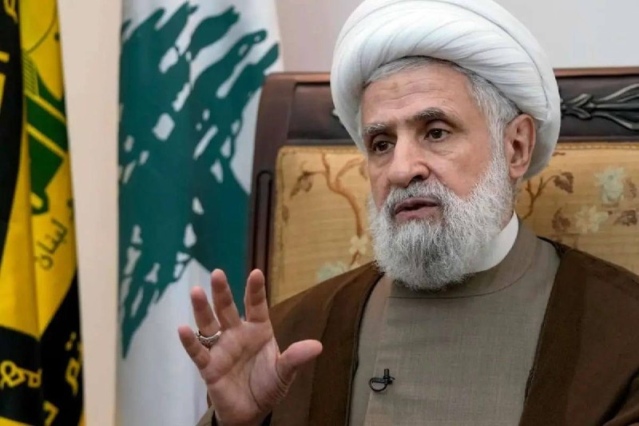

🔴دبیرکل حزب‌الله: حمایت‌های ایران باعث شد ما مقابل اشغالگری ایستادگی کنیم

💢شیخ نعیم قاسم دبیرکل حزب‌الله لبنان:

حمایت‌های جمهوری اسلامی ایران از همان آغاز تأسیس حزب‌الله در سال 1982 به فرمان امام خمینی و تداوم این پشتیبانی‌ها تحت نظارت امام خامنه‌ای و از طریق «سپاه پاسداران» به‌ویژه «نیروی قدس»، ما را قادر ساخت تا جنوب لبنان را در سال 2000 آزاد کنیم و تا به امروز در برابر تجاوزات مکرر بایستیم.

🫆:Tony

📌 @persian_trend_official
پرشین ترند | متفاوت‌ترین کانال نظامی

## persian_trend_official — post 14063

🔴 لاوروف: آمریکا به‌دنبال کنترل بازار جهانی انرژی است

💢سرگئی لاوروف، وزیر خارجه روسیه، در اظهاراتی دولت ترامپ را متهم کرده که تلاش می‌کند نفوذ خود را بر بازار جهانی انرژی «تحمیل» کند.

💢او گفته است هدف آمریکا این است که شرکت‌های انرژی روسیه مانند لوک‌اویل و روس‌نفت را از بازارهای بین‌المللی خارج کند و مسیرهای اصلی تأمین انرژی جهان را تحت کنترل خود بگیرد.

💢لاوروف همچنین تأکید کرده:
آمریکا در اسناد راهبردی خود به دنبال تسلط بر بازار انرژی جهانی است و قصد دارد همه مسیرهای مهم انرژی را تحت نفوذ خود قرار دهد.

🫆:Tony

📌 @persian_trend_official
پرشین ترند | متفاوت‌ترین کانال نظامی

## persian_trend_official — post 14061

🚨🇮🇱🇱🇧 حملات هوایی جدید اسرائیل دقایقی پیش مناطقی در لبنان را هدف قرار داد؛ همزمان منابع محلی از شنیده شدن صدای چندین انفجار خبر می‌دهند.

☆Phantom☆

📌 @persian_trend_official
پرشین ترند | متفاوت‌ترین کانال نظامی

## persian_trend_official — post 14059

ترامپ تمام افراد ثروتمند آمریکا را با Air Force One خود به پکن برده است.

📝 Nick

📌 @persian_trend_official
پرشین ترند | متفاوت‌ترین کانال نظامی

## persian_trend_official — post 14058

  <a href="telegram/content/persian_trend_official_14058_1778682470.mp4" target="_blank">🎬 Download video</a>

⭕️ فارس:

تصاویر دیده‌نشده از رزمایش ضد هلی‌برن سپاه تهران بزرگ

📝 Nick

📌 @persian_trend_official
پرشین ترند | متفاوت‌ترین کانال نظامی

## persian_trend_official — post 14057

  

⭕️ برخی از رسانه‌های فرانسوی دست به انتشار گزارشی به نقل از «فلورین تاردیف» خبرنگار «پاری‌مچ» زده‌اند که حکایت از روابط پنهانی امانوئل ماکرون و گلشیفته فراهانی دارد.

این خبرنگار فرانسوی در گزارش خود نوشته که سیلی که زن ماکرون به او در کنار در خروجی هواپیما زد، به خاطر همین رابطه بوده.

منبع خبر

📝 Nick

📌 @persian_trend_official
پرشین ترند | متفاوت‌ترین کانال نظامی

## persian_trend_official — post 14056

⭕️ در حالی که اینترنت در ایران به مدت ۷۵ روز قطع است، شرکت اپل دیروز به صورت رسمی اولین نمایندگی خود را در افغانستان افتتاح نمود. تکذیب شد. 📝 Nick 📌 @persian_trend_official پرشین ترند | متفاوت‌ترین کانال نظامی

## persian_trend_official — post 14055

  

🔴 ادعای وال‌استریت ژورنال درباره نقش امارات و سفر مقامات امنیتی اسرائیل

💢بر اساس گزارشی که به وال‌استریت ژورنال نسبت داده شده، گفته می‌شود رئیس موساد اسرائیل حداقل دو بار به‌صورت محرمانه به امارات متحده عربی سفر کرده تا درباره هماهنگی‌های مرتبط با درگیری‌های جاری با ایران گفت‌وگو کند.

▪️در این گزارش همچنین ادعا شده:

💢امارات فراتر از نقش دیپلماتیک عمل کرده و در برخی اقدامات نظامی علیه ایران نقش داشته است.

▪️از جمله، حمله به یک هدف نفتی در جزیره لاوان به امارات نسبت داده شده است.
▪️همچنین گفته شده امارات میزبان برخی سامانه‌ها و نیروهای مرتبط با دفاع هوایی اسرائیل بوده است.
▪️در ادامه، به سفرهای مشابه رئیس شین‌بت اسرائیل در همان بازه زمانی نیز اشاره شده است.

🫆:Tony

📌 @persian_trend_official
پرشین ترند | متفاوت‌ترین کانال نظامی

## persian_trend_official — post 14054

  <a href="telegram/content/persian_trend_official_14054_1778682475.mp4" target="_blank">🎬 Download video</a>

🔴 ترامپ وارد پکن شد

هواپیمای ریاست‌جمهوری آمریکا (ایرفورس وان) لحظاتی پیش در پایتخت چین به زمین نشست و دونالد ترامپ سفر خود را برای دیدار و نشست با شی جین‌پینگ آغاز کرد.

🫆:Tony

📌 @persian_trend_official
پرشین ترند | متفاوت‌ترین کانال نظامی

## persian_trend_official — post 14053

🔴 نشت سوخت نفتکش اماراتی پس از حمله پهپادی در سواحل عمان

💢خبرگزاری رویترز گزارش داد یک نفتکش وابسته به شرکت ملی نفت ابوظبی پس از حمله پهپادی منتسب به ایران در نزدیکی سواحل عمان دچار نشت محدود سوخت شده است.

💢بر اساس این گزارش:

▪️ نفتکش «برکه» همچنان در سواحل عمان لنگر انداخته است
▪️ شرکت اماراتی اعلام کرده مقدار کمی سوخت کشتی وارد آب شده است
▪️ این کشتی هنگام حمله بارگیری نشده بود
▪️ هیچ آسیبی به خدمه وارد نشده است

💢شرکت اماراتی اعلام کرده در حال همکاری با مقام‌های عمان و تیم‌های تخصصی برای مدیریت وضعیت است.

🫆:Tony

📌 @persian_trend_official
پرشین ترند | متفاوت‌ترین کانال نظامی

## OfficialPersiaTwiter — post 498334

دعوت از شيخ‌نشین‌های خلیج فارس برای حضور در نشست ناتو با محوریت جنگ ایران

🔹سازمان پیمان آتلانتیک شمالی (ناتو) قصد دارد از نمایندگان چهار کشور حوزه خلیج فارس برای حضور در نشست آنکارا دعوت کند.

🔹به گزارش ترکیه تودی، انتظار می‌رود وزرای خارجه کشورهای بحرین، کویت، قطر و امارات متحده عربی به نشست ۷ تا ۸ جولای (دو ماه دیگر) در پایتخت ترکیه دعوت شوند، اگرچه دفتر مطبوعاتی ناتو از اظهارنظر در این باره خودداری کرد.

🔹این نشست در پی افزایش تنش‌های فراآتلانتیک بر سر جنگ ایران برگزار می‌شود. دونالد ترامپ، رئیس‌جمهور آمریکا، متحدان ناتو را به دلیل عدم کمک برای بازگشایی تنگه هرمز مورد انتقاد قرار داده و متعاقباً از خروج حدود ۵۰۰۰ سرباز از آلمان خبر داد.

》OPT《

@OfficialPersiaTwiter

## OfficialPersiaTwiter — post 498333

  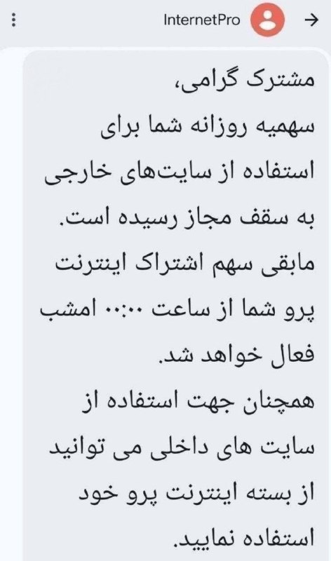

با اینترنت پرو فقط با حجم مشخص می‌توانید از سایت‌های خارجی استفاده کنید!

》OPT《

@OfficialPersiaTwiter

## OfficialPersiaTwiter — post 498332

‏برا زلزله باید کف خونه‌ها رو چسب ضربدری بزنیم؟ 》دودوک《 @OfficialPersiaTwiter

## OfficialPersiaTwiter — post 498331

رئیس ستاد ارتش رژیم اسرائیل:

🔹جنگ با ایران پایان نیافته است،
برای از سرگیری جنگ در هوشیاری کامل قرار داریم!

》OPT《

@OfficialPersiaTwiter

## OfficialPersiaTwiter — post 498329

آغاز مجدد حملات هوایی ارتش رژیم اسرائیل در لبنان؛ همزمان منابع محلی از شنیده شدن صدای چندین انفجار خبر می‌دهند.

》OPT《

@OfficialPersiaTwiter

## OfficialPersiaTwiter — post 498328

هشدار چین به آمریکا در مورد فروش تسلیحات به تایوان

🔹رویترز: چین امروز و پیش از دیدار ترامپ و «شی جین پینگ»، بار دیگر مخالفت شدید خود را با فروش تسلیحات آمریکا به تایوان اعلام کرد و از واشنگتن خواست به تعهدات خود در این زمینه عمل کند.

》OPT《

@OfficialPersiaTwiter

## OfficialPersiaTwiter — post 498327

بلومبرگ: جهش بی‌سابقه در تولید موشک‌های چین

بر اساس تحلیلی که بلومبرگ منتشر کرده، چین در سال گذشته میلادی تولید موشک‌های خود را به بالاترین میزان از زمان به قدرت رسیدن «شی جین پینگ»، رئیس‌جمهور این کشور در سال ۲۰۱۳ رسانده است.

بر اساس این گزارش، تعداد شرکت‌هایی که از تولید قطعات کلیدی موشک‌ها خبر داده‌اند، در سال گذشته به ۸۱ شرکت رسیده که این رقم بیش از دو برابر آمار سال اول ریاست‌جمهوری شی جین پینگ است.

تحلیل بلومبرگ حاکی از آن است که این گسترش موشکی نشان می‌دهد پکن انباری عظیم از موشک‌ها در اختیار دارد. در مقابل، ذخایر موشکی آمریکا بر اثر جنگ دونالد ترامپ، با ایران تخلیه شده و این مسئله نگرانی‌هایی را برای تایوان و متحدان واشنگتن در منطقه ایجاد کرده است.

》OPT《

@OfficialPersiaTwiter

## OfficialPersiaTwiter — post 498326

سنتکام: محاصره دریایی ایران همچنان پابرجاست /تغییر مسیر ۶۵ کشتی تجاری

🔹فرماندهی مرکزی ارتش آمریکا (سنتکام) اعلام کرد همچنان به اعمال محاصره علیه کشتی‌هایی که به داخل ایران وارد می‌شوند یا از آنها خارج می‌شوند، ادامه می‌دهند.
🔹سنتکام مدعی شد که در جریان این عملیات، مسیر ۶۵ کشتی تجاری را تغییر داده و چهار کشتی دیگر را از کار انداخته‌است.

》OPT《

@OfficialPersiaTwiter

## OfficialPersiaTwiter — post 498325

رویترز: عراق و پاکستان مجوز عبور از تنگه هرمز را از ایران گرفتند 🔹منابع مطلع به رویترز گفتند بغداد و اسلام‌آباد برای انتقال نفت و LNG از خلیج فارس، مجوز و هماهنگی لازم را از ایران دریافت کرده‌اند. 🔹به گفته رویترز، این موضوع نشان‌دهنده نقش و نفوذ ایران در…

## OfficialPersiaTwiter — post 498324

  

ادعای نشریه فرانسوی: سیلی خوردن امانوئل مکرون از همسرش به دلیل رابطه با گلشیفته فراهانی بود

فلوریان تاردیف:
مکرون چندين ماه با گلشیفته فراهانی، بازیگر ایرانی رابطه افلاطونی داشته (رابطه‌ای احساسی - عاطفی که جنبه فیزیکی نداره)؛

اتفاقا دلیل چَک خوردن رئیس‌جمهور فرانسه هم گلشیفته بوده؛ چون مکرون به این بازیگر ایرانی پیام داده بود که از نظر من تو خیلی زیاد خوشگلی و اینو زنش دیده بود...

》OPT《

@OfficialPersiaTwiter

## OfficialPersiaTwiter — post 498323

دولت سوریه به طور رسمی از روسیه خواسته است که بشار اسد را برای محاکمه و پاسخ دادن به جنایات جنگی تحویل بدهد.

》OPT《

@OfficialPersiaTwiter

## OfficialPersiaTwiter — post 498322

لیونل مسی همچنان پردرآمدترین ورزشکار در لیگ آمریکا است

🔹مسی با دو برابر کردن حقوق پایه خود در اینتر میامی، سالانه ۲۸ میلیون دلار درآمد خواهد داشت.
🔹 الجزیره نوشت: انجمن بازیکنان MLS می‌گوید: لیونل مسی با حقوق پایه سالانه ۲۵ میلیون دلار، بیش از دو برابر سون هیونگ مین، دومین بازیکن پردرآمد، همچنان پردرآمدترین بازیکن لیگ برتر فوتبال است.
🔹طبق آمار منتشر شده، حقوق پایه مسی دو برابر شده است، در حالی که در مجموع این قرارداد او را به ۲۸.۳ میلیون دلار تضمین شده می‌رساند. آخرین فهرست حقوق بازیکنان که توسط اتحادیه منتشر شده نشان می‌دهد که مسی تا سال ۲۰۲۸ در این تیم فلوریدایی حضور خواهد داشت.
🔹سون، ستاره کره جنوبی و کاپیتان سابق تاتنهام که در ماه اوت گذشته با مبلغ رکوردشکن ۲۶ میلیون دلار در نقل و انتقالات MLS با لس‌آنجلس اف‌سی قرارداد امضا کرد، حقوق پایه ۱۰.۳۶ میلیون دلار دارد و مجموع حقوق تضمین‌شده او ۱۱.۲ میلیون دلار است/شفقنا

》OPT《

@OfficialPersiaTwiter

## OfficialPersiaTwiter — post 498321

ایتالیا اعلام کرده می‌تواند دو فروند مین‌روب به عنوان بخشی از یک مأموریت بین‌المللی به تنگه هرمز اعزام کند، اما فقط در صورتی که آتش‌بس پایدار برقرار شود.

🔹گویدو کروستو، وزیر دفاع ایتالیا، در سخنرانی خود در پارلمان گفت که برای هرگونه استقرار نیرو، باید «آتش‌بس واقعی، قابل اعتماد و پایدار، یا بهتر از آن، صلح قطعی» برقرار شده باشد.

🔹او افزود که رسیدن مین‌روب‌ها به منطقه هفته‌ها طول می‌کشد و ایتالیا ابتدا آن‌ها را به صورت «پیش‌استقرار» به شرق مدیترانه و سپس به دریای سرخ می‌فرستد.

🔹کروستو گفت: «صرفاً به عنوان یک اقدام احتیاطی، … در حال ترتیب دادن این هستیم که دو مین‌روب در موقعیتی نسبتاً نزدیک‌تر به تنگه مستقر شوند.»/انتخاب

》OPT《

@OfficialPersiaTwiter

## OfficialPersiaTwiter — post 498320

توافق بایرن مونیخ با نویر ۴۰ ساله برای تمدید قرارداد

🔹شبکه تلویزیونی «اسکای اسپورت» آلمان خبر داد که بایرن مونیخ و نویر 40 ساله برسر تمدید یکساله قرارداد به توافق کامل رسیده‌اند. طبق این گزارش؛ دروازه‌بان کهنه‌کار باوارایی‌ها با کاهش دستمزدش موافقت کرده و اگر همه چیز طبق برنامه پیش برود، انتظار می‌رود که قرارداد جدید تا پیش از بازی یکشنبه با اف‌سی کلن در چارچوب هفته پایانی بوندس‌لیگا امضا شود.

》OPT《

@OfficialPersiaTwiter

## OfficialPersiaTwiter — post 498319

  <a href="telegram/content/OfficialPersiaTwiter_498319_1778682479.mp4" target="_blank">🎬 Download video</a>

تیراندازی در مجلس سنای فیلیپین

به گزارش رویترز حداقل 12 گلوله در مجلس سنای فیلیپین شلیک شد اما یکی از نمایندگان تاکید کرد در این حادثه هیچ فردی زخمی یا کشته نشده است.

هنوز علت این حادثه اعلام نشده است.

》OPT《

@OfficialPersiaTwiter

## OfficialPersiaTwiter — post 498318

امروز هیچ مراسم عمومی برای ترامپ برگزار نمی‌شود

دونالد ترامپ، از هواپیمای ریاست جمهوری در پکن پیاده شد و مورد استقبال مقامات چینی و جمعیت مشتاق قرار گرفت.

ترامپ پس از ورودش هیچ مراسم عمومی دیگری ندارد، اما قرار است روزهای پنجشنبه و جمعه چندین بار با رئیس جمهور شی جین پینگ دیدار کند.

این دیدار در برهه‌ای حساس از ریاست جمهوری ترامپ انجام می‌شود، زیرا محبوبیت او در داخل کشور به دلیل جنگ آمریکا و اسرائیل علیه ایران و افزایش تورم در نتیجه این درگیری کاهش یافته است.

رئیس جمهور با امضای قراردادهایی با چین برای خرید بیشتر مواد غذایی و هواپیماهای آمریکایی به دنبال پیروزی است و قبل از عزیمت گفت که با شی جین پینگ "بیش از هر چیز دیگری" در مورد تجارت صحبت خواهد کرد.

》OPT《

@OfficialPersiaTwiter

## OfficialPersiaTwiter — post 498317

  <a href="telegram/content/OfficialPersiaTwiter_498317_1778682482.mp4" target="_blank">🎬 Download video</a>

استقبال از ترامپ در فرودگاه پکن

》OPT《

@OfficialPersiaTwiter

## OfficialPersiaTwiter — post 498316

  <a href="telegram/content/OfficialPersiaTwiter_498316_1778682485.mp4" target="_blank">🎬 Download video</a>

ترامپ به همراه ایلان ماسک وارد پکن شد

》OPT《

@OfficialPersiaTwiter

## OfficialPersiaTwiter — post 498315

  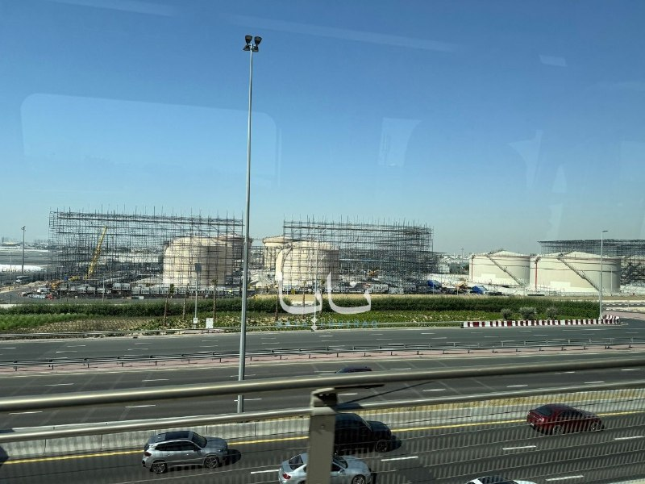

امارات شروع به نصب موانع ضد پهپاد در اطراف انبارهای نفت نزدیک فرودگاه بین‌المللی دبی از طریق سازه‌ها و شبکه‌های فلزی کرده است.

》OPT《

@OfficialPersiaTwiter

## bbcpersian — post 280930

  <a href="telegram/content/bbcpersian_280930_1778682487.mp4" target="_blank">🎬 Download video</a>

🔻رسانه‌های ایران از برگزاری رزمایش پنج روزه سپاه تهران بزرگ با محوریت مقابله با عملیات «هلی برن» نیروهای متخاصم برای پیاده کردن سرباز در خاک ایران خبر دادند.

به نوشته خبرگزاری فارس این رزمایش برای «تقابل با تهدیدات احتمالی اجرا شده و در آن رده‌های تابعه سپاه تهران بزرگ شامل؛ لشکر ۲۷ محمد رسول‌الله، تیپ یکم امنیت حضرت زهرا، تیپ دوم امنیت آل محمد و یگان فاتحین حضور داشته‌‌اند.»

در تصاویری که فارس و تسنیم نزدیک به سپاه پاسداران از این رزمایش منتشر کردند، گروهی از نیروهای پیاده، موتورسوار و وانت‌سوار با سلاح‌های سبک، نیمه‌سنگین و پهپاد به اهداف فرضی تعیین‌شده از جمله تصویر یک هلی‌کوپتر شلیک می‌کنند.
‌
پیشتر در فروردین ۱۴۰۵ و در جریان عملیات جستجو و نجات خلبان دوم جنگنده اف-۱۵ آمریکا که مورد هدف قرار گرفته و در مناطق کوهستانی جنوب غربی ایران سرنگون‌شده بود، تصاویری از ورود هلی‌کوپترهای بلک‌هاوک و هواپیمای تانکر سوخت‌رسان به خاک ایران و شلیک ماموران پلیس و شماری از مردم محلی به آنها منتشر شد.
متن کامل این گزارش را اینجا بخوانید.

@BBCPersian

## bbcpersian — post 280929

  <a href="telegram/content/bbcpersian_280929_1778682489.mp4" target="_blank">🎬 Download video</a>

🔻سرخط خبرهای چهارشنبه ۲۳ اردیبهشت ۱۴۰۵

@BBCPersian

## bbcpersian — post 280928

🔻تشدید حملات اسرائیل به غزه از زمان آغاز آتش‌بس ایران

اسرائیل در پنج هفته‌ای که از آتش‌بس در ایران گذشته، حملات به غزه را تشدید کرده است.

بر اساس اعلام اداره بهداشت غزه، که حماس آن را اداره می‌کند، از زمان توقف جنگ در ایران در ۸ آوریل، ۱۲۰ فلسطینی کشته شده‌اند؛ این تلفات ۲۰ درصد بیشتر از زمانی است که اسرائیل به همراه آمریکا در جنگ با ایران مشارکت داشت.

سازمان دیده‌بان درگیری‌ها، «اکلد»، که داده‌های مربوط به مکان و رویداد درگیری‌های مسلحانه در جهان، از جمله حملات اسرائیل به غزه را رصد می‌کند، در گزارش ماهانه خود اعلام کرد که اسرائیل ماه گذشته(آوریل) ۳۵ درصد حملات بیشتری در مقایسه با ماه مارس در این باریکه انجام داد.

این افزایش حملات نشانه دیگری از پیشرفت‌های متوقف شده در طرح دونالد ترامپ برای پایان جنگ در غزه و آغاز بازسازی آنجاست.

یک مقام نظامی اسرائیل که نخواست نامش فاش شود به رویترز گفت، آتش‌بس غزه به اسرائیل اجازه می‌دهد تا علیه «تهدیدات قریب‌الوقوع» اقدام کند.

او همچنین گفت که ارتش اسرائیل «برای هر سناریویی آماده است»؛ از جمله برنامه‌های جنگی گسترده‌تری برای از سرگیری جنگ در غزه تدوین شده است، هرچند هنوز هنوز چنین دستوری داده نشده است.

@BBCPersian

## bbcpersian — post 280921

🔻روابط ایران و آمریکا در یکی از پیچیده‌ترین بن‌بست‌های دهه‌های اخیر گرفتار شده است. پس از گذشت بیش از ده هفته از آغاز حملات آمریکا و اسرائیل علیه ایران و در حالی که آتش‌بسی شکننده برقرار است، دو طرف از طریق میانجی‌هایی مانند پاکستان همچنان در حال چانه‌زنی هستند.

تبادل پیشنهادها و پاسخ‌ها در حالی انجام می‌شود که پنج موضوع محوری، به عنوان موارد اصلی اختلافات حل‌نشده میان ایران و آمریکا مطرح است: برنامه غنی‌سازی اورانیوم، سرنوشت ذخایر اورانیوم غنی‌شده در ایران، کنترل و آزادی تردد در تنگه هرمز، فعالیت‌های گروه‌های نیابتی ایران در منطقه و برنامه موشکی بالستیک.

دونالد ترامپ،‌ رئیس‌جمهور آمریکا، پاسخ ایران به آخرین پیشنهاد آمریکا را «کاملا غیرقابل قبول» خوانده و بار دیگر تاکید کرده است که آمریکا هرگز اجازه نخواهد داد ایران به سلاح هسته‌ای دست یابد.

بیشتر بخوانید:
https://bbc.in/4wsm0ag
📷Getty Images
@BBCPersian

## bbcpersian — post 280920

🔻نشت سوخت در سواحل عمان یک هفته پس از حمله ایران به یک نفت‌کش

یک واحد وابسته به شرکت ملی نفت ابوظبی روز چهارشنبه اعلام کرد که یک نفت‌کش‌ این شرکت که هفته گذشته هدف حمله پهپادهای جمهوری اسلامی قرار گرفت، مقدار کمی سوخت در سواحل عمان نشت داده است که این موضوع از خطرات زیست‌محیطی ناشی از جنگ آمریکا و اسرائیل با ایران حکایت دارد.

بسته شدن تنگه هرمز، دریانوردی در این آبراه حیاتی کشتیرانی را به مسیری پرخطر تبدیل کرده است و هم اکنون صدها کشتی در خلیج فارس گرفتارند.

شرکت لجستیک و خدمات «ادنوک» اعلام کرد که وضعیت مربوط به کشتی خود، «ام‌وی‌باراکا»، را زیر نظر دارد و «با مقامات مربوطه و تیم‌های واکنش تخصصی» در حال همکاری است.

سخنگوی این شرکت گفت: «کشتی باراکا، متعلق به شرکت ادنوک، پس از آنکه در تاریخ ۴ مه توسط دو پهپاد ایرانی هدف قرار گرفت، همچنان در سواحل عمان لنگر انداخته است. متاسفانه مقدار کمی از آنچه که گمان می‌رود سوخت بانکر باشد، در نتیجه این اتفاق ریخته شده است.»

او البته درباره حجم نشت اظهار نظر نکرد.

در زمان حمله، این نفت‌کش هیچ محموله‌ای حمل نمی‌کرد و خدمه هم آسیب ندیدند.

@BBCPersian

## bbcpersian — post 280919

  

هواپیمای حامل دونالد ترامپ و همراهانش دقایقی پیش در پکن به زمین نشست.

دونالد ترامپ در حالی وارد پکن شده است که اولین سفر رسمی یک رئیس جمهور آمریکا به چین را در تقریبا یک دهه گذشته آغاز می‌کند.

انتظار می‌رود که مذاکرات آقای ترامپ با شی جین پینگ، رئیس جمهور چین، شامل روابط تجاری پرتنش آنها، جنگ در ایران و فروش تسلیحات آمریکا به تایوان باشد.

آقای ترامپ که با یک هیئت تجاری بلندپایه سفر می‌کند، قرار است با استقبال باشکوهی از جمله توقف در ژونگ‌نان‌های، مجتمع محل زندگی و کار رهبران چین، روبرو شود.

هیئتی از رهبران تجاری جمله جنسن هوانگ، مدیرعامل انویدیا و ایلان ماسک، رئيس‌جمهور آمریکا را در این سفر همراهی می‌کنند.

ساعاتی پیش از ورود او، مقامات چین و ایالات متحده مذاکرات تجاری را در کره جنوبی برگزار کردند و هر دو طرف مشتاق بودند از اعمال مجدد تعرفه‌های بیش از حد جلوگیری کنند. رسانه‌های دولتی چین این مذاکرات را صریح، عمیق و سازنده توصیف کردند.

📷Getty Images
@BBCPersian

## bbcpersian — post 280918

  

🔻 بریتانیا اعلام کرده است که پهپادها و جت‌های جنگنده و نیز یک کشتی جنگی را به ماموریت مشترکی با هدف حفاظت از کشتیرانی در تنگه هرمز اعزام خواهد کرد.

جان هیلی، وزیر دفاع بریتانیا، این بسته را در نشست مجازی وزرای دفاع چندین کشور در روز سه‌شنبه (۱۲ مه) اعلام کرد. این بسته شامل سیستم‌های خودکار برای شناسایی و پاکسازی مین‌های دریایی، قایق‌های بدون سرنشین، و جت‌های تایفون برای گشت‌های هوایی است.

بیش از ۴۰ کشور دیگر هم در این ماموریت شرکت دارند که به گفته آقای هیلی، زمانی که شرایط مهیا باشد آغاز خواهد شد.

ماه‌هاست که ایران در تلافی حملات آمریکا و اسرائیل که ۲۸ فوریه (۹ اسفند) آغاز شد، در تنگه هرمز که یکی از شلوغ‌ترین کانال‌های حمل‌ونقل نفت جهان است، اعمال کنترل و ایجاد ناامنی کرده است.

آمریکا هم به نوبه خود، برای اعمال فشار بر تهران جهت پذیرش شرایطش، بنادر ایران را مسدود کرده است؛ اقدامی که ایران را خشمگین کرده است.

بیشتر بخوانید:
https://bbc.in/4ffIRQ3
📸UK MOD Crown copyright
@BBCPersian

## bbcpersian — post 280917

  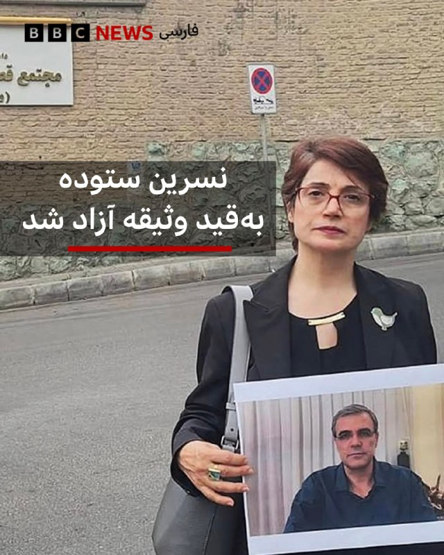

🔻نسرین ستوده، وکیل دادگستری و فعال حقوق بشر، امروز چهارشنبه ۲۳ اردیبهشت به قید وثیقه آزاد شد.

این خبر در صفحه مهراوه خندان، فرزند خانم ستوده منتشر شد.

چهارشنبه ۱۲ فروردین ۱۴۰۵، این وکیل دادگستری و فعال سیاسی در خانه خود در تهران بازداشت شد. نیروهای امنیتی حین بازداشت تمامی لوازم الکترونیک شخصی، از جمله گوشی موبایل و لب‌تاپ او را ضبط کردند.

نسرین ستوده، از اوایل دهه ۸۰، وکالت پرونده‌هایی را به عهده گرفت که برای حاکمیت حساسیت امنیتی داشتند.

او بارها بازداشت، محرومیت از وکالت و با احکام زندان طولانی روبه‌رو شد.

همسرش رضا خندان، یک فعال مدنی و سیاسی است که هم اکنون در زندان به‌سر می‌برد.

📷Mehraveh Khandan
خانم خندان با انتشار این تصویر نوشت: عکس قدیمی است و متاسفانه به‌دلیل قطعی اینرنت عکس جدیدی پس از آزادی به دستم نرسیده است.
@BBCPersian

## bbcpersian — post 280915

🔻حمله اسرائیل به دو خودرو در جنوب بیروت

خبرگزاری دولتی لبنان گزارش داد که اسرائیل طی دو حمله جداگانه روز چهارشنبه دو خودرو را در منطقه جیه لبنان در جنوب بیروت هدف قرار داد.

اطلاعاتی در مورد تلفات این دو حمله و اهداف احتمالی آن منتشر نشده است.

در حملات روز سه‌شنبه اسرائیل به لبنان هم ۱۳ نفر از جمله دو امدادگر کشته شدند.

ارتش اسرائیل اعلام کرده که به اهداف حزب‌الله حمله می‌کند و برای چندین روستا هشدار تخلیه صادر کرده است.

آتش‌بسی که ماه گذشته به اجرا درآمد، نتوانسته است جنگ را متوقف کند. وزارت بهداشت لبنان می‌گوید که از زمان آغاز آتش‌بس، ۳۸۰ نفر کشته شده‌اند.

@BBCPersian

## Tans_Footbali — post 236265

  

🇮🇱ایال زامیر ، رئیس ستاد ارتش اسرائیل:

«نبرد تمام نشده است، ارتش اسرائیل آماده از سرگیری نبرد در صورت نیاز از کرانه باختری تا تهران است»

@Tans_Footbali

## hamclasixii — post 75354

🔴معاون ارتباطات دفتر رئیس‌جمهور: اینترنت بین‌الملل حتما وصل می‌شود

🔹دسترسی به اینترنت همانند بسیاری از خدمات عمومی، حق طبیعی شهروندان است و دولت نیز قصد سلب این حق را ندارد، اما در شرایط خاص و اضطراری، مسئله امنیت کشور بر بسیاری از حوزه‌های دیگر تقدم پیدا می‌کند.

📚 @hamclasix 📚

## hamclasixii — post 75353

  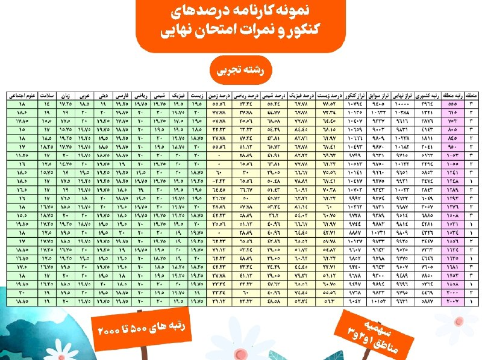

🔴24 نمونه کارنامه درصدهای کنکور و نمرات امتحان نهایی - کنکور 1404

🔹رتبه‌های ۵۰۰ تا ۲۰۰۰
🔹منطقه ۱، ۲، ۳
🔹رشته تجربی

📚 @hamclasix 📚

## withyashar — post 11154

  <a href="telegram/content/withyashar_11154_1778682497.mp4" target="_blank">🎬 Download video</a>

بی‌حرکت ایستادن کامل افسر چینی هنگام عبور هواپیمای رئیس جمهور آمریکا (ایر فورس وان) در چند متری او، توجه بسیاری از رسانه‌ها را به خود جلب کرد
@withyashar

## withyashar — post 11153

یک مقام ارشد کُرد در گفتگو با کانال۱۳ اسرائیل:
در واقع خود پرزیدنت ترامپ مانع از طرح اقدام ما علیه حکومت ایران شد و اتهامات او در مورد ضبط سلاح های معترضین در ایران توسط کُردها، ناعادلانه و غیرمنطقی است
@withyashar

## withyashar — post 11152

اتاق جنگ با شما : گزارش از جنگنده های ناشناس پرواز در ارتفاع پایین در‌ ارومیه و انفجار در شیراز
@withyashar

## withyashar — post 11151

ایال زامیر ، رئیس ستاد ارتش اسرائیل:
نبرد تمام نشده است، ارتش اسرائیل آماده از سرگیری نبرد در صورت نیاز از کرانه باختری تا تهران است
@withyashar

## withyashar — post 11150

  

برنامه های ترامپ با حاکم چین به این ترتیبه : مراسم استقبال تو تالار بزرگ خلق
چهارشنبه رسیدن به پکن ، استقرار و استراحت
پنج شنبه ۱۴ مه
- ملاقات با شی - ضیافت دولتی با شی

جمعه تاریخ ۱۵ مه
- جلسه عکس با شی- چای با شی
- ناهار با شی و حرکت از پکن به آمریکا،
@withyashar

## withyashar — post 11149

  <a href="telegram/content/withyashar_11149_1778682501.mp4" target="_blank">🎬 Download video</a>

لحظه ورود ترامپ به چین-پکن همراه ایلان ماسک و همراهان
@withyashar

## withyashar — post 11148

بلومبرگ: صادرات نفت ایران از جزیره خارک برای اولین بار از زمان شروع جنگ متوقف شده است و تصاویر ماهواره‌ای نشان می‌دهد که مخازن ذخیره‌سازی نفت تقریباً به ظرفیت کامل خود رسیده‌اند.
@withyashar

## withyashar — post 11147

  

ترامپ به پکن رسید
@withyashar

## withyashar — post 11146

  

امانوئل مکرون ظاهراً برای چندین ماه با بازیگر ایرانی گلشیفته فراهانی رابطه‌ای داشته که شامل «پیام‌هایی بوده که گفته می‌شود تا حد زیادی پیش رفته بودند». این موضوع ظاهراً باعث تنش در زندگی مشترک زوج ریاست‌جمهوری فرانسه شده …گفته می‌شود سیلی‌ای که سال گذشته بریژیت به امانوئل مکرون زد، به پیامی مربوط بوده که در تلفن رئیس‌جمهور پیدا شده بود. بانوی اول فرانسه ظاهراً گفت‌وگویی با یک بازیگر ایرانی دیده که در آن، امانوئل مکرون نوشته بوده: «تو خیلی زیبا هستی.
@withyashar

---
📅 بروزرسانی: 1405/02/23 15:23
---

## persian_trend_official — post 14051

⭕️ در حالی که اینترنت در ایران به مدت ۷۵ روز قطع است، شرکت اپل دیروز به صورت رسمی اولین نمایندگی خود را در افغانستان افتتاح نمود.

📝 Nick

📌 @persian_trend_official
پرشین ترند | متفاوت‌ترین کانال نظامی

## persian_trend_official — post 14050

  

🔴 امارات اطراف مخازن نفتی دبی موانع ضدپهپادی نصب می‌کند

گزارش‌ها حاکی است امارات روند نصب موانع و سازه‌های ضدپهپادی را در اطراف مخازن نفتی نزدیک فرودگاه بین‌المللی دبی آغاز کرده است.

بر اساس اطلاعات منتشرشده:

▪️ این موانع شامل سازه‌ها و شبکه‌های فلزی هستند
▪️ هدف از این اقدام، مقابله با تهدید پهپادهای انتحاری و حملات هوایی کم‌ارتفاع عنوان شده است
▪️ مخازن نفتی و زیرساخت‌های انرژی اطراف دبی در هفته‌های اخیر تحت تدابیر امنیتی شدیدتری قرار گرفته‌اند

🫆:Tony

📌 @persian_trend_official
پرشین ترند | متفاوت‌ترین کانال نظامی

## persian_trend_official — post 14049

  <a href="telegram/content/persian_trend_official_14049_1778673199.webm" target="_blank">🎬 Download video</a>

فارس | فیلم سینمایی حمله‌ٔ اف-۵های ایران به پایگاه آمریکا تولید می‌شود

💢فیلم سینمایی «ببرها» روایت حمله‌ٔ تاریخی و حماسی ۲ جنگندهٔ اف-۵ نیروی هوایی ارتش به پایگاه آمریکایی بوهرینگ کویت در روز دوم جنگ رمضان به نویسندگی مهدی یزدانی‌خرم و تهیه‌کنندگی حبیب والی‌نژاد تولید خواهد شد.

🫆:Tony

📌 @persian_trend_official
پرشین ترند | متفاوت‌ترین کانال نظامی

## persian_trend_official — post 14048

  

🔴تویت خواهر جاوید نام ‎#مجتبی_روستایی ؛

از افتخارات ما خوانواده جاوید نامان اين است که با افتخار پیکر عزیزانمون رو تشیع کرديم 💔
و یکی از ذلت بارترین افتخارات عرزشیها، ۴ماه جنازه روی دستشون مونده ،دريغ از یه تشیع پنهانی!

📣@persian_trend_official

## persian_trend_official — post 14047

  <a href="telegram/content/persian_trend_official_14047_1778673201.mp4" target="_blank">🎬 Download video</a>

💢تصاویر ماهواره ای با کیفیت از میزان تخریب سایت نظامی یزد زیر ضرب حملات امریکا و اسرائیل

🫆:Tony

📌 @persian_trend_official
پرشین ترند | متفاوت‌ترین کانال نظامی

## persian_trend_official — post 14046

⭕️ طبق گزارش وال استریت ژورنال، دیوید بارنیا، رئیس موساد، حداقل دو بار در طول جنگ به امارات متحده عربی سفر کرد تا هماهنگی کمپین علیه ایران (جمهوری اسلامی) را انجام دهد.

📝 Nick

📌 @persian_trend_official
پرشین ترند | متفاوت‌ترین کانال نظامی

## persian_trend_official — post 14045

  <a href="telegram/content/persian_trend_official_14045_1778673203.webm" target="_blank">🎬 Download video</a>

📝 Nick

📌 @persian_trend_official
پرشین ترند | متفاوت‌ترین کانال نظامی

## persian_trend_official — post 14044

  <a href="telegram/content/persian_trend_official_14044_1778673204.mp4" target="_blank">🎬 Download video</a>

🔴در فلوریدا، یک آتش‌نشان در حین مهار آتش‌سوزی‌های جنگلی که تاکنون بیش از 48500 هکتار را سوزانده است، جان خود را از دست داد

💢به گزارش رسانه ها حداقل 120 خانه در جورجیا ویران شده است.

💢مقامات ایالتی آمریکا آتش‌سوزی‌های جنگلی فعلی را از مخرب‌ترین آتش‌سوزی‌ها در ده سال گذشته می‌دانند. خشکسالی و گرمای هوا مقصر هستند.

🫆:Tony

📌 @persian_trend_official
پرشین ترند | متفاوت‌ترین کانال نظامی

## persian_trend_official — post 14043

⭕️ علی‌حسین قاضی زاده:

احمقانه‌ترین پرسش این روزها این است که «آیا موافق جنگ هستید یا خیر؟»
ساده‌ترین پاسخ این پرسش احمقانه این است که خیر.

چه کسی می‌تواند در حالت کلی موافق جنگ باشد؟
اما جنگ گاهی ابزاری است برای پیشگیری از کشته شدن بیشتر.
اگر جنگ ۱۲روزه به سقوط حکومت منجر می‌شد، کشتار ۱۸ و ۱۹ دی رخ می‌داد؟
این همه اعدام ادامه می‌یافت؟
اگر جنگ چیزی جز سیاهی مطلق نیست، چرا بخش بزرگی از مردم ایران، کمک نظامی را برای ساقط کردن این حکومت طلب کرده‌اند؟
وقتی در کره شمالی زندگی می‌کنید یا در ایران زیر حکومت ج.ا. پرسش اصلی این نیست فلان مسیر برای مردم هزینه‌ای دارد یا خیر، سوال این مردمان این است که کدام مسیر با حداقل هزینه، به نجات کشور منجر می‌شود.
ممکن است پاسخ این سوال، جلب حمایت نظامی یا همان جنگ باشد.
جنگ سیاه است اما وقتی در ایران یا کره شمالی زندگی می‌کنید، سیاه‌تر از جنگ، تداوم این حکومت‌هاست.

📝 Nick

📌 @persian_trend_official
پرشین ترند | متفاوت‌ترین کانال نظامی

## persian_trend_official — post 14042

  

شات گان اون هم با لوله کروم که زیر نور آفتاب طوری برق میزنه که از یک کیلومتری دیده میشه. تو آمریکا حتی غیر نظامی هایی که عشق اسلحه هستن و سرشون در میاد هم اگر اسلحه با لوله کروم بخری مسخرت میکنن میگن باربی جواهرآلات جدید خریده! سپاه روز به روز از یک نیروی…

## OfficialPersiaTwiter — post 498310

  

یه خبر جالب و عجیب در فرانسه

یک دختر ۱۹ ساله سه هفته در کما بوده، در این سه هفته در یک دنیای موازی هفت سال زندگی کرده، عاشق شده، ازدواج کرده و سه قلو به دنیا آورده که یکی از بچه هاش رو از دست داده.
حالا که به هوش اومده، داره برای بچه هاش که توی اون دنیا موندن گریه و عزاداری می‌کنه!

》OPT《

@OfficialPersiaTwiter

## OfficialPersiaTwiter — post 498309

هشدار نسبت به احتمال رخداد طوفان در تهران

اداره کل هواشناسی استان تهران:
🔹شب چهارشنبه تا صبح پنج شنبه (۲۳ تا ۲۴ اردیبهشت‌ماه) در نیمه جنوبی، غربی، مناطق مرکزی و ارتفاعات وزش باد خیلی شدید و احتمال رخداد طوفان و در مناطق جنوبی و غربی گاهی خیزش یا انتقال گرد و خاک و کاهش محسوس شعاع دید پیش‌بینی می‌شود.
🔹کاهش محسوس دما از شنبه تا صبح دوشنبه بین ۴ تا ۶ درجه سلسیوس به‌ویژه در مناطق شمالی پیش‌بینی می‌شود.

》OPT《

@OfficialPersiaTwiter

## OfficialPersiaTwiter — post 498308

  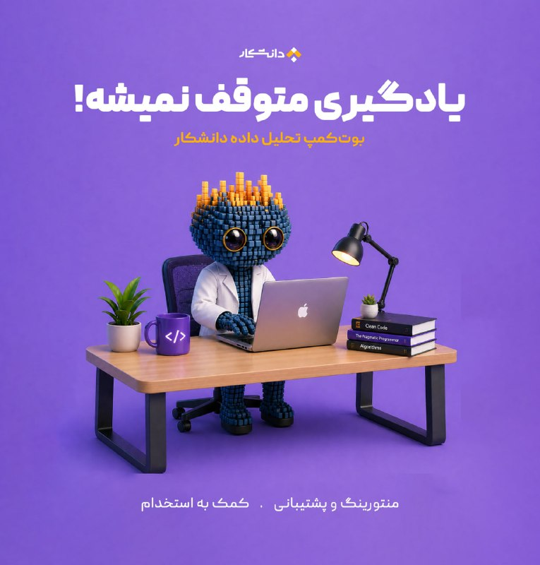

یادگیری توقف نداره!
لپ‌تاپ و لیوان قهوه‌ات رو آماده کن☕️
چون با دانشکار قراره به یه تحلیل‌گر داده حرفه‌ای تبدیل بشی💻
🌱 بهار امسال یادگیری رو با بوت‌کمپ Data Analysis دانشکار ادامه بده
و صفر تا صد تحلیل داده رو در ۵ ماه یاد بگیر👇
🔗https://dnkr.ir/2QAMQ

## OfficialPersiaTwiter — post 498307

نان گران نشده است

رئیس کارگروه آرد و نان:
🔹قیمت‌های جدید نرخ نان که در فضای مجازی دست به دست می‌شود اشتباه است و نرخ جدیدی برای نان تصویب نشده است.

🔹از دیروز فهرست قیمت‌های جدید نان در فضای مجازی می‌چرخد و حتی در خیابان‌ها مردم از افزایش قیمت از امروز خبر می‌دادند.

🔹هفتهٔ گذشته بررسی هزینه‌ها طبق روال سالانه به سازمان حمایت از مصرف‌کنندگان و تولیدکنندگان ارسال شده و آنها هنوز تصمیم جدیدی ابلاغ نکرده‌اند.

》OPT《

@OfficialPersiaTwiter

## OfficialPersiaTwiter — post 498306

  

ترامپ نسخه‌ای از پوستر نمادین جنگ جهانی اول «من تو را برای ارتش ایالات متحده می‌خواهم» اثر جیمز مونتگومری فلاگ را منتشر کرده است که خودش جایگزین او شده است: «من تو را می‌خواهم!»

》OPT《

@OfficialPersiaTwiter

## OfficialPersiaTwiter — post 498305

نرخ رشد جمعیت نسبت به سال قبل در ایران همچنان منفی‌ است

معاون وزیر بهداشت:
🔹آمار تولدها به زیر ۹۰۰ هزار نفر رسیده بود و در سال ۱۴۰۳ تعداد ۹۷۳ هزار نفر موالید داشتیم که در سال ۱۴۰۴ به ۸۹۲ هزار و ۲۶۸ نفر رسیده است. این آمار نشانگر سیر نزولی جمعیت است هرچند شیب کاهش جمعیت کند شده است.

》OPT《

@OfficialPersiaTwiter

## OfficialPersiaTwiter — post 498303

روز گذشته شرکت اپل به صورت رسمی اولین نمایندگی خود را در کشور افغانستان افتتاح کرد.

》OPT《

@OfficialPersiaTwiter

## OfficialPersiaTwiter — post 498301

گزارش مرکز ژئوفیزیک از شدت ۹ زمین‌لرزه بالای ۲.۵ ریشتر در پردیس از روز گذشته تاکنون 🔹ساعت ۲۰:۴۱ — بزرگی ۳.۴ ریشتر 🔹 ساعت ۲۳:۴۶ — بزرگی ۴.۶ ریشتر 🔹 ساعت ۲۳:۵۰ — بزرگی ۲.۶ ریشتر 🔹 ساعت ۰۰:۲۰ — بزرگی ۲.۶ ریشتر 🔹 ساعت ۰۰:۲۶ — بزرگی ۴ ریشتر 🔹 ساعت ۰۰:۳۲…

## OfficialPersiaTwiter — post 498300

ساعات کاری بانک‌ها از ۲۶ اردیبهشت تغییر می کند تمامی شعب بانک‌ها در سراسر کشور موظف‌اند در بازه زمانی ۲۶ اردیبهشت تا ۱۵ شهریورماه فعالیت روزانه خود را از ساعت ۷صبح آغاز کرده و در ساعت ۱۳ به پایان برسانند. 》OPT《 @OfficialPersiaTwiter

## OfficialPersiaTwiter — post 498299

  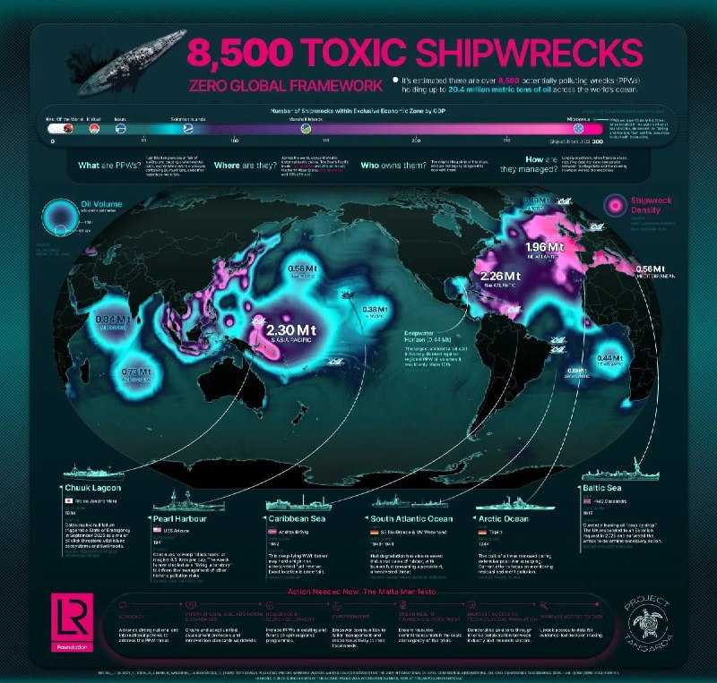

برآورد می‌شود که در کف اقیانوس‌ها ۱۱۳ میلیون بشکه نفت در داخل کشتی‌هایی که در طول جنگ جهانی دوم غرق شده‌اند، وجود دارد. یعنی تقریباً معادل حجم تولید روزانه نفت در جهان در حال حاضر

》OPT《

@OfficialPersiaTwiter

## OfficialPersiaTwiter — post 498298

تولید کنندگان کیف و کفش و لباس کاش بتونید جلوی خودتونو بگیرید لوگوی dior,Chanel,versace٫ysl نزنید روی محصولات
به خدا اینارو نزنید شیک تره :/

》zeinab《

@OfficialPersiaTwiter

## OfficialPersiaTwiter — post 498297

  <a href="telegram/content/OfficialPersiaTwiter_498297_1778673210.webm" target="_blank">🎬 Download video</a>

🛍 خرید اشتراک gemini pro تنها با 299 هزار تومان در پریم استور.

اقتصادی ترین گزینه حال حاضر

❔ چرا پریم استور؟

🕖تحویل سریع (بین 1 تا 3 ساعت)

🔒  بدون نیاز به اطلاعات و لاگین حساب شما
ضمانت کامل 30 روز
علاوه بر جمنای، اشتراک سرویس‌های زیر هم برای خرید موجود است:

(Claude • Chatgpt plus, go  • Grok • Perplexity • Cursor • Leonardo • Gemini ultra •.....)

🛒 شروع خرید از طریق ربات :

🤖 @prem_store_bot

🌐 وب سایت | 
💡 کانال تلگرام | 
💬 ارتباط با پشتیبانی

## OfficialPersiaTwiter — post 498296

انجام آزمون، مصاحبه و دریافت شهریه در مدارس هیئت امنایی ممنوع شد

محمودزاده رئیس سازمان مدارس و مراکز غیردولتی:
🔹تا زمان تصویب نهایی، مدارس هیئت امنایی موجود موظف به ثبت‌نام دانش‌آموزان صرفاً بر اساس محدوده جغرافیایی هستند و دریافت شهریه برگزاری آزمون و مصاحبه در زمان ثبت نام ممنوع خواهد بود.
🔹فعالیت این مدارس بر اساس آیین‌نامه مصوب سال‌های گذشته شورای عالی آموزش‌وپرورش انجام می‌شود، اما مقرر شده است فعلاً این مدارس موظف باشند تمامی دانش‌آموزان محدوده جغرافیایی خود را ثبت‌نام کنند.
🔹ثبت‌نام در این مدارس باید صرفاً بر اساس محدوده و جغرافیایی تعیین‌شده از سوی منطقه و استان انجام شود و هیچ آزمون یا مصاحبه‌ای برای پذیرش دانش‌آموزان برگزار نشود.
🔹اکنون حدود ۳۵۰۰ مدرسه هیئت امنایی در کشور فعال هستند و نزدیک به یک میلیون و ۲۰۰ هزار دانش‌آموز در این مدارس تحصیل می‌کنند./تسنیم

》OPT《

@OfficialPersiaTwiter

## OfficialPersiaTwiter — post 498295

  <a href="telegram/content/OfficialPersiaTwiter_498295_1778673210.mp4" target="_blank">🎬 Download video</a>

مجری صداوسیما:
اگه خیلی به اینترنت و مسترکارت علاقه دارید برید سوریه و افغانستان و عراق زندگی کنید.

》OPT《

@OfficialPersiaTwiter

## OfficialPersiaTwiter — post 498294

نشستن زیاد؛ خطری هم‌تراز با سیگار برای بدن

🔹نشستن طولانی‌مدت به «سیگار جدید» معروف شده چون خطر بیماری‌های مزمن را افزایش می‌دهد.
🔹پژوهش‌ها نشان می‌دهد بی‌تحرکی با بیماری قلبی، دیابت و چاقی ارتباط مستقیم دارد.
🔹وقتی ساعت‌ها می‌نشینیم، سوخت‌وساز بدن و فعالیت عضلات کاهش پیدا می‌کند.
🔹این وضعیت می‌تواند گردش خون و تنظیم قند خون را مختل کند.
🔹حتی ورزش روزانه هم همیشه اثر کامل نشستن طولانی را جبران نمی‌کند.
🔹متخصصان توصیه می‌کنند هر ۳۰ تا ۶۰ دقیقه چند دقیقه راه برویم یا کشش انجام دهیم.
🔹به همین دلیل دانشمندان نشستن مداوم را تهدیدی جدی برای سلامت عمومی می‌دانند.

》OPT《

@OfficialPersiaTwiter

## OfficialPersiaTwiter — post 498293

جاده چالوس از ساعت ۱۴ امروز یکطرفه می شود

🔹جانشین پلیس راه: به دلیل ایجاد ترافیک سنگین(۵ کیلومتر) در جاده چالوس و آزادراه تهران–شمال، به‌منظور تخلیه بار ترافیکی و تسهیل در عبور و مرور مسافران، از ساعت ۱۴:۰۰ امروز ۲۳ اردیبهشت ماه، تردد تمامی وسایل نقلیه از سمت چالوس به تهران (شمال به جنوب) ممنوع خواهد بود.
🔹این محدودیت تا زمان روان‌سازی کامل مسیر ادامه داشته و ۲ محور (جاده چالوس و آزادراه تهران–شمال) در مسیر (جنوب به شمال) به‌ صورت یک‌طرفه مدیریت خواهد شد و این طرح تا تخلیه کامل بار ترافیکی ادامه دارد.

》OPT《

@OfficialPersiaTwiter

## OfficialPersiaTwiter — post 498292

  <a href="telegram/content/OfficialPersiaTwiter_498292_1778673213.mp4" target="_blank">🎬 Download video</a>

اسرائیل به بیش از ۴۰ نقطه در جنوب لبنان حمله کرد

》OPT《

@OfficialPersiaTwiter

## OfficialPersiaTwiter — post 498291

بقائی: تا وقتی عضو NPT هستیم حق بهره مندی از انرژی هسته‌ای را داریم

سخنگوی وزارت امور خارجه:
🔹ما قرار نیست در برابر خواسته‌های حداکثری آن‌ها تسلیم شویم، چون معتقدیم این خواسته‌ها اساساً ناعادلانه است. این بخشی از کارزار ناعادلانه آن‌ها بوده؛ جنگی ناعادلانه و تجاوزی غیرقانونی علیه ایران.
🔹در این مرحله آن‌ها اعلام کرده‌اند که نمی‌توانند با پیشنهاد ایران همراه شوند، اما فکر می‌کنم از طریق میانجی‌های پاکستانی ارزیابی دقیق‌تری از وضعیت دریافت خواهیم کرد.
🔹در این مرحله ما وارد جزئیات برنامه هسته‌ای خود نشده‌ایم، چون منطق این است که ما در کمتر از یک سال، دو بار درباره برنامه هسته‌ای صحبت کردیم و نتوانستیم به نتیجه برسیم؛ آن هم به‌خاطر رویکرد غیرعقلائی آمریکا نسبت به برنامه هسته‌ای ایران.
🔹 آمریکا دچار نوعی شیفتگی افراطی نسبت به قدرت نظامی خود شده است. اینگونه نقض همه هنجارها و اصول حقوق بین‌الملل، بی‌سابقه است که مدام ایران را تهدید می‌کنند. آن‌ها به‌طور مستمر منشور سازمان ملل را نقض می‌کنند.

》OPT《

@OfficialPersiaTwiter

## OfficialPersiaTwiter — post 498290

مهدکودک‌ها فعلا باز نمی‌شوند

رئیس سازمان ملی تعلیم و تربیت کودک:
🔹به صورت رسمی، مهدهای کودک در سراسر کشور فعلا بازگشایی نمی‌شوند.

🔹با تدبیر اندیشیده شده، ارائه خدمات به خانواده‌ها به صورت موردی و بر مبنای رضایت خانواده، مربی و موسس، در محل‌های مورد اعتماد و به صورت محدود، امکان‌پذیر است.

》OPT《

@OfficialPersiaTwiter

## bbcpersian — post 280914

🔻وزارت خارجه ایران: چهار مامور به دلیل اختلال ناوبری، وارد آب‌های کویت شدند

پس از آن که کویت اعلام کرد چهار عضو سپاه را حین ورود غیرقانونی به این کشور بازداشت کرده است، وزارت خارجه ایران اعلام کرده «چهار مامور جمهوری اسلامی ایران» به دلیل «اختلال سامانه ناوبری قایق‌شان به اشتباه» وارد آب‌های کویت شدند.

وزارت خارجه ایران گفته آن‌ها «در چارچوب مأموریت مرسوم گشت‌زنی دریایی» مشغول انجام وظیفه بوده‌اند.

بر اساس بیانیه وزارت خارجه ایران، «ادعاهای مطرح شده در بیانیه‌های وزارت خارجه و وزارت کشور کویت مبنی بر برنامه ریزی ایران برای انجام اقدامات خصمانه علیه کویت، مطلقا بی اساس و مردود هستند.»

وزارت خارجه کویت این اقدام را «اقدامی خصمانه» و «حمله‌ای آشکار» به حاکمیت کویت خوانده بود.

وزارت کشور کویت هم روز گذشته اعلام کرد که «چهار نفوذی وابسته به سپاه پاسداران» که تلاش می‌کردند از طریق دریا به این کشور وارد شوند را بازداشت کرده است.

بر اساس بیانیه وزارت کشور کویت، دستگیرشدگان دو سرهنگ، یک سروان و یک ستوان نیروی دریایی سپاه بوده‌اند که «اذعان» کرده‌اند ماموریت داشتند به جزیره بوبیان «نفوذ» کنند.

https://bbc.in/4d3ACoU
@BBCPersian

## bbcpersian — post 280913

  

🔻مسعود پزشکیان، رئیس‌جمهور ایران، محمدرضا عارف، معاون اول خود، را به ریاست «ستاد ویژه ساماندهی و راهبری فضای مجازی کشور» منصوب کرد.

در حکم آقای پزشکیان بر «حکمرانی یکپارچه» در فضای مجازی، پایان دادن به «چندصدایی» و جلوگیری از «موازی‌کاری» میان نهادهای مسئول تأکید شده است.

این انتصاب در حالی انجام می‌شود که امروز هفتاد و پنجمین روز اختلال و محدودیت گسترده اینترنت در ایران است.

حکومت ایران از ۹ اسفند (۲۸ فوریه) و همزمان با حملات اسرائیل و آمریکا، دسترسی به اینترنت بین‌الملل را قطع کرد و تماس‌ تلفنی با خارج از ایران هم با اختلال جدی رو‌به‌رو است.

📷SHARGH
@BBCPersian

## bbcpersian — post 280912

  

🔻 یک کمیسیون مستقل اسرائیلی جزئیات تکان‌دهنده‌ای از خشونت جنسی «سیستماتیک و گسترده» توسط حماس و سایر گروه‌های مسلح فلسطینی در جریان حملات ۷ اکتبر ۲۰۲۳ و علیه گروگان‌ها منتشر کرده است.

گزارش ۳۰۰ صفحه‌ای این کمیسیون نتیجه‌گیری می‌کند که تجاوز و شکنجه جنسی «با هدف به حداکثر رساندن درد و رنج» انجام شده است.

در حالی که سازمان ملل متحد و دیگران گزارش‌هایی در مورد خشونت جنسی در جریان این حملات منتشر کرده‌اند گفته می‌شود که گزارش این کمیسیون مستقل جامع‌ترین گزارش است.

حماس در حمله هفتم اکتبر ۲۰۲۳، حدود ۱۲۰۰ نفر را کشت و ۲۵۱ نفر را گروگان گرفت.

این گزارش بر اساس ۴۳۰ مصاحبه فیلمبرداری شده با بازماندگان و شاهدان آن حمله، بیش از ۱۰ هزار عکس و فیلم گرفته شده توسط مهاجمان و سوابق و مدارک رسمی از محل‌های حمله تهیه شده است.

بیشتر بخوانید:

https://bbc.in/3R7ooD9
📷Reuters
@BBCPersian

## bbcpersian — post 280911

  <a href="telegram/content/bbcpersian_280911_1778673217.mp4" target="_blank">🎬 Download video</a>

🔻در پی زمین‌لرزه‌های دیشب و بامداد امروز به وقت محلی که دماوند و تهران را لرزاند، ساکنان مناطقی که این زلزله‌ها را حس کردند از جمله در بومهن و پردیس، شب را از خارج از خانه و در خیابان ها و پارک‌ها به‌سر بردند.

به گزارش خبرگزاری مهر زمین‌لرزه در تهران بین ۵ تا ۱۰ ثانیه طول کشید.
مرکز لرزه‌نگاری دانشگاه تهران اعلام کرده بزرگی زلزله دیشب ۴/۶ و کانون آن در حوالی پردیس، حد فاصل بین استان‌های تهران و مازندران و در عمق ۱۰ کیلومتری زمین بوده است.
در تهران پس از زلزله اول در ساعت ۳۰ دقیقه بامداد امروز یک پس‌لرزه دیگر و در مجموع تا کنون هشت زمین‌لرزه خفیف ثبت شده است.

بنابر گزارش رسانه‌های ایران تاکنون اخباری مبنی بر خسارت‌های احتمالی زمین لرزه در تهران اعلام نشده و بررسی‌های اولیه نهادهای امدادرسانی حاکی از این است که زلزله تا این لحظه در تهران مصدومی نداشته است.

وقوع این زمین‌لرزه در پایتخت ایران، هم‌زمان با طوفانی با سرعت ۵۵ کیلومتر بر ساعت در تهران و قطعی برق در برخی مناطق تهران همراه شد.
متن کامل خبر را اینجا بخوانید.
🎥IRIB
@BBCPersian

## bbcpersian — post 280910

🔻سایه جنگ ایران بر نشست وزیران خارجه بریکس در دهلی‌نو

انتظار می‌رود که جنگ آمریکا و اسرائیل علیه ایران بر نشست دو روزه وزیران خارجه گروه بریکس که از فردا پنجشنبه در دهلی‌نو آغاز می‌شود، سایه بیفکند؛ نشستی که به‌گزارش رویترز، توان این بلوک را برای رسیدن به موضعی واحد و صدور بیانیه مشترک،‌ محک خواهد زد.

این گروه که در ابتدا شامل برزیل، روسیه، هند، چین و آفریقای جنوبی بود، طی سال‌های اخیر با پیوستن مصر، اتیوپی، اندونزی، ایران و امارات متحده عربی گسترش یافته است.

ایران از اعضای بریکس خواسته که اقدامات آمریکا و اسرائیل را محکوم کنند، اما اختلاف‌ها با امارات متحده عربی آشکار شده است.

هند با وجود تنش‌ها همچنان به دنبال دستیابی به بیانیه مشترک در نشست وزیران خارجه بریکس است.

کشورهای بریکس با فشار اقتصادی ناشی از افزایش قیمت انرژی در پی جنگ روبه‌رو شده‌اند.

گفته می‌شود که احتمالا عباس عراقچی، وزیر خارجه ایران، امشب برای شرکت در این نشست وارد دهلی‌نو شود.

همچنین انتظار می‌رود سرگئی لاوروف، وزیر خارجه روسیه، نیز در این نشست حضور داشته باشد.

https://bbc.in/4u4bsfN
@BBCPersian

## bbcpersian — post 280909

🔻وزارت بهداشت ایران: حدود ۴۰ مجروح جنگ، هنوز در بیمارستان بستری هستند

حسین کرمانپور، رئیس مرکز روابط عمومی و اطلاع‌رسانی وزارت بهداشت ایران می‌گوید که حدود چهل نفر از مجروحان جنگ اخیر همچنان در بیمارستان‌ها بستری هستند.

او همچنین گفته طی دوران جنگ «کادر درمان به ۴۰هزار مجروح خدمات درمانی و بستری» ارائه داده‌اند.

این مقام وزارت بهداشت ایران تعداد کشته‌های جنگ آمریکا و اسرائیل علیه ایران را هم بر اساس آمار وزارت بهداشت، ۳ هزار و ۴۸۳ نفر اعلام کرده است.
https://bbc.in/4tAXKjn
@BBCPersian

## bbcpersian — post 280908

🔻نتبلاکس: قطع اینترنت در ایران وارد هفتادوپنجمین روز متوالی شد

به‌گزارش نت‌بلاکس که وضعیت اینترنت در جهان را بررسی می‌کند، قطعی اینترنت در ایران اکنون از ۱۷۷۶ ساعت گذشته و وارد هفتاد و پنجمین روز خود شده است.

نت‌بلاکس می‌گوید: «این سانسور دیجیتال، به سودجویی و کاهش امنیت دیجیتال منجر شده» وهمچنین «زمینه فساد و کلاه‌برداری را فراهم کرده‌ است.»

فاطمه مهاجرانی، سخنگوی دولت ایران دیروز از تداوم قطع اینترنت دفاع کرد و وعده داد که با پایان شرایط جنگی، وضعیت اینترنت بهبود پیدا خواهد کرد.

نت‌بلاکس می‌گوید که دسترسی آزاد به شبکه جهانی وب یک حق اساسی است که زمینه‌ساز سایر آزادی‌ها محسوب می‌شود، و محرومیت از آن، توان عمومی برای ثبت، مستندسازی و پیگیری نقض‌ اساسی حقوق بشر را به‌شدت محدود می‌کند.

مقام‌های جمهوری اسلامی ایران از ۹ اسفند (۲۸ فوریه) و همزمان با حملات اسرائیل و آمریکا، دسترسی به اینترنت بین‌الملل را قطع کردند. تماس‌ تلفنی با خارج از ایران هم با اختلال جدی رو‌به‌رو است.

همزمان استفاده از اینترنت ماهواره‌ای در ایران جرم شناخته شده و ماموران حکومت، کاربران آن را تحت تعقیب قرار می‌دهند.

@BBCPersian

## bbcpersian — post 280901

🔻نشست این هفته ترامپ و شی جین‌پینگ می‌تواند روابط میان این دو قدرت جهانی را برای سال‌های آینده شکل دهد؛ روابطی که پیامدهای گسترده‌ای برای مردم سراسر جهان خواهد داشت.

در حالی که این دو غول تجاری خود را برای دیدار در پکن آماده می‌کنند، در این پست نگاهی می‌اندازیم به این‌که برخی از دیدارهای پیشین آنها چگونه پیش رفته است.

برای جزئیات بیشتر آلبوم را ورق بزنید.

📷Getty Images
@BBCPersian

## Lichargoo — post 24867

  

همین کارارو کردین ۲۰۷ شده ۲.۵ میلیارد

@Lichargoo

## Pesari_Ke_Konie — post 44927

  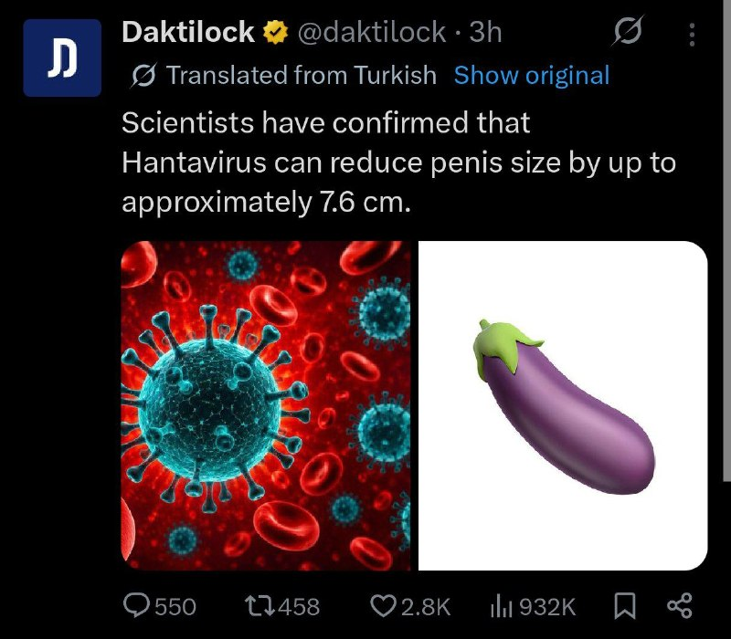

🔴 بدبختی پشت بدبختی؛ دانشمندان اعلام کردن ویروس جدید هانتا میتونه سایز آلت تناسلی رو تا 7.6 سانت کاهش بده!

@Pesari_Ke_Konie

## Pesari_Ke_Konie — post 44926

  

زندگی تو ایران که استرس نداره بابا
ممد ۲۰ ساله:

@Pesari_Ke_Konie

## Tans_Footbali — post 236264

  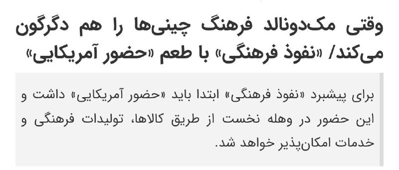

🚨اولین نمایندگی آیفون در افغانستان افتتاح شد. @Tans_Footbali

## Tans_Footbali — post 236263

  

🚨اولین نمایندگی آیفون در افغانستان افتتاح شد.

@Tans_Footbali

## Tans_Footbali — post 236262

مهندس ارتباطات حزب‌الله که پشت توسعه پهپادهای انفجاری این سازمان بود، توسط ارتش اسرائیل ترور شد.

مصطفی احمد الزین در حمله‌ای اسرائیلی در منطقه بعلبک کشته شد؛ او برای نیروی قدس فعالیت می‌کرد و متخصص فناوری فیبر نوری بود.

💛@Tans_Footbali

## hamclasixii — post 75352

  

🔴دیروز اپل به صورت رسمی اولین نمایندگی خودشو در افغانستان افتتاح کرد!

📚 @hamclasix 📚

## hamclasixii — post 75351

🔴معاون شرکت مخابرات : اینترنت بعد از تموم شدن شرایط جنگی به حالت عادی برمیگرده، ولی منطقی نیست اینترنت داخلی و بین‌الملل یه قیمت باشن؛
هزینه اینترنت خارجی بیشتره و طبیعتاً باید با قیمت بالاتری ارائه بشه!

📚 @hamclasix 📚

## hamclasixii — post 75350

  

در حال لایک کردن دسته گلای این و اون:

📚 @hamclasix 📚

## withyashar — post 11145

این پیری رئیس باند medea benjamin از باند نایاک و از مهره های ماله کش ظریف هستش شخصی هم که به سخنان شاهزاده حمله کرده اسمش «بیتا» هست … اطلاعات تکمیلی به زودی … @withyashar

## withyashar — post 11144

  

این پیری رئیس باند medea benjamin از باند نایاک و از مهره های ماله کش ظریف هستش شخصی هم که به سخنان شاهزاده حمله کرده اسمش «بیتا» هست … اطلاعات تکمیلی به زودی …
@withyashar

## withyashar — post 11142

  <a href="telegram/content/withyashar_11142_1778673226.mp4" target="_blank">🎬 Download video</a>

حمله دیروز گروه «کد پینک» به سخنرانی شاهزاده رضا پهلوی و وزیر جنگ هگست
@withyashar

## withyashar — post 11141

  

یه گروهی اومده بنام « کد پینگ » سر دسته شونم این پیری هست
Medea Bejamin
حمله کردن به سخنرانی شاهزاده و وزیر جنگ
@withyashar

## withyashar — post 11140

ایتالیا اعلام کرد که کشتی‌های مین‌روب خود را به نزدیکی آب‌های خلیج فارس اعزام خواهند کرد ولی شروع مین‌روبی‌ ، به دستیابی به یک آتش‌بس دائم و پایدار بستگی دارد.
@withyashar

## withyashar — post 11139

سلام یاشار جان خسته نباشی❤️ تو یه اتفاق جالب با همکلاسیم نشسته بودیم تو سلف دانشگاه غذا میخوردیم،دوستم پرسید اخبار چک میکنی گفتم اره،بعد نشون هم دادیم گوشیامونو😅چند روز پیش کانالتو براش فرستادم،البته از اینستا میشناختت ولی کانالتو نداشت،و پیجتم دنبال نمیکرد…

## withyashar — post 11138

  

سلام یاشار جان خسته نباشی❤️
تو یه اتفاق جالب با همکلاسیم نشسته بودیم تو سلف دانشگاه غذا میخوردیم،دوستم پرسید اخبار چک میکنی گفتم اره،بعد نشون هم دادیم گوشیامونو😅چند روز پیش کانالتو براش فرستادم،البته از اینستا میشناختت ولی کانالتو نداشت،و پیجتم دنبال نمیکرد فقط چندبار دیده بود.
دوستم‌گفت بهت بگم‌ همش اخبارو چک میکنیم و منتظر اخبار بعدی میمونیم😅

## withyashar — post 11137

  

اولین «نمایندگی رسمی مجاز اپل» یا Apple Authorized Reseller در افغانستان افتتاح شد
@withyashar

## withyashar — post 11136

دیو دی‌کمپ، روزنامه نگار آمریکایی: شاید ظرف یک هفته آینده شاهد بازگشت به عملیات نظامی بزرگ آمریکا علیه ایران باشیم
@withyashar

## withyashar — post 11135

نیویورک تایمز: قصد ترامپ از تغییر نام عملیات «خشم حماسی» به «چکش سنگین» این است که یک عملیات جدید ۶۰ روزه حمله به ایران شروع کند @withyashar

---
📅 بروزرسانی: 1405/02/23 13:03
---

## persian_trend_official — post 14041

کانال رسمی پرشین ترند pinned a file

## persian_trend_official — post 14040

  <a href="https://t.me/persian_trend_official/14040" target="_blank">📎 Download file</a>

🚀تصمیم گرفتم پیش‌بینی‌ها و تحلیل‌هایی را که از بهمن‌ماه تا شب ۸ اسفند درباره احتمال جنگ ایران و آمریکا مطرح کرده بودم، دوباره بررسی کنم تا ببینم عملکرد تحلیلی‌ام در این بازه چطور بوده است.

برای اینکه بررسی دقیق‌تر و بی‌طرفانه‌تر باشد، فایل زیرنویس لایوها را به هوش مصنوعی دادم و از آن خواستم تمام پیش‌بینی‌ها، سناریوها و تحلیل‌هایی را که در آن لایوها مطرح کرده بودم، استخراج و به‌ترتیب زمانی دسته‌بندی کند.

نتیجه برای خودم هم جالب بود. بر اساس مواردی که در فایل استخراج‌شده آمده، و تأکید می‌کنم چیزی سانسور یا حذف نشده، بیش از ۹۰ درصد تحلیل‌ها و پیش‌بینی‌هایی که مطرح کرده بودم با روند بعدی تحولات همخوانی داشته است.

من این متن را برای شما هم می‌گذارم تا خودتان بررسی کنید. طبیعتاً تحلیل سیاسی و نظامی همیشه درصدی از خطا و عدم قطعیت دارد، اما مهم این است که ببینیم چارچوب تحلیلی، نشانه‌خوانی‌ها، سناریوسازی‌ها و هشدارهایی که در آن زمان مطرح شده بود، تا چه اندازه به واقعیت نزدیک بوده است.

این بررسی برای من فقط جنبه دفاع از گذشته ندارد؛ بیشتر یک ارزیابی جدی از کیفیت تحلیل‌هاست. اینکه کجا درست دیدیم، کجا زودتر از دیگران نشانه‌ها را تشخیص دادیم، و کجا باید در آینده با احتیاط یا دقت بیشتری تحلیل کنیم.

متن کامل استخراج‌شده را در ادامه می‌گذارم تا شما هم قضاوت کنید.

📌 @persian_trend_official
پرشین ترند | متفاوت‌ترین کانال نظامی

## persian_trend_official — post 14039

  <a href="telegram/content/persian_trend_official_14039_1778664793.webm" target="_blank">🎬 Download video</a>

⭕️ مارکو روبیو همان لباس ورزشی خاکستری Nike را پوشیده که نیکلاس مادورو در عکس‌های دستگیری‌اش به تن داشت.

📝 Nick

📌 @persian_trend_official
پرشین ترند | متفاوت‌ترین کانال نظامی

## persian_trend_official — post 14038

  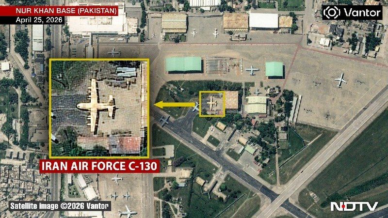

شبکه تلویزیونی NDTV تصاویر ماهواره‌ای با وضوح بالا را که از پایگاه هوایی ونتور گرفته شده، منتشر کرده است که ظاهراً گزارش‌های مبنی بر پناه دادن حداقل یک هواپیمای ترابری نظامی C-130H نیروی هوایی ایران در پایگاه هوایی نورخان پاکستان را تأیید می‌کند.

📝 Nick

📌 @persian_trend_official
پرشین ترند | متفاوت‌ترین کانال نظامی

## persian_trend_official — post 14037

  <a href="telegram/content/persian_trend_official_14037_1778664794.mp4" target="_blank">🎬 Download video</a>

🔴محمد رضا شهبازی مجری صدا‌وسیما :

💢اگر اینترنت و مستر کارت برایتان مهم است بروید افغانستان و سوریه زندگی کنید ...❗️

🫆:Tony

📌 @persian_trend_official
پرشین ترند | متفاوت‌ترین کانال نظامی

## persian_trend_official — post 14036

  

🚀 اینترنت پرسرعت و پایدار،
💰 قیمت هر گیگ ۲۵۰ تومن!
🎁 تخفیف ویژه: ۱۰٪ تخفیف اختصاصی برای اعضای پرشین ترند
⚡ پایداری بالا: کمترین قطعی ممکن در بدترین شرایط
🛡️ تضمین کیفیت: پشتیبانی ۲۴ ساعته + گارانتی بازگشت وجه

🛒 جهت خرید و مشاوره پیام دهید:

🆔 @shayan1057

🆔 @shayan1057

🆔 @shayan1057

## persian_trend_official — post 14035

  

شات گان اون هم با لوله کروم که زیر نور آفتاب طوری برق میزنه که از یک کیلومتری دیده میشه. تو آمریکا حتی غیر نظامی هایی که عشق اسلحه هستن و سرشون در میاد هم اگر اسلحه با لوله کروم بخری مسخرت میکنن میگن باربی جواهرآلات جدید خریده!

سپاه روز به روز از یک نیروی نظامی داره به یک باند گانگستری شبیه تر میشه. امروز فردا فرماندهانش هم کلت با بدنه آب طلا خواهند بست.

📌 @persian_trend_official
پرشین ترند | متفاوت‌ترین کانال نظامی

## persian_trend_official — post 14034

  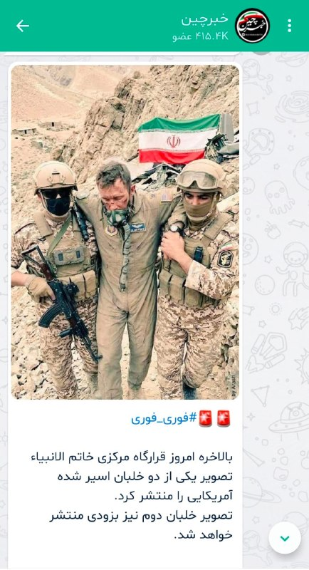

فیک نیوز در یک کانال مثلا خبری با بیش از چهارصد هزار دنبال کننده در پیام‌رسان بله!
اگر اینترنت در ایران مثل کره شمالی بود و شبکه های ماهواه ای فارسی زبان وجود نداشتن، آخوندها به مراتب از کره شمالی میتونستن دروغگوتر باشن به شکلی که تا الان نتانیاهو و ترامپ هم اسیر شده بودند !
خاطرتون هست میگفتن نتانیاهو کشته شده و اسرائیل تصاویرش رو با هوش مصنوعی میسازه !

پ.ن : خدایا ما رو با طرفدارات تنها نزار ...

📌 @persian_trend_official
پرشین ترند | متفاوت‌ترین کانال نظامی

## OfficialPersiaTwiter — post 498287

بانک‌ها مجاز به خرید و فروش ارز تا سقف ۱۰۰۰ یورو شدند

🔹براساس دستورالعمل بانک مرکزی، هر فردی می‌تواند تا سقف ۱۰۰۰ یورو (یا معادل آن به دلار) در سال، ارز اسکناس برای نیازهای ضروری خرد از شعب بانکی خریداری کند.
🔹منبع این اسکناس‌ها، خرید از صادرکنندگان است و کاملاً از منابع ارزی حواله‌ای که برای واردات کالاهای اساسی و مواد اولیه استفاده می‌شود؛ جداست.
🔹بانکها موظفند ضمن الزام به رعایت سایر ضوابط و مقررات ارزی در اجرای این بخشنامه، مراتب را به تمامی شعب و واحدهاي ارزي ذي‌ربط ابلاغ و بر حسن اجراي آن نيز نظارت کنند.‏

》OPT《

@OfficialPersiaTwiter

## OfficialPersiaTwiter — post 498286

صنف کفاشان و اغذیه فروشان هم شامل دریافت اینترنت پرو شدن! به‌زودی کل مردم ایران شامل اینترنت پرو میشن که دقیقا همون اینترنت قبل از جنگه فقط به جای گیگی ۵ هزار تومن باید گیگی ۴۰ هزار تومن پول بدید. و فقط اونایی که توانشو دارن میتونن از این کالای لوکس بهره‌مند…

## OfficialPersiaTwiter — post 498285

مدیرعامل یک موسسه مالی با ۱۳ هزار شاکی دستگیر شد

🔹دادستان مرکز استان کهگیلویه‌وبویراحمد از بازداشت مدیرعامل یک موسسه مالی به‌اتهام کلاهبرداری و فعالیت غیرمجاز خبر داد و گفت: در این پرونده بیش از ۱۳ هزار نفر مال‌باخته شناسایی شده است.
🔹این موسسه در ابتدا مجوز بانک مرکزی را داشته اما از سال ۱۴۰۲ بدون تمدید یا دریافت مجوز به فعالیت خود ادامه داده و این تخلف با گزارش پرداخت‌های گزینشی احراز شده است.
🔹براساس نظریه اولیه کارشناس رسمی، مانده اصل سپرده‌ها حدود ۱۶۵ میلیارد تومان و مانده تسهیلات پرداختی در اختیار اشخاص حدود ۸۵ میلیارد تومان براورد شده است.

》OPT《

@OfficialPersiaTwiter

## OfficialPersiaTwiter — post 498284

  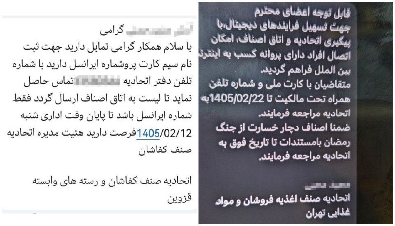

صنف کفاشان و اغذیه فروشان هم شامل دریافت اینترنت پرو شدن!

به‌زودی کل مردم ایران شامل اینترنت پرو میشن که دقیقا همون اینترنت قبل از جنگه فقط به جای گیگی ۵ هزار تومن باید گیگی ۴۰ هزار تومن پول بدید.
و فقط اونایی که توانشو دارن میتونن از این کالای لوکس بهره‌مند بشن

》Hami《

@OfficialPersiaTwiter

## OfficialPersiaTwiter — post 498283

تیراندازی پلیس به تعقیب سارقان پراید در تهران ختم شد؛ زن و مرد سارق بازداشت شدند

🔹زن و مردی که با یک دستگاه پراید اقدام به سرقت‌های متعدد می‌کردند، پس از تعقیب و گریز پلیس در خیابان پیروزی تهران دستگیر شدند.
🔹سرهنگ عبدالوهاب اعلایی، سرکلانتری پنجم تهران، اعلام کرد در پی گزارش چند سرقت مشابه با خودروی پراید و حضور یک زن در خودرو، بررسی موضوع در دستور کار پلیس قرار گرفت. مأموران با بررسی دوربین‌های مداربسته زمان و محل سرقت‌ها را شناسایی کردند.
🔹به گفته او، متهمان بامداد ۲۰ اردیبهشت حدود ساعت ۴ صبح شناسایی شدند اما با مشاهده مأموران قصد فرار داشتند. پلیس برای متوقف کردن خودرو تیر هوایی شلیک کرد، اما راننده به فرار ادامه داد.
🔹در نهایت خودرو در خیابان پیروزی و با حضور ایست بازرسی بسیج پس از برخورد با گاردریل متوقف شد و دو متهم ۳۲ و ۳۵ ساله دستگیر شدند.
🔹آن‌ها پس از انتقال به کلانتری به سرقت لوازم خودرو اعتراف کردند و با دستور قضایی برای ادامه تحقیقات در اختیار پایگاه پنجم پلیس آگاهی تهران قرار گرفتند./هفت صبح

》OPT《

@OfficialPersiaTwiter

## OfficialPersiaTwiter — post 498282

پزشک از دستگاه پوز میوه فروشی استفاده می کرد تا مالیات کمتری بدهد/ او از یک عابربانک هم به نفع خود استفاده می کرد

مدیرکل امور مالیاتی خراسان رضوی:
🔹در یکی از پرونده‌ها فعالیت یک مطب در مشهد با توجه به حجم فعالیت و میزان مالیات پرداختی مورد ارزیابی قرار گرفت؛ مشخص شد که این مطب با دستگاه پوز مربوط به فعالیت میوه‌فروشی فعالیت می کند و دلیلش هم این بود که بر اساس اینتاکد میوه فروشی ها کمترین سهم مالیاتی را پرداخت می کنند.
🔹اما این تمام ماجرا نبود و در ساختمان مطب یک دستگاه عابربانک تعبیه شده بود و مراجعه کنندگان ناچار بودند که هزینه های ویزیت را نقد پرداخت کنند و باید از همین دستگاه عابر پول برداشت می کردند و قابل تأمل آن که شارژ دستگاه عابر و قرار دادن پول در این دستگاه ها در اختیار مطب بود یعنی از یک طرف پول نقد را از بیماران می گرفت و مجدد در دستگاه عابر بارگذاری می کرد که دستگاه بدون پول نباشد و به این طریق فعالیت می کرد که پرونده آن در مراحل رسیدگی حقوقی است. /خراسان

》OPT《

@OfficialPersiaTwiter

## OfficialPersiaTwiter — post 498281

  <a href="telegram/content/OfficialPersiaTwiter_498281_1778664798.mp4" target="_blank">🎬 Download video</a>

منم تو زندگیم دقیقا همینقدر بلاتکلیفم 😂

》SaRa《

@OfficialPersiaTwiter

## OfficialPersiaTwiter — post 498280

ایرانیان چقدر در ماه سرم می‌زنند؟

معاون وزیر بهداشت:
🔹ماهانه حدود ۲۳ میلیون واحد سرم در کشور مصرف می‌شود؛ رقمی که با استانداردهای جهانی فاصله دارد و ضرورت بازنگری در رویه‌های تجویز را بیش از پیش آشکار می‌سازد.
🔹همزمان با مصرف بالای سرم، بیش از یک‌سوم نسخ سرپایی نیز حاوی آنتی‌بیوتیک است. تداوم این الگوی مصرف، علاوه بر تحمیل بار مالی غیرضروری به نظام سلامت، می‌تواند زمینه‌ساز مقاومت میکروبی و کاهش اثربخشی درمان‌ها در بلندمدت شود. /ایلنا

》OPT《

@OfficialPersiaTwiter

## OfficialPersiaTwiter — post 498279

  <a href="telegram/content/OfficialPersiaTwiter_498279_1778664799.mp4" target="_blank">🎬 Download video</a>

نائب رئیس اتحادیه مشاورای املاک تهران در صداوسیما: وام مسکنی که همین الان در حال ارائه هست آنقدر ارزش پایینی دارد که در بعضی از مناطق تهران نمیشود با آن یک متر خانه خرید!

》OPT《

@OfficialPersiaTwiter

## OfficialPersiaTwiter — post 498278

سقف جدید تعرفه پیامک فارسی و انگلیسی تصویب شد

🔹کمیسیون تنظیم مقررات ارتباطات سقف جدید تعرفه پیامک‌های فارسی و انگلیسی را برای سیم‌کارت‌های دائمی و اعتباری تصویب و ابلاغ کرد.

در این مصوبه آمده است:
🔹سقف تعرفه هر پیامک به زبان فارسی در سیم کارت دائمی 116 ریال تعیین می شود.
🔹سقف تعرفه هر پیامک به حروف انگلیسی در سیم کارت دائمی 289 ریال تعیین می شود.
🔹 سقف تعرفه هر پیامک در سیم کارت های اعتباری، بیست درصد بیشتر از سیم کارت های دائمی است.

》OPT《

@OfficialPersiaTwiter

## OfficialPersiaTwiter — post 498277

  <a href="telegram/content/OfficialPersiaTwiter_498277_1778664801.mp4" target="_blank">🎬 Download video</a>

فرود هواپیمای ترامپ در ایالت آلاسکا برای استراحت و پرواز مجدد به سمت چین

》OPT《

@OfficialPersiaTwiter

## OfficialPersiaTwiter — post 498276

محدودیت‌های ترافیکی در محورهای پرتردد کشور از ۲۳ تا ۲۶ اردیبهشت اجرا می‌شود

رئیس پلیس راه راهور فراجا:
🔹از ساعت ۱۲ روز چهارشنبه ۲۳ اردیبهشت ۱۴۰۵ تا ساعت ۶ صبح شنبه ۲۶ اردیبهشت، تردد موتورسیکلت‌ها در محورهای کرج–چالوس، هراز، فیروزکوه و همچنین محور تهران– سمنان– مشهد در هر دو مسیر ممنوع خواهد بود.
🔹تردد خودروهای سنگین شامل تریلر، کامیون و کامیونت در محور کرج–چالوس همچنان ممنوع است و در صورت افزایش حجم ترافیک، محدودیت‌های مقطعی یک‌طرفه در بازه‌های زمانی مشخص در روزهای چهارشنبه، پنجشنبه و شنبه اعمال خواهد شد.

》OPT《

@OfficialPersiaTwiter

## OfficialPersiaTwiter — post 498275

پردیس روی خط تنش؛ تمرکز لرزه‌ها در تلاقی دو گسل مهم تهران زارع، استاد پژوهشگاه بین‌المللی زلزله‌شناسی: 🔹محل تلاقی گسل مشا و گسل شمال تهران در ۱۰ کیلومتری شمال پردیس واقع شده است. 🔹توالی زلزله‌های کوچک با بزرگای کمتر از ۵ نشانگر تخلیه تدریجی انرژی در منطقه‌ای…

## OfficialPersiaTwiter — post 498274

  <a href="telegram/content/OfficialPersiaTwiter_498274_1778664802.mp4" target="_blank">🎬 Download video</a>

حمله پهپادی اسرائیل به یک خودرو در بیروت 🔹منابع خبری از حمله پهپاد اسرائیل به خودرویی در جاده ساحلی «الجیه» در جنوب بیروت خبر دادند. 》OPT《 @OfficialPersiaTwiter

## OfficialPersiaTwiter — post 498273

بازداشت معاون دبیرکل سازمان ملل در فرودگاه بن‌گوریون

🔹یک مقام سازمان ملل از بازداشت و بازجویی خود در فرودگاه بن‌گوریون، به علت سفر قبلی‌اش به غزه که با هماهنگی تل‌آویو انجام شده بود، خبر داد.

🔹او به نشانه اعتراض، جلسات خود در اسرائیل را لغو کرد.

》OPT《

@OfficialPersiaTwiter

## OfficialPersiaTwiter — post 498272

ساعات کاری بانک‌ها از ۲۶ اردیبهشت تغییر می کند

تمامی شعب بانک‌ها در سراسر کشور موظف‌اند در بازه زمانی ۲۶ اردیبهشت تا ۱۵ شهریورماه فعالیت روزانه خود را از ساعت ۷صبح آغاز کرده و در ساعت ۱۳ به پایان برسانند.

》OPT《

@OfficialPersiaTwiter

## OfficialPersiaTwiter — post 498271

  <a href="telegram/content/OfficialPersiaTwiter_498271_1778664803.mp4" target="_blank">🎬 Download video</a>

حمله پهپادی اسرائیل به یک خودرو در بیروت

🔹منابع خبری از حمله پهپاد اسرائیل به خودرویی در جاده ساحلی «الجیه» در جنوب بیروت خبر دادند.

》OPT《

@OfficialPersiaTwiter

## OfficialPersiaTwiter — post 498270

ویزای ۵ ستاره عراق برای جام جهانی رد شد! 🔹آمریکا در تازه‌ترین اقدام غیرورزشی خود در آستانه جام جهانی ۲۰۲۶ ویزای ۵ بازیکن کلیدی تیم ملی عراق از جمله علی الحمادی (ستاره لوتون تاون)، مهند علی و حیدر عبدالکریم را رد کرد. 》OPT《 @OfficialPersiaTwiter

## OfficialPersiaTwiter — post 498269

  <a href="telegram/content/OfficialPersiaTwiter_498269_1778664804.mp4" target="_blank">🎬 Download video</a>

توهین زشت تلویزیون به سرود نوستالوژیک «مادر برام قصه بگو»

سرود مذکور که در دهه ۶۰ منتشر شد، درددل یک فرزند شهید با مادرش بود و اخیرا نیز این سرود و ملودی خاطره‌انگیز برای شهادت رهبر انقلاب بازسازی و پخش شد.

سریال کلینیک رویا، از شبکه سه پخش می‌شود و مانند دهه‌های گذشته با تمسخر و تحقیر مردم غیر تهرانی قصد خنده‌گرفتن از مردم دارد.

》OPT《

@OfficialPersiaTwiter

## OfficialPersiaTwiter — post 498268

وضعیت طوری شده که انگار همه آزمون‌های الهی اینجا برگزار میشه...

》سباستین《

@OfficialPersiaTwiter

## bbcpersian — post 280900

  <a href="telegram/content/bbcpersian_280900_1778664805.mp4" target="_blank">🎬 Download video</a>

🔻‌‌ویروس هانتا از جمله ویروس‌هایی است که توسط جوندگان منتقل می‌شود، در حالی که ویروس کرونا عمدتا از انسان به انسان انتقال پیدا می‌کند.

سازمان بهداشت جهانی‌تاکید کرده که شیوع ویروس هانتا که در یک کشتی تفریحی اتفاق افتاد و باعث مرگ چند مسافر شد، شروع یک همه‌گیری جهانی نیست.

با این حال، پس از آنکه آخرین مسافران این کشتی تفریحی را ترک کردند، سه مورد جدید دیگر و‌مرتبط با این بیماری مرگبار شناسایی شده‌است.

دامینیک هیوز، خبرنگار بخش سلامت بی‌بی‌سی، در این ویدیو درباره تفاوت این دو ویروس و نحوه انتقال آن‌ها توضیح می‌دهد.

https://bbc.in/4ntA6Ee
@BBCPersian

## bbcpersian — post 280899

🔻اعتراض ایران به لغو مجوز فعالیت مدارس ایرانی در امارات متحده عربی

ستاد حقوق بشر ایران با انتشار بیانیه‌ای به لغو مجوز فعالیت مدارس ایرانی در امارات متحده عربی اعتراض کرده است.

در بخشی از این بیانیه آمده است که قدام اخیر دولت امارات متحده عربی «در سایه تنش‌های سیاسی و با انگیزه‌های خصمانه صورت پذیرفته، تنها یک اقدام اداری ساده نیست، بلکه مصداق بارز نقض سیستماتیک تعهدات بین‌المللی دولت امارات ذیل معاهدات حقوق بشری، مشخصاً کنوانسیون حقوق کودک و میثاق بین‌المللی حقوق اقتصادی، اجتماعی و فرهنگی است.»

ستاد حقوق بشر ایران از زیرمجموعه‌های شورای عالی امنیت ملی و به لحاظ اداری بخشی از قوه قضائیه است.

بر اساس گزارش‌ها، با آغاز جنگ آمریکا و اسرائیل با ایران و حملات تلافی‌جویانه ایران به امارات متحده عربی، تعدادی از ایرانیان مقیم این کشور با مشکلات اقامتی هم مواجه شده‌اند.

بی‌بی‌سی فارسی درباره این مشکلات با اداره کل مهاجرت، هویت و مرزبانی امارات، اداره کل اقامت و امور خارجیان دبی و وزارت کار امارات تماس گرفته اما هنوز پاسخی دریافت نکرده است.

https://bbc.in/4tAXKjn
@BBCPersian

## bbcpersian — post 280898

🔻نماینده مجلس ایران: آمریکا و اسرائیل بنای یک عملیات گسترده علیه ایران را دارند

کامران غضنفری، نماینده مجلس ایران با اشاره به ادامه انتقال تجهیزات و نیرو از سوی آمریکا به خاورمیانه، می‌گوید «آمریکا و اسرائیل بنای یک عملیات گسترده» علیه ایران را دارند.

آقای غضنفری به خبرآنلاین گفته آمریکا و اسرائیل «احتمالاً قصد تصرف برخی از جزایر ما در جنوب را دارند.»

او با اشاره به خواسته‌های آمریکا از ایران در مورد تعطیلی غنی‌سازی، خروج اورانیوم غنی‌شده و توقف حمایت از گروه‌های موسوم به «محور مقاومت» گفته «جمهوری اسلامی قاعدتاً زیر بار این خواسته‌ها نمی‌رود.»

به گفته این نماینده مجلس، «ما وسط جنگ هستیم و اکنون در حال جنگ با دشمن هستیم. در همین یک هفته اخیر، دو عملیات علیه ما انجام دادند و با ناوهایشان به برخی مراکز ما حمله کردند.»~

https://bbc.in/4tAXKjn
@BBCPersian

## bbcpersian — post 280897

🔻سامانه دفاع موشکی «گنبد طلایی» ترامپ هزار و دویست میلیارد دلار خرج دارد

بر اساس برآورد دفتر بودجه کنگره امريکا، سامانه دفاع موشکی آينده‌نگر «گنبد طلایی» دونالد ترامپ حدود ۱/۲ تريليون دلار (۱۲۰۰ میلیارد دلار) هزينه خواهد داشت تا طی دو دهه تولید، استقرار و بهره‌برداری شود.

اين رقم به‌مراتب بيشتر از بودجه اوليه ۱۷۵ ميليارد دلاری است که پيش‌تر برای اين پروژه در نظر گرفته شده بود.

با اين حال، سامانه‌ای که برای محافظت از ايالات متحده امريکا در برابر موشک‌های بالستيک و کروز طراحی شده، ممکن است حتی کارايی کامل نداشته باشد.

گزارش جديد دفتر بودجه کنگره هشدار می‌دهد «گلدن دوم - گنبد طلایی» می‌تواند در برابر حمله گسترده از سوی روسيه يا چين آسيب‌پذير باشد.

اين نهاد غيرحزبی اعلام کرده تنها هزينه‌های تامين تجهيزات از ۱ تريليون دلار فراتر خواهد رفت؛ از جمله برای لايه‌های رهگير موشکی و سامانه هشدار و رهگيری موشک مبتنی بر فضا.

عبور برخی از پهپادها و موشک‌های ایرانی از گنبد آهنین اسرائیل و همچنین پوشش پدافندی آمریکا در کشورهای حوزه خلیج فارس، ارزیابی‌ها درباره کارآمدی کامل این طرح را هم تحت تاثیر قرار داده است.

https://bbc.in/4tAXKjn
@BBCPersian

## bbcpersian — post 280896

🔻ترامپ نقشه ونزوئلا را با عنوان «ایالت ۵۱» منتشر کرد

دونالد ترامپ که در حال عزیمت به چین برای دیدار با شی جین پینگ است، سه شنبه شب در شبکه اجتماعی خود - تروث سوشال - نقشه ونزوئلا در حالی که روی آن با پرچم آمریکا پوشانده شده بود را منتشر کرد و بالای آن نوشت:‌ «ایالت ۵۱».

روز دوشنبه -۲۱ اردیبهشت - هم یک خبرنگار فاکس نیوز گفت که آقای ترامپ در تماس تلفنی با او گفته به انضمام ونزوئلا تحت عنوان ایالت پنجاه و یکم آمریکا «فکر می‌کند».

کانادا و گرینلند هم پیش از این القاب مشابهی از سوی رئیس جمهور آمریکا دریافت کرده بودند که با اعتراض جدی دولت و شهروندان این کشورها روبرو شده بود.

https://bbc.in/4tAXKjn
@BBCPersian

## bbcpersian — post 280895

🔻اکبر عبدی به علت عارضه قلبی در بیمارستان بستری شد

بنابر گزارش رسانه‌های ایران، اکبر عبدی، بازیگر و کمدین سرشناس ایرانی، به علت عارضه قلبی در بخش مراقبت‌های ویژه بستری شده است.

مهران غفوریان، بازیگر و کمدین با انتشار ویدیویی در مقابل بیمارستان محل بستری آقای عبدی این خبر را تایید کرده است.

آقای عبدی در دهها فیلم سینمایی و مجموعه‌های تلویزیونی ایران ایفای نقش کرده و یکی از کمدین‌های سرشناس نیم قرن گذشته در این کشور است.
https://bbc.in/4tAXKjn
@BBCPersian

## Lichargoo — post 24866

‏این bdsm و این کسشرا چیه یاد گرفتین دختر مردمو می‌بندین به داربست کتک متک میزنین، کسخلید؟
بیفت پاهاشو بوس کن بگو خدیاشکرت، موجود به اون نازی و لطیفی.

## Tans_Footbali — post 236261

  <a href="https://t.me/Tans_Footbali/236261" target="_blank">📎 Download file</a>

یه کوچولو روحمون آروم شه

💛@Tans_Footbali

## Tans_Footbali — post 236260

نیویورک تایمز:

قصد ترامپ از تغییر نام عملیات «خشم حماسی» به «چکش سنگین» این است که یک عملیات جدید ۶۰ روزه حمله به ایران شروع کند

💛@Tans_Footbali

## Tans_Footbali — post 236259

گزارش مرکز ژئوفیزیک از شدت ۹ زمین‌لرزه بالای ۲.۵ ریشتر در پردیس از روز گذشته تاکنون

🔻ساعت ۲۰:۴۱ — بزرگی ۳.۴ ریشتر
🔻 ساعت ۲۳:۴۶ — بزرگی ۴.۶ ریشتر
🔻 ساعت ۲۳:۵۰ — بزرگی ۲.۶ ریشتر
🔻 ساعت ۰۰:۲۰ — بزرگی ۲.۶ ریشتر
🔻 ساعت ۰۰:۲۶ — بزرگی ۴ ریشتر
🔻 ساعت ۰۰:۳۲ — بزرگی ۳.۴ ریشتر
🔻 ساعت ۰۰:۵۴ — بزرگی ۲.۶ ریشتر
🔻 ساعت ۰۳:۲۹ — بزرگی ۳.۱ ریشتر
🔻ساعت ۰۵:۵۷ — بزرگی ۳.۳ ریشتر

💛@Tans_Footbali

## Tans_Footbali — post 236258

  <a href="telegram/content/Tans_Footbali_236258_1778664807.webm" target="_blank">🎬 Download video</a>

⚽ لاتزیو 
🇮🇹 - 
🇮🇹 اینتر میلان

🏆 فینال جام حذفی ایتالیا 
🇮🇹

🕔 امشب ساعت ۲۲:۳۰
🏟 ورزشگاه المپیک رم

🎲 با بیش از ۵۵۰ نوع آپشن پیش‌بینی

👆 با بالاترین ضرایب پیش‌بینی

📊 نگاهی به آمار دو تیم:

✅ لاتزیو در ۱۰ دیدار اخیر خود تنها دو بازی را واگذار کرده است.

✅ اینتر میلان در ۱۰ دیدار اخیر خود تنها یک بازی را واگذار کرده است.

📈 میانگین گل در ۱۰ دیدار اخیر لاتزیو ۲.۵ گل در هر بازی بوده است.

📈 میانگین گل در ۱۰ دیدار اخیر اینتر میلان ۳.۶ گل در هر بازی بوده است.

🧠 آرامش ذهن، دقیق‌ترین ابزار تحلیل است.

D

👍 ورود به سایت با فیلترشکن

کلیک کنید BetForward.com
کلیک کنید BetForward.com

💻 @BetForward

## hamclasixii — post 75349

یکی از چیزایی که این روزا خیلی داره اذیتم میکنه احساس هدر رفتنه. هدر رفتن جوونیم،کاراییم، روزها و زمان. انگار همشون دارن هدر میرن و من هیچ کاری از دستم برنمیاد.

📚 @hamclasix 📚

## hamclasixii — post 75348

🔴 مدیرکل آموزش و پرورش ایلام: نحوه برگزاری امتحانات دانش‌آموزان پایه‌های هفتم تا دهم در ایلام تا ۱۵ روز آینده اعلام می شود.

📚 @hamclasix 📚

## hamclasixii — post 75347

‏این لایه اوزون که بچه بودیم میگفتن داره نابود میشه چی شد آخر؟

📚 @hamclasix 📚

## withyashar — post 11134

سخنگوی وزارت خارجه: ما عملاً در یک آتش‌بس اسمی قرار داریم، اما طبق حقوق بین‌الملل، خودِ محاصره یک اقدام جنگی محسوب می‌شود.
@withyashar

## withyashar — post 11133

کانال 13 اسرائیل:
نتانیاهو امشب جلسه امنیتی ویژه در مورد ایران برگزار خواهد کر‌د
@withyashar

## withyashar — post 11132

  

📷 Photo

## withyashar — post 11131

فدراسیون فوتبال: امشب مراسم بدرقه تیم ملی فوتبال به جام جهانی، در میان تجمع حامیان حکومت در میدان انقلاب تهران برگزار می‌شود و قرار است در این مراسم از پیراهن تیم نیز رونمایی شود.
@withyashar

## withyashar — post 11130

عبور ابرنفتکش چینی از تنگه هرمز همزمان با سفر ترامپ به این کشور
داده‌های مارین ترافیک نشان می‌دهد که کشتی یوان هوآ هو صبح چهارشنبه در حال حرکت به سمت شرق از طریق تنگه دیده شده است.
برخی بر این باور هستند که عبور این کشتی نوعی اقدام مبتنی بر حسن نیت از سوی ترامپ برای جلب نظر شی جین پینگ است.
@withyashar

## withyashar — post 11129

یک مقام ارشد سابق موساد: ایران ممکن است ظرف چند ماه از نظر اقتصادی سقوط کند اگر محاصره ادامه یابد
@withyashar

## withyashar — post 11128

@withyashar

## withyashar — post 11127

پروژه هارپ یه پروژه برای تغییر در آب و هوا بود طوفان میتونست درست کنه ولی زلزله نظر اکثر کارشناسان بر این بوده که امکانشرو نداشته و فقط تغیید در لایه های جو بوده به هر حال دهه نود ساخته شد و ۲۰۱۴ امریکا گفت پروژه کنسل شده ، ولی تئوری توطئه زیاد هست درباره این پروژه
@withyashar

## withyashar — post 11126

سلام مرسی از همه زحمت هات
زلزله میتونه پروژه هارپ باشه؟

## withyashar — post 11125

درود یاشار جان، خسته نباشی. مرسی ک تحمل این روزای سخت رو با حضورت و زحمتی ک میکشی، برامون قابل تحمل میکنی. داداش میشه توضیح بدی ک چرا اکثر مواقع حساس کشور، ایران میره روی ویبره؟! قبل از خشم حماسی هم این اتفاق میفتاد، طلوع شیران هم همینطور یا مثلا چند سال قبل…

## withyashar — post 11124

درود یاشار جان، خسته نباشی.
مرسی ک تحمل این روزای سخت رو با حضورت و زحمتی ک میکشی، برامون قابل تحمل میکنی.
داداش میشه توضیح بدی ک چرا اکثر مواقع حساس کشور، ایران میره روی ویبره؟!
قبل از خشم حماسی هم این اتفاق میفتاد، طلوع شیران هم همینطور یا مثلا چند سال قبل ۴۰۱ بود فک کنم.
بنظرت میتونه چیزی بجز گسل و دلایل طبیعی باشه؟

## withyashar — post 11123

  

مهندس ارتباطات حزب‌الله که متخصص فیبرنوری بوده و پشت توسعه پهپادهای انفجاری این سازمان بود، توسط ارتش اسرائیل به هلاکت رسید.
@withyashar

## withyashar — post 11122

نیویورک تایمز: قصد ترامپ از تغییر نام عملیات «خشم حماسی» به «چکش سنگین» این است که یک عملیات جدید ۶۰ روزه حمله به ایران شروع کند
@withyashar

## withyashar — post 11121

گزارش مرکز ژئوفیزیک از شدت ۹ زمین‌لرزه بالای ۲.۵ ریشتر در پردیس از روز گذشته تاکنون

ساعت ۲۰:۴۱ — بزرگی ۳.۴ ریشتر
ساعت ۲۳:۴۶ — بزرگی ۴.۶ ریشتر
ساعت ۲۳:۵۰ — بزرگی ۲.۶ ریشتر
ساعت ۰۰:۲۰ — بزرگی ۲.۶ ریشتر
ساعت ۰۰:۲۶ — بزرگی ۴ ریشتر
ساعت ۰۰:۳۲ — بزرگی ۳.۴ ریشتر
ساعت ۰۰:۵۴ — بزرگی ۲.۶ ریشتر
ساعت ۰۳:۲۹ — بزرگی ۳.۱ ریشتر
ساعت ۰۵:۵۷ — بزرگی ۳.۳ ریشتر

@withyashar

## withyashar — post 11120

غضنفری:شواهد و قرائن نشان می‌دهد که آمریکا و اسرائیل قصد انجام یک عملیات گسترده برای تصرف برخی از جزایر جنوب را دارند
@withyashar

## withyashar — post 11119

  <a href="telegram/content/withyashar_11119_1778664809.mp4" target="_blank">🎬 Download video</a>

حضور 53 جنگنده F-16 آمریکایی در پایگاه شاهزاده سلطان عربستان هواپیما جاسوسی آواکس هم که دیشب نشون دادم از این پایگاه نظامی بلند شده بود
@withyashar

## withyashar — post 11118

احسان افرشته، به اتهام جاسوسی و همکاری اطلاعاتی با موساد اعدام شد به گفته رژیم وی چند مرحله تماس از طریق پیام‌رسان‌ها داشته و در ادامه از طریق پست الکترونیک باهم در ارتباط بوده‌اند بیش از ۳۰۰ پیام بین آنها رد و بدل شده است. افرشته در ابتدا در پوشش راننده تاکسی…

## withyashar — post 11116

  

عکس وایرال شده مارک روبیو در هواپیمای ایرفورس وان که همون ست گرمکن مادارو را پوشیده. نکته ای که کسی به آن توجه نکرده کفشهایش است که مارک آدیداس هست.
@withyashar

## withyashar — post 11114

  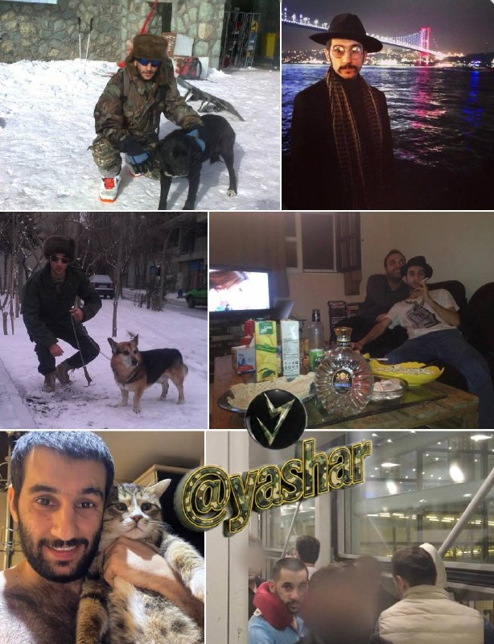

احسان افرشته، به اتهام جاسوسی و همکاری اطلاعاتی با موساد اعدام شد به گفته رژیم وی چند مرحله تماس از طریق پیام‌رسان‌ها داشته و در ادامه از طریق پست الکترونیک باهم در ارتباط بوده‌اند بیش از ۳۰۰ پیام بین آنها رد و بدل شده است. افرشته در ابتدا در پوشش راننده تاکسی اینترنتی دستورات افسران موساد را اجرا می‌کرد.
@withyashar

## withyashar — post 11112

  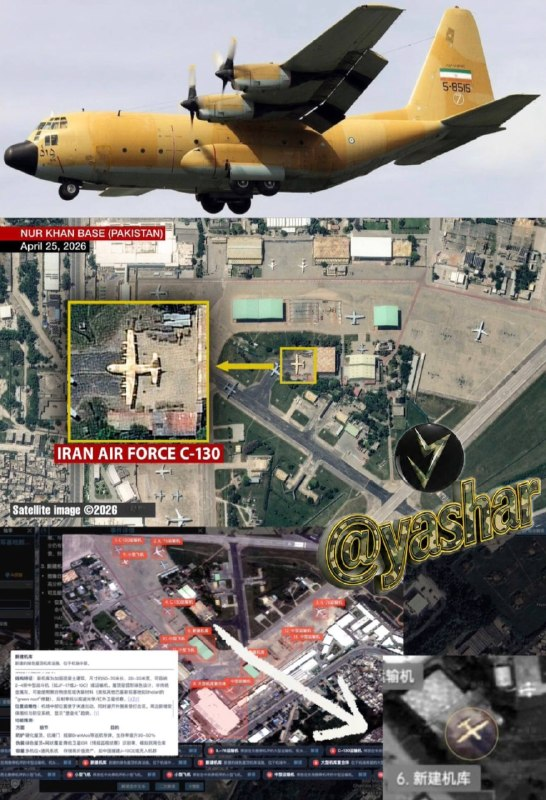

تصاویر ماهواره‌ای نشان می‌دهد که یک هواپیمای باری جمهوری اسلامی مدل C-130 در پایگاه‌ هوایی نور خان پاکستان پناه گرفته است
@withyashar

---
📅 بروزرسانی: 1405/02/23 10:11
---

## persian_trend_official — post 14033

  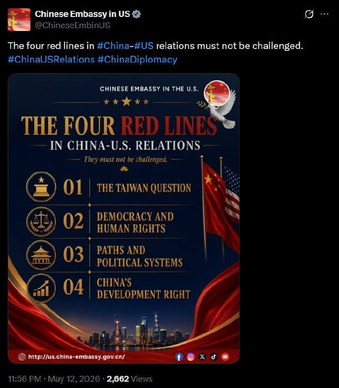

🔴 سفارت چین در آمریکا چهار خط قرمز پکن را اعلام کرد
این اعلام در آستانه سفر ترامپ به پکن و دیدار با شی جین‌پینگ مطرح شد:
▪️ مسئله تایوان
▪️ دموکراسی و حقوق بشر
▪️ مسیرها و نظام‌های سیاسی
▪️ حق توسعه چین
💢 پیام پکن به واشنگتن روشن است: روی این چهار خط حساب باز نکنید.
📌 @persian_trend_official
پرشین ترند | متفاوت‌ترین کانال نظامی

## persian_trend_official — post 14026

احسان افرشته اعدام شد؛

بامداد امروز چهارشنبه خبرگزاری میزان وابسته به قوه قضائیه در خبری مدعی شد که احسان افرشته به اتهام جاسوسی برای موساد اعدام شد. جمهوری اسلامی او را جاسوسی توصیف می‌کند که اطلاعات حساس کشور را می‌فروخت.

اما سوالاتی که بی‌پاسخ مانده‌اند:

محاکمه به صورت کامل علنی برگزار نشد
هیچ وکیل مستقلی امکان دسترسی کامل به پرونده را نداشت

اتهامات صرفاً بر اساس روایت یک‌طرفه دستگاه قضایی مطرح شده

جمهوری اسلامی مدعی است افرشته در نپال توسط موساد آموزش دیده، به سه زبان مسلط شده و با نام سازمانی «جیمز» بیش از ۳۰۰ پیام با افسران اسرائیلی رد و بدل کرده است.

در کشوری که شفافیت قضایی وجود ندارد، مرز میان جاسوس واقعی و قربانی یک پرونده‌سازی را چه کسی می‌تواند تشخیص دهد؟

☆Phantom☆

📌 @persian_trend_official
پرشین ترند | متفاوت‌ترین کانال نظامی

## persian_trend_official — post 14025

#صبحانه_خبری

📍بولتن صبحگاهی پرشین ترند
🗓 ۲۳ اردیبهشت ۱۴۰۵

━━━━━━━━━━━━━━

◾️ پیت هگست: آتش‌بس با ایران در حال اجراست و وضعیت «بسیار پویا» دارد

◾️ ترامپ: آتش‌بس با دستگاه تنفس نفس می‌کشد؛ در حال بررسی احیای «پروژه آزادی» هستم

◾️ سی ان ان : ترامپ از مذاکرات ناامید شده و به طور جدی احیای عملیات نظامی را بررسی می‌کند

◾️ کاخ سفید: مذاکرات با ایران باید «بدون عجله» پیش برود

◾️ سرلشگر جعفری: تا تحقق پیش‌شرط‌ها، هیچ مذاکره‌ای انجام نخواهد شد

◾️ عراقچی: عامل اصلی وضعیت تنگه هرمز، تجاوز نظامی آمریکا و اسرائیل است

◾️ پنتاگون در کنگره: آمریکا تاکنون نزدیک به ۲۹ میلیارد دلار در جنگ ایران هزینه کرده

◾️ گوترش: کاهش تنش در هرمز فوری و ضروری است؛ هرگونه ازسرگیری درگیری پیامدهای وحشتناکی دارد

◾️ مقام ارشد نیروی دریایی سپاه: ایران تعریف تنگه هرمز را به «منطقه عملیاتی گسترده» تغییر داده

◾️ عبور نفتکش‌های قطری از تنگه هرمز تأیید شد؛ بلومبرگ عبور دومین نفتکش را تأیید کرد.

◾️«ترامپ در حالی راهی پکن شد که جنگ و تورم بر ریاست‌جمهوری‌اش سنگینی می‌کنند»

◾️ ترامپ از ۲۳ تا ۲۵ اردیبهشت به چین سفر رسمی می‌کند؛ ایران محور اصلی مذاکرات با شی

◾️ ترامپ ، بدنبال «پنجاه‌و‌یکمین ایالت» !

◾️ سناتور گراهام: به پاکستان اعتماد ندارم؛ احتمال پارک هواپیماهای نظامی ایران در پایگاه‌های پاکستانی

◾️ سی‌بی‌اس: پاکستان در حین میانجیگری، پناهگاه امن برای هواپیماهای نظامی ایران فراهم کرده

◾️ وزیر جنگ آمریکا در کنگره درباره جنگ با ایران و بودجه ۱.۵ تریلیون دلاری دفاعی بازخواست می‌شود

◾️ کویت مدعی بازداشت ۴ افسر نیروی دریایی سپاه در جزیره بوبیان شد

◾️ احضار سفیر ایران به وزارت خارجه کویت و تحویل یادداشت اعتراضی

◾️ تهران ادعاهای کویت علیه ۴ شهروند ایرانی را «کاملاً بی‌اساس» خواند

◾️ رویترز: عربستان سعودی در اواخر مارس حملات هوایی محرمانه تلافی‌جویانه علیه ایران انجام داده

◾️ ارتش اسرائیل: بیش از ۳۵۰ نیروی حزب‌الله در جنوب لبنان کشته و ۱۱۰۰ هدف مورد حمله قرار گرفت

◾️ پهپاد شلیک‌شده از یمن به سمت ایلات توسط اسرائیل منهدم شد

◾️ نتانیاهو رئیس جدید موساد را منصوب کرد

◾️ کره جنوبی مشارکت مرحله‌ای در تأمین امنیت تنگه هرمز را بررسی می‌کند

◾️ فعالیت سنگین نیروی دریایی آمریکا در اطراف باب‌المندب برای پوشش خروج ناو شارل دوگل

◾️ هواپیمای شناسایی U-2S «دراگون‌لیدی» به سمت پایگاه فیرفورد بریتانیا حرکت کرد

◾️بی وان لانسر《B1.B》آمریکا در مأموریت آموزشی بر فراز خاورمیانه پرواز کرد

◾️ رزمایش ضدهلی‌برن سپاه؛ تحلیلگران: فاقد سامانه‌های دوش‌پرتاب برای مقابله با بالگرد

◾️ احتمال شنیده شدن صدای انفجار در جنوب تهران از ساعت ۸ صبح چهارشنبه اعلام شد

◾️ تورم آمریکا در آوریل به ۳.۸ درصد رسید؛ بالاتر از پیش‌بینی بازار

◾️ تولید نفت اوپک در آوریل به پایین‌ترین سطح از سال ۲۰۰۰ رسید

◾️ کشتی روسی حامل احتمالی راکتورهای هسته‌ای با مقصد کره شمالی در مدیترانه غرق شد

◾️ روسیه تصاویر آزمایش موشک قاره‌پیمای «سارمات» با برد ۱۸ هزار کیلومتر را منتشر کرد

◾️ دو وزیر دولت بریتانیا در اعتراض به استارمر استعفا دادند

◾️ سخنگوی دولت ایران: اینترنت حق شهروندی است؛ پس از رفع تهدیدات شرایط عادی می‌شود

◾️ سخنگوی کمیسیون امنیت ملی مجلس: غنی‌سازی ۹۰ درصدی یکی از گزینه‌های ایران است

◾️ زلزله ۴.۵ ریشتری تهران را لرزاند

◾️ طوفان و وزش باد ۵۵ کیلومتر بر ساعت در تهران

#تحریریه_پرشین_ترند
━━━━━━━━━━━━━━
📌 @persian_trend_official
پرشین ترند | متفاوت‌ترین کانال نظامی

## OfficialPersiaTwiter — post 498261

فهرست کامل مدیران شرکت‌های بزرگ آمریکایی که دونالد ترامپ را در سفر به چین همراهی خواهند کرد 》OPT《 @OfficialPersiaTwiter

## OfficialPersiaTwiter — post 498260

قطع اینترنت نه امنیت می‌آورد نه ثبات؛ فقط هزینه‌ها را انباشته می‌کند

قادر باستانی تبریزی، استاد ارتباطات و عضو هیات مدیره انجمن صنفی روزنامه‌نگاران:
🔹داده‌های افکارسنجی و تجربه مردم نشان می‌دهد وضعیت اینترنت موجب افزایش نارضایتی و عصبانیت جامعه شده است.
🔹ادامه قطع اینترنت پس از آتش‌بس برای افکار عمومی قابل‌درک نیست و بسیاری از کسب‌وکارها آسیب دیده‌اند.
🔹اینترنت طبقاتی و اینترنت پرو، مغایر عدالت رسانه‌ای و دسترسی برابر به اطلاعات است.
🔹اینترنت امروز مانند آب و برق به بخشی از زیرساخت زندگی مردم تبدیل شده است.
🔹قطع اینترنت در بلندمدت به عقب‌ماندگی فناورانه و افزایش هزینه‌های توسعه منجر می‌شود.
🔹 ریشه بحران اینترنت در ابهام در حقوق دیجیتال و نبود پاسخگویی نهادهای تصمیم‌گیر است.
🔹رسانه ملی هنوز نتوانسته تنوع اجتماعی را به رسمیت بشناسد و همچنان تک‌صدایی عمل می‌کند.
🔹اینترنت تهدید نیست و در صورت حکمرانی درست می‌تواند به ابزار توسعه اقتصادی و فناوری کشور تبدیل شود./ایلنا

》OPT《

@OfficialPersiaTwiter

## OfficialPersiaTwiter — post 498259

افزایش مصدومان طوفان پایتخت

سخنگوی اورژانس تهران:
🔹طوفان و باد سه‌شنبه‌شب در پایتخت ۱۷ مصدوم بر جای گذاشت که شش نفر در محل درمان و یازده نفر به بیمارستان منتقل شدند.

》OPT《

@OfficialPersiaTwiter

## OfficialPersiaTwiter — post 498258

امشب ؛ آخرین فرصت ثبت نام مدارس سمپاد و نمونه دولتی  است

🔹️سازمان سنجش آموزش کشور: مهلت ثبت‌نام برای آزمون های مدارس استعدادهای درخشان (سمپاد) و نمونه دولتی امشب به پایان می رسد.

🔹تا کنون بیش از ۵۰۰ هزار نفر در این آزمون ها ثبت نام کرده اند.

🔹متقاضیانی برای ثبت نام  به پایگاه اطلاع رسانی سازمان سنجش به نشانی sanjesh.org  مراجعه کنند.

》OPT《

@OfficialPersiaTwiter

## OfficialPersiaTwiter — post 498257

احتمال دایر بودن کلاس‌های درس در پنج‌شنبه و جمعه ۷ و ۸ خرداد

معاون آموزش متوسطه آموزش‌وپرورش:
با توجه به اینکه امسال دانش‌آموزان حدود ٣  ماه آموزش مجازی و دو هفته تعطیلات غیرمترقبه داشتند، یک هفته به زمان آموزش اضافه شد و امتحانات به جای اول خرداد از ٩ خرداد برگزار می‌شود.

اگر دبیری احساس کند نیاز به رفع اشکال وجود دارد حتی روزهای پنج‌شنبه و جمعه ٧ و ٨ خرداد، کلاس‌ها برگزار است.

》OPT《

@OfficialPersiaTwiter

## OfficialPersiaTwiter — post 498256

کیهان: اگر مذاکره کنیم جنگ می‌شود؛ مذاکره نکنیم جنگ نمی‌شود

》OPT《

@OfficialPersiaTwiter

## OfficialPersiaTwiter — post 498255

  

ویزای ۵ ستاره عراق برای جام جهانی رد شد!

🔹آمریکا در تازه‌ترین اقدام غیرورزشی خود در آستانه جام جهانی ۲۰۲۶ ویزای ۵ بازیکن کلیدی تیم ملی عراق از جمله علی الحمادی (ستاره لوتون تاون)، مهند علی و حیدر عبدالکریم را رد کرد.

》OPT《

@OfficialPersiaTwiter

## OfficialPersiaTwiter — post 498254

رییس شورای امنیت ملی مجلس: «به دولت‌ها، از جمله دولت‌های کوچک مانند بحرین هشدار می‌دهیم که اتخاذ موضعی در حمایت از قطعنامه مورد حمایت آمریکا پیامدهای جدی به همراه خواهد داشت.تنگه هرمز خط حیات حیاتی است؛ هرگز ریسک نکنید که آن را برای خودتان برای همیشه ببندید.»…

## OfficialPersiaTwiter — post 498253

زلزله ای که توی این اوضاع میاد فقط دنبال دیده شدنه

》alinasiri《

@OfficialPersiaTwiter

## OfficialPersiaTwiter — post 498252

حال و هوای خیا‌بان‌های پردیس ساعاتی پس از وقوع زلزله 》OPT《 @OfficialPersiaTwiter

## OfficialPersiaTwiter — post 498251

  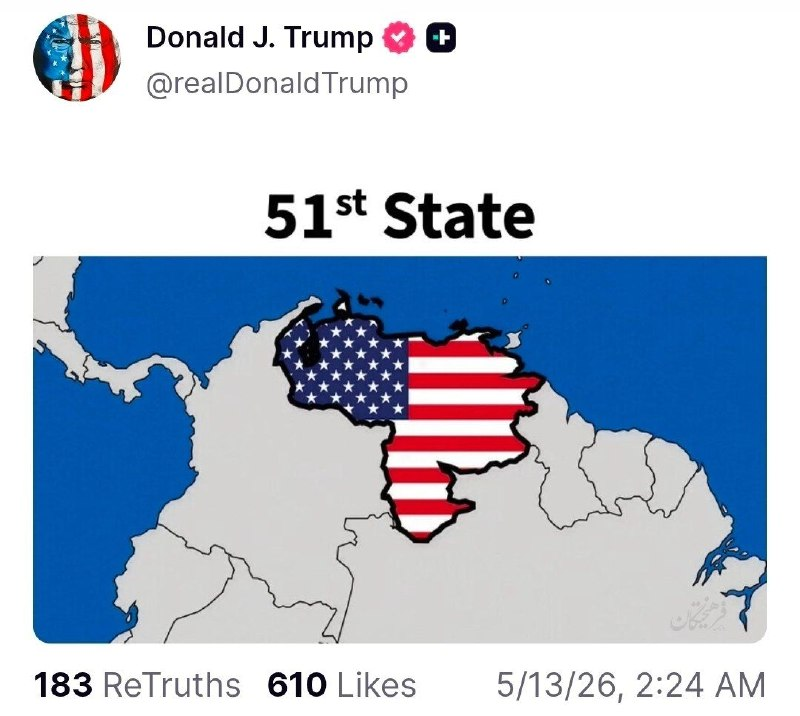

ترامپ نقشهٔ ونزوئلا را، با طرح پرچم آمریکا و تیترِ «پنجاه‌و‌یکمین ایالت» پست کرد!

》OPT《

@OfficialPersiaTwiter

## bbcpersian — post 280887

🖋 الکسی کالمیکوف، بی‌بی‌سی روسی

🔻جنگ آمریکا و اسرائیل با ایران منجر به بحران انرژی شده است؛ بحرانی که از آسیا آغاز شد و به تدریج به اروپا نزدیک می‌شود. نخستین ضربه را کشورهای فقیر متحمل شدند، اما در میان کشورهای ثروتمند نیز قربانیانی وجود دارد. بریتانیا نخستین کشوری خواهد بود که بیش از دیگران آسیب می‌بیند. دلیل این امر چیست؟

نخست به این دلیل که بریتانیا بیش از دیگر کشورهای گروه هفت به واردات منابع انرژی وابسته است و به همین دلیل، هرگونه کمبود انرژی بلافاصله بر قیمت‌ها در داخل این کشور تاثیر می‌گذارد.

آلمان، ژاپن و فرانسه نیز واردکننده انرژی هستند، اما برخلاف بریتانیا ذخایر گاز دارند و می‌توانند موقتا بخشی از نیاز خود را با زغال‌سنگ تامین کنند. آمریکا و کانادا هم نه‌تنها در زمینه انرژی خودکفا هستند، بلکه مازاد تولید خود را صادر می‌کنند.

بیشتر بخوانید:
https://bbc.in/4d8oV0h
📸GettyImages/ EPA/Shutterstock/ In Pictures via Getty Images/ AFP via Getty Images/ Bloomberg via Getty Images/ NurPhoto via Getty Images
@BBCPersian

## bbcpersian — post 280886

  

🔻رسانه‌های دولتی لبنان می‌گویند حملات هوایی اسرائیل حداقل ۱۳ نفر را در جنوب لبنان کشته است که دو نفرشان از کارکنان اورژانس بوده‌اند.

به گزارش خبرگزاری ملی لبنان، طی ۲۴ ساعت گذشته، شش نفر در اثر اصابت گلوله به خانه‌ای در کفر دونین کشته و هفت نفر دیگر زخمی شدند.

بعد از ظهر سه‌شنبه، وزارت بهداشت لبنان اعلام کرد که دو امدادگر از سرویس اورژانس دفاع مدنی لبنان که توسط دولت اداره می‌شود، در حمله اسرائیل به نبطیه کشته و یک نفر دیگر زخمی شده است. بر اساس این گزارش، آنها در حال انجام ماموریتی در پاسخ به حمله قبلی بودند که منجر به کشته شدن یک نفر شد.

ارتش اسرائیل اعلام کرد که در حال بررسی گزارش‌ها است.

جوزف عون، رئیس جمهور لبنان، «غم و اندوه و تأسف خود را از کشته شدن دو عضو دفاع مدنی» در نبطیه به نام‌های حسین جابر و احمد نوره ابراز کرد و تأکید کرد که «تجاوز مداوم اسرائیل مانع تلاش‌ها برای برقراری آرامش می‌شود».

وزارت بهداشت لبنان نیروهای اسرائیلی را به هدف قرار دادن عمدی امدادگران متهم کرد.

📷EPA
@BBCPersian

## bbcpersian — post 280885

  

🔻مرکز رسانه‌ای قوه قضائیه ایران اعلام کرده است که احسان افرشته به جرم «جاسوسی برای اسرائیل» بامداد امروز (چهارشنبه) اعدام شده است.

آقای افرشته متهم شده بود که ابتدا «در پوشش راننده تاکسی اینترنتی» دستورات ماموران موساد را اجرا می‌کرده و سپس با استخدام در یک شرکت وابسته به یک نهاد نظامی اطلاعات حساسی را به اسرائیل منتقل کرده است.

به گزارش شبکه حقوق بشر هرانا، احسان افرشته متولد ۱۳۷۲ بوده و در سال ۱۴۰۳ پس از بازگشت به ایران از ترکیه بازداشت شده است.

با پایان جنگ ایران با آمریکا و اسرائیل، قوه قضائیه اجرای احکام اعدام تسریع و تشدید کرده است.

به گفته گزارشگر ویژه شورای حقوق بشر سازمان ملل متحد در یک سال اخیر تعداد اعدام‌ها در ایران به شکل کم‌سابقه‌ای افزایش یافته، این روند پس از جنگ اخیر که نهم اسفند (۲۸ فوریه) با حملات اسرائیل و آمریکا آغاز شد، شتاب بیشتری گرفته است.

نهادهای حقوق بشر از دادرسی‌های ناعادلانه، نقض حقوق متهم و موج اعدام‌ها بر اساس «اعترافات» زیر شکنجه و فشار ابراز نگرانی کرده‌اند.

📷MIZAN
@BBCPersian

## bbcpersian — post 280884

🔻ان‌بی‌سی؛ ترامپ به دنبال تغییر نام عملیات نظامی علیه ایران است تا از محدودیت ۶۰ روزه کنگره پرهیز کند

رسانه‌های آمریکا می‌گویند به گفته دو مقام امريکايی، پنتاگون در حال بررسی اين موضوع است که اگر آتش‌بس کنونی با ايران فروبپاشد و دونالد ترامپ تصميم به ازسرگيری عمليات گسترده نظامی بگيرد، نام جنگ رسما به «عمليات پتک‌ سنگین» تغيير يابد.

بحث‌ها درباره احتمال جايگزينی نام «عمليات خشم حماسی» با «عمليات پتک سنگین» نشان می‌دهد دولت امريکا تا چه اندازه احتمال ازسرگيری جنگی را که در ۲۸ فوريه آغاز شد، جدی می‌گيرد.

اين تغيير نام همچنين می‌تواند به آقای ترامپ امکان دهد استدلال کند که با آغاز عمليات جديد، مهلت ۶۰ روزه مورد نياز برای دريافت مجوز جنگ از کنگره دوباره از نو آغاز می‌شود.

در چند هفته گذشته و در خلال حضور مقام‌های دولت آمریکا در کنگره، نمایندگان به مفاد قانونی اشاره کردند که به موجب آن دولت آمریکا حتی در پی عملیات نظامی به بهانه «تهدید فوری» باید پس از ۶۰ روز از آغاز این حملات، برای ادامه جنگ از کنگره که قانونا حق تصمیم‌گیری درباره اعلان و آغاز جنگ را دارد، مجوز بگیرد.

https://bbc.in/4tAXKjn
@BBCPersian

## Lichargoo — post 24865

قدیم اگه همچین زلزله‌ای میومد ملت تا صبح تو ماشینا و پارکا می‌خوابیدن، ببین چقدر پوستمون کلفت شده که کیرمونم نیست.

## Tans_Footbali — post 236257

اوضاع زندگی و خورد و خوراکتون چطوره؟
اگه دوست داشتید بگید

💛@Tans_Footbali

## Tans_Footbali — post 236256

  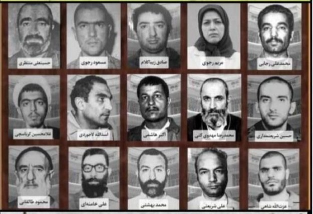

صبح امروز احسان افراشته به اتهام جاسوسی برای موساد توسط جمهوری شیطانی اسلامی به دار آویخته شد. @Tans_Footbali

## Tans_Footbali — post 236255

  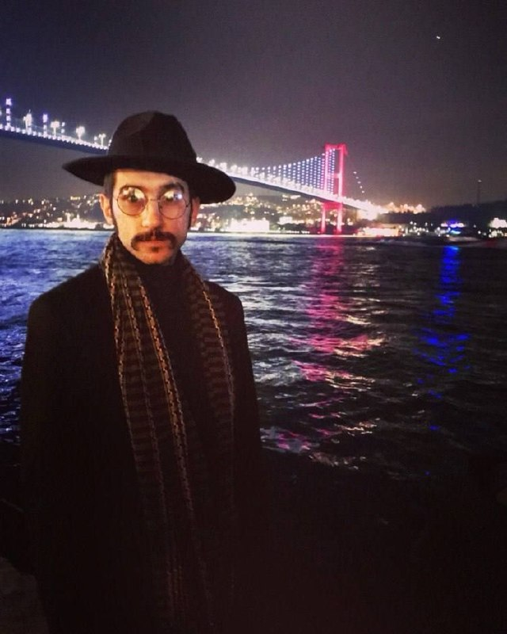

​عرفان شکورزاده، دانشجوی ۲۹ ساله و رتبه اول رشته هوافضا صبح امروز توسط جمهوری تروریستی اسلامی اعدام شد💔 @Tans_Footbali

## hamclasixii — post 75346

  

🔴#فوری | دقایقی پیش زمین‌لرزه‌ای تهران را لرزاند 📚 @hamclasix 📚

## hamclasixii — post 75345

🔴آموزش‌و‌پرورش: احتمال دایر بودن کلاس‌ها در پنج‌شنبه، جمعه ۷ و ۸ خرداد

معاون آموزش متوسطه آموزش‌وپرورش:
🔹 با توجه به اینکه امسال دانش‌آموزان حدود ٣  ماه آموزش مجازی و دو هفته تعطیلات غیرمترقبه داشتند، یک هفته به زمان آموزش اضافه شد و امتحانات به جای اول خرداد از ٩ خرداد برگزار می‌شود.
🔹 اگر دبیری احساس کند نیاز به رفع اشکال وجود دارد حتی روزهای پنج‌شنبه و جمعه ٧ و ٨ خرداد، کلاس‌ها برگزار است.

📚 @hamclasix 📚

## withyashar — post 11111

الجزیره: منابع دیپلماتیک می‌گویند که ۱۱۲ کشور هم‌اکنون از پیش‌نویس قطعنامه پیشنهادی آمریکا به شورای امنیت سازمان ملل درباره تنگه هرمز حمایت می‌کنند.
@withyashar

## withyashar — post 11110

کیهان: اگر مذاکره کنیم جنگ می‌شود؛ مذاکره نکنیم جنگ نمی‌شود
@withyashar

## withyashar — post 11109

ویزای ۵ ستاره عراق برای جام جهانی رد شد!
آمریکا در تازه‌ترین اقدام خود در آستانه جام‌جهانی ۲۰۲۶ ویزای ۵ بازیکن کلیدی تیم ملی عراق از جمله علی الحمادی (ستاره لوتون تاون)، مهند علی و حیدر عبدالکریم را رد کرد.
@withyashar

## withyashar — post 11108

ترامپ در تروث : شبکه سی‌ان‌بی‌سی به‌اشتباه گزارش داد که جنسن هوانگِ بزرگ از شرکت انویدیا به گردهمایی شگفت‌انگیز بزرگ‌ترین زنان و مردان دنیای تجارت که با افتخار راهی چین هستند دعوت نشده است. در حقیقت، جنسن همین حالا در هواپیمای ریاست‌جمهوری آمریکا حضور دارد و مگر اینکه من از او بخواهم آنجا را ترک کند که بسیار بعید است گزارش سی‌ان‌بی‌سی اشتباه است یا همان‌طور که در سیاست می‌گویند: اخبار جعلی!

مایه افتخار است که جنسن، ایلان ماسک ، تیم کوک، لری فینک، استیون شوارتزمن، کلی اورتبرگ از بوئینگ، برایان سایکس از کارگیل، جین فریزر از سیتی، لری کالپ از جی‌ای ایرواسپیس، دیوید سولومون از گلدمن ساکس، سانجای مهروترا از مایکرون، کریستیانو آمون از کوالکام و بسیاری دیگر، در این سفر به کشور بزرگ چین همراه هستند؛ جایی که من از رئیس‌جمهور شی، رهبری با جایگاهی برجسته و استثنایی، خواهم خواست که چین را «بازتر» کند تا این افراد درخشان بتوانند توانایی‌های خارق‌العاده خود را به کار بگیرند و به جمهوری خلق چین کمک کنند به سطحی حتی بالاتر برسد!

در واقع، قول می‌دهم وقتی تا چند ساعت دیگر کنار هم باشیم، این نخستین درخواست من خواهد بود. هرگز ایده‌ای ندیده یا نشنیده‌ام که برای کشورهای فوق‌العاده ما از این سودمندتر باشد!
@withyashar

## withyashar — post 11107

  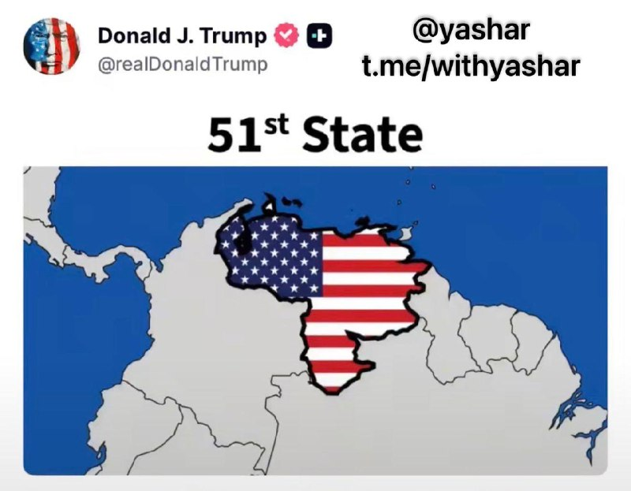

ترامپ در تروث پستی گزاشته که ونزوئلا رو به عنوان ایالت ۵١ ام آمریکا نشون میده
@withyashar

---
📅 بروزرسانی: 1405/02/23 07:07
---

## persian_trend_official — post 14024

  <a href="telegram/content/persian_trend_official_14024_1778643437.mp4" target="_blank">🎬 Download video</a>

صبحتون بخیر ☕️

📝 Nick
📌 @persian_trend_official
پرشین ترند | متفاوت‌ترین کانال نظامی

## bbcpersian — post 280883

🔻 نیویورک تایمز: ایران هنوز به ۳۰ سکوی موشکی از مجموع ۳۳ سکوی خود در حاشیه خلیج فارس دسترسی دارد

روزنامه نیویورک تایمز در گزارش که روز سه‌شنبه - ۱۲ مه / ۲۲ اردیبهشت - منتشر کرده نوشته ایران همچنان به ۳۰ سکو از ۳۳ سکوی موشکی خود در حاشیه خلیج فارس دسترسی دارد.

این روزنامه آمریکایی نوشته این موضوع از توان بیشتر نظامی ایران نسبت به آنچه ارتش آمریکا و کاخ‌سفید در جریان جنگ مشترک با اسرائیل مدعی نابودی آنها شده بودند، حکایت دارد.

در همین حال، دونالد ترامپ که روز سه‌شنبه برای دیدار با همتای خود - شی جین پینگ - راهی چین شد، در پستی که می‌تواند واکنش به این گزارش نیویورک تایمز تلقی شود گزارش‌هايی را که حاکی از وضعیت نظامی ايران هستند، «اخبار جعلی» توصيف کرده و گفته اين گزارش‌ها به تهران «اميد واهی» می‌دهند.

او چنين پوشش رسانه‌ای را «خيانت» خواند و مدعی شد نيروهای ايرانی متحمل شکست‌های سنگينی شده‌اند.

آقای ترامپ همچنين ادعا کرد ايران پيش‌تر ۱۵۹ شناور نظامی در اختيار داشته، اما «اکنون همه آنها در کف دريا قرار دارند».

او در ادامه مدعی شد ايران ديگر نيروی دريايی موثری ندارد و نيروی هوايی و فناوری‌های نظامی اين کشور نيز «کاملا نابود شده‌اند».

با این حال، پیش‌تر گزارش دیگری که بازتاب گسترده‌ای در رسانه‌های آمریکا داشت مدعی شده بود ایران همچنان تا حدود زیادی توان نظامی خود از جمله موشکی و پهپادی، را حفظ کرده است.

@BBCPersian

## bbcpersian — post 280882

  <a href="https://t.me/bbcpersian/280882" target="_blank">📎 Download file</a>

یک معترض به جنگ آمریکا با ایران در جریان نشستی که روز سه‌شنبه از سوی نشریه پولتیکو و کارخانه تسلیحات‌سازی لاکهید در واشنگتن برگزار شده بود، در میان سخنرانی شاهزاده رضا پهلوی به روبروی صحنه رفت و در حالی که فریاد می‌زد خطاب به او گفت:

«شما کجا بودید وقتی مردم ما داشتند فرزندانشان را از زیر آوار بمب‌هایی که شما به کشورمان دعوت کرده‌اید بیرون می‌کشیدند؟ چطور می‌توانید بگویید «مردم من! ایران من!» و بعد‌ آنها را دعوت به بمباران مردم کنید؟ شرم بر شما!»

ماموران امنیتی خیلی زود این زن معترض را از محل سخنرانی بیرون بردند. با این حال، ویدیو مربوط به این رویداد سه‌شنبه عصر در شبکه‌های اجتماعی بازخورد فراوانی پیدا کرد.

آقای پهلوی در این نشست که چند نفر از وزرا و مقام‌های ارشد فعلی و سابق آمریکا هم در آن شرکت داشتند، در بخشی از سخنان خود از مذاکره با حکومت در ایران پس از آتش‌بس با آمریکا انتقاد کرد و ان را با آنچه تلاش برای نجات مردم ایران از «رژیم» جمهوری اسلامی خواند، در تناقض ارزیابی کرد.

🎥 Bita_4liberation / Instgram
@BBCPersian

---
📅 بروزرسانی: 1405/02/23 03:48
---

## thisisermia — post 59

مرسی که این مدت صبر کردید 🤍 اینکه این‌قدر با وگ همراه بودید واقعاً برامون ارزشمنده. خوشحالیم بگیم وگ دوباره در دسترس قرار گرفته و این بار به یه دیتاسنتر بهتر منتقل شده. منابع سرور هم ارتقا پیدا کرده. متأسفانه ارائه‌دهنده قبلی اجازه گرفتن بکاپ رو نداد و بخشی…

## thisisermia — post 58

مرسی که این مدت صبر کردید 🤍 اینکه این‌قدر با وگ همراه بودید واقعاً برامون ارزشمنده.

خوشحالیم بگیم وگ دوباره در دسترس قرار گرفته و این بار به یه دیتاسنتر بهتر منتقل شده. منابع سرور هم ارتقا پیدا کرده.

متأسفانه ارائه‌دهنده قبلی اجازه گرفتن بکاپ رو نداد و بخشی از فایل‌ها از دست رفت، ولی هنوز پیگیرش هستیم و هر خبری باشه بهتون اطلاع می‌دیم.

خبر خوب اینکه سایت به یه استوریج و فضای ذخیره‌سازی مطمئن وصل شده و همین باعث میشه بتونیم بعضی از محدودیت‌ها رو هم کمتر کنیم و تجربه بهتری براتون بسازیم.

## thisisermia — post 45

سلام.

اول از همه جا داره بگم خوشحالم که ۵۱ هزار نفره شدیم. واقعاً نمی‌دونم جواب این همه محبت، انرژی و حس مثبتی که بهم دادید رو چطور باید بدم. فقط بدونید تک‌تک پیام‌هاتون برام ارزش داشته و باعث شده هنوز با انگیزه ادامه بدم.

یه سری مسائل هست که حس کردم لازمه شفاف درباره‌شون باهاتون صحبت کنم، چون انگار خیلی از دوستان درگیرش بودن و نگرانی‌هایی داشتن.

وگ از ۲۵ فروردین فعال شد و ۱ اردیبهشت به دلایل امنیتی خاموشش کردیم. حالا می‌خوام صادقانه توضیح بدم چی شد. یه نفر اومده بود پیوی من و کامل اطلاعات شخصیم رو گفت و حتی خبر از تشکیل پرونده برای من توی واجا داد. دقیقاً همون شب قبلش، ما خودمون وگ رو بستیم چون دیدیم یه سری گزارش‌های عجیب و کاملاً نامرتبط درباره وگ برای اکانت‌های واجا توی پیام‌رسان‌های داخلی ارسال شده بود.

در نهایت شب ۱۰ اردیبهشت دوباره سایت رو بالا آوردیم، ولی این بار تصمیم گرفتیم توی بعضی مسائل تجدیدنظر کنیم. بیشتر هم به درخواست اطرافیانم و دوست‌دخترم؛ فقط برای اینکه امنیت من حفظ بشه و آینده‌ی من از بین نره.

ما تا امروز تمام هزینه‌های وگ رو خودمون پرداخت کردیم و کل پروژه هم به‌صورت تک‌نفره توسعه داده شده و از صفر نوشته شده. حتی یک ریال هم از هیچ شخص یا نهادی دریافت نکردیم. برای همین وقتی بعضی‌ها میگن ما داریم به جایی باج می‌دیم یا وابستگی خاصی داریم، واقعاً ناراحت‌کننده و ناعادلانه‌ست.

در مورد امنیت سایت هم چیزی که خیلیاتون نگرانش بودید رو شفاف بگم؛ ما عملاً به‌جز اطلاعات پروفایل و پسورد هش‌شده چیزی ذخیره نمی‌کنیم. حتی IP شما هم جایی لاگ یا نگهداری نمی‌شه.

بخش محتوای تلگرام هم از طریق یه سری روش‌های جعل IP مبتنی بر IPX نوشته شده و با کتابخونه Telethon کار می‌کنه. تقریباً توی هر شرایطی هم قابل استفاده‌ست و بدون اغراق می‌تونم بگم کمتر پروژه یا پلتفرم مستقلی توی این سطح چنین چیزی پیاده کرده.

بذارید صادقانه‌تر هم حرف بزنم. ما مثل خیلی از پلتفرم‌های مشابه، امکان راه‌اندازی زیرساخت فروش VPN یا به اصطلاح وگ‌پروکسی رو هم داریم؛ اونم با قیمت‌هایی حدود گیگی ۳۰ تا ۵۰ هزار تومن که عملاً می‌تونه بازار بزرگی برامون بسازه. حتی امکان لایو کردن اکثر شبکه‌های ماهواره‌ای، مخصوصاً شبکه‌های خبری رو هم داریم. ولی وسط همه این‌ها، چیزی که همیشه بیشتر از هر چیزی برامون مهم بوده امنیت و ادامه داشتن این مسیره.

من حق می‌دم که نگران باشید. خیلیاتون وگ رو به پیام‌رسان‌های داخلی ترجیح دادید و زمان زیادی داخلش گذروندید. طبیعیه که امنیت و فضای اینجا براتون مهم باشه. فقط خواهش می‌کنم ما رو هم درک کنید.

در واقع الان وگ برای من از یه پروژه کوچیک تبدیل شده به یه کار تمام‌وقت. حتی بعضی وقت‌ها دیگه نمی‌تونم برای زندگی شخصیم زمان بذارم. پیش اومده که دوستام و نزدیکانم کل روز از من بی‌خبر باشن و نتونن باهام ارتباط بگیرن. با همه این‌ها، صادقانه بگم که از انجامش خوشحالم.

من ۱۷ سالمه و واقعاً دارم آینده و زندگیمو وسط یه خطر واقعی می‌ذارم تا این فضا زنده بمونه.

در آخر ببخشید که خیلی طولانی شد، ولی مرسی که هنوز کنار مایید 🤍

## thisisermia — post 39

بعد از مدت‌ها فشار و استرسی که رومون بود، بالاخره تونستیم با یه آپدیت نسبتاً بزرگ برگردیم. مرسی از همراهیتون، مرسی از پیام‌های محبت‌آمیزتون. امیدوارم قابلیت‌های جدید مورد پسندتون باشه. http://vag.gateserve.ir:8080

## thisisermia — post 37

  

بعد از مدت‌ها فشار و استرسی که رومون بود، بالاخره تونستیم با یه آپدیت نسبتاً بزرگ برگردیم.

مرسی از همراهیتون، مرسی از پیام‌های محبت‌آمیزتون.

امیدوارم قابلیت‌های جدید مورد پسندتون باشه.
http://vag.gateserve.ir:8080

## thisisermia — post 35

سلام دوستان، امیدوارم حالتون خوب باشه. واقعاً نمی‌دونم از کجا شروع کنم و چی بگم؛ فقط می‌دونم توی این چند روز از ۳۲ هزار نفر شما، چیزی جز عشق و انگیزه نگرفتم. از لطف‌هایی که بهم داشتید و حرف‌هایی که زدید، حس باارزش بودن گرفتم. واقعاً ممنونم از ارزشی که برام…

## thisisermia — post 34

## thisisermia — post 32

در مورد وگ و قطعی اینترنت، واقعاً الان خودم هم تصویر روشنی از اینکه دقیقاً چی داره اتفاق می‌افته و به کجا می‌رسه ندارم.

فقط می‌خوام یه کم زمان بدیم، فکر کنیم، مشورت کنیم و ببینیم اصلاً شرایط برای من و ادامه مسیر به چه شکلی پیش میره.

برای بعدش هم یه سری برنامه‌ها و ایده‌ها داریم، ولی فعلاً ترجیح می‌دم با عجله درباره‌ش تصمیم‌گیری نکنیم تا همه‌چیز شفاف‌تر بشه.

## thisisermia — post 31

سلام دوستان، امیدوارم حالتون خوب باشه. واقعاً نمی‌دونم از کجا شروع کنم و چی بگم؛ فقط می‌دونم توی این چند روز از ۳۲ هزار نفر شما، چیزی جز عشق و انگیزه نگرفتم. از لطف‌هایی که بهم داشتید و حرف‌هایی که زدید، حس باارزش بودن گرفتم. واقعاً ممنونم از ارزشی که برام…

## thisisermia — post 30

سلام دوستان، امیدوارم حالتون خوب باشه.

واقعاً نمی‌دونم از کجا شروع کنم و چی بگم؛ فقط می‌دونم توی این چند روز از ۳۲ هزار نفر شما، چیزی جز عشق و انگیزه نگرفتم. از لطف‌هایی که بهم داشتید و حرف‌هایی که زدید، حس باارزش بودن گرفتم. واقعاً ممنونم از ارزشی که برام قائل شدید.

هدف پروژه «وگ» از اول فقط ایجاد یه راه ارتباطی کوچیک بود. هیچ نگاه یا هدف سیاسی‌ای پشتش نبود، چون اصلاً در حد و اندازه‌ای نبودیم که بخوایم وارد این فضاها بشیم. وگ کاملاً مستقل بود؛ نه وابستگی‌ای به جایی داشت، نه حمایتی از جایی گرفت. تمام هزینه‌هاش رو خودمون دادیم و حتی یک ریال هم از هیچ شخص یا نهادی دریافت نکردیم.

واقعیت اینه که ما چند شب پیش، قبل از هر چیزی، به این نتیجه رسیدیم که کنترل فضا از توانمون خارج شده و به همین خاطر خودمون پروژه رو متوقف کردیم.

اما بعدش متوجه شدیم که متأسفانه برخی افراد، گزارش‌هایی نادرست درباره فعالیت‌های وگ به وزارت اطلاعات (واجا) ارسال کردن. از دیشب هم یه سری شایعات درباره تشکیل پرونده و حتی افشای هویت من به گوشم رسیده که واقعاً نمی‌دونم چقدرش درسته.

الان که دارم اینو می‌نویسم، نمی‌دونم ممکنه چه بلایی سرم بیاد و این احتمال هم هست که هر لحظه تصمیمات جدی‌تری از سمت نهادهای بالادست گرفته بشه.

وضعیت آینده‌ی من واقعاً نامشخصه. همون‌طور که خیلیاتون می‌دونید، سن زیادی ندارم و فقط ۱۷ سالمه. از بچگی به حوزه IT علاقه داشتم و سال‌ها دنبالش کردم و الان به این نقطه رسیدم. با همه این‌ها، خوشحالم که توی این شرایط خاموشی دیجیتال تونستم در حد یه چت‌روم ساده، چند ساعتی شما رو از فشاری که روی هممون هست دور کنم.

من به شخصه امیدوارم با عادی‌تر شدن شرایط، حداقل دسترسی به اینترنت برای همه برقرار بشه. چیزی که این مدت دیدیم، قطع کامل ارتباطات بود. اینترنتی که محدودیت روزانه داره و فقط به یه عده خاص داده میشه، واقعاً اسمش اینترنت نیست و بعیده تأثیری روی بهتر شدن وضعیت دیجیتال کشور داشته باشه.

در آخر باز هم از لطف و محبتی که بهم داشتید ممنونم. باز هم میگم، وضعیت من کاملاً نامشخصه. این گزارش‌ها به احتمال زیاد به دست واجا رسیده. در کل امیدوارم اتفاق بدی نیفته.

نمی‌دونم این پیام دقیقاً چه زمانی به دستتون می‌رسه یا کی فرصت خوندنش رو پیدا می‌کنید، اما بدونید توی این چند روز، واقعاً با تک‌تکتون ارتباط گرفتم. دوستون دارم و از ته دل برای همتون آرزوی موفقیت می‌کنم. 🤍

## thisisermia — post 1

Channel created

## persian_trend_official — post 14023

  <a href="telegram/content/persian_trend_official_14023_1778631530.mp4" target="_blank">🎬 Download video</a>

شبتون بخیر ❤️🔥

📝 Nick
📌 @persian_trend_official
پرشین ترند | متفاوت‌ترین کانال نظامی

## persian_trend_official — post 14022

🇰🇷 یو نی‌هاپ: وزیر دفاع کره جنوبی، آن گیوبک، می‌گوید سئول پس از گفتگو با مقامات آمریکایی در واشنگتن، مشارکت مرحله‌ای در تأمین امنیت ترافیک دریایی در تنگه هرمز را مد نظر قرار خواهد داد، از جمله احتمال به اشتراک‌گذاری اطلاعات و حمایت نظامی محدود.

📝 Nick

📌 @persian_trend_official
پرشین ترند | متفاوت‌ترین کانال نظامی

## persian_trend_official — post 14021

  <a href="telegram/content/persian_trend_official_14021_1778631532.mp4" target="_blank">🎬 Download video</a>

مجری:
اگر رژیم سقوط کند شما خود را در موقعیت رهبری دوران گذار میبینید و شما حدود 50 سال در ایران نبودید و رییس جمهور ترامپ گفت که مطمئن نیست شما به اندازه کافی در ایران حامی داشته باشید. به ایرانیان داخل و خارج از کشور که خواهان سقوط رژیم فعلی هستند اما شما را به عنوان رهبر بعدی نمیبینند، چه میگویید؟

شاهزاده رضا پهلوی:
من فکر می‌کنم میلیون‌ها نفری که به فراخوان من پاسخ دادند، گواه زنده‌ای بر این واقعیت هستند که من از حمایت گسترده‌ای در داخل ایران برخوردارم. و باز هم می‌گویم، به محض اینکه این قطع اینترنت برطرف شود، شما خواهید توانست دقیقاً بشنوید که مردم ایران چه می‌گویند.
پیام آخر من قبل از قطعی اینترنت نود میلیون بازدید داشت که پس از قطعی اینترنت به نزدیک شش میلیون رسید. این یعنی تمام پایگاه مخاطبان من در ایران هستند، همان افرادی که به فراخوان من پاسخ دادند.
ما گروگان این رژیم هستیم و گاهی اوقات گروگان‌ها نمی‌توانند بدون کمک خارجی خود را آزاد کنند. به همین دلیل است که ما به کمک خارجی نیاز داریم. باقی کارها را خودمان انجام خواهیم داد و دخالت خارجی را در این موارد نمی‌پذیریم.

📌 @persian_trend_official

## persian_trend_official — post 14020

  <a href="telegram/content/persian_trend_official_14020_1778631535.mp4" target="_blank">🎬 Download video</a>

⭕️ بنیامین نتانیاهو:

تنها کسی که رئیس موساد را منصوب می‌کند، نخست وزیر است. رومن توسط من به عنوان رئیس بعدی موساد کشور اسرائیل انتخاب شد - و او موساد را از قدرتی به قدرت دیگر رهبری خواهد کرد.

📝 Nick

📌 @persian_trend_official
پرشین ترند | متفاوت‌ترین کانال نظامی

## persian_trend_official — post 14019

  <a href="telegram/content/persian_trend_official_14019_1778631538.mp4" target="_blank">🎬 Download video</a>

⭕️ ویدئو منتشر شده در اینستاگرام بنیامین نتانیاهو:

*لیکود اسم یک حزب راست‌گرا است به معنای استحکام. (حزبی که بنیامین نتانیاهو عضو آن است.)

📝 Nick

📌 @persian_trend_official
پرشین ترند | متفاوت‌ترین کانال نظامی

## persian_trend_official — post 14018

  <a href="telegram/content/persian_trend_official_14018_1778631541.webm" target="_blank">🎬 Download video</a>

#طنز_تلخ

⭕️ بیانیه عرش الهی:

مجدد زلزله ای زیبا نازل کردیم.
خواهیم دید چه خواهد شد.
از توجه شما به این موضوع سپاس گزاریم.

📝 Nick

📌 @persian_trend_official
پرشین ترند | متفاوت‌ترین کانال نظامی

## persian_trend_official — post 14017

  <a href="telegram/content/persian_trend_official_14017_1778631541.mp4" target="_blank">🎬 Download video</a>

💢این ویدئو بهت نشون میده که پناه‌گیری درست چطور جانت رو حفظ می‌کنه در زمان زلزله

🫆:Tony

📌 @persian_trend_official
پرشین ترند | متفاوت‌ترین کانال نظامی

## persian_trend_official — post 14016

🔴کولیوند: زلزله پردیس تهران، خسارت مالی و جانی نداشت

💢 رئیس جمعیت هلال احمر: مردم نگران نباشند؛ زلزله پردیس تهران، خسارت مالی و جانی در پی نداشته است.

💢 ۲ پس لرزه ۴ و ۳.۴ ریشتری دیگر تهران را لرزاند.

🫆:Tony

📌 @persian_trend_official
پرشین ترند | متفاوت‌ترین کانال نظامی

## persian_trend_official — post 14015

🔴آماده باش مدیریت بحران پردیس؛ در پی زلزله مردم پردیس از خانه‌ها خارج شدند

💢در حالی که فرماندار شهرستان پردیس گفت: در پی وقوع زمین لرزه استان ستاد مدیریت بحران شهرستان در آماده باش کامل است، خبرنگار ایرنا از پردیس گزارش می‌دهد شهروندان پردیسی از خانه‌ها خارج شده و در پارک‌ها و خودروها مستقر شده‌اند.

🫆:Tony

📌 @persian_trend_official
پرشین ترند | متفاوت‌ترین کانال نظامی

## persian_trend_official — post 14014

🔴گزارش جدیدترین پس‌لرزه در استان تهران

بزرگی: 3.4
محل وقوع: حوالی پرديس
تاریخ و زمان وقوع به وقت محلی: 1405/02/23 00:32:44
طول جغرافیایی: 51.83
عرض جغرافیایی: 35.83
عمق زمین‌لرزه: 10 کیلومتر

نزدیک‌ترین شهرها:
10 کیلومتری پرديس (تهران)
11 کیلومتری بومهن (تهران)
12 کیلومتری رودهن (تهران)

نزدیکترین مراکز استان:
41 کیلومتری تهران
76 کیلومتری كرج

🫆:Tony

📌 @persian_trend_official
پرشین ترند | متفاوت‌ترین کانال نظامی

## persian_trend_official — post 14013

🔴 سخنگوی اورژانس تهران:

در پی زمین لرزه در تهران تا این لحظه مصدومی گزارش نشده است

🫆:Tony

📌 @persian_trend_official
پرشین ترند | متفاوت‌ترین کانال نظامی

## persian_trend_official — post 14012

  <a href="telegram/content/persian_trend_official_14012_1778631544.webm" target="_blank">🎬 Download video</a>

🔴حین و بعد از زلزله چه باید کرد؟

🫆:Tony

📌 @persian_trend_official
پرشین ترند | متفاوت‌ترین کانال نظامی

## persian_trend_official — post 14010

  <a href="telegram/content/persian_trend_official_14010_1778631545.webm" target="_blank">🎬 Download video</a>

🔴زلزله در تهران احساس شد 🫆:Tony 📌 @persian_trend_official پرشین ترند | متفاوت‌ترین کانال نظامی

## persian_trend_official — post 14009

خب دیگه بلا های آسمانی هم سر شوخی رو با مردم ایران باز کردن 🤦🏻‍♂️

📝 Nick

## persian_trend_official — post 14008

🔴زلزله در تهران احساس شد 🫆:Tony 📌 @persian_trend_official پرشین ترند | متفاوت‌ترین کانال نظامی

## persian_trend_official — post 14007

🔴زلزله در تهران احساس شد

🫆:Tony

📌 @persian_trend_official
پرشین ترند | متفاوت‌ترین کانال نظامی

## persian_trend_official — post 14006

https://youtube.com/live/rrGzLhyQoaY?feature=share

## persian_trend_official — post 14005

  

🇸🇦🇮🇷 — خبرگزاری رویترز درگزارشی مدعیست که عربستان سعودی در اواخر ماه مارس، حملات هوایی محرمانه‌ تلافی جویانه ای را در پاسخ به ایران انجام داده است.

☆Phantom☆

📌 @persian_trend_official
پرشین ترند | متفاوت‌ترین کانال نظامی

## persian_trend_official — post 14004

  <a href="telegram/content/persian_trend_official_14004_1778631546.mp4" target="_blank">🎬 Download video</a>

🔴ویدیو منتشر شده از کشتی کره ای آسیب دیده در حملات جمهوری اسلامی در روز های گذشته

🫆:Tony

📌 @persian_trend_official
پرشین ترند | متفاوت‌ترین کانال نظامی

## OfficialPersiaTwiter — post 498248

  <a href="telegram/content/OfficialPersiaTwiter_498248_1778631548.mp4" target="_blank">🎬 Download video</a>

من زدم تمام گسل‌هایشان را تحریک کردم ما بهترین محرک‌های گسل جهان را داریم توییت ترامپ به زودی.....! 》T_G《 @OfficialPersiaTwiter

## OfficialPersiaTwiter — post 498247

الان تو تهران آدم نمیدونه شیشه خونه رو چسب بزنه یا دنبال کانفیگ بگرده یا زیر میز بخوابه 》Arsalan《 @OfficialPersiaTwiter

## OfficialPersiaTwiter — post 498246

قدیم اگه همچین زلزله‌ای میومد ملت تا صبح تو ماشینا و پارکا می‌خوابیدن، ببین چقدر پوستمون کلفت شده که همه برگشتن تو تختخوابشون. 》بل‌مونت《 @OfficialPersiaTwiter

## OfficialPersiaTwiter — post 498245

رقابت ایران و آمریکا، این‌بار در طبیعت. کالیفرنیا هم چند دقیقه قبل و بعد تهران لرزیده. 》Maryam《 @OfficialPersiaTwiter

## OfficialPersiaTwiter — post 498244

  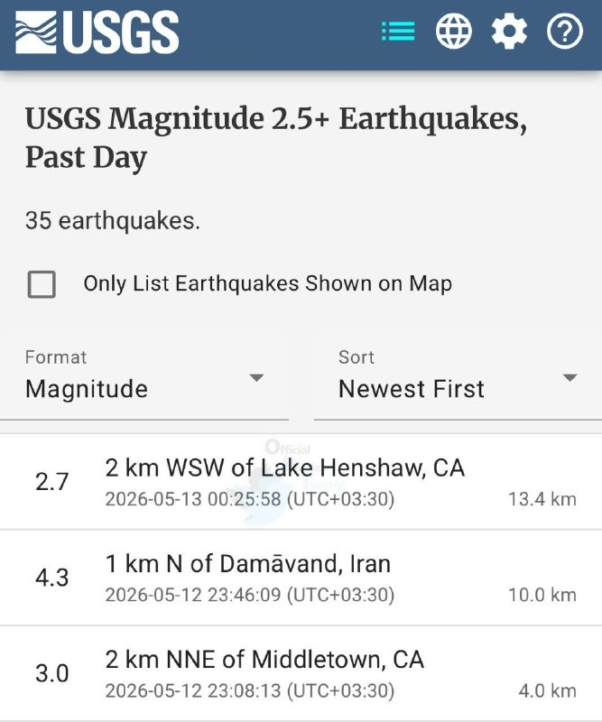

معاون امداد و نجات هلال احمر استان تهران: پس از زلزله اصلی دو پس لرزه را شاهد بودیم/ تا الان گزارش هیچ گونه آسیب یا تخریبی نداشته‌ایم 🔹مردم شهرستان پردیس و اطراف طی ساعات آتی در مکان‌های امن و مستحکم‌تر مستقر شوند. 》OPT《 @OfficialPersiaTwiter

## OfficialPersiaTwiter — post 498243

چند وقت دیگه که فضایی‌ها برعکس سناریوی فیلم‌های هالیوودی بجای حمله به لندن و وگاس حمله کردن به ورامین و قرچک دلتون برا همین زلزله‌ها هم تنگ میشه. 》خلافکار《 @OfficialPersiaTwiter

## OfficialPersiaTwiter — post 498242

کولیوند: زلزله پردیس تهران، خسارت مالی و جانی نداشت رئیس جمعیت هلال احمر: مردم نگران نباشند؛ زلزله پردیس تهران، خسارت مالی و جانی در پی نداشته است. 》OPT《 @OfficialPersiaTwiter

## OfficialPersiaTwiter — post 498241

آخرین آمار زلزله ها تا ساعت ۱۲:۳۲ 》OPT《 @OfficialPersiaTwiter

## OfficialPersiaTwiter — post 498240

  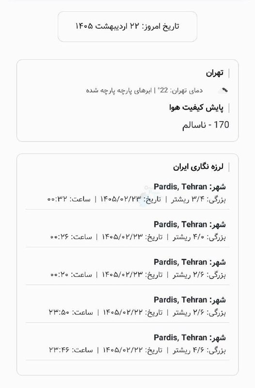

خدایا ما را از شر طوفان، زلزله و مصاحبه‌های ترامپ مصون بدار. 》ژنرال《 @OfficialPersiaTwiter

## OfficialPersiaTwiter — post 498239

گزارش سومین زلزله تهران بزرگی: 3.4 محل وقوع:  حوالی پرديس تاریخ و زمان وقوع به وقت محلی: 1405/02/23 00:32:44 طول جغرافیایی: 51.83 عرض جغرافیایی: 35.83 عمق زمین‌لرزه: 10 کیلومتر نزدیک‌ترین شهرها: 10 کیلومتری پرديس (تهران) 11 کیلومتری بومهن (تهران) 12 کیلومتری…

## OfficialPersiaTwiter — post 498238

گزارش مقدماتی زمین‌لرزه مجدد در تهران بزرگی: ۴ ریشتر محل وقوع: حوالی پرديس زمان: ۲۶ دقیقه بامداد عمق زمین‌لرزه: ۸ کیلومتر نزدیک‌ترین شهرها: ۹ کیلومتری پرديس (تهران) ۱۱ کیلومتری بومهن (تهران) ۱۲ کیلومتری رودهن (تهران)      نزدیکترین مراکز استان: ۴۰ کیلومتری…

## OfficialPersiaTwiter — post 498237

آخرین آمار زلزله ها تا ساعت ۱۲:۲۰ 》OPT《 @OfficialPersiaTwiter

## OfficialPersiaTwiter — post 498236

  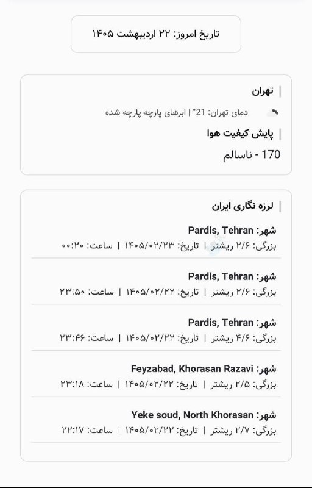

زندگی تو ایران واقعا جالبه! همینجوری که نمیدونی آتش بس تموم شده یا صدای طوفانه یهو زلزله میاد که حوصلت سر نره. 》مادر پسرها《 @OfficialPersiaTwiter

## OfficialPersiaTwiter — post 498235

مگه گربه نباید زلزله رو پیش بینی کنه؟ وضعیت گربه من موقع وقوع زلزله: 》هیچ و هوچ《 @OfficialPersiaTwiter

## OfficialPersiaTwiter — post 498234

  

🔴فوری تهران دوباره لرزید 》OPT《 @OfficialPersiaTwiter

## OfficialPersiaTwiter — post 498233

ترامپ الان زلزله رو هم کنار نیرو دریایی فاکتور می‌کنه. 》Prime《 @OfficialPersiaTwiter

## OfficialPersiaTwiter — post 498232

⭕️بیانیه زلزله در پی حمله چند دقیقه پیشش به تهران : اسم عملیات امشب «لرزش حماسی» بود، مسئول‌های ایران خیلی مغرورن، فکر میکنن هیچ چیزی تکونشون نمیده، ولی ما یه لرزش خیلی خوشگل رو فرستادیم! میدونید ما لرزشای زیبایی داریم، خیلی زیبا. لرزش‌های ما در دنیا بهترین…

## OfficialPersiaTwiter — post 498231

بابام داشت میگفت الویت من خانوادست من جونم رو هم واسه خانوادم میدم، صحبتش تموم نشده بود زلزله اومد دیدم بابام نیست، سریع تر از ما رفته بود تو خیابون :))))) نکشیمون سوپرمن 》SaRa《 @OfficialPersiaTwiter

## Lichargoo — post 24864

ترامپ الان زلزله رو هم کنار نیرو دریایی فاکتور می‌کنه.

## Lichargoo — post 24863

بیانیه خدا درباره زلزله چند دقیقه پیش تهران :

مسئول‌های ایران خیلی مغرورن، فکر میکنن هیچ چیزی تکونشون نمیده، ولی ما فرستادیم یه لرزش خیلی خوشگل رو!
میدونید ما لرزشای زیبایی داریم، خیلی زیبا. لرزش‌های ما در دنیا بهترین هستن همونطور که خودمون هستیم.
این فقط شروعی برای ما بود، با عزرائیل هماهنگ کردم، اگه اونا به ظلم ادامه بدن، اتفاقات بدی براشون میفته، خیلی بد...
از توجه شما به این موضوع سپاسگزارم
خداوند الرحمن الرحیم

## Lichargoo — post 24862

  

رحم در ‌واکنش به لیوان چهارم دمنوش زعفرون:

@Lichargoo

## Lichargoo — post 24861

‏هانتا ویروس رو برای زن ها ساختن،
وگرنه مرد ها که با یه سرماخوردگی ساده هم منقرض میشن

## Lichargoo — post 24860

ما زودانزال نیستیم، ما فقط میخاییم این بساط فساد زودتر جمع شه

## Lichargoo — post 24859

مجتبی ما گفتیم رهبری رو نبینی. نه که کلا هیچکسی رو نبینی و حتی ویسم ندی

## Lichargoo — post 24858

زندگی تو خاورمیانه اینطوریه که
یا جنگ خواهیم داشت
یا جنگی خواهیم ساخت

## Lichargoo — post 24857

اگه اینترنت غزه ۷۳ روز قطع می‌شد گرتا تونبرگ به نشانه‌ی اعتراض ۷۳ متر کابل اینترنت رو می‌کرد تو کونش.

## Lichargoo — post 24856

نجات دهنده سفارته. ویزاست. بلیط هواپیماست.

## Lichargoo — post 24855

فشار روانی فقط اونجا که آقای وی پی انی که تو معرفیش کردی به دوستات، کانفیگاش وصل نمیشه

## kobsihub — post 27752

‏این حقارت کیلوبایت و مگابایت شماری هیچ‌جوره برام عادی نمیشه، هر ثانیه و هر دقیقه فشارش روی اعصاب و روانمه.
Saad @kobsihub

## kobsihub — post 27751

میگم چرا نت مارو وصل نمیکنید
یعنی اون جاسوس دیوث موساد
نداره ۵۰۰ تومن بده کانفیگ؟

Saad @kobsihub

## kobsihub — post 27750

‏روکش دندونم افتاد قورتش دادم :)))
‏رفتم دندون پزشکی گفت اینقد هزینه اش میشه
‏گفتم همون روکش رو نمیشه دوباره بچسبونی؟
‏گفت مگه داریش؟
‏گفتم یکی دو روزه جورش میکنم :)

Saad @kobsihub

## kobsihub — post 27749

‏شما یادتون نمیاد یه زمانی بدون فیلترشکن میشد بری تو Weather وضعیت آب و هوا رو ببینی.

Saad @kobsihub

## kobsihub — post 27748

هم‌اکنون با شروع مجدد درگیری و احتمال حمله آمریکا به ج.ا؛ شاخص قیمت کانفیگ هم داره میره بالا!

Saad @kobsihub

## kobsihub — post 27747

فکر میکنم یکی از بزرگترین دلایل افسردگی این جامعه بلا تكليفيه، شما هیچ برنامه ریزی ای نمیتونی برای یک ماه آینده ات بکنی چون معلوم نیس چه اتفاقی میخواد بیوفته.

Saad @kobsihub

## kobsihub — post 27746

من ریدم تو این‌ زندگی‌ای که تو کرونا با سه تا ماسک داشتم ازش محافظت می‌کردم.

Saad @kobsihub

## kobsihub — post 27745

‏لاته ۴۰۰ تومن؟ با این قیمت لاته نیست دیگه لامه عزیزم

Saad @kobsihub

## kobsihub — post 27744

سلام دوستان امیدوارم همه صحیح سالم باشید
از فردا و تا جایی که اینترنت داشته باشم براتتون توییت میزارم و ادامه میدیم ❤️

## kobsihub — post 27740

به گدائه هزاری دادم برگشت گفت مگه هنوز هزاری هست؟ هزاری رو گرفتم پونصدی بهش دادم بدونه پونصدی هم هست.

sara @kobsihub

## kobsihub — post 27739

‏من دیگه امیدی به ترامپ ندارم. چطوری میتونیم کارتل مکزیک رو بیاریم تو تیم خودمون؟

◡̈🦦 @kobsihub

## kobsihub — post 27738

  

دوسپسرم هر۳۰ ثانیه یه بار:

sara @kobsihub

## kobsihub — post 27737

ازدواج خیلی عجیبه‌ها
فک کن بابات با دستای خودش میفرستت که بری بدی

sara @kobsihub

## kobsihub — post 27736

یونی بت راهی برای افزایش سرمایتون👌
همین حالا عضو شین و امار سوداش چک‌کن

## kobsihub — post 27735

  

💡 میخوای یاد بگیری چطوری با همین گوشی تو دستت از پیش بینی فوتبال سود کنی؟ سیگنال ضریب بالا و کم ریسک میخوای؟ فرصتو از دست نده همین الان عضو کانال VIP یونی بت شو👇

➖➖➖➖➖
🎁کسب درامد از پیش بینی فوتبال راحته اگ این کانال داشته باشی چون کارش بلده:aa7
https://t.me/+YwYFluMQ5-kyNmY8
https://t.me/+YwYFluMQ5-kyNmY8

## kobsihub — post 27734

خدایا یه دوست پسر بهم بده ببینم گرایشم چیه دادن بلدم یا اصلا لزم

sara @kobsihub

## kobsihub — post 27733

  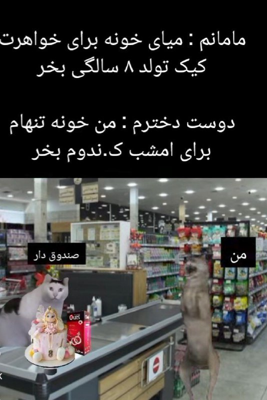

دارک شد

sara @kobsihub

## kobsihub — post 27732

شاید عیدی بهت ندم
ولی عید بهت میدم

sara @kobsihub

## kobsihub — post 27731

چرا وقتی میرین دسشویی کونتون رو با مایع نمیشورین؟
اما دستتون رو که کونی شده با مایع میشورین!؟

sara @kobsihub

## kobsihub — post 27730

  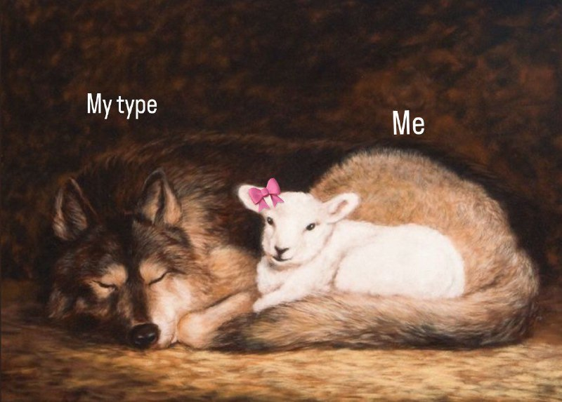

تایپ من همیشه :

sara @kobsihub

## thefeedconfig — post 75

اکانت گیتهابم ساسپند شده
فعلا کانفیگ ها و نسخه اخر برنامه رو میتونید از همینجا دانلود کنید
نگران نباشید، درستش میکنم 😄

## thefeedconfig — post 74

  <a href="https://t.me/thefeedconfig/74" target="_blank">📎 Download file</a>

✅ thefeed-android-v0.17.5-arm64-v8a.apk

📊 Size: 8.9 MB
🔐 SHA256:
02d56658de1ca4afcc3e77256c6deb3170cd7e1d8fdbcf44c602b2a499d5068f

نسخه جدید TheFeed (v0.17.5) 🚀

🟧 تغیرات بخش اصلی:

🔸 رفع مشکل دکمه "دیگر نمایش نده" در پاپ آپ اپدیت
🔸 رفع مشکل اشتباه ذخیره شدن اسم بعضی فایل ها در اندروید (اسم فایل های npv درست ذخیره نمیشد)
🔸 دیگه نسخه اندروید روی پورت تکراری میاد بالا تا لوکال استوریج پاک نشه (اینجوری عکس های که دانلود کردید هم نیاز به دانلود مجدد ندارن و همینکه کانال رو باز کنید عکس‌هایی که قبلا دانلود شدن رو نشون میده)
🔸 اعلان نسخه جدید و دکمه دانلود نسخه جدید رو واسه نسخه IOS برداشتم

بخش teleMirror تغییر زیادی نداشته (یکم باگ فیکس کوچیک داشته)

کانال اصلیم:
@networkti

کانال کانفیگ برای برنامه:
@thefeedconfig

لینک دانلود نسخه جدید برای تمام سیستم‌عامل‌ها از داخل ایران (با گیتهاب):

https://github.com/sartoopjj/thefeed-files/archive/refs/heads/main.zip 📥

## thefeedconfig — post 56

اگر ریزالور هاتون کند شده میتونید از بخش "پیدا کردن ریزالور" ریزالور های جدید مخصوص شبکه خودتون پیدا کنید

خودش یک‌ لیست ۵۰ هزارتایی از ریزالور های ایران رو داره که میتونید انتخابش کنید و بعد دکمه شروع رو بزنید

## thefeedconfig — post 33

کانفیگ دفید مخصوص شبکه و پیدا کردن فیلتر شکن 👆

💥اختصاصی کانال

## thefeedconfig — post 32

thefeed://cfg.emjjey.de/sarto?r=78.157.41.60%3A53%2C193.186.32.32%3A53%2C94.184.10.131%3A53%2C5.160.125.234%3A53%2C10.224.254.58%3A53%2C84.241.53.153%3A53%2C217.219.141.170%3A53%2C10.104.204.215%3A53%2C94.74.128.185%3A53%2C87.107.9.170%3A53%2C185.208.183.29%3A53%2C78.111.11.11%3A53%2C81.16.124.73%3A53%2C109.230.223.75%3A53%2C10.104.33.246%3A53%2C217.219.66.8%3A53%2C93.118.123.9%3A53%2C82.99.247.45%3A53%2C2.186.117.93%3A53%2C89.144.189.135%3A53%2C89.144.166.195%3A53%2C77.104.115.239%3A53%2C10.104.209.247%3A53%2C185.117.139.84%3A53%2C2.186.118.255%3A53%2C10.104.209.71%3A53%2C5.202.37.55%3A53%2C78.38.26.132%3A53%2C93.118.148.214%3A53%2C93.118.125.5%3A53%2C82.99.230.170%3A53%2C5.190.8.113%3A53%2C80.191.60.36%3A53%2C93.118.128.38%3A53%2C2.180.31.174%3A53%2C5.22.203.102%3A53%2C78.38.0.82%3A53%2C10.104.204.183%3A53%2C188.75.65.221%3A53%2C185.42.225.197%3A53%2C91.92.187.10%3A53%2C37.255.206.180%3A53%2C2.187.33.174%3A53%2C80.210.58.59%3A53%2C78.39.80.9%3A53%2C81.16.121.93%3A53%2C5.160.1.42%3A53%2C46.100.55.232%3A53%2C77.238.123.238%3A53%2C2.181.234.140%3A53%2C91.106.67.85%3A53%2C109.125.169.20%3A53%2C5.202.171.82%3A53%2C94.182.192.170%3A53%2C217.218.127.127%3A53%2C93.118.164.193%3A53%2C80.210.47.149%3A53%2C94.183.127.163%3A53%2C94.183.24.50%3A53%2C80.191.202.15%3A53%2C89.46.61.219%3A53%2C109.125.140.186%3A53%2C78.39.117.48%3A53%2C2.180.6.146%3A53%2C2.187.249.178%3A53%2C78.38.26.130%3A53%2C217.219.196.226%3A53%2C46.100.49.96%3A53%2C81.163.0.138%3A53%2C92.246.144.205%3A53%2C31.25.134.99%3A53%2C109.230.72.243%3A53%2C84.241.3.105%3A53%2C81.16.112.6%3A53%2C5.202.97.22%3A53%2C78.38.26.124%3A53%2C185.129.236.194%3A53%2C194.147.167.221%3A53%2C78.38.26.135%3A53%2C94.183.28.24%3A53%2C80.210.40.54%3A53%2C109.230.78.13%3A53%2C91.92.190.84%3A53%2C2.182.253.245%3A53%2C217.218.155.155%3A53%2C10.104.204.55%3A53%2C10.104.204.63%3A53%2C10.104.204.247%3A53%2C87.107.9.173%3A53%2C10.104.204.207%3A53%2C109.125.136.149%3A53%2C81.91.139.18%3A53%2C185.14.161.36%3A53%2C185.255.89.57%3A53%2C109.230.79.12%3A53%2C109.95.61.243%3A53%2C176.65.240.86%3A53%2C178.131.180.73%3A53%2C178.252.178.205%3A53%2C185.112.36.134%3A53%2C185.125.244.3%3A53%2C185.208.148.211%3A53%2C185.231.181.206%3A53%2C185.24.255.148%3A53%2C185.24.255.80%3A53%2C188.121.96.94%3A53%2C185.112.149.118%3A53%2C185.208.76.103%3A53%2C10.104.204.79%3A53%2C80.210.54.182%3A53%2C94.182.17.206%3A53%2C89.46.219.198%3A53%2C91.222.196.8%3A53%2C185.208.76.106%3A53%2C37.191.79.105%3A53%2C5.202.78.2%3A53%2C109.109.32.10%3A53%2C80.210.44.187%3A53%2C78.157.52.10%3A53%2C80.210.53.97%3A53%2C109.109.32.125%3A53%2C109.109.32.102%3A53%2C109.109.32.110%3A53%2C109.109.32.21%3A53%2C94.182.17.205%3A53%2C89.46.219.84%3A53%2C93.115.122.89%3A53%2C93.118.131.12%3A53%2C217.219.120.82%3A53%2C217.144.107.162%3A53%2C37.202.186.29%3A53%2C46.209.48.5%3A53%2C31.47.32.34%3A53%2C46.100.90.168%3A53%2C194.53.122.168%3A53%2C93.118.115.240%3A53%2C194.53.122.139%3A53%2C2.189.44.68%3A53%2C2.189.44.98%3A53%2C51.38.215.195%3A53%2C2.189.44.92%3A53%2C2.189.44.91%3A53%2C2.189.44.90%3A53%2C2.189.44.93%3A53%2C2.189.44.94%3A53%2C2.189.44.85%3A53%2C2.189.44.82%3A53%2C2.189.44.83%3A53%2C2.189.44.86%3A53%2C2.189.44.84%3A53%2C2.188.21.138%3A53%2C2.189.44.14%3A53%2C194.61.120.143%3A53%2C151.232.36.4%3A53%2C162.158.209.131%3A53%2C193.178.200.3%3A53%2C2.144.6.75%3A53%2C46.100.14.49%3A53%2C94.184.10.132%3A53%2C89.40.78.92%3A53%2C2.144.198.247%3A53%2C94.184.10.135%3A53%2C5.236.104.215%3A53%2C85.185.163.4%3A53%2C78.111.11.12%3A53%2C87.107.9.233%3A53%2C217.219.34.66%3A53%2C185.137.25.210%3A53%2C85.185.1.10%3A53%2C178.252.129.108%3A53%2C31.7.78.205%3A53%2C185.121.129.66%3A53%2C80.75.14.102%3A53%2C193.186.32.141%3A53%2C185.224.179.176%3A53%2C2.189.101.0%3A53%2C46.100.132.34%3A53%2C217.218.249.240%3A53&n=%D9%81%DB%8C%D9%84%D8%AA%D8%B1%D8%B4%DA%A9%D9%86

## thefeedconfig — post 31

کانفیگ‌ دفید مخصوص اخبار و تحلیل 👆

💥اختصاصی کانال

## thefeedconfig — post 30

thefeed://nws.emjjey.de/sarto?r=78.157.41.60%3A53%2C193.186.32.32%3A53%2C94.184.10.131%3A53%2C5.160.125.234%3A53%2C10.224.254.58%3A53%2C84.241.53.153%3A53%2C217.219.141.170%3A53%2C10.104.204.215%3A53%2C94.74.128.185%3A53%2C87.107.9.170%3A53%2C185.208.183.29%3A53%2C78.111.11.11%3A53%2C81.16.124.73%3A53%2C109.230.223.75%3A53%2C10.104.33.246%3A53%2C217.219.66.8%3A53%2C93.118.123.9%3A53%2C82.99.247.45%3A53%2C2.186.117.93%3A53%2C89.144.189.135%3A53%2C89.144.166.195%3A53%2C77.104.115.239%3A53%2C10.104.209.247%3A53%2C185.117.139.84%3A53%2C2.186.118.255%3A53%2C10.104.209.71%3A53%2C5.202.37.55%3A53%2C78.38.26.132%3A53%2C93.118.148.214%3A53%2C93.118.125.5%3A53%2C82.99.230.170%3A53%2C5.190.8.113%3A53%2C80.191.60.36%3A53%2C93.118.128.38%3A53%2C2.180.31.174%3A53%2C5.22.203.102%3A53%2C78.38.0.82%3A53%2C10.104.204.183%3A53%2C188.75.65.221%3A53%2C185.42.225.197%3A53%2C91.92.187.10%3A53%2C37.255.206.180%3A53%2C2.187.33.174%3A53%2C80.210.58.59%3A53%2C78.39.80.9%3A53%2C81.16.121.93%3A53%2C5.160.1.42%3A53%2C46.100.55.232%3A53%2C77.238.123.238%3A53%2C2.181.234.140%3A53%2C91.106.67.85%3A53%2C109.125.169.20%3A53%2C5.202.171.82%3A53%2C94.182.192.170%3A53%2C217.218.127.127%3A53%2C93.118.164.193%3A53%2C80.210.47.149%3A53%2C94.183.127.163%3A53%2C94.183.24.50%3A53%2C80.191.202.15%3A53%2C89.46.61.219%3A53%2C109.125.140.186%3A53%2C78.39.117.48%3A53%2C2.180.6.146%3A53%2C2.187.249.178%3A53%2C78.38.26.130%3A53%2C217.219.196.226%3A53%2C46.100.49.96%3A53%2C81.163.0.138%3A53%2C92.246.144.205%3A53%2C31.25.134.99%3A53%2C109.230.72.243%3A53%2C84.241.3.105%3A53%2C81.16.112.6%3A53%2C5.202.97.22%3A53%2C78.38.26.124%3A53%2C185.129.236.194%3A53%2C194.147.167.221%3A53%2C78.38.26.135%3A53%2C94.183.28.24%3A53%2C80.210.40.54%3A53%2C109.230.78.13%3A53%2C91.92.190.84%3A53%2C2.182.253.245%3A53%2C217.218.155.155%3A53%2C10.104.204.55%3A53%2C10.104.204.63%3A53%2C10.104.204.247%3A53%2C87.107.9.173%3A53%2C10.104.204.207%3A53%2C109.125.136.149%3A53%2C81.91.139.18%3A53%2C185.14.161.36%3A53%2C185.255.89.57%3A53%2C109.230.79.12%3A53%2C109.95.61.243%3A53%2C176.65.240.86%3A53%2C178.131.180.73%3A53%2C178.252.178.205%3A53%2C185.112.36.134%3A53%2C185.125.244.3%3A53%2C185.208.148.211%3A53%2C185.231.181.206%3A53%2C185.24.255.148%3A53%2C185.24.255.80%3A53%2C188.121.96.94%3A53%2C185.112.149.118%3A53%2C185.208.76.103%3A53%2C10.104.204.79%3A53%2C80.210.54.182%3A53%2C94.182.17.206%3A53%2C89.46.219.198%3A53%2C91.222.196.8%3A53%2C185.208.76.106%3A53%2C37.191.79.105%3A53%2C5.202.78.2%3A53%2C109.109.32.10%3A53%2C80.210.44.187%3A53%2C78.157.52.10%3A53%2C80.210.53.97%3A53%2C109.109.32.125%3A53%2C109.109.32.102%3A53%2C109.109.32.110%3A53%2C109.109.32.21%3A53%2C94.182.17.205%3A53%2C89.46.219.84%3A53%2C93.115.122.89%3A53%2C93.118.131.12%3A53%2C217.219.120.82%3A53%2C217.144.107.162%3A53%2C37.202.186.29%3A53%2C46.209.48.5%3A53%2C31.47.32.34%3A53%2C46.100.90.168%3A53%2C194.53.122.168%3A53%2C93.118.115.240%3A53%2C194.53.122.139%3A53%2C2.189.44.68%3A53%2C2.189.44.98%3A53%2C51.38.215.195%3A53%2C2.189.44.92%3A53%2C2.189.44.91%3A53%2C2.189.44.90%3A53%2C2.189.44.93%3A53%2C2.189.44.94%3A53%2C2.189.44.85%3A53%2C2.189.44.82%3A53%2C2.189.44.83%3A53%2C2.189.44.86%3A53%2C2.189.44.84%3A53%2C2.188.21.138%3A53%2C2.189.44.14%3A53%2C194.61.120.143%3A53%2C151.232.36.4%3A53%2C162.158.209.131%3A53%2C193.178.200.3%3A53%2C2.144.6.75%3A53%2C46.100.14.49%3A53%2C94.184.10.132%3A53%2C89.40.78.92%3A53%2C2.144.198.247%3A53%2C94.184.10.135%3A53%2C5.236.104.215%3A53%2C85.185.163.4%3A53%2C78.111.11.12%3A53%2C87.107.9.233%3A53%2C217.219.34.66%3A53%2C185.137.25.210%3A53%2C85.185.1.10%3A53%2C178.252.129.108%3A53%2C31.7.78.205%3A53%2C185.121.129.66%3A53%2C80.75.14.102%3A53%2C193.186.32.141%3A53%2C185.224.179.176%3A53%2C2.189.101.0%3A53%2C46.100.132.34%3A53%2C217.218.249.240%3A53&n=%D8%A7%D8%AE%D8%A8%D8%A7%D8%B1%20%D9%88%20%D8%AA%D8%AD%D9%84%DB%8C%D9%84

## thefeedconfig — post 23

کانفیگ جدید 👆
این کانفیگ تمرکزش روی تویتر هست

## thefeedconfig — post 22

thefeed://t.happylets.win/IraneAzad?r=188.213.209.146%2C212.33.203.10%2C185.147.40.88%2C31.7.78.133%2C5.160.13.83%2C188.121.103.250%2C2.188.167.236%2C5.160.139.74%2C2.188.174.222%2C46.100.63.131%2C2.186.229.200%2C5.106.18.134%2C5.160.119.225%2C80.210.41.48%2C62.220.116.100%2C78.38.50.218%2C81.12.121.19%2C31.214.174.163%2C37.156.12.65%2C5.106.18.218%2C85.185.159.76%2C2.188.26.10%2C2.188.20.5%2C109.109.32.124%2C185.208.149.226%2C176.65.242.54%2C185.129.216.60%2C109.109.32.18%2C185.174.250.131%2C109.230.83.155%2C109.109.32.152%2C188.121.97.36%2C185.235.197.34%2C185.208.76.104%2C109.109.34.118%2C109.109.32.11%2C185.206.229.34%2C185.235.197.59%2C109.109.32.155%2C185.81.99.44%2C2.180.31.171%2C2.189.91.202%2C2.190.0.142%2C45.92.94.208%2C37.148.33.206%2C194.225.101.8%2C185.235.197.2%2C62.60.206.68%2C45.159.197.99%2C37.32.4.61%2C217.218.155.155%2C10.104.204.55%2C10.104.204.63%2C10.104.204.247%2C10.104.204.215%2C10.104.204.207%2C109.125.136.149%2C109.125.169.20%2C109.230.72.243%2C109.230.78.13%2C109.230.79.12%2C109.95.61.243%2C176.65.240.86%2C178.131.180.73%2C178.173.144.224%2C178.252.147.146%2C178.252.147.84%2C178.252.170.222%2C178.252.178.205%2C185.112.36.134%2C185.112.36.64%2C185.125.244.3%2C185.128.138.2%2C185.159.153.254%2C185.172.215.219%2C185.181.183.56%2C185.206.92.250%2C185.208.148.211%2C185.231.181.206%2C185.24.255.148%2C185.24.255.80%2C185.51.201.243%2C185.8.174.140%2C185.83.91.3%2C188.121.96.94%2C185.112.149.118%2C185.208.76.103%2C10.104.204.79%2C109.230.83.243%2C185.51.200.1%2C10.104.204.191%2C185.206.238.3%2C2.144.20.150%2C109.230.79.10%2C2.144.7.110%2C185.49.86.202%2C10.3.96.10%2C195.211.47.199%2C37.32.121.130%2C10.104.36.24%2C78.39.139.149%2C80.210.54.182%2C45.92.94.207%2C81.91.145.7%2C81.91.145.2%2C5.202.248.74%2C93.126.24.8%2C185.23.128.161%2C93.126.2.252%2C93.126.35.228%2C93.114.111.108%2C89.46.219.16%2C89.46.219.197%2C45.135.243.61%2C2.190.233.153%2C93.115.126.157%2C94.183.163.248%2C94.182.17.202%2C94.182.17.206%2C89.46.219.198%2C91.222.196.8%2C185.208.76.106%2C37.191.79.105%2C5.202.78.2%2C109.109.32.10%2C80.210.44.187%2C78.157.52.10%2C80.210.53.97%2C109.109.32.125%2C109.109.32.102%2C109.109.32.110%2C109.109.32.21%2C94.182.17.205%2C89.46.219.84%2C93.115.122.89%2C93.118.131.12%2C217.219.120.82%2C217.144.107.162%2C37.202.186.29%2C46.209.48.5%2C31.47.32.34%2C46.100.90.168%2C194.53.122.168%2C93.118.115.240%2C194.53.122.139%2C81.12.47.235%2C80.210.22.217%2C185.129.197.235%2C79.175.190.166%2C185.173.171.252%2C212.23.216.12%2C2.177.236.183%2C89.46.219.199%2C194.53.122.91%2C151.233.49.80%2C212.80.20.132%2C94.232.173.145%2C2.180.43.13%2C10.104.205.79%2C10.104.209.7%2C78.157.56.101%2C80.210.44.184%2C78.38.24.122%2C93.118.101.153%2C185.224.179.27%2C5.159.48.40%2C93.118.137.221%2C217.144.107.239%2C217.144.106.113%2C93.118.138.109%2C5.145.114.83%2C45.81.18.141%2C93.118.140.224%2C2.144.23.164%2C109.238.188.148%2C109.230.91.226%2C2.188.21.230%2C85.185.157.181%2C185.208.76.105%2C5.239.245.240%2C2.188.21.100%2C109.230.90.86%2C2.188.21.240%2C2.188.21.190%2C2.188.21.120%2C2.188.21.90%2C2.188.21.20%2C2.144.22.69%2C2.188.21.130%2C2.188.21.200%2C87.10.19.84%2C45.147.75.243%2C93.126.22.206%2C80.191.92.188%2C95.38.132.6%2C2.181.0.54%2C2.144.21.157%2C2.177.161.64%2C194.225.62.80%2C194.225.62.66

## thefeedconfig — post 7

این یکی‌کانفیگ عمومی کانال مرتضی باشسیز هست ☝️

## thefeedconfig — post 6

درود دوستان
من هم اینو درست کردم که پابلیک هست و میتونید استفادش کنید

thefeed://nokhod.ciron.net/f72887bd-3ec7-4c57-ac8f-1415c2d9ed9d?r=1.1.1.1%2C4.2.2.4%2C185.112.149.118%2C185.208.76.103%2C10.104.204.79%2C109.230.83.243%2C185.51.200.1%2C10.104.204.191%2C185.206.238.3%3A53%2C2.144.20.150%2C109.230.79.10%2C2.144.7.110%2C185.49.86.202%2C10.3.96.10%2C195.211.47.199%2C37.32.121.130%2C10.104.36.24%2C188.213.209.146%2C212.33.203.10%2C151.233.49.80%2C185.147.40.88%2C2.188.21.190%2C31.7.78.133%2C5.160.13.83%2C5.202.78.2%2C188.121.103.250%2C2.188.167.236%2C5.160.139.74%2C2.188.174.222%2C46.100.63.131%2C2.186.229.200%2C5.106.18.134%2C5.160.119.225%2C80.210.41.48%2C62.220.116.100%2C78.38.50.218%2C80.210.44.187%2C81.12.121.19%2C31.214.174.163%2C37.156.12.65%2C5.106.18.218%2C85.185.159.76%2C95.38.102.86%2C2.188.26.10%2C2.188.21.200%2C2.188.20.5%2C2.188.21.190%2C2.188.21.240%2C2.188.21.120%2C2.188.21.90%2C2.188.21.230%2C2.188.21.100%2C2.198.1.1%2C5.160.13.83%2C5.160.13.86%2C87.107.109.107%2C5.160.13.83%2C87.107.110.109%2C95.38.102.86%2C80.210.22.217%2C2.180.43.13%2C80.210.44.184%2C81.12.47.235%2C93.118.101.153%2C2.177.236.183%2C93.118.115.240%2C185.153.208.77%2C185.129.197.235%2C185.239.3.134%2C45.159.197.99%2C10.3.96.10%2C2.188.167.236%2C81.12.121.19%2C2.186.229.200%2C188.213.209.146%2C37.156.12.65%2C130.185.76.52%2C193.186.32.184%2C185.8.174.123%2C5.160.13.86%2C87.107.110.109%2C62.3.14.154%2C62.3.14.153%2C2.180.36.105%2C2.180.36.174%2C77.104.85.90%2C212.86.75.96%2C5.160.236.158%2C5.160.61.2%2C5.160.233.16%2C176.101.32.62%2C79.127.75.52%2C80.191.100.199%2C84.241.18.174%2C2.189.130.3%2C37.255.203.116%2C84.241.30.103%2C212.86.73.97%2C84.241.24.55%2C84.241.16.54%2C2.188.162.210%2C80.71.112.51%2C188.240.212.214%2C91.108.150.24%2C77.104.115.239%2C84.241.36.194%2C84.241.8.225%2C84.241.12.138%2C84.241.26.149%2C188.240.212.213%2C94.182.194.184%2C46.209.142.53%2C84.241.1.248%2C84.241.25.239%2C84.241.25.131%2C94.182.54.202%2C94.182.194.149%2C84.241.36.116%2C94.182.194.120%2C94.182.35.249%2C10.104.205.79%2C10.104.216.232%2C2.189.130.4%2C2.188.215.103%2C31.47.51.2%2C78.38.250.6%2C37.228.139.165%2C91.241.20.13%2C46.209.251.94%2C94.182.31.13%2C78.158.191.224%2C81.12.99.227%2C84.241.12.165%2C84.241.44.106%2C80.66.177.5%2C128.65.176.139%2C128.65.177.254%2C128.65.179.177%2C79.127.7.226%2C94.183.6.229%2C128.65.184.207%2C84.241.3.199%2C178.216.248.237%2C185.132.81.109%2C93.115.148.129%2C93.115.148.165%2C79.127.6.65%2C93.115.148.237%2C94.182.36.134%2C37.156.146.2%2C37.255.223.40%2C79.127.5.161%2C93.115.144.159%2C79.127.4.41%2C93.115.149.8%2C5.160.237.118%2C93.115.147.218%2C185.112.36.188%2C87.247.171.4%2C178.216.248.236%2C80.66.177.4%2C91.242.44.96%2C37.156.11.6%2C79.127.110.91%2C185.112.39.7%2C2.181.0.73%2C176.65.253.49%2C79.127.4.49%2C93.115.147.230%2C62.60.140.47%2C93.115.145.105%2C188.213.79.116%2C93.115.148.136%2C93.115.147.225%2C178.216.248.235%2C31.25.93.8%2C176.65.253.69%2C87.107.103.250%2C79.127.6.227%2C95.38.105.66%2C93.115.149.54%2C46.245.94.178%2C5.160.186.158%2C94.182.18.137%2C5.201.133.162%2C93.115.144.40%2C5.159.55.150

فعلا لیست کانالهاش اینا هستند
@MortezaBashsiz
@vahidonline
@jangaavaran1390
@mamlekate
@networkti

## thefeedconfig — post 5

این دوتا کانفیگ های عمومی کانال اصلی پروژه TheFeed هستند ☝️

## thefeedconfig — post 2

Channel photo updated

## thefeedconfig — post 1

Channel created

## networkti — post 330

از اونجایی که اکانت گیتهابم ساسپند شده و تا باز بشه یکم طول میکشه

من نسخه کلاینت واسه چندتا از سیستم عامل های مهم رو فرستادم اینجا، البته واسه BSD و یا نسخه اندروید Termux رو نفرستادم و اگر بخواید میتونید از این کانال خودتون برشون دارید (حتی نسخه سمت سرور هم هست):

https://t.me/PersianGithubMirror

از این کانال هم میتونید کانفیگ بردارید واسه برنامه؛

@thefeedconfig

در تلاشم اکانت رو سریعتر باز کنم

## networkti — post 322

  <a href="https://t.me/networkti/322" target="_blank">📎 Download file</a>

🚀 New Release: #theFeed

📦 Version: v0.17.5
🏷️ Type: Stable
📅 Date: 2026-05-09T08:54:27Z

⚓️ Github: https://github.com/sartoopjj/thefeed
🔗 https://github.com/sartoopjj/thefeed/releases

## networkti — post 321

الان بیلد برنامه واسه سیستم عامل های مختلف رو میفرستم توی کانال

## networkti — post 320

نگران نباشید درستش میکنم

از این کانال میتونید برنامه رو نصب کنید و کانفیگ بردارید

https://t.me/thefeedconfig

## networkti — post 319

اکانت گیتهابم ساسپند شده

## networkti — post 318

اکانت گیتهابم ساسپند شده

## networkti — post 317

توی این کانال هم چندتا روش واسه دانلود از طریق‌ گیتهاب آموزش دادم: @githubdownload درحال حاضر توی ایران از قسمت رلیز های گیتهاب امکان دانلود وجود نداره ولی اگر فایل توی ریپازیتوری باشه دانلود میشه توی این کانال یک سری روش هست که باهاش میتونید از طریق گیتهاب…

## networkti — post 316

بیش از ۱۰۰۰ ساعت هست که فیلترنت رو قطع کردن تقریبا از وسطاش من نتونستم وی پی ان بخرم و نتونستم با dnstt/vaydns/masterdns به تلگرام وصل بشم و اخبار آزاد بگیرم، تلوزیون هم نداشتم که اینترنشنال گوش کنم. نزدیک به یک ملیون هم سرم کلاه رفت سر خرید وی پی ان! اونم…

## networkti — post 315

توی این کانال هم چندتا روش واسه دانلود از طریق‌ گیتهاب آموزش دادم:

@githubdownload

درحال حاضر توی ایران از قسمت رلیز های گیتهاب امکان دانلود وجود نداره ولی اگر فایل توی ریپازیتوری باشه دانلود میشه

توی این کانال یک سری روش هست که باهاش میتونید از طریق گیتهاب-اکشن فایل رو دانلود کنید و بیارید توی ریپازیتوری و بعد با نت داخلی دانلودش کنید

## networkti — post 314

سوالات پر تکرار:

کانفیگ از کجا بیاریم؟

از کانال زیر میتونید کانفیگ های مختلف با موضوعات مختلف بردارید و به برنامه اضافه کنید:

خبری
فیلترشکن
تویتر

@thefeedconfig

## networkti — post 313

سوالات پر تکرار:

ارور "سرور این فایل را برای دانلود ذخیره نکرده است" رو وقتی مبینید که حجم فایل از محدودیت کانفیگ‌ بیشتر هست

فعلا فقط فایل های زیر 20 مگ رو روی کانفیگ ها اجازه دانلود دارید (حدودا)

یکم توضیح بیشتر:

این چیزهای که میگم مربوط به قسمت اصلی هست و به بخش teleMirror ربط نداره

فایل ها از دو مسیر دانلود میشه، یکیش گیتهاب هست که فایل های زیر ۲۰ مگ رو میزاره واسه دانلود، یکی هم از طریق DNS هست که فایل های زیر ۵۰۰ کیلوبایت رو میزاره واسه دانلود

اولویت با گیتهاب هست

## networkti — post 311

سوالات پر تکرار:

- چرا در بخش TeleMirror (کانال های دلخواه) نمیتونیم ویدیو پلی کنیم و یا فایل دانلود کنیم:

بخش TeleMirror نمیتونه ویدیو پلی کنه و فقط یک عکس‌ از ویدیو نشون میده و حتی فایل هم نمیتونه دانلود کنه و فقط نشون میده اونجا یک فایل هست (این محدودیت از کد نیست و قابل رفع نیست)

واسه ویدیو و دانلود فایل باید از بخش اصلی برنامه استفاده کنید (با کانفیگ های توی کانال @thefeedconfig )

و اینکه در بخش اصلی نمیتونید کانال هاشو خودتون مشخص کنید و اون کسی که کانفیگ‌ رو ساخته فقط میتونه کانال هاشو مشخص کنه (ولی توی بخش کانال های دلخواه خودتون کانال هارو مشخص میکنید)

## networkti — post 310

من باز رفتم توی وضعیتی که فیلترشکنم غیر پایدار هست و باید هی فیلترشکن گرون بخرم و ببینم کار‌نمیکنه یا خیلی کند هست🤕 (لطفا واسم فیلترشکن و فیلترشکن فروش نفرستید چون استفاده نمیکنم)

توی این وضعیت شاید نتونم مثل روزهای قبل زیاد روی پروژه کار کنم و یا اینجا فعال باشم

ولی خب سعی میکنم اگر‌ باگ جدی پیش اومد هرجور شده درستش کنم و نسخه جدید بزارم

تا جایی که گیتهاب باز باشه هم به ایشو های گیتهاب جواب میدم

و یک مورد دیگه اینکه اگر‌ کسی میتونه واسه کلاینت برنامه یک آموزش ویدیویی درست کنه و کل بخش هارو توضیح بده بهم بگه 🙏

موضوعاتی که مهمه داخل آموزش درموردش حرف زده بشه:

- 🔸 آموزش کپی کردن کانفیگ از کانال کانفیگ ها و وارد کردنش به برنامه و انتظار واسه بررسی اولیه!
- 🔸 فرق قسمت اصلی ( قسمت تقریبا ضد فیلتر برنامه) و بخش telemirror و محدودیت های بخش telemirror (مثلا اینکه به سرویس های گوگل متکی هست و یا اینکه نمیتونه فایل و ویدیو دانلود کنه و واسه این چیزا باید از بخش اصلی استفاده بشه و ...)
- 🔸 بخش ریزالورها و بانک ریزالور
- 🔸 بخش یافتن ریزالور و تنظیماتش
- 🔸 کاربرد تنظیمات توی کانفیگ های برنامه (یا همون پروفایل ها)

موفق و پیروز باشید 🙏❤️

## Pesari_Ke_Konie — post 44925

ترامپ در تروث سوشال:
دقایقی پیش تهران لرزید. این لرزش ناشی از شوق رهبران آنهاست برای توافق و تسلیم. ایران هرگز نباید سلاح اتمی داشته باشد

@Pesari_Ke_Konie

## Pesari_Ke_Konie — post 44924

تهران مجددا بصورت خفیف لرزید

@Pesari_Ke_Konie

## Pesari_Ke_Konie — post 44923

خدا : خواهیم دید چه خواهد شد

## Pesari_Ke_Konie — post 44922

خدا : خواهیم دید چه خواهد شد

## Pesari_Ke_Konie — post 44921

  <a href="telegram/content/Pesari_Ke_Konie_44921_1778631559.mp4" target="_blank">🎬 Download video</a>

واکنش خدا به زلزله تهران:

@Pesari_Ke_Konie

## Pesari_Ke_Konie — post 44920

‏امشب هم طوفان اومد، هم زلزله شد، بعدی حمله‌ی زامبیاس.

@Pesari_Ke_Konie

## Pesari_Ke_Konie — post 44919

🔴 فوری: بزرگی زلزله تهران ۴.۶ ریشتر گزارش شد، نسبتا شدید! @Pesari_Ke_Konie

## Pesari_Ke_Konie — post 44918

00:00
کص ننش هر جا که هستش🙂❤️

## Pesari_Ke_Konie — post 44917

🔴 فوری: بزرگی زلزله تهران ۴.۶ ریشتر گزارش شد، نسبتا شدید!

@Pesari_Ke_Konie

## Pesari_Ke_Konie — post 44916

  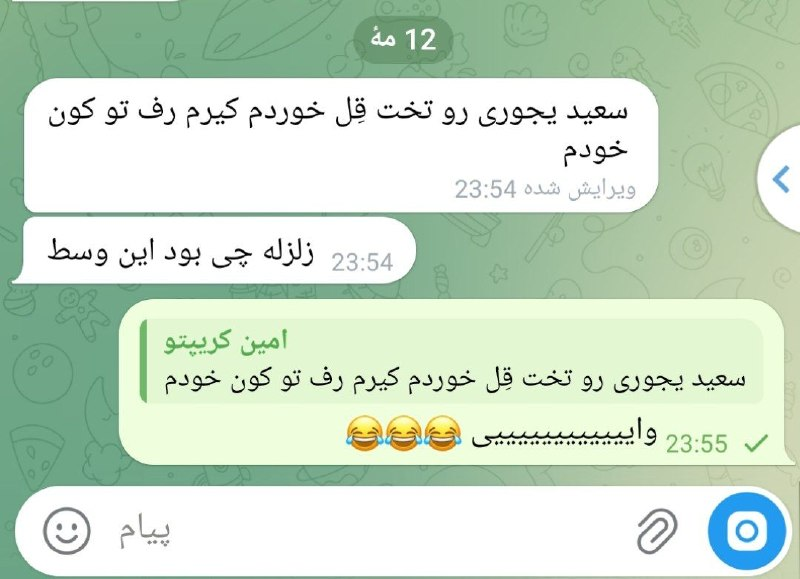

🔴 فوری: وسط این همه بگایی تهران زلزله اومد! @Pesari_Ke_Konie

## Pesari_Ke_Konie — post 44915

🔴 فوری: وسط این همه بگایی تهران زلزله اومد!

@Pesari_Ke_Konie

## Pesari_Ke_Konie — post 44914

هیچوقت کانسپت موزیک پیشوازو نمیفهمم یکی ۱۲ تومن کشیده بالا فراریه از صبح صد بار بهش زنگ میزنیم محسن ابراهیم زاده میخونه دونه دونه دونه دونه این حسی که الان بینمونه.

@Pesari_Ke_Konie

## Pesari_Ke_Konie — post 44913

  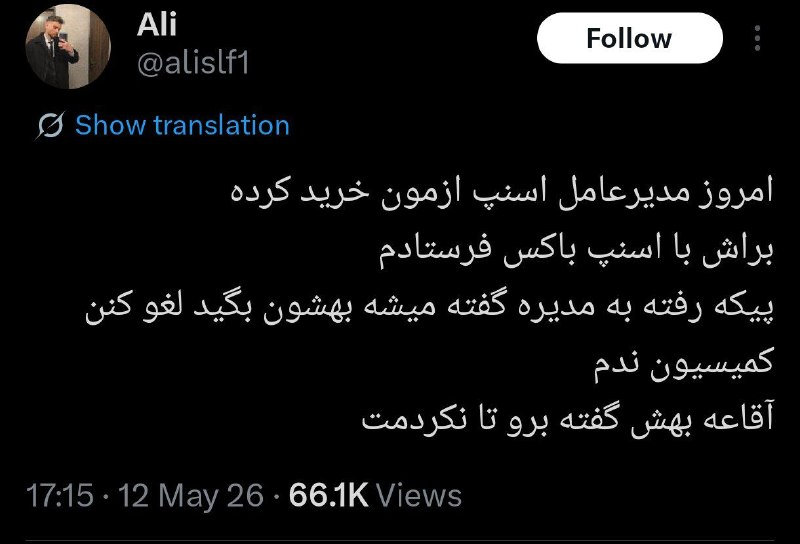

ریدم تو شانست داداش :))

@Pesari_Ke_Konie

## Pesari_Ke_Konie — post 44912

  

🔴 ایران عالیه؛ فک کن اول باید نیم میلیارد بدیم تا موبایل بخریم، بعد باید یه مبلغ عجیب غریب بدیم که اجازه بدن موبایل آنتن داشته باشه، بعد باید پول بدیم بریم بسته بخریم، بعد واسه بستمون باید بریم پول بدیم کانفیگ بخریم که بتونیم از اینترنتش استفاده کنیم.

@Pesari_Ke_Konie

## Pesari_Ke_Konie — post 44907

کسی قاچاقبر نمیشناسه؟ میخوام زمینی برم افغانستان

@Pesari_Ke_Konie

## Pesari_Ke_Konie — post 44906

  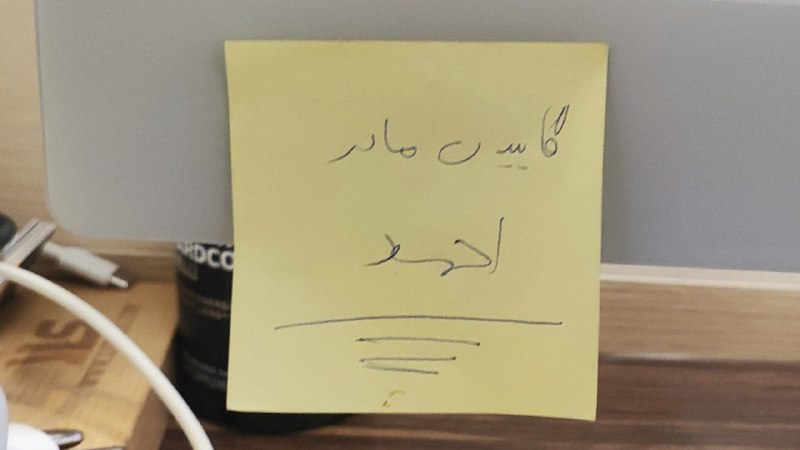

یه همکار دارم کارای مهمشو روی کاغذ می‌نویسه که یادش نره و امروز با این صحنه مواجه شدم :))

@Pesari_Ke_Konie

## Pesari_Ke_Konie — post 44905

‏ما زودانزال نیستیم، ما فقط میخاییم این بساط فساد زودتر جمع شه

@Pesari_Ke_Konie

## Pesari_Ke_Konie — post 44904

  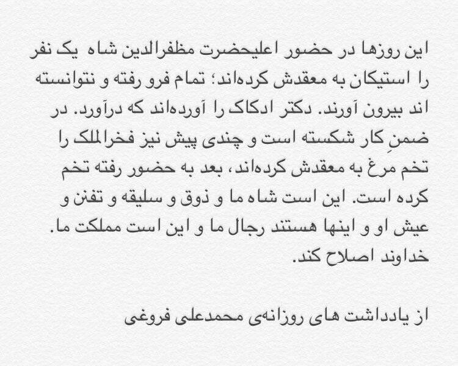

دوران قاجار واقعا عجیب بوده

@Pesari_Ke_Konie

## Pesari_Ke_Konie — post 44903

کاش زودتر آیفون ۱۸ بیاد که آیفون ۱۷ ارزون‌ تر بشه بتونیم تن ماهی بخریم.

@Pesari_Ke_Konie

## Pesari_Ke_Konie — post 44902

اگه اینترنت غزه ۷۲ روز قطع می‌شد گرتا تونبرگ به نشانه‌ی اعتراض ۷۲ متر کابل اینترنت رو می‌کرد تو کونش.

@Pesari_Ke_Konie

## pussy0poeemm — post 167899

  <a href="telegram/content/pussy0poeemm_167899_1778631562.mp4" target="_blank">🎬 Download video</a>

واکنش‌ شهبازی مجری تلویزیون به نت 5G افغانستان و سیستم بانک جهانی‌ سوریه: اگه اینارو میخوایید داشته باشید پاشید برید همون سوریه و افغانستان زندگی کنید هاهاها

## pussy0poeemm — post 167898

‏کاش حداقل خودمون ریده بودیم تو زندگیمون. درس خوندیم، کار کردیم، زحمت کشیدیم و نهایتا دستاوردش چی بوده؟ کیرخر.

## pussy0poeemm — post 167897

‏فکر می‌کردم تو این سن قراره شکفته بشم،
شکافته شدم.

## pussy0poeemm — post 167896

  <a href="telegram/content/pussy0poeemm_167896_1778631564.mp4" target="_blank">🎬 Download video</a>

سیدنی سوئینی تو قسمت جدید سریال ایفوریا پاهای خودشو میخوره

@pussy0poeemm

## pussy0poeemm — post 167894

عکسای جدید بانو بیلی آیلیش
که خیلی تو ایکس وایرال شده

@pussy0poeemm

## pussy0poeemm — post 167893

  

کایلی جنر و کندال جنر ، در مراسم مت گالا 2026

@pussy0poeemm

## pussy0poeemm — post 167892

‏69 یه جا میدیدم هر چیزی به ذهنم میومد به جز 69 روز قطعی اینترنت

## pussy0poeemm — post 167891

  <a href="telegram/content/pussy0poeemm_167891_1778631568.mp4" target="_blank">🎬 Download video</a>

اگه هنوز فکر میکنی ایران درست میشه؛پیشنهاد میکنم کار جدید استاد «بسته دهان» رو ببین:

@pussy0poeemm

## pussy0poeemm — post 167890

‏ما رو به کسکشی انداختید. با کسکشی به اینترنت وصل شدن، با کسکشی پول درآوردن، با کسکشی زندگی کردن.

## pussy0poeemm — post 167889

‏نه عزیز من ۶۲ روز قطعی اینترنت عادی نیست، کانفیگ گیگی ۵۰۰ هزارتومن عادی نیست، عدم دسترسی به گوگل و چت‌جی‌پی‌تی و ساده ترین چیزها عادی نیست، اون اینترنت پرو و سیم کارت سفید پذیرفته نیست، اینترنت طبقاتی پذیرفته نیست، این کثافتی که ما گذروندیم اسمش زندگی نیست.

## pussy0poeemm — post 167888

‏یه زمانی انقدر فراوانی اینترنت بود که می‌نشستیم ریلز خیانت گربه به شوهرش و به دنیا آوردن بچه شیر می‌دیدیم.

## pussy0poeemm — post 167887

‏ماشین اینقدر گرون شده که فقط فیلترشکن‌ فروش‌ها قدرت خریدش رو دارن.

## pussy0poeemm — post 167886

آب نخور، overthink کن، درس نخون، قوز کن، دراگ بزن. دیگه هیچی مهم نیست، دلار شده ۱۸۵ تومن در هر صورت بگا میری

## pussy0poeemm — post 167885

اونایی که از شروع جنگ یبارم وصل نشدن الان فک میکنن همه قطع ان، یهو نت وصل شه بیان پشماشون میریزه

## pussy0poeemm — post 167884

آدم کونش سفید باشه
ولی سیمکارتش سفید نباشه

@pussy0poeemm

## pussy0poeemm — post 167883

  <a href="telegram/content/pussy0poeemm_167883_1778631570.mp4" target="_blank">🎬 Download video</a>

یه زنه داشت می‌گفت امروز اسرائیل باید نابود بشه که یهو حنجره‌اش لفت داد:

@pussy0poeemm

## pussy0poeemm — post 167881

  <a href="telegram/content/pussy0poeemm_167881_1778631571.mp4" target="_blank">🎬 Download video</a>

شاید باور نکنید ولی اینجا جزیره کیشه.
ترامپ میگه رژیمو تغییر دادم ولی کسی باور نمیکنه.
@pussy0poeemm

## pussy0poeemm — post 167880

  

ترامپ کون طاقچه‌ای به فاکس نیوز گفته :
سفر ویتکاف و کوشنر به پاکستان رو برای دیدار با ایرانی‌ها لغو کرده و استدلال میکنه که آمریکا ، تمام قمبل های برنده رو در دست داره و مقامات رو برای پروازهای طولانی و کصشعر به گفت‌وگوهای تخمی نمیفرسته.

دیوث مودی رید به هیکل شون

## Radio_Zolal — post 36

https://splus.ir/meet/mvx-xpb-ddu

لینک اینتر:

## Radio_Zolal — post 32

رادیو زلال pinned «تنها گپ ما در سروش: https://splus.ir/koonvamoonde تنها لینک چنل ما توی سروش: https://splus.ir/joingroup/ASL_r1Mgi75jynCwUHLdwQ تنها گپ ما توی روبیکا: https://rubika.ir/joing/JJIBBJHC0HFGHWWKGDRTLNTAXONRSWIL پ.ن:به علت اینکه وقتی توی اپای داخلی مینویسیم…»

## Radio_Zolal — post 29

تنها گپ ما در سروش:
https://splus.ir/koonvamoonde

تنها لینک چنل ما توی سروش:
https://splus.ir/joingroup/ASL_r1Mgi75jynCwUHLdwQ

تنها گپ ما توی روبیکا:
https://rubika.ir/joing/JJIBBJHC0HFGHWWKGDRTLNTAXONRSWIL

پ.ن:به علت اینکه وقتی توی اپای داخلی مینویسیم رادیو زلال سریع بن میکنن،مجبورا از این اسامی استفاده میکنیم💔
اما ما تا همیشه رادیو زلال هستیم و زلال میمونیم🫂

## Radio_Zolal — post 24

همتیمی هام منو میشناسن. الکی حرف نمیزنم بیشتر توی اکشن خودمو نشون میدم تا حرف. فقط خواستم بگم این مدت خیلیا مارو از هم جدا کردن. توی آزادی ایران اینا همش جبران میشه. این اینجا امضا بمونه. روز آزادی، منو شما باهم با رادیو زلال بهشت میسازیم. ی چیزی که هیچوقت نشه خرابش کرد. رادیو زلال، همیشه برای شماست.

## Radio_Zolal — post 23

بچه ها ما که لینک کال اینترنشنال سروش رو اینجا میزاریم اما اینو خوب میدونید که الان هیچکس اینترنتش وصل نیست. ما همه ی بچه ها رو جمع کرده بودیم توی سروش و روبیکا اما اینا همش گروها و کانالای مارو زدن. خیلیا مارو گم کردن. لطفا لینک کانالو، به همراه لینک کال هایی که میزاریمو برای هر کسی که میشناسید از جایی که میدونید وصلن بدید که دستاشون خالی نمونه. روزای اول، پیامایی میگرفتم که نشون میداد بعضیا تمام امیدشون همین رادیو زلال بود. فداتون بشم.

## Radio_Zolal — post 20

رادیو زلال pinned Deleted message

## Radio_Zolal — post 16

ببخشید بچه ها. این پیامم ی درد و دله. درد و دل هایی از جنس درد و دل های قبلیم. اگه نمیخواید نخونیدش. میخوام از نیت هام حرف بزنم. من همیشه توی عمرم، دلم میخواست کاری رو بکنم که داخلش جز سفیدی، جز خوبی، جز مهربونی چیزی نباشه. همیشه میخواستم ادمایی مثل خودم کنارم باشن که تنها نباشم چون توی زندگیم همیشه تنها بودم. روز اولی که لینک رادیو زلالو پخش کردم و شنونده هاش توی چند ساعت به ۸۰۰۰ نفر رسید. اون موقع خیلی خوشحال بودم. چون این ایده تک بود. هنوز کسی خزش نکرده بود. هنوز داخلش کثافت نبود. بعدش اما، اومدن به اسم ما لینک دونیت ساختن. خیلیا هم رفتن دونیت کردم. حتی متوجه شدم انگار از ادمین های خودم هم رفته بودن دونیت کرده بودن به اشتباه. ی ادمین هم داشتیم اولش، که بعد رفت دلیت اکانت زد، بعد یکی اومد با ایدی همون ادمینمون، فیک رادیو زلالو زد و برا خودش دونیت جمع کرد. کمتر از چند روز، همه کار منو خز کردن و الان هرکیو میبینی داره از ما تقلید میکنه. این که گذشت. اما چرا ادمایی که برای خوشحال کردن دیگران خودشونو حاضرن توی خطر بندازن توی این دنیا احمق صدا زده میشن؟ چرا نیت خوب، تا آخرش خوب نمیمونه؟ من نیتم از انجام این کار چی بود، آخرش چی شد. ی عده ادم اومدن لینک دونیت ساختن، و ادمای ساده هم که خبر نداشتن من گفته بودم حتی هزار تومن هم پول نمیخوام، رفتن پول دادن بهشون و ضربه خوردن. قشنگ برای حرومخورا، بازارگرمی کردم. ی کاری کردم ناحق به ریش حق بخنده. اما به خدا، اصلا نمیدونستم اینجوری میشه. فکر میکردم خیلی قشنگ میشه. به قول سیاوش قمیشی، دلت میخواد جهانی رو ببینی، که توش ناحق حریف حق نمیشه! میشه خندیدو خندوند از ته دل، و هیچ ساده دلی احمق نمیشه. ببخشید اگه زیاد شد بچه ها. جون من فدای ی لحظه نفس کشیدن تک تک شما.

## Radio_Zolal — post 15

رادیو زلال pinned Deleted message

## Radio_Zolal — post 13

## Radio_Zolal — post 12

بچه ها، من همین الان ی سر زدم به کامنتا، دیدم بعضیا اومدن گفتن رادیو زلال الان داره چیکار میکنه و انتقاد و این حرفا. این افراد فکر میکنم افراد تازه وارد رادیو زلالن یا نمیشناسن رادیو زلال رو از اولش. ولی کسایی که میشناسن کسایی که از روز اول جوین شدن به رادیو زلال، بیان خاطرات اولین آشناییشون رو با رادیو زلال بگن. یادتون میاد روزا و هفته های اول ما چجوری لینک میزاشتیم؟ یادتون میاد من لینک مستقیم میزاشتم، ۸۰۰۰ نفر شنونده میگرفت، روی بخش دیسکریپشنش هم لینک اینجارو مینوشتم؟ یادتون هست اومدن به اسم من لینک دونیت درست کردن و به همراه لینک رادیو زلال پخش کردن گفتن به رادیو زلال کمک کنید، منم روی صفحه رادیو همون لحظه نوشتم هرکی به اسم ما لینک دونیت پخش کرد فیکه! شما به اسم من به کلاه بردار پول ندین، من از کسی پول نمیخوام! یادتون که هست چنتا سرور خریدم لینکشو عمومی دادم فیلتر کردن؟ کار رادیو زلال تموم نشده. رادیو زلال همیشه زلال باغی میمونه و همیشه رو به خواسته های شما پیش میره. هر برنامه ی کاربردی ک بخواید، هر چیزی که باشه، چه حالت عادی باشه چه این شرایط که رادیو زلال باید هوای مردم بیگناه رو داشته باشه، هوای مایی که داریم حرف حق میزنیم، رادیو زلال تا آخرش هست. کسایی که از اولین روز با رادیو زلال آشنا هستن این موضوع بهشون ثابت شده نیازی به گفتن من نیست. به تازه واردامون میگم. مهربونا، فداتون بشم. به هر کارما و خدایی که میپرستید، بیاید باهم مهربون باشیم، تو وضعیتی ک فردا که از خواب بیدار شیم، یا چند نفرمونو اعدام کردن، یا کشتن، یا از استرس مردیم، یا از گشنگی مردیم، یا از غم و نا امیدی مردیم. پس اگه هنوز امروز زنده ایم، باهم مهربون باشیم اتحاد داشته باشیم همون چیزی که اینا میترسیدن ازش که نزارن ایرانیا اتحاد داشته باشن چون اتحاد ایرانی، هر سنگی، هر دیواری، هر تیر و تفنگ و هر ناحقی رو از بین میبره. رادیو زلال خاک پای شماست. چاکر شما، مدیر فنی.

## Radio_Zolal — post 8

لطفا از ممبرا هرکی تلگرامش وصل شده لینک اینجارو بفرسته برای ممبرای دیگه ای که وصلن( اگه میشناسید)
که همدیگرو گم نکنیم.

## Radio_Zolal — post 7

بچه هایی هم که میپرسن لینک جدید نداریم برای شنیدن رادیو، باید بگم که اونجوری که توی پیامرسانای داخلی همش بنمون میکردن. دارم ی بستر امن فراهم میکنم که جای حقیقت خواه امن باشه و کسی زورش نرسه. من هستم. خیالتون راحت بچه ها. و تنها کانال رسمی رادیو زلال همینه عشقای من. حواستون باشه مثل اون موقع که ی عده داشتن فیک مارو میزدن و به اسم ما ازتون پول میگرفتن. من اینجا هم میگم، روی سایت رادیو هم نوشتم. من برای رسوندن صدای حق و کمک به شما، هزار تومن هم پول نمیخوام. چون شما هایی که الان اینجایید، تا الان بها های سنگین و غیرقابل برگشتی پرداختید. شما جونتون، جوونیتون، و وجودتون رو دادید. هممون توی جوونی پیر شدیم. پس این ماییم و هرچی جز این بود، فیکه.

## Radio_Zolal — post 6

عشقای من، همونطور که قول داده بودم، گروه رادیو زلال رو هم اینجا ساختم و لینکه به همین کانال. میدونم بیشترتون وصل نیستید اما اگه وصلید، بیاید اینجا چت کنید، مثل گپای روبیکا و سروشمون. که کلی ادم مهربون دور هم جمع شده بودین. بیاید که با رادیو زلال، هیچ ظالم و ناحقی نمیتونه مظلوم حق و حقیقت رو اذیت کنه. ازتون خواهش میکنم کسایی که منو میشناسید. لطفا ایدی کانالو بدید کسایی که مارو گم کردن دوباره برگردن. ما ۸۰۰۰ نفر بودیم. کسایی که همه امیدشون توی این وضعیت رادیو زلاله.

## Radio_Zolal — post 5

بچه ها سلام. خودمم. مدیر فنی. امروز بعد از ۲۰ روز تونستم وصل بشم. من چاکر شمام. خیلی اذیتیم. هزاران گروه و کانال زدیم اما بن کردنمون. سرورامونو فیلتر کردن. چون میخواستیم صدای حق رو برسونیم. همینجا بمونید، خوشحالم گمتون نکردم. اما خیلیا مارو گم کردن. خیلیایی که همه امیدشون رادیو زلال بود. لطفا بهشون بگید ما اینجاییم. بگید که ما همیشه هستیم کنار شما. منتظرم همتون وصل بشید یا بتونم همتونو وصل کنم. خاک پاتونم.

## Radio_Zolal — post 1

Channel created

## News1Fori — post 2

♨️ لینک ورود به کانال بزرگ خبرفوری
👇

🔴https://t.me/+XZjvn7jwv2plN2Fh

🔴https://t.me/+XZjvn7jwv2plN2Fh

🔴https://t.me/+XZjvn7jwv2plN2Fh

## News1Fori — post 1

Channel created

## pashmoodin — post 382030

  <a href="telegram/content/pashmoodin_382030_1778631573.mp4" target="_blank">🎬 Download video</a>

کاش بجای سگ و گربه اینارو پرورش میدادن به صورت انبوه بلکه یکیشم دست من میرسید به عنوان پت خونگی ازش نگهداری میکردم😍

@pashmoodin

## pashmoodin — post 382029

📌هیچ زنی کامل نیست
_اگر زن شاغل میخوای : باید قبول کنی که نمیتونه تمام وقتشو برات بگذاره
_اگر زن مطیع میخوای باید قبول کنی که بهت وابسته است و مراقبش باشی
_اگر زن مستقل میخوای باید قبول کنی که قدرتمنده و افکار و طرز فکر خودش رو داره
_اگر زن خانه دار میخوای : باید قبول کنی که تو مخارج و هزینه های زندگی نمی تونه کمکت کنه!!

📌هیچ مردی کامل نیست
_اگر مرد سخت کوش میخوای باید قبول کنی که خسته است و وقت زیادی برات نداره
_اگر مرد خوش قیافه میخوای باید با توجه دیگران بهش کنار بیای
_اگر مرد مهربون میخوای باید قبول کنی که گاهی احساساتش بیش از حد در گیر میشه
_اگر مرد منطقی میخوای باید قبول کنی که گاهی اوقات احساسات رو درک نکنه چون عقل براش تو اولویته
_اگر مرد اجتماعی میخوای باید قبول کنی که وقت زیادی رو با دوستانش بگذرونه

@pashmoodin

## pashmoodin — post 382028

## pashmoodin — post 382027

  

🟡 وام 
🟡 ویژه درمانِ:

🔴 -زانو 
🟠-کمر
🟠-شانه
🟠-لگن 🔴

💎وام ویژه کِلینیکِ سِریتو
جهت حمایت از هموطنان عزیز :

✅اقساط آسان
✅بدونِ پیش پرداخت
✅بدون ضامن

همین الان عدد  ۴ رو براشون بفرستید 👇👇

@Serito_Clinic
@Serito_Clinic

## pashmoodin — post 382026

  <a href="telegram/content/pashmoodin_382026_1778631578.mp4" target="_blank">🎬 Download video</a>

بهترین درس زندگی👌👏

@pashmoodin

## pashmoodin — post 382025

  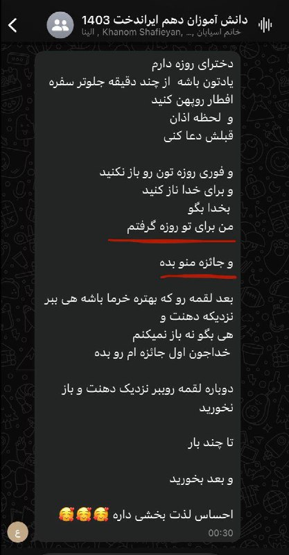

این چه کصشری بود من خوندم :)))

@pashmoodin

## pashmoodin — post 382024

  

💰 وام آسان و فوری 💎
🔴تعداد محدود ¹²،⁰⁷

✅ وام فوری تا 1 میلیارد تومان
✅ سود 2 درصد
✅ شرایط آسان و سریع برای دریافت
✅ بازپرداخت تا 60 ماه

📞جهت مشاوره رایگان و کسب اطلاعات بیشتر:
✉️ پیامک نام و نام خانوادگی به سامانه 30007155

## pashmoodin — post 382023

  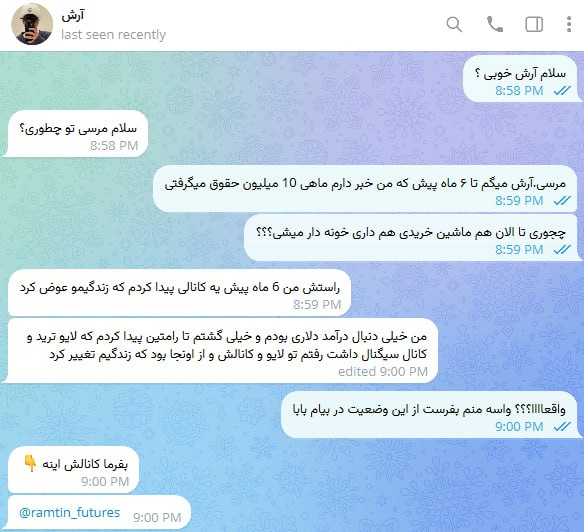

این چت بالا زندگی منو تغییر داد

تنها کارگری میشناختم که میلیونر شد و رازشو ازش پرسیدم و این چت برای اون زمان و زندگیم تغییر کرد
@ramtin_futures

## pashmoodin — post 382022

  <a href="telegram/content/pashmoodin_382022_1778631583.mp4" target="_blank">🎬 Download video</a>

تو ایتا مذاکرات تموم شد چونکه ترامپ رو دستگیر کردن.

@pashmoodin

## pashmoodin — post 382021

  <a href="telegram/content/pashmoodin_382021_1778631586.mp4" target="_blank">🎬 Download video</a>

صداوسیما داشت یه برنامه به اسم طرفدار و فوتبال با چشمای بسته رو نشون میداد که این شاهکار خلق شد:

@pashmoodin

## pashmoodin — post 382020

  

اخذ انواع ویزای کار و تحصیل و اخذ اقامت دائم کشورهای اروپایی ، کانادا و استرالیا و پرداخت هزینه های آن بعد از مهاجرت و اقامت در کشور مقصد بصورت نقد و اقساط بصورت کاملاً قانونی
جهت دریافت اطلاعات بیشتر با آیدی تلگرام  ذیل در ارتباط باشید
+37493572138
0037493572138
@ottawa20immigration12office
https://t.me/immigration20iranians

## pashmoodin — post 382019

  <a href="telegram/content/pashmoodin_382019_1778631588.mp4" target="_blank">🎬 Download video</a>

حالا ما میفتادیم مامانمون یه جوری جیغ و داد میکرد فکر میکردیم دست و پامون قطع شده😂

@pashmoodin

## pashmoodin — post 382018

  <a href="telegram/content/pashmoodin_382018_1778631590.mp4" target="_blank">🎬 Download video</a>

فرماندار نقده رفته بود برای دیدار دانش آموزا که یه دفعه تو یه حرکت منطقی، تصمیم گرفت این کارو انجام بده: 😐😂

@pashmoodin

## pashmoodin — post 382017

  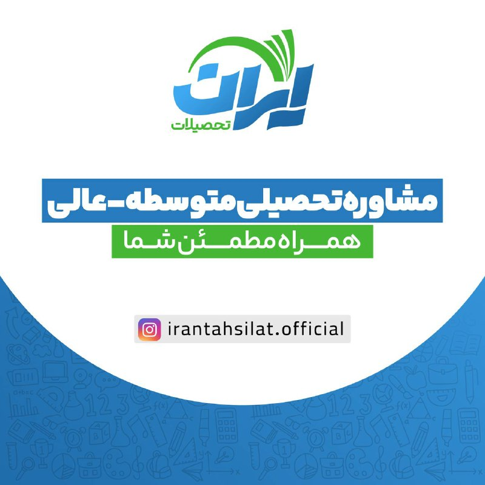

🎓خدمات تخصصی امور تحصیلی « مقطع متوسطه تا عالی »

🔹 ارائه خدمات تحصیلی و ثبت سوابق به‌صورت غیرحضوری
🔹 مناسب مهاجرت، استخدام و ارتقاء شغلی
🔹 خدمات مرتبط ترجمه رسمی و امور تأییدات

🟢 مشاوره تخصصی :
https://t.me/irantahsilat_ad
🟢 کانال اطلاع‌رسانی :
https://t.me/+1I9Ex4YFtcZkOTY0

## pashmoodin — post 382016

  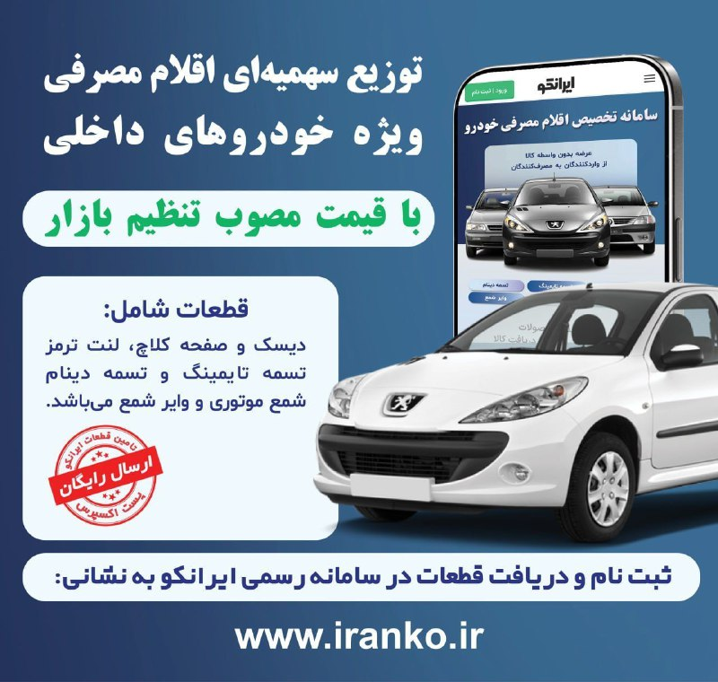

توزیع بسته های حمایتی لوازم مصرفی خودرو در سامانه جامع
شروع طرح از ساعت ۱۰ صبح روز چهارشنبه ۶ اسفند ماه تا اتمام موجودی
هموطنان گرامی می‌توانند با مراجعه به سامانه رسمی ایرانکو اقلام مصرفی حمایتی خود را به نرخ مصوب با محدودیت کد‌ملی دریافت نمایند.

www.iranko.ir
⁶

## pashmoodin — post 382015

  <a href="telegram/content/pashmoodin_382015_1778631592.mp4" target="_blank">🎬 Download video</a>

دخترا وقتی قهر میکنن

Join us:
🆔 @pashmoodin 🔥👳🏻

## pashmoodin — post 382014

  <a href="telegram/content/pashmoodin_382014_1778631593.mp4" target="_blank">🎬 Download video</a>

خدا خفت کنه 😂

Join us:
🆔 @pashmoodin 🔥👳🏻

## pashmoodin — post 382013

طلاي جهاني زد به ۵۲۰۰ دلار !!! 🤯

اين روزا خيلي تو پي‌وي ازم مي‌پرسيد تو اين اوضاع بازار چيكار كنيم؟ الان كه اينقدر رفته بالا بپريم تو بازار يا منتظر ريزش باشيم؟

ببينيد، راستش من خودم نه تريدرم نه تحليل‌گر، هيچ ادعايي هم تو چارت خوندن ندارم. ولي خداييش توي اين مدت فقط با نشستن پاي لايو تريدهاي اين كانال، تونستم ماهي ۱۰۰ ميليون تومن كاسب بشم 💵

هر خرید و فروشیم دقیقاً از روی لایوهای روزانه‌شون بوده.

پستای لایوشو ببینید، چجوری سیگنال میده و عضویت لایوهاشم رایگانه 👉

## pashmoodin — post 382012

  

💰 وام آسان و فوری 💎
🔴تعداد محدود ¹²،⁰⁷

✅ وام فوری تا 1 میلیارد تومان
✅ سود 2 درصد
✅ شرایط آسان و سریع برای دریافت
✅ بازپرداخت تا 60 ماه

📞جهت مشاوره رایگان و کسب اطلاعات بیشتر:
✉️ پیامک نام و نام خانوادگی به سامانه 30007155

## pashmoodin — post 382011

🛑🛑فوووووری🛑🛑

کانال زیر تحلیل درگیری ایران آمریکا رو گفته

همین الان چک کن 👇🏽👇🏽👇🏽👇🏽

همین الان عضو شو سريع
همین الان عضو شو سريع
همین الان عضو شو سريع

پیشبینی دقیق مذاکرات فردا در ژنو😨

## Tans_Footbali — post 236254

  <a href="telegram/content/Tans_Footbali_236254_1778631597.webm" target="_blank">🎬 Download video</a>

🚨 زلزله مجدد تو تهران گزارش شده

💛@Tans_Footbali

## Tans_Footbali — post 236253

مرکز لرزه‌نگاری:
لحظاتی پیش زلزلهٔ ۴.۶ ریشتری مرز استان‌های تهران و مازندران را لرزاند

💛@Tans_Footbali

## Tans_Footbali — post 236252

  <a href="telegram/content/Tans_Footbali_236252_1778631597.webm" target="_blank">🎬 Download video</a>

🚨 زلزله در تهران

💛@Tans_Footbali

## Tans_Footbali — post 236251

  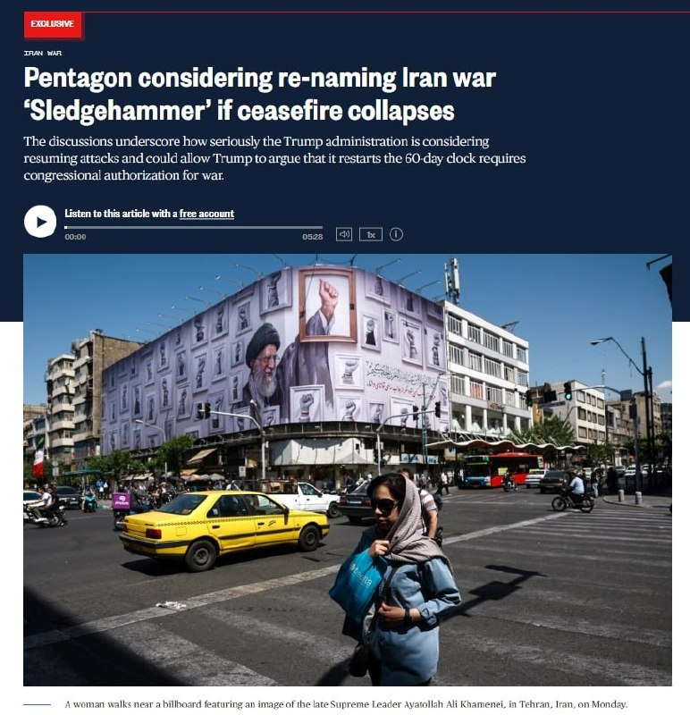

به گزارش ان‌بی‌سی :

پنتاگون قصد داره اسم جنگ احتمالی بعدی رو از خشم حماسی به چکش سنگین تغییر بده

💛@Tans_Footbali

## Tans_Footbali — post 236250

  <a href="telegram/content/Tans_Footbali_236250_1778631599.webm" target="_blank">🎬 Download video</a>

⚽ لاتزیو 
🇮🇹 - 
🇮🇹 اینتر میلان

🏆 فینال جام حذفی ایتالیا 
🇮🇹

🕔 امشب ساعت ۲۲:۳۰
🏟 ورزشگاه المپیک رم

🎲 با بیش از ۵۵۰ نوع آپشن پیش‌بینی

👆 با بالاترین ضرایب پیش‌بینی

📊 نگاهی به آمار دو تیم:

✅ لاتزیو در ۱۰ دیدار اخیر خود تنها دو بازی را واگذار کرده است.

✅ اینتر میلان در ۱۰ دیدار اخیر خود تنها یک بازی را واگذار کرده است.

📈 میانگین گل در ۱۰ دیدار اخیر لاتزیو ۲.۵ گل در هر بازی بوده است.

📈 میانگین گل در ۱۰ دیدار اخیر اینتر میلان ۳.۶ گل در هر بازی بوده است.

🧠 آرامش ذهن، دقیق‌ترین ابزار تحلیل است.

👍 ورود به سایت با فیلترشکن

کلیک کنید BetForward.com
کلیک کنید BetForward.com

💻 @BetForward

## Tans_Footbali — post 236249

  <a href="telegram/content/Tans_Footbali_236249_1778631599.mp4" target="_blank">🎬 Download video</a>

ترامپ :

رهبران ایران یا کار درست را انجام خواهند داد، یا ما کار را تمام خواهیم کرد.

💛@Tans_Footbali

## Tans_Footbali — post 236248

  <a href="telegram/content/Tans_Footbali_236248_1778631602.mp4" target="_blank">🎬 Download video</a>

خبرنگار: پیام شما به رئیس‌جمهور شی در ارتباط با جنگ ایران چیست؟

ترامپ: فکر می‌کنم اول از همه، ما یک گفتگوی طولانی درباره آن خواهیم داشت. به‌راستی فکر می‌کنم او نسبتاً خوب بوده است. ما هیچ مشکلی نداشته‌ایم. و او دوست من بوده است.

فکر می‌کنم خواهید دید که اتفاقات خوبی رخ خواهد داد. این سفر بسیار هیجان‌انگیزی خواهد بود.

💛@Tans_Footbali

## Tans_Footbali — post 236247

  <a href="telegram/content/Tans_Footbali_236247_1778631605.mp4" target="_blank">🎬 Download video</a>

خبرنگار: در چه مرحله‌ای مذاکره با ایران را تمام شده می‌دانید؟

ترامپ: خواهیم دید چه پیش می‌آید. ما فقط در حال انجام یک معامله خوب هستیم.

من معتقدم به هر شکلی که باشد، برای مردم آمریکا بسیار خوب خواهد بود و در واقع فکر می‌کنم برای مردم ایران هم بسیار خوب باشد.

💛@Tans_Footbali

## Tans_Footbali — post 236246

  <a href="telegram/content/Tans_Footbali_236246_1778631608.mp4" target="_blank">🎬 Download video</a>

ترامپ :

من به وضعیت مالی آمریکایی‌ها فکر نمی‌کنم. به هیچ‌کس فکر نمی‌کنم.

فقط به یک چیز فکر می‌کنم: ما نمی‌توانیم اجازه دهیم ایران سلاح هسته‌ای داشته باشد. همین.

💛@Tans_Footbali

## Tans_Footbali — post 236245

  <a href="telegram/content/Tans_Footbali_236245_1778631611.mp4" target="_blank">🎬 Download video</a>

خبرنگار: آیا در مورد پاکستانی‌ها به عنوان میانجی‌ها تجدید نظر می‌کنید؟

ترامپ: نه، آن‌ها عالی هستند. فیلد مارشال و نخست‌وزیر پاکستان کاملاً عالی بوده‌اند

💛@Tans_Footbali

## Tans_Footbali — post 236244

شاهزاده رضا پهلوی در نشست امنیتی سالانه پولیتیکو:

سیاست مماشات با رژیم جمهوری اسلامی که راهبرد بسیاری از دولت‌ها بود، شکست خورده است.

اکنون که با یک «جانور زخمی» روبه‌رو هستیم، این فرصتی است که نباید از دست برود، بلکه باید کار را یک‌بار برای همیشه تمام کرد؛ موضوعی که نه‌تنها میلیون‌ها ایرانی، بلکه بسیاری از کشورهای منطقه نیز انتظار آن را دارند.

مردم به‌اندازه کافی هوشمند هستند که تفاوت میان حمله به یک ملت و حمله به یک رژیم را تشخیص دهند و آن کارزار، حمله‌ای علیه ملت ایران نبود، بلکه علیه رژیم بود.

ما فقط زمانی می‌توانیم مردم را به بازگشت به خیابان‌ها فرا بخوانیم که آن‌ها از سطحی از برابری در توان مقابله برخوردار باشند؛ نه زمانی که رژیم بتواند اوباش و نیروهای سرکوبگرش را برای کشتن مردم در خیابان‌ها اعزام کند.

اما برای رسیدن به آن نقطه، باید پیام روشنی وجود داشته باشد. باید راهبردی شفاف برای پایان دادن به این رژیم وجود داشته باشد؛ فراخوانی روشن برای قیام مردم، و همچنین پیامی برای نیروهای نظامی و امنیتی از حکومت جدا شوند و به مردم بپیوندند. همه این‌ها باید در قالب یک راهبرد منسجم هماهنگ شود.

💛@Tans_Footbali

## Tans_Footbali — post 236243

الجزيره :

رهبری ایران این پیش‌شرط‌ها رو برای شروع مذاکرات هسته‌ای تعیین کرده :

— پایان دادن به جنگ در همه جبهه‌ها
— رفع همه تحریم‌ها
— آزادسازی دارایی‌های مسدود شده
— جبران خسارات و زیان‌های جنگ
— به رسمیت شناختن حق حاکمیت ایران بر تنگه هرمز

💛@Tans_Footbali

## Tans_Footbali — post 236242

  

شاهزاده رضا پهلوی امروز در اجلاس امنیتی پولیتیکو (POLITICO) در واشنگتن سخنرانی داره، در کنار مقامات ارشد پنتاگون، وزیر سابق امنیت داخلی آمریکا، سناتورهای کمیته نیروهای مسلح، روسای کمیته اطلاعات مجلس و مقامات دفاعی آلمان و مدیران لاکهید مارتین

💛@Tans_Footbali

## Tans_Footbali — post 236241

  <a href="telegram/content/Tans_Footbali_236241_1778631614.mp4" target="_blank">🎬 Download video</a>

⚽ اوساسونا 
🇪🇸 - 
🇪🇸 اتلتیکو مادرید

🏆 لالیگا اسپانیا 
🇪🇸

🕔 امشب ساعت ۲۳:۰۰
🏟 ورزشگاه ال سادار

🎲 با بیش از ۵۵۰ نوع آپشن پیش‌بینی

👆 با بالاترین ضرایب پیش‌بینی

📊 نگاهی به آمار دو تیم:

✅ اوساسونا در ۴ بازی اخیر خود در لالیگا مساوی نکرده است.

📈 اتلتیکو مادرید در ۱۳ بازی اخیر خود در لالیگا مساوی نکرده است.

📈 میانگین گل در ۱۰ دیدار اخیر اتلتیکو مادرید در لالیگا ۲.۹ گل در هر بازی بوده است.

🧠 مسیر حرفه‌ای از نظم شروع می‌شود، نه از شانس.
E

👍 ورود به سایت با فیلترشکن

کلیک کنید BetForward.com
کلیک کنید BetForward.com

💻 @BetForward

## Tans_Footbali — post 236240

  <a href="telegram/content/Tans_Footbali_236240_1778631618.mp4" target="_blank">🎬 Download video</a>

پت هگست :

ما برنامه‌ای برای تشدید داریم، اگر لازم باشد. ما برنامه‌ای برای عقب‌نشینی داریم، اگر لازم باشد. ما برنامه‌ای برای جابجایی دارایی‌ها داریم.

قطعاً در این شرایط، ما فاش نمی‌کنیم گام بعدی چه خواهد بود، با توجه به اهمیت مأموریتی که رئیس‌جمهور ترامپ برای اطمینان از اینکه ایران هرگز بمب هسته‌ای نداشته باشد، بر عهده دارد.

💛@Tans_Footbali

## Tans_Footbali — post 236239

  <a href="telegram/content/Tans_Footbali_236239_1778631621.mp4" target="_blank">🎬 Download video</a>

روزنبرگ: آیا واقعاً در عمق قلبت احساس می‌کنی که می‌توانی ایران را از غنی‌سازی اورانیوم بازداری و هرگز بمب نسازد؟

ترامپ: ۱۰۰٪. آنها قرار است [غنی‌سازی] را متوقف کنند. ایرانی‌ها به من گفتند که ما گرد هسته‌ای را خواهیم گرفت.

💛@Tans_Footbali

## Tans_Footbali — post 236238

  

راموس کارای خرید سویا رو انجام داده و به‌زودی به‌عنوان مالک این باشگاه معرفی می‌شه.

⚫️@FootyRadar

## Tans_Footbali — post 236237

  <a href="telegram/content/Tans_Footbali_236237_1778631624.mp4" target="_blank">🎬 Download video</a>

به یاد مادران کشته شده توسط وحوش رژیم اشغالگر ج.ا

@Tans_Footbali

## Tans_Footbali — post 236236

🚨🚨فوری کانال ۱۴ اسرائیل: کارخانه های خودرو سازی ایران از اهداف بعدی اسرائیل هستند. بخشی از اهداف بعدی در خاک ایران: 🔴 تاسیسات انرژی 🔴 صنعت پتروشیمی 🔴 صنعت خودروسازی 🔴 لانچر و سایت های موشکی 🔴 صنعت نفت 🔴 صنعت فولاد  @Tans_Footbali

## Tans_Footbali — post 236235

‼️درگیری لفظی چندین خبرنگار با فاطمه مهاجرانی بر سر قطعی اینترنت مهاجرانی: ترامپ گفته آتش‌بس به تنفس مصنوعی وصل است، کشور در جنگ است! امنیت مردم مهم است و تا وقتی سایه جنگ از کشور دور نشود وضعیت اینترنت به حالت عادی بر نمی‌گردد! @Tans_Footbali

## Bad_chaneli — post 39504

  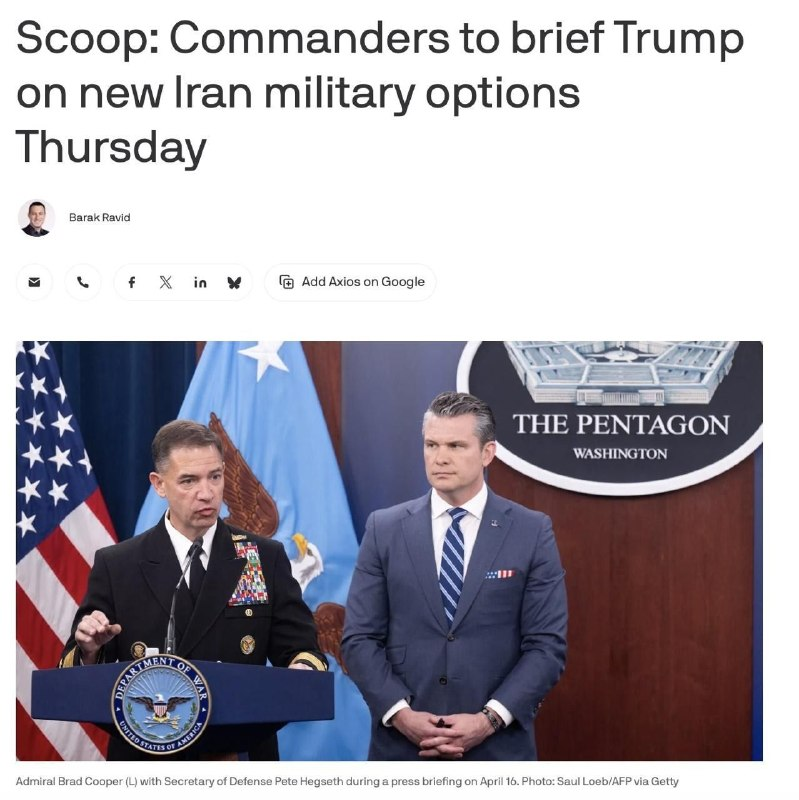

🚨آکسیوس:

ترامپ قرار است امروز توسط فرمانده سنتکام، در مورد گزینه‌های نظامی جدید علیه ایران مطلع شود

این طرح‌ها شامل یک کمپین حمله کوتاه و شدید، احتمال کنترل تنگه هرمز برای بازگرداندن حمل و نقل دریایی، و حتی یک ماموریت نیروهای ویژه با هدف اورانیوم غنی‌شده است

@Bad_chaneli

## Bad_chaneli — post 39503

  

تانکر تراکرز:
گارد ساحلی آمریکا حدود 380 میلیون دلار نفت خام ایران رو تو اقیانوس هند توقیف کرده و مثل اینکه این محموله‌ها در حال انتقال به سمت آمریکا هستن!

@Bad_chaneli

## Bad_chaneli — post 39502

ازونجایی که هر سفر عراقچی هفتاد تا جنگنده و هواپیمایی ترابری آمریکایی رو میاره تو منطقه، بنده تقاضا دارم سه چهار جلسه دیگه ادامه بده

## Bad_chaneli — post 39501

  <a href="telegram/content/Bad_chaneli_39501_1778631628.mp4" target="_blank">🎬 Download video</a>

🎬 Video

## Bad_chaneli — post 39500

کلمات بیشتری به ذهنم نمیرسه بگم ،اینجا خاطره های خوبی داریم امیدوارم زودتر شرایط درست بشه بتونیم همگی برگردیم

## Bad_chaneli — post 39499

.

## Bad_chaneli — post 39498

#فوری : ترامپ 2 روز بیشتر وقت نداد! «اگه ایران ظرف 48 ساعت از همین الان، تنگه هرمز رو کامل و بدون هیچ تهدیدی باز نکنه، آمریکا نیروگاه‌های برقشونو نابود می‌کنه، از بزرگ‌ترینش شروع میشه.» @Bad_chaneli

## Bad_chaneli — post 39497

  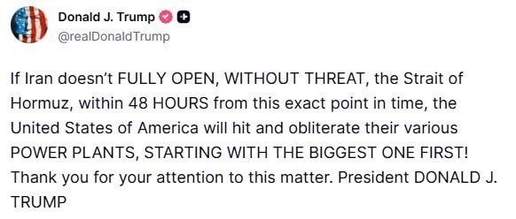

#فوری : ترامپ 2 روز بیشتر وقت نداد!

«اگه ایران ظرف 48 ساعت از همین الان، تنگه هرمز رو کامل و بدون هیچ تهدیدی باز نکنه، آمریکا نیروگاه‌های برقشونو نابود می‌کنه، از بزرگ‌ترینش شروع میشه.»

@Bad_chaneli

## Bad_chaneli — post 39496

  <a href="telegram/content/Bad_chaneli_39496_1778631630.mp4" target="_blank">🎬 Download video</a>

از ثانیه 0:20 ببینید پشماتون میریزه
'بمباران پایگاه چهارم شکاری #دزفول، صبح شنبه'

@Bad_chaneli

## Bad_chaneli — post 39495

درود دوستان نوروزتون پیروز 🪴🪻

امیدوارم تو این سال هرچی اتفاق خوب هست برای ایرانمون بیفته

## Bad_chaneli — post 39494

.

## Bad_chaneli — post 39493

🚨🚨اکنون، شنیده شدن صدای دستکم سه انفجار در تهران

@Bad_chaneli

## Bad_chaneli — post 39492

ایرانی، اولین موج شلیک موشک‌های بالستیک (30 موشک) رو به سمت اسرائیل شروع کرد.

@Bad_chaneli

## Bad_chaneli — post 39491

  <a href="telegram/content/Bad_chaneli_39491_1778631632.mp4" target="_blank">🎬 Download video</a>

#فوری منهدم کردن شهر موشکی بوشهر

@Bad_chaneli

## Bad_chaneli — post 39490

#فوری دونالد ترامپ به مردم ایران:ساعت آزادی شما نزدیک است، از خانه خارج نشوید چون بمب‌ها همه جا خواهند بود. وقتی کارمان تمام شد، به شما اعلام می‌کنیم و شما کنترل را به دست خواهید گرفت - این فرصت شماست

@Bad_chaneli

## Bad_chaneli — post 39489

🔴 ترامپ:
ما تهدید رژیم ظالم ایران رو برای همیشه از بین میبریم.
@Bad_chaneli

## Bad_chaneli — post 39488

#فوری ترامپ خطاب به سپاه:
سلاح‌های خودتونو زمین بذارید، با شماها منصفانه رفتار میشه.
وگرنه با مرگ حتمی مواجه میشید.

@Bad_chaneli

## Bad_chaneli — post 39487

🚨🚨🚨فووووری:

ترامپ: «ما عملیات نظامی گسترده‌ای را در ایران آغاز کرده‌ایم، تهدید رژیم ظالم ایران را نابود خواهیم کرد»

@Bad_chaneli

## Bad_chaneli — post 39486

ممنون از مذاکرات خوب عراقچی

## Bad_chaneli — post 39485

  <a href="telegram/content/Bad_chaneli_39485_1778631634.mp4" target="_blank">🎬 Download video</a>

🚨🚨فوری/لحظه حمله به بیت رهبری @Bad_chaneli

## hamclasixii — post 75344

یذره زمین لرزید بله قطع شد
چته داش

## hamclasixii — post 75343

🔴#فوری | دقایقی پیش زمین‌لرزه‌ای تهران را لرزاند 📚 @hamclasix 📚

## hamclasixii — post 75342

🔴#فوری | دقایقی پیش زمین‌لرزه‌ای تهران را لرزاند 📚 @hamclasix 📚

## hamclasixii — post 75341

🔴#فوری | دقایقی پیش زمین‌لرزه‌ای تهران را لرزاند

📚 @hamclasix 📚

## hamclasixii — post 75340

  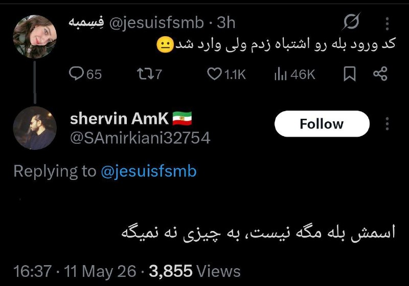

پیام‌رسان داخلی عالیه، حتما نصب کنین

📚 @hamclasix 📚

## hamclasixii — post 75339

اقا ما ۱۵ سالمون که بود یکبار با خانواده قهر کردیمو رفتیم یه شونه تخم مرغ و نون و روغن خریدیم گذاشتیم تو اتاقمون که از وسایل اونا استفاده نکنیم و خلاصه ادبشون کنیم بعد مامانمون مارو دید گفت برو گاز و ماهیتابه هم بخر

📚 @hamclasix 📚

## hamclasixii — post 75338

🔴مدیر آموزش و پرورش ناحیه ۲ زنجان : تا پایان هفته جاری درباره نحوه برگزاری امتحانات پایه‌های هفتم تا دهم، تصمیم‌گیری و نتیجه آن اعلام خواهد شد.

📚 @hamclasix 📚

## hamclasixii — post 75337

دختر خانم ۱۷ ساله بعد از بوسیدن دوسپسرش بیهوش میشه، منتقل بیمارستان میشه و اونجا فوت میکنه.
‏علت: مرحوم در نوار قلبش QT طولانی داشته، بوسیدن و افرایش تحریک سمپاتیک باعث راه افتادن آریتمی کُشنده و مرگش شده.
‏نتیجه: قبل دیت مشاوره قلب داشته باشید

📚 @hamclasix 📚

## hamclasixii — post 75336

🔴وزیر آموزش و پرورش: کلاس ها همچنان تا پایان سال تحصیلی به صورت مجازی استمرار دارد

🔹آغاز ارزشیابی ها و امتحانات از 9 خرداد شروع می شود و نوع برگزاری آزمون ها اعلام شده است.

📚 @hamclasix 📚

## hamclasixii — post 75335

🔴#فوری | امتحانات نوبت دوم مدارس البرز حضوری شد

🔹 مدیرکل آموزش و پرورش البرز با اعلام این خبر گفت: امتحانات نوبت دوم سال تحصیلی ۱۴۰۵-۱۴۰۴ مدارس البرز با توجه به دستورالعمل وزارتی و مجوز شورای تامین استان حضوری شد.
🔹 بر اساس این تصمیم گیری امتحانات خرداد ماه مدارس البرز در دوره اول و دوم متوسطه که شامل پایه‌های هفتم، هشتم، نهم، دهم، فنی حرفه‌ای و کاردانش به صورت حضوری برگزار می‌شود.
🔹 امتحانات نوبت دوم مدارس البرز از ۹ خرداد ماه بر اساس برنامه ریزی صورت گرفته انجام می‌شود.

📚 @hamclasix 📚

## hamclasixii — post 75334

  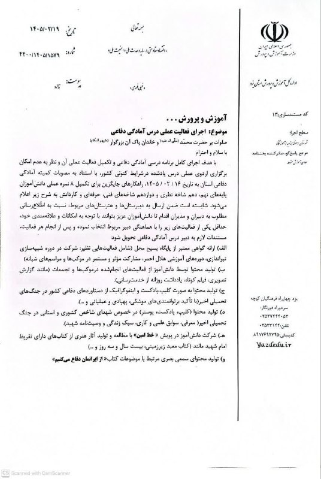

🔴بخشنامه اجرای فعالیت عملی درس آمادگی دفاعی پایه‌های نهم، دهم نظری و دوازدهم فنی و کاردانش - استان یزد

🔹۸ نمره عملی درس آمادگی دفاعی
🔹ارائه گواهی معتبر از پایگاه بسیج محل؛ تولید محتوا از موکب‌ها و تجمعات شبانه؛ تولید محتوا از دستاوردهای دفاعی کشور در جنگ اخیر؛ تولید محتوا درخصوص شهدای جنگ‌ اخیر؛ شرکت در پویش خط امین؛ تولید محتوا از کتاب «از ایرانمام دفاع میکنیم»

📚 @hamclasix 📚

## hamclasixii — post 75333

🔴سخنگوی دولت: اینترنت پرو مصوبۀ شورای‌عالی امنیت ملی است که آقای رئیس‌جمهور ریاست آن را برعهده دارد

🔹پاسخ مهاجرانی به اصرار یک خبرنگار دربارۀ وضعیت اینترنت: در شرایطی که ترامپ اعلام می‌کند آتش‌بس به دستگاه تنفس مصنوعی وصل است پاسخ شما چیست؟!
🔹در خصوص اینترنت آقای رئیس‌جمهور پیگیر حقوق مردم هستند. پس از دور شدن سایۀ جنگ، وضعیت به حالت عادی بازخواهد گشت.

📚 @hamclasix 📚

## hamclasixii — post 75332

🔴شهردار تهران: استفاده رایگان از مترو و اتوبوسرانی تهران تا ۲۷ اردیبهشت‌ماه تمدید شد

📚 @hamclasix 📚

## hamclasixii — post 75331

🔴متقاضیان آزمون سمپاد و مدارس نمونه دولتی به بیش از نیم میلیون نفر رسید

مدیرکل روابط عمومی سازمان سنجش آموزش:
🔹بیش از ۵۰۰ هزار داوطلب در آزمون‌های سمپاد و مدارس نمونه دولتی سال ۱۴۰۵ ثبت‌نام کردند.
🔹مهلت ثبت‌نام در این آزمون‌ها فردا چهارشنبه ۲۳ اردیبهشت به پایان می‌رسد.

📚 @hamclasix 📚

## hamclasixii — post 75330

🔴 #فوری | نحوه برگزاری امتحانات نوبت دوم دوره متوسطه استان مرکزی اعلام شد.

🔹  عبدالرضا حامدیخواه ظهر دوشنبه در نشست خبری در اداره آموزش و پرورش اظهار کرد: در حال حاضر آموزش در مدارس به صورت غیرحضوری ادامه دارد و برگزاری کلاس‌های حضوری ممنوع است.
🔹 وی افزود: امتحانات دانش‌آموزان از نهم خردادماه آغاز و تا اوایل تیرماه ادامه خواهد داشت(دروس غیرنهایی) و تلاش می‌شود امتحانات مقطع متوسطه به صورت حضوری برگزار شود، مگر آنکه شورای تأمین استان مرکزی تصمیم دیگری اتخاذ کند.

📚 @hamclasix 📚

## hamclasixii — post 75329

  

🔴امروز 12 May، روز جهانی پرستاره.

🔹این روز رو به همه پرستارای زحمتکش و مهربون و علاقمندای این رشته تبریک میگیم 
😍

📚 @hamclasix 📚

## hamclasixii — post 75328

🔴#فوری | تکلیف نحوۀ امتحانات نهایی ۲ ماه دیگر روشن می‌شود! 🔹در حالی که پیش‌تر احتمال برگزاری دومرحله‌ای امتحانات نهایی شامل داخلی مجازی و حضوری کشوری مطرح شده بود، حالا وزیر آموزش‌وپرورش اعلام کرد «تا ۱۵ تیر برای مشخص‌شدن وضعیت امتحانات نهایی صبر می‌کنیم.»…

## hamclasixii — post 75327

🔴#فوری | تکلیف نحوۀ امتحانات نهایی ۲ ماه دیگر روشن می‌شود!

🔹در حالی که پیش‌تر احتمال برگزاری دومرحله‌ای امتحانات نهایی شامل داخلی مجازی و حضوری کشوری مطرح شده بود، حالا وزیر آموزش‌وپرورش اعلام کرد «تا ۱۵ تیر برای مشخص‌شدن وضعیت امتحانات نهایی صبر می‌کنیم.»
🔹به گفتۀ کاظمی، برگزاری ۲ آزمون موجب افزایش فشارهای روحی و روانی به دانش‌آموزان می‌شود و ترجیح این است که یک مرحله آزمون بعد از اطمینان از وضعیت کشور و پس از فرصت کافی به دانش‌آموزان برگزار شود./فارس

📚 @hamclasix 📚

## hamclasixii — post 75326

‏از اینکه همه چیز حداقل یک میلیون تومنه خسته شدم.

📚 @hamclasix 📚

## hamclasixii — post 75325

🔴معاون آموزشی وزارت علوم: به دنبال حضوری شدن کلاس‌های درس و امتحانات هستیم

معاون آموزشی وزارت علوم:
🔹بیش از یک ماه تا پایان کلاس‌ها باقی مانده و در صورت فراهم شدن شرایط عادی، برنامه وزارت علوم بر حضوری شدن کلاس‌های درس خواهد بود.
🔹در صورت مهیا بودن شرایط، امتحانات پایان‌ترم دانشجویان نیز به‌صورت حضوری برگزار می‌شود و دانشگاه‌ها برنامه‌ریزی‌های خود را بر همین اساس انجام داده‌اند.

📚 @hamclasix 📚

## withyashar — post 11106

نمیتونن از قصد ی جوری پس لرزه اینجاد کنن که نفهمن تست اتمه؟

## withyashar — post 11105

نمیتونن از قصد ی جوری پس لرزه اینجاد کنن که نفهمن تست اتمه؟

## withyashar — post 11104

گزارش مقدماتی زمین‌لرزه بزرگی: ۴.۶ ریشتر محل وقوع: مرز استانهای تهران و مازندران - حوالی پرديس تاریخ و زمان وقوع به وقت محلی: 1405/02/22 23:46:07 عمق زمین‌لرزه: 10 کیلومتر @withyashar همچنین اورژانس تهران اعلام کرده در پی طوفان و باد شدید با سرعت ۵۵…

## withyashar — post 11103

  <a href="telegram/content/withyashar_11103_1778631637.mp4" target="_blank">🎬 Download video</a>

اتاق جنگ با یاشار : بلرزونش ، هواپیمای جاسوسی آواکس و زلزله… حجم کم
@withyashar

## withyashar — post 11102

رویترز: دو تانکر حامل ال‌ان‌جی قطر، به دنبال توافق دوجانبه جداگانه بین اسلام‌آباد و تهران، به سمت پاکستان در حرکت هستند
@withyashar

## withyashar — post 11101

گزارش مقدماتی زمین‌لرزه

بزرگی: ۴.۶ ریشتر
محل وقوع: مرز استانهای تهران و مازندران - حوالی پرديس
تاریخ و زمان وقوع به وقت محلی: 1405/02/22 23:46:07

عمق زمین‌لرزه: 10 کیلومتر
@withyashar
همچنین اورژانس تهران اعلام کرده در پی طوفان و باد شدید با سرعت ۵۵ کیلومتر در تهران تاکنون ۱۱ حادثه به این سازمان امدادی گزارش شده است.

سخنگوی اورژانس تهران نوشته تاکنون ۷ مصدوم که ۵ نفر آنها سرپایی درمان شده‌اند، در ماموریت‌های امدادگران ثبت شده‌اند اما ممکن است آمار مصدومان بیشتر شود.
@withyashar

## withyashar — post 11100

کاور @withyashar

## withyashar — post 11099

  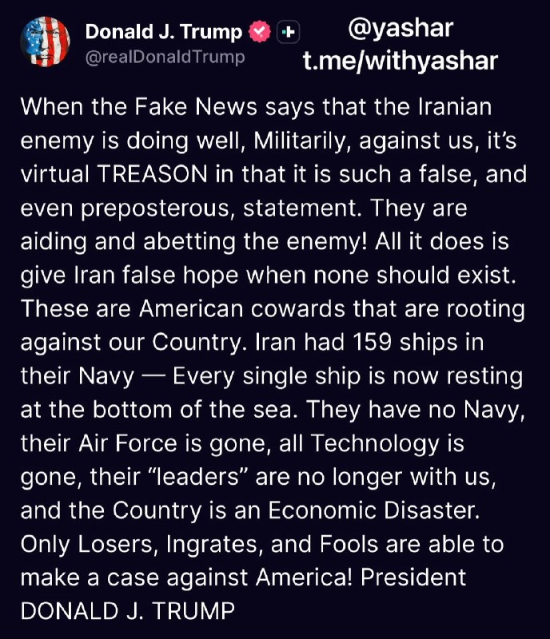

ترامپ در تروث :
وقتی رسانه‌های دروغ‌پراکن می‌گویند دشمن ایرانی از نظر نظامی در برابر ما عملکرد خوبی دارد، این عملاً نوعی خیانت است؛ چون چنین ادعایی کاملاً دروغ و حتی مضحک است. آنها دارند به دشمن کمک و همراهی می‌کنند!

تنها کاری که این حرف‌ها می‌کند این است که به ایران امید واهی می‌دهد، در حالی که هیچ امیدی نباید وجود داشته باشد. اینها ترسوهای آمریکایی هستند که علیه کشور خودشان طرفداری می‌کنند.

ایران ۱۵۹ کشتی در نیروی دریایی خود داشت — اکنون تک‌تک آن‌ها در کف دریا قرار دارند. آنها دیگر نیروی دریایی ندارند، نیروی هوایی‌شان نابود شده، تمام فناوری‌شان از بین رفته، «رهبرانشان» دیگر در میان ما نیستند، و کشورشان یک فاجعه اقتصادی است.

فقط بازنده‌ها، ناسپاس‌ها و احمق‌ها می‌توانند علیه آمریکا استدلال کنند!
@withyashar

## withyashar — post 11098

وزارت خارجه آمریکا: با چین توافق کرده‌ایم اجازه اعمال عوارض بر عبور کشتی‌ها از تنگه هرمز داده نشود.
@withyashar

## withyashar — post 11097

اتاق جنگ با یاشار : جابجای‌های غول آسا دو شماره یک «AirForce1» هواپیمای ویژه ریاست جمهوری و «B1 »بمب افکن اسطورهی آمریکا و خبر ویژه از داخل ایران

https://www.instagram.com/reel/DYQCr39RJ4i/?igsh=MThycjJiYWZmbnJ3dA==

کارای اداریش رو انجام بدید تا بعدش بریم برای سوال جوای

## withyashar — post 11096

  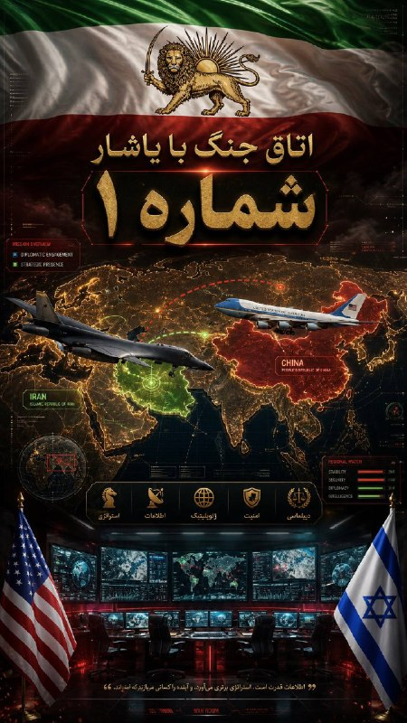

کاور
@withyashar

## withyashar — post 11095

## withyashar — post 11094

  <a href="telegram/content/withyashar_11094_1778631642.mp4" target="_blank">🎬 Download video</a>

ترامپ سوار ایرفرس وان شد و رفت به سمت چین
@withyashar

## withyashar — post 11093

دوباره ترامپ یک خبرنگار دیگرو هم فیتیله پیچ میکنه اعصاب نداره امشب این بازیکن

خبرنگار: تورم الان تو بالاترین سطح خودش توی ۳ سال گذشته هست. آیا سیاست‌های شما کار نمی‌کنن؟

ترامپ: سیاست‌های من به طرز شگفت‌انگیزی کار می‌کنن! اگه به قبل از جنگ برگردین، تورم ۱.۷٪ بود. اگه می‌خوای این دیوانه‌ها سلاح هسته‌ای داشته باشن، پس تو آدم احمقی هستی و من تو رو خیلی خوب می‌شناسم!

@withyashar

## withyashar — post 11092

ترامپ یک خبرنگار رو به توپ بست

ترامپ: ما یک سالن رقص داریم که هزینه ساختش کمتر از بودجه هست. اینجا ساخته می‌شه. من اندازه‌اش رو دو برابر میکنم چون مشخصه که بهش نیاز داریم.

خبرنگار: هزینه‌ش دو برابر شده

ترامپ: من اندازه‌اش رو دو برابر کردم، آدم احمق! تو آدم باهوشی نیستی
@withyashar

## withyashar — post 11091

## withyashar — post 11090

Yashar jan, Chera enghadr faaliat kam shode top Paget? Aghaaaa enghad zahmat mikeshe Like konid

## withyashar — post 11089

ترامپ به سیم آخر زد و برای با ‌چهار هزارم گفت :

من به وضعیت مالی آمریکایی‌ها فکر نمی‌کنم.کلا به هیچ‌کس فکر نمی‌کنم!

فقط به یک چیز فکر می‌کنم: نمی‌توانیم اجازه دهیم ایران سلاح هسته‌ای داشته باشد. همین
@withyashar

## withyashar — post 11088

خبرنگار: فکر می‌کنید شی جین‌پینگ باید اصلاً در موضوع ایران دخالت کند؟ یا می‌تواند به نوعی کمک کند؟

ترامپ: فکر نمی‌کنم ما نیازی به هیچ کمکی درباره ایران داشته باشیم. ما این موضوع را یک‌طور یا به‌هرحال حل خواهیم کرد. یا به‌صورت مسالمت‌آمیز پیروز می‌شویم یا به شکل دیگری. تمام ماشین جنگی آن‌ها از بین رفته است
@withyashar

## withyashar — post 11087

ترامپ: درباره جنگ ایران گفت‌وگوی طولانی با شی خواهم داشت

ایران یا کار درست را انجام خواهد داد یا ما کار را تمام خواهیم کرد
@withyashar

## tubeex_ir — post 7

این مدت کنار شما بودن برای ما چیزی بیشتر از مدیریت یک سایت بود. کلی خاطره، گفتگو و همراهی شکل گرفت که هیچ‌وقت فراموشش نمی‌کنیم.

متأسفانه با قطع شدن دسترسی ما به یوتیوب، امکان ادامه فعالیت سایت از بین رفته و دیگه نمی‌تونیم خدماتی که دوست داشتیم رو ارائه بدیم یا دسترسی یوتیوب رو فراهم کنیم. برای ما هم این اتفاق واقعاً ناراحت‌کننده‌ست.

سایت به‌زودی بسته میشه، اما تا اون موقع هنوز می‌تونیم از طریق ساپورت با هم در ارتباط باشیم.

امیدواریم روزی برسه که نه به تیوبیکس نیازی باشه، نه به تیوبیکس‌ها.

ممنون برای تمام حمایت‌ها و همراهی‌هاتون ❤️

## tubeex_ir — post 6

## tubeex_ir — post 4

  

توبیکس با یک هدف ساده ساخته شده، فراهم کردن دسترسی رایگان و بدون فیلتر به ویدئوهای یوتوب در شرایط کنونی.

با گذشت ۳ روز از شروع توبیکس، تعداد کاربران بیشتر از چیزی شد که انتظار داشتیم. 
به همین خاطر برای مدتی مجبور شدیم محدودیت‌هایی اعمال کنیم تا همه کاربران بتوانند به پلتفرم دسترسی داشته باشند و تجربه پایدارتری داشته باشند.

در حال حاضر در حال افزایش منابع و بهبود سرعت سایت هستیم تا توبیکس برای کاربران بیشتری بدون مشکل در دسترس باشد.

ممنونیم که همراه ما هستید. ❤️

Tubeex.ir

## tubeex_ir — post 1

Channel created

## opendoorir — post 4

آمار بات طی دو هفته

ویدیو از یوتیوب:
۱۵۰۶۱۳ درخواست
نرخ موفقیت: ۷۵٪
دانلود شده: ۴.۵ ترابایت

فایل thumbnail یوتیوب:‌
۱۳۰۸۲۵ درخواست
نرخ موفقیت: ۹۸٪
دانلود شده: ۱۵ گیگ

عکس پینترست:
۶۸۶۱۵ درخواست
نرخ موفقیت: ۹۹٪
دانلود شده: ۲۷ گیگ

فیلم پینترست:
۳۰۴۲ درخواست
نرخ موفقیت: ۹۶٪
دانلود شده: ۹.۵ گیگ

تیک‌تاک:
۲۹۰۱۵ درخواست
نرخ موفقیت: ۸۰٪
دانلود شده: ۷۵ گیگ

تلگرام:
۱۲۱۷۰ درخواست
نرخ موفقیت: ۸۱٪
دانلود شده: ۶۶۹ گیگ

ساندکلاد:
۹۹۷۴ درخواست
نرخ موفقیت: ۶۷٪
دانلود شده: ۳۸ گیگ

گیتهاب:
۴۰۱۷ درخواست
نرخ موفقیت: ۶۰٪
دانلود شده: ۵۵ گیگ

لیب‌جن:
۲۰۷۱ درخواست
نرخ موفقیت: ۸۴٪
دانلود شده: ۱۹ گیگ

## opendoorir — post 3

◽️این چنل تلگرام برای این زده شده که اگر اتفاقی افتاد برای چنل بله، اینجا بشه در ارتباط بود.

◼️اوپن‌دور فعلا یک بات توی بله‌ هست که کار روزمره آدم‌ها با یوتیوب رو برای مدتی که ایران توی خاموشی اینترنت هست، راه میندازه. در عرض دو هفته ۳۵هزار کاربر گرفت بات، و هدف ما این هست که بات کاملا قابل دسترس برای همه باشه.

## opendoorir — post 2

Channel photo updated

## opendoorir — post 1

Channel created

## githubdownload — post 25

پست اول رو چک کنید.

## githubdownload — post 24

ریلیز ۱.۱.۰ CNS سی‌ان‌اس ابزاریه که بهت اجازه می‌ده با استفاده از لینک ویدیوهای یوتیوب اونارو با سرعت بالا و بدون نیاز به VPN دانلود کنی. کارش اینه که دانلود رو روی سرورهای GitHub انجام می‌ده و فایل رو مستقیم توی ریپازیتوری خصوصی خودت ذخیره می‌کنه. تغییرات…

## githubdownload — post 23

ریلیز ۱.۱.۰ CNS

سی‌ان‌اس ابزاریه که بهت اجازه می‌ده با استفاده از لینک ویدیوهای یوتیوب اونارو با سرعت بالا و بدون نیاز به VPN دانلود کنی. کارش اینه که دانلود رو روی سرورهای GitHub انجام می‌ده و فایل رو مستقیم توی ریپازیتوری خصوصی خودت ذخیره می‌کنه.

تغییرات اصلی:
- اضافه شدن فایل‌های نصب آماده (Installer) برای ویندوز، لینوکس و macOS
- فایل ویندوز حجمش بالاست چون تعدادی پیش‌نیاز ضروری داخل خودش بسته‌بندی شده (به خاطر محدودیت اینترنت آزاد)

باگ‌فیکس‌های مهم:
- رفع مشکل تشخیص ریپازیتوری و مدیریت کوکی‌ها
- رفع مشکل نوار پیشرفت (Progress Bar)
- حذف فیلتر hue distortion از تامبنیل‌ها

توجه:
حتما قبل از شروع فایل README.md رو بخونید.

https://github.com/MercilessMarcel/CNS/releases

## githubdownload — post 21

پست اول رو چک کنید.

## githubdownload — post 19

یک پروژه مشابه:

https://github.com/nscl5/sandbox

این یکی کامل تر هست و قابلیت دانلود از یوتیوب هم داره، مراحلشون تقریبا مثل هم هست، خود لینک رو باز کنید توضیحات کاملی داره

## githubdownload — post 17

لینک زیر رو باز کنید:
https://github.com/ali25az/ir-downloader

با عکس ها جلو برید

1
صفحه اول پروژه رو فورک میکنیم
[طبق تصویر]
2
بعد از فورک کردن پروژه
وارد صفحه فورک شده میشم یا
سه نقطه سمت چپ بالا سایت رو بزنیم و کلیک کنیم روش تا وارد بشیم
3
بعد از وارد شدن توی پروژه فورک شده بالای صفحه more رو میزنم و وارد Settings میشیم
4
در صفحه Settings
به ترتیب
Action / General
رو میزنیم
5
انتهای صفحه
Read And Write Permission
رو فعال و Save بزنید
6
بعد از Save کردن برمیگرده به صفحه ای که توش بودیم
Action
بالای صفحه رو میزنیم
7
All workflows
میزنیم
8
کلیک میکنیم روی دکمه:
"حرف ای : دانلود و ذخیره در مخزن"
9
اگه همه چی درست باشه این صفحه نمایش داده میشه، میتونید لینک فایلی که میخواید دانلود کنید رو وارد کنید و دکمه Run workflow رو بزنید تا دانلود بشه
10
اگر فایلی که میخواید دانلود کنید توی تلگرام هست، برای دریافت لینک فایل های آپلود شده توی تلگرام از این بات استفاده میکنیم
@filesto_bot
استارت میکنیم و فایل رو براش فوروارد میکنیم تا لینک مستقیمش رو بهمون بده

لینک رو کپی میکنیم و میریم در صفحه گیت هاب که فورک رو فعال کردیم وارد میکنیم و
Run workflow
میزنیم تا دانلود بشه تو گیت هاب
11
وقتی فایل دانلود بشه پیام
Success
میاد
12
الان برمیگردیم به صفحه فورکی که ایجاد کردیم، از قسمت صفحه خودمون وارد پروژه میشیم، اینجا یه پوشه ایجاد شده، فایل اینجاست، کلیک میکنیم روش
13
اینجام کلیک میکنیم روی فایل ایجاد شده انتهای صفحه
14
انتهای صفحه روی سه نقطه میزنیم
فایل رو دانلود میکنیم
بدون نیاز به VPN

## githubdownload — post 13

## githubdownload — post 3
<!-- MSG END -->

<!-- NAV START -->

<!-- NAV END -->
