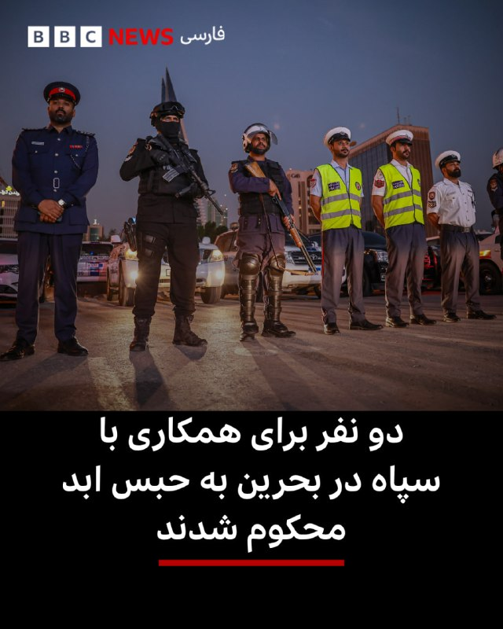
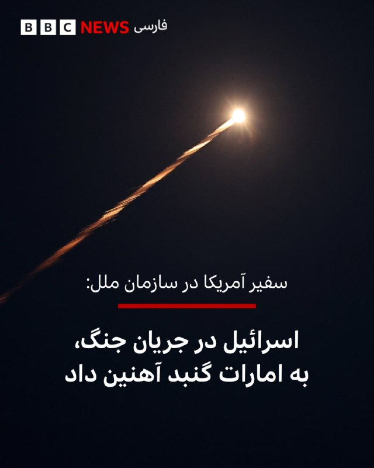

# خواننده تلگرام

<!-- TOP_NAV START -->

<!-- TOP_NAV END -->

<!-- MSG START -->

---
📅 بروزرسانی: 1405/02/22 21:47
---

## bbcpersian — post 280864

  <a href="telegram/content/bbcpersian_280864_1778609875.mp4" target="_blank">🎬 Download video</a>

بیش از ۷۰ روز است که اینترنت جهانی در ایران قطع شده و هزینه‌های بسیاری بر اقتصاد اشخاص و کشور بر جا گذاشته است. در روزهای اخیر صداهای بیشتر از کاربران اینترنت در ایران شنیده می‌شود و به نظر می‌رسد تعداد بیشتری توانسته‌اند به اینترنت جهانی وصل شوند.

تعدادی از کاربران با پرداخت مبلغ «۴۰ هزار تومان به ازای هر گیگ» از اپراتور‌ها خدمات اینترنتی ایران موسوم به «اینترنت پرو» خریده‌اند و تعدادی با فیلترشکن‌های گران‌تر به اینترنت جهانی وصل شده‌اند.

حدود چهار ماه است که دسترسی کاربرانی که در ایران هستند به اینترنت جهانی بسیار دشوار شده است. پس از اعتراضات دی ۱۴۰۴ و سپس جنگ آمریکا و اسرائیل با ایران، دسترسی به اینترنت جهانی به طور کامل قطع شد. اما تعداد اندکی افراد دارای سیم‌کارت بااصطلاح «سفید» به اینترنت دسترسی داشته‌اند.

📷Getty Images
EPA/Shutterstock
https://bbc.in/49rKNBi
https://bbc.in/4uIjf2M

## bbcpersian — post 280863

🔻‌محمدرضا شهبازی، مجری برنامه پاورقی شبکه ۲ تلویزیون دولتی ایران که به عنوان یک چهره حامی حکومت شناخته می‌شود، در واکنش به مقایسه وضعیت اینترنت در ایران و آزمایش اینترنت ۵جی در افغانستان و شروع استفاده از کردیت کارت‌های بین‌المللی در سوریه گفت: «اگر این چیزها…

## bbcpersian — post 280862

🔻‌محمدرضا شهبازی، مجری برنامه پاورقی شبکه ۲ تلویزیون دولتی ایران که به عنوان یک چهره حامی حکومت شناخته می‌شود، در واکنش به مقایسه وضعیت اینترنت در ایران و آزمایش اینترنت ۵جی در افغانستان و شروع استفاده از کردیت کارت‌های بین‌المللی در سوریه گفت: «اگر این چیزها اینقدر مهم است بروید همانجا (سوریه و افغانستان) زندگی کنید.»

 مجری برنامه پاورقی با خواندن یک توییت از پوریا زراعتی، مجری تلویزیون اینترنشنال که شرایط اینترنت در ایران را با افغانستان و سوریه مقایسه کرده بود و همچنین اشاره به یک پست از یک کانال تلگرامی که اشاره مشابهی به اینترنت در ایران داشت، گفت: «بروید سوریه با کردیت کارت از آمازون چسب پهن بخرید و زمان بمباران شیشه‌هایتان را چسب بزنید.»

@BBCPersian

## bbcpersian — post 280861

🔻مخالفت دوباره حزب‌الله با هرگونه مذاکره مستقیم لبنان با اسرائیل

در آستانه دور جدید مذاکرات اسرائیل و دولت لبنان، حزب‌الله یک بار دیگر خواستار خودداری از هرگونه مذاکره مستقیم با اسرائیل شد.

نعیم قاسم، دبیرکل حزب‌الله، هشدار داد که هرگونه مذاکره مستقیم فقط به نفع اسرائیل خواهد بود.

او همچنین تاکید کرد که موضوع سلاح‌های حزب‌الله «یک امر داخلی است و در مذاکرات با دشمن جایی ندارد.»

نعیم قاسم در پیام صوتی خود خطاب به نیروهای حزب‌الله گفت که «مقاومت» هرگز تسلیم فشار آمریکا و اسرائیل نخواهد شد و قول داد که میدان نبرد برای اسرائیل به «جهنم» تبدیل شود.

دبیرکل حزب‌الله در بخشی دیگر از سخنانش از توجه ایران به لبنان و مردمش قدردانی کرد و گفت: «توافق ایران و آمریکا که شامل پایان تجاوز به لبنان می‌شود، تقریبا محکم‌ترین سند برای توقف این تجاوز است.»

با این حال او افزود که مسئولیت مذاکره برای تامین اهداف ملی لبنان همچنان بر عهده مقام‌های لبنان است و قول داد که همکاری کند.

دور سوم مذاکرات لبنان و اسرائیل قرار است روزهای پنجشنبه و جمعه این هفته برگزار شود.

باوجود ادامه آتش‌بس با ایران، تبادل آتش میان حزب‌الله لبنان و اسرائیل همچنان ادامه داشته است.

آمریکا و اسرائیل از دولت لبنان می‌خواهند که حزب‌الله را خلع سلاح کند اما حزب‌الله می‌گوید تسلیم نخواهد شد.

@BBCPersian

## bbcpersian — post 280860

🔻ثبت بالاترین نرخ تورم آمریکا در سه سال اخیر در پی افزایش قیمت سوخت

نرخ تورم در آمریکا به بالاترین حد خود در سه سال اخیر رسید و دلیل اصلی آن هم گرانی انرژی ناشی از جنگ با ایران عنوان شده است.

افزایش ۱۸ درصدی قیمت سوخت در ماه گذشته در کنار گرانتر شدن هزینه‌های خوراک، مسکن، پوشاک و مسافرت‌های هوایی، شاخص قیمت مصرف‌کننده را بالا برد و نرخ تورم در دوازده منتهی به آوریل را به ۳/۸ درصد رساند. این رقم در ماه قبل از آن ۳/۳ درصد بود.

اداره آمار کار آمریکا اعلام کرده است که تقریبا نیمی از افزایش قیمت‌ها در ماه آوریل متاثر از بالا رفتن هزینه‌های انرژی بوده است.

جنگ آمریکا و اسرائیل با ایران و بسته شدن تنگه هرمز، باعث جهش قیمت نفت و گرانی شدید بنزین در آمریکا شد.

بنابر اعلام انجمن خودروسازان آمریکا، قیمت متوسط یک گالن بنزین بدون سرب اکنون ۴ و نیم دلار است که بالاترین قیمت آن از ژوئیه ۲۰۲۲ میلادی است.

افزایش نرخ تورم در ماه آوریل، احتمال کاهش نرخ بهره بانکی در سال جاری را به طور فزاینده‌ای کاهش می‌دهد.
@BBCPersian

## bbcpersian — post 280859

  

🔻دادگاه عالی کیفری بحرین امروز دو نفر را برای «همکاری و ارتباط با سپاه پاسداران تروریستی ایران» به حبس ابد محکوم کرد.

به گزارش رسانه‌های بحرین، یکی از این دو فرد زن است.

آنها متهم به «اقدامات خصمانه و تروریستی» علیه پادشاهی بحرین بودند. دادگاه علاوه بر دستور ضبط اشیاء توقیف‌شده، آنها را ۱۰ هزار دینار بحرین (۲۶۵۲۵ دلار) جریمه کرد.

اداره کل تحقیقات کیفری و علوم جرم‌شناسی بحرین گفت که سرویس‌های اطلاعاتی ایران و سپاه پاسداران،به «رهبران برخی گروه‌های تروریستی مستقر در جمهوری اسلامی ایران» پول داده‌ و آنها را مامور کرده بودند تا چندین مرکز حیاتی را در بحرین زیر نظر بگیرند. هدف از این اقدام، «آماده‌سازی برای هدف قرار دادن این مراکز و اجرای عملیات‌های تروریستی» بود تا امنیت و ثبات پادشاهی بحرین را مختل کنند.

علاوه بر این، دادستانی جرایم تروریستی بحرین گفت که دادگاه عالی کیفری در جلسه امروز، در ۹ پرونده مربوط به افراد متهم به «حمایت و تایید حملات تروریستی ایران علیه پادشاهی بحرین، انتشار اطلاعات حیاتی ممنوعه و تصویربرداری از مکان‌های محدودشده» حکم صادر کرد.

مطلب کامل:

https://bbc.in/4d49cPM
📷Getty
@BBCPersian

## bbcpersian — post 280858

  

🔻بحران در دولت بریتانیا با استعفای سه عضو پایین‌رتبه کابینه امروز ادامه یافت.

بیش از ۸۴ نماینده حزب کارگر در پارلمان از کی‌یر استارمر خواسته‌اند که برای کناره‌گیری از نخست‌وزیری یک جدول زمانی اعلام کند.

پس از آنکه دیروز آقای استارمر گفت که اشتباهات را می‌پذیرد اما به کارش ادامه می‌دهد، بعضی از اعضای دولت از او حمایت کردند و گفتند اکنون زمان مناسبی برای به چالش کشیدن او به‌عنوان رهبر حزب نیست اما شمار فزاینده‌ای هم می‌گویند که کار دولت با ادامه نخست‌وزیری آقای استارمر ممکن نیست.

گمانه‌زنی‌ها درباره آینده سیاسی نخست‌وزیر بریتانیا از زمان انتخابات محلی پنجشنبه (۷ مه) شدت گرفته است؛ انتخاباتی که حزب کارگر، به رهبری کی‌یر استارمر، نزدیک به ۱۵۰۰ کرسی شوراهای محلی در انگلستان را از دست داد، در اسکاتلند هم عقب‌تر نشست، در ولز نیز پس از ۲۷ سال در صدر، به رتبه سوم سقوط کرد.

این شکست سنگین انتخاباتی باعث شد تعدادی از نمایندگان حزب کارگر خواستار کناره‌گیری یا تعیین زمانی برای آن شوند. برای به چالش کشیدن رهبر حزب، رای ۸۱ نماینده حزب کارگر لازم است.

مطلب کامل:
https://bbc.in/3Po91FI
📷Getty Images
@BBCPersian

---
📅 بروزرسانی: 1405/02/22 19:34
---

## bbcpersian — post 280857

  <a href="https://t.me/bbcpersian/280857" target="_blank">📎 Download file</a>

کِلسی داونپورت: ایران تا سلاح اتمی، فقط یک تصمیم سیاسی فاصله دارد_ گفت‌وگوی ویژه
کِلسی داونپورت، از چهره‌های شناخته‌شده در حوزهٔ منع گسترش سلاح‌های هسته‌ای و مدیر سیاست‌گذاری عدم‌اشاعه در انجمن کنترل تسلیحات در آمریکا، یکی از دقیق‌ترین و صریح‌ترین تحلیلگران دربارهٔ برنامه هسته‌ای ایران است. او سال‌هاست تحولات مربوط به ایران، آمریکا و آژانس بین‌المللی انرژی اتمی را دنبال می‌کند و از منتقدان جدی سیاست‌های دولت ترامپ در این پرونده است.
در گفت‌وگویی با فرناز قاضی‌زاده، خانم داونپورت با جزئیات توضیح می‌دهد که چرا حملات اخیر به تأسیسات هسته‌ای ایران نه‌تنها این برنامه را نابود نکرده، بلکه ممکن است انگیزهٔ سیاسی ایران برای حرکت به سمت سلاح را افزایش داده باشد. او می‌گوید تا زمانی که ذخایر اورانیوم غنی‌شدهٔ ایران باقی است و آژانس دسترسی لازم برای بررسی این برنامه را ندارد، در صورت تصمیم سیاسی برای ساخت سلاح، ایران از دانش و امکانات لازم برخوردار است.
@BBCPersian

## bbcpersian — post 280853

  

🔻پنتاگون روز سه‌شنبه اعلام کرد که جدیدترین ارزیابی از هزینه جنگ با ایران حدود ۲۹ میلیارد دلار است.

این آمار جدید که در جلسه استماع بودجه در کنگره اعلام شد، حدود ۴ میلیارد دلار بیشتر از تخمینی است که پیت هگست، وزیر دفاع آمریکا، حدود دو هفته پیش ارائه کرده بود.

پیت هگست، وزیر دفاع و ژنرال دن کین، رئیس ستاد مشترک ارتش آمریکا، در حال شهادت دادن در مورد درخواست بودجه یک و نیم تریلیون دلاری برای سال ۲۰۲۷ میلادی بودند که از آنها خواسته شد تا در مورد هزینه جنگ با ایران هم توضیحاتی ارائه دهند.

جولز هرست، رئیس امور مالی پنتاگون هم که در این جلسه حضور داشت با اشاره به تخمین وزیر دفاع این کشور در ۲۹ آوریل در کنگره گفت: «در زمان شهادت... این مبلغ ۲۵ میلیارد دلار بود.»

او همچنین گفت: «اما تیم مشترک کارکنان و حسابرسی دائما تخمین‌ها را زیر نظر دارند و اکنون فکر می‌کنیم که این مبلغ به ۲۹ میلیارد دلار نزدیک‌تر است.»

📷Getty Images
@BBCPersian

## bbcpersian — post 280852

🔻رزمایش اعلام نشده سپاه در تهران

سپاه پاسداران یک همایش اعلام نشده به نام «قائد شهید» در تهران بزرگ برگزار کرد.

به گزارش رسانه‌های ایران، این رزمایش برای «تمرین سناریوهای مقابله با دشمن و ارزیابی تاکتیک‌های رزمی» در سطح سپاه محمد رسول الله تهران بزرگ برگزار شد.

سرتیپ حسن حسن‌زاده، فرمانده این سپاه گفت در این رزمایش برای «ارتقای توان رزمی برای مقابله با هرگونه تحرک دشمن» همه «تاکتیک‌ها و تکنیک‌های تیمی و فردی با موفقیت» تمرین شد.

سپاه محمد رسول‌الله تهران بزرگ که گفته می‌شود بزرگترین یگان نظامی امنیتی سپاه است مسئولیت امنیت شهر تهران را به عهده دارد. مسئولیت امنیت استان تهران جز تهران بزرگ با سپاه سیدالشهداست.

https://bbc.in/4drNww2
@BBCPersian

## bbcpersian — post 280851

  <a href="https://t.me/bbcpersian/280851" target="_blank">📎 Download file</a>

پادکست برنامه شصت دقیقه سه‌شنبه ۲۲ اردیبهشت ۱۴۰۵
این نسخه رادیویی برنامه شصت دقیقه تلویزیون فارسی بی‌بی‌سی است که هرشب بعد از پخش، با حجم کم از اپلیکیشن‌های پادگیر و صفحه تلگرام بی‌بی‌سی فارسی در دسترس است.
در تلگرام بی‌بی‌سی فارسی می‌توانید با هشتگ #BBCPersianRadio با ما در ارتباط باشید.

پیامگیر تلگرام بی‌بی‌سی فارسی:
@BBCShoma

## bbcpersian — post 280850

  

🔻دولت جمهوری اسلامی می‌گوید از ایالات متحده به دیوان داوری ایران و آمریکا، مستقر در لاهه هلند، شکایت کرده است.

به گزارش خبرگزاری‌های ایران، این شکایت دولت آمریکا را به نقض مفاد بیانیه‌های الجزایر متهم کرده است؛ توافقی که در دی ۱۳۵۹ با میانجی‌گری الجزایر حاصل شد و به بحران گروگان‌گیری دیپلمات‌های آمریکایی در ایران پایان داد.

«جنگ ۱۲ روزه، حملاتی که از ۹ اسفند (۲۸ فوریه) آغاز شد و همچنین تحریم‌های اقتصادی ایالات متحده» از جمله شکایت‌های ایران هستند.

بر اساس عهدنامه الجزایر آمریکا متعهد شده در امور داخلی، سیاسی و نظامی مستقیم یا غیرمستقیم ایران دخالت نکند.

در حال حاضر، دو شکایت دیگر ایران از آمریکا در دیوان دادگستری بین‌المللی در جریان است که یکی مربوط به خروج آمریکا از توافق هسته‌ای موسوم به برجام و دیگری درباره مصادره نزدیک به دو میلیارد دلار از اموال بانک مرکزی ایران است.

📷Getty Images
@BBCPersian

## bbcpersian — post 280849

  <a href="telegram/content/bbcpersian_280849_1778601899.mp4" target="_blank">🎬 Download video</a>

🔻سرخط خبرهای سه‌شنبه ۲۲ اردیبهشت ۱۴۰۵
@BBCPersian

---
📅 بروزرسانی: 1405/02/22 17:00
---

## bbcpersian — post 280848

🔻نیروی دریایی سپاه: محدوده تنگه هرمز را از ۲۰ مایل، به بیش از ۲۰۰ مایل گسترش دادیم

معاون سیاسی نیروی دریایی سپاه پاسداران می‌گوید که ایران پس از جنگ اخیر با آمریکا و اسرائیل، محدوده تنگه هرمز را «به‌طور قابل‌توجهی» گسترش داده است.

محمد اکبرزاده به تلویزیون ایران گفت که این محدوده اکنون «از سواحل جاسک و سیری تا فراتر از جزایر تنب بزرگ، به‌عنوان یک پهنه راهبردی تعریف شده است؛ به‌عبارت دیگر، تنگه هرمز بزرگ‌تر شده و به یک منطقه وسیع عملیاتی تبدیل شده است.»

به گفته معاون سیاسی نیروی دریایی سپاه، محدوده تنگه هرمز از نظر وسعت «از ۲۰ الی ۳۰ مایل در گذشته به بیش از ۲۰۰ الی ۳۰۰ مایل، یعنی ۵۰۰ کیلومتر» گسترش پیدا کرده است.

محمد اکبرزاده گفت: «در یکی از موارد اخیر، یک ناوچه آمریکایی قصد عبور از این محدوده را داشت که با رصد دقیق نیروهای مسلح مواجه شد و پس از مشاهده برخی رفتارهای تحریک‌آمیز، نیروی دریایی ارتش با شلیک‌های هشداردهنده و هدفمند، پیام لازم را منتقل کرد و این شناور نیز بلافاصله مسیر خود را تغییر داد.»

https://bbc.in/4drNww2
@BBCPersian

## bbcpersian — post 280847

  <a href="telegram/content/bbcpersian_280847_1778592617.mp4" target="_blank">🎬 Download video</a>

🔻‌در جریان اجلاس «آفریقا فوروارد» که روز دوشنبه ۱۱ مه ۲۰۲۶ در نایروبی کنیا برگزار شد، امانوئل مکرون، رئیس‌جمهور فرانسه، با قطع کردن صحبت‌های سخنران از حاضران خواست سکوت کرده و سر و صدا نکنند .

او با اشاره به «غیرممکن» شدن شنیدن صحبتهای سخنرانان به حاضران گفت: «این کاملا بی‌احترامی است.»

اجلاس «آفریقا فوروارد» نشستی است که بیش از ۳۰ رهبر آفریقایی، مدیران تجاری و کارآفرینان جوان را گرد هم آورده است.

فرانسه در تلاش است روابط خود را با کشورهای این قاره تقویت کند.

@‌‌BBCPersian

## bbcpersian — post 280846

در نشست خبری روز ۲۲ اردیبهشت فاطمه مهاجرانی، سخنگوی دولت، بر سر اینترنت پرو و شرایط واگذاری آن بگو مگویی بین او و خبرنگاران پیش آمد.

خانم مهاجرانی گفت اینترنت پرو مصوبه شورای عالی امنیت ملی را دارد که رئیس‌جمهور رئیس آن است. او با تاکید بر اینکه اینترنت پرو ویژه کسب و کارهاست، در ادامه گفت وقتی سایه جنگ از کشور رفع شد به حالت عادی برمی‌گردد.

در ادامه خبرنگاران سوال‌های متعددی پرسیدند که در ویدیو به درستی شنیده نمی‌شود و سخنگوی دولت گفت کشور در جنگ است و ویژگی جنگ امنیت مردم است.

او در ادامه گفت اینترنت حق مردم و یکی از حقوق شهروندی است و خشم مردم به حق است اما بدانند «عامل این خشم دشمنانی هستند که باعث می‌شوند امنیت ما مخدوش شود.»

همزمان وزیر ارتباطات در گفتگویی که با خبرنگاران داشت اعلام کرد در واگذاری اینترنت پرو تخلف‌هایی صورت گرفته که در حال بررسی است و قوه قضائیه هم ورود کرده است.

غلامحسین محسنی اژه‌ای، رئیس قوه قضائیه هم درباره اینترنت پرو و واگذاری آن گفت: اگر موضوع درستی است باید آن را تبیین کرد و اگر تخلف هست باید برخورد شود. نباید مسائل را مبهم رها کرد.
@BBCPersian

---
📅 بروزرسانی: 1405/02/22 15:04
---

## bbcpersian — post 280845

🔻کویت: چهار نفوذی وابسته به سپاه پاسداران را دستگیر کردیم

وزارت کشور کویت می‌گوید که «چهار نفوذی وابسته به سپاه پاسداران» را حین تلاش برای ورود به کشور از طریق دریا بازداشت کرده است.

خبرگزاری دولتی کونا به نقل از این وزارتخانه گزارش داده است که یک نفر از نیروهای مسلح کویت در درگیری با این چهار نفر مجروح شده است.

بر اساس بیانیه وزارت کشور کویت، دستگیرشدگان دو سرهنگ، یک سروان و یک ستوان نیروی دریایی سپاه بوده‌اند که «اذعان» کرده‌اند ماموریت داشتند به جزیره بوبیان «نفوذ» کنند.

در این بیانیه آمده است که این چهار نفر در اول ماه مه (۱۱ روز پیش) سعی کردند «سوار بر یک قایق ماهیگیری که مخصوص انجام اقدامات خصمانه علیه کویت تدارک داده شده بود» وارد کویت شوند.

بوبیان بزرگترین جزیره کویت است و با سواحل ایران و عراق فاصله کمی دارد.

رسانه‌های ایران در زمان جنگ گفتند که پس از حمله ایران به پایگاه آمریکا در کویت، نظامیان آمریکا در جزیره بوبیان مستقر شدند.

https://bbc.in/4drNww2
@BBCPersian

## bbcpersian — post 280837

🖊میشل رابرتس
دبیر سلامت دیجیتال

مسافران کشتی تفریحی که دچار شیوع ویروس هانتا شده، در حال تخلیه و اعزام به کشورهای خود هستند تا در صورت لزوم خود را قرنطینه کنند و تحت درمان پزشکی قرار بگیرند.

برخی دیگر از مسافران کشتی ام‌وی هوندیوس با پروازها یا مسیرهای ارتباطی قبلی، کشتی را ترک کرده‌اند و اکنون برای احتیاط، افرادی که با آن‌ها در تماس بوده‌اند در حال شناسایی هستند.

مقام‌ها می‌گویند خطر گسترش این عفونت به عموم مردم همچنان پایین است.

خدمه و مسافران اکنون باید برای جلوگیری از هرگونه گسترش احتمالی این بیماری، بیش از یک ماه خود را قرنطینه کنند.

سه نفر یا در خود کشتی یا پس از سفر با آن، جان باختند. این کشتی‌ یک ماه پیش از آرژانتین حرکت کرده بود. چهار نفر دیگر نیز برای درمان، به شکل اورژانسی از کشتی خارج شدند.

با این وصف ما باید چقدر نگران باشیم؟
ادامه مطلب در لینک زیر:

https://bbc.in/4dgH0Ie
📸GettyImages/ Reuters/ Anadolu
via Getty Images/ EPA/ LightRocket via Getty Images/ AFP via Getty
Images
@BBCPersian

## bbcpersian — post 280836

🔻فیدان در قطر: از تنگه هرمز نباید به‌عنوان سلاح استفاده شود

وزیر خارجه ترکیه که به قطر سفر کرده است، می‌گوید آنکارا از تلاش‌ها برای باز کردن تنگه هرمز حمایت می‌کند.

هاکان فیدان در کنفرانس خبری مشترک با همتای قطری خود در دوحه در عین حال گفت که از تنگه هرمز نباید به‌عنوان «سلاح» استفاده شود.

محمد بن عبدالرحمن آل ثانی، نخست‌وزیر و وزیر خارجه قطر، هم گفت که ایران نباید از تنگه هرمز به‌عنوان ابزاری برای اعمال فشار یا «باج‌گیری» از کشورهای منطقه خلیج فارس استفاده کند.

وزیر خارجه قطر همچنین گفت که سفر اخیرش به آمریکا برای کمک به پایان دادن جنگ با ایران بوده است.

@BBCPersian

## bbcpersian — post 280835

  

🔻روزنامه «اسرائیل هیوم» به نقل از سفیر آمریکا در سازمان ملل نوشت که اسرائیل در جریان جنگ اخیر، سامانه پدافند گنبد آهنین در اختیار امارات متحده عربی قرار داده است.

پیش از گزارش این روزنامه راستگرا، سایت خبری اکسیوس هم به نقل از مقام‌های آمریکایی و اسرائیلی بدون ذکر نام این خبر را داده بود.

اسرائیل هیوم از مایک والتس، سفیر آمریکا در سازمان ملل، نقل کرده است که «ما شاهد استفاده امارات از (سامانه) گنبد آهنین بودیم که اسرائیل در اختیار آنها قرار داده است.»

این روزنامه می‌گوید که آقای والتس از جزئیاتی پرده برداشته است که نشانگر «تعمیق» روابط اسرائیل و امارات است.

پیشتر روزنامه آمریکایی وال‌استریت جورنال گزارش داده بود که امارات متحده عربی مخفیانه هم‌زمان با اعلام آتش‌بس، چند حمله هوایی به تاسیسات نفتی ایران انجام داده است.

بنیامین نتانیاهو مکررا وعده «خاورمیانه‌ جدید» را داده است که به گفته او شاهد افزایش همکاری اسرائیل و کشورهای منطقه خلیج فارس علیه ایران خواهد بود.

رسانه‌های اسرائیل هم در جریان جنگ اخیر بارها از «همکاری بی‌سابقه» با کشورهای منطقه خلیج فارس خبر داده بودند.

📷Reuters
@BBCPersian

## bbcpersian — post 280834

🔻فرودگاه امام خمینی: شرکت‌های هواپیمایی داخلی به ۲۰ مقصد پرواز دارند

بنابر اعلام فرودگاه امام خمینی تهران، هم اکنون ۱۳ شرکت هواپیمایی داخلی به ۲۰ مقصد پرواز دارند.

مدیر روابط عمومی این فرودگاه از شهرهای استانبول، مسقط، نجف، مدینه، شانگهای، گوانگژو، بغداد و پکن به عنوان مقاصدی نام برد که از تهران به آنها، پرواز انجام می‌شود.

اهورا محمدی همچنین گفت: «۱۳ شرکت هواپیمایی ایرانی در حال انجام این پروازها هستند و بیشترین پروازها نیز برای شرکت‌های ماهان، ایران‌ایر، معراج، ایرتور، سپهران و کاسپین است.»

آقای محمدی تعداد پروازهای روزانه از فرودگاه امام خمینی را «بین ۳۵ تا ۴۰ پرواز» اعلام کرد.

پروازهای خارجی از ایران که از زمان شروع جنگ در نهم اسفند سال گذشته متوقف شده بود، در اوایل اردیبهشت از سر گرفته شد.

آمریکا و اسرائیل در طول جنگ شماری از فرودگاه‌ها و هواپیماها را در ایران هدف حملات هوایی قرار دادند.

@BBCPersian

## bbcpersian — post 280833

🔻«شناسایی» ۵۱۰۰ زندانی فراری در استان البرز

رئیس کل دادگستری البرز گفت که ۵۱۰۰ زندانی فراری شناسایی شده‌اند اما به مجموع متهمانی که در این استان از زندان فرار کرده‌اند، اشاره‌ای نکرد.

حسین فاضلی هریکندی گفت: «در سال ۱۴۰۳ مجموعا ۲۲۸۵ متهم از طریق سامانه ساما شناسایی و بازداشت شدند. استفاده کامل از سامانه ساما در سال ۱۴۰۴ منجر به شناسایی بیش از ۵۱۰۰ متهم و محکوم متواری شد که نسبت به سال قبل از آن رشد ۱۲۳ درصدی را نشان می‌دهد و از این تعداد قریب به ۱۲۰۰ نفر جلب شدند.»

آقای فاضلی هریکندی گفت که سامانه اطلاعات موثر اشخاص (ساما) در سال ۱۴۰۳ برای «رفع مشکل فقدان پایگاه داده منسجم به منظور شناسایی و جلب متهمان و محکومان متواری در مبادی ورودی واحدهای قضائی و انتظامی» راه‌اندازی و اجرایش در سال ۱۴۰۴ «کامل» شد.

@BBCPersian

## bbcpersian — post 280832

🔻پاکستان گزارش سی‌بی‌اس درباره «پناه دادن» به هواپیماهای نظامی ایران را تکذیب کرد

پاکستان گزارش شبکه سی‌بی‌اس درباره حضور هواپیماهای نظامی ایرانی در پایگاه هوایی نورخان را رد کرد.

وزارت امور خارجه پاکستان این گزارش را «گمراه‌کننده و جنجالی» توصیف کرد.

در بیانیه این وزارتخانه آمده است: «چنین روایت‌های که براساس گمانه‌زنی‌هاست، ظاهرا با هدف تضعیف تلاش‌های جاری برای ثبات و صلح منطقه‌ای مطرح می‌شود.»

شبکه سی‌بی‌اس، شریک رسانه‌ای بی‌‌بی‌سی در آمریکا، به نقل از دو مقام آمریکایی گزارش داده است که پاکستان در میانه تلاش‌ها برای متوقف کردن جنگ، «به هواپيماهای نظامی ايران غیرعلنی اجازه داد در پايگاه‌های هوايی‌اش مستقر شوند.»

اقدامی که به گفته مقام‌های امريکايی در گفتگو با سی‌بی‌اس، ممکن است حاکی از تلاش ایران برای محافظت هواپیماهایش از حملات هوايی باشد.

وزارت خارجه پاکستان اما می‌گوید که پس از برقراری آتش‌بس و در جریان دور نخست گفت‌وگوهای اسلام‌آباد، تعدادی هواپیما از ایران و آمریکا برای تسهیل جابه‌جایی دیپلمات‌ها و تیم‌های امنیتی و کارکنان اداری مرتبط با روند مذاکرات وارد پاکستان شدند. برخی هواپیماها و نیروهای پشتیبانی نیز در انتظار دورهای بعدی مذاکرات مدتی در پاکستان ماندند.

این وزارتخانه اضافه کرده است: «هواپیماهای ایرانی که اکنون در پاکستان مستقر هستند، در دوره آتش‌بس وارد این کشور شده‌اند و هیچ ارتباطی با هیچ‌گونه وضعیت اضطراری نظامی یا ترتیبات حفاظتی ندارند.»

پاکستان همچنین گفت که اگرچه مذاکرات رسمی در جریان نیست اما تبادل‌ دیپلماتیک در سطح عالی ادامه دارد.

@BBCPersian

## bbcpersian — post 280831

🔻وزارت دارایی آمریکا ۱۲ فرد و نهاد را برای تسهیل و فروش نفت ایران به چین تحریم کرد

وزارت دارایی آمریکا در اقدامی تازه ۱۲ فرد و نهاد را به‌دلیل نقش‌ داشتن در تسهیل فروش و انتقال نفت ایران به چین از سوی سپاه پاسداران انقلاب اسلامی تحریم کرد.

به گفته این وزارتخانه، سپاه پاسداران با استفاده از شرکت‌های پوششی در حوزه‌های اقتصادی دارای نظارت ضعیف، نقش خود در فروش نفت را پنهان کرده است و درآمد حاصل از آن را به حکومت ایران منتقل می‌کند.

وزارت دارایی آمریکا گفته است که جمهوری اسلامی به‌جای استفاده از این درآمدها برای حمایت از مردم ایران، آن را صرف توسعه تسلیحاتی، حمایت از گروه‌های نیابتی و تامین مالی نیروهای امنیتی برای سرکوب آزادی‌های شهروندان می‌کند.

همچنین اسکات بسنت، وزیر دارایی آمریکا، نیز با انتشار بیانیه‌ای مرتبط با این تحریم‌ها در شبکه اجتماعی ایکس نوشته است: «در حالی که نیروهای نظامی ایران با درماندگی در تلاش برای بازسازی توان خود هستند، کارزار ‘فشار اقتصادی’ همچنان منابع مالی حکومت را برای برنامه‌های تسلیحاتی و گروه‌های نیابتی و اهداف هسته‌ای محدود خواهد کرد.»

او اضافه کرده است: «وزارت دارایی آمریکا به قطع دسترسی حکومت ایران به شبکه‌های مالی مورد استفاده برای اقدامات تروریستی و بی‌ثبات‌سازی اقتصاد جهانی ادامه می‌دهد.»

@BBCPersian

## bbcpersian — post 280829

🔻ولایتی در واکنش به ترامپ: در میدان شکست‌تان دادیم، گمان نکن در دیپلماسی پیروز خواهی شد

علی اکبر ولایتی، وزیرخارجه سابق ایران و مشاور سیاست خارجی رهبر جمهوری اسلامی، در واکنش به اظهارات جدید دونالد ترامپ، رئیس‌جمهور آمریکا، گفته است: «شما را در میدان شکست دادیم؛ پس هرگز گمان نکن پیروزِ دیپلماسی خواهی شد.»

آقای ولایتی به اظهارات جدید آقای ترامپ که برخی آن را اشاره تلویحی به تهدید ایران به حمله اتمی ارزیابی کرده‌اند، اشاره کرده و گفته است: «ترامپ، درحالی ایران را با ایهام، تهدید اتمی می‌کند که گویا دروغ‌های پنتاگون درباره کتمان آمار تلفات سنگین سربازان امریکایی را باور کرده است. آقای ترامپ هرگز گمان نکن با سوءاستفاده از آرامش امروز ما، پیروزمندانه وارد پکن خواهی شد.»

@BBCPersian

---
📅 بروزرسانی: 1405/02/22 13:05
---

## bbcpersian — post 280821

🔻یک تحقیق بی‌بی‌سی از تخلفات جدی در بخش کودکان یک بیمارستان دولتی در پاکستان پرده برداشته است. در سال ۲۰۲۵، این بیمارستان در شهر تونسه با شیوع گسترده اچ‌آی‌وی در میان کودکان مرتبط دانسته شد.

مقام‌های پاکستانی وعده برخورد قاطع دادند، اما بیش از یک سال بعد، بی‌بی‌سی دریافت که استفاده دوباره از سرنگ‌ها همچنان جان کودکان را به خطر می‌اندازد.

بیشتر بخوانید:
https://bbc.in/431RC93
@BBCPersian

## bbcpersian — post 280814

🔻شاید باقلوا تنها یک شیرینی سنتی خاورمیانه‌ای به نظر بیاید که در مناسبت‌ها و مهمانی‌ها سرو می‌شود، اما پشت لایه‌های نازک خمیر، شربت و مغز پسته، زنجیره‌ای جهانی و بسیار حساس از تامین کالا قرار دارد.

با افزایش تنش‌های منطقه‌ای و بسته شدن تنگه هرمز، یکی از مهم‌ترین شریان‌های دریایی تجارت جهانی، این شیرینی کوچک هم بازتابی از بحران‌هایی بزرگ‌تر از اندازه خود شده است. این بحران بر قیمت پسته، زعفران و دیگر مواد اولیه صنعت شیرینی‌پزی اثر گذاشته است؛ به ویژه در بازارهای خلیج فارس که وابستگی زیادی به واردات دارند.

ادامه مطلب⬇️

https://bbc.in/4wvMvvB
📸GettyImages/ Anadolu via Getty Images/ AFP via Getty Images/ Universal Images Group via Getty Images
@BBCPersian

## bbcpersian — post 280813

  

🔻۲۷ وزير خارجه اتحاديه اروپا روز دوشنبه با اعمال تحريم‌های جديد عليه شهرک‌نشينان اسرائيلی به دليل افزايش خشونت‌ها عليه فلسطينيان در کرانه باختری اشغالی، موافقت کردند.

بر اساس آمار سازمان ملل متحد، از زمان آغاز جنگ غزه در اکتبر ۲۰۲۳، حملات شهرک‌نشينان افزايش چشمگيری داشته است.

شهرک‌های اسرائيلی — که طبق حقوق بين‌الملل غيرقانونی محسوب می‌شوند — بر روی اراضی اشغالی اسرائيل در کرانه باختری و بيت‌المقدس شرقی ساخته شده‌اند؛ مناطقی که فلسطينيان آنها را برای تشکيل کشور آينده خود مطالبه می‌کنند.

کايا کالاس، مسئول سیاست خارجی اتحادیه اروپا، روز دوشنبه گفت: «زمان آن رسيده که از بن‌بست به مرحله اقدام برسيم... افراط‌گرايی و خشونت بايد پيامد داشته باشد.»

تغيير دولت در مجارستان به ماه‌ها تأخير در اجرای تحريم‌های جديد اتحاديه اروپا پايان داد؛ تحريم‌هايی که پيش‌تر توسط نخست‌وزير راست‌گرای سابق اين کشور، ويکتور اوربان، از متحدان نزديک اسرائيل، متوقف شده بود.

ادامه مطلب⬇️
📸GettyImages
https://bbc.in/42sS8Nm
@BBCPersian

## bbcpersian — post 280812

🔻 قوه قضائیه جمهوری اسلامی ایران از اعدام عبدالجلیل شه‌بخش به جرم عضویت در گروه «انصار الفرقان» خبر داد. میزان، خبرگزاری قوه قضائیه اعلام کرد که او بامداد امروز (سه‌شنبه) اعدام شد. در بیانیه قوه قضائیه آمده است عبدالجلیل شه‌بخش «در جریان اقدامات ضد تروریستی…

## bbcpersian — post 280811

  

🔻 قوه قضائیه جمهوری اسلامی ایران از اعدام عبدالجلیل شه‌بخش به جرم عضویت در گروه «انصار الفرقان» خبر داد.

میزان، خبرگزاری قوه قضائیه اعلام کرد که او بامداد امروز (سه‌شنبه) اعدام شد.

در بیانیه قوه قضائیه آمده است عبدالجلیل شه‌بخش «در جریان اقدامات ضد تروریستی در شرق کشور» بازداشت شده بود.

انصارالفرقان، یک گروه مسلح سنی است که در سال های گذشته، در مواردی در جنوب شرقی ایران به نیروهای حکومتی حمله کرده است.

جمهوری اسلامی ایران این گروه را «باغی و تروریستی» می‌خواند.

عبدالجلیل شه‌بخش پس از بازداشت متهم به عضویت در این گروه شد و قوه قضائیه همچنین ادعا کرده است که او شش سال قبل برای دریافت آموزش‌های نظامی «به یکی از کشورهای همسایه» رفته بود. قوه قضائیه همچنین ویدیویی از او را به عنوان «اعترافات» منتشر کرده است. مشخص نیست که این ویدیو از او در چه شرایطی گرفته شده است.

📷MIZAN
@BBCPersian

## bbcpersian — post 280810

  

🔸تیم ملی فوتبال مردان ایران که آخرین تمرین‌های خود پیش از شرکت در جام جهانی را پشت سر می‌گذارد با انتشار عکسی دسته جمعی در روز دوشنبه - ۲۱ اردیبهشت - از نام‌گذاری رختکن کمپ تیم ملی به یاد کشته‌شدگان دبستان شجره طیبه میناب پرده برداشتند.

در این عکس که خبرگزاری ایرنا منتشر کرده تابلو «میناب ۱۶۸» در پشت سر بازیکنان حاضر در اردوی تیم ملی فوتبال دیده می‌شود.

تیم ملی فوتبال ایران برای برگزاری یک اردو تدارکاتی به زودی راهی ترکیه خواهد شد.

این تیم سه مسابقه مرحله گروهی خود را باید ماه آینده در لس‌آنجلس و سیاتل آمریکا برگزار کند و انتظار می‌رود در آنجا با حواشی فراونی از جمله اعتراضات ایرانیان مخالف جمهوری اسلامی روبرو شود.

📸IRNA
https://bbc.in/4dCcLg6
@BBCPersian

## bbcpersian — post 280809

  

🔸لامین یامال، فوق ستاره فوتبال اسپانیا و جهان که عصر یکشنبه به همراه تیم بارسلونا توانست با شکست رئال مادرید در ال‌کلاسیکو، قهرمانی این تیم در لالیگا را قطعی کند، روز دوشنبه در هنگام جشن خیابانی این تیم با بالا بردن پرچم فلسطین خبرساز شد.

بارسلونا در بازی اخیرش با نتیجه دو بر صفر، رئال مادرید را برد و سه هفته مانده به پایان مسابقات این فصل قهرمانی خود را مسجل کرد و و برای ۲۹مین بار جام قهرمانی باشگاه‌های اسپانیا را تصاحب کرد.

اسپانیا از کشورهای پیشگام اتحادیه اروپا در به رسمیت شناختن کشور مستقل فلسطینی است.

📸INSTAGRAM/Reuters
https://bbc.in/4wpg69U
@BBCPersian

<!-- MSG END -->

<!-- NAV START -->

<!-- NAV END -->
