# خواننده تلگرام

<!-- TOP_NAV START -->

<a href="https://github.com/hosseinyofficial/aio-downloader/blob/main/telegram/content/archive_1.md" style="display:inline-block; padding:6px 12px; margin:0 4px; background-color:#2ea44f; color:white; text-decoration:none; border-radius:4px; font-weight:bold;">صفحه بعد</a>

<!-- TOP_NAV END -->

<!-- MSG START -->

---
📅 بروزرسانی: 1405/02/29 03:03
---

## persian_trend_official — post 14462

  <a href="telegram/content/persian_trend_official_14462_1779147214.mp4" target="_blank">🎬 Download video</a>

▪️ شبتون بخیر 🫶

🫆:Tony

📌 @persian_trend_official
پرشین ترند | متفاوت‌ترین کانال نظامی

## OfficialPersiaTwiter — post 499173

  

آنچلوتی نیمار را برای جام جهانی به تیم ملی برزیل دعوت کرد

*OPT

@OfficialPersiaTwiter

## OfficialPersiaTwiter — post 499172

ادعای ترامپ: اسرائیل را پیش‌تر از تصمیم برای به تأخیر انداختن حمله به ایران مطلع کردم/انتخاب *OPT* @OfficialPersiaTwiter

## OfficialPersiaTwiter — post 499171

ادعای ترامپ درباره «گفت‌وگوهای مهم» با ایران: «این یک تحول بسیار مثبت است، اما خواهیم دید که آیا واقعاً به نتیجه‌ای می‌رسد یا نه. دوره‌هایی را داشته‌ایم که فکر می‌کردیم تقریباً به توافق نزدیک شده‌ایم، اما در نهایت موفق نشدیم؛ با این حال، این بار شرایط کمی…

## bbcpersian — post 281415

  

‌ ‌ ‌
دونالد ترامپ، رئیس جمهور آمریکا، در نخستین واکنش به حمله مسلحانه به مسجد جامع شهر سن دیگو آن را «حادثه وحشتناکی» خوانده و گفته به زودی با اعضای کابینه خود به طور جدی جزییات آن را زیر نظر خواهد گرفت.

پلیس سن دیگو و اداره آگاهی فدرال آمریکا - پلیس اف‌بی‌آی - گفته این تیراندازی را تحت عنوان جنایت ناشی از نفرت تحت بررسی دارد؛ اصطلاحی که مترادف تروریسم داخلی است و از احتمال وجود انگیزه‌های نژادپرستانه یا نفرت از قوم یا پیروان مذهب خاصی حکایت دارد.

https://bbc.in/4wt0sdw
📷Reuters
@BBCPersian

## bbcpersian — post 281414

🔻 این حمله در آستانه عید قربان روی داد
شیما خلیل - گزارشگر بی‌بی‌سی در کالیفرنیا

تیراندازی امروز ضربه‌ای سنگین به جامعه‌ای وارد کرده که در حال آماده شدن برای یکی از مقدس‌ترین فصل‌های مذهبی و بزرگ‌ترین اعیاد خود است.

تنها چند روز تا عید قربان باقی مانده؛ یکی از دو عید بزرگ مسلمانان که در آن خانواده‌ها جشن می‌گیرند و یاد اطاعت حضرت ابراهیم را گرامی می‌دارند.

این دوره زمانی در تقویم اسلامی بسیار مهم است. در حال حاضر ماه ذی‌الحجه قرار داریم؛ دوازدهمین و آخرین ماه تقویم قمری اسلامی.

این روزها به عنوان ۱۰ روز نخست ذی‌الحجه، از مقدس‌ترین و معنوی‌ترین روزهای سال در اسلام شناخته می‌شوند و جایگاه ویژه‌ای دارند.

این فصل همچنین هم‌زمان با موسم حج است؛ و روز عرفه به عنوان مقدس‌ترین روز سال در نظر گرفته می‌شود.

https://bbc.in/4futvHu
@BBCPersian

## bbcpersian — post 281406

ویلیام مک‌لنان، کالین کمپل و جوزی هنت، بخش تحقیقات محلی بی‌بی‌سی

تحقیقات تازه بی‌بی‌سی نشان می‌دهد قاچاقچیان انسان، از مهاجران غیرقانونی می‌خواهند که هزینه عبورشان از کانال مانش را از طریق شبکه‌ای از شرکت‌های ثبت‌شده در بریتانیا پرداخت کنند.

ما به‌طور مخفیانه از کارکنان یک مغازه در جنوب‌شرقی لندن فیلم‌برداری کردیم، در حالی که آن‌ها به پژوهشگر مخفی ما گفتند می‌تواند نزدیک به ۴۰۰۰ دلار پول نقد نزدشان بگذارد تا برای یک قاچاقچی انسان در فرانسه ارسال شود.

در این فروشگاه تلفن همراه در منطقه وولویچ به ما گفته شد: «پول خود را اینجا می‌گذاری. اگر دوستانت [به بریتانیا] رسیدند، نباید برگردی.»

تحقیق سه‌ماهه ما نشان می‌دهد قاچاقچیان چگونه از حساب‌های بانکی شرکت‌های بریتانیایی برای تسهیل عبور با قایق‌های کوچک استفاده می‌کنند؛ موضوعی که به گفته یک کارشناس برجسته جرایم مالی، پیش از این هرگز مشاهده نشده بود.

https://bbc.in/4dvXiwO
📷 BBC / Tom Nicholson/Getty Images / Kiran Ridley/Getty Images / Tom Nicholson/Getty Images / Mike Kemp/In Pictures via Getty Images / Dan Kitwood/Getty Images
@BBCPersian

## bbcpersian — post 281405

🔻 نگهبان مسجد سن دیگو یکی از قربانیان تیراندازی است

رئیس پلیس سن‌دیگو گفت مرکز اسلامی دارای خدمات امنیتی است و یکی از جان‌باختگان «نگهبان امنیتی شاغل در همین مرکز» بوده است.

او همچنین افزود یک باغبان که در نزدیکی محل حضور داشت هدف تیراندازی قرار گرفته، اما آسیبی ندیده است.

به گفته اسکات وال صحنه حادثه «بسیار آشفته و پرهرج‌ومرج» بوده و حدود ۵۰ تا ۱۰۰ نیروی پلیس در محل مرکز حضور داشته‌اند.

رهبران مذهبی شهر سن‌ دیگو این تیراندازی را محکوم و حمله به یک محل عبادت را نفرت‌انگیز توصیف کرده‌اند.

https://bbc.in/42Hnf7S
@BBCPersian

## Tans_Footbali — post 236423

کانال ۱۲ اسرائیل: ترامپ به اسرائیل اطلاع داد که تاخیر در حمله به ایران تنها دو تا سه روز است.

💛@Tans_Footbali

## Tans_Footbali — post 236422

انگار نه انگار بیش از ۸۰ روز شده که اینترنت قطعه و چند میلیون نفر به بیکار های جامعه اضافه شدن..
حتی اگه الان هم وصل کنن بازم ضربه ای که به خیلی از مشاغل وارد شده قابل جبران نیست و عملا نابود شدن..

💛@Tans_Footbali

## Tans_Footbali — post 236421

  <a href="telegram/content/Tans_Footbali_236421_1779147216.webm" target="_blank">🎬 Download video</a>

🚨پرزیدنت ترامپ: ایران نهایتا ۳ روز زمان داره 
💛@Tans_Footbali

## Tans_Footbali — post 236420

پرزیدنت ترامپ: اسرائیل را از تصمیم برای به تأخیر انداختن حمله به ایران مطلع کردم

💛@Tans_Footbali

## withyashar — post 11617

## withyashar — post 11616

۲۶ روز مانده تا تولد دونالد ترامپ خردادی دوست داشتنی ۱۴ ژوئن ۲۰۲۶ (۲۴ خرداد ۱۴۰۵) تهران میگیریم ؟ 😬
@withyashar

## withyashar — post 11614

کانال ۱۲ اسرائیل: ترامپ به اسرائیل اطلاع داد که تاخیر در حمله به ایران تنها دو تا سه روز است. @withyashar

## withyashar — post 11613

کانال ۱۲ اسرائیل: ترامپ به اسرائیل اطلاع داد که تاخیر در حمله به ایران تنها دو تا سه روز است.
@withyashar

---
📅 بروزرسانی: 1405/02/29 01:46
---

## persian_trend_official — post 14461

  <a href="telegram/content/persian_trend_official_14461_1779142612.webm" target="_blank">🎬 Download video</a>

تیراندازی در یک مرکز اسلامی در آمریکا 🔸رسانه‌ها روز دوشنبه از حضور یک فرد مسلح و تیراندازی در مرکز اسلامی سن دیگو خبر می‌دهند. 🔹پلیس سن دیگو از مردم خواست که از حضور در این منطقه خودداری کنند. ☆Phantom☆ 📌 @persian_trend_official پرشین ترند | متفاوت‌ترین…

## OfficialPersiaTwiter — post 499170

ادعای ترامپ درباره ایران: «خب، کشورهای دیگری نزد من آمدند و ما آماده بودیم فردا یک حمله بسیار بزرگ انجام دهیم. من آن را برای مدتی کوتاه به تعویق انداختم؛ امیدوارم شاید برای همیشه، اما شاید هم فقط برای مدت کوتاهی؛ چون گفت‌وگوهای بسیار مهمی با ایران داشته‌ایم…

## OfficialPersiaTwiter — post 499169

کاش از نظر آلزایمر ترامپ رو بررسی کنن من مطمئنم عین باباشاه شده اصلا یادش میره کجای بازی بود *شیر* @OfficialPersiaTwiter

## OfficialPersiaTwiter — post 499168

هر بار این بیت از خیام رو می‌خونم، حس می‌کنم یه نگاه به زندگیِ من انداخته و گفته:

“بنگر ز جهان چه طرف بربستم؟ هیچ
وز حاصلِ عمر چیست در دستم؟ هیچ”

*Bahar*

@OfficialPersiaTwiter

## bbcpersian — post 281404

  

‌ ‌ ‌
خبرگزاری هرانا، ارگان خبری مجموعه فعالان حقوق بشر، می‌گوید از زمان شروع جنگ اخیر تا هفته گذشته، دست‌کم ۴۰۲۳ بازداشت را در ایران ثبت کرده است.

به گفته این نهاد که مقرش در آمریکاست، اتهام‌های مطرح‌شده شامل جاسوسی، تهدید علیه امنیت ملی و ارتباط یا ارسال مطالب مربوط به جنگ به رسانه‌های خارجی است.

بنابر این گزارش، مقام‌های ایران از جنگ «برای تشدید روایت‌های امنیتی و توجیه بازداشت‌ها، محدودیت آزادی بیان و اعمال خشونت علیه غیرنظامیان استفاده کرده‌اند.»

احمدرضا رادان، فرمانده کل نیروی انتظامی، دیروز گفت از آغاز جنگ اخیر «بیش از ۶۵۰۰ نفر از وطن‌فروشان و جاسوسان دستگیر شده‌اند که ۵۶۷ نفر از آنان مرتبط با گروهک‌های ضدانقلاب و عناصر نفاق بودند.»

او درباره اعتراضات دی‌ماه گفت: «هیچ‌گونه رهاسازی انجام نشده و همچنان در حال شناسایی و دستگیری این افراد هستیم.»

هزاران نفر در اعتراضات سراسری دی بازداشت شده‌اند و رئیس قوه قضائیه خواستار رسیدگی سریع و بدون اغماض به پرونده آنها شده است.

https://bbc.in/4fzVJR8
📷 EPA/Shutterstock
@BBCPersian

## bbcpersian — post 281403

🔻 شهردار سن دیگو: به همشهریان مسلمان اطمینان می‌دهم که هیچ کمکی دریغ نخواهد شد

تاد گلوریا، شهردار سن‌دیگو، گفت از این که کودکانی که هنگام حمله در مدرسه مشغول تحصیل بودند، در امان مانده‌اند، سپاسگزار است.

او ادامه داد: «برای جامعه مسلمانان محلی، دعاهای من با شماست.»

آقای گلوریا گفت می‌خواهد به جامعه مسلمانان اطمینان دهد که «هیچ منبعی دریغ نخواهد شد» تا امنیت آن‌ها در برابر خشونت تامین شود.

او همچنین از نیروهای پلیس «عمیقا قدردانی» کرد و این حادثه را «وضعیتی غم‌انگیز» توصیف کرد.

شهردار سن‌دیگو همچنین به خانواده قربانیان تسلیت گفت و افزود بازرسان «هر اقدام لازم» را برای روشن شدن ابعاد حادثه انجام خواهند داد.

او تاکید کرد: «نفرت جایی در شهر سن‌دیگو ندارد.»

https://bbc.in/3PuRJqw
@BBCPersian

## bbcpersian — post 281402

🔻 فعال شدن پدافند هوایی در اصفهان

گزارش‌ها از ایران حاکی از شنیده شدن صدای پدافند در شهر اصفهان است.

خبرگزاری مهر هم با تایید این گزارش‌ها نوشته:‌ «هنوز مسئولان توضیحی در رابطه با چرایی فعالیت پدافند اصفهان ارائه نکرده‌اند.»

پیش از این گزارش‌هایی از فعال شدن پدافند جزیره قشم هم منتشر شده بود که خبرگزاری تسنیم گفته بود برای مقابله با «ریز پرنده‌ها» بوده است.

https://bbc.in/4wyq493
@BBCPersian

## bbcpersian — post 281401

🔻 حمله به مسجد جامع سن دیگو؛‌ پلیس تیراندازی را تحت عنوان «جنایت ناشی از نفرت» بررسی می‌کند

اسکات وال، رئیس پلیس سن‌دیگو، گفت حادثه رخ‌داده در مرکز اسلامی در حال حاضر به عنوان «جنایت ناشی از نفرت (تروریسم داخلی)» بررسی می‌شود و پلیس همکاری نزدیکی با اف‌بی‌آی دارد.

مارک رمیلی، مامور ویژه اف‌بی‌آی، نیز در ادامه گفت سه مرد بزرگسال که در تیراندازی هدف قرار گرفته بودند، جان باخته‌اند.

او افزود مرگ دو مظنون، که هر دو نوجوان بودند، تایید شده است.

آقای رمیلی گفت اف‌بی‌آی با «دقت کامل» در حال بررسی ابعاد حادثه است و همه منابع خود را برای روشن شدن جزئیات این حمله به کار گرفته است.

او همچنین از مردم خواست هرگونه اطلاعاتی را که می‌تواند به روند تحقیقات کمک کند، در اختیار مقام‌ها قرار دهند.

https://bbc.in/49apwMr
@BBCPersian

## bbcpersian — post 281400

🔻 تیراندازی در مسجد جامع سن‌دیگو؛ پلیس: جسد دو نوجوان در خودرو پیدا شد که احتمالا تیراندازها هستند

رئیس پلیس سن‌دیگو اعلام کرد دو مردی که در نزدیکی محل حادثه جان باخته پیدا شدند، به احتمال زیاد مظنونان تیراندازی هستند.

مقام‌ها گفتند اجساد این دو نوجوان پسر داخل یک خودرو در نزدیکی مسجد پیدا شده است.

رئیس پلیس همچنین گفت دو مظنون، که گفته می‌شود هر دو نوجوان بودند، داخل یک خودرو با جراحاتی ناشی از شلیک به خود پیدا شدند.

اسکات وال، رئیس پلیس سن‌دیگو، گفت: «جزئیات اتفاقات منتهی به این حادثه، آنچه دقیقا رخ داده و زمان دقیق وقوع آن، در روزهای آینده روشن خواهد شد.»

رئیس پلیس گفت ماموران در ساعت ۱۱:۴۳ به وقت محلی به محل حادثه اعزام شدند و «در مقابل محل، با آنچه به نظر می‌رسید سه قربانی جان‌باخته باشند» روبه‌رو شدند.

او افزود نیروهای بیشتر پلیس ظرف چهار دقیقه به محل رسیدند.

به گفته او، «تقریبا همزمان، تماس‌هایی از چند خیابان آن‌طرف‌تر دریافت کردیم که از ادامه تیراندازی فعال خبر می‌داد.»

https://bbc.in/4nAIJwT
@BBCPersian

## Pesari_Ke_Konie — post 44969

‏فکر میکردم تو این سن قراره شکفته بشم،
‏شکافته شدم

@Pesari_Ke_Konie

## Tans_Footbali — post 236419

  <a href="telegram/content/Tans_Footbali_236419_1779142613.webm" target="_blank">🎬 Download video</a>

🚨پرزیدنت ترامپ: ایران نهایتا ۳ روز زمان داره

💛@Tans_Footbali

## Tans_Footbali — post 236418

  <a href="telegram/content/Tans_Footbali_236418_1779142614.mp4" target="_blank">🎬 Download video</a>

پرزیدنت ترامپ درباره جمهوري اسلامي ایران:

ما کشوری را که می‌خواست سلاح هسته‌ای داشته باشد، گرفته‌ایم و تقریباً ارتش آن را نابود کرده‌ایم.

ما می‌توانیم همین الان برویم و بازسازی آن برای آن‌ها ۲۵ سال طول خواهد کشید. آخرین چیزی که به نظر می‌رسد به آن فکر می‌کنند، هسته‌ای است. حالا باید آن را مکتوب کنند.

ما ارتش آن‌ها را کاملاً نابود کرده‌ایم. ما رهبری آن‌ها را نابود کرده‌ایم.

💛@Tans_Footbali

## Tans_Footbali — post 236417

پرزیدنت ترامپ:

ما با محاصره دریایی، دیوار فولادی دور ایران ساخته‌ایم

💛@Tans_Footbali

## Tans_Footbali — post 236416

  <a href="telegram/content/Tans_Footbali_236416_1779142615.mp4" target="_blank">🎬 Download video</a>

پرزیدنت ترامپ درباره جمهوری اسلامی ایران:

من توسط این سه کشور (قطر، عربستان سعودی و امارات متحده عربی) و همچنین کشورهای دیگر تماس گرفته شدم و آن‌ها مستقیماً با مردم ما و در حال حاضر با ایران در ارتباط هستند.

به نظر می‌رسد احتمال بسیار خوبی وجود دارد که بتوانند کاری انجام دهند.

اگر بتوانیم این کار را بدون بمباران وحشیانه آن‌ها انجام دهیم، بسیار خوشحال خواهم بود.

💛@Tans_Footbali

## Tans_Footbali — post 236415

پرزیدنت ترامپ :

ما به جمهوری اسلامی هیچ امتیازی نخواهیم داد. فقط تسلیم کامل

💛@Tans_Footbali

## Tans_Footbali — post 236414

  <a href="telegram/content/Tans_Footbali_236414_1779142617.mp4" target="_blank">🎬 Download video</a>

پرزیدنت ترامپ حملات به جمهوری اسلامی را۲/۳ روز عقب انداختم : من فعلاً عقب انداختمش، امیدوارم شاید برای همیشه، ولی شاید هم فقط برای یه مدت کوتاه

- چون با ایران مذاکرات خیلی مهمی داشتیم و باید ببینیم چی ازش درمیاد
- از من خواستن عربستان، قطر، امارات و چند کشور دیگه که اگه میشه این رو دو سه روز عقب بندازیم
و اگر بتوانیم این کار را انجام دهیم، جایی که سلاح‌های هسته‌ای به دست ایران نمی‌رسد، فکر می‌کنم اگر آن‌ها راضی باشند، ما نیز احتمالاً راضی خواهیم بود.

💛@Tans_Footbali

## Tans_Footbali — post 236413

  <a href="telegram/content/Tans_Footbali_236413_1779142619.mp4" target="_blank">🎬 Download video</a>

پرزیدنت ترامپ : ما داشتیم آماده می‌شدیم که فردا یه حمله خیلی بزرگ و جدی انجام بدیم

💛@Tans_Footbali

## withyashar — post 11612

پدافند کیش فعال شده
@withyashar

## withyashar — post 11611

ترامپ: «ما آماده می‌شدیم که فردا یک حمله بسیار بزرگ انجام دهیم. من فعلاً آن را برای مدتی به تعویق انداختم؛ امیدوارم شاید برای همیشه، اما ممکن است فقط برای مدت کوتاهی باشد، چون گفت‌وگوهای بسیار مهمی با ایران داشته‌ایم و باید ببینیم نتیجه آن‌ها چه خواهد شد.…

## withyashar — post 11610

ترامپ : اگر بتوانیم بدون اینکه حسابی آن‌ها را بمباران کنیم به نتیجه برسیم، من خیلی خوشحال خواهم شد

اسرائیل را از تصمیم برای تعویق حمله به ایران مطلع کردم.
@withyashar

## withyashar — post 11609

پرزیدنت ترامپ :

ما به جمهوری اسلامی هیچ امتیازی نخواهیم داد. فقط تسلیم کامل!
@withyashar

## withyashar — post 11608

  <a href="telegram/content/withyashar_11608_1779142620.mp4" target="_blank">🎬 Download video</a>

ترامپ: «ما آماده می‌شدیم که فردا یک حمله بسیار بزرگ انجام دهیم. من فعلاً آن را برای مدتی به تعویق انداختم؛ امیدوارم شاید برای همیشه، اما ممکن است فقط برای مدت کوتاهی باشد، چون گفت‌وگوهای بسیار مهمی با ایران داشته‌ایم و باید ببینیم نتیجه آن‌ها چه خواهد شد.

از سوی عربستان، قطر، امارات و چند کشور دیگر از من خواسته شد که این اقدام را دو یا سه روز به تعویق بیندازیم؛ یک بازه کوتاه، چون آن‌ها فکر می‌کنند که بسیار به دستیابی به توافق نزدیک شده‌اند.
@withyashar

## withyashar — post 11607

ترامپ درباره «گفت‌وگوهای مهم» با ایران:
«این یک تحول بسیار مثبت است، اما خواهیم دید که آیا واقعاً به نتیجه‌ای می‌رسد یا نه.

دوره‌هایی را داشته‌ایم که فکر می‌کردیم تقریباً به توافق نزدیک شده‌ایم، اما در نهایت موفق نشدیم؛ با این حال، این بار شرایط کمی متفاوت است.»
@withyashar

## withyashar — post 11606

ترامپ : من فعلاً عقب انداختمش، امیدوارم شاید برای همیشه، ولی شاید هم فقط برای یه مدت کوتاه
چون با ایران مذاکرات خیلی مهمی داشتیم و باید ببینیم چی ازش درمیاد
@withyashar

## withyashar — post 11605

@withyashar part5

## withyashar — post 11604

  <a href="telegram/content/withyashar_11604_1779142622.webm" target="_blank">🎬 Download video</a>

🎬 Video

## withyashar — post 11603

علی قلهکی، ‏فعال رسانه‌ای: ترامپ شنبه‌ شب قصد حمله داشت که صبحش قطر به ایران هشدار داد و سران نظام رفتن مخفی شدن و علت عدم حمله پیدا نکردن لوکیشن سران نظام بوده. @withyashar

## withyashar — post 11602

علی قلهکی، ‏فعال رسانه‌ای:
ترامپ شنبه‌ شب قصد حمله داشت که صبحش قطر به ایران هشدار داد و سران نظام رفتن مخفی شدن و علت عدم حمله پیدا نکردن لوکیشن سران نظام بوده.
@withyashar

---
📅 بروزرسانی: 1405/02/29 00:44
---

## persian_trend_official — post 14460

  

🔺فرمانده قرارگاه مرکزی خاتم‌الانبیا: به آمریکا و همپیمانان آن اعلام می‌داريم، دوباره مرتکب اشتباه راهبردی و خطای محاسباتی نشوند.

🔹سرلشکر پاسدار خلبان علی عبدالهی: آنها باید بدانند ایران اسلامی و نیروهای مسلح آن نسبت به گذشته آماده تر و قوی تر، دست بر ماشه هستند و هرگونه تعرض و تجاوز مجددی از سوی دشمنان سرزمین و ملت سربلند را سریع، قاطع، پرقدرت و گسترده پاسخ خواهند داد.

🔹دشمنان آمریکایی اسرائیلی بارها ملت شجاع ایران و نیروهای مسلح مقتدر آن را آزموده اند.

🔹ما با عظم و اراده الهی ثابت کرده ایم که اقتدار و توانایی خود را در میدان عمل به دشمنان نشان می دهیم و چنانچه خطای دیگری از سوی دشمنانمان سربزند با قدرت و توانایی به مراتب بالاتر از جنگ تحمیلی رمضان با آن برخورد خواهیم نمود و با تمام توان از حقوق ملت ایران دفاع می کنیم و دست هر متجاوزی را قطع می نمائیم.

☆Phantom☆

📌 @persian_trend_official
پرشین ترند | متفاوت‌ترین کانال نظامی

## persian_trend_official — post 14459

  

📰
📰 تو صداوسیما تانک آوردن!!!

☆Phantom☆

📌 @persian_trend_official
پرشین ترند | متفاوت‌ترین کانال نظامی

## persian_trend_official — post 14458

  

فعال شدن پدافند هوایی اصفهان/مهر نیوز

☆Phantom☆

📌 @persian_trend_official
پرشین ترند | متفاوت‌ترین کانال نظامی

## persian_trend_official — post 14457

  

حزب‌الله : ما یک هواپیمای جنگی اسرائیلی را با یک موشک زمین به هوا در حریم هوایی بخش غربی جنوب لبنان رهگیری کردیم.

☆Phantom☆

📌 @persian_trend_official
پرشین ترند | متفاوت‌ترین کانال نظامی

## persian_trend_official — post 14456

https://youtube.com/live/7aZKWyXxQog?feature=share

## persian_trend_official — post 14455

  <a href="telegram/content/persian_trend_official_14455_1779138882.webm" target="_blank">🎬 Download video</a>

ایران سامانه «هرمز سیف» را برای ثبت‌نام کشتی‌های عبوری از تنگه هرمز راه‌اندازی کرد جمهوری اسلامی ایران سامانه‌ای تحت عنوان «هرمز سیف» را با هدف ارائه خدمات به کشتی‌های عبوری از تنگه هرمز راه‌اندازی کرده است. بر اساس این طرح، ناخدایان و شرکت‌های کشتیرانی می‌توانند…

## persian_trend_official — post 14454

🔴 صدای انفجار در سلیمانیه عراق گویا سپاه دوباره به مقر پژاک حمله کرده

## OfficialPersiaTwiter — post 499167

  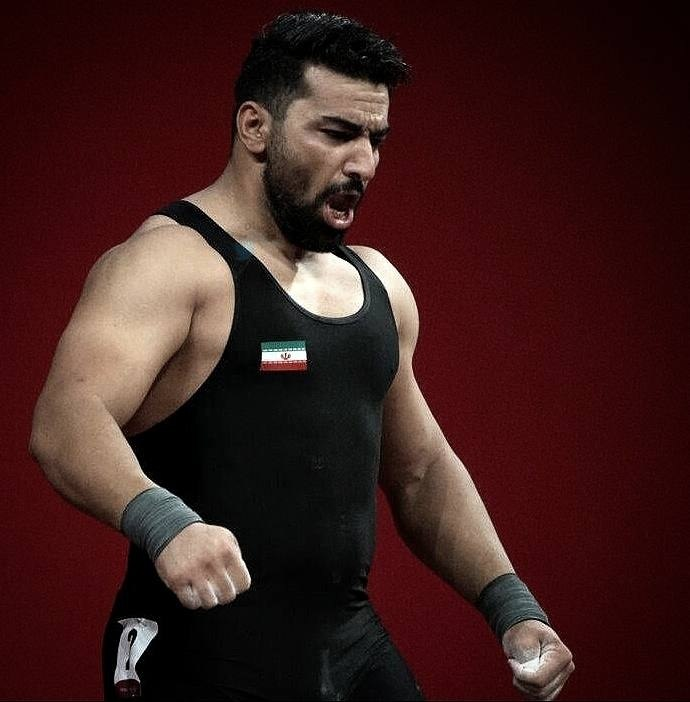

قهرمان سابق وزنه‌برداری جهان متهم به قتل شد 🔹درگیری فیزیکی میان یکی از قهرمانان سابق وزنه‌برداری ایران، آسیا و جهان در شهر محل زندگی‌اش منجر به قتل شده و پلیس و مقامات قضایی پیگیر این پرونده هستند. 🔹در جریان نزاع دسته‌جمعی که میان این ورزشکار و دوستانش با…

## OfficialPersiaTwiter — post 499166

🔹به دلیل ورود گردوغبار خارجی، ادارات ۱۵ شهر خوزستان فردا (سه‌شنبه) دورکار شدند. *OPT* @OfficialPersiaTwiter

## OfficialPersiaTwiter — post 499165

دانشگاه‌ها رو باز کنید دیگه خسته شدم انقدر مثل زنای ناصرالدین شاه تو اندرونی نشستم.

* pechi.*

@OfficialPersiaTwiter

## OfficialPersiaTwiter — post 499164

  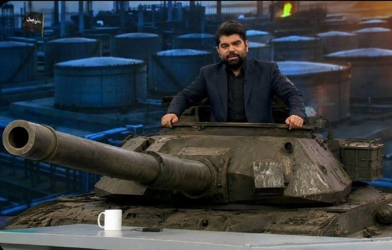

تو صدا و سیما تانک آوردن 😐

*Sep*

@OfficialPersiaTwiter

## OfficialPersiaTwiter — post 499163

سخنگوی وزارت خارجه آمریکا: ترامپ برای توافقی «غیرقابل قبول» عجله نمی‌کند / حمله به ایران پس از رایزنی با رهبران منطقه به تعویق افتاد 🔹به گفته سخنگوی وزارت خارجه آمریکا، دونالد ترامپ برای رسیدن به توافقی که خطوط قرمز او را نقض کند عجله ندارد و تأکید کرده که…

## OfficialPersiaTwiter — post 499162

بر اساس گزارش المانیتور، عربستان سعودی با استناد به یک منبع آگاه، تقریباً تمام حملات پهپادی و موشکی علیه کشورهای خلیج فارس را ناشی از خاک عراق می‌داند، نه ایران؛ ارزیابی که مورد تأیید دولت ترامپ نیز قرار گرفته است.

🔹یک مقام عراقی نیز فاش کرده که حدود ۵۰ درصد از کل این حملات از خاک عراق انجام شده است.

*OPT*

@OfficialPersiaTwiter

## OfficialPersiaTwiter — post 499161

تکمیلی/ درگیری پدافند با ریز پرنده‌های آمریکایی ـ اسرائیلی در قشم 🔷 شرایط جزیره کاملا پایدار است معاون سیاسی استاندار هرمزگان‌: 🔹فعال شدن پدافند جزیره قشم در راستای مقابله با ریزپرنده‌های دشمن صورت گرفت. 🔹صدایی که ساعاتی پیش در جزیره قشم شنیده شده است،…

## OfficialPersiaTwiter — post 499160

اکسیوس: ترامپ از زمان آغاز جنگ، حداقل شش بار مهلت‌ها را تمدید کرده و حملات برنامه‌ریزی‌شده علیه ایران را به تعویق انداخته است. دو منبع آگاه گفتند که پیش از اعلامیه ترامپ، او با رهبران عربستان سعودی، قطر و امارات متحده عربی تلفنی صحبت کرده است. اما مشخص نیست…

## OfficialPersiaTwiter — post 499159

خیلی از کارشناسا میگن ترامپ، خبر مذاکرات رو فقط برای پایین اوردن قیمت نفت اعلام کرده؛ قیمت نفت قبل از توییت ترامپ: 112.3 دلار قیمت نفت بعد از توییت ترامپ: 109.7 دلار *OPT* @OfficialPersiaTwiter

## OfficialPersiaTwiter — post 499158

🔹به دلیل ورود گردوغبار خارجی، ادارات ۱۵ شهر خوزستان فردا (سه‌شنبه) دورکار شدند.

*OPT*

@OfficialPersiaTwiter

## OfficialPersiaTwiter — post 499157

  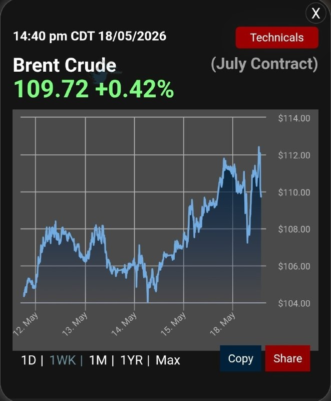

زیرنویس شبکه خبر: پنجمین عقب‌نشینی ترامپ از جنگ در برابر ایران *OPT* @OfficialPersiaTwiter

## bbcpersian — post 281399

🔻 تیراندازی در مسجد جامع سن دیگو؛ پلیس: سه نفر کشته شدند و دو مظنون هم «کشته شده‌اند»

ساعتی بعد از تیراندازی در مسجد جامع سن‌دیگو، اسکات وال، رئیس پلیس این شهر، در حال گفت‌وگو با رسانه‌هاست.

او گفت در حال حاضر هیچ تهدید دیگری در منطقه وجود ندارد و دو مظنون «کشته شده‌اند».

رئیس پلیس همچنین افزود سه بزرگسال در مرکز اسلامی جان باخته‌اند.

او گفت: «قلب ما با خانواده‌هایی است که در این لحظه در حال مطلع شدن از اتفاقی هستند که برای عزیزانشان رخ داده است.»

مقام‌های پلیس هم اکنون در حال دادن آخرین اطلاعات به خبرنگاران هستند. با ما باشید تا جزییات بیشتر را همزمان برایتان گزارش کنیم.

https://bbc.in/4wsKH6m
@BBCPersian

## bbcpersian — post 281398

🔻 تیراندازی در مسجد جامع سن دیگو؛ با انتقال مجروحان، مراکز درمانی سن دیگو در وضعیت فوق‌العاده قرار گرفتند

سخنگوی شبکه درمانی «شارپ هلث‌کر» به بی‌بی‌سی گفت بیمارستان «شارپ مموریال» این شبکه در حال پذیرش مجروحان مرتبط با تیراندازی است.

آلیشیا کوک، سخنگوی این مرکز درمانی، گفته است: «گزارش‌ها حاکی از آن است که چندین نفر زخمی شده‌اند.»

او افزود: «پروتکل‌های وضعیت بحرانی ما فعال شده و در حال هماهنگی با شهرستان سن‌دیگو و دیگر نهادها برای واکنش به این حادثه هستیم.»

تاد گلوریا، شهردار سن‌دیگو، اعلام کرد پلیس این شهر به او اطلاع داده که در حال حاضر هیچ تهدید ادامه‌داری متوجه جامعه نیست.

او در پیامی در شبکه‌های اجتماعی از نیروهای امدادی و ماموران پلیس «که به سرعت برای حفاظت از جان مردم و تامین امنیت منطقه واکنش نشان دادند» قدردانی کرد.

سن دیگو در جنوب کالیفرنیا و مرز این ایالت با مکزیک واقع شده است.

همچون لس‌آنجلس و حومه آن مانند منطقه اورنج کانتی، سن‌دیگو هم میزبان جامعه بزرگی از مهاجران ایرانی است.

https://bbc.in/4nHwkHC
@BBCPersian

## bbcpersian — post 281397

  

🔻چند سینماگر ایرانی اخیرا به دادسرای فرهنگ و رسانه در تهران احضار شده‌اند و اتهام «همکاری با دول متخاصم خارجی علیه جمهوری اسلامی» به آنها ابلاغ شده است.

هومن سیدی، بازیگر و فیلمساز، و سعید روستایی، کارگردان و تهیه‌کننده سینما، از جمله احضارشدگان هستند.

بی‌بی‌سی از مصداق اتهامات آنها اطلاع ندارد و معلوم نیست که آیا این احضارها به فعالیت‌های هنری آنها مربوط است یا به فعالیت‌های دیگر.

📷 AsrIran
https://bbc.in/3PomJIX
@BBCPersian

## bbcpersian — post 281396

🔻 تیراندازی در بزرگترین مسجد و مرکز اسلامی سن دیگو آمریکا

پلیس شهر سن دیگو - در جنوب کالیفرنیا - در واکنش به تیراندازی در بزرگترین مسجد این شهر وارد عمل شده است و مدرسه مجاور این مسجد را هم قرق کرده و همه دانش‌آموزان در وضعیت پناه گرفتن قرار گرفته‌اند.

یک شاهد عینی در گفت‌وگو با شبکه سی‌بی‌اس نیوز، شریک خبری بی‌بی‌سی در آمریکا، گفت صدای شلیک حدود ۳۰ گلوله را شنیده که به گفته او، به نظر می‌رسید از یک «سلاح نیمه‌خودکار» شلیک شده باشد.

او گفت ابتدا حدود ۱۲ گلوله شنیده، سپس وقفه‌ای کوتاه ایجاد شده و بعد دوباره احتمالا حدود ۱۲ گلوله دیگر شلیک شده است.

این مرد که بازنشسته است و هنگام حادثه در خانه مشغول خوردن ناهار بود، گفت با شماره اضطراری ۹۱۱ تماس گرفته و پلیس ظرف «پنج تا ۱۰ دقیقه» در محل حاضر شده است.

او افزود این مسجد در ایام تعطیلات بسیار شلوغ می‌شود.

این شاهد گفت: «خوشبختانه این اتفاق روز جمعه رخ نداد، چون خیابان‌ها پر از جمعیت می‌بود.»

این مرکز اسلامی، بزرگ‌ترین مسجد در شه سن‌دیگو به شمار می‌رود و بنا بر وب‌سایت آن، بیش از ۵ هزار عضو در جامعه مذهبی خود دارد.

این مجموعه همچنین شامل مدرسه «الرشید» است که دوره‌های آموزش دینی و زبان ارائه می‌کند.

بر اساس اطلاعات وب‌سایت این مرکز، ماموریت آن خدمت‌رسانی به جامعه مسلمانان و همچنین «همکاری با جامعه گسترده‌تر برای کمک به افراد کم‌برخوردار، آموزش و بهبود کشور» عنوان شده است.

https://bbc.in/49ampEf
@BBCPersian

## Lichargoo — post 24906

يزيد را دوست نداشتند،
اما تاكتيک بستنِ "آب" بد هم نبود!
"‎اينترنت"

## networkti — post 368

اگر اینترنت رو کامل داخلی کنن و گوگل و اینا بسته باشه، دیگه اون قسمت کانال های دلخواه یا teleMirror کار نخواهد کرد.

ولی قسمت اصلی برنامه که با ریزالور و کانفیگ کار میکنه به احتمال زیاد باز هم به درستی کار میکنه.

⚠️ البته هیچی صد در صد نیست و شاید یه جوری ببندن که دفید هم کار نکنه و یا پیدا کردن ریزالور خیلی سخت بشه.

🔌 یا کلا مثل دی ماه فیلترنت رو از برق بکشن که سایت های داخلی‌ هم کار نکنه! دیگه چه برسه به دفید!

🙏 کلا اونقدر امیدوار نباشید بهش که اگه بعدش کار نکرد اذیتتون کنه.

واسه قسمت اصلی باید از کانال
@thefeedconfig
کانفیگ‌ بردارید و به برنامه اضافه کنید.
توی کانال آموزش کار با برنامه پین شده حتما مطالعه کنید.

## networkti — post 367

🚀 نسخه بعدی دفید قراره یه جورایی سریع‌تر باشه که سورپرایز شید

قسمت اصلی برنامه چند تا تغییر داره که یکی‌ش خیلی مهم هست (منظورم از قسمت اصلی همون صفحه اصلی هست، و منظورم قسمت کانال‌های دلخواه نیست)

این تغییر این‌جوریه که اگر دو نفر هم‌زمان از یک ریزالور یکسان استفاده کنند، و مثلاً نفر اول بره پست‌های کانال وحید آنلاین رو بگیره و این کار ۱۰ ثانیه طول بکشه، وقتی بلافاصله نفر دوم بره و بخواد کانال وحید آنلاین رو بگیره، کمتر از ۱ ثانیه طول می‌کشه!

دلیلش اینه که یک قابلیت به برنامه اضافه کردم که به ریزالور‌ها اجازه بده دیتا رو کش کنند (از توی تنظیمات میشه این رو خاموش کرد)

ولی خب بازم باید ببینیم در عمل با چند هزار کاربر چطوری میشه!😅 (شاید سرعتش بهتر نشه و سورپرایز نشید!🥲)

## Pesari_Ke_Konie — post 44968

  <a href="telegram/content/Pesari_Ke_Konie_44968_1779138885.mp4" target="_blank">🎬 Download video</a>

🔴واسه اولین بار تو تاریخ؛
صداوسیما امشب یکی رو کون لخت نشون داد...

@Pesari_Ke_Konie

## Pesari_Ke_Konie — post 44967

  

🇺🇸 ترامپ : قرار بود فردا به ایران حمله کنیم!
از سمت رهبران قطر، عربستان و امارات از من خواسته شد که حمله نظامی برنامه‌ریزی‌ شده‌مون علیه جمهوری اسلامی ایران رو که قرار بود فردا انجام بشه ـ متوقف کنم؛ چون مذاکرات جدی اکنون در حال انجامه!
متحدان ما معتقدن توافقی حاصل خواهد شد که واسه ایالات متحده آمریکا، همه کشورهای خاورمیانه و فراتر از اون، بسیار قابل‌قبول خواهد بود.
این توافق، مهم‌تر از همه، شامل این خواهد بود که ایران هیچ سلاح هسته‌ای نداشته باشه.
بخاطر احترامی که واسه رهبران یادشده قائلم، به وزیر جنگ، پیت هگست، رئیس ستاد مشترک ارتش، دنیل کین، و ارتش ایالات متحده دستور دادم که حمله برنامه‌ریزی‌شده به ایران رو فردا انجام ندن.
ولی بهشون دستور دادم که در صورت نرسیدن به یه توافق قابل‌قبول، آماده اجرای یه حمله کامل و گسترده علیه ایران، در هر لحظه و بدون هیچ تأخیری باشن...

@Pesari_Ke_Konie

## Tans_Footbali — post 236412

  <a href="telegram/content/Tans_Footbali_236412_1779138887.webm" target="_blank">🎬 Download video</a>

🚨
🇧🇷نیمار برای جام جهانی به تیم ملی برزیل دعوت شد

⚫️@FootyRadar

## Tans_Footbali — post 236411

سخنگوی وزارت خارجه آمریکا در گفتگو با الجزیره: ترامپ برای رسیدن به توافقی غیرقابل قبول عجله نخواهد کرد

خطوط قرمز رئیس‌جمهور روشن است و آن اینکه ایران نباید به سلاح هسته‌ای دست یابد.

💛@Tans_Footbali

## Tans_Footbali — post 236410

  <a href="telegram/content/Tans_Footbali_236410_1779138887.webm" target="_blank">🎬 Download video</a>

💥 با هر ثبت نام ۵۰۰ هزار تومن جایزه بگیرید

✔️ میتونید شرط‌بندی کنید و بونوس را به موجودی واقعی تبدیل کنید

⚽️  پوشش کامل مسابقات ورزشی 

💯  پیش‌بینی با بهترین ضرایب 

⭐️ تجربه سریع و حرفه‌ای

💰پرداخت مستقیم و سریع بدون واسطه، بدون دردسر، واریز و برداشت در سریع‌ترین زمان ممکن

☑️ کانال تلگرام: 

➡️ @winro_io  

🎁 هدیه خود را با ثبت نام در سایت دریافت کنید: 

➡️ Winro.io

سایت اصلی در روزهای آینده بازگشایی خواهد شد S
💎

## Tans_Footbali — post 236409

  

⚽️
🩵
❌#غیررسمی؛ گواردیولا از منچسترسیتی جدا می‌شود

🔵گواردیولا پس از ۱۰ سال حضور پرافتخار در منچسترسیتی، تصمیم گرفته در پایان فصل از این تیم جدا شود و قرار است یکشنبه این خبر را رسمی اعلام کند. نابغه اسپانیایی که از سال ۲۰۱۶ هدایت سیتی را برعهده داشت، با کسب ۲۰ جام از جمله ۶ قهرمانی پریمیرلیگ و فتح لیگ قهرمانان اروپا، پرافتخارترین دوران تاریخ باشگاه را رقم زد.

⚫️@FootyRadar

## Bad_chaneli — post 39517

  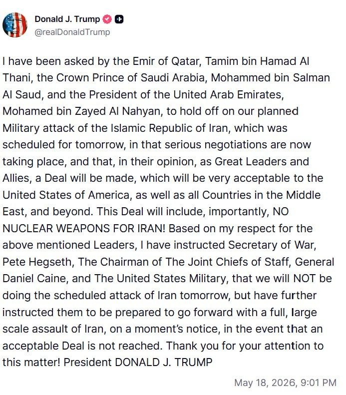

🚨فوری/ ترامپ اعلام کرد که حمله برنامه‌ریزی‌شده به ایران که برای فردا در نظر گرفته شده بود را لغو کرده زیرا «مذاکرات جدی» در حال انجامه !

@Bad_chaneli

## withyashar — post 11601

  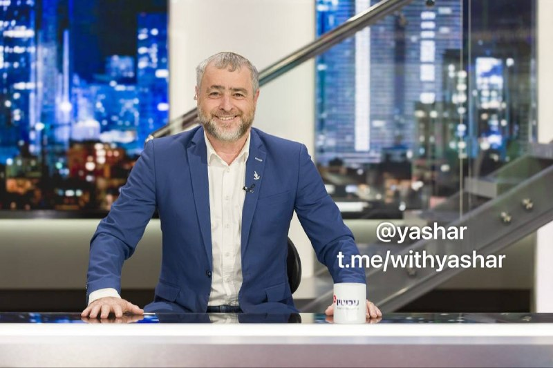

شیمون ریکلین، خبرنگار کانال ۱۴ اسرائیل، امروز احتمالاً اطلاعات محرمانه‌ای را به صورت زنده در مورد عملیات‌های مرتبط با کمپین علیه ایران فاش کرد، از جمله گزارش‌هایی درباره آمادگی‌ها برای عملیات زمینی احتمالی در سایت هسته‌ای .

ریکلین گفت تمریناتی انجام شده است که شامل نیروهای کماندو می‌شود که به سایت حمله کرده و اورانیوم غنی‌شده را استخراج می‌کنند، و افزود بر اساس آنچه شنیده، این ماده در عمق زمین در اصفهان دفن نشده است و «زمانی که وارد تأسیسات شوند، می‌توان لوله‌ها را استخراج کرد.»

سانسورچی‌های نظامی اسرائیل درخواست کرده‌اند این بخش از پلتفرم‌های پخش حذف شود.

اعضای یش عتید، از جمله رام بن-باراک و الازار استرن، از بوعاز بیسموت، رئیس کمیته امور خارجه و امنیت، خواستند جلسه‌ای فوری برای بحث درباره انتشار «اطلاعات ادعاشده محرمانه که می‌تواند به دستاوردهای کمپین در ایران آسیب برساند و به آینده استراتژیک کشور خسارت وارد کند» برگزار شود.
@withyashar

## withyashar — post 11600

  <a href="telegram/content/withyashar_11600_1779138889.mp4" target="_blank">🎬 Download video</a>

@withyashar

## withyashar — post 11599

اتاق جنگ با یاشار: تحلیلگران ارشد ایرانی ۱۰ روز پیش نظرشون این بود که اگه تا ۱۰ روز آینده جنگ نشه دیگه نمیشه … این ۱۰ روز چندین ساعت پیش به پایان رسید 😬😬😬
@withyashar

## withyashar — post 11598

خبرگزاری «مهر»: پدافند هوایی در اصفهان به‌دلایلی نامعلوم که تاکنون مشخص نشده فعال شد.
@withyashar

## withyashar — post 11597

@withyashar part3

## withyashar — post 11596

خبرنگار آکسیوس:ترامپ از زمان شروع جنگ حداقل 12 بار ضرب الاجل ها را تمدید کرده و حملات برنامه ریزی شده به ایران را به تعویق انداخته
@withyashar

## withyashar — post 11595

ترامپ: مذاکرات جدی در حال حاضر برای دستیابی به توافق با ایران در جریان است.
@withyashar

## withyashar — post 11594

Voice message

## withyashar — post 11593

فارس: حمله پهپادی علیه گروه پژاک در شمال عراق

رسانه‌های عراقی گزارش دادند مقر گروه‌ پژاک در استان سلیمانیه عراق با چندین فروند پهپاد مورد حمله قرار گرفت.
@withyashar

## withyashar — post 11592

کاخ سفید : ترامپ تو هر زمانی همه گزینه‌ها رو برای مقابله با ایران داره.
@withyashar

---
📅 بروزرسانی: 1405/02/28 23:28
---

## persian_trend_official — post 14453

  <a href="telegram/content/persian_trend_official_14453_1779134302.webm" target="_blank">🎬 Download video</a>

💢اینم نتیجه رفتار و عملکرد دونالد ترامپ

🫆:Tony

📌 @persian_trend_official
پرشین ترند | متفاوت‌ترین کانال نظامی

## persian_trend_official — post 14452

نسخه صوتی لایو امشب :

https://castbox.fm/vd/946653632

## persian_trend_official — post 14451

  

🔴 صدای انفجار در سلیمانیه عراق
گویا سپاه دوباره به مقر پژاک حمله کرده

## persian_trend_official — post 14450

  <a href="telegram/content/persian_trend_official_14450_1779134303.mp4" target="_blank">🎬 Download video</a>

🇺🇸
🇦🇫 حداقل دو نفر کشته شده‌اند و چندین نفر دیگر در یک وضعیت تیراندازی فعال در مرکز اسلامی سن دیگو، کالیفرنیا زخمی شده‌اند. ویدیوی بالا شخصی را در یک استخر خون پس از ظاهراً تیر خوردن نشان می‌دهد.

☆Phantom☆

📌 @persian_trend_official
پرشین ترند | متفاوت‌ترین کانال نظامی

## persian_trend_official — post 14449

  

تیراندازی در یک مرکز اسلامی در آمریکا

🔸رسانه‌ها روز دوشنبه از حضور یک فرد مسلح و تیراندازی در مرکز اسلامی سن دیگو خبر می‌دهند.

🔹پلیس سن دیگو از مردم خواست که از حضور در این منطقه خودداری کنند.

☆Phantom☆

📌 @persian_trend_official
پرشین ترند | متفاوت‌ترین کانال نظامی

## persian_trend_official — post 14448

  

💢از سوی امیر قطر، تمیم بن حمد آل ثانی، ولیعهد عربستان سعودی، محمد بن سلمان آل سعود، و رئیس امارات متحده عربی، محمد بن زاید آل نهیان، از من خواسته شد حمله نظامی برنامه‌ریزی‌شده ما علیه جمهوری اسلامی ایران که قرار بود فردا انجام شود را متوقف کنم، زیرا مذاکرات…

## persian_trend_official — post 14446

فعال شدن پدافند قشم علیه ریزپرنده‌ها 💢 در پی فعالیت پدافند در جزیره قشم، خبرنگار تسنیم از منابع مطلع کسب اطلاع کرد که پس از مشاهده ریز پرنده‌ها در آسمان جزیره، پدافند در جهت نابودی اهداف متخاصم فعال شد. 🫆:Tony 📌 @persian_trend_official پرشین ترند | متفاوت‌ترین…

## persian_trend_official — post 14445

  <a href="telegram/content/persian_trend_official_14445_1779134305.webm" target="_blank">🎬 Download video</a>

فعال شدن پدافند قشم علیه ریزپرنده‌ها

💢 در پی فعالیت پدافند در جزیره قشم، خبرنگار تسنیم از منابع مطلع کسب اطلاع کرد که پس از مشاهده ریز پرنده‌ها در آسمان جزیره، پدافند در جهت نابودی اهداف متخاصم فعال شد.

🫆:Tony

📌 @persian_trend_official
پرشین ترند | متفاوت‌ترین کانال نظامی

## persian_trend_official — post 14443

⭕️ وضعیت کم سابقه‌ی آسمان منطقه، از نظر خلوت بودن. (در عکس اول فقط پرواز های نظامی آمریکا و در عکس دوم تمام پرواز های نظامی) 📝 Nick 📌 @persian_trend_official پرشین ترند | متفاوت‌ترین کانال نظامی

## persian_trend_official — post 14442

  <a href="telegram/content/persian_trend_official_14442_1779134305.webm" target="_blank">🎬 Download video</a>

💢از سوی امیر قطر، تمیم بن حمد آل ثانی، ولیعهد عربستان سعودی، محمد بن سلمان آل سعود، و رئیس امارات متحده عربی، محمد بن زاید آل نهیان، از من خواسته شد حمله نظامی برنامه‌ریزی‌شده ما علیه جمهوری اسلامی ایران که قرار بود فردا انجام شود را متوقف کنم، زیرا مذاکرات…

## persian_trend_official — post 14441

  <a href="telegram/content/persian_trend_official_14441_1779134306.webm" target="_blank">🎬 Download video</a>

💢از سوی امیر قطر، تمیم بن حمد آل ثانی، ولیعهد عربستان سعودی، محمد بن سلمان آل سعود، و رئیس امارات متحده عربی، محمد بن زاید آل نهیان، از من خواسته شد حمله نظامی برنامه‌ریزی‌شده ما علیه جمهوری اسلامی ایران که قرار بود فردا انجام شود را متوقف کنم، زیرا مذاکرات…

## persian_trend_official — post 14440

  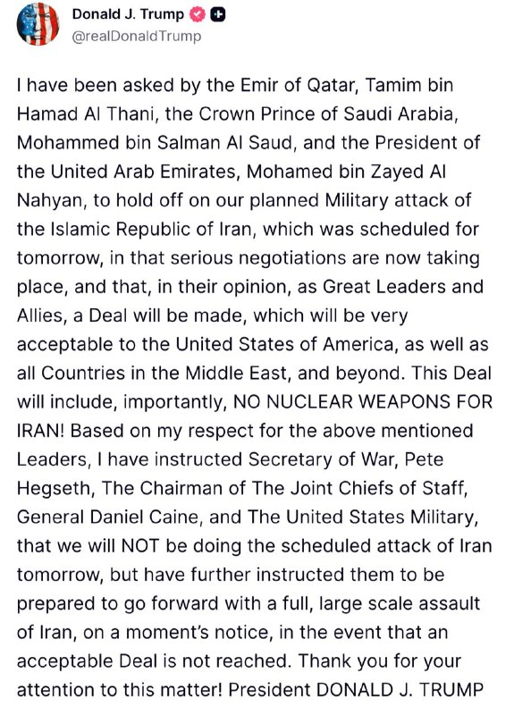

💢از سوی امیر قطر، تمیم بن حمد آل ثانی، ولیعهد عربستان سعودی، محمد بن سلمان آل سعود، و رئیس امارات متحده عربی، محمد بن زاید آل نهیان، از من خواسته شد حمله نظامی برنامه‌ریزی‌شده ما علیه جمهوری اسلامی ایران که قرار بود فردا انجام شود را متوقف کنم، زیرا مذاکرات جدی اکنون در حال انجام است و آن‌ها معتقدند به‌عنوان رهبران و متحدان بزرگ، توافقی حاصل خواهد شد که برای ایالات متحده آمریکا، همه کشورهای خاورمیانه و فراتر از آن بسیار قابل قبول خواهد بود. این توافق، مهم‌تر از همه، شامل «عدم دستیابی ایران به سلاح هسته‌ای» خواهد بود.

💢بر اساس احترامی که برای رهبران یادشده قائلم، به وزیر جنگ، پیت هگست، رئیس ستاد مشترک ارتش، ژنرال دنیل کین، و ارتش ایالات متحده دستور داده‌ام که حمله برنامه‌ریزی‌شده علیه ایران را فردا انجام ندهند، اما در عین حال به آن‌ها دستور داده‌ام در صورتی که توافق قابل قبولی حاصل نشود، آماده اجرای یک حمله کامل و گسترده علیه ایران در کوتاه‌ترین زمان ممکن باشند.

▪️از توجه شما به این موضوع سپاسگزارم!

رئیس‌جمهور دونالد جی. ترامپ

🫆:Tony

📌 @persian_trend_official
پرشین ترند | متفاوت‌ترین کانال نظامی

## persian_trend_official — post 14439

🚨 ترامپ در تروث سوشال اعلام کرد که حمله برنامه‌ریزی‌شده به ایران که برای فردا در نظر گرفته شده بود را لغو کرده زیرا «مذاکرات جدی» در حال انجام است. 📝 Nick 📌 @persian_trend_official پرشین ترند | متفاوت‌ترین کانال نظامی

## persian_trend_official — post 14438

🚨 ترامپ در تروث سوشال اعلام کرد که حمله برنامه‌ریزی‌شده به ایران که برای فردا در نظر گرفته شده بود را لغو کرده زیرا «مذاکرات جدی» در حال انجام است.

📝 Nick

📌 @persian_trend_official
پرشین ترند | متفاوت‌ترین کانال نظامی

## persian_trend_official — post 14437

  <a href="telegram/content/persian_trend_official_14437_1779134307.mp4" target="_blank">🎬 Download video</a>

💢پیت هگست وزیر جنگ آمریکا در حال تقلید مدل صحبت و صدای ترامپ

🫆:Tony

📌 @persian_trend_official
پرشین ترند | متفاوت‌ترین کانال نظامی

## persian_trend_official — post 14436

  <a href="telegram/content/persian_trend_official_14436_1779134308.webm" target="_blank">🎬 Download video</a>

⭕️ جمهوری اسلامی سفر بدون ویزا برای لبنانی‌ها را اعلام کرد.

سفارت جمهوری اسلامی در لبنان اعلام کرد شهروندان لبنانی دارنده گذرنامه عادی می‌توانند برای سفرهای گردشگری یا زیارتی بدون نیاز به ویزا وارد ایران شوند.

لبنانی‌ها می‌توانند هر شش ماه یک‌بار بدون ویزا به ایران سفر کنند.

مدت اقامت در این سفرها حداکثر ۱۵ روز تعیین شده است.

📝 Nick

📌 @persian_trend_official
پرشین ترند | متفاوت‌ترین کانال نظامی

## persian_trend_official — post 14435

  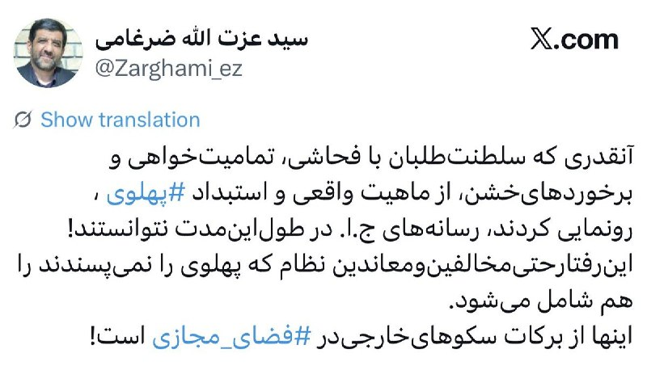

⭕️ علی‌حسین قاضی‌زاده:

از قشنگی‌های شبکه ایکس اینه که مدیر حکومتی که از بندبندانگشتان مدیرانش خون می‌چکه بیاد اینجا از برخورد خشن، تمامیت‌خواهی، فحاشی و استبداد گله کنه.
اون هم در شرایطی که اینترنت رو بر روی ۹۰ میلیون ایرانی بستند‌ و سر تیربار رو سمت مردم گرفتند.
اینها وقیح نیستند. لغت تازه‌ای باید در زبان فارسی برای این جماعت ساخته بشه.

📝 Nick

📌 @persian_trend_official
پرشین ترند | متفاوت‌ترین کانال نظامی

## persian_trend_official — post 14434

  <a href="telegram/content/persian_trend_official_14434_1779134309.mp4" target="_blank">🎬 Download video</a>

⭕️نمایش و استفاده دوباره از اسلحه در برنامه زنده صداوسیما

💢اینبار هدف گیری و شلیک به سمت تصویر دونالد ترامپ به یاد بچه های مظلوم جزیره اپستین ‼️

🫆:Tony

📌 @persian_trend_official
پرشین ترند | متفاوت‌ترین کانال نظامی

## OfficialPersiaTwiter — post 499156

  

شکست ایلان ماسک در دادخواست علیه OpenAI؛ هیات منصفه: دیر شکایت کردی

🔹رویترز نوشت، هیات منصفه فدرال در اوکلند کالیفرنیا روز دوشنبه به نفع OpenAI رای داد. قاضی اعلام کرد شواهد «قابل توجهی» برای تأیید نظر هیات منصفه وجود دارد.

🔹ماسک که در دادگاه خود را «احمقی» خواند که ۳۸ میلیون دلار رایگان داده بود، در شکایت خود مدعی شده بود OpenAI از مأموریت اولیه‌اش خارج شده و با فریب او از این شرکتِ «به نفع بشریت» نهایتاً نهادی سودآور ساخته است.

🔹اما هیات منصفه پس از حدود ۹۰ دقیقه بررسی رأی داد که این شکایت به دلیل گذشت زمان (مرور زمان)قابل رسیدگی نیست.

🔹این رأی یک پیروزی حقوقی بزرگ برای OpenAI محسوب می‌شود؛ شرکتی که در آستانه عرضه سهام با ارزشی حدود ۱۰۰۰ میلیارد دلار است.

*OPT*

@OfficialPersiaTwiter

## OfficialPersiaTwiter — post 499155

حمله تروریستی پژاک به معدن در سقز؛ آتش‌زدن تجهیزات و باج‌گیری با گروگان‌گیری نگهبانان 🔹بامداد امروز، گروهک تروریستی پژاک با سه دستگاه خودرو به معدن «میرگه نقشینه» در سقز حمله کرد. 🔹 مهاجمان با بستن دست و پای دو نگهبان معدن و خاموش کردن تلفن‌هایشان، تجهیزات…

## OfficialPersiaTwiter — post 499154

  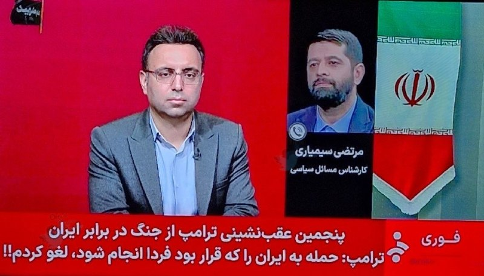

حالا دوباره هفته دیگه ترامپ میگه من به درخواست گینه بیسائو، کنگو و دزدان دریایی سومالی بمباران ایران رو لغو کردم اونا به شدت مشتاق توافقن *Sina* @OfficialPersiaTwiter

## OfficialPersiaTwiter — post 499153

🔴فوری ادعای ترامپ: حمله به ایران را که قرار بود فردا انجام دهم به تعویق انداختم. من توسط امیر قطر تمیم بن حمد آل ثانی، ولیعهد عربستان سعودی محمد بن سلمان آل سعود و رئیس امارات متحده عربی محمد بن زاید آل نهیان درخواست شدم که حمله نظامی برنامه‌ریزی‌شده‌مان…

## OfficialPersiaTwiter — post 499152

دوستان شما دو تا جنگ رو از سر گذروندید هنوز نمیدونید که صدای شروع جنگ با بمبه نه پدافند؟ *Iman* @OfficialPersiaTwiter

## OfficialPersiaTwiter — post 499151

🔹پدافند هوایی جزیره قشم فعال شد./مهر *OPT* @OfficialPersiaTwiter

## OfficialPersiaTwiter — post 499150

  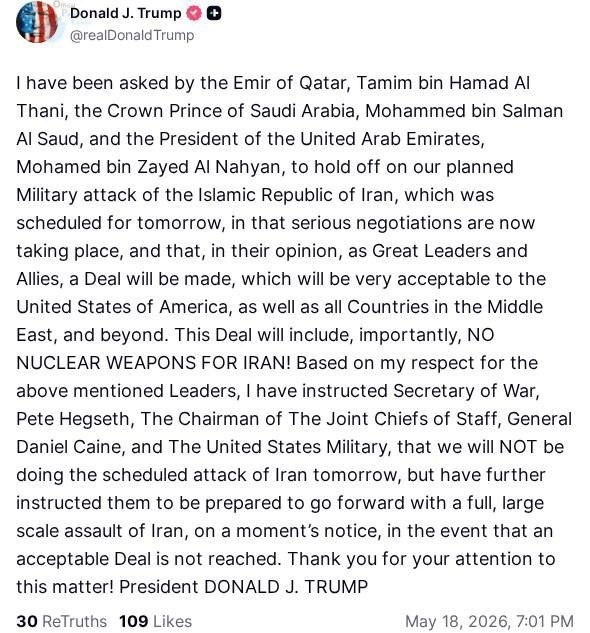

🔴فوری

ادعای ترامپ: حمله به ایران را که قرار بود فردا انجام دهم به تعویق انداختم.

من توسط امیر قطر تمیم بن حمد آل ثانی، ولیعهد عربستان سعودی محمد بن سلمان آل سعود و رئیس امارات متحده عربی محمد بن زاید آل نهیان درخواست شدم که حمله نظامی برنامه‌ریزی‌شده‌مان به جمهوری اسلامی ایران که برای فردا تعیین شده بود را به تعویق بیندازم، زیرا مذاکرات جدی در جریان است و به نظر آن‌ها به عنوان رهبران بزرگ و متحدان، توافقی حاصل خواهد شد که برای ایالات متحده آمریکا و همچنین تمام کشورهای خاورمیانه و فراتر از آن بسیار قابل قبول خواهد بود. این توافق شامل این نکته مهم خواهد بود که هیچ سلاح هسته‌ای برای ایران وجود نخواهد داشت!
🔹بر اساس احترامی که برای رهبران مذکور قائلم، به وزیر دفاع، پیت هگزت، رئیس کمیته مشترک رؤسای ستاد، ژنرال دنیل کین و نیروهای مسلح ایالات متحده دستور دادم که ما فردا حمله برنامه‌ریزی‌شده به ایران را انجام ندهیم، اما همچنین به آن‌ها دستور دادم که آماده یک حمله تمام‌عیار و گسترده به ایران در هر زمانی باشند اگر توافق قابل قبولی حاصل نشود. از توجه شما به این موضوع سپاسگزارم!

*OPT*

@OfficialPersiaTwiter

## OfficialPersiaTwiter — post 499149

🔴ترامپ در مصاحبه با نیویورک پست اعلام کرد که در حال حاضر نمیخواهد هیچ امتیازی به ایران بدهد و ایران میداند که به زودی چه اتفاقی خواهد افتاد! *OPT* @OfficialPersiaTwiter

## OfficialPersiaTwiter — post 499148

🔹پدافند هوایی جزیره قشم فعال شد./مهر

*OPT*

@OfficialPersiaTwiter

## OfficialPersiaTwiter — post 499147

  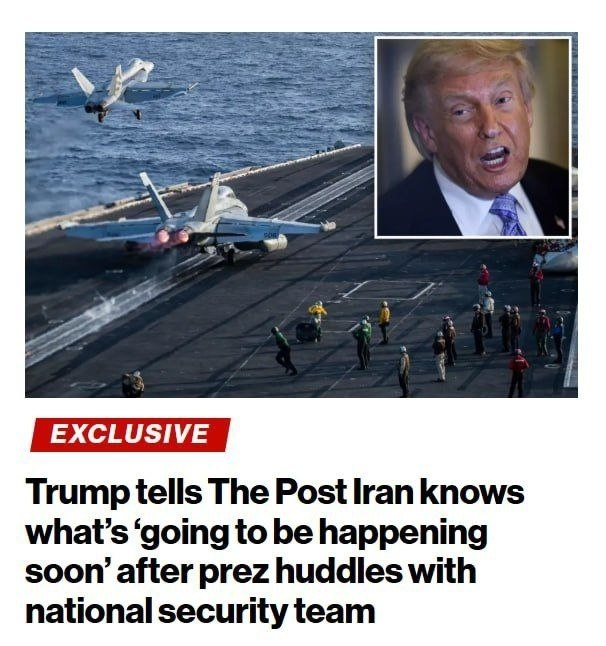

وقتی از ترامپ در مورد ادعای منابع منطقه‌ای مبنی بر اینکه ایران سعی دارد در هر دو موضوع هسته‌ای و بازگشایی تنگه هرمز، واشنگتن را «خسته کند»، سوال شد، ترامپ گفت: «این را نشنیده‌ام». او گفت: «نمی‌توانم در این مورد با شما صحبت کنم.» ترامپ افزود «این یک مذاکره…

## OfficialPersiaTwiter — post 499146

🔴قوه قضائیه: جدیدترین اخبار از توقیف اموال و دارایی‌های چهره‌های همکار دشمن آمریکایی صهیونیستی 🔹اموال و حساب‌های بانکی مهناز افشار، مزدک میرزایی، نیکی کریمی، سینا سرلک، مسعود شجاعی و مسترتیستر توقیف شد. 🔹طی هفته‌های گذشته در راستای قانون تشدید مجازات جاسوسی…

## OfficialPersiaTwiter — post 499145

  <a href="telegram/content/OfficialPersiaTwiter_499145_1779134312.mp4" target="_blank">🎬 Download video</a>

بات‌های تلگرام از امروز باهم حرف می‌زنند

🔹تلگرام قابلیت جدیدی اضافه کرده که بات‌ها می‌توانند مستقیم با یکدیگر صحبت کنند.

🔹این ویژگی به بات‌ها اجازه می‌دهد کارها را به‌صورت خودکار و زنجیره‌ای انجام دهند، مثلاً یک ربات اطلاعات را جمع کند، ربات دوم آن را تحلیل کند و ربات سوم نتیجه را بدهد.

🔹توسعه‌دهندگان حالا می‌توانند شبکه‌ای از بات‌ها بسازند که مثل یک تیم با هم همکاری کنند.

*OPT*

@OfficialPersiaTwiter

## OfficialPersiaTwiter — post 499144

  <a href="telegram/content/OfficialPersiaTwiter_499144_1779134313.mp4" target="_blank">🎬 Download video</a>

وقتی پیت هگزث، وزیر جنگ آمریکا صدای ترامپ را تقلید می‌کنه

*Star*

@OfficialPersiaTwiter

## OfficialPersiaTwiter — post 499143

رادیو ملی آمریکا (ان‌پی‌آر): عکس‌ها و ویدیوهای دریافتی از فرودگاه بین‌المللی تل‌آویو نشان می‌دهد که حدود ۴۰ تا ۵۰ فروند تانکر هوایی (هواپیمای سوخت‌رسان) نیروی هوایی آمریکا در محوطه پارکینگ فرودگاه حضور دارند. در چند هفته گذشته، حدود ۲۰ هواپیمای نظامی در…

## OfficialPersiaTwiter — post 499142

  <a href="telegram/content/OfficialPersiaTwiter_499142_1779134314.mp4" target="_blank">🎬 Download video</a>

هاکان فیدان، وزیر امور خارجه ترکیه: من مشکلی اصولی با موافقت طرف ایرانی برای رعایت شرایط لازم در مذاکرات هسته‌ای نمی‌بینم. اختلافات بیشتر درباره این است که چه چیزی در ازای آن دریافت خواهد شد، چگونه و به چه ترتیبی دریافت می‌شود، و چه شرایط اضافی همراه آن…

## OfficialPersiaTwiter — post 499141

  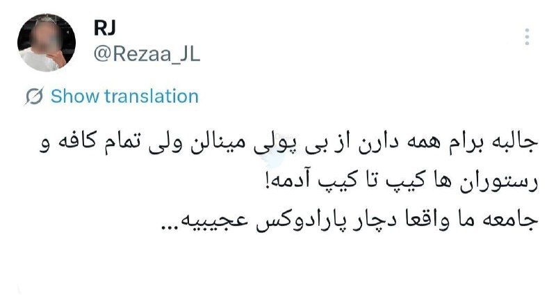

ببین ما میگیم پول نداریم، یعنی پول نداریم رشد کنیم، ماشین بخریم، ماشین عوض کنیم، یه حرکتی بزنیم، یه مسافرت درستی بریم،
چس تومن درمیاریم میگیم خب ما که با این به جایی نمیرسیم میریم کافه

* Reyhane *

@OfficialPersiaTwiter

## OfficialPersiaTwiter — post 499140

تریتا پارسی معاون اندیشکده آمریکایی کوئینسی:

🔷ترامپ ممکن است آسیب به منافع استراتژیک آمریکا را تحمل کند، اما نسبت به تهدیدها علیه امور مالی شخصی خود حساس است.

منطق این است که هزینه شخصی ترامپ را افزایش دهید، ممکن است او حاضر شود یک موضع مذاکراتی واقع‌بینانه اتخاذ کند./انتخاب

*OPT*

@OfficialPersiaTwiter

## OfficialPersiaTwiter — post 499139

  <a href="telegram/content/OfficialPersiaTwiter_499139_1779134316.mp4" target="_blank">🎬 Download video</a>

باید طوری ایران را بمباران کنیم که جانشان به لب برسد! / ریک اسکات، سناتور آمریکایی:

🔹ترامپ دارد جانانه تلاش میکند، آیا او میخواهد ما با یک سلاح هسته‌ای از بین برویم؟ قطعاً نه. پس او کار درستی را انجام میدهد که مطمئن شود همه ما با سلاح هسته‌ای کشته نمی‌شویم.

🔹به نظر من کاری که باید انجام شود این است که ترامپ باید وارد عمل شود و چنان ایران را بمباران کند که جانشان به لب برسد.»

*OPT*

@OfficialPersiaTwiter

## bbcpersian — post 281395

  <a href="https://t.me/bbcpersian/281395" target="_blank">📎 Download file</a>

🔻پادکست برنامه جام جهان‌نما دوشنبه ۲۸ اردیبهشت ۱۴۰۵
این برنامه رادیویی را می‌توانید هر شب ساعت ۲۰ به وقت ایران، روی موج متوسط ۷۰۲ کیلوهرتز و موج کوتاه ۹۴۶۵ کیلوهرتز بشنوید.
تکرار برنامه را هم می‌توانید ساعت ۲۱:۳۰ روی موج متوسط ۷۰۲ کیلوهرتز و موج کوتاه ۵۳۹۵ کیلوهرتز گوش کنید.
@BBCPersian

## bbcpersian — post 281394

  <a href="telegram/content/bbcpersian_281394_1779134318.mp4" target="_blank">🎬 Download video</a>

🔻آخرین خبرهای مهم دوشنبه ۲۸ اردیبهشت ۱۴۰۵
@BBCPersian

## bbcpersian — post 281393

🔻دونالد ترامپ می‌گوید که قرار بود فردا به ایران حمله نظامی کند اما به درخواست امیر قطر، ولیعهد عربستان و امارات متحده عربی این حمله را به تعویق انداخته است. او در پستی در شبکه اجتماعی تروث سوشال نوشت: «از من خواسته شده است حمله نظامی برنامه‌ریزی‌شده ما علیه…

## bbcpersian — post 281392

  

🔻دونالد ترامپ می‌گوید که قرار بود فردا به ایران حمله نظامی کند اما به درخواست امیر قطر، ولیعهد عربستان و امارات متحده عربی این حمله را به تعویق انداخته است.

او در پستی در شبکه اجتماعی تروث سوشال نوشت: «از من خواسته شده است حمله نظامی برنامه‌ریزی‌شده ما علیه جمهوری اسلامی ایران را که قرار بود فردا انجام شود، به تعویق بیندازم؛ زیرا مذاکرات جدی اکنون در جریان است و به باور آن‌ها، به‌عنوان رهبران بزرگ و متحدان ما، توافقی حاصل خواهد شد که برای ایالات متحده آمریکا و همچنین همه کشورهای خاورمیانه و فراتر از آن بسیار قابل قبول خواهد بود.»

او افزود: «این توافق نکته مهمی را در برخواهد داشت: ایران سلاح هسته‌ای نخواهد داشت.»

📷 Getty Images
https://bbc.in/3PpMOY6
@BBCPersian

## bbcpersian — post 281391

  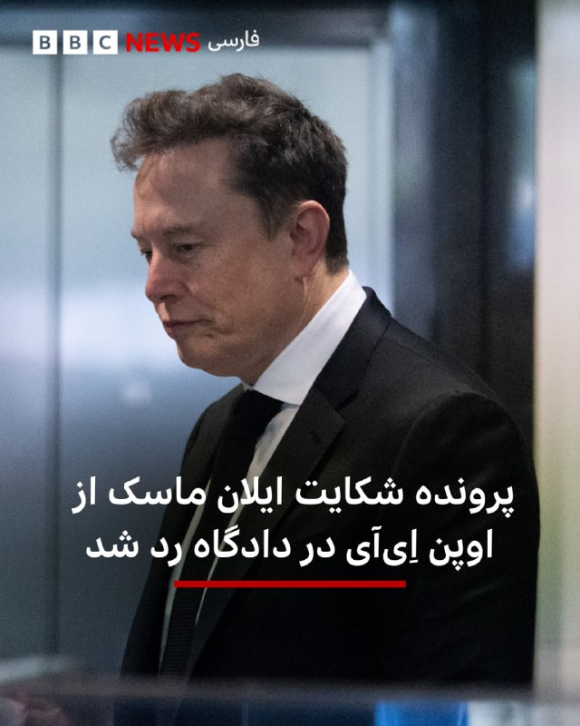

🔻دادگاهی در کالیفرنیا شکایت ایلان ماسک، مالک ایکس و تسلا، از شرکت اوپن اِی‌آی، سازنده هوش مصنوعی چت جی‌پی‌تی، را رد کرد.

آقای ماسک ‌هم‌بنیان‌گذار شرکت اوپن اِی‌آی بود و بعدتر این شرکت را متهم کرد که از هدف اولیه‌اش یعنی «خدمت‌رسانی به انسان» عدول کرده است.

هیئت منصفه این دادگاه رای داد که آقای ماسک «خیلی دیر» برای شکایت از سم آلتمن، رئیس اوپن اِی‌آی، اقدام کرده است.

آقای آلتمن و آقای ماسک یکدیگر را به تلاش برای «کسب منفعت مالی» از رشد هوش مصنوعی در سال‌های گذشته متهم کرده‌اند.

آقای ماسک که ثروتمندترین مرد جهان است، در سال ۲۰۱۸ از هیئت‌مدیره اوپن اِی‌آی کناره‌گیری کرد و هوش مصنوعی گروک را برای رقابت با چت جی‌پی‌تی ساخت.

دعوای حقوقی این دو میلیاردر را بسیاری از نزدیک دنبال می‌کنند چرا که معتقدند بر آینده هوش مصنوعی اثرگذار است.

📷 Getty Images
@BBCPersian

## bbcpersian — post 281390

  

🔻دادگاه متهمان حمله به پوریا زراعتی،‌ مجری شبکه ایران اینترنشنال، در لندن برگزار شد. دو مرد رومانیایی متهم هستند که از طرف حکومت ایران این حمله را انجام دادند. یک رومانیایی دیگر هم در این رابطه بازداشت شده است.

ایران هر گونه دخالت در این جادثه را رد کرده است.

دو سال پیش، آقای زراعتی درمحله ویمبلدون،‌ در جنوب غرب لندن هدف حمله با چاقو قرار گرفت. او از ناحیه پا مجروح شد و چند روز در بیمارستان بستری بود.

به گزارش رویترز،‌ ناندیتو بدیا، ۲۱ ساله، و جورج استانا، ۲۵ ساله، هر دو در دادگاه اتهامات ایجاد جراحت عمدی و غیرقانونی را رد کردند.

دیوید آندری، سومین متهم به دست داشتن در این پرونده که در رومانی دستگیر شده است در این دادگاه محاکمه نشد.

دانکن اتکینسون،‌ دادستان در این دادگاه گفت که این حمله نه سرقت بوده و نه درگیری اتفاقی بلکه «خشونت عمدی و برنامه ریزی شده» بوده و به این افراد، شخص ثالثی که از طرف حکومت ایران عمل می‌کرده، دستور انجام این حمله را داده است.

📷 Reuters
https://bbc.in/4dj0eyg
@BBCPersian

## Lichargoo — post 24905

‏بابام داشت خاطره تعریف می‌کرد گفت اون موقع که جوون بودم…، گفتم هنوزم جوونی قلبم. گفت وسط حرفم نپر.
اینم عاقبت خایمالی بی‌جا.

## Tans_Footbali — post 236408

  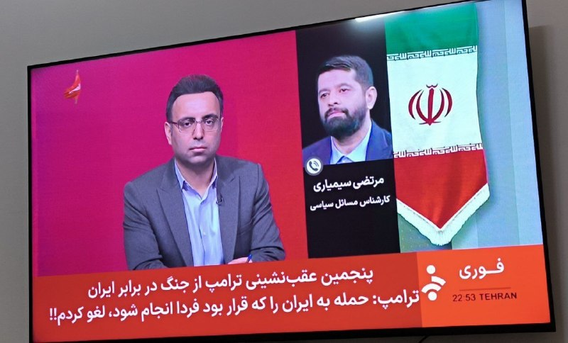

صداوسیما:
ترامپ واسه پنجمین بار از جنگ مقابل ایران فرار کرد.

💛@Tans_Footbali

## Tans_Footbali — post 236407

  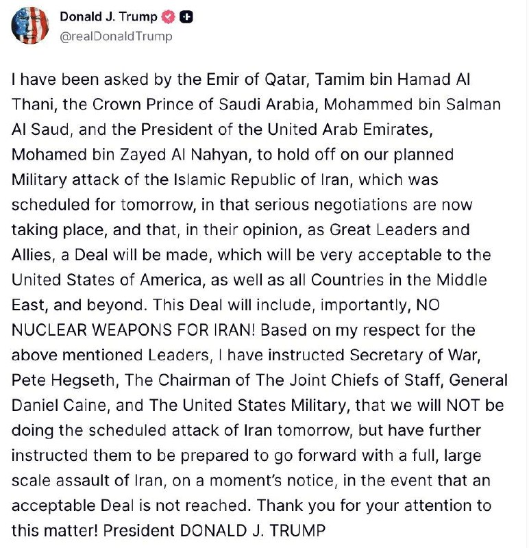

ترامپ :

از من خواسته شده توسط امیر قطر، تمیم بن حمد آل ثانی، ولیعهد عربستان سعودی، محمد بن سلمان آل سعود، و رئیس‌جمهور امارات متحده عربی، محمد بن زاید آل نهیان، که حمله نظامی برنامه‌ریزی شده ما به جمهوری اسلامی ایران که برای فردا برنامه‌ریزی شده بود را به تعویق بیندازم، زیرا مذاکرات جدی در حال انجام است و به نظر آن‌ها، به عنوان رهبران بزرگ و متحدان، توافقی حاصل خواهد شد که برای ایالات متحده آمریکا و همچنین تمام کشورهای خاورمیانه و فراتر از آن بسیار قابل قبول خواهد بود.

این توافق شامل، به طور مهم، عدم وجود سلاح‌های هسته‌ای برای ایران خواهد بود! بر اساس احترام من به رهبران مذکور، به وزیر جنگ، پیت هگست، رئیس ستاد مشترک نیروهای مسلح، ژنرال دنیل کین، و نیروهای نظامی ایالات متحده دستور داده‌ام که حمله برنامه‌ریزی شده به ایران را فردا انجام ندهند، اما به آن‌ها دستور داده‌ام که برای انجام یک حمله کامل و گسترده به ایران در هر لحظه‌ای که توافق قابل قبولی حاصل نشود، آماده باشند.

💛@Tans_Footbali

## Tans_Footbali — post 236406

خبرگزاری مهر :
پدافند هوایی جزیره قشم فعال شده.

💛@Tans_Footbali

## Tans_Footbali — post 236405

  <a href="telegram/content/Tans_Footbali_236405_1779134322.mp4" target="_blank">🎬 Download video</a>

نوشته ترامپ در حالیکه هفته هاست داره ایران رو تهدید میکنه :)))

📝_Serpico_

@Tans_Footbali

## Tans_Footbali — post 236404

اسرائیل هیوم :

ترامپ در حمله بعدی اهدافی رو مورد حمله قرار میده که قبلا از حمله بهشون خودداری می‌کرد

## Tans_Footbali — post 236403

  

وزیر خزانه‌داری ایالات متحده، مجوزی ۳۰ روزه صادر کرد که به کشورهای آسیب‌پذیر اجازه می‌دهد نفت روسیه‌ای را که در دریا سرگردان مانده است خریداری کنند.

@Tans_Footbali

## Bad_chaneli — post 39516

فوری/خبرگزاری مهر: سامانه های پدافندی در جزیره قشم فعال شدند.

## hamclasixii — post 75430

  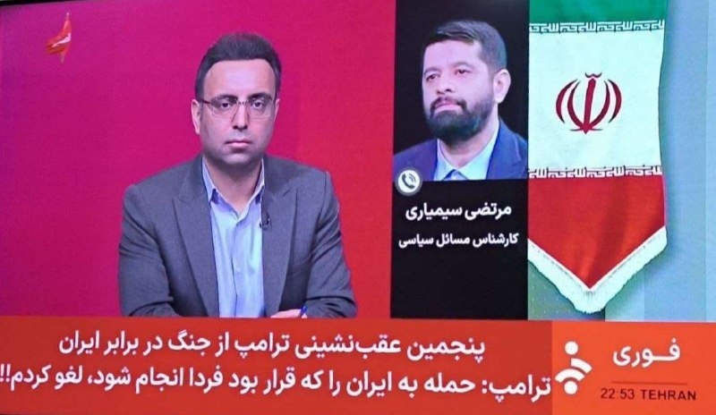

🔴املاکی روانی : قرار بود فردا به ایران حمله کنیم! 🔹از سمت رهبران قطر، عربستان و امارات از من خواسته شد که حمله نظامی برنامه‌ریزی‌ شده‌مون علیه جمهوری اسلامی ایران رو که قرار بود فردا انجام بشه ـ متوقف کنم؛ چون مذاکرات جدی اکنون در حال انجامه! 🔹ولی دستور…

## hamclasixii — post 75429

  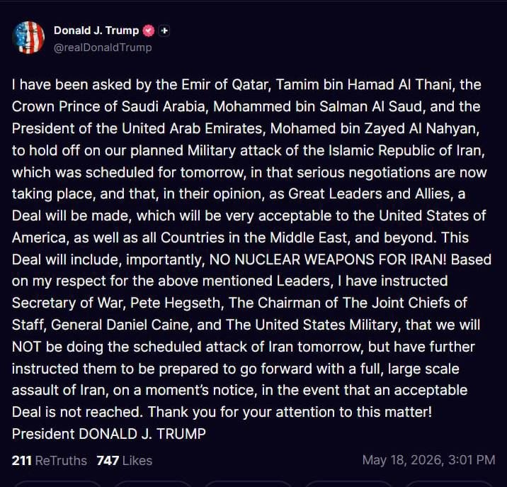

🔴املاکی روانی : قرار بود فردا به ایران حمله کنیم!

🔹از سمت رهبران قطر، عربستان و امارات از من خواسته شد که حمله نظامی برنامه‌ریزی‌ شده‌مون علیه جمهوری اسلامی ایران رو که قرار بود فردا انجام بشه ـ متوقف کنم؛ چون مذاکرات جدی اکنون در حال انجامه!
🔹ولی دستور دادم که در صورت نرسیدن به یه توافق قابل‌قبول، آماده اجرای یه حمله کامل و گسترده علیه ایران، در هر لحظه و بدون هیچ تأخیری باشن...

📚 @hamclasix 📚

## withyashar — post 11591

https://t.me/boost/withyashar

۵۰۹ بوست نیاز داریم 🙌🏾

## withyashar — post 11590

@withyashar

## withyashar — post 11589

ترامپ: من به وزیر جنگ، رئیس ستاد مشترک و ارتش امریکا دستور داده‌ام که آماده باشند تا در صورت عدم دستیابی به توافق قابل قبول، حمله‌ای کامل و گسترده و همه‌جانبه به ایران را با کمترین هشدار ممکن انجام دهند این آخرین فرصت ایران برای توافق است
@withyashar

## withyashar — post 11588

Voice message

## withyashar — post 11587

معاون استاندار هرمزگان: صدایی که ساعاتی پیش در جزیره قشم شنیده شده است، ناشی از فعال شدن سامانه‌های پدافندی و درگیری با پرنده‌های دشمن بوده است .

وضعیت کاملاً تحت کنترل است و شرایط جزیره قشم کاملا پایدار است./مهر
@withyashar

## withyashar — post 11586

اتاق جنگ با شما : فرمانده دقیقا همین الان صدای پدافند
با ۷ شلیک کمتر از یک دقیقه به سمت جنوب کرمان اتفاق افتاد
بریم که داریم به قاهره نزدیک میشیم
@withyashar

## withyashar — post 11585

اتاق جنگ با یاشار : یک پوکرباز خوب دستش را «شو» نمی‌کند، بلکه معمولاً فقط وقتی کارت‌ها را نشان می‌دهد که دست قوی را نشان ‌دهد تا تصویر «بازیکن صادق» بسازد و بعداً راحت‌تر بلوف بزند
@withyashar

## withyashar — post 11584

فعالیت پدافند در شمال تهران شروع شد

منابع نزدیک به سپاه: انهدام ریزپرنده در شمال تهران
@withyashar

## withyashar — post 11583

حمله فردا کنسل شد

ترامپ در تروث : از سوی امیر قطر، تمیم بن حمد آل ثانی، ولیعهد عربستان سعودی، محمد بن سلمان آل سعود، و رئیس‌ امارات متحده عربی، محمد بن زاید آل نهیان، از من درخواست شده است که حمله نظامی برنامه‌ریزی‌شده ما علیه جمهوری اسلامی ایران را که قرار بود فردا انجام شود، فعلاً متوقف کنم؛ زیرا اکنون مذاکرات جدی در جریان است و آن‌ها، به عنوان رهبران بزرگ و متحدان ما، معتقدند توافقی حاصل خواهد شد که برای ایالات متحده آمریکا و همچنین همه کشورهای خاورمیانه و فراتر از آن، بسیار قابل قبول خواهد بود.

این توافق، مهم‌تر از همه، شامل این خواهد بود که ایران هیچ سلاح هسته‌ای نداشته باشد.

بر پایه احترامم به رهبران یادشده، به وزیر جنگ، پیت هگست، رئیس ستاد مشترک نیروهای مسلح، ژنرال دنیل کین، و ارتش ایالات متحده دستور داده‌ام که حمله برنامه‌ریزی‌شده به ایران را فردا انجام ندهند. اما همزمان به آن‌ها دستور داده‌ام که در صورتی که توافقی قابل قبول حاصل نشود، آماده باشند تا در هر لحظه حمله‌ای کامل و گسترده علیه ایران را آغاز کنند.

از توجه شما به این موضوع سپاسگزارم!

رئیس‌جمهور دونالد جی. ترامپ
@withyashar

## withyashar — post 11582

خدا بخواد به زودی تهران میرسه هر چی که هست 😂🙌🏾

## withyashar — post 11581

اتاق جنگ با شما : یاشارررر
پدافند اصفهان چند دقیقه فعال شد
@withyashar

## withyashar — post 11580

زرشکیان لو داد میخوان مذاکره کنن:

گفت‌وگو به معنای تسلیم نیست

جمهوری اسلامی با عزت، اقتدار و حفظ حقوق ملت وارد گفت‌وگو می‌شود و به هیچ عنوان از حقوق قانونی مردم و کشور عقب‌نشینی نمی‌کند.
ما با منطق و با تمام توان، تا پای جان، در خدمت مردم و حافظ منافع و عزت ایران خواهیم بود.
@withyashar

## withyashar — post 11579

اتاق جنگ با شما : اره الان دوباره مجددا صدا اومد
جالبه تو دوران جنگ قبلی اصلا قشم پدافند این چنینی نداشت و ما اینجور صدایی رو واسه اولین بار هست تو قشم می‌شنویم
@withyashar

## withyashar — post 11578

اتاق جنگ با شما : سلام یاشار
همین الان پدافند قشم بدجووووور زد
پدافند خود شهر قشم حتی توی جنگ ۴۰ روزه هم کار نکرده بود
ولی پنج دیقه پیش بدجور شلیک کرد
@withyashar

## withyashar — post 11577

## withyashar — post 11576

## withyashar — post 11575

ترامپ: اگر فرد اشتباهی جانشین من شود، برای آمریکا فاجعه خواهد بود

رئیس‌جمهور آمریکا در مصاحبه‌ای که روز دوشنبه منتشر شد، گفت اگر پس از پایان دوره ریاست‌جمهوری‌اش «فرد اشتباهی» قدرت را به دست بگیرد، این موضوع برای ایالات متحده فاجعه‌بار خواهد بود.
@withyashar

---
📅 بروزرسانی: 1405/02/28 21:32
---

## persian_trend_official — post 14432

  

وزیر خزانه‌داری ایالات متحده، مجوزی ۳۰ روزه صادر کرد که به کشورهای آسیب‌پذیر اجازه می‌دهد نفت روسیه‌ای را که در دریا سرگردان مانده است خریداری کنند.
دولت آمریکا تاکنون حداقل ۳ بار این معافیت موقت خرید نفت روسیه را تمدید/احیا کرده است.
▪️ ۱۹ مارس ۲۰۲۶
▪️ ۲۲ آوریل ۲۰۲۶
▪️ ۱۸ مه ۲۰۲۶
تمام این تمدیدها به‌صورت دوره‌های ۳۰ روزه صادر شده‌اند.

🦁Phantom
🦁

📌 @persian_trend_official
پرشین ترند | متفاوت‌ترین کانال نظامی

## persian_trend_official — post 14431

کانال رسمی پرشین ترند pinned «https://youtube.com/live/7aZKWyXxQog?feature=share»

## persian_trend_official — post 14430

https://youtube.com/live/7aZKWyXxQog?feature=share

## persian_trend_official — post 14429

  

📰پرزیدنت ترامپ به العربیه :
کار با عظمتی انجام می‌دهیم، و پیروزی پیش روی ماست.

🦁Phantom
🦁

✍@persian_trend_official
پرشین ترند | متفاوت‌ترین کانال نظامی

## persian_trend_official — post 14428

کانال رسمی پرشین ترند pinned «ساعت 21 لایو رو آغاز میکنم»

## persian_trend_official — post 14427

ساعت 21 لایو رو آغاز میکنم

## persian_trend_official — post 14426

  

کانال ۱۲ اسرائیل:

ایران تنها چند روز، نه هفته‌ها، فرصت دارد تا چیزی به رئیس‌جمهور ترامپ ارائه دهد که بن‌بست را بشکند.

رئیس‌جمهور ترامپ تمایل دارد اقدام نظامی انجام دهد مگر اینکه ظرف چند روز چیزی از ایران دریافت کند.

🦁Phantom
🦁

✍persian_trend_official
پرشین ترند | متفاوت‌ترین کانال نظامی

## persian_trend_official — post 14425

  <a href="telegram/content/persian_trend_official_14425_1779127327.webm" target="_blank">🎬 Download video</a>

وقتی یک مستندسازِ ورشکستهٔ سیاسی، سناریوی«ترور شخصیت دکتر #روحانی»را برای دیده‌شدن کارگردانی می‌کند،دیگر مستندساز نیست؛کاسبِ التهاب است. اتهام‌زنی با این ادبیات،نه شجاعت است نه افشاگری؛سقوط اخلاقیِ کسی‌ است که روزی تاریخ شفاهی می‌ساخت و امروز برای دیده‌شدن، تاریخ را تحریف می‌کند.

کامبیز مهدیزاده داماد حسن روحانی !

📌 @persian_trend_official
پرشین ترند | متفاوت‌ترین کانال نظامی

## persian_trend_official — post 14424

  <a href="telegram/content/persian_trend_official_14424_1779127328.webm" target="_blank">🎬 Download video</a>

❤️ اگر از مخاطبان پرشین ترند هستید و تلگرام پرمیوم دارید،
با بوست کردن کانال کمک بزرگی به رشد و دیده‌شدن بیشتر پرشین ترند می‌کنید.
این بوست‌ها باعث می‌شود امکانات بیشتری برای انتشار محتوا، استوری و قابلیت‌های ویژه کانال فعال شود و در شرایط فعلی، به ادامه پوشش سریع و تحلیل‌های روزانه کمک زیادی می‌کند.
🙏 اگر مایل بودید، از طریق لینک زیر کانال را بوست کنید:
https://t.me/boost/persian_trend_official
📌 @persian_trend_official
پرشین ترند | متفاوت‌ترین کانال نظامی

## persian_trend_official — post 14423

  <a href="telegram/content/persian_trend_official_14423_1779127329.webm" target="_blank">🎬 Download video</a>

🇮🇷ایران از شرکت‌های بزرگ فناوری آمریکا از جمله گوگل، مایکروسافت، متا و آمازون درخواست دریافت هزینه مجوز برای «کابل‌های اینترنت زیرآبی» واقع در تنگه هرمز و خلیج فارس کرده است.

🐣
🪙
🛒
🖥
🖥

🇮🇷سپاه پاسداران تهدید کرده است که در صورت عدم رعایت مقررات محلی توسط این شرکت‌ها، ترافیک را محدود خواهد کرد که ممکن است «اتصال داده‌ها بین اروپا، آسیا و خاورمیانه را مختل کند».

کابل‌های عبوری از تنگه هرمز و دریای سرخ ۱۷٪ از ترافیک جهانی را حمل می‌کنند.

🦁Phantom
🦁

🌏@persian_trend_official
پرشین ترند | متفاوت‌ترین کانال نظامی

## persian_trend_official — post 14422

  <a href="telegram/content/persian_trend_official_14422_1779127329.webm" target="_blank">🎬 Download video</a>

📌توی این روزا که بازار فروش vpn داغه
یه تیم که پشتیبانی خوبی داشته باشه و خدماتش گارانتی داشته باشه کم پیدا میشه

تراست vpn همه اینارو داره و من با خیال راحت معرفیش می‌کنم

همین الان برای خرید بهشون پیام بدین

@trusstvpnn_admin
@trusstvpnn_admin
@trusstvpnn_admin

## persian_trend_official — post 14421

*هنوز جنگ تموم نشده

## OfficialPersiaTwiter — post 499138

کانال ۱۲ اسرائیل مدعی شد: ترامپ بزودی با اعضای کابینه خود جلسه اضطراری برای پایان دادن به اوضاع ایران برگزار میکند. 》OPT《 @OfficialPersiaTwiter

## OfficialPersiaTwiter — post 499137

حزب‌الله:

یک جنگندهٔ اسرائیلی را با موشک زمین به هوا هدف قرار دادیم / انتخاب

*OPT*

@OfficialPersiaTwiter

## OfficialPersiaTwiter — post 499136

برادرزاده‌م با بغض برگشته بهم میگه عمه جوجه‌م مرد
پرسیدم چرا؟
یهو با لحن جدی گفت حواسم نبود پام رفت روش
ازش عذرخواهی کردم ولی خب دیگه مرد :)))))

* سلنوفیل *

@OfficialPersiaTwiter

## OfficialPersiaTwiter — post 499135

  <a href="telegram/content/OfficialPersiaTwiter_499135_1779127330.mp4" target="_blank">🎬 Download video</a>

سفر پوتین به چین در هفته‌ی آینده 🔹انتظار می‌رود پوتین در تاریخ ۲۰ مه به پکن سفر کند، تنها چند روز پس از اجلاس شی جین‌پینگ با ترامپ. 🔹این سفر یک روزه، بازدیدی معمولی بدون مراسم بزرگ خواهد بود. 》OPT《 @OfficialPersiaTwiter

## OfficialPersiaTwiter — post 499134

ادعای اکسیوس به نقل از مقام ارشد آمریکایی: ما واقعاً پیشرفت چندانی نداریم. امروز در نقطه بسیار حساسی قرار داریم. وقت آن رسیده که ایرانی‌ها کمی انعطاف نشان دهند. ما به یک گفتگوی واقعی، محکم و جزئی [در مورد برنامه هسته‌ای] نیاز داریم. اگر قرار نیست این اتفاق…

## OfficialPersiaTwiter — post 499133

  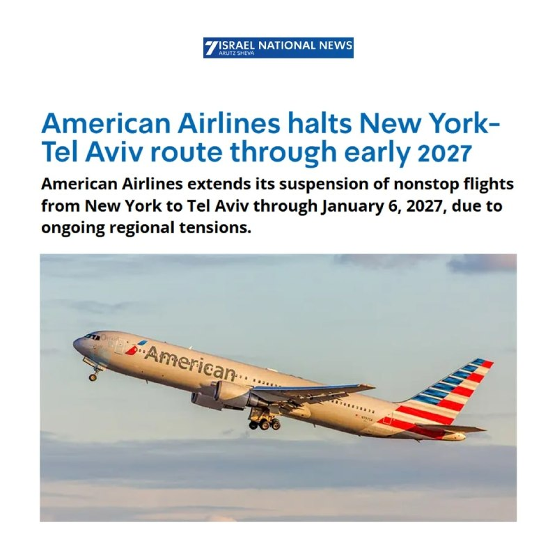

🔹شبکه ۷ اسرائیل: امریکن ایرلاینز توقف پروازهای مسیر نیویورک به تل‌آویو را تا سال ۲۰۲۷ تمدید کرد

*OPT*

@OfficialPersiaTwiter

## OfficialPersiaTwiter — post 499132

  <a href="telegram/content/OfficialPersiaTwiter_499132_1779127333.mp4" target="_blank">🎬 Download video</a>

🔹بارش برف در توچال در پنجاه‌ونهمین روز بهار

*OPT*

@OfficialPersiaTwiter

## OfficialPersiaTwiter — post 499131

امروز با یه خانومی تو راهروی اتاق سونوگرافی هی داریم تند تند راه میریم که جیشمون بگیره، بعد اصلا نمیخنده.
خانوم خنده دار نیست؟ ما هردومون میخوایم جیش داشته باشیم یه لبخند بزن بدفاز

*باراکو*

@OfficialPersiaTwiter

## OfficialPersiaTwiter — post 499130

  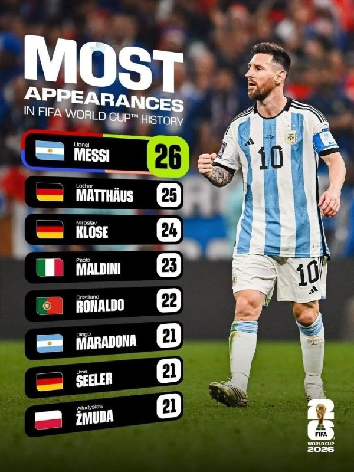

مسی رکورددار بازی در جام‌جهانی

🔹لیونل مسی با انجام ۲۶ بازی، رکورددار بیشترین تعداد حضور در تاریخ رقابت‌های جام جهانی محسوب می‌شود.

*OPT*

@OfficialPersiaTwiter

## OfficialPersiaTwiter — post 499129

🔷 شبکه CNBC با استناد به یک منبع آمریکایی: گزارش رسانه‌های ایرانی مبنی بر اینکه آمریکا در جریان مذاکرات با برداشتن تحریم‌ها از نفت ایران موافقت کرده است، نادرست است

*OPT*

@OfficialPersiaTwiter

## OfficialPersiaTwiter — post 499128

🔷 وزیر خزانه داری آمریکا: مجوز موقت ۳۰ روزه برای خرید نفت روسیه صادر شد/تسنیم

*OPT*

@OfficialPersiaTwiter

## OfficialPersiaTwiter — post 499127

  <a href="telegram/content/OfficialPersiaTwiter_499127_1779127336.mp4" target="_blank">🎬 Download video</a>

ایلان ماسک :
قطعا تا 10سال آینده، حدود 19٪ از کل مسافت‌هایی که مردم طی می‌کنن، توسط هوش مصنوعی و ماشین‌های خودران انجام میشه؛
در نتیجه، اینکه آدم خودش پشت فرمون بشینه و رانندگی کنه، تا اون موقع به یه چیز نسبتاً خاص و نیش تبدیل میشه، چون ماشین خودش تو رو جابه‌جا می‌کنه.
فکر می‌کنم ربات‌های انسان‌نما هم تقریباً همه‌جا حضور داشته باشن، به نظرم خیلی خفن میشه، چون کیه که دلش نخواد C-3PO و R2-D2 شخصی خودش رو داشته باشه؟ البته حتی بهتر از اونا. فکر می‌کنم همه حداقل یکی، شاید حتی دوتاش رو بخوان.

*OPT*

@OfficialPersiaTwiter

## OfficialPersiaTwiter — post 499126

دیدار وزیر کشور پاکستان با عراقچی 🔹سید محسن نقوی وزیر کشور پاکستان عصر امروز دوشنبه با عراقچی دیدار و گفت‌وگو کرد. *OPT* @OfficialPersiaTwiter

## OfficialPersiaTwiter — post 499125

‏از دوست دخترت میپرسی کجا بریم؟
مرد باید از روز قبل لوکیشن رو رزرو کرده باشه مسیر رو حفظ کرده باشه پلی لیست رو با نهایت وسواس انتخاب کرده باشه بعد بره دنبال بانو..!

* ممرضا *

@OfficialPersiaTwiter

## OfficialPersiaTwiter — post 499124

رادیو ملی آمریکا (ان‌پی‌آر):

عکس‌ها و ویدیوهای دریافتی از فرودگاه بین‌المللی تل‌آویو نشان می‌دهد که حدود ۴۰ تا ۵۰ فروند تانکر هوایی (هواپیمای سوخت‌رسان) نیروی هوایی آمریکا در محوطه پارکینگ فرودگاه حضور دارند.

در چند هفته گذشته، حدود ۲۰ هواپیمای نظامی در فرودگاه اسرائیل مشاهده شده بود/انتخاب

*OPT*

@OfficialPersiaTwiter

## OfficialPersiaTwiter — post 499123

  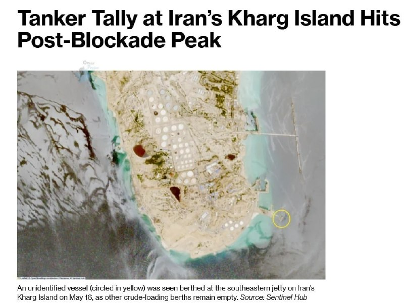

🔺️ بلومبرگ: ۴ روز است که از خارک بارگیری نفت نمی‌شود و اسکله‌های نفتی کاملاً خالی است • OPT • @OfficialPersiaTwiter

## bbcpersian — post 281389

🔻اکسیوس به نقل از مقام آمریکایی: از نظر کاخ سفید پاسخ جدید ایران برای توافق صلح کافی نیست

سایت خبری اکسیوس به نقل از یک مقام بلندپایه آمریکا و یک منبع آگاه گزارش داده است که کاخ سفید پیشنهاد جدید ایران را دریافت کرده است اما به عقیده کاخ سفید این پاسخ برای حصول توافق صلح کافی نیست.

این مقام آمریکایی که نامش ذکر نشده است، به اکسیوس گفت که اگر ایران مواضعش را تغییر ندهد آمریکا مجبور خواهد شد مذاکرات را «از طریق بمباران» ادامه دهد.

به گفته این مقام، پیشنهاد جدید ایران که روز یکشنبه از طریق میانجیگران پاکستانی به آمریکا منتقل شده است، فقط تغییراتی «نمادین و جزئی» با پاسخ قبلی ایران دارد.

در حالی که رسانه‌های ایران گزارش داده‌اند که آمریکا با لغو برخی تحریم‌های نفتی در جریان مذاکرات موافقت کرده است، این مقام آمریکایی گفت که هیچ تحریمی «مجانی» و بدون اقدام متقابل از سوی ایران لغو نخواهد شد.

اکسیوس از این مقام نقل کرده است که «پیشرفت چندانی صورت نگرفته است. به نقطه‌ای بسیار جدی رسیده‌ایم. آنها تحت فشارند که به شکلی درست پاسخ بدهند.»

«وقت آن رسیده است که ایرانی‌ها کمی شیرینی بدهند. ما به گفت‌و‌گویی محکم و با جزئیات (در مورد برنامه هسته‌ای) نیاز داریم. اگر این اتفاق نیفتد از طریق بمباران صحبت خواهیم کرد که واقعا مایه تاسف خواهد بود.»

در همین حال خبرگزاری رویترز از یک مقام بلندپایه ایرانی که نامش ذکر نشده، نقل کرده است که آمریکا مواضعش را در مورد برخی مسائل «نرمتر» کرده است.

این مقام ایرانی به رویترز گفته که آمریکا موافقت کرده است که یک چهارم دارایی‌های توقیف شده ایران به ارزش ده‌ها میلیارد دلار را آزاد کند.

این منبع ایرانی همچنین گفت که آمریکا در مورد اجازه دادن به ایران برای ادامه فعالیت‌های صلح‌آمیز هسته‌ای زیر نظر آژانس بین‌المللی انرژی اتمی انعطاف بیشتری نشان داده است.

https://bbc.in/4wD3mfW
@BBCPersian

## bbcpersian — post 281388

🔻انتشار تصاویری از آموزش کار با اسلحه یا مسابقات آمادگی دفاعی در تجمعات شبانه حامیان جمهوری اسلامی ایران واکنش‌برانگیز شده است. در این تصاویر از غرفه‌هایی در بعضی مساجد و میدان‌ها، کار با سلاح انفرادی به شهروندان، زنان، نوجوانان و حتی کودکان هم آموزش داده می‌شود.

دو روز پیش هم اسلحه به‌دست گرفتن مجریان‌ چند برنامه در صداوسیما و آموزش تلویزیونی کار با سلاح‌های انفرادی انتقادهایی را در بعضی رسانه‌های ایران برانگیخت.

این آموزش‌ها که به سبک درس‌های عملی «آمادگی دفاعی» طرز مسلح کردن و شلیک با سلاح‌های انفرادی را یاد می‌دهد، همزمان با افزایش گمانه‌زنی‌ درباره آغاز دوباره جنگ و عملیات زمینی احتمالی نیروهای متخاصم در خاک ایران است.

گروهی از کاربران در شبکه‌های اجتماعی این آموزش‌ها را «ترویج نظامی‌گری و خشونت در جامعه» دانسته‌اند. بعضی رسانه‌های ایران از جمله روزنامه سازندگی و وبسایت عصر ایران به «پادگان شدن رسانه ملی» انتقاد کرده‌اند.

در مقابل حامیان حکومت این برنامه‌ها را نشانه این دانسته‌اند که «ایران و مردمش بالاترین سطح از اقتدار و آمادگی نظامی» را دارند.

https://bbc.in/4ePspWH
@BBCPersian

## bbcpersian — post 281387

  

🔻سازمان جهانی کار وابسته به سازمان ملل متحد هشدار داد که جنگ در خاورمیانه بر دستمزدها و شرایط کاری تاثیر منفی خواهد داشت و این تاثیر بسیار فراتر از مناطق درگیر جنگ خواهد بود. سازمان جهانی کار اعلام کرد که خاورمیانه و کشورهای حوزه خلیج فارس و منطقه آسیا و اقیانوسیه بیشترین آسیب را خواهند دید که می‌تواند از دوران همه‌گیری کرونا بدتر باشد.

سانگ هورن لی،‌ اقتصاددان ارشد سازمان جهانی کار و نویسنده این گزارش، گفت: «بحران خاورمیانه، فراتر از خسارت انسانی،‌ یک اختلال کوتاه مدت نیست و می‌تواند اثرات طولانی‌مدت داشته باشد که به‌تدریج به تغییر شکل بازارهای کار منجر شود.»

سازمان جهانی کار در گزارشی که امروز منتشر کرد، پیش‌بینی کرد که این جنگ ممکن است به قیمت از دست رفتن میلیون‌ها شغل تمام شود و دنیا شاهد کاهش دستمزد در ادامه امسال و سال آینده میلادی خواهد بود به‌ویژه برای مهاجرانی که به کشورهای خودشان پول می‌فرستند از جمله در جنوب و جنوب شرقی آسیا.

ادامه خبر را از لینک زیر در وبسایت بی‌بی‌سی فارسی بخوانید.

📷 EPA
https://bbc.in/4diJ6bZ
@BBCPersian

## bbcpersian — post 281386

🔻اتحادیه اروپا برخی تحریم‌های سوریه را لغو کرد اما تحریم‌های مرتبط با حکومت اسد را برقرار نگه داشت
اتحادیه اروپا تحریم‌ها علیه افراد و نهادهای مرتبط با حکومت سابق سوریه به رهبری بشار اسد را برای یک سال دیگر تمدید کرد اما همزمان به برخی از تحریم‌های حکومت فعلی سوریه، پایان داد.

رفع تحریم‌ها شامل هفت نهاد سوری است، از جمله وزارتخانه‌های دفاع و کشور.

اتحادیه اروپا اعلام کرده که این تصمیم با هدف تقویت تعامل اتحادیه اروپا با سوریه انجام شده است.

اتحادیه اروپا یک سال پیش تمامی تحریم‌های اقتصادی علیه سوریه را با هدف «حمایت از گذار مسالمت‌آمیز و فراگیر این کشور، بهبود وضعیت اجتماعی-اقتصادی و بازسازی» لغو کرد و تحریم‌های مرتبط با حکومت بشار اسد را برقرار نگه داشت.

اتحادیه اروپا در بیانیه‌ای گفت که «بر این باور است که شبکه‌های وابسته به رژیم پیشین اسد همچنان نفوذ خود را حفظ کرده‌اند و خطر تضعیف روند گذار سیاسی و مانع‌تراشی در مسیر آشتی ملی و پاسخ‌گویی را به همراه دارند.»

اتحادیه اروپا اولین بار در سال ۲۰۱۱ و در واکنش به سرکوب خشونت‌آمیز غیرنظامیان از سوی حکومت اسد، تحریم‌هایی را علیه سوریه اعمال کرده بود.

https://bbc.in/4ukERmj
@BBCPersian

## bbcpersian — post 281385

  

🔻استاندار خراسان جنوبی از افزایش شدید میزان واردات از افغانستان به ایران از زمان آغاز جنگ آمریکا و اسرائیل با ایران خبر داد.

به گزارش ایرنا، محمدرضا هاشمی گفت که از ابتدای جنگ اخیر میزان واردات از افغانستان به خراسان جنوبی از مسیر گذرگاه مرزی ماهیرود به فراه «۸۴۶ درصد» و از نظر ارزش دلاری ۴۴۱ درصد افزایش داشته است.

به گزارش بی‌بی‌سی دری، به گفته وزارت صنعت و تجارت حکومت طالبان، «پنبه، پیاز، انجیر، زعفران، نوشابه، گیاه‌های طبی و مواد معدنی» از مهمترین اقلام صادراتی افغانستان به ایران است و در مقابل، «نفت و گاز، مواد ساختمانی، فرش، مواد خوراکی، وسایل الکترونیک و انواع شوینده‌ها» از مهمترین کالاهای صادراتی ایران به افغانستان است.

حسین زارعی،‌ مدیرعامل منطقه ویژه اقتصادی خراسان جنوبی، هم به خبرگزاری ایرنا گفت که خدمات مرزی قبلا تا ساعت ۱۶ انجام می‌شد اما با افزایش حجم مراجعه و فعالیت‌ تجاری،‌ ساعت کار خدمات مرزی به ساعت ۱۰ حتی ۱۱ شب افزایش پیدا کرد و همین باعث افزایش قابل توجه میزان صادرات و واردات شده است.

📷 AFP via Getty Images
https://bbc.in/4uOLJbc
@BBCPersian

## Lichargoo — post 24904

‏تبریک روز ارتباطات به مردم ایران مثل اینه که واسه یه کچل سشوار بخری

## Tans_Footbali — post 236402

رسانه‌های عبری از آغاز جلسه کابینه اسراییل برای بررسی تحولات منطقه و داخل مرزهای فلسطین خبر دادند

این دومین بار در ۲۴ ساعت گذشته است که نتانیاهو با کابینه امنیتی دیدار می‌کند.

@Tans_Footbali

## Tans_Footbali — post 236401

کانال ۱۲ اسرائیل :

آمریکا آفر جدید ایران رو هم رد کرد

💛@Tans_Footbali

## Bad_chaneli — post 39515

  <a href="telegram/content/Bad_chaneli_39515_1779127342.mp4" target="_blank">🎬 Download video</a>

حکومت تروریستی : افراد 18 تا 50 سال، هر چه زودتر بیان خودشونو برای سربازی معرفی کنن، اگه نیاین تمام مزایای وابسته به پایان خدمت مثل خروج از کشور، دریافت وام، استخدام توی جای دولتی و... شامل‌تون نمیشه

@Bad_chaneli

## hamclasixii — post 75428

🔴#فوری | مدارس اصفهان می‌توانند حتی آزمونی برگزار نکنند و نمره مستمر را به عنوان نمره نوبت دوم در نظر بگیرند!

مدیرکل آموزش و پرورش استان اصفهان:
🔹 لازم است موضوع ارزشیابی پایانی را برای اولیا و دانش‌آموزان شفاف‌سازی کنیم که وقتی امتحانات به‌ صورت غیرحضوری برگزار می‌شود، تصمیم‌گیری درباره شیوه ارزشیابی در اختیار شورای مدرسه قرار می‌گیرد و شورا بر اساس عملکرد دانش‌آموز، سوابق آموزشی، مستندات موجود در فرآیند آموزش مجازی و شناخت دبیران از وضعیت تحصیلی دانش‌آموزان، نمره پایانی را تعیین می‌کند.
🔹 با تصمیم شورای تأمین استان، امتحانات پایه‌های هفتم، هشتم، نهم و دهم و همچنین برخی رشته‌های متوسطه فنی و حرفه‌ای به‌صورت غیرحضوری برگزار خواهد شد تا آرامش بیشتری برای دانش‌آموزان و خانواده‌ها فراهم شود.

📚 @hamclasix 📚

## hamclasixii — post 75427

بلند شین سریع پاوربانکارو شارژ کنین، تو پمپ بنزینا صف بکشین، دبه‌های آبو پر کنین، کنسرو احتکار کنین؛ که میگن آمریکا آخرین پیشنهاد ایران رو رد کرده.

📚 @hamclasix 📚

## withyashar — post 11574

تامین‌اجتماعی: دریافت فیش حقوقی اردیبهشت‌ماه فعلاً مقدور نیست و زمان آن متعاقباً اطلاع‌رسانی خواهد شد.
@withyashar

## withyashar — post 11573

نظام وظیه: ۱۸ تا ۵۰ ساله ها بیایید خودتونو معرفی کنید که اگه جنگ شد بفرستیمتون با آمریکاییا بجنگید، تو محلتی که تعیین شده اگه نیایید تمام مزایاتون که به کارت پایان خدمت مربوطه قطع میشه
@withyashar

## withyashar — post 11572

تا یکشنبه میزنم، قول میدم

## withyashar — post 11571

  

تیتر نیویورک پست:

ایالات متحده در آستانه از سرگیری نبرد با ایران با تمام توان است!
@withyashar

## withyashar — post 11570

ترامپ:من از دست تهران «کلافه» نیستم

@withyashar

## withyashar — post 11569

خبرنگار نیویورک‌پست:

هنوز حاضرید اجازه تعلیق فقط ۲۰ سال اورانیوم به ایران بدید؟

ترامپ: من اجازه هیچ چی رو نمیدم!
@withyashar

## withyashar — post 11568

یه مقام اسرائیلی امشب به i24NEWS گفت:
سطح آماده‌باش واسه احتمال از سرگیری جنگ تا آخر همین هفته، فوق‌العاده بالاست.
@withyashar

## withyashar — post 11567

ترامپ در پاسخ به پرسش نیویورک‌پست درباره ادعاهایی مبنی بر اینکه ایران در مذاکرات هسته‌ای سعی دارد زمان بخرد و منتظر واشنگتن بماند و همچنین موضوع بازگشایی تنگه هرمز، گفت:
«من چنین چیزی نشنیده‌ام.»

او افزود: «من چیزی در این مورد نمی‌شنوم. نمی‌توانم درباره‌اش با شما صحبت کنم.»

ترامپ ادامه داد: «این یک مذاکره است. نمی‌خواهم احمق به نظر برسم.»
@withyashar

## withyashar — post 11566

  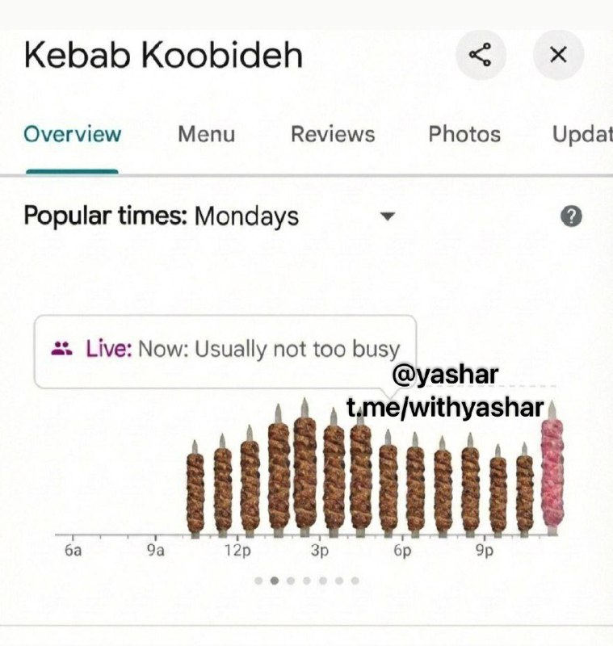

شاخص سفارش کوبیده در اطراف منزل شاهزاده در‌ حومه شهر واشنگتون و در بین پادشاهی و مشروطه خواهان آنجا بالا رفته
@withyashar

## withyashar — post 11565

ترامپ به نیویورک پست : ایران می‌دونه که به زودی چه اتفاقی براش میوفته، هیچ امتیازی داده نخواهد شد
@withyashar

## withyashar — post 11564

  <a href="telegram/content/withyashar_11564_1779127345.mp4" target="_blank">🎬 Download video</a>

داماد صداسیمایی تروریستی : مهریه زنم پهپاده
@withyashar

## withyashar — post 11562

واشنگتن پست:

اسرائیل منتظر چراغ سبز آمریکا برای شروع عملیات است
@withyashar

## withyashar — post 11561

آکسیوس: بمب‌ها مذاکره خواهند کرد
@withyashar

## withyashar — post 11560

یک مقام آمریکایی به سی‌ان‌بی‌سی:

اظهارات رسانه‌های ایرانی مبنی بر موافقت واشنگتن با لغو تحریم‌های نفتی کذب است، هیچ تحریمی لغو نخواهد شد
@withyashar

## withyashar — post 11559

منابع «العربیه»:

وزیر کشور پاکستان بعد از آخرین تلاش‌هایش، تهران را ترک کرد.
@withyashar

## withyashar — post 11558

تری یینگست، خبرنگار فاکس نیوز‌ : ما تو آستانه بازگشت به عملیات‌های رزمی تمام‌عیار هستیم
@withyashar

## withyashar — post 11557

رسانه های عبری:

ترامپ‌ امشب دستور بمباران را صادر میکند
@withyashar

---
📅 بروزرسانی: 1405/02/28 19:28
---

## thisisermia — post 76

https://github.com/theermia/SPlusTunnel

یه اسکریپت اپن‌سورس برای تونل کردن ترافیک اینترنت با استفاده از زیرساخت تماس گروهی پیام‌رسان سروش‌پلاس. این پروژه بعد از محدود شدن روش بله توسعه داده شده و فعلاً برای تست و بررسی در دسترس قرار گرفته.

از نظر فنی، این روش از بستر WebRTC و DataChannel استفاده می‌کنه. یعنی به جای اینکه فقط صدا یا تصویر از طریق تماس منتقل بشه، داده‌های اینترنتی از همون کانال ارتباطی به‌صورت بسته‌های رمزنگاری‌شده رد و بدل می‌شن. در عمل، ترافیک شما از طریق تماس گروهی سروش‌پلاس عبور می‌کنه و روی سیستم یه پراکسی محلی ایجاد میشه که می‌تونید ازش استفاده کنید.

برای راه‌اندازیش به یه VPS خارج از کشور و دو اکانت سروش‌پلاس نیاز دارید. کل توضیحات و مراحل راه‌اندازی داخل ریپازیتوری قرار داده شده.

یه نکته هم اینکه متأسفانه فرایند این اسکریپت فعلاً کاملاً دستیه. یعنی باید خودتون یه تماس گروهی داخل سروش‌پلاس ایجاد کنید، بعد از طریق DevTools توکن هر دو اکانت رو بردارید و داخل اسکریپت قرار بدید تا راه‌اندازی بشه.

فعلاً این پروژه به‌صورت تستی نوشته شده و بیشتر هدفم اینه ببینم این روش تا چه مدت دووم میاره. اگر پایدار موند، احتمالاً نسخه‌های بهتر و کامل‌تری هم براش توسعه میدم.

## persian_trend_official — post 14420

هیچوقت قبل از تموم شدن ماجرا خوشحالی نکنید ! 📌 @persian_trend_official پرشین ترند | متفاوت‌ترین کانال نظامی

## persian_trend_official — post 14419

  <a href="telegram/content/persian_trend_official_14419_1779119908.mp4" target="_blank">🎬 Download video</a>

هیچوقت قبل از تموم شدن ماجرا خوشحالی نکنید !

📌 @persian_trend_official
پرشین ترند | متفاوت‌ترین کانال نظامی

## persian_trend_official — post 14418

پست کنایه آمیز پرزیدنت ترامپ : اگر ایران تسلیم شود، اعتراف کند که نیروی دریایی‌اش نابود شده و در کف دریا آرمیده است، و نیروی هوایی‌اش دیگر وجود ندارد، و اگر تمام ارتش آن با انداختن سلاح‌ها و بالا بردن دست‌ها از تهران خارج شود و هر کدام فریاد بزنند «من تسلیم…

## persian_trend_official — post 14417

  

پست کنایه آمیز پرزیدنت ترامپ :
اگر ایران تسلیم شود، اعتراف کند که نیروی دریایی‌اش نابود شده و در کف دریا آرمیده است، و نیروی هوایی‌اش دیگر وجود ندارد، و اگر تمام ارتش آن با انداختن سلاح‌ها و بالا بردن دست‌ها از تهران خارج شود و هر کدام فریاد بزنند «من تسلیم می‌شوم، من تسلیم می‌شوم» در حالی که دیوانه‌وار پرچم سفید را تکان می‌دهند، و اگر تمام رهبران باقی‌مانده‌شان همه «اسناد تسلیم» لازم را امضا کنند و شکست خود را در برابر قدرت و نیروی عظیم و باشکوه ایالات متحده آمریکا بپذیرند، نیویورک تایمزِ شکست‌خورده، وال‌استریت ژورنالِ چینی (WSJ!)، سی‌ان‌انِ فاسد و حالا بی‌ربط، و تمام دیگر اعضای رسانه‌های اخبار جعلی تیتر خواهند زد که ایران یک پیروزی استادانه و درخشان بر ایالات متحده آمریکا به دست آورده است؛ حتی نزدیک هم نبود. دموکرات‌ها و رسانه‌ها کاملاً راه خود را گم کرده‌اند. آن‌ها کاملاً دیوانه شده‌اند!!!!

رئیس‌جمهور Donald John Trump

## persian_trend_official — post 14416

  <a href="telegram/content/persian_trend_official_14416_1779119911.webm" target="_blank">🎬 Download video</a>

💥
💥
💥

📰:کاخ سفید پیشنهاد تجدیدنظر شده ایران برای پایان دادن به درگیری جاری را رد کرده و آن را ناکافی دانسته است.

🇮🇷
🇺🇸مقامات آمریکایی هشدار داده‌اند که اگر تهران در برنامه هسته‌ای خود امتیازات عمده‌ای ندهد، ممکن است اقدامات نظامی از سر گرفته شود. (منبع Axios)

🦁Phantom
🦁

✉️@persian_trend_official
پرشین ترند | متفاوت‌ترین کانال نظامی

## persian_trend_official — post 14415

  <a href="telegram/content/persian_trend_official_14415_1779119912.webm" target="_blank">🎬 Download video</a>

⚠️ هشدار مهم!

یه تکنیک جدید هکرها پیدا شده که دارن از کپچا استفاده می‌کنن برای نفوذ به گوشی و کامپیوترت!

🔴 چطور کار می‌کنه؟

وقتی می‌خوای وارد یه سایت بشی، یه صفحه شبیه کپچای معمولی (با لوگوی Cloudflare) باز می‌شه. بعد ازت می‌خواد:
• کلیدهای Win + R رو فشار بدی
• یه دستور آماده رو پیست کنی
• اینتر بزنی

نتیجه؟ 🔥
بدون اینکه بفهمی، تروجان و جاسوس‌افزار روی سیستمت نصب می‌شه و اطلاعاتت به سرقت می‌ره!

📈 آمار ترسناک:
موارد این نوع حمله امسال ۵۶۳ درصد افزایش یافته!

✅ چطور تشخیص بدی؟
کپچای واقعی هیچ‌وقت ازت نمی‌خواد وارد Run ویندوز بشی یا دستوری اجرا کنی. هرچیزی غیر از انتخاب تصویر = تقلبی!

👆 مراقب باشید، به دوستاتون هم بگید!

📝 Nick

📌 @persian_trend_official
پرشین ترند | متفاوت‌ترین کانال نظامی

## persian_trend_official — post 14414

  <a href="telegram/content/persian_trend_official_14414_1779119913.webm" target="_blank">🎬 Download video</a>

⭕️بازسازی زیرساخت‌های آسیب‌دیده پارس جنوبی در ۲ سال

سخنگوی کمیسیون انرژی مجلس:
💢برای بازسازی و نوسازی زیرساخت‌های پالایشگاهی و پتروشیمی منطقه پارس جنوبی با تکیه بر دانش بومی برنامه‌ریزی شده است.

💢این مراکز با طراحی و فناوری‌های جدید و با ظرفیتی بیش از قبل، به مدار تولید بازخواهند گشت.

💢پیش‌بینی می‌شود حدود ۵۰ درصد از بازسازی‌ها تا پیش از آغاز فصل سرد سال به سرانجام برسد.

💢کل فرآیند آواربرداری، بازسازی و نوسازی زیرساخت‌ها در مدت حداکثر ۲ سال تکمیل شود.

🫆:Tony

📌 @persian_trend_official
پرشین ترند | متفاوت‌ترین کانال نظامی

## persian_trend_official — post 14413

  <a href="telegram/content/persian_trend_official_14413_1779119913.webm" target="_blank">🎬 Download video</a>

⭕️ وضعیت کم سابقه‌ی آسمان منطقه، از نظر خلوت بودن. (در عکس اول فقط پرواز های نظامی آمریکا و در عکس دوم تمام پرواز های نظامی) 📝 Nick 📌 @persian_trend_official پرشین ترند | متفاوت‌ترین کانال نظامی

## persian_trend_official — post 14410

⭕️ وضعیت کم سابقه‌ی آسمان منطقه، از نظر خلوت بودن.

(در عکس اول فقط پرواز های نظامی آمریکا
و در عکس دوم تمام پرواز های نظامی)

📝 Nick

📌 @persian_trend_official
پرشین ترند | متفاوت‌ترین کانال نظامی

## OfficialPersiaTwiter — post 499122

🔴 رویترز :

🔷 ایالات متحده پیشنهاد جدید ایران را رد کرد، فردا جلسه‌ای در اتاق وضعیت رده بالای دولت آمریکا برگزار می‌شود.

*OPT*

@OfficialPersiaTwiter

## OfficialPersiaTwiter — post 499121

هاکان فیدان، وزیر امور خارجه ترکیه:

من مشکلی اصولی با موافقت طرف ایرانی برای رعایت شرایط لازم در مذاکرات هسته‌ای نمی‌بینم.

اختلافات بیشتر درباره این است که چه چیزی در ازای آن دریافت خواهد شد، چگونه و به چه ترتیبی دریافت می‌شود، و چه شرایط اضافی همراه آن خواهد بود. در این مسائل بین برخی طرف‌ها اختلاف نظر وجود دارد. / انتخاب

*OPT*

@OfficialPersiaTwiter

## OfficialPersiaTwiter — post 499120

  <a href="telegram/content/OfficialPersiaTwiter_499120_1779119914.mp4" target="_blank">🎬 Download video</a>

دیدار وزیر کشور پاکستان با عراقچی

🔹سید محسن نقوی وزیر کشور پاکستان عصر امروز دوشنبه با عراقچی دیدار و گفت‌وگو کرد.

*OPT*

@OfficialPersiaTwiter

## OfficialPersiaTwiter — post 499119

  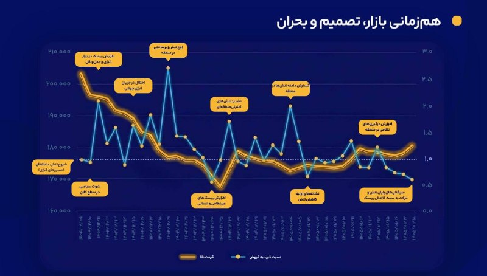

آمار این گزارش میلی خیلی جذابه. نشون میده روز ۱۹ اسفند که اوج درگیری‌ها بوده ولی چون قیمت طلا کف بوده ملت کلی خریدن!! واقعا یعنی۲۴ میلیون ایرانی واسه خرید و فروش طلا، چارت چک می‌کنند تو این مملکت؟

https://milli.gold/main/pr-report/

سجی

## OfficialPersiaTwiter — post 499118

‏حساب بانکی بنده از آسمون منطقه کلیرتره.

• Hastiovski •

@OfficialPersiaTwiter

## OfficialPersiaTwiter — post 499117

اختلافات اساسی ایران و آمریکا باقیست؛ تهران: زیاده‌خواهی و بهانه‌جویی واشنگتن پایان ندارد

🔹منابع آگاه از تیم مذاکره‌کننده ایران به تسنیم گفتند: با وجود تغییراتی در متن پیشنهادی آمریکا، اختلافات اساسی همچنان پابرجاست.

🔹 ایران بر بازگشت شفاف و قطعی اموال بلوکه‌شده، پرداخت غرامت بابت تجاوز نظامی آمریکا، و جداسازی موضوع پایان جنگ از مسائل هسته‌ای تأکید دارد.

🔹 در مقابل، آمریکا با درخواست‌های ایران فاصله دارد و تلاش می‌کند مذاکرات پایان جنگ را به بهانه‌جویی‌های سیاسی در حوزه هسته‌ای گره بزند.

🔹منبع مطلع افزود: ایران هرگونه ساخت سلاح هسته‌ای را رد می‌کند و ادعای آمریکا صرفاً فریبکاری است.

*OPT*

@OfficialPersiaTwiter

## OfficialPersiaTwiter — post 499116

ادعای اکسیوس به نقل از یک مقام آمریکایی: پیشنهاد ایران که شامگاه یکشنبه از طریق میانجی‌های پاکستانی با آمریکا به اشتراک گذاشته شده، تنها بهبودهای نمادین نسبت به نسخه قبلی دارد. پیشنهاد جدید شامل کلمات بیشتری درباره تعهد ایران به عدم پیگیری سلاح هسته‌ای است،…

## OfficialPersiaTwiter — post 499115

ادعای اکسیوس به نقل از یک مقام ارشد آمریکایی: ایران یک پیشنهاد به‌روز شده برای توافق جهت پایان دادن به جنگ ارائه کرده است، اما کاخ سفید معتقد است که این پیشنهاد، بهبود قابل توجهی نیست و برای حصول توافق کافی نیست./انتخاب *OPT* @OfficialPersiaTwiter

## OfficialPersiaTwiter — post 499114

ادعای اکسیوس به نقل از یک مقام ارشد آمریکایی:

ایران یک پیشنهاد به‌روز شده برای توافق جهت پایان دادن به جنگ ارائه کرده است، اما کاخ سفید معتقد است که این پیشنهاد، بهبود قابل توجهی نیست و برای حصول توافق کافی نیست./انتخاب

*OPT*

@OfficialPersiaTwiter

## OfficialPersiaTwiter — post 499113

  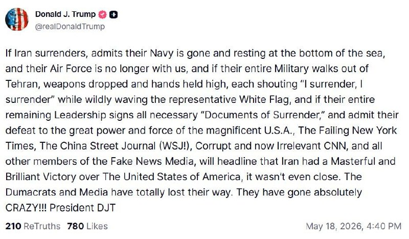

🔹منبع ایرانی به رویترز: ایالات متحده در مذاکرات جاری، از جمله در مورد بحث هسته‌ای، انعطاف‌پذیری نشان داده است. پیشنهاد اصلاح‌شده تهران خواستار پایان دائمی جنگ، لغو تحریم‌ها و [لغو محاصره] است. واشنگتن تاکنون با آزادسازی تنها ۲۵٪ از دارایی‌های تهران طبق یک…

## OfficialPersiaTwiter — post 499112

حمله تروریستی پژاک به معدن در سقز؛ آتش‌زدن تجهیزات و باج‌گیری با گروگان‌گیری نگهبانان 🔹بامداد امروز، گروهک تروریستی پژاک با سه دستگاه خودرو به معدن «میرگه نقشینه» در سقز حمله کرد. 🔹 مهاجمان با بستن دست و پای دو نگهبان معدن و خاموش کردن تلفن‌هایشان، تجهیزات…

## OfficialPersiaTwiter — post 499111

حالا شما الان رو نبین من بچه بودم طرحواره تاییدطلبی‌ام انقد شدید بود که سطل آشغال ویندوزم رو راس ساعت ۹ خالی میکردم به امید اینکه مایکروسافت ازم راضی باشه.

• نیمستراداموس •

@OfficialPersiaTwiter

## OfficialPersiaTwiter — post 499110

تلگراف: احتمالا استارمر به نفع شهردار منچستر از قدرت کناره‌گیری کند 🔹در پی شکست سنگین نخست‌وزیر انگلیس در انتخابات محلی، رسانه انگلیسی گزارش داد که شاید کی‌یر استارمر به صورت داوطلبانه به نفع شهردار منچستر از سمتش به عنوان نخست‌وزیر انگلیس کناره‌گیری کند.…

## OfficialPersiaTwiter — post 499109

  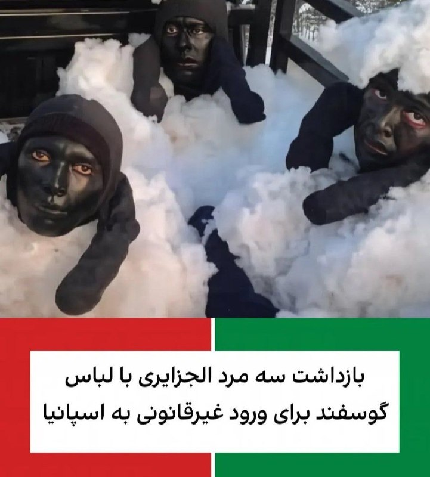

به زودی منو دوستام در راه فرار زمینی از ایران:

• samira •

@OfficialPersiaTwiter

## OfficialPersiaTwiter — post 499108

اتحادیه اروپا محدودیت‌های وارداتی پسته ایران را لغو کرد

🔹این محدودیت‌ها از سال ۲۰۱۹ به‌دلیل ادعای وجود باقی‌ماندهٔ سموم و آفلاتوکسین اعمال شده بود و باعث افزایش هزینه‌های صادرات و کاهش قابل‌توجه فروش پسته ایران به بازار اروپا شد.

• OPT •

@OfficialPersiaTwiter

## OfficialPersiaTwiter — post 499107

🔺️کاخ سفید: امنیت تیم ملی ایران در جام جهانی را تأمین می‌کنیم

• OPT •

@OfficialPersiaTwiter

## OfficialPersiaTwiter — post 499106

چندسال پیش به یکی گفتم می‌خوام مدیتیشن کنم، گفت شما مازندرانیا با صدای بلند حرف نزنید خودش مدیتیشن حساب می‌شه====))))))))))

• Daniel Michael Blake •

@OfficialPersiaTwiter

## OfficialPersiaTwiter — post 499105

آمریکا در متن جدید خود اسقاط تحریم‌های نفتی ایران را پذیرفته است 🔹تسنیم نوشت: یک منبع نزدیک به تیم مذاکره‌کننده گفت که آمریکایی‌ها برخلاف متون پیشین خود، در متن جدید پذیرفته‌اند که در طول دوره مذاکره، تحریم‌های نفتی ایران را Wave کنند. ویو کردن تحریم‌ها به…

## OfficialPersiaTwiter — post 499104

دامنه نوسان در بازگشایی بازار سهام ۳ درصد خواهد بود 🔹رئیس سازمان بورس: بازار سهام با دامنه نوسان ۳ درصدی بسته شد و‌ در بازگشایی هم دامنه نوسان همان ۳ درصد خواهد بود؛ به این نتیجه رسیدیم که الان وقت تغییر یک مقرره نیست. • OPT • @OfficialPersiaTwiter

## OfficialPersiaTwiter — post 499103

  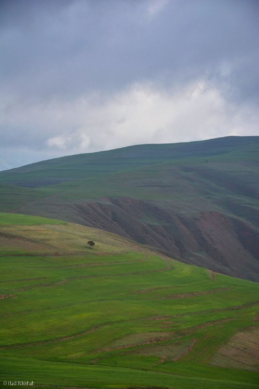

تک درخت، الموت

• Hadi •

@OfficialPersiaTwiter

## bbcpersian — post 281384

یکی از این منابع گفت که پاکستان همچنین دو اسکادران پهپاد ارسال کرده است. هر پنج منبع به رویترز گفتند که ۸۰۰۰ سرباز در عربستان مستقر شدند و وعده داده شده است که در صورت نیاز تعداد بیشتری اعزام شود. به گفته این منابع، سیستم دفاع هوایی چینی اچ‌‌کیو-۹ هم به این کشور ارسال شده است.
بر اساس این گزارش، مسئولیت اداره تجهیزات بر عهده پرسنل پاکستانی است اما عربستان سعودی هزینه آن را می‌پردازد.
شهریور ماه گذشته، پاکستان و عربستان سعودی از امضای یک پیمان دفاعی خبر داده بودند که بر اساس آن، هرگونه تجاوز علیه هر یک از دو کشور به‌عنوان اقدامی خصمانه علیه هر دو تلقی می‌شود. در مقابل قرار شد که عربستان سعودی به پاکستان که یک قدرت هسته‌ای است، نفت ارزان و کمک مالی دهد.
افزایش همکاری نظامی پاکستان و عربستان در حالی است که اسلام‌آباد در جنگ آمریکا و اسرائیل با ایران نقش میانجی را بر عهده داشته است.

@BBCPersian

## bbcpersian — post 281383

  

🔻خبرگزاری رویترز به نقل از دو منبع می‌گوید که پاکستان در چارچوب پیمان دفاعی خود با ریاض، ۸۰۰۰ نیرو،‌ یک اسکادران هواپیمای جنگی و یک سامانه پدافند هوایی در عربستان مستقر کرده است.

پیشتر وزارت دفاع عربستان بدون اشاره به جزئیات، استقرار شماری جنگنده و نیروی پاکستان در چارچوب توافق دو کشور را اعلام کرده بود اما حالا رویترز برای اولین بار جزییات بیشتری ارائه کرده است.

رویترز در گزارش اختصاصی خود، از سه مقام امنیتی و دو منبع دولتی نقل کرده است که نیروی مستقر شده دارای قابلیت رزمی است و هدف از اعزام آن، دفاع از عربستان در صورت حملات بیشتر به آن کشور است.

رویترز می‌گوید که وزارت خارجه و دفتر مطبوعاتی ارتش پاکستان و دفتر رسانه‌ای دولت عربستان سعودی به درخواست این خبرگزاری برای اظهارنظر پاسخی ندادند.

به گفته این منابع، هواپیماهای جنگی شامل حدود ۱۶ هواپیماست که عمدتا از جنگنده‌های «جی‌اف-۱۷» است که مشترکا با چین ساخته شده‌اند؛ این هواپیماها اوایل ماه آویل به پاکستان فرستاده شده بودند.

📷 AFP via Getty Images
https://bbc.in/49G1IjH
@BBCPersian

## bbcpersian — post 281382

🔻ایران: طرح خاصی درباره پیمان عدم تعرض از کشورهای منطقه دریافت نکردیم
ایران گزارش‌های اخیر درباره پیشنهاد عربستان سعودی برای امضای توافق منع تعرض را تکذیب کرد.

اسماعیل بقایی، سخنگوی وزارت خارجه ایران، در پاسخ به سوالی در این باره گفت: «نمی‌توانم بگویم طرح خاصی مطرح شده است.»

در روزهای اخیر گزارش‌هایی، از جمله در روزنامه آمریکایی وال‌استریت جورنال، منتشر شده بود که می‌گفت عربستان سعودی پیشنهاد امضای یک پیمان عدم تعرض بین ایران و کشورهای منطقه را مطرح کرده است.

ایران در جنگ با اسرائیل و آمریکا که نهم اسفند (۲۸ فوریه) آغاز شد، برخی اهداف در کشورهای منطقه را با موشک و پهپاد هدف قرار داد.

https://bbc.in/3R7PVV9
@BBCPersian

## bbcpersian — post 281381

  

🔻‌روسیه و بلاروس امروز رزمایش مشترک هسته‌ای برگزار کردند. به گفته وزارت دفاع بلاروس، در رزمایش امروز «تحویل مهمات هسته‌ای و آماده‌سازی برای استفاده از آن» تمرین می‌شود.

این وزارتخانه تاکید کرد که این آموزش از پیش برنامه‌ریزی شده است و «علیه کشورهای ثالث نیست و تهدیدی برای امنیت منطقه محسوب نمی‌شود.» نیروی هوایی و یگان‌های موشکی در این رزمایش شرکت داشتند.

این اولین رزمایش هسته‌ای مشترک دو کشور نیست؛ در دو سال گذشته دو کشور هر سال یک رزمایش هسته‌ای مشترک داشته‌اند.

روسیه سال گذشته موشک «اورشنیک»، جدیدترین موشک هایپرسونیک با قابلیت حمل کلاهک هسته‌‌ای، را در بلاروس مستقر کرد و تنش با ائتلاف کشورهای غربی را وارد مرحله‌ای حساس‌تر کرد.

وزارت دفاع بلاروس امروز گفت: «در جریان این رزمایش، برنامه‌ریزی این است که موضوعات مربوط به تحویل مهمات هسته‌ای و آماده‌سازی برای استفاده از آنها در همکاری با طرف روسی تمرین شود.»

ادامه خبر را از لینک زیر در وبسایت بی‌بی‌سی فارسی بخوانید.

شرح تصویر: عکسی که ارتش روسیه از رزمایش مشترک با بلاروس در سال ۲۰۲۴ منتشر کرد
📷 Russian Defense Ministry
https://bbc.in/4uSiQLf
@BBCPersian

## bbcpersian — post 281380

  <a href="telegram/content/bbcpersian_281380_1779119921.mp4" target="_blank">🎬 Download video</a>

🔻سرخط خبرهای دوشنبه ۲۸ اردیبهشت ۱۴۰۵
@BBCPersian

## bbcpersian — post 281379

🔻آژانس بین‌المللی انرژی در مورد کاهش سریع ذخایر تجاری نفت در جهان هشدار داد. فاتح بیرول، رئیس آژانس بین‌المللی انرژی، گفت که علی‌رغم آزاد شدن بخشی از ذخایر نفت استراتژیک دولت‌ها در سراسر جهان، ذخایر تجاری به‌دلیل اختلال در عرضه نفت در خلیج فارس، «بسیار سریع»…

## bbcpersian — post 281378

  

🔻آژانس بین‌المللی انرژی در مورد کاهش سریع ذخایر تجاری نفت در جهان هشدار داد.

فاتح بیرول، رئیس آژانس بین‌المللی انرژی، گفت که علی‌رغم آزاد شدن بخشی از ذخایر نفت استراتژیک دولت‌ها در سراسر جهان، ذخایر تجاری به‌دلیل اختلال در عرضه نفت در خلیج فارس، «بسیار سریع» در حال کاهش است.

با نزدیک شدن به فصل سفرهای تابستانی در نیمکره شمالی، نگرانی‌ درباره کمبود سوخت افزایش یافته است.

خطوط هوایی هشدار داده‌اند که در صورت تداوم اختلالات عرضه، در هفته‌های آینده با کمبود سوخت جت مواجه خواهند شد.

آقای بیرول هنگام ورود به نشست وزرای دارایی گروه هفت (جی-۷) در پاریس به خبرنگاران گفت: «موجودی‌های تجاری در حال کاهش است... فکر می‌کنم اکنون خیلی سریع در حال اتمام است.»

او گفت: «ما هنوز چند هفته فرصت داریم، اما باید از این واقعیت آگاه باشیم که ذخایر به‌سرعت در حال کاهش است.»

📷 AFP via Getty Images
https://bbc.in/4tJk5LV
@BBCPersian

## bbcpersian — post 281377

🔻فلج شدن حمل‌و‌نقل در کنیا، در پی اعتصاب به دلیل گرانی سوخت
اعتصاب کارکنان شبکه حمل‌و‌نقل کنیا در اعتراض به افزایش اخیر قیمت سوخت، باعث سرگردانی هزاران مسافر در این کشور شده است.

با ادامه بحران تنگه هرمز و گران شدن نفت، قیمت بنزین اخیرا در کنیا بیش از ۲۰ درصد افزایش یافته است.

اعتصاب امروز باعث خالی شدن خیابان‌های منتهی به نایروبی، پایتخت، شده و بسیاری از مردم ناچار شده‌‌اند با پای پیاده سر کار بروند؛ برخی از مغازه‌ها و کسبه هم کار خود را تعطیل کرده‌اند و مدارس از دانش‌آموزان خواسته‌اند که در خانه بمانند.

کنیا هم مانند بسیاری از کشورهای آفریقایی دیگر برای تامین سوخت خود به شدت به واردات از خلیج فارس وابسته است. اما جنگ آمریکا و اسرائیل با ایران و محدود شدن رفت‌و‌آمد در تنگه هرمز، این کشورها را با چالش مواجه کرده است.

https://bbc.in/4dOLHua
@BBCPersian

## bbcpersian — post 281376

🔻گزارش سالانه عفو بین‌الملل نشان می‌دهد که اعدام در سال ۲۰۲۵ به رقم بی‌سابقه‌ای رسیده است. بنابر این گزارش، این سازمان در سال گذشته میلادی ۲۷۰۷ مورد اعدام در ۱۷ کشور را ثبت کرده است که بالاترین رقم از سال ۱۹۸۱ است که عفو بین‌الملل ثبت آمار اعدام را آغاز کرد.…

## bbcpersian — post 281375

  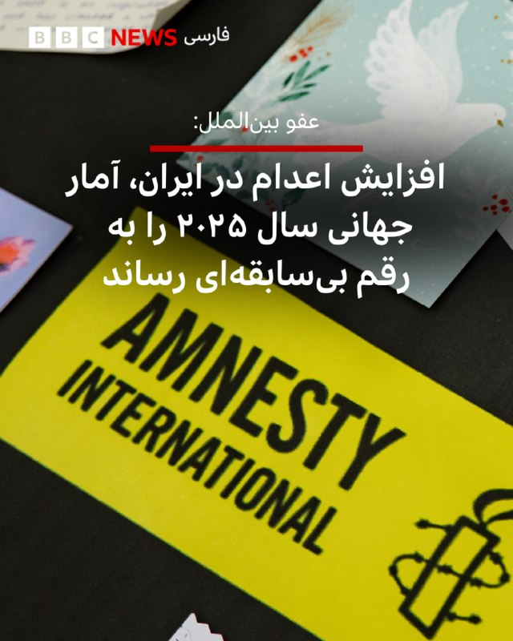

🔻گزارش سالانه عفو بین‌الملل نشان می‌دهد که اعدام در سال ۲۰۲۵ به رقم بی‌سابقه‌ای رسیده است.

بنابر این گزارش، این سازمان در سال گذشته میلادی ۲۷۰۷ مورد اعدام در ۱۷ کشور را ثبت کرده است که بالاترین رقم از سال ۱۹۸۱ است که عفو بین‌الملل ثبت آمار اعدام را آغاز کرد.

بنا بر آخرین گزارش عفو بین‌الملل، این افزایش چشمگیر به‌دلیل چند دولتی بوده است که می‌خواهند «از طریق ارعاب» حکومت کنند: «مقام‌های ایران عامل اصلی این جهش بودند که دست‌کم ۲۱۵۹ نفر را اعدام کردند، بیش از دو برابر آمار سال ۲۰۲۴.»

گزارش عفو بین‌الملل به چند کشور دیگر هم می‌پردازد: «عربستان سعودی شمار اعدام‌ را به دست‌کم ۳۵۶ مورد رساند، از مجازات اعدام برای جرایم مرتبط با مواد مخدر استفاده فراوانی کرد. تعداد اعدام‌ها در کویت تقریبا سه برابر شد (از ۶ به ۱۷)، و تقریبا دو برابر در مصر (از ۱۳ به ۲۳)، سنگاپور (از ۹ به ۱۷) و ایالات متحده آمریکا (از ۲۵ به ۴۷).

ادامه خبر را از لینک زیر در وبسایت بی‌بی‌سی فارسی بخوانید.

📷 NurPhoto via Getty Images
https://bbc.in/4ulEtDY
@BBCPersian

## Lichargoo — post 24903

‏قبلا کس گاو برای خودش شخصیتی داشت، الان شده چند گیگ اینترنت و چند دقیقه ریلز دیدن تو اینستا

## Pesari_Ke_Konie — post 44966

  <a href="telegram/content/Pesari_Ke_Konie_44966_1779119925.mp4" target="_blank">🎬 Download video</a>

🔴یه فمبویِ مشهدی رفته حرم؛

اونجا هرکی از راه می‌رسه میگه شما چرا چادر نداری؟ اینم میگه بابا بخدا من پسرم ..

پ.ن : عجب چیزیه

@Pesari_Ke_Konie

## Tans_Footbali — post 236400

رویترز : ایران دیشب از طریق پاکستان، پیشنهاد جدیدی به آمریکا ارائه داد 
💛@Tans_Footbali

## Tans_Footbali — post 236399

کان نیوز: نتانیاهو امروز جلسه امنیتی محدودی با مقامات ارشد دفاعی و چند وزیر درباره ایران برگزار خواهد کرد.

💛@Tans_Footbali

## Tans_Footbali — post 236397

  <a href="telegram/content/Tans_Footbali_236397_1779119927.mp4" target="_blank">🎬 Download video</a>

ویدیو ویرال شده از ورزش در تهران

ظاهراً طبقه بالای کشتی ضد آبه

@Tans_Footbali

## Tans_Footbali — post 236396

  <a href="telegram/content/Tans_Footbali_236396_1779119929.mp4" target="_blank">🎬 Download video</a>

خبرگزاری معتبر فارس:

یک کشتی ایرانی دیگر خط محاصرهٔ آمریکا را شکست

🔹یک نفتکش ایرانی تحت تحریم‌های آمریکا که ۲ هفتهٔ پیش در سواحل هند بود حالا در جزیرهٔ خارگ پهلو گرفته است.

🔹این نفتکش حامل ال‌پی‌جی بدون اینکه شناسایی شود از خط محاصرهٔ آمریکا گذشته و وارد آب‌های ایران شده است.

@Tans_Footbali

## Tans_Footbali — post 236395

  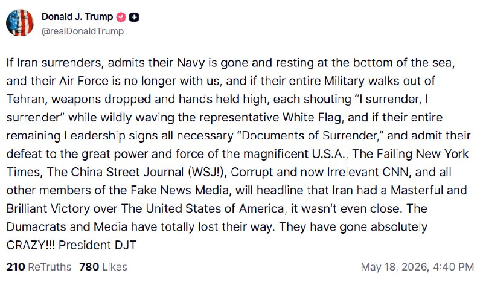

رئیس‌جمهور ترامپ از طریق Truth Social:

اگر ایران تسلیم شود، اعتراف کند که نیروی دریایی‌شان از بین رفته و در کف دریا است، و نیروی هوایی‌شان دیگر با ما نیست، و اگر کل ارتش‌شان از تهران خارج شود، سلاح‌ها را رها کرده و دست‌ها را بالا گرفته و هر کدام فریاد بزنند «من تسلیم می‌شوم، من تسلیم می‌شوم» در حالی که پرچم سفید نماینده را به شدت تکان می‌دهند، و اگر تمام رهبران باقی‌مانده‌شان همه «اسناد تسلیم» لازم را امضا کنند و شکست خود را در برابر قدرت و نیروی بزرگ و باشکوه ایالات متحده آمریکا بپذیرند، روزنامه‌های فیل‌شده نیویورک تایمز، وال استریت ژورنال چین (WSJ!)، سی‌ان‌ان فاسد و اکنون بی‌اهمیت، و همه اعضای دیگر رسانه‌های خبری جعلی، تیتر خواهند زد که ایران پیروزی استادانه و درخشانی بر ایالات متحده آمریکا داشته است، حتی نزدیک هم نبود.

دموکرات‌ها و رسانه‌ها کاملاً راه خود را گم کرده‌اند. آنها کاملاً دیوانه شده‌اند!!!

💛@Tans_Footbali

## Tans_Footbali — post 236394

  <a href="telegram/content/Tans_Footbali_236394_1779119931.webm" target="_blank">🎬 Download video</a>

💥 با هر ثبت نام ۵۰۰ هزار تومن جایزه بگیرید

✔️ میتونید شرط‌بندی کنید و بونوس را به موجودی واقعی تبدیل کنید

⚽️  پوشش کامل مسابقات ورزشی 

💯  پیش‌بینی با بهترین ضرایب 

⭐️ تجربه سریع و حرفه‌ای

💰پرداخت مستقیم و سریع بدون واسطه، بدون دردسر، واریز و برداشت در سریع‌ترین زمان ممکن

☑️ کانال تلگرام: 

➡️ @winro_io  

🎁 هدیه خود را با ثبت نام در سایت دریافت کنید: 

➡️ Winro.io

سایت اصلی در روزهای آینده بازگشایی خواهد شد S
💎

## Tans_Footbali — post 236393

Loading ... ⏳

## Tans_Footbali — post 236392

  <a href="https://t.me/Tans_Footbali/236392" target="_blank">📎 Download file</a>

💛@Tans_Footbali

## Tans_Footbali — post 236391

  <a href="telegram/content/Tans_Footbali_236391_1779119933.mp4" target="_blank">🎬 Download video</a>

یکی از شرکت کنندگان در تجمع حکومتی:

شوهرم‌ نظامیه و سه ماه ندیدمش!!

@Tans_Footbali

## hamclasixii — post 75426

🔴رئیس کمیسیون آموزش مجلس: امتحانات دانشگاه‌ها حضوری برگزار شود

منادی، رییس کمیسیون آموزش در نشست با وزیر علوم:
🔹دانشگاه‌ها هرچه سریع‌تر به شرایط عادی و آموزش حضوری بازگردند و امتحانات نیز به‌صورت حضوری برگزار شود تا افت کیفیتی که در اثر شرایط جنگی و تحمیل‌های دشمن به نظام آموزش عالی وارد شد جبران شود.

📚 @hamclasix 📚

## hamclasixii — post 75425

  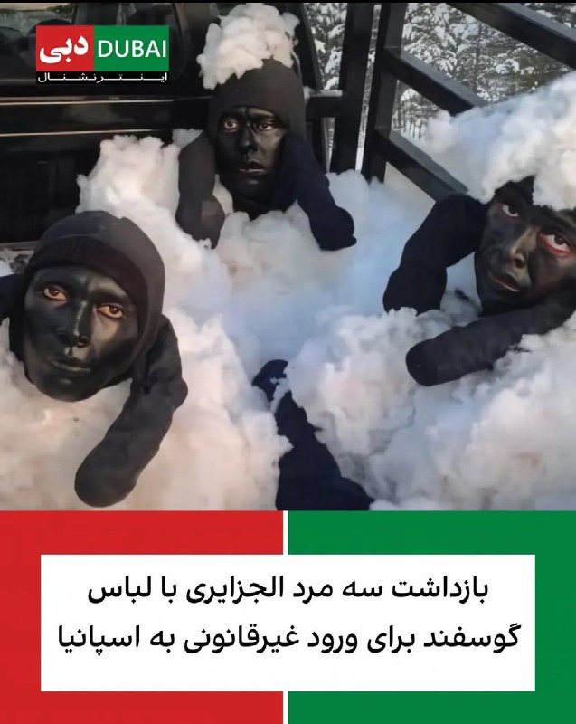

به زودی منو دوستام در راه فرار زمینی از ایران :))

📚 @hamclasix 📚

## hamclasixii — post 75424

🔴راهنمای ویدئویی ثبت نام کنکور ۱۴۰۵

🔹اگه کنکور فرهنگیان رو دی ماه ثبت نام کردی باید الان برای سراسری فقط ویرایش بزنی
🔹همه نظام جدید ها نظام 3-3-6 هستند
🔹 اگه پسری کد های نظام وظیفه رو از اینجا بفهم
🔹دوستانی که دوازدهم هستند و معدل ندارند و مجبورند فیلد رو پر کنن یه چی از خودشون بزنن مهم نیست، بعدا ویرایش میکنید. دوستان پشت کنکوری دقت کنن که ترمیم نمره دیپلم و معدل رو تغییر نمیده و هرچی که دوازدهم گرفتید همونه | معدل کتبی فقط معدل نمرات نهایی دوازدهم هست و معدل دیپلم شامل معدل تمام نمرات سه سال دبیرستان هست
🔹تاریخ اتمام دیپلم مهم نیست زیاد معمولا همون آخر خرداد سالی که دوازدهم رو دادید بزارید
🔹دانشجویان دولتی «دانشجوی روزانه»هستند و دانشجو های پردیس،شبانه،آزاد،غیردولتی،پیام‌نور «دانشجوی غیر روزانه» اند
🔹در مرحله آخر سریال ثبت نام رو از اینجا خریداری کنید و در باکس ها وارد کنید

📚 @hamclasix 📚

## hamclasixii — post 75423

🔴#فوری | اطلاعیه مشاهده و تایید سوابق (آخرین مرحله)

🔹 براساس اعلام وزارت آموزش و پرورش و باتوجه به تاثیر قطعی سوابق تحصیلی در پذیرش رشته‌محل های با آزمون سال 1405 (آزمون اختصاصی دانشجو معلم و آزمون سراسری)، تمامی داوطلبان(دانش آموزان پایه دوازدهم/فارغ التحصیلان) می‌بایست حداکثر تا روز ثبت نام آزمون سراسری نسبت به مشاهده، بررسی و تایید سوابق تحصیلی خود اقدام نمایند.
🔹 نحوه ورود داوطلبان آزمون اختصاصی پذیرش دانشجو-معلم که قبلا برای شرکت در این آزمون ثبت‌نام نموده اند از طریق سامانه جامع آزمون سراسری به نشانی my.sanjesh.org 
🔹 سایر داوطلبان( دانش آموزان پایه دوازدهم / فارغ التحصیلان ) از طریق پنجره خدمات واحد آموزش و پرورش به نشانی my.medu.ir
🔹 طبق تفاهم صورت گرفته با سازمان سنجش آموزش کشور، تمام داوطلبانی که متقاضی ثبت نام در آزمون سراسری سال 1405 می باشند، می بایست، تا تاریخ مذکور نسبت به بررسی و تایید سوابق خود اقدام کرده باشند. در غیر این صورت امکان نهایی کردن ثبت نام در سامانه سازمان سنجش وجود نخواهد داشت.

📚 @hamclasix 📚

## hamclasixii — post 75422

🔴معاون آموزشی وزارت علوم : در ایران از هر ۱۰ بیکار، ۴ نفر دارای مدرک دانشگاهی هستند!

📚 @hamclasix 📚

## withyashar — post 11556

🚨🚨🚨🚨🚨🚨🚨🚨
رویترز: آمریکا پیشنهاد جدید ایران را رد کرد
@withyashar

## withyashar — post 11555

  

علی‌ آقا عشقه ، چقدر راحت و خاکی‌ کانکت شدیم… بد یه عده … چی بگم… درست میشه اونم … در آخر هر چیزی فقط‌ مردمن که مهم هستند🙌🏾❤️‍🩹
@withyashar

## withyashar — post 11554

کمی‌پیش ستون عظیم دود از جنوب تهران، دوربین به سمت : بزرگراه یادگار عمام، جنوب @withyashar

## withyashar — post 11553

  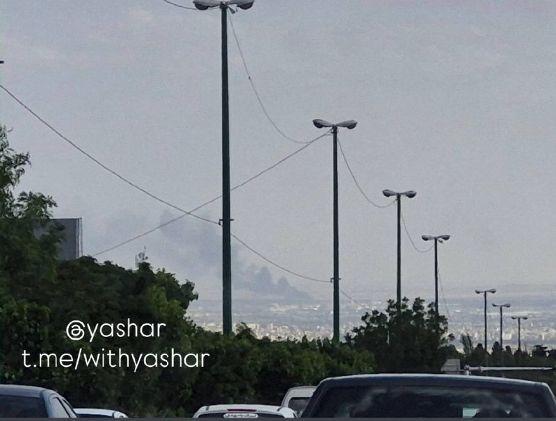

کمی‌پیش ستون عظیم دود از جنوب تهران، دوربین به سمت : بزرگراه یادگار عمام، جنوب
@withyashar

## withyashar — post 11552

تسنیم به نقل از منبعی نزدیک به تیم مذاکره‌کننده ایران:

ایران بر لزوم پرداخت غرامت از سوی آمریکا به دلیل جنگ، اصرار جدی دارد.
واشنگتن باید درک کند که پایان دادن به جنگ، در ازای تعهدات هسته‌ای نخواهد بود.
@withyashar

## withyashar — post 11551

  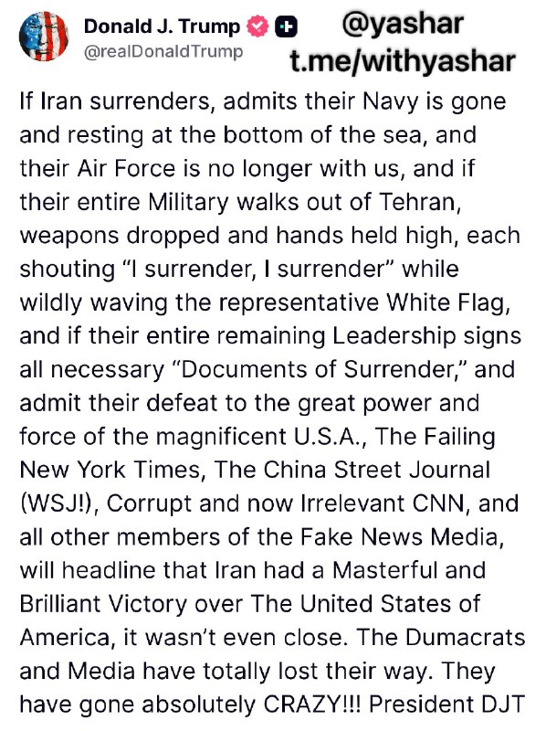

ترامپ در تروث : اگر ایران تسلیم شود، بپذیرد که نیروی دریایی‌اش از بین رفته و در کف دریا آرمیده است، و نیروی هوایی‌اش دیگر همراه ما نیست، و اگر تمام ارتش آن از تهران خارج شود در حالی که سلاح‌ها را زمین گذاشته و دست‌ها را بالا برده‌اند و هر کدام فریاد می‌زنند «تسلیم می‌شوم، تسلیم می‌شوم» و با شتاب پرچم سفید را تکان می‌دهند، و اگر تمام رهبری باقی‌مانده آن همه اسناد لازمِ تسلیم را امضا کنند و شکست خود را در برابر قدرت و نیروی عظیم ایالات متحده آمریکا بپذیرند، آنگاه نیویورک تایمزِ شکست‌خورده، وال‌استریت ژورنال چین (وال‌استریت ژورنال!)، سی‌ان‌ان فاسد و اکنون بی‌اعتبار، و همه اعضای دیگر رسانه‌های جعلی، تیتر خواهند زد که ایران پیروزی‌ای استادانه و درخشان بر ایالات متحده آمریکا به دست آورده است؛ در حالی که اصلاً رقابت نزدیک هم نبوده است.

دموکرات‌ها و رسانه‌ها کاملاً راه خود را گم کرده‌اند. آن‌ها کاملاً دیوانه شده‌اند!!!
@withyashar

## withyashar — post 11550

کانال ۱۳ تلویزیون اسرائیل: نتانیاهو برای دومین بار در ۲۴ ساعت گذشته با کابینه امنیتی تشکیل جلسه داد
@withyashar

## withyashar — post 11549

رئیس‌جمهور کوبا: هر حمله نظامی به کوبا به حمام خون و عواقب غیرقابل پیش‌بینی منجر می‌شود
@withyashar

## withyashar — post 11548

کی‌یر استارمر : من قصد ندارم کنار بکشم، باید به مردمی که به من رای دادند خدمت کنم!
@withyashar

## withyashar — post 11547

خبر بد برای گیمرها
رضا احمدی، معاون نظارت بنیاد ملی بازی‌های رایانه‌ای:

طرحی برای سایتهای دانلود بازیهای کامپیوتری به تصویب رسیده که طبق اون، یک گیم سنتر مرکزی تشکیل میشه تا سایتهای دانلود بازی قبل اینکه لینک دانلود رو آپلود کنن باید اون لینکا رو به اون گیم سنتر ارسال کنن تا یه کمیته محتواش رو بررسی کنه و اگه تایید شد، اون سایت تازه اجازه داره لینکای دانلود رو برای گیمرها آپلود کنه!
@withyashar

## withyashar — post 11546

آمریکا در متن جدید خود اسقاط تحریم‌های نفتی ایران را پذیرفته است

تسنیم : یک منبع نزدیک به تیم مذاکره‌کننده گفت که آمریکایی‌ها برخلاف متون پیشین خود، در متن جدید پذیرفته‌اند که در طول دوره مذاکره، تحریم‌های نفتی ایران را Wave کنند.

ایران تاکید دارد که لغو همه‌ی تحریم‌های ایران باید جزو تعهدات آمریکا باشد. آمریکا اما اسقاطی(OFAC) را تا زمان تفاهم نهایی مطرح کرده است.

اسقاط تحریم‌ها WAVE یعنی تحریم‌ها موقتاً یا عملاً اجرا نشوند اما به معنی حذف دائمی نیست
او‌فک (OFAC)مخفف:
Office of Foreign Assets Control
این یک نهاد در وزارت خزانه‌داری آمریکا است. کارش اجرای تحریم‌ها علیه کشورها، شرکت‌ها و افراد هست، به عبارتی کنترل اینکه چه کسی می‌تواند با چه کسی تجارت کند
@withyashar

---
📅 بروزرسانی: 1405/02/28 15:37
---

## thisisermia — post 73

https://github.com/theermia/BaleTunnel یه اسکریپت اپن‌سورس برای تونل کردن ترافیک اینترنت با استفاده از زیرساخت تماس صوتی پیامرسان بله و پروتکل WebRTC هست. توی این روش، دیتا از طریق DataChannel به‌صورت رمزنگاری‌شده منتقل میشه و از بیرون شبیه یه تماس معمولی…

## persian_trend_official — post 14409

  <a href="telegram/content/persian_trend_official_14409_1779106058.webm" target="_blank">🎬 Download video</a>

📰
🇸🇦
🇵🇰طبق گزارش رویترز، پاکستان در چارچوب «توافق دفاع مشترک» با عربستان:

🔢حدود ۸ هزار نیروی نظامی،

🔢یک اسکادران جنگنده عمدتاً از نوع JF-17،

🔢دو اسکادران پهپادی

🔢 سامانه پدافند هوایی HQ-9 ساخت چین
را در خاک عربستان مستقر کرده است.

❎بر اساس این گزارش، این اقدام با هدف تقویت همکاری‌های دفاعی و امنیتی میان اسلام‌آباد و ریاض انجام شده است.
❎

☆Phantom☆

📌 @persian_trend_official
پرشین ترند | متفاوت‌ترین کانال نظامی

## persian_trend_official — post 14408

  

ایران سامانه «هرمز سیف» را برای ثبت‌نام کشتی‌های عبوری از تنگه هرمز راه‌اندازی کرد

جمهوری اسلامی ایران سامانه‌ای تحت عنوان «هرمز سیف» را با هدف ارائه خدمات به کشتی‌های عبوری از تنگه هرمز راه‌اندازی کرده است. بر اساس این طرح، ناخدایان و شرکت‌های کشتیرانی می‌توانند از طریق این سامانه درخواست خدمات مختلف از جمله بیمه، کترینگ، خدمات اضطراری و همراهی اسکورت نظامی را ثبت کنند.جالبه که اسکورت نظامی رو هم جزو «خدمات» گذاشتن، کنارِ کترینگ! 😂

با این حال، این سامانه با یک چالش فنی قابل توجه مواجه است؛ وب‌سایت مذکور از خارج از ایران قابل دسترسی نیست و کاربران خارجی برای ثبت‌نام ملزم به استفاده از اینترنت ایرانی هستند.

آدرس سامانه: hormuzsafe.ir

☆Phantom☆

📌 @persian_trend_official
پرشین ترند | متفاوت‌ترین کانال نظامی

## persian_trend_official — post 14407

  <a href="telegram/content/persian_trend_official_14407_1779106059.webm" target="_blank">🎬 Download video</a>

⭕️ تسنیم: ایران متن جدید ۱۴ بندی به آمریکا ارائه کرد

💢خبرگزاری تسنیم به نقل از یک منبع نزدیک به تیم مذاکره‌کننده گزارش داد تهران از طریق میانجی پاکستانی، متن جدیدی شامل ۱۴ بند به طرف آمریکایی تحویل داده است.

▪️پیش تر اخباری از منابع پاکستانی نسبت به ارسال پیشنهاد جدید جمهوری اسلامی به آمریکا توسط این کشور منتشر شده بود.

🫆:Tony

📌 @persian_trend_official
پرشین ترند | متفاوت‌ترین کانال نظامی

## persian_trend_official — post 14406

  

🕊
👨‍🦲 سفر پوتین به چین تنها ۴ روز پس از حضور ترامپ

🔹رئیس‌جمهور چین کمتر از یک هفته پس از سفر رئیس‌جمهور آمریکا به پکن، اکنون برای میزبانی همتای روس خود آماده می‌شود.

🔹دیدارهای روسای جمهور آمریکا و روسیه نشان می‌دهد که پکن «به سرعت در حال ظهور به عنوان نقطه کانونی دیپلماسی جهانی» است.

🔹تجارت دوجانبه چین و روسیه از سال ۲۰۲۲ بعد از جنگ اوکراین به بالاترین سطح خود رسیده است، به طوری که چین بیش از یک‌چهارم صادرات روسیه را خریداری می‌کند.

☆Phantom☆

📌 @persian_trend_official
پرشین ترند | متفاوت‌ترین کانال نظامی

## persian_trend_official — post 14405

  <a href="telegram/content/persian_trend_official_14405_1779106060.webm" target="_blank">🎬 Download video</a>

#طنز

جدیدا سرورهای سوپر اپلیکیشن بله وقت ناهار و نماز همراه کارمندان شرکت استراحت می‌کنند. 😌

📝 Nick

📌 @persian_trend_official
پرشین ترند | متفاوت‌ترین کانال نظامی

## persian_trend_official — post 14404

  <a href="telegram/content/persian_trend_official_14404_1779106060.mp4" target="_blank">🎬 Download video</a>

🇵🇰انفجار مرگبار در وزیرستان پاکستان و ترور یکی از بزرگان قبایل

🔹در پی انفجار بمب در بازار «رستم» شهر وانا، ۳ نفر کشته و ۴ نفر زخمی شدند.
🔹منابع محلی اعلام کردند در میان کشته‌شدگان، «ملک طارق وزیر» از بزرگان بانفوذ قبایل منطقه نیز حضور دارد که در حل اختلافات قومی نقش مهمی داشت.

PHANTOM

📌 @persian_trend_official
پرشین ترند | متفاوت‌ترین کانال نظامی

## persian_trend_official — post 14403

⭕️ سخنگوی دولت: اینترنت پرو مصوبۀ شورای‌عالی امنیت ملی است که آقای رئیس‌جمهور ریاست آن را برعهده دارد 💢پاسخ مهاجرانی به اصرار یک خبرنگار دربارۀ وضعیت اینترنت: در شرایطی که ترامپ اعلام می‌کند آتش‌بس به دستگاه تنفس مصنوعی وصل است پاسخ شما چیست؟! 💢در خصوص اینترنت…

## persian_trend_official — post 14402

  <a href="telegram/content/persian_trend_official_14402_1779106061.mp4" target="_blank">🎬 Download video</a>

🔴 ورود نیروی دریایی اسرائیل به عملیات در میانه دریا برای مقابله با شکستن محاصره

💢منابع عبری از آغاز عملیات یگان ۱۳ نیروی دریایی اسرائیل علیه کاروانی خبر می‌دهند که در مسیر غزه در حرکت بوده است. این عملیات در فاصله صدها مایلی از سواحل فلسطین اشغالی انجام شده و طبق گزارش‌ها، هدف آن توقیف یا کنترل کامل کاروان بوده است.

💢بر اساس اطلاعات اولیه، این کاروان شامل ۵۸ شناور بوده که بخشی از آن‌ها به سازمان ترکیه‌ای «آی‌اچ‌اچ» نسبت داده شده‌اند؛ همان مجموعه‌ای که در ماجرای کشتی مرمره نیز نقش داشت.

گزارش‌ها حاکی است صدها نفر در این کاروان حضور دارند و ده‌ها تن از آن‌ها شهروند ترکیه هستند؛ موضوعی که می‌تواند ابعاد سیاسی و امنیتی ماجرا را پیچیده‌تر کند.

💢منابع اسرائیلی، این عملیات را یکی از پرریسک‌ترین مأموریت‌های دریایی سال‌های اخیر توصیف کرده‌اند.

🫆:Tony

📌 @persian_trend_official
پرشین ترند | متفاوت‌ترین کانال نظامی

## persian_trend_official — post 14401

حضرتی: گشایش اینترنت بین الملل سیاست قطعی دولت است 🔹«فیلترینگ» امنیت سایبری کشور را به مخاطره انداخته است. رئیس شورای اطلاع رسانی دولت تأکید کرد: 🔹سیاست قطعی و بدون عقب نشینی دولت گشایش اینترنت بین‌الملل و رفع فیلترینگ است و تا کنون سه جلسه از سوی شورای…

## OfficialPersiaTwiter — post 499088

دو تا پسر با ماشین افتاده بودن دنبالمون ول کن نبودن، خواهرم گفت یهو بپیچ تو این کوچه که گممون کنن، منم تازه گواهینامه گرفته بودم از ۵۰ متر قبل راهنما زدم و ما و اقا پسرا باهم رفتیم تو یه کوچه بن‌بست

• malo •

@OfficialPersiaTwiter

## OfficialPersiaTwiter — post 499087

📌اینترفاکس: لاوروف دخالت روسیه در مذاکرات آمریکا و ایران را رد کرد 🔹وزیر خارجه روسیه سرگئی لاوروف می‌گوید مسکو قصد ورود به روند مذاکرات میان واشینگتن و تهران را ندارد، اما از هر توافقی که دو طرف مستقیماً بر سر آن به نتیجه برسند حمایت خواهد کرد. 🔹لاوروف با…

## OfficialPersiaTwiter — post 499086

🔻 گنج ۱۰ تریلیون دلاری در کف تنگه هرمز

پس از اعمال مدیریت روی تنگه هرمز، ایران با استناد به حاکمیت مطلق بر بستر و زیربستر دریای سرزمینی خود (مطابق کنوانسیون ۱۹۸۲ حقوق دریاها)، می‌تواند تمامی کابل‌های فیبرنوری عبوری از این آبراه را مشمول مجوز، نظارت و عوارض حاکمیتی اعلام کند.

براساس گزارش Policy Exchange، این کابل‌ها روزانه بیش از ۱۰ تریلیون دلار تراکنش مالی را جابه‌جا می‌کنند.

هرگونه اختلال در این گلوگاه، به دلیل عبور کابل‌های محافظت شده دارای فناوری DWDM، می‌تواند روزانه ده‌ها تا صدها میلیون دلار خسارت مستقیم و غیرمستقیم به اقتصاد منطقه و جهان تحمیل کند.

• OPT •

@OfficialPersiaTwiter

## OfficialPersiaTwiter — post 499085

  

«بدنام» در آستانه‌ طوفانی بزرگ

🔹بدنام در قسمت ششم بالاخره نقابش را کنار می‌زند و نشان می‌دهد تمام آن عاشقانه‌‌های قبلی آرامش قبل طوفان بوده. یلدا دیگر صرفاً عاشقی شکست‌خورده یا قربانی بازی مردانه نیست، بلکه تبدیل به طراح اصلی انتقامی حساب‌شده و حقوقی شده.

🔹انتقامی که هم ابراهیم را از خواسته‌اش محروم می‌کند و هم عماد را در آستانه فروپاشی قرار می‌دهد. حالا آن مخالفان «بدنام» و قضاوت‌های دم‌دستی‌شان درباره‌ روابط شخصیت‌ها چه حرفی برای گفتن دارند؟ اگر توان عذرخواهی ندارند، حداقل پیش خودشان شرمنده باشند، گاهی کمی شرمندگی برای سلامتی بد نیست!

🔹حجم احساس انباشته‌‌ای که در رابطه‌ی یلدا و اسماعیل شکل گرفته در قسمت ۶ بیشتر است و هرچقدر عشق عمیق‌تر ساخته شود، فاجعه‌ پیش رو سهمگین‌تر خواهد بود. این را سابقه آثار عنقا ثابت می‌کند که انگار سریال آرام‌آرام دارد تماشاگرش را به سمت یک ویرانی عاطفی اجتناب‌ناپذیر هدایت می‌کند.

🔹حالا دیگر قصه «بدنام» وارد نقطه‌ای شده که عشق، قانون، انتقام و فاجعه همزمان در کنار هم قرار گرفته‌اند. حس پایان این اپیزود شبیه ایستادن در آستانه‌ یک طوفان بزرگ بود./مردم سالاری

• خبربان •

@OfficialPersiaTwiter

## OfficialPersiaTwiter — post 499084

📌اینترفاکس: لاوروف دخالت روسیه در مذاکرات آمریکا و ایران را رد کرد

🔹وزیر خارجه روسیه سرگئی لاوروف می‌گوید مسکو قصد ورود به روند مذاکرات میان واشینگتن و تهران را ندارد، اما از هر توافقی که دو طرف مستقیماً بر سر آن به نتیجه برسند حمایت خواهد کرد.

🔹لاوروف با اشاره به نقش روسیه در توافق هسته‌ای ۲۰۱۵ گفت مسکو در آن زمان نقش «مهم و تعیین‌کننده‌ای» در حل مسئله اورانیوم غنی‌شده ایران داشت.

🔹او افزود روسیه در صورت تمایل هر دو طرف، آماده است بار دیگر نقشی سازنده در حل‌وفصل این پرونده ایفا کند.

• OPT •

@OfficialPersiaTwiter

## OfficialPersiaTwiter — post 499083

📣 آوش: پیشرفت قابل توجه در مذاکرات پایان جنگ رخ داده است سایت آوش به نقل از یک منبع آگاه نزدیک به تیم مذاکره کننده پایان جنگ گفت پس از چند دور تبادل متن بین ایران و آمریکا، متن‌های دو طرف درباره پایان جنگ به یکدیگر نزدیک شده است. بر این اساس، طرف آمریکایی…

## OfficialPersiaTwiter — post 499082

ادعای کانال ۱۲ اسرائیل: 🔻در پیشنهاد جدید ایران هیچ اشاره‌ای به هرمز و اورانیوم غنی‌شده نشده است • OPT • @OfficialPersiaTwiter

## OfficialPersiaTwiter — post 499081

اینستاگرام و پینترست از زندگیم تقریبا حذف شدن. دیگه اکانت پلاس هوش مصنوعی ندارم، اپلیکیشن‌های عکس و ویدئو رو از روی گوشیم پاک کردم و به ندرت موسیقی آنلاین گوش می‌دم. این تازه وضع منه که کانفیگ می‌خرم. اطرافم آدمایی هستن که ۳ماهه عملا اینترنت ندارن.
گویی برگشتیم به دهه ۸۰.

• Maryam Manouchehri •

@OfficialPersiaTwiter

## OfficialPersiaTwiter — post 499080

ادعای رویترز به نقل از منابع:

پاکستان بر اساس توافقنامه دفاع مشترک، ناوگانی از جت‌های جنگنده، هشت هزار سرباز و سامانه دفاع هوایی در عربستان سعودی مستقر کرده است.

• OPT •

@OfficialPersiaTwiter

## OfficialPersiaTwiter — post 499079

  <a href="telegram/content/OfficialPersiaTwiter_499079_1779106063.mp4" target="_blank">🎬 Download video</a>

🔻نمایی از تنگه هرمز از داخل یک هواپیمای مسافربری؛ به معنای واقعی کلمه هیچ شناوری در حال حرکت نیست

• OPT •

@OfficialPersiaTwiter

## OfficialPersiaTwiter — post 499078

حزب الله: ما یک سکوی گنبد آهنین متعلق به ارتش دشمن اسرائیلی در اردوگاه جنگل های جلیل را با یک پهپاد هدف قرار دادیم.

• OPT •

@OfficialPersiaTwiter

## OfficialPersiaTwiter — post 499077

🔻صدراعظم آلمان: تهران باید با واشنگتن وارد مذاکره شود، تهدید همسایگانش را متوقف کند و تنگه هرمز را بدون هیچ محدودیتی باز کند

• OPT •

@OfficialPersiaTwiter

## OfficialPersiaTwiter — post 499076

قذافی وقتی می‌خواسته زنش رو لوس کنه لیبی به لاباش می‌ذاشته.

• نیمستراداموس •

@OfficialPersiaTwiter

## OfficialPersiaTwiter — post 499075

🔴تسنیم به نقل از یک منبع نزدیک به تیم مذاکره کننده: 🔻ایران جدیدترین متن خود را در ۱۴ بند به واسطه پاکستانی تحویل داده است و میانجی پاکستانی آن را به آمریکایی‌ها ارائه می‌کند. آمریکایی‌ها اخیراْ در پاسخ به متن پیشین ایران که آن هم در ۱۴ بند ارائه شده بود،…

## OfficialPersiaTwiter — post 499074

  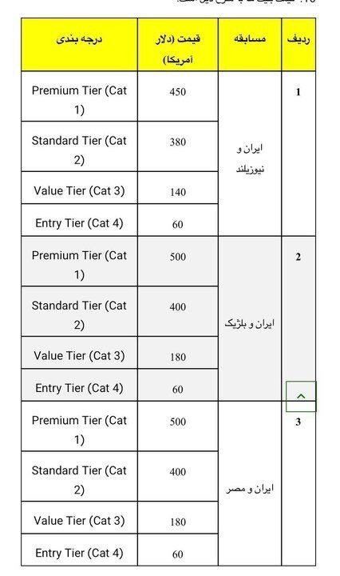

📷 قیمت بلیت بازی‌های ایران در جام‌جهانی ۲۰۲۶ مشخص شد

• OPT •

@OfficialPersiaTwiter

## OfficialPersiaTwiter — post 499073

یه جوری دارم درس نمیخونم که انگار شهروند سوئیس با آینده تضمین شده، ثبات اقتصادی و تورم صفر درصدم.

• پارمیس •

@OfficialPersiaTwiter

## OfficialPersiaTwiter — post 499072

بدتر از خود معقوله‌ی vpn خریدن اینه که حتما باید vpn داشته باشم که بتونم دوباره بخرم

• سَم •

@OfficialPersiaTwiter

## OfficialPersiaTwiter — post 499071

خبرنگار الجزیره به نقل از منبعی در وزارت کشور پاکستان: وزیر کشور سفر خود به تهران را برای سومین روز تمدید کرد

• OPT •

@OfficialPersiaTwiter

## OfficialPersiaTwiter — post 499070

  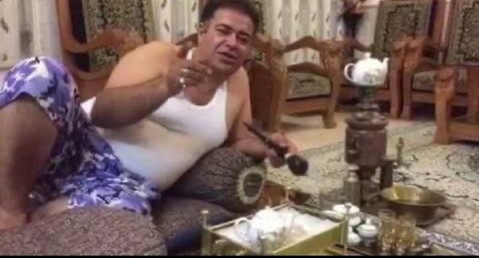

پست عجیب ترامپ با اشاره به ایران • OPT • @OfficialPersiaTwiter

## OfficialPersiaTwiter — post 499069

🔴 ترامپ: «ایران از [آمادگی برای] توافق حرف می‌زند، اما بعد یک کاغذ کاملاً بی‌فایده برایم می‌فرستد که هیچ ربطی به آنچه درباره‌اش صحبت کردیم، ندارد.» • OPT • @OfficialPersiaTwiter

## bbcpersian — post 281374

  

🔻دیوان عالی اسپانیا حکم کرد که سازمان‌های مالیاتی حدود ۷۰ میلیون دلار به شکیرا، ستاره موسیقی پاپ، غرامت بپردازند. پرونده‌ شکایت این خواننده از هشت سال پیش در جریان بود.

شکیرا از این رای استقبال کرد و گفت که دادگاه به «سال‌ها تلاش هماهنگ برای نابودی شهرتش» پایان داد.

شکیرا این پیروزی را به «شهروندان عادی» تقدیم کرد که از «موارد مشابه» رنج دیده‌اند.

دیوان عالی نتیجه گرفت این هنرمند اهل کلمبیا در سال مالی ۲۰۱۱ ساکن اسپانیا نبوده، بنابراین به اشتباه به پرداخت میلیون‌ها دلار مالیات بر درآمد در آن سال ملزم شده بود.

دستور دادگاه اسپانیا شامل پرداخت کامل مبلغ به‌علاوه سود به شکیرا است.

📷 Getty Images
@BBCPersian

## bbcpersian — post 281373

  

🔻فردریش مرتس گفت که «ما حملات هوایی تازه ایران به امارات و دیگر شرکا را به‌شدت محکوم می‌کنیم.»

صدر‌اعظم آلمان در شبکه اجتماعی ایکس، حمله به «تاسیسات هسته‌ای» را تهدیدی برای ایمنی مردم سراسر منطقه خواند.

امارات متحده دیروز گفت که در حمله پهپادی، ژانراتور برق بیرون محوطه نیروگاه هسته‌ای براکه در نزدیکی ابوظبی آتش گرفته است. امارات در بیانیه‌هایش نامی از کشوری نبرد و فقط گفت پهپاد از «مرز غربی» وارد شده بود.

آقای مرتس در این پست نوشت که «ایران باید وارد مذاکره جدی با آمریکا شود، از تهدید همسایگان خود دست بردارد و تنگه هرمز را بدون هیچ محدودیتی مجددا باز کند.»

اظهارات آقای مرتس درباره مذاکرات ایران و آمریکا اخیرا به تنش لفظی او با دونالد ترامپ منجر شد. او گفته بود مذاکره‌کنندگان ایران آمریکا را «تحقیر» کرده‌اند.

📷Getty Images
https://bbc.in/42ChAjs
@BBCPersian

## bbcpersian — post 281372

🔻سازمان غذا و داروی ایران: تأمین مواد اولیه و واردات دارو دچار اختلال شده است
سخنگوی سازمان غذا و داروی ایران می‌گوید که تأمین مواد اولیه و واردات دارو در ایران دچار اختلال شده است.

محمد هاشمی به خبرگزاری کار ایران، ایلنا، گفت که برای شناسایی و مدیریت به‌موقع هرگونه کمبود در بازار، سامانه‌ای فعال شده است که موجودی انبارها و خطوط تولید را به‌طور لحظه‌ای زیر نظر دارد.

آقای هاشمی افزود: «اولویت‌بندی واردات بر اساس ضرورت درمانی داروها در دستور کار قرار گرفته و نهاده‌های مربوط به داروهای حیاتی، مزمن و خاص در صدر فهرست تخصیص ارز و ترخیص قرار دارند.»

هدف قرار گرفتن برخی موسسات مرتبط با تولید دارو در حملات آمریکا و اسرائیل و همچنین محدود شدن واردات به دلیل اختلال در تنگه هرمز و مسیرهای هوایی، به کمبود دارو در ایران دامن زده است.

علاوه بر اینها، تخصیص ارز به واردات دارو هم کاهش یافته است.

پیشتر سخنگو و عضو هیات‌مدیره انجمن داروسازان ایران گفته بود: «محدود شدن منابع ارزی دولت به معنی کاهش امکان اختصاص یارانه به تولید و عرضه دارو است که منجر به افزایش قیمت بین ۳۰ تا ۳۰۰ درصدی قیمت دارو شده است.»

روزنامه اعتماد هفته پیش در گزارشی گفت که مصرف‌کنندگان داروهای خاص‌، با چالش بزرگی روبرو شده‌اند.

روایت‌های بیماران از نبود کیت آزمایش، کمیابی انسولین، افزایش چندبرابری قیمت داروهای حیاتی و توقف واردات برخی داروهای سرطان، از بحرانی حکایت دارد که مستقیما با جان انسان‌ها گره خورده است.

https://bbc.in/4uUCoPk
@BBCPersian

## bbcpersian — post 281371

  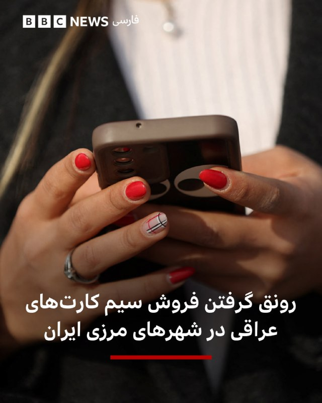

🔻خبرگزای رسمی ایران (ایرنا) می‌گوید که با تداوم قطع اینترنت استفاده از سیم‌کارت‌های عراقی در شهرهای مرزی ایران رونق گرفته است.

ایرنا از کاربران نقل کرده است که به‌دلیل نزدیکی جغرافیایی آبادان و خرمشهر به خاک عراق، آنتن‌دهی اپراتورهای عراقی در برخی نقاط این شهرها، بویژه در مناطق نزدیک اروندرود، قابل دریافت است.

این گزارش می‌گوید خیابان‌های منتهی به رودخانه مرزی ایران و عراق در آبادان محل «تجمع خودروها و افراد پیاده است که در نگاه اول تداعی‌کننده یک تفریحگاه است اما در این مرز خبری از تفریح نیست، گوشی‌های به‌دست گرفته شده و سرهایی که در گوشی‌ها فرو رفته، حکایت از مهاجرت دیجیتال در نقطه صفر مرزی دارد.»

بر اساس این گزارش، قیمت این سیم‌کارت‌ها در بازار غیررسمی خوزستان حدود دو میلیون تومان است و در صورت فعال‌سازی اینترنت و خرید بسته‌های اولیه، هزینه آن گاهی به حدود پنج میلیون تومان نیز می‌رسد.

📷Reuters
@BBCPersian

## bbcpersian — post 281370

  <a href="telegram/content/bbcpersian_281370_1779106067.mp4" target="_blank">🎬 Download video</a>

🔻مقام‌های آمریکایی اعلام کردند که پس از برخورد و سقوط دو جت نیروی دریایی این کشور در جریان نمایش هوایی، وضعیت سلامتی چهار خدمه پایدار است. جت‌های بوئینگ EA18-G گرولر که ویژه جنگ الکترونیک هستند، در حال انجام حرکات نمایشی با هم برخورد و سقوط کردند، اما هر چهار سرنشین آنها با پرتاب اضطراری صندلی پیش از سقوط از هواپیماها خارج شدند.

این حادثه یکشنبه، در دومین و آخرین روز از نمایش هوایی گان‌فایتر اسکایز (Gunfighter Skies) در آیداهو رخ داد.

در پی این برخورد آتش‌سوزی رخ داد و بقیه نمایش هوایی لغو شد. تحقیقات در حال انجام است.

پایگاه هوایی مانتین ایر فورس گانفایترز در بیانیه‌ای که روز یکشنبه در شبکه‌های اجتماعی منتشر شد، اعلام کرد: «خدمه هوایی که در این حادثه درگیر بودند، در وضعیت پایداری قرار دارند.»

سخنگوی نیروی دریایی گفت که خدمه توسط پرسنل پزشکی معاینه می‌شوند.

هواپیماهای EA-18G گرولر متعلق به یک اسکادران جنگ الکترونیکی از ایالت واشنگتن بودند. نیروی دریایی ایالات متحده می‌گوید هر یک از این جت‌ها حدود ۶۷ میلیون دلار قیمت داشته است.

https://bbc.in/4fpKU47
@BBCPersian

## bbcpersian — post 281369

  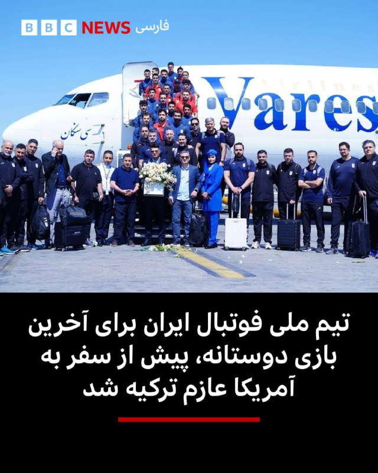

🔻تیم ملی فوتبال ایران صبح امروز با حضور ۲۲ بازیکن و اعضای کادر فنی برای برگزاری یک بازی دوستانه عازم آنتالیا در ترکیه شد.

این بازی دوستانه قرار است آخرین مسابقه تیم ملی با هدف آماده‌سازی برای حضور در جام جهانی و سفر به ایالات متحده باشد.

۲۲ بازیکن اعزام شده به ترکیه، بازکنان شاغل در باشگاه‌های داخلی ایران هستند.

امیر قلعه‌نویی، سرمربی تیم فوتبال ایران، گفته است که ۲۸ فوتبالیست برای حضور در تیم ملی انتخاب شده‌اند و ابراز امیدواری کرده که به همه آنها روادید ورود به آمریکا داده شود.

دو روز پیش مهدی تاج، رئیس فدراسیون فوتبال ایران، در استانبول با ماتیاس گرافستروم، دبیر کل فیفا، دیدار و گفت‌گو کرد.

آقای تاج گفت که در این دیدار مقامات فیفا به «۱۰ نکته‌ای که ایران مطرح کرد، گوش دادند و برای هر یک از آنها راه‌ حل ارائه کردند.»

او ابراز امیدواری کرد که تیم ملی فوتبال ایران بتواند بدون هیچ مشکلی به جام جهانی برود.

قرار است ایران هر سه بازی مرحله گروهی جام جهانی را در ایالات متحده برگزار کند.
@BBCPersian
📷IRAN MEDIA

## Lichargoo — post 24902

‏ظهر رفتم دوش بگیرم، نگو کانفیگم روشن مونده و حجمش تموم شده.
فکر میکنم از بعد از امیرکبیر، تا الان کسی اینجوری از حموم رفتن ضرر نکرده بوده.

## thefeedconfig — post 82

🔗 لینک نصب از طریق TestFlight برای گوشی‌های iOS

https://testflight.apple.com/join/J6bfxDdZ

باید برنامه تست فلایت رو روی ایفون نصب کنید و بعد با اون دفید رو نصب کنید.

🛠️ بعد از نصب از کانال زیر کانفیگ‌بردارید و توی برنامه وارد کنید

کانال کانفیگ برای برنامه دفید:
@thefeedconfig
کانال اصلی پروژه:
@networkti

## networkti — post 362

🔗 لینک نصب از طریق TestFlight برای گوشی‌های iOS

https://testflight.apple.com/join/J6bfxDdZ

باید برنامه تست فلایت رو روی ایفون نصب کنید و بعد با اون دفید رو نصب کنید.

🛠️ بعد از نصب از کانال زیر کانفیگ‌بردارید و توی برنامه وارد کنید

کانال کانفیگ برای برنامه دفید:
@thefeedconfig
کانال اصلی پروژه:
@networkti

## networkti — post 361

کسی هست بتونه نسخه تست فلایت ios رو تست کنه؟ که اول چند نفر تست کنن اگر اوکی بود بعدش بزارم توی کانال لینکش رو

چند نفر لینک رو گرفتن و فعلا همین تعداد کافیه واسه تست اولیه

## Pesari_Ke_Konie — post 44965

گذشته رو نگاه می‌کنی : ۲۵۰۰ سال تمدنه
آینده رو نگاه می‌کنی : ۲۶ کیره

@Pesari_Ke_Konie

## Pesari_Ke_Konie — post 44964

  <a href="telegram/content/Pesari_Ke_Konie_44964_1779106069.mp4" target="_blank">🎬 Download video</a>

شوخی با معروف‌ترین اتفاقات جام جهانی توسط هوش مصنوعی , خیلی خوب بود حقیقتا

@Pesari_Ke_Konie

## Tans_Footbali — post 236390

ترامپ به مجله فورچون:

ایرانی‌ها مدام فریاد می‌زنند.

می‌توانم یک چیز به شما بگویم - آنها مشتاق امضای [یک توافق] هستند.

اما آنها توافق می‌کنند و سپس کاغذی برای شما می‌فرستند که هیچ ارتباطی با توافقی که انجام داده‌اید ندارد.

من می‌گویم: "شما دیوانه شده‌اید؟"

💛@Tans_Footbali

## Tans_Footbali — post 236389

  

امروز وارد 80 اُمین روز قطعی اینترنت تو ایران شدیم

💛@Tans_Footbali

## Tans_Footbali — post 236388

رویترز :

ایران دیشب از طریق پاکستان، پیشنهاد جدیدی به آمریکا ارائه داد

💛@Tans_Footbali

## Tans_Footbali — post 236387

  <a href="telegram/content/Tans_Footbali_236387_1779106072.webm" target="_blank">🎬 Download video</a>

🚨
🇪🇸ژوزه مورینیو بعنوان سرمربی رئال‌مادرید انتخاب شد.
قرارداد ژوزه دو ساله‌اس و بعد از بازی آخر این تیم تو لالیگا به صورت رسمی اعلام میشه.

⚫️@FootyRadar

## hamclasixii — post 75421

  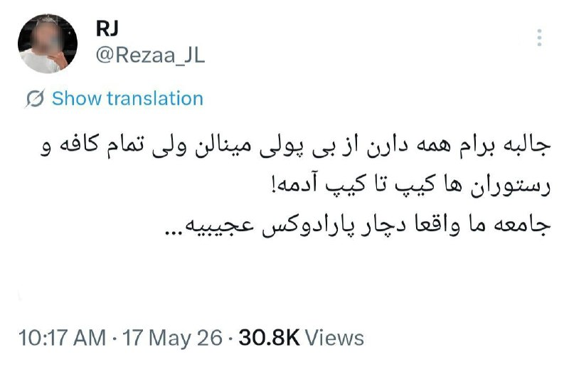

ببین ما میگیم پول نداریم، یعنی پول نداریم رشد کنیم، ماشین بخریم، ماشین عوض کنیم، یه حرکتی بزنیم، یه مسافرت درستی بریم،
چس تومن درمیاریم میگیم خب ما که با این به جایی نمیرسیم میریم کافه

📚 @hamclasix 📚

## hamclasixii — post 75420

🔴 #فوری | با اعلام مدیرکل آموزش و پرورش استان گلستان : امتحانات متوسطه اول و دوم به صورت حضوری برگزار خواهد شد .

📚 @hamclasix 📚

## hamclasixii — post 75419

🔴 #فوری | مدیر کل آموزش پرورش استان فارس شیوه برگزاری ارزشیابی پایانی نوبت خردادماه ۱۴۰۵ را به مدارس ابلاغ کرد

🔹 ۵ درس پایه نهم: ریاضی، فارسی ، مطالعات اجتماعی، عربی و علوم تجربی در خردادماه ۱۴۰۵ به صورت هماهنگ استان و مابقی دروس نیز به صورت هماهنگ منطقه ای برگزار و برنامه آزمون های هماهنگ پایه نهم به پیوست ارسال گردد
🔹 در شرایط کنونی آموزش و ارزشیابی نوبت دوم مجازی است ، در صورت مجوز شورای تامین استان و مساعد شدن  شرایط حضور دانش آموزان در آموزشگاه آزمون ها به صورت حضوری برگزار می گردد
🔹 ارزشیابی نوبت دوم به صورت غیر حضوری و بر اساس شواهد و مستندات عملکرد تحصیلی دانش آموزان در طول سال  تحصیلی انجام شود.

📚 @hamclasix 📚

## hamclasixii — post 75418

🔴#فوری | تصمیمات امتحانات خرداد ۱۴۰۵ در استان سمنان:

🔹 تأکید بر نمرات نیمسال اول:
    حداقل ۱۳ نمره از ارزشیابی نهایی مربوط به دوره‌ای است که آموزش‌ها حضوری بوده است.
🔹 آماده‌سازی دانش‌آموزان:
    برگزاری جلسات رفع اشکال و ارائه نمونه‌سوالات پیش از آزمون‌ها
🔹 ارزشیابی پروژه‌محور:
    تا ۳ نمره از امتحانات پایانی به صورت پروژه‌محور (خلاقیت و فعالیت‌های آموزشی)
🔹 نحوه برگزاری:
    ۷ درس حضوری و مابقی دروس غیرحضوری (جزئیات دروس اعلام نشده)

📚 @hamclasix 📚

## hamclasixii — post 75417

  <a href="telegram/content/hamclasixii_75417_1779106073.webm" target="_blank">🎬 Download video</a>

🔴لیست کالاهای آسیب‌رسان سلامت از سوی وزارت بهداشت اعلام شد 🔹انواع سوسیس و کالباس، انواع نوشابه گازدار بدون قند، نوشابه انرژی‌زا، نوشیدنی مالت، انواع نوشیدنی‌های میوه‌ای گازدار و بدون گاز با محتوای آب‌میوه ۲۵ درصد و کمتر، انواع شربت میوه‌ای و غیر میوه‌ای،…

## hamclasixii — post 75416

🔴لیست کالاهای آسیب‌رسان سلامت از سوی وزارت بهداشت اعلام شد

🔹انواع سوسیس و کالباس، انواع نوشابه گازدار بدون قند، نوشابه انرژی‌زا، نوشیدنی مالت، انواع نوشیدنی‌های میوه‌ای گازدار و بدون گاز با محتوای آب‌میوه ۲۵ درصد و کمتر، انواع شربت میوه‌ای و غیر میوه‌ای، روغن نیمه جامد، مایونز و سس‌های سرد، چیپس و خلال سیب‌زمینی، انواع فرآورده حجیم شده بر پایه بلغور و آرد غلات، سیگار و محصولات دخانی، فرآورده‌های آرایشی تاتو و طراحی پوست، فرآورده‌های رنگ مو و بی‌رنگ کننده مو دکلره، فرآورده‌های صاف کننده، فر کننده و کراتینه کننده‌های مو، فرآورده‌های کاشت ناخن، خدمات برنزه‌سازی پوست و سولاریوم، خدمت تاتو

📚 @hamclasix 📚

## hamclasixii — post 75415

🔴 #فوری | امتحانات استان کردستان غیرحضوری شد!

سید فواد حسینی مدیرکل آموزش و پرورش کردستان :
🔹 دانش آموزان ما ناچار به حضور در کلاس های مجازی شدند،آموزش های مجازی تا نهم خرداد ماه تداوم خواهد داشت
🔹آزمون های ابتدایی غیر حضوری هست
🔹 آزمون های پایه های هفتم تا دهم بنا به تصمیم شورای تامین استان غیر حضوری خواهد بود.

📚 @hamclasix 📚

## withyashar — post 11545

  <a href="telegram/content/withyashar_11545_1779106073.mp4" target="_blank">🎬 Download video</a>

مجری: آیا ارزش از دست دادن انتخابات میان دوره‌ای را دارد اگر نتیجه یک ایران غیر هسته‌ای باشد؟

سناتور گراهام: ارزش از دست دادن شغلم رو هم داره؛ اگر مجبور بودم کارم رو رها کنم تا مطمئن شم ایران هرگز سلاح هسته‌ای نخواهد داشت، این کار رو می‌کردم.‌‌
@withyashar

## withyashar — post 11544

اتاق جنگ با یاشار : تا آغاز جام جهانی ۲۰۲۶ در تاریخ ۲۱ خرداد ۱۴۰۵، حدود ۲۴ روز مانده است. و تا فینال جام جهانی در تاریخ ۲۸ تیر ۱۴۰۵، دقیق ۲ ماه مانده است
عید قربان امسال در بیشتر کشورهای منطقه، روز چهارشنبه ۶ خرداد ۱۴۰۵ (۲۷ مه ۲۰۲۶) اعلام شده است.
بازارهای مالی (بورس‌ها) در ایام عید قربان روز تعطیل می‌شوند (حدود ۵ روز)
حدود ۹ روز تا عید قربان مانده است ، حساب دستتون باشه
@withyashar

## withyashar — post 11543

  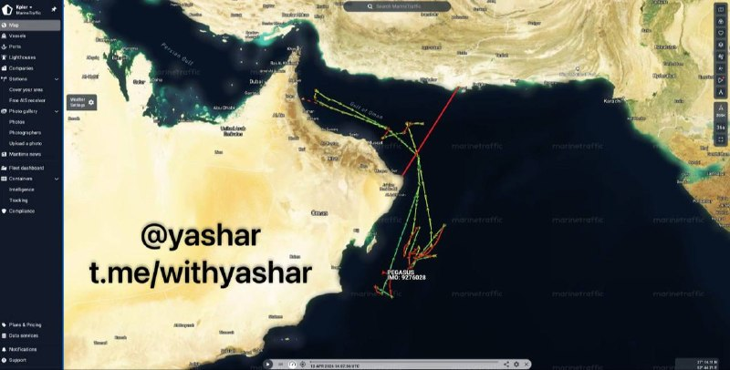

نفتکش هندی‌مکس PEGASUS (9276028) که با پرچم روسیه و تحت تحریم ایالات متحده حرکت می‌کند، صرفاً از روی لجاجت، مدام به محدوده محاصره ایالات متحده رفت و آمد می‌کند. ما چندین تصویر ماهواره‌ای داریم که تأیید می‌کند این یک جعل سیستم اطلاعات ناوبری (AIS) نیست.
فردا ولادمیر پوتین برای دیدار با شی جین پینگ در‌یک سفر از پیش برنامه ریزی نشده به چین سفر میکند…
@withyashar

## withyashar — post 11542

  <a href="telegram/content/withyashar_11542_1779106075.mp4" target="_blank">🎬 Download video</a>

نیروهای ویژه دریایی شایتت ۱۳ اسرائیل سوار بر یک کشتی حامل فعالان حامی حماس، در آب‌های بین‌المللی مشاهده شدند. این تصاویر در حالی منتشر شده که اسرائیل همزمان با حرکت یک ناوگان دریایی به نام «Global Sumud Flotilla» از ترکیه به سمت غزه که طرفداران فلستین هستند، سطح آمادگی نیروی دریایی خود را افزایش داد.
@withyashar

## withyashar — post 11541

زرشکیان : نباید به دروغ ادعا کنیم که هیچ مشکلی نداریم و دشمن در حال نابودی است! ما با چالش‌های جدی مواجهیم!
مسئولان ادعا نکنند ما در شکوفایی مطلق هستیم و دشمن در حال نابودی است!
@withyashar

## withyashar — post 11540

  

تصاویر ماهواره ای بلومبرگ: حدود 23 نفتکش در نزدیکی جزیره خارک مشاهده شدند که بزرگترین تجمع از زمان آغاز محاصره آمریکاست
@withyashar

## withyashar — post 11539

سی‌ان‌ان: پنتاگون فهرستی از اهداف برای حمله به ایران در صورت صدور دستور ترامپ آماده کرده است
@withyashar

## withyashar — post 11538

گسترش آلودگی نفتی ایران به سواحل کویت؛ زنگ خطر فاجعه در خلیج فارس؛بر اساس تصاویر منتشر شده در شبکه‌های اجتماعی، تداوم نشت نفت از زیرساخت‌های ایران، اکنون با عبور از مرزهای آبی، به سواحل کویت رسیده
@withyashar

## withyashar — post 11537

ترامپ: اونا یه برگه می‌فرستن که هیچ ربطی به چیزی که توافق کرده بودیم نداره منم می‌گم، شماها دیوونه‌اید یا چی؟ @withyashar

## withyashar — post 11536

ترامپ: اونا یه برگه می‌فرستن که هیچ ربطی به چیزی که توافق کرده بودیم نداره

منم می‌گم، شماها دیوونه‌اید یا چی؟
@withyashar

## withyashar — post 11535

وای نت عبری از قول منبع پاکستانی: «ما پیشنهاد اصلاح‌شده ایران را به آمریکا ارسال کرده‌ایم، وقت زیادی نداریم»
@withyashar

---
📅 بروزرسانی: 1405/02/28 12:08
---

## thisisermia — post 71

https://github.com/theermia/BaleTunnel یه اسکریپت اپن‌سورس برای تونل کردن ترافیک اینترنت با استفاده از زیرساخت تماس صوتی پیامرسان بله و پروتکل WebRTC هست. توی این روش، دیتا از طریق DataChannel به‌صورت رمزنگاری‌شده منتقل میشه و از بیرون شبیه یه تماس معمولی…

## persian_trend_official — post 14400

حضرتی: گشایش اینترنت بین الملل سیاست قطعی دولت است

🔹«فیلترینگ» امنیت سایبری کشور را به مخاطره انداخته است.

رئیس شورای اطلاع رسانی دولت تأکید کرد:
🔹سیاست قطعی و بدون عقب نشینی دولت گشایش اینترنت بین‌الملل و رفع فیلترینگ است و تا کنون سه جلسه از سوی شورای راهبردی و سیاست‌گذاری اینترنت کشور توسط معاون اول رئیس‌جمهور برگزار شده است.

🫆:Tony

📌 @persian_trend_official
پرشین ترند | متفاوت‌ترین کانال نظامی

## persian_trend_official — post 14399

  

این اتفاق داره واسه مقاومت عراق داستان میشه !

## persian_trend_official — post 14398

  

طرز تهیه چای کرک

چای کرک یکی از نوشیدنی‌های محبوب عمان و کشورهای خلیج فارس است؛ چایی غلیظ، معطر، شیرین و خامه‌ای که معمولاً با هل و شیر درست می‌شود و طعم خیلی خاصی دارد.

مواد لازم
آب: ۱ لیوان
شیر: ۱ لیوان
چای سیاه: ۱ تا ۲ قاشق چای‌خوری
شکر: ۱ تا ۲ قاشق غذاخوری، بسته به ذائقه
هل: ۳ تا ۴ عدد، کمی کوبیده‌شده
زعفران: مقدار خیلی کم، اختیاری
زنجبیل تازه یا پودر زنجبیل: مقدار کم، اختیاری
طرز تهیه

ابتدا آب را داخل قابلمه کوچک بریزید و روی حرارت قرار دهید تا به جوش بیاید. بعد چای سیاه، هل کوبیده‌شده و در صورت تمایل کمی زنجبیل یا زعفران را اضافه کنید.

اجازه دهید چای چند دقیقه بجوشد تا رنگ و عطر آن کاملاً آزاد شود. سپس شیر را اضافه کنید و حرارت را کمی پایین بیاورید. حالا شکر را هم اضافه کنید و خوب هم بزنید.

بگذارید مخلوط چای و شیر حدود ۵ تا ۷ دقیقه آرام بجوشد تا کمی غلیظ شود و طعم مواد کاملاً با هم ترکیب شود. در این مرحله اگر دوست دارید چای کرک غلیظ‌تر و مجلسی‌تر شود، می‌توانید مقدار کمی شیر تبخیرشده یا شیر غلیظ‌شده هم اضافه کنید.

در پایان چای را از صافی رد کنید و داغ سرو کنید.

نکته مهم

راز خوش‌طعم شدن چای کرک عمانی این است که چای و شیر چند دقیقه با هم بجوشند تا نوشیدنی حالت غلیظ، معطر و کرمی پیدا کند. هرچه هل تازه‌تر باشد، عطر چای بهتر می‌شود.

پ.ن: چون درخواست ها زیاد بود، طرز تهیش رو پست کردم. من که خیلی دوسش دارم، امیدوارم امتحان کنید و لذت ببرید.

## persian_trend_official — post 14393

پست قابل تأمل ‌ترامپ که لحظاتی قبل در تروث سوشال منتشر کرده است. ☆Phantom☆ 📌 @persian_trend_official پرشین ترند | متفاوت‌ترین کانال نظامی

## persian_trend_official — post 14392

  

⭕️جواد علیکردی؛ محکوم به ده سال زندان پس از پیگیری مرگ مشکوک برادرش

💢جواد علیکردی، شهروند اهل سبزوار و برادر خسرو علیکردی، وکیل دادگستری جان‌باخته، از سوی دستگاه قضایی جمهوری اسلامی به ۱۰ سال حبس تعزیری محکوم شد.

💢او اخیراً در یکی از شعب دادگاه انقلاب مشهد محاکمه شده و هم‌اکنون در زندان وکیل‌آباد مشهد در بازداشت به‌سر می‌برد. جزئیات دقیق اتهامات مطرح‌شده علیه او تاکنون منتشر نشده است.

خسرو علیکردی روز ۱۴ آذر ۱۴۰۴ در دفتر کار خود جان باخت. نهادهای حکومتی علت مرگ را «ایست قلبی» اعلام کردند، اما خانواده او با اشاره به شواهدی از جمله خونریزی غیرعادی، این روایت را نپذیرفتند و خواستار روشن‌شدن حقیقت شدند.

🫆:Tony

📌 @persian_trend_official
پرشین ترند | متفاوت‌ترین کانال نظامی

## persian_trend_official — post 14391

⭕️ روزنامه ایران: در پی محدودیت دسترسی به اینترنت، بازار خرید سیم‌کارت‌های عراقی در برخی مناطق مرزی غرب شکل گرفته است.

در بعضی نقاط مرزی، سیگنال اپراتورهای عراقی تا دو کیلومتر داخل خاک ایران قابل دریافت است.

ارزان‌تر بودن این سیم‌کارت‌ها در مقایسه با هزینه فیلترشکن‌ها، به عنوان یکی از دلایل گرایش برخی به آن‌ها عنوان شده است.

استفاده از سیم‌کارت‌های خارجی می‌تواند چالش‌هایی را در حوزه نشت اطلاعات ایجاد کند.

📝 Nick

📌 @persian_trend_official
پرشین ترند | متفاوت‌ترین کانال نظامی

## persian_trend_official — post 14390

  

پمپاژ ترس از سوی آقای ترامپ بیشتر شبیه یک بازی روانی و رسانه‌ای است. ۰ وقتی تنگه بسته باشد، ۰ وقتی قیمت بنزین در آمریکا تا ۵۰ درصد افزایش پیدا کند، ۰ وقتی از مذاکرات با چین دست خالی بازگشته باشند، طبیعی است که برای کنترل افکار عمومی، فضای ترس ایجاد کند. کسی که خودش تحت فشار است، تلاش می‌کند دیگران را بترساند تا اقتصادطرف مقابل دچار رکود و توقف شود، مردم از حرکت بایستند و نارضایتی اجتماعی شکل بگیرد؛ «ایران جای خوبی ایستاده ولی استفاده از این موقعیت مهم است و تدبیر لازم دارد در غیر این متضرر میشود» جنگ امروز جنگ هوش مصنوعی است و تفکر آموزش کلاشینکف در میادین و تلوزیون باید تبدیل به آموزش جوانان برای هوش مصنوعی شود٫ آن وقت خواهید دید جوانان کشور بدون تیر و موشک ٫ماهواره ها و اف ۳۵‌ها‌ را چگونه زمینگیر میکنند . مردم باید در آرامش باشند و زندگی کنند و جوانان راهبری و تفکر

بابک زنجانی

پ.ن : چی میشه کسی که با کیف کشی مسئولین، رانت و فساد تبدیل میشه به سرمایه دار، برای ما فاز استیو جابز برمیداره ؟

📌 @persian_trend_official
پرشین ترند | متفاوت‌ترین کانال نظامی

## persian_trend_official — post 14389

  <a href="telegram/content/persian_trend_official_14389_1779093504.webm" target="_blank">🎬 Download video</a>

💢خط نشان جدید دکتر مصطفی خوش چشم برای اسرائیل ▪️تهدید به استفاده از سلاحی ناشناخته ، مخرب و سری علیه این کشور 🫆:Tony 📌 @persian_trend_official پرشین ترند | متفاوت‌ترین کانال نظامی

## persian_trend_official — post 14388

  <a href="telegram/content/persian_trend_official_14388_1779093505.mp4" target="_blank">🎬 Download video</a>

💢خط نشان جدید دکتر مصطفی خوش چشم برای اسرائیل

▪️تهدید به استفاده از سلاحی ناشناخته ، مخرب و سری علیه این کشور

🫆:Tony

📌 @persian_trend_official
پرشین ترند | متفاوت‌ترین کانال نظامی

## persian_trend_official — post 14387

💢کانال ۱۵ اسراییل

💢نتانیاهو به دلایل سیاسی و امنیتی خواستار لغو جلسه دادگاه امروز خود شد.

🫆:Tony

📌 @persian_trend_official
پرشین ترند | متفاوت‌ترین کانال نظامی

## persian_trend_official — post 14386

🔴 حمله هوایی اسرائیل به جنوب لبنان

💢شبکه الحدث گزارش داد جنگنده‌های اسرائیلی منطقه «دیر الزهرانی» در جنوب لبنان را هدف حمله هوایی قرار داده‌اند.

همزمان ارتش اسرائیل اعلام کرد:

▪️ طی ۲۴ ساعت گذشته بیش از ۳۰ موضع متعلق به حزب‌الله را هدف قرار داده است
▪️ این حملات در مناطق مختلف جنوب لبنان انجام شده‌اند

🫆:Tony

📌 @persian_trend_official
پرشین ترند | متفاوت‌ترین کانال نظامی

## persian_trend_official — post 14385

ترامپ! اگر تجربه اول را بتوان با تغافل، ناشی از جهالت دانست؛ حتی اگر تجربه دوم را بتوان با تساهل، ناشی از حقارت فرض کرد؛ تله سوم را حتی با احتیاط هم باید محصول سفاهت دانست. «یک بار جستی، ملخک! دوبار جستی، ملخک! آخر به دستی، ملخک!» حسام الدین آشنا 📌 @…

## persian_trend_official — post 14384

  <a href="telegram/content/persian_trend_official_14384_1779093507.mp4" target="_blank">🎬 Download video</a>

بیضه رو همه دارند آقای فرهانی
شماها عقل نداشتید
مشخصه که خودتون هم میدونید چه نجاستی تناول کردید اما مجبورید تا آخر مسیر سینه خیز برید !

📌 @persian_trend_official
پرشین ترند | متفاوت‌ترین کانال نظامی

## persian_trend_official — post 14383

  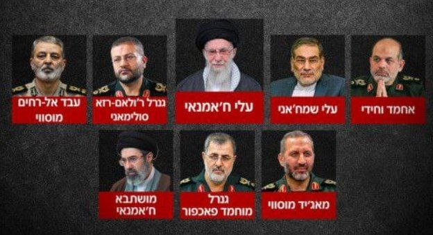

مکان مرگ علی خامنه‌ای، علامتی نمادین از «سوء محاسبه‌»های پی در پی او بود: با شروع حملات جدید، حتی شهروندان عادی هم احتمال می‌دادند بیت رهبری، ممکن است هدف قرار بگیرد. اما «آخرین سوءمحاسبه‌» علی خامنه‌ای، باعث شد دقیقا در همان مکان با چند مقام کشوری جلسه برقرار کند -منابع آمریکایی مختلف بر اینکه رهبر ج.ا در روز واقعه با چند نفر از مسئولان حکومت جلسه داشته تاکید کرده‌اند، هرچند مطمئن نیستیم این مسئولان دقیقا کدام‌ها بوده‌اند.
بعید است مقام‌هایی که به همراه علی خامنه‌ای کشته شده‌اند، اساسا متوجه ریسک برگزاری جلسه در بیت رهبری در روز بعد از شروع حملات آمریکا و اسرائیل نبوده‌اند. ولی وقتی رهبر ۸۷ ساله‌شان تصمیم به برگزاری جلسه در زمان و مکام معین گرفته، قاعدتا دیگران حتی جرات زیر سوال بردن «محاسبات» او را نداشته‌اند. یحتمل مانند سایر هم قطاران‌شان، بر مبنای «پیش بینی‌»های متوهمانه ولی فقیه، تا «ته خط» رفته‌اند.
حسین باستانی

📌 @persian_trend_official
پرشین ترند | متفاوت‌ترین کانال نظامی

## persian_trend_official — post 14382

  <a href="telegram/content/persian_trend_official_14382_1779093509.mp4" target="_blank">🎬 Download video</a>

💢استفاده و نمایش دوباره اسلحه در برنامه زنده صداوسیما ‼️
🫆:Tony

📌 @persian_trend_official
پرشین ترند | متفاوت‌ترین کانال نظامی

## persian_trend_official — post 14381

  

ترامپ!
اگر تجربه اول را بتوان با تغافل، ناشی از جهالت دانست؛
حتی اگر تجربه دوم را بتوان با تساهل، ناشی از حقارت فرض کرد؛
تله سوم را حتی با احتیاط هم باید محصول سفاهت دانست.
«یک بار جستی، ملخک! دوبار جستی، ملخک! آخر به دستی، ملخک!»
حسام الدین آشنا

📌 @persian_trend_official
پرشین ترند | متفاوت‌ترین کانال نظامی

## OfficialPersiaTwiter — post 499043

یادگیری توقف نداره!
لپ‌تاپ و لیوان قهوه‌ات رو آماده کن☕️
چون با دانشکار قراره به یه دانشمند داده حرفه‌ای تبدیل بشی💻
🌱 بهار امسال یادگیری رو با بوت‌کمپ Data Science دانشکار ادامه بده
و صفر تا صد علم داده رو در ۵ ماه یاد بگیر👇
🔗https://dnkr.ir/kgpQR

## OfficialPersiaTwiter — post 499042

🔺ممنوعیت هرگونه تبلیغات اپراتور‌ها و دستگاه‌ها درباره فروش اینترنت پرو

🔹اولین جلسه بهبود فرآیند اجرای طرح اینترنت پرو به میزبانی وزارت ارتباطات برگزار و در این جلسه مصوب شد که هرگونه تبلیغات توسط اپراتور‌ها و دستگاه‌ها در زمینه فروش اینترنت پرو ممنوع است.

• OPT •

@OfficialPersiaTwiter

## OfficialPersiaTwiter — post 499041

رفتم مصاحبه تموم شد گفتن تشریف داشته باشین فکر کردم میگه تشریف ببرین الان پیام داده صبح چرا رفتین قبول شده بودین😭

• Nesa •

@OfficialPersiaTwiter

## OfficialPersiaTwiter — post 499040

  <a href="telegram/content/OfficialPersiaTwiter_499040_1779093511.mp4" target="_blank">🎬 Download video</a>

حضرتی، رئیس شورای اطلاع‌رسانی دولت:

حرف‌های پزشکیان در مورد اینترنت «وعده» نبوده، شائبه وعده بوده!

• OPT •

@OfficialPersiaTwiter

## OfficialPersiaTwiter — post 499039

روزنامه خراسان: احتمال بروز جنگ و ترور مقامات سیاسی وجود دارد اما غافلگیر نمی‌شویم
 
• OPT •

@OfficialPersiaTwiter

## OfficialPersiaTwiter — post 499038

🔴رویترز به نقل از یک منبع پاکستانی: دیشب یکشنبه پیشنهادی اصلاح‌شده از ایران برای پایان جنگ ارسال کردیم

• OPT •

@OfficialPersiaTwiter

## OfficialPersiaTwiter — post 499037

🔻بقایی: گفت‌وگوها با آمریکا از طریق میانجیگری پاکستان ادامه دارد سخنگوی وزارت امورخارجه: 🔹در مورد موضوع غنی‌سازی و مواد اورانیوم گمانه‌زنی‌هایی مطرح کردند که ما اعلام کردیم مبنایی ندارد. 🔹آمریکایی‌ها پیشنهادهایی دادند و ما هم نظرات خود را ارائه کردیم. …

## OfficialPersiaTwiter — post 499036

ادعای شبکه ۱۴ اسرائیل: ترامپ راهی جز حمله به ایران ندارد

🔹شبکه ۱۴ اسرائیل امروز(دوشنبه) مدعی شد که دونالد ترامپ رئيس جمهوری آمریکا چاره ای جز حمله به ایران ندارد.

🔹برآوردها در اسرائیل حاکی از آن است که رئیس‌جمهور ترامپ در یک چهارراه تصمیم‌گیری قرار دارد.

🔹این شبکه افزود: راهی که برای ترامپ باقی مانده، انجام یک عملیات نظامی علیه ایران است، زیرا دیگر قادر به تحمل ادامه مسیر بن‌بست مذاکرات نیست.

• OPT •

@OfficialPersiaTwiter

## OfficialPersiaTwiter — post 499035

🔻بقایی: گفت‌وگوها با آمریکا از طریق میانجیگری پاکستان ادامه دارد

سخنگوی وزارت امورخارجه:

🔹در مورد موضوع غنی‌سازی و مواد اورانیوم گمانه‌زنی‌هایی مطرح کردند که ما اعلام کردیم مبنایی ندارد.

🔹آمریکایی‌ها پیشنهادهایی دادند و ما هم نظرات خود را ارائه کردیم.

• OPT •

@OfficialPersiaTwiter

## OfficialPersiaTwiter — post 499033

🔹ادعای شبکه سی‌ان‌ان: پنتاگون فهرستی از اهداف برای حمله به ایران در صورت صدور دستور ترامپ آماده کرده است

*OPT*

@OfficialPersiaTwiter

## OfficialPersiaTwiter — post 499032

وزیرعلوم: دانشگاه‌ها برای پساجنگ آماده می‌شوند/ تدوین مقررات جدید آموزشی

🔹وزیر علوم، تحقیقات و فناوری با تاکید بر اینکه دانشگاه‌ها برای دوران پساجنگ آماده می‌شوند، گفت: وزارت علوم از میانه جنگ سیاست‌گذاری جدیدی را در حوزه آموزش، پژوهش و فناوری آغاز کرده تا دانشگاه‌ها متناسب با نیازها و اولویت‌های جدید کشور حرکت کنند.

*OPT*

@OfficialPersiaTwiter

## OfficialPersiaTwiter — post 499031

💢ادعاهای سخنگوی سنتکام به شبکه العربیة:ما به اهداف نظامی که برای خود در ایران تعیین کرده بودیم، دست یافته‌ایم

🔹ما تا حد زیادی توانایی‌های نظامی ایران را نابود کرده‌ایم.

🔹ما ظرفیت تولید نظامی ایران را نابود کرده‌ایم.

🔹با متحدان خود برای پشتیبانی از پدافند هوایی همکاری کردیم.

🔹توانایی ایران برای تهدید دیگر مانند گذشته نیست.

🔹عملیات علیه ایران بسیار مؤثر بود.

🔹ما به دلیل استفاده از تنگه هرمز به عنوان سلاحی برای تهدید آزادی دریانوردی، ایران را محاصره می‌کنیم.

🔹برای هرگونه طرح احتمالی که ممکن است از ما درخواست شود، آماده‌ایم.

🔹در طول آتش‌بس با ایران، تجدید تسلیحات و استقرار مجدد نیرو داشته‌ایم.

🔹تهدیدات ایران مانع عبور کشتی‌ها از تنگه هرمز می‌شود.

🔹تحریم ایران بسیار مؤثر است و ما به اجرای آن ادامه می‌دهیم.

• OPT •

@OfficialPersiaTwiter

## OfficialPersiaTwiter — post 499030

🔻جاده قدیم چالوس ۳ روز مسدود است/ ترافیک نیمه سنگین در محورهای منتهی به تهران

جانشین پلیس راه راهور فراجا:

جاده قدیم چالوس حدفاصل کرج ـ شهرستانک در استان البرز، محدوده‌های خوزنکلا و پلیس راه کرج، کیلومتر ۱۸ تا ۳۰، از روز دوشنبه تا چهارشنبه (۲۸ تا ۳۰) اردیبهشت‌ از ساعت ۹ تا ۱۴ به دلیل اجرای عملیات تور سنگی مسدود است و تردد از مسیر جایگزین آزادراه تهران ـ شمال انجام می‌شود.

در حال حاضر تردد در محورهای چالوس، فیروزکوه، محور قدیم تهران ـ بومهن، آزادراه تهران ـ پردیس، آزادراه تهران ـ شمال و آزادراه قزوین ـ رشت در مسیر رفت و برگشت روان گزارش شده است.

• OPT •

@OfficialPersiaTwiter

## OfficialPersiaTwiter — post 499029

  <a href="telegram/content/OfficialPersiaTwiter_499029_1779093513.mp4" target="_blank">🎬 Download video</a>

ماجرای ریختن میخ سه تیکه در اتوبان تهران_کرج چه بود؟

🔹رئیس پلیس راه راهور فراجا: شب گذشته، ۲۷ اردیبهشت‌ماه در جریان یک تعقیب‌وگریز برای متوقف کردن یک دستگاه خودروی شوتی در حوزه استحفاظی تهران و کرج بودیم. این متخلف برای جلوگیری از تعقیب پلیس، اقدام به ریختن میخ سه‌پر کرد تا بتواند از دست پلیس فرار کند که در نهایت این اقدام منجر به پنچر شدن ۱۵ تا ۲۰ دستگاه خودرو شد.

🔹در نهایت، مأموران انتظامی فرد متخلف را شناسایی و خودروی متواری‌شده را توقیف کردند. همچنین پرونده قضایی برای این متخلف تشکیل شده است.

• OPT •

@OfficialPersiaTwiter

## OfficialPersiaTwiter — post 499028

تندبادهای ۹۰ کیلومتری در راه استان مرکزی

مدیرکل هواشناسی استان مرکزی:
🔹از امروز تا پایان هفته، وزش باد شدید و تندبادهای لحظه‌ای با سرعتی بیش از ۹۰ کیلومتر بر ساعت، بسیاری از مناطق استان را تحت تأثیر قرار خواهد داد.

🔹طی ساعاتی از روزهای دوشنبه و سه‌شنبه، در برخی مناطق به‌ویژه نیمه شمالی و نوار غربی استان، احتمال وقوع رگبار و رعدوبرق پراکنده پیش‌بینی می‌شود.

🔹شهروندان، از توقف در مجاورت سازه‌های ناپایدار، داربست‌ها و درختان فرسوده خودداری کرده و در زمان وقوع گردوخاک، به‌ویژه گروه‌های حساس، از تردد غیرضروری در فضای باز پرهیز کنند./تسنیم

*OPT*

@OfficialPersiaTwiter

## OfficialPersiaTwiter — post 499027

  <a href="telegram/content/OfficialPersiaTwiter_499027_1779093515.mp4" target="_blank">🎬 Download video</a>

🔴ویدیو وایرال شده از روزهای اول جنگ تو تهران؛

خونه‌ی طرف بخاطر موج انفجار آسیب دیده و پلیس‌ 10 دقیقه وقت داده که اگه چیز مهمی مثل طلا، سند و... دارید، بردارید و فوری ساختمون رو ترک کنید که احتمال حمله مجدد هست..

بعد خانومی از لا به لای اون همه شیشه خرده و آوار داره رد میشه که بره چیش رو پیدا کنه؟ موچین...

• Al •

@OfficialPersiaTwiter

## OfficialPersiaTwiter — post 499026

خیلی بامزه‌ست ملت با عجله در حال راه رفتن هستن بعد یهو می‌بینن عه توت هست رو درخت و خیلی ز غوغای جهان فارغ طور شروع می‌کنن به تند تند توت چیدن و خوردن.

• آرمان •

@OfficialPersiaTwiter

## OfficialPersiaTwiter — post 499025

بلومبرگ: بیت‌کوین به پایین‌ترین سطح دو هفته گذشته رسید

بیت‌کوین ضعیف شد و به پایین‌ترین سطح خود در بیش از دو هفته گذشته رسید، زیرا ریسک‌های کلان گسترده ناشی از جنگ آمریکا و ایران معامله‌گران را وادار کرد موقعیت‌های خود را کاهش دهند.

این ارز دیجیتال اصلی در روز دوشنبه تا ۷۶,۷۱۱ دلار سقوط کرد، که پایین‌ترین سطح از اول مه بود، قبل از آنکه بخشی از ضررهای خود را جبران کند. سایر توکن‌ها، از جمله اتریوم و سولانا، نیز کاهش یافتند.

*OPT*

@OfficialPersiaTwiter

## OfficialPersiaTwiter — post 499024

کانال ۱۵ اسراییل به نقل از یک منبع:

🔹نتانیاهو به دلایل سیاسی و امنیتی خواستار لغو جلسه دادگاه خود در امروز شد.

*OPT*

@OfficialPersiaTwiter

## OfficialPersiaTwiter — post 499023

اتوبوس‌های BRT پولی شد، مترو رایگان ماند

🔹بر اساس مشاهدات خبرنگار شهری باشگاه خبرنگاران جوان، از صبح امروز دستگاه‌های دریافت بلیت در ایستگاه‌های خطوط تندرو (BRT) پایتخت نصب شده و از مسافران هزینه دریافت می‌شود.

🔹این درحالی است که خدمات‌رسانی در مترو تهران همچنان به‌صورت رایگان است.

• OPT •

@OfficialPersiaTwiter

## bbcpersian — post 281368

🔻نشست وزرای دارایی گروه هفت زیر سایه نگرانی‌ها از خطرات تورمی جنگ ایران

وزرای دارایی هفت کشور صنعتی جهان، موسوم به گروه هفت، در تلاش برای یافتن راه حلی برای پیامدهای تورمی جنگ ایران، امروز در پاریس دیدار می‌کنند.

این جلسه در حالی برگزار می‌شود که نگرانی از خطرات تورمی جنگ ایران، باعث فروش گسترده اوراق قرضه دولتی شده است.

اوراق قرضه، از توکیو گرفته تا نیویورک، روز دوشنبه به افت ارزش خود ادامه دادند؛ افت ارزش این اوراق قرضه به معنای افزایش نرخ بهره آنهاست که نشان می‌دهد

سرمایه‌گذاران به دلیل نگرانی از افزایش قیمت انرژی و تشدید تورم، پیشبینی می‌کنند که نرخ بهره بانکی افزایش خواهد یافت.

وزیر دارایی فرانسه، در پاسخ به این سوال که آیا بازارهای اوراق قرضه در حال فروپاشی هستند، گفت: «آنها در حال اصلاح قیمت هستند، من آن را فروپاشی توصیف نمی‌کنم.»

وزارت دارایی فرانسه گفت که در این نشست نمایندگانی از بانک‌های مرکزی گروه هفت نیز حضور خواهند داشت.

@BBCPersian

## bbcpersian — post 281367

🔻بقایی: بر سر حق غنی‌سازی گفت‌وگو یا مصالحه نمی‌کنیم

سخنگوی وزارت خارجه ایران درباره غنی‌سازی گفت: «آنچه با قطعیت می‌شود گفت بحث حق موضوعی نیست که ما بر سر آن گفتگو یا مصالحه کنیم. حق ایران برای غنی‌سازی بر اساس معاهده عدم اشاعه (ان‌پی‌تی) به رسمیت شناخته شده است.»

آقای بقایی در پاسخ به سوالی درباره پنج شرط آمریکا در برابر پنج شرط ایران گفت که ما مطالباتمان روشن است. مثلا درباره آزادشدن دارایی‌های ایران «شما می‌گویید این شرط ماست ما می‌گوییم این مطالبه ماست.»

او گفت که «آمریکا در سطح بین‌المللی دیگر معتبر تلقی نمی‌شود» و «کشورهای منطقه به شمول امارات باید درس بگیرند از اتفاقات ماه‌های اخیر که دیدند حضور آمریکا منجر به امنیت منطقه نشده است و آن را در مخاطره جدی قرار می‌دهد.»

@BBCPersian

## bbcpersian — post 281366

🔻بقایی: مذاکرات با میانجی پاکستانی ادامه دارد

اسماعیل بقایی، سخنگوی وزارت خارجه ایران، در نشست خبری هفتگی درباره مفاد پیشنهاد آمریکا گفت که ما وقتی طرح ۱۴ بندی را دادیم، طرف آمریکایی ملاحظاتش را مطرح کرد و ما هم متقابلا ملاحظاتمان را مطرح کردیم:

«هفته گذشته علیرغم اینکه طرف آمریکایی به‌صورت علنی اعلام کردند که این طرح [۱۴ بندی] مردود است ما از طریق میانجی پاکستانی مجموعه نکات و ملاحظات اصلاحی آنها را دریافت کردیم. روز بعد از ارسال طرح‌مان، با مجموعه‌ای از پیشنهادات طرف مقابل مواجه شدیم، در این چند روز بررسی شد و متقابلا پاسخ ما ارائه شده است و مذاکرات با میانجی پاکستانی ادامه دارد.»

@BBCPersian

## bbcpersian — post 281365

🔻کویت و قطر، حملات پهپادی به عربستان را محکوم کردند

کویت و قطر در بیانیه‌هایی جداگانه، حملات پهپادی به عربستان سعودی را که مقام‌ها گفته‌اند از حریم هوایی عراق انجام شده، به‌شدت محکوم کرده‌اند.

کویت اعلام کرده است که این اقدام نقض قطعنامه شورای امنیت سازمان ملل است که برای حفاظت از زیرساخت‌های خلیج فارس تصویب شد.

کویت ز اقدامات عربستان برای حفظ امنیتش حمایت کرد.

قطر نیز این حمله را «تجاوزی مردود» و نقض آشکار حاکمیت عربستان توصیف کرد.

هر دو کشور همبستگی کامل خود را با ریاض اعلام و از هرگونه اقدام برای حفاظت از خاک و شهروندان عربستان حمایت کردند.

این بیانیه‌ها پس از آن منتشر شده است که عربستان سعودی اعلام کرد سامانه‌های پدافند هوایی این کشور سه پهپاد مهاجم را رهگیری کرده‌اند.

@BBCPersian

## bbcpersian — post 281364

🔻قوه قضائیه اموال ۱۲۹ نفر را در آذربایجان غربی توقیف کرد

با ادامه توقیف اموال چهره‌های مخالف جمهوری اسلامی، قوه قضائیه در این کشور اعلام کرده که اموال ۱۲۹ نفر را در آذربایجان غربی توقیف کرده است.

این نهاد می‌گوید دارایی‌های توقیف شده متعلق به «سرکردگان گروهک‌های ضد انقلاب و تجزیه‌طلب» در استان آذربایجان غربی بوده و مالکان این اموال را به «همدستی با آمریکا و اسرائیل»متهم کرده است.

جزئیات روند دادرسی منجر به توقیف اموال این افراد هنوز مشخص نیست.

با شدت گرفتن ضبط اموال افرادی که در میان آنها طیف وسیعی از اقشار جامعه از خبرنگار تا بازیگران سابق و فعالان سیاسی و هنرمند، دیده می‌شوند.

فعالان مجازی حامی جمهوری اسلامی در جریان جنگ اخیر، اقدام به فراخوان‌هایی برای معرفی مخالفان جمهوری اسلامی که آنها را «حامی جنگ» نامیدند، کرده بودند.

پس از اعتراضات دی ماه و کشتار معترضان، شمار زیادی از شهروندان ایرانی در خارج از کشور در تجمعات اعتراضی در شهرهای مختلف شرکت کردند که این اعتراضات در هفته‌های منتهی به جنگ و بعد از آن هم ادامه یافت.

قوه قضائیه پس از جنگ آمریکا و اسرائیل با ایران، با استناد به قانون «تشدید مجازات جاسوسی» معترضان و مخالفان را به «همراهی با دشمن» متهم کرد.

اما این توقیف‌ها به موضوع جنگ محدود نیست؛ در زمان اعتراضات دی ماه هم اموال بعضی از چهره‌های شناخته شده در داخل ایران هم ضبط شد.

@BBCPersian

## bbcpersian — post 281363

🔻گزارش‌ رسانه‌های اسرائیلی از «آماده‌‌سازی» ارتش برای همراهی با آمریکا در حمله مجدد به ایران

شبکه تلویزیونی کان گزارش داد که ارتش اسرائیل خود را برای سناریوی احتمالی درگیری با ایران آماده می‌کند.

به گزارش شبکه تلویزیونی کان، یک مقام امنیتی اسرائیل که نامش فاش نشد، گفته است که در صورت آغاز حملات جدید آمریکا، اسرائیل نیز به این عملیات خواهد پیوست و «زیرساخت‌های انرژی ایران» را هدف قرار خواهد داد.

این گزارش پس از تماس تلفنی دونالد ترامپ و بنیامین نتانیاهو در روز یکشنبه منتشر می‌شود.

شبکه کان اسرائیل گزارش داد که این تماس بیش از نیم ساعت به طول انجامید و در آن دو طرف درباره احتمال ازسرگیری درگیری‌ها گفت‌وگو کرده‌اند.

شبکه ۱۲ تلویزیون اسرائیل نیز تماس تلفنی رهبران دو کشور را گفتگویی در «سایه آماده‌سازی برای درگیری‌های جدید با ایران» توصیف کرد.

این شبکه هم گزارش داد که ارتش اسرائیل در آماده‌باش کامل قرار دارد.

شبکه ۱۲ همچنین گزارش داده است که دونالد ترامپ از سوی چین تحت فشار «قابل توجهی» قرار دارد تا از رویارویی جدید با ایران خودداری کند و به جای آن مسیر توافق را در پیش بگیرد.

کانال ۱۳ اسرائیل هم از فرود ده‌ها هواپیمای حامل مهمات و تسلیحات آمریکایی در اسرائیل خبر داد.

بنابر این گزارش این هواپیماها در ۲۴ ساعت گذشته از پایگاه‌هایی در آلمان برخاستند و در تل‌آویو به زمین نشستند.

این شبکه تلویزیونی اسرائیل هم این اقدامات را بخشی از روند آماده‌سازی‌ این کشور برای جنگ با ایران خواندند.

@BBCPersian

## bbcpersian — post 281362

🔻لیندزی گراهام خواستار حمله به زیرساخت‌های انرژی ایران شد

لیندزی گراهام، سناتور جمهوری‌خواه آمریکا از دونالد ترامپ خواست مادام که تهران با شروط آمریکا در مذاکرات هسته‌ای موافقت نکرده است، این کشور را هدف قرار دهد.

این سناتور ارشد جمهوری‌خواه از دونالد ترامپ خواست با هدف قرار دادن زیرساخت‌های انرژِی ایران به این کشور ضربه بزند.

بسیاری از کارشناسان در هفته‌های گذشته هشدار دادند که حمله به زیر ساخت‌هایی که برای غیرنظامیان حیاتی است خلاف قواعد بشردوستانه حاکم بر منازعات بین‌المللی است.

لیندزی گراهام در گفت‌وگو با شبکه ان‌بی‌سی گفته است: «زیرساخت‌های انرژی، نقطه‌ضعف آن‌هاست. اگر قرار باشد درگیری از سر گرفته شود، من بخش انرژی را در صدر فهرست قرار می‌دهم.»

او در ادامه گف تکرار رویکردهای پیشین تنها تکرار «نتایج قبلی» را به دنبال خواهد داشت.

این سناتور جمهوری‌خواه گفت که «بیشتر به آن‌ها ضربه بزنید. شاید اگر به اندازه کافی آسیب ببینند، توافق کنند. اما در حال حاضر فکر می‌کنم تلاش می‌کنند ما را منتظر نگه دارند. به نظرم دارند بازی می‌کنند و به تعبیر رئیس‌جمهور، فکر می‌کنم دیوانه هستند.»

@BBCPersian

## bbcpersian — post 281361

🔻نیویورک تایمز: ارتش اسرائیل «یک پایگاه مخفی دوم» در عراق داشت

روزنامه نیویورک تایمز گزارش داده است که ارتش اسرائیل دو پایگاه «مخفی» در بیابان‌های غربی عراق اداره می‌کرده است.

به نوشته این روزنامه، نیروهای اسرائیلی برای پنهان نگه داشتن یکی از این پایگاه‌ها در نزدیکی شهر النخیب، یک چوپان و یک سرباز را کشته‌اند.

نیویورک تایمز به نقل از مقام‌های منطقه‌ای نوشته‌اند که این پایگاه پیش از جنگ کنونی آمریکا و اسرائیل علیه ایران ایجاد شده بود و در جریان جنگ ۱۲ روزه ژوئن سال گذشته نیز مورد استفاده قرار گرفته است.

بر اساس این گزارش، از این پایگاه برای پشتیبانی هوایی، سوخت‌گیری و ارائه خدمات درمانی استفاده می‌شد است.

این روزنامه همچنین گزارش داده است که آمریکا از وجود این پایگاه اطلاع داشته است. این در حالی است که نیروهای آمریکایی در حال حاضر در هماهنگی با دولت عراق در این کشور حضور دارند و این گزارش به این معناست که ایالات متحده حضور نیروهای خارجی در خارک عراق را از این کشور پنهان کرده است.

به گزارش نیویورک تایمز، این پایگاه جدا از مقر موقتی قبلی است که پیش‌تر وال‌استریت ژورنال درباره آن گزارش داده بود.

وال‌استریت ژورنال گفته بود آن پایگاه اندکی پیش از آغاز جنگ آمریکا و اسرائیل علیه ایران ساخته شده بود و محل استقرار نیروهای ویژه و یک مرکز لجستیکی برای نیروی هوایی اسرائیل بود.

مقام‌های عراقی تاکنون واکنشی به این گزارش نشان نداده‌اند.

@BBCPersian

## bbcpersian — post 281360

بیش از ۸۰ سال، هیچ‌کس نمی‌دانست چه بر سر یک اسیر جنگی شوروی آمده است؛ مردی که از دست نازی‌ها در جزایر مانش گریخت و بقیه جنگ جهانی دوم را در حالی سپری کرد که با کمک یک خانواده محلی از اشغالگران آلمانی پنهان شده بود.

🔻این سرباز که تنها با نام کوچک «باقی‌جان» یا به اختصار «تام» شناخته می‌شد، یکی از حدود دو هزار اسیر جنگی و کارگر اجباری شوروی بود که برای ساخت استحکامات نازی‌ها به جزیره جرزی برده شد.

پس از آزادسازی جزایر، تام و دیگر اسرای بازمانده به اتحاد جماهیر شوروی بازگردانده شدند؛ و با وجود اینکه او قول داده بود در تماس بماند، پس از بازگشت دیگر هیچ خبری از او نشد.

این بی‌خبری ادامه داشت تا زمانی که تیم‌های بی‌بی‌سی موفق شدند بازماندگان او را در آسیای مرکزی، در منطقه‌ای بسیار دور از جرسی، در دورترین نقاط شرق ازبکستان پیدا کنند.

در سال ۱۹۴۳ بود که تام از یکی از اردوگاه‌های کار اجباری نازی‌ها در جرزی گریخت. او خسته، گرسنه و مستاصل، درِ خانه جان و فیلیس لبرتون، از کشاورزان محلی را زد. آن‌ها با وجود آگاهی از خطر، به او پناه دادند و جانش را نجات دادند.

https://bbc.in/493cC2W

## bbcpersian — post 281359

  

‌ ‌ ‌
مقامات نروژ می‌گویند که یک مرد چینی را به اتهام جاسوسی دستگیر کرده‌اند.

این مظنون در شمال این کشور دستگیر شده است و اکنون در بازداشت موقت به سر می‌برد.

براساس گزارش‌ها ۱۰ روز از دستگیری یک زن چینی به اتهام تاسیس شرکتی در نروژ برای دانلود داده‌ها از ماهواره‌ها در مدار قطبی می‌گذرد.

​​سرویس امنیت داخلی نروژ، چین و روسیه را به عنوان تهدیدهای اصلی جاسوسی معرفی کرده که هر دو به دنبال خرید زمین در نزدیکی تاسیسات نظامی هستند.

📷 Reuters
@BBCPersian

## Lichargoo — post 24901

مردها همش حرف از تریسام میزنن، عزیزم اگر میخوای دونفر رو همزمان ناامید کنی با مامان بابات حرف بزن خب.

## Lichargoo — post 24900

قذافی وقتی می‌خواسته زنش رو لوس کنه لیبی به لاباش می‌ذاشته.

## Tans_Footbali — post 236386

  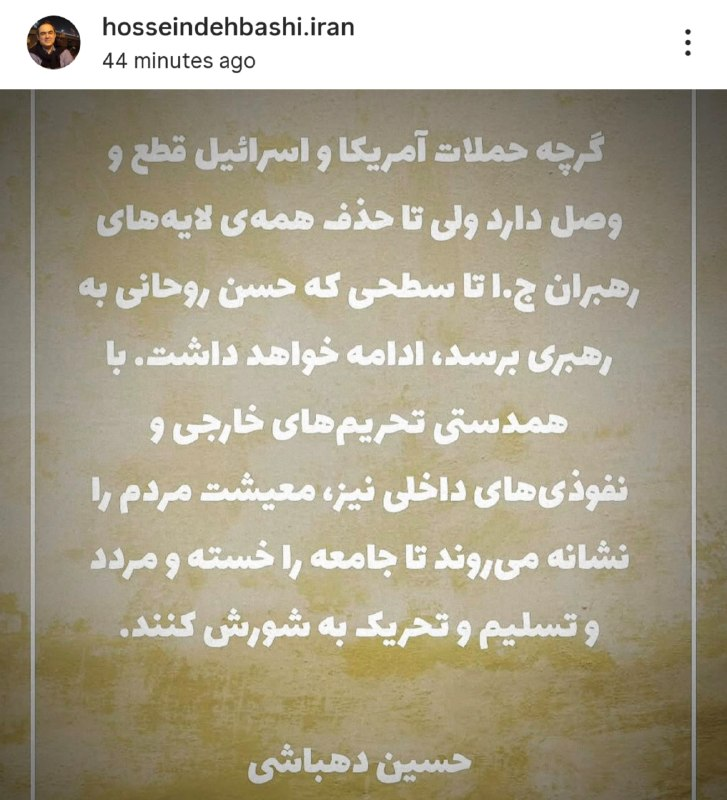

پست عجیب حسین دهباشی سازنده کلیپ تبلیغاتی حسن روحانی در سال ۱۳۹۶: حملات و ترورهای دشمن تا رهبری حسن روحانی ادامه خواهد داشت

@Tans_Footbali

## Tans_Footbali — post 236385

  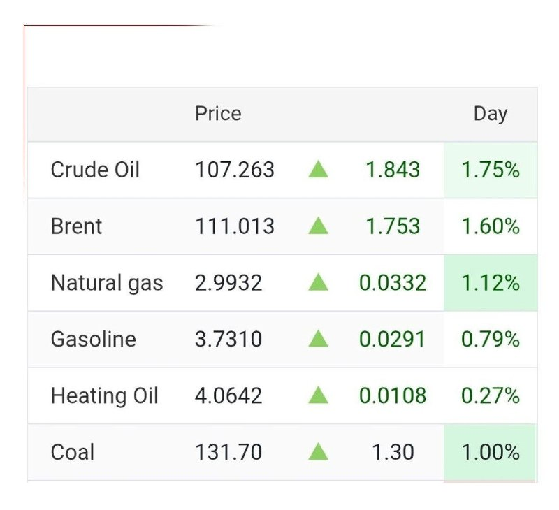

نفت برنت به ۱۱۱ دلار رسید

💛@Tans_Footbali

## Tans_Footbali — post 236384

  <a href="telegram/content/Tans_Footbali_236384_1779093519.webm" target="_blank">🎬 Download video</a>

💥 با هر ثبت نام ۵۰۰ هزار تومن جایزه بگیرید

✔️ میتونید شرط‌بندی کنید و بونوس را به موجودی واقعی تبدیل کنید

⚽️  پوشش کامل مسابقات ورزشی 

💯  پیش‌بینی با بهترین ضرایب 

⭐️ تجربه سریع و حرفه‌ای

💰پرداخت مستقیم و سریع بدون واسطه، بدون دردسر، واریز و برداشت در سریع‌ترین زمان ممکن

☑️ کانال تلگرام: 

➡️ @winro_io  

🎁 هدیه خود را با ثبت نام در سایت دریافت کنید: 

➡️ Winro.io

سایت اصلی در روزهای آینده بازگشایی خواهد شد
💎

## Tans_Footbali — post 236383

  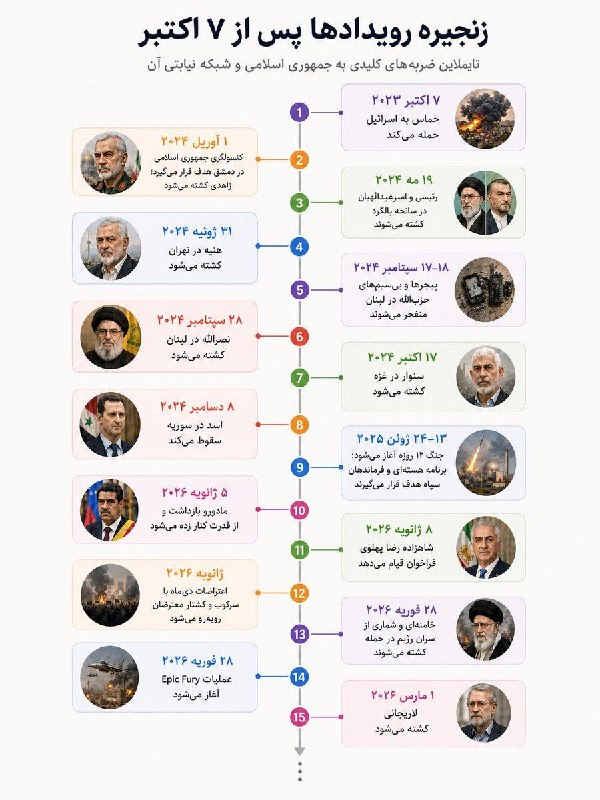

رویدادهای پس از عملیات ۷ اکتبر(طوفان الاقصی)

@Tans_Footbali

## hamclasixii — post 75414

🔴از صبح امروز دستگاه‌های دریافت بلیت در ایستگاه‌های خطوط تندرو (BRT) تهران نصب شده و از مسافران هزینه دریافت می‌شود.

🔹این درحالی است که خدمات‌رسانی در مترو تهران همچنان به‌صورت رایگان است.

📚 @hamclasix 📚

## hamclasixii — post 75413

‏دختر خانوما صبحتون بخیر باشه بخوابید یکم دیگه، خدایی نکرده پوستتون خراب نشه
پسرا هم بسه دیگه پاشید ببینیم چه خاکی باید تو سرمون بریزیم

📚 @hamclasix 📚

## withyashar — post 11534

انفجار سنگین در بیت شمش اسرائیل و دیده شدن ابر قارچی گزارش شده که در کارخانه شرکت تومر رخ داد. این شرکت موتورهای موشک سنگین و سبک، از جمله موتورهای پیشران موشک‌های ارو ۲ و ارو ۳، موتور موشک هدف سیلور انکر، موتورهای ماهواره هورایزن و موتورهای موشک باراک ۸ و…

## withyashar — post 11533

سخنگوی وزارت خارجه:
هفته گذشته علی‌رغم اینکه طرف‌های آمریکایی به‌طور علنی اعلام کردند طرح ایران مردود است، ما از طرف میانجی پاکستانی مجموعه‌ای از نکات و ملاحظات اصلاحی را دریافت کردیم.

بنابراین از روز بعد از ارسال نقطه‌نظرات ما به طرف آمریکایی، از طرف پاکستان مجموعه‌ای از پیشنهادات را دریافت کردیم که در این چند روز بررسی شد و هم‌چنان که دیروز اعلام شد، متقابلا نقطه‌نظرات ما به طرف آمریکایی منعکس شده است.

روند مذاکرات از طریق میانجی پاکستانی ادامه دارد
@withyashar

## withyashar — post 11532

سخنگوی سنتکام به شبکه العربیة:ما به اهداف نظامی که برای خود در ایران تعیین کرده بودیم، دست یافته‌ایم

ما تا حد زیادی توانایی‌های نظامی ایران را نابود کرده‌ایم.
ما ظرفیت تولید نظامی ایران را نابود کرده‌ایم.
با متحدان خود برای پشتیبانی از پدافند هوایی همکاری کردیم.
توانایی ایران برای تهدید دیگر مانند گذشته نیست.
عملیات علیه ایران بسیار مؤثر بود.
ما به دلیل استفاده از تنگه هرمز به عنوان سلاحی برای تهدید آزادی دریانوردی، ایران را محاصره می‌کنیم.

برای هرگونه طرح احتمالی که ممکن است از ما درخواست شود، آماده‌ایم.
در طول آتش‌بس با ایران، تجدید تسلیحات و استقرار مجدد نیرو داشته‌ایم.

تهدیدات ایران مانع عبور کشتی‌ها از تنگه هرمز می‌شود.
تحریم ایران بسیار مؤثر است و ما به اجرای آن ادامه می‌دهیم.
@withyashar

## withyashar — post 11531

شب گذشته راننده یک خودروی شوتی با هدف فرار از دست نیروهای پلیس اقدام به ریختن میخ‌های چندپر در مسیر اتوبان تهران–کرج کرد که موجب آسیب‌دیدگی لاستیک‌های ۲۴ دستگاه خودرو و مسدود شدن آزادراه تا صبح امروز شد

پلیس اعلام کرده که با استفاده از دوربین های جاده ای خودروی شوتی شناسایی شده و راننده آن تحت تعقیب است
@withyashar

## withyashar — post 11530

طبق روال هر روز اسرائیل جنوب لبنان را شخم میزند.
@withyashar

## withyashar — post 11529

یک کارشناس صدا و سیما تهدید کرد:

با یک انفجار در فضا می‌توان خدمات اینترنت ماهواره‌ای استارلینک را از کار انداخت
@withyashar

---
📅 بروزرسانی: 1405/02/28 08:13
---

## persian_trend_official — post 14373

کانال رسمی پرشین ترند pinned «♨️ دوستان عزیز، با توجه به شرایط پیش‌رو، بهتر است از همین حالا برای سناریوهای اضطراری آماده باشیم. آمادگی یعنی آرامش بیشتر و آسیب کمتر برای خودمان و خانواده‌مان. 🧭 ⚠️ چند مورد مهم را جدی بگیرید: • برای دست‌کم ۱ ماه، آذوقه‌ی غذایی فاسد نشدنی و آب آشامیدنی…»

## persian_trend_official — post 14372

  

🔴علیرضا دبیر 💢نوید افکاری رو ما میخاستیم بیاریم بیرون نجات بدیم اما ضد انقلاب نذاشت ! ! ! 🫆:Tony 📌 @persian_trend_official پرشین ترند | متفاوت‌ترین کانال نظامی

## persian_trend_official — post 14370

  <a href="telegram/content/persian_trend_official_14370_1779079386.mp4" target="_blank">🎬 Download video</a>

🔴علیرضا دبیر

💢نوید افکاری رو ما میخاستیم بیاریم بیرون نجات بدیم اما ضد انقلاب نذاشت ! ! !
🫆:Tony

📌 @persian_trend_official
پرشین ترند | متفاوت‌ترین کانال نظامی

## persian_trend_official — post 14369

♨️ دوستان عزیز، با توجه به شرایط پیش‌رو، بهتر است از همین حالا برای سناریوهای اضطراری آماده باشیم. آمادگی یعنی آرامش بیشتر و آسیب کمتر برای خودمان و خانواده‌مان. 🧭 ⚠️ چند مورد مهم را جدی بگیرید: • برای دست‌کم ۱ ماه، آذوقه‌ی غذایی فاسد نشدنی و آب آشامیدنی…

## bbcpersian — post 281358

  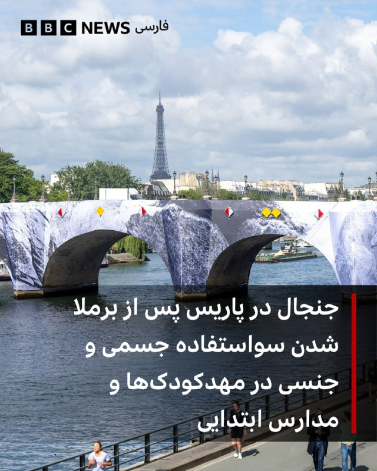

‌ ‌ ‌ ‌
دادستان‌های پاریس می‌گویند که در حال بررسی بیش از صد مهدکودک و مدرسه ابتدایی به اتهام سوءاستفاده جسمی و جنسی هستند.

این اتهامات بیشتر شامل کسانی است که سرپرست غیرآموزشی بوده‌اند و مسئول مراقبت از کودکان قبل و بعد از مدرسه و در زمان زنگ تفریح ​​هستند.

تاکنون ۷۸ نفر از آنها از کار تعلیق شده‌اند، در حالی که یک مرد به اتهام تجاوز جنسی به سه دختر و آزار و اذیت ۹ دختر دیگر در حال محاکمه است.

امانوئل گرگوار، شهردار جدید پایتخت فرانسه، قول داده است که بررسی صلاحیت افرادی که برای سرپرستی درخواست می‌دهند را بهتر انجام دهد و آموزش‌های بهتری در مورد نحوه گزارش موارد مشکوک به بدرفتاری ارائه دهد.

📷EPA/Shutterstock
@BBCPersian

## bbcpersian — post 281357

🔻 ترامپ برای بررسی وضعیت جنگ با ایران به اتاق وضعیت کاخ‌سفید می‌رود

شبکه فاکس نوشته دونالد ترامپ برای وضعیت آخرین تحولات مرتبط با ایران روز سه‌شنبه با مشاوران امنیتی و نظامی کابینه خود در اتاق وضعیت کاخ‌سفید جلسه خواهد گذاشت.

اتاق وضعیت کاخ سفید محل جلسات بسیار مهم و معمولا مرتبط با جنگ و تحولات امنیتی در کاخ سفید است.

گزارش برنامه‌ریزی برای این جلسه را روز یکشنبه ابتدا نشریه اکسیوس گزارش کرد.

آقای ترامپ در چند روز گذشته با اظهار نارضایتی از پاسخ ایران به پیشنهادهای او، تهران را تهدید کرده که در «اسرع وقت» برای رسیدن به توافق با واشنگتن تلاش کند و گرنه به گفته آقای ترامپ ممکن است «چیزی برایش باقی نماند».

در برابر، ایران هم با پافشاری بر مواضع خود گفته «برای هر سناریویی آماده» است و به دولت آمریکا توصیه کرده که با پذیرش پیشنهادهای تهران، زمینه برای توافق و توقف جنگ را فراهم کند.

https://bbc.in/4dwYaSb
@BBCPersian

## bbcpersian — post 281356

  

‌ ‌ ‌ ‌
رواندا اعلام کرده که در بحبوحه شیوع مرگبار ویروس ابولا در جمهوری دموکراتیک کنگو، غربالگری را در مرز این کشور تشدید می‌کند.

برخی از ساکنان شهر گوما در شرق کنگو به بی‌بی‌سی گفته‌اند که فقط به رواندایی‌ها اجازه داده می‌شود که به رواندا برگردند و شهروندان کنگو اجازه ورود نمی‌یابند.

ساکنان شهر گوما نگران هستند که وضعیت اضطراری بهداشتی بر معیشت مردم نیز تأثیر بگذارد.

مقامات بهداشتی کنگو در حالی که تلاش‌ها برای مهار ابولا را افزایش داده‌اند، از استان ایتوری که مرکز شیوع این بیماری است، بازدید کرده‌اند.

سازمان بهداشت جهانی پس از شناسایی یک مورد در اوگاندا، شیوع این بیماری را یک وضعیت اضطراری بهداشت عمومی با نگرانی بین‌المللی اعلام کرده است.

📷TONY KARUMBA/AFP via Getty Images
@BBCPersian

## bbcpersian — post 281355

🔻 حوثی‌های یمن پس از کشته شدن عزالدین حداد، حمایت مجدد خود را از حماس اعلام کردند

رهبری نظامی حوثی‌های یمن، پس از کشته شدن عزالدین حداد، فرمانده ارشد واحد نظامی حماس، حمایت خود را از گروه‌های مسلح فلسطینی در غزه را مجددا اعلام کرده و متعهد به ادامه حمایت از آنها شده است.

یوسف حسن المدنی در پیام تسلیتی در تلگرام، مرگ عزالدین الحداد را ضایعه‌ای بزرگ برای جنبش فلسطین و منطقه توصیف کرد.

آقای المدنی گفت حوثی‌ها به تلاش‌های مشترک خود با حماس و گروه‌های متحد آن «تا زمان دستیابی به پیروزی» ادامه خواهند داد.

https://bbc.in/42K1LHt
@BBCPersian

## bbcpersian — post 281354

  

‌ ‌ ‌ ‌
به گزارش رسانه‌های ترکیه، پلیس استانبول یک مرد را به ظن قتل فجیع یک زن ایرانی به نام فرخنده قائم مقامی، شناسایی و بازداشت کرده است. بنابر گزارش‌ها، دو مظنون دیگر هم به ظن همکاری در این قتل بازداشت شده‌اند.

نشریه حریت ترکیه روز یکشنبه ۱۷ مه / ۲۷ اردیبهشت ضمن انتشار این خبر نوشت: «جسد تکه‌تکه‌شده فرخنده قائم‌مقامی، شهروند ایرانی که در استانبول ناپدید شده بود، در شهر کرشهیر پیدا شد. بر اساس تحقیقات، مشخص شد فرخنده قائم‌مقامی پس از مشاجره با (مرد مظنون)، با قلاده سگ خودش خفه شده و سپس جسد او داخل یک خودرو تکه‌تکه و در زمینی در منطقه موجورِ کرشهیر دفن شده است.»

آن طور که رسانه‌های ترکیه نوشته‌اند فرخنده قائم مقامی - ۶۸ ساله - با مظنون به قتل آشنا بوده و در روز حادثه به اتفاق او برای غذا خوردن بیرون رفته بودند.

حریت نوشته مرد بازداشت شده در بازجویی پلیس اعتراف کرده است که پس از مشاجره‌ای که در آخرین دیدارشان داخل خودرو رخ داد، «فرخنده قائم‌مقامی را با بند قلاده سگ او خفه کرده است».

https://bbc.in/3PIdpjb
📷hurriyet.com.tr
@BBCPersian

## bbcpersian — post 281353

🔻 افزایش بهای نفت در بازارهای صبح دوشنبه شرق آسیا

همزمان با بالا گرفتن مجدد تنش لفظی میان دونالد ترامپ و ایران، بهای نفت در بازارهای صبح دوشنبه شرق آسیا بالا رفت.

قیمت هر بشکه نفت برنت شمال صبح دوشنبه به وقت شرق آسیا به ۱۱۰ دلار رسید.

@BBCPersian

## bbcpersian — post 281343

‌ ‌ ‌
بیش از سه دهه پس از بسته شدن مرز میان آن‌ها، ترکیه و ارمنستان بار دیگر در میان تغییرات پویای منطقه‌ای به‌تدریج به سمت نزدیکی حرکت می‌کنند.

گام‌های اعتمادساز در سال‌های اخیر امیدهای محتاطانه‌ای برای عادی‌سازی ایجاد کرده است. اما پیشرفت‌های بزرگ، از جمله بازگشایی مرز زمینی و برقراری روابط دیپلماتیک، همچنان محدود باقی مانده است.

سیگنال‌های رسمی و رسانه‌ای کم ‌سر و صدای ترکیه درباره نزدیکی با ارمنستان بازتاب‌دهنده حساسیت این موضوع است.

با توجه به اینکه این روند همچنان به توافق صلح میان جمهوری آذربایجان و ارمنستان گره خورده است، باید دید آیا آنکارا و ایروان می‌توانند به‌طور مستقل پیش بروند و ژست‌های نمادین را به تغییرات پایدار تبدیل کنند یا نه.

https://bbc.in/4dhcZcH
📸GettyImages/EPA/Shutterstock/ ullstein bild via Getty Images/ Handout/Anadolu via Getty Images/ AFP via Getty Images
@BBCPersian

## bbcpersian — post 281336

‌ ‌ ‌ ‌
حسن پایکر، مفسر سیاسی ۳۴ ساله‌ای است که تابعیت آمریکا و ترکیه را دارد و خود را یک «سوسیالیست» معرفی می‌کند.

در ماه‌های اخیر، او در ویدیوهای پخش‌ زنده‌ خود از خانه‌اش در لس‌آنجلس، با لحنی تند از سیاست داخلی و خارجی آمریکا انتقاد کرده است.

حسن پایکر از سال ۲۰۱۶ با برنامه‌هایی که صریح و گاه «بی‌پروا» اما در عین حال «سرگرم‌کننده» توصیف می‌شوند، به تدریج مخاطبان بیشتری جذب کرده است.

او در پلتفرم توییچ با نام «حسن‌ابی» (برادر بزرگتر در ترکی) شناخته می‌شود و اکنون در مجموع شبکه‌های اجتماعی مختلف حدود ۱۰ میلیون دنبال‌کننده دارد.

https://bbc.in/4eRVS2j
📸Getty Images/Reuters/ portsfile for Web Summit Qatar via Getty Images/ Bloomberg via Getty Images
@BBCPersian

## Tans_Footbali — post 236382

‏چند احتمال درباره وقوع درگیری در روزهای آینده ‌

.۱. مذاکرات علی‌رغم در جریان بودن پیام‌ها از سوی میانجی‌ها، با بن‌بست کامل مواجه شده و به نظر می‌رسد آمریکا قصد دارد قفل مذاکره را با یک حمله محدود اما موثر باز کند! به همین جهت، احتمال اقدام در روزهای پیش‌رو افزایش یافته است.

۲. در تهران این جمع‌بندی نهایی شده که درگیری اجتناب‌ناپذیر و قریب‌الوقوع است و بر همین اساس، بانک اهداف جدیدی برای ایجاد شوک از جنس شوک روزهای نخست جنگ رمضان تعریف کرده است.

۳. برخی کشورهای عربی از جمله عربستان سعودی، قطر و عمان تلاش دارند در درگیری پیش‌رو خود را به صورت کامل کنار بکشند و به نظر می‌رسد پیام‌هایی نیز رد و بدل کرده‌اند. اینکه ایران سعودی را از بانک اهداف خارج کند یا نه بستگی به عوامل متعددی دارد! اگر زیرساخت‌های انرژی ایران هدف قرار گیرند ناچارا تاسیسات سعودی نیز در صدر اهداف خواهند بود.

۴. احتمال اقدامات متهورانه ‌و با ریسک بالا از سوی آمریکا و اسرائیل از جمله حمله به تاسیسات انرژی، عملیات ویژه یا استفاده از تسلیحات هسته‌ای تاکتیکی با اهداف دستیابی به پیروزی سریع بیشتر از گذشته است. احتمالا آن‌ها به دنبال وارد کردن بیشترین درد در کمترین زمان برای عقب‌نشینی سیاسی ایران هستند.

۵. اگرچه در موج اول حمله، احتمال ترور تعدادی از راس سیاسی و نظامی کشور وجود دارد اما احتمالا و قاعدتا نباید شاهد ترورهای دست‌جمعی به مانند روز اول دو جنگ قبلی باشیم! در واقع، احتمالا سطح غافلگیری کمتر از گذشته است!

۶. احتمالا در دور جدید درگیری‌ ایران تمرکز بیشتری بر اسرائیل خواهد گذاشت و این رژیم برخلاف جنگ رمضان، در صدر اولویت‌های تهاجمی ایران قرار می‌گیرد.

۷. احتمالا امارات متحده عربی، کویت و بحرین نیز در صدر اولویت‌های تهاجمی ایران در حوزه خلیج‌فارس قرار دارند. بسته به بانک اهداف طرف مقابل، عربستان و قطر نیز جزو اولویت‌های بعدی خواهند بود.
📝Mostafa Najafi

@Tans_Footbali

## hamclasixii — post 75412

یک بار نشد این روش‌های رایگان وصل شدن به اینترنت برای منم کار کنه بفهمم طعمش چجوریه

📚 @hamclasix 📚

## withyashar — post 11528

‏شاهزاده رضا پهلوی: «برای انجام نقش خودم به بهترین نحو، باید کاملا موضع فراجناحی و بی‌طرف داشته باشم. نه به نفع پادشاهی و نه به نفع جمهوری؛ به نفع دموکراسی!»
@withyashar

## withyashar — post 11527

پست جدید ترامپ در تروث مبنی بر فشار یا حمله همه جانبه به ایران @withyashar

## withyashar — post 11526

حسین دهباشی سازنده کلیپ تبلیغاتی حسن روحانی سال ۱۳۹۶ در پست عجیبی نوشت : حملات و ترورهای دشمن تا رهبری حسن روحانی ادامه خواهد داشت
@withyashar

## withyashar — post 11525

سی‌ان‌ان به نقل از منابع آگاه:
ترامپ به‌طور فزاینده‌ای از روند مذاکرات با جمهوری اسلامی و ادامه بسته بودن تنگه هرمز ناراضی و کلافه شده.

ترامپ احتمالا اوایل این هفته دوباره با تیم امنیت ملی خود درباره جنگ دیدار خواهد کرد.

پنتاگون در صورت تصمیم نهایی ترامپ، مجموعه‌ای از اهداف و سناریوهای نظامی برای حملات بیشتر آماده کرده.
@withyashar

---
📅 بروزرسانی: 1405/02/28 03:42
---

## OfficialPersiaTwiter — post 499017

  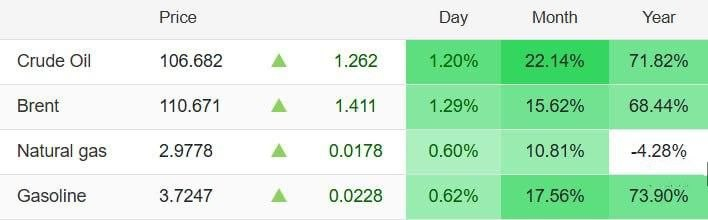

قیمت نفت باز هم رکورد ۱۱۰ دلار را زد

🔹هم زمان با بازگشایی بازار جهانی نفت، قیمت نفت برنت برای چهارمین بار طی یک ماه گذشته از مرز ۱۱۰ دلار گذشت.

• OPT •

@OfficialPersiaTwiter

## OfficialPersiaTwiter — post 499016

  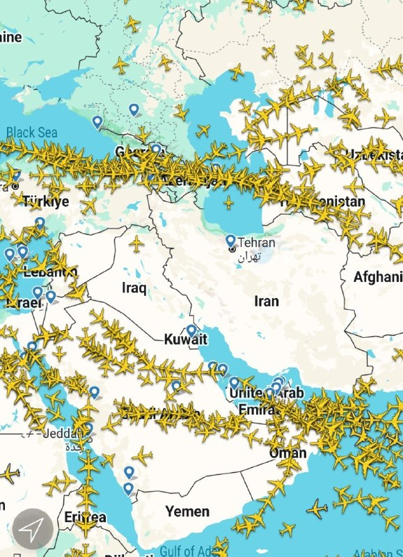

هم‌اکنون وضعیت آسمان منطقه:

• OPT •

@OfficialPersiaTwiter

## OfficialPersiaTwiter — post 499015

  <a href="telegram/content/OfficialPersiaTwiter_499015_1779063127.mp4" target="_blank">🎬 Download video</a>

برخورد ۲ جنگنده آمریکایی در آسمان

دو جنگنده ای‌ای-۱۸جی گرولر نیروی دریایی آمریکا روز یکشنبه در جریان نمایش هوایی «گان‌فایتر اسکایز» در پایگاه نیروی هوایی مانتین هوم در ایالت آیداهو در میانه آسمان با یکدیگر برخورد کردند، اما هر چهار عضو خدمه با موفقیت از هواپیماها خارج شدند/ ایندیپندنت

• OPT •

@OfficialPersiaTwiter

## bbcpersian — post 281332

🔻 محسن رضایی: «تنگه هرمز برای تجارت باز است نه لشکرکشی»

محسن رضایی، فرمانده پیشین سپاه پاسداران در اظهاراتی جدید گفته است: «اگر ترامپ هم نفهمد که محاصره همان ادامه‌ جنگ است نظامیان دنیا که می‌دانند؛ تنها میدان نبرد سکوت کرده است.»

آقای رضایی با انتقاد از ادامه محاصره دریایی بنادر ایران توسط آمریکا گفته است: «هر چقدر محاصره دریایی ایران را طولانی‌تر کنند، آسیب به کشورهای جهان بیشتر خواهد شد. صبر ما حدی دارد و نیروهای مسلح درحال آماده‌کردن خودش است.»

آقای رضایی گفته است تنگه هرمز که بستن آن از سوی ایران به مشکل اصلی مذاکرات آتش بس میان تهران و واشنگتن تبدیل شده است: «برای تجارت باز است اما نه لشکرکشی».

این فرمانده پیشین سپاه پاسداران که اکنون مشاور ارشد نظامی فرمانده کل قوا - رهبر جمهوری اسلامی - است همچنین از احتمال حمله نظامی ظرف چند روز آینده سخن گفته است: «واقعیت این است که آمریکا در یک بن‌بست کامل گرفتار شده است. از یک طرف می‌خواهد بجنگد و حتی در دو سه روز آینده ممکن است وارد این عرصه شود، اما نظامی‌های آمریکایی به ترامپ می‌گویند که در این مسیر احتمال اسیر شدن نیروهای آمریکایی زیاد است چون آنها می‌خواهند در سواحل جنوبی وارد شوند.»

در چند روز گذشته، همزمان با اظهارات تهدید آمیز دونالد ترامپ درباره جنگ با ایران، مقام‌ها در تهران هم بارها با لحنی مقابله جویانه از آمادگی برای «هر سناریو» و مقابله با «حملات نظامی» در صورت از سر گیری جنگ آمریکا و اسرائیل علیه ایران سخن گفته‌اند.

https://bbc.in/4dtzfP5
@BBCPersian

## Tans_Footbali — post 236381

  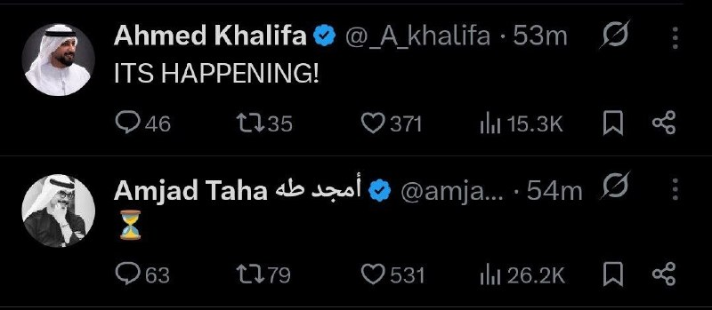

کارشناسان معتبر عرب :

احمد خلیفه : داره اتفاق میوفته!
امجد طه‌ : 
⏳

💛@Tans_Footbali

---
📅 بروزرسانی: 1405/02/28 02:42
---

## persian_trend_official — post 14368

  <a href="telegram/content/persian_trend_official_14368_1779059541.webm" target="_blank">🎬 Download video</a>

شبتون بخیر 🙏🤍

📝 Nick
📌 @persian_trend_official
پرشین ترند | متفاوت‌ترین کانال نظامی

## persian_trend_official — post 14367

  

پست قابل تأمل ‌ترامپ که لحظاتی قبل در تروث سوشال منتشر کرده است.

☆Phantom☆

📌 @persian_trend_official
پرشین ترند | متفاوت‌ترین کانال نظامی

## bbcpersian — post 281331

  

‌ ‌ ‌ ‌
در پی واژگون شدن اتوبوس حامل کارکنان مجمتع گاز پارس جنوبی در عسلویه، شش نفر کشته و ۲۰ نفر مجروح شدند.

ابراهیم عباسی، سخنگوی مجتمع گاز پارس جنوبی به ایسنا گفته است این اتوبوس در حال سفر به شهر کرمانشاه بوده است که در جاده عسلویه - سیراف دچار سانحه و واژگون شده است.

https://bbc.in/4dqYKR9
📷 Irna
@BBCPersian

## Tans_Footbali — post 236380

  <a href="telegram/content/Tans_Footbali_236380_1779059543.mp4" target="_blank">🎬 Download video</a>

سناتور محسن رضایی :
هرکسی که ضد جمهوری اسلامیه و باهاش مشکل داره، ضد ایرانم هست.

💛@Tans_Footbali

## Tans_Footbali — post 236379

گل اول اینترمیامی به پورتلند توسط مسی 
⚫️@FootyRadar

## Tans_Footbali — post 236378

  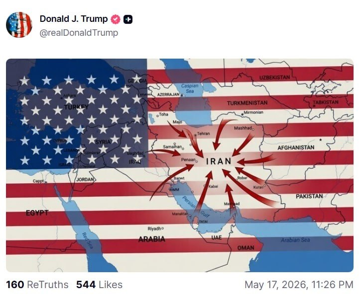

پست جدید ترامپ

💛@Tans_Footbali

---
📅 بروزرسانی: 1405/02/28 01:39
---

## persian_trend_official — post 14366

♨️ دوستان عزیز، با توجه به شرایط پیش‌رو، بهتر است از همین حالا برای سناریوهای اضطراری آماده باشیم. آمادگی یعنی آرامش بیشتر و آسیب کمتر برای خودمان و خانواده‌مان. 🧭

⚠️ چند مورد مهم را جدی بگیرید:

• برای دست‌کم ۱ ماه، آذوقه‌ی غذایی فاسد نشدنی و آب آشامیدنی کافی برای همه اعضای خانواده تهیه کنید. 🥫💧

• همیشه تا جای ممکن باک بنزین خودرو را پر نگه دارید. ⛽️

• اگر نوزاد یا کودک شیرخوار دارید، حتماً به اندازه کافی شیر خشک و لوازم ضروری او را از قبل تهیه کنید. 👶🍼

• اگر در خانواده سالمند یا بیماری دارید که داروی حیاتی مصرف می‌کند، از داروهای ضروری او به میزان کافی ذخیره داشته باشید. 💊

• کوله اضطراری را جدی بگیرید؛ شامل مدارک مهم، مقداری پول نقد، پاوربانک، چراغ‌قوه، باتری، داروهای شخصی، لباس گرم، وسایل بهداشتی و شارژر. 🎒🔦

• مقداری پول نقد همراه داشته باشید؛ در شرایط بحران، دسترسی به کارت بانکی یا اینترنت ممکن است مختل شود. 💵

• دارایی و پول خود را فقط در یک محل متمرکز نکنید و برای شرایط قطع دسترسی، برنامه جایگزین داشته باشید. 🏦

• با اعضای خانواده درباره سناریوهای مختلف صحبت کنید: قطع برق، قطع اینترنت، تخلیه اضطراری و محل‌های امن یا محل تجمع خانوادگی. 👨‍👩‍👧‍👦

• یک رادیوی موج متوسط یا رادیوی باتری‌خور تهیه کنید تا در صورت قطع اینترنت، بتوانید خبرها و اطلاعیه‌های ضروری را دنبال کنید. 📻

• در خانه، شیشه‌ها و پنجره‌های حساس را بررسی و تا جای ممکن محکم‌کاری کنید. در صورت نگرانی از موج انفجار، می‌توان برای کاهش پخش شدن خرده‌شیشه‌ها از چسب نواری پهن به‌صورت ضربدری روی شیشه‌ها استفاده کرد. 🪟

• مدارک مهم، شماره تماس‌های ضروری، آدرس‌ها و اطلاعات حیاتی را هم به‌صورت کاغذی و هم در گوشی ذخیره کنید. 📄📱

• برای چند هفته بی‌برقی و بی‌ارتباطی هم آماده باشید: چراغ‌قوه، پاوربانک، آب، غذا و لوازم اولیه را از قبل کنار بگذارید. ⚠️

آمادگی به معنی ترسیدن نیست؛ یعنی از خانواده‌مان بهتر محافظت کنیم. ❤️

ما در تیم پرشین ترند امیدواریم هیچ اتفاق بدی برای هیچ‌یک از هم‌وطنان‌مان رخ ندهد، اما احتیاط از امروز می‌تواند فردا نجات‌بخش باشد.

📝 Nick

📌 @persian_trend_official
پرشین ترند | متفاوت‌ترین کانال نظامی

## persian_trend_official — post 14365

https://youtu.be/8YQ1YcLyw6E

## OfficialPersiaTwiter — post 499014

برام سواله چطوری همه میدونید که فردا جنگ میشه؟

• A1ich •

@OfficialPersiaTwiter

## bbcpersian — post 281330

  

‌ ‌ ‌ ‌
علیرضا یوسفی، وزنه‌بردار ایرانی وزن بعلاوه ۱۱۰ کیلوگرم موفق شد در جریان مسابقات قهرمانی آسیا رکود دو ضرب جهان را بشکند.

وزنه بردار فوق سنگین ایران روز یکشنبه در حرکت دو ضرب توانست با بالا بردن ۲۶۱ کیلوگرم، ضمن کسب مدال طلای مسابقات آسیایی که اکنون در هند در حال برگزاری است، رکود جهان را بهبود ببخشد.

او پس از شکست رکود جهان روی سکو دوبنده خود را کنار زد تا نوشته روی تی‌شرت مشکی خود را - «شهدای میناب ۱۶۸» - به دوربین و حاضران در ورزشگاه نشان دهد.

او در حرکت یک ضرب سوم شد تا در مجموع صاحب مدال نقره وزن بعلاوه ۱۱۰ کیلوگرم شود.

https://bbc.in/43dSUhn
📷Nasimonline
@BBCPersian

## Tans_Footbali — post 236377

  

رئیس جمهور ترامپ به کانال 13 اسرائیل:
فکر کنم ایرانی ها باید از اتفاقاتی که الان داره میفته بترسن

🔴اونا بايد از من بترسن

💛@Tans_Footbali

## Tans_Footbali — post 236376

  <a href="telegram/content/Tans_Footbali_236376_1779055774.webm" target="_blank">🎬 Download video</a>

💥 با هر ثبت نام ۵۰۰ هزار تومن جایزه بگیرید

✔️ میتونید شرط‌بندی کنید و بونوس را به موجودی واقعی تبدیل کنید

⚽️  پوشش کامل مسابقات ورزشی 

💯  پیش‌بینی با بهترین ضرایب 

⭐️ تجربه سریع و حرفه‌ای

💰پرداخت مستقیم و سریع بدون واسطه، بدون دردسر، واریز و برداشت در سریع‌ترین زمان ممکن

☑️ کانال تلگرام: 

➡️ @winro_io  

🎁 هدیه خود را با ثبت نام در سایت دریافت کنید: 

➡️ Winro.io

سایت اصلی در روزهای آینده بازگشایی خواهد شد
💎

## withyashar — post 11524

  

پست جدید ترامپ در تروث مبنی بر فشار یا حمله همه جانبه به ایران
@withyashar

## withyashar — post 11523

کان نیوز :هرگونه حمله آینده علیه ایران که به تأیید ترامپ برسد، به‌صورت مشترک توسط نیروهای آمریکا و اسرائیل انجام خواهد شد
@withyashar

## withyashar — post 11522

سنتکام : ما تو زمان آتش‌بس با ایران دوباره مسلح شدیم و نیروهامون رو جابه‌جا و مستقر کردیم
@withyashar

---
📅 بروزرسانی: 1405/02/28 00:40
---

## persian_trend_official — post 14364

https://youtube.com/live/2KsilHSCq4o?feature=share

## OfficialPersiaTwiter — post 499011

پست های جدید ترامپ :

• OPT •

@OfficialPersiaTwiter

## OfficialPersiaTwiter — post 499010

دو نفر تو خوابگاه دعواشون شده بود هم‌اتاقی مازندرانیم داشت تعریف می‌کرد،
گفت فلانی با فلانی دعوا افتاد
من گفتم دعوا افتاد؟ دعوارو می‌گیرن
یکی از اونور گفت دعوا گرفت؟ دعوا رو می‌کنن

• Rick Clair •

@OfficialPersiaTwiter

## OfficialPersiaTwiter — post 499009

تکستای این کانال حرف دل هممونه ؛
AlirezaEmami

## OfficialPersiaTwiter — post 499008

🔹 کوثری، عضو کمیسیون امنیت ملی و سیاست خارجی مجلس: امارات اگر بخواهد مسیر ضد ایرانی خود را ادامه دهد، بسیار بیش از این ضرر خواهد کرد

• OPT •

@OfficialPersiaTwiter

## OfficialPersiaTwiter — post 499007

سی‌ان‌ان: ترامپ روز شنبه در باشگاه گلف خود در ویرجینیا با تیم امنیت ملی‌اش دیدار کرد تا درباره جنگ ایران و گام‌های بعدی ممکن، بحث کند

▫️این جلسه با حضور جی‌دی ونس، مارکو روبیو، جان رتکلیف و استیو ویتکاف بود و اندکی پس از بازگشت ترامپ از سفرش به چین برگزار شد.

▫️ترامپ از نحوه مدیریت مذاکرات توسط ایران و ادامه بسته بودن تنگه هرمز که همچنان بر قیمت جهانی نفت تأثیر می‌گذارد، به شدت ناامید شده است.

▫️دولت در طول سفر چین تصمیمات نهایی را به تعویق انداخت و منتظر نتیجه مذاکرات بین ترامپ و رئیس‌جمهور چین ماند تا مسیر روشنی تعیین کند.

▫️انتظار می‌رود ترامپ اوایل این هفته دوباره با تیم امنیت ملی خود دیدار کند زیرا بحث‌ها درباره ایران ادامه دارد.

• OPT •

@OfficialPersiaTwiter

## OfficialPersiaTwiter — post 499005

  <a href="telegram/content/OfficialPersiaTwiter_499005_1779052239.mp4" target="_blank">🎬 Download video</a>

شلیک به ترامپ و نتانیاهو در شبکه افق

• OPT •

@OfficialPersiaTwiter

## OfficialPersiaTwiter — post 499004

ادعای مارکو روبیو، وزیرخارجه ترامپ:

دلیل توقف «پروژه آزادی»، این بود که پاکستان چنین درخواستی کرد. پاکستانی‌ها گفتند: «اگر شما پروژه آزادی را متوقف کنید، فکر می‌کنیم بتوانیم به یک توافق برسیم.»

ما موافقت کردیم و آن را متوقف کردیم.

• OPT •

@OfficialPersiaTwiter

## OfficialPersiaTwiter — post 499003

‏یک خبر خوب در میان تمام خبرهای بد،
ویژه‌ی مبتلایان میگرن (برای چند لحظه حس خوب!)

نتایج یک پژوهش تازه نشان داده افرادی که میگرن دارند، در مقایسه با دیگران با احتمال ۳۰ درصد کمتر به دمانس (زوال عقل) مبتلا می‌شوند و ضمنا احتمال ابتلا به آلزایمر هم در آنها ۴۲ درصد کمتر است.

• علی اصغر هنرمند •

@OfficialPersiaTwiter

## OfficialPersiaTwiter — post 499002

  <a href="telegram/content/OfficialPersiaTwiter_499002_1779052240.mp4" target="_blank">🎬 Download video</a>

اشتباه عجیب در فوتبال برزیل

در آخرین بازی باشگاهی پیش از اعلام فهرست نهایی تیم ملی برزیل برای جام جهانی 2026، سانتوس با نتیجه ۳-۰ برابر کوریتیبا شکست خورد، اما اتفاق عجیب مسابقه به تعویض اشتباهی نیمار برمی‌گشت. او در دقیقه ۶۷ برای مداوای درد از زمین خارج شد، اما داور چهارم به اشتباه تابلوی تعویض شماره ۱۰ را بالا برد و روبینیو جونیور وارد زمین شد. با وجود اینکه مشخص شد این تصمیم اشتباه بوده و قرار نبوده نیمار تعویض شود، به دلیل ورود بازیکن جایگزین دیگر امکان بازگشت وجود نداشت؛ موضوعی که باعث شد نیمار به شدت اعتراض کند و حتی برگه نام بازیکن تعویضی موردنظر سرمربی را مقابل دوربین‌ها نشان دهد.

• OPT •

@OfficialPersiaTwiter

## OfficialPersiaTwiter — post 499001

  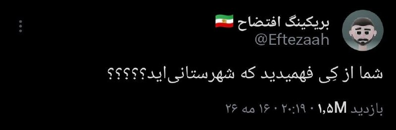

‏روز اول دانشگاه تو تهران
یکی ازم ساعت پرسید
گفتم ده ربع کم
گفت چند ؟
- ده ربع کم
گفت چند؟
ساعتو نشونش دادم
گفت ها یه ربع به دهه

• M kamal •

@OfficialPersiaTwiter

## bbcpersian — post 281329

  <a href="https://t.me/bbcpersian/281329" target="_blank">📎 Download file</a>

🔻 پادکست برنامه شصت دقیقه یکشنبه ۲۷ اردیبهشت ۱۴۰۵

این نسخه رادیویی برنامه شصت دقیقه تلویزیون فارسی بی‌بی‌سی است که هرشب بعد از پخش، با حجم کم از اپلیکیشن‌های پادگیر و صفحه تلگرام بی‌بی‌سی فارسی در دسترس است.

با هشتگ BBCPersianRadio# با ما در ارتباط باشید.

@BBCPersian

## bbcpersian — post 281328

  

‌ ‌ ‌
وزارت خارجه عربستان سعودی در بیانیه‌ای حملات پهپادی امروز به امارات متحده عربی را محکوم کرد.

در حمله‌ای که امروز به نیروگاه هسته‌ای براکه امارات شد، آتش‌سوزی در بخش‌هایی از آن رخ داد.

در این بیانیه عربستان سعودی آمده است که این کشور به «قوی‌ترین» شکل ممکن حمله پهپادی به کشور امارات متحده عربی را محکوم می‌کند.

پیشتر امارات متحده عربی حمله پهپادی را «یک اقدام تروریستی بی‌دلیل» خواند که باعث تشدید تنش در منطقه می‌شود.

وزارت خارجه امارات در بیانیه‌ای «به شدیدترین لحن» این حمله را محکوم کرد و «حق دیپلماتیک و نظامی خود را برای پاسخ به هرگونه تهدید، ادعا یا دشمنی» را محفوظ دانست.

https://bbc.in/4wqBf3o
📷 Emre Caylak/Bloomberg via Getty Images
@BBCPersian

## Lichargoo — post 24899

رز‌ها قرمزند، ویولت‌ها آبی
نت و باز کن کسکش کون گلابی

## thefeedconfig — post 80

واسه اخرین اخبار و جزئیات پروژه میتونید کانال اصلیمو هم عضو بشید

@networkti

چون اینجا فقط کانفیگ و نسخه جدید میزارم

## networkti — post 360

دفید اینجوری کار میکنه:

(عدد هایی که میگم دیفالت هست و قابل تغییر)

هر ده دقیقه میره ۱۵ پیام اخر کانال ها و اکانت های تویتر رو میگیره میاره و اینهارو به یک فرمت خاص توی رم نگه میداره (دیتابیس نداره چون فقط ۱۵ پیام اخر رو نگه میداره)

به هر کانال و یا اکانت تویتر یک عدد اختصاص میده که بهش میگه چنل، این عدد [چنل نامبر یا ch] رو مثل شبکه تلوزیون رو در نظر بگیرید که مثلا میگفتیم شبکه ۴ رو کسی نمیبینه! یا شبکه سه فوتبال داره!، حالا اینجا مثلا شبکه ۳ تو کانفیگ اخبار، وحید انلاین داره!

دیتای هر شبکه رو به چانک های کوچیک و رندم تبدیل میکنه که بهش میگیم بلاک و این بلاک ها بین ۲۰۰ بایت تا ۵۰۰ بایت هستند تا کمترین محدودیت دی ان اس رو داشته باشه

حالا اینو تا اینجا نگه دارید یچیز دیگه توضیح بدم بعد برگردم سراغ این

یک سری شبکه خاص وجود داره توی پروژه که کارشون متفاوت هست

مثلا شبکه 0 کارش برگردوندن متادیتا هست که خیلی مهمه!، این شبکه چی بر میگردونه واقعا؟

- زمان فتچ بعدی کانال ها از تلگرام و تویتر
- یوزرنیم کانال ها و اکانت های تویتر
- شماره شبکشون
- تعداد بلاک های دیتای که دارن
- اخرین ایدی پست و زمان اخرین پست کانال یا اکانت تویتر
- چکسام
- و یک سری چیز که الان یادم نیست

(از اونجایی که دیتا رو به صورت رندم به بلاک های کوچیک بین ۲۰۰ تا ۵۰۰ بایت تقصیم میکنیم هر ده دقیقه تعداد بلاک ها عوض میشه حتی اگر اون کانال پست جدیدی نداشته باشه)

خب پس‌اولین کاری که کلاینت میکنه اینه که میره متا دیتا رو میگیره که لیست کانال هارو نمایش بده

همینطور کلاینت هربار که میخواد یک کانال رو فتچ کنه اول متا دیتا رو فتچ میکنه تا تعداد بلاک های اون کانال و اینکه اصلا پست جدیدی هست یا نه رو بدونه، این متادیتا معمولا بین ۱ تا ۳ بلاک دیتا هست که میشه توی یک شبکه درست حسابی با ۱ تا ۳ کوئری دی ان اس بگیریش. (کلاینت متا دیتا رو واسه خودش تا ۳۰ ثانیه کش میکنه)

حالا وقتی متا دیتا رو داشته باشی میتونی شروع کنی بصورت هم زمان بلاک های دیتای اون کانال تلگرامی و یا تویتری رو بگیری (معمولا کانال ها واسه ۱۵ تا پیام بین ۷ تا ۲۰ بلاک دیتا دارن)، و چون تا ده دقیقه این بلاک ها قراره ثابت باشن (کلاینت هم میدونه کِی اون ده دقیقه تموم میشه) میتونه هی تلاش مجدد کنه و حتی وقتی ریزالور خیلی کند هست هم در نهایت دیتا رو بگیره

یچیز جالب اینه که چون کلاینت فقط واسه گرفتن دیتا نیازه شماره شبکه و شماره بلاک رو بفرسته کوئری ها خیلی کوچیک هست (البته چند بایت رندوم و اورهد انکریپشن و base32 بهش اضافه میشه که بزرگ تر میشه)

کلاینت کلی شبکه معنی دار دیگه هم داره

مثلا شبکه صفر متا دیتاهست
شبکه 1 تا 10,000 واسه دیتای کانال ها و اکانت های تویتر هست

شبکه 10,001 تا فکر‌کنم 50,000 واسه فایل ها هست.

یک‌سری شبکه که عدد هاشو یادم نیست هم شامل این ها هست:

- شبکه واسه گرفتن اخرین ورژن موجود کلاینت
- شبکه واسه گرفتن ادرس ریپو گیتهاب که میشه ازش فایل هارو سریع تر از دی ان اس گرفت
- شبکه واسه گرفتن نام نمایشی کانال ها (متا دیتا فقط یوزرنیم رو داره)
- شبکه مخصوص اپلود پیام! اره دفید میتونه پیام هم بفرسته اگر سرور شخصی داشته باشی، ولی خیلی کنده!
- شبکه مخصوص اینکه بگی میخوام پیام بفرستم!
- و احتمالا چندتا شبکه دیگه که یادم نیست!

یه سری جزئیات دیگه هم هست که من چندتاشو میگم:

- سرور تلاش میکنه شماره شبکه و بلاک های دیتای فایل ها رو دیر به دیر تغییر بده، تا کلاینت فایل های بزرگ هم بتونه دانلود کنه حتی اگر زمان زیادی طول بکشه!

- اگر چند کانال یک فایل تکراری رو بزارن کلاینت متوجه میشه و دوباره دانلود نمیکنه (با سایز فایل و چکسام)

- دیفالت حجم فایل دفید برای رله گیتهاب ۱۵ مگابایت هست و برای دانلود از طریق دی ان اس ۱۰۰ کیلوبایت!

- کلاینت قابلیت ارسال پکت تکراری به چند ریزلور هم زمان رو داره تا سریع تر دیتا رو بگیره
- کلاینت قابلیت گرفتن هم زمان چند بلاک رو داره
- کلاینت وقتی کل بلاک هارو بگیره یک هش که توی متا دیتا بوده رو با پیام ها چک میکنه تا مطمئن بشه دیتا ها ولید هست (این گاهی پیش میاد چون سرور هی داره بلاک های دیتا رو هر ده دقیقه عوض میکنه)
- و کلی چیز دیگه که حتی خودمم یادم نیست ولی قبلا روشون کار‌ کردم

اسکنر چطوری کار‌میکنه؟ اسکنر دفید میره اولین بلاک شبکه متادیتا (0) رو میگیره و ولیدیت میکنه تا مطمئن بشه ریزالور درست کار میکنه و چرتو پرت بر نمیگردونه!

پروژه الان فقط از رکورد TXT استفاده میکنه..

## Pesari_Ke_Konie — post 44960

هعی چخبر بچه ها؟
@saeed_18

## Pesari_Ke_Konie — post 44959

  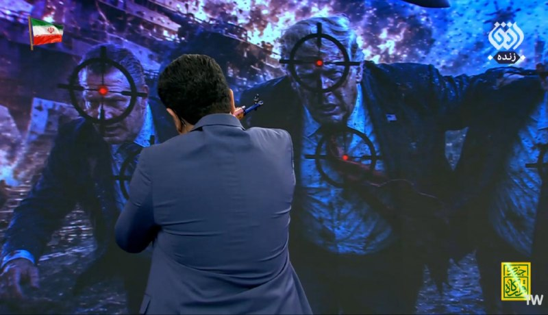

🔴 فوری: امشب تو پخش زنده شبکه افق، نتانیاهو و ترامپ توسط صدا و سیما ترور شدن.

@Pesari_Ke_Konie

## Pesari_Ke_Konie — post 44958

  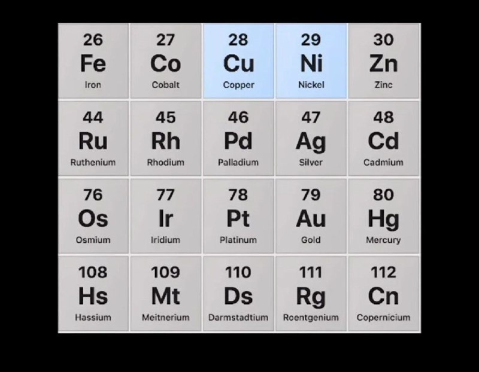

رفیق
تو آسمونا دنبالت می‌گشتم
تو جدول مندلیف پیدات کردم

@Pesari_Ke_Konie

## Tans_Footbali — post 236375

  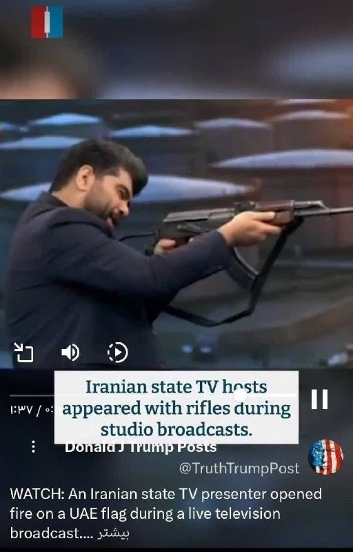

ترامپ لحظه شلیک مجری صداسیما به پرچم امارات رو منتشر کرد و گفت:
«خواهیم دید چه خواهد شد!»

💛@Tans_Footbali

## withyashar — post 11521

ترامپ به کانال ۱۳ اسرائیل:

فکر می‌کنم ایرانی‌ها باید از اون اتفاقی که الان در حال رخ دادنه بترسن.

@withyashar

## withyashar — post 11520

هم اکنون گزارش CNN: ترامپ تیم امنیت ملی ارشد خود را برای بحث در مورد ایران فراخواند
@withyashar

## withyashar — post 11519

پست ترامپ از تیر اندازی به پرچم در تلویزیون ایران فیک است !( این کار انجام شده ولی ترامپ چنین پستی منتشر نکرده ! اکانت فیک ترامپ در X منشع این خبر است

## withyashar — post 11518

  <a href="telegram/content/withyashar_11518_1779052244.mp4" target="_blank">🎬 Download video</a>

مارکو روبیو:

دلیل توقف پروژه آزادی به درخواست پاکستان بود. پاکستانی‌ها گفتند: «اگر شما پروژه آزادی را متوقف کنید، فکر می‌کنیم می‌توانیم به توافق برسیم.»

ما پیش رفتیم و موافقت کردیم که آن را متوقف کنیم.
@withyashar

---
📅 بروزرسانی: 1405/02/27 23:44
---

## thisisermia — post 68

من این پروژه رو از مدتی قبل برای استفاده شخصی توسعه داده بودم و خودم ازش استفاده می‌کردم. حدود ۳ روز پیش منتشرش کردم، اما چند دقیقه بعد ریپو رو private کردم. با توجه به اینکه پروژه‌های مشابه خیلی سریع دست‌به‌دست شدن و شناخته شدن، تصمیم گرفتم نسخه به‌روزشده‌تر…

## thisisermia — post 67

https://github.com/theermia/BaleTunnel یه اسکریپت اپن‌سورس برای تونل کردن ترافیک اینترنت با استفاده از زیرساخت تماس صوتی پیامرسان بله و پروتکل WebRTC هست. توی این روش، دیتا از طریق DataChannel به‌صورت رمزنگاری‌شده منتقل میشه و از بیرون شبیه یه تماس معمولی…

## thisisermia — post 66

https://github.com/theermia/BaleTunnel

یه اسکریپت اپن‌سورس برای تونل کردن ترافیک اینترنت با استفاده از زیرساخت تماس صوتی پیامرسان بله و پروتکل WebRTC هست. توی این روش، دیتا از طریق DataChannel به‌صورت رمزنگاری‌شده منتقل میشه و از بیرون شبیه یه تماس معمولی داخل بله دیده میشه.

برای راه‌اندازیش به یه VPS خارج از کشور و دو تا اکانت پیامرسان بله نیاز دارید (می‌تونید از شماره مجازی هم استفاده کنید). کل توضیحات و مراحل راه‌اندازی داخل ریپازیتوری قرار داده شده.

اگر امکانش رو دارید، می‌تونید یه ویدیو از نحوه راه‌اندازی و استفاده از پروژه تهیه کنید و برامون بفرستید تا برای بقیه هم منتشر کنیم. اگر هم VPNای با این روش ساختید و قصد انتشار عمومی داشتید، از سمت ما مشکلی نیست.

یه پروکسی تست هم با همین روش بالا آوردم که مشخص نیست تا چه زمانی فعال می‌مونه، ولی برای تست می‌تونید ازش استفاده کنید.

طبق تست‌های من با اینترنت ADSL مخابرات و روی سرور دیتاسنتر Infomaniak سوئیس، حدوداً 12Mbps دانلود داده. آپلود رو موفق به تست نشدم و پینگ بین 120 تا 170ms بود.

## persian_trend_official — post 14361

## persian_trend_official — post 14357

  <a href="telegram/content/persian_trend_official_14357_1779048862.mp4" target="_blank">🎬 Download video</a>

خبرهایی درباره انهدام یک پهپاد آمریکایی در یمن /فارس نیوز

🔹برخی رسانه‌ها با انتشار تصاویری، از انهدام یک فروند پهپاد MQ9 ارتش آمریکا در آسمان استان مارب به دست نیروهای مسلح یمن خبر می‌دهند‌.

🔸نیروهای مسلح یمن هنوز بیانیه‌ای در این باره صادر نکرده است.

☆Phantom☆

📌 @persian_trend_official
پرشین ترند | متفاوت‌ترین کانال نظامی

## persian_trend_official — post 14355

تا دقایقی دیگه نسخه هاست داخلی آپلود خواهد شد و لطفا اگر امکانش رو دارید نسخه صوتی رو از طریق همین اپ های پادکست بشنوید. در مصرف حجم بین تلگرام و اپ های پادکست هیچ تفاوتی نیست.
از توجه شما به این موضوع متشکرم
الیاس فرخ

## persian_trend_official — post 14354

نسخه صوتی لایو امشب رو از لینک های زیر بشنوید :

https://open.spotify.com/episode/0WrkfsVN8KUvGUSSHYT887?si=sYOmvpJERuCureVC0TULQQ

https://castbox.fm/vi/946274710

## persian_trend_official — post 14353

  <a href="telegram/content/persian_trend_official_14353_1779048863.mp4" target="_blank">🎬 Download video</a>

دو فروند هواپیمای نیروی دریایی ایالات متحده EA-18G Growler (گونه‌ای از F/A-18) در حین اجرای نمایشی در نمایش هوایی Gunfighter Skies در پایگاه نیروی هوایی Mountain Home در آیداهو با یکدیگر در هوا برخورد کردند.
چهار خدمه با «چهار چتر نجات سالم» موفق به خروج اضطراری شدند.
هواپیماهای برخورد کرده امروز متعلق به تیم نمایشی Growler Demo بودند که از اسکادران VAQ-129 «Vikings» تشکیل شده
این اسکادران همان تیم آموزشی اصلی نیروی دریایی برای خلبانان EA-18G است.

یکی از همین هواگان VAQ-129 قبلاً هم در یک برخورد هوایی دیگر در سال ۲۰۱۷ در پایگاه NAS Fallon آسیب دیده بود و بیش از ۲۰۰۰ ساعت کار تعمیراتی نیاز داشت تا دوباره آماده پرواز شود.

☆Phantom☆

📌 @persian_trend_official
پرشین ترند | متفاوت‌ترین کانال نظامی

## persian_trend_official — post 14352

  <a href="telegram/content/persian_trend_official_14352_1779048865.webm" target="_blank">🎬 Download video</a>

ترامپ قرار است سه‌شنبه با ارشدترین مقامات امنیتی در اتاق وضعیت دیدار کند — Axios دستور جلسه: گزینه‌های نظامی علیه ایران ☆Phantom☆ 📌 @persian_trend_official پرشین ترند | متفاوت‌ترین کانال نظامی

## OfficialPersiaTwiter — post 499000

ادعای سخنگوی وزارت دفاع عربستان:

رهگیری ۳ فروند پهپاد که از حریم هوایی عراق آمده بودند.

• OPT •

@OfficialPersiaTwiter

## OfficialPersiaTwiter — post 498999

‏فقط این رشته‌های طراحی لباس و نمیدونم مدیریت برند و اینارو میشه تو کافه خوند. شما جرات داری برو کافه مقاومت مصالح بخون ببینم گه میفهمی یا نه.

• یانگ استنلی •

@OfficialPersiaTwiter

## OfficialPersiaTwiter — post 498998

بابا من عاشق اینترنتم، تمام زندگیم با اینترنت بوده، هرچی بلدم از نرم افزار، زبان، از سبک زندگی از لباس پوشیدن از سالم زندگی کردن، موزیک‌خوب گوش دادن خوب فیلم دیدن. عاشق خوندن نظرات همه دنیام. از کل دانشگاهی که رفتم اینترنت بیشتر از همش بهم چیز یادداده. یعنی چی آخه؟ بازش کنید دیگه

• Mehrnaz. •

@OfficialPersiaTwiter

## OfficialPersiaTwiter — post 498997

  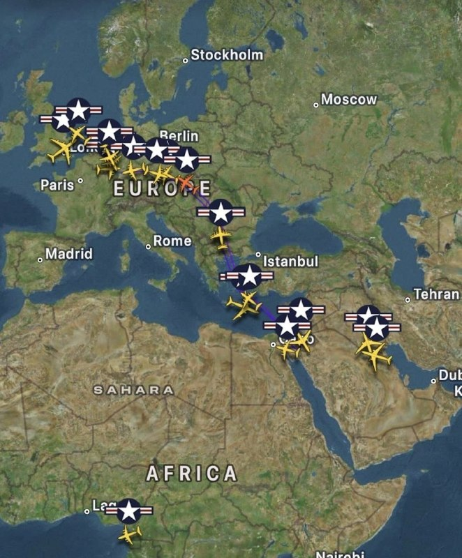

🔺 ادامه رفت و آمد هواپیماهای ترابری ارتش آمریکا به خاورمیانه!

• OPT •

@OfficialPersiaTwiter

## OfficialPersiaTwiter — post 498996

  <a href="telegram/content/OfficialPersiaTwiter_498996_1779048866.mp4" target="_blank">🎬 Download video</a>

برخورد دو جنگنده آمریکایی در نمایش هوایی

دو جنگنده F/A-18 نیروی دریایی ایالات متحده هنگام اجرای نمایش هوایی در آیداهو در میانهٔ هوا با هم برخورد کردند.

تمام خلبانان بیرون پریدند و دیده شدند که با چتر نجات به سلامت فرود می‌آیند.

• OPT •

@OfficialPersiaTwiter

## OfficialPersiaTwiter — post 498995

🔴آموزش و پرورش: آزمون‌های نهایی حداقل ۱۵ روز پس از خروج کشور از حالت غیرعادی و شرایط جنگی با اعلام برنامه امتحانی جدید برگزار خواهد شد.

• OPT •

@OfficialPersiaTwiter

## bbcpersian — post 281327

🔻کشته شدن چندین نفر در لبنان و غزه در حملات هوایی

🔻وزارت بهداشت لبنان می‌گوید که در اثر حملات هوایی روز یکشنبه اسرائیل به مناطقی در جنوب این کشور پنج نفر از جمله دو کودک کشته شدند. در این حملات تعدادی هم مجروح شدند.

گزارش‌ها و تصاویر حاکی از بلند شدن دود سیاه رنگ از محل‌هایی است که هدف قرار گرفته است.

از غزه هم گزارش شده که مقامات بهداشتی می‌گویند که پنج نفر در حملات اسرائیل به این باریکه کشته شدند. بر اساس این گزارش سه نفر در حمله هوایی به یک آشپزخانه عمومی در نزدیکی بیمارستان الاقصی در مرکز غزه کشته شدند.

تحلیلگران می‌گویند که اسرائیل از زمان آتش‌بس با ایران،‌ طی هفته‌های اخیر حملات خود را به غزه افزایش داده است.

ارتش اسرائیل درباره حملات اخیر در لبنان و غزه اظهارنظری نکرده است.

https://bbc.in/4dhWi0J
@BBCPersian

## bbcpersian — post 281323

  <a href="telegram/content/bbcpersian_281323_1779048867.mp4" target="_blank">🎬 Download video</a>

🔻آخرین خبرهای مهم روز یکشنبه ۲۷ اردیبهشت ۱۴۰۵
@BBCPersian

## Pesari_Ke_Konie — post 44957

  

پسرا میتونن اینجوری نگاهتون کنن و فکر کنن روغن ماشین چقدر گرون شده خارشو گاییدم

@Pesari_Ke_Konie

## hamclasixii — post 75411

🔴#فوری | تصمیمات امتحانات خرداد در استان خراسان رضوی:

🔹دوره ابتدایی (پایه اول تا ششم):
    تمام دروس غیرحضوری
🔹متوسطه اول (هفتم و هشتم):
    ۵ درس حضوری (داخلی): عربی، ریاضی، علوم، فارسی، مطالعات اجتماعی
    سایر دروس غیرحضوری
🔹پایه نهم (متوسطه اول):
    همان ۵ درس به‌صورت حضوری و هماهنگ استانی، مابقی غیرحضوری
🔹 پایه دهم:
    تمام دروس حضوری
🔹 پایه یازدهم و دوازدهم:
    منتظر اعلام وزارت آموزش و پرورش (با توجه به تأثیر ۶۰٪ در کنکور)
🔹 هنرستان‌ها:
    دروس کتبی و غیرمهارتی حضوری از ۹ خرداد
    دروس مهارتی و فنی بعد از پایان آموزش حضوری ارزیابی می‌شوند

📚 @hamclasix 📚

## withyashar — post 11517

ادعای فارس : ترامپ با آزادسازی دارایی‌های بلوکه شده مخالفت کرد!
@withyashar

## withyashar — post 11516

صدای پدافند در اهواز
@withyashar

## withyashar — post 11515

کاخ سفید: ترامپ و رئیس جمهور چین به توافق رسیدند که ایران نباید به سلاح هسته‌ای دست یابد و توافق کردند هیچ کشوری نباید برای تنگه هرمز عوارض دریافت کند
@withyashar

## withyashar — post 11514

اکانت رسمی اسرائیل به فارسی: شایدم اصلا چیزی ( جنازه خامنه ای) برای دفن کردن باقی نمونده...
@withyashar

---
📅 بروزرسانی: 1405/02/27 22:52
---

## persian_trend_official — post 14351

  

ترامپ قرار است سه‌شنبه با ارشدترین مقامات امنیتی در اتاق وضعیت دیدار کند — Axios

دستور جلسه: گزینه‌های نظامی علیه ایران

☆Phantom☆

📌 @persian_trend_official
پرشین ترند | متفاوت‌ترین کانال نظامی

## persian_trend_official — post 14350

https://youtube.com/live/2KsilHSCq4o?feature=share

## persian_trend_official — post 14349

حدود ساعت 22 به وقت تهران عزیز لایو امشب رو آغاز میکنیم

## OfficialPersiaTwiter — post 498994

  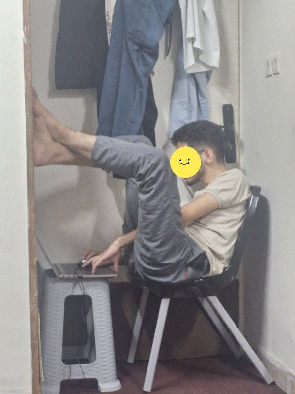

تلاش برای جرعه‌ای نت بین‌الملل تو خوابگاه با پوزیشن استاندارد توسط دانشجوی ارشد
پ.ن: تنها جای اتاق که خط میده اون نقطس

• عطا •

@OfficialPersiaTwiter

## OfficialPersiaTwiter — post 498993

تانکر ترکرز:

در روزهای اخیر، سه نفتکش خالی از محموله که تحریمهای آمریکا شامل حال آنهاست، از خط محاصره نیروی دریایی ایالات متحده عبور کرده و وارد محدوده مورد نظر شدند.

یکی از آنها سامانه AIS خود را برای مدت کوتاهی خاموش کرده بود.

دیگری پرچم روسیه را برافراشته است.

سومی نیز در امتداد خط ساحلی عمان حرکت کرد.

این سه کشتی در مجموع ظرفیت حمل ۱.۹ میلیون بشکه نفت ایران را دارند.

• OPT •

@OfficialPersiaTwiter

## OfficialPersiaTwiter — post 498992

📌محسن رضایی: محاصره دریایی آمریکا را می‌شکنیم

• OPT •

@OfficialPersiaTwiter

## OfficialPersiaTwiter — post 498991

حدوداً ۶ سالم بود که دختر همسایه به دروغ به همه می‌گفت: این بتمن نیست! منم برای دفاع از هویتم، ماسک بتمنم رو زدم، شنلم رو بستم و خودمو از پنجره طبقه اول پرت کردم پایین. هنوز سمت راست سرم یه مقدار کچلی داره از همون شکستگی. 》Alireza Morgan《 @OfficialPersiaTwiter

## OfficialPersiaTwiter — post 498990

🔻ادعای وال استریت ژورنال: ایران یک کشتی پشتیبانی متعلق به یک شرکت امنیتی چین را در نزدیکی تنگه هرمز توقیف کرد

🔹وال استریت ژورنال مدعی شد: ایران یک کشتی پشتیبانی متعلق به یک شرکت امنیتی چین را در نزدیکی تنگه هرمز توقیف کرد

🔹این اقدام به نظر می‌رسد نشانه‌ای باشد مبنی بر اینکه ایران حتی برای کشتی‌هایی که از طرف چین حرکت می‌کنند، اجازه حفاظت مسلحانه نمی‌دهد.

🔹این اولین توقیف یک کشتی امنیتی خصوصی از زمان آغاز جنگ بین آمریکا و ایران است. این حادثه همچنین در زمان حساسی رخ داد.

🔹مالک کشتی، شرکت سینوگاردز (Sinoguards Marine Security)، اعلام کرد که مقامات ایرانی این کشتی را روز پنج‌شنبه توقیف کردند، همان روزی که ترامپ نشستی با شی جین پینگ، رهبر چین، در پکن برگزار کرد.

• OPT •

@OfficialPersiaTwiter

## OfficialPersiaTwiter — post 498989

هر از چندگاهی مچ خودمو درحال ریلز دیدن میگیرم. بی پروای فقیر.

• ST •

@OfficialPersiaTwiter

## OfficialPersiaTwiter — post 498988

تلگرام تو این سیزده سال، به اندازه‌ی یک روز پیام‌رسان‌های داخلی قطعی و اختلال نداشته.

• ژنرال •

@OfficialPersiaTwiter

## OfficialPersiaTwiter — post 498987

ترامپ به اکسیوس: من هنوز معتقدم که ایران خواهان توافق است و منتظر ارسال پیشنهاد به‌روز شده از سوی آنها هستم • OPT • @OfficialPersiaTwiter

## OfficialPersiaTwiter — post 498986

🔴 آکسیوس به نقل از مقام‌های آمریکایی گزارش داد مذاکرات با ایران به بن‌بست رسیده، اما ترامپ همچنان خواهان توافق با تهران است و در صورت رد خواسته‌هایش، گزینه نظامی را ترجیح می‌دهد • OPT • @OfficialPersiaTwiter

## OfficialPersiaTwiter — post 498985

  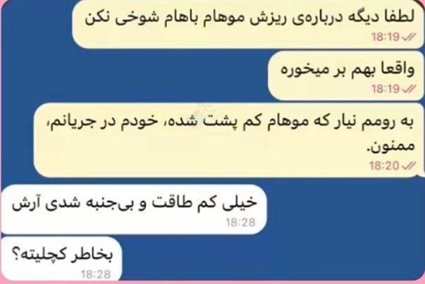

رفاقت پسرا :)))))))))))

• Nahan •

@OfficialPersiaTwiter

## OfficialPersiaTwiter — post 498984

  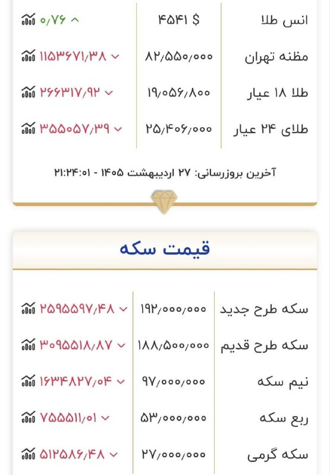

آخرین قیمت سکه و طلا

• OPT •

@OfficialPersiaTwiter

## OfficialPersiaTwiter — post 498983

🔺یدیعوت آحارونوت، به نقل از یک منبع اسرائیلی: اسرائیل در حال آماده‌سازی برای کنترل ناوگان آزادی است که هفته گذشته از ترکیه حرکت کرده و به سمت نوار غزه می‌رود

🔹ما کنترل کشتی‌های ناوگان آزادی را به دست خواهیم گرفت و شرکت‌کنندگان را به زندانی شناور منتقل خواهیم کرد.

کانال ۱۵ اسرائیل:

نتانیاهو در تلاش برای به تعویق انداختن انحلال کنست (پارلمان اسرائیل) است

او در این راستا، روسای ائتلاف را از وضعیت امنیتی و پیامدهای سیاسی آگاه کرد و گفت: «کارهایی هست که باید تمام شوند.»

• OPT •

@OfficialPersiaTwiter

## OfficialPersiaTwiter — post 498982

پزشکیان: روز جهانی ارتباطات را تبریک می‌گویم پزشکیان در شبکه اجتماعی ایکس نوشت: 🔹‏در روزهای جنگ، فرزندان ما در ارتباطات و فناوری اطلاعات، شبانه‌روز ایستادند تا ارتباطات و خدمات حیاتی کشور پایدار بماند. دسترسی باکیفیت و پایدار مردم به خدمات دیجیتال، بخشی…

## bbcpersian — post 281322

🔻خبرنگار اکسیوس به نقل از دو مقام آمریکایی: ترامپ روز سه‌شنبه درباره گزینه اقدام نظامی جلسه خواهد داشت

🔻باراک راوید، خبرنگار اکسیوس به نقل از دو مقام آمریکایی گزارش داد که انتظار می‌رود دونالد ترامپ روز سه‌شنبه جلسه‌ای در «اتاق وضعیت» کاخ سفید با تیم ارشد امنیت ملی خود برگزار کند تا گزینه‌های اقدام نظامی را مورد بررسی قرار دهد.

اتاق وضعیت از اتاق جلسات کاخ سفید است که مجهز به امکانات ارتباط مستقیم رئیس‌جمهور آمریکا با فرماندهی نیروهای این کشور در سراسر جهان است.

این ساعتی پس از آن است که آقای ترامپ در شبکه اجتماعی خود بار دیگر تهدید کرد که فرصت برای ایران در حال تمام شدن است و اگر سریع برای توافق صلح اقدامی نکند،‌ «چیزی برایش باقی نمی‌ماند.»

باراک راوید در شبکه ایکس نوشت که آقای ترامپ به او گفت: ‌‌‌‌‌‌‌‌‌«ما می‌خواهیم به توافق برسیم. آنها در نقطه‌ای که ما می‌خواهیم نیستند. باید به این نقطه برسند وگرنه به شدت ضربه خواهند خورد و آنها این را نمی‌خواهند.»

بنیامین نتانیاهو،‌ نخست وزیر اسرائیل پیشتر گفته بود قرار است امروز،‌ با دونالد ترامپ تلفنی گفت‌وگو کنند.
https://bbc.in/4nT41Gh
@BBCPersian

## Lichargoo — post 24898

  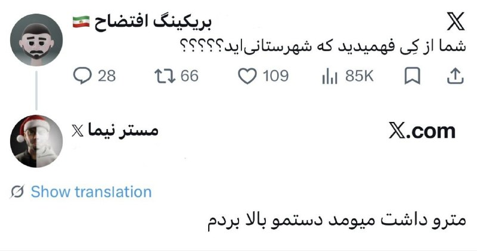

پاره شدم😂😂😂😂

@Lichargoo

## Pesari_Ke_Konie — post 44956

بچه که بودم
فکر میکردم فساد اداری یعنی :
کامندای اداره اونجا همدیگر رو میکنن
الان میگم : ای کاش همدیگر رو بکنن
اینا در واقع دارن ما رو میکنن

@Pesari_Ke_Konie

## Tans_Footbali — post 236374

  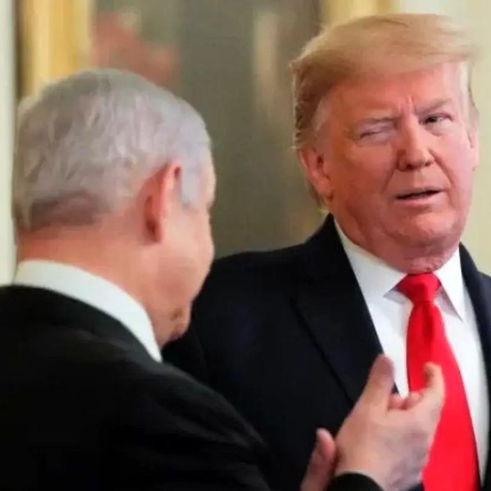

فارس: ترامپ با آزادسازی دارایی‌های بلوکه شده مخالفت کرده

💛@Tans_Footbali

## Bad_chaneli — post 39514

  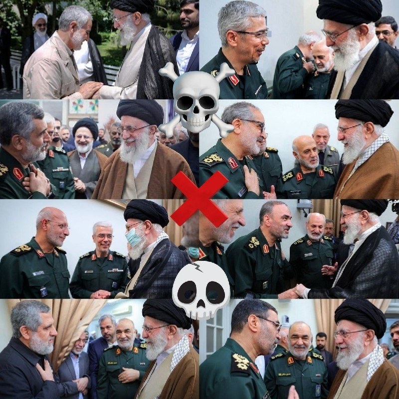

تراپی به درک واصل شدگان در یک قاب

@Bad_chaneli

## hamclasixii — post 75410

🔴 #فوری | برگزاری حضوری آزمون‌ پایه‌های هفتم تا دهم در همدان

🔹در دوره اول متوسطه، پایه‌های هفتم، هشتم، نهم و دهم با مجوز شورای تأمین به‌صورت حضوری برگزار می‌شود، اما درباره پایه‌های یازدهم و دوازدهم، استان منتظر اعلام تصمیم نهایی از سوی ستاد کشوری است.

📚 @hamclasix 📚

## withyashar — post 11513

  <a href="telegram/content/withyashar_11513_1779045734.mp4" target="_blank">🎬 Download video</a>

@withyashar

## withyashar — post 11511

ترامپ: ما می‌خواهیم توافق کنیم. آن‌ها جایی که ما می‌خواهیم نیستند؛ باید به آن نقطه برسند، وگرنه ضربه سختی خواهند خورد، و آنها این را نمی‌خواهند
@withyashar

## withyashar — post 11510

---
📅 بروزرسانی: 1405/02/27 21:31
---

## persian_trend_official — post 14347

دونالد ترامپ: زمان برای جمهوری اسلامی رو به پایان است.
 
دونالد ترامپ، رئیس‌جمهور اِیالات متحده، شامگاه یکشنبه، ۲۷ اردیبهشت‌ماه با انتشار پیامی در شبکه‌ی اجتماعی خود از این خبر داد که ساعت برای جمهوری اسلامی در حال تیک‌تاک است. رئیس‌جمهور آمریکا به رژیم توصیه کرد بهتر است سریع‌تر حرکت کنند، در غیر این صورت چیزی برای آنها باقی نخواهد ماند.
دونالد ترامپ این پیام را دقایقی پس از آن منتشر کرد که رسانه‌های اسرائیلی و آمریکایی از گفت‌وگوی او با بنیامین نتانیاهو، نخست‌وزیر اسرائیل خبر دادند.
تایمز اسرائیل شامگاه یکشنبه گزارش داد بنیامین نتانیاهو، عصر روز یکشنبه و دقایقی پیش از برگزاری یک نشست محدود امنیتی در شامگاه یکشنبه، با دونالد ترامپ، درباره جنگ علیه جمهوری اسلامی گفتگو کرده است.
 

☆Phantom☆

📌 @persian_trend_official
پرشین ترند | متفاوت‌ترین کانال نظامی

## persian_trend_official — post 14346

  <a href="telegram/content/persian_trend_official_14346_1779040878.webm" target="_blank">🎬 Download video</a>

ساعاتی پیش کانال Fighter Bomber رسانه غیررسمی اما معتبر هوانوردی روسیه تصویری از تست پروازی نسخه دوکابین سوخو-۵۷ منتشر کرد. Su-57D؟ Su-57UB؟ Su-57ED؟ هنوز کسی نمی‌داند و این ابهام در مرحله آزمایش اولیه طبیعی است.

Su-57UB = گزینه اول
روسیه برای نسخه‌های دوکابین آموزشی-رزمی سنت تاریخی با پسوند UB دارد؛ مثل سوخو-۲۷UB و میگ-۲۹UB — الگویی شناخته‌شده که مشتریان صادراتی آن را می‌شناسند.

Su-57D = گزینه دوم
پسوند D در روسی به نسخه‌های تخصصی اشاره دارد. اگر مسکو بخواهد نقش رزمی مستقل این پلتفرم را برجسته کند، این گزینه منطقی‌تر می‌شود.

Su-57ED = آخرین گزینه
ترکیب غیرمعمول حروف و اشاره به نسخه صادراتی، این را ضعیف‌ترین گزینه برای نام رسمی داخلی می‌کند.

☆Phantom☆

📌 @persian_trend_official
پرشین ترند | متفاوت‌ترین کانال نظامی

## persian_trend_official — post 14345

  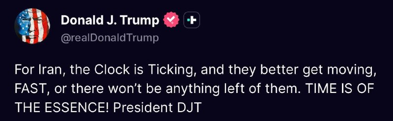

💢 ترامپ:

برای ایران ساعت در حال تیک‌تاک است، و بهتر است خیلی سریع شروع به حرکت کنند، وگرنه هیچ چیزی از آن‌ها باقی نخواهد ماند.

زمان یک عامل حیاتی است!

🫆:Tony

📌 @persian_trend_official
پرشین ترند | متفاوت‌ترین کانال نظامی

## OfficialPersiaTwiter — post 498981

گراهام: پیروزی بر ایران حتی ارزش این را دارد که منصب سیاسی خودم را هم از دست بدهم! مجری: ▫️۷۰ درصد مردم آمریکا در یک نظرسنجی جدید گفته‌اند که از عملکرد اقتصادی ترامپ ناراضی هستند. موضوعی که همیشه مسئله اول برای رای‌دهندگان است. اگر نتیجه این جنگ ایرانِ…

## OfficialPersiaTwiter — post 498980

  <a href="telegram/content/OfficialPersiaTwiter_498980_1779040880.mp4" target="_blank">🎬 Download video</a>

طرف با AI, بازی تاج و تخت رو اونجوری که دلش خنک میشده درست کرده

•دیکتاتور حانیه •

@OfficialPersiaTwiter

## OfficialPersiaTwiter — post 498979

🔴ادعای اکسیوس: به گفته دو مقام آمریکایی، انتظار می‌رود ترامپ روز سه‌شنبه جلسه‌ای در «اتاق وضعیت» با تیم ارشد امنیت ملی خود برگزار کند تا گزینه‌های اقدام نظامی را بررسی کند. • OPT • @OfficialPersiaTwiter

## OfficialPersiaTwiter — post 498978

🔴ادعای ترامپ در گفت‌وگو با کانال ۱۲ اسرائیل: ایران باید از من بترسد

🔹ما منتظر پیشنهاد دیگری از ایران هستیم قبل از اینکه با قدرت بی‌سابقه‌ای به آن‌ها حمله کنیم.

🔹اگر ایران پیشنهاد خوبی ارائه ندهد، به آنها حمله‌ای شدیدی خواهیم کرد.

🔹ایران باید از من بترسد و محتاط باشد!

• OPT •

@OfficialPersiaTwiter

## OfficialPersiaTwiter — post 498977

🔴ادعای اکسیوس:

به گفته دو مقام آمریکایی، انتظار می‌رود ترامپ روز سه‌شنبه جلسه‌ای در «اتاق وضعیت» با تیم ارشد امنیت ملی خود برگزار کند تا گزینه‌های اقدام نظامی را بررسی کند.

• OPT •

@OfficialPersiaTwiter

## OfficialPersiaTwiter — post 498976

دسته‌گل جدید مدیران استقلال؛ قرارداد ۲ میلیون و ۸۰۰ هزار دلاری بازیکنی که به ایران نیامد

🔹شکایت کارلوس استراندبرگ، مهاجم سوئدی-موزامبیکی از استقلال که به‌دلیل ارسال قرارداد با ایمیل رسمی باشگاه رقم خورده، حاشیه‌های زیادی ایجاد کرده است.

🔹طبق آخرین اطلاعاتی که به خبرنگار فارس رسیده، رقم مورد توافق استراندبرگ و استقلال بسیار بیشتر از عدد مطرح شده در برخی رسانه‌هاست و این باشگاه مبلغ ۲ میلیون و ۸۰۰ هزار دلار را به‌عنوان دستمزد مهاجم سوئدی برای دو فصل تعیین کرده است.

• OPT •

@OfficialPersiaTwiter

## OfficialPersiaTwiter — post 498975

احتمال تغییر ساعت رسمی کشور

علی بابایی، رئیس کمیسیون اجتماعی مجلس:

موضوع تغییر ساعت رسمی کشور از طرف دولت است و در مجلس بررسی شده است.
لایحه اصلاح ساعت رسمی در نوبت صحن قرار دارد تا تصویب شود و در روند حفظ انرژی در کشور موثر است.
تغییر ساعت اداری به جای ساعت رسمی کشور، تاثیری ندارد و ساعات اداری تغییر نمی‌کند.

• OPT •

@OfficialPersiaTwiter

## OfficialPersiaTwiter — post 498974

زلنسکی:

امروز ما در مقیاسی بسیار بزرگ علیه مسکو عملیات می‌کنیم.

فاصله تا اهداف این بار بیش از ۵۰۰ کیلومتر است.

جنگ به طور قابل پیش‌بینی به «بندرگاه بومی» خود بازمی‌گردد، و این یک سیگنال واضح است که نباید با اوکراین شوخی کرد.

• OPT •

@OfficialPersiaTwiter

## OfficialPersiaTwiter — post 498973

🔻آتش‌سوزی ساختمان آلومینیوم مهار شد

سخنگوی آتش نشانی تهران:

🔹حریق یک باب مغازه به وسعت ۱۲ متر مملو از کالا در طبقه پنجم ساختمان آلومینیوم بدون مصدوم مهار شد.

• OPT •

@OfficialPersiaTwiter

## OfficialPersiaTwiter — post 498972

مسیر جنوب به شمال تونل توحید امشب مسدود است

🔹مسیر جنوب به شمال تونل توحید امشب از ساعت ۲۴ تا ۵ صبح روز بعد برای تعمیرات مسدود است.

• OPT •

@OfficialPersiaTwiter

## bbcpersian — post 281320

  <a href="https://t.me/bbcpersian/281320" target="_blank">📎 Download file</a>

📻🎙️پادکست برنامه جام جهان‌نما یکشنبه ۲۷ اردیبهشت ۱۴۰۵

در برنامه رادیویی جام‌جهان‌نمای امروز می‌شنوید؛

گمانه‌زنی و التهاب درباره ازسرگیری جنگ آمریکا و اسرائیل با ایران؛ ترامپ در شبکه‌های اجتماعی از آرامش پیش از طوفان گفت، همزمان تهران گفته برای هر نوع واکنش غافل‌گیرانه آماده است.

حمله پهپادی به محوطه نیروگاه هسته‌ای امارات متحده عربی؛ این کشور گفته آتش‌سوزی مهار شده ولی هنوز منشا حمله مشخص نیست. ایران در واکنش گفته این حمله «توطئه دشمن» است.

هم‌زمان، قالیباف، رئیس مجلس، نماینده ویژه جمهوری اسلامی در امور چین هم شد. از کارشناس مسائل ایران می‌پرسیم آیا تغییر معناداری است؟

و در «گپ روز» امشب می‌شنوید:
فهرست بازیکنان دعوت‌شده به تیم ملی فوتبال ایران برای جام جهانی اعلام شد. مقام‌های ارشد فدراسیون فوتبال ایران و فیفا هم در استانبول دیدار کرده‌‌اند.
از خبرنگار ورزشی‌مان می‌پرسیم این فهرست، چندمرده حلاج است؟ شرط و شروط ایران برای شرکت در جام جهانی چه شد؟

این برنامه رادیویی را می‌توانید هر شب ساعت ۲۰ به وقت ایران، روی موج متوسط ۷۰۲ کیلوهرتز و موج کوتاه ۹۴۶۵ کیلوهرتز بشنوید.

@BBCPersian

## bbcpersian — post 281319

  

🔻دونالد ترامپ در شبکه تروث سوشال بدون توضیحی نوشت: «ساعت برای ایران در حال تیک‌تاک است و اگر به‌سرعت عمل نکند، چیزی از آنها باقی نخواهد ماند.»

این درحالیست که وزیر کشور پاکستان، کشوری که میانجی کنونی آیران و آمریکاست، امروز در ایران با محمدباقر قالیباف ملاقات کرده است.

سخنگوی کمیسیون امنیت ملی و سیاست خارجی مجلس امروز گفت: «آمریکا یا باید شرایط جمهوری اسلامی ایران را بپذیرد و تسلیم دیپلمات‌های ما شود و یا اینکه ایران از موضع قدرت با آن مذاکره خواهد کرد و باید تسلیم موشک‌های ما شود.»

او گفت که ایران «از هیچ یک از شروط خود کوتاه نمی‌آید.»
📷Getty Images
https://bbc.in/49SmRXU

@BBCPersian

## kobsihub — post 27754

‏یادش بخیر یه زمانی اینترنت انقدر مفت بود که از ویدیوهای اینستا به عنوان چراغ‌قوه استفاده میکردم

Saad @kobsihub

## Pesari_Ke_Konie — post 44955

  

🔴نروژ مرفه ترین و دایورتی ترین کشور جهان تو سال ۲۰۲۶ شد نروژ این جایگاه رو بخاطر درآمد خفن،وضعیت خوب مردم،آموزش،ثبات اقتصادی و اعتماد عمومی بدست آورده و همینجوری کشکی بالا نیومده

@Pesari_Ke_Konie

## Tans_Footbali — post 236373

  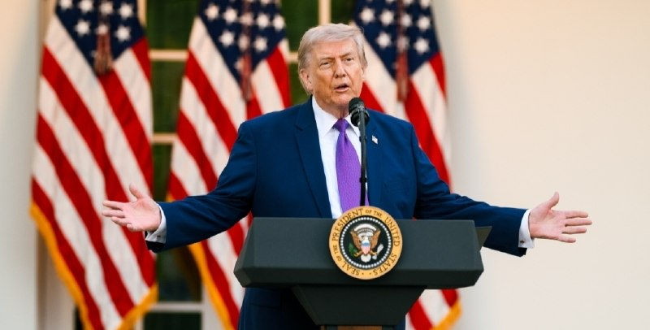

ترامپ به کانال ۱۲ اسرائیل : ما منتظر یه پیشنهاد دیگه از طرف ایران هستیم
- اگه این کار رو نکنن، با شدتی بی‌سابقه هدف حمله قرار میگیرن

💛@Tans_Footbali

## Tans_Footbali — post 236372

ترامپ فردا با تیم امنیتی‌اش جلسه داره تا درباره ادامه دادن جنگ با ایران تصمیم بگیرن - Axios

💛@Tans_Footbali

## Bad_chaneli — post 39512

سپاهیا در برابر مردم بی دفاع
&
سپاهیا در برابر ارتش دیگر کشورها

@Bad_chaneli

## Bad_chaneli — post 39511

  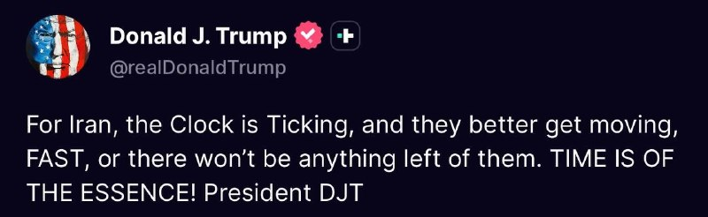

#فوری/ ترامپ:

ساعت برای ایران در حال تیک‌تاک است، و بهتر است خیلی سریع شروع به حرکت کنند، وگرنه هیچ چیزی از آن‌ها باقی نخواهد ماند. زمان یک عامل حیاتی است!

@Bad_chaneli

## hamclasixii — post 75409

🔴 کدهای نظام وظیفه پسران:

🔹 کد ۱ ← برای کسی که کارت پایان خدمت داره.

🔹 کد ۲ ← برای کسی که معافیت داره.

🔹 کد ۴ ← برای کسی که دوازدهمیه.

🔹 کد ۵ ← برای کسی که پشت کنکوریه.

🔹 کد ۹ ← برای دانشجو ها ( کسایی که مشغول به تحصیل هستن یا انصراف دادن یا مرخصی گرفتن )

📚 @hamclasix 📚

## withyashar — post 11509

یاشار فک میکنم عرزشی ها هم منبع معتبر خبریشون تویی 😂 با این حجم ری اکشن هاشون

## withyashar — post 11508

یاشار فک میکنم عرزشی ها هم منبع معتبر خبریشون تویی 😂 با این حجم ری اکشن هاشون

## withyashar — post 11507

رسانه‌های اسرائیلی به نقل از منابعی گزارش دادند حملات به ایران پس از چراغ سبز ترامپ به‌صورت مشترک با آمریکا انجام خواهد شد و بانک اهداف در ایران شامل زیرساخت‌های انرژی است.
@withyashar

## withyashar — post 11506

آکسیوس به نقل از دو مقام آمریکایی:
انتظار میره ترامپ روز سه‌شنبه جلسه‌ای در اتاق وضعیت با تیم ارشد امنیت ملی خود برگزار کنه تا گزینه‌های اقدام نظامی علیه ایران رو بررسی کنه.
@withyashar

## withyashar — post 11505

ترامپ: زمان برای ایران در حال اتمام است بهتر است خیلی سریع اقدام کنند، وگرنه چیزی از آن‌ها باقی نخواهد ماند. وقت بسیار حیاتی است! @withyashar

## withyashar — post 11503

  <a href="telegram/content/withyashar_11503_1779040886.mp4" target="_blank">🎬 Download video</a>

شعر امشب 😬
@withyashar

## withyashar — post 11502

مقامات آمریکایی به اکسیوس گفتند: مذاکرات با ایران به بن‌بست رسیده است
@withyashar

## withyashar — post 11501

ترامپ به کانال 12 اسرائیل:
ما منتظر یه پیشنهاد دیگه از طرف ایران هستیم؛ اگه این کار رو نکنن، با شدتی بی‌سابقه هدف حمله قرار میگیرن.
@withyashar

## withyashar — post 11500

## withyashar — post 11499

گوگوش در پیامی در اینستاگرام اعلام کرد مدال افتخار سال 2026 «جزیره الیس» را دریافت کرده و این جایزه را با «عشق و احترام» به مردم ایران تقدیم می‌کند. @withyashar

## withyashar — post 11498

گوگوش در پیامی در اینستاگرام اعلام کرد مدال افتخار سال 2026 «جزیره الیس» را دریافت کرده و این جایزه را با «عشق و احترام» به مردم ایران تقدیم می‌کند.
@withyashar

---
📅 بروزرسانی: 1405/02/27 20:29
---

## persian_trend_official — post 14344

  

آقای ساعدی نیا
قلب میلیون ها ایرانی همراه شماست.

📌 @persian_trend_official
پرشین ترند | متفاوت‌ترین کانال نظامی

## persian_trend_official — post 14343

## persian_trend_official — post 14341

  

💢در آخرین تصاویر ماهواره ای ناو هواپیمابر آبراهام لینکلن در فاصله ۲۴۵ کیلومتری از ساحل ایران مستقر شده است

🫆:Tony

📌 @persian_trend_official
پرشین ترند | متفاوت‌ترین کانال نظامی

## OfficialPersiaTwiter — post 498970

  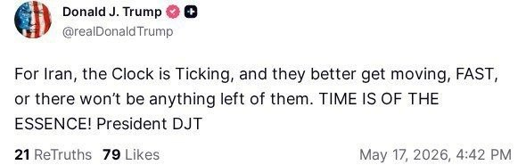

ادعای تکراری ترامپ: برای ایران، زمان در حال گذر است و بهتر است سریع، خیلی سریع حرکت کنند، وگرنه چیزی از آنها باقی نخواهد ماند. وقت فوق‌العاده حیاتی است

• OPT •

@OfficialPersiaTwiter

## OfficialPersiaTwiter — post 498969

سقوط دو کارگر در مخلوط‌کن کارخانه قارچ در مریوان

مدیر مرکز اورژانس دانشگاه علوم پزشکی کردستان:

در این حادثه دو مرد ۲۶ و ۵۲ ساله به دنبال سقوط در دستگاه مخلوط‌کن دچار تروما و شکستگی‌های متعدد شدند.

نیروهای اورژانس پس از ارزیابی اولیه، اقدامات درمانی پیش‌بیمارستانی از جمله تثبیت وضعیت حیاتی، کنترل آسیب‌ها و بی‌حرکت‌سازی اندام‌های آسیب‌دیده را در محل انجام دادند./ مهر

• OPT •

@OfficialPersiaTwiter

## OfficialPersiaTwiter — post 498968

🔻علی پروین در بیمارستان بستری شد

🔹پروین چندی پیش هم به دلیل مشابه در بیمارستان بستری شد اما پیگیری‌ها نشان می‌دهد که خوشبختانه شرایط جسمانی او پایدار است و مشکل خاصی وجود ندارد.

• OPT •

@OfficialPersiaTwiter

## OfficialPersiaTwiter — post 498967

🔹 معاون وزیر کشور: بخشی از اختیارات تخصیص ارز به استانداران واگذار می‌شود

• OPT •

@OfficialPersiaTwiter

## OfficialPersiaTwiter — post 498966

  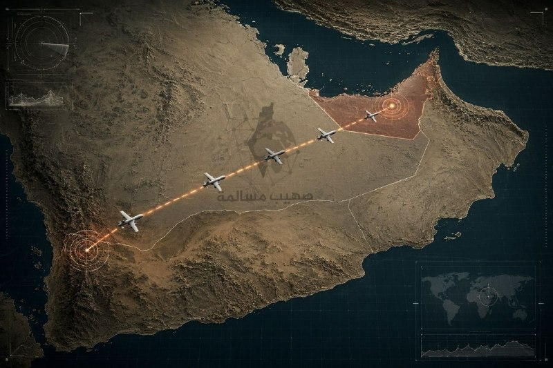

زیر نویس شبکه خبر هشدار درباره عملیات غیرموجه علیه کشورهای منطقه و انتساب آن به ایران 🔹️یک مقام آگاه نظامی: ایران همه کشورهای منطقه را از افتادن در این دام رژیم صهیونیستی برحذر می‌دارد. • OPT • @OfficialPersiaTwiter

## OfficialPersiaTwiter — post 498965

  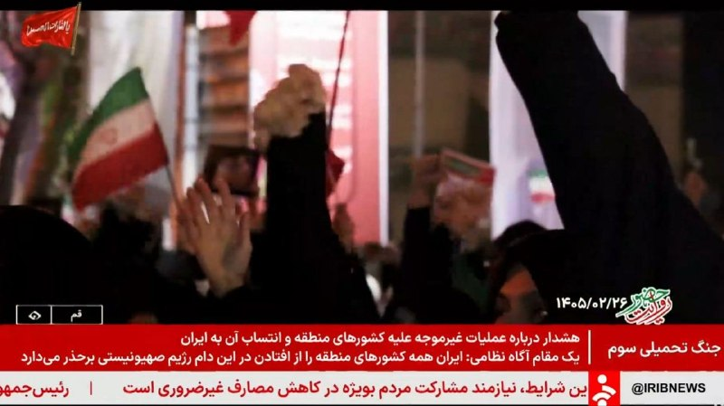

گفتگوی تلفنی وزیر خارجه امارات با گروسی درباره جزئیات حمله پهپادی به امارات عبدالله بن زاید آل نهیان، وزیر خارجه امارات متحده عربی پس از حمله پهپادی در نزدیکی نیروگاه هسته‌ای این کشور با رافائل گروسی، رئیس آژانس بین‌المللی انرژی اتمی تلفنی گفتگو کرد. وزیر…

## OfficialPersiaTwiter — post 498964

  

اکبر عبدی از بخش مراقبت‌های ویژه خارج شد دختر اکبر عبدی از بهبود وضعیت عمومی این بازیگر خبر داد و اعلام کرد که او از بخش مراقبت‌های ویژه (ICU) ترخیص شده است. به گفته او، احتمال دارد اکبر عبدی تا یکی دو روز آینده از بیمارستان مرخص شود. 》OPT《 @OfficialPersiaTwiter

## OfficialPersiaTwiter — post 498963

  

پسرا میتونن اینجوری نگاهتون کنن و فکر کنن روغن ماشین چقدر گرون شده

• iman •

@OfficialPersiaTwiter

## OfficialPersiaTwiter — post 498962

گراهام: پیروزی بر ایران حتی ارزش این را دارد که منصب سیاسی خودم را هم از دست بدهم!

مجری:
▫️۷۰ درصد مردم آمریکا در یک نظرسنجی جدید گفته‌اند که از عملکرد اقتصادی ترامپ ناراضی هستند. موضوعی که همیشه مسئله اول برای رای‌دهندگان است. اگر نتیجه این جنگ ایرانِ غیرهسته‌ای باشد، آیا ارزشش را دارد که انتخابات میان‌دوره‌ای را از دست بدهید؟

لیندسی گراهام:
▫️ارزشش را دارد که (حتی) منصب خودم را هم از دست بدهم. اگر لازم باشد که شغلم را از دست بدهم، ولی در عوض مطمئن شویم که ایران هیچ وقت به سلاح هسته‌ای نمیرسد، این کار را انجام می‌دهم.

• OPT •

@OfficialPersiaTwiter

## OfficialPersiaTwiter — post 498961

‏قبلا دم گاو برای خودش شخصیتی داشت، الان شده چند گیگ اینترنت و چند دقیقه ریلز دیدن تو اینستا

• Arman •

@OfficialPersiaTwiter

## bbcpersian — post 281318

🔻امارات «حمله پهپادی» به نزدیکی نیروگاه هسته‌ایش را «تروریستی» خواند

🔻امارات متحده عربی حمله پهپادی به نزدیکی نیروگاه هسته‌ای براکه را «یک اقدام تروریستی بی‌دلیل» خواند که باعث تشدید تنش در منطقه می‌شود.

وزارت خارجه امارات متحده در بیانیه‌ای «به شدیدترین لحن» این حمله را محکوم کرد و «حق دیپلماتیک و نظامی خود را برای پاسخ به هرگونه تهدید، ادعا یا دشمنی» را محفوظ دانست.

در بیانیه وزارت خارجه امارات به منشا این حمله اشاره‌ای نشده اما آمده است که یک ژنراتور برق، خارج از محدوده داخلی نیروگاه هسته‌ای براکه در منطقه ظفره، هدف پهپادی قرار گرفت که از مرز غربی وارد امارات شده بود.

وزارت خارجه امارات این حمله را «تشدید خطرناک تنش‌ها،‌ اقدام تجاوزکارانه غیرقابل و تهدید مستقیم برای امنیت» خود و نقض آشکار قوانین بین‌المللی خواند.

تنش لفظی ایران و امارات اخیرا شدت گرفته است.

امارات جمعه گفت ایران در طول جنگ با آمریکا و اسرائیل،‌ بیش از سه هزار حمله به تاسیسات غیرنظامی‌اش کرده است.

عباس عراقچی، وزیر خارجه، امارات متحده را به داشتن نقش فعال در حملات آمریکا و اسرائیل به ایران متهم کرده است. ایران می‌گوید فقط به تاسیسات نظامی و نهادهای مرتبط با آمریکا و اسرائیل در امارت حمله کرده است.

https://bbc.in/3PnCZdc
@BBCPersian

## bbcpersian — post 281309

🔻یک روز پس از به نمایش درآمدن فیلم «تمرین‌هایی برای یک انقلاب»، ساخته پگاه آهنگرانی در هفتاد و نهمین جشنواره فیلم کن، عوامل تولید و ساخت این فیلم مقابل دوربین رسانه‌ها قرار گرفتند.

پس از نمایش دیروز که با استقبال تماشاچیان همراه بود،‌ خانم آهنگرانی اثر خود را به مادرانی تقدیم کرد که فرزندانشان را در راه مبارزه برای آزادی از دست داده‌اند.

کاوه فرنام و آدریا مونس تهیه کنندگان فیلم «تمرین‌هایی برای یک انقلاب» هستند و تدوین آن با آرش آشتیانی بوده است.

پگاه آهنگرانی که خود راوی این فیلم است می‌گوید که از میان پنج پرتره از خویشاوندان و استادانش و پنج شکل از مقاومت، در این فیلم داستان زندگی خودش را روایت کرده است.

به گفته خانم آهنگرانی او با استفاده از آرشیوهای شخصی، ویدئوهای خانگی، تصاویر اعتراضات خیابانی، روزنامه‌ها و صداهای ضبط‌ شده، بیش از ۴۰ سال از تاریخ ایران را بازخوانی ‌کرده است.

📷Corbis via Getty Images/ AFP via Getty Images/ Getty Images/ EPA/ BBC Images

@BBCPersian

## bbcpersian — post 281307

جنگ و پیامدهایشان چه تاثیری روی وضعیت مسکن شما گذاشته است؟ آیا پس از جنگ مجبور به اسباب‌کشی شده‌اید؟
بر اساس ارزیابی وزارت کار ایران، جنگ جنگ آمریکا و اسرائیل با ایران موجب بیکاری مستقیم و غیرمستقیم دو میلیون نفر شده است. از دست دادن شغل و کاهش درآمد برای آنها که در خانه‌های اجاره‌ای زندگی می‌کنند بسیار دشوارتر است.
اگر مستأجرید و در هفته‌های اخیر به دلایل اقتصادی مجبور به اسباب‌کشی شده‌اید، تجربیاتتان را با ما در میان بگذارید. جنگ چه تأثیری روی درآمد شما گذاشت؟ واکنش صاحبخانه‌ چه بود؟ آیا خانه جدیدی اجاره کردید یا به خانه خانواده یا دوستان رفتید؟ این ماجرا چه تاثیری بر روحیه و سلامت روان شما گذاشته است؟
اگر تجربه و مشاهده‌ای از اجاره‌نشینی دارید، با هشتگ #مسکن برای ما بفرستیدبه:
آی‌مسج و واتس‌اپ: ۰۰۴۴۷۳۴۲۰۳۲۱۱۳
پیامگیر تلگرام:t.me/bbcshoma

📷 ایرنا
عصر ایران

@BBCPersian
https://bbc.in/43cTEDl

## bbcpersian — post 281306

  

‌🔻سخنگوی کمیسیون امنیت ملی و سیاست خارجی مجلس گفت: «آمریکا یا باید شرایط جمهوری اسلامی ایران را بپذیرد و تسلیم دیپلمات‌های ما شود و یا اینکه ایران از موضع قدرت با آن مذاکره خواهد کرد و باید تسلیم موشک های ما شود.»

او گفت که ایران «از هیچ یک از شروط خود کوتاه» نمی‌آید.

امروز خبرگزاری‌های ایران گزارش‌هایی از شروط آمریکا در پاسخ به پیشنهادهای ایران منتشر کردند.

خبرگزاری مهر امروز نوشت: «آمریکا بدون دادن هیچ امتیاز ملموسی به ایران خواهان گرفتن امتیازاتی است که در جنگ موفق به تحقق آن نشده است.»

در همین حال، گزارش‌هایی هم منتشر شد که ایران پاسخ خود را به پاکستان منتقل کرده است.

📷Mizan
https://bbc.in/4nDeg19

@BBCPersian

## Lichargoo — post 24897

وضعیت جوریه که پورن دیدن، گرون تر از جنده کردنه.

## hamclasixii — post 75408

  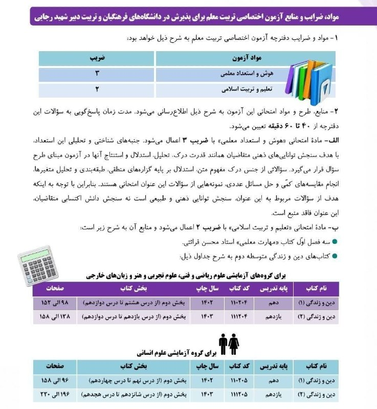

NOTESar1405_v1.pdf

## withyashar — post 11497

ترامپ: زمان برای ایران در حال اتمام است بهتر است خیلی سریع اقدام کنند، وگرنه چیزی از آن‌ها باقی نخواهد ماند. وقت بسیار حیاتی است! @withyashar

## withyashar — post 11496

  

ترامپ: زمان برای ایران در حال اتمام است

بهتر است خیلی سریع اقدام کنند، وگرنه چیزی از آن‌ها باقی نخواهد ماند.
وقت بسیار حیاتی است!

@withyashar

## withyashar — post 11495

  <a href="telegram/content/withyashar_11495_1779037177.webm" target="_blank">🎬 Download video</a>

🎬 Video

## withyashar — post 11494

اتحاد باید شکل بگیره ! حتی بچه هیئتی ! تغییر رژیم شکل میگیره ولی تغییر عقیده کار یک شبه نیست و باید هر دو سمت شل کنند ! من خودم کافرم ولی تیم باید تکمیل باشه ! آس پیک شخص شاهزاده رضا پهلوی تنها هستش ! ترامپم مارو میره قاهره شک نکنید !

## withyashar — post 11493

محمد پروین دوست خوبمه امیدوارم با تغییر جهت به سمت مردم برگردند

## withyashar — post 11492

  <a href="telegram/content/withyashar_11492_1779037179.webm" target="_blank">🎬 Download video</a>

علی پروین در بیمارستان بستری شد علی پروین پیشکسوت باشگاه پرسپولیس برای دومین بار در ماه اخیر در بیمارستان بستری شد. پروین به دلیل چکاپ پیگیری برخی از موارد پزشکی مرتبط با خود در بیمارستان بستری شده و نزدیکان او معتقد هستند که احتمالاً تا یکی دو روز آینده…

## withyashar — post 11491

علی پروین در بیمارستان بستری شد

علی پروین پیشکسوت باشگاه پرسپولیس برای دومین بار در ماه اخیر در بیمارستان بستری شد.

پروین به دلیل چکاپ پیگیری برخی از موارد پزشکی مرتبط با خود در بیمارستان بستری شده و نزدیکان او معتقد هستند که احتمالاً تا یکی دو روز آینده از بیمارستان مرخص می‌شود.
@withyashar

## withyashar — post 11490

شبکه عبری کان: نتانیاهو و ترامپ، بیش از نیم ساعت با یکدیگر تلفنی گفت‌وگو کردند و در مورد امکان از سرگیری درگیری‌ها در ایران و همچنین سفر ترامپ به چین بحث و تبادل نظر نمودند
@withyashar

---
📅 بروزرسانی: 1405/02/27 19:28
---

## persian_trend_official — post 14340

  <a href="telegram/content/persian_trend_official_14340_1779033498.webm" target="_blank">🎬 Download video</a>

🚨 شبکه 13 اسرائیل:
بنیامین نتانیاهو از دقایقی پیش در تماس تلفنی ویژه با دونالد ترامپ درباره تحولات اخیر منطقه و درگیری‌های مرتبط با ایران و گروه‌های وابسته به آن در حال گفت‌وگوست.

☆Phantom☆

📌 @persian_trend_official
پرشین ترند | متفاوت‌ترین کانال نظامی

## persian_trend_official — post 14339

  

🔴دفاع عضو شورای عالی فضای مجازی از فیلترینگ، پایان گمنامی و اینترنت طبقاتی / «در صورت خروج از شرایط جنگی، واتس‌اپ باز می‌شود»

🔹 رسول جلیلی، عضو شورای عالی فضای مجازی، از ادامه محدودیت پلتفرم‌های خارجی، پایان گمنامی کاربران و اینترنت طبقاتی دفاع کرد؛ طرح‌هایی که ظاهراً قرار است اینترنت را از همیشه «کنترل‌شده‌تر» کنند.

🔹 او با اشاره به شرایط امنیتی اخیر گفت بعد از این اتفاقات نمی‌توان دوباره به سمت بازگشایی کامل سکوهای خارجی رفت و مدعی شد برخی سیاسیون در سال‌های گذشته مانع فیلترینگ کامل شده‌اند.

🔹 جلیلی همچنین ادعای فروش VPN توسط نهادهای حاکمیتی را رد کرد و گفت نیاز اصلی مردم فقط خدمات ارتباطی است؛ خدماتی که به گفته او در پیام‌رسان‌های داخلی هم وجود دارد، هرچند بسیاری از کاربران و کسب‌وکارها هنوز ترجیح می‌دهند جایی فعالیت کنند که مخاطب واقعی حضور دارد.

🔹 عضو شورای عالی فضای مجازی در ادامه اعلام کرد در صورت خروج کشور از شرایط جنگی، امکان بازگشایی دوباره واتس‌اپ وجود دارد.

🔹 او در پایان از پایان «گمنامی» کاربران و اینترنت طبقاتی دفاع کرد؛ موضوعی که همچنان با انتقادهای گسترده‌ای روبه‌روست.

☆Phantom☆

📌 @persian_trend_official
پرشین ترند | متفاوت‌ترین کانال نظامی

## persian_trend_official — post 14338

افزایش ساعت معاملات سهام در روزهای ۲۹ و ۳۰ اردیبهشت ۱۴۰۵ مدیر نظارت بر بورس‌های سازمان بورس و اوراق بهادار اعلام کرد: 💢به منظور مدیریت بازگشایی نماد شرکت‌های با افشای اطلاعات با اهمیت نوع «الف» و شرکت‌هایی که مجامع خود را در دوره توقف بازار سهام برگزار کرده‌اند،…

## persian_trend_official — post 14337

افزایش ساعت معاملات سهام در روزهای ۲۹ و ۳۰ اردیبهشت ۱۴۰۵

مدیر نظارت بر بورس‌های سازمان بورس و اوراق بهادار اعلام کرد:

💢به منظور مدیریت بازگشایی نماد شرکت‌های با افشای اطلاعات با اهمیت نوع «الف» و شرکت‌هایی که مجامع خود را در دوره توقف بازار سهام برگزار کرده‌اند، یک ساعت به زمان معاملات سهام و ابزارهای مرتبط با سهام در بورس تهران و فرابورس ایران اضافه می‌شود.

💢بر این اساس، معاملات در روزهای سه‌شنبه و چهارشنبه ۲۹ و ۳۰ اردیبهشت تا ساعت ۱۳:۳۰ ادامه خواهد داشت.

🫆:Tony

📌 @persian_trend_official
پرشین ترند | متفاوت‌ترین کانال نظامی

## persian_trend_official — post 14336

  

🔴 نیویورک‌تایمز: اسرائیل دو پایگاه مخفی در بیابان عراق اداره کرده است

💢روزنامه نیویورک‌تایمز مدعی شد اسرائیل طی بیش از یک سال گذشته به‌صورت متناوب دو پایگاه مخفی در بیابان‌های عراق را اداره کرده است.

بر اساس این گزارش:

▪️ برنامه‌ریزی این پایگاه‌ها از اواخر سال ۲۰۲۴ آغاز شده بود
▪️ هدف از ایجاد آن‌ها پشتیبانی از عملیات علیه ایران عنوان شده است
▪️ این پایگاه‌ها به‌صورت محرمانه مورد استفاده قرار می‌گرفتند

نیویورک‌تایمز همچنین مدعی شد:

▪️ آمریکا از ارتش عراق خواسته بود سامانه‌های راداری خود را غیرفعال کند
▪️ هدف از این اقدام جلوگیری از شناسایی حضور اسرائیل در خاک عراق بوده است

💢تاکنون بغداد، واشینگتن و تل‌آویو واکنش رسمی به این ادعاها نشان نداده‌اند.

🫆:Tony

📌 @persian_trend_official
پرشین ترند | متفاوت‌ترین کانال نظامی

## persian_trend_official — post 14335

  <a href="telegram/content/persian_trend_official_14335_1779033501.mp4" target="_blank">🎬 Download video</a>

🔴تصادف‌ زنجیره‌ای در جاده انار - یزد ۲ کشته و ۱۰ مصدوم برجا گذاشت

💢اورژانس شهرستان انار استان کرمان اعلام کرد که یک تصادف زنجیره‌ای امروز(یکشنبه) در جاده انار کرمان یزد پس از شرایط نامساعد جوی و توفان شن، ۲ کشته و ۱۰ مصدوم برجای گذاشت و یک تریلر هم در آتش سوخت.

🫆:Tony

📌 @persian_trend_official
پرشین ترند | متفاوت‌ترین کانال نظامی

## persian_trend_official — post 14334

  

🔴ولی الله بیاتی نماینده مجلس:

💢در صورت اشغال شدن یکی از جزایر خود، کشور امارات را اشغال خواهیم کرد

🫆:Tony

📌 @persian_trend_official
پرشین ترند | متفاوت‌ترین کانال نظامی

## OfficialPersiaTwiter — post 498960

  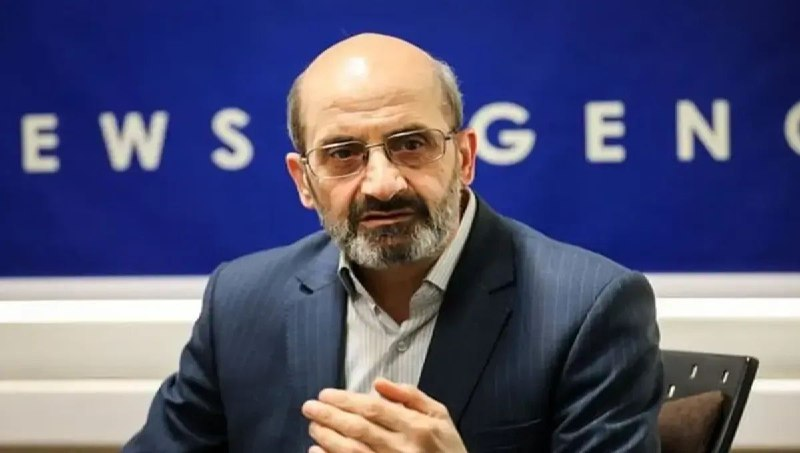

دفاع عضو شورای عالی فضای مجازی از فیلترینگ، پایان گمنامی و اینترنت طبقاتی / «در صورت خروج از شرایط جنگی، واتس‌اپ باز می‌شود»

🔹 رسول جلیلی، عضو شورای عالی فضای مجازی، از ادامه محدودیت پلتفرم‌های خارجی، پایان گمنامی کاربران و اینترنت طبقاتی دفاع کرد؛ طرح‌هایی که ظاهراً قرار است اینترنت را از همیشه «کنترل‌شده‌تر» کنند.

🔹 او با اشاره به شرایط امنیتی اخیر گفت بعد از این اتفاقات نمی‌توان دوباره به سمت بازگشایی کامل سکوهای خارجی رفت و مدعی شد برخی سیاسیون در سال‌های گذشته مانع فیلترینگ کامل شده‌اند.

🔹 جلیلی همچنین ادعای فروش VPN توسط نهادهای حاکمیتی را رد کرد و گفت نیاز اصلی مردم فقط خدمات ارتباطی است؛ خدماتی که به گفته او در پیام‌رسان‌های داخلی هم وجود دارد، هرچند بسیاری از کاربران و کسب‌وکارها هنوز ترجیح می‌دهند جایی فعالیت کنند که مخاطب واقعی حضور دارد.

🔹 عضو شورای عالی فضای مجازی در ادامه اعلام کرد در صورت خروج کشور از شرایط جنگی، امکان بازگشایی دوباره واتس‌اپ وجود دارد.

🔹 او در پایان از پایان «گمنامی» کاربران و اینترنت طبقاتی دفاع کرد؛ موضوعی که همچنان با انتقادهای گسترده‌ای روبه‌روست.

• OPT •

@OfficialPersiaTwiter

## OfficialPersiaTwiter — post 498959

ترامپ و نتانیاهو امروز به صورت تلفنی گفتگو خواهند کرد نتانیاهو: ۶۰ درصد غزه در کنترل ماست، ماموریت ما یکی است: اطمینان حاصل کنیم که غزه دیگر تهدیدی برای اسرائیل نخواهد بود برای هر سناریویی با ایران آماده‌ایم امروز با ترامپ صحبت خواهم کرد تا برداشت‌هایش از…

## OfficialPersiaTwiter — post 498956

آنالیز تصاویر ماهواره ای نشان می دهد ناو هواپیمابر آبراهام لینکلن در فاصله ۲۴۵ کیلومتری از ساحل ایران مستقر شده است

• OPT •

@OfficialPersiaTwiter

## OfficialPersiaTwiter — post 498955

🔴سخنگوی وزارت دفاع:

نیروهای مسلح آماده پاسخگویی به هرگونه تهدید و تعرضی هستند.

• OPT •

@OfficialPersiaTwiter

## OfficialPersiaTwiter — post 498954

طوفانی با سرعت ۹۷ کیلومتر در ساعت سبزوار را درنوردید. / مهر

• OPT •

@OfficialPersiaTwiter

## OfficialPersiaTwiter — post 498953

امارات: هنوز منشأ حمله پهپادی به ما مشخص نیست/مورد حمله سه پهپاد قرار گرفتیم وزارت دفاع امارات متحده عربی: 🔹ما با سه پهپاد که از مرز غربی وارد شده بودند، مقابله کردیم و با موفقیت دو فروند از آنها را رهگیری کردیم. 🔹یکی از پهپادها به یک ژنراتور برق در خارج…

## OfficialPersiaTwiter — post 498952

  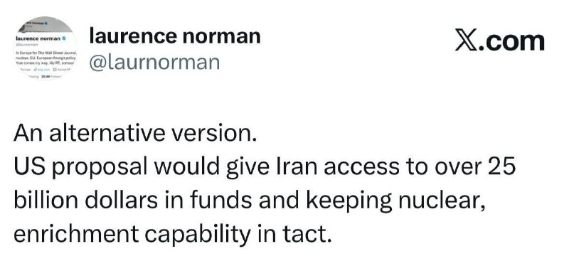

لارنس نورمن، خبرنگار وال استریت ژورنال: نسخه جایگزین پیشنهاد ایالات متحده به ایران دسترسی به بیش از ۲۵ میلیارد دلار و حفظ قابلیت غنی‌سازی هسته‌ای را می‌دهد

• OPT •

@OfficialPersiaTwiter

## OfficialPersiaTwiter — post 498951

چهار دسته شرکتی که نمادشان تعلیق می‌شود 🔹جعفری، مدیر نظارت بر ناشران سازمان بورس، در تشریح سازوکار تعلیق نماد معاملاتی برخی شرکت‌ها بورس 24 گفت: نمادهایی که تعلیق می‌شوند در چهار دسته قرار می‌گیرند. 🔹دسته اول: شرکت‌هایی که به‌صورت مستقیم و در اثر حمله دشمن…

## OfficialPersiaTwiter — post 498950

  

سلفی بنیانگذار و مدیرعامل شیائومی با ایلان ماسک که سوژه رسانه‌ها شد • OPT • @OfficialPersiaTwiter

## OfficialPersiaTwiter — post 498949

سه سهمیه مستقیم لیگ نخبگان برای ایران

با شکست النصر در فینال لیگ آسیا2026، پرونده امتیازگیری باشگاه‌های غرب آسیا برای دو فصل بعد بسته شد و حالا ایران به‌صورت قطعی صاحب سه سهمیه لیگ نخبگان2027 و یک سهمیه لیگ آسیا2027 خواهد بود.

• OPT •

@OfficialPersiaTwiter

## OfficialPersiaTwiter — post 498948

  

اگه یادتون باشه زمانی که نات کوین تبدیل به پول شد یه ربات دیگه اومد که اسمش بلوم بود که اکثرا تو تلگرام داشتن ازش استخراج میکردند و خیلی معروف شده بود

امروز مالکش به جرم کلاهبرداری در روسیه دستگیر شد!

》OPT《

@OfficialPersiaTwiter

## OfficialPersiaTwiter — post 498947

‏این VPN که جدیدا وصل میشه اگه مستقیم نگاش کنید وصل نمیشه، گوشی رو بذارید یه گوشه یواشکی زیرچشمی نگاش کنید وصل میشه.

》milad《

@OfficialPersiaTwiter

## OfficialPersiaTwiter — post 498946

  <a href="telegram/content/OfficialPersiaTwiter_498946_1779033507.mp4" target="_blank">🎬 Download video</a>

تصادف‌ زنجیره‌ای در جاده انار - یزد ۲ کشته و ۱۰ مصدوم برجا گذاشت

🔹اورژانس شهرستان انار استان کرمان اعلام کرد که یک تصادف زنجیره‌ای امروز(یکشنبه) در جاده انار کرمان یزد پس از شرایط نامساعد جوی و توفان شن، ۲ کشته و ۱۰ مصدوم برجای گذاشت و یک تریلر هم در آتش سوخت.

》OPT《

@OfficialPersiaTwiter

## bbcpersian — post 281305

🔻شبکه خبر ایران به نقل از مقام نظامی: حمله به نزدیکی تاسیسات هسته‌ای امارات، تله دشمن است

🔻شبکه خبر صداوسیما از قول یک مقام آگاه نظامی که نامش را نبرد گفت حمله به نزدیکی تاسیسات هسته‌ای امارات «توطئه» و «تله دشمن» است.

بنابر این گزارش، این مقام نظامی گفت آمریکا و اسرائیل تلاش می‌کنند با عملیات‌ «غیرموجه علیه کشورهای منطقه و نسبت دادن آن به جمهوری اسلامی ایران خود را از باتلاق خودساخته برهانند و از بن بستی که قرار گرفته‌اند خارج کنند.»

او «این توطئه صهیونیستی» را محکوم کرد و همه طرف‌ها از «افتادن در تله دشمن و هر گونه رفتار یا گفتارو نسنجیده برحذر» داشت.

https://bbc.in/4tFeZjK
@BBCPersian

## bbcpersian — post 281304

🔻امارات: تحقیقات برای یافتن منبع حمله پهپادی به نزدیکی نیروگاه هسته‌ای در جریان است

🔻وزارت دفاع امارات متحده عربی گفت که در حال تحقیق برای تعیین منبع حمله پهپادی امروز به نزدیکی نیروگاه هسته‌ای براکه است.

وزارت دفاع امارات گفت که با دو پهپاد «با موفقیت» مقابله کرده است اما پهپاد سوم به یک ژنراتور در نزدیکی نیروگاه برخورد کرده است.

این وزارتخانه بدون ارائه جزئیات بیشتر گفت این پهپادها از «مرز غربی» شلیک شده‌اند.

این حمله به آتش‌ گرفتن ژنراتور انجامید اما دفتر رسانه‌ای دولت ابوظبی گفت که آتش‌ کنترل شده و آسیبی به نیروگاه وارد نشده است.

آژانس بین‌المللی انرژی اتمی هم تایید کرد که سطح تشعشعات در اطراف این نیروگاه عادی است.

در جریان جنگ اخیر آمریکا و اسرائیل علیه ایران ، اصابت حداقل چهار پرتابه به نزدیکی نیروگاه هسته‌ای بوشهر به آژانس گزارش شد.

https://bbc.in/4dPpAnq
@BBCPersian

## Tans_Footbali — post 236371

  <a href="telegram/content/Tans_Footbali_236371_1779033509.mp4" target="_blank">🎬 Download video</a>

بهزاد فراهانی، پدر گه‌شیفته گفته: «ما تخم داشتیم سال ۵۷ انقلاب کردیم، شمام اگه دارید بکنید».
‏اینکه چند نسل از بین رفت به کنار، ولی در شرایطی این حرف رو میزنه که هنوز کف خیابونای ایران خون جاریه.
‏شما چه طالع نحسی بودید که سر ایران آوار شدید.
Hamidreza ✍️

💛@Tans_Footbali

## hamclasixii — post 75407

  <a href="https://t.me/hamclasixii/75407" target="_blank">📎 Download file</a>

🔴دفترچه راهنمای ثبت‌نام‌ و شرکت در‌ آزمون‌ سراسری‌ ‌و آزمون اختصاصی پذیرش دانشجو – معلم در دانشگاه‌های فرهنگیان و تربیت‌دبیر شهید رجائی سال‌ 1405

📚 @hamclasix 📚

## withyashar — post 11489

کلاه شیر و خورشیدمو الان باد برد تو آب های خلیج فارس… 🥹❤️‍🩹

## withyashar — post 11488

  

کلاه شیر و خورشیدمو الان باد برد تو آب های خلیج فارس… 🥹❤️‍🩹

## withyashar — post 11487

زیرنویس شبکه العربیه:

قرارگاه خاتم الانبیا به یگان های موشکی اعلام آماده باش فوق العاده صادر کرده است.
@withyashar

## withyashar — post 11486

زیرنویس شبکه خبر: هشدار درباره عملیات غیرموجه علیه کشورهای منطقه و انتساب آن به ایران

یک مقام آگاه نظامی: ایران همه کشورهای منطقه را از افتادن در این دام رژیم صهیونیستی برحذر می‌دارد.
@withyashar

## withyashar — post 11485

سناتور لیندسی گراهام در مورد ایران:

طبق تحلیل من، هیچ نشانه‌ای وجود ندارد که افراد مسئول فعلی با گذشته تفاوتی داشته باشند - آنها هنوز می‌خواهند جهان را به وحشت بیندازند، اسرائیل را نابود کنند و به دنبال ما بیایند.

بنابراین شما آنها را بیشتر تضعیف می‌کنید. کاری که رئیس جمهور ترامپ انجام داده از نظر نظامی شگفت‌انگیز بوده است. زیرساخت‌های انرژی، نقطه ضعف آنهاست. برگردیم به بحث جنگ، من انرژی را در صدر فهرست قرار می‌دهم.

من خواستار آسیب رساندن به این رژیم هستم. بیشتر به آنها آسیب بزنید، شاید آنها به توافق برسند. اما در حال حاضر فکر می‌کنم آنها سعی می‌کنند منتظر بمانند و بازی کنند.
@withyashar

## withyashar — post 11484

کیهان لندن : آماده باشید که احتمالا آمریکا و اسرائیل به زودی حمله می‌کنن
@withyashat

## withyashar — post 11483

حریق در یک ساختمان تجاری در خیابان جمهوری تهران

سخنگوی سازمان آتش‌نشان:

ساعت ۱۷:۱۴ دقیقه یک مورد حادثه آتش سوزی در یک ساختمان تجاری به آدرس خیابان جمهوری بعد از خیابان شیخ هادی به سامانه ۱۲۵ اعلام می‌شود.
@withyashar

## withyashar — post 11482

  <a href="https://t.me/withyashar/11482" target="_blank">📎 Download file</a>

🌐 instagram.com/yashar

🌐 t.me/withyashar

---
📅 بروزرسانی: 1405/02/27 18:17
---

## persian_trend_official — post 14333

💢 آکسیوس: ایالات متحده نسبت به تهدید پهپادهای نظامی از سوی کوبا هشدار داده است

🔹طبق گزارش‌ آکسیوس، کوبا بیش از ۳۰۰ پهپاد نظامی به‌دست آورده و بحث‌هایی را درباره برنامه‌هایی برای حمله به پایگاه نظامی آمریکا در خلیج گوانتانامو و ناوهای نظامی این کشور آغاز کرده است.

🫆:Tony

📌 @persian_trend_official
پرشین ترند | متفاوت‌ترین کانال نظامی

## persian_trend_official — post 14332

https://youtu.be/8YQ1YcLyw6E

## persian_trend_official — post 14331

کانال رسمی پرشین ترند pinned «https://youtu.be/8YQ1YcLyw6E»

## persian_trend_official — post 14330

💢گویا بیانیه وزارت دفاع امارات در مورد حمله پهپادی مربوط به انفجار در نیروگاه هسته ای براکه هستش و منابع عربی به اشتباه اعلام حمله دیگری را گزارش داده اند

## persian_trend_official — post 14329

https://youtu.be/8YQ1YcLyw6E

## persian_trend_official — post 14327

🔴 وزارت دفاع امارات: هدف حمله ۳ پهپاد قرار گرفتیم وزارت دفاع امارات اعلام کرد این کشور هدف حمله سه پهپاد قرار گرفته است. ▪️ به گفته منابع عربی پهپادها از سمت مرزهای غربی وارد حریم امارات شده‌اند 🫆:Tony 📌 @persian_trend_official پرشین ترند | متفاوت‌ترین…

## persian_trend_official — post 14325

🔴 وزارت دفاع امارات: هدف حمله ۳ پهپاد قرار گرفتیم

وزارت دفاع امارات اعلام کرد این کشور هدف حمله سه پهپاد قرار گرفته است.

▪️ به گفته منابع عربی پهپادها از سمت مرزهای غربی وارد حریم امارات شده‌اند

🫆:Tony

📌 @persian_trend_official
پرشین ترند | متفاوت‌ترین کانال نظامی

## persian_trend_official — post 14324

  

🔴اسرائیل یکی از فرماندهان حماس را ترور کرد

💢ارتش رژیم اسرائیل مدعی شد «بهاء بارود»، فرمانده اداره عملیات جنبش حماس را دیروز (شنبه) هدف قرار داده است.

🫆:Tony

📌 @persian_trend_official
پرشین ترند | متفاوت‌ترین کانال نظامی

## OfficialPersiaTwiter — post 498945

  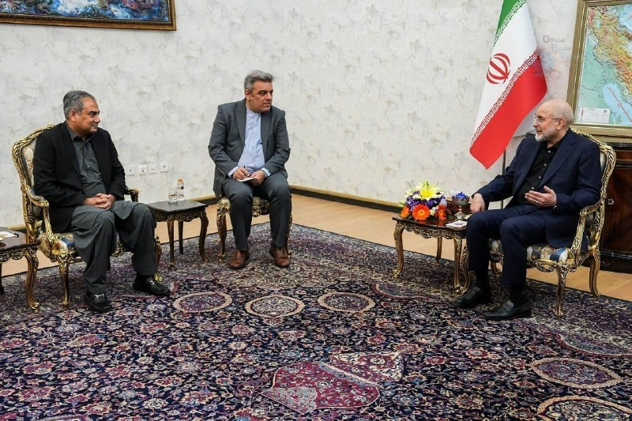

محمد شهباز شریف، نخست‌وزیر پاکستان، به روزنامه تایمز بریتانیا گفت: نسبت به برگزاری دور دوم مذاکرات مستقیم بین واشنگتن و تهران که منجر به صلح پایدار شود، خوش‌بین هستم. پاکستان مورد اعتماد همه طرف‌ها از جمله ایران، دولت آمریکا و همچنین کشورهای خلیج فارس است.…

## OfficialPersiaTwiter — post 498944

سازمان جهانی بهداشت در کنگو و اوگاندا وضعیت اضطراری اعلام کرد

🔹سازمان جهانی بهداشت امروز درباره شیوع ابولا در جمهوری دموکراتیک کنگو و اوگاندا، نسبت به گسترش منطقه‌ای این بیماری هشدار داد.
🔹ویروس ابولا موسوم به «بوندیبوگیو» است؛ گونه‌ای که تاکنون هیچ واکسن یا درمان تاییدشده‌ای برای آن وجود ندارد.
🔹ابولا بیماری‌ای بسیار مسری است که از طریق مایعات بدن مانند خون، استفراغ و اسپرم منتقل می‌شود و می‌تواند به بیماری شدید و مرگبار منجر شود.

》OPT《

@OfficialPersiaTwiter

## OfficialPersiaTwiter — post 498943

ادعای رئیس مجلس نمایندگان آمریکا:

عملیات «خشم حماسی» به پایان رسیده است و آمریکا در صدد اجرای پروژه‌ای برای بازگشایی مجدد تنگه هرمز است. / انتخاب

》OPT《

@OfficialPersiaTwiter

## OfficialPersiaTwiter — post 498942

فینال جام ملت‌های والیبال آسیا؛
فولاد نایب قهرمان شد

تیم والیبال فولاد سیرجان ایرانیان در دیدار فینال لیگ قهرمانان ۲۰۲۶ آسیا که از ساعت ۱۵:۳۰ امروز به مصاف جاکارتا باهایانگ کارا پرسیس از اندونزی رفته بود، با شکست ۳-۱ برابر حریف خود به مدال نقره دست پیدا کرد. در ترکیب تیم فولاد، علی حاجی‌پور، امیرحسین توخته، پوریا حسین‌خانزاده، الکساندر نیکولوف، محمد ولی‌زاده، علی رمضانی و مهدی مرندی به میدان رفتند.

ست اول: جاکارتا ۲۵ - ۲۰ فولاد
ست دوم: جاکارتا ۲۴ - ۲۶ فولاد
ست سوم: جاکارتا ۲۵ - ۲۳ فولاد
ست چهارم: جاکارتا ۲۵ - ۲۳ فولاد

》OPT《

@OfficialPersiaTwiter

## OfficialPersiaTwiter — post 498941

سطح تشعشعات در نیروگاه هسته‌ای براکه طبیعی است آژانس بین‌المللی انرژی اتمی: 🔹امارات اطلاع داده که سطح تشعشعات در نیروگاه هسته‌ای براکه در محدوده طبیعی است. 🔹هیچ خسارتی در پی حمله پهپادی به اطراف نیروگاه هسته‌ای براکه گزارش نشده است. 》OPT《 @OfficialPersiaTwiter

## OfficialPersiaTwiter — post 498940

آغاز ثبت نام آزمون سراسری ۱۴۰۵ 🔹محمدی رییس سازمان سنجش کشور: ثبت نام آزمون آزمون سراسری ۱۴۰۵ به همراه پذیرش دانشجو معلم در دانشگاه های فرهنگیان و تربیت دبیر شهید رجایی آغاز شد. 》OPT《 @OfficialPersiaTwiter

## OfficialPersiaTwiter — post 498939

‏بچه‌ها یه پیشنهاد اقتصادی خوب بدم بهتون، چند واحد آپارتمان بخرید بدید اجاره تا درآمد ‌passive داشته باشید. کمک خوبیه تو شرایط فعلی.

》مستر بین《

@OfficialPersiaTwiter

## OfficialPersiaTwiter — post 498937

اسرائیل یکی از فرماندهان حماس را ترور کرد

🔹ارتش رژیم اسرائیل شد «بهاء بارود»، فرمانده اداره عملیات جنبش حماس را دیروز (شنبه) هدف قرار داده است.

》OPT《

@OfficialPersiaTwiter

## OfficialPersiaTwiter — post 498936

تراپیستم میگه:
زیاد فکر نکن، شبا فقط بخواب، غذاتو فقط بخور، فیلم فقط ببین…
انگار نسخه‌ی درمانم اینه که برای چند ساعت آدم بودن رو خاموش کنم.

》موکا خانم《

@OfficialPersiaTwiter

## bbcpersian — post 281303

  <a href="telegram/content/bbcpersian_281303_1779029261.mp4" target="_blank">🎬 Download video</a>

🔻یکی از مخاطبان بی‌بی‌سی در ویدیویی از افزایش دو برابری قیمت داروهایش نسبت به سال ۱۴۰۴ گلایه می‌‌کند. به گفته او، در حالی که حقوقش ۹ میلیون تومان است، مجبور است سه میلیون تومان دارو بخرد.

ایرنا در گزارشی درباره وضعیت داروها، کمبودهای حاضر را حاصل «کمبود نقدینگی و فقدان تامین ارز» در سال گذشته عنوان کرده است.

بنابر گزارش خبرگزاری دولت ایران، ناهماهنگی بین وزارت بهداشت و بیمه‌ها برای اعلام افزایش قیمت داروها به بیمه‌های پایه، یکی از دلایل فشار اقتصادی به بیماران است که موجب شده سهم بیمه از قیمت قبلی پرداخت شود و مابه‌التفاوت قیمت جدید و قدیم به عهده بیمار باشد.

اگر تجربه و مشاهده‌ای از جهش قیمت دارو و یا کمبود آن دارید، با هشتگ #دارو برای ما بفرستیدبه:
آی‌مسج و واتس‌اپ: ۰۰۴۴۷۳۴۲۰۳۲۱۱۳
پیامگیر تلگرام:t.me/bbcshoma
پیامگیر تلفنی: ۰۰۴۴۳۳۰۱۲۳۰۲۱۰

@BBCPersian
https://bbc.in/4fqq1FV

## bbcpersian — post 281302

  

🔻با هجوم مردم برای خرید یک ساعت جدید و تولید محدود، شرکت سواچ ناچار شد فروشگاه‌هایش را در سراسر بریتانیا تعطیل کند.

صدها نفر مشتاق خرید یک ساعت جدید با تولید محدود، بیرون شعب فروشگاه سواچ صف کشیده بودند.

این شرکت سوئیسی اعلام کرد که «به دلیل ملاحظات ایمنی برای مشتریان و کارکنان خود» فروشگاه‌های خود را در لندن باز نخواهد کرد.

شعب این فروشگاه‌ در شهرهای بیرمنگام، کاردیف، گلاسکو، لیورپول، منچستر و شفیلد نیز همچنان بسته خواهند ماند.

این شرکت قرار بود ساعت جیبی جدید «رویال پاپ» خود را با همکاری شرکت اودمر پیگه در هشت مدل با قیمت تقریبی ۴۵۰ دلار عرضه کند.

اودمر پیگه، شرکتی است که به ساخت ساعت و جواهرات قیمتی شهرت دارد.

با بسته شدن فروشگاه‌ها، سواچ در حال حاضر این ساعت را به صورت آنلاین می‌فروشد.

در بازارهای آنلاین دیگر این ساعت تا قیمت بیش از ۲۱ هزار دلار برای فروش گذاشته است.

📷Swatch
https://bbc.in/3PM4VaH

@BBCPersian

## bbcpersian — post 281301

  

🔻محسن نقوی، وزیر کشور پاکستان، عصر امروز با محمدباقر قالیباف، رئیس مجلس ایران در تهران دیدار و گفت‌وگو کرد.

آقای قالیباف ریاست هیئت مذاکره کننده ایران در مذاکرات با آمریکا در پاکستان را بر عهده داشت.

پاکستان میانجی‌ کنونی ایران و آمریکاست.

رسانه‌های ایرانی و پاکستانی گزارش داده‌‌اند که آقای نقوی برای از سرگیری مذاکرات به ایران سفر کرده است.

گفته شده او حامل پیام‌ آمریکاست و پاسخ ایران را هم دریافت خواهد کرد.

به گفته سفارت پاکستان در تهران، آقای نقوی دیروز پس از ورود به تهران «نزدیک به سه ساعت در نهاد ریاست جمهوری حضور داشت» و اسکندر مومنی، وزیر کشور، و عباس عراقچی، وزیر امور خارجه نیز «در جریان این دیدار در نهاد ریاست جمهوری حضور داشتند.»

علاوه بر این، محسن نقوی «دیداری خصوصی» با مسعود پزشکیان داشت که «حدود ۹۰ دقیقه به طول انجامید و با حضور وزیر کشور ایران همراه بود.»

📷Mehr News
https://bbc.in/4uMNMMW

@BBCPersian

## bbcpersian — post 281300

  

‌🔻بهار صحرائیان، وکیل دادگستری و فعال حقوق بشر، صبح روز ۲۶ اردیبهشت هنگامی که برای دفاع از معترضان بازداشت‌شده در دادگاه انقلاب شیراز حاضر شده بود، بازداشت شده است.

یک منبع مطلع به بی‌بی‌سی گفت که خانم صحرائیان به زندان عادل‌آباد شیراز منتقل شده است.

بهار صحرائیان که عضو کانون وکلای استان فارس است، آبان ۱۴۰۱ هم بازداشت و مدتی در زندان بود که با حکم عفو آزاد شد.

این منبع مطلع گفت خانم صحرائیان پس از آزادی چند بار به اداره اطلاعات فراخوانده شد: «این وکیل دادگستری در حین انجام وظیفه حرفه‌ای و در فضای دادگاه صورت گرفته است سپس به دفتر کارش در شیراز برده شده و دفتر مورد تفتیش قرار گرفته و بعد از آن به بازداشتگاه منتقل شده است.»

بر اساس این گزارش، خانم صحرائیان صبح امروز، ۲۷ اردیبهشت به دادسرا منتقل شده و اتهامات «اجتماع و تبانی به قصد اقدام علیه امنیت ملی»، «فعالیت تبلیغی علیه نظام اسلامی» و «نشر اکاذیب» به او تفهیم شده است.

📷Handout
@BBCPersian

## Lichargoo — post 24896

  <a href="telegram/content/Lichargoo_24896_1779029264.mp4" target="_blank">🎬 Download video</a>

وقتی میبینم رفیقم به «بله» عادت کرده و پروفایل و استوری میزاره و همش برخطه :

@Lichargoo

## Tans_Footbali — post 236370

  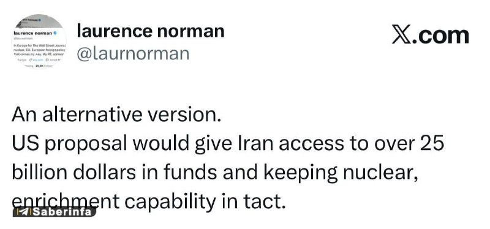

پیشنهاد جدید آمریکا:
لارنس نورمن، خبرنگار وال استریت ژورنال:

نسخه جایگزین پیشنهاد آمریکا به ایران امکان دسترسی به بیش از ۲۵ میلیارد دلار و حفظ توان غنی سازی هسته ای را می دهد.

💛@Tans_Footbali

## Tans_Footbali — post 236369

  <a href="telegram/content/Tans_Footbali_236369_1779029265.webm" target="_blank">🎬 Download video</a>

🎉  بونوس ویژه ثبت‌نام – ۵۰۰٬۰۰۰ تومان رایگان

💥 با ثبت‌نام در سایت، ۵۰۰٬۰۰۰ تومان بونوس رایگان دریافت کنید و شانس خود را امتحان کنید.

🔥 چگونه کار می‌کند؟

⬅️ ثبت‌نام کنید 

⬅️بونوس ۵۰۰٬۰۰۰ تومانی دریافت کنید 

⬅️ شرط‌بندی کنید و بونوس را به موجودی واقعی تبدیل کنید

🔥 وقتشه بازی رو یه جور دیگه ببینی

⚽️  پوشش کامل مسابقات ورزشی 

📊  پیش‌بینی با بهترین ضرایب 

⚡️  تجربه سریع و حرفه‌ای

😀 پرداخت مستقیم و سریع بدون واسطه، بدون دردسر، واریز و برداشت در سریع‌ترین زمان ممکن 
A24

😀 کانال تلگرام: 

🔴 @winro_io  

😀 هدیه خود را با ثبت نام در سایت دریافت کنید: 

🔴 Winro.io

سایت اصلی در روزهای آینده بازگشایی خواهد شد s
✅

## Tans_Footbali — post 236368

فکر می‌کنم بهتره از آدمای بی‌خود و دوهزاری صداسیما که معلوم نیست انسانن یا حاصل تجاوز گوریل به روسپی‌های سرخ موی مبتلا به زگیل تناسلی، نقل قول نکنیم و هر زری هم زدن به چپ‌مون بگیریم. بهترین مجازات برای یه سری از این قبیل موجودات فراموش شدنه! چون از اول هم نباید دیده میشدن یا دیده می‌شدن. [حیف چشم و گوش آدم که حضور اینارو گواهی بده اصلا!]

📝چَندراموکی

@Tans_Footbali

## withyashar — post 11481

  <a href="telegram/content/withyashar_11481_1779029266.mp4" target="_blank">🎬 Download video</a>

🎬 Video

## withyashar — post 11480

نمیدونم چطوری اطلاعات بدردبخور رو‌انتقال بدم نمیدونم اجازه میدی به وقتش واسه خودت بفرستم و تو یه کاری بکنی؟

## withyashar — post 11479

نمیدونم چطوری اطلاعات بدردبخور رو‌انتقال بدم
نمیدونم اجازه میدی به وقتش واسه خودت بفرستم و تو یه کاری بکنی؟

---
📅 بروزرسانی: 1405/02/27 17:13
---

## OfficialPersiaTwiter — post 498935

  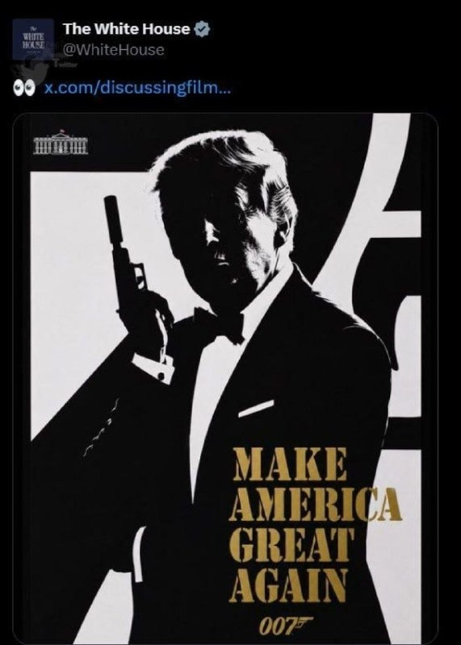

کاخ سفید یک پوستر به سبک جیمز باند از ترامپ منتشر کرد.

》OPT《

@OfficialPersiaTwiter

## OfficialPersiaTwiter — post 498934

گزارش رسانه عبری از کمک مصر به تقویت سیستم سپر دفاعی کشورهای حاشیه خلیج فارس

🔹یک پایگاه خبری اسرائیلی فاش کرد که استقرار سامانه‌های پدافند هوایی پیشرفته و جنگنده‌های رافائل مصر در برخی کشورهای حاشیه خلیج فارس، نشان‌دهنده عمق همکاری‌های نظامی منطقه‌ای میان قاهره و این کشورهاست.

🔹روسیا الیوم: امارات علاوه بر میزبانی از این سامانه‌های پدافندی، بستری برای استقرار یک اسکادران از جنگنده‌های رافائل مصر در خاک خود فراهم کرده است تا حفاظت هوایی از این کشور تقویت شود.

》OPT《

@OfficialPersiaTwiter

## OfficialPersiaTwiter — post 498933

ادامه تعطیلی موزه‌ها

🔹معاون میراث فرهنگی: تعطیلی موزه‌ها ادامه خواهد داشت و آثار تاریخی ایران که در چین برای نمایش به امانت سپرده شده، بزودی با ایران منتقل می‌شود.

》OPT《

@OfficialPersiaTwiter

## OfficialPersiaTwiter — post 498932

  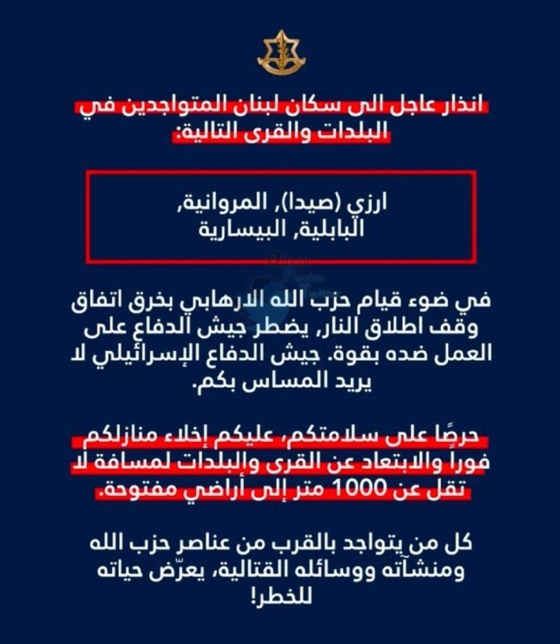

کشته شدن یک افسر اسرائیلی در نبردهای لبنان ارتش اسرائیل از کشته شدن یک افسر در نبردهای لبنان خبر داد. رسانه‌های اسرائیلی گزارش دادند که این افسر در جنوب لبنان بر اثر انفجار یک پهپاد انفجاری کشته شده است. این افسر که از تیپ گولانی بود، که در منطقه «دیر سیریان»…

## OfficialPersiaTwiter — post 498931

‏از جمله [بذار تکلیف جنگ معلوم شه، بعد] حامله‌ام.

》Ser《

@OfficialPersiaTwiter

## OfficialPersiaTwiter — post 498930

  <a href="telegram/content/OfficialPersiaTwiter_498930_1779025385.mp4" target="_blank">🎬 Download video</a>

آغاز ثبت نام آزمون سراسری ۱۴۰۵

🔹محمدی رییس سازمان سنجش کشور: ثبت نام آزمون آزمون سراسری ۱۴۰۵ به همراه پذیرش دانشجو معلم در دانشگاه های فرهنگیان و تربیت دبیر شهید رجایی آغاز شد.

》OPT《

@OfficialPersiaTwiter

## OfficialPersiaTwiter — post 498929

  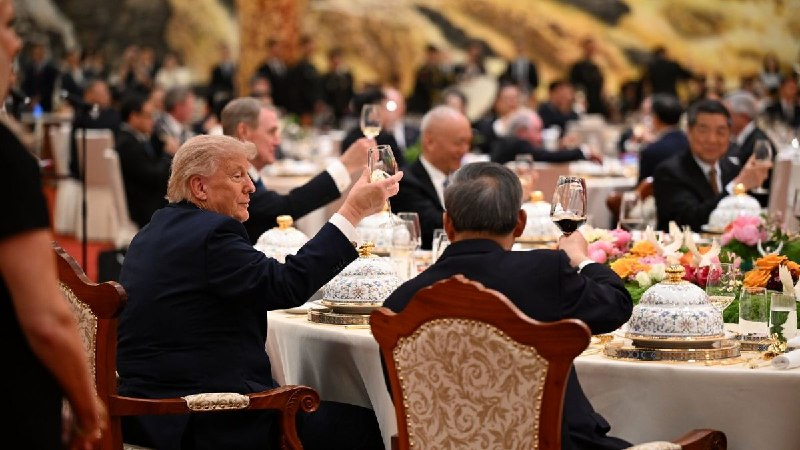

پشت پرده ضیافت بزرگ قرن؛ ترامپ یک قاشق از غذا‌های چینی را هم نخورد

🔹چینی‌ ها گزارش می‌دهند که ترامپ حتی به یک تکه از غذاهایی که در شام خوشامدگویی سرو شده بود، دست نزد. او غذاهایی را خورد که توسط سرآشپزهای کاخ سفید تهیه شده بود.

🔹علاوه بر این، او در تمام طول سفرش به هیچ غذایی که توسط طرف چینی تهیه شده بود، دست نزد.

》OPT《

@OfficialPersiaTwiter

## OfficialPersiaTwiter — post 498928

نیویورک تایمز، به نقل از مقامات کاخ سفید: مقامات عالی رتبه آمریکایی احتمال دستگیری رائول کاسترو، رئیس جمهور سابق کوبا، را در عملیاتی مشابه سناریوی ونزوئلا رد نمی‌کنند. 》OPT《 @OfficialPersiaTwiter

## OfficialPersiaTwiter — post 498927

تمدید تردد رایگان با مترو و اتوبوس پس از توافق شهرداری و شورای شهر عضو شورای شهر تهران: 🔹در حال حاضر اعضای شورای شهر تصمیمی برای ادامه رایگان بودن مترو و اتوبوس ندارند و اگر قرار باشد تصمیم جدیدی اتخاذ شود، این موضوع روز سه‌شنبه مطرح خواهد شد. 🔹در صورتی که…

## OfficialPersiaTwiter — post 498926

افت فشار آب در بخش‌هایی از جنوب تهران از امشب

🔹امشب (۲۷ اردیبهشت) از ساعت ۱۱ شب به مدت چند ساعت، فشار آب در مناطقی از شهرستان ری در جنوب تهران کاهش خواهد یافت.

🔹این افت فشار به دلیل اجرای عملیات اصلاح و بازسازی شبکه توزیع آب در این محدوده صورت می‌گیرد.

》OPT《

@OfficialPersiaTwiter

## OfficialPersiaTwiter — post 498925

الجزیره: پس‌از حملهٔ پهپادی در محوطهٔ داخلی نیروگاه هسته‌ای «براکه»، در این منطقه آتش‌سوزی صورت گرفته است 🔹العربيه گزارش کرده که «این حمله تلفات انسانی در پی نداشته و هنوز مبدأ آن مشخص نیست». دفتر رسانه‌ای ابوظبی هم خبر داد: نیروهای آتش‌نشان، آتش‌سوزی در…

## OfficialPersiaTwiter — post 498924

موج سواری دلالان خودرو به بهانه کمبود ورق های فولادی سید محمد اتابک : 🔹️ افزایش قیمت ها در بازار خودرو منطقی نیست/هیچ نگرانی برای تامین ورق های فولادی مورد نیاز خودروسازان، وجود ندارد. 🔹شایعه‌سازی برای فروش گرانتر و خالی کردن جیب مردم به بهانه نبود ورق‌های…

## bbcpersian — post 281299

  <a href="telegram/content/bbcpersian_281299_1779025388.mp4" target="_blank">🎬 Download video</a>

🔻سرخط خبرهای روز یکشنبه ۲۷ اردیبهشت ۱۴۰۵
@BBCPersian

## bbcpersian — post 281298

  

🔻جلسه دادگاه صادق ساعدی‌نیا، مدیر کافه‌های زنجیره‌ای ساعدی‌نیا که در اعتراضات سراسری دی ماه گذشته به همراه پدرش، محمدعلی ساعدی‌نیا بازداشت شد،‌ در دادگاه انقلاب قم برگزار شد.

کافه‌های ساعدی‌نیا از جمله کسب‌وکارهایی بود که در اعتراضات دی ماه پارسال که با اعتراض بازار به نابسامانی اقتصادی آغاز شد، مغازه‌هایشان را تعطیل کردند.

نماینده دادستان قم در این جلسه آقای ساعدی‌نیا را به «فعالیت تبلیغی یا رسانه‌ای برخلاف امنیت کشور»، «اقدام عملیاتی برای گروه‌های معاند نظام از طریق انتشار استوری و فعالیت مجازی و حضور در تجمعات غیرقانونی و تعطیل کردن کافه‌ها و مغازه‌های خود در کل کشور و تشویق تعدادی از کارکنانش در ارتکاب جرایم علیه امنیت کشور» متهم کرد.

به گفته نماینده دادستان و قاضی موارد اتهامی بر مبنای اطلاعاتی است که از محتوای لوازم الکترونیکی ضبط شده از آقای ساعدی‌نیا و از جمله تصاویر و چت‌های او در واتساپ استخراج شده است.

نماینده دادستان گفت که آقای ساعدی‌نیا در واتساپ خود «برنامه ریزی برای تعطیلی کافه‌ها را همزمان با صدور فراخوان دشمن به مشورت گذاشته بود.»

لینک خبر:
📷MIZAN
https://bbc.in/3PnkDsQ

@BBCPersian

## bbcpersian — post 281297

  

🔻مقام‌های ابوظبی می‌گویند آتش‌سوزی ناشی از حمله یک پهپاد به یک ژنراتور برق در بیرون محدوده نیروگاه هسته‌ای براکه کنترل شده است.

دفتر رسانه‌ای ابوظبی گفت در این حادثه کسی آسیب ندیده است و سطح ایمنی پرتوهای رادیواکتیو نیز تغییری نکرده است.

سازمان تنظیم مقررات هسته‌ای امارات هم با تایید این خبر اعلام کرد که نیروگاه به کار عادی خود ادامه می‌دهد.

نیروگاه هسته‌ای براکه در منطقه ظفره امارات اولین نیروگاه هسته‌ای در جهان عرب است و از چهار رآکتور تشکیل شده است.

در بیانیه‌های امارات اشاره‌ای به مسئول احتمالی حملات نشده است.

ایران امارات را در حملات آمریکا و اسرائیل شریک فعال می‌داند.

آژانس بین‌المللی انرژی اتمی از حمله پهپادی به نزدیکی نیروگاه هسته‌ای امارات به‌شدت ابراز نگرانی کرد.

این حمله به آتش‌سوزی در این نیروگاه انجامید اما دفتر رسانه‌ای دولت ابوظبی گفت که آتش‌سوزی کنترل شده و آسیبی به نیروگاه وارد نشده است.

آژانس بین‌المللی انرژی اتمی هم تایید کرد که سطح تشعشعات در اطراف این نیروگاه عادی است.

📸MOHAMEDBINZAYED
https://bbc.in/4wBBjNT
@BBCPersian

## Tans_Footbali — post 236367

  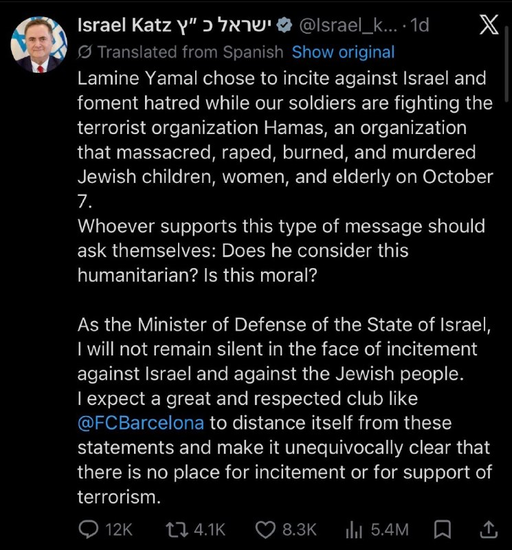

🔴 وزیر جنگ اسرائیل:
- لامین یامال تصمیم گرفته علیه اسرائیل تحریک و نفرت‌پراکنی کنه، در حالی که سربازهای ما دارن با سازمان تروریستی حماس می‌جنگن؛ سازمانی که در ۷ اکتبر کودکان، زنان و سالمندان یهودی رو قتل‌عام کرد، بهشون تجاوز کرد، زنده زنده سوزوند و کُشت.
-هر کسی که از این نوع پیام حمایت می‌کنه باید از خودش بپرسه: آیا این رو انسانی می‌دونه؟ آیا این اخلاقیه؟
- من به‌عنوان وزیر دفاع اسرائیل، در برابر تحریک علیه اسرائیل و مردم یهود سکوت نمی‌کنم.
- من انتظار دارم باشگاه بزرگ و معتبری مثل FC بارسلونا خودش رو از این اظهارات دور کنه و کاملاً روشن بگه که جایی برای تحریک یا حمایت از تروریسم وجود نداره

@Tans_Footbali

## hamclasixii — post 75406

  <a href="telegram/content/hamclasixii_75406_1779025394.webm" target="_blank">🎬 Download video</a>

🔴هزینه خرید سریال ثبت نام کنکور ۱۴۰۵ 🔹گروه آزمایشی اصلی(تجربی، ریاضی، انسانی) : ۴۰۰ هزارتومن 🔹گروه زبان یا هنر : ۴۰۰ هزار تومن 🔹کنکور فرهنگیان در گروه اصلی : ۴۰۰ هزارتومن 🔹کنکور فرهنگیان در گروه زبان یا هنر : ۴۰۰ هزارتومن 🔹پذیرش براساس سوابق تحصیلی : ۴۰۰…

## hamclasixii — post 75405

🔴هزینه خرید سریال ثبت نام کنکور ۱۴۰۵

🔹گروه آزمایشی اصلی(تجربی، ریاضی، انسانی) : ۴۰۰ هزارتومن
🔹گروه زبان یا هنر : ۴۰۰ هزار تومن
🔹کنکور فرهنگیان در گروه اصلی : ۴۰۰ هزارتومن
🔹کنکور فرهنگیان در گروه زبان یا هنر : ۴۰۰ هزارتومن
🔹پذیرش براساس سوابق تحصیلی : ۴۰۰ هزارتومن
🔹هزینه ارسال پیامک اطلاع‌رسانی: ۲۰ هزارتومن

📚 @hamclasix 📚

## hamclasixii — post 75404

  <a href="https://t.me/hamclasixii/75404" target="_blank">📎 Download file</a>

🔴اطلاعیۀ‌ ثبت‌نام‌ در‌ آزمون‌ سراسری‌ ‌و همچنین آزمون اختصاصی پذیرش دانشجو – معلم در دانشگاه‌های فرهنگیان و تربیت‌دبیر شهید رجائی سال‌ 1405

📚 @hamclasix 📚

## hamclasixii — post 75403

🔴#فوری | ثبت‌نام کنکور شروع شد 🔹️ ثبت نام آزمون سراسری ۱۴۰۵ و آزمون  پذیرش دانشجو معلم در دانشگاه‌های فرهنگیان و تربیت دبیر شهید رجایی ۱۴۰۵ از امروز آغاز شده و تا شنبه ۲ خردادماه ادامه خواهد داشت. 📚 @hamclasix 📚

## hamclasixii — post 75402

🔴#فوری | ثبت‌نام کنکور شروع شد

🔹️ ثبت نام آزمون سراسری ۱۴۰۵ و آزمون  پذیرش دانشجو معلم در دانشگاه‌های فرهنگیان و تربیت دبیر شهید رجایی ۱۴۰۵ از امروز آغاز شده و تا شنبه ۲ خردادماه ادامه خواهد داشت.

📚 @hamclasix 📚

## hamclasixii — post 75401

🔴 تصمیمات امتحانات خرداد در استان ایلام:

🔹 پایه‌های هفتم و هشتم:
    فقط درس‌های ریاضی و علوم به‌صورت حضوری/ بقیه غیرحضوری
🔹 پایه نهم:
    ۴ درس حضوری و هماهنگ استانی: ریاضی، علوم تجربی، عربی، مطالعات/مابقی دروس غیرحضوری
🔹پایه دهم (نظری):
    ۲ درس حضوری و هماهنگ استانی:
  + تجربی: زیست‌شناسی + دین و زندگی
  + ریاضی: فیزیک + دین و زندگی
  + انسانی: علوم فنون ادبی + دین و زندگی
     مابقی دروس غیرحضوری
🔹 فنی‌حرفه‌ای و کاردانش:
    دروس نظری غیرحضوری، دروس عملی و کارگاهی حضوری (خرداد تا شهریور)

📚 @hamclasix 📚

## withyashar — post 11478

شاهزاده رضا پهلوی : جمهوری اسلامی را نمی‌توان تغییر داد همانگونه که یک گرگ را نمیتوان تبدیل به میش کرد
@withyashar

## withyashar — post 11477

  <a href="telegram/content/withyashar_11477_1779025396.mp4" target="_blank">🎬 Download video</a>

صداوسیما: با اعلام مدیر کل آموزش و پرورش تهران؛ دانش آموزان پایه های هفتم تا دهم دیگه امتحان خرداد ندارن و با توجه به عملکرد علمی یکساله سنجیده میشن.
@withyashar

## withyashar — post 11476

نیویورک‌تایمز: آمریکا به عراق دستور داده بود که طی دو عملیات داخل ایران، سیستم‌های راداری خود را خاموش کند و عراق این کار را انجام داد
@withyashar

---
📅 بروزرسانی: 1405/02/27 15:29
---

## persian_trend_official — post 14323

  

💢ارتش اسرائیل دستور تخلیه 4 روستا در جنوب لبنان را صادر کرد.

🫆:Tony

📌 @persian_trend_official
پرشین ترند | متفاوت‌ترین کانال نظامی

## persian_trend_official — post 14322

💢نیویورک تایمز به نقل از مقام‌های عراقی

💢در هر دو مورد، هم در جنگ کوتاه سال گذشته و هم در درگیری فعلی، واشنگتن عراق را مجبور کرده رادارهایش را خاموش کند تا از هواپیماهای آمریکایی محافظت شود

💢اقدامی که باعث شده بغداد برای شناسایی فعالیت‌های خصمانه بیشتر به نیروهای آمریکایی وابسته شود

🫆:Tony

📌 @persian_trend_official
پرشین ترند | متفاوت‌ترین کانال نظامی

## persian_trend_official — post 14321

  <a href="telegram/content/persian_trend_official_14321_1779019193.webm" target="_blank">🎬 Download video</a>

پزشکیان: روز جهانی ارتباطات را تبریک می‌گویم

پزشکیان در شبکه اجتماعی
ایکس نوشت:

🔹‏در روزهای جنگ، فرزندان ما در ارتباطات و فناوری اطلاعات، شبانه‌روز ایستادند تا ارتباطات و خدمات حیاتی کشور پایدار بماند. دسترسی باکیفیت و پایدار مردم به خدمات دیجیتال، بخشی از آرامش، پیشرفت و حق زندگی شایسته مردم عزیز ایران است.

🔹روز جهانی ارتباطات را تبریک می‌گویم.

🫆:Tony

📌 @persian_trend_official
پرشین ترند | متفاوت‌ترین کانال نظامی

## OfficialPersiaTwiter — post 498923

ترامپ و نتانیاهو امروز به صورت تلفنی گفتگو خواهند کرد

نتانیاهو: ۶۰ درصد غزه در کنترل ماست، ماموریت ما یکی است: اطمینان حاصل کنیم که غزه دیگر تهدیدی برای اسرائیل نخواهد بود
برای هر سناریویی با ایران آماده‌ایم
امروز با ترامپ صحبت خواهم کرد تا برداشت‌هایش از سفر به چین را بشنوم و شاید درباره چیزهای دیگر.
چشمان ما به سوی ایران باز است و برای همه احتمالات آماده هستیم.

》OPT《

@OfficialPersiaTwiter

## OfficialPersiaTwiter — post 498922

کره جنوبی از ایران توضیح خواست

🔹وزیر امور خارجه کره جنوبی در تماس تلفنی با همتای ایرانی خود، خواستار توضیح تهران درباره حمله به یک کشتی باری متعلق به این کشور در نزدیکی تنگه هرمز شد.
🔹به گزارش شفقنا، یک مقام کره ای پیشتر مدعی شده بود که به احتمال زیاد ایران پشت این حمله است، اما تهران این اتهام را قویاً رد کرده است.
🔹کره جنوبی حمله به کشتی غیرنظامی را «غیرقابل تحمل» خواند و اعلام کرد پس از شناسایی منبع حمله، پاسخ خواهد داد.

》OPT《

@OfficialPersiaTwiter

## OfficialPersiaTwiter — post 498921

  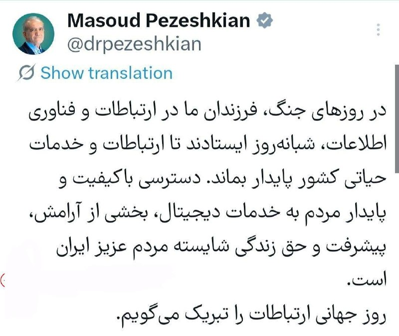

پزشکیان: روز جهانی ارتباطات را تبریک می‌گویم

پزشکیان در شبکه اجتماعی
ایکس نوشت:

🔹‏در روزهای جنگ، فرزندان ما در ارتباطات و فناوری اطلاعات، شبانه‌روز ایستادند تا ارتباطات و خدمات حیاتی کشور پایدار بماند. دسترسی باکیفیت و پایدار مردم به خدمات دیجیتال، بخشی از آرامش، پیشرفت و حق زندگی شایسته مردم عزیز ایران است.

🔹روز جهانی ارتباطات را تبریک می‌گویم.

》OPT《

@OfficialPersiaTwiter

## OfficialPersiaTwiter — post 498920

نیویورک تایمز به نقل از مقام‌های عراقی

🔹در هر دو مورد، هم در جنگ کوتاه سال گذشته و هم در درگیری فعلی، واشنگتن عراق را مجبور کرده رادارهایش را خاموش کند تا از هواپیماهای آمریکایی محافظت شود
🔹اقدامی که باعث شده بغداد برای شناسایی فعالیت‌های بیشتر به نیروهای آمریکایی وابسته شود.

》OPT《

@OfficialPersiaTwiter

## OfficialPersiaTwiter — post 498919

  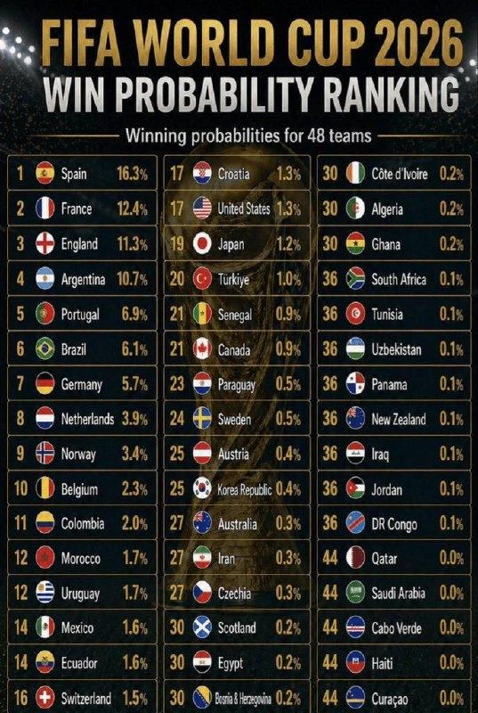

شانس قهرمانی تیم های مختلف در جام‌جهانی چقدر است؟

🔹سایت گل با انتشار پوستری درصد شانس قهرمانی کشورهای حاضر در جام‌جهانی را مشخص کرد.

》OPT《

@OfficialPersiaTwiter

## OfficialPersiaTwiter — post 498918

هشدار نارنجی هواشناسی برای تهران؛ احتمال طوفان گرد و خاک

🔹از عصر یکشنبه (۲۷ اردیبهشت) تا پایان وقت دوشنبه (۲۸ اردیبهشت) در نیمه جنوبی، غربی، مناطق مرکزی و ارتفاعات در بعضی ساعت‌ها وزش باد خیلی شدید و احتمال رخداد طوفان و در مناطق جنوبی غربی و مرکزی گاهی خیزش یا انتقال گرد و خاک پیش‌بینی می‌شود.

🔹همچنین از عصر دوشنبه (۲۸ اردیبهشت) تا پایان وقت همان روز، بارش متوسط باران، گاهی رگبار و رعد و برق، در مناطق مستعد احتمال بارش تگرگ، دور از انتظار نیست.

》OPT《

@OfficialPersiaTwiter

## OfficialPersiaTwiter — post 498917

اگر نفت ایران هدف قرار گیرد، نفت منطقه را می‌زنیم

نایب رئیس مجلس:
🔹اگر قرار باشد نفت ایران هدف قرار بگیرد، ما باید نفت منطقه را بزنیم.
🔹اگر آمریکا به نفت ایران آسیب بزند،‌ دنیا از منطقه نفت دریافت نخواهد کرد.
🔹اگر کشوری ایران را تحریم کند،‌ در تنگه هرمز تحریم می‌شود.

》OPT《

@OfficialPersiaTwiter

## OfficialPersiaTwiter — post 498916

افزایش ساعت معاملات سهام در روزهای ۲۹ و ۳۰ اردیبهشت ۱۴۰۵ مدیر نظارت بر بورس‌های سازمان بورس و اوراق بهادار اعلام کرد: 🔹به منظور مدیریت بازگشایی نماد شرکت‌های با افشای اطلاعات با اهمیت نوع «الف» و شرکت‌هایی که مجامع خود را در دوره توقف بازار سهام برگزار کرده‌اند،…

## OfficialPersiaTwiter — post 498915

گزارش مرکز ژئوفیزیک از شدت ۹ زمین‌لرزه بالای ۲.۵ ریشتر در پردیس از روز گذشته تاکنون 🔹ساعت ۲۰:۴۱ — بزرگی ۳.۴ ریشتر 🔹 ساعت ۲۳:۴۶ — بزرگی ۴.۶ ریشتر 🔹 ساعت ۲۳:۵۰ — بزرگی ۲.۶ ریشتر 🔹 ساعت ۰۰:۲۰ — بزرگی ۲.۶ ریشتر 🔹 ساعت ۰۰:۲۶ — بزرگی ۴ ریشتر 🔹 ساعت ۰۰:۳۲…

## bbcpersian — post 281296

🔻نتانیاهو می‌گوید امروز با ترامپ تلفنی گفت‌وگو می‌کند

🔻نخست‌وزیر اسرائیل گفت امروز با دونالد ترامپ درباره ایران تلفنی گفت‌وگو می‌کند.

بنیامین نتانیاهو امروز در نشست ویژه دولت اسرائیل به مناسبت بزرگداشت روز بیت‌المقدس گفت:

«چشمان ما درباره ایران کاملا باز است. من امروز هم با دوستمان رئیس‌جمهور ترامپ صحبت می‌کنم همانطور که هر چند روز یک بار این کار را می‌کنم. حتما از تاثیر سفر او به چین خواهم شنید و شاید موضوعات دیگر. احتمالات زیادی وجود دارد و ما برای هر سناریویی آماده هستیم.»

https://bbc.in/3RduMJ8
@BBCPersian

## bbcpersian — post 281295

🔻رئیس‌جمهور برزیل: مخالف جنگ با ایران هستم اما اختلاف با ترامپ مانع رابطه با آمریکا نیست

🔻رئیس‌جمهور برزیل گفت که رابطه شخصی‌اش با دونالد ترامپ، رئیس‌جمهور آمریکا، می‌تواند به جذب سرمایه‌گذاری آمریکا در برزیل، جلوگیری از اعمال تعرفه‌ و تحریم‌های بیشتر و احترام به دموکراسی برزیل کمک کند.

لوئیز ایناسیو لولا دا سیلوا به روزنامه واشنگتن پست گفت: «آقای ترامپ می‌داند که من با جنگ با ایران مخالفم، با مداخله او در ونزوئلا موافق نیستم و نسل‌کشی‌ای را که در فلسطین در حال وقوع است محکوم می‌کنم.»

«اما اختلافات سیاسی من با ترامپ در رابطه‌ام با او به‌عنوان رئیس یک کشور تأثیری ندارد. آنچه می‌خواهم این است که او با برزیل با احترام رفتار کند و درک کند که من رئیس‌جمهور منتخب هستم.»

https://bbc.in/4dtG3wl
@BBCPersian

## bbcpersian — post 281294

🔻کره جنوبی خواستار اعلام موضع ایران درباره حمله به کشتی باریش در تنگه هرمز شد

🔻کره‌جنوبی از ایران خواست درباره حمله اخیر به یک کشتی باریش در نزدیکی تنگه هرمز اعلام موضع کند.

به گفته وزارت خارجه کره‌ جنوبی، چو هیون، وزیر خارجه، با همتای ایرانیش تلفنی صحبت کرده و سئول و تهران برای تضمین امنیت در تنگه هرمز به ارتباطات و رایزنی‌های خود ادامه خواهند داد.

پیش‌تر یک مقام کره‌جنوبی گفته بود احتمال این که عامل این حمله کشوری غیر از ایران باشد، پایین است.

به گفته مقام‌های سئول، کشتی باری «اچ‌ام‌ام نامو» در چهارم مه (۱۴ اردیبهشت) هدف «دو هواپیمای ناشناس» قرار گرفت. این حمله باعث آسیب رسیدن به کشتی و آتش‌سوزی در موتورخانه شد.

این کشتی با پرچم پاناما و تحت مدیریت شرکت کشتیرانی کره‌ای «اچ‌ام‌ام» در حال حرکت بود.

وزارت خارجه کره جنوبی روز جمعه (۲۵ اردیبهشت/۱۵ مه) اعلام کرد بقایای این کشتی باری آسیب‌دیده را به کشور منتقل کرده است.

سئول گفته است که هواپیماهای دخیل در این حمله در تصاویر دوربین‌های مداربسته ثبت شده‌اند، اما شناسایی دقیق نوع و مبدا پروازشان امکان‌پذیر نیست.

https://bbc.in/4dfpaGT
@BBCPersian

## Lichargoo — post 24895

  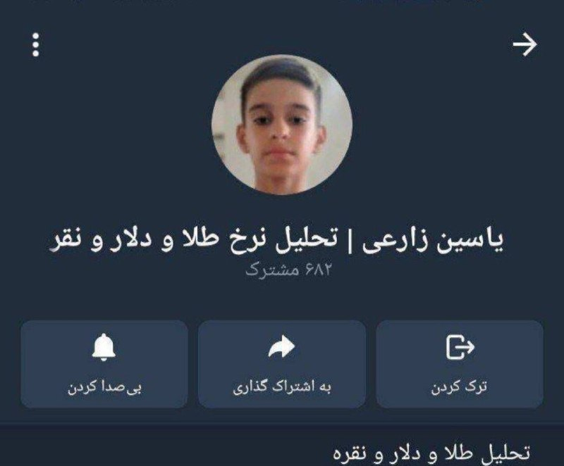

عاقبت مجازی کردن مدارس و مهد‌کودک‌ها :

@Lichargoo

## Tans_Footbali — post 236366

  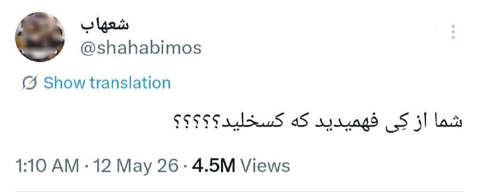

کلاس سوم بودم فکر میکردم وقتی تو‌فوتبال بازی مساوی میشه تیم میزبان دو امتیاز میگیره میهمان یک امتیاز :))

@Tans_Footbali

## Tans_Footbali — post 236365

دبیر ستاد ملی جمعیت: اگر با همین شرایط پیش برویم، در ۷۵ سال آینده جمعیت ما به ۳۱ میلیون نفر میرسد

💛@Tans_Footbali

## Tans_Footbali — post 236364

  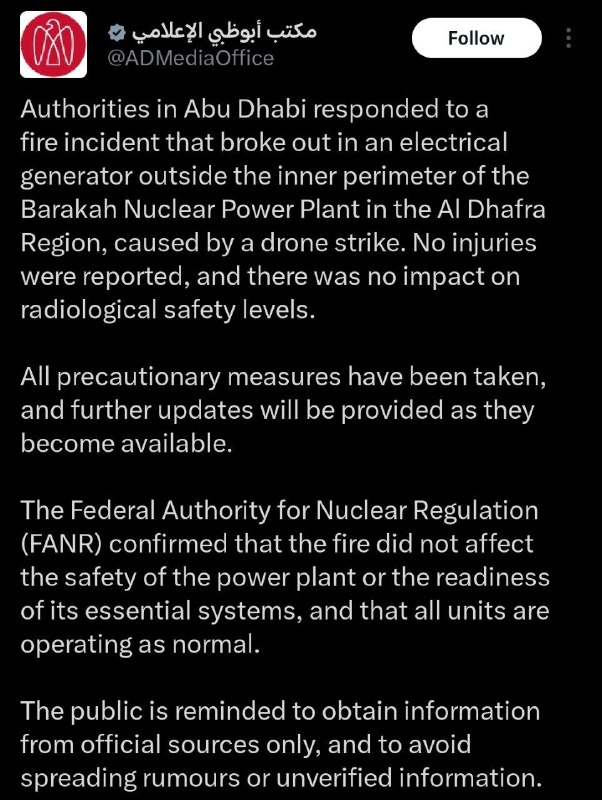

🇦🇪 🔴 دفتر رسانه‌ای ابوظبی:

مقامات ابوظبی به حادثه آتش‌سوزی که در یک ژنراتور برق خارج از محدوده داخلی نیروگاه هسته‌ای براکه در منطقه الظفره رخ داد و ناشی از حمله پهپادی بود، واکنش نشان دادند. هیچ مصدومی گزارش نشده و هیچ تأثیری بر سطوح ایمنی رادیولوژیکی نداشته است.

تمام اقدامات احتیاطی انجام شده و به‌روزرسانی‌های بیشتر در صورت در دسترس بودن ارائه خواهد شد.

سازمان فدرال تنظیم مقررات هسته‌ای (FANR) تأیید کرد که آتش‌سوزی بر ایمنی نیروگاه یا آمادگی سیستم‌های حیاتی آن تأثیری نداشته و همه واحدها به طور عادی در حال فعالیت هستند.

از عموم مردم خواسته می‌شود که اطلاعات را فقط از منابع رسمی دریافت کنند و از انتشار شایعات یا اطلاعات تأییدنشده خودداری نمایند.

@Tans_Footbali

## Tans_Footbali — post 236363

🚨گروهک تروریستی سپاه به نیروگاه هسته ای امارات حمله پهپادی کرد.

@Tans_Footbali

## Tans_Footbali — post 236362

  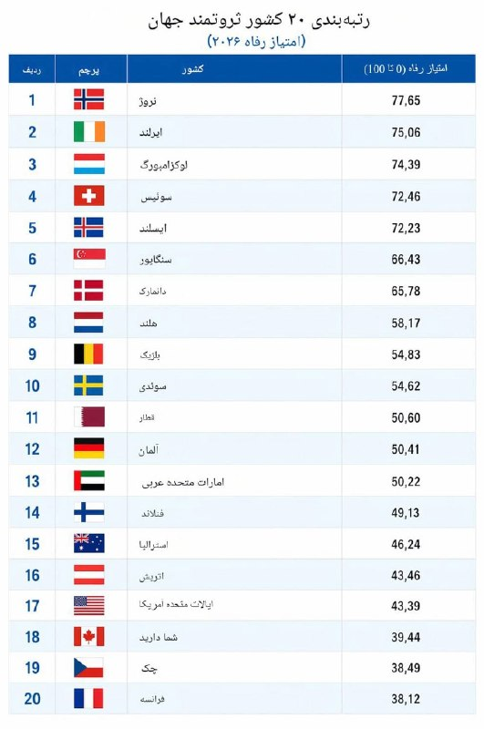

نروژ مرفه ترین کشور جهان تو سال ۲۰۲۶ شد نروژ این جایگاه رو بخاطر درآمد عالی،وضعیت خوب مردم،آموزش،ثبات اقتصادی و اعتماد عمومی بدست آورد.

💛@Tans_Footbali

## hamclasixii — post 75400

🔴آخرین جزئیات و چگونگی برگزاری امتحانات خرداد مدارس کشور

🔹اصفهان : پایه هفتم تا دهم بصورت غیرحضوری (مجازی)
🔷تهران : پایه هفتم تا دهم بصورت غیرحضوری (مجازی)
🔹البرز : هفتم تا دهم بصورت حضوری از ۹ خرداد
🔹مرکزی : هفتم تا دهم بصورت حضوری از ۹ خرداد
🔹مازندران : هفتم تا دهم بصورت حضوری از ۹ خرداد
🔹کرمانشاه : هفتم تا دهم بصورت غیرحضوری (مجازی) از ۹ خرداد
🔹یزد : هفتم تا دهم بصورت حضوری از ۹ خرداد
🔹کرمان : هفتم تا دهم بصورت حضوری از ۹ خرداد
🔹کهگیلویه و بویراحمد: درصورت کسب مجوز؛ بصورت حضوری
🔹فارس : بنا بر اختیار مدیران مدارس
🔹بوشهر : درصورت کسب مجوز؛ بصورت حضوری

📚 @hamclasix 📚

## withyashar — post 11475

نتانیاهو: امروز با رئیس‌جمهور ترامپ حرف میزنم،چشممون روی ایران بازه، برای هر موقعیتی آماده‌ایم.
@withyashar

## withyashar — post 11474

  

خبرگزاری فارس: یه کشتی اسرائیلی تو خلیج فارس توقیف کردیم که خدمه‌ش عکس علی خامنه‌ای و مجتبی خامنه‌ای رو روی دیواراش نصب کرده بودن.
@withyashar

## withyashar — post 11473

نتانیاهو: ما در غزه اکنون چیزی را در اختیار داریم، دیگر ۵۰٪ نیست... اکنون ۶۰٪ است. این وضعیت امروز است.
ماموریت ما یکی است: اطمینان حاصل کنیم که غزه دیگر تهدیدی برای اسرائیل نخواهد بود.

ما محدودیت بودجه نداریم. هر چقدر هزینه داشته باشد مهم نیست، شک ندارم که اسرائیل اولین کشوری خواهد بود که راه‌حلی کامل برای حملات پهپادی ارائه می‌دهد
@withyashar

## withyashar — post 11472

نتانیاهو با ترامپ تلفنی گفتگو می‌کند

رسانه‌های عبری: نتانیاهو امروز با توجه به تحولات و تنش‌های منطقه با ترامپ صحبت خواهد کرد.
@withyashar
امروز همچنین اسرائیل جلسه امنیتی برگزار میکند

---
📅 بروزرسانی: 1405/02/27 14:21
---

## persian_trend_official — post 14320

  

🔴انفجار در امارات 💢منابع عربی اعلام کردند که انفجارهایی خیابان فاطمه بنت مبارک در ابوظبی را لرزاند. 🫆:Tony 📌 @persian_trend_official پرشین ترند | متفاوت‌ترین کانال نظامی

## persian_trend_official — post 14319

  <a href="telegram/content/persian_trend_official_14319_1779015085.webm" target="_blank">🎬 Download video</a>

🔴انفجار در امارات

💢منابع عربی اعلام کردند که انفجارهایی خیابان فاطمه بنت مبارک در ابوظبی را لرزاند.

🫆:Tony

📌 @persian_trend_official
پرشین ترند | متفاوت‌ترین کانال نظامی

## persian_trend_official — post 14318

  

بقائی: آمریکا و اسرائیل خود عامل بی‌ثباتی در بازار انرژی هستند

اسماعیل بقائی، سخنگوی وزارت خارجه، ادعاهای آمریکا و اسرائیل درباره «حفظ ثبات بازار جهانی انرژی» را رد کرد و آن را «دروغی بزرگ» توصیف کرد.

بقائی گفت:

▪️ جنگی که آمریکا و اسرائیل آغاز کردند، روند دیپلماسی را نابود کرد
▪️ حمله نظامی به ایران باعث ناامنی در مسیرهای حیاتی انرژی شد
▪️ سپس ایران را به بی‌ثبات‌سازی متهم کردند

او با اشاره به آنچه «تاکتیک تبلیغاتی گوبلز» خواند، افزود:

▪️ «دیگران را به همان کاری متهم می‌کنند که خودشان انجام می‌دهند»

سخنگوی وزارت خارجه همچنین تأکید کرد:

▪️ آمریکا و اسرائیل ابتدا بحران و جنگ ایجاد می‌کنند
▪️ سپس با شعار «بازگرداندن ثبات» و «دفاع از صلح» به تشدید درگیری‌ها ادامه می‌دهند

بقائی در پایان گفت:

▪️ «آن‌ها ویرانی ایجاد می‌کنند و نامش را صلح می‌گذارند»

🫆:Tony

📌 @persian_trend_official
پرشین ترند | متفاوت‌ترین کانال نظامی

## persian_trend_official — post 14317

  

📌انتشار چاپ پنجم کتاب «قدرت مذاکره» همراه با فصل جدید «دیپلماسی زیر آتش» 🔹کتاب قدرت مذاکره به قلم دکتر سید عباس عراقچی حاصل بیش از سی سال تجربه کاری نویسنده در وزارت امور خارجه است. 🔹در این کتاب تلاش میشود ضمن تبیین و تحلیل ماهیت مذاکره و مذاکره سیاسی،…

## persian_trend_official — post 14316

🔴 رسانه‌های ایرانی جزئیات پاسخ واشینگتن به پیشنهاد توافق را منتشر کردند

رسانه‌های ایرانی مدعی شدند پاسخ آمریکا به پیشنهاد توافق با ایران شامل ۵ شرط اصلی بوده است:

▪️ آمریکا هیچ‌گونه غرامت یا خسارتی پرداخت نخواهد کرد

▪️ ۴۰۰ کیلوگرم اورانیوم از ایران خارج و به آمریکا تحویل داده شود

▪️ فقط یک مجموعه از تأسیسات هسته‌ای ایران فعال باقی بماند

▪️ حتی ۲۵ درصد از دارایی‌های بلوکه‌شده ایران نیز آزاد نخواهد شد
▪️ آتش‌بس در همه جبهه‌ها به روند مذاکرات گره بخورد

در این گزارش آمده است:

▪️ حتی در صورت پذیرش این شروط از سوی ایران، خطر حمله آمریکا و اسرائیل همچنان باقی خواهد ماند
▪️ برخی تحلیلگران ایرانی معتقدند واشینگتن به‌دنبال تحقق اهدافی است که در جنگ به آن نرسیده است

در مقابل، گزارش‌ها می‌گویند ایران نیز ۵ پیش‌شرط برای آغاز مذاکرات مطرح کرده است:

▪️ پایان جنگ در تمامی جبهه‌ها، به‌ویژه لبنان

▪️ رفع تحریم‌های ایران

▪️ آزادسازی دارایی‌های بلوکه‌شده ایران

▪️ پرداخت غرامت خسارات جنگ

▪️ به‌رسمیت شناختن حاکمیت ایران بر تنگه هرمز

تاکنون هیچ‌یک از این جزئیات به‌صورت رسمی از سوی تهران یا واشینگتن تأیید نشده‌اند.

🫆:Tony

📌 @persian_trend_official
پرشین ترند | متفاوت‌ترین کانال نظامی

## OfficialPersiaTwiter — post 498914

  <a href="telegram/content/OfficialPersiaTwiter_498914_1779015087.mp4" target="_blank">🎬 Download video</a>

بارش شدید تگرگ در بجنورد

🔹 تصاویری از بارش شدید و عجیب تگرگ در بجنورد ثبت شده است؛ پدیده‌ای که در پی ناپایداری‌های اخیر جو، برخی از خیابان‌های شهر را سفیدپوش کرد.

》OPT《

@OfficialPersiaTwiter

## OfficialPersiaTwiter — post 498913

نرخ رشد جمعیت نسبت به سال قبل در ایران همچنان منفی‌ است معاون وزیر بهداشت: 🔹آمار تولدها به زیر ۹۰۰ هزار نفر رسیده بود و در سال ۱۴۰۳ تعداد ۹۷۳ هزار نفر موالید داشتیم که در سال ۱۴۰۴ به ۸۹۲ هزار و ۲۶۸ نفر رسیده است. این آمار نشانگر سیر نزولی جمعیت است هرچند…

## OfficialPersiaTwiter — post 498912

انفجار در محوطه نیروگاه هسته‌ای امارات 🔹 امارات متحده‌عربی ادعا کرد: در پی حمله پهپادی، آتش‌سوزی در یک ژنراتور برق در خارج از محوطه داخلی نیروگاه هسته‌ای براکه در منطقه الظفره رخ داد. 》OPT《 @OfficialPersiaTwiter

## OfficialPersiaTwiter — post 498911

انفجار در محوطه نیروگاه هسته‌ای امارات

🔹 امارات متحده‌عربی ادعا کرد: در پی حمله پهپادی، آتش‌سوزی در یک ژنراتور برق در خارج از محوطه داخلی نیروگاه هسته‌ای براکه در منطقه الظفره رخ داد.

》OPT《

@OfficialPersiaTwiter

## OfficialPersiaTwiter — post 498910

  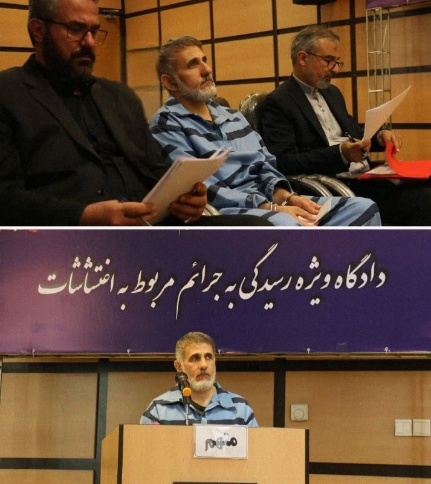

دادگاه رسیدگی به اتهامات صادق ساعدی‌نیا برگزار شد 🔹جلسه رسیدگی به اتهامات صادق ساعدی‌نیا، مدیرعامل شرکت صنعت غذایی و مدیر کافه‌های زنجیره‌ای ساعدی‌نیا در دادگاه انقلاب قم با حضور رئیس و مستشاران دادگاه، نماینده دادستان، صادق ساعدی‌نیا و وکلای وی برگزار شد.…

## OfficialPersiaTwiter — post 498909

  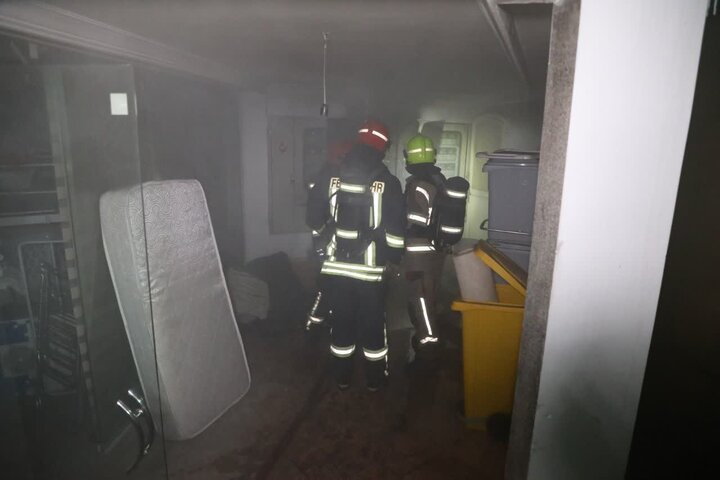

نجات ۳۰ شهروند محبوس از حادثه آتش‌سوزی در مشهد

روابط‌عمومی سازمان آتش‌نشانی شهرداری مشهد:
یک مجتمع اقامتی در خیابان دانشگاه مشهد صبح امروز یکشنبه ۲۷ اردیبهشت دچار حریق شد.

۳۰ شهروند به محل امن منتقل شدند.

این حادثه خسارت‌ مالی و جانی نداشت.

حریق سنگین نبود و تنها در طبقه منفی یک، قسمت تابلو برق دچار آتش سوزی شده بود.

علت آتش سوزی نیز در دست بررسی است.

》OPT《

@OfficialPersiaTwiter

## OfficialPersiaTwiter — post 498908

پسر جوان در ۷ دقیقه به قاتل تبدیل شد / شاگرد نانوایی به چاقوکشی مرگبار اعتراف کرد

🔹قرار دعوای چند جوان موتور سوار در کوچه معروف به «غربت‌ها» در حالی با جنایت به پایان رسید که شاگرد نانوایی به چاقوکشی مرگبار اعتراف کرد.
🔹نیمه شب گذشته دو جوان به نام‌های امیرحسین و یوسف با پسری به نام «سجاد» درگیر شدند.
🔹مشاجره لفظی و نزاع آنها در حالی به قرار دعوا در کوچه «غربت‌ها» کشید که یکی از عاملان نزاع با جوانی به نام «ابوالفضل-ش» تماس گرفت و از او خواست برای طرفداری از دوستش به محل نزاع بیاید.
🔹ابوالفضل هم که با یکی از بستگانش به تازگی از نیشابور به مشهد رسیده بود و مشغول صرف شام بود بلافاصله به طرف کوچه «غربت‌ها» در بولوار رسالت مشهد حرکت کرد.
🔹ناگهان تیغه سرد و براق چاقوها در دقیقه ۷ بامداد روز گذشته در آسمان تاریک درخشید و درگیری آغاز شد.
🔹امیرحسین در یک لحظه چاقو را به صورت کلنگی گرفت و ۲ ضربه به شانه و قلب ابوالفضل فرود آورد و او را در حالی نقش بر زمین کرد.
🔹ابوالفضل کنار یکی از خودروهای پارک شده، به دلیل خونریزی شدید جان سپرد.
🔹اگرچه امیرحسین که انتظار چنین صحنه وحشتناکی را نداشت، سعی کرد ابوالفضل را به مرکز درمانی برساند اما به خاطر ترس از عواقب آن، پا به فرار گذاشت./خراسان

》OPT《

@OfficialPersiaTwiter

## OfficialPersiaTwiter — post 498907

رئیس شورای شهر تهران: رایگان کردن مترو و اتوبوس در تهران کار احساسی است! فردا آخرین روز رایگان بودن حمل و نقل عمومی در تهران است و تمدید نخواهد شد. 》OPT《 @OfficialPersiaTwiter

## OfficialPersiaTwiter — post 498906

فارس : جزئیاتی از درخواست‌های آمریکا از ایران در مذاکرات

۵ شرط اصلی واشنگتن به این شرح اعلام شده است:

🔹 عدم پرداخت هرگونه غرامت و خسارت از سوی آمریکا
🔹 خروج و تحویل ۴۰۰ کیلوگرم اورانیوم از ایران به آمریکا
🔹️ فعال ماندن تنها یک مجموعه از تأسیسات هسته‌ای ایران
🔹️ عدم پرداخت حتی ۲۵ درصد از دارایی‌های بلوکه‌شدهٔ ایران
🔹️ منوط‌شدن توقف جنگ در همه ساحتها به انجام مذاکره

در مقابل، ایران انجام هرگونه مذاکره را منوط به تحقق ۵ پیش‌شرط اعتمادساز دانسته است که عبارتند از:

🔹 پایان جنگ در همهٔ جبهه‌ها به‌ویژه لبنان
🔹 رفع تحریم‌های ضدایرانی
🔹 آزادسازی پول‌های بلوکه‌شده ایران
🔹 جبران خسارات ناشی از جنگ
🔹 پذیرش حق حاکمیت ایران بر تنگه هرمز

》OPT《

@OfficialPersiaTwiter

## OfficialPersiaTwiter — post 498905

  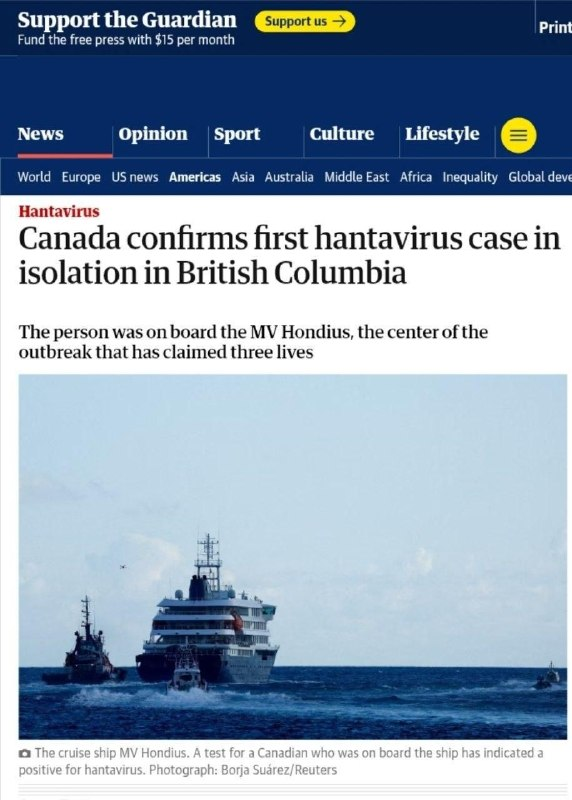

سازمان بهداشت جهانی: میزان مرگ و میر مرتبط با شیوع هانتاویروس حدود ۲۷ درصد است و هیچ واکسن یا درمان خاصی برای ویروسی که می‌تواند باعث سندرم حاد تنفسی شدید شود، وجود ندارد 》OPT《 @OfficialPersiaTwiter

## OfficialPersiaTwiter — post 498904

  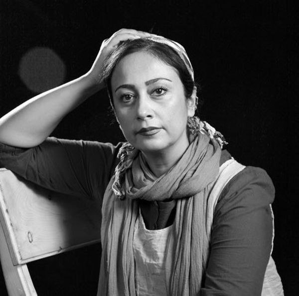

بدرقه بهناز نازی به خانه ابدی

علی زارعی، تهیه‌کننده تئاتر:
🔹مراسم تشییع پیکر بهناز نازی ساعت ۱۰ صبح فردا، دوشنبه ۲۸ اردیبهشت از مقابل تالار وحدت برگزار می‌شود و او در قطعه هنرمندان بهشت زهرا به خاک سپرده خواهد شد.
🔹بهرام بدخشانی، همسر این بازیگر با تایید این خبر گفت که بهناز نازی، عصر دیروز، شنبه ۲۶ اردیبهشت ماه از دنیا رفت.
🔹این بازیگر در چند روز اخیر به دلیل وخامت حالش در بخش مراقبت‌های ویژه بستری بود و پزشکان برای سهولت در درمان، او را به خواب مصنوعی برده بودند.

》OPT《

@OfficialPersiaTwiter

## bbcpersian — post 281293

🔻سازمان مدیریت بحران تهران: ۵۱ هزار واحد در جریان جنگ در پایتخت آسیب دیدند

🔻رئیس سازمان پیشگیری و مدیریت بحران تهران اعلام کرد در جریان جنگ «۵۱ هزار واحد» آسیب‌دیده در پایتخت شناسایی شده است.

علی نصیری گفت که از این تعداد، «۶۹۱ واحد نیاز به مقاوم‌سازی دارند و ۱۷۹۱ واحد نیز باید به‌طور کامل تخریب و نوسازی شوند.»

او افزود ارزیابی میزان خسارت‌ها توسط کارشناسان رسمی دادگستری انجام می‌شود و در مواردی که خسارت تا سقف ۵۰۰ میلیون تومان باشد، کارت‌های الکترونیکی از سوی بانک شهر به مالکان پرداخت خواهد شد.

به گفته آقای نصیری، در خسارت‌های بالاتر از این رقم نیز شهرداری‌های مناطق موظف‌ هستند از طریق پیمانکار، عملیات بازسازی را به‌صورت مستقیم اجرا کنند.

او همچنین اعلام کرد بیش از «۱۲ هزار خودرو و موتورسیکلت» هم در جریان جنگ دچار آسیب شده‌اند.

https://bbc.in/43egGtC
@BBCPersian

## bbcpersian — post 281292

🔻امارات از حمله پهپادی و آتش‌سوزی در بیرون نیروگاه هسته‌ایش خبر داد

🔻مقام‌های ابوظبی می‌گویند آتش‌سوزی ناشی از حمله یک پهپاد به یک ژنراتور برق در بیرون محدوده نیروگاه هسته‌ای براکه کنترل شده است.

دفتر رسانه‌ای ابوظبی گفت در این حادثه کسی آسیب ندیده است و سطح ایمنی پرتوهای رادیواکتور نیز تغییری نکرده است.

سازمان تنظیم مقررات هسته‌ای امارات هم با تایید این خبر اعلام کرد که نیروگاه به کار عادی خود ادامه می‌دهد.

نیروگاه هسته‌ای براکه در منطقه ظفره امارات اولین نیروگاه هسته‌ای در جهان عرب است و از چهار رآکتور تشکیل شده است.

ایران امارات را در حملات آمریکا و اسرائیل شریک فعال می‌داند.

https://bbc.in/4wBwOTv
@BBCPersian

## bbcpersian — post 281291

  

🔻سخنگوی نیروی‌های مسلح ایران درباره ازسرگیری حملات آمریکا گفت که پاسخ ایران این بار «هجومی‌تر» و «غافلگیرکننده» خواهد بود.
ابوالفضل شکارچی گفت: «تکرار هرگونه حماقت برای جبران بی‌آبرویی آمریکا در جنگ تحمیلی سوم علیه ایران، پیامدی جز دریافت ضربات کوبنده‌تر و شدیدتر برای آن کشور به‌دنبال نخواهد داشت.»
او تهدید کرد که «در صورت عملی شدن تهدیدها»، پاسخ ایران «هجومی، غافلگیرکننده و طوفانی» خواهد بود.
ساعاتی پیش دونالد ترامپ در شبکه اجتماعی تروث سوشال تصویر گرافیکی از خود در کنار یک فرمانده نظامی آمریکا منتشر کرد و نوشت: «آرامش پیش از طوفان»
در دو روز گذشته برخی رسانه‌های آمریکا و اسرائیل از قریب‌الوقوع بودن حملات به ایران خبر داده‌اند.

📸Erfan Kouchari/Tasnim
https://bbc.in/4dw4TMb
@BBCPersian

## bbcpersian — post 281290

🔻گزارش‌هایی از رد و بدل پیام و شروط ایران و آمریکا برای از سرگیری مذاکرات

🔻خبرگزاری فارس می‌گوید که آمریکا در پاسخ به پیشنهاد ایران پنج شرط تعیین کرده است. به گزارش این خبرگزاری که به نهادهای نظامی و امنیتی نزدیک است این پنج شرط عبارتند از:

-نپرداختن غرامت جنگی به ایران
-تحویل اورانیوم غنی‌شده
-حفظ تنها یک مرکز هسته‌ای
-نپراختن حتی ۲۵ درصد از دارایی‌های بلوکه شده ایران
-توقف جنگ در همه جبهه‌ها مشروط به مذاکرات خواهد بود

فارس نوشت «حتی در صورت تحقق این شرایط از سوی ایران، تهدید» حمله آمریکا و اسرائیل «همچنان پابرجا خواهد بود.»

فارس همچنین شروط پنج گانه ایران را چنین عنوان کرد:

-پایان جنگ در همه جبهه‌ها به‌ویژه لبنان
-رفع تحریم‌ها
-آزادسازی پول‌های بلوکه‌شده ایران
-جبران خسارات جنگ
-پذیرش حق حاکمیت ایران بر تنگه هرمز

در همین حال برخی رسانه‌های ایران گزارش دادند که تهران «بعد از دریافت مجموعه‌ای از پیشنهادهای طرف آمریکایی از سوی میانجی پاکستانی، شب گذشته دیدگاه‌های خود را به طرف پاکستانی منعکس کرده است.»

این گزارش‌های یک روز پس از سفر محسن نقوی، وزیر کشور پاکستان، به تهران منتشر می‌شود. گفته شد سفر او به تهران برای انتقال پیام بوده است.

https://bbc.in/4ukgfKi
@BBCPersian

## bbcpersian — post 281289

🔻سخنگوی نیروی‌های مسلح: پاسخ ایران به حمله آمریکا غافلگیرانه و هجومی‌تر خواهد بود

🔻سخنگوی نیروی‌های مسلح ایران درباره ازسرگیری حملات آمریکا گفت که پاسخ ایران این بار «هجومی‌تر» و «غافلگیرکننده» خواهد بود.

ابوالفضل شکارچی گفت: «تکرار هرگونه حماقت برای جبران بی‌آبرویی آمریکا در جنگ تحمیلی سوم علیه ایران، پیامدی جز دریافت ضربات کوبنده‌تر و شدیدتر برای آن کشور به‌دنبال نخواهد داشت.»

او تهدید کرد که «در صورت عملی شدن تهدیدها»، پاسخ ایران «هجومی، غافلگیرکننده و طوفانی» خواهد بود.

ساعاتی پیش دونالد ترامپ در شبکه اجتماعی تروث سوشال تصویر گرافیکی از خود در کنار یک فرمانده نظامی آمریکا منتشر کرد و نوشت: «آرامش پیش از طوفان»

در دو روز گذشته برخی رسانه‌های آمریکا و اسرائیل از قریب‌الوقوع بودن حملات به ایران خبر داده‌اند.

https://bbc.in/4drWKIr
@BBCPersian

## bbcpersian — post 281288

  

🔻خبرگزاری تسنیم می‌گوید که محمد باقر قالیباف با پیشنهاد رئیس‌جمهور و تایید رهبر جمهوری اسلامی «نماینده ویژه ایران در امور چین» شده است.

این خبرگزاری که به نهادهای نظامی و امنیتی نزدیک است نوشت رئیس مجلس «هماهنگ‌کننده بخش‌های مختلف این کشور در ارتباط با چین» خواهد بود و سطح اختیارات آقای قالیباف با نمایندگان قبلی در امور چین «متفاوت» است.

بنابر این گزارش‌، پیش از این علی لاریجانی به عنوان نماینده ویژه رهبر ایران و عبدالرضا رحمانی فضلی به عنوان نماینده رئیس‌جمهور در امور‌ چین فعالیت می‌کردند.

آقای لاریجانی از طرف آیت‌الله علی خامنه‌ای نقش ویژه‌ای «در مدیریت قرارداد راهبری» ایران و چین به عهده داشت.

سال گذشته مسعود پزشکیان حسن رحمانی فضلی، سفیر ایران در پکن را همزمان به‌عنوان نماینده ویژه رئیس جمهور و تام‌الاختیار جمهوری اسلامی در چین منصوب کرد.

علی لاریجانی، دبیر شورای عالی امنیت ملی، در ۱۷ مارس (۲۶ اسفند) در حملات آمریکا و اسرائیل به ایران کشته شد.

📸Morteza Nikoubazl/NurPhoto via Getty Images
https://bbc.in/3PHjWut
@BBCPersian

## Pesari_Ke_Konie — post 44954

امروز روز جهانی ارتباطاته 🫤

روزی که برای مردم ایران حکم یه جوک رو داره اونم درحالی که ۸۰ روزه دسترسیشون به ساده‌ترین حق انسانی یعنی اینترنت، قطعه.

@Pesari_Ke_Konie

## pussy0poeemm — post 167917

وضعیت جوریه که پورن دیدن، گرون تر از جنده کردنه.

## pussy0poeemm — post 167915

  <a href="telegram/content/pussy0poeemm_167915_1779015095.mp4" target="_blank">🎬 Download video</a>

‏بچها من الان تاریخ خوندم و متوجه شدم بعد از اسلام در همه دوره ها کیر تو بخت ایرانی بوده.

## pussy0poeemm — post 167914

‏بچها من الان تاریخ خوندم و متوجه شدم بعد از اسلام در همه دوره ها کیر تو بخت ایرانی بوده.

## Tans_Footbali — post 236361

  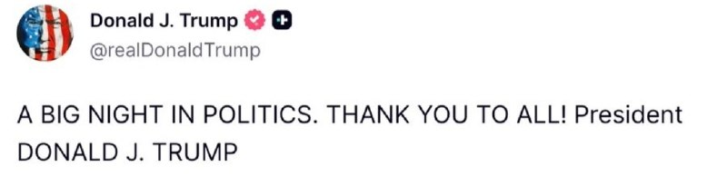

پست ترامپ تو ثروث سوشال : یه شب بزرگ تو سیاست؛ از همه متشکرم!

💛@Tans_Footbali

## Tans_Footbali — post 236360

  <a href="telegram/content/Tans_Footbali_236360_1779015097.webm" target="_blank">🎬 Download video</a>

🎉 ۵۰۰٬۰۰۰ تومان رایگان-بونوس ویژه ثبت‌نام

🔥 با هر ثبت نام ۵۰۰ هزار تومن جایزه بگیرید

⬅️ میتونید شرط‌بندی کنید و بونوس را به موجودی واقعی تبدیل کنید

⚽️  پوشش کامل مسابقات ورزشی 

📊  پیش‌بینی با بهترین ضرایب 

⚡️  تجربه سریع و حرفه‌ای

😀 پرداخت مستقیم و سریع بدون واسطه، بدون دردسر، واریز و برداشت در سریع‌ترین زمان ممکن

😀 کانال تلگرام: 

🔴 @winro_io  

😀 هدیه خود را با ثبت نام در سایت دریافت کنید: 

🔴 Winro.io

سایت اصلی در روزهای آینده بازگشایی خواهد شد 
✅

## Bad_chaneli — post 39508

تصاویر وایرال شده از یه خانم انگلیسی که خواستارِ اخراج مهاجرین از این کشوره🍑

@Bad_chaneli

## hamclasixii — post 75399

  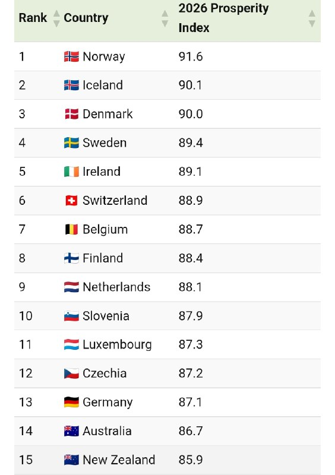

🔴نروژ به عنوان مرفه‌ترین کشور جهان در سال ۲۰۲۶ معرفی شد!

🔹رتبه‌بندی ترکیبی از عواملی مانند درآمد، مراقبت‌های بهداشتی، آموزش، اعتماد عمومی و ثبات اقتصادی است.
🔹در لیستی که متشکل از ۴۰ کشور برتر و مرفه دنیا منتشر شده است؛ نام ایران مشاهده ‌نمی‌شود.
🔹نکته عجیب این لیست؛ قرارگیری آمریکا در رتبه ۳۸ام است.

📚 @hamclasix 📚

## withyashar — post 11471

تایمز: انگلیس برای جنگ آماده می‌شود
 
این رسانه انگلیسی از افزایش بودجه دفاعی انگلیس خبر داد و هدف از آن را آماده شدن برای جنگ های آینده اعلام کرد
@withyashar

## withyashar — post 11470

مشاور سابق پنتاگون:تحرکات سطح بالای نیروی هوایی آمریکا در خاورمیانه شدت گرفته آماده باشید
@withyashar

## withyashar — post 11469

دارم میرم یات تولد ، شاید دایرکت ها رو درست نبینم کم اختلال داریم ولی من هستم 😬🙌🏾

## withyashar — post 11468

سی‌ان‌ان: ایران به کابل‌های اینترنتی تنگه هرمز چشم دوخته
@withyashar

---
📅 بروزرسانی: 1405/02/27 12:50
---

## persian_trend_official — post 14314

⭕️ دوستان، این حساب رسمی نیست. این اکانت صرفاً با پرداخت حدود ۱۰۰۰ دلار در ماه، تیک زرد (تأیید اشتراکی) دریافت کرده است. حساب‌های رسمی دولتی و سازمانی معمولاً تیک خاکستری دارند و اطلاعات هویتی و سازمانی آن‌ها به‌صورت شفاف در بخش Bio یا مشخصات حساب ثبت شده…

## persian_trend_official — post 14313

  

💢توییت اتاق جنگ اسرائیل 🫆:Tony 📌 @persian_trend_official پرشین ترند | متفاوت‌ترین کانال نظامی

## persian_trend_official — post 14312

خبرگزاری میزان

💢دادگاه رسیدگی به اتهامات صادق ساعدی‌نیا برگزار شد

🔹جلسه رسیدگی به اتهامات صادق ساعدی‌نیا، مدیرعامل شرکت صنعت غذایی و مدیر کافه‌های زنجیره‌ای ساعدی‌نیا از متهمان کودتای آمریکایی صهیونیستی دی ۱۴۰۴ در دادگاه انقلاب قم با حضور رئیس و مستشاران دادگاه، نماینده دادستان، متهم صادق ساعدی‌نیا و وکلای متهم برگزار شد.

🫆:Tony

📌 @persian_trend_official
پرشین ترند | متفاوت‌ترین کانال نظامی

## persian_trend_official — post 14311

  <a href="telegram/content/persian_trend_official_14311_1779009643.webm" target="_blank">🎬 Download video</a>

🔴 نشان ویژه برای خدمه ناو هواپیمابر «جرالد آر. فورد» و ناو گروه آن پس از جنگ ایران

💢سرپرست وزارت نیروی دریایی آمریکا اعلام کرد گروه ضربت ناو هواپیمابر «جرالد آر. فورد» و نیروهای گروه ضربت ناو هواپیمابر ۱۲ به‌دلیل عملکردشان در خاورمیانه طی جنگ اخیر ایران، نشان «واحد ریاست جمهوری» دریافت کرده‌اند.

💢بر اساس این بیانیه:

▪️ این گروه رزمی در عملیات‌های گسترده علیه اهداف ایرانی مشارکت داشته است
▪️ ادعا شده ۱۲۵ شناور جنگی ایرانی هدف قرار گرفته‌اند
▪️ همچنین ۲۰۷ موشک کروز «تاماهاوک» به اهدافی در ایران شلیک شده است

🔻در ادامه آمده:

💢 هواگردهای مستقر بر ناو «جرالد آر. فورد» بیش از ۱۷۰۰ سورتی پرواز رزمی از مدیترانه و دریای سرخ انجام داده‌اند

🫆:Tony

📌 @persian_trend_official
پرشین ترند | متفاوت‌ترین کانال نظامی

## persian_trend_official — post 14310

  <a href="telegram/content/persian_trend_official_14310_1779009643.webm" target="_blank">🎬 Download video</a>

⭕️ سی‌ان‌ان: ایران به کابل‌های اینترنتی تنگه هرمز چشم دوخته است!

📝 Nick

📌 @persian_trend_official
پرشین ترند | متفاوت‌ترین کانال نظامی

## persian_trend_official — post 14309

  

💢توییت اتاق جنگ اسرائیل

🫆:Tony

📌 @persian_trend_official
پرشین ترند | متفاوت‌ترین کانال نظامی

## persian_trend_official — post 14308

  

❌️ این عکس را چندین بار در گوگل لنز جست‌وجو کردیم، اما هیچ منبع معتبر یا رسانه قابل‌اعتمادی برای آن پیدا نشد.

به همین دلیل، به‌نظر می‌رسد این تصویر با هوش مصنوعی ساخته شده و واقعی نیست.

📝 Nick

📌 @persian_trend_official
پرشین ترند | متفاوت‌ترین کانال نظامی

## persian_trend_official — post 14307

  <a href="telegram/content/persian_trend_official_14307_1779009644.webm" target="_blank">🎬 Download video</a>

💢محمدباقر قالیباف، نمایندۀ ویژۀ ایران در امور چین شد

🔹پیش‌تر « علی لاریجانی» و «عبدالرضا رحمانی فضلی» چنین مسئولیتی را برعهده داشتند.

🫆:Tony

📌 @persian_trend_official
پرشین ترند | متفاوت‌ترین کانال نظامی

## persian_trend_official — post 14306

  

🔴دیلی میل: نخست وزیر انگلیس استعفا می‌دهد

💢دیلی میل گزارش داد استارمر نخست وزیر انگلیس در بحبوحه شورش فزاینده در حزبش، به نزدیکانش اطلاع داده است که قصد استعفا دارد.

💢بیش از ۹۰ نماینده مجلس از حزب کارگر در روزهای اخیر خواستار استعفای او شده‌اند.

🫆:Tony

📌 @persian_trend_official
پرشین ترند | متفاوت‌ترین کانال نظامی

## OfficialPersiaTwiter — post 498902

اکانت منتسب به اتاق جنگ اسرائیل یک حساب رسمی نیست.

🔹امروز توییتی از این اکانت بسیار پر بازدید شده بود که مشخص شد این حساب توییتری یک حساب رسمی نیست.
🔹این اکانت صرفاً با پرداخت حدود ۱۰۰۰ دلار در ماه، تیک زرد (تأیید اشتراکی) دریافت کرده است.
🔹حساب‌های رسمی دولتی و سازمانی معمولاً تیک خاکستری دارند و اطلاعات هویتی و سازمانی آن‌ها به‌صورت شفاف در بخش Bio یا مشخصات حساب ثبت شده است.

》OPT《

@OfficialPersiaTwiter

## OfficialPersiaTwiter — post 498901

  

جویدن آدامس؛ راهی ساده برای افزایش تمرکز؟

🔹برخی پژوهش‌ها نشان می‌دهد جویدن آدامس می‌تواند به‌طور موقت بر عملکرد مغز تأثیر مثبت بگذارد.
🔹عمل جویدن باعث افزایش جریان خون در مغز می‌شود و ممکن است به بهبود تمرکز و هوشیاری کمک کند.
🔹مطالعاتی نیز نشان داده‌اند که آدامس جویدن می‌تواند در کوتاه‌مدت حافظه کاری و سرعت واکنش را کمی افزایش دهد.
🔹همچنین این کار ممکن است سطح استرس را کاهش دهد و احساس آرامش بیشتری ایجاد کند.
🔹با این حال، اثرات آن معمولاً کوتاه‌مدت است و جایگزین روش‌های اصلی تقویت مغز مانند خواب کافی و تغذیه سالم نمی‌شود.
🔹مصرف بیش‌ازحد آدامس، به‌ویژه انواع شیرین، می‌تواند برای دندان‌ها یا دستگاه گوارش مشکل ایجاد کند.
🔹در مجموع، آدامس می‌تواند کمک کوچکی برای تمرکز باشد، اما تأثیر آن محدود و موقتی است.

》OPT《

@OfficialPersiaTwiter

## OfficialPersiaTwiter — post 498900

ضرورت بازگشایی سرویس‌های حیاتی؛ میلیون‌ها گوشی و رایانه در معرض فرسودگی نرم‌افزاری

🔹 ادامه قطع اینترنت بین‌الملل در ایران، علاوه بر کاهش دسترسی کاربران به خدمات آنلاین، حالا به یکی از چالش‌های جدی زیرساخت دیجیتال کشور تبدیل شده است. بسیاری از گوشی‌های هوشمند، رایانه‌ها و سامانه‌های نرم‌افزاری به دلیل ناتوانی در دریافت بروزرسانی‌های امنیتی و سیستمی با اختلال، کاهش کارایی و افزایش آسیب‌پذیری امنیتی مواجه شده‌اند؛ وضعیتی که کارشناسان آن را تهدیدی برای امنیت سایبری و پایداری خدمات دیجیتال می‌دانند./سیتنا

》OPT《

@OfficialPersiaTwiter

## OfficialPersiaTwiter — post 498899

🔴 نماینده کنگره آمریکا: باید فشار اقتصادی بر ایران را تشدید کنیم / کارلوس خیمنز:

"به نظرم باید فشار اقتصادی بر ایران را حفظ کنیم. امیدوارم محاصره کمی بیشتر ادامه پیدا کند تا فشار اقتصادی علیه آن‌ها واقعاً تشدید شود... باید این فشار را حفظ کنیم. خیلی زود آن‌ها دیگر جایی برای ذخیره نفت خود نخواهند داشت، و بعد وقتی شروع کنند به تعطیل کردن چاه‌ها و تأسیسات نفتی، این واقعاً برایشان فاجعه‌بار خواهد بود.

چون حتی وقتی دوباره آنها را راه‌اندازی کنید، بسیاری از آن‌ چاه‌ها دیگر به سطح تولید امروز برنمی‌گردند؛ بنابراین در آینده هم به آن‌ها آسیب خواهد زد. هرچه این وضعیت بیشتر طول بکشد، بدتر می‌شود. دست بالا با ماست، و امیدوارم رئیس‌جمهور این را بداند و به چیزی کمتر از اینکه ایران خواسته‌های ما را بپذیرد، رضایت ندهد."

》OPT《

@OfficialPersiaTwiter

## OfficialPersiaTwiter — post 498898

  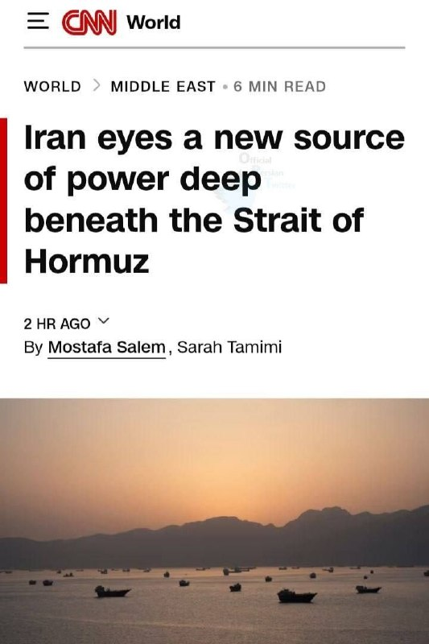

سی‌ان‌ان: ایران به کابل‌های اینترنتی تنگه هرمز چشم دوخته است!

》OPT《

@OfficialPersiaTwiter

## OfficialPersiaTwiter — post 498897

پاسخ تند ارتش پاکستان به هند: تهدید همسایه هسته‌ای دیوانگی است

روابط عمومی ارتش پاکستان:

🔹تهدید یک همسایه هسته‌ای مستقل با حذف از جغرافیا، یک اقدام استراتژیک یا ریسک‌پذیر نیست، بلکه از بین رفتن محض ظرفیت‌های شناختی، دیوانگی و جنگ‌طلبی با وجود دانستن این واقعیت است که چنین حذف جغرافیایی قطعاً متقابل و جامع خواهد بود.

🔹فرمانده ارتش هند بیانیه‌ای تحریک‌آمیز مبنی بر اینکه پاکستان باید تصمیم بگیرد که آیا می‌خواهد بخشی از جغرافیا و تاریخ باشد یا خیر صادر کرد.

》OPT《

@OfficialPersiaTwiter

## OfficialPersiaTwiter — post 498896

  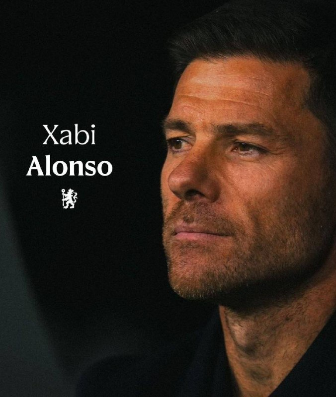

ژابی به فوتبال انگلیس بازگشت!

🔹با اعلام رسمی باشگاه چلسی، ژابی آلونسو با قراردادی ۴ ساله از ابتدای فصل آینده، هدایت آبی‌های لندن را برعهده خواهد گرفت.

》OPT《

@OfficialPersiaTwiter

## OfficialPersiaTwiter — post 498895

بازگشایی بازار سهام از روز سه‌شنبه ‌ معاون نظارت بر بورس‌ها و ناشران سازمان بورس و اوراق بهادار: برنامه‌ریزی لازم برای آغاز معاملات سهام و ابزارهای مربوط به آن از روز سه‌شنبه ۲۹ اردیبهشت ۱۴۰۵ انجام شده است. ‌ بر اساس هماهنگی‌های صورت‌گرفته و پس از اخذ مجوزهای…

## OfficialPersiaTwiter — post 498894

سخنگوی قوه قضائیه در مورد پرونده محمد ساعدی‌نیا: 🔹 که اگر کسی مرتکب عملی با آثاری مانند خسارت شده باشد، به صرف عذرخواهی پرونده‌اش مختومه نمی‌شود 🔹 جهانگیر گفت: رویه قضایی نشان می‌دهد که اگر کسی مرتکب عملی شده باشد که آن عمل آثاری از خود به جای گذاشته باشد،…

## OfficialPersiaTwiter — post 498893

  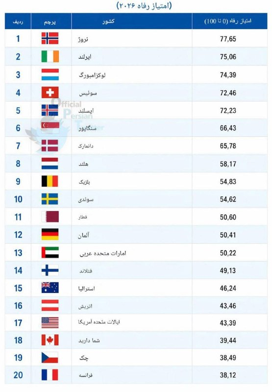

نروژ مرفه‌ترین کشور جهان در سال ۲۰۲۶

🔹نروژ در سال ۲۰۲۶ به عنوان مرفه‌ترین کشور جهان رتبه‌بندی شده است.
🔹این کشور در صدر گروه کشورهای شمال اروپا قرار دارد.
🔹رتبه‌بندی ترکیبی از عواملی مانند درآمد، مراقبت‌های بهداشتی، آموزش، اعتماد عمومی و ثبات اقتصادی است.
🔹با وجود داشتن بزرگ‌ترین اقتصاد جهان، آمریکا در کل رتبه بسیار پایین‌تری دارد.
🔹این موضوع تفاوت بین اندازه اقتصادی و نتایج گسترده‌تر کیفیت زندگی را نشان می‌دهد.

》OPT《

@OfficialPersiaTwiter

## OfficialPersiaTwiter — post 498891

اینترنت رانتی در بازار سیاه/ قیمت اینترنت پرو ۸ میلیون تومان شد

گزارش اقتصادنیوز از وضعیت بازار سیاه اینترنت:
🔹️ گزارش‌های میدانی و پیام‌های واسطه‌ها حاکی از آن است که زیرساخت‌های ثبت‌نام برخی اپراتورها (مانند همراه اول) به دلیل هجوم این درخواست‌ها یا بازنگری در قوانین، به طور موقت مسدود شده است، در حالی که در اپراتورهای دیگر (مانند ایرانسل) این بازار سیاه با وعده فعال‌سازی ۳ تا ۱۵ روزه همچنان داغ است. 

》OPT《

@OfficialPersiaTwiter

## OfficialPersiaTwiter — post 498890

جزئیاتی از طرح فروش سانتی‌متری مسکن در تهران

مدیرعامل سازمان سرمایه‌گذاری شهرداری تهران:
🔹سال گذشته جزئیات طرح «خانه‌ریز» و اهداف آن تشریح شد و قرار بود عرضه اولیه پروژه در اسفندماه انجام شود، اما همزمانی با شرایط جنگی و تلاطم‌های ناشی از آن، اجرای طرح را با تأخیر مواجه کرد.
🔹یکی از موانع اصلی آغاز پروژه، صدور پروانه شهرسازی بود که خوشبختانه هفته گذشته صادر شد و اگر شرایط طبق برنامه پیش برود، تا پایان اردیبهشت یا حداکثر هفته نخست خرداد، عرضه عمومی پروژه آغاز خواهد شد.
🔹شهروندان می‌توانند از طریق سامانه و با ایجاد حساب کاربری و شارژ کیف پول خود، از مبالغ پایین حتی یک میلیون تومان در این پروژه سرمایه‌گذاری کنند.
🔹ارزش سهام افراد متناسب با پیشرفت فیزیکی پروژه و قیمت روز ملک افزایش پیدا می‌کند و کارشناسان رسمی به‌صورت ماهانه ارزش‌گذاری پروژه را انجام خواهند داد. در نتیجه سرمایه افراد همزمان با رشد پروژه و تورم بازار مسکن افزایش خواهد یافت./تسنیم

》OPT《

@OfficialPersiaTwiter

## OfficialPersiaTwiter — post 498889

  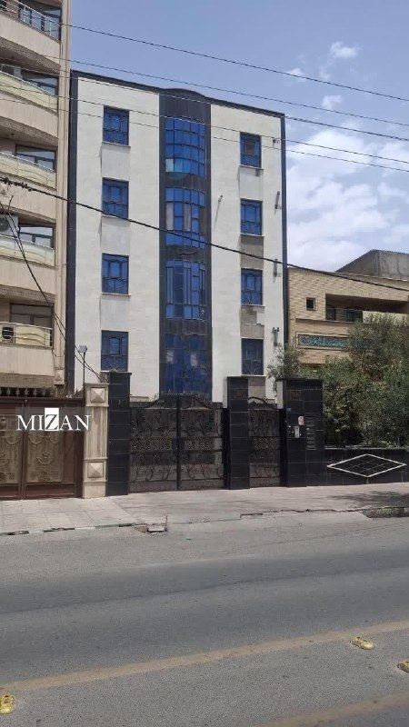

اموال مهدی نصیری و ۲۱ نفر از عناصر وابسته به دشمن در استان سمنان به نفع مردم توقیف شد 🔹 اسامی ۲۲ نفر شامل: مهدی نصیری، زینب عوض آبادی، فاطمه کوچک‌پور، محمدعلی فئوادی، زینب اکبری، فرانک رهبر، هدیه کیمیایی، درسا رهبر، علی آریان صابر، رها پوراسماعیل، احسان…

## OfficialPersiaTwiter — post 498888

  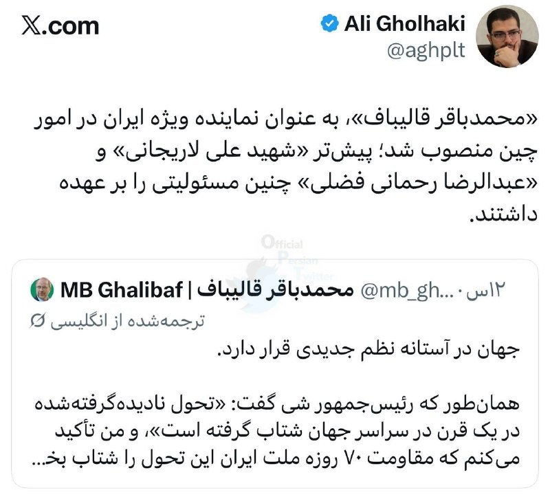

‏«محمدباقر قالیباف»، به عنوان نماینده ویژه ایران در امور چین منصوب شد؛ پیش‌تر «شهید علی لاریجانی» و «عبدالرضا رحمانی فضلی» چنین مسئولیتی را بر عهده داشتند.

》OPT《

@OfficialPersiaTwiter

## OfficialPersiaTwiter — post 498887

‏«حالا یه بار کافه نری که نمیمیری»، «چندتا آهنگ نتونی تو اسپاتیفای گوش ندی که نمیمیری»
اتفاقاً کم‌کم میمیریم. زندگی فقط زنده بودن نیست؛ همین خوشی‌ های کوچیکه: قهوه، موسیقی، دورهمی، شب‌گردی، خریدای الکی. وقتی یکی‌یکی ازت گرفته بشن، فقط نفس میکشی

》daylight《

@OfficialPersiaTwiter

## bbcpersian — post 281287

  

🔻رئیس‌کل دادگستری استان قم از مصادره سه آپارتمان مهدی نصیری و «وابستگانش» خبر داد.

بنابر اعلام دادگستری قم این آپارتمان‌ها «در حوزه ثبتی استان قم» بوده است.

کاظم موسوی گفت این اموال با گزارش اطلاعات سپاه و پیگیری دادسرای مرکز استان قم توقیف شده است.

قوه قضائیه ایران حدود دو هفته پیش گفته بود که «با دستور مقام قضائی»، اموال آقای نصیری و ۲۱ نفر دیگر که «علیه امنیت و ثبات کشور» اقدام کرده بودند در استان سمنان، مصادره شده است.

مهدی نصیری که مدتی مدیر مسئول روزنامه کیهان بود در سال‌های اخیر مخالف حکومت و از ایران خارج شد.

قوه قضائیه پس از جنگ اخیر برای کسانی که «هم‌صدا» یا «همراه» دشمن می‌خواند، پرونده تشکیل می‌دهد و با استناد به قانون «تشدید مجازات جاسوسی»، مجازات‌هایی مثل ممنوعیت فعالیت و توقیف اموال در نظر می‌گیرد.

قوه قضائیه فهرستی هم از افرادی منتشر کرده که برای «حمایت از جنگ»، اموالشان توقیف یا مصادره شده است.

با تشدید ضبط اموال طیف وسیعی از اقشار جامعه از خبرنگار تا بازیگر و فعال سیاسی و هنرمند و ورزشکار، قوه قضائیه جلوگیری از انتقال اموال را هم آغاز کرده است.

📸TABNAK
@BBCPersian

## bbcpersian — post 281286

  

🔻مهدی تاج دیدار و مداکره با دبیر کل فیفا «مثبت» خواند.
رئیس فدراسیون فوتبال ایران در استانبول با ماتیاس گرافستروم، دبیر کل فیفا، دیدار و گفت‌گو کرد.
آقای تاج گفت که در این دیدار مقامات فیفا به «۱۰ نکته‌ای که ایران مطرح کرد، گوش دادند و برای هر یک از آنها راه‌حل ارائه کردند.»
او ابراز امیدواری کرد که تیم ملی فوتبال ایران بتواند بدون هیچ مشکلی به جام جهانی برود.
ماتیاس گرافستروم هم گفت: «نشست بسیار خوب و سازنده‌ای با فدراسیون فوتبال ایران داشتیم. ما همکاری نزدیکی داریم و مشتاقانه منتظر استقبال از آنها در جام جهانی فیفا هستیم.»
تیم ملی فوتبال ایران قرار است فردا تهران را به مقصد ترکیه ترک کند. اردوی آماده سازی تیم ملی در ترکیه برگزار می‌شود.

📸Reuters
https://bbc.in/4uTejZc
@BBCPersian

## Lichargoo — post 24894

ببینید دختر ایرونی چیه که دریک با وجود اینکه تو لیست اکساش ریحانا هست همش داره تو اهنگاش از اکس ایرانیش میگه

## Pesari_Ke_Konie — post 44953

برای کسی نامحدود نباشین، آدم‌ها گیگی دوست دارن.

@Pesari_Ke_Konie

## Pesari_Ke_Konie — post 44952

🔴 امروز May 17، روز جهانی کونیا یا همون همجنس‌گراهاست 🏳️‍🌈 @Pesari_Ke_Konie

## Pesari_Ke_Konie — post 44951

🔴 امروز May 17، روز جهانی کونیا یا همون همجنس‌گراهاست 🏳️‍🌈

@Pesari_Ke_Konie

## pussy0poeemm — post 167913

  <a href="telegram/content/pussy0poeemm_167913_1779009650.mp4" target="_blank">🎬 Download video</a>

این ویدیو مربوط به اواسط جنگه
بچه پولدارامون تو یه دنیای دیگن

@pussy0poeemm

## pussy0poeemm — post 167912

  <a href="telegram/content/pussy0poeemm_167912_1779009651.mp4" target="_blank">🎬 Download video</a>

دوستان این داستان تو فیلم هندی هم قفله😂فقط فحش های پسره

@pussy0poeemm

## Tans_Footbali — post 236359

  <a href="telegram/content/Tans_Footbali_236359_1779009653.mp4" target="_blank">🎬 Download video</a>

آب هنوز به طبقه بالای کشتی نرسیده! توی دوران جنگ و فشار اقتصادی ناشی از بیکاری چن میلیونی یه سری بچه پولدار اینطوری کف تهران عشق و حال میکنن

@Tans_Footbali

## Tans_Footbali — post 236358

  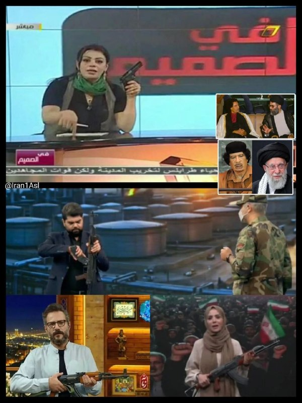

تو صدا و سیما به مجری ها اسلحه دادن که برای دشمن رجز بخونن. @Tans_Footbali

## Tans_Footbali — post 236357

  <a href="telegram/content/Tans_Footbali_236357_1779009655.mp4" target="_blank">🎬 Download video</a>

مجری: خواهش می‌کنم سلام من رو به مجتبی خامنه‌ای برسونید.

حدادعادل: والا منم به دامادم دسترسی ندارم، از همین‌جا بهش سلام می‌رسونم.

@Tans_Footbali

## Tans_Footbali — post 236356

  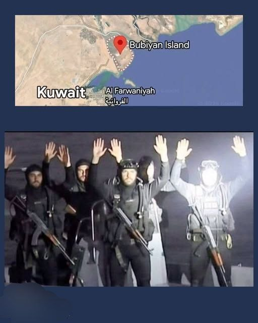

🇰🇼×🇮🇷 کویت تصویر تسلیم شدن چهار تروریست سپاهی را منتشر کرد!

🚨‏کویت با صدور بیانیه‌ای جمهوری اسلامی را به حمله به جزیره «بوبیان» با قایق‌های ماهیگیری متهم کرد و اعلام کرد نیروهای سپاه تروریستی قصد خرابکاری داشتند؛ یک نظامی کویتی در این درگیری زخمی و ۴ تن از عناصر وابسته به سپاه دستگیر شدند.
‏چهار سپاهی (احتمالا نیروی قدس) با دیدن اولین اسلحه دست طرف مقابل تسلیم شدند !
‏
دو سرهنگ، یک سرگرد و یک ستوان‌یکم عملیات آغاز نشده لو رفت و تسلیم شدند!

@Tans_Footbali

## Bad_chaneli — post 39507

  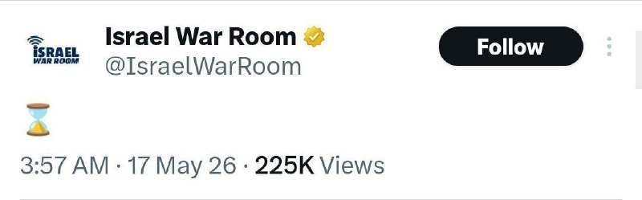

توییت اتاق جنگ اسرائیل «⌛».
آخرین باری که این توییت رو زدن فرداش حمله رو شروع کردن

@Bad_chaneli

## hamclasixii — post 75398

🔴#فوری | مبنای برگزاری کنکور مصوبات قانونی جاری است/ هیچ گونه تغییری در کنکور امسال نداریم

اطلاعیه مهم ستاد تعلیم و تربیت شورای عالی انقلاب فرهنگی در خصوص مصوبه کنکور:
🔹ستاد تعلیم و تربیت دبیرخانه شورای عالی انقلاب فرهنگی با صدور اطلاعیه‌ای، به تشریح سیر تکوینی مصوبه سنجش و پذیرش در سه دولت متوالی، بر مرجعیت قانونی شورا بر اساس دستور صریح رهبر شهید انقلاب تأکید کرد.

📚 @hamclasix 📚

## withyashar — post 11467

## withyashar — post 11466

داداش شما رئیس سواک میشی شک نکن

## withyashar — post 11465

فک کنم ساواک روزی که برگرده باید اول به من بگه دادچ آرشیوتو بیار 🤣

## withyashar — post 11464

  <a href="telegram/content/withyashar_11464_1779009656.mp4" target="_blank">🎬 Download video</a>

الان بحث داغه دیدن این ویدیو شاهین نجفی هم که در اوایل شروع ‌به کارش برام فرستاد خالی از‌ لطف نیست ، من امید وارم همه با هم متحد باشن و مشکلات تموم بشه
@withyashar

## withyashar — post 11463

  <a href="telegram/content/withyashar_11463_1779009658.mp4" target="_blank">🎬 Download video</a>

اینا همش به تاریخ پیوست…
@withyashar

## withyashar — post 11462

تو اين مدت هر وقت كه ولنجك رد ميشم ياد شما ميافتم، هميشه و هميشه و هميشه اين ويديو رو براى شما گرفتم و صميم قلبم آرزو كردم به زودى خود شمارو تو ايران ببينيم🌸

## withyashar — post 11461

عباس عراقچی، اعلام کرد که کتاب «قدرت مذاکره» او به چاپ پنجم رسیده و در چاپ جدید این کتاب، بخش جدیدی با عنوان «دیپلماسی زیر آتش» درباره روند «مذاکرات غیرمستقیم با آمریکا در جنگ ۱۲ روزه» به آن افزوده شده است.
@withyashar

## withyashar — post 11460

تو اين مدت هر وقت كه ولنجك رد ميشم ياد شما ميافتم، هميشه و هميشه و هميشه اين ويديو رو براى شما گرفتم و صميم قلبم آرزو كردم به زودى خود شمارو تو ايران ببينيم🌸

## withyashar — post 11459

تو اين مدت هر وقت كه ولنجك رد ميشم ياد شما ميافتم، هميشه و هميشه و هميشه
اين ويديو رو براى شما گرفتم و صميم قلبم آرزو كردم به زودى خود شمارو تو ايران ببينيم🌸

## withyashar — post 11458

## withyashar — post 11457

## withyashar — post 11456

---
📅 بروزرسانی: 1405/02/27 10:53
---

## persian_trend_official — post 14305

  <a href="telegram/content/persian_trend_official_14305_1779002598.webm" target="_blank">🎬 Download video</a>

⭕️ حماس: هشدار می‌دهیم که همه گزینه‌ها بر روی میز است. 📝 Nick 📌 @persian_trend_official پرشین ترند | متفاوت‌ترین کانال نظامی

## persian_trend_official — post 14301

  <a href="telegram/content/persian_trend_official_14301_1779002598.mp4" target="_blank">🎬 Download video</a>

⭕️ صبح امروز طی حمله پهپاد‌ی گسترده ارتش اوکراین چندین منطقه در مسکو مورد اصابت قرار گرفتند!

به گزارش منابع روسی بیش از 10 نقطه در مسکو هدف قرار گرفتند. وزارت دفاع روسیه مدعی سرنگونی 148 پهپاد اوکراینی است. در ویدیو‌ها لحظه و نتیجه اصابت چند پهپاد و همچنین رهگیری یک پهپاد توسط سامانه پانتیسر روسی مشخص است.

📝 Nick

📌 @persian_trend_official
پرشین ترند | متفاوت‌ترین کانال نظامی

## persian_trend_official — post 14300

  

⭕️ 6 هواپیمای ترابری C-17 در حال ورود به پایگاه‌های ارتش آمریکا در منطقه هستند.

📝 Nick

📌 @persian_trend_official
پرشین ترند | متفاوت‌ترین کانال نظامی

## persian_trend_official — post 14299

⭕️ حماس: هشدار می‌دهیم که همه گزینه‌ها بر روی میز است.

📝 Nick

📌 @persian_trend_official
پرشین ترند | متفاوت‌ترین کانال نظامی

## persian_trend_official — post 14298

  <a href="telegram/content/persian_trend_official_14298_1779002602.mp4" target="_blank">🎬 Download video</a>

⭕️ رئیس کانون عالی بازنشستگان تأمین اجتماعی:

تاکنون ۲۲۳ هزار نفر درخواست بیمه بیکاری داده‌اند.

📝 Nick

📌 @persian_trend_official
پرشین ترند | متفاوت‌ترین کانال نظامی

## persian_trend_official — post 14297

  

کابل زیردریایی «Asia Link»؛ گام تازه چین برای استقلال دیجیتال در آسیا

چین از راه‌اندازی یک کابل زیردریایی جدید با نام «Asia Link» خبر داده؛ پروژه‌ای با طول حدود ۶۲۰۰ کیلومتر و ظرفیت انتقال بیش از ۳۲۵ ترابیت بر ثانیه که چند کشور کلیدی شرق و جنوب‌شرق آسیا را به هم متصل می‌کند.

این کابل چین را به سنگاپور، ویتنام، مالزی، برونئی و فیلیپین وصل می‌کند و برای نخستین‌بار، یکی از نقاط اتصال خارجی این شبکه خارج از سرزمین اصلی چین و در هنگ‌کنگ قرار گرفته است.

اهمیت این پروژه فقط در بُعد فنی نیست. در حال حاضر بخش عمده مسیرهای اصلی اینترنت جهانی و کابل‌های زیردریایی در اختیار شرکت‌ها و زیرساخت‌های غربی قرار دارد. چین با توسعه چنین پروژه‌هایی به‌دنبال ایجاد مسیرهای جایگزین و کاهش وابستگی به این شبکه‌هاست.

پ.ن : این کابل بخشی از یک روند بزرگ‌تر است؛ شکل‌گیری یک «اینترنت موازی آسیایی» که در صورت تشدید رقابت‌های ژئوپلیتیکی، می‌تواند به تفکیک زیرساخت‌های ارتباطی شرق و غرب منجر شود.

📌 @persian_trend_official
پرشین ترند | متفاوت‌ترین کانال نظامی

## persian_trend_official — post 14296

تیتر مهم‌ترین اخبار ۲۴ ساعت گذشته 👇

تشدید تحرکات نظامی آمریکا در خلیج فارس و دریای عمان

افزایش سطح آماده‌باش نیروهای مسلح ایران در جنوب کشور

ادامه مذاکرات غیررسمی تهران–واشنگتن با محور تنگه هرمز

ورود تجهیزات و نیروهای جدید آمریکایی به پایگاه‌های منطقه

هشدار ایران به هرگونه مداخله نظامی خارجی در هرمز

بررسی طرح ائتلاف دریایی برای اسکورت نفتکش‌ها

افزایش قیمت نفت در واکنش به ریسک امنیت انرژی

اختلال محدود در مسیر برخی کشتی‌های تجاری در منطقه

تشدید پرواز پهپادهای شناسایی آمریکا نزدیک مرزهای ایران

استقرار بیشتر جنگنده‌ها و بمب‌افکن‌ها در خاورمیانه

افزایش سطح هشدار امنیتی در امارات و بحرین

نشست اضطراری کشورهای غربی درباره امنیت کشتیرانی

تأکید رسانه‌های غربی بر حفظ توان بازدارندگی ایران

افزایش حملات و فعالیت‌های سایبری در زیرساخت‌های حساس

گسترش عملیات‌های اطلاعاتی در کشورهای اطراف ایران

تشدید جنگ رسانه‌ای میان ایران و آمریکا

آماده‌باش نیروهای دریایی در منطقه خلیج فارس

بررسی گزینه‌های نظامی محدود در پنتاگون

هشدار شرکت‌های بیمه به کشتی‌ها درباره عبور از هرمز

افزایش تردد نظامی در اطراف تنگه هرمز

📌 @persian_trend_official
پرشین ترند | متفاوت‌ترین کانال نظامی

## persian_trend_official — post 14295

  

⭕️ دولت ونزوئلا اعلام کرد «الکس صائب» از متحدان نزدیک نیکولاس مادورو را به ایالات متحده تحویل داده است.

صائب پیش‌تر از سوی آمریکا به پول‌شویی، فساد مالی و دور زدن تحریم‌ها متهم شده بود. برخی رسانه‌ها و گزارش‌های امنیتی نیز در سال‌های گذشته از ارتباط او با شبکه‌های نزدیک به حزب‌الله و جمهوری اسلامی صحبت کرده بودند، اما این ادعاها به‌صورت رسمی و قطعی اثبات نشده‌اند.

Reuters

📝 Nick

📌 @persian_trend_official
پرشین ترند | متفاوت‌ترین کانال نظامی

## persian_trend_official — post 14290

⭕️ «16 می در مودِنا، ایتالیا، یک خودرو وارد پیاده‌رو شد و دست‌کم ۸ عابر پیاده را زخمی کرد. ۴ نفر از مصدومان در وضعیت وخیم هستند و راننده نیز بازداشت شده است. مقام‌های ایتالیایی می‌گویند هنوز انگیزه حادثه روشن نیست و بررسی‌ها ادامه دارد.»

Reuters

📝 Nick

📌 @persian_trend_official
پرشین ترند | متفاوت‌ترین کانال نظامی

## persian_trend_official — post 14289

  <a href="telegram/content/persian_trend_official_14289_1779002606.webm" target="_blank">🎬 Download video</a>

رسوایی پزشکی در دانشگاه‌های آمریکا؛ فروش اجساد اهدایی برای آموزش ارتش اسرائیل 
🔹رسانه‌های آمریکا گزارش داده‌اند دو دانشگاه مطرح این کشور، اجسادی را که شهروندان برای تحقیقات پزشکی و علمی اهدا کرده بودند را در اختیار ارتش اسرائیل قرار داده‌اند. 
🔹این افشاگری…

## persian_trend_official — post 14288

  <a href="telegram/content/persian_trend_official_14288_1779002607.mp4" target="_blank">🎬 Download video</a>

ویو هوایی از ترافیک قفل شده تنگه هرمز

📌 @persian_trend_official
پرشین ترند | متفاوت‌ترین کانال نظامی

## persian_trend_official — post 14285

  <a href="telegram/content/persian_trend_official_14285_1779002609.webm" target="_blank">🎬 Download video</a>

فعالیت رزمی ناو گروه ضربت هواپیمابر آبراهام لینکلن در ۲۵۰ کیلومتری جنوب بندر چابهار.

📝 Nick

📌 @persian_trend_official
پرشین ترند | متفاوت‌ترین کانال نظامی

## OfficialPersiaTwiter — post 498886

انگلیس سیستم جدید ضد پهپاد در خاورمیانه مستقر کرد

🔹️ انگلیس یک سیستم موشکی ضد پهپاد کم‌هزینه جدید را در اختیار نیروی هوایی سلطنتی این کشور که در خلیج فارس فعالیت می‌کنند، در خاورمیانه  قرار داده است./تسنیم

》OPT《

@OfficialPersiaTwiter

## OfficialPersiaTwiter — post 498885

واژگونی اتوبوس در کمربندی کنگان با ۸ کشته

🔹بر اثر واژگونی اتوبوس در محور عسلویه به کنگان ۸ نفر از شهروندان جان باختند.

🔹هم اکنون نیروهای در حال انتقال سایر مصدومان این حادثه به مراکز درمانی هستند.

🔹علت حادثه در دست بررسی است.

》OPT《

@OfficialPersiaTwiter

## OfficialPersiaTwiter — post 498884

  <a href="telegram/content/OfficialPersiaTwiter_498884_1779002610.mp4" target="_blank">🎬 Download video</a>

رئیس کانون عالی بازنشستگان تامین اجتماعی: تا الان ۲۲۳ هزار نفر درخواست بیمه بیکاری دادند.

》OPT《

@OfficialPersiaTwiter

## OfficialPersiaTwiter — post 498883

بزرگسالی یعنی تو داروها، شرکت مورد علاقه‌تو داشته باشی.

》Cʜɪʜɪʀᴏ《

@OfficialPersiaTwiter

## OfficialPersiaTwiter — post 498882

آب ۴۸ ساعت در عسلویه قطع می‌شود

آب و فاضلاب عسلویه:
🔹با توجه به تعمیرات ضروری در خط انتقال آب کوثر، آب شهرستان عسلویه از ساعت ۶ صبح روز دوشنبه، ۲۸ اردیبهشت‌ماه به مدت ۴۸ ساعت قطع خواهد شد./ مهر

》OPT《

@OfficialPersiaTwiter

## OfficialPersiaTwiter — post 498881

پیش‌بینی کیهان از احتمال جنگ جدید علیه ایران

روزنامه کیهان:
🔹احتمال بروز جنگ اسرائیل و آمریکا علیه ایران در زمانی نه چندان دور وجود دارد.
🔹باقی ماندن شرایطی که وقوع دو جنگ قبلی را در پی داشت، احتمال شکل‌گیری جنگ جدید را توجیه می‌کند.
🔹در عین حال عواملی که سبب شکست دشمنان مهاجم در دو جنگ قبلی شده همچنان پابرجاست.
🔹همین موضوع تکرار جنگ را برای دشمنان پرهزینه و دشوار می‌کند.

》OPT《

@OfficialPersiaTwiter

## OfficialPersiaTwiter — post 498880

قتل هولناک نوزاد ۴۰ روزه در مشهد

مادر نوزاد می گوید:
🔹از خوزستان به مشهد آمدیم و سوئیتی را در خیابان نوغان اجاره کردیم.
🔹دو روز قبل همسرم که مواد مخدر صنعتی مصرف می‌کند دچار توهم و بدبینی شد.
🔹او ناگهان تصور کرد نوزاد متعلق به فرد دیگری است.
🔹ماهی‌تابه حاوی تخم‌مرغ را برداشت و با آن ضربات هولناکی به سر نوزاد زد.
🔹سپس با کف دستش چند ضربه دیگر به سر او کوبید.
🔹بعد هم نوزاد را به شدت به زمین کوبید و باعث مرگش شد.
🔹پس از این ماجرا جسد کودک را داخل یخچال مسافرخانه گذاشت.
🔹او مرا تهدید کرد چیزی به کسی نگویم تا اینکه دو روز بعد موضوع را به صاحب سوئیت اطلاع دادم./خراسان

》OPT《

@OfficialPersiaTwiter

## OfficialPersiaTwiter — post 498879

  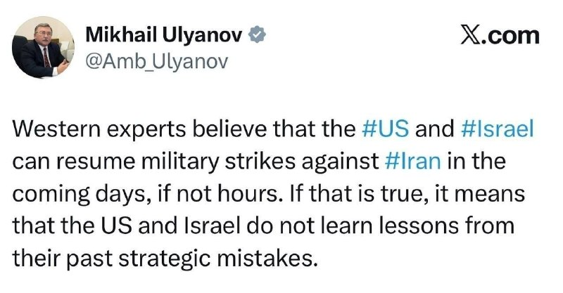

🔹میخائیل اولیانوف، نمایندهٔ روسیه در ژنو: کارشناسان غربی معتقدند که ایالات متحده و اسرائیل ممکن است در روزهای آینده، اگر نه در ساعات آینده، حملات نظامی علیه ایران را از سر بگیرند. اگر این درست باشد، به این معناست که آمریکا و اسرائیل از اشتباهات راهبردی گذشته خود درس نگرفته‌اند.

》OPT《

@OfficialPersiaTwiter

## OfficialPersiaTwiter — post 498878

انسداد محور کرج - چالوس امروز منتفی شد / تردد به روال عادی برگشت

رییس پلیس راه البرز گفت:
🔹انسداد محورکرج - چالوس که قرار بود امروز اجرا شود، لغو و تردد خودروها در این محور طبق روال عادی ادامه دارد.
🔹آغاز انسداد مقطعی جاده کرج - چالوس در محدوده این استان به دلیل اجرای عملیات عمرانی از فردا دوشنبه ۲۸ اردیبهشت آغاز می شود.
🔹این انسداد به منظور اجرای عملیات نصب توری سنگی در حدفاصل رستوران عسل کوچ تا تونل شماره چهارم محور کرج - کندوان انجام می‌شود.
🔹عملیات عمرانی از روز دوشنبه تا چهارشنبه ۲۸ الی ۳۰ اردیبهشت ماه جاری از ساعت ۹ صبح تا ۱۴ اجرا خواهد شد و در این مدت تردد در این محدوده امکان‌پذیر نیست.

》OPT《

@OfficialPersiaTwiter

## OfficialPersiaTwiter — post 498877

  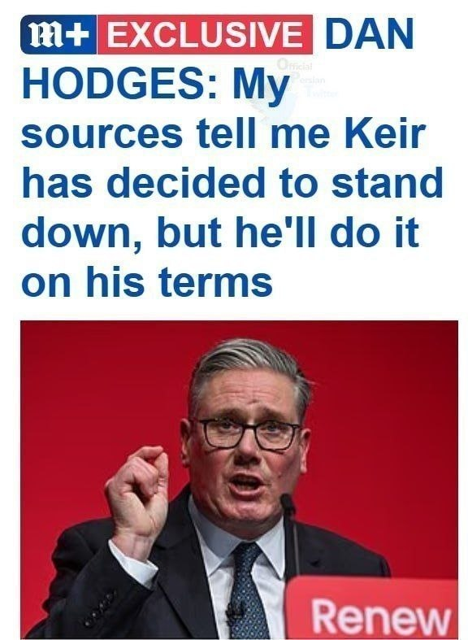

تلگراف: احتمالا استارمر به نفع شهردار منچستر از قدرت کناره‌گیری کند 🔹در پی شکست سنگین نخست‌وزیر انگلیس در انتخابات محلی، رسانه انگلیسی گزارش داد که شاید کی‌یر استارمر به صورت داوطلبانه به نفع شهردار منچستر از سمتش به عنوان نخست‌وزیر انگلیس کناره‌گیری کند.…

## OfficialPersiaTwiter — post 498876

اینترنت در کشور، این همه مسئول می‌خواهد چه کار؟/ چندمدیریتی اعتماد مردم را از بین برده است

سیدفرید موسوی، نماینده مجلس:
🔹اعلام تشکیل ستاد ویژه ساماندهی فضای مجازی یادآور یک واقعیت تلخ در حکمرانی اینترنت است
🔹ما هر بار به جای حل مسئله یک ساختار جدید به ساختارهای قبلی اضافه می‌کنیم
🔹امروز اگر از مردم بپرسیم مسئول اینترنت در کشور کدام نهاد است پاسخ روشنی وجود ندارد
🔹وقتی اینترنت دچار اختلال می‌شود افکار عمومی نمی‌داند تصمیم نهایی کجا گرفته شده است
🔹در بزنگاه‌های مهم مسئولیت نهایی همچنان مبهم می‌ماند
🔹مشکل اصلی تعدد نهادها و تعارض میان آنها در تصمیم‌گیری است
🔹اقتصاد دیجیتال بیش از هر چیز به ثبات پیش‌بینی‌پذیری و اعتماد نیاز دارد
🔹اعتماد عمومی با تکثیر نهادها بازسازی نمی‌شود بلکه با شفافیت و پاسخ‌گویی ترمیم خواهد شد.

》OPT《

@OfficialPersiaTwiter

## OfficialPersiaTwiter — post 498874

  <a href="telegram/content/OfficialPersiaTwiter_498874_1779002615.mp4" target="_blank">🎬 Download video</a>

اقتصاددانی در ایتالیا عابران را زیر گرفت

🔹پلیس ایتالیا اعلام کرد راننده خودرویی در شهر مودنا گروهی از عابران پیاده را زیر گرفت و قصد داشت فرار کند که بازداشت شد؛ دارای مدرک اقتصاد معرفی شده است.
🔹در این حادثه هشت نفر مجروح شدند که حال چهار نفر آنان وخیم گزارش شده است.
🔹این حادثه موجی از نگرانی را در میان مقامات ارشد ایتالیا برانگیخته است.
🔹جورجیا ملونی، نخست‌وزیر ایتالیا، با انتشار پیامی در شبکه اجتماعی x اعلام کرد که شخصاً در حال رصد این وضعیت بحرانی است و با شهردار مودنا و مقامات امنیتی در تماس مداوم قرار دارد.

》OPT《

@OfficialPersiaTwiter

## OfficialPersiaTwiter — post 498873

چرا بعد از زلزله پردیس شایعاتی مانند «آزمایش نظامی» و «هارپ» مطرح شد؟

مهدی زارع، استاد پژوهشکده بین‌المللی زلزله‌شناسی و مهندسی زلزله:
🔹فضای روانی جامعه در شرایطی که اخبار تنش‌های امنیتی جریان دارد زمینه شکل‌گیری چنین برداشت‌هایی را فراهم می‌کند
🔹در چنین شرایطی هر رخداد طبیعی به سرعت در قالب روایت‌های امنیتی یا نظامی تفسیر می‌شود.
🔹پس از زلزله پردیس در شبکه‌های اجتماعی ادعاهایی درباره آزمایش موشکی و انفجار زیرزمینی مطرح شد
🔹ادعای آزمایش هسته‌ای زیرزمینی از نظر علمی هیچ پایه‌ای ندارد.
🔹عمق این زمین‌لرزه حدود ۱۰ کیلومتر ثبت شده در حالی که آزمایش‌های هسته‌ای در عمق بسیار کمتری انجام می‌شوند.
🔹تفاوت میان انفجار و زمین‌لرزه طبیعی در داده‌های لرزه‌نگاری کاملاً قابل تشخیص است
🔹انفجارهای سطحی یا نزدیک سطح زمین نمی‌توانند گسل‌هایی را که در عمق چند کیلومتری قرار دارند فعال کنند
🔹پروژه هارپ اساساً طرحی پژوهشی برای مطالعه یونوسفر است و توان ایجاد زلزله ندارد./خبرآنلاین

》OPT《

@OfficialPersiaTwiter

## OfficialPersiaTwiter — post 498872

فرصت ۲ ساله مالکان قولنامه‌ای برای ثبت ادعا در سامانه رسمی اسناد غیررسمی

🔹سخنگوی سازمان ثبت اسناد و املاک کشور از راه‌اندازی آزمایشی «سامانه ثبت ادعا» (ساماندهی اسناد غیررسمی) از ۱۲ آذر ۱۴۰۴ خبر داد.

🔹 به گفته وی، این سامانه پس از اعلام رسمی رئیس قوه قضاییه و درج در روزنامه رسمی، فعال می‌شود و مالکان املاکی که سند رسمی ندارند یا سند به نامشان صادر نشده، تنها دو سال فرصت دارند ادعای خود را با درج نقشه دارای مختصات جغرافیایی ملک ثبت کنند.

》OPT《

@OfficialPersiaTwiter

## OfficialPersiaTwiter — post 498871

العربیه به نقل از پاکستان:وزیر کشور پاکستان جلسه مهمی در ایران برای تسهیل گفت‌وگو و برقراری صلح برگزار کرد 🔹️حضور وزیر کشور پاکستان در ایران یک روز دیگر ادامه خواهد یافت تا در مورد چشم‌انداز ازسرگیری مذاکرات گفت‌وگو شود. 》OPT《 @OfficialPersiaTwiter

## bbcpersian — post 281279

🔻بخش مانیتورینگ بی‌بی‌سی

پارلمان عراق بار دیگر بحث بازگرداندن خدمت سربازی اجباری را از سر گرفته است. خدمت اجباری از سال ۱۹۳۵ تا ۲۰۰۳ یکی از ارکان اصلی ساختار حکومت عراق به شمار می‌رفت، اما پس از حمله آمریکا به عراق، انحلال ارتش و جایگزینی آن با نظام داوطلبانه، لغو شد.

حامیان این طرح می‌گویند بازگرداندن خدمت اجباری می‌تواند به تقویت هویت ملی، افزایش آمادگی نظامی و ایجاد فرصت برای جوانان بیکار کمک کند.

در مقابل، مخالفان معتقدند این طرح بار مالی سنگینی بر دوش دولت خواهد گذاشت و با ماهیت جنگ‌های مدرن که بیش از نیروهای انبوه بر فناوری‌های پیشرفته تکیه دارند، هم‌خوانی ندارد. این بحث هم‌زمان با مناقشه گسترده‌تر درباره نقش و ساختار نهادهای امنیتی عراق مطرح شده است؛ از جمله گروه‌های مسلح هم‌سو با ایران که در جنگ اخیر آمریکا و اسرائیل با ایران نقش داشتند.

ادامه مطلب را از لینک زیر بخوانید.

https://bbc.in/4tBMlQn
📸GettyImages/ Reuters/ Anadolu via Getty Images/ AFP via Getty Images
@BBCPersian

## bbcpersian — post 281278

  

🔻‌سازمان بهداشت جهانی شیوع بیماری ابولا در استان ایتوری در شرق جمهوری دموکراتیک کنگو را «وضعیت اضطراری بهداشت عمومی با نگرانی بین‌المللی» اعلام کرده است.

این سازمان گفته است که با وجود حدود ۲۴۶ مورد مشکوک و ۸۰ مورد مرگ گزارش‌شده، این شیوع هنوز شرایط لازم برای این که به‌عنوان وضعیت اضطراری همه‌گیری (پاندمی) اعلام شود را ندارد.

تدروس آدهانوم گبریسوس، مدیرکل سازمان بهداشت جهانی، هشدار داد که در حال حاضر «ابهام‌های قابل‌توجهی درباره تعداد واقعی مبتلایان و گستره جغرافیایی شیوع» وجود دارد.

به گفته این سازمان، سویه فعلی ابولا ناشی از ویروس «بوندیبوگیو» است که برای آن هنوز هیچ دارو یا واکسن تاییدشده‌ای وجود ندارد.

این سازمان اعلام کرد تاکنون هشت مورد تایید آزمایشگاهی ثبت شده و موارد مشکوک و مرگ‌ومیرهایی هم در سه منطقه، از جمله شهر بونیا (مرکز استان ایتوری) و شهرهای مونگوالو و راموارا گزارش شده است.

سازمان بهداشت جهانی همچنین گفته است که  این ویروس از مرزهای این کشور فراتر رفته و دو مورد تاییدشده نیز در کشور همسایه، اوگاندا، گزارش شده است.

📸ISSOUF SANOGO/AFP via Getty Images
https://bbc.in/4uTN14Q
@BBCPersian

## bbcpersian — post 281270

🖊️نسرین حاطوم،
خبرنگار بی‌بی‌سی عربی در امور خلیج فارس

🔻کمتر از دو ساعت پس از تایید رسمی دفتر نخست‌وزیر اسرائیل مبنی بر سفر او به امارات متحده عربی و دیدار با محمد بن زاید، رئیس این کشور در جریان جنگ ایران، وزارت امور خارجه امارات این سفر را تکذیب و استقبال از هرگونه هیئت نظامی اسرائیلی در خاک خود را رد کرد.

در این بیانیه آمده است: «بر این اساس، هرگونه ادعا درباره دیدارها یا ترتیبات اعلام‌نشده، تا زمانی که از سوی نهادهای رسمی ذی‌صلاح در امارات صادر نشده باشد، هیچ پایه و اساسی ندارد.»

وزارت امور خارجه امارات از رسانه‌ها خواست که «دقیق باشند و اطلاعات غیرمستند را منتشر نکنند یا از آن برای ایجاد برداشت‌های سیاسی استفاده نکنند.»

بیانیه امارات پس از آن منتشر شد که دفتر نخست‌وزیر اسرائیل در شبکه ایکس نوشت بنیامین نتانیاهو در جریان جنگ آمریکا و اسرائیل با ایران - عملیاتی که اسرائیل آن را «غرش شیر» نامید- سفری محرمانه به امارات داشته است.

ادامه این مطلب را از لینک زیر بخوانید.

https://bbc.in/3Pkg5U1
📸Getty/ Reuters
@BBCPersian

## bbcpersian — post 281269

  

🔻وزارت دفاع آمریکا تایید کرده است که ناو هواپیمابر یواس‌اس جرالد فورد که پیش از آغاز جنگ با ایران به خاورمیانه اعزام شده بود، پس از ۳۲۶ روز مأموریت،شنبه به ایالات متحده بازگشته است.

این طولانی‌ترین مأموریت یک گروه رزمی ناو هواپیمابر آمریکا از زمان جنگ ویتنام تاکنون بوده است.

پیت هگست، وزیر دفاع آمریکا، در نورفک در ایالت ویرجینیا برای استقبال از بزرگ‌ترین ناو هواپیمابر جهان حضور داشت.

به گفته ارتش آمریکا، این ناو در جریان ماموریت خود در عملیات‌های آمریکا در منطقه کارائیب مشارکت داشت؛ جایی که نیروهای آمریکایی به قایق‌های مظنون به قاچاق مواد مخدر حمله کرده، نفتکش‌های تحریم‌شده را توقیف و نیکلاس مادورو، رهبر ونزوئلا، را بازداشت کردند.

در طول این ماموریت طولانی، در ۱۲ مارس یک آتش‌سوزی در بخش رخت‌شویی ناوایجاد شد که دو ملوان را زخمی کرد و به حدود ۱۰۰ تخت خواب آسیب جدی رساند. گزارش‌هایی نیز از مشکلات گسترده سیستم فاضلاب و سرویس‌های بهداشتی این ناو در زمان حضور در دریا منتشر شده بود.

📸Anadolu via Getty Images
https://bbc.in/4eSjrrK
@BBCPersian

## bbcpersian — post 281268

  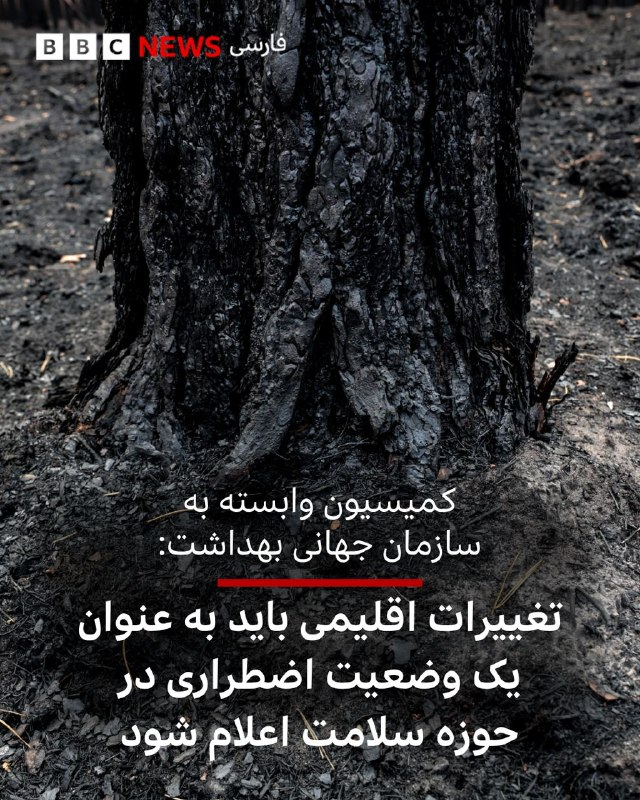

‌🔻کمیسیونی که از سوی سازمان جهانی بهداشت تشکیل شده، خواستار آن است که تغییرات اقلیمی به‌عنوان یک وضعیت اضطراری بین‌المللی در حوزه سلامت عمومی اعلام شود.

این بالاترین سطح هشدار بهداشتی است.

این هیئت مشورتی مستقل می‌گوید که چنین اقدامی می‌تواند به بسیج یک واکنش بین‌المللی در مقیاسی که لازم است کمک کند.

این هیئت تأکید می‌کند که تغییرات اقلیمی تهدیدی مربوط به آینده نیست، بلکه بحرانی فوری و رو‌به‌رشد است.

این کمیسیون تاکید کرده است که یارانه‌های سوخت‌های فسیلی باید به‌تدریج حذف شوند و از سازمان جهانی بهداشت می‌خواهد که فوراً اقدام کند.
📷NurPhoto via Getty
@BBCPersian

## Lichargoo — post 24893

  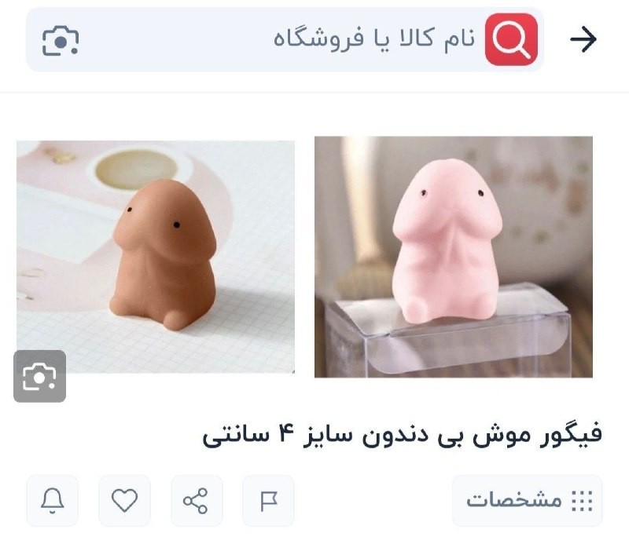

داخل ترب دارن اینارو می‌فروشن😂😂😂

@Lichargoo

## kobsihub — post 27753

فشار روانی فقط اونجا که آقای وی پی انی که تو
معرفیش کردی به دوستات،
کانفیگاش وصل نمیشه...

Saad @kobsihub

## pussy0poeemm — post 167910

  <a href="telegram/content/pussy0poeemm_167910_1779002621.mp4" target="_blank">🎬 Download video</a>

تقابل آلیس رزنبلوم، مدل مشهور اونلی فنز با یه پسر ایرانی؛

- آلیس رزنبلوم :
من دارم ماهی نیم میلیون دلار درمیارم و نیازی ندارم که یه هندی رندوم بخواد تحقیرم کنه.
+ پسر ایرانی :
اولا که من هندی نیستم ایرانی‌ام، بعدشم تو چطور می‌تونی اونلی فنز داشته باشی و کُص و کونت رو واسه 7 دلار به نمایش بذاری؟ ترکش کن.
- آلیس رزنبلوم :
من قرار نیست با حرف یه هندی اونلی فنز رو ترک کنم، من کلی پول دارم در میارم، تو چه ارزشی داری؟
+ پسر ایرانی :
من صاحب یه کسب و کار کوچیکم ، ولی خب ارزشی که تو به این دنیا میدی چیه؟

[در نهایت هم آلیس قهر کرد و رفت ، مردم هم تو کامنت‌ها حسابی طرف این پسر ایرانی رو گرفتن]

@pussy0poeemm

## pussy0poeemm — post 167909

  <a href="telegram/content/pussy0poeemm_167909_1779002624.mp4" target="_blank">🎬 Download video</a>

این جنگ باعث شد که اصلا کسی دقت نکنه کی داره چیکار میکنه، قشنگ زوار‌ همچی در رفته؛

🎙️مداح‌ : وقت نبرده بابا، به ترامپ بیناموس بگو، بچه کونه بابا

@pussy0poeemm

## pussy0poeemm — post 167908

افغانستان: اینترنت 5G
عراق: رفع فیلتر تلگرام
سوریه:ویزا و مستر کارت
ایران: کیر

## pussy0poeemm — post 167907

‏از وقتی خدا تومن پول کانفیگ دادم تازه فهمیدم چرا معتاد فرش زیر پاشم میفروشه مواد میخره

## pussy0poeemm — post 167906

‏باورتون میشه یه زمانی انقدر فراوانی وی‌پی‌ان بود که مینشستید دو ساعت عشق ابدی کسشر میدیدید و اینجا هم راجع بش بحث میکردید؟

## pussy0poeemm — post 167905

فرق ما با پورن استارا اينه كه اونا ميدونن تو روز قراره چندتا كير بخورن. ولي ما نميدونيم

## pussy0poeemm — post 167904

  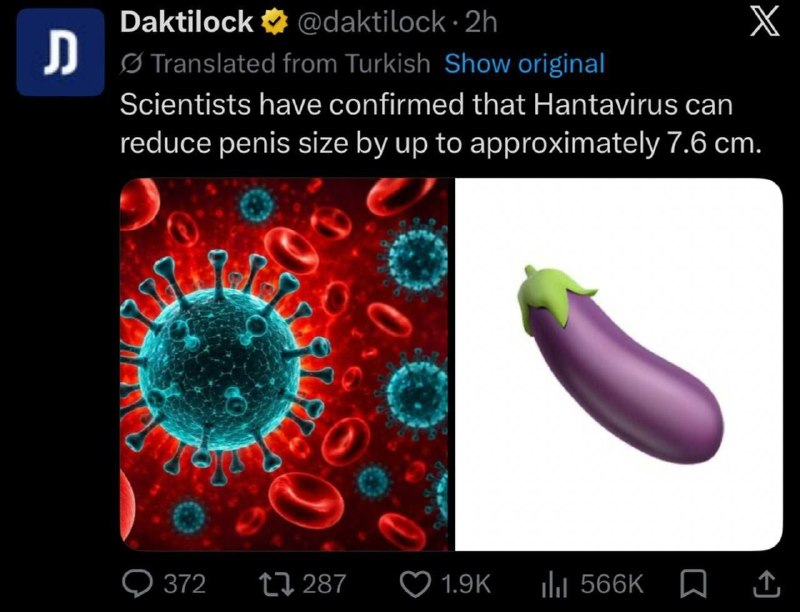

دانشمندا تایید کردن هانتاویروس میتونه ۷.۶ سانت از سایز آلت تناسلی رو کم کنه.

کسایی که به این بیماری مبتلا میشن تقریبا نصف بیشتر کیرشون رو از دست میدن!

@pussy0poeemm

## pussy0poeemm — post 167903

  <a href="telegram/content/pussy0poeemm_167903_1779002627.mp4" target="_blank">🎬 Download video</a>

جوری که تو پیوی اون رفیقم که وصله باهم حال میکنیم:

@pussy0poeemm

## pussy0poeemm — post 167902

لیست مشاغل باقی مونده توی ایران :
کانفیگ فروش
عرق فروش
آدم فروش
تریاک فروش

@pussy0poeemm

## pussy0poeemm — post 167901

  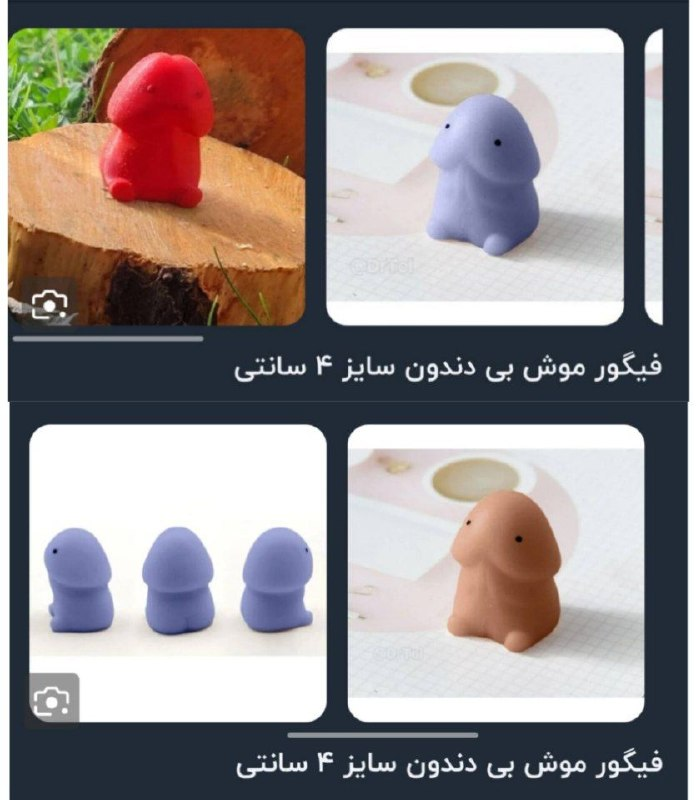

توی فروشگاه های آنلاین کشور دارن کالایی رو به اسم «موش بی دندون» میفروشن که معلوم نیست کاربردش دقیقا چیه.
همون دول موشی نیست؟!
@pussy0poeemm

## pussy0poeemm — post 167900

  <a href="telegram/content/pussy0poeemm_167900_1779002629.mp4" target="_blank">🎬 Download video</a>

فیلم «تهران کنارت» جدیدترین فیلمیه که بعد از جنگ توی سینماها اکران شده.
حجاب به طرز قابل توجهی کنار رفته و در تیزر رسمی فیلم خواننده زن یعنی سوگند داره میخونه.
این فیلم به‌ همین دلایل دو سال توقیف بود ولی الان آزاد شده.

@pussy0poeemm

## Tans_Footbali — post 236355

در مورد افشین پیروانی و سردار آزمون این روزها یه جوی راه افتاده که بهشون لقب‌هایی مثل اسطوره، باشرف، مردمی و... میدن.

در حالی که یکی‌شون آمریکا کنار خانواده‌اش بوده و اون یکی هم بخاطر استوری حمایتی که همیشه برای حاکمان امارات میذاره محروم شده و دلیل محرومیتش حمایت از مردم یا انقلاب شیروخورشید و.. نبوده

متاسفانه ما همیشه دنبال اسطوره‌سازی برای خودمون هستیم

💛@Tans_Footbali

## hamclasixii — post 75397

  <a href="telegram/content/hamclasixii_75397_1779002631.mp4" target="_blank">🎬 Download video</a>

🔴صداوسیما: با اعلام مدیر کل آموزش و پرورش تهران؛ دانش آموزان پایه های هفتم تا دهم دیگه امتحان خرداد ندارند و با توجه به عملکرد علمی یکساله سنجیده میشوند!

📚 @hamclasix 📚

## hamclasixii — post 75396

  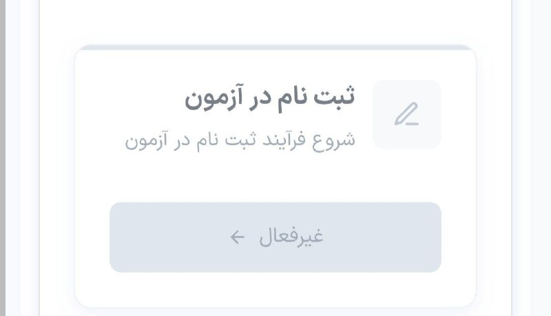

🔴خبری که بعضی از کانال‌ها زدن در خصوص شروع ثبت نام کنکور فیکه و ثبت نام هنوز شروع نشده!

+ صرفا یک سری تغییرات ظاهری در سایت سنجش اعمال شده که احتمالا همین چند روز اطلاعیه ثبت نام کنکور منتشر بشه؛ هر خبری باشه خودمون قرار میدیم براتون

📚 @hamclasix 📚

## hamclasixii — post 75395

🔴ادغام کنکور سراسری و آزمون پذیرش دانشجو معلمان منتفی شد/ آزمون‌ها با شرایط سال قبل برگزار می‌شود

🔹ادغام آزمون پذیرش دانشجو معلمان با کنکور سراسری به دلیل شرایط کشور از سوی  وزیر آموزش و پرورش به شورای عالی انقلاب فرهنگی پیشنهاد داده شد که این موضوع در جلسات شورای عالی انقلاب فرهنگی مورد بررسی قرار گرفت.
🔹بر اساس جمع بندی ادغام این دو آزمون در شورای معین مصوب نشد و بر اساس اعلام شورای عالی انقلاب فرهنگی کنکور سراسری ۱۴۰۵ و آزمون پذیرش دانشجو معلمان به صورت همزمان در یک روز، اما به صورت مجزا برگزار خواهد شد.
🔹یکی از موضوعاتی که در آزمون دانشجو معلمان مطرح شده بود ارزیابی پذیرش دانشجویان برای ورود به دانشگاه فرهنگیان بود که قرار بود این ارزیابی برای آزمون امسال برگزار نشود که این موضوع نیز منتفی شد و آزمون پذیرش دانشجو معلمان کماکان به صورت مجزا و با همان شرایط سال قبل برگزار می‌شود.

📚 @hamclasix 📚

## withyashar — post 11455

## withyashar — post 11454

## withyashar — post 11453

  

📷 Photo

## withyashar — post 11452

## withyashar — post 11451

## withyashar — post 11450

## withyashar — post 11449

عجب جمله ای: اهدافت رو از ملی به مالی تغییر میده. رحمت به شیری که تو خوردی یاشار 🙏💪💚🤍❤️

## withyashar — post 11448

این لحنم نبود🤣🤣🤣🤣بد گذاشتی ک

## withyashar — post 11447

ولت براچی گذاشتی تو

## withyashar — post 11446

ولت براچی گذاشتی تو

## withyashar — post 11445

## withyashar — post 11444

پدرم در اومد رسیدم تلگرام چرا روبیکا خبر نمیزاری یاشار

## withyashar — post 11443

پدرم در اومد رسیدم تلگرام چرا روبیکا خبر نمیزاری یاشار

## withyashar — post 11442

معاون وزیر خارجه روسیه دقایقی پیش از قریب‌الوقوع بودن حمله آمریکا و اسرائیل به ایران خبر داد.
@withyashar

## withyashar — post 11441

تاج: فیفا برای هر ۱۰ شرط ما برای حضور در جام جهانی راه‌حل ارائه داده
@withyashar

## withyashar — post 11440

## withyashar — post 11439

نظرت راجب فرستاده پاکستان چیه؟ بنظرت احتمالش هست بتونه کانکت کنه و جنگ مجدد درصدش کم بشه ؟

## withyashar — post 11438

## withyashar — post 11437

داداش یاشار
خیلی از کانالا دارن میگن که هواپیماهای c17 آمریکا دارن خاورمیانه رو ترک میکنن .
این یعنی چی؟

## withyashar — post 11436

سلام وقتت بخیر با توجه به اینکه این اتاق‌ جنگ اسرائیل تیک زرد داره هنوزم فیکه؟ چون تیک زرد خریدنی نیست تا جایی که من خوندم

---
📅 بروزرسانی: 1405/02/27 07:53
---

## persian_trend_official — post 14282

  <a href="telegram/content/persian_trend_official_14282_1778991810.mp4" target="_blank">🎬 Download video</a>

صبحتون بخیر ☕️🔥

📝 Nick
📌 @persian_trend_official
پرشین ترند | متفاوت‌ترین کانال نظامی

## bbcpersian — post 281267

🔻حملات گسترده اسرائیل به جنوب لبنان به‌رغم تمدید آتش‌بس

اسرائیل با وجود تمدید آتش‌بس با لبنان، موج گسترده‌ای از حملات هوایی را علیه جنوب آن کشور آغاز کرد.

اسرائیل می‌گوید که اهداف مرتبط با حزب‌الله را هدف قرار می‌دهد، اما پیش از حملات هشدار تخلیه‌ای برای ساکنان ۹ روستا صادر شده بود.

ادامه بمباران‌ها تردیدها درباره دوام آتش‌بس را در میان ده‌ها هزار لبنانی افزایش داده است که از خانه‌های خود در جنوب گریخته‌اند.

خبرگزاری رسمی لبنان، گزارش داد که روز شنبه بیش از دهها روستا هدف حمله قرار گرفتند؛ از جمله منطقه‌ای در بیش از ۵۰ کیلومتری مرز.

این خبرگزاری همچنین از موج تازه خروج ساکنان به سمت شهر جنوبی صیدا و پایتخت، بیروت، خبر داد.
@BBCPersian

## bbcpersian — post 281266

🔻فیفا: گفت‌وگوهای با فدراسیون فوتبال ایران مثبت و سازنده بود

ماتیاس گرافستروم، دبیرکل فیفا، به خبرگزاری رویترز گفت که دیدار «سازنده و مثبتی» با مهدی تاج، رئیس فدراسیون فوتبال ایران داشت و نسبت به حضور ایران در جام جهانی امسال ابراز اطمینان کرده است.

ایران قرار است هر سه مسابقه مرحله گروهی خود را در آمریکا برگزار کند، اما پس از حملات آمریکا و اسرائیل به ایران در اواخر فوریه، ابهام‌هایی درباره حضور تیم ملی ایران در رقابت‌های ۱۱ ژوئن تا ۱۹ ژوئیه به وجود آمده بود.

گرافستروم در جریان سفرش به استانبول گفت: «نشست بسیار خوب و سازنده‌ای با فدراسیون فوتبال ایران داشتیم. ما از نزدیک با هم همکاری می‌کنیم و مشتاقانه منتظر استقبال از آن‌ها در جام جهانی فیفا هستیم.»

او از ارائه جزئیات درباره وضعیت ویزای بازیکنان ایران خودداری کرد، اما گفت که آنها فرصت داشتند درباره برخی مسائل اجرایی گفت‌وگو کنند و تبادل‌نظر مثبتی داشته باشند.

پس از آن‌که مهدی تاج اوایل این ماه به دلیل ارتباط با سپاه پاسداران اجازه ورود به کانادا برای شرکت در کنگره فیفا در ونکوور را نیافت، پرسش‌های بیشتری درباره وضعیت ایران مطرح شد.

آمریکا و کانادا، که همراه با مکزیک میزبان مشترک جام جهانی هستند، سپاه پاسداران را «سازمانی تروریستی» می‌دانند و می‌گویند که افراد مرتبط با این نهاد را نخواهند پذیرفت.
@BBCPersian

## bbcpersian — post 281265

🔻وزیر پیشین ونزوئلا و متحد مادورو به آمریکا مسترد شد

الکس ساب، وزیر پیشین صنایع ونزوئلا، به آمریکا مسترد شده است.

ساب، بازرگان ثروتمند متولد کلمبیا، از نزدیکان نیکلاس مادورو، رئیس‌جمهور برکنار‌شده ونزوئلا بود.

او در ماه فوریه در کاراکاس و در جریان عملیاتی مشترک میان مقام‌های آمریکایی و ونزوئلایی بازداشت شد.

هنوز مشخص نیست که الکس ساب با چه اتهام‌هایی روبه‌روست.

او پیشتر نیز در سال ۲۰۲۰ در جمهوری «کیپ ورد»، مجمع‌الجزایری در غرب آفریقا، بازداشت و برای مواجهه با اتهام پول‌شویی به آمریکا مسترد شده بود اما سه سال بعد در چارچوب تبادل زندانیان عفو شد.
@BBCPersian

## bbcpersian — post 281264

🔻حامیان شورای ملی مقاومت ایران در واشنگتن خواهان حمایت از تغییر حکومت شدند

ایرانیان آمریکایی و حامیان شورای ملی مقاومت ایران روز شنبه در واشنگتن تجمع و راهپیمایی کردند و خواهان پایان اعدام‌ها در ایران و حمایت بین‌المللی از «تغییر دموکراتیک» شدند.

به گزارش رویترز، شرکت‌کنندگان که پرچم شیروخورشید در دست داشتند، همچنین در کنار تصاویر افرادی گردآمدند که به گفته برگزارکنندگان حکومت ایران آنها را اعدام کرده است.

علیرضا جعفرزاده، معاون دفتر واشنگتن شورای ملی مقاومت ایران گفت که معترضان سه خواسته اصلی دارند؛ توقف اعدام‌ها، به رسمیت شناختن جایگزینی برای حکومت فعلی و حمایت از «مقاومت سازمان‌یافته» در داخل ایران.

کارلا سندز، سفیر پیشین آمریکا در دانمارک، با ایده مداخله نظامی آمریکا مخالفت کرد و گفت تغییر حکومت از طریق بمباران به دست نخواهد آمد.

او گفت: «این مردم ایران هستند که باید این حکومت را سرنگون کنند، نه نیروهای نظامی آمریکا.»

پاتریک جی. کندی، نماینده پیشین کنگره آمریکا نیز این مقطع را «تاریخی» توصیف کرد و حکومت ایران را «بزرگ‌ترین اعدام‌کننده مردم خود در جهان» و «بزرگ‌ترین حامی دولتی تروریسم» خواند.

سونا سامسامی، نماینده شورای ملی مقاومت ایران در آمریکا، هم تاکید کرد که «شبکه مقاومت سازمان‌یافته در داخل ایران همچنان پایه اصلی تغییر است.»
@BBCPersian

## bbcpersian — post 281263

  

‌🔻با هجوم مردم برای خرید یک ساعت جدید و تولید محدود، شرکت سواچ ناچار شد فروشگاه‌هایش را در سراسر بریتانیا تعطیل کند.

صدها نفر مشتاق خرید یک ساعت جدید با تولید محدود، بیرون شعب فروشگاه سواچ صف کشیده بودند.

این شرکت سوئیسی اعلام کرد که «به دلیل ملاحظات ایمنی برای مشتریان و کارکنان خود» فروشگاه‌های خود را در لندن باز نخواهد کرد.

شعب این فروشگاه‌ در شهرهای بیرمنگام، کاردیف، گلاسکو، لیورپول، منچستر و شفیلد نیز همچنان بسته خواهند ماند.

این شرکت قرار بود ساعت جیبی جدید «رویال پاپ» خود را با همکاری شرکت اودمر پیگه در هشت مدل با قیمت تقریبی ۴۵۰ دلار عرضه کند.

اودمر پیگه، شرکتی است که به ساخت ساعت و جواهرات قیمتی شهرت دارد.

با بسته شدن فروشگاه‌ها، سواچ در حال حاضر این ساعت را به صورت آنلاین و با قیمت بیش از ۲۱ هزار دلار برای فروش گذاشته است.
ادامه از:
https://bbc.in/3Rgv5Tp
📷Swatch
@BBCPersian

## bbcpersian — post 281262

  

‌🔻دونالد ترامپ، رئیس‌جمهور آمریکا در شبکه اجتماعی تروث سوشال، تصویر گرافیکی خود را در کنار یک فرمانده نظامی کشورش منتشر کرده و روی آن نوشته شده است: «آرامش پیش از طوفان».

این تصویر آقای ترامپ را روی عرشه یک ناو جنگی نشان می‌دهد که در فضایی طوفانی و در میان شناورهایی با پرچم جمهوری اسلامی قرار دارد.

آقای ترامپ همچنین یک انیمیشن در این شبکه اجتماعی منتشر کرده است که به ناو آمریکایی دستور شلیک به هدفی با پرچم جمهوری اسلامی را می‌دهد.

این دو پست آقای ترامپ بعد از آن است که روزنامه نیویورک تایمز به نقل از دو مقام در خاورمیانه بدون ذکر نام، گزارش داد که آمریکا و اسرائیل در حال آماده شدن برای احتمال از سرگیری حملات علیه ایران هستند؛ حملاتی که به طور بالقوه حتی در هفته پیش رو می‌تواند شروع شود.

مقام‌های جمهوری اسلامی ایران در مورد هرگونه حمله به آن کشور هشدار داده‌اند و می‌گویند که با شدت بیشتر به این حملات احتمالی پاسخ خواهند داد.
📷RealDonaldTrump
@BBCPersian

## bbcpersian — post 281261

🔻واکنش وزارت خارجه ایران به کشته‌شدن عزالدین حداد

وزارت امور خارجه ایران کشته‌شدن عزالدین حداد، فرمانده کل گردان‌های قسام، همسر و فرزندش را «به‌شدت» محکوم کرد.

در بیانیه این وزارتخانه آمده است: «این اقدام تروریستی و ترورهای مشابه بخشی از طرح جنایتکارانه اسرائیل برای محو استعماری فلسطین است.»

وزارت امور خارجه ایران می‌گوید که «بدون تردید حذف جسمانی فرماندهان مقاومت و نخبگان فلسطینی، نه تنها خللی به مکتب و مسیر مقاومت وارد نخواهد کرد، بلکه الهام‌بخش رهروان و مجاهدان راه عزت و آزادی فلسطین خواهد شد.»

بنیامین نتانیاهو، نخست‌وزیر و اسرائیل کاتس، وزیر دفاع اسرائیل در بیانیه‌ای مشترک گفتند که عزالدین حداد «مسئول قتل، ربایش و زخمی شدن هزاران غیرنظامی اسرائیلی و نیروهای ارتش اسرائیل» بوده است.

مراسم تشییع عزالدین حداد روز شنبه در شهر غزه برگزار شد.

اگرچه از ماه اکتبر آتش‌بس در این منطقه برقرار بوده، اما دولت اسرائیل می‌گوید که همچنان اختیار هدف قرار دادن اعضای حماس را دارد.
@BBCPersian

## bbcpersian — post 281260

🔻حزب‌الله:‌ با پهپاد یک پادگان نظامی را در شمال اسرائیل هدف قرار دادیم

حزب‌الله اعلام کرد که یک هدف نظامی را در شمال اسرائیل هدف قرار داده است. این در حالی است که آتش‌بس شکننده میان لبنان و اسرائیل نتوانسته به درگیری‌ها در جنگی که از دوم مارس آغاز شد پایان دهد.

این گروه مورد حمایت ایران در بیانیه‌ای گفت که نیروهایش «پادگان یعارا» را با «گروهی از پهپادهای تهاجمی» هدف قرار داده‌اند.

حزب‌الله پیش‌تر نیز از چند عملیات علیه نیروهای اسرائیلی در جنوب لبنان خبر داده بود؛ جایی که به گفته این گروه، اسرائیل همچنان مناطقی در نزدیکی مرز دو کشور را در اشغال دارد.
@BBCPersian

## bbcpersian — post 281255

‌🔻نارندا مودی، نخست‌وزیر هند چند روز پیش اعلام کرد: «برای منافع کشور ما تصمیم گرفتیم به مدت یک سال حتی اگر مناسبت‌ها و مراسمی در پیش داشته باشیم جواهرات طلا نخریم».

او در ادامه گفت: «وطن‌دوستی فقط آمادگی برای فدا کردن جان در مرزهای کشور نیست. در این دوران به معنای زندگی مسئولانه و انجام وظایف نسبت به وطن در زندگی هر روزه است».

سه روز بعد عوارض واردات طلا از ۶٪ به ۱۵٪ افزایش پیدا کرد.

این تصمیم دشواری برای دومین بازار بزرگ طلا در جهان از نظر جواهر و سرمایه‌گذاری بود. در سال مالی گذشته، ارزش واردات این فلز گرانبها در این کشور ۷۲ میلیارد دلار بود.

در هند طلا نقش فرهنگی مهمی دارد چون اغلب در مراسم عروسی هدیه داده می‌شود و همچنین به عنوان میراث به وارثان می‌رسد.

مودی می‌گوید خرید طلا مستلزم صرف رقم بالایی ارز خارجی در زمانی است که هند که با افزایش قیمت نفت رو‌به‌رو است. این کشور آسیای جنوبی بیش از ۸۵٪ از نفت مورد نیاز خود را وارد می‌کند.

قیمت نفت در اوج و پس از شروع جنگ آمریکا و اسرائیل با ایران و بسته شدن تنگه هرمز افزایش پیدا کرد.
ادامه از:
https://bbc.in/3PbhZq2
📸GettyI / LightRocket
@BBCPersian

## bbcpersian — post 281254

  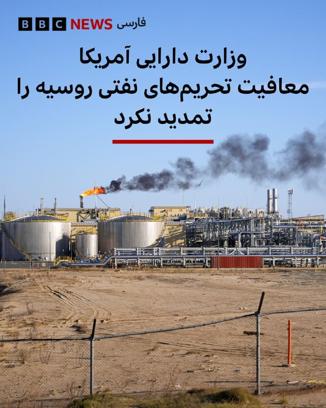

‌🔻آمریکا معافیت تحریم‌هایی را که به کشورهایی از جمله هند اجازه می‌داد نفت روسیه را با هدف جبران کمبود عرضه نفت و قیمت‌های بالای ناشی از بسته شدن تنگه هرمز خریداری کنند، تمدید نکرد.

معافیت از این تحریم‌ها پیش از این برای یک ماه تمدید شده بود.

اسکات بسنت، وزیر دارایی ایالات متحده، پیش از این گفته بود که مجوز عمومی خرید نفت روسیه که در نفتکش‌ها ذخیره شده بود را تمدید نخواهد کرد.

تا اوایل بعد از ظهر شنبه ۲۶ اردیبهشت به وقت واشنگتن، هیچ اطلاعیه تمدیدی در وب‌سایت وزارت دارایی آمریکا منتشر نشده بود.

جین شاهین و الیزابت وارن، دو سناتور ارشد دموکرات آمریکایی، روز جمعه با استدلال اینکه معافیت تحریم نفتی روسیه به نفع جنگ علیه اوکراین، درآمد ایجاد می‌کند، از دولت ترامپ خواستند که این معافیت را تمدید نکند.

تمدید قبلی این معافیت از تحریم‌ها، بخشی از تلاش دولت ترامپ برای کنترل قیمت‌های جهانی انرژی بود که در طول جنگ ایران افزایش یافت.

📷Getty
@BBCPersian

---
📅 بروزرسانی: 1405/02/27 03:39
---

## persian_trend_official — post 14281

## bbcpersian — post 281253

  

‌🔻بلغارستان با اجرای ترانه «بانگارانگا» برنده مسابقه امسال یوروویژن شد.

دارینا نیکولایوا یوتووا، خواننده بلغارستانی که با نام هنری دارا فعالیت می‌کند نماینده کشورش در یوروویژن امسال بود.

رقابت‌های امسال، زیر سایه اعتراض به حضور اسرائیل، در شرایط امنیتی شدید برگزار شد و حواشی زیادی داشت.

حضور اسرائیل که مقام دوم این مسابقات را کسب کرد، جنجال‌برانگیز شده بود و چند کشور شرکت در این مسابقه و پخش تلویزیونی آن را به دلیل حضور اسرائيل تحریم کرده بودند.

با این حال، اجرای نماینده اسرائیل بدون حادثه برگزار شد؛ هرچند هنگام اعلام امتیاز اسرائیل، در داخل سالن صدای هو کردن و اعتراض شنیده شد.
📷Reuters
@BBCPersian

## bbcpersian — post 281245

‌🔻شی جین‌پینگ، رئیس‌جمهور چین، در دیدار با دونالد ترامپ، رئیس‌جمهور آمریکا، به مفهومی تاریخی اشاره کرد که بیانگر نگرانی‌ها درباره احتمال درگیری میان دو قدرت بزرگ جهان است.

این مفهوم «تله توسیدید» نام دارد.

رئیس‌جمهور چین این اصطلاح را در جریان دیدارش با دونالد ترامپ در پکن مطرح کرد که هم‌زمان با اختلاف‌های تجاری، رقابت‌های فناوری و تنش فزاینده بر سر تایوان برگزار شد.

شی جین‌پینگ پرسشی را مطرح کرد که سال‌هاست ذهن کارشناسان روابط بین‌الملل را به خود مشغول کرده است: آیا آمریکا و چین خواهند توانست از جنگی جلوگیری کنند که در طول تاریخ بارها زمانی رخ داده که یک قدرت نوظهور، قدرت مسلط را به چالش کشیده است؟

هرچند رئیس‌جمهور چین پیش‌تر نیز از این مفهوم استفاده کرده بود، اما مطرح کردن دوباره آن به‌طور علنی در برابر همتای آمریکایی‌اش، در مقطعی بسیار حساس برای روابط دو کشور صورت می‌گیرد.

دو قدرت و متحدانشان اکنون در منطقه آسیا-اقیانوسیه با اصطکاک‌های نظامی رو‌زافزون روبه‌رو هستند و رقابتی آشکارتر از گذشته برای نفوذ جهانی دارند.
ادامه از:
https://bbc.in/494pvcS
📷Getty
@BBCPersian

## withyashar — post 11433

  <a href="telegram/content/withyashar_11433_1778976570.mp4" target="_blank">🎬 Download video</a>

چنته هرکسی که توخالی باشد بالاخره معلوم میشود
@withyashar

---
📅 بروزرسانی: 1405/02/27 02:39
---

## persian_trend_official — post 14280

  <a href="telegram/content/persian_trend_official_14280_1778972998.mp4" target="_blank">🎬 Download video</a>

شبتون بخیر ❤️🌙✨️

📝 Nick
📌 @persian_trend_official
پرشین ترند | متفاوت‌ترین کانال نظامی

## bbcpersian — post 281244

فیلم «تمرین‌هایی برای یک انقلاب»، ساخته پگاه آهنگرانی در بخش ویژه هفتادونهمین دوره جشنواره کن به نمایش درآمد و با استقبال تماشاگران روبرو شد.

پس از نمایش این فیلم خانم آهنگرانی، اثر خود را به مادرانی تقدیم کرد که فرزندانشان را در راه مبارزه برای آزادی از دست داده‌اند.

در مراسم ویژه نمایش این فیلم، خانم آهنگرانی در کنار همسرش علی عظیمی، خواننده و آهنگساز و مادرش منیژه حکمت، تهیه‌کننده و کارگردان ایرانی حضور داشت و در سخنانی به «روزهای بسیار دشوار مردم ایران» اشاره کرد که به گفته او «بدون اینترنت، با خبرهای روزانه اعدام‌ها در جمهوری اسلامی و سایه سنگین جنگ» سپری می‌شود.

پگاه آهنگرانی می‌گوید که از میان پنج پرتره از خویشاوندان و استادانش و پنج شکل از مقاومت، در این فیلم داستان زندگی خودش را روایت کرده است.

به گفته خانم آهنگرانی او با استفاده از آرشیوهای شخصی، ویدئوهای خانگی، تصاویر اعتراضات خیابانی، روزنامه‌ها و صداهای ضبط‌شده، بیش از ۴۰ سال از تاریخ ایران را بازخوانی ‌کرده است.
@BBCPersian

## bbcpersian — post 281243

🔻لبنان: بیش از ۲۹۰۰ نفر از آغاز جنگ در حملات اسرائیل کشته شده‌اند

مقام‌های لبنانی می‌گویند که حملات اسرائیل از زمان آغاز جنگ تاکنون بیش از ۲۹۰۰ کشته در لبنان بر جای گذاشته است؛ از جمله بیش از ۴۰۰ نفر از زمان اجرایی شدن آتش‌بس جان خود را از دست داده‌اند.

اسرائیل هم اعلام کرده است که از زمان آغاز درگیری‌ها با حزب‌الله، ۱۹ سربازش در جنوب لبنان کشته شده‌اند.

حملات اخیر پس از آن انجام شد که نمایندگان اسرائیل و لبنان در واشنگتن مذاکراتی برگزار کردند. دو کشور روابط دیپلماتیک رسمی ندارند اما توافق کردند که آتش‌بس تمدید شود.

حزب‌الله مورد حمایت ایران با این مذاکرات مخالف است و امروز مسئولیت حمله‌ علیه نیروهای اسرائیلی را بر عهده گرفت.

این گروه اسرائیل را متهم کرد که آتش‌بس را نقض می کند.

حزب‌الله در بیانیه امروز اعلام کرد که ایجاد مسیر امنیتی با میانجی‌گری آمریکا، افزوده‌ای جدیدی «به سلسله امتیازهای رایگانی» است که دولت لبنان «به دشمن ارائه می‌کند.»

در این بیانیه آمده است: «بسیاری از لبنانی‌ها تمدید آتش‌بس از طریق این مسیر را ادامه کشتار جاری و پوششی برای تجاوز علیه خود و سرزمینشان می‌دانند.»

ساکنان آواره‌شده جنوب لبنان هم می‌گویند که آتش‌بس در عمل اجرا نمی‌شود.
@BBCPersian

## bbcpersian — post 281242

  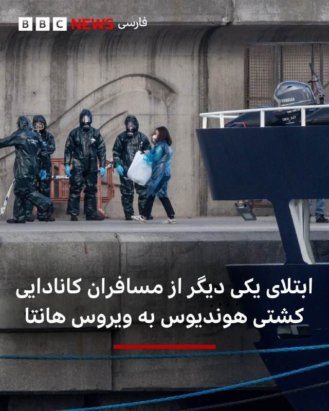

‌🔻مقام‌های کانادا می‌گویند که آزمایش یک شهروند این کشور که با کشتی هوندیوس سفر می‌کرد، برای ابتلا به ویروس هانتا مثبت شده است.

شیوع ویروس هانتا در این کشتی در ماه گذشته تا کنون باعث مرگ سه مسافر آن شده است.

این فرد کانادایی، یکی از چهار نفری است که پس از ترک کشتی در جزیره ونکوور قرنطینه شده بود و حال، علائم خفیفی از این بیماری در او دیده ‌می‌شود.

بانی هنری، مقام ارشد بهداشت استان بریتیش کلمبیا، گفت که این چهار نفر از زمان ورود به کانادا هیچ تماسی با مردم نداشته‌اند.

با ابتلای این فرد، تعداد کل مبتلایان به ویروس هانتا به ۱۱ نفر می‌رسد که همگی از مسافران کشتی هوندیوس هستند.

خانم هنری گفت که یک آزمایشگاه ملی میکروبیولوژی باید جواب آزمایش این فرد را تایید کند.

به گزارش خبرگزاری سی‌بی‌سی، خانم هنری گفت: «هانتا، ویروسی «بسیار متفاوت از سایر ویروس‌های تنفسی است که با آنها سر و کار داشته‌ایم اما آن را دارای پتانسیل همه‌گیری نمی‌دانیم.»

از شش کانادایی که مسافر این کشتی هلندی بودند، دو نفر در خانه خود در استان آنتاریو در قرنطینه هستند.
📷Getty
@BBCPersian

## withyashar — post 11432

  <a href="telegram/content/withyashar_11432_1778973001.mp4" target="_blank">🎬 Download video</a>

مجری : خواهش می‌کنم سلام من رو به مجتبی خامنه‌ای برسونید.

حدادعادل: والا منم به دامادم دسترسی ندارم، از همین‌جا بهش سلام می‌رسونم.
@withyashar

---
📅 بروزرسانی: 1405/02/27 01:41
---

## Tans_Footbali — post 236354

  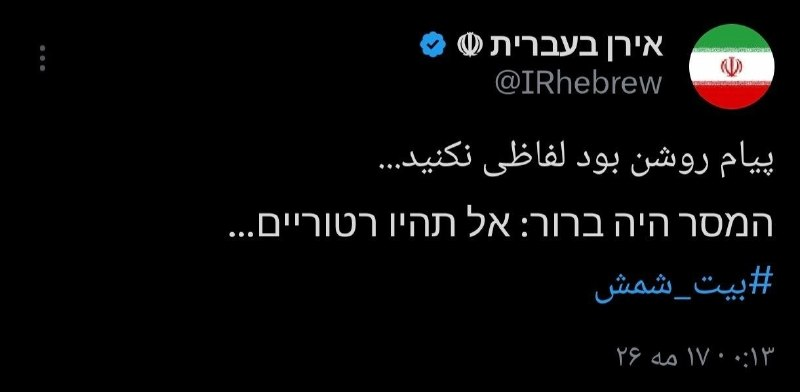

توییت اکانت جمهوری اسلامی به عبری :

پیام روشن بود لفاظی نکنید...
המסר היה ברור: אל תהיו רטוריים...

💛@Tans_Footbali

## Tans_Footbali — post 236353

  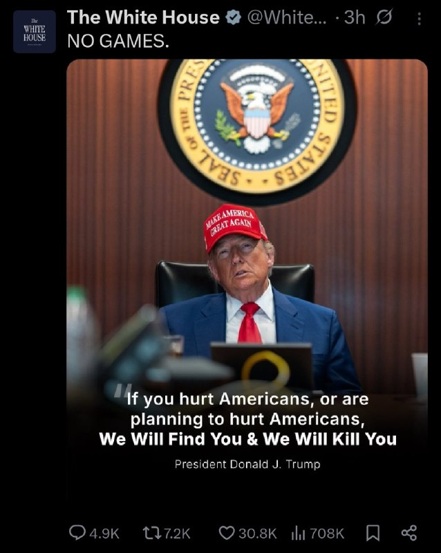

اکانت کاخ سفید با انتشار عکسی از ترامپ تو اتاق جنگ نوشت:

شوخی‌ای در کار نیست.

+متن داخل تصویر (نقل قول ترامپ):
اگر به آمریکایی‌ها ضربه بزنید یا برنامه‌ای برای این کار داشته باشید، ما شمارو پیدا میکنیم و میکُشیم

💛@Tans_Footbali

## Tans_Footbali — post 236352

  <a href="telegram/content/Tans_Footbali_236352_1778969502.webm" target="_blank">🎬 Download video</a>

🎉  بونوس ویژه ثبت‌نام – ۵۰۰٬۰۰۰ تومان رایگان

💥 با ثبت‌نام در سایت، ۵۰۰٬۰۰۰ تومان بونوس رایگان دریافت کنید و شانس خود را امتحان کنید.

🔥 چگونه کار می‌کند؟

⬅️ ثبت‌نام کنید 

⬅️بونوس ۵۰۰٬۰۰۰ تومانی دریافت کنید 

⬅️ شرط‌بندی کنید و بونوس را به موجودی واقعی تبدیل کنید

🔥 وقتشه بازی رو یه جور دیگه ببینی

⚽️  پوشش کامل مسابقات ورزشی 

📊  پیش‌بینی با بهترین ضرایب 

⚡️  تجربه سریع و حرفه‌ای

😀 پرداخت مستقیم و سریع بدون واسطه، بدون دردسر، واریز و برداشت در سریع‌ترین زمان ممکن 
A24

😀 کانال تلگرام: 

🔴 @winro_io  

😀 هدیه خود را با ثبت نام در سایت دریافت کنید: 

🔴 Winro.io

سایت اصلی در روزهای آینده بازگشایی خواهد شد s
✅

## withyashar — post 11431

ایران به عبری ی توییت زد ک پیام روشن بود لفاظی نکنید... המסר היה ברור: אל תהיו רטוריים... یعنی کار ایران بوده؟ مث ک کلاهک اتمی اسراییل اونجا نگهداری میشده

## withyashar — post 11430

ایران به عبری ی توییت زد ک

پیام روشن بود لفاظی نکنید...
המסר היה ברור: אל תהיו רטוריים...
یعنی کار ایران بوده؟
مث ک کلاهک اتمی اسراییل اونجا نگهداری میشده

## withyashar — post 11429

  <a href="telegram/content/withyashar_11429_1778969503.mp4" target="_blank">🎬 Download video</a>

ناو هواپیمابر جرالد فورد به خانه بازگشت
@withyashar

## withyashar — post 11428

  <a href="telegram/content/withyashar_11428_1778969505.mp4" target="_blank">🎬 Download video</a>

انفجار سنگین در بیت شمس و دیده شدن ابر قارچی گزارش شده که در کارخانه شرکت تومر رخ داد. این شرکت موتورهای موشک سنگین و سبک، از جمله موتورهای پیشران موشک‌های ارو ۲ و ارو ۳، موتور موشک هدف سیلور انکر، موتورهای ماهواره هورایزن و موتورهای موشک باراک ۸ و باراک ام‌ایکس را توسعه و تولید می‌کند.
@withyashar

## withyashar — post 11427

---
📅 بروزرسانی: 1405/02/27 00:56
---

## persian_trend_official — post 14279

🔴انفجار بزرگ در بیت‌شمش 💢رسانه‌های عبری از وقوع انفجاری بسیار بزرگ در بیت‌شمش در اسرائیل خبر می‌دهند. 💢این رسانه‌ها با بیان اینکه ارتش مانع از ورود خودروهای امدادی به محل حادثه می‌شود، تصریح کردند این انفجار احتمالاً در تأسیساتی حساس رخ داده است. 🫆:Tony…

## persian_trend_official — post 14278

  <a href="telegram/content/persian_trend_official_14278_1778966780.mp4" target="_blank">🎬 Download video</a>

🔴 رسانه‌های اسرائیلی از انفجار در کارخانه صنایع موشکی «تومر» خبر دادند 💢رسانه‌های اسرائیلی گزارش دادند انفجاری در کارخانه شرکت «تومر» رخ داده است؛ شرکتی که در حوزه توسعه و تولید موتورهای موشکی و سامانه‌های پیشران فعالیت می‌کند. ▪️بر اساس گزارش‌ها، این شرکت…

## persian_trend_official — post 14277

🔴انفجار بزرگ در بیت‌شمش 💢رسانه‌های عبری از وقوع انفجاری بسیار بزرگ در بیت‌شمش در اسرائیل خبر می‌دهند. 💢این رسانه‌ها با بیان اینکه ارتش مانع از ورود خودروهای امدادی به محل حادثه می‌شود، تصریح کردند این انفجار احتمالاً در تأسیساتی حساس رخ داده است. 🫆:Tony…

## persian_trend_official — post 14276

  

🔴انفجار بزرگ در بیت‌شمش 💢رسانه‌های عبری از وقوع انفجاری بسیار بزرگ در بیت‌شمش در اسرائیل خبر می‌دهند. 💢این رسانه‌ها با بیان اینکه ارتش مانع از ورود خودروهای امدادی به محل حادثه می‌شود، تصریح کردند این انفجار احتمالاً در تأسیساتی حساس رخ داده است. 🫆:Tony…

## OfficialPersiaTwiter — post 498870

رفتم دوش بگیرم، نگو کانفیگم روشن مونده و یوتیوب باز بوده رو گوشی و حجمش تموم شده.
فکر میکنم بعد از امیرکبیر، تا الان کسی اینجوری از حموم رفتن ضرر نکرده بوده.

》Hastiovski《

@OfficialPersiaTwiter

## OfficialPersiaTwiter — post 498869

  

مگه اسکلم از بیرون پیتزا مخلوط بخرم ۱ میلیون تومن؟ خودم موادشو میخرم تو خونه درست میکنم بشه ۲ میلیون و ۳۰۰ هزار تومن. تازه با نوشابه. • دودوک • @OfficialPersiaTwiter

## OfficialPersiaTwiter — post 498868

  

جالبه بدونید النصر یک سال و دو ماهه که توی تمام بازی هاش حتی اونایی که باخته، گل زده و آخرین بازی که موفق به گلزنی نشده برمیگرده به 3 مارچ 2025 مقابل استقلال تهران :))) 》فوتبالی《 @OfficialPersiaTwiter

## OfficialPersiaTwiter — post 498867

سی‌ان‌ان: ترامپ بدون پیشرفت در موضوع ایران از چین بازگشت و نسبت به مذاکرات متوقف شده، بی‌صبرتر شده است 🔹در حالی که ترامپ هنوز می‌گوید دیپلماسی را ترجیح می‌دهد، اکنون در حال بررسی این است که آیا حملات نظامی اضافی برای فشار آوردن به تهران لازم است یا خیر. …

## OfficialPersiaTwiter — post 498866

  

🔴خبرنگار فاکس نیوز: ترامپ درحال آماده‌شدن برای دور جدیدی از حملات نظامی به ایران است 》OPT《 @OfficialPersiaTwiter

## OfficialPersiaTwiter — post 498865

انفجار بزرگ در بیت‌شمش رسانه‌های عبری از وقوع انفجاری بسیار بزرگ در بیت‌شمش واقع در غرب اراضی اشغالی خبر می‌دهند. این رسانه‌ها با بیان اینکه ارتش مانع از ورود خودروهای امدادی به محل حادثه می‌شود، تصریح کردند این انفجار احتمالاً در تأسیساتی حساس رخ داده است.…

## Lichargoo — post 24892

مراحل وصل شدن به اینترنت ازاد از غنی کردن اورانیوم و تولید شیشه هم سخت‌تر و پیچیده‌تر شده.

## Bad_chaneli — post 39506

خیابان با جنده‌‌ها وکسکشا

تلگرام با ما

## Bad_chaneli — post 39505

  <a href="telegram/content/Bad_chaneli_39505_1778966784.mp4" target="_blank">🎬 Download video</a>

🎬 Video

## withyashar — post 11426

  <a href="telegram/content/withyashar_11426_1778966785.mp4" target="_blank">🎬 Download video</a>

امشب بیداریم !
@withyashar

## withyashar — post 11424

‏ جیمی دیمون، مدیرعامل جی‌پی‌مورگان چیس، درباره ایران:

‏آنها ۴۷ سال است که تجاوز، قتل و کشتار می‌کنند. دنیای غرب اجازه جنگ‌های نیابتی را داد.
‏ما درس عبرت گرفتیم - باید سال‌ها پیش به سراغ سر مار می‌رفتیم.
@withyashar

## withyashar — post 11423

  

محمد امین صابرکار، دانش‌آموز ۱۷ ساله بسیجی بوشهری،‌ حین انجام تمرینات تیراندازی اشتباها با آتش خودی(فرندلی فایر😬) کشته شد
@withyashar

## withyashar — post 11422

@withyashar فرهنگ ما همیشه غالب میشه

---
📅 بروزرسانی: 1405/02/26 23:59
---

## persian_trend_official — post 14275

  <a href="telegram/content/persian_trend_official_14275_1778963381.mp4" target="_blank">🎬 Download video</a>

🔴انفجار بزرگ در بیت‌شمش

💢رسانه‌های عبری از وقوع انفجاری بسیار بزرگ در بیت‌شمش واقع در غرب اسرائیل خبر می‌دهند.

💢این رسانه‌ها با بیان اینکه ارتش مانع از ورود خودروهای امدادی به محل حادثه می‌شود، تصریح کردند این انفجار احتمالاً در تأسیساتی حساس رخ داده است.

🫆:Tony

📌 @persian_trend_official
پرشین ترند | متفاوت‌ترین کانال نظامی

## persian_trend_official — post 14274

https://youtube.com/live/Lj3xWW7IbLA?feature=share

## persian_trend_official — post 14273

  

🔴خبرنگار فاکس نیوز

💢ترامپ درحال آماده‌شدن برای دور جدیدی از حملات نظامی به ایران است

🫆:Tony

📌 @persian_trend_official
پرشین ترند | متفاوت‌ترین کانال نظامی

## persian_trend_official — post 14272

  

💢پست ترامپ

این آرامش قبل از طوفانه

🫆:Tony

📌 @persian_trend_official
پرشین ترند | متفاوت‌ترین کانال نظام

## persian_trend_official — post 14271

  

💢تکرار تهدید کاخ سفید با انتشار تصویری از ترامپ در اتاق جنگ

💢کاخ سفید پیامی تهدیدآمیز از رئیس جمهوری آمریکا با عنوان «شوخی نداریم» همراه با تصویری از حضور او در اتاق جنگ منتشر کرد.

💢در پیام کاخ سفید آمده است: «اگر به آمریکایی‌ها آسیب بزنید، یا برای آسیب‌زدن به آمریکایی‌ها توطئه و طرح‌ریزی کنید، ما شما را خواهیم یافت.»

🫆:Tony

📌 @persian_trend_official
پرشین ترند | متفاوت‌ترین کانال نظامی

## persian_trend_official — post 14270

  <a href="telegram/content/persian_trend_official_14270_1778963385.webm" target="_blank">🎬 Download video</a>

نسخه صوتی لایو امشب در پلتفرم کست باکس : https://castbox.fm/vi/945937615

## persian_trend_official — post 14269

نسخه صوتی لایو امشب در پلتفرم کست باکس :
https://castbox.fm/vi/945937615

## persian_trend_official — post 14268

نسخه صوتی لایو امشب در پلتفرم اسپاتیفای :

https://open.spotify.com/episode/2Mw2hfeg12829w5zlJVOkO?si=0nFXW0pdTmCsCyiYukkcsQ

## OfficialPersiaTwiter — post 498864

دست رونالدو و یارانش در خانه به قهرمانی آسیا نرسید؛ گامبااوزاکای ژاپن در خاک عربستان فاتح لیگ قهرمانان آسیای ٢ شد 🔹 النصر صفر - گامبااوزاکا یک 》OPT《 @OfficialPersiaTwiter

## OfficialPersiaTwiter — post 498863

  <a href="telegram/content/OfficialPersiaTwiter_498863_1778963385.mp4" target="_blank">🎬 Download video</a>

کشته شدن یک افسر اسرائیلی در نبردهای لبنان ارتش اسرائیل از کشته شدن یک افسر در نبردهای لبنان خبر داد. رسانه‌های اسرائیلی گزارش دادند که این افسر در جنوب لبنان بر اثر انفجار یک پهپاد انفجاری کشته شده است. این افسر که از تیپ گولانی بود، که در منطقه «دیر سیریان»…

## OfficialPersiaTwiter — post 498862

  

العربیه به نقل از پاکستان:وزیر کشور پاکستان جلسه مهمی در ایران برای تسهیل گفت‌وگو و برقراری صلح برگزار کرد 🔹️حضور وزیر کشور پاکستان در ایران یک روز دیگر ادامه خواهد یافت تا در مورد چشم‌انداز ازسرگیری مذاکرات گفت‌وگو شود. 》OPT《 @OfficialPersiaTwiter

## OfficialPersiaTwiter — post 498861

  

تکرار تهدید کاخ سفید با انتشار تصویری از ترامپ در اتاق جنگ

کاخ سفید پیامی تهدیدآمیز از رئیس جمهوری آمریکا با عنوان «شوخی نداریم» همراه با تصویری از حضور او در اتاق جنگ منتشر کرد.
در پیام کاخ سفید آمده است: «اگر به آمریکایی‌ها آسیب بزنید، یا برای آسیب‌زدن به آمریکایی‌ها توطئه و طرح‌ریزی کنید، ما شما را خواهیم یافت.»

》OPT《

@OfficialPersiaTwiter

## OfficialPersiaTwiter — post 498860

  

پست جدید ترامپ درباره ایران در Truth Social 》OPT《 @OfficialPersiaTwiter

## OfficialPersiaTwiter — post 498859

ایران و آمریکا بر سر یک موضوع توافق دارند: فعلا درباره سرنوشت ذخایر اورانیوم گفتگو نشود وال‌استریت‌ژورنال نوشت: 🔹در حالی که بن‌بست دیپلماتیک بین تهران و واشنگتن ادامه دارد، یک نقطه اشتراک وجود دارد: هر دو طرف می‌گویند که در حال حاضر درباره سرنوشت ذخایر…

## OfficialPersiaTwiter — post 498858

یه بارم یه اتفاق بدی برام افتاد فوری با بغض رفتم تو حموم گفتم بذار زیر دوش چمباتمه بزنم یکم زار بزنم :))
ولی قبل نشستن مجبور شدم ۵ دقیقه با آب سردوگرم ور برم تا دمای آب تنظیم شه :)))) کلا دردم یادم رفت :))))))))

》روانشناسِ روانی《

@OfficialPersiaTwiter

## OfficialPersiaTwiter — post 498857

  

دست رونالدو و یارانش در خانه به قهرمانی آسیا نرسید؛ گامبااوزاکای ژاپن در خاک عربستان فاتح لیگ قهرمانان آسیای ٢ شد

🔹 النصر صفر - گامبااوزاکا یک

》OPT《

@OfficialPersiaTwiter

## OfficialPersiaTwiter — post 498856

کوثری: هر تعرضی با پاسخ کوبنده مواجه خواهد شد

عضو کمیسیون امنیت ملی مجلس:
🔹اگر آمریکا یا اسرائیل کوچکترین تعرضی انجام دهند، مردم ما، چه زن و چه مرد، در صحنه حاضر هستند.

🔹دشمن هر توانی داشت در ۴۰ روز گذشته انجام داد، آنها نمی‌توانند به راحتی بمب‌ها و موشک‌های از دست رفته خود را جایگزین کنند، اما ما به راحتی می‌توانیم جبران کنیم.

🔹آنها در هر نقطه‌ای که حضور پیدا کنند، رزمندگان و مردم چنان ضربه‌ای می‌زنند که جز ذلت و خواری نصیبشان نشود.

》OPT《

@OfficialPersiaTwiter

## bbcpersian — post 281241

  

‌🔻مردی در شهر مودنا در شمال ایتالیا با خودرو خود با چندین عابر پیاده برخورد و هشت نفر را زخمی کرد. حال چهار نفر از آنها وخیم گزارش شده است.

یکی از مجروحان زنی است که گفته می‌شود هر دو پایش خرد شده است.

عابران پس از تعقیب راننده خودرو، یک «مرد سی و چند ساله» را دستگیر و به پلیس تحویل دادند.

جورجیا ملونی، نخست‌وزیر ایتالیا، این واقعه را «بسیار جدی» توصیف کرد. همچنین ماسیمو مزتی، شهردار مودنا، در ادامه واکنش خانم ملونی گفت اگر مشخص شود که این یک حمله از پیش برنامه‌ریزی شده بوده، «حتی جدی‌تر» خواهد بود.

این حادثه بعد از ظهر شنبه ۱۶ مه اتفاق افتاد. یک شاهد عینی گفت: «ما دیدیم که خودرو نزدیک می‌شود، به سمت جدول می‌رفت اما ناگهان سرعت گرفت و هنگام برخورد با عابران حداقل ۱۰۰ کیلومتر در ساعت سرعت داشت و ما دیدیم که مردم در حال پرواز هستند.»

شهردار مودنا گفت به نظر می‌رسد که راننده «عمدا به پیاده‌رو رفته، به چند نفر زده و به ویترین یک مغازه کوبیده است».
به گفته شهردار مودنا، فرد بازداشت‌شده یک تبعه ایتالیایی متولد برگامو، اما «اصالتا مغربی» است.

ادامه از:
https://bbc.in/4nxF8zv
📷Reuters
@BBCPersian

## bbcpersian — post 281240

  <a href="https://t.me/bbcpersian/281240" target="_blank">📎 Download file</a>

پادکست برنامه شصت دقیقه روز شنبه ۲۶ اردیبهشت ۱۴۰۵ است
این نسخه رادیویی برنامه شصت دقیقه تلویزیون فارسی بی‌بی‌سی است که هرشب بعد از پخش، با حجم کم از اپلیکیشن‌های پادگیر و صفحه تلگرام بی‌بی‌سی فارسی در دسترس است.
با هشتگ BBCPersianRadio# با ما در ارتباط باشید.
@BBCPersian

## bbcpersian — post 281239

📊بازار سهام ایران پس از توقف ناشی از جنگ از سه‌شنبه بازگشایی می‌شود

یک مقام ارشد سازمان بورس و اوراق بهادار ایران تایید کرد که پس از توقف فعالیت‌ها در دوران جنگ با آمریکا و اسرائیل، بازار سهام آن کشور از روز سه‌شنبه بازگشایی خواهد شد.

حمید یاری، معاون نظارت بر بورس‌ها و ناشران سازمان بورس و اوراق بهادار ایران می‌گوید که «بر اساس هماهنگی‌های صورت‌گرفته و پس از اخذ مجوزهای لازم، مقرر شد بازگشایی بازار سهام، انواع صندوق‌های سرمایه‌گذاری در سهام و مشتقات آن‌ از روز سه‌شنبه ۲۹ اردیبهشت ۱۴۰۵ صورت پذیرد.»

او گفت که توقف فعالیت بازار سهام از شروع جنگ، «با هدف صیانت از دارایی سهامداران، جلوگیری از بروز رفتارهای هیجانی و فراهم آوردن شرایط انجام معامله در این بازار با اطلاعات دقیق‌تر و شفاف‌تر صورت‌ گرفت.»

آقای یاری همچنین می‌گوید که با بازگشایی بازار سهام، «شاهد تکمیل فعالیت همه بخش‌های بازار سرمایه خواهیم بود.»

https://bbc.in/4wpp6f4
@BBCPersian

## bbcpersian — post 281238

  <a href="telegram/content/bbcpersian_281238_1778963390.mp4" target="_blank">🎬 Download video</a>

⭕️آخرین خبرهای مهم روز شنبه ۲۶ اردیبهشت ۱۴۰۵
@BBCPersian

## thefeedconfig — post 79

thefeed-android-v0.18.10-arm64-v8a.apk

## networkti — post 359

thefeed-android-v0.18.10-arm64-v8a.apk

## Tans_Footbali — post 236351

نتانیاهو: اگر آمریکا بخواد جنگ رو بازم شروع کنه، ما آماده خواهیم بود.

💛@Tans_Footbali

## hamclasixii — post 75394

  

🔴با هر 1 گیگابایت اینترنت از طریق VPN چقدر میشه آنلاین موند؟!

📚 @hamclasix 📚

## withyashar — post 11421

  <a href="telegram/content/withyashar_11421_1778963393.mp4" target="_blank">🎬 Download video</a>

گوش جان میسپریم به فریدون عزیز تا من موتورم رو گرم کنم ویس بزارم
@withyashar

## withyashar — post 11420

  

ترامپ در تروث : آرامش فبل از طوفان

قایق تندرو با پرچم جمهوری اسلامی دیده میشود …
@withyashar

## withyashar — post 11419

## withyashar — post 11418

  

مشاورین شاهزاده (امیر اعتمادی و سعید قاسمینژاد) ، علی کریمی‌ رو به علت واکنش ‌به کنسرت و آهنگ شاهین نجفی آنفالو کردند @withyashar

---
📅 بروزرسانی: 1405/02/26 23:03
---

## persian_trend_official — post 14267

🔴آمریکا معافیت تحریم نفت روسیه را تمدید نکرد

💢به گزارش رویترز، آمریکا روز شنبه معافیت تحریمی که پیشتر به کشورهایی از جمله هند اجازه می‌داد نفت روسیه را خریداری کنند، تمدید نکرد.

💢این معافیت قبلاً به مدت یک ماه تمدید شده بود تا کمبود عرضه نفت و قیمت‌های بالا ناشی از بسته شدن تنگه هرمز توسط ایران کاهش یابد.

💢اسکات بسنت، وزیر خزانه‌داری آمریکا پیشتر گفته بود که مجوز خرید نفت روسیه ذخیره‌شده روی تانکرها را تمدید نخواهد کرد.

🫆:Tony

📌 @persian_trend_official
پرشین ترند | متفاوت‌ترین کانال نظامی

## persian_trend_official — post 14266

  <a href="telegram/content/persian_trend_official_14266_1778960037.webm" target="_blank">🎬 Download video</a>

🔴تارنمای بیمهٔ ایرانی تنگهٔ هرمز راه‌اندازی شد

💢تارنمای «هرمز سیف» (Hormuz Safe) ارائه بیمه به محموله‌های دریایی عبوری از تنگهٔ هرمز را شروع کرد.

💢مقررات این تارنمای بیمه می‌گوید، بیمه‌نامه‌هایی سریع و با قابلیت تایید رمزنگاری شده برای محموله‌هایی که از خلیج فارس، تنگهٔ هرمز و آبراه‌های اطراف آن عبور می‌کنند، ارائه می‌شود و پرداخت‌ها با ارز دیجیتال تسویه خواهد شد.

🫆:Tony

📌 @persian_trend_official
پرشین ترند | متفاوت‌ترین کانال نظامی

## persian_trend_official — post 14265

⭕️ ادعای ترامپ:
ایران روزهای بسیار سختی در پیش خواهد داشت.

📝 Nick

📌 @persian_trend_official
پرشین ترند | متفاوت‌ترین کانال نظامی

## persian_trend_official — post 14264

https://youtube.com/live/Lj3xWW7IbLA?feature=share

## persian_trend_official — post 14263

⭕️👽 ادعای جنجالی دریاسالار بازنشسته آمریکا درباره پدیده‌های ناشناس؛ «هوش غیرانسانی» در کار است.

تیم گالادت، دریاسالار بازنشسته نیروی دریایی آمریکا، در اظهاراتی جنجالی گفت پدیده‌های ناشناس هوایی ممکن است تحت هدایت «هوشی غیرانسانی و در سطحی بالاتر» باشند.

به گزارش فاکس‌نیوز، گالادت که از چهره‌های شناخته‌شده در بحث پدیده‌های ناشناس هوایی در آمریکا به شمار می‌رود، گفته است داده‌ها و ویدئوهایی را دیده که نشان می‌دهد برخی از این اشیا میان اقیانوس و جو زمین، بدون ایجاد اختلال آشکار در سطح آب، با سرعت‌هایی فراتر از فناوری شناخته‌شده حرکت می‌کنند.

او تأکید کرد این اشیا نه شبیه فناوری آمریکا هستند و نه شبیه فناوری رقبای این کشور. گالادت گفت: «ما فناوری‌ای نداریم که بتواند چنین کاری انجام دهد.»

این دریاسالار بازنشسته همچنین مدعی شد شواهدی وجود دارد که نشان می‌دهد حرکت این پدیده‌ها تحت کنترل هوشی غیرانسانی است؛ ادعایی که بار دیگر بحث درباره ماهیت پدیده‌های ناشناس هوایی و میزان اطلاعات پنهان‌شده از افکار عمومی را داغ کرده است.

📝 Nick

📌 @persian_trend_official
پرشین ترند | متفاوت‌ترین کانال نظامی

## persian_trend_official — post 14262

  <a href="telegram/content/persian_trend_official_14262_1778960038.mp4" target="_blank">🎬 Download video</a>

💢پست جدید ترامپ و تمسخر دوباره پهپاد های جمهوری اسلامی ...

🫆:Tony

📌 @persian_trend_official
پرشین ترند | متفاوت‌ترین کانال نظامی

## persian_trend_official — post 14261

🔴 مهم‌ترین تحولات منطقه

▪️ حماس تأیید کرد «عزالدین الحداد» فرمانده شاخه نظامی گردان‌های قسام، در حمله روز جمعه اسرائیل به غزه کشته شده است

▪️ وزیر کشور پاکستان در سفری غیرمنتظره به تهران با همتای ایرانی خود درباره ثبات منطقه‌ای
و همکاری‌های دوجانبه گفت‌وگو کرد.

▪️ فرماندهی مرکزی ارتش آمریکا (سنتکام) اعلام کرد در ادامه محاصره بنادر ایران، مسیر حرکت ۷۸ کشتی تجاری را تغییر داده است

▪️ اسرائیل حملات خود به لبنان را با وجود آتش‌بس ادامه داد؛ در حملات جدید دست‌کم ۳ نفر در جنوب لبنان کشته شدند

▪️ وزارت بهداشت لبنان اعلام کرد از اوایل مارس تاکنون
۲۹۶۹ نفر در حملات اسرائیل کشته و ۹۱۱۲ نفر زخمی شده‌اند.

🫆:Tony

📌 @persian_trend_official
پرشین ترند | متفاوت‌ترین کانال نظامی

## persian_trend_official — post 14260

  <a href="telegram/content/persian_trend_official_14260_1778960039.mp4" target="_blank">🎬 Download video</a>

⭕️ ناوشکن وینستون چرچیل (DDG-81) از کلاس آرلی برک فلایت IIA که فرماندهی گروه ضربت ناو هواپیمابر فورد را بر عهده داشت، پس از یک‌سال مأموریت طاقت‌فرسا در فرماندهی اروپا، آفریقا و در نهایت فرماندهی مرکزی و شرکت در عملیات خشم حماسی، اکنون به پایگاه مادر خود، پایگاه نیروی دریایی می‌پورت در جکسون‌ویل، فلوریدا بازگشته است.

پ.ن: شرایط عملیاتی ناوشکن‌ها نسبت به ناوهای هواپیمابر به مراتب سخت‌تر و حساس‌تر می‌باشد. ولی معمولاً در رسانه‌ها اشاره‌ای به نقش پررنگ ناوشکن‌ها که در خط اول انجام مأموریت‌های تهاجمی و پدافندی قرار دارند، نمی‌شود.

📝 Nick

📌 @persian_trend_official
پرشین ترند | متفاوت‌ترین کانال نظامی

## persian_trend_official — post 14259

💢نشریه تلگراف

«دونالد ترامپ، به امارات متحده عربی توصیه می‌کنند نقش فعال‌تری در جنگ با ایران ایفا کند و دست به ورود نیرو زمینی خود به برخی از جزایر ایرانی مانند لاوان انجام دهد!

💢این گزارش حاکی است که برخی افراد در حلقه ترامپ پیشنهاد داده‌اند که این جزیره باید توسط نیروهای زمینی امارات به جای آمریکا اشغال و نیرو هوایی آمریکا وظیفه پشتیبانی هوایی از آنها را انجام دهد.»

🫆:Tony

📌 @persian_trend_official
پرشین ترند | متفاوت‌ترین کانال نظامی

## persian_trend_official — post 14258

  

خبرگزاری مهر | اسکندر مومنی: تجارت مرزی از محورهای اصلی گفت‌وگو با وزیر کشور پاکستان بود

💢وزیر کشور گفت: یکی از محورهای اصلی گفت‌وگوهای امروز با وزیر کشور پاکستان ، موضوع تجارت مرزی بود که توافق شد هم از سوی ایران و هم از سوی پاکستان، تسهیلات و اقدامات لازم صورت گیرد.

💢خوشبختانه هم دولت‌ها و هم ملت‌های دو کشور نگاه بسیار مثبتی به یکدیگر دارند. نخستین پیام رهبر معظم انقلاب درباره پاکستان نیز حاوی تأکید ویژه‌ای بر روابط دو کشور بود و هر دو طرف مصمم هستیم که در کنار توسعه روابط سیاسی و برادرانه، روابط اقتصادی و تجاری را نیز گسترش دهیم.

💢سید محسن نقوی نیز با تشکر از میزبانی وزیر کشور ایران گفت: همان‌طور که اشاره شد، درباره موضوعات مختلف مرتبط با روابط ایران و پاکستان و همچنین امنیت مرزها گفت‌وگوهای مفصلی داشتیم و امیدوارم با روندی که در پیش گرفته‌ایم، به‌زودی به راه‌حل‌های ملموسی در این زمینه‌ها دست پیدا کنیم.

🫆:Tony

📌 @persian_trend_official
پرشین ترند | متفاوت‌ترین کانال نظامی

## persian_trend_official — post 14257

⭕️ شبکه 13 اسرائیل:

هم اکنون ارزیابی‌ها در اسرائیل بر این است که جنگ با ایران در روز های آینده از سر گرفته خواهد شد.

📝 Nick

📌 @persian_trend_official
پرشین ترند | متفاوت‌ترین کانال نظامی

## persian_trend_official — post 14256

  <a href="telegram/content/persian_trend_official_14256_1778960041.mp4" target="_blank">🎬 Download video</a>

🔴مجری تلویزیون دولتی جمهوری اسلامی در یک بخش آموزش سلاح‌های گرم، به پرچم امارات متحده عربی نشانه گیری و در برنامه زنده شلیک کرد.

🫆:Tony

📌 @persian_trend_official
پرشین ترند | متفاوت‌ترین کانال نظامی

## persian_trend_official — post 14255

⭕️ رسانه پاکستانی ARY News:

محسن نقوی، وزیر کشور پاکستان، حامل پیامی مهمی برای ایران بود.

📝 Nick

📌 @persian_trend_official
پرشین ترند | متفاوت‌ترین کانال نظامی

## persian_trend_official — post 14254

⭕️ چینی‌ها گزارش می‌دهند که ترامپ حتی به یک تکه از غذاهایی که در شام خوش‌آمدگویی سرو شده بود، دست نزد. او غذاهایی را که توسط سرآشپزهای کاخ سفید تهیه شده بود، خورد.

علاوه بر این، او در تمام طول سفر به هیچ غذایی که توسط طرف چینی تهیه شده بود، دست نزد.

گفته می‌شود که این کار برای جلوگیری از ورود هرگونه میکروب و نانوفناوری به غذا انجام شده است.

کارکنانی که به ترامپ خدمت می‌کردند، با محافظان سرویس مخفی جایگزین شدند.

در نگاه اول، این یک ضیافت بزرگ قرن بود، پر از سلامتی و خنده؛ اما در پشت صحنه، نبرد خاموشی از هوش و ذکاوت در حال وقوع بود.

📝 Nick

📌 @persian_trend_official
پرشین ترند | متفاوت‌ترین کانال نظامی

## OfficialPersiaTwiter — post 498855

تمدید معافیت‌های نفتی ایران و روسیه اسکات بسنت، وزیر خزانه‌داری آمریکا، چهارشنبه اعلام کرد معافیت تحریمی نفت روی دریا متعلق به روسیه و ایران را به مدت ۳۰ روز تمدید کرده است. او گفت این تصمیم پس از درخواست حدود ۱۰ کشور آسیب‌پذیر در برابر کمبود نفت به‌دلیل…

## OfficialPersiaTwiter — post 498854

  

قالیباف:

جهان در آستانهٔ نظمی نوین قرار دارد.

چنان‌که رئیس‌جمهور شی گفت: «تحولی که در یک قرن دیده نشده، در سراسر جهان با شتاب در حال پیشروی است»، و من تأکید می‌کنم که مقاومت ۷۰ روزهٔ ملت ایران این تحول را شتاب بخشیده است.

آینده از آنِ کشورهای جنوب جهانی است.

》OPT《

@OfficialPersiaTwiter

## OfficialPersiaTwiter — post 498853

  

خسارات گسترده حمله اسرائیل به مناطق مسکونی شهرک الشهابیه در جنوب لبنان 》OPT《 @OfficialPersiaTwiter

## OfficialPersiaTwiter — post 498852

  

این داستان ارتباط عاطفی ایرانی‌ها با رئیس‌جمهور کشورهای غربی تازگی نداره، یه بارم بوش زنگ زد و گفت این خانومه که خیلی دلبره از جنیفر لوپز ما بهتره نیناش ناشم بلده؟ 》درویش《 @OfficialPersiaTwiter

## OfficialPersiaTwiter — post 498851

  

معاون اول رئیس‌جمهور: دیگر اجازهٔ عبور تجهیزات نظامی دشمن از تنگهٔ هرمز را نخواهیم داد. 》OPT《 @OfficialPersiaTwiter

## OfficialPersiaTwiter — post 498850

یازده سالم بود. داداشم همدان دانشجوی دندون‌پزشکی بود و یبار که برگشته بود شهرمون، یه خمیر دندون با خودش آورده بود و من فکر می‌کردم اینو تو دانشگاه بهشون دادن و حتما خیلی چیز خفنیه و فقط با اون مسواک زدم. بعد چند روز فهمیدم اونی که باهاش مسواک می‌زنم خمیر دندون…

## OfficialPersiaTwiter — post 498849

ادعای تازه ترامپ در خصوص مذاکره با ایران   🔹 رئیس جمهور آمریکا در گفتگو با رسانه‌های فرانسوی  درباره مذاکرات با ایران مدعی شد: آن‌ها علاقه‌مند به دستیابی به توافق هستند. او در ادامه گفت: اگر توافقی حاصل نشود ایران روزهای بسیار سختی در پیش خواهد داشت 🔹 ترامپ…

## OfficialPersiaTwiter — post 498848

  <a href="telegram/content/OfficialPersiaTwiter_498848_1778960045.mp4" target="_blank">🎬 Download video</a>

چند سال پیش تو یک دیت، طرف دستمو گرفت و بوسید، منم دستشو بوسیدم. 》امیلی《 @OfficialPersiaTwiter

## OfficialPersiaTwiter — post 498847

سازمان بورس: آمادگی برای بازگشایی بازار سهام از اواسط هفتهٔ آینده وجود دارد. زمان دقیق بازگشایی بازار به‌زودی اعلام می‌شود. 》OPT《 @OfficialPersiaTwiter

## OfficialPersiaTwiter — post 498846

  <a href="telegram/content/OfficialPersiaTwiter_498846_1778960046.mp4" target="_blank">🎬 Download video</a>

پست جدید ترامپ درباره ایران در Truth Social

》OPT《

@OfficialPersiaTwiter

## OfficialPersiaTwiter — post 498845

  

بابک جهانبخش، خواننده: به تازگی از همسرم جدا شدم، من اونو از ۰ به ۱۰۰ رسوندم اما اون با ۲ تا بچه ولم کرد رفت. زنم فقط به چشم عابر بانک بهم نگاه میکرد و از من به عنوان پله موفقیت خودش استفاده کرد.

》OPT《

@OfficialPersiaTwiter

## OfficialPersiaTwiter — post 498844

یکی از همکلاسیای دوران ابتداییمو تو اینستاگرام پیدا کردم بهش ریکوئست دادم قبول نکرد نامرد!!!
مرد حسابی من توی تولد ده سالگیت برنده‌ی مسابقه‌ی ماست‌خوری شده بودم.

》Masoud《

@OfficialPersiaTwiter

## bbcpersian — post 281237

⭕️آمریکا یک فرمانده شبه‌نظامیان عراقی را به توطئه برای هدف قرار دادن یهودیان در شهرهایی از لندن تا لس‌آنجلس متهم کرد

آمریکا می‌گوید که محمد باقر سعد داوود ساعدی، از فرماندهان شبه‌نظامیان عراقی را به اتهام نقش داشتن در طراحی بیش از ۱۲ حمله «تروریستی» در آمریکای شمالی و اروپا بازداشت و به آمریکا منتقل کرده است.

مقامات قضایی آمریکا گفته‌اند که این حملات در واکنش به جنگ با ایران برنامه‌ریزی شده بود.

این مقام‌های آمریکا همچنین گفتند که «محمد باقر سعد داوود ساعدی، ۳۲ ساله، در حال طراحی حمله به یک کنیسه در نیویورک و دو مرکز یهودی در لس‌آنجلس و اسکاتسدیل بوده است.»

بر اساس شکایت کیفری، آقای ساعدی با شش اتهام مرتبط با تروریسم روبه‌رو است. وکیلش اما می‌گوید که پیگرد او با «انگیزه‌های سیاسی» صورت گرفته است.

مقام‌های آمریکایی، آقای ساعدی را به عنوان یکی از فرماندهان کتائب حزب‌الله معرفی کرده‌اند.

https://bbc.in/3PKX1OQ
@BBCPersian

## bbcpersian — post 281236

  

🔻مسکو می‌گوید اتباع روسی شاغل در نیروگاه اتمی بوشهر را فعلا به طور کامل به ایران برنمی‌گرداند.

الکسی لیخاچف، رئیس شرکت دولتی روس‌اتم، گفت هفته گذشته ایران و آمریکا بار دیگر حملاتی علیه یکدیگر انجام و رسانه‌های آمریکایی هم دوباره از احتمال ازسرگیری درگیری‌ها خبر دادند و ادامه داد گه «تا زمانی که وضعیت روشن نشود، ما حق نداریم درباره بازگشت کامل نیروها به محل نیروگاه تصمیم‌گیری کنیم.»

به گفته او، روس‌اتم در حال آماده‌سازی طرح‌های آتی برای افزایش تعداد نیروهای روسی در نیروگاه اتمی بوشهر است اما در «در عین حال گفت «باید شرایط نظامی را هم در نظر بگیریم.»

محوطه بوشهر که تنها نیروگاه اتمی ایران است، در جریان جنگ اخیر چند بار هدف حمله قرار گرفت اما به ساختمان و تاسیاست اصلی آسیبی نرسید.

روسیه از زمان حمله اسرائیل و آمریکا به ایران در چند مرحله اتباع خود را که در این نیروگاه مشغول به کار هستند، از ایران خارج کرد.

📸NurPhoto via Getty Images

https://bbc.in/4duJS4e
@BBCPersian

## bbcpersian — post 281235

🔻عزالدین حداد‌، فرمانده ارشد حماس در حمله اسرائیل کشته شد

حماس و ارتش اسرائیل تأیید کرده‌اند که عزالدین حداد، فرمانده گردان‌های قسام، شاخه نظامی این گروه، شامگاه جمعه (۱۵ مه، ۲۵ اردیبهشت) در حمله‌ اسرائیل در شهر غزه کشته شده است.

اسرائیل او را یکی از طراحان حملات هفتم اکتبر ۲۰۲۳ خوانده است.

بنیامین نتانیاهو، نخست‌وزیر و اسرائیل کاتس، وزیر دفاع اسرائیل در بیانیه‌ای مشترک گفته‌اند که عزالدین حداد «مسئول قتل، ربایش و زخمی شدن هزاران غیرنظامی اسرائیلی و نیروهای ارتش اسرائیل» بوده است.

مراسم تشییع عزالدین حداد امروز (شنبه) در شهر غزه برگزار شد.

اعضای خانواده‌ آقای حداد هم در حمله هوایی شبانه اسرائیل کشته شدند.

https://bbc.in/3PaM0X0
@BBCPersian

## Lichargoo — post 24891

با پسر بدِ خانواده خوب ازدواج کنید ولی با پسر خوبِ خانواده بد هرگز.

## thefeedconfig — post 78

  <a href="https://t.me/thefeedconfig/78" target="_blank">📎 Download file</a>

نسخه جدید TheFeed (v0.18.10) 🚀

🔸توی این نسخه چیز مهمی تغییر نکرده! فقط از اونجایی که گیتهاب اکانتم رو ساسپند کرد و هنوز اکانت باز نشده، پروژه TheFeed رو به گیتلب منتقل کردم و برنامه رو هم تغییر دادم که لینک ها و این چیزهای که توی برنامه بود به گیتلب هم اشاره کنه. البته قابلیت دانلود آخرین نسخه و نوتیف نسخه جدید هنوز به گیتلب وصل نشده و کار‌نمیکنن (گیتلب فیلتره و کمکی نمیکنه اضافه کردنش 🫠).
البته توی تنظیمات یک دکمه هست به اسم "بررسی" که وقتی بزنیدش اخرین شماره نسخه رو از سرور میپرسه و نشون میده، این رو سمت سرور تغییر دادم که اگر‌ گیتهاب کار نکرد اخرین شماره نسخه رو از گیتلب بگیره و سمت کلاینت هم یک باگ داشت که رفع شد.

⚠️ این نسخه خیلی مهم نیست و میتونید آپدیت نکنید

آدرس سورس کد پروژه روی گیتلب:

https://gitlab.com/sartoopjj/thefeed

یک نفر لطف کرده بود و فیچر های دسترسی پذیری اضافه کرده بود و پول ریکوئست فرستاده بود، لطفا اگر این پیام رو میبینی مرج ریکویست بفرست روی گیتلب🥲❤️

کانال اصلیم:
@networkti

کانال کانفیگ برای برنامه:
@thefeedconfig

## withyashar — post 11417

شاهزاده رضا پهلوی در نشست آینده تکنولوژی در ایران:

ایران می‌تونه به کره جنوبی تبدیل بشه، اما به دلیل وضعیت سیاسی کنونی به سمت الگویی شبیه کره شمالی سوق داده شده؛ جمهوری اسلامی در ذات خودش قابل تغییر نیست.

@withyashar

## withyashar — post 11416

کانال ۱۳ اسرائیل:
اسرائیل در بالاترین سطح هشدار برای احتمال از سرگیری جنگ با ایران است. در صورت از سرگیری جنگ با ایران، احتمال دارد ایران در روزهای نخست ده‌ها موشک به سمت اسرائیل شلیک کند.
@withyashar

## withyashar — post 11415

قلعه نویی در لیست نهایی جام جهانی آزمونو خط زد و گفت باشرف هارو دعوت کردم.
@withyashar

## withyashar — post 11414

وال استریت ژورنال : ایران و آمریکا بر سر یک موضوع توافق دارند در حالی که بن‌بست دیپلماتیک بین تهران و واشنگتن ادامه دارد, هر دو طرف می‌گویند که در حال حاضر درباره سرنوشت ذخایر اورانیوم غنی‌شده ایران بحث نمی‌کنند.
@withyashar

## withyashar — post 11413

نتانیاهو : اگه آمریکا دوباره بخواد عملیات نظامی علیه ایران رو شروع کنه، اسرائیل آماده‌ست
@withyashar

## withyashar — post 11412

داداش ناموسا من اونجا بودم داد میزدم به شاهزاده میگفتم حتما با یاشار ملاقات حضوری بکن

---
📅 بروزرسانی: 1405/02/26 21:39
---

## persian_trend_official — post 14253

  <a href="telegram/content/persian_trend_official_14253_1778954963.mp4" target="_blank">🎬 Download video</a>

ویدیو از حملات ارتش اسرائیل به جنوب لبنان

📝 Nick

📌 @persian_trend_official
پرشین ترند | متفاوت‌ترین کانال نظامی

## persian_trend_official — post 14252

  

🔴 پارلمان عراق خواستار پیگیری بین‌المللی انتقال «محمد باقر السعدی» به آمریکا شد

💢پارلمان عراق از وزارت خارجه این کشور خواست درباره ربوده‌شدن «محمد باقر السعدی» از ترکیه و انتقال او به آمریکا، اقدامات و پیگیری‌های بین‌المللی انجام دهد.

بر اساس گزارش‌ها:

▪️ نمایندگان عراقی این اقدام را نقض حاکمیت و قوانین بین‌المللی دانسته‌اند
▪️ از بغداد خواسته شده موضوع را از مسیرهای دیپلماتیک و حقوقی دنبال کند
▪️ جزئیات بیشتری درباره نحوه انتقال السعدی منتشر نشده است

💢این درخواست پس از اعلام بازداشت السعدی توسط اف‌بی‌آی آمریکا مطرح شده است.

🫆:Tony

📌 @persian_trend_official
پرشین ترند | متفاوت‌ترین کانال نظامی

## persian_trend_official — post 14251

  

💢تمسخر دوباره جو بایدن توسط دونالد ترامپ

🫆:Tony

📌 @persian_trend_official
پرشین ترند | متفاوت‌ترین کانال نظامی

## persian_trend_official — post 14250

💢وزیر کشور پاکستان امروز به تهران سفر کرده است

🔹 سفر وزیر کشور پاکستان به تهران در چارچوب تلاش‌های میانجیگری میان امریکا و جمهوری اسلامی است.

🫆:Tony

📌 @persian_trend_official
پرشین ترند | متفاوت‌ترین کانال نظامی

## persian_trend_official — post 14249

  

💢آناتولی: دیدار باقری با فیدان در استانبول

💢 به گزارش خبرگزاری آناتولی، منابع دیپلماتیک اعلام کردند که هاکان فیدان، وزیر امور خارجه ترکیه و علی باقری، معاون دبیر شورای عالی امنیت ملی ایران، روز شنبه در استانبول دیدار کردند.

💢 جزئیات بیشتری در مورد این دیدار ارائه نشده است.

🫆:Tony

📌 @persian_trend_official
پرشین ترند | متفاوت‌ترین کانال نظامی

## persian_trend_official — post 14248

  <a href="telegram/content/persian_trend_official_14248_1778954968.mp4" target="_blank">🎬 Download video</a>

💢عارف معاون اول رئیس‌جمهور:

💢دیگر اجازهٔ عبور تجهیزات نظامی دشمن از تنگهٔ هرمز را نخواهیم داد.

🫆:Tony

📌 @persian_trend_official
پرشین ترند | متفاوت‌ترین کانال نظامی

## persian_trend_official — post 14247

دونالد ترامپ: اگر توافقی حاصل نشود، جمهوری اسلامی «روزگار بسیار بدی» خواهد داشت

دونالد ترامپ در یک گفت‌وگوی تلفنی با شبکه خبری تلویزیونی ب اف ام فرانسه اظهار داشت که نمی‌داند آیا به‌زودی توافقی با جمهوری اسلامی حاصل خواهد شد یا نه.

رییس‌جمهور ایالات متحده گفت: «هیچ ایده‌ای ندارم که آیا آن‌ها این کار را خواهند کرد یا نه. اگر این کار را نکنند، روزگار بسیار بدی خواهند داشت، روزگار بسیار بدی. بهتر است که یک توافق منعقد کنند.»

📌 @persian_trend_official
پرشین ترند | متفاوت‌ترین کانال نظامی

## persian_trend_official — post 14246

🔹زمین‌لرزه‌ای به بزرگی ۴.۵ ریشتر دقایقی پیش گلوگاه در استان مازندران را لرزاند.

🫆:Tony

📌 @persian_trend_official
پرشین ترند | متفاوت‌ترین کانال نظامی

## persian_trend_official — post 14245

لایو امشب ساعت 22 آغاز میشه

## persian_trend_official — post 14244

ارتش اسرائیل شنبه اعلام کرد که در آخر این هفته حدود ۱۰۰ موضع حزب‌الله را در جنوب لبنان مورد حمله قرار داده است.

بر اساس اعلام ارتش اسرائیل، این اهداف شامل پست‌های مراقبت و دیده‌بانی، انبارهای تسلیحات و سایر زیرساخت‌هایی بوده که توسط این گروه برای پیشبرد حملات استفاده می‌شود.

این حملات در سراسر جنوب لبنان انجام شده و منطقه صور را نیز دربر گرفته است.

در همین حال، در ۲۴ ساعت گذشته، حزب‌الله چندین پهپاد و گلوله خمپاره به سمت نیروها در جنوب لبنان شلیک کرده است.

📌 @persian_trend_official
پرشین ترند | متفاوت‌ترین کانال نظامی

## persian_trend_official — post 14243

  

مراسم تشییع جنازه عزالدین الحداد، فرمانده نظامی حماس که دیشب کشته شد، در نوار غزه انجام شد.

📌 @persian_trend_official
پرشین ترند | متفاوت‌ترین کانال نظامی

## persian_trend_official — post 14242

  

✅پست جدید ترامپ در تروث سوشال:
بازی نداریم! ببین قراره بعدش تو موضوع مورد علاقت چه اتفاقی بیفته!

📌 @persian_trend_official
پرشین ترند | متفاوت‌ترین کانال نظامی

## OfficialPersiaTwiter — post 498843

اسامی ٣٠ بازیکن دعوت‌شده به اردوی نهایی تیم ملی فوتبال در ترکیه 》OPT《 @OfficialPersiaTwiter

## OfficialPersiaTwiter — post 498842

قیمتا جوریه که یا پولت نمیرسه چیزی که میخوای رو بخری
یا اگه هم برسه، دلت نمیاد اون همه پولو خرجش کنی...

》Parsa《

@OfficialPersiaTwiter

## OfficialPersiaTwiter — post 498841

  

فرهاد مجیدی با البطائح به دسته دو امارات سقوط کرد

در هفته آخر لیگ برتر امارات، البطائح مقابل شباب‌الاهلی به نتیجه تساوی 1-1 دست پیدا کرد تا با توجه به برد 1-0 الظفره مقابل الوحده به دسته پایین‌تر سقوط کند. تیم مجیدی با 21 امتیاز در رده 13 جدول 14 تیمی امارات قرار گرفت.
الظفره با 22 امتیاز در رده 12 قرار گرفت و از سقوط گریخت؛ دباء نیز با 20 امتیاز همراه با البطائح سقوط کرد.

》OPT《

@OfficialPersiaTwiter

## OfficialPersiaTwiter — post 498840

  

ترامپ با هوش مصنوعی بایدنِ خواب‌آلود، اوباما و پلوسی رو انداخته تو فاضلاب و نوشته دموکرات‌ها عاشق این مکان هستن. 》OPT《 @OfficialPersiaTwiter

## OfficialPersiaTwiter — post 498837

  <a href="telegram/content/OfficialPersiaTwiter_498837_1778954973.mp4" target="_blank">🎬 Download video</a>

تصویری از فرودگاه ایلات اسرائیل یک فروند هواپیمای باری ایل ۷۶ ۷ سوخت رسان آمریکایی و یک هواپیمای گشت دریایی P-8 》OPT《 @OfficialPersiaTwiter

## OfficialPersiaTwiter — post 498836

  <a href="telegram/content/OfficialPersiaTwiter_498836_1778954974.mp4" target="_blank">🎬 Download video</a>

رئیس کمیسیون امنیت‌ملی مجلس: فقط کشتی‌های طرف همکاری با ایران حق عبور از تنگه هرمز دارند 🔹ایران در چارچوب حق حاکمیت ملی و تضمین امنیت تجارت بین الملل، سازوکاری حرفه‌ای برای مدیریت ترافیک تنگه هرمز در مسیر تعیین شده تهیه کرده که به‌زودی رونمایی می‌شود. 🔹در…

## OfficialPersiaTwiter — post 498834

  

رویترز: ملاقات دبیرکل فیفا با تاج در استانبول؛ اطمینان از حضور تیم ملی در جام جهانی 🔹یک منبع آگاه به خبرگزاری رویترز گفته است ماتتیاس گرافستروم دبیرکل فیفا، روز شنبه قرار است در استانبول با مقامات فدراسیون فوتبال ایران دیدار کند و در این نشست، او درباره حضور…

## OfficialPersiaTwiter — post 498833

غذای مورد علاقه گلشیفته مَکرونیه 》baby《 @OfficialPersiaTwiter

## OfficialPersiaTwiter — post 498832

زمین‌لرزه‌ای به بزرگی ۴.۵ ریشتر دقایقی پیش گلوگاه در استان مازندران را لرزاند.

محل وقوع: مرز استانهای مازندران و گلستان -حوالی گلوگاه
تاریخ و زمان وقوع به وقت محلی: 1405/02/26 20:19:16
طول جغرافیایی: 53.82
عرض جغرافیایی: 36.78
عمق زمین‌لرزه: 6 کیلومتر

》OPT《

@OfficialPersiaTwiter

## bbcpersian — post 281234

⚽️دبیرکل فیفا و رئیس فدراسیون فوتبال ایران در استانبول با هم دیدار کردند

دبیرکل فیفا و مهدی تاج، رئیس فدراسیون فوتبال ایران، امروز در استانبول با هم دیدار کردند.

یک منبع آگاه به خبرگزاری رویترز گفته است که ماتیاس گرافستروم قرار بوده در این دیدار درباره حضور ایران در جام جهانی به مقام‌های جمهوری اسلامی ایران «اطمینان‌» بدهد.

قرار است ایران هر سه بازی مرحله گروهی جام جهانی را در ایالات متحده برگزار کند، اما از زمان حمله آمریکا و اسرائیل به ایران در نهم اسفند حضور تیم ملی ایران در این رقابت‌ها که از کمتر از یک ماه دیگر برگزار می‌شود، با ابهام روبه‌رو شده است.

پس از آن‌که مهدی تاج به دلیل ارتباطش با سپاه پاسداران انقلاب اسلامی از ورود به کانادا منع شد، ابهام درباره وضعیت ایران بیشتر شد. او برای شرکت در نشست فیفا که در ونکوور برگزار می‌شد، عازم این کشور شد اما ماموران اجازه ورود او به خاک کانادا را ندادند.

جمهوری اسلامی ایران همزمان با حملات آمریکا و اسرائیل ابتدا اعلام کرده بود که تیم ملی ایران احتمالا در جام جهانی شرکت نمی‌کند اما سپس مقام‌های وزارت ورزش ایران حضور تیم را منوط به تصمیم شورای عالی امنیت ملی کردند.

آمریکا و کانادا، که همراه با مکزیک میزبان مشترک جام جهانی هستند، سپاه پاسداران را یک «نهاد تروریستی» طبقه‌بندی و اعلام کرده‌اند افرادی را که با این نیرو ارتباط دارند، به کشورشان راه نخواهند داد.

تیم ملی فوتبال ایران قرار است دو روز دیگرعازم اردوی آماده‌سازی در ترکیه شود.

https://bbc.in/4nGtXEU
@BBCPersian

## bbcpersian — post 281233

  

بیش از پنجاه کودک در شمال‌شرق نیجریه، در پی حمله به سه مدرسه در روز جمعه ۲۵ اردیبهشت، ربوده شده‌اند. گفته می‌شود بیشتر این کودکان بین دو تا پنج سال سن دارند و از مهدکودک‌ها به زور برده شده‌اند.

والدین این کودکان در روستای «موسا» در ایالت بورنو با نگرانی و اضطراب فراوان در انتظار دریافت خبری از فرزندان خود هستند، در حالی که هیچ گروهی تاکنون مسئولیت این حملات را بر عهده نگرفته است. هم‌زمان گزارش‌هایی نیز از فرار برخی ساکنان منطقه منتشر شده است.

به گفته شاهدان عینی، مهاجمان هنگام فرار با موتورهای خود، از کودکان به‌عنوان سپر انسانی استفاده کردند؛ اقدامی که باعث شد نیروهای امنیتی نتوانند به سوی آن‌ها تیراندازی کنند.
📷Getty
@BBCPersian

## bbcpersian — post 281232

🔻گفت‌وگوی پوتین و رئیس امارات درباره جنگ ایران

ولادیمیر پوتین، رئیس‌جمهور روسیه، امروز (شنبه) با محمد بن زاید آل نهیان، رئیس امارات متحده عربی، درباره جنگ ایران گفت‌‌و‌گو کرد.

بنا به ییانیه کرملین «دو طرف بر اهمیت ادامه روند سیاسی و دیپلماتیک با هدف دستیابی به توافق‌های صلح مبتنی بر مصالحه تأکید کردند.»

آقای پوتین همچنین از حمایت امارات متحده عربی در زمینه مسائل بشردوستانه مرتبط با جنگ اوکراین قدردانی کرد.

رئیس‌جمهور روسیه قرار است روز سه‌شنبه آینده در سفری دو روزه به چین برود.

از زمان آغاز جنگ آمریکا و اسرائیل با ایران و حملات تلافی‌جویانه ایران در منطقه، تنش بین ایران و امارات افزایش پیدا کرده است.

عباس عراقچی، وزیر خارجه جمهوری اسلامی، روز پنجشنبه امارات متحده عربی را «شریک فعال» آمریکا و اسرائیل در حمله به ایران توصیف و این کشور را متهم کرد که مستقیما در جنگ آمریکا و اسرائیل با ایران «دخیل» بوده است.

امارات در واکنش، ایران را به «تلاش برای توجیه» حملاتش به آن کشور متهم کرد.

https://bbc.in/4ubilfj
@BBCPersian

## bbcpersian — post 281231

  

🔺روزنامه نیویورک تایمز به نقل از دو مقام در خاورمیانه بدون ذکر نام، گزارش داده است که آمریکا و اسرائیل در حال آماده شدن برای احتمال از سرگیری حملات علیه ایران هستند؛ حملاتی که به طور بالقوه حتی در هفته پیش رو می‌تواند شروع شود.

به گفته این دو مقام که به شرط فاش نشدن نامشان با نیویورک تایمز صحبت کرده‌اند، تدارکات آمریکا و اسرائیل، گسترده ترین اقدامات آنها برای آمادگی جنگی از زمان برقراری آتش‌بس است.

وزیر دفاع آمریکا هم این هفته در کنگره به قانون‌گذاران گفته بود که پنتاگون برای سناریوهای مختلف برنامه‌هایی در دست دارد؛ هم برای جابه‌جایی امکانات نظامی و تشدید جنگ در صورت لزوم و هم برای کاهش و خارج کردن نیروها از منطقه.

نیویورک تایمز به نقل از مقام‌های آمریکایی گزارش کرده است که اگر دونالد ترامپ تصمیم به حمله بگیرد، یک گزینه بمباران شدیدتر مراکز نظامی و زیرساخت‌های ایران است و گزینه دیگر عملیات زمینی برای خارج کردن ذخایر اورانیوم غنی‌شده ایران که تصور می‌شود پس از بمباران تاسیسات هسته‌ای ایران در جنگ دوازده روزه زیر آوار مدفون شده‌ است.

📸U.S. Navy via Getty Images

https://bbc.in/3RKVVDe
@BBCPersian

## bbcpersian — post 281230

  <a href="https://t.me/bbcpersian/281230" target="_blank">📎 Download file</a>

پادکست رادیویی جام جهان‌نما شنبه ۲۶ اردیبهشت ۱۴۰۵
در پی تحولات اخیر ایران و قطع و اختلال در اینترنت که امکان دسترسی مخاطبان در ایران به رسانه‌ها را با مشکل مواجه کرده است، بی‌بی‌سی فارسی از ۱۵ بهمن پخش رادیویی برنامه‌های خود را دوباره آغاز کرده است.

برنامه‌ جام جهان‌نما از این پس همه روزه از ساعت ۱۶:۳۰ گرینویچ (۲۰:۰۰ ایران) روی موج متوسط ۷۰۲ کیلوهرتز و موج کوتاه ۹۴۶۵ کیلوهرتز پخش می‌شود.

تکرار این برنامه از ساعت ۱۸:۰۰ گرینویچ (۲۱:۳۰ ایران) روی موج متوسط ۷۰۲ کیلوهرتز و موج کوتاه ۵۹۳۵ کیلوهرتز پخش می‌شود.
@BBCPersian

## networkti — post 358

  <a href="https://t.me/networkti/358" target="_blank">📎 Download file</a>

نسخه جدید TheFeed (v0.18.10) 🚀

🔸توی این نسخه چیز مهمی تغییر نکرده! فقط از اونجایی که گیتهاب اکانتم رو ساسپند کرد و هنوز اکانت باز نشده، پروژه TheFeed رو به گیتلب منتقل کردم و برنامه رو هم تغییر دادم که لینک ها و این چیزهای که توی برنامه بود به گیتلب هم اشاره کنه. البته قابلیت دانلود آخرین نسخه و نوتیف نسخه جدید هنوز به گیتلب وصل نشده و کار‌نمیکنن (گیتلب فیلتره و کمکی نمیکنه اضافه کردنش 🫠).
البته توی تنظیمات یک دکمه هست به اسم "بررسی" که وقتی بزنیدش اخرین شماره نسخه رو از سرور میپرسه و نشون میده، این رو سمت سرور تغییر دارم که اگر‌ گیتهاب کار نکرد اخرین شماره نسخه رو از گیتلب بگیره و سمت کلایمت هم یک باگ داشت که رفع شد.

⚠️ این نسخه خیلی مهم نیست و میتونید آپدیت نکنید

آدرس سورس کد پروژه روی گیتلب:

https://gitlab.com/sartoopjj/thefeed

یک نفر لطف کرده بود و فیچر های دسترسی پذیری اضافه کرده بود و پول ریکوئست فرستاده بود، لطفا اگر این پیام رو میبینی مرج ریکویست بفرست روی گیتلب🥲❤️

کانال اصلیم:
@networkti

کانال کانفیگ برای برنامه:
@thefeedconfig

## Pesari_Ke_Konie — post 44950

شماهم جام جهانی کاملا به کیرتونه ؟ کی انقدر بی تفاوت شدیم نسبت به همچی :)))

## Pesari_Ke_Konie — post 44949

وضعیت جوریه که پورن دیدن، گرون تر از جنده کردنه. @Pesari_Ke_Konie

## Pesari_Ke_Konie — post 44948

وضعیت جوریه که پورن دیدن، گرون تر از جنده کردنه.

@Pesari_Ke_Konie

## Tans_Footbali — post 236350

  

برای پروفایل 
💛@Tans_Footbali

## Tans_Footbali — post 236349

دونالد ترامپ، رئیس‌جمهور آمریکا در گفت‌وگوی تلفنی با شبکه فرانسوی «بی‌اف‌ام‌تی‌وی» آینده مذاکرات با ایران را نامشخص توصیف کرد.

او هشدار داد که در صورت شکست مذاکرات، ایران با پیامدهای سنگینی روبه‌رو خواهد شد.

💛@Tans_Footbali

## Tans_Footbali — post 236348

خبرنگار سی‌ان‌ان، کیتلان کالینز، می‌گوید: «ترامپ ظاهراً نمی‌خوابد.

«یک منبع یک بار به من گفت هیچوقت کسی دوست ندارد در یک سفر طولانی مثلاً به آسیا در هواپیمای رئیس جمهور باشد… ترامپ همیشه بیدار است و حرف می‌زند، و اگر کارکنانش خواب باشند، می‌فرستد بیدارشان کنند چون می‌خواهد با آنها صحبت کند.»

💛@Tans_Footbali

## Tans_Footbali — post 236347

  <a href="telegram/content/Tans_Footbali_236347_1778954980.webm" target="_blank">🎬 Download video</a>

🚨
⚽️ژابی آلونسو با قراردادی ۴ساله بعنوان سرمربی چلسی انتخاب شد

⚫️@FootyRadar

## hamclasixii — post 75393

میری اینستاگرام میبینی ۹۵ درصد پیج های فعال پیج‌های پزشک هاست. همشون پرو خریدن پست میذارن واسه همدیگه. واسه همدیگه کامنت میذارن و همدیگه رو حمایت میکنن. در صورتی که مردم عادی نیستن. رسما یک سیرک بلاهت و بدبختیه.

📚 @hamclasix 📚

## withyashar — post 11411

  

تو سخت ترین شرایط بهمون روحیه دادی، تو جلسه ی بچه های تکنولوژی با شاهزاده به یادت بودیم!❤️

## withyashar — post 11410

فرهاد مجیدی با البطائح به دسته دو امارات سقوط کرد
@withyashar

## withyashar — post 11409

این ناو گروه در حال فرار هستن یا چی ؟

## withyashar — post 11408

این ناو گروه در حال فرار هستن یا چی ؟

## withyashar — post 11407

  

ناوگروه آبراهام لینکلن با سه اسکورت با سرعت به سمت دریای عمان می‌ روند ، ۲۶ اردیبهشت. (مکان 260 کیلومتری چابهار)
@withyashar

## withyashar — post 11406

شبکه 13 اسرائیل: هم اکنون ارزیابی‌ها در اسرائیل بر این است که جنگ با ایران در روز های آینده از سر گرفته خواهد شد.
@withyashar

## withyashar — post 11405

ترامپ: اگه به آمریکایی‌ها آسیب بزنید، یا در حال برنامه‌ریزی برای آسیب زدن به آمریکایی‌ها باشید، ما شما رو پیدا خواهیم کرد و خواهیم کشت.
@withyashar

---
📅 بروزرسانی: 1405/02/26 20:45
---

## persian_trend_official — post 14240

❤️ اگر از مخاطبان پرشین ترند هستید و تلگرام پرمیوم دارید،
با بوست کردن کانال کمک بزرگی به رشد و دیده‌شدن بیشتر پرشین ترند می‌کنید.
این بوست‌ها باعث می‌شود امکانات بیشتری برای انتشار محتوا، استوری و قابلیت‌های ویژه کانال فعال شود و در شرایط فعلی، به ادامه پوشش سریع و تحلیل‌های روزانه کمک زیادی می‌کند.
🙏 اگر مایل بودید، از طریق لینک زیر کانال را بوست کنید:
https://t.me/boost/persian_trend_official
📌 @persian_trend_official
پرشین ترند | متفاوت‌ترین کانال نظامی

## OfficialPersiaTwiter — post 498831

گرفتار شدن ۲۵ گردشگر در دره خوردلان الموت/قزوین «درگاهی»مدیرعامل هلال‌‌احمر استان قزوین: 🔹️ ساعت ۸:۲۵ صبح امروز، ۲۶ اردیبهشت، گزارش مفقودی و گرفتار شدن یک گروه گردشگری ۲۵ نفره در دره خوردلان در الموت شرقی به هلال‌احمر اعلام و ۲ تیم عملیاتی هلال‌احمر بلافاصله…

## OfficialPersiaTwiter — post 498830

ادعای سی‌ان‌ان، به نقل از منابع آگاه: در دولت ترامپ نظرات متفاوتی در مورد چگونگی برخورد با ایران وجود دارد. دولت ترامپ و مقامات پنتاگون بر حملات هدفمند اصرار دارند، در حالی که دیگران از دیپلماسی حمایت می‌کنند 》OPT《 @OfficialPersiaTwiter

## OfficialPersiaTwiter — post 498829

بابام مرتب کوه می رفت. گاهی ما رو هم می برد، برادرم ۸سال از من بزرگتره. یه بار که دربند رفتیم پرسیدم این مجسمه کیه؟ برادرم گفت بابا! برای من اینطوری بود که بایدم باشه! سال اول دانشگاه قرار شد بریم کوه، گفتن همه کجا جمع بشیم؟ من گفتم دم مجسمه بابام! 》sharas_law《…

## OfficialPersiaTwiter — post 498828

  

تصویری از فرودگاه ایلات اسرائیل

یک فروند هواپیمای باری ایل ۷۶
۷ سوخت رسان آمریکایی
و یک هواپیمای گشت دریایی P-8

》OPT《

@OfficialPersiaTwiter

## OfficialPersiaTwiter — post 498827

  

منچسترسیتی قهرمان جام حذفی انگلیس شد

تیم فوتبال منچسترسیتی با برتری یک بر صفر برابر چلسی، برای هشتمین‌بار قهرمان جام حذفی انگلیس شد.

》OPT《

@OfficialPersiaTwiter

## OfficialPersiaTwiter — post 498826

تغییر سیاست گوگل؛ تا شماره‌موبایل را ثبت نکنید خبری از فضای ابری ۱۵ گیگابایتی نیست

گوگل سال‌ها است که به کاربرانش ۱۵ گیگابایت فضای ابری رایگان می‌دهد و این فضا، میان سرویس‌های جیمیل، درایو و فوتوز مشترک است؛ اما شرایط قرار است تغییر کند. این شرکت سیاست فضای ابری خود را تغییر داده و شرط جدیدی برای دریافت این حجم از فضا وضع کرده است.

کاربران در حال حاضر هنگام ایجاد حساب گوگل با پیامی جدید مواجه می‌شوند که در آن گوگل اعلام می‌کند که حساب تنها شامل ۵ گیگابایت فضای ابری است. برای دریافت ۱۵ گیگابایت، کاربر باید شماره‌تلفن خود را وارد کند. این کار برای اطمینان از اینکه هر شخص تنها یک بار از این مزایا بهره‌مند می‌شود، الزامی شده است. /زومیت

》OPT《

@OfficialPersiaTwiter

## OfficialPersiaTwiter — post 498825

ادعای سی‌ان‌ان، به نقل از منابع آگاه:

در دولت ترامپ نظرات متفاوتی در مورد چگونگی برخورد با ایران وجود دارد.

دولت ترامپ و مقامات پنتاگون بر حملات هدفمند اصرار دارند، در حالی که دیگران از دیپلماسی حمایت می‌کنند

》OPT《

@OfficialPersiaTwiter

## OfficialPersiaTwiter — post 498824

  

بهناز نازی درگذشت

🔹بهناز نازی بازیگر سینما، تئاتر و تلویزیون که با سرطان مبارزه می‌کرد، درگذشت.

🔹بهرام بدخشانی، همسر این بازیگر با اعلام این خبر به ایسنا گفت که بهناز نازی، عصر امروز، شنبه ۲۶ اردیبهشت ماه از دنیا رفت.

🔹این بازیگر در چند روز اخیر به دلیل وخامت حالش در بخش مراقبت‌های ویژه بستری بود و پزشکان برای سهولت در درمان، او را به خواب مصنوعی برده بودند.
به گفته بدخشانی، مراسم خاکسپاری او متعاقبا اعلام می‌شود.

》OPT《

@OfficialPersiaTwiter

## OfficialPersiaTwiter — post 498823

خبرنگار سی‌ان‌ان، کیتلان کالینز، می‌گوید:

ترامپ ظاهراً نمی‌خوابد.
«یک منبع یک بار به من گفت در یک سفر طولانی مثلاً به آسیا در هواپیمای رئیس جمهور، ترامپ همیشه بیدار است و حرف می‌زند، و اگر کارکنانش خواب باشند، می‌فرستد بیدارشان کنند چون می‌خواهد با آنها صحبت کند.»

》OPT《

@OfficialPersiaTwiter

## OfficialPersiaTwiter — post 498822

  <a href="telegram/content/OfficialPersiaTwiter_498822_1778951750.mp4" target="_blank">🎬 Download video</a>

وقوع گردباد در محدوده مسکن ملی اردبیل

》طاها صبائی《

@OfficialPersiaTwiter

## bbcpersian — post 281229

🔻ایرنا: وزیر کشور پاکستان در یک سفر از پیش اعلام نشده در تهران است خبرگزاری رسمی ایرنا گزارش داده است که وزیر کشور پاکستان «در یک سفر از پیش اعلام نشده» در تهران است. ایرنا از قول منابع خود خبر داده است که محسن نقوی ساعاتی پیش وارد تهران شده و قرار است با…

## bbcpersian — post 281228

  <a href="telegram/content/bbcpersian_281228_1778951751.mp4" target="_blank">🎬 Download video</a>

🔻ویدیوی منتشر شده از پیست اسکی توچال نشان می‌دهد طوفان شدیدی این منطقه را در می‌نوردد.

سازمان هواشناسی ایران برای استان تهران ناپایداری شدید، صاعقه، تگرگ، سقوط سنگ و رانش زمین به ویژه در مناطق کوهستانی را پیش‌بینی کرده است.

https://bbc.in/49FCHFl

@BBCPersian

## bbcpersian — post 281227

🔺پس از تهدید اسرائیل به شکایت، نیویورک تایمز از روزنامه‌نگار خود دفاع کرد

✍️رافی برگ، بی‌بی‌سی

نیویورک تایمز گفته است که اقدام حقوقی علیه این روزنامه به اتهام افترا که بنیامین نتانیاهو، نخست‌وزیر اسرائیل، تهدید به انجام آن کرده، بی‌اساس است.

این نزاع بر سر مقاله‌ای در نیویورک تایمز است که در آن گفته شده است «سرویس‌های امنیتی اسرائیل به بازداشت‌شدگان فلسطینی تجاوز جنسی کرده‌اند.»

این روزنامه پس از آن واکنش نشان داد که بنیامین نتانیاهو و وزیر امور خارجه‌اش بیانیه‌ای صادر کردند و گفتند که دستور «آغاز یک دعوی افترا» را داده‌اند.

https://bbc.in/4nxcluV
@BBCPersian

## Lichargoo — post 24890

  

😂😂😂😂😂

@Lichargoo

## Tans_Footbali — post 236346

  <a href="telegram/content/Tans_Footbali_236346_1778951753.mp4" target="_blank">🎬 Download video</a>

همتی رئیس بانک مرکزی: با قدرت، شتاب تورم را کنترل خواهیم کرد

💛@Tans_Footbali

## withyashar — post 11404

ترامپ در گفت‌وگوی تلفنی با شبکه فرانسوی «بی‌اف‌ام‌تی‌وی»:

آینده مذاکرات نامشخص است اما اگر توافقی حاصل نشود ایران روزهای بسیار سختی در پیش خواهد داشت
@withyashar

---
📅 بروزرسانی: 1405/02/26 19:40
---

## OfficialPersiaTwiter — post 498821

روس اتم: نیروگاه هسته‌ای بوشهر به فعالیت خود ادامه می‌دهد الکسی لیخاچف، رئیس شرکت روس‌اتم: 🔹وضعیت در محل نیروگاه هسته‌ای بوشهر در ایران در مجموع آرام است. هیچ حمله‌ای به تأسیسات اطراف نیروگاه هسته‌ای بوشهر مشاهده نشده است. 🔹واحد یکم نیروگاه هسته‌ای بوشهر…

## OfficialPersiaTwiter — post 498820

هفتمین رأی‌گیری سنای آمریکا برای پایان جنگ با ایران شکست خورد مجلس سنا برای هفتمین‌بار قطعنامهٔ پیشنهادی برای توقف جنگ با ایران را رد کرد. جمهوری‌خواهان تقریباً متحد عمل کردند تا اولین تلاش از زمان عبور ترامپ از ضرب‌الاجل ۶۰ روزه برای دریافت مجوز جنگ از…

## OfficialPersiaTwiter — post 498819

گفت‌وگوی تلفنی پوتین و رئیس امارات درباره ایران

🔹کرملین عصر شنبه اعلام کرد که «ولادیمیر پوتین» رئیس‌جمهور روسیه و «محمد بن زاید آل نهیان» رئیس امارات متحده عربی گفت‌وگوی تلفنی انجام داده‌اند.

🔹دو طرف همچنین در مورد تعدادی از مسائل منطقه‌ای و بین‌المللی به‌ویژه تحولات غرب آسیا و پیامدهای آن برای صلح و امنیت منطقه‌ای و بین‌المللی و همچنین تاثیر آن بر آزادی دریانوردی بین‌المللی، امنیت انرژی و اقتصاد جهانی، تبادل نظر کردند.

》OPT《

@OfficialPersiaTwiter

## OfficialPersiaTwiter — post 498818

  

افشاگری تازه از سفر مقامات اسرائیلی به امارات در جریان حمله نظامی علیه ایران 🔹سازمان رادیو و تلویزیون اسرائیل فاش کرد که افزون بر «بنیامین نتانیاهو» نخست وزیر و «داوید برنیا» رئیس سابق موساد، «ایال زامیر» رئیس ستاد ارتش اسرائیل نیز در جریان جنگ علیه ایران…

## OfficialPersiaTwiter — post 498817

العربیه: طبق گفته منابع آگاه پاکستانی، در بحث تنگه هرمز، پیشرفت‌هایی حاصل شده است. 》OPT《 @OfficialPersiaTwiter

## OfficialPersiaTwiter — post 498816

  

انتقاد چین از قطعنامه در مورد تنگه هرمز ‌🔹نماینده چین در سازمان ملل و و رئیس دوره‌ای شورای امنیت، از پیش‌نویس قطعنامه پیشنهادی آمریکا و بحرین درباره تنگه هرمز انتقاد کرد و گفت که «محتوا و زمان‌بندی آن مناسب نیست و تصویبش کمکی نخواهد کرد.» 🔹به گزارش رویترز،…

## OfficialPersiaTwiter — post 498815

کامران یوسف خبرنگار رسانه پاکستانی اکسپرس نیوز: سفر اعلام‌نشده وزیر کشور پاکستان به تهران، بخشی از تلاش آخر برای حصول توافق بین ایران و آمریکا است. نقوی از معتمدان نزدیک فیلد مارشال (فرمانده ارتش پاکستان) است و یک ماه پیش نیز او را در سفر سه‌روزه‌اش به…

## OfficialPersiaTwiter — post 498814

  <a href="telegram/content/OfficialPersiaTwiter_498814_1778947809.mp4" target="_blank">🎬 Download video</a>

آسوشیتدپرس: بازگشت ناو هواپیمابر جرالد فورد به پایگاه پس از ۱۱ ماه مأموریت 🔹وزارت‌جنگ آمریکا اعلام کرد پیت هگست، وزیر جنگ، روز شنبه در پایگاه دریایی نورفولک در ویرجینیا از ناو هواپیمابر جرالد فورد و ۴۵۰۰ ملوان آن پس از ۱۱ ماه مأموریت استقبال می‌کند. 🔹این…

## OfficialPersiaTwiter — post 498813

  

پاول دوروف، مدیرعامل تلگرام:

دبی دوباره شلوغ و پر از ترافیک شده است. از همین حالا دلم برای آتش‌بازی‌های ایران تنگ شده؛ آن‌ها کمک کردند تا شهر از افراد زودباور (وحشت‌زده) خالی شود.

پدافند هوایی امارات زیر آتش (حملات) عالی عمل کرد.

ما با پرداخت ۰٪ مالیات، حفاظت بهتری نسبت به اروپایی‌هایی دریافت می‌کنیم که ۵۰٪ مالیات می‌دهند.

》OPT《

@OfficialPersiaTwiter

## bbcpersian — post 281226

یکی از مربیان سگ‌های زنده‌یاب هلال احمر ایران در واکنش به «پست» خواندن سگ‌هایشان در یک مصاحبه که از تلویزیون ایران پخش شده گفت کسی که این حرف را زده‌ است باید عذرخواهی کند یا تغییر موضع بدهد.

۱۸ اردیبهشت در یک مصاحبه در تجمع‌های شبانه حامیان حکومت ایران، گزارشگر از یک شهروند می‌پرسد «چه کسانی از سگ‌های زنده‌یاب هلال‌احمر پست‌تر هستند؟»

امید برزگری، مربی هلال‌احمر که به همراه یکی دیگر از مربیان در گفت‌وگویی با خبرآنلاین شرکت کرده، گفت «این سگ‌ها فرشته نجات هستند. ما هر کدام با این سگ‌ها یک تیم هستیم.»

او گفت: « مثال زشتی بود. سگ پست نیست. اینها فرشته‌اند. این جمله ما را اذیت می‌کند. این سگ‌ها آموزش دیده‌اند به مردم خدمت کنند.»

سگ‌های زنده‌یاب در جریان جنگ ۱۲ روزه و جنگ اخیر نقش عمده‌ای در پیدا کردن افراد داشتند.

هلال‌ احمر اعلام کرده در جریان جنگ اخیر، این سگ‌ها ۷۹۲ عملیات انجام داده‌ن که در ۷۱۱ ماموریت در زنده‌یابی و پیدا کردن اجساد موفق بوده‌اند.
@BBCPersian

## bbcpersian — post 281225

  <a href="telegram/content/bbcpersian_281225_1778947812.mp4" target="_blank">🎬 Download video</a>

🔻برخورد یک قطار باری با یک اتوبوس شهری در بانکوک، پایتخت تایلند، روز شنبه ۲۶ اردیبهشت (۱۶ مه) منجر به یک آتش‌سوزی گسترده شد.

در این حادثه دست‌کم ۸ نفر کشته و طبق آخرین گزارش‌ها ۳۲ نفر زخمی شده‌اند.

مقام‌های امدادی اعلام کرده‌اند بر اثر این حادثه اتوبوس به‌سرعت آتش گرفته و علاوه بر آن چند خودرو و موتورسیکلت در آتش سوخته‌اند.

آتش‌نشانان پس از عملیات گسترده موفق شدند شعله‌ها را مهار کنند.

این حادثه در نزدیکی ایستگاه مکاسان و در یکی از تقاطع‌های شلوغ مرکز شهر رخ داده است.
گزارش‌های اولیه نشان می‌دهد اتوبوس روی ریل متوقف شده بود و قطار هم نتوانسته به‌موقع ترمز کند.

شدت حادثه به حدی بالا بوده که نیروهای امدادی ساعت‌ها برای خنک کردن خودروهای سوخته تلاش می‌کردند و در میان آهن‌پاره‌ها به دنبال قربانیان احتمالی می‌گشتند.

مصدومان به بیمارستان منتقل شده‌اند و علت دقیق این حادثه در دست بررسی است.

https://bbc.in/49Q2P0c

🎥 Reuters

@BBCPersian

## Pesari_Ke_Konie — post 44947

‏شاباش های دهه هفتاد هشتاد اینطوری بود که طرف میگفت حالا که دارم هزینه میکنم بذارم دهنش.

@Pesari_Ke_Konie

## Tans_Footbali — post 236345

  

🏴󠁧󠁢󠁥󠁮󠁧󠁿
🏆منچسترسیتی با شکست چلسی قهرمان جام حذفی انگلیس شد.

⚫️@FootyRadar

## Tans_Footbali — post 236343

محمدامین صابرکار دانش آموز ۱۶ ساله کلاس دهمی در جریان آموزش‌های دفاعی در بخش بردخون شهرستان دیّر بر اثر شلیک خودی درگذشت.

💛@Tans_Footbali

## Tans_Footbali — post 236342

  <a href="telegram/content/Tans_Footbali_236342_1778947815.webm" target="_blank">🎬 Download video</a>

🎉  بونوس ویژه ثبت‌نام – ۵۰۰٬۰۰۰ تومان رایگان

💥 با ثبت‌نام در سایت، ۵۰۰٬۰۰۰ تومان بونوس رایگان دریافت کنید و شانس خود را امتحان کنید.

🔥 چگونه کار می‌کند؟

⬅️ ثبت‌نام کنید 

⬅️بونوس ۵۰۰٬۰۰۰ تومانی دریافت کنید 

⬅️ شرط‌بندی کنید و بونوس را به موجودی واقعی تبدیل کنید

🔥 وقتشه بازی رو یه جور دیگه ببینی

⚽️  پوشش کامل مسابقات ورزشی 

📊  پیش‌بینی با بهترین ضرایب 

⚡️  تجربه سریع و حرفه‌ای

😀 پرداخت مستقیم و سریع بدون واسطه، بدون دردسر، واریز و برداشت در سریع‌ترین زمان ممکن 
A24

😀 کانال تلگرام: 

🔴 @winro_io  

😀 هدیه خود را با ثبت نام در سایت دریافت کنید: 

🔴 Winro.io

سایت اصلی در روزهای آینده بازگشایی خواهد شد s
✅

## hamclasixii — post 75392

🔴 #فوری | آزمون‌های خردادماه مقطع متوسطه دانش‌آموزان اصفهانی به صورت غیرحضوری برگزار می‌شود

🔹 «جلال سلمانی» مدیر روابط عمومی اداره کل آموزش و پرورش استان اصفهان با انتشار پستی در صفحه شخصی خود از تصمیم شورای تأمین استان برای برگزاری آزمونهای خرداد ماه دانش‌آموزان پایه‌های هفتم تا دهم به صورت غیرحضوری خبرداد.

📚 @hamclasix 📚

## withyashar — post 11403

العربیه: طبق گفته منابع آگاه پاکستانی، در بحث تنگه هرمز، پیشرفت‌هایی حاصل شده است
@withyashar

---
📅 بروزرسانی: 1405/02/26 18:35
---

## OfficialPersiaTwiter — post 498812

همون موقعی که ترامپ وسط اعلام خبر جنگ برگشت گفت این پرده‌های کاخ رو هم تازه عوض کردم می‌خوام رنگشون فلان باشه، باید می‌فهمیدیم وسط یه اپیزود از آفیس هستیم نه یه فیلم جنگی.

》عبّاس《

@OfficialPersiaTwiter

## OfficialPersiaTwiter — post 498811

شبکه ۱۲ اسرائیل به نقل از برخی منابع آگاه اعلام کرد که نتانیاهو به روسای احزاب حریدی اعتراف کرده که این رژیم هنوز نتوانسته به اهداف خود در ایران دست یابد.

》OPT《

@OfficialPersiaTwiter

## OfficialPersiaTwiter — post 498810

یه خانومی بعد از چندبار رفت و آمد به اداره، چند روز پیش واسه پسرش از همکارم خواستگاری کرد. همکارم بهش گفت که متاهله.
گفت: خب اون یکی همکارت چی؟ (من رو می‌گفت)
یعنی بدون توجه به هیچ معیاری، اومده بود که به هیچ قیمتی دست‌خالی از اداره ما نره :))))

》سوماتریپتان پنجاهم《

@OfficialPersiaTwiter

## OfficialPersiaTwiter — post 498809

  

آناتولی: دیدار باقری با فیدان در استانبول

🔹 به گزارش خبرگزاری آناتولی، منابع دیپلماتیک اعلام کردند که هاکان فیدان، وزیر امور خارجه ترکیه و علی باقری، معاون دبیر شورای عالی امنیت ملی ایران، روز شنبه در استانبول دیدار کردند.

🔹 جزئیات بیشتری در مورد این دیدار ارائه نشده است.

》OPT《

@OfficialPersiaTwiter

## OfficialPersiaTwiter — post 498808

منابع پاکستانی به الحدث: سفر وزیر کشور پاکستان به ایران با هدف دستیابی به قالب توافقی مشخص انجام می‌شود. طرف آمریکایی خواستار دریافت پاسخ برای نکات مشخصی در سند مذاکره شده است هیچ جایگزینی برای توافق مرحله‌ای وجود ندارد و درِ مذاکرات درباره موضوعات باقی‌مانده…

## OfficialPersiaTwiter — post 498807

  

پست جدید ترامپ در مورد نیجریه :

شوخی نداریم!!!
ببین قراره بعدش تو موضوع مورد علاقت چه اتفاقی بیفته!

》OPT《

@OfficialPersiaTwiter

## OfficialPersiaTwiter — post 498806

  <a href="telegram/content/OfficialPersiaTwiter_498806_1778943936.mp4" target="_blank">🎬 Download video</a>

سقوط یک شهر پاکستان به دست جدایی‌طلبان

🔹منابع محلی روز شنبه از تسلط جدایی‌طلبان بلوچ بر شهر راهبردی دالبندین در پاکستان خبر می‌دهند.

》OPT《

@OfficialPersiaTwiter

## OfficialPersiaTwiter — post 498805

چنتا تینیجر داریم تو باشگاه ۱۷ تا ۱۹ ساله نهایتا
هر روز ۴،۵ تا استوری میذارن تو باشگاه
با فیگور های مختلف
مام میخندیم بشون
امروز باهم تمرینمون تموم شد، بیرون رفتنی دیدم دوس پسراشون گروهی منتظرشون بودن
الان حدودا ۲ ساعته به بخت خودم میخندم دیگه
اونم خنده های پر از درد ...

》Moon《

@OfficialPersiaTwiter

## OfficialPersiaTwiter — post 498804

تصاویری از استقبال وزیر کشور از همتای پاکستانی خود 》OPT《 @OfficialPersiaTwiter

## OfficialPersiaTwiter — post 498803

  

الجزیره: ایالات متحده و چین توافق کردند: «جنگ باید پایان یابد» و تنگه هرمز باید باز شود جزئیات کمی درباره‌ی آنچه رئیس‌جمهور ترامپ در مذاکرات خود با چین فاش کرده، منتشر شده است، اما او در اظهارات خود به‌روشنی اعلام کرد که ایالات متحده و چین در دو موضوع توافق…

## bbcpersian — post 281224

🔻تلویزیون ایران: اروپایی‌ها برای عبور کشتی‌ها از تنگه هرمز در حال مذاکره با تهران هستند

تلویزیون دولتی ایران گزارش کرده است کشورهای اروپایی درباره عبور کشتی‌ها از تنگه هرمز با تهران در حال مذاکره هستند.

شبکه خبر تلویزیون ایران و خبرگزاری صداوسیما بدون اشاره به نام این کشورها گزارش دادند «پس از عبور کشتی‌های کشورهای شرق آسیا، به‌ویژه چین، ژاپن و پاکستان، امروز اطلاعاتی دریافت کردیم که نشان می‌دهد کشورهای اروپایی هم مذاکراتی را با نیروی دریایی سپاه پاسداران برای دریافت مجوز عبور آغاز کرده‌اند.»

ایران از زمان آغاز جنگ با آمریکا و اسرائیل در نهم اسفند (۲۸ فوریه) عبور و مرور دریایی از این تنگه حیاتی را را مسدود کرده است.

کنترل ایران بر این آبراه، بازارهای جهانی را متزلزل کرده و به تهران در برابر آمریکا اهرم فشار داده است.

همزمان آمریکا هم محاصره دریایی خود علیه بنادر ایران را تداوم داده است.

در شرایط عادی، حدود یک‌پنجم صادرات جهانی نفت و گاز طبیعی مایع، به‌همراه دیگر کالاهای اساسی، از تنگه هرمز عبور می‌کند.

https://bbc.in/4tJv7AT
@BBCPersian

## bbcpersian — post 281223

🔻معاون استاندار تهران: ۷۰ درصد مردم در تهران در زمان جنگ از شهر خارج نشدند

معاون استاندار تهران گفته است که در جریان جنگ اخیر که با حملات آمریکا و اسرائیل در نهم اسفند (بیست و هشتم فوریه) شروع شد، «۷۰ درصد از مردم تهران در محل زندگی خود ماندند» و از شهرها خارج نشدند.

حسین کاغذلو گفت حضور مردم در شهرها با وجود این که بخشی از جنگ در تعطیلات نوروز بود، اتفاق افتاد.

او گفته است که در جریان جنگ ۱۲ روزه «تعداد قابل توجهی از مردم، به دلیل حملات دشمنان از شهر خارج شدند.»

https://bbc.in/4wuyApz
@BBCPersian

## bbcpersian — post 281222

  <a href="https://t.me/bbcpersian/281222" target="_blank">📎 Download file</a>

📻این هفته در پرگار: سلامت روانی

🔻سلامت روانی چیست و عوامل موثر در حفظ آن چه هستند؟ سلامت روانی شاخص‌های شناخته شده‌ی جهانی دارد یا متاثر از محیط فرهنگی و اجتماعی است؟

میهمان‌ها:
نازی اکبری، متخصص در روان درمانی بین فرهنگی
رضا کاظم زاده، روانشناس بالینی
ارشیا صدیق، متخصص مغز و اعصاب

این برنامه یک بار دیگر پیش از این پخش شده است.

@BBCPersian

## bbcpersian — post 281221

🔻‌حضور مجریان چند شبکه تلویزیون ایران با اسلحه و آموزش استفاده از آن در شبکه افق واکنش‌برانگیز شده است.

در یکی از این برنامه‌ها، حسین حسینی باز و بسته کردن اسلحه کلاشینکف را آموزش داد. مجری برنامه با هدف گرفتن پرچم امارات متحده در استودیو، به آن شلیک کرد.

بعضی از مجریان هم مثل مبینا نصیری در شبکه سه تلویزیون اعلام آمادگی کرد «در صورت نیاز، خودش و همه زنان به عنوان جان‌فدا به جنگ می‌پیوندند.». در ماه گذشته، انتشار رژه زنان مسلح در خودروهای حامل دوشکا نیز خبرساز شده بود.

گروهی از کاربران، این برنامه‌ها را به شرایط جنگی نامعلوم و بعضی به ایجاد ترس بین مردم برای شروع اعتراضات ربط دادند.  بعضی دیگر نیز به مجری تلویزیون لیبی اشاره کردند که در سال ۲۰۱۱ چند روز پیش از سقوط حکومت قذافی مخالفان را با اسلحه تهدید کرده بود.

از آغاز جنگ و تجمعات شبانه حامیان حکومت تصاویری از مردم با اسلحه منتشر شده است. تصاویری هم از کودکان مسلح با لباس نظامی در تجمع‌های شبانه حامیان حکومت منتشر شده است عملی که خلاف قوانین حقوق بشر است.

@‌‌BBCPersian

## bbcpersian — post 281220

🔻هشدار مقام‌های ایران به آمریکا و کشورهای منطقه درباره احتمال آغاز مجدد جنگ

برخی از مقام‌های جمهوری اسلامی ایران امروز درباره احتمال آغاز مجدد جنگ، به آمریکا و کشورهای منطقه هشدار دادند.

محمد مخبر، مشاور رهبر جمهوری اسلامی ایران با اشاره به حملات متقابل ایران به برخی از کشورهای منطقه در جریان جنگ اخیر گفته است «پاسخ جمهوری اسلامی به سنگرهای استیجاری سنتکام (فرماندهی مرکزی آمریکا) در جنگ اخیر تمام‌عیار نبود اما قطعا این خویشتنداری همیشگی نیست.»

آقای مخبر گفته است «ایران سال‌ها به چشم دوست و برادر به آنها نگاه کرد ولی آنها با پیش‌فروش استقلال خود، حتی خاک و خانه‌هایشان را در اختیار دشمنان فلسطین و ایران قرار دادند.»

نورنیوز، رسانه نزدیک به دبیرخانه شورای عالی امنیت ملی ایران هم به نقل از «یک مقام ارشد نظامی» که نامش آورده نشد، هشدار داده است که در صورت حمله مجدد به ایران «اهدافی که در جریان جنگ ۴۰ روزه، بنا بر ملاحظاتی مورد اصابت قرار نگرفتند، این‌بار در اولویت عملیاتی قرار گرفته‌اند.»

https://bbc.in/4uytDuB
@BBCPersian

## Lichargoo — post 24889

پزشکیان بهترین رییس جمهوری بود که خامنه‌ای داشت. بزرگترین کشتار تاریخ رو انجام داد، اینترنت رو قطع کرد، راحت دروغ گفت و تو دست و پای هیچکس نبود.

## Tans_Footbali — post 236341

  

بازی های خفنی که امسال میاد

💛@Tans_Footbali

## withyashar — post 11402

  <a href="telegram/content/withyashar_11402_1778943939.mp4" target="_blank">🎬 Download video</a>

دوئل نهایی ، وضعیت الان!
@withyashar

## withyashar — post 11401

عرزشی ها اومدن که خبر مرگ بابای سپاهیشون رو زودتر تو چنلت ببینن
اخه از رسانه های دیگه ۱ ساعت حداقل جلوتری ستون😂🔥

## withyashar — post 11400

  

پست جدید ترامپ :

شوخی نداریم!!!
ببین قراره بعدش تو موضوع مورد علاقت چه اتفاقی بیفته!
@withyashar

## withyashar — post 11399

سقوط یک شهر پاکستان به دست جدایی‌طلبان

منابع محلی روز شنبه از تسلط جدایی‌طلبان بلوچ بر شهر راهبردی دالبندین در پاکستان خبر می‌دهند.
@withyashar

## withyashar — post 11398

فقط برای یک پست که نمیشه ببندم مهندس ! کلا ببندمم که یعنی میگی خنده رو از روی لب چندین هزار نفر بگیرم به خاطر ده نفر. ما اینجا هدف اصلیمون مبارزه با اخبار سمیه و روحیه دادن به مردم. اجازه بدید در عرزشی سوزترین رسانه ایرانی بسوزند و حرص بخورند

## withyashar — post 11397

میتونی ری‌اکشن رو هم ببندی داداش!

## withyashar — post 11396

این پست اوناییکه استیکر خنده گذاشتن رو از کانال مسدودشون کن

## withyashar — post 11395

این پست اوناییکه استیکر خنده گذاشتن رو از کانال مسدودشون کن

---
📅 بروزرسانی: 1405/02/26 17:30
---

## persian_trend_official — post 14239

  <a href="telegram/content/persian_trend_official_14239_1778940044.webm" target="_blank">🎬 Download video</a>

‼️ دوستان توجه داشته باشید که تیم «پرشین ترند» در هیچ‌یک از پلتفرم‌های داخلی، کانال یا گروه رسمی ندارد و هیچ‌گونه فعالیتی در این بسترها انجام نمی‌دهد. ⚠️ لطفاً نسبت به سوءاستفاده افراد سودجو و صفحات جعلی هوشیار باشید. 📝 Nick 📌 @persian_trend_official پرشین…

## persian_trend_official — post 14238

  

‼️ دوستان توجه داشته باشید که تیم «پرشین ترند» در هیچ‌یک از پلتفرم‌های داخلی، کانال یا گروه رسمی ندارد و هیچ‌گونه فعالیتی در این بسترها انجام نمی‌دهد.

⚠️ لطفاً نسبت به سوءاستفاده افراد سودجو و صفحات جعلی هوشیار باشید.

📝 Nick

📌 @persian_trend_official
پرشین ترند | متفاوت‌ترین کانال نظامی

## persian_trend_official — post 14237

⭕️ آسوشیتدپرس: بازگشت ناو هواپیمابر جرالد فورد به پایگاه پس از ۱۱ ماه مأموریت.

وزارت‌جنگ آمریکا اعلام کرد پیت هگست، وزیر جنگ، روز شنبه در پایگاه دریایی نورفولک در ویرجینیا از ناو هواپیمابر جرالد فورد و ۴۵۰۰ ملوان آن پس از ۱۱ ماه مأموریت استقبال می‌کند.

این ناو ۳۲۶ روز در دریا بوده که طولانی‌ترین استقرار یک ناو هواپیمابر آمریکایی در ۵۰ سال گذشته و سومین رکورد از زمان جنگ ویتنام است.

پ.ن: آخرین باری که این ناو هواپیمابر در پایگاه خشکی مستقر بود، هنوز جنگ ۱۲ روزه نیز آغاز نشده بود.

📝 Nick

📌 @persian_trend_official
پرشین ترند | متفاوت‌ترین کانال نظامی

## OfficialPersiaTwiter — post 498802

خبر خوش دختر اکبر عبدی درباره شرایط پدرش 🔹 اکبر عبدی با بهبود حال عمومی تا چند روز آینده از بیمارستان مرخص می‌شود. 🔹 المیرا عبدی، دختر اکبر عبدی امروز درباره آخرین وضعیت این بازیگر سینما، تئاتر و تلویزیون گفت: ایشان دچار یک سکته خفیف شدند و الان خدا را شکر…

## OfficialPersiaTwiter — post 498801

وزارت کشور کوبا اعلام کرد که راتکلیف رئیس سیا در رأس هیئتی از مقامات آمریکایی از کوبا دیدن کرده است. 》OPT《 @OfficialPersiaTwiter

## OfficialPersiaTwiter — post 498800

یکی از همکارا میگفت شوهرم برای پسر کلاس اولیم پاک‌کن خریده بود پسرم دو روز بعد به باباش گفت برام پاک‌کن بخر
باباش گفت اونی که دو روز پیش خریدم رو گم کردی؟
پسرش گفت نه اون خیلی قشنگه نمیخوام استفاده کنم؛ میخوام وقتی مردی بگم این یادگاری بابامه😂😂😂😂😂😂😂

》تیچرم اما نه تیچر زبان《

@OfficialPersiaTwiter

## OfficialPersiaTwiter — post 498799

جاده چالوس مسدود شد

پلیس‌راه البرز: محور چالوس حدفاصل کرج - شهرستانک، و محدوده خوزنکلا و پلیس راه کرج، از کیلومتر ۱۸ الی ۳۰ به دلیل اجرای عملیات تور سنگ مسدود خواهد شد.

این محدودیت ترافیکی در روزهای یکشنبه، دوشنبه، سه‌شنبه و چهارشنبه از ساعت ۰۹:۰۰ تا ۱۴:۰۰ اعمال می‌شود.

》OPT《

@OfficialPersiaTwiter

## OfficialPersiaTwiter — post 498798

  

قصاص قبل از جنایت کیهان/ «بدنام» در قسمت ششم به شائبه «وهن حکم شرعی» پاسخ داد

🔻بعد از انتشار قسمت چهارم «بدنام»، روزنامه کیهان صرفا با استناد به یک سکانس نوشت: چون یلدا با جدایی از اسماعیل به عقد موقت پدر او (ابراهیم) در می‌آید؛ وهن حکم شرعی رخ داده. کارگردان به این شائبه پاسخ داد و همزمان نوشتیم چنین برچسبی به سریالی که هنوز تمام نشده، عجیب است.

🔻حالا و در ابتدای قسمت ششم مشخص شد که کیهان مرتکب قصاص قبل از جنایت شده. در این سکانس یلدا می‌گوید حاضر نیست دست ابراهیم به او بخورد تا مبادا فرزندش بر او حرام و تبدیل به آرزویی محال شود. او دوباره تاکید می‌کند کاش همسر اسماعیل شود تا بر «همه مردان» حرام و بر پدرش «حرام ابدی» شود.

🔻به‌نظر می‌رسد حاشیه‌سازان علیه «بدنام» در محاسبات خود دچار اشتباه شده‌اند؛ چون با کمی صبر شائبه‌ها از بین می‌رفت. همچنین تقید سازندگان بر شرعیات امری اثبات شده در آثار قبلی است و نیز سریال با حکم قضایی از توقیف نجات یافته و چنین برچسبی دوچندان مشکوک می‌نماید./ سینما ۱۲۰

》OPT《

@OfficialPersiaTwiter

## OfficialPersiaTwiter — post 498797

  

چند سال پیش تو یک دیت، طرف دستمو گرفت و بوسید، منم دستشو بوسیدم. 》امیلی《 @OfficialPersiaTwiter

## OfficialPersiaTwiter — post 498796

مامانم خواهرمو دعوا کرد
خواهرم رفت تو اتاقش درو محکم کوبید
سریع در رو باز کرد اومد بیرون گفت بخدا باد زد مامان.=====)))))

》دتر《

@OfficialPersiaTwiter

## OfficialPersiaTwiter — post 498795

  <a href="telegram/content/OfficialPersiaTwiter_498795_1778940046.mp4" target="_blank">🎬 Download video</a>

العربیه: پاکستان قصد دارد روند میانجی‌گری میان ایران و آمریکا را «با جدیت» ادامه دهد 🔹منابع رسمی پاکستانی در گفت‌وگو با «العربیه» از اقدامات دیپلماتیک این کشور خبر داده و اعلام کردند اسلام‌آباد در تلاش است تهران و واشینگتن را به «انعطاف‌پذیری» در روند مذاکرات…

## OfficialPersiaTwiter — post 498794

  <a href="telegram/content/OfficialPersiaTwiter_498794_1778940048.mp4" target="_blank">🎬 Download video</a>

الاخبار: دولت لبنان شریک امنیتی اسرائیل می‌شود 🔹️مذاکرات جاری میان لبنان و اسرائیل بیشتر حاکی از این است که لبنان به سمت مشارکت در اقدامات امنیتی اسرائیل در حرکت بوده و چارچوب جدید هماهنگی امنیتی با دشمن از طریق آمریکا را پذیرفته است. 》OPT《 @OfficialPersiaTwiter

## OfficialPersiaTwiter — post 498793

  

لواندوفسکی: خداحافظ بارسلونا؛ «ماموریت انجام شد»

🔹روبرت لواندوفسکی دقایقی پیش با انتشار پیامی در اینستاگرام، جدایی‌اش از بارسلونا را پس از چهار فصل رسمی کرد و نوشت: «با این احساس می‌روم که ماموریت انجام شده است.»

🔹مهاجم لهستانی که در آگوست ۳۸ ساله می‌شود، در تابستان ۲۰۲۲ با انتقالی ۵۰ میلیون یورویی از بایرن مونیخ به بارسا پیوست. او در این مدت با ثبت ۱۱۹ گل در ۱۹۱ بازی چهاردهمین گلزن برتر تاریخ باشگاه شد و ۷ جام به دست آورد؛ شامل سه قهرمانی لالیگا، یک جام حذفی و سه سوپرکاپ اسپانیا.

🔹لواندوفسکی در پیام خداحافظی خود از هواداران، کاتالونیا و خوان لاپورتا تشکر کرد و گفت که بارسلونا «به جایگاه واقعی خود بازگشته است». بهترین فصل او ۲۰۲۴/۲۵ بود که با ۴۲ گل نقش مهمی در قهرمانی‌ها داشت.

🔹مقصد بعدی او هنوز مشخص نیست؛ گفته می‌شود پیشنهادهای قابل‌توجهی از عربستان (الهلال، الاتحاد، القادسیه) و همچنین پیشنهادهایی از MLS و پورتو دریافت کرده است. قرار است او در دیدار مقابل بتیس در نوکمپ با هواداران خداحافظی کند.

》OPT《

@OfficialPersiaTwiter

## OfficialPersiaTwiter — post 498792

منابع الحدث: 🔹 سفر وزیر کشور پاکستان به تهران در چارچوب تلاش‌های میانجیگری است. 》OPT《 @OfficialPersiaTwiter

## OfficialPersiaTwiter — post 498791

  <a href="telegram/content/OfficialPersiaTwiter_498791_1778940050.mp4" target="_blank">🎬 Download video</a>

ترامب: مرد شماره دو داعش در نیجریه را کشتیم!   🔹ترامپ مدعی شد در جریان یک عملیات مشترک میان نیروهای آمریکایی و نیجریه‌ای، «ابوبلال المنوکی»، مرد شماره دو  داعش را از پای درآوردیم. 》OPT《 @OfficialPersiaTwiter

## OfficialPersiaTwiter — post 498790

  <a href="telegram/content/OfficialPersiaTwiter_498790_1778940051.mp4" target="_blank">🎬 Download video</a>

آتش‌سوزی در کارخانه روغن موتور مراغه

🔺این آتش‌سوزی از ساعتی پیش آغاز شده است.

🔺تلاش آتش‌نشانان برای مهار آتش همچنان ادامه دارد.

🔺خوشبختانه این حادثه تاکنون بدون مصدوم یا جان‌باخته گزارش شده است.

》OPT《

@OfficialPersiaTwiter

## OfficialPersiaTwiter — post 498789

اردوغان درباره جنگ ایران: اسرائیل گرفتار توهمات شده است

🔹رئیس‌جمهور ترکیه در جمع خبرنگاران درباره تنش‌ها بر سر جنگ علیه ایران هشدار داد که «اسرائیل می‌خواهد جنگ در سراسر منطقه گسترش یابد.»

🔹رجب طیب اردوغان درباره جنگ تحمیلی علیه ایران گفت: «اکنون، یکی از عوامل اصلی ایجاد این بحران، اقدامات تحریک‌آمیز بی‌پایان اسرائیل است. اسرائیل که در توهمات و آرمان‌شهرهای خاصی گرفتار شده است، بارها از طریق این تحریکات نشان داده که برای جاه‌طلبی‌های خود از به آتش کشیدن منطقه ما دریغ نمی‌کند.»

》OPT《

@OfficialPersiaTwiter

## OfficialPersiaTwiter — post 498788

ادعای یدیعوت آحارونت به نقل از منابع خود: در حالی که ترامپ همچنان تهدید می‌کند که ممکن است به گزینه نظامی متوسل شود، فضای انتظار و نگرانی در اسرائیل حاکم شده است؛ همه منتظر تصمیم او درباره ایران هستند، در حالی که تهران می‌گوید پیام‌هایی از واشنگتن دریافت کرده…

## OfficialPersiaTwiter — post 498787

  <a href="telegram/content/OfficialPersiaTwiter_498787_1778940053.mp4" target="_blank">🎬 Download video</a>

ایران، یک کشتی را توقیف کرد؟ سازمان عملیات تجاری دریایی بریتانیا: 🔹حادثه برای یک کشتی در فاصله ۳۸ مایل دریایی شمال فجیره امارات دریافت کردیم 🔹این کشتی تصرف و تحت کنترل افراد غیرمجاز قرار گرفت و به سمت آب های ایران در حرکت است 🔹هویت این کشتی و نیرویی که کنترل…

## OfficialPersiaTwiter — post 498786

  

آخرین قیمت نفت ۱۰۸.۱ دلار 》OPT《 @OfficialPersiaTwiter

## bbcpersian — post 281219

  <a href="telegram/content/bbcpersian_281219_1778940055.mp4" target="_blank">🎬 Download video</a>

⭕️ سرخط خبرها، شنبه ۲۶ اردیبهشت ۱۴۰۵
@BBCPersian

## bbcpersian — post 281218

هزاران مامور پلیس در لندن مستقر شده‌اند تا دو راهپیمایی بزرگ با گرایش‌های مخالف هم را مدیریت کنند؛ تظاهرات طرفداران فلسطینیان و راهپیمایی‌ای که تامی رابینسون، فعال راست افراطی ضد اسلام سازماندهی کرده است.

قرار است مقامات منطقه حائلی را برای جدا کردن راهپیمایی‌های این دو گروه ایجاد کنند؛ همچنین از دوربین‌های تشخیص چهره برای ردیابی مظنونان استفاده خواهد شد و دادستان‌ها به پلیس توصیه کرده‌اند که شعارها را زیر نظر داشته باشند تا در صورت نقض قوانین مربوط به جرایم مبتنی بر نفرت‌پراکنی، مداخله کند.

پرهام قبادی، خبرنگار بی‌بی‌سی از محل تظاهرات توضیحات بیشتری می‌دهد.
@BBCPersian

## bbcpersian — post 281217

🔺استقرار هزاران مامور پلیس در لندن برای مدیریت دو تظاهرات بزرگ با گرایش‌های مخالف

هزاران مامور پلیس در لندن مستقر شده‌اند تا دو راهپیمایی بزرگ با گرایش‌های مخالف هم را مدیریت کنند؛ تظاهرات طرفداران فلسطینیان و راهپیمایی‌ای که تامی رابینسون، فعال راست افراطی ضد اسلام سازماندهی کرده است.

پلیس لندن می‌گوید که امروز با یکی از مهم‌ترین عملیات‌‌های خود در سال‌های اخیر روبرو است.

قرار است مقامات منطقه حائلی را برای جدا کردن راهپیمایی‌های این دو گروه ایجاد کنند؛ همچنین از دوربین‌های تشخیص چهره برای ردیابی مظنونان استفاده خواهد شد و دادستان‌ها به پلیس توصیه کرده‌اند که شعارها را زیر نظر داشته باشند تا در صورت نقض قوانین مربوط به جرایم مبتنی بر نفرت‌پراکنی، مداخله کند.

پیش از این رویدادها، ورود یازده سخنران برجسته راست افراطی به بریتانیا ممنوع شده است.

دولت اعلام کرده است که از ورود یازده «آشوبگر راست افراطی» خارجی به کشور برای شرکت در تجمعی که توسط تامی رابینسون، فعال ضد اسلام، سازماندهی شده بود، جلوگیری شده است.

https://bbc.in/4nuSJrc
@BBCPersian

## bbcpersian — post 281215

🔻ایرنا: وزیر کشور پاکستان در یک سفر از پیش اعلام نشده در تهران است

خبرگزاری رسمی ایرنا گزارش داده است که وزیر کشور پاکستان «در یک سفر از پیش اعلام نشده» در تهران است.

ایرنا از قول منابع خود خبر داده است که محسن نقوی ساعاتی پیش وارد تهران شده و قرار است با برخی از مقام‌های جمهوری اسلامی ایران دیدار کند.

پاکستان میانجی آتش‌بس کنونی بین ایران و آمریکاست و یک بار هم میزبان مقام‌های ارشد ایرانی و آمریکایی برای مذاکرات صلح شده که تاکنون بی‌نتیجه مانده است.

وزیر کشور پاکستان یک ماه پیش همراه عاصم منیر، فرمانده ارتش این کشور به ایران سفر کرده بود.

پاکستان یک روز پیش اعلام کرده بود که روند بازگرداندن بیست ملوان ایرانی و یازده پاکستانی که پس از توقیف کشتی آنان توسط آمریکا در آب‌های سنگاپور بودند در جریان است و وعده داده بود که همه آنها از تایلند به اسلام‌آباد منتقل می‌شوند.

https://bbc.in/4nzZJmQ
@BBCPersian

## bbcpersian — post 281214

🔺نت‌بلاکس: قطع اینترنت ایران وارد هفته دوازدهم شد

نت‌بلاکس که وضعیت اینترنت در جهان را بررسی می کند، می‌گوید قطعی اینترنت در ایران اکنون وارد دوازدهمین هفته خود شده و به هفتاد و هشتمین روز رسیده است.

قطع اینرنت ایران که برای چهارمین بار به صورت گسترده ادامه دارد از زمان حمله آمریکا و اسرائیل به ایران در نهم اسفند (۲۸ فوریه) آغاز شده و تاکنون ادامه دارد. تماس تلفنی با ایران هم در همین مدت محدود و با اختلال همراه شده است.

نت‌بلاکس می گوید «این قطع اینترنت، که کشوری ۹۰ میلیونی را برای مدتی بی‌سابقه تا حد زیادی از دسترسی آنلاین محروم کرده، همچنان در مقیاسی گسترده به فرسایش حقوق بشر، اقتصاد و آزادی‌های اساسی ادامه می‌دهد.»

ایران هرگونه استفاده از اینترنت ماهواره‌ای همچون استارلینک را هم ممنوع کرده و کاربران آن را تحت تعقیب قرار می‌دهد.

https://bbc.in/496jyMz
@BBCPersian

## Pesari_Ke_Konie — post 44946

  <a href="telegram/content/Pesari_Ke_Konie_44946_1778940057.mp4" target="_blank">🎬 Download video</a>

وقتی فقط خودت وصلی و رفیقات نیستن:

@Pesari_Ke_Konie

## Tans_Footbali — post 236340

۷۸ روز از قطعی کامل اینترنت ایران گذشت.

💛@Tans_Footbali

## Tans_Footbali — post 236339

اگه امشب الهلال ببازه، النصر قهرمان لیگ میشه.
از اون طرف، النصر تو فینال لیگ قهرمانان آسیا ۲ هم بازی داره و ممکنه تو یه شب، دو جام رو ببره.

می‌دونم شبیه یه سناریوی غیرممکنه...
اما اگه این دو جام + جام‌جهانی به کریستیانو برسه و ابرقهرمان داستان ما هزار گله بشه، دیگه فقط پرونده فوتبال نیست که بسته میشه، انگار ورزش به قسمت آخر خودش میرسه

اون موقع کانال‌های فوتبالی و ورزشی، به‌جای پوشش اخبار جدید، فقط کلیپ‌ها و عکس‌های «پایان فوتبال جهان» رو منتشر می‌کنن، چون دیگه فوتبال جدیدی وجود نداره که بخوان درموردش حرف بزنن و همه چیز در ورزش به قسمت آخر خودش رسیده..

البته که قهرمانی پرتقال غیرممکن بنظر میریه اما خب..
رویاپردازی که میشه کرد

💛@Tans_Footbali

## Tans_Footbali — post 236338

  

برای پروفایل

💛@Tans_Footbali

## hamclasixii — post 75390

  <a href="telegram/content/hamclasixii_75390_1778940058.mp4" target="_blank">🎬 Download video</a>

🔴صداوسیما از دیشب داره استفاده از کلاشینکف رو به مردم آموزش میده و حتی یکی از مجری‌ها، وسط استودیو شلیک هم کرد

📚 @hamclasix 📚

## hamclasixii — post 75389

🔴 آزمون کارشناسی ارشد علوم پزشکی به «نیمه دوم سال جاری» موکول شد

🔹روابط عمومی معاونت آموزشی وزارت بهداشت با صدور اطلاعیه‌ای از موکول شدن آزمون کارشناسی ارشد رشته‌های علوم پزشکی به «نیمه دوم سال جاری» خبر داد.
🔹بنابراین اطلاعیه آزمون کارشناسی ارشد رشته‌های علوم پزشکی که قبلا مقرر بود روزهای ۲۱ و ۲۲ خردادماه ۱۴۰۵ برگزار شود، به دلیل استمرار شرایط اضطراری ناشی از جنگ تحمیلی سوم به نیمه دوم سال ۱۴۰۵ موکول شده است.

📚 @hamclasix 📚

## withyashar — post 11394

لازم به ذکر است شخص اینجانب ، یاشار در اتاق جنگ هیچ رابطه و تیمکشی با هیچ گروه جناح و سمتی ندارم مسیر من مسیر مانوک خدابخشیان و فریدون فرخزاد است و هم پیمانان من فقط مردم واقعی و وطن پرست ایران هستند و برگ برنده ما همه با هم اینجا برای عبور از مسیر فقط فقط فقط خود شخص شاهزاده رضا پهلوی است ، یک بار دیگه خواستم اهداف و مسیر خودم را مشخص و کلیر کنم
@withyashar

## withyashar — post 11393

مشاورین شاهزاده (امیر اعتمادی و سعید قاسمینژاد) ، علی کریمی‌ رو به علت واکنش ‌به کنسرت و آهنگ شاهین نجفی آنفالو کردند
@withyashar

## withyashar — post 11392

  

روز جهانی پسر بچه … به یاد جاوید نام های کوچکمون مبارزه میکنیم تا نسل جدید این درد ها رو نکشه !
@withyashar

---
📅 بروزرسانی: 1405/02/26 15:36
---

## persian_trend_official — post 14236

https://castbox.fm/vi/945846191

لطفا چک کنید ببنید دسترسی دارید ؟

## OfficialPersiaTwiter — post 498785

حمله به دو ساختمان مسکونی در شهر صور لبنان 🔹دقایقی پس از اعلام تمدید آتش بس، جنگنده‌های اسرائیل دو ساختمان مسکونی در شهر صور در جنوب لبنان را بمباران کردند. 》OPT《 @OfficialPersiaTwiter

## OfficialPersiaTwiter — post 498784

🔴صداوسیما: اروپایی‌ها برای عبور از تنگه هرمز، وارد مذاکره با سپاه شده‌اند

🔹صداوسیما اعلام کرد: پس از گذشت کشتی‌هایی از کشورهای شرق آسیا و به‌ویژه چین، ژاپن و پاکستان امروز خبر آمد که اروپایی‌ها هم وارد مذاکره با نیروی دریایی سپاه شده‌اند.

》OPT《

@OfficialPersiaTwiter

## OfficialPersiaTwiter — post 498783

🔴 وزیر کشور پاکستان در سفری از پیش اعلام نشده وارد تهران شد. 》OPT《 @OfficialPersiaTwiter

## OfficialPersiaTwiter — post 498782

شرط جدید دولت برای متقاضیان یورو با کارت ملی 🔹مرکز اطلاعات مالی وزارت اقتصاد مشخص کردن مشخصات دریافت کننده، هدف دریافت ارز، محل و نحوه هزینه‌کرد وجوه نقدی درخواستی برای متقاضیان دریافت ارز با کارت ملی را اجباری کرد. 🔹بانک مرکزی اخیرا اعلام کرده به همه متقاضیان…

## OfficialPersiaTwiter — post 498781

کانال ۱۲ اسرائیل مدعی شد: ترامپ بزودی با اعضای کابینه خود جلسه اضطراری برای پایان دادن به اوضاع ایران برگزار میکند.

》OPT《

@OfficialPersiaTwiter

## OfficialPersiaTwiter — post 498780

  

گاردین: طرح فرانسه و بریتانیا در مورد تنگه هرمز، تحویل عمان داده شد 🔹گاردین نوشت: عمان پس از آنکه ایران اعلام کرد درباره مدیریت آینده تنگه هرمز با مسقط هماهنگی می‌کند، درگیر کشمکش‌های ژئوپولیتیکی شده است؛ از جمله درباره طرح‌های تهران برای دریافت هزینه از…

## OfficialPersiaTwiter — post 498779

🔴 وزیر کشور پاکستان در سفری از پیش اعلام نشده وارد تهران شد.

》OPT《

@OfficialPersiaTwiter

## OfficialPersiaTwiter — post 498778

  

مصاف دوستانه تیم ملی ایران برابر کامرون 🔹مدیر تیم ملی فوتبال ایران اعلام کرد احتمالا این تیم پیش از جام‌جهانی در دیدری‌ دوستانه به مصاف کامرون خواهد رفت. 🔹فهرست تیم ملی برای حضور در جام جهانی، ۱۱ خرداد اعلام می‌شود. 》OPT《 @OfficialPersiaTwiter

## OfficialPersiaTwiter — post 498777

طرح تشدید برخورد با تخلفات پلاک توسط پلیس/هر پلاک مخدوش ۷۰۰ هزار تومان

رئیس پلیس راهور تهران:

🔹طرح برخورد با پلاک‌های مخدوش و ناخوانای وسایل نقلیه به شکل ضربتی آغاز شده و همچنان در دستور کار پلیس قرارخواهد داشت.

🔹دستکاری در پلاک به انحای مختلف جرم محسوب میگردد و کسانی که پلاک خود را میپوشانند، مشمول جریمه ۷۰۰ هزار تومانی نیز می‌شوند.

🔹ماموران پلیس راهور به شکل محسوس و نامحسوس در اطراف دوربین‌ها و معابر ورودی به محدوده طرح ترافیک مستقر شدند، وسیله نقلیه متخلف را نیز توقیف و راننده متخلف را به دادسرای راهور معرفی می‌کنند.

🔹تمامی وسایل نقلیه موتوری اعم از موتورسیکلت، خودروی سواری، کامیون، اتوبوس و … مشمول این قانون می‌شوند و در صورت تخلف، «مقام قضایی» به تخلف آنان رسیدگی خواهد کرد.

》OPT《

@OfficialPersiaTwiter

## bbcpersian — post 281210

🔻حماس و ارتش اسرائیل تأیید کرده‌اند که عزالدین حداد، فرمانده گردان‌های قسام، شاخه نظامی این گروه، شامگاه جمعه در حمله‌ اسرائیل در شهر غزه کشته شده است.

اسرائیل او را یکی از طراحان حملات هفتم اکتبر ۲۰۲۳ خوانده است.

مراسم تشییع عزالدین حداد امروز در شهر غزه برگزار شد.

اعضای خانواده‌ آقای حداد هم در حمله هوایی شبانه اسرائیل کشته شدند.

سازمان‌های امدادی در غزه اعلام کردند که در این حملات دست‌کم هفت نفر کشته و ده‌ها نفر هم زخمی شده‌اند.

اگرچه از ماه اکتبر آتش‌بس در این منطقه برقرار بوده، اما دولت اسرائیل می‌گوید همچنان اختیار هدف قرار دادن اعضای حماس را دارد.
📷 Getty Images

## Lichargoo — post 24888

یه جنتلمن واقعی، با پرنسس اش تو تلگرام چت میکنه

(دخترا در حال متقاعد کردن دوست پسراشون واسه اینکه کانفیگ بخره)

## Tans_Footbali — post 236337

وزیر کشور پاکستان به تهران سفر کرد

منابع آگاه اعلام کردند که سید محسن نقوی وزیر کشور پاکستان برای دیدار با مسوولان جمهوری اسلامی ایران ساعاتی قبل به تهران سفر کرده است.

به گزارش روز شنبه خبرنگار ایرنا، منبع دیپلماتیک در اسلام‌آباد به خبرنگار ایرنا گفت که نقوی در این سفر که از پیش اعلام نشده بود، قرار است با برخی از مقامات  ایرانی از جمله وزیرکشور دیدار کند.

وزیر کشور پاکستان ۲۶ فروردین امسال نیز فرمانده ارتش کشورش در سفر ۳ روزه اش به تهران را همراهی کرده بود.

💛@Tans_Footbali

## Tans_Footbali — post 236336

  

استوری مشاور راهبردی رئیس مجلس

💛@Tans_Footbali

## hamclasixii — post 75388

سوپر اپلیکیشن «بله» حدود یساعته از کار افتاده و کار نمیکنه؛ کانفیگ ندارید؟

📚 @hamclasix 📚

## withyashar — post 11390

ایسنا: وزیر کشور پاکستان برای دیدار با مسئولان جمهوری اسلامی ساعاتی قبل به تهران سفر کرده.
@withyashar

## withyashar — post 11389

کانال ۱۲ اسرائیل مدعی شد: ترامپ بزودی با اعضای کابینه خود جلسه اضطراری برای پایان دادن به اوضاع ایران برگزار میکند.
@withyashar

## withyashar — post 11388

  <a href="telegram/content/withyashar_11388_1778933207.mp4" target="_blank">🎬 Download video</a>

نظر کلی رسانه ها اینه که ۷۲ ساعت طلایی پیشه رو داریم 😬
@withyashar

---
📅 بروزرسانی: 1405/02/26 14:36
---

## persian_trend_official — post 14235

کانال رسمی پرشین ترند pinned «از همراهی و توجه شما واقعاً ممنونیم ❤️ اینکه با رأی‌ها، نظرات و مشارکت‌تون مسیر پرشین ترند رو دقیق‌تر می‌کنید، برای ما خیلی ارزشمنده. بر اساس همین بازخوردها، از این به بعد نسخه صوتی برنامه‌ها در «کست‌باکس» و سایر پادگیر ها مثل اسپاتیفای، اپل موزیک و ...…»

## persian_trend_official — post 14234

از همراهی و توجه شما واقعاً ممنونیم ❤️
اینکه با رأی‌ها، نظرات و مشارکت‌تون مسیر پرشین ترند رو دقیق‌تر می‌کنید، برای ما خیلی ارزشمنده.

بر اساس همین بازخوردها، از این به بعد نسخه صوتی برنامه‌ها در «کست‌باکس» و سایر پادگیر ها مثل اسپاتیفای، اپل موزیک و ... منتشر میشه 🎧

با توجه به اینکه هم تلگرام و هم کست‌باکس فیلتر هستند، از نظر دسترسی تفاوت خاصی وجود نداره؛
اما برای کسانی که استفاده از فیلترشکن براشون سخت‌تره، نسخه تصویری برنامه‌ها طبق روال قبل در هاست داخلی و وب‌سایت قرار می‌گیره 📥

در عین حال تلاش می‌کنیم وب‌سایت پرشین ترند رو هم حرفه‌ای‌تر و کامل‌تر توسعه بدیم تا دسترسی به محتوا راحت‌تر بشه.

مثل همیشه ممنون از همراهی‌تون 🙏

📌 @persian_trend_official
پرشین ترند | متفاوت‌ترین کانال نظامی

## OfficialPersiaTwiter — post 498776

  

🎁 اولین کتابت رو بخر — ۱۰ سوت طلای دیجیتال هدیه بگیر

شاید مدتیه که یه کتاب توی ذهنته و هنوز نخریدیش. توی بزرگترین نمایشگاه کتاب دیجی‌کالا میتونی هم کتاب بخری هم طلا ببری!

نمایشگاه کتاب دیجی‌کالا تا ۳۱ اردیبهشت ادامه داره؛ ۳۵۰ هزار عنوان و ارسال به سراسر ایران. اولین خریدت که ثبت بشه، کد ۱۰ سوت طلای دیجیتال ظرف ۲۴ ساعت برات ارسال میشه تا در سوپراپ دیجی‌کالا ازش استفاده کنی.

🔗 https://dgka.me/vKutUE

## OfficialPersiaTwiter — post 498775

رئیس اورژانس استان تهران: یک هزار و ۷۲۹ نفر معادل ۳.۱ درصد از کل تماس‌ها با اورژانس در هفته گذشته مزاحم تلفنی بوده‌اند.

》OPT《

@OfficialPersiaTwiter

## OfficialPersiaTwiter — post 498774

  

رئیس کمیسیون امنیت‌ملی مجلس: فقط کشتی‌های طرف همکاری با ایران حق عبور از تنگه هرمز دارند

🔹ایران در چارچوب حق حاکمیت ملی و تضمین امنیت تجارت بین الملل، سازوکاری حرفه‌ای برای مدیریت ترافیک تنگه هرمز در مسیر تعیین شده تهیه کرده که به‌زودی رونمایی می‌شود.

🔹در این فرآیند، فقط کشتی‌های تجاری و طرف‌های همکاری با ایران از آن بهره‌مند خواهند شد. حقوق لازم در ازایِ خدمات تخصصی ارائه شده، با این سازوکار برای ایران اخذ می‌شود.

🔹این مسیر کماکان برای عاملین پروژه به اصطلاح آزادی بسته خواهد ماند.

》OPT《

@OfficialPersiaTwiter

## OfficialPersiaTwiter — post 498773

سقف معافیت مالیاتی رسانه‌ها و فعالیت‌های فرهنگی-هنری ۹۶۰ میلیون تومان شد

》OPT《

@OfficialPersiaTwiter

## OfficialPersiaTwiter — post 498772

اقدام عجیب اماراتی‌ها برای مقابله با پهپادهای ایرانی

🔹 پس از ناکامی سامانه‌های پدافندی امارات در برابر پهپادها و موشک‌های ایرانی، رسانه‌های عربی گزارش داده‌اند که امارات متحده عربی اقدام به نصب سازه‌های فلزی و توری‌های محافظ در اطراف تأسیسات ذخیره‌سازی نفت نزدیک فرودگاه بین‌المللی دوبی کرده است؛ سازه‌هایی که خود اماراتی‌ها نام «ضدپهپاد» بر آن گذاشته‌اند.

🔹 این تصاویر نشان می‌دهد امارات در حال ایجاد موانع فیزیکی پیرامون مخازن نفتی است؛ اقدامی که کارشناسان آن را اعتراف ضمنی به شکست سیستم‌های پدافندی موجود در برابر پهپادهای ایرانی می‌دانند.

🔹 به نوشته رسانه‌های عربی، این اقدام در حالی انجام می‌شود که تجربه حملات اخیر نشان داده ایران قادر است با موشک‌های سنگین خود، حتی چنین موانعی را نیز همراه با تأسیسات هدف، به‌طور کامل نابود کند.

🔹 کارشناسان تأکید می‌کنند این اقدام بیشتر جنبه روانی و نمایشی دارد و نشان‌دهنده نگرانی جدی امارات از تکرار حملات و ناتوانی سامانه‌های دفاعی غربی در مقابله با پهپادهای ایرانی است.

》OPT《

@OfficialPersiaTwiter

## OfficialPersiaTwiter — post 498771

امارات مدعی شد: خروج از اوپک و اوپک‌پلاس نشانه اختلاف با شرکا نیست

🔹وزیر انرژی و زیرساخت امارات اعلام کرد تصمیم ابوظبی برای خروج از سازمان اوپک و ائتلاف اوپک‌پلاس بر پایه ملاحظات راهبردی و منافع ملی اتخاذ شده و ارتباطی با اختلافات سیاسی یا شکاف با شرکای این کشور ندارد.

》OPT《

@OfficialPersiaTwiter

## OfficialPersiaTwiter — post 498770

‏کاش اورانیوم بودم.
مهم، غنی، و سر به دست آوردنم دعوا بود.

》SaRa《

@OfficialPersiaTwiter

## OfficialPersiaTwiter — post 498769

‏رژیم بودن خیلی گرونتر از رژیم نبودنه 》ELAAA《 @OfficialPersiaTwiter

## bbcpersian — post 281209

سخنگوی وزارت کشور ایران در نشست خبری روز ۲۶ اردیبهشت گفت: شعارهای تند بعضی در میادین درباره بی‌حجابی،سیاست رسمی نظام و حاکمیت نیست.

علی زینی‌وند گفت: «سیاست کلی نظام جلوگیری قاطع از هر شعار، سخنرانی و اقدامی است که باعث اختلال در انسجام کشور شود.»

پس از اظهارات چهره‌هایی چون امام جمعه رشت که زنان بی‌حجاب را «همراستا با اسکتبار جهانی» خواند، در یکی از تجمع‌های شبانه از زنان کم‌حجاب حاضر به عنوان «نورچشم» یاد شد. 

حجاب اجباری از اصولی است که حکومت ایران برای حفظ آن هزینه‌های بسیاری را کرده و زنان در ایران برای رعایت حجاب اجباری تحت فشار‌های بسیاری بوده‌اند.

بعد از کشته شدن مهسا امینی در بازداشت گشت ارشاد و شکل گرفتن اعترضات سراسری «زن، زندگی، آزادی» که منجر به کشته شدن بسیاری از معترضان شد، گشت ارشاد دیگر به طور رسمی فعالیتی نداشت. گرچه همچنان گزارش‌هایی از بازداشت زنان به دلیل عدم رعایت حجاب اجباری منتشر شد.

حکومت ایران پیش از این هم از زنانی که بدون حجاب اجباری در مراسم حکومتی شرکت می‌کنند، به عنوان نشانه‌ای از «وحدت بین اقشار مختلف مردم برای حفظ نظام» استفاده کرده است.
@BBCPersian

## bbcpersian — post 281208

🔻عضو هیئت رئيسه مجلس: تشکیل ستاد ویژه فضای مجازی خلاف قانون است

علیرضا سلیمی، عضو هیئت رئيسه مجلس ایران، تشکیل ستاد ویژه فضای مجازی از سوی مسعود پزشکیان را «خلاف قانون برنامه هفتم» و «مغایر با سیاست‌های کلی نظام» خواند.

آقای سلیمی گفت: «با توجه به اینکه شورای عالی فضای مجازی و مرکز ملی فضای مجازی نیز هر دو وجود دارند و وظایف آنها کاملاً روشن است، چگونه ممکن است رئیس‌جمهور که خود رئیس شورای عالی فضای مجازی است، اختیارات مربوط به شورا را به ستادی خارج از شورا واگذار کند؟»

تشکیل ویژه فضای مجازی پیش از این هم با انتقادهایی همراه بوده است. مصطفی پوردهقان، دبیر دوم کمیسیون صنایع و معادن مجلس، تشکیل این ستاد را اقدامی «تزئینی» خوانده و گفته بود که «این تصمیم‌ها بیشتر جنبه روانی دارد و قرار نیست تغییر مشخصی ایجاد شود.»

آقای پزشکیان چند روز پیش از تشکیل ستادی ویژه برای ساماندهی فضای مجازی خبر داد و محمدرضا عارف، معاون اول خود، را به سمت رئیس این ستاد انتخاب کرد.

در حکم آقای پزشکیان بر «حکمرانی یکپارچه» در فضای مجازی و پایان دادن به «چندصدایی» و جلوگیری از «موازی‌کاری» میان نهادهای مسئول تأکید شده است.

این ستاد در حالی تشکیل شده است که اینترنت در بیش از ۷۰ روز گذشته یعنی از زمان شروع جنگ آمریکا و اسرائیل با ایران عملا قطع است.

https://bbc.in/4tEavKe
@BBCPersian

## bbcpersian — post 281207

🔻مهدی چمران، رئیس شورای شهر تهران، درباره تمدید رایگان شدن اتوبوس و مترو در پایتخت گفت کار احساسی نمی‌توان انجام داد و قرار نیست تمدید شود.

او در گفت‌وگو با باشگاه خبرنگاران جوان گفت اجرای چنین تصمیمی نیازمند ارائه طرح یا لایحه است، اما تاکنون هیچ‌یک از این دو به شورای شهر ارائه نشده است.

اتوبوس‌های درون‌شهری در تهران اولین‌بار نهم اسفند ۱۴۰۴ و به دنبال شروع جنگ و مترو از ۲۴ اسفند رایگان شد. پس از آن شورای شهر بصورت هفتگی این طرح را تمدید کرد.

پرویز سروری، نایب رئیس شورای شهر تهران پنجم اردیبهشت در تلویزیون ایران اعلام کرد: براساس برنامه‌ریزی صورت گرفته قرار است اتوبوس و مترو با تصویب شورای اسلامی شهر تهران برای همیشه رایگان شود.
او گفت در حال برنامه‌ریزی با نمایندگان و مدیریت شهرداری هستیم تا امکان دائمی‌شدن خدمات رایگان مترو و اتوبوس در تهران انجام شود.

https://bbc.in/4dNI8o4

@BBCPersian

## bbcpersian — post 281206

🔻بنابر گزارش‌ها وزارت دادگستری آمریکا در نظر دارد در روزهای آینده علیه رائول کاسترو، رهبر سابق کوبا، اعلام جرم کند. این پرونده به سرنگونی دو هواپیما با پدافند هوایی کوبا در سال ۱۹۹۶ مربوط می‌شود که در جریان آن چهار نفر کشته شدند. این هواپیماها متعلق به گروه…

## bbcpersian — post 281205

  

🔻بنابر گزارش‌ها وزارت دادگستری آمریکا در نظر دارد در روزهای آینده علیه رائول کاسترو، رهبر سابق کوبا، اعلام جرم کند.

این پرونده به سرنگونی دو هواپیما با پدافند هوایی کوبا در سال ۱۹۹۶ مربوط می‌شود که در جریان آن چهار نفر کشته شدند.

این هواپیماها متعلق به گروه تبعیدی آمریکایی «برادران برای نجات» بود؛ گروهی که خود را نهادی حقوق بشری توصیف می‌کند که هدفش کمک به قایق‌های مهاجرانی است که از کوبا فرار می‌کنند. این گروه قبلا در نزدیکی سواحل کوبا اقدام به پخش اعلامیه‌های ضد دولت کاسترو کرده بود.

دولت کوبا در زمان سرنگونی این هواپیماها مدعی شده بود که هواپیماها حریم هوایی این کشور را نقض کرده‌اند، اما سازمان بین‌المللی هوانوردی غیرنظامی اعلام کرد که حمله در آب‌های بین‌المللی رخ داده است.

به گفته مقام‌های آمریکایی، کیفرخواست احتمالی ممکن است از هفته آینده و پس از تأیید هیئت منصفه صادر شود. این اقدام بخشی از فشارهای فزاینده واشنگتن علیه کوبا ارزیابی می‌شود. فشاری که تحریم‌ها و محدودیت‌های نفتی را شامل می‌شود.

📸Getty Images
@BBCPersian

## Tans_Footbali — post 236334

  <a href="telegram/content/Tans_Footbali_236334_1778929577.mp4" target="_blank">🎬 Download video</a>

تو صدا و سیما به مجری ها اسلحه دادن که برای دشمن رجز بخونن.

@Tans_Footbali

## withyashar — post 11387

شبکه فاکس نیوز: ارتش آمریکا درحال آماده شدن برای دور جدیدی از درگیری های نظامی در ایران است
@withyashar

## withyashar — post 11386

ایال زمیر، رئیس ستاد کل نیروهای مسلح اسرائیل اعلام کرد کشته‌شدن عزالدین الحداد، فرمانده‌ شاخه ‌نظامی «حماس» یک گام مهم و موفقیتی بزرگ در عرصه عملیاتی است.
او افزود اسرائیل «با جدیت» به‌ تعقیب و هدف قرار دادن سایر رهبران و فرماندهان حماس ادامه خواهد داد.
@withyashar

## withyashar — post 11385

  

صدا و سیما هم میدونه چی میشه داره آموزش کار با سلاح رو میده 😂 اینا رفتنین شک نکنید 👋🏾👋🏾 @withyashar

---
📅 بروزرسانی: 1405/02/26 13:29
---

## persian_trend_official — post 14233

  

💢فراخوان مشمولان متولد ۱۳۵۵ تا ۱۳۸۷ برای تعیین‌تکلیف سربازی

🔹سازمان وظیفهٔ عمومی فراجا اعلام کرد: همهٔ مشمولان غایب و غیرغایب متولد سال‌های ۱۳۵۵تا ۱۳۸۷ باید خدمت وضعیت خدمتی خود را تعیین‌تکلیف کنند و مشمولانی که در مهلت تعیین‌شده وضعیت خود را مشخص نکنند، وارد غیبت می‌شوند و با محرومیت‌های اجتماعی مواجه خواهند شد.

🫆:Tony

📌 @persian_trend_official
پرشین ترند | متفاوت‌ترین کانال نظامی

## persian_trend_official — post 14230

💢اجرای برنامه ها به صورت مسلح در صداوسیما ..

🫆:Tony

📌 @persian_trend_official
پرشین ترند | متفاوت‌ترین کانال نظامی

## persian_trend_official — post 14229

## persian_trend_official — post 14228

اگر به تاریخ، مسائل نظامی و پشت‌پرده اتفاقات منطقه علاقه داری، پیشنهاد می‌کنم حتماً پادکست پرشین ترند رو هم دنبال کنی.

این‌جا فقط خبر گفته نمی‌شه؛
موضوعات از پایه باز می‌شن، تحلیل می‌شن و با یک روایت قابل فهم ارائه می‌شن.

از بررسی سلاح‌ها و تکنولوژی‌های نظامی گرفته تا اتفاقات تاریخی و تحولات روز، با یک نگاه متفاوت و عمیق.

اگر دوست داری بدونی واقعاً پشت این خبرها چی می‌گذره، این پادکست رو از دست نده 👇

https://castbox.fm/channel/%D9%BE%D8%B1%D8%B4%DB%8C%D9%86-%D8%AA%D8%B1%D9%86%D8%AF-%7C-%D9%85%D8%AA%D9%81%D8%A7%D9%88%D8%AA-%D8%AA%D8%B1%DB%8C%D9%86-%D9%BE%D8%A7%D8%AF%DA%A9%D8%B3%D8%AA-%D8%AA%D8%A7%D8%B1%DB%8C%D8%AE%DB%8C-%D9%88-%D9%86%D8%B8%D8%A7%D9%85%DB%8C-%D9%81%D8%A7%D8%B1%D8%B3%DB%8C-id6056489?nojump=1&country=gb

## OfficialPersiaTwiter — post 498768

جزئیات امتحانات همه پایه‌ها تحصیلی مشخص شد سخنگوی وزارت آموزش و پرورش: 🔹امتحانات دبستانی‌ها غیر حضوری است. 🔹تصمیم گیری برای حضوری یا غیرحضوری بودن امتحانات پایه‌ی هفتم تا دهم با استان‌ها است. 》OPT《 @OfficialPersiaTwiter

## OfficialPersiaTwiter — post 498767

  

رویترز: مساجد در غزه شهادت عزالدین حداد، فرمانده نظامی حماس را تسلیت می‌گویند؛ حماس تاکنون تأیید نکرده است. 》OPT《 @OfficialPersiaTwiter

## OfficialPersiaTwiter — post 498766

  <a href="telegram/content/OfficialPersiaTwiter_498766_1778925592.mp4" target="_blank">🎬 Download video</a>

🔹شلیک با اسلحه در برنامه زنده صداوسیما!

》OPT《

@OfficialPersiaTwiter

## OfficialPersiaTwiter — post 498765

قهرمان سابق وزنه‌برداری جهان متهم به قتل شد

🔹درگیری فیزیکی میان یکی از قهرمانان سابق وزنه‌برداری ایران، آسیا و جهان در شهر محل زندگی‌اش منجر به قتل شده و پلیس و مقامات قضایی پیگیر این پرونده هستند.

🔹در جریان نزاع دسته‌جمعی که میان این ورزشکار و دوستانش با چند نفر دیگر، ضرباتی به سر مقتول وارد شده و او پس از آنکه چند روز در کما بود، جان خود را از دست داده است.

》OPT《

@OfficialPersiaTwiter

## OfficialPersiaTwiter — post 498764

ارتش اسرائیل به حالت آماده‌باش درآمد 🔹پس از ادعای ترور «عزالدین حداد» فرمانده گردان‌های عزالدین قسام (شاخه نظامی حماس) یک منبع ارتش اسرائیل به وبگاه عبری واللا گفت که ارتش در تمامی جبهه‌ها اعلام آماده‌باش کرده است. 🔹رادیو ارتش اسرائیل نیز مدعی شد که در حمله…

## OfficialPersiaTwiter — post 498761

تحویل رسمی نخست وزیری عراق به الزیدی

🔹علی الزیدی در جریان مراسم تحویل و دریافت منصب نخست وزیری که با حضور محمد شیاع السودانی برگزار شد، به طور رسمی مسئولیت‌های خود به عنوان نخست وزیر و فرمانده کل نیروهای مسلح عراق را تحویل گرفت.

》OPT《

@OfficialPersiaTwiter

## OfficialPersiaTwiter — post 498760

‏رژیم بودن خیلی گرونتر از رژیم نبودنه

》ELAAA《

@OfficialPersiaTwiter

## OfficialPersiaTwiter — post 498759

  

خرید پراید هم رویا شد

پراید که اقتصادی ترین خودروی بازار هست مبلغ ۱/۰۰۰/۰۰۰/۰۰۰ تومان رو رد کرد.
برای خریدش حدود ۳ سال باید کار کنید و ماهی ۳۰ میلیون تومان از درآمد رو پس انداز کنید، تازه اگر دیگه افزایش قیمت نداشته باشیم که...

》Payam《

@OfficialPersiaTwiter

## OfficialPersiaTwiter — post 498758

واشنگتن‌ پست: انتظار می‌رود ناو هواپیمابر یو‌اس‌اس جرالد آر. فورد پس از ۱۰ ماه استقرار برای تعمیرات مورد نیاز، در روزهای آینده خاورمیانه را ترک کند 》OPT《 @OfficialPersiaTwiter

## OfficialPersiaTwiter — post 498755

شب گذشته در بسیاری از برنامه های صداوسیما، مجریان با سلاح حاضر شدند!

》OPT《

@OfficialPersiaTwiter

## OfficialPersiaTwiter — post 498754

پزشکی قانونی: ۸۳۱ نفر در سال ۱۴۰۴ بر اثر گاز گرفتگی جان باختند

🔹سازمان پزشکی قانونی اعلام کرد: در سال ۱۴۰۴، ۸۳۱ نفر در کشور بر اثر مسمومیت با گاز منوکسیدکربن جان خود را از دست دادند. ۶۷ درصد از این تلفات مربوط به نیمه دوم سال است. بیشترین آمار فوتی با ۱۴۹نفر مربوط به بهمن ماه و کمترین آن با ۲۵ نفر مربوط به مرداد ماه بوده است.

》OPT《

@OfficialPersiaTwiter

## bbcpersian — post 281204

🔻اسرائیل از موج تازه حملات علیه مواضع حزب‌الله خبر داد

ارتش اسرائیل می‌گوید که موج تازه‌ای از حملات هوایی را علیه مواضع حزب‌الله در جنوب لبنان آغاز کرده است.

ارتش اسرائیل پیش‌تر به ساکنان چندین منطقه در جنوب لبنان دستور تخلیه داده بود.

این حملات جدید یک روز پس از آن انجام شد که نمایندگان اسرائیل و لبنان در نشستی در واشنگتن، آتش‌بس شکننده جاری را برای ۴۵ روز دیگر تمدید کردند.

پیش‌تر، مقام‌های لبنانی اسرائیل را متهم کردند که عمداً مراکز درمانی را هدف قرار داده است.

وزارت بهداشت لبنان اعلام کرد که اسرائیل یک مرکز امدادرسانی را هدف حمله قرار داده که در نتیجه آن شش نفر، از جمله سه امدادگر، کشته شدند.

اما اسرائیل هدف قرار دادن نیروهای امدادی و پزشکی را رد کرد.

https://bbc.in/4uQiCnV
@BBCPersian

## bbcpersian — post 281203

  

🔻ساعاتی پس از آنکه دونالد ترامپ گفت که هنوز در مورد فروش سلاح به تایوان تصمیم نگرفته است، رئیس‌جمهور تایوان بر اهمیت و لزوم این موضوع تاکید کرده است.

سخنگوی رئیس‌جمهور تایوان گفت که فروش تسلیحات آمریکا به تایوان نه تنها تعهدی حقوقی است، بلکه همواره یک عامل بازدارنده مشترک علیه تهدیدهای منطقه‌ای بوده است.

این موضعگیری تایوان پس از دیداردونالد ترامپ و همتای چینی‌اش شی‌ جین‌پینگ است که در آن رهبر چین هشدار داد که «مدیریت نامناسب» مساله تایوان می‌تواند به درگیری یا جنگ مستقیم بینجامد.

چین تایوان را یک استان متمرد خود می‌داند و امکان استفاده از زور برای تحت کنترل درآوردن آن را رد نکرده است.

واشنگتن بر اساس «قانون روابط با تایوان» موظف است برای این جزیره سلاح فراهم کند.

📷Getty Images
@BBCPersian

## Lichargoo — post 24887

همونطور که سیکس‌پک پسر اسکینی سیکس‌پک محسوب نمیشه، شکم تختِ دختر لاغر مردنی هم شکم تخت محسوب نمیشه. شکم تخت واقعی رو اونی داره که در عین حال یه ذره توپُر هم باشه.

## Tans_Footbali — post 236333

قیمتا جوریه که یا پولت نمیرسه چیزی که میخوای رو بخری
یا اگه هم برسه، دلت نمیاد اون همه پولو خرجش کنی...
Lolek

💛@Tans_Footbali

## withyashar — post 11384

آقا یاشار عزیز،

واقعاً دلم می‌خواست یه چیزی بهت بگم از ته دل.

مرسی که با کارای دلی و عشقیت، بهم نشون دادی وقتی کاریو با دل شروع می‌کنی، چقدر می‌تونه برکت و موفقیت بیاره.

از اون موقع که تو نوجونی اون سایت برای پروموت کردن رپرها ساختی تا همین الان که با تمام وجود وقتت رو پای این کانال خبری (تلگرام و اینستا) می‌ذاری تا مردم خبر درست بگیرن، یه چیز بزرگ یاد گرفتم ازت — اینکه عشق و نیت خالص از هر چیز دیگه‌ای قوی‌تره.

بهم یادآوری و یاد دادی که پیشرفت فقط با کار زیاد نیست، بلکه دلی و با عشق کار کردن توی کاره.

دمت گرم ، واسه همه این زحماتت، واسه الهامی که بهم دادی، و واسه اینکه خودِ واقعی‌ت رو بی‌منت به دنیا نشون میدی💚

## withyashar — post 11383

جسی واترز، مجری فاکس نیوز:

ترامپ درحال آماده‌شدن برای دور جدیدی از حملات نظامی به ایرانه.
@withyashar

## withyashar — post 11382

ترامپ: 5 بار با ایران نزدیک توافق شدم، ولی روز بعدش زدن زیرش
@withyashar

## withyashar — post 11381

نشست آینده تکنولوژی در ایران، با حضور و سخنرانی شاهزاده رضا پهلوی امشب ۸:۳۰ به وقت تهران ۱۰ صبح به وقت غرب آمریکا سانفرانسیسکو
@withyashar

## withyashar — post 11380

سنتکام به نیویورک تایمز : کشتی‌های ایرانی رو با ماهواره و چند روش دیگه ردیابی می‌کنیم
@withyashar

## withyashar — post 11379

آسوشیتدپرس: بازگشت ناو هواپیمابر جرالد فورد به پایگاه پس از ۱۱ ماه مأموریت

وزارت‌جنگ آمریکا اعلام کرد پیت هگست، وزیر جنگ، روز شنبه در پایگاه دریایی نورفولک در ویرجینیا از ناو هواپیمابر جرالد فورد و ۴۵۰۰ ملوان آن پس از ۱۱ ماه مأموریت استقبال می‌کند.
این ناو ۳۲۶ روز در دریا بوده که طولانی‌ترین استقرار یک ناو هواپیمابر آمریکایی در ۵۰ سال گذشته و سومین رکورد از زمان جنگ ویتنام است.
@withyashar

## withyashar — post 11378

کانال N12 اسرائیل: جنگ سوم با ایران نزدیک است
@withyashar

---
📅 بروزرسانی: 1405/02/26 11:59
---

## OfficialPersiaTwiter — post 498753

نه الکل، نه موادمخدر قلب مارادونا، زیادی بزرگ بود 🔹پزشکان مسئول کالبدشکافی دیه‌گو آرماندو مارادونا، اسطوره فوتبال آرژانتین اعلام کردند در بدن او در زمان مرگ هیچ اثری از الکل یا مواد مخدر یافت نشده است با این حال آزمایش‌ها نشانگر آن است که قلب مارادونا به‌شکل…

## OfficialPersiaTwiter — post 498752

‍ امتیاز ۱.۶ به فیلم جدید اصغر فرهادی: از نقدهای منفی تا متوسط دانستن فیلم

🔹روز گذشته نخستین نمایش فیلم «داستانهای موازی» آخرین ساخته اصغر فرهادی در جشنواره کن برگزار شد شد. منتقدان کن اما چندان فیلم را تحویل نگرفتند.
🔹فیلم فرهادی در جدول منتقدان نشریه اسکرین حالا با میانگین امتیاز ۱.۶ پایینترین جایگاه را در میان چهار فیلم اکران شده در بخش مسابقه دارد.
دیوید هامون منتقد وددلاین یکی از معدود حامیان فیلم است و این اثر را بازگشتی قدرتمند برای فرهادی توصیف کرده است و نوشته:«فرهادی با فیلم گیرا و بازآفرینی‌شده‌ و هوشمندانه‌ داستان‌های موازی بازگشته؛ داستانی پیچ‌درپیچ و هوشمندانه. برخلاف نسخه کیشلوفسکی، این یک داستان عاشقانه نیست، بلکه داستانی درباره خلاقیت و تخیل است. این فیلم احتمالا از نظر سبک و مهارتِ محض فیلم‌سازی، بهترین کار فرهادی است و برای من مسلما بهترین اثر او پس از جدایی نادر از سیمین محسوب می‌شود»
🔹پیتر بردشاو از نشریه گاردین به فیلم امتیاز ۳ از ۵ داده و آن را اثری متوسط اما جذاب توصیف کرده است:«فرهادی با یک درام متوسط و جذاب درباره فراداستان، خیانت و پیوند میان تماشاگری پنهانی و خلاقیت، به فرانسه بازگشته است. اما علارغم جذابیت فیلم و بازی های باور پذیر فیلم زمان زیادی را صرف می کند تا به نقطه تنش دراماتیک برسد.»
🔹اوون گیلبرمن منتقد مشهور نشریه ورایتی اما منتقد سرسخت فیلم بوده:«فرهادی در دومین ساخته فرانسوی خود به تامل درباره واقعیت و داستان می‌پردازد اما هرگز ما را به درام نیرنگ و فریب خود جذب نمی‌کند.این فیلم دچار آشفتگی بی‌هدف و تقریبا مبهم است. فرهادی بیش از آن‌که با تماشاگر بازی کند، او را با غیرمستقیم‌بودن شیوه روایتش سردرگم می‌کند.»
🔹دیوید الریک منتقد ایندی وایر هم در نقدی تند نوشته:«فرهادی فیلمی کوتاه درباره عشق کیشلوفسکی را به فیلمی بلند درباره هیچ بدل کرده است؛ واقعا فاجعه‌بار و اسفناک.فیلم از نظر بصری صیقل داده شده و بازیگران بااستعداد تمام تلاش‌شان را می‌کنند، اما فیلمنامه‌ای که فاقد دقت و با فوریت نوشته شده، ناامیدکننده است»
دن شیندل منتقد آمریکایی حتی جلوتر رفته و دوران فرهادی را تمام شده دانسته.
🔹در مجموع با اینکه برخی منتقدان از مواردی مانند بازی بازیگران مخصوصا ایزابل هوپر و فضای بصری فیلم تعریف کردند، اما به نظر مدت زمان طولانی فیلم و نزدیک شدن داستانش به یک اثر ملودرام تلویزیونی، نقاط منفی بوده که باعث شده حتی برخی این فیلم را ضعیفترین اثر بین المللی فرهادی بدانند./سینمادیلی

》OPT《

@OfficialPersiaTwiter

## OfficialPersiaTwiter — post 498751

  <a href="telegram/content/OfficialPersiaTwiter_498751_1778920177.mp4" target="_blank">🎬 Download video</a>

مارکو روبیو: جی‌دی ونس یکی از دوستان بسیار نزدیک من است. اگر جی‌دی برای ریاست‌جمهوری نامزد شود، فکر می‌کنم یک نامزد فوق‌العاده خواهد بود.

🔹قبلاً هم علناً گفته‌ام و دوباره هم می‌گویم: من اولین کسی خواهم بود که ثبت‌نام می‌کنم و از او حمایت می‌کنم. فکر می‌کنم جی‌دی عملکرد بسیار خوبی خواهد داشت.

》OPT《

@OfficialPersiaTwiter

## OfficialPersiaTwiter — post 498750

  <a href="telegram/content/OfficialPersiaTwiter_498750_1778920179.mp4" target="_blank">🎬 Download video</a>

روبیو: کاری که چین می کند، اگر من رهبر چین بودم همان را می کردم

مارکو روبیو، وزیر خارجه آمریکا:
🔹 چین در تلاش است در همه صنایع کلیدی آینده بر جهان مسلط شود.
🔹 ممکن است آمریکا از این سیاست خوشش نیاید، اما چین دارد به نفع خود عمل میکند و آمریکا هم باید به نفع خودش عمل کند.
🔹اگر من جای رهبر چین بودم، دقیقاً همین کار را انجام می دادم.

》OPT《

@OfficialPersiaTwiter

## OfficialPersiaTwiter — post 498749

  <a href="telegram/content/OfficialPersiaTwiter_498749_1778920181.mp4" target="_blank">🎬 Download video</a>

برخورد هواپیما به خانه ای در اوهایو امریکا

🔹️ وقوع آتش سوزی عظیم در پی برخورد هواپیما به خانه ای در اوهاویو.

🔹️ در این حادثه دو نفر جان خود را از دست دادند.

》OPT《

@OfficialPersiaTwiter

## OfficialPersiaTwiter — post 498748

🔴 استفاده رایگان از مترو و اتوبوسرانی تهران تا ۲۷ اردیبهشت‌ماه تمدید شد 🔹شهردار تهران اعلام کرد: خدمات رایگان مترو و اتوبوسرانی تا ۲۷ اردیبهشت ماه تمدید شد و در جلسه شورای شهر به زودی در این زمینه تصمیم‌گیری می‌شود. 》OPT《 @OfficialPersiaTwiter

## OfficialPersiaTwiter — post 498747

  

در مورد مظلومیت ما پسرا هرچی بگن واقعا کمه
درحالیکه همه حتی روز الاغ هم تبریک میگن با این‌که روز گذشته روز جهانی پسر بود، هیچکس به روی خودش هم نیاورد :))

》Javid《

@OfficialPersiaTwiter

## OfficialPersiaTwiter — post 498746

سی‌ان‌بی‌سی:
🔹ترامپ چند هفته قبل از آنکه به طور علنی سهام شرکت هوش مصنوعی Palantir Technologies را در شبکه Truth Social تحسین کند، سهام این شرکت را خریداری کرد.
🔹سوابق نشان می‌دهد که ترامپ در اوایل سال ۲۰۲۶ بین حدود ۲۴۷,۰۰۰ تا ۶۳۰,۰۰۰ دلار سهام Palantir خریداری کرده است، از جمله چند خرید در ماه مارس. او بعداً این شرکت را در یک پست در Truth Social در آوریل، در زمانی که سهام فناوری به شدت کاهش یافته بود، تبلیغ کرد.
🔹اسناد همچنین نشان می‌دهد که ترامپ در فوریه تا ۵ میلیون دلار سهام Palantir فروخته و سرمایه‌گذاری‌های بزرگ دیگری در حوزه فناوری انجام داده است، از جمله در Nvidia، Apple، Amazon، Microsoft و Oracle.

》OPT《

@OfficialPersiaTwiter

## OfficialPersiaTwiter — post 498745

آتش‌سوزی در بازارچه جنت/ خسارت دیدگان اغلب زن هستند به گفته کسبه، برخی از غرفه‌ها متعلق به زنان سرپرست خانوار بوده است. 》OPT《 @OfficialPersiaTwiter

## OfficialPersiaTwiter — post 498744

  

محله‌های فربه و آسیب‌پذیری پایتخت در بحران‌ها

روزنامه دنیای اقتصاد نوشت:
🔹توزیع نامتقارن جمعیت در تهران باعث شکل‌گیری «مناطق و محله‌های فربه» شده است؛ به‌طوری‌که ۵۲درصد جمعیت پایتخت تنها در ۷ منطقه (۱، ۲، ۴، ۵، ۸، ۱۴ و ۱۵) زندگی می‌کنند و حتی ۲۵درصد جمعیت در ۴۰ محله متمرکز است.
🔹این تمرکز جمعیتی هنگام بحران‌ها، مانند جنگ ۴۰روزه، آسیب‌پذیری شهر را افزایش داده و مناطقی مانند ۲ و ۴ بیشترین خسارت را تجربه کرده‌اند.
🔹به‌گفته پژوهشکده امور اقتصادی وزارت اقتصاد، این ساختار جمعیتی علاوه بر ریسک‌های امنیتی، در زمان شوک‌های اقتصادی نیز بحران‌ها را تشدید می‌کند.
🔹در بازار مسکن نیز افزایش سرعت واکنش قیمت‌ها به تنش‌های سیاسی به چهار عامل نسبت داده شده است: سرمایه‌ای شدن تقاضای مسکن، جهش‌های ارزی و شکل‌گیری انتظارات تورمی، افزایش هزینه ساخت و کاهش سرمایه‌گذاری ساختمانی و انتقال با تأخیر شوک‌های سیاسی از بازارهای زودنقدشونده مانند دلار و طلا به بازار مسکن.
🔹جنگ ۱۲روزه این انتقال ریسک را موقتا به تأخیر انداخت، اما در ادامه اثر آن در بازار مسکن نمایان شد./دنیای اقتصاد

》OPT《

@OfficialPersiaTwiter

## OfficialPersiaTwiter — post 498743

برخورد قانونی و پاسخگو کردن والدین رانندگان فاقد گواهینامه و زیر سن قانونی

🔹معاون پلیس راهور فراجا با اشاره به برخورد قانونی پلیس با رانندگان فاقد گواهینامه، گفت: در مواردی که رانندگی توسط افراد زیر سن قانونی انجام شود، علاوه بر برخورد قانونی با راننده، والدین نیز به‌دلیل قصور در نظارت و فراهم کردن شرایط تخلف باید پاسخگو باشند.
🔹متأسفانه رانندگی بدون گواهینامه، به‌ویژه در سنین پایین، در بسیاری از موارد خسارت‌ها و آسیب‌های جبران‌ناپذیری را متوجه خود نوجوانان و خانواده‌های آنان می‌کند.

》OPT《

@OfficialPersiaTwiter

## OfficialPersiaTwiter — post 498742

  <a href="telegram/content/OfficialPersiaTwiter_498742_1778920183.mp4" target="_blank">🎬 Download video</a>

به دستور ممدانی شهردار نیویورک، ۴۰۰ موتور سیکلت این شهر که رانندگان آن ها از کلاه ایمنی استفاده نمی‌کردند منهدم شدند.

🔹به گفته وی، این کار در راستای تقویت فرهنگ استفاده از کلاه ایمنی انجام شده است.

》OPT《

@OfficialPersiaTwiter

## OfficialPersiaTwiter — post 498741

فراخوان مشمولان متولد ۱۳۵۵ تا ۱۳۸۷ برای تعیین‌تکلیف سربازی

سازمان وظیفه عمومی فراجا:
🔹همه مشمولان غایب و غیرغایب متولد سال‌های ۱۳۵۵تا ۱۳۸۷ باید خدمت وضعیت خدمتی خود را تعیین‌تکلیف کنند و مشمولانی که در مهلت تعیین‌شده وضعیت خود را مشخص نکنند، وارد غیبت می‌شوند و با محرومیت‌های اجتماعی مواجه خواهند شد.

》OPT《

@OfficialPersiaTwiter

## OfficialPersiaTwiter — post 498740

  

استوری مشاور محمدباقر قالیباف

》OPT《

@OfficialPersiaTwiter

## OfficialPersiaTwiter — post 498739

الجزیره: ۱۱۲ کشور به قطعنامه آمریکا درباره تنگه هرمز پیوستند 🔹 منابع دیپلماتیک می‌گویند که ۱۱۲ کشور هم‌اکنون از پیش‌نویس قطعنامه پیشنهادی آمریکا به شورای امنیت سازمان ملل درباره تنگه هرمز حمایت می‌کنند. 》OPT《 @OfficialPersiaTwiter

## bbcpersian — post 281202

🔻وزیر نفت عراق: در ماه قبل ۱۰ میلیون بشکه نفت از طریق تنگه هرمز صادر کردیم

وزیر جدید نفت عراق امروز اعلام کرد که این کشور در ماه آوریل ۱۰ میلیون بشکه نفت از طریق تنگه هرمز صادر کرده است.

باسم محمد که در یک نشست خبری صحبت می‌کرد، همچنین گفت که عراق قصد دارد برای افزایش ظرفیت تولید و صادرات نفت خود با اوپک همکاری و رایزنی کند.

به گفته آقای محمد، بغداد در تلاش است تا ظرفیت تولید نفت عراق را به روزانه ۵ میلیون بشکه برساند.

@BBCPersian

## bbcpersian — post 281201

  

🔻کرملین روز شنبه اعلام کرد که ولادیمیر پوتین، رئیس‌جمهور روسیه ۱۹ مه /۲۹ اردیبهشت برای یک سفر دو روزه به چین خواهد رفت. این سفر در پی سفر دونالد ترامپ، رئیس‌جمهور آمریکا به پکن انجام می‌شود.

بر اساس بیانیه کرملین آقای پوتین در این سفر با شی جین‌پینگ، همتای چینی خود، درباره «مشارکت‌ همه‌جانبه و همکاری راهبردی» مسکو و پکن گفت‌وگو خواهد کرد.

به گفته کرملین رهبران دو کشور همچنین درباره «موضوعات مهم بین‌المللی و منطقه‌ای تبادل نظر خواهند کرد» و در پایان مذاکرات، یک بیانیه مشترک امضا خواهند کرد.

در جریان این سفر، آقای پوتین قرار است درباره همکاری‌های اقتصادی و تجاری با لی چیانگ، نخست‌وزیر چین، هم گفت‌وگو کند.

اعلام این سفر در حالی صورت گرفته است که آقای ترامپ دیروز سفر خود به چین را به پایان رساند و به آمریکا بازگشت.

چین که بزرگ‌ترین خریدار سوخت‌های فسیلی روسیه است، پس از اعمال تحریم‌های غرب علیه نفت و گاز روسیه، به مهم‌ترین شریک اقتصادی مسکو تبدیل شده است.

📷Getty Images
@BBCPersian

## bbcpersian — post 281200

🔻دونالد ترامپ، رئیس جمهور آمریکا گفته است که نیروهای آمریکا و نیجریه در یک عملیات مشترک، نفر دوم گروه دولت اسلامی (داعش) را کشته‌اند. آقای ترامپ در پستی در تروث سوشال گفت که ابوبلال المینوکی دیگر به مردم آفریقا آسیب نخواهد زد و نمی‌تواند برای هدف قرار دادن…

## bbcpersian — post 281193

🖊سوفیا بتیزا, بی‌بی‌سی در کی‌یف

کارینا شش‌ ماهه باردار است، اما جنینی که در رحم اوست متعلق به خودش نیست.

این زن ۲۲ ساله اهل شرق اوکراین، یک مادر جایگزین است که رویانی حاصل از تخمک و اسپرم یک زوج چینی را در شکم دارد.

زمانی که کارینا تنها ۱۷ سال داشت، خانه‌اش ویران شد؛ در آن هنگام شهر او، باخموت، در اولین مراحل تهاجم تمام‌عیار روسیه، به یکی از پرکشمکش‌ترین میدان‌های نبرد تبدیل شده بود.

در حالی که بخش اعظم شهر به تلی از آوار و خاکستر بدل شده بود، او و شریک زندگی‌اش راهی کی‌یف شدند، اما در آنجا برای یافتن شغلی پایدار با دشواری روبه‌رو گشتند.

یک روز، وقتی کارینا در فروشگاهی بود و پولش به‌زحمت به خرید نان و پوشک برای دختر یک‌ و نیم‌ ساله‌شان می‌رسید، تصمیم گرفت برای تامین معاش، رحمش را اجاره دهد.

او می‌گوید اگر به خاطر جنگ نبود، هرگز یک مادر جایگزین نمی‌شد؛ جنگی که باعث بیکاری میلیون‌ها نفر و نابودی کسب‌وکارها شده و تورم فزاینده و سقوط شدید تولید ناخالص داخلی اوکراین را به همراه داشته است.

برای خواندن مطلب کامل:
https://bbc.in/4wDd7Le
📷BBC/ Getty/ BioTexCom
@BBCPersian

## Pesari_Ke_Konie — post 44943

صدا و سیما :

@Pesari_Ke_Konie

## Pesari_Ke_Konie — post 44942

شاید باورتون نشه ولی امروز May 16، روز جهانی پسره. @Pesari_Ke_Konie

## Pesari_Ke_Konie — post 44941

  

شاید باورتون نشه ولی امروز May 16، روز جهانی پسره.

@Pesari_Ke_Konie

## Tans_Footbali — post 236332

  

دونالد ترامپ، مدعی شد در جریان یک عملیات مشترک میان نیروهای آمریکایی و نیجریه‌ای، «ابوبلال المنوکی»، مرد شماره دو  داعش را از پای درآوردیم.

💛@Tans_Footbali

## Tans_Footbali — post 236331

کانال ۱۲ اسرائیل: جنگ سوم با ایران نزدیکه.

💛@Tans_Footbali

## Tans_Footbali — post 236330

  <a href="telegram/content/Tans_Footbali_236330_1778920186.mp4" target="_blank">🎬 Download video</a>

مارکو روبیو: چین کاری را انجام می‌دهد که من اگر رهبر چینی بودم انجام می‌دادم. آن‌ها تلاش می‌کنند در تمام این صنایع کلیدی آینده بر جهان مسلط شوند.

شاید ما از آن خوشمان نیاید، اما این همان کاری است که آن‌ها انجام خواهند داد زیرا به نفع بهترین منافع خود عمل می‌کنند. ما نیز باید به نفع بهترین منافع خود عمل کنیم.

💛@Tans_Footbali

## Tans_Footbali — post 236329

  <a href="telegram/content/Tans_Footbali_236329_1778920187.webm" target="_blank">🎬 Download video</a>

🎉  بونوس ویژه ثبت‌نام – ۵۰۰٬۰۰۰ تومان رایگان

💥 با ثبت‌نام در سایت، ۵۰۰٬۰۰۰ تومان بونوس رایگان دریافت کنید و شانس خود را امتحان کنید.

🔥 چگونه کار می‌کند؟

⬅️ ثبت‌نام کنید 

⬅️بونوس ۵۰۰٬۰۰۰ تومانی دریافت کنید 

⬅️ شرط‌بندی کنید و بونوس را به موجودی واقعی تبدیل کنید

🔥 وقتشه بازی رو یه جور دیگه ببینی

⚽️  پوشش کامل مسابقات ورزشی 

📊  پیش‌بینی با بهترین ضرایب 

⚡️  تجربه سریع و حرفه‌ای

😀 پرداخت مستقیم و سریع بدون واسطه، بدون دردسر، واریز و برداشت در سریع‌ترین زمان ممکن 
A24

😀 کانال تلگرام: 

🔴 @winro_io  

😀 هدیه خود را با ثبت نام در سایت دریافت کنید: 

🔴 Winro.io

سایت اصلی در روزهای آینده بازگشایی خواهد شد 
✅

## Tans_Footbali — post 236327

  <a href="telegram/content/Tans_Footbali_236327_1778920188.mp4" target="_blank">🎬 Download video</a>

پسر سرلشگر موسوی رییس ستاد کل نیروهای مسلح جمهوری اسلامی می‌گوید که جنازه پدرش ۳۰ روز زیر آوار بوده.

@Tans_Footbali

## hamclasixii — post 75387

🔴#فوری | نحوه برگزاری امتحانات مدارس تهران مشخص شد!

مجید پارسا، مدیرکل آموزش و پرورش شهر تهران اعلام کرد:
🔹ارزشیابی دانش‌آموزان پایه‌های هفتم تا دهم شهر تهران با مصوبه شورای آموزش و پرورش استان تهران به‌صورت غیرحضوری و بر اساس عملکرد، فعالیت‌ها و روند آموزشی دانش‌آموزان در طول سال تحصیلی انجام خواهد شد.
🔹فرآیند ارزشیابی دانش‌آموزان دوره ابتدایی نیز مطابق اطلاعیه‌های پیشین به‌صورت غیرحضوری برگزار می‌شود و جزئیات و دستورالعمل‌های اجرایی به مدارس ابلاغ خواهد شد.

📚 @hamclasix 📚

## withyashar — post 11377

نامه زرشکیان به پاپ: ما به راهکارهای دیپلماتیک برای حل و فصل مسائل، از جمله پرونده‌های اختلافی با آمریکا، پایبندیم و بعد برقراری امنیت، عبور از تنگه هرمز به حالت عادی بازخواهد گشت
@withyashar

## withyashar — post 11376

رویترز به نقل از یک منبع آگاه گزارش داد که متیاس گرافستروم، دبیرکل فیفا، امروز در استانبول با مقام‌های فدراسیون فوتبال ایران دیدار می‌کند و درباره حضور تیم ملی در جام جهانی ۲۰۲۶ «اطمینان خاطر» خواهد داد. این درحالی است که مهدی تاج پیش از این خواستار تضمین‌هایی از فیفا شده بود.
@withyashar

## withyashar — post 11375

کرملین امروز اعلام کرد که ولادیمیر پوتین، رئیس‌جمهور روسیه ۱۹ مه (۲۹ اردیبهشت) برای یک سفر دو روزه به چین خواهد رفت. این سفر در پی سفر دونالد ترامپ، رئیس‌جمهور آمریکا به پکن انجام می‌شود.
@withyashar

## withyashar — post 11374

چمران رئیس شورای شهر تهران:

رایگان اعلام کردن مترو و اتوبوس در تهران کار احساسی بود و فردا آخرین روز رایگان بودن حمل و نقل عمومی در تهران است و تمدید نخواهد شد.
@withyashar

## withyashar — post 11373

شریعتمداری: مذاکره به جای خود، اما جنگ بدون پاسخ پایان نمی‌یابد/ با شهادت آقا شروع کردند بی‌انتقام تمام نمی‌کنیم
@withyashar

## withyashar — post 11372

کانال ۱۲ اسرائیل گزارش داد انتظار می‌رود دونالد ترامپ، رییس‌جمهوری آمریکا، طی ۲۴ ساعت آینده تیم مشاوران نزدیک خود را تشکیل دهد تا درباره ایران تصمیم نهایی بگیرد. برآوردها در اسرائیل حاکی است تصمیم درباره اقدام نظامی ممکن است بسیار به‌زودی اتخاذ شود.

برنامه تلویزیونی «اولپن شیشی» به نقل از یک مقام ارشد اسرائیلی گزارش داد که «ازسرگیری درگیری نزدیک است» و اسرائیل خود را برای احتمال «چند روز تا چند هفته جنگ» آماده می‌کند.
@withyashar

## withyashar — post 11371

  

استوری مشاور قالیباف تو اینستاگرام 🤣
@withyashar

---
📅 بروزرسانی: 1405/02/26 10:06
---

## persian_trend_official — post 14227

📍بولتن خبری ۲۵ اردیبهشت ۱۴۰۵

گردآوری تحریریه‌پرشین ترند

🇮🇷 ایران

◾️ ایران پنج شرط خود را برای مذاکره با آمریکا از طریق میانجی پاکستانی اعلام کرد؛ واشنگتن در انتظار بررسی شروط است

◾️ تهران تایمز: آمریکا پیشنهاد ۱۴ ماده‌ای ایران را رد کرد؛ واشنگتن مواضع خود به‌ویژه در بحث هسته‌ای را تکرار کرده است

◾️ عراقچی: پیام‌های متناقض از سوی واشنگتن روند مذاکرات را پیچیده کرده؛ پس از رد پیشنهاد ایران، پیام‌های جدیدی از آمریکا مبنی بر تمایل به ادامه گفت‌وگو دریافت شده است

◾️ عراقچی: تنگه هرمز برای تمامی کشتی‌های تجاری باز است به شرط همکاری با نیروی دریایی ایران؛ این آمریکاست که محاصره ایجاد کرده

◾️ صداوسیما: از شب گذشته تاکنون ۳۰ کشتی با هماهنگی ایران از تنگه هرمز عبور کردند؛ از جمله کشتی‌های چینی و یک کشتی ژاپنی

◾️ بریتانیا: یک کشتی در حال پهلوگیری در الفجیره توقیف و به سمت آب‌های ایران حرکت کرده است

◾️ وال استریت ژورنال: یک کشتی با پرچم هند پس از حمله در نزدیکی سواحل عمان غرق شد؛ تمام خدمه نجات یافتند

◾️ کمیسیون امنیت ملی مجلس: پیشنهاد پرداخت ۵۰ میلیون یورو جایزه دولتی به هرکس که ترامپ را بکشد

◾️ سی‌ان‌ان: هکرهای وابسته به جمهوری اسلامی سامانه‌های پمپ‌بنزین در چند ایالت آمریکا را هدف قرار دادند

◾️ سازمان بورس: آمادگی برای بازگشایی بازار سهام از اواسط هفته آینده؛ زمان دقیق به‌زودی اعلام می‌شود

◾️ خاموشی اینترنت در ایران وارد روز ۷۷ام شد و از ۱۸۰۰ ساعت گذشت

---

🇮🇱 اسرائیل و خاورمیانه

◾️ اسرائیل مدعی ترور عزالدین الحداد، فرمانده نظامی حماس در غزه شد؛ ارتش اسرائیل در تمامی جبهه‌ها اعلام آماده‌باش کرده است

◾️ گزارش‌ها از بمباران شدید و غیرعادی در جنوب لبنان

◾️ رئیس ستاد کل ارتش اسرائیل در جریان جنگ مخفیانه به امارات سفر و با شیخ محمد بن زاید دیدار کرد؛ امارات این دیدارها را انکار می‌کند

◾️ امارات تا ۲۰۲۷ ظرفیت صادرات نفت بدون عبور از تنگه هرمز را از طریق خط لوله جدید به بندر فجیره دو برابر می‌کند

◾️ بحرین، امارات، عربستان، قطر، کویت و اردن در بیانیه مشترک ادعاهای ایران درباره مدیریت تنگه هرمز را محکوم کردند

◾️ عراقچی در واکنش: امارات در این جنگ در کنار آمریکا بوده و نمی‌تواند مظلوم‌نمایی کند

◾️ فایننشال تایمز: عربستان سعودی پیشنهاد پیمان عدم تعرض میان کشورهای خاورمیانه و ایران را مطرح کرده است

◾️ در خبری[FBI] مدعی شدهدرهبر حزب‌الله عراق، محمدباقر السعدی را بازداشت کرد؛ او متهم حداقل ۲۰ حمله تروریستی در اروپا و کانادا می‌باشد

---

🌍 آمریکا و جهان

◾️ ترامپ: صبر زیادی نخواهم داشت؛ ایران باید توافق را امضا کند؛ آمریکا آماده پذیرش توقف ۲۰ ساله فعالیت هسته‌ای ایران است

◾️ ترامپ: تأسیسات هسته‌ای ایران زیر نظر ۹ دوربین ۲۴ ساعته است؛ هرگونه تحرک داخلی با واکنش نظامی مستقیم مواجه خواهد شد

◾️ اکسیوس: تیم ترامپ گزینه‌های تشدید نظامی برای شکستن بن‌بست با ایران را بررسی می‌کند

◾️ فرمانده سنتکام در کنگره: مذاکرات حساسی با ایران در جریان است؛ ما آماده‌ایم

◾️ ترامپ پس از دیدار با شی جین‌پینگ پکن را ترک کرد؛ چین آمادگی کمک برای توافق با ایران را اعلام و قول داد تجهیزات نظامی به تهران منتقل نکند

◾️ کاخ سفید: آمریکا و چین بر لزوم باز ماندن تنگه هرمز و مخالفت با هسته‌ای شدن ایران توافق کردند

◾️ الجزیره: مذاکرات شی و ترامپ نقش میانجیگری پاکستان در بحران را تقویت کرده نه تضعیف

◾️ پاکستان: آتش‌بس میان ایران و آمریکا همچنان برقرار است

◾️ مدیر سرویس اطلاعات خارجی روسیه: هیچ نشانه‌ای از پایان درگیری نظامی وجود ندارد؛ آمریکا و اسرائیل برای پیروزی آسان بر ایران شرط‌بندی کردند اما نتیجه نگرفتند

📌 @persian_trend_official
پرشین ترند | متفاوت‌ترین کانال نظامی
💻

## OfficialPersiaTwiter — post 498738

  

ترامب: مرد شماره دو داعش در نیجریه را کشتیم!   🔹ترامپ مدعی شد در جریان یک عملیات مشترک میان نیروهای آمریکایی و نیجریه‌ای، «ابوبلال المنوکی»، مرد شماره دو  داعش را از پای درآوردیم. 》OPT《 @OfficialPersiaTwiter

## OfficialPersiaTwiter — post 498737

تلگراف: احتمالا استارمر به نفع شهردار منچستر از قدرت کناره‌گیری کند

🔹در پی شکست سنگین نخست‌وزیر انگلیس در انتخابات محلی، رسانه انگلیسی گزارش داد که شاید کی‌یر استارمر به صورت داوطلبانه به نفع شهردار منچستر از سمتش به عنوان نخست‌وزیر انگلیس کناره‌گیری کند.

》OPT《

@OfficialPersiaTwiter

## OfficialPersiaTwiter — post 498735

  <a href="telegram/content/OfficialPersiaTwiter_498735_1778913372.mp4" target="_blank">🎬 Download video</a>

تصویر ساخته شده با هوش مصنوعی که در آن ترامپ و ایلان ماسک زیر پرچم داس و چکشِ کمونیست هستند موضوع تحلیل برنامه‌ای در صداوسیما شد.

》OPT《

@OfficialPersiaTwiter

## OfficialPersiaTwiter — post 498734

تندبادهای شدید در راه اصفهان؛ سرعت طوفان به ۹۰ کیلومتر می‌رسد

🔹مدیرکل مدیریت بحران استانداری اصفهان گفت: در ساعات بعدازظهر امروز تا روز دوشنبه وزش باد شدید و تندبادهای لحظه‌ای همراه با گردوغبار در استان پیش‌بینی می‌شود و سرعت باد به ۹۰ کیلومتر می‌رسد.

》OPT《

@OfficialPersiaTwiter

## OfficialPersiaTwiter — post 498733

محاکمه دوباره پسر جوان به اتهام قتل در درگیری خیابانی

🔹خرداد سال گذشته گزارش یک درگیری مرگبار در محله دولت‌آباد به پلیس اعلام شد.
🔹بررسی‌ها نشان داد پسر جوانی به نام مسعود در درگیری با همسن خود سعید او را با ضربه چاقو به قتل رسانده است.
🔹متهم پس از دستگیری به قتل اعتراف کرد و پرونده برای رسیدگی به دادگاه کیفری یک استان تهران ارسال شد.
🔹در نخستین جلسه دادگاه اولیای دم درخواست قصاص کردند.

متهم در دفاعیاتش گفت:
🔹در حمایت از دوستش که دختری مورد مزاحمت قرار گرفته بود با مقتول درگیر شده است.
🔹او مدعی شد روز حادثه مقتول از پشت به او حمله کرده و با گاز اشک‌آور به صورتش اسپری کرده است.
🔹دادگاه در نهایت او را به قصاص محکوم کرد اما با اعتراض متهم پرونده به دیوان عالی کشور رفت.
🔹دیوان عالی با توجه به سن متهم بررسی بلوغ فکری را لازم دانست و پس از تأیید پزشکی قانونی، پرونده برای رسیدگی دوباره به دادگاه بازگشت.

》OPT《

@OfficialPersiaTwiter

## OfficialPersiaTwiter — post 498732

گرفتار شدن ۲۵ گردشگر در دره خوردلان الموت/قزوین

«درگاهی»مدیرعامل هلال‌‌احمر استان قزوین:

🔹️ ساعت ۸:۲۵ صبح امروز، ۲۶ اردیبهشت، گزارش مفقودی و گرفتار شدن یک گروه گردشگری ۲۵ نفره در دره خوردلان در الموت شرقی به هلال‌احمر اعلام و ۲ تیم عملیاتی هلال‌احمر بلافاصله به محل اعزام شدند.

🔹️ با توجه به موقعیت گرفتار شدن این گروه، تمام تلاش‌ها برای نجات افراد مفقودی به کار گرفته شده است.

》OPT《

@OfficialPersiaTwiter

## OfficialPersiaTwiter — post 498731

بارش باران و رعدوبرق در ۱۴ استان

🔹سازمان هواشناسی امروز شنبه برای تهران و ۱۳ استان واقع در نوار شمالی کشور بارش باران و رعدوبرق پیش‌بینی کرد.

🔹در استان‌های آذربایجان شرقی، آذربایجان غربی، اردبیل، کردستان، کرمانشاه، لرستان، زنجان، قزوین، البرز، تهران، همدان، مرکزی، مازندران و گیلان در برخی ساعات بارندگی، رعدوبرق و در نقاط مستعد تگرگ پیش‌بینی می‌شود.

》OPT《

@OfficialPersiaTwiter

## OfficialPersiaTwiter — post 498730

ترامپ: ما ۹ تا دوربین مختلف اطراف سایت هسته ای ایران داریم می‌تونیم اسم طرف رو هم بخونیم مثلاً اگه اسمش محمد باشه، ‌که خب بیشترشون محمدن، تقریباً می‌تونیم حدس بزنیم که حدود ۵۰٪ اطلاعاتش درست در میاد 》OPT《 @OfficialPersiaTwiter

## OfficialPersiaTwiter — post 498729

  

ترامب: مرد شماره دو داعش در نیجریه را کشتیم!
 
🔹ترامپ مدعی شد در جریان یک عملیات مشترک میان نیروهای آمریکایی و نیجریه‌ای، «ابوبلال المنوکی»، مرد شماره دو  داعش را از پای درآوردیم.

》OPT《

@OfficialPersiaTwiter

## bbcpersian — post 281192

🔻انفجار کنترل شده بمب‌های عمل نکرده در شیراز و حومه به مدت سه روز

محمد فرهادی، رئیس ستاد ارشد نظامی ارتش در استان‌های فارس و کهگیلویه و بویراحمد از انفجار کنترل شده بمب‌های عمل نکرده در شیراز طی سه روز خبر داد.

او گفته است که عملیات خنثی سازی و انفجار کنترل شده بمب‌های عمل نکرده جنگ در شیراز و حومه این شهر از امروز به مدت سه روز انجام می شود.

روابط عمومی ستاد ارتش در این استان‌ها هم گفته است که شنیده شدن صدا هر گونه انفجاری مربوط به این عملیات است.
https://bbc.in/3RJvbmB
@BBCPersian

## bbcpersian — post 281191

🔻واکنش اولیانوف به پیشنهاد تعلیق ۲۰ ساله برنامه هسته‌ای ایران: موضع آمریکا فاقد استدلال است

میخائیل اولیانوف، نماینده روسیه در آژانس بین‌المللی انرژی اتمی در وین به پیشنهاد دونالد ترامپ در مورد تعلیق ۲۰ ساله برنامه هسته‌ای ایران واکنش نشان داده و گفته است: «چرا ۲۰ سال و نه ۱۵ یا ۲۵ سال؟»

آقای اولیانوف در پستی در شبکه اجتماعی ایکس موضع آمریکا را «فاقد هر گونه استدلال» و صرفا براساس «ملاحظات ایدئولوژیک» دانسته و افزوده است: «اگر چنین رویکردی برای آمریکا قابل قبول است، لطفا در صورت بی نتیجه بودن آن شکایت نکنید.»

دونالد ترامپ ساعاتی پیش، پس از بازگشت از پکن گفته بود که تعلیق ۲۰ ساله برنامه هسته‌ای ایران را می‌پذیرد.

پیشتر، او از ایران خواسته بود که غنی‌سازی اورانیوم را به طور دائم متوقف کند و از دستیابی به سلاح‌های هسته‌ای برای همیشه جلوگیری شود.

اخیرا ایران پیشنهاد‌های آمریکا برای رسیدن به توافق را رد کرده بود و پس آن هم واشنگتن پیشنهاد‌های تهران را قابل قبول ندانست.

@BBCPersian

## bbcpersian — post 281183

🖊عمر دراز ننگیانه, بی‌بی‌سی اردو،‌ اسلام‌آباد

در حالی که در روزهای اخیر برخی محافل در آمریکا نسبت به نقش پاکستان به عنوان میانجی مذاکرات ایران و آمریکا ابراز تردید کرده‌اند، واشنگتن و تهران بار دیگر بر اعتماد خود به نقش اسلام‌آباد تاکید کرده‌اند.

با این حال، به نظر می‌آید روند میانجی‌گری در بن‌بست قرار گرفته است. ایران چند روز پیش پیشنهادهای خود درباره آتش‌بس را از طریق پاکستان برای آمریکا فرستاد، اما دونالد ترامپ، رئیس‌جمهور آمریکا، این پیشنهادها را «غیرقابل قبول» خواند و رد کرد.

از آن زمان تاکنون، تحول مهمی در این فرایند رخ نداده است.

اما تنها یک روز پیش از آغاز سفر دونالد ترامپ، رئیس‌جمهور آمریکا، به پکن، چین از طریق خبرگزاری رسمی خود پیامی منتشر کرد و از پاکستان خواست «روند میانجی‌گری میان آمریکا و ایران را تسریع کند».

اکنون پرسش اصلی این است که اسلام‌آباد چگونه می‌تواند روند میانجی‌گری را که ظاهرا در بن‌بست قرار گرفته و فعلا بیشتر به انتقال پیام محدود شده، تسریع کند؟

برای خواندن مطلب کامل:
https://bbc.in/4dtS7xK
📸GettyImages/ AFP/ White House/VCG
@BBCPersian

## bbcpersian — post 281182

  

🔻دونالد ترامپ، رئیس جمهور آمریکا گفته است که نیروهای آمریکا و نیجریه در یک عملیات مشترک، نفر دوم گروه دولت اسلامی (داعش) را کشته‌اند.

آقای ترامپ در پستی در تروث سوشال گفت که ابوبلال المینوکی دیگر به مردم آفریقا آسیب نخواهد زد و نمی‌تواند برای هدف قرار دادن آمریکایی‌ها عملیات برنامه‌ریزی کند.

او المینوکی را «فعال‌ترین تروریست جهان» توصیف کرد و گفت که با کشته شدن او، عملیات جهانی این گروه به‌شدت تضعیف شده است.

المینوکی در سال ۲۰۲۳ به دلیل ارتباط با گروه داعش تحت تحریم‌های ایالات متحده قرار گرفته بود.

📷Getty Images
@BBCPersian

## bbcpersian — post 281181

  

‌ ‌ ‌
آژانس بهداشتی آفریقا شیوع ابولا را در استان شرقی ایتوری جمهوری دموکراتیک کنگو اعلام کرد.

مرکز کنترل و پیشگیری از بیماری‌های آفریقا اعلام کرد که حدود ۲۴۶ مورد ابتلا و ۶۵ مورد مرگ گزارش شده است که عمدتا در شهرهای معدن طلا در مونگوالو و روآمپارا اتفاق افتاده است.

مقامات اوگاندا روز جمعه یک مورد ابتلا به ابولا از جمهوری دموکراتیک کنگو را تایید کردند و وزارت بهداشت آن کشور اعلام کرد که آزمایش یک مرد ۵۹ ساله که روز پنجشنبه درگذشت، مثبت بوده است.

ابولا اولین بار در سال ۱۹۷۶ در جایی که اکنون جمهوری دموکراتیک کنگو است، کشف شد و تصور می‌شود که از خفاش‌ها شیوع یافته باشد. این هفدهمین شیوع این بیماری ویروسی کشنده در آن کشور است.

این بیماری از طریق تماس مستقیم با مایعات بدن و از طریق پوست آسیب دیده منتقل می‌شود و باعث خونریزی شدید و نارسایی اندام می‌شود.

https://bbc.in/4nwKU4t
📷Reuters
@BBCPersian

## bbcpersian — post 281180

  

‌ ‌ ‌
رسانه‌های ایران خبر از درگذشت یحیی دهقان‌پور عکاس پیشکسوت و مدرس رشته عکاسی داده‌اند.

آقای دهقان‌پور متولد سال ۱۳۱۹ خورشیدی بود و در خصوص او نوشته‌اند که «نه‌ تنها به عنوان یک عکاس صاحب‌سبک شناخته می‌شد، بلکه با سال‌ها تدریس در مراکز آموزشی، نسل‌های متعددی از عکاسان را تربیت کرد» و «او در میان شاگردانش به عنوان یکی از پایه‌گذاران نگاه معاصر به آموزش عکاسی شناخته شود.»
از مهم‌ترین آثار او می‌توان به مجموعه تصاویر از مراسم خاکسپاری فروغ فرخزاد در سال ۱۳۴۵ اشاره کرد.

📷Masoud Momenha
@BBCPersian

## bbcpersian — post 281174

‌ ‌ ‌
بر اساس اسنادی که اخیرا از سوی وزارت دادگستری آمریکا منتشر شد، جفری اپستین یک روز پیش از بازداشتش در سال ۲۰۱۹ تلاش کرده بود کاخی چند میلیون دلاری در مراکش بخرد.

جفری اپستین از سال ۲۰۱۱ در پی خرید بين النخيل بود، اما اختلاف‌ها با فروشنده بر سر قیمت و نحوه انجام معامله سال‌ها ادامه داشت.

این قصر باشکوه در محله اعیانی النخیل شهر مراکش واقع شده و به عنوان یک شاهکار معماری توصیف شده است؛ بنایی که توسط ۱۳۰۰ صنعتگر ساخته شده و با نقش‌ونگارها و کاشی‌کاری‌های ظریف آراسته شده است.

اپستین ۵ ژوئیه ۲۰۱۹، یک روز پیش از بازداشتش، حواله بانکی ۱۴/۹۵ میلیون دلاری را امضا کرد؛ این اقدام در پی توافق برای خرید شرکت فراساحلی مالک این ملک به مبلغ ۱۸ میلیون یورو صورت گرفت.

https://bbc.in/4u9JQG8
📷 Getty/ US Department of Justice/ PA
@BBCPersian

## Lichargoo — post 24886

درسته در کوله‌پشتی سربازان خارجی آزادی نیست ولی تو شورت مکرون هست مث اینکه!

## Tans_Footbali — post 236326

واقعاً شاید بهتر باشد آدم در این مملکت بدون حساب و کتاب زندگی کند؛
چون اگر بخواهی حساب کنی، فقط گیج و افسرده می‌شوی…

مرغ همیشه یکی از ارزان‌ترین غذاهای سفره مردم بود؛غذایی برای خانواده‌هایی که توان خرید گوشت گوسفندی را نداشتند.
اما حالا کار به جایی رسیده که یک دوست پیام داده دیروز فقط یک عدد مرغ خریده حدود ۸۵۰٬۰۰۰ تومان!

حالا حساب کنید:
اگر یک خانواده چهار نفره فقط روزی یک مرغ بخرد،نه گوشت، نه میوه، نه لباس، نه اجاره خانه، نه قبض آب و برق و گاز…
فقط یک مرغ برای سه وعده غذا!

آخر ماه هزینه همین «ساده‌ترین غذا» می‌شود حدود ۲۷٬۰۰۰٬۰۰۰ تومان!

بعد تازه می‌گویند مردم صرفه‌جویی کنند، تحمل کنند، مدیریت کنند…

واقعاً قشر حقوق‌بگیر و کارگر در این شرایط چطور زندگی می‌کنند؟
با کدام حقوق؟
با کدام درآمد؟
با کدام امید؟

@Tans_Footbali

## hamclasixii — post 75386

  

🔴امروز 16 May روز جهانی پسربچه‌اس!

+ از اونجا که ما توی ایران "بچه" نداریم؛ این روز رو به تمام گل‌پسرای ایران‌زمین تبریک میگیم. 
😍

📚 @hamclasix 📚

## hamclasixii — post 75385

🔴هر روز یک قرار تازه برای تعیین تکلیف امتحانات نهایی!

🔹سخنگوی آموزش‌وپرورش روز گذشته اعلام کرد که «تا پایان تیرماه صبر می‌کنیم و اگر امکان برگزاری آزمون نهایی فراهم شود، انجام می‌دهیم». تاریخی که تاکنون چندین بار تغییر کرده است.
🔹اولین‌بار سخنگوی آموزش‌وپرورش دو هفتۀ پیش در حاشیۀ نشست خبری‌اش زمان تعیین تکلیف امتحانات نهایی را نیمۀ مرداد ذکر کرد، اما سه روز پیش وزیر آموزش‌وپرورش، این تاریخ را نیمۀ تیرماه عنوان کرد و حالا سخنگو، پانزده روز به آن اضافه کرده است.
🔹دانش‌آموزان می‌گویند که در این شرایط بلاتکلیف هستند اما مسئولان آموزش‌وپرورش به جای توضیح دربارۀ تغییر تاریخ‌ها، می‌گویند که دانش‌آموزان به جای نگرانی، درس‌هایشان را مطالعه کنند تا زمان امتحانات اطلاع‌رسانی شود.

📚 @hamclasix 📚

## hamclasixii — post 75384

🔴تعطیلی ادارات و بانک‌های ایلام به‌دلیل گردوغبار

🔹کارگروه اضطرار آلودگی هوای استان ایلام با توجه به تداوم گردوغبار و افزایش شاخص آلودگی، از تعطیلی تمامی دستگاه‌های اجرایی، ادارات و بانک‌های استان در روز شنبه ۲۶ اردیبهشت‌ماه خبر داد.

📚 @hamclasix 📚

---
📅 بروزرسانی: 1405/02/26 07:32
---

## persian_trend_official — post 14226

  <a href="telegram/content/persian_trend_official_14226_1778904148.mp4" target="_blank">🎬 Download video</a>

صبحتون بخیر ☕️🤍

📝 Nick
📌 @persian_trend_official
پرشین ترند | متفاوت‌ترین کانال نظامی

## bbcpersian — post 281165

‌ ‌ ‌
حمله هوایی اسرائیل که ظهر شنبه گذشته بدون هیچ هشداری رخ داد، ساختمانی را در منطقه سکسکیه در جنوب لبنان ویران کرد که خانواده‌ای آواره از جنگ در آن پناه گرفته بودند. آتش‌بسی که ماه گذشته اعلام شد، نتوانسته درگیری میان اسرائیل و حزب‌الله را متوقف کند. در این بخش از لبنان، حملات اسرائیل شبانه‌روز ادامه دارد.

وقتی به محل رسیدم، نیروهای امدادی جست‌وجو را به پایان رسانده بودند. مردی روی آوارها در سکوت به ویرانی خیره شده بود. همسایه‌ها دوچرخه آسیب‌دیده یک کودک و خرس عروسکی بنفشی را که پوشیده از گرد و خاک بود، از زیر آوار بیرون آورده بودند.

در این حمله ۹ نفر کشته شدند. ارتش اسرائیل گفت اعضایی از حزب‌الله را هدف قرار داده که از ساختمانی با «کاربری نظامی» فعالیت می‌کردند و «تهدیدی فوری» به شمار می‌رفتند. اسرائیل جزئیات بیشتری ارائه نکرد.

https://bbc.in/4wwDC4L
📸Neha Sharma/BBC/ GettyImages/ AFP via Getty Images
@BBCPersian

## bbcpersian — post 281164

🔻 ترامپ از سفر چین به آمریکا بازگشت

دونالد ترامپ، رئیس جمهور آمریکا پس از سفرش به چین به کشورش بازگشت.

به گزارش رویترز، سفر رسمی دو روزه ترامپ به پکن شامل گفت‌وگو با شی جین‌پینگ، رئیس جمهور چین درباره تایوان، ایران و تجارت بود، اما درباره مسائل اختلافی میان دو اقتصاد بزرگ جهان، دستاورد مشخصی به همراه نداشت.

آقای ترامپ پس از ورود به آمریکا به خبرنگاران گفت: «تنها چیزی که می‌توانم بگویم این است که آن سفر موفقیتی بزرگ بود. ما توافق‌های بزرگی انجام دادیم، توافق‌های تجاری بسیار خوبی داشتیم و روابط فوق‌العاده‌ای برقرار کردیم. اتفاقات زیادی افتاده که به‌زودی درباره آن‌ها خواهید شنید. فکر می‌کنم این واقعا یک موفقیت عظیم و لحظه‌ای تاریخی بود.»

او همچنین گفت که شی جین‌پینگ در ماه سپتامبر سال جاری میلادی سفری متقابل به واشنگتن خواهد داشت.

https://bbc.in/4dth6kD
@BBCPersian

## bbcpersian — post 281163

  

‌ ‌ ‌ ‌
یک فرمانده شبه‌نظامیان عراقی به اتهام نقش داشتن در طراحی بیش از ۱۲ حمله «تروریستی» در آمریکای شمالی و اروپا بازداشت شده است؛ حملاتی که به گفته مقام‌های قضایی در واکنش به جنگ با ایران برنامه‌ریزی شده بود.

مقام‌های قضایی آمریکا می‌گویند که محمد باقر سعد داوود ساعدی، ۳۲ ساله، در حال طراحی حمله به یک کنیسه در نیویورک و دو مرکز یهودی در لس‌آنجلس و اسکاتسدیل بوده است.

بر اساس شکایت کیفری، او با شش اتهام مرتبط با تروریسم روبه‌رو است. وکیلش اما می‌گوید که او هدف «پیگردی سیاسی» قرار گرفته است.

به گفته مقام‌های آمریکایی، ساعدی از فرماندهان کتائب حزب‌الله است؛ گروهی مستقر در عراق که آمریکا آن را سازمانی تروریستی می‌داند و روابط نزدیکی با ایران دارد.

او که شهروند عراق است، ابتدا در ترکیه بازداشت شد و سپس به اف‌بی‌آی تحویل داده و به آمریکا منتقل شد.

ساعدی در دادگاه فدرال منهتن حاضر شد و تا زمان برگزاری محاکمه در بازداشت خواهد ماند.

https://bbc.in/4uggfuE
📷US Department of Justice
@BBCPersian

## bbcpersian — post 281162

  

‌ ‌ ‌ ‌
نواف سلام، نخست‌وزیر لبنان، می‌گوید که کشورش دیگر تاب «جنگ‌های بی‌پروا» در خدمت منافع خارجی را ندارد و خواستار حمایت اعراب و جامعه جهانی از مذاکرات لبنان با اسرائیل شد.

آقای سلام در سخنرانی خود در یک ضیافت خیریه ابراز امیدواری کرد که «تمام حمایت‌های عربی و بین‌المللی برای تقویت موضع لبنان در مذاکرات» با اسرائیل بسیج شود.

این اظهارات اندکی پس از پایان تازه‌ترین دور گفت‌وگوها و تمدید آتش‌بس جاری برای ۴۵ روز مطرح شد که با میانجی‌گری آمریکا به اجرا گذاشته می‌شود.

او در انتقادی تلویحی از حزب‌الله، که در حمایت از ایران وارد جنگ خاورمیانه شده بود، گفت که لبنان «به اندازه کافی از این ماجراجویی‌های بی‌پروا در خدمت پروژه‌ها و منافع خارجی آسیب دیده» و تاکید کرد ارتش لبنان باید تنها نیروی مسلح آن کشور باشد.

https://bbc.in/4dxLD0L
📷 EPA/Shutterstock
@BBCPersian

## bbcpersian — post 281161

🔻امارات پس از گزارش حمله به ایران از «اقدامات دفاعی» خود دفاع کرد

امارات متحده عربی روز شنبه اعلام کرد همه اقداماتی را که انجام داده، در چارچوب تدابیر دفاعی با هدف حفاظت از حاکمیت، غیرنظامیان و زیرساخت‌های حیاتی‌اش بوده است.

به گزارش رویترز، این بیانیه پس از آن منتشر شد که روزنامه وال استریت ژورنال روز دوشنبه گزارش داد امارات در اوایل آوریل عملیات نظامی علیه ایران انجام داده است.

با این حال، بیانیه وزارت خارجه امارات به‌طور صریح به حملات گزارش‌شده علیه ایران اشاره نکرده است.

پیشتر امارات متحده عربی پس از اینکه عباس عراقچی آن کشور را به داشتن «نقش فعال» در حملات به ایران متهم کرد، این اظهارات را «تلاش‌ برای توجیه حملات تروریستی ایران» خواند و آن را رد کرد.

خلیفه بن شاهین المرار، از مقام‌های وزارت خارجه امارات که به نمایندگی کشورش در نشست وزرای خارجه بریکس در دهلی‌نو شرکت داشت، گفته بود که «امارات متحده عربی به دنبال حمایت سایر کشورها نیست و کاملا قادر به جلوگیری از این تجاوز بی‌دلیل است.»
https://bbc.in/4fq0iNX
@BBCPersian

## bbcpersian — post 281160

  

‌ ‌ ‌ ‌
نماینده چین در سازمان ملل و و رئیس دوره‌ای شورای امنیت، از پیش‌نویس قطعنامه پیشنهادی آمریکا و بحرین درباره تنگه هرمز انتقاد کرد و گفت که «محتوا و زمان‌بندی آن مناسب نیست و تصویبش کمکی نخواهد کرد.»

به گزارش رویترز، این پیش‌نویس قطعنامه از ایران می‌خواهد که حملات و مین‌گذاری در تنگه هرمز را متوقف کند. اما دیپلمات‌ها گفتند که اگر این قطعنامه به رای گذاشته شود، احتمالا با وتوی روسیه و چین روبه‌رو خواهد شد.

دو کشور ماه گذشته نیز قطعنامه مشابه مورد حمایت آمریکا را وتو کرده بودند و متن آن را علیه ایران «جانبدارانه» خواندند.

https://bbc.in/3R8fHbP
📷 Space Frontiers/Archive Photos/Hulton Archive/Getty Images
@BBCPersian

## bbcpersian — post 281159

🔻 واکنش شاهزاده رضا پهلوی به مصادره اموال ایرانیان داخل و خارج

شاهزاده رضا پهلوی در یک پیام ویدئویی به مصادره اموال ایرانیان داخل و خارج از آن کشور واکنش نشان داده است.

او با انتشار این پیام در شبکه‌های اجتماعی می‌گوید: «نه‌تنها افرادی که در صدور دستور، اجرای آن، یا تسهیل این مصادره‌ها نقش دارند در معرض مسئولیت قرار خواهند گرفت، بلکه کسانی که آگاهانه و داوطلبانه به خرید و فروش این اموال می‌پردازند نیز باید پاسخگو باشند. این مسئولیت، استفاده از اموال یا دارایی‌های آنان برای جبران خسارت واردشده به مالکان اصلی را نیز شامل می‌‌شود.»

آقای پهلوی همچنین گفت که از «کمیته‌ تدوین مقررات عدالت انتقالی ایران خواسته است که درباره‌ دو موضوع مهم، نظر مشورتی خود را ارائه کند: نخست، موضوع مسئولیت کیفری افرادی که با ساختارهای سرکوبگر جمهوری اسلامی همکاری می‌کنند؛ و دوم، موضوع مصادره‌ اموال معترضان و خانواده‌های آنان.»

او می‌گوید که پیام این کمیته مشورتی «روشن است و این اقدامات، همکاری‌های ساده یا بی‌اهمیت نیستند؛ بلکه یاری‌رسانی به جنایت علیه بشریت محسوب می‌شوند. هیچ مقام، هیچ دستور و هیچ بهانه‌ای نمی‌تواند مسئولیت کیفری فردی را از میان ببرد.»

پس از اعتراضات سراسری دی‌ماه ۱۴۰۴ و سرکوب خونین آن از سوی حکومت جمهوری اسلامی، دستگاه قضایی ایران، توقیف و مصادره اموال معترضان را آغاز کرد و پس از جنگ آمریکا و اسرائیل با ایران، به‌شکل فزاینده‌ای این اقدام را از سرگرفت.

قوه قضائیه ایران پیشتر مدعی شد که درآمد ناشی از فروش این اموال را در بازسازی خرابی‌های ناشی از جنگ هزینه خواهد کرد.

https://bbc.in/4dNmz76
@BBCPersian

## withyashar — post 11370

## withyashar — post 11369

@withyashar

## withyashar — post 11368

نیویورک تایمز از قول مقامات نظامی آمریکا:

اگر جزیره خارگ تصرف شود ، نیروهای زمینی برای حفظ آن لازم خواهند بود.

@withyashar

---
📅 بروزرسانی: 1405/02/26 03:38
---

## bbcpersian — post 281158

  

‌ ‌ ‌ ‌
دونالد ترامپ، رئیس جمهور آمریکا، می‌گوید که تعلیق ۲۰ ساله برنامه هسته‌ای ایران را می‌پذیرد، که به نظر می‌رسد یک تغییر اساسی در موضع او مبنی بر برچیده شدن کامل برنامه هسته‌ای ایران باشد.

آقای ترامپ در هواپیمای ریاست جمهور و پس از سفر به پکن گفته است که این تعلیق باید «۲۰ سال واقعی» باشد.

پیشتر، او از ایران خواسته بود که غنی‌سازی اورانیوم را به طور دائم متوقف کند و از دستیابی به سلاح‌های هسته‌ای برای همیشه جلوگیری شود.

اما او همچنین گفت که صبرش در قبال ایران رو به پایان است و هیچ نشانه‌ای از پیشرفت در مذاکرات وجود ندارد.

اخیرا ایران پیشنهادات آمریکا برای رسیدن به توافق را رد کرده بود و پس آن هم واشنگتن پیشنهادات تهران را قابل قبول ندانست.

https://bbc.in/4uedXw9
📷 Reuters
@BBCPersian

## withyashar — post 11367

  <a href="telegram/content/withyashar_11367_1778890082.mp4" target="_blank">🎬 Download video</a>

تنها چیزی که می‌توانم بگویم این است که این یک موفقیت بزرگ بود.»

رئیس جمهور ترامپ پس از سفر به چین به کاخ سفید بازگشت و به خبرنگاران گفت: «ما به توافق‌های بزرگی رسیدیم» و این دیدار را یک لحظه تاریخی خواند.

سپس او به اتفاقات بیشتری در آینده اشاره کرد: «اتفاقات زیادی افتاده است و شما درباره آنها خواهید شنید.»
@withyashar

## withyashar — post 11366

ترامپ: افزایش قیمت‌ بنزین مرتبط با جنگ ایران «درد کوتاه‌مدت» است که بسیار کمتر از چیزی است که مردم انتظار داشتن.

وقتی به کسی میگید که باید کمی بیشتر برای بنزین در یک دوره بسیار کوتاه بپردازید، چون میخوایم جلوی تهدید تکه‌تکه شدن توسط یک دیوانه، یک فرد دیوانه رو بگیریم، و آنها دیوانه هستن با استفاده از سلاح‌های هسته‌ای، همه میگن که این خوب است.
@withyashar

## withyashar — post 11365

## withyashar — post 11364

صادق هدایت میگه دیگه
میگه اگه کارت با سر و کله زدن با ادماس میفهمی چه ملت شریف زبون نفهمی داریم

## withyashar — post 11363

  <a href="telegram/content/withyashar_11363_1778890084.mp4" target="_blank">🎬 Download video</a>

اف‌بی‌آی ترامپ یک توطئه تروریستی بزرگ را که قرار بود توسط یک فرمانده شبه‌نظامی تحت حمایت ایران در خاک ایالات متحده، کانادا و اروپا انجام شود، خنثی کرده است.
محمد السعدی - رهبر کتائب حزب‌الله اسلام‌گرا - بیش از ۲۰ حمله را برنامه‌ریزی کرده بود. هدف او اماکن یهودی، از جمله یکی در نیویورک بود.
جان‌های بیشتری نجات یافت
«بنابراین او به اینجا آورده شد و امروز زودتر در دادگاه حاضر شد.»
می خواهم در مورد این عملیات محتاط باشم تا کسی را به خطر نیندازم، اما همین کافی است که بگویم این تلاشی بود که نه تنها اف‌بی‌آی، بلکه شرکای اجرای قانون ما در خارج از کشور را نیز شامل می‌شد.
@withyashar

---
📅 بروزرسانی: 1405/02/26 02:42
---

## persian_trend_official — post 14225

  <a href="telegram/content/persian_trend_official_14225_1778886753.mp4" target="_blank">🎬 Download video</a>

شبتون بخیر ❤️🔥

📝 Nick
📌 @persian_trend_official
پرشین ترند | متفاوت‌ترین کانال نظامی

## persian_trend_official — post 14224

  

🔴محمدباقر السعدی، رهبر حزب‌الله عراق توسط FBI دستگیر شد

🔹السعدی به دلیل فعالیت‌هایش با گردان‌های حزب‌الله عراق و سپاه پاسداران ایران با شش اتهام روبرو است

💢اداره تحقیقات فدرال آمریکا اعلام کرد «محمد السعدی» که از او به‌عنوان یک هدف باارزش مرتبط با تروریسم بین‌المللی یاد شده، بازداشت و به آمریکا منتقل شده است.

🔻بر اساس بیانیه اف‌بی‌آی:

▪️ السعدی و همدستانش متهم به برنامه‌ریزی، هماهنگی و پذیرش مسئولیت دست‌کم ۲۰ حمله تروریستی در اروپا و کانادا هستند
▪️ مقام‌های آمریکایی مدعی‌اند این شبکه در حال برنامه‌ریزی حملات آینده علیه آمریکا نیز بوده است
▪️ از جمله اهداف احتمالی، مراکز و نهادهای یهودی در نیویورک، کالیفرنیا و آریزونا عنوان شده‌اند

💢اف‌بی‌آی این بازداشت را بخشی از اقدامات دولت ترامپ برای مقابله با تروریسم توصیف کرده است.

🫆:Tony

📌 @persian_trend_official
پرشین ترند | متفاوت‌ترین کانال نظامی

## OfficialPersiaTwiter — post 498728

  <a href="telegram/content/OfficialPersiaTwiter_498728_1778886754.mp4" target="_blank">🎬 Download video</a>

برت بایر: فکر می کنید ایران به زودی تسلیم می شود؟ ترامپ: بله، شک ندارم. 》OPT《 @OfficialPersiaTwiter

## OfficialPersiaTwiter — post 498727

  <a href="telegram/content/OfficialPersiaTwiter_498727_1778886755.mp4" target="_blank">🎬 Download video</a>

برت بایر از فاکس: آیا تاب آوری ایران را دست کم گرفتید؟ 🔹 ترامپ: چیزی را دست کم نگرفتم ما می توانیم پل ها و ظرفیت برق آنها را در دو روز از بین ببریم.‌‌ 》OPT《 @OfficialPersiaTwiter

## OfficialPersiaTwiter — post 498726

  <a href="telegram/content/OfficialPersiaTwiter_498726_1778886756.mp4" target="_blank">🎬 Download video</a>

ترامپ درباره ایران گفت: «ما واقعاً تقریباً به چارچوب یک توافق رسیده بودیم؛ بدون سلاح هسته‌ای. قرار بود آن‌ها “غبار هسته‌ای” را به ما تحویل بدهند... و هر بار که به توافقی می‌رسیدند، روز بعد طوری رفتار می‌کردند که انگار اصلاً چنین گفت‌وگویی نداشته‌ایم.» 》OPT《…

## OfficialPersiaTwiter — post 498725

  <a href="telegram/content/OfficialPersiaTwiter_498725_1778886758.mp4" target="_blank">🎬 Download video</a>

ادعای یدیعوت آحارونت به نقل از منابع خود: در حالی که ترامپ همچنان تهدید می‌کند که ممکن است به گزینه نظامی متوسل شود، فضای انتظار و نگرانی در اسرائیل حاکم شده است؛ همه منتظر تصمیم او درباره ایران هستند، در حالی که تهران می‌گوید پیام‌هایی از واشنگتن دریافت…

## OfficialPersiaTwiter — post 498724

🔴ادعای ترامپ درباره ایران: «خب، به هر حال ما به یک راه‌حل خواهیم رسید. بنابراین یا این مسئله به‌صورت خشونت‌آمیز حل می‌شود یا بدون خشونت. و من خیلی ترجیح می‌دهم که بدون خشونت باشد.» 》OPT《 @OfficialPersiaTwiter

## OfficialPersiaTwiter — post 498723

🔴ادعای ترامپ درباره ایران:

«خب، به هر حال ما به یک راه‌حل خواهیم رسید. بنابراین یا این مسئله به‌صورت خشونت‌آمیز حل می‌شود یا بدون خشونت. و من خیلی ترجیح می‌دهم که بدون خشونت باشد.»

》OPT《

@OfficialPersiaTwiter

## OfficialPersiaTwiter — post 498722

ادعای آمریکا: دستگیری محمدباقر الساعدی، رهبر حزب‌الله عراق و انتقال او به ایالات متحده

🔸وزارت دادگستری آمریکا مدعی شد:

🔹الساعدی به دلیل فعالیت‌هایش با گردان‌های حزب‌الله عراق و سپاه پاسداران ایران با شش اتهام روبه‌رو است.

🔹الساعدی متهم است که دیگران را به حمله به منافع آمریکا و اسرائیل هدایت کرده است/جماران

》OPT《

@OfficialPersiaTwiter

## bbcpersian — post 281157

  

‌ ‌ ‌ ‌
دولت ایالات متحده به دنبال مجازات اعدام برای مظنونی است که سال گذشته به قتل دو نفر از کارکنان سفارت اسرائیل در واشنگتن متهم شده است.

جینین پیرو، دادستان ناحیه کلمبیا، روز جمعه درخواست مجازات اعدام برای سه مورد از مجموع ۱۳ اتهام علیه الیاس رودریگز ۳۱ ساله را ارائه کرد. پس از محدودیت‌های اعمال‌شده در دوره جو بایدن، رئیس جمهور سابق آمریکا، دونالد ترامپ، از مجازات اعدام فدرال حمایت کرد.

مقام‌های قضایی آمریکا ادعا می‌کنند که رودریگز پیش از شلیک در خارج از موزه یهودیان پایتخت به سمت زوج یارون لیشینسکی، ۳۰ ساله، و سارا لین میلگریم، ۲۶ ساله، فریاد زده بود «فلسطین را آزاد کنید.»

آقای رودریگز پس از این حمله دستگیر شد و در دادگاه خود را بی‌گناه دانسته است.

اگر رودریگز به اتهام قتل یک مقام خارجی، شلیک با اسلحه گرم در حین جرم خشونت‌آمیز و قتل از طریق استفاده از اسلحه گرم مجرم شناخته شود، دادستان ناحیه کلمبیا برای او درخواست اعدام خواهد کرد.

https://bbc.in/496s8el
📷 X/Reuters
@BBCPersian

## Tans_Footbali — post 236325

  <a href="telegram/content/Tans_Footbali_236325_1778886759.mp4" target="_blank">🎬 Download video</a>

برت بایر از فاکس: فکر می‌کنی ایران به زودی تسلیم می‌شود؟

ترامپ: بله، هیچ شکی ندارم

💛@Tans_Footbali

## withyashar — post 11361

  <a href="telegram/content/withyashar_11361_1778886761.mp4" target="_blank">🎬 Download video</a>

ترامپ: ما ۹ تا دوربین مختلف در فضا روی سایت هسته ای ایران داریم

می‌تونیم اسم طرف رو هم بخونیم
مثلاً اگه اسمش محمد باشه، ‌که خب بیشترشون محمدن، تقریباً می‌تونیم حدس بزنیم که حدود ۵۰٪ اطلاعاتش درست در میاد
@withyashar

## withyashar — post 11360

ترامپ : ویتنام ۱۹ سال طول کشید، عراق حدود ۱۰ سال، کره ۷ سال، یکی دیگه ۱۴ سال، یکی ۱۲ سال، یکی هم ۹ سال
- ما فقط دو ماه و نیم اونجا بودیم
- چین هم این هفته سه تا نفتکش پر از نفت ایران رو برد، چون ما اجازه دادیم این اتفاق بیفته،شما اجازه دادید
@withyashar

## withyashar — post 11359

  <a href="telegram/content/withyashar_11359_1778886762.mp4" target="_blank">🎬 Download video</a>

مجریان صداوسیما برداشتن یه تصویر هوش مصنوعی رو گذاشتن و دارن تحلیلش میکنن!
😂😂
@withyashar

## withyashar — post 11358

فقط حال من رو فروشنده های بازار که با مردم سر و کله میززند و جماعت زبون نفهم و میبینند درک میکنند

## withyashar — post 11357

## withyashar — post 11356

---
📅 بروزرسانی: 1405/02/26 01:33
---

## persian_trend_official — post 14223

  

واقعا احمدی نژاد چه شد ؟!

## OfficialPersiaTwiter — post 498721

  

ادعای نیویورک‌تایمز: ترامپ روز جمعه پس از بازگشت از چین، با تصمیم‌های مهمی درباره ایران مواجه شد؛ در حالی که نزدیک‌ترین مشاورانش طرح‌هایی برای ازسرگیری حملات نظامی در صورت تصمیم او برای شکستن بن‌بست از طریق فشار نظامی تهیه کرده‌اند./انتخاب 》OPT《 @OfficialPersiaTwiter

## OfficialPersiaTwiter — post 498720

  

شرکت اسپیس ایکس قیمت جهانی استارلینک مینی را به زیر ۲۰۰دلار (۳۶میلیون تومن) رساند

سایز دیش های این سری از استارلینک‌ها به اندازه‌ی یه کاغذ A4 می‌باشد.

》OPT《

@OfficialPersiaTwiter

## OfficialPersiaTwiter — post 498719

۲۰ هکتار از مزارع گندم کازرون در آتش سوخت

🔹مدیر جهاد کشاورزی کازرون از وقوع آتش‌سوزی در مزارع گندم روستای علی‌آباد دوتو در بخش مرکزی این شهرستان و از بین رفتن ۲۰ هکتار از محصول آماده برداشت خبر داد.
🔹جهاد کشاورزی کازرون ضمن هشدار به کشاورزان نسبت به افزایش احتمال آتش‌سوزی‌ها در فصل برداشت، اعلام داشت: با توجه به خشکی پوشش گیاهی و وزش بادهای موسمی، کوچک‌ترین بی‌احتیاطی می‌تواند به فاجعه‌ای جبران‌ناپذیر منجر شود.

》OPT《

@OfficialPersiaTwiter

## bbcpersian — post 281156

  

‌ ‌ ‌ ‌
نخست‌وزیر و وزیر دفاع اسرائیل با صدور بیانیه‌ای اعلام کردند که عزالدین حداد، فرمانده گردان‌‌های عزالدین قسام، شاخه نظامی حماس در غزه را کشته‌اند.

در بیانیه بنیامین نتانیاهو، و اسرائیل کاتس که در رسانه‌های اسرائیلی منتشر شده، آمده است که حداد یکی از «معماران حملات ۷ اکتبر ۲۰۲۳» به اسرائیل بوده است.

طبق این بیانیه، عزالدین حداد از اجرای توافق دونالد ترامپ، رئیس‌جمهور آمریکا، برای خلع سلاح حماس خودداری کرده بود.

یک مقام ارشد امنیتی گفت که نشانه‌های اولیه حاکیست که او کشته شده است.

شاهدان عینی در غزه به بی‌بی‌سی گفتند که یک آپارتمان هدف حمله موشکی قرار گرفت و سپس خودرویی که گفته می‌شود محل را ترک کرده بود، در حمله‌ای دیگر هدف قرار گرفت؛ حمله‌ای که به کشته شدن سه نفر انجامید.

حماس تاکنون کشته شدن عزالدین حداد را نه تایید کرده و نه رد کرده است.

https://bbc.in/4uPJdl1
📷Reuters
@BBCPersian

## bbcpersian — post 281155

🔻 افزایش قیمت نفت و تنش در تنگه هرمز، سود اوراق آمریکا را به بالاترین سطح یک‌سال اخیر رساند

بازده اوراق خزانه‌داری ایالات متحده آمریکا یا سودی که سرمایه‌گذاران برای خرید اوراق بدهی دولت آمریکا مطالبه می‌کنند، روز جمعه به بالاترین سطح یک سال گذشته رسید.

به گزارش رویترز، افزایش قیمت نفت، نگرانی‌ها درباره تورم و انتظار برای قوی‌تر شدن اقتصاد آمریکا باعث شد بازارها پیش‌بینی کنند که نرخ‌های بهره ممکن است برای مدت طولانی‌تری بالا بماند.

قیمت نفت نیز روز جمعه بیش از سه درصد افزایش یافت؛ پس از آن‌که اظهارات دونالد ترامپ و عباس عراقچی، امیدها به توافقی برای پایان دادن به حملات و توقیف کشتی‌ها در اطراف تنگه هرمز را کاهش داد.

دونالد ترامپ گفت که صبرش در قبال ایران رو به پایان است و شی جین‌پینگ، رئیس جمهور چین نیز در دیدار با آقای ترامپ در پکن موافقت کرد که تهران باید تنگه هرمز را بازگشایی کند.

وزیر خارجه ایران هم گفت که تهران به آمریکا «اعتماد ندارد» و تنها در صورتی به مذاکره علاقه‌مند است که واشنگتن جدیت خود را نشان دهد.

https://bbc.in/3PJL9ww
@BBCPersian

## Tans_Footbali — post 236324

نیویورک‌تایمز: دو مقام خاورمیانه‌ای ادعا کردند که آمریکا و اسرائیل در حال آماده‌سازی گسترده برای احتمال ازسرگیری حملات علیه جمهوری اسلامی هستند؛ آماده‌سازی‌ای که بزرگ‌ترین سطح از زمان آتش‌بس محسوب می‌شود؛ این حمله ممکن است از هفته آینده آغاز شود

مقام‌های نظامی آمریکا به‌طور غیررسمی می‌گویند پیروزی در حملات جدید بسیار دشوار است، زیرا ایران بخش زیادی از توان موشکی و زیرزمینی خود را بازیابی کرده است

گزینه‌های ترامپ در ایران شامل نیروهای ویژه زمینی برای کنترل اورانیوم است

💛@Tans_Footbali

## withyashar — post 11355

## withyashar — post 11354

نیویورک تایمز به نقل از مقامات آمریکا:

دستیاران ترامپ برنامه‌هایی رو برای بازگشت به حملات نظامی به ایران آماده کردن، اگر او تصمیم بگیره با بمباران بیشتر از بن بست خارج بشه.

از جمله گزینه‌ها، اعزام نیروهای ویژه به ایران برای هدف قرار دادن مواد هسته‌ای مدفون شده است و ممکنه از نیروهای ویژه برای کنترل جزیره خارک استفاده بشه.
@withyashar

## withyashar — post 11353

  

جلد جدید مجله تایم: چگونه دیدار ترامپ و شی، نظم نوین جهانی را نشان داد
@withyashar

## withyashar — post 11352

ترامپ خیلی عجله داشته هیچ فیلمی عکسی از رسیدنش نیومده بیرون ! عجبیه

## withyashar — post 11351

  <a href="telegram/content/withyashar_11351_1778882589.mp4" target="_blank">🎬 Download video</a>

🎬 Video

## withyashar — post 11350

حوس لوبیا پلو کردم 😅 امشب که بیداریم درست کنم

## withyashar — post 11349

ترامپ در تروث : تینا را آزاد کنید
@withyashar
تینا پیترز یک مقام انتخاباتی سابق آمریکاست که به‌خاطر دخالت غیرقانونی در سیستم‌های رأی‌گیری بعد از انتخابات 2020 زندانی شده و حالا ترامپ از او حمایت سیاسی می‌کند

## withyashar — post 11348

## withyashar — post 11347

## withyashar — post 11346

## withyashar — post 11345

نیویورک‌تایمز به نقل از ۲ مقام امنیتی:

آمریکا و اسرائیل در حال آماده‌سازی گسترده برای احتمال ازسرگیری حملات علیه جمهوری اسلامی هستند،

این حمله ممکن است از هفته آینده آغاز شود
@withyashar

## withyashar — post 11344

یه مسیج درست اگه تو دایرکت دیدی به من بگو ! انگار‌من کشیش کلیسام ! یا کلانتر محل !

## withyashar — post 11343
<!-- MSG END -->

<!-- NAV START -->

<a href="https://github.com/hosseinyofficial/aio-downloader/blob/main/telegram/content/archive_1.md" style="display:inline-block; padding:6px 12px; margin:0 4px; background-color:#2ea44f; color:white; text-decoration:none; border-radius:4px; font-weight:bold;">صفحه بعد</a>

<!-- NAV END -->
