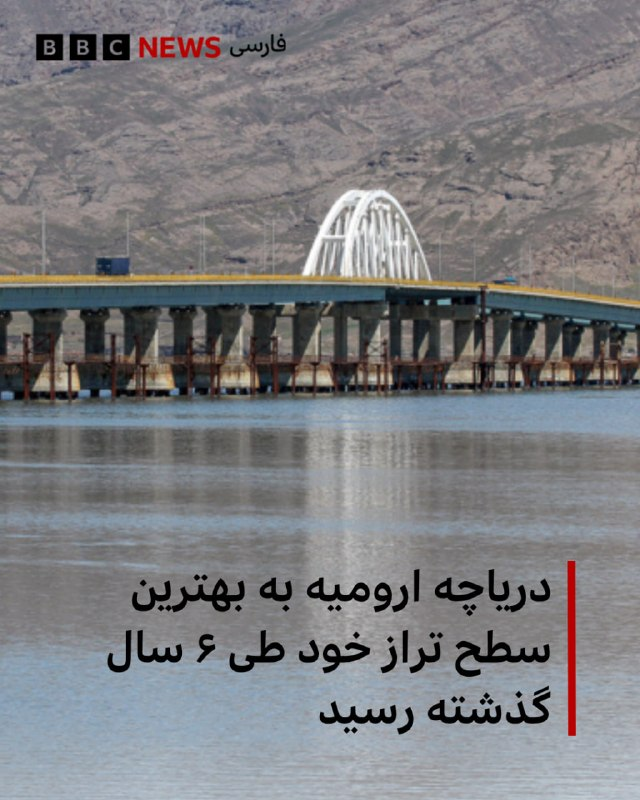
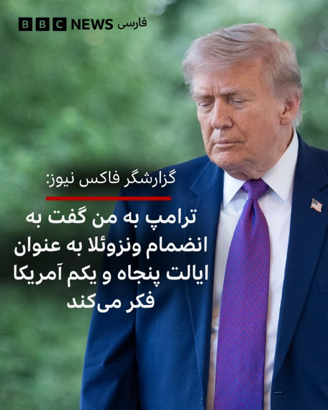
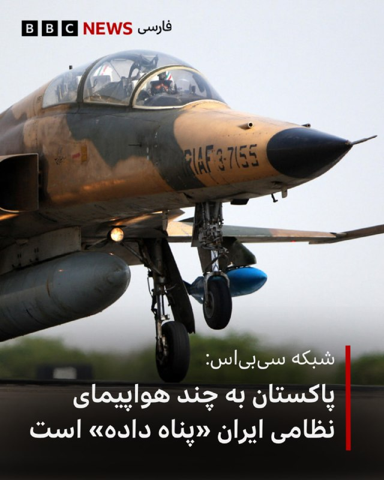
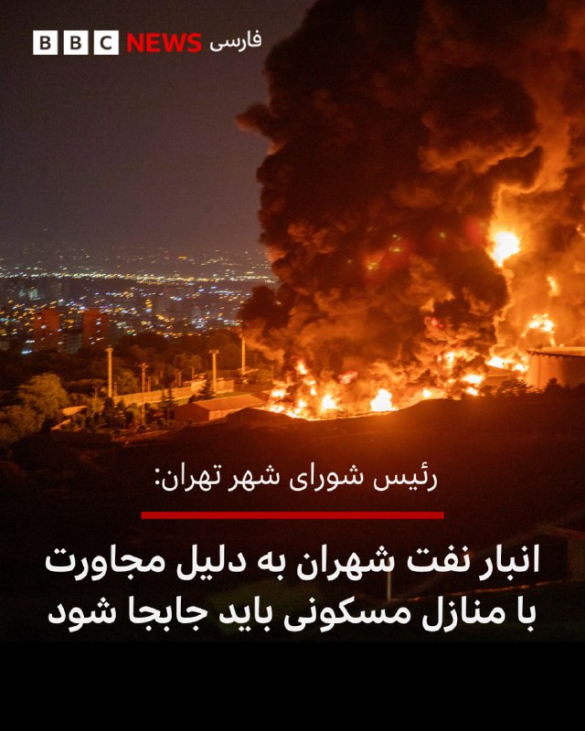

# خواننده تلگرام

<!-- TOP_NAV START -->

<!-- TOP_NAV END -->

<!-- MSG START -->

---
📅 بروزرسانی: 1405/02/22 07:39
---

## bbcpersian — post 280808

  

🔻بنابر گزارش رسانه‌های ایران،‌ رضا رحمانی، دبیر کارگروه نجات دریاچه ارومیه گفته است در چند ماه گذشته حدود ۳۰ میلیون متر مکعب آب به حوضچه دریاچه ارومیه افزوده شده که موجب شکسته شدن رکود ۶ ساله تراز آبی این دریاچه شده است.

استاندار آذربایجان غربی «لایروبی نهرها ، تامین حق آب و آبگیری تالاب های اقماری در کنار وضعیت مناسب بارش‌ها» را از دلایل بهبود وضعیت دریاچه ارومیه دانسته است و بر ادامه اصلاح الگوهای آبخیزداری به ویژه در بخش کشاورزی تاکید کرده است.

خشکی دریاچه ارومیه سالهاست که موجب نگرانی کارشناسان و فعالان محیط زیست شده است.

📸IRNA
https://bbc.in/4u5xbUz
@BBCPersian

## bbcpersian — post 280807

  

🔻جان رابرتز، گزارشگر و از مجریان شبکه خبری فاکس نیوز در حساب ایکس خود نوشته که در تماسی تلفنی با دونالد ترامپ، رئیس جمهور آمریکا به او گفته به ایده انضمام ونزوئلا به عنوان ایالت پنجاه و یکم آمریکا «به طور جدی» فکر می‌کند.

آقای ترامپ پیش‌تر هم از ایده پیوستن کانادا به ایالات متحده به طور جدی سخن گفته بود که با واکنش تند دولت این کشور و بسیاری از رهبران غربی روبرو شد.

او همچنین از «به دست آوردن» گرینلند به طور جدی سخن گفته و حتی ایده خود را به اجلاس رهبران اروپا و ناتو هم برده بود هر چند در نهایت با طرح پیشنهادهایی از سوی کشورهای اروپایی و متحد واشنگتن، دیگر آن را مطرح نکرد.

📸EPA/Shutterstock
https://bbc.in/4wpH3Ko
@BBCPersian

## bbcpersian — post 280806

🔻مقامات لبنان از سفیر آمریکا خواستند اسرائیل را برای توقف حملات تحت فشار بگذارد

مقامات لبنان از سفیر آمریکا در بیروت خواسته‌اند که واشنگتن را برای متوقف کردن حملات اسرائیل به لبنان تحت فشار بگذارد. حملاتی که با وجود آتش‌بس در جنگ اسرائیل و حزب‌الله، همچنان ادامه دارد.

مقام‌های لبنانی اعلام کرده‌اند شمار کشته‌شدگان حملات اسرائیل از دوم مارس تاکنون به ۲ هزار و ۸۶۹ نفر رسیده که ده‌ها نفر از آن‌ها پس از اجرایی شدن آتش‌بس در ۱۷ آوریل کشته شده‌اند.

ژوزف عون، رئیس‌جمهوری لبنان و نواف سلام نخست‌وزیر جداگانه با میشل عیسی، سفیر آمریکا دیدار کردند. دیدارهایی که در آستانه سومین نشست نمایندگان لبنان و اسرائیل در واشنگتن انجام شد.

نواف سلام گفته است که از سفیر آمریکا خواسته برای توقف حملات و نقض‌ مداوم آتش‌بس از سوی اسرائیل اقدام کند.

در روزهای اخیر، اسرائیل حملات خود به لبنان را تشدید کرده و برخی حملات تا حدود ۲۰ کیلومتری بیروت پیش رفته است.

خبرگزاری رسمی لبنان گزارش داده که اسرائیل روز دوشنبه بیش از ۳۰ نقطه در جنوب و شرق این کشور را هدف حملات هوایی قرار داده است.

https://bbc.in/3RyM0k8
@BBCPersian

## bbcpersian — post 280805

  

🔻محمدباقر قالیباف، رئیس مجلس شوری اسلامی ایران در واکنشی تازه به اظهارات دونالد ترامپ گفته است: «هيچ جايگزينی جز پذيرش حقوق مردم ايران، آن‌گونه که در پيشنهاد ۱۴ بندی آمده، وجود ندارد.»

این اظهارات را حساب کاربری آقای قالیباف عصر دوشنبه در شبکه ایکس و به زبان انگلیسی منتشر کرده و نوشته است: «هر رويکرد ديگری کاملا بی‌نتيجه خواهد بود و چيزی جز شکست‌های پياپی به همراه نخواهد داشت. هرچه بیشتر تعلل کنند، مالیات‌دهندگان آمریکایی هزینه بیشتری از جیب خود خواهند پرداخت.»

آقای قالیباف در پست قبلی هم گفته بود ایران برای هر سناریویی آماده است.

به نظر می‌رسد اظهارات رئیس مجلس ایران در واکنش به اظهارات دونالد ترامپ است که در آنها رئیس جمهور آمریکا از نارضایتی کامل خود از پاسخ ایران به پیشنهادهای او خبر داده است.

آقای ترامپ روز دوشنبه گفته بود با توجه به نارضایتی او از پاسخ ایران، آتش بس میان دو کشور در وضعیتی شبیه زنده ماندن به کمک «دستگاه تنفس مصنوعی» است.

📸Handout via Getty Images
https://bbc.in/437QfWl
@BBCPersian

## bbcpersian — post 280804

🔻گزارش‌ها درباره احداث یک پایگاه مخفی اسرائیل در خاک عراق، ابعاد تازه‌ای از جنگ ۳۹ روزه آمریکا و اسرائیل با ایران را آشکار کرده است.
گفته می‌شود اسرائیل از این پایگاه که در وسط صحرای عراق ساخته شده بود، برای پشتیبانی عملیات علیه ایران استفاده می‌کرد.

گزارش فرزاد صیفی‌کاران از بخش راستی‌آزمایی بی‌بی‌سی

@BBCPERSIAN

## bbcpersian — post 280803

  

🔻شبکه سی بی اس - شریک کاری بی‌بی‌سی در آمریکا - به نقل از دو مقام آمریکایی گزارش کرده است پاکستان در میان تلاش‌ها برای متوقف کردن جنگ میان ايران و ايالات متحده آمريکا، «به‌طور غيرعلنی به هواپيماهای نظامی ايران اجازه داد در پايگاه‌های هوايی اين کشور مستقر» شوند؛ اقدامی که به گفته مقام‌های امريکايی مطلع در گفتگو با سی‌بی‌اس، ممکن است حاکی از تلاش ایران برای محافظت از هواپیماهای خود در بربر حملات هوايی آمريکا بوده باشد.

دو مقام امريکايی به سی‌بی‌اس نيوز گفتند ايران همچنين هواپيماهای غيرنظامی را برای استقرار به افغانستان فرستاده است، هرچند مشخص نيست که آيا در ميان آنها هواپيماهای نظامی هم وجود داشته يا نه.

به گفته اين مقام‌ها، اين جابه‌جايی‌ها نشان‌دهنده تلاش آشکار تهران برای محافظت از بخشی از دارايی‌های باقی‌مانده نظامی و هوايی خود در برابر گسترش درگيری‌ها بوده؛ در حالی که مقام‌ها در اسلام آباد به‌طور علنی نقش ميانجی برای کاهش تنش را ايفا می‌کردند.
ادامه مطلب⬇️

📸AFP via Getty Images
https://bbc.in/4wn3TCv
@BBCPersian

## bbcpersian — post 280802

  

🔻رئیس شورای شهر تهران گفته است محل انبار نفت شهران در تهران باید تغییر کند،‌ زیرا که در مجاورت منازل مسکونی قرار دارد که این از نظر ایمنی و زیست محیطی مناسب نیست.

مهدی چمران گفت که این شورا از دوره سوم پیگیر جابجایی انبار نفت شهران بوده،‌ اما هنوز این اتفاق نیفتاده است.

به گفته رئیس شورای شهر تهران موقعیت جغرافیایی این انبار نفت مناسب نیست و در طول جنگ هم پس از هدف قرار گرفتن و آتش سوزی، بنزین در خیابان‌ها جاری شد که این باعث شد خودروهای اطراف این محل دچار آتش سوزی شوند.

پس از حملات آمریکا و اسرائیل به انبار نفت شهران تصاویری از دود غلیظ و آثار دوده بر خودروها و منازل در غرب تهران منتشر شد.

مقامات بهداشتی ایران در آن زمان به شهروندان هشدار دادند که فقط در موارد ضروری از خانه خارج شوند.

📸GettyImages
https://bbc.in/4wpu4IE
@BBCPersian

## bbcpersian — post 280801

🔻پایان پوشش زنده

با ورود به بامداد ۲۲ اردیبهشت پوشش زنده ما از آخرین تحولات ایران و خاورمیانه به صفحه جدید روز سه شنبه منتقل می‌شود.

لطفا برای مرور تحولات ۲۴ ساعت گذشته به لینک پایین مراجعه کنید و از جمله آخرین اظهارات مقام‌های ایران و آمریکا درباره مذاکرات آتش‌بس را بخوانید.

https://bbc.in/4tnabzf
@BBCPersian

## bbcpersian — post 280795

🖋کیتی گورنال و سارا داوکینز/ بی‌بی‌سی

اگر از کاربران شبکه‌های اجتماعی باشید، احتمالا آن‌ها را دیده‌اید؛ ویدئوهای پر زرق‌وبرق بدنسازی که وعده می‌دهند هیکل شما را در عرض چند هفته به‌کلی دگرگون می‌کنند.

این ویدئوها بدن‌هایی تراشیده و تصاویر خیره‌کننده «قبل و بعد» نشان می‌دهند و ادعا می‌کنند که با دنبال کردن یک روتین ساده، می‌توانید چندین سال جوان‌تر به نظر برسید.

نتایج اغلب آن‌قدر خوب به نظر می‌رسند که باورکردنی نیستند و البته در بسیاری از موارد، واقعا هم نباید باورشان کرد.

طبق تحقیقات بی‌بی‌سی، آگهی‌های ورزشی گمراه‌کننده‌ای با استفاده از شخصیت‌های ساخته‌شده توسط هوش مصنوعی در حال انتشار هستند که قوانین تبلیغات بریتانیا را نقض می‌کنند. بسیاری از این آگهی‌ها همچنین به وضوح اعلام نکرده بودند که افراد نمایش‌داده‌شده واقعی نیستند.

ادامه مطلب⬇️

📸GettyImages
https://bbc.in/4u6vu9q
@BBCPersian

## bbcpersian — post 280794

🔻بازداشت یک نفر در تورنتو همزمان با تجمع هواداران سلطنت

پلیس تورنتو با انتشار بیانیه‌ای از بازداشت یک مرد ایرانی به اتهام «حمله با سلاح، تهدید،‌ رانندگی خطرناک و عدم توقف بعد از سانحه رانندگی» در حاشیه تجمع روز گذشته هواداران سلطنت در این شهر کانادا خبر داده است.

روز یکشنبه - ۲۰ اردیبهشت - گزارش‌هایی در شبکه‌های اجتماعی از تلاش برای اختلال در تجمعی در شهر ریچموند هیل تورنتو منتشر شد که در ویدیوهای منتسب به آن مردی که پرچم رسمی جمهوری اسلامی ایران در دست داشت در میان افسران پلیس دیده می‌شد که دقایقی بعد در حالی که دستبند به دست داشت افسران او را سوار خودرو پلیس می‌کردند.

در بیانیه روز دوشنبه - ۱۱ مه / ۲۱ اردیبهشت - پلیس تورنتو این حادثه چنین تشریح شده است: «روز يکشنبه ۱۰ مه ۲۰۲۶، حدود ساعت ۳:۱۵ بعدازظهر، پليس در پی گزارش‌هايی درباره يک راننده خطرناک در محدوده ميجر مکنزی درايو وست و خیابان يانگ به محل اعزام شد. مظنون در نزديکی يک تجمع اعتراضی، خودرو را به شکلی خطرناک هدايت می‌کرد. او با يک راننده تحويل غذا — که در اين تجمع نقشی نداشت — برخورد کرد و هنگام فرار از صحنه، به خودروی ديگری نيز زد. پليس می‌گويد مظنون سپس خودرويش را متوقف کرد و اقدام به فرياد زدن تهديدهايی عليه معترضان کرد، پيش از آنکه بازداشت شود.»

دهها ایرانی روز گذشته در تورنتو با پرچم‌های شیر و خورشید و پوسترهای رضا پهلوی، فرزند آخرین پادشاه ایران، تجمع کرده بودند که به گفته پلیس تورنتو این حادثه در خلال زمان برگزاری این تجمع روی داده است.

https://bbc.in/4uCcSxT
@BBCPersian

## bbcpersian — post 280793

  

🔻به گزارش نشریه آمریکایی وال استريت ژورنال، امارات متحده عربی به‌طور مخفيانه حملات نظامی عليه ايران انجام داده است؛ موضوعی که به گفته منابع آگاه به این نشریه، می تواند امارات را به يکی از طرف‌های فعال مخاصمه با ایران مطرح کند.

منابع آگاه به وال استریت ژورنال گفته‌اند حملاتی که امارات تاکنون به‌صورت علنی تاييد نکرده، شامل حمله به يک پالايشگاه در جزيره لاوان در خليج فارس بوده است.

در اوايل آوريل گذشته و هم‌زمان با اعلام آتش‌بس از سوی دونالد ترامپ چند حمله هوایی به تاسیسات نفتی ایران در جزایر این کشور و اصطلاحا مناطق فلات قاره شرکت ملی نفت ایران صورت گرفت که باعث آتش‌سوزی گسترده و خروج بخش بزرگی از ظرفيت پالايشگاه لاوان از مدار برای چندين ماه شد.

ايران در آن زمان اعلام کرده بود اين پالايشگاه در يک «حمله دشمن» هدف قرار گرفته و در پاسخ، موجی از حملات موشکی و پهپادی عليه امارات و کويت انجام داده است.

📸AFP via Getty Images
https://bbc.in/4tyiBDX
@BBCPersian

## bbcpersian — post 280792

🔻رئیس سازمان انرژی اتمی: غنی‌سازی قابل مذاکره نیست

محمد اسلامی، رئیس سازمان انرژی اتمی ایران در نشست کمیسیون امنیت ملی مجلس با اشاره به این که «فناوری هسته‌ای در دستور کار مذاکرات قرار ندارد» گفت که برنامه غنی‌سازی ایران «قابل مذاکره نیست.»

آقای اسلامی گفت که «تمهیدات لازم» برای حفاظت از مراکز و دارایی‌های هسته‌ای ایران انجام شده است.

دونالد ترامپ عصر امروز درباره ذخیره اورانیوم غنی‌شده ایران گفته بود: «ایران به من گفت که می‌خواهد گردوغبار هسته‌ای را به ما بدهند. اما باید خودتان آن را خارج کنید.»

https://bbc.in/4nlrNud
@BBCPersian

## bbcpersian — post 280791

🔻نماینده ایران در سازمان بین‌المللی دریانوردی: اقدام آمریکا علیه دو نفتکش حامل خدمه ایرانی غیرقانونی است

نماینده جمهوری اسلامی ایران در سازمان بین‌المللی دریانوردی (آیمو) در نامه‌ای به دبیرکل این سازمان، اقدام علیه دو نفتکش حامل خدمه ایرانی را «غیرقانونی و غیرانسانی» خواند و واشنگتن را «مسئول جان و سلامت دریانوردان» گرفتار در این وضعیت دانست.

به گفته علی موسوی، این دو نفتکش در جریان عملیات محاصره دریایی آمریکا و به دلیل آن چه که «حمل محموله مرتبط با ایران» خوانده شده، توقیف شده‌اند.

در این نامه آمده است که حدود ۶۰ نفر از خدمه دو نفتکش «ام‌تی تیفانی» و «ام‌تی ماجستیک» پس از توقیف، به یدک‌کش منتقل شده‌اند و در شرایطی «نامناسب و ناامن» نگهداری می‌شوند.

در این نامه گفته شده است که که این افراد تاکنون بیش از«۱۲۰۰ مایل دریایی» جابه‌جا شده‌اند و با کمبود غذا و آب روبه‌رو هستند.

آقای موسوی همچنین گفته است که این شناور اجازه حرکت به سمت مالزی را نداشته و تحت فشار نیروهای آمریکایی به سمت سنگاپور هدایت شده، اما هنوز مجوز پیاده شدن خدمه در این بندر صادر نشده است.

نماینده ایران در آیمو با محکوم کردن رفتار آمریکا، این اقدامات را «غیرقانونی، غیرانسانی و مغایر با اصول بنیادین ایمنی جان انسان‌ها در دریا» توصیف کرد و هشدار داد که ادامه این وضعیت می‌تواند پیامدهای انسانی فاجعه‌باری به همراه داشته باشد.

او از دبیرکل آیمو و کشورهای عضو خواست برای ارسال فوری غذا، آب و کمک‌های پزشکی و همچنین فراهم کردن شرایط امن برای انتقال و تعیین تکلیف خدمه اقدام کنند.

https://bbc.in/49pCSo6
@BBCPersian

## bbcpersian — post 280790

  <a href="telegram/content/bbcpersian_280790_1778558984.mp4" target="_blank">🎬 Download video</a>

🔻آخرین خبرهای مهم روز دوشنبه ۲۱ اردیبهشت ۱۴۰۵

@BBCPersian

## bbcpersian — post 280789

🔻لیتوانی اعزام نیروی نظامی برای کمک به آمریکا در تنگه هرمز را بررسی می‌کند

لیتوانی اعزام نیروی نظامی برای کمک به ایالات متحده در تنگه هرمز را بررسی می‌کند.

شورای دفاع دولتی لیتوانی که ریاست آن با رئیس‌جمهور است، امروز طرحی در این زمینه به پارلمان فرستاد.

این طرح می گوید که به دنبال آن است که لیتوانی بتواند تا ۴۰ سرباز و نیروی نظامی برای کمک به ایالات متحده در تنگه هرمز اعزام کند.

https://bbc.in/4d4DBxt
@BBCPersian

---
📅 بروزرسانی: 1405/02/22 07:37
---

هیچ پیام جدیدی در این بروزرسانی ارسال نشد.

<!-- MSG END -->

<!-- NAV START -->

<!-- NAV END -->
