# خواننده تلگرام

<!-- TOP_NAV START -->

<a href="https://github.com/hosseinyofficial/aio-downloader/blob/main/telegram/content/archive_1.md" style="display:inline-block; padding:6px 12px; margin:0 4px; background-color:#2ea44f; color:white; text-decoration:none; border-radius:4px; font-weight:bold;">صفحه بعد</a>

<!-- TOP_NAV END -->

<!-- MSG START -->

---
📅 بروزرسانی: 1405/02/27 00:56
---

## persian_trend_official — post 14279

🔴انفجار بزرگ در بیت‌شمش 💢رسانه‌های عبری از وقوع انفجاری بسیار بزرگ در بیت‌شمش در اسرائیل خبر می‌دهند. 💢این رسانه‌ها با بیان اینکه ارتش مانع از ورود خودروهای امدادی به محل حادثه می‌شود، تصریح کردند این انفجار احتمالاً در تأسیساتی حساس رخ داده است. 🫆:Tony…

## persian_trend_official — post 14278

  <a href="telegram/content/persian_trend_official_14278_1778966780.mp4" target="_blank">🎬 Download video</a>

🔴 رسانه‌های اسرائیلی از انفجار در کارخانه صنایع موشکی «تومر» خبر دادند 💢رسانه‌های اسرائیلی گزارش دادند انفجاری در کارخانه شرکت «تومر» رخ داده است؛ شرکتی که در حوزه توسعه و تولید موتورهای موشکی و سامانه‌های پیشران فعالیت می‌کند. ▪️بر اساس گزارش‌ها، این شرکت…

## persian_trend_official — post 14277

🔴انفجار بزرگ در بیت‌شمش 💢رسانه‌های عبری از وقوع انفجاری بسیار بزرگ در بیت‌شمش در اسرائیل خبر می‌دهند. 💢این رسانه‌ها با بیان اینکه ارتش مانع از ورود خودروهای امدادی به محل حادثه می‌شود، تصریح کردند این انفجار احتمالاً در تأسیساتی حساس رخ داده است. 🫆:Tony…

## persian_trend_official — post 14276

  

🔴انفجار بزرگ در بیت‌شمش 💢رسانه‌های عبری از وقوع انفجاری بسیار بزرگ در بیت‌شمش در اسرائیل خبر می‌دهند. 💢این رسانه‌ها با بیان اینکه ارتش مانع از ورود خودروهای امدادی به محل حادثه می‌شود، تصریح کردند این انفجار احتمالاً در تأسیساتی حساس رخ داده است. 🫆:Tony…

## OfficialPersiaTwiter — post 498870

رفتم دوش بگیرم، نگو کانفیگم روشن مونده و یوتیوب باز بوده رو گوشی و حجمش تموم شده.
فکر میکنم بعد از امیرکبیر، تا الان کسی اینجوری از حموم رفتن ضرر نکرده بوده.

》Hastiovski《

@OfficialPersiaTwiter

## OfficialPersiaTwiter — post 498869

  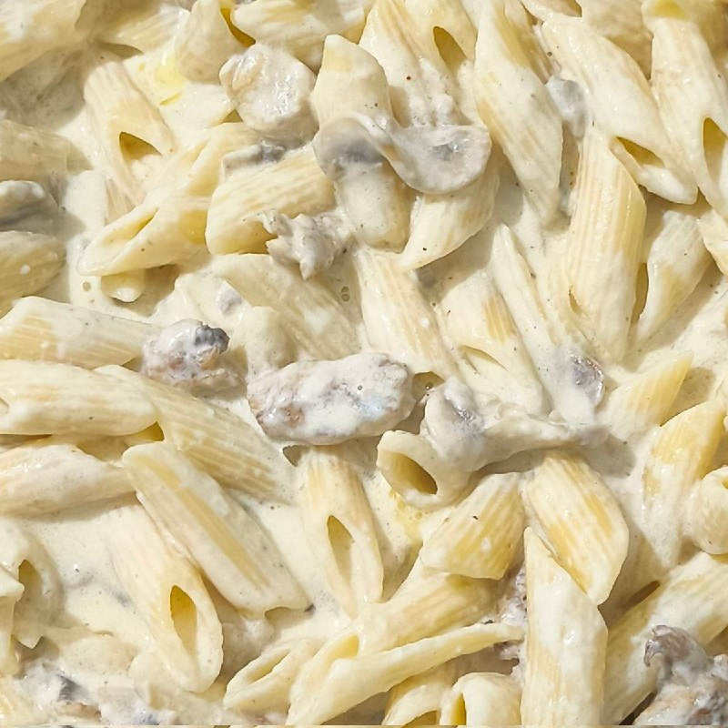

مگه اسکلم از بیرون پیتزا مخلوط بخرم ۱ میلیون تومن؟ خودم موادشو میخرم تو خونه درست میکنم بشه ۲ میلیون و ۳۰۰ هزار تومن. تازه با نوشابه. • دودوک • @OfficialPersiaTwiter

## OfficialPersiaTwiter — post 498868

  

جالبه بدونید النصر یک سال و دو ماهه که توی تمام بازی هاش حتی اونایی که باخته، گل زده و آخرین بازی که موفق به گلزنی نشده برمیگرده به 3 مارچ 2025 مقابل استقلال تهران :))) 》فوتبالی《 @OfficialPersiaTwiter

## OfficialPersiaTwiter — post 498867

سی‌ان‌ان: ترامپ بدون پیشرفت در موضوع ایران از چین بازگشت و نسبت به مذاکرات متوقف شده، بی‌صبرتر شده است 🔹در حالی که ترامپ هنوز می‌گوید دیپلماسی را ترجیح می‌دهد، اکنون در حال بررسی این است که آیا حملات نظامی اضافی برای فشار آوردن به تهران لازم است یا خیر. …

## OfficialPersiaTwiter — post 498866

  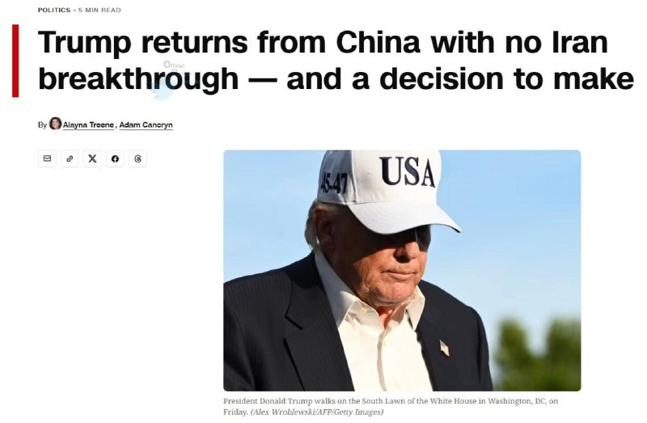

🔴خبرنگار فاکس نیوز: ترامپ درحال آماده‌شدن برای دور جدیدی از حملات نظامی به ایران است 》OPT《 @OfficialPersiaTwiter

## OfficialPersiaTwiter — post 498865

انفجار بزرگ در بیت‌شمش رسانه‌های عبری از وقوع انفجاری بسیار بزرگ در بیت‌شمش واقع در غرب اراضی اشغالی خبر می‌دهند. این رسانه‌ها با بیان اینکه ارتش مانع از ورود خودروهای امدادی به محل حادثه می‌شود، تصریح کردند این انفجار احتمالاً در تأسیساتی حساس رخ داده است.…

## Lichargoo — post 24892

مراحل وصل شدن به اینترنت ازاد از غنی کردن اورانیوم و تولید شیشه هم سخت‌تر و پیچیده‌تر شده.

## Bad_chaneli — post 39506

خیابان با جنده‌‌ها وکسکشا

تلگرام با ما

## Bad_chaneli — post 39505

  <a href="telegram/content/Bad_chaneli_39505_1778966784.mp4" target="_blank">🎬 Download video</a>

🎬 Video

## withyashar — post 11426

  <a href="telegram/content/withyashar_11426_1778966785.mp4" target="_blank">🎬 Download video</a>

امشب بیداریم !
@withyashar

## withyashar — post 11424

‏ جیمی دیمون، مدیرعامل جی‌پی‌مورگان چیس، درباره ایران:

‏آنها ۴۷ سال است که تجاوز، قتل و کشتار می‌کنند. دنیای غرب اجازه جنگ‌های نیابتی را داد.
‏ما درس عبرت گرفتیم - باید سال‌ها پیش به سراغ سر مار می‌رفتیم.
@withyashar

## withyashar — post 11423

  

محمد امین صابرکار، دانش‌آموز ۱۷ ساله بسیجی بوشهری،‌ حین انجام تمرینات تیراندازی اشتباها با آتش خودی(فرندلی فایر😬) کشته شد
@withyashar

## withyashar — post 11422

@withyashar فرهنگ ما همیشه غالب میشه

---
📅 بروزرسانی: 1405/02/26 23:59
---

## persian_trend_official — post 14275

  <a href="telegram/content/persian_trend_official_14275_1778963381.mp4" target="_blank">🎬 Download video</a>

🔴انفجار بزرگ در بیت‌شمش

💢رسانه‌های عبری از وقوع انفجاری بسیار بزرگ در بیت‌شمش واقع در غرب اسرائیل خبر می‌دهند.

💢این رسانه‌ها با بیان اینکه ارتش مانع از ورود خودروهای امدادی به محل حادثه می‌شود، تصریح کردند این انفجار احتمالاً در تأسیساتی حساس رخ داده است.

🫆:Tony

📌 @persian_trend_official
پرشین ترند | متفاوت‌ترین کانال نظامی

## persian_trend_official — post 14274

https://youtube.com/live/Lj3xWW7IbLA?feature=share

## persian_trend_official — post 14273

  

🔴خبرنگار فاکس نیوز

💢ترامپ درحال آماده‌شدن برای دور جدیدی از حملات نظامی به ایران است

🫆:Tony

📌 @persian_trend_official
پرشین ترند | متفاوت‌ترین کانال نظامی

## persian_trend_official — post 14272

  

💢پست ترامپ

این آرامش قبل از طوفانه

🫆:Tony

📌 @persian_trend_official
پرشین ترند | متفاوت‌ترین کانال نظام

## persian_trend_official — post 14271

  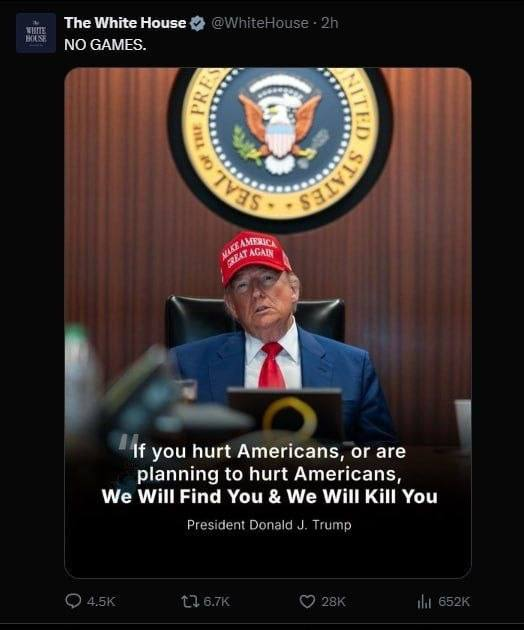

💢تکرار تهدید کاخ سفید با انتشار تصویری از ترامپ در اتاق جنگ

💢کاخ سفید پیامی تهدیدآمیز از رئیس جمهوری آمریکا با عنوان «شوخی نداریم» همراه با تصویری از حضور او در اتاق جنگ منتشر کرد.

💢در پیام کاخ سفید آمده است: «اگر به آمریکایی‌ها آسیب بزنید، یا برای آسیب‌زدن به آمریکایی‌ها توطئه و طرح‌ریزی کنید، ما شما را خواهیم یافت.»

🫆:Tony

📌 @persian_trend_official
پرشین ترند | متفاوت‌ترین کانال نظامی

## persian_trend_official — post 14270

  <a href="telegram/content/persian_trend_official_14270_1778963385.webm" target="_blank">🎬 Download video</a>

نسخه صوتی لایو امشب در پلتفرم کست باکس : https://castbox.fm/vi/945937615

## persian_trend_official — post 14269

نسخه صوتی لایو امشب در پلتفرم کست باکس :
https://castbox.fm/vi/945937615

## persian_trend_official — post 14268

نسخه صوتی لایو امشب در پلتفرم اسپاتیفای :

https://open.spotify.com/episode/2Mw2hfeg12829w5zlJVOkO?si=0nFXW0pdTmCsCyiYukkcsQ

## OfficialPersiaTwiter — post 498864

دست رونالدو و یارانش در خانه به قهرمانی آسیا نرسید؛ گامبااوزاکای ژاپن در خاک عربستان فاتح لیگ قهرمانان آسیای ٢ شد 🔹 النصر صفر - گامبااوزاکا یک 》OPT《 @OfficialPersiaTwiter

## OfficialPersiaTwiter — post 498863

  <a href="telegram/content/OfficialPersiaTwiter_498863_1778963385.mp4" target="_blank">🎬 Download video</a>

کشته شدن یک افسر اسرائیلی در نبردهای لبنان ارتش اسرائیل از کشته شدن یک افسر در نبردهای لبنان خبر داد. رسانه‌های اسرائیلی گزارش دادند که این افسر در جنوب لبنان بر اثر انفجار یک پهپاد انفجاری کشته شده است. این افسر که از تیپ گولانی بود، که در منطقه «دیر سیریان»…

## OfficialPersiaTwiter — post 498862

  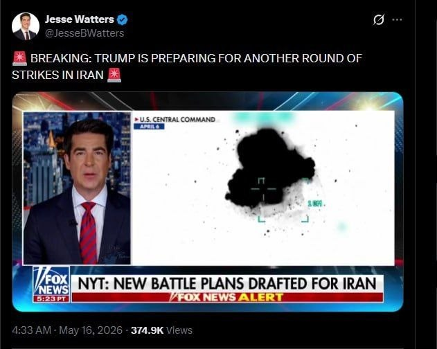

العربیه به نقل از پاکستان:وزیر کشور پاکستان جلسه مهمی در ایران برای تسهیل گفت‌وگو و برقراری صلح برگزار کرد 🔹️حضور وزیر کشور پاکستان در ایران یک روز دیگر ادامه خواهد یافت تا در مورد چشم‌انداز ازسرگیری مذاکرات گفت‌وگو شود. 》OPT《 @OfficialPersiaTwiter

## OfficialPersiaTwiter — post 498861

  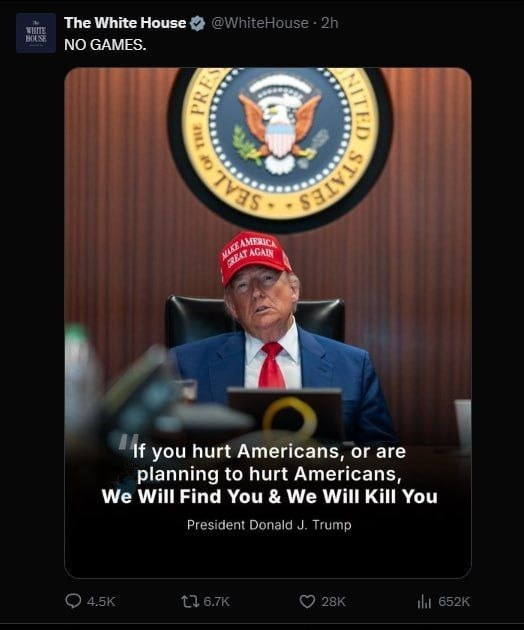

تکرار تهدید کاخ سفید با انتشار تصویری از ترامپ در اتاق جنگ

کاخ سفید پیامی تهدیدآمیز از رئیس جمهوری آمریکا با عنوان «شوخی نداریم» همراه با تصویری از حضور او در اتاق جنگ منتشر کرد.
در پیام کاخ سفید آمده است: «اگر به آمریکایی‌ها آسیب بزنید، یا برای آسیب‌زدن به آمریکایی‌ها توطئه و طرح‌ریزی کنید، ما شما را خواهیم یافت.»

》OPT《

@OfficialPersiaTwiter

## OfficialPersiaTwiter — post 498860

  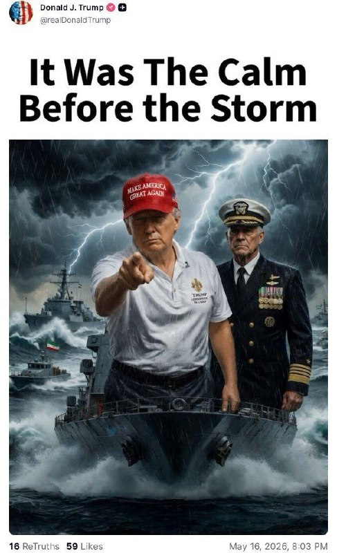

پست جدید ترامپ درباره ایران در Truth Social 》OPT《 @OfficialPersiaTwiter

## OfficialPersiaTwiter — post 498859

ایران و آمریکا بر سر یک موضوع توافق دارند: فعلا درباره سرنوشت ذخایر اورانیوم گفتگو نشود وال‌استریت‌ژورنال نوشت: 🔹در حالی که بن‌بست دیپلماتیک بین تهران و واشنگتن ادامه دارد، یک نقطه اشتراک وجود دارد: هر دو طرف می‌گویند که در حال حاضر درباره سرنوشت ذخایر…

## OfficialPersiaTwiter — post 498858

یه بارم یه اتفاق بدی برام افتاد فوری با بغض رفتم تو حموم گفتم بذار زیر دوش چمباتمه بزنم یکم زار بزنم :))
ولی قبل نشستن مجبور شدم ۵ دقیقه با آب سردوگرم ور برم تا دمای آب تنظیم شه :)))) کلا دردم یادم رفت :))))))))

》روانشناسِ روانی《

@OfficialPersiaTwiter

## OfficialPersiaTwiter — post 498857

  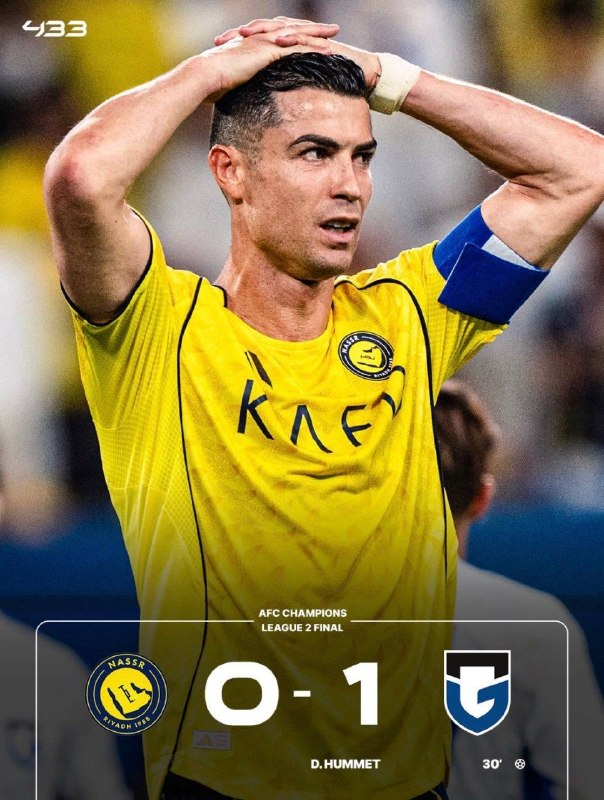

دست رونالدو و یارانش در خانه به قهرمانی آسیا نرسید؛ گامبااوزاکای ژاپن در خاک عربستان فاتح لیگ قهرمانان آسیای ٢ شد

🔹 النصر صفر - گامبااوزاکا یک

》OPT《

@OfficialPersiaTwiter

## OfficialPersiaTwiter — post 498856

کوثری: هر تعرضی با پاسخ کوبنده مواجه خواهد شد

عضو کمیسیون امنیت ملی مجلس:
🔹اگر آمریکا یا اسرائیل کوچکترین تعرضی انجام دهند، مردم ما، چه زن و چه مرد، در صحنه حاضر هستند.

🔹دشمن هر توانی داشت در ۴۰ روز گذشته انجام داد، آنها نمی‌توانند به راحتی بمب‌ها و موشک‌های از دست رفته خود را جایگزین کنند، اما ما به راحتی می‌توانیم جبران کنیم.

🔹آنها در هر نقطه‌ای که حضور پیدا کنند، رزمندگان و مردم چنان ضربه‌ای می‌زنند که جز ذلت و خواری نصیبشان نشود.

》OPT《

@OfficialPersiaTwiter

## bbcpersian — post 281241

  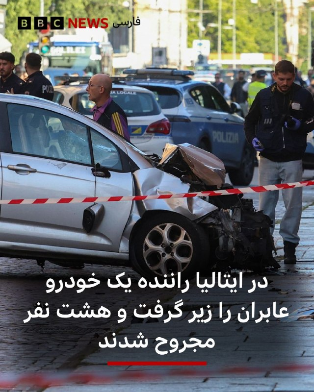

‌🔻مردی در شهر مودنا در شمال ایتالیا با خودرو خود با چندین عابر پیاده برخورد و هشت نفر را زخمی کرد. حال چهار نفر از آنها وخیم گزارش شده است.

یکی از مجروحان زنی است که گفته می‌شود هر دو پایش خرد شده است.

عابران پس از تعقیب راننده خودرو، یک «مرد سی و چند ساله» را دستگیر و به پلیس تحویل دادند.

جورجیا ملونی، نخست‌وزیر ایتالیا، این واقعه را «بسیار جدی» توصیف کرد. همچنین ماسیمو مزتی، شهردار مودنا، در ادامه واکنش خانم ملونی گفت اگر مشخص شود که این یک حمله از پیش برنامه‌ریزی شده بوده، «حتی جدی‌تر» خواهد بود.

این حادثه بعد از ظهر شنبه ۱۶ مه اتفاق افتاد. یک شاهد عینی گفت: «ما دیدیم که خودرو نزدیک می‌شود، به سمت جدول می‌رفت اما ناگهان سرعت گرفت و هنگام برخورد با عابران حداقل ۱۰۰ کیلومتر در ساعت سرعت داشت و ما دیدیم که مردم در حال پرواز هستند.»

شهردار مودنا گفت به نظر می‌رسد که راننده «عمدا به پیاده‌رو رفته، به چند نفر زده و به ویترین یک مغازه کوبیده است».
به گفته شهردار مودنا، فرد بازداشت‌شده یک تبعه ایتالیایی متولد برگامو، اما «اصالتا مغربی» است.

ادامه از:
https://bbc.in/4nxF8zv
📷Reuters
@BBCPersian

## bbcpersian — post 281240

  <a href="https://t.me/bbcpersian/281240" target="_blank">📎 Download file</a>

پادکست برنامه شصت دقیقه روز شنبه ۲۶ اردیبهشت ۱۴۰۵ است
این نسخه رادیویی برنامه شصت دقیقه تلویزیون فارسی بی‌بی‌سی است که هرشب بعد از پخش، با حجم کم از اپلیکیشن‌های پادگیر و صفحه تلگرام بی‌بی‌سی فارسی در دسترس است.
با هشتگ BBCPersianRadio# با ما در ارتباط باشید.
@BBCPersian

## bbcpersian — post 281239

📊بازار سهام ایران پس از توقف ناشی از جنگ از سه‌شنبه بازگشایی می‌شود

یک مقام ارشد سازمان بورس و اوراق بهادار ایران تایید کرد که پس از توقف فعالیت‌ها در دوران جنگ با آمریکا و اسرائیل، بازار سهام آن کشور از روز سه‌شنبه بازگشایی خواهد شد.

حمید یاری، معاون نظارت بر بورس‌ها و ناشران سازمان بورس و اوراق بهادار ایران می‌گوید که «بر اساس هماهنگی‌های صورت‌گرفته و پس از اخذ مجوزهای لازم، مقرر شد بازگشایی بازار سهام، انواع صندوق‌های سرمایه‌گذاری در سهام و مشتقات آن‌ از روز سه‌شنبه ۲۹ اردیبهشت ۱۴۰۵ صورت پذیرد.»

او گفت که توقف فعالیت بازار سهام از شروع جنگ، «با هدف صیانت از دارایی سهامداران، جلوگیری از بروز رفتارهای هیجانی و فراهم آوردن شرایط انجام معامله در این بازار با اطلاعات دقیق‌تر و شفاف‌تر صورت‌ گرفت.»

آقای یاری همچنین می‌گوید که با بازگشایی بازار سهام، «شاهد تکمیل فعالیت همه بخش‌های بازار سرمایه خواهیم بود.»

https://bbc.in/4wpp6f4
@BBCPersian

## bbcpersian — post 281238

  <a href="telegram/content/bbcpersian_281238_1778963390.mp4" target="_blank">🎬 Download video</a>

⭕️آخرین خبرهای مهم روز شنبه ۲۶ اردیبهشت ۱۴۰۵
@BBCPersian

## thefeedconfig — post 79

thefeed-android-v0.18.10-arm64-v8a.apk

## networkti — post 359

thefeed-android-v0.18.10-arm64-v8a.apk

## Tans_Footbali — post 236351

نتانیاهو: اگر آمریکا بخواد جنگ رو بازم شروع کنه، ما آماده خواهیم بود.

💛@Tans_Footbali

## hamclasixii — post 75394

  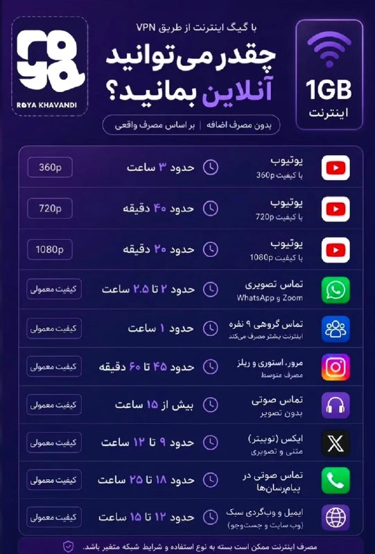

🔴با هر 1 گیگابایت اینترنت از طریق VPN چقدر میشه آنلاین موند؟!

📚 @hamclasix 📚

## withyashar — post 11421

  <a href="telegram/content/withyashar_11421_1778963393.mp4" target="_blank">🎬 Download video</a>

گوش جان میسپریم به فریدون عزیز تا من موتورم رو گرم کنم ویس بزارم
@withyashar

## withyashar — post 11420

  

ترامپ در تروث : آرامش فبل از طوفان

قایق تندرو با پرچم جمهوری اسلامی دیده میشود …
@withyashar

## withyashar — post 11419

## withyashar — post 11418

  

مشاورین شاهزاده (امیر اعتمادی و سعید قاسمینژاد) ، علی کریمی‌ رو به علت واکنش ‌به کنسرت و آهنگ شاهین نجفی آنفالو کردند @withyashar

---
📅 بروزرسانی: 1405/02/26 23:03
---

## persian_trend_official — post 14267

🔴آمریکا معافیت تحریم نفت روسیه را تمدید نکرد

💢به گزارش رویترز، آمریکا روز شنبه معافیت تحریمی که پیشتر به کشورهایی از جمله هند اجازه می‌داد نفت روسیه را خریداری کنند، تمدید نکرد.

💢این معافیت قبلاً به مدت یک ماه تمدید شده بود تا کمبود عرضه نفت و قیمت‌های بالا ناشی از بسته شدن تنگه هرمز توسط ایران کاهش یابد.

💢اسکات بسنت، وزیر خزانه‌داری آمریکا پیشتر گفته بود که مجوز خرید نفت روسیه ذخیره‌شده روی تانکرها را تمدید نخواهد کرد.

🫆:Tony

📌 @persian_trend_official
پرشین ترند | متفاوت‌ترین کانال نظامی

## persian_trend_official — post 14266

  <a href="telegram/content/persian_trend_official_14266_1778960037.webm" target="_blank">🎬 Download video</a>

🔴تارنمای بیمهٔ ایرانی تنگهٔ هرمز راه‌اندازی شد

💢تارنمای «هرمز سیف» (Hormuz Safe) ارائه بیمه به محموله‌های دریایی عبوری از تنگهٔ هرمز را شروع کرد.

💢مقررات این تارنمای بیمه می‌گوید، بیمه‌نامه‌هایی سریع و با قابلیت تایید رمزنگاری شده برای محموله‌هایی که از خلیج فارس، تنگهٔ هرمز و آبراه‌های اطراف آن عبور می‌کنند، ارائه می‌شود و پرداخت‌ها با ارز دیجیتال تسویه خواهد شد.

🫆:Tony

📌 @persian_trend_official
پرشین ترند | متفاوت‌ترین کانال نظامی

## persian_trend_official — post 14265

⭕️ ادعای ترامپ:
ایران روزهای بسیار سختی در پیش خواهد داشت.

📝 Nick

📌 @persian_trend_official
پرشین ترند | متفاوت‌ترین کانال نظامی

## persian_trend_official — post 14264

https://youtube.com/live/Lj3xWW7IbLA?feature=share

## persian_trend_official — post 14263

⭕️👽 ادعای جنجالی دریاسالار بازنشسته آمریکا درباره پدیده‌های ناشناس؛ «هوش غیرانسانی» در کار است.

تیم گالادت، دریاسالار بازنشسته نیروی دریایی آمریکا، در اظهاراتی جنجالی گفت پدیده‌های ناشناس هوایی ممکن است تحت هدایت «هوشی غیرانسانی و در سطحی بالاتر» باشند.

به گزارش فاکس‌نیوز، گالادت که از چهره‌های شناخته‌شده در بحث پدیده‌های ناشناس هوایی در آمریکا به شمار می‌رود، گفته است داده‌ها و ویدئوهایی را دیده که نشان می‌دهد برخی از این اشیا میان اقیانوس و جو زمین، بدون ایجاد اختلال آشکار در سطح آب، با سرعت‌هایی فراتر از فناوری شناخته‌شده حرکت می‌کنند.

او تأکید کرد این اشیا نه شبیه فناوری آمریکا هستند و نه شبیه فناوری رقبای این کشور. گالادت گفت: «ما فناوری‌ای نداریم که بتواند چنین کاری انجام دهد.»

این دریاسالار بازنشسته همچنین مدعی شد شواهدی وجود دارد که نشان می‌دهد حرکت این پدیده‌ها تحت کنترل هوشی غیرانسانی است؛ ادعایی که بار دیگر بحث درباره ماهیت پدیده‌های ناشناس هوایی و میزان اطلاعات پنهان‌شده از افکار عمومی را داغ کرده است.

📝 Nick

📌 @persian_trend_official
پرشین ترند | متفاوت‌ترین کانال نظامی

## persian_trend_official — post 14262

  <a href="telegram/content/persian_trend_official_14262_1778960038.mp4" target="_blank">🎬 Download video</a>

💢پست جدید ترامپ و تمسخر دوباره پهپاد های جمهوری اسلامی ...

🫆:Tony

📌 @persian_trend_official
پرشین ترند | متفاوت‌ترین کانال نظامی

## persian_trend_official — post 14261

🔴 مهم‌ترین تحولات منطقه

▪️ حماس تأیید کرد «عزالدین الحداد» فرمانده شاخه نظامی گردان‌های قسام، در حمله روز جمعه اسرائیل به غزه کشته شده است

▪️ وزیر کشور پاکستان در سفری غیرمنتظره به تهران با همتای ایرانی خود درباره ثبات منطقه‌ای
و همکاری‌های دوجانبه گفت‌وگو کرد.

▪️ فرماندهی مرکزی ارتش آمریکا (سنتکام) اعلام کرد در ادامه محاصره بنادر ایران، مسیر حرکت ۷۸ کشتی تجاری را تغییر داده است

▪️ اسرائیل حملات خود به لبنان را با وجود آتش‌بس ادامه داد؛ در حملات جدید دست‌کم ۳ نفر در جنوب لبنان کشته شدند

▪️ وزارت بهداشت لبنان اعلام کرد از اوایل مارس تاکنون
۲۹۶۹ نفر در حملات اسرائیل کشته و ۹۱۱۲ نفر زخمی شده‌اند.

🫆:Tony

📌 @persian_trend_official
پرشین ترند | متفاوت‌ترین کانال نظامی

## persian_trend_official — post 14260

  <a href="telegram/content/persian_trend_official_14260_1778960039.mp4" target="_blank">🎬 Download video</a>

⭕️ ناوشکن وینستون چرچیل (DDG-81) از کلاس آرلی برک فلایت IIA که فرماندهی گروه ضربت ناو هواپیمابر فورد را بر عهده داشت، پس از یک‌سال مأموریت طاقت‌فرسا در فرماندهی اروپا، آفریقا و در نهایت فرماندهی مرکزی و شرکت در عملیات خشم حماسی، اکنون به پایگاه مادر خود، پایگاه نیروی دریایی می‌پورت در جکسون‌ویل، فلوریدا بازگشته است.

پ.ن: شرایط عملیاتی ناوشکن‌ها نسبت به ناوهای هواپیمابر به مراتب سخت‌تر و حساس‌تر می‌باشد. ولی معمولاً در رسانه‌ها اشاره‌ای به نقش پررنگ ناوشکن‌ها که در خط اول انجام مأموریت‌های تهاجمی و پدافندی قرار دارند، نمی‌شود.

📝 Nick

📌 @persian_trend_official
پرشین ترند | متفاوت‌ترین کانال نظامی

## persian_trend_official — post 14259

💢نشریه تلگراف

«دونالد ترامپ، به امارات متحده عربی توصیه می‌کنند نقش فعال‌تری در جنگ با ایران ایفا کند و دست به ورود نیرو زمینی خود به برخی از جزایر ایرانی مانند لاوان انجام دهد!

💢این گزارش حاکی است که برخی افراد در حلقه ترامپ پیشنهاد داده‌اند که این جزیره باید توسط نیروهای زمینی امارات به جای آمریکا اشغال و نیرو هوایی آمریکا وظیفه پشتیبانی هوایی از آنها را انجام دهد.»

🫆:Tony

📌 @persian_trend_official
پرشین ترند | متفاوت‌ترین کانال نظامی

## persian_trend_official — post 14258

  

خبرگزاری مهر | اسکندر مومنی: تجارت مرزی از محورهای اصلی گفت‌وگو با وزیر کشور پاکستان بود

💢وزیر کشور گفت: یکی از محورهای اصلی گفت‌وگوهای امروز با وزیر کشور پاکستان ، موضوع تجارت مرزی بود که توافق شد هم از سوی ایران و هم از سوی پاکستان، تسهیلات و اقدامات لازم صورت گیرد.

💢خوشبختانه هم دولت‌ها و هم ملت‌های دو کشور نگاه بسیار مثبتی به یکدیگر دارند. نخستین پیام رهبر معظم انقلاب درباره پاکستان نیز حاوی تأکید ویژه‌ای بر روابط دو کشور بود و هر دو طرف مصمم هستیم که در کنار توسعه روابط سیاسی و برادرانه، روابط اقتصادی و تجاری را نیز گسترش دهیم.

💢سید محسن نقوی نیز با تشکر از میزبانی وزیر کشور ایران گفت: همان‌طور که اشاره شد، درباره موضوعات مختلف مرتبط با روابط ایران و پاکستان و همچنین امنیت مرزها گفت‌وگوهای مفصلی داشتیم و امیدوارم با روندی که در پیش گرفته‌ایم، به‌زودی به راه‌حل‌های ملموسی در این زمینه‌ها دست پیدا کنیم.

🫆:Tony

📌 @persian_trend_official
پرشین ترند | متفاوت‌ترین کانال نظامی

## persian_trend_official — post 14257

⭕️ شبکه 13 اسرائیل:

هم اکنون ارزیابی‌ها در اسرائیل بر این است که جنگ با ایران در روز های آینده از سر گرفته خواهد شد.

📝 Nick

📌 @persian_trend_official
پرشین ترند | متفاوت‌ترین کانال نظامی

## persian_trend_official — post 14256

  <a href="telegram/content/persian_trend_official_14256_1778960041.mp4" target="_blank">🎬 Download video</a>

🔴مجری تلویزیون دولتی جمهوری اسلامی در یک بخش آموزش سلاح‌های گرم، به پرچم امارات متحده عربی نشانه گیری و در برنامه زنده شلیک کرد.

🫆:Tony

📌 @persian_trend_official
پرشین ترند | متفاوت‌ترین کانال نظامی

## persian_trend_official — post 14255

⭕️ رسانه پاکستانی ARY News:

محسن نقوی، وزیر کشور پاکستان، حامل پیامی مهمی برای ایران بود.

📝 Nick

📌 @persian_trend_official
پرشین ترند | متفاوت‌ترین کانال نظامی

## persian_trend_official — post 14254

⭕️ چینی‌ها گزارش می‌دهند که ترامپ حتی به یک تکه از غذاهایی که در شام خوش‌آمدگویی سرو شده بود، دست نزد. او غذاهایی را که توسط سرآشپزهای کاخ سفید تهیه شده بود، خورد.

علاوه بر این، او در تمام طول سفر به هیچ غذایی که توسط طرف چینی تهیه شده بود، دست نزد.

گفته می‌شود که این کار برای جلوگیری از ورود هرگونه میکروب و نانوفناوری به غذا انجام شده است.

کارکنانی که به ترامپ خدمت می‌کردند، با محافظان سرویس مخفی جایگزین شدند.

در نگاه اول، این یک ضیافت بزرگ قرن بود، پر از سلامتی و خنده؛ اما در پشت صحنه، نبرد خاموشی از هوش و ذکاوت در حال وقوع بود.

📝 Nick

📌 @persian_trend_official
پرشین ترند | متفاوت‌ترین کانال نظامی

## OfficialPersiaTwiter — post 498855

تمدید معافیت‌های نفتی ایران و روسیه اسکات بسنت، وزیر خزانه‌داری آمریکا، چهارشنبه اعلام کرد معافیت تحریمی نفت روی دریا متعلق به روسیه و ایران را به مدت ۳۰ روز تمدید کرده است. او گفت این تصمیم پس از درخواست حدود ۱۰ کشور آسیب‌پذیر در برابر کمبود نفت به‌دلیل…

## OfficialPersiaTwiter — post 498854

  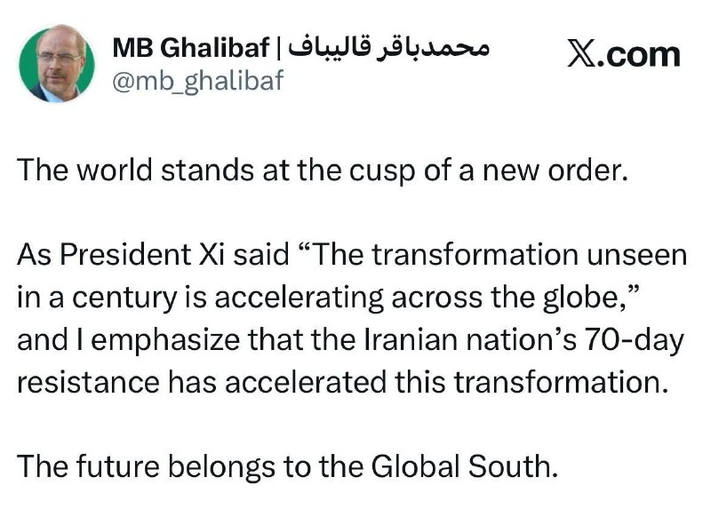

قالیباف:

جهان در آستانهٔ نظمی نوین قرار دارد.

چنان‌که رئیس‌جمهور شی گفت: «تحولی که در یک قرن دیده نشده، در سراسر جهان با شتاب در حال پیشروی است»، و من تأکید می‌کنم که مقاومت ۷۰ روزهٔ ملت ایران این تحول را شتاب بخشیده است.

آینده از آنِ کشورهای جنوب جهانی است.

》OPT《

@OfficialPersiaTwiter

## OfficialPersiaTwiter — post 498853

  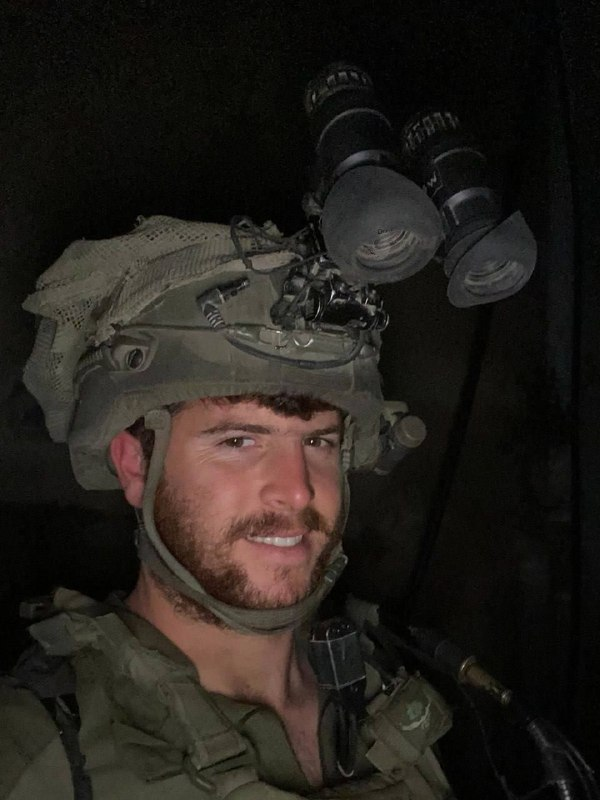

خسارات گسترده حمله اسرائیل به مناطق مسکونی شهرک الشهابیه در جنوب لبنان 》OPT《 @OfficialPersiaTwiter

## OfficialPersiaTwiter — post 498852

  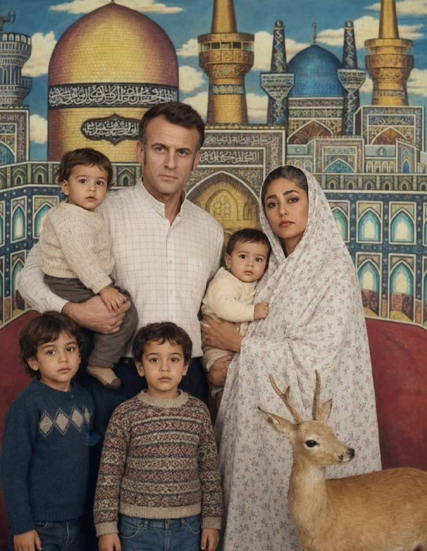

این داستان ارتباط عاطفی ایرانی‌ها با رئیس‌جمهور کشورهای غربی تازگی نداره، یه بارم بوش زنگ زد و گفت این خانومه که خیلی دلبره از جنیفر لوپز ما بهتره نیناش ناشم بلده؟ 》درویش《 @OfficialPersiaTwiter

## OfficialPersiaTwiter — post 498851

  

معاون اول رئیس‌جمهور: دیگر اجازهٔ عبور تجهیزات نظامی دشمن از تنگهٔ هرمز را نخواهیم داد. 》OPT《 @OfficialPersiaTwiter

## OfficialPersiaTwiter — post 498850

یازده سالم بود. داداشم همدان دانشجوی دندون‌پزشکی بود و یبار که برگشته بود شهرمون، یه خمیر دندون با خودش آورده بود و من فکر می‌کردم اینو تو دانشگاه بهشون دادن و حتما خیلی چیز خفنیه و فقط با اون مسواک زدم. بعد چند روز فهمیدم اونی که باهاش مسواک می‌زنم خمیر دندون…

## OfficialPersiaTwiter — post 498849

ادعای تازه ترامپ در خصوص مذاکره با ایران   🔹 رئیس جمهور آمریکا در گفتگو با رسانه‌های فرانسوی  درباره مذاکرات با ایران مدعی شد: آن‌ها علاقه‌مند به دستیابی به توافق هستند. او در ادامه گفت: اگر توافقی حاصل نشود ایران روزهای بسیار سختی در پیش خواهد داشت 🔹 ترامپ…

## OfficialPersiaTwiter — post 498848

  <a href="telegram/content/OfficialPersiaTwiter_498848_1778960045.mp4" target="_blank">🎬 Download video</a>

چند سال پیش تو یک دیت، طرف دستمو گرفت و بوسید، منم دستشو بوسیدم. 》امیلی《 @OfficialPersiaTwiter

## OfficialPersiaTwiter — post 498847

سازمان بورس: آمادگی برای بازگشایی بازار سهام از اواسط هفتهٔ آینده وجود دارد. زمان دقیق بازگشایی بازار به‌زودی اعلام می‌شود. 》OPT《 @OfficialPersiaTwiter

## OfficialPersiaTwiter — post 498846

  <a href="telegram/content/OfficialPersiaTwiter_498846_1778960046.mp4" target="_blank">🎬 Download video</a>

پست جدید ترامپ درباره ایران در Truth Social

》OPT《

@OfficialPersiaTwiter

## OfficialPersiaTwiter — post 498845

  

بابک جهانبخش، خواننده: به تازگی از همسرم جدا شدم، من اونو از ۰ به ۱۰۰ رسوندم اما اون با ۲ تا بچه ولم کرد رفت. زنم فقط به چشم عابر بانک بهم نگاه میکرد و از من به عنوان پله موفقیت خودش استفاده کرد.

》OPT《

@OfficialPersiaTwiter

## OfficialPersiaTwiter — post 498844

یکی از همکلاسیای دوران ابتداییمو تو اینستاگرام پیدا کردم بهش ریکوئست دادم قبول نکرد نامرد!!!
مرد حسابی من توی تولد ده سالگیت برنده‌ی مسابقه‌ی ماست‌خوری شده بودم.

》Masoud《

@OfficialPersiaTwiter

## bbcpersian — post 281237

⭕️آمریکا یک فرمانده شبه‌نظامیان عراقی را به توطئه برای هدف قرار دادن یهودیان در شهرهایی از لندن تا لس‌آنجلس متهم کرد

آمریکا می‌گوید که محمد باقر سعد داوود ساعدی، از فرماندهان شبه‌نظامیان عراقی را به اتهام نقش داشتن در طراحی بیش از ۱۲ حمله «تروریستی» در آمریکای شمالی و اروپا بازداشت و به آمریکا منتقل کرده است.

مقامات قضایی آمریکا گفته‌اند که این حملات در واکنش به جنگ با ایران برنامه‌ریزی شده بود.

این مقام‌های آمریکا همچنین گفتند که «محمد باقر سعد داوود ساعدی، ۳۲ ساله، در حال طراحی حمله به یک کنیسه در نیویورک و دو مرکز یهودی در لس‌آنجلس و اسکاتسدیل بوده است.»

بر اساس شکایت کیفری، آقای ساعدی با شش اتهام مرتبط با تروریسم روبه‌رو است. وکیلش اما می‌گوید که پیگرد او با «انگیزه‌های سیاسی» صورت گرفته است.

مقام‌های آمریکایی، آقای ساعدی را به عنوان یکی از فرماندهان کتائب حزب‌الله معرفی کرده‌اند.

https://bbc.in/3PKX1OQ
@BBCPersian

## bbcpersian — post 281236

  

🔻مسکو می‌گوید اتباع روسی شاغل در نیروگاه اتمی بوشهر را فعلا به طور کامل به ایران برنمی‌گرداند.

الکسی لیخاچف، رئیس شرکت دولتی روس‌اتم، گفت هفته گذشته ایران و آمریکا بار دیگر حملاتی علیه یکدیگر انجام و رسانه‌های آمریکایی هم دوباره از احتمال ازسرگیری درگیری‌ها خبر دادند و ادامه داد گه «تا زمانی که وضعیت روشن نشود، ما حق نداریم درباره بازگشت کامل نیروها به محل نیروگاه تصمیم‌گیری کنیم.»

به گفته او، روس‌اتم در حال آماده‌سازی طرح‌های آتی برای افزایش تعداد نیروهای روسی در نیروگاه اتمی بوشهر است اما در «در عین حال گفت «باید شرایط نظامی را هم در نظر بگیریم.»

محوطه بوشهر که تنها نیروگاه اتمی ایران است، در جریان جنگ اخیر چند بار هدف حمله قرار گرفت اما به ساختمان و تاسیاست اصلی آسیبی نرسید.

روسیه از زمان حمله اسرائیل و آمریکا به ایران در چند مرحله اتباع خود را که در این نیروگاه مشغول به کار هستند، از ایران خارج کرد.

📸NurPhoto via Getty Images

https://bbc.in/4duJS4e
@BBCPersian

## bbcpersian — post 281235

🔻عزالدین حداد‌، فرمانده ارشد حماس در حمله اسرائیل کشته شد

حماس و ارتش اسرائیل تأیید کرده‌اند که عزالدین حداد، فرمانده گردان‌های قسام، شاخه نظامی این گروه، شامگاه جمعه (۱۵ مه، ۲۵ اردیبهشت) در حمله‌ اسرائیل در شهر غزه کشته شده است.

اسرائیل او را یکی از طراحان حملات هفتم اکتبر ۲۰۲۳ خوانده است.

بنیامین نتانیاهو، نخست‌وزیر و اسرائیل کاتس، وزیر دفاع اسرائیل در بیانیه‌ای مشترک گفته‌اند که عزالدین حداد «مسئول قتل، ربایش و زخمی شدن هزاران غیرنظامی اسرائیلی و نیروهای ارتش اسرائیل» بوده است.

مراسم تشییع عزالدین حداد امروز (شنبه) در شهر غزه برگزار شد.

اعضای خانواده‌ آقای حداد هم در حمله هوایی شبانه اسرائیل کشته شدند.

https://bbc.in/3PaM0X0
@BBCPersian

## Lichargoo — post 24891

با پسر بدِ خانواده خوب ازدواج کنید ولی با پسر خوبِ خانواده بد هرگز.

## thefeedconfig — post 78

  <a href="https://t.me/thefeedconfig/78" target="_blank">📎 Download file</a>

نسخه جدید TheFeed (v0.18.10) 🚀

🔸توی این نسخه چیز مهمی تغییر نکرده! فقط از اونجایی که گیتهاب اکانتم رو ساسپند کرد و هنوز اکانت باز نشده، پروژه TheFeed رو به گیتلب منتقل کردم و برنامه رو هم تغییر دادم که لینک ها و این چیزهای که توی برنامه بود به گیتلب هم اشاره کنه. البته قابلیت دانلود آخرین نسخه و نوتیف نسخه جدید هنوز به گیتلب وصل نشده و کار‌نمیکنن (گیتلب فیلتره و کمکی نمیکنه اضافه کردنش 🫠).
البته توی تنظیمات یک دکمه هست به اسم "بررسی" که وقتی بزنیدش اخرین شماره نسخه رو از سرور میپرسه و نشون میده، این رو سمت سرور تغییر دادم که اگر‌ گیتهاب کار نکرد اخرین شماره نسخه رو از گیتلب بگیره و سمت کلاینت هم یک باگ داشت که رفع شد.

⚠️ این نسخه خیلی مهم نیست و میتونید آپدیت نکنید

آدرس سورس کد پروژه روی گیتلب:

https://gitlab.com/sartoopjj/thefeed

یک نفر لطف کرده بود و فیچر های دسترسی پذیری اضافه کرده بود و پول ریکوئست فرستاده بود، لطفا اگر این پیام رو میبینی مرج ریکویست بفرست روی گیتلب🥲❤️

کانال اصلیم:
@networkti

کانال کانفیگ برای برنامه:
@thefeedconfig

## withyashar — post 11417

شاهزاده رضا پهلوی در نشست آینده تکنولوژی در ایران:

ایران می‌تونه به کره جنوبی تبدیل بشه، اما به دلیل وضعیت سیاسی کنونی به سمت الگویی شبیه کره شمالی سوق داده شده؛ جمهوری اسلامی در ذات خودش قابل تغییر نیست.

@withyashar

## withyashar — post 11416

کانال ۱۳ اسرائیل:
اسرائیل در بالاترین سطح هشدار برای احتمال از سرگیری جنگ با ایران است. در صورت از سرگیری جنگ با ایران، احتمال دارد ایران در روزهای نخست ده‌ها موشک به سمت اسرائیل شلیک کند.
@withyashar

## withyashar — post 11415

قلعه نویی در لیست نهایی جام جهانی آزمونو خط زد و گفت باشرف هارو دعوت کردم.
@withyashar

## withyashar — post 11414

وال استریت ژورنال : ایران و آمریکا بر سر یک موضوع توافق دارند در حالی که بن‌بست دیپلماتیک بین تهران و واشنگتن ادامه دارد, هر دو طرف می‌گویند که در حال حاضر درباره سرنوشت ذخایر اورانیوم غنی‌شده ایران بحث نمی‌کنند.
@withyashar

## withyashar — post 11413

نتانیاهو : اگه آمریکا دوباره بخواد عملیات نظامی علیه ایران رو شروع کنه، اسرائیل آماده‌ست
@withyashar

## withyashar — post 11412

داداش ناموسا من اونجا بودم داد میزدم به شاهزاده میگفتم حتما با یاشار ملاقات حضوری بکن

---
📅 بروزرسانی: 1405/02/26 21:39
---

## persian_trend_official — post 14253

  <a href="telegram/content/persian_trend_official_14253_1778954963.mp4" target="_blank">🎬 Download video</a>

ویدیو از حملات ارتش اسرائیل به جنوب لبنان

📝 Nick

📌 @persian_trend_official
پرشین ترند | متفاوت‌ترین کانال نظامی

## persian_trend_official — post 14252

  

🔴 پارلمان عراق خواستار پیگیری بین‌المللی انتقال «محمد باقر السعدی» به آمریکا شد

💢پارلمان عراق از وزارت خارجه این کشور خواست درباره ربوده‌شدن «محمد باقر السعدی» از ترکیه و انتقال او به آمریکا، اقدامات و پیگیری‌های بین‌المللی انجام دهد.

بر اساس گزارش‌ها:

▪️ نمایندگان عراقی این اقدام را نقض حاکمیت و قوانین بین‌المللی دانسته‌اند
▪️ از بغداد خواسته شده موضوع را از مسیرهای دیپلماتیک و حقوقی دنبال کند
▪️ جزئیات بیشتری درباره نحوه انتقال السعدی منتشر نشده است

💢این درخواست پس از اعلام بازداشت السعدی توسط اف‌بی‌آی آمریکا مطرح شده است.

🫆:Tony

📌 @persian_trend_official
پرشین ترند | متفاوت‌ترین کانال نظامی

## persian_trend_official — post 14251

  

💢تمسخر دوباره جو بایدن توسط دونالد ترامپ

🫆:Tony

📌 @persian_trend_official
پرشین ترند | متفاوت‌ترین کانال نظامی

## persian_trend_official — post 14250

💢وزیر کشور پاکستان امروز به تهران سفر کرده است

🔹 سفر وزیر کشور پاکستان به تهران در چارچوب تلاش‌های میانجیگری میان امریکا و جمهوری اسلامی است.

🫆:Tony

📌 @persian_trend_official
پرشین ترند | متفاوت‌ترین کانال نظامی

## persian_trend_official — post 14249

  

💢آناتولی: دیدار باقری با فیدان در استانبول

💢 به گزارش خبرگزاری آناتولی، منابع دیپلماتیک اعلام کردند که هاکان فیدان، وزیر امور خارجه ترکیه و علی باقری، معاون دبیر شورای عالی امنیت ملی ایران، روز شنبه در استانبول دیدار کردند.

💢 جزئیات بیشتری در مورد این دیدار ارائه نشده است.

🫆:Tony

📌 @persian_trend_official
پرشین ترند | متفاوت‌ترین کانال نظامی

## persian_trend_official — post 14248

  <a href="telegram/content/persian_trend_official_14248_1778954968.mp4" target="_blank">🎬 Download video</a>

💢عارف معاون اول رئیس‌جمهور:

💢دیگر اجازهٔ عبور تجهیزات نظامی دشمن از تنگهٔ هرمز را نخواهیم داد.

🫆:Tony

📌 @persian_trend_official
پرشین ترند | متفاوت‌ترین کانال نظامی

## persian_trend_official — post 14247

دونالد ترامپ: اگر توافقی حاصل نشود، جمهوری اسلامی «روزگار بسیار بدی» خواهد داشت

دونالد ترامپ در یک گفت‌وگوی تلفنی با شبکه خبری تلویزیونی ب اف ام فرانسه اظهار داشت که نمی‌داند آیا به‌زودی توافقی با جمهوری اسلامی حاصل خواهد شد یا نه.

رییس‌جمهور ایالات متحده گفت: «هیچ ایده‌ای ندارم که آیا آن‌ها این کار را خواهند کرد یا نه. اگر این کار را نکنند، روزگار بسیار بدی خواهند داشت، روزگار بسیار بدی. بهتر است که یک توافق منعقد کنند.»

📌 @persian_trend_official
پرشین ترند | متفاوت‌ترین کانال نظامی

## persian_trend_official — post 14246

🔹زمین‌لرزه‌ای به بزرگی ۴.۵ ریشتر دقایقی پیش گلوگاه در استان مازندران را لرزاند.

🫆:Tony

📌 @persian_trend_official
پرشین ترند | متفاوت‌ترین کانال نظامی

## persian_trend_official — post 14245

لایو امشب ساعت 22 آغاز میشه

## persian_trend_official — post 14244

ارتش اسرائیل شنبه اعلام کرد که در آخر این هفته حدود ۱۰۰ موضع حزب‌الله را در جنوب لبنان مورد حمله قرار داده است.

بر اساس اعلام ارتش اسرائیل، این اهداف شامل پست‌های مراقبت و دیده‌بانی، انبارهای تسلیحات و سایر زیرساخت‌هایی بوده که توسط این گروه برای پیشبرد حملات استفاده می‌شود.

این حملات در سراسر جنوب لبنان انجام شده و منطقه صور را نیز دربر گرفته است.

در همین حال، در ۲۴ ساعت گذشته، حزب‌الله چندین پهپاد و گلوله خمپاره به سمت نیروها در جنوب لبنان شلیک کرده است.

📌 @persian_trend_official
پرشین ترند | متفاوت‌ترین کانال نظامی

## persian_trend_official — post 14243

  

مراسم تشییع جنازه عزالدین الحداد، فرمانده نظامی حماس که دیشب کشته شد، در نوار غزه انجام شد.

📌 @persian_trend_official
پرشین ترند | متفاوت‌ترین کانال نظامی

## persian_trend_official — post 14242

  

✅پست جدید ترامپ در تروث سوشال:
بازی نداریم! ببین قراره بعدش تو موضوع مورد علاقت چه اتفاقی بیفته!

📌 @persian_trend_official
پرشین ترند | متفاوت‌ترین کانال نظامی

## OfficialPersiaTwiter — post 498843

اسامی ٣٠ بازیکن دعوت‌شده به اردوی نهایی تیم ملی فوتبال در ترکیه 》OPT《 @OfficialPersiaTwiter

## OfficialPersiaTwiter — post 498842

قیمتا جوریه که یا پولت نمیرسه چیزی که میخوای رو بخری
یا اگه هم برسه، دلت نمیاد اون همه پولو خرجش کنی...

》Parsa《

@OfficialPersiaTwiter

## OfficialPersiaTwiter — post 498841

  

فرهاد مجیدی با البطائح به دسته دو امارات سقوط کرد

در هفته آخر لیگ برتر امارات، البطائح مقابل شباب‌الاهلی به نتیجه تساوی 1-1 دست پیدا کرد تا با توجه به برد 1-0 الظفره مقابل الوحده به دسته پایین‌تر سقوط کند. تیم مجیدی با 21 امتیاز در رده 13 جدول 14 تیمی امارات قرار گرفت.
الظفره با 22 امتیاز در رده 12 قرار گرفت و از سقوط گریخت؛ دباء نیز با 20 امتیاز همراه با البطائح سقوط کرد.

》OPT《

@OfficialPersiaTwiter

## OfficialPersiaTwiter — post 498840

  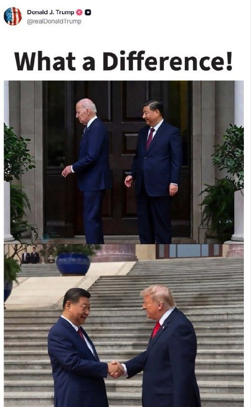

ترامپ با هوش مصنوعی بایدنِ خواب‌آلود، اوباما و پلوسی رو انداخته تو فاضلاب و نوشته دموکرات‌ها عاشق این مکان هستن. 》OPT《 @OfficialPersiaTwiter

## OfficialPersiaTwiter — post 498837

  <a href="telegram/content/OfficialPersiaTwiter_498837_1778954973.mp4" target="_blank">🎬 Download video</a>

تصویری از فرودگاه ایلات اسرائیل یک فروند هواپیمای باری ایل ۷۶ ۷ سوخت رسان آمریکایی و یک هواپیمای گشت دریایی P-8 》OPT《 @OfficialPersiaTwiter

## OfficialPersiaTwiter — post 498836

  <a href="telegram/content/OfficialPersiaTwiter_498836_1778954974.mp4" target="_blank">🎬 Download video</a>

رئیس کمیسیون امنیت‌ملی مجلس: فقط کشتی‌های طرف همکاری با ایران حق عبور از تنگه هرمز دارند 🔹ایران در چارچوب حق حاکمیت ملی و تضمین امنیت تجارت بین الملل، سازوکاری حرفه‌ای برای مدیریت ترافیک تنگه هرمز در مسیر تعیین شده تهیه کرده که به‌زودی رونمایی می‌شود. 🔹در…

## OfficialPersiaTwiter — post 498834

  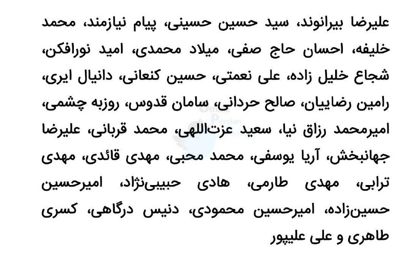

رویترز: ملاقات دبیرکل فیفا با تاج در استانبول؛ اطمینان از حضور تیم ملی در جام جهانی 🔹یک منبع آگاه به خبرگزاری رویترز گفته است ماتتیاس گرافستروم دبیرکل فیفا، روز شنبه قرار است در استانبول با مقامات فدراسیون فوتبال ایران دیدار کند و در این نشست، او درباره حضور…

## OfficialPersiaTwiter — post 498833

غذای مورد علاقه گلشیفته مَکرونیه 》baby《 @OfficialPersiaTwiter

## OfficialPersiaTwiter — post 498832

زمین‌لرزه‌ای به بزرگی ۴.۵ ریشتر دقایقی پیش گلوگاه در استان مازندران را لرزاند.

محل وقوع: مرز استانهای مازندران و گلستان -حوالی گلوگاه
تاریخ و زمان وقوع به وقت محلی: 1405/02/26 20:19:16
طول جغرافیایی: 53.82
عرض جغرافیایی: 36.78
عمق زمین‌لرزه: 6 کیلومتر

》OPT《

@OfficialPersiaTwiter

## bbcpersian — post 281234

⚽️دبیرکل فیفا و رئیس فدراسیون فوتبال ایران در استانبول با هم دیدار کردند

دبیرکل فیفا و مهدی تاج، رئیس فدراسیون فوتبال ایران، امروز در استانبول با هم دیدار کردند.

یک منبع آگاه به خبرگزاری رویترز گفته است که ماتیاس گرافستروم قرار بوده در این دیدار درباره حضور ایران در جام جهانی به مقام‌های جمهوری اسلامی ایران «اطمینان‌» بدهد.

قرار است ایران هر سه بازی مرحله گروهی جام جهانی را در ایالات متحده برگزار کند، اما از زمان حمله آمریکا و اسرائیل به ایران در نهم اسفند حضور تیم ملی ایران در این رقابت‌ها که از کمتر از یک ماه دیگر برگزار می‌شود، با ابهام روبه‌رو شده است.

پس از آن‌که مهدی تاج به دلیل ارتباطش با سپاه پاسداران انقلاب اسلامی از ورود به کانادا منع شد، ابهام درباره وضعیت ایران بیشتر شد. او برای شرکت در نشست فیفا که در ونکوور برگزار می‌شد، عازم این کشور شد اما ماموران اجازه ورود او به خاک کانادا را ندادند.

جمهوری اسلامی ایران همزمان با حملات آمریکا و اسرائیل ابتدا اعلام کرده بود که تیم ملی ایران احتمالا در جام جهانی شرکت نمی‌کند اما سپس مقام‌های وزارت ورزش ایران حضور تیم را منوط به تصمیم شورای عالی امنیت ملی کردند.

آمریکا و کانادا، که همراه با مکزیک میزبان مشترک جام جهانی هستند، سپاه پاسداران را یک «نهاد تروریستی» طبقه‌بندی و اعلام کرده‌اند افرادی را که با این نیرو ارتباط دارند، به کشورشان راه نخواهند داد.

تیم ملی فوتبال ایران قرار است دو روز دیگرعازم اردوی آماده‌سازی در ترکیه شود.

https://bbc.in/4nGtXEU
@BBCPersian

## bbcpersian — post 281233

  

بیش از پنجاه کودک در شمال‌شرق نیجریه، در پی حمله به سه مدرسه در روز جمعه ۲۵ اردیبهشت، ربوده شده‌اند. گفته می‌شود بیشتر این کودکان بین دو تا پنج سال سن دارند و از مهدکودک‌ها به زور برده شده‌اند.

والدین این کودکان در روستای «موسا» در ایالت بورنو با نگرانی و اضطراب فراوان در انتظار دریافت خبری از فرزندان خود هستند، در حالی که هیچ گروهی تاکنون مسئولیت این حملات را بر عهده نگرفته است. هم‌زمان گزارش‌هایی نیز از فرار برخی ساکنان منطقه منتشر شده است.

به گفته شاهدان عینی، مهاجمان هنگام فرار با موتورهای خود، از کودکان به‌عنوان سپر انسانی استفاده کردند؛ اقدامی که باعث شد نیروهای امنیتی نتوانند به سوی آن‌ها تیراندازی کنند.
📷Getty
@BBCPersian

## bbcpersian — post 281232

🔻گفت‌وگوی پوتین و رئیس امارات درباره جنگ ایران

ولادیمیر پوتین، رئیس‌جمهور روسیه، امروز (شنبه) با محمد بن زاید آل نهیان، رئیس امارات متحده عربی، درباره جنگ ایران گفت‌‌و‌گو کرد.

بنا به ییانیه کرملین «دو طرف بر اهمیت ادامه روند سیاسی و دیپلماتیک با هدف دستیابی به توافق‌های صلح مبتنی بر مصالحه تأکید کردند.»

آقای پوتین همچنین از حمایت امارات متحده عربی در زمینه مسائل بشردوستانه مرتبط با جنگ اوکراین قدردانی کرد.

رئیس‌جمهور روسیه قرار است روز سه‌شنبه آینده در سفری دو روزه به چین برود.

از زمان آغاز جنگ آمریکا و اسرائیل با ایران و حملات تلافی‌جویانه ایران در منطقه، تنش بین ایران و امارات افزایش پیدا کرده است.

عباس عراقچی، وزیر خارجه جمهوری اسلامی، روز پنجشنبه امارات متحده عربی را «شریک فعال» آمریکا و اسرائیل در حمله به ایران توصیف و این کشور را متهم کرد که مستقیما در جنگ آمریکا و اسرائیل با ایران «دخیل» بوده است.

امارات در واکنش، ایران را به «تلاش برای توجیه» حملاتش به آن کشور متهم کرد.

https://bbc.in/4ubilfj
@BBCPersian

## bbcpersian — post 281231

  

🔺روزنامه نیویورک تایمز به نقل از دو مقام در خاورمیانه بدون ذکر نام، گزارش داده است که آمریکا و اسرائیل در حال آماده شدن برای احتمال از سرگیری حملات علیه ایران هستند؛ حملاتی که به طور بالقوه حتی در هفته پیش رو می‌تواند شروع شود.

به گفته این دو مقام که به شرط فاش نشدن نامشان با نیویورک تایمز صحبت کرده‌اند، تدارکات آمریکا و اسرائیل، گسترده ترین اقدامات آنها برای آمادگی جنگی از زمان برقراری آتش‌بس است.

وزیر دفاع آمریکا هم این هفته در کنگره به قانون‌گذاران گفته بود که پنتاگون برای سناریوهای مختلف برنامه‌هایی در دست دارد؛ هم برای جابه‌جایی امکانات نظامی و تشدید جنگ در صورت لزوم و هم برای کاهش و خارج کردن نیروها از منطقه.

نیویورک تایمز به نقل از مقام‌های آمریکایی گزارش کرده است که اگر دونالد ترامپ تصمیم به حمله بگیرد، یک گزینه بمباران شدیدتر مراکز نظامی و زیرساخت‌های ایران است و گزینه دیگر عملیات زمینی برای خارج کردن ذخایر اورانیوم غنی‌شده ایران که تصور می‌شود پس از بمباران تاسیسات هسته‌ای ایران در جنگ دوازده روزه زیر آوار مدفون شده‌ است.

📸U.S. Navy via Getty Images

https://bbc.in/3RKVVDe
@BBCPersian

## bbcpersian — post 281230

  <a href="https://t.me/bbcpersian/281230" target="_blank">📎 Download file</a>

پادکست رادیویی جام جهان‌نما شنبه ۲۶ اردیبهشت ۱۴۰۵
در پی تحولات اخیر ایران و قطع و اختلال در اینترنت که امکان دسترسی مخاطبان در ایران به رسانه‌ها را با مشکل مواجه کرده است، بی‌بی‌سی فارسی از ۱۵ بهمن پخش رادیویی برنامه‌های خود را دوباره آغاز کرده است.

برنامه‌ جام جهان‌نما از این پس همه روزه از ساعت ۱۶:۳۰ گرینویچ (۲۰:۰۰ ایران) روی موج متوسط ۷۰۲ کیلوهرتز و موج کوتاه ۹۴۶۵ کیلوهرتز پخش می‌شود.

تکرار این برنامه از ساعت ۱۸:۰۰ گرینویچ (۲۱:۳۰ ایران) روی موج متوسط ۷۰۲ کیلوهرتز و موج کوتاه ۵۹۳۵ کیلوهرتز پخش می‌شود.
@BBCPersian

## networkti — post 358

  <a href="https://t.me/networkti/358" target="_blank">📎 Download file</a>

نسخه جدید TheFeed (v0.18.10) 🚀

🔸توی این نسخه چیز مهمی تغییر نکرده! فقط از اونجایی که گیتهاب اکانتم رو ساسپند کرد و هنوز اکانت باز نشده، پروژه TheFeed رو به گیتلب منتقل کردم و برنامه رو هم تغییر دادم که لینک ها و این چیزهای که توی برنامه بود به گیتلب هم اشاره کنه. البته قابلیت دانلود آخرین نسخه و نوتیف نسخه جدید هنوز به گیتلب وصل نشده و کار‌نمیکنن (گیتلب فیلتره و کمکی نمیکنه اضافه کردنش 🫠).
البته توی تنظیمات یک دکمه هست به اسم "بررسی" که وقتی بزنیدش اخرین شماره نسخه رو از سرور میپرسه و نشون میده، این رو سمت سرور تغییر دارم که اگر‌ گیتهاب کار نکرد اخرین شماره نسخه رو از گیتلب بگیره و سمت کلایمت هم یک باگ داشت که رفع شد.

⚠️ این نسخه خیلی مهم نیست و میتونید آپدیت نکنید

آدرس سورس کد پروژه روی گیتلب:

https://gitlab.com/sartoopjj/thefeed

یک نفر لطف کرده بود و فیچر های دسترسی پذیری اضافه کرده بود و پول ریکوئست فرستاده بود، لطفا اگر این پیام رو میبینی مرج ریکویست بفرست روی گیتلب🥲❤️

کانال اصلیم:
@networkti

کانال کانفیگ برای برنامه:
@thefeedconfig

## Pesari_Ke_Konie — post 44950

شماهم جام جهانی کاملا به کیرتونه ؟ کی انقدر بی تفاوت شدیم نسبت به همچی :)))

## Pesari_Ke_Konie — post 44949

وضعیت جوریه که پورن دیدن، گرون تر از جنده کردنه. @Pesari_Ke_Konie

## Pesari_Ke_Konie — post 44948

وضعیت جوریه که پورن دیدن، گرون تر از جنده کردنه.

@Pesari_Ke_Konie

## Tans_Footbali — post 236350

  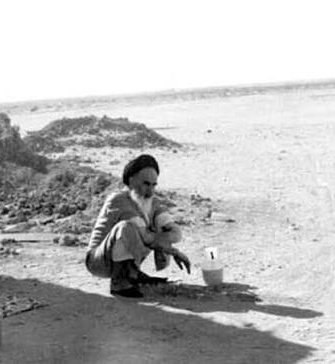

برای پروفایل 
💛@Tans_Footbali

## Tans_Footbali — post 236349

دونالد ترامپ، رئیس‌جمهور آمریکا در گفت‌وگوی تلفنی با شبکه فرانسوی «بی‌اف‌ام‌تی‌وی» آینده مذاکرات با ایران را نامشخص توصیف کرد.

او هشدار داد که در صورت شکست مذاکرات، ایران با پیامدهای سنگینی روبه‌رو خواهد شد.

💛@Tans_Footbali

## Tans_Footbali — post 236348

خبرنگار سی‌ان‌ان، کیتلان کالینز، می‌گوید: «ترامپ ظاهراً نمی‌خوابد.

«یک منبع یک بار به من گفت هیچوقت کسی دوست ندارد در یک سفر طولانی مثلاً به آسیا در هواپیمای رئیس جمهور باشد… ترامپ همیشه بیدار است و حرف می‌زند، و اگر کارکنانش خواب باشند، می‌فرستد بیدارشان کنند چون می‌خواهد با آنها صحبت کند.»

💛@Tans_Footbali

## Tans_Footbali — post 236347

  <a href="telegram/content/Tans_Footbali_236347_1778954980.webm" target="_blank">🎬 Download video</a>

🚨
⚽️ژابی آلونسو با قراردادی ۴ساله بعنوان سرمربی چلسی انتخاب شد

⚫️@FootyRadar

## hamclasixii — post 75393

میری اینستاگرام میبینی ۹۵ درصد پیج های فعال پیج‌های پزشک هاست. همشون پرو خریدن پست میذارن واسه همدیگه. واسه همدیگه کامنت میذارن و همدیگه رو حمایت میکنن. در صورتی که مردم عادی نیستن. رسما یک سیرک بلاهت و بدبختیه.

📚 @hamclasix 📚

## withyashar — post 11411

  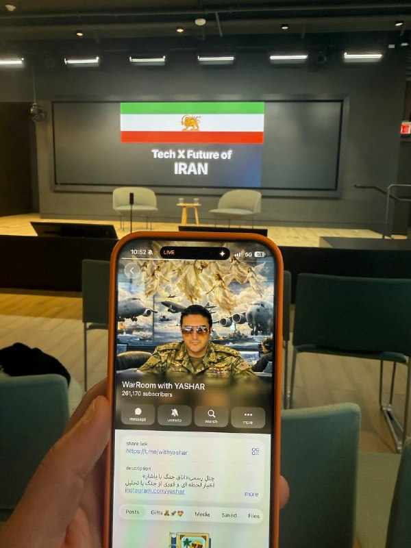

تو سخت ترین شرایط بهمون روحیه دادی، تو جلسه ی بچه های تکنولوژی با شاهزاده به یادت بودیم!❤️

## withyashar — post 11410

فرهاد مجیدی با البطائح به دسته دو امارات سقوط کرد
@withyashar

## withyashar — post 11409

این ناو گروه در حال فرار هستن یا چی ؟

## withyashar — post 11408

این ناو گروه در حال فرار هستن یا چی ؟

## withyashar — post 11407

  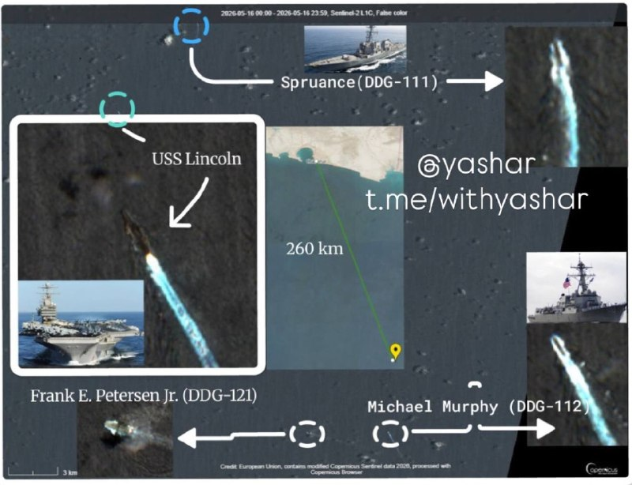

ناوگروه آبراهام لینکلن با سه اسکورت با سرعت به سمت دریای عمان می‌ روند ، ۲۶ اردیبهشت. (مکان 260 کیلومتری چابهار)
@withyashar

## withyashar — post 11406

شبکه 13 اسرائیل: هم اکنون ارزیابی‌ها در اسرائیل بر این است که جنگ با ایران در روز های آینده از سر گرفته خواهد شد.
@withyashar

## withyashar — post 11405

ترامپ: اگه به آمریکایی‌ها آسیب بزنید، یا در حال برنامه‌ریزی برای آسیب زدن به آمریکایی‌ها باشید، ما شما رو پیدا خواهیم کرد و خواهیم کشت.
@withyashar

---
📅 بروزرسانی: 1405/02/26 20:45
---

## persian_trend_official — post 14240

❤️ اگر از مخاطبان پرشین ترند هستید و تلگرام پرمیوم دارید،
با بوست کردن کانال کمک بزرگی به رشد و دیده‌شدن بیشتر پرشین ترند می‌کنید.
این بوست‌ها باعث می‌شود امکانات بیشتری برای انتشار محتوا، استوری و قابلیت‌های ویژه کانال فعال شود و در شرایط فعلی، به ادامه پوشش سریع و تحلیل‌های روزانه کمک زیادی می‌کند.
🙏 اگر مایل بودید، از طریق لینک زیر کانال را بوست کنید:
https://t.me/boost/persian_trend_official
📌 @persian_trend_official
پرشین ترند | متفاوت‌ترین کانال نظامی

## OfficialPersiaTwiter — post 498831

گرفتار شدن ۲۵ گردشگر در دره خوردلان الموت/قزوین «درگاهی»مدیرعامل هلال‌‌احمر استان قزوین: 🔹️ ساعت ۸:۲۵ صبح امروز، ۲۶ اردیبهشت، گزارش مفقودی و گرفتار شدن یک گروه گردشگری ۲۵ نفره در دره خوردلان در الموت شرقی به هلال‌احمر اعلام و ۲ تیم عملیاتی هلال‌احمر بلافاصله…

## OfficialPersiaTwiter — post 498830

ادعای سی‌ان‌ان، به نقل از منابع آگاه: در دولت ترامپ نظرات متفاوتی در مورد چگونگی برخورد با ایران وجود دارد. دولت ترامپ و مقامات پنتاگون بر حملات هدفمند اصرار دارند، در حالی که دیگران از دیپلماسی حمایت می‌کنند 》OPT《 @OfficialPersiaTwiter

## OfficialPersiaTwiter — post 498829

بابام مرتب کوه می رفت. گاهی ما رو هم می برد، برادرم ۸سال از من بزرگتره. یه بار که دربند رفتیم پرسیدم این مجسمه کیه؟ برادرم گفت بابا! برای من اینطوری بود که بایدم باشه! سال اول دانشگاه قرار شد بریم کوه، گفتن همه کجا جمع بشیم؟ من گفتم دم مجسمه بابام! 》sharas_law《…

## OfficialPersiaTwiter — post 498828

  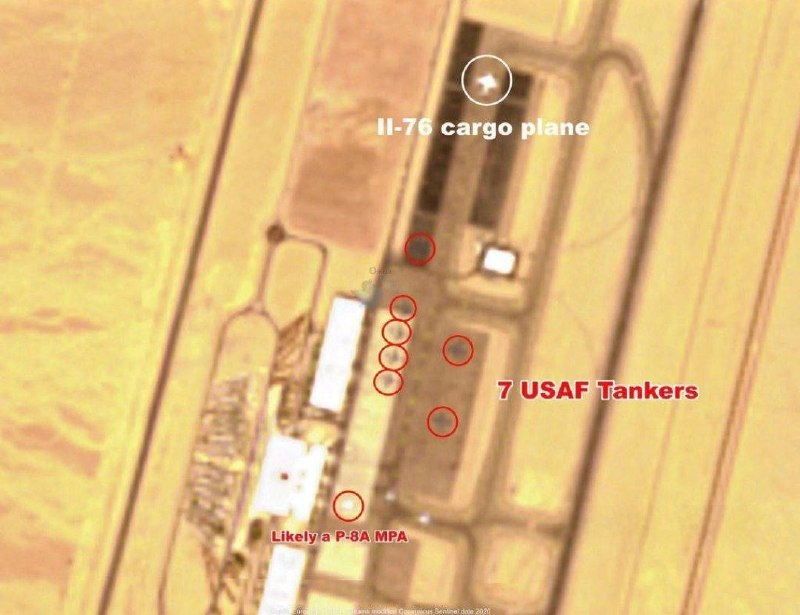

تصویری از فرودگاه ایلات اسرائیل

یک فروند هواپیمای باری ایل ۷۶
۷ سوخت رسان آمریکایی
و یک هواپیمای گشت دریایی P-8

》OPT《

@OfficialPersiaTwiter

## OfficialPersiaTwiter — post 498827

  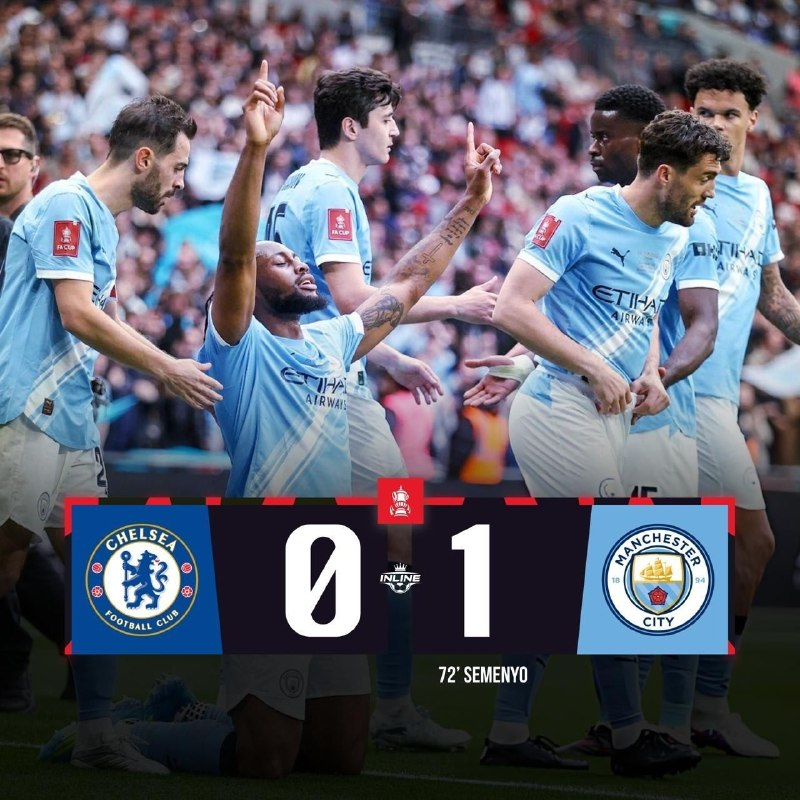

منچسترسیتی قهرمان جام حذفی انگلیس شد

تیم فوتبال منچسترسیتی با برتری یک بر صفر برابر چلسی، برای هشتمین‌بار قهرمان جام حذفی انگلیس شد.

》OPT《

@OfficialPersiaTwiter

## OfficialPersiaTwiter — post 498826

تغییر سیاست گوگل؛ تا شماره‌موبایل را ثبت نکنید خبری از فضای ابری ۱۵ گیگابایتی نیست

گوگل سال‌ها است که به کاربرانش ۱۵ گیگابایت فضای ابری رایگان می‌دهد و این فضا، میان سرویس‌های جیمیل، درایو و فوتوز مشترک است؛ اما شرایط قرار است تغییر کند. این شرکت سیاست فضای ابری خود را تغییر داده و شرط جدیدی برای دریافت این حجم از فضا وضع کرده است.

کاربران در حال حاضر هنگام ایجاد حساب گوگل با پیامی جدید مواجه می‌شوند که در آن گوگل اعلام می‌کند که حساب تنها شامل ۵ گیگابایت فضای ابری است. برای دریافت ۱۵ گیگابایت، کاربر باید شماره‌تلفن خود را وارد کند. این کار برای اطمینان از اینکه هر شخص تنها یک بار از این مزایا بهره‌مند می‌شود، الزامی شده است. /زومیت

》OPT《

@OfficialPersiaTwiter

## OfficialPersiaTwiter — post 498825

ادعای سی‌ان‌ان، به نقل از منابع آگاه:

در دولت ترامپ نظرات متفاوتی در مورد چگونگی برخورد با ایران وجود دارد.

دولت ترامپ و مقامات پنتاگون بر حملات هدفمند اصرار دارند، در حالی که دیگران از دیپلماسی حمایت می‌کنند

》OPT《

@OfficialPersiaTwiter

## OfficialPersiaTwiter — post 498824

  

بهناز نازی درگذشت

🔹بهناز نازی بازیگر سینما، تئاتر و تلویزیون که با سرطان مبارزه می‌کرد، درگذشت.

🔹بهرام بدخشانی، همسر این بازیگر با اعلام این خبر به ایسنا گفت که بهناز نازی، عصر امروز، شنبه ۲۶ اردیبهشت ماه از دنیا رفت.

🔹این بازیگر در چند روز اخیر به دلیل وخامت حالش در بخش مراقبت‌های ویژه بستری بود و پزشکان برای سهولت در درمان، او را به خواب مصنوعی برده بودند.
به گفته بدخشانی، مراسم خاکسپاری او متعاقبا اعلام می‌شود.

》OPT《

@OfficialPersiaTwiter

## OfficialPersiaTwiter — post 498823

خبرنگار سی‌ان‌ان، کیتلان کالینز، می‌گوید:

ترامپ ظاهراً نمی‌خوابد.
«یک منبع یک بار به من گفت در یک سفر طولانی مثلاً به آسیا در هواپیمای رئیس جمهور، ترامپ همیشه بیدار است و حرف می‌زند، و اگر کارکنانش خواب باشند، می‌فرستد بیدارشان کنند چون می‌خواهد با آنها صحبت کند.»

》OPT《

@OfficialPersiaTwiter

## OfficialPersiaTwiter — post 498822

  <a href="telegram/content/OfficialPersiaTwiter_498822_1778951750.mp4" target="_blank">🎬 Download video</a>

وقوع گردباد در محدوده مسکن ملی اردبیل

》طاها صبائی《

@OfficialPersiaTwiter

## bbcpersian — post 281229

🔻ایرنا: وزیر کشور پاکستان در یک سفر از پیش اعلام نشده در تهران است خبرگزاری رسمی ایرنا گزارش داده است که وزیر کشور پاکستان «در یک سفر از پیش اعلام نشده» در تهران است. ایرنا از قول منابع خود خبر داده است که محسن نقوی ساعاتی پیش وارد تهران شده و قرار است با…

## bbcpersian — post 281228

  <a href="telegram/content/bbcpersian_281228_1778951751.mp4" target="_blank">🎬 Download video</a>

🔻ویدیوی منتشر شده از پیست اسکی توچال نشان می‌دهد طوفان شدیدی این منطقه را در می‌نوردد.

سازمان هواشناسی ایران برای استان تهران ناپایداری شدید، صاعقه، تگرگ، سقوط سنگ و رانش زمین به ویژه در مناطق کوهستانی را پیش‌بینی کرده است.

https://bbc.in/49FCHFl

@BBCPersian

## bbcpersian — post 281227

🔺پس از تهدید اسرائیل به شکایت، نیویورک تایمز از روزنامه‌نگار خود دفاع کرد

✍️رافی برگ، بی‌بی‌سی

نیویورک تایمز گفته است که اقدام حقوقی علیه این روزنامه به اتهام افترا که بنیامین نتانیاهو، نخست‌وزیر اسرائیل، تهدید به انجام آن کرده، بی‌اساس است.

این نزاع بر سر مقاله‌ای در نیویورک تایمز است که در آن گفته شده است «سرویس‌های امنیتی اسرائیل به بازداشت‌شدگان فلسطینی تجاوز جنسی کرده‌اند.»

این روزنامه پس از آن واکنش نشان داد که بنیامین نتانیاهو و وزیر امور خارجه‌اش بیانیه‌ای صادر کردند و گفتند که دستور «آغاز یک دعوی افترا» را داده‌اند.

https://bbc.in/4nxcluV
@BBCPersian

## Lichargoo — post 24890

  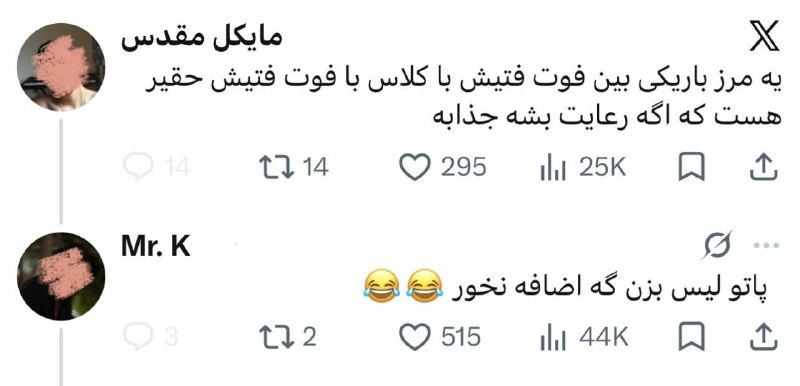

😂😂😂😂😂

@Lichargoo

## Tans_Footbali — post 236346

  <a href="telegram/content/Tans_Footbali_236346_1778951753.mp4" target="_blank">🎬 Download video</a>

همتی رئیس بانک مرکزی: با قدرت، شتاب تورم را کنترل خواهیم کرد

💛@Tans_Footbali

## withyashar — post 11404

ترامپ در گفت‌وگوی تلفنی با شبکه فرانسوی «بی‌اف‌ام‌تی‌وی»:

آینده مذاکرات نامشخص است اما اگر توافقی حاصل نشود ایران روزهای بسیار سختی در پیش خواهد داشت
@withyashar

---
📅 بروزرسانی: 1405/02/26 19:40
---

## OfficialPersiaTwiter — post 498821

روس اتم: نیروگاه هسته‌ای بوشهر به فعالیت خود ادامه می‌دهد الکسی لیخاچف، رئیس شرکت روس‌اتم: 🔹وضعیت در محل نیروگاه هسته‌ای بوشهر در ایران در مجموع آرام است. هیچ حمله‌ای به تأسیسات اطراف نیروگاه هسته‌ای بوشهر مشاهده نشده است. 🔹واحد یکم نیروگاه هسته‌ای بوشهر…

## OfficialPersiaTwiter — post 498820

هفتمین رأی‌گیری سنای آمریکا برای پایان جنگ با ایران شکست خورد مجلس سنا برای هفتمین‌بار قطعنامهٔ پیشنهادی برای توقف جنگ با ایران را رد کرد. جمهوری‌خواهان تقریباً متحد عمل کردند تا اولین تلاش از زمان عبور ترامپ از ضرب‌الاجل ۶۰ روزه برای دریافت مجوز جنگ از…

## OfficialPersiaTwiter — post 498819

گفت‌وگوی تلفنی پوتین و رئیس امارات درباره ایران

🔹کرملین عصر شنبه اعلام کرد که «ولادیمیر پوتین» رئیس‌جمهور روسیه و «محمد بن زاید آل نهیان» رئیس امارات متحده عربی گفت‌وگوی تلفنی انجام داده‌اند.

🔹دو طرف همچنین در مورد تعدادی از مسائل منطقه‌ای و بین‌المللی به‌ویژه تحولات غرب آسیا و پیامدهای آن برای صلح و امنیت منطقه‌ای و بین‌المللی و همچنین تاثیر آن بر آزادی دریانوردی بین‌المللی، امنیت انرژی و اقتصاد جهانی، تبادل نظر کردند.

》OPT《

@OfficialPersiaTwiter

## OfficialPersiaTwiter — post 498818

  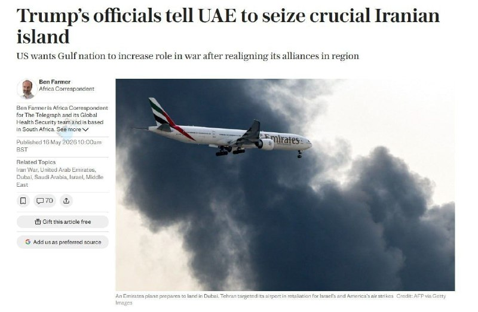

افشاگری تازه از سفر مقامات اسرائیلی به امارات در جریان حمله نظامی علیه ایران 🔹سازمان رادیو و تلویزیون اسرائیل فاش کرد که افزون بر «بنیامین نتانیاهو» نخست وزیر و «داوید برنیا» رئیس سابق موساد، «ایال زامیر» رئیس ستاد ارتش اسرائیل نیز در جریان جنگ علیه ایران…

## OfficialPersiaTwiter — post 498817

العربیه: طبق گفته منابع آگاه پاکستانی، در بحث تنگه هرمز، پیشرفت‌هایی حاصل شده است. 》OPT《 @OfficialPersiaTwiter

## OfficialPersiaTwiter — post 498816

  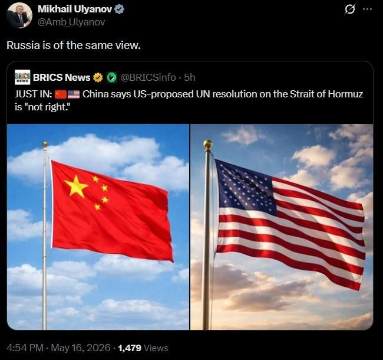

انتقاد چین از قطعنامه در مورد تنگه هرمز ‌🔹نماینده چین در سازمان ملل و و رئیس دوره‌ای شورای امنیت، از پیش‌نویس قطعنامه پیشنهادی آمریکا و بحرین درباره تنگه هرمز انتقاد کرد و گفت که «محتوا و زمان‌بندی آن مناسب نیست و تصویبش کمکی نخواهد کرد.» 🔹به گزارش رویترز،…

## OfficialPersiaTwiter — post 498815

کامران یوسف خبرنگار رسانه پاکستانی اکسپرس نیوز: سفر اعلام‌نشده وزیر کشور پاکستان به تهران، بخشی از تلاش آخر برای حصول توافق بین ایران و آمریکا است. نقوی از معتمدان نزدیک فیلد مارشال (فرمانده ارتش پاکستان) است و یک ماه پیش نیز او را در سفر سه‌روزه‌اش به…

## OfficialPersiaTwiter — post 498814

  <a href="telegram/content/OfficialPersiaTwiter_498814_1778947809.mp4" target="_blank">🎬 Download video</a>

آسوشیتدپرس: بازگشت ناو هواپیمابر جرالد فورد به پایگاه پس از ۱۱ ماه مأموریت 🔹وزارت‌جنگ آمریکا اعلام کرد پیت هگست، وزیر جنگ، روز شنبه در پایگاه دریایی نورفولک در ویرجینیا از ناو هواپیمابر جرالد فورد و ۴۵۰۰ ملوان آن پس از ۱۱ ماه مأموریت استقبال می‌کند. 🔹این…

## OfficialPersiaTwiter — post 498813

  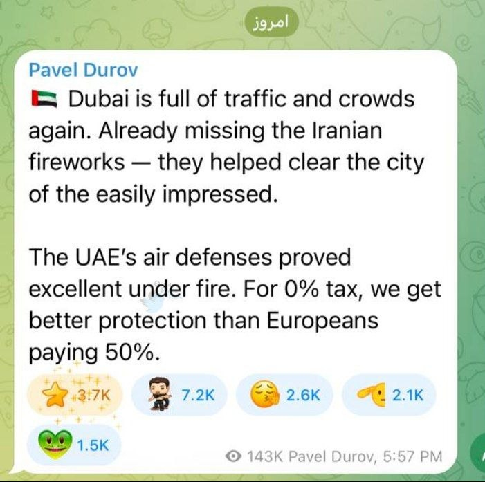

پاول دوروف، مدیرعامل تلگرام:

دبی دوباره شلوغ و پر از ترافیک شده است. از همین حالا دلم برای آتش‌بازی‌های ایران تنگ شده؛ آن‌ها کمک کردند تا شهر از افراد زودباور (وحشت‌زده) خالی شود.

پدافند هوایی امارات زیر آتش (حملات) عالی عمل کرد.

ما با پرداخت ۰٪ مالیات، حفاظت بهتری نسبت به اروپایی‌هایی دریافت می‌کنیم که ۵۰٪ مالیات می‌دهند.

》OPT《

@OfficialPersiaTwiter

## bbcpersian — post 281226

یکی از مربیان سگ‌های زنده‌یاب هلال احمر ایران در واکنش به «پست» خواندن سگ‌هایشان در یک مصاحبه که از تلویزیون ایران پخش شده گفت کسی که این حرف را زده‌ است باید عذرخواهی کند یا تغییر موضع بدهد.

۱۸ اردیبهشت در یک مصاحبه در تجمع‌های شبانه حامیان حکومت ایران، گزارشگر از یک شهروند می‌پرسد «چه کسانی از سگ‌های زنده‌یاب هلال‌احمر پست‌تر هستند؟»

امید برزگری، مربی هلال‌احمر که به همراه یکی دیگر از مربیان در گفت‌وگویی با خبرآنلاین شرکت کرده، گفت «این سگ‌ها فرشته نجات هستند. ما هر کدام با این سگ‌ها یک تیم هستیم.»

او گفت: « مثال زشتی بود. سگ پست نیست. اینها فرشته‌اند. این جمله ما را اذیت می‌کند. این سگ‌ها آموزش دیده‌اند به مردم خدمت کنند.»

سگ‌های زنده‌یاب در جریان جنگ ۱۲ روزه و جنگ اخیر نقش عمده‌ای در پیدا کردن افراد داشتند.

هلال‌ احمر اعلام کرده در جریان جنگ اخیر، این سگ‌ها ۷۹۲ عملیات انجام داده‌ن که در ۷۱۱ ماموریت در زنده‌یابی و پیدا کردن اجساد موفق بوده‌اند.
@BBCPersian

## bbcpersian — post 281225

  <a href="telegram/content/bbcpersian_281225_1778947812.mp4" target="_blank">🎬 Download video</a>

🔻برخورد یک قطار باری با یک اتوبوس شهری در بانکوک، پایتخت تایلند، روز شنبه ۲۶ اردیبهشت (۱۶ مه) منجر به یک آتش‌سوزی گسترده شد.

در این حادثه دست‌کم ۸ نفر کشته و طبق آخرین گزارش‌ها ۳۲ نفر زخمی شده‌اند.

مقام‌های امدادی اعلام کرده‌اند بر اثر این حادثه اتوبوس به‌سرعت آتش گرفته و علاوه بر آن چند خودرو و موتورسیکلت در آتش سوخته‌اند.

آتش‌نشانان پس از عملیات گسترده موفق شدند شعله‌ها را مهار کنند.

این حادثه در نزدیکی ایستگاه مکاسان و در یکی از تقاطع‌های شلوغ مرکز شهر رخ داده است.
گزارش‌های اولیه نشان می‌دهد اتوبوس روی ریل متوقف شده بود و قطار هم نتوانسته به‌موقع ترمز کند.

شدت حادثه به حدی بالا بوده که نیروهای امدادی ساعت‌ها برای خنک کردن خودروهای سوخته تلاش می‌کردند و در میان آهن‌پاره‌ها به دنبال قربانیان احتمالی می‌گشتند.

مصدومان به بیمارستان منتقل شده‌اند و علت دقیق این حادثه در دست بررسی است.

https://bbc.in/49Q2P0c

🎥 Reuters

@BBCPersian

## Pesari_Ke_Konie — post 44947

‏شاباش های دهه هفتاد هشتاد اینطوری بود که طرف میگفت حالا که دارم هزینه میکنم بذارم دهنش.

@Pesari_Ke_Konie

## Tans_Footbali — post 236345

  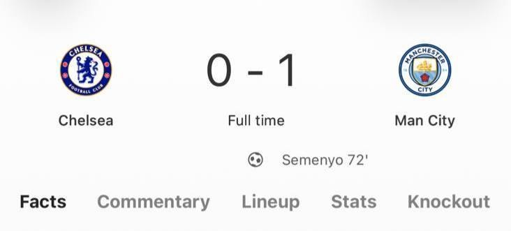

🏴󠁧󠁢󠁥󠁮󠁧󠁿
🏆منچسترسیتی با شکست چلسی قهرمان جام حذفی انگلیس شد.

⚫️@FootyRadar

## Tans_Footbali — post 236343

محمدامین صابرکار دانش آموز ۱۶ ساله کلاس دهمی در جریان آموزش‌های دفاعی در بخش بردخون شهرستان دیّر بر اثر شلیک خودی درگذشت.

💛@Tans_Footbali

## Tans_Footbali — post 236342

  <a href="telegram/content/Tans_Footbali_236342_1778947815.webm" target="_blank">🎬 Download video</a>

🎉  بونوس ویژه ثبت‌نام – ۵۰۰٬۰۰۰ تومان رایگان

💥 با ثبت‌نام در سایت، ۵۰۰٬۰۰۰ تومان بونوس رایگان دریافت کنید و شانس خود را امتحان کنید.

🔥 چگونه کار می‌کند؟

⬅️ ثبت‌نام کنید 

⬅️بونوس ۵۰۰٬۰۰۰ تومانی دریافت کنید 

⬅️ شرط‌بندی کنید و بونوس را به موجودی واقعی تبدیل کنید

🔥 وقتشه بازی رو یه جور دیگه ببینی

⚽️  پوشش کامل مسابقات ورزشی 

📊  پیش‌بینی با بهترین ضرایب 

⚡️  تجربه سریع و حرفه‌ای

😀 پرداخت مستقیم و سریع بدون واسطه، بدون دردسر، واریز و برداشت در سریع‌ترین زمان ممکن 
A24

😀 کانال تلگرام: 

🔴 @winro_io  

😀 هدیه خود را با ثبت نام در سایت دریافت کنید: 

🔴 Winro.io

سایت اصلی در روزهای آینده بازگشایی خواهد شد s
✅

## hamclasixii — post 75392

🔴 #فوری | آزمون‌های خردادماه مقطع متوسطه دانش‌آموزان اصفهانی به صورت غیرحضوری برگزار می‌شود

🔹 «جلال سلمانی» مدیر روابط عمومی اداره کل آموزش و پرورش استان اصفهان با انتشار پستی در صفحه شخصی خود از تصمیم شورای تأمین استان برای برگزاری آزمونهای خرداد ماه دانش‌آموزان پایه‌های هفتم تا دهم به صورت غیرحضوری خبرداد.

📚 @hamclasix 📚

## withyashar — post 11403

العربیه: طبق گفته منابع آگاه پاکستانی، در بحث تنگه هرمز، پیشرفت‌هایی حاصل شده است
@withyashar

---
📅 بروزرسانی: 1405/02/26 18:35
---

## OfficialPersiaTwiter — post 498812

همون موقعی که ترامپ وسط اعلام خبر جنگ برگشت گفت این پرده‌های کاخ رو هم تازه عوض کردم می‌خوام رنگشون فلان باشه، باید می‌فهمیدیم وسط یه اپیزود از آفیس هستیم نه یه فیلم جنگی.

》عبّاس《

@OfficialPersiaTwiter

## OfficialPersiaTwiter — post 498811

شبکه ۱۲ اسرائیل به نقل از برخی منابع آگاه اعلام کرد که نتانیاهو به روسای احزاب حریدی اعتراف کرده که این رژیم هنوز نتوانسته به اهداف خود در ایران دست یابد.

》OPT《

@OfficialPersiaTwiter

## OfficialPersiaTwiter — post 498810

یه خانومی بعد از چندبار رفت و آمد به اداره، چند روز پیش واسه پسرش از همکارم خواستگاری کرد. همکارم بهش گفت که متاهله.
گفت: خب اون یکی همکارت چی؟ (من رو می‌گفت)
یعنی بدون توجه به هیچ معیاری، اومده بود که به هیچ قیمتی دست‌خالی از اداره ما نره :))))

》سوماتریپتان پنجاهم《

@OfficialPersiaTwiter

## OfficialPersiaTwiter — post 498809

  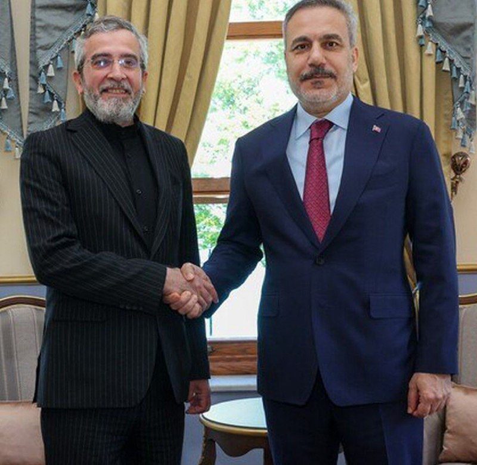

آناتولی: دیدار باقری با فیدان در استانبول

🔹 به گزارش خبرگزاری آناتولی، منابع دیپلماتیک اعلام کردند که هاکان فیدان، وزیر امور خارجه ترکیه و علی باقری، معاون دبیر شورای عالی امنیت ملی ایران، روز شنبه در استانبول دیدار کردند.

🔹 جزئیات بیشتری در مورد این دیدار ارائه نشده است.

》OPT《

@OfficialPersiaTwiter

## OfficialPersiaTwiter — post 498808

منابع پاکستانی به الحدث: سفر وزیر کشور پاکستان به ایران با هدف دستیابی به قالب توافقی مشخص انجام می‌شود. طرف آمریکایی خواستار دریافت پاسخ برای نکات مشخصی در سند مذاکره شده است هیچ جایگزینی برای توافق مرحله‌ای وجود ندارد و درِ مذاکرات درباره موضوعات باقی‌مانده…

## OfficialPersiaTwiter — post 498807

  

پست جدید ترامپ در مورد نیجریه :

شوخی نداریم!!!
ببین قراره بعدش تو موضوع مورد علاقت چه اتفاقی بیفته!

》OPT《

@OfficialPersiaTwiter

## OfficialPersiaTwiter — post 498806

  <a href="telegram/content/OfficialPersiaTwiter_498806_1778943936.mp4" target="_blank">🎬 Download video</a>

سقوط یک شهر پاکستان به دست جدایی‌طلبان

🔹منابع محلی روز شنبه از تسلط جدایی‌طلبان بلوچ بر شهر راهبردی دالبندین در پاکستان خبر می‌دهند.

》OPT《

@OfficialPersiaTwiter

## OfficialPersiaTwiter — post 498805

چنتا تینیجر داریم تو باشگاه ۱۷ تا ۱۹ ساله نهایتا
هر روز ۴،۵ تا استوری میذارن تو باشگاه
با فیگور های مختلف
مام میخندیم بشون
امروز باهم تمرینمون تموم شد، بیرون رفتنی دیدم دوس پسراشون گروهی منتظرشون بودن
الان حدودا ۲ ساعته به بخت خودم میخندم دیگه
اونم خنده های پر از درد ...

》Moon《

@OfficialPersiaTwiter

## OfficialPersiaTwiter — post 498804

تصاویری از استقبال وزیر کشور از همتای پاکستانی خود 》OPT《 @OfficialPersiaTwiter

## OfficialPersiaTwiter — post 498803

  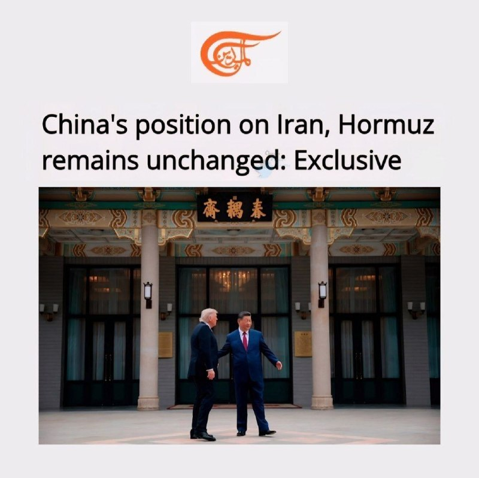

الجزیره: ایالات متحده و چین توافق کردند: «جنگ باید پایان یابد» و تنگه هرمز باید باز شود جزئیات کمی درباره‌ی آنچه رئیس‌جمهور ترامپ در مذاکرات خود با چین فاش کرده، منتشر شده است، اما او در اظهارات خود به‌روشنی اعلام کرد که ایالات متحده و چین در دو موضوع توافق…

## bbcpersian — post 281224

🔻تلویزیون ایران: اروپایی‌ها برای عبور کشتی‌ها از تنگه هرمز در حال مذاکره با تهران هستند

تلویزیون دولتی ایران گزارش کرده است کشورهای اروپایی درباره عبور کشتی‌ها از تنگه هرمز با تهران در حال مذاکره هستند.

شبکه خبر تلویزیون ایران و خبرگزاری صداوسیما بدون اشاره به نام این کشورها گزارش دادند «پس از عبور کشتی‌های کشورهای شرق آسیا، به‌ویژه چین، ژاپن و پاکستان، امروز اطلاعاتی دریافت کردیم که نشان می‌دهد کشورهای اروپایی هم مذاکراتی را با نیروی دریایی سپاه پاسداران برای دریافت مجوز عبور آغاز کرده‌اند.»

ایران از زمان آغاز جنگ با آمریکا و اسرائیل در نهم اسفند (۲۸ فوریه) عبور و مرور دریایی از این تنگه حیاتی را را مسدود کرده است.

کنترل ایران بر این آبراه، بازارهای جهانی را متزلزل کرده و به تهران در برابر آمریکا اهرم فشار داده است.

همزمان آمریکا هم محاصره دریایی خود علیه بنادر ایران را تداوم داده است.

در شرایط عادی، حدود یک‌پنجم صادرات جهانی نفت و گاز طبیعی مایع، به‌همراه دیگر کالاهای اساسی، از تنگه هرمز عبور می‌کند.

https://bbc.in/4tJv7AT
@BBCPersian

## bbcpersian — post 281223

🔻معاون استاندار تهران: ۷۰ درصد مردم در تهران در زمان جنگ از شهر خارج نشدند

معاون استاندار تهران گفته است که در جریان جنگ اخیر که با حملات آمریکا و اسرائیل در نهم اسفند (بیست و هشتم فوریه) شروع شد، «۷۰ درصد از مردم تهران در محل زندگی خود ماندند» و از شهرها خارج نشدند.

حسین کاغذلو گفت حضور مردم در شهرها با وجود این که بخشی از جنگ در تعطیلات نوروز بود، اتفاق افتاد.

او گفته است که در جریان جنگ ۱۲ روزه «تعداد قابل توجهی از مردم، به دلیل حملات دشمنان از شهر خارج شدند.»

https://bbc.in/4wuyApz
@BBCPersian

## bbcpersian — post 281222

  <a href="https://t.me/bbcpersian/281222" target="_blank">📎 Download file</a>

📻این هفته در پرگار: سلامت روانی

🔻سلامت روانی چیست و عوامل موثر در حفظ آن چه هستند؟ سلامت روانی شاخص‌های شناخته شده‌ی جهانی دارد یا متاثر از محیط فرهنگی و اجتماعی است؟

میهمان‌ها:
نازی اکبری، متخصص در روان درمانی بین فرهنگی
رضا کاظم زاده، روانشناس بالینی
ارشیا صدیق، متخصص مغز و اعصاب

این برنامه یک بار دیگر پیش از این پخش شده است.

@BBCPersian

## bbcpersian — post 281221

🔻‌حضور مجریان چند شبکه تلویزیون ایران با اسلحه و آموزش استفاده از آن در شبکه افق واکنش‌برانگیز شده است.

در یکی از این برنامه‌ها، حسین حسینی باز و بسته کردن اسلحه کلاشینکف را آموزش داد. مجری برنامه با هدف گرفتن پرچم امارات متحده در استودیو، به آن شلیک کرد.

بعضی از مجریان هم مثل مبینا نصیری در شبکه سه تلویزیون اعلام آمادگی کرد «در صورت نیاز، خودش و همه زنان به عنوان جان‌فدا به جنگ می‌پیوندند.». در ماه گذشته، انتشار رژه زنان مسلح در خودروهای حامل دوشکا نیز خبرساز شده بود.

گروهی از کاربران، این برنامه‌ها را به شرایط جنگی نامعلوم و بعضی به ایجاد ترس بین مردم برای شروع اعتراضات ربط دادند.  بعضی دیگر نیز به مجری تلویزیون لیبی اشاره کردند که در سال ۲۰۱۱ چند روز پیش از سقوط حکومت قذافی مخالفان را با اسلحه تهدید کرده بود.

از آغاز جنگ و تجمعات شبانه حامیان حکومت تصاویری از مردم با اسلحه منتشر شده است. تصاویری هم از کودکان مسلح با لباس نظامی در تجمع‌های شبانه حامیان حکومت منتشر شده است عملی که خلاف قوانین حقوق بشر است.

@‌‌BBCPersian

## bbcpersian — post 281220

🔻هشدار مقام‌های ایران به آمریکا و کشورهای منطقه درباره احتمال آغاز مجدد جنگ

برخی از مقام‌های جمهوری اسلامی ایران امروز درباره احتمال آغاز مجدد جنگ، به آمریکا و کشورهای منطقه هشدار دادند.

محمد مخبر، مشاور رهبر جمهوری اسلامی ایران با اشاره به حملات متقابل ایران به برخی از کشورهای منطقه در جریان جنگ اخیر گفته است «پاسخ جمهوری اسلامی به سنگرهای استیجاری سنتکام (فرماندهی مرکزی آمریکا) در جنگ اخیر تمام‌عیار نبود اما قطعا این خویشتنداری همیشگی نیست.»

آقای مخبر گفته است «ایران سال‌ها به چشم دوست و برادر به آنها نگاه کرد ولی آنها با پیش‌فروش استقلال خود، حتی خاک و خانه‌هایشان را در اختیار دشمنان فلسطین و ایران قرار دادند.»

نورنیوز، رسانه نزدیک به دبیرخانه شورای عالی امنیت ملی ایران هم به نقل از «یک مقام ارشد نظامی» که نامش آورده نشد، هشدار داده است که در صورت حمله مجدد به ایران «اهدافی که در جریان جنگ ۴۰ روزه، بنا بر ملاحظاتی مورد اصابت قرار نگرفتند، این‌بار در اولویت عملیاتی قرار گرفته‌اند.»

https://bbc.in/4uytDuB
@BBCPersian

## Lichargoo — post 24889

پزشکیان بهترین رییس جمهوری بود که خامنه‌ای داشت. بزرگترین کشتار تاریخ رو انجام داد، اینترنت رو قطع کرد، راحت دروغ گفت و تو دست و پای هیچکس نبود.

## Tans_Footbali — post 236341

  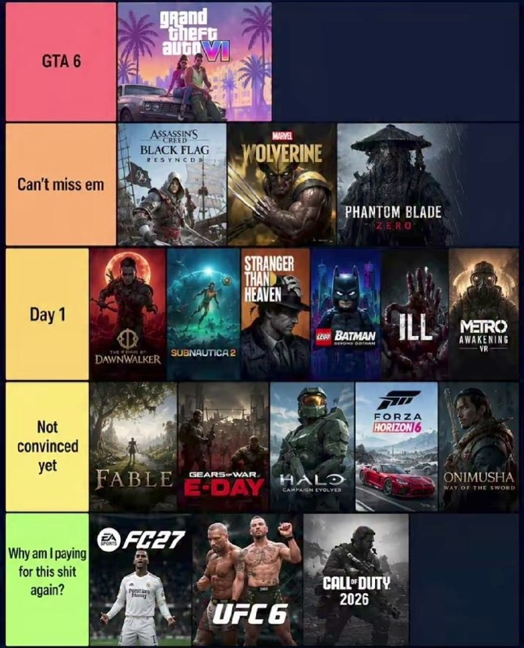

بازی های خفنی که امسال میاد

💛@Tans_Footbali

## withyashar — post 11402

  <a href="telegram/content/withyashar_11402_1778943939.mp4" target="_blank">🎬 Download video</a>

دوئل نهایی ، وضعیت الان!
@withyashar

## withyashar — post 11401

عرزشی ها اومدن که خبر مرگ بابای سپاهیشون رو زودتر تو چنلت ببینن
اخه از رسانه های دیگه ۱ ساعت حداقل جلوتری ستون😂🔥

## withyashar — post 11400

  

پست جدید ترامپ :

شوخی نداریم!!!
ببین قراره بعدش تو موضوع مورد علاقت چه اتفاقی بیفته!
@withyashar

## withyashar — post 11399

سقوط یک شهر پاکستان به دست جدایی‌طلبان

منابع محلی روز شنبه از تسلط جدایی‌طلبان بلوچ بر شهر راهبردی دالبندین در پاکستان خبر می‌دهند.
@withyashar

## withyashar — post 11398

فقط برای یک پست که نمیشه ببندم مهندس ! کلا ببندمم که یعنی میگی خنده رو از روی لب چندین هزار نفر بگیرم به خاطر ده نفر. ما اینجا هدف اصلیمون مبارزه با اخبار سمیه و روحیه دادن به مردم. اجازه بدید در عرزشی سوزترین رسانه ایرانی بسوزند و حرص بخورند

## withyashar — post 11397

میتونی ری‌اکشن رو هم ببندی داداش!

## withyashar — post 11396

این پست اوناییکه استیکر خنده گذاشتن رو از کانال مسدودشون کن

## withyashar — post 11395

این پست اوناییکه استیکر خنده گذاشتن رو از کانال مسدودشون کن

---
📅 بروزرسانی: 1405/02/26 17:30
---

## persian_trend_official — post 14239

  <a href="telegram/content/persian_trend_official_14239_1778940044.webm" target="_blank">🎬 Download video</a>

‼️ دوستان توجه داشته باشید که تیم «پرشین ترند» در هیچ‌یک از پلتفرم‌های داخلی، کانال یا گروه رسمی ندارد و هیچ‌گونه فعالیتی در این بسترها انجام نمی‌دهد. ⚠️ لطفاً نسبت به سوءاستفاده افراد سودجو و صفحات جعلی هوشیار باشید. 📝 Nick 📌 @persian_trend_official پرشین…

## persian_trend_official — post 14238

  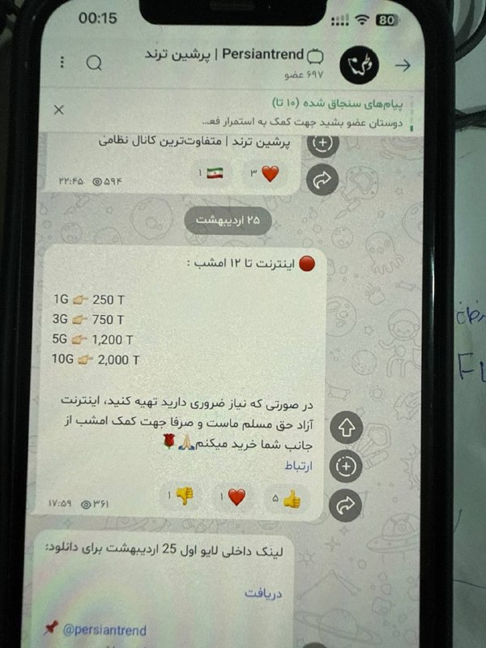

‼️ دوستان توجه داشته باشید که تیم «پرشین ترند» در هیچ‌یک از پلتفرم‌های داخلی، کانال یا گروه رسمی ندارد و هیچ‌گونه فعالیتی در این بسترها انجام نمی‌دهد.

⚠️ لطفاً نسبت به سوءاستفاده افراد سودجو و صفحات جعلی هوشیار باشید.

📝 Nick

📌 @persian_trend_official
پرشین ترند | متفاوت‌ترین کانال نظامی

## persian_trend_official — post 14237

⭕️ آسوشیتدپرس: بازگشت ناو هواپیمابر جرالد فورد به پایگاه پس از ۱۱ ماه مأموریت.

وزارت‌جنگ آمریکا اعلام کرد پیت هگست، وزیر جنگ، روز شنبه در پایگاه دریایی نورفولک در ویرجینیا از ناو هواپیمابر جرالد فورد و ۴۵۰۰ ملوان آن پس از ۱۱ ماه مأموریت استقبال می‌کند.

این ناو ۳۲۶ روز در دریا بوده که طولانی‌ترین استقرار یک ناو هواپیمابر آمریکایی در ۵۰ سال گذشته و سومین رکورد از زمان جنگ ویتنام است.

پ.ن: آخرین باری که این ناو هواپیمابر در پایگاه خشکی مستقر بود، هنوز جنگ ۱۲ روزه نیز آغاز نشده بود.

📝 Nick

📌 @persian_trend_official
پرشین ترند | متفاوت‌ترین کانال نظامی

## OfficialPersiaTwiter — post 498802

خبر خوش دختر اکبر عبدی درباره شرایط پدرش 🔹 اکبر عبدی با بهبود حال عمومی تا چند روز آینده از بیمارستان مرخص می‌شود. 🔹 المیرا عبدی، دختر اکبر عبدی امروز درباره آخرین وضعیت این بازیگر سینما، تئاتر و تلویزیون گفت: ایشان دچار یک سکته خفیف شدند و الان خدا را شکر…

## OfficialPersiaTwiter — post 498801

وزارت کشور کوبا اعلام کرد که راتکلیف رئیس سیا در رأس هیئتی از مقامات آمریکایی از کوبا دیدن کرده است. 》OPT《 @OfficialPersiaTwiter

## OfficialPersiaTwiter — post 498800

یکی از همکارا میگفت شوهرم برای پسر کلاس اولیم پاک‌کن خریده بود پسرم دو روز بعد به باباش گفت برام پاک‌کن بخر
باباش گفت اونی که دو روز پیش خریدم رو گم کردی؟
پسرش گفت نه اون خیلی قشنگه نمیخوام استفاده کنم؛ میخوام وقتی مردی بگم این یادگاری بابامه😂😂😂😂😂😂😂

》تیچرم اما نه تیچر زبان《

@OfficialPersiaTwiter

## OfficialPersiaTwiter — post 498799

جاده چالوس مسدود شد

پلیس‌راه البرز: محور چالوس حدفاصل کرج - شهرستانک، و محدوده خوزنکلا و پلیس راه کرج، از کیلومتر ۱۸ الی ۳۰ به دلیل اجرای عملیات تور سنگ مسدود خواهد شد.

این محدودیت ترافیکی در روزهای یکشنبه، دوشنبه، سه‌شنبه و چهارشنبه از ساعت ۰۹:۰۰ تا ۱۴:۰۰ اعمال می‌شود.

》OPT《

@OfficialPersiaTwiter

## OfficialPersiaTwiter — post 498798

  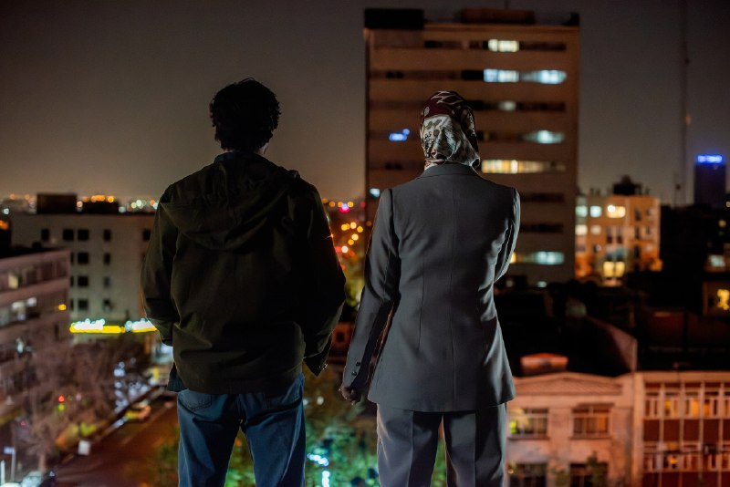

قصاص قبل از جنایت کیهان/ «بدنام» در قسمت ششم به شائبه «وهن حکم شرعی» پاسخ داد

🔻بعد از انتشار قسمت چهارم «بدنام»، روزنامه کیهان صرفا با استناد به یک سکانس نوشت: چون یلدا با جدایی از اسماعیل به عقد موقت پدر او (ابراهیم) در می‌آید؛ وهن حکم شرعی رخ داده. کارگردان به این شائبه پاسخ داد و همزمان نوشتیم چنین برچسبی به سریالی که هنوز تمام نشده، عجیب است.

🔻حالا و در ابتدای قسمت ششم مشخص شد که کیهان مرتکب قصاص قبل از جنایت شده. در این سکانس یلدا می‌گوید حاضر نیست دست ابراهیم به او بخورد تا مبادا فرزندش بر او حرام و تبدیل به آرزویی محال شود. او دوباره تاکید می‌کند کاش همسر اسماعیل شود تا بر «همه مردان» حرام و بر پدرش «حرام ابدی» شود.

🔻به‌نظر می‌رسد حاشیه‌سازان علیه «بدنام» در محاسبات خود دچار اشتباه شده‌اند؛ چون با کمی صبر شائبه‌ها از بین می‌رفت. همچنین تقید سازندگان بر شرعیات امری اثبات شده در آثار قبلی است و نیز سریال با حکم قضایی از توقیف نجات یافته و چنین برچسبی دوچندان مشکوک می‌نماید./ سینما ۱۲۰

》OPT《

@OfficialPersiaTwiter

## OfficialPersiaTwiter — post 498797

  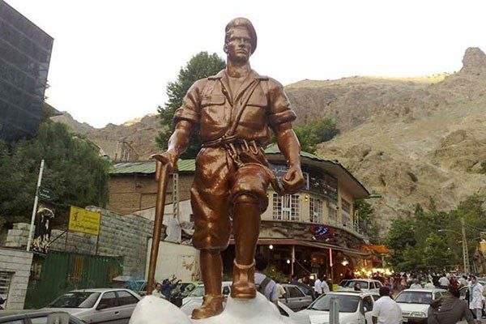

چند سال پیش تو یک دیت، طرف دستمو گرفت و بوسید، منم دستشو بوسیدم. 》امیلی《 @OfficialPersiaTwiter

## OfficialPersiaTwiter — post 498796

مامانم خواهرمو دعوا کرد
خواهرم رفت تو اتاقش درو محکم کوبید
سریع در رو باز کرد اومد بیرون گفت بخدا باد زد مامان.=====)))))

》دتر《

@OfficialPersiaTwiter

## OfficialPersiaTwiter — post 498795

  <a href="telegram/content/OfficialPersiaTwiter_498795_1778940046.mp4" target="_blank">🎬 Download video</a>

العربیه: پاکستان قصد دارد روند میانجی‌گری میان ایران و آمریکا را «با جدیت» ادامه دهد 🔹منابع رسمی پاکستانی در گفت‌وگو با «العربیه» از اقدامات دیپلماتیک این کشور خبر داده و اعلام کردند اسلام‌آباد در تلاش است تهران و واشینگتن را به «انعطاف‌پذیری» در روند مذاکرات…

## OfficialPersiaTwiter — post 498794

  <a href="telegram/content/OfficialPersiaTwiter_498794_1778940048.mp4" target="_blank">🎬 Download video</a>

الاخبار: دولت لبنان شریک امنیتی اسرائیل می‌شود 🔹️مذاکرات جاری میان لبنان و اسرائیل بیشتر حاکی از این است که لبنان به سمت مشارکت در اقدامات امنیتی اسرائیل در حرکت بوده و چارچوب جدید هماهنگی امنیتی با دشمن از طریق آمریکا را پذیرفته است. 》OPT《 @OfficialPersiaTwiter

## OfficialPersiaTwiter — post 498793

  

لواندوفسکی: خداحافظ بارسلونا؛ «ماموریت انجام شد»

🔹روبرت لواندوفسکی دقایقی پیش با انتشار پیامی در اینستاگرام، جدایی‌اش از بارسلونا را پس از چهار فصل رسمی کرد و نوشت: «با این احساس می‌روم که ماموریت انجام شده است.»

🔹مهاجم لهستانی که در آگوست ۳۸ ساله می‌شود، در تابستان ۲۰۲۲ با انتقالی ۵۰ میلیون یورویی از بایرن مونیخ به بارسا پیوست. او در این مدت با ثبت ۱۱۹ گل در ۱۹۱ بازی چهاردهمین گلزن برتر تاریخ باشگاه شد و ۷ جام به دست آورد؛ شامل سه قهرمانی لالیگا، یک جام حذفی و سه سوپرکاپ اسپانیا.

🔹لواندوفسکی در پیام خداحافظی خود از هواداران، کاتالونیا و خوان لاپورتا تشکر کرد و گفت که بارسلونا «به جایگاه واقعی خود بازگشته است». بهترین فصل او ۲۰۲۴/۲۵ بود که با ۴۲ گل نقش مهمی در قهرمانی‌ها داشت.

🔹مقصد بعدی او هنوز مشخص نیست؛ گفته می‌شود پیشنهادهای قابل‌توجهی از عربستان (الهلال، الاتحاد، القادسیه) و همچنین پیشنهادهایی از MLS و پورتو دریافت کرده است. قرار است او در دیدار مقابل بتیس در نوکمپ با هواداران خداحافظی کند.

》OPT《

@OfficialPersiaTwiter

## OfficialPersiaTwiter — post 498792

منابع الحدث: 🔹 سفر وزیر کشور پاکستان به تهران در چارچوب تلاش‌های میانجیگری است. 》OPT《 @OfficialPersiaTwiter

## OfficialPersiaTwiter — post 498791

  <a href="telegram/content/OfficialPersiaTwiter_498791_1778940050.mp4" target="_blank">🎬 Download video</a>

ترامب: مرد شماره دو داعش در نیجریه را کشتیم!   🔹ترامپ مدعی شد در جریان یک عملیات مشترک میان نیروهای آمریکایی و نیجریه‌ای، «ابوبلال المنوکی»، مرد شماره دو  داعش را از پای درآوردیم. 》OPT《 @OfficialPersiaTwiter

## OfficialPersiaTwiter — post 498790

  <a href="telegram/content/OfficialPersiaTwiter_498790_1778940051.mp4" target="_blank">🎬 Download video</a>

آتش‌سوزی در کارخانه روغن موتور مراغه

🔺این آتش‌سوزی از ساعتی پیش آغاز شده است.

🔺تلاش آتش‌نشانان برای مهار آتش همچنان ادامه دارد.

🔺خوشبختانه این حادثه تاکنون بدون مصدوم یا جان‌باخته گزارش شده است.

》OPT《

@OfficialPersiaTwiter

## OfficialPersiaTwiter — post 498789

اردوغان درباره جنگ ایران: اسرائیل گرفتار توهمات شده است

🔹رئیس‌جمهور ترکیه در جمع خبرنگاران درباره تنش‌ها بر سر جنگ علیه ایران هشدار داد که «اسرائیل می‌خواهد جنگ در سراسر منطقه گسترش یابد.»

🔹رجب طیب اردوغان درباره جنگ تحمیلی علیه ایران گفت: «اکنون، یکی از عوامل اصلی ایجاد این بحران، اقدامات تحریک‌آمیز بی‌پایان اسرائیل است. اسرائیل که در توهمات و آرمان‌شهرهای خاصی گرفتار شده است، بارها از طریق این تحریکات نشان داده که برای جاه‌طلبی‌های خود از به آتش کشیدن منطقه ما دریغ نمی‌کند.»

》OPT《

@OfficialPersiaTwiter

## OfficialPersiaTwiter — post 498788

ادعای یدیعوت آحارونت به نقل از منابع خود: در حالی که ترامپ همچنان تهدید می‌کند که ممکن است به گزینه نظامی متوسل شود، فضای انتظار و نگرانی در اسرائیل حاکم شده است؛ همه منتظر تصمیم او درباره ایران هستند، در حالی که تهران می‌گوید پیام‌هایی از واشنگتن دریافت کرده…

## OfficialPersiaTwiter — post 498787

  <a href="telegram/content/OfficialPersiaTwiter_498787_1778940053.mp4" target="_blank">🎬 Download video</a>

ایران، یک کشتی را توقیف کرد؟ سازمان عملیات تجاری دریایی بریتانیا: 🔹حادثه برای یک کشتی در فاصله ۳۸ مایل دریایی شمال فجیره امارات دریافت کردیم 🔹این کشتی تصرف و تحت کنترل افراد غیرمجاز قرار گرفت و به سمت آب های ایران در حرکت است 🔹هویت این کشتی و نیرویی که کنترل…

## OfficialPersiaTwiter — post 498786

  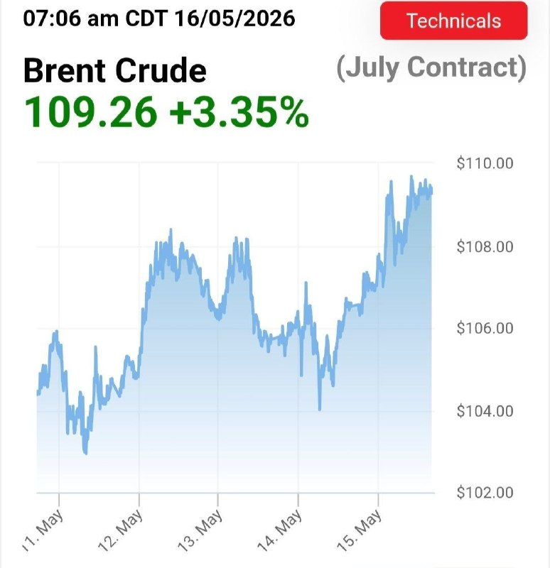

آخرین قیمت نفت ۱۰۸.۱ دلار 》OPT《 @OfficialPersiaTwiter

## bbcpersian — post 281219

  <a href="telegram/content/bbcpersian_281219_1778940055.mp4" target="_blank">🎬 Download video</a>

⭕️ سرخط خبرها، شنبه ۲۶ اردیبهشت ۱۴۰۵
@BBCPersian

## bbcpersian — post 281218

هزاران مامور پلیس در لندن مستقر شده‌اند تا دو راهپیمایی بزرگ با گرایش‌های مخالف هم را مدیریت کنند؛ تظاهرات طرفداران فلسطینیان و راهپیمایی‌ای که تامی رابینسون، فعال راست افراطی ضد اسلام سازماندهی کرده است.

قرار است مقامات منطقه حائلی را برای جدا کردن راهپیمایی‌های این دو گروه ایجاد کنند؛ همچنین از دوربین‌های تشخیص چهره برای ردیابی مظنونان استفاده خواهد شد و دادستان‌ها به پلیس توصیه کرده‌اند که شعارها را زیر نظر داشته باشند تا در صورت نقض قوانین مربوط به جرایم مبتنی بر نفرت‌پراکنی، مداخله کند.

پرهام قبادی، خبرنگار بی‌بی‌سی از محل تظاهرات توضیحات بیشتری می‌دهد.
@BBCPersian

## bbcpersian — post 281217

🔺استقرار هزاران مامور پلیس در لندن برای مدیریت دو تظاهرات بزرگ با گرایش‌های مخالف

هزاران مامور پلیس در لندن مستقر شده‌اند تا دو راهپیمایی بزرگ با گرایش‌های مخالف هم را مدیریت کنند؛ تظاهرات طرفداران فلسطینیان و راهپیمایی‌ای که تامی رابینسون، فعال راست افراطی ضد اسلام سازماندهی کرده است.

پلیس لندن می‌گوید که امروز با یکی از مهم‌ترین عملیات‌‌های خود در سال‌های اخیر روبرو است.

قرار است مقامات منطقه حائلی را برای جدا کردن راهپیمایی‌های این دو گروه ایجاد کنند؛ همچنین از دوربین‌های تشخیص چهره برای ردیابی مظنونان استفاده خواهد شد و دادستان‌ها به پلیس توصیه کرده‌اند که شعارها را زیر نظر داشته باشند تا در صورت نقض قوانین مربوط به جرایم مبتنی بر نفرت‌پراکنی، مداخله کند.

پیش از این رویدادها، ورود یازده سخنران برجسته راست افراطی به بریتانیا ممنوع شده است.

دولت اعلام کرده است که از ورود یازده «آشوبگر راست افراطی» خارجی به کشور برای شرکت در تجمعی که توسط تامی رابینسون، فعال ضد اسلام، سازماندهی شده بود، جلوگیری شده است.

https://bbc.in/4nuSJrc
@BBCPersian

## bbcpersian — post 281215

🔻ایرنا: وزیر کشور پاکستان در یک سفر از پیش اعلام نشده در تهران است

خبرگزاری رسمی ایرنا گزارش داده است که وزیر کشور پاکستان «در یک سفر از پیش اعلام نشده» در تهران است.

ایرنا از قول منابع خود خبر داده است که محسن نقوی ساعاتی پیش وارد تهران شده و قرار است با برخی از مقام‌های جمهوری اسلامی ایران دیدار کند.

پاکستان میانجی آتش‌بس کنونی بین ایران و آمریکاست و یک بار هم میزبان مقام‌های ارشد ایرانی و آمریکایی برای مذاکرات صلح شده که تاکنون بی‌نتیجه مانده است.

وزیر کشور پاکستان یک ماه پیش همراه عاصم منیر، فرمانده ارتش این کشور به ایران سفر کرده بود.

پاکستان یک روز پیش اعلام کرده بود که روند بازگرداندن بیست ملوان ایرانی و یازده پاکستانی که پس از توقیف کشتی آنان توسط آمریکا در آب‌های سنگاپور بودند در جریان است و وعده داده بود که همه آنها از تایلند به اسلام‌آباد منتقل می‌شوند.

https://bbc.in/4nzZJmQ
@BBCPersian

## bbcpersian — post 281214

🔺نت‌بلاکس: قطع اینترنت ایران وارد هفته دوازدهم شد

نت‌بلاکس که وضعیت اینترنت در جهان را بررسی می کند، می‌گوید قطعی اینترنت در ایران اکنون وارد دوازدهمین هفته خود شده و به هفتاد و هشتمین روز رسیده است.

قطع اینرنت ایران که برای چهارمین بار به صورت گسترده ادامه دارد از زمان حمله آمریکا و اسرائیل به ایران در نهم اسفند (۲۸ فوریه) آغاز شده و تاکنون ادامه دارد. تماس تلفنی با ایران هم در همین مدت محدود و با اختلال همراه شده است.

نت‌بلاکس می گوید «این قطع اینترنت، که کشوری ۹۰ میلیونی را برای مدتی بی‌سابقه تا حد زیادی از دسترسی آنلاین محروم کرده، همچنان در مقیاسی گسترده به فرسایش حقوق بشر، اقتصاد و آزادی‌های اساسی ادامه می‌دهد.»

ایران هرگونه استفاده از اینترنت ماهواره‌ای همچون استارلینک را هم ممنوع کرده و کاربران آن را تحت تعقیب قرار می‌دهد.

https://bbc.in/496jyMz
@BBCPersian

## Pesari_Ke_Konie — post 44946

  <a href="telegram/content/Pesari_Ke_Konie_44946_1778940057.mp4" target="_blank">🎬 Download video</a>

وقتی فقط خودت وصلی و رفیقات نیستن:

@Pesari_Ke_Konie

## Tans_Footbali — post 236340

۷۸ روز از قطعی کامل اینترنت ایران گذشت.

💛@Tans_Footbali

## Tans_Footbali — post 236339

اگه امشب الهلال ببازه، النصر قهرمان لیگ میشه.
از اون طرف، النصر تو فینال لیگ قهرمانان آسیا ۲ هم بازی داره و ممکنه تو یه شب، دو جام رو ببره.

می‌دونم شبیه یه سناریوی غیرممکنه...
اما اگه این دو جام + جام‌جهانی به کریستیانو برسه و ابرقهرمان داستان ما هزار گله بشه، دیگه فقط پرونده فوتبال نیست که بسته میشه، انگار ورزش به قسمت آخر خودش میرسه

اون موقع کانال‌های فوتبالی و ورزشی، به‌جای پوشش اخبار جدید، فقط کلیپ‌ها و عکس‌های «پایان فوتبال جهان» رو منتشر می‌کنن، چون دیگه فوتبال جدیدی وجود نداره که بخوان درموردش حرف بزنن و همه چیز در ورزش به قسمت آخر خودش رسیده..

البته که قهرمانی پرتقال غیرممکن بنظر میریه اما خب..
رویاپردازی که میشه کرد

💛@Tans_Footbali

## Tans_Footbali — post 236338

  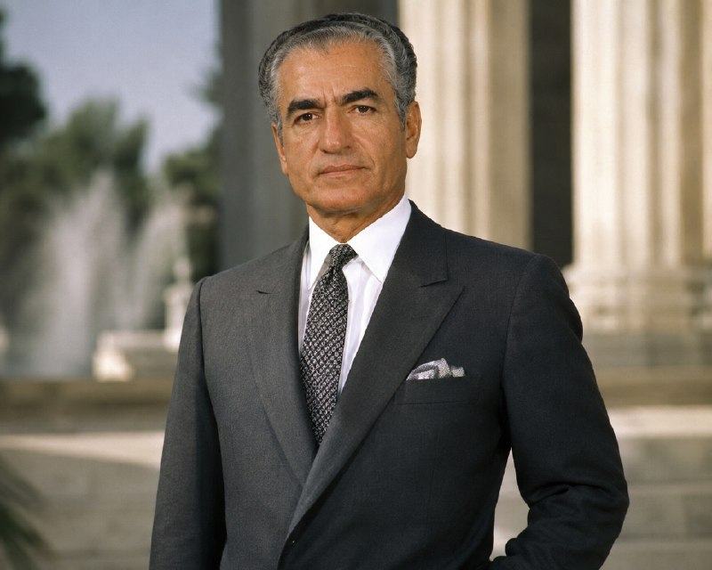

برای پروفایل

💛@Tans_Footbali

## hamclasixii — post 75390

  <a href="telegram/content/hamclasixii_75390_1778940058.mp4" target="_blank">🎬 Download video</a>

🔴صداوسیما از دیشب داره استفاده از کلاشینکف رو به مردم آموزش میده و حتی یکی از مجری‌ها، وسط استودیو شلیک هم کرد

📚 @hamclasix 📚

## hamclasixii — post 75389

🔴 آزمون کارشناسی ارشد علوم پزشکی به «نیمه دوم سال جاری» موکول شد

🔹روابط عمومی معاونت آموزشی وزارت بهداشت با صدور اطلاعیه‌ای از موکول شدن آزمون کارشناسی ارشد رشته‌های علوم پزشکی به «نیمه دوم سال جاری» خبر داد.
🔹بنابراین اطلاعیه آزمون کارشناسی ارشد رشته‌های علوم پزشکی که قبلا مقرر بود روزهای ۲۱ و ۲۲ خردادماه ۱۴۰۵ برگزار شود، به دلیل استمرار شرایط اضطراری ناشی از جنگ تحمیلی سوم به نیمه دوم سال ۱۴۰۵ موکول شده است.

📚 @hamclasix 📚

## withyashar — post 11394

لازم به ذکر است شخص اینجانب ، یاشار در اتاق جنگ هیچ رابطه و تیمکشی با هیچ گروه جناح و سمتی ندارم مسیر من مسیر مانوک خدابخشیان و فریدون فرخزاد است و هم پیمانان من فقط مردم واقعی و وطن پرست ایران هستند و برگ برنده ما همه با هم اینجا برای عبور از مسیر فقط فقط فقط خود شخص شاهزاده رضا پهلوی است ، یک بار دیگه خواستم اهداف و مسیر خودم را مشخص و کلیر کنم
@withyashar

## withyashar — post 11393

مشاورین شاهزاده (امیر اعتمادی و سعید قاسمینژاد) ، علی کریمی‌ رو به علت واکنش ‌به کنسرت و آهنگ شاهین نجفی آنفالو کردند
@withyashar

## withyashar — post 11392

  

روز جهانی پسر بچه … به یاد جاوید نام های کوچکمون مبارزه میکنیم تا نسل جدید این درد ها رو نکشه !
@withyashar

---
📅 بروزرسانی: 1405/02/26 15:36
---

## persian_trend_official — post 14236

https://castbox.fm/vi/945846191

لطفا چک کنید ببنید دسترسی دارید ؟

## OfficialPersiaTwiter — post 498785

حمله به دو ساختمان مسکونی در شهر صور لبنان 🔹دقایقی پس از اعلام تمدید آتش بس، جنگنده‌های اسرائیل دو ساختمان مسکونی در شهر صور در جنوب لبنان را بمباران کردند. 》OPT《 @OfficialPersiaTwiter

## OfficialPersiaTwiter — post 498784

🔴صداوسیما: اروپایی‌ها برای عبور از تنگه هرمز، وارد مذاکره با سپاه شده‌اند

🔹صداوسیما اعلام کرد: پس از گذشت کشتی‌هایی از کشورهای شرق آسیا و به‌ویژه چین، ژاپن و پاکستان امروز خبر آمد که اروپایی‌ها هم وارد مذاکره با نیروی دریایی سپاه شده‌اند.

》OPT《

@OfficialPersiaTwiter

## OfficialPersiaTwiter — post 498783

🔴 وزیر کشور پاکستان در سفری از پیش اعلام نشده وارد تهران شد. 》OPT《 @OfficialPersiaTwiter

## OfficialPersiaTwiter — post 498782

شرط جدید دولت برای متقاضیان یورو با کارت ملی 🔹مرکز اطلاعات مالی وزارت اقتصاد مشخص کردن مشخصات دریافت کننده، هدف دریافت ارز، محل و نحوه هزینه‌کرد وجوه نقدی درخواستی برای متقاضیان دریافت ارز با کارت ملی را اجباری کرد. 🔹بانک مرکزی اخیرا اعلام کرده به همه متقاضیان…

## OfficialPersiaTwiter — post 498781

کانال ۱۲ اسرائیل مدعی شد: ترامپ بزودی با اعضای کابینه خود جلسه اضطراری برای پایان دادن به اوضاع ایران برگزار میکند.

》OPT《

@OfficialPersiaTwiter

## OfficialPersiaTwiter — post 498780

  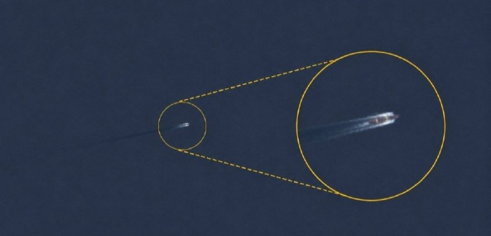

گاردین: طرح فرانسه و بریتانیا در مورد تنگه هرمز، تحویل عمان داده شد 🔹گاردین نوشت: عمان پس از آنکه ایران اعلام کرد درباره مدیریت آینده تنگه هرمز با مسقط هماهنگی می‌کند، درگیر کشمکش‌های ژئوپولیتیکی شده است؛ از جمله درباره طرح‌های تهران برای دریافت هزینه از…

## OfficialPersiaTwiter — post 498779

🔴 وزیر کشور پاکستان در سفری از پیش اعلام نشده وارد تهران شد.

》OPT《

@OfficialPersiaTwiter

## OfficialPersiaTwiter — post 498778

  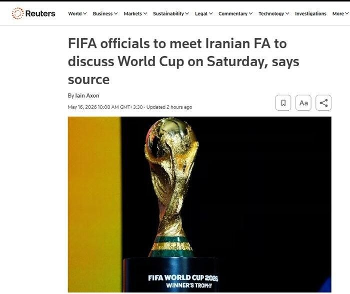

مصاف دوستانه تیم ملی ایران برابر کامرون 🔹مدیر تیم ملی فوتبال ایران اعلام کرد احتمالا این تیم پیش از جام‌جهانی در دیدری‌ دوستانه به مصاف کامرون خواهد رفت. 🔹فهرست تیم ملی برای حضور در جام جهانی، ۱۱ خرداد اعلام می‌شود. 》OPT《 @OfficialPersiaTwiter

## OfficialPersiaTwiter — post 498777

طرح تشدید برخورد با تخلفات پلاک توسط پلیس/هر پلاک مخدوش ۷۰۰ هزار تومان

رئیس پلیس راهور تهران:

🔹طرح برخورد با پلاک‌های مخدوش و ناخوانای وسایل نقلیه به شکل ضربتی آغاز شده و همچنان در دستور کار پلیس قرارخواهد داشت.

🔹دستکاری در پلاک به انحای مختلف جرم محسوب میگردد و کسانی که پلاک خود را میپوشانند، مشمول جریمه ۷۰۰ هزار تومانی نیز می‌شوند.

🔹ماموران پلیس راهور به شکل محسوس و نامحسوس در اطراف دوربین‌ها و معابر ورودی به محدوده طرح ترافیک مستقر شدند، وسیله نقلیه متخلف را نیز توقیف و راننده متخلف را به دادسرای راهور معرفی می‌کنند.

🔹تمامی وسایل نقلیه موتوری اعم از موتورسیکلت، خودروی سواری، کامیون، اتوبوس و … مشمول این قانون می‌شوند و در صورت تخلف، «مقام قضایی» به تخلف آنان رسیدگی خواهد کرد.

》OPT《

@OfficialPersiaTwiter

## bbcpersian — post 281210

🔻حماس و ارتش اسرائیل تأیید کرده‌اند که عزالدین حداد، فرمانده گردان‌های قسام، شاخه نظامی این گروه، شامگاه جمعه در حمله‌ اسرائیل در شهر غزه کشته شده است.

اسرائیل او را یکی از طراحان حملات هفتم اکتبر ۲۰۲۳ خوانده است.

مراسم تشییع عزالدین حداد امروز در شهر غزه برگزار شد.

اعضای خانواده‌ آقای حداد هم در حمله هوایی شبانه اسرائیل کشته شدند.

سازمان‌های امدادی در غزه اعلام کردند که در این حملات دست‌کم هفت نفر کشته و ده‌ها نفر هم زخمی شده‌اند.

اگرچه از ماه اکتبر آتش‌بس در این منطقه برقرار بوده، اما دولت اسرائیل می‌گوید همچنان اختیار هدف قرار دادن اعضای حماس را دارد.
📷 Getty Images

## Lichargoo — post 24888

یه جنتلمن واقعی، با پرنسس اش تو تلگرام چت میکنه

(دخترا در حال متقاعد کردن دوست پسراشون واسه اینکه کانفیگ بخره)

## Tans_Footbali — post 236337

وزیر کشور پاکستان به تهران سفر کرد

منابع آگاه اعلام کردند که سید محسن نقوی وزیر کشور پاکستان برای دیدار با مسوولان جمهوری اسلامی ایران ساعاتی قبل به تهران سفر کرده است.

به گزارش روز شنبه خبرنگار ایرنا، منبع دیپلماتیک در اسلام‌آباد به خبرنگار ایرنا گفت که نقوی در این سفر که از پیش اعلام نشده بود، قرار است با برخی از مقامات  ایرانی از جمله وزیرکشور دیدار کند.

وزیر کشور پاکستان ۲۶ فروردین امسال نیز فرمانده ارتش کشورش در سفر ۳ روزه اش به تهران را همراهی کرده بود.

💛@Tans_Footbali

## Tans_Footbali — post 236336

  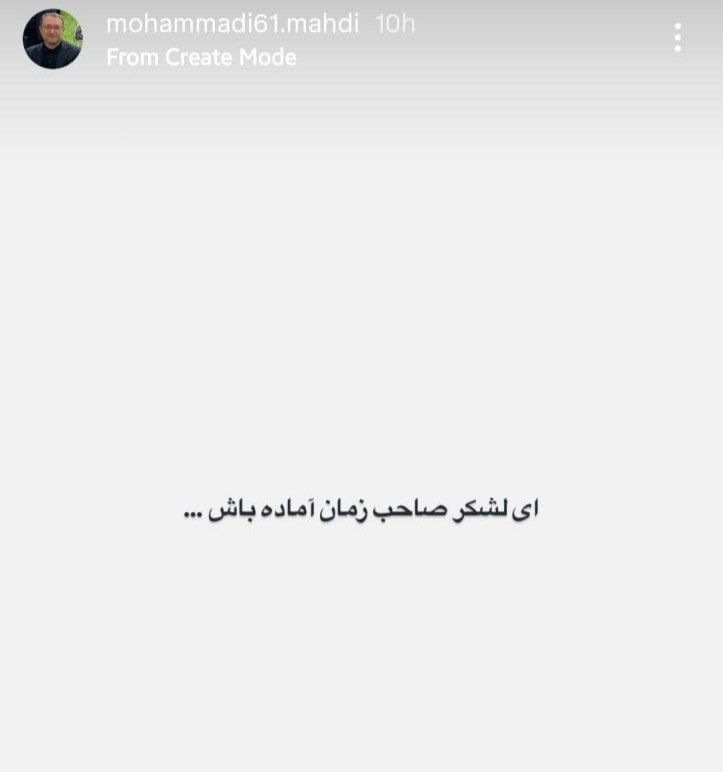

استوری مشاور راهبردی رئیس مجلس

💛@Tans_Footbali

## hamclasixii — post 75388

سوپر اپلیکیشن «بله» حدود یساعته از کار افتاده و کار نمیکنه؛ کانفیگ ندارید؟

📚 @hamclasix 📚

## withyashar — post 11390

ایسنا: وزیر کشور پاکستان برای دیدار با مسئولان جمهوری اسلامی ساعاتی قبل به تهران سفر کرده.
@withyashar

## withyashar — post 11389

کانال ۱۲ اسرائیل مدعی شد: ترامپ بزودی با اعضای کابینه خود جلسه اضطراری برای پایان دادن به اوضاع ایران برگزار میکند.
@withyashar

## withyashar — post 11388

  <a href="telegram/content/withyashar_11388_1778933207.mp4" target="_blank">🎬 Download video</a>

نظر کلی رسانه ها اینه که ۷۲ ساعت طلایی پیشه رو داریم 😬
@withyashar

---
📅 بروزرسانی: 1405/02/26 14:36
---

## persian_trend_official — post 14235

کانال رسمی پرشین ترند pinned «از همراهی و توجه شما واقعاً ممنونیم ❤️ اینکه با رأی‌ها، نظرات و مشارکت‌تون مسیر پرشین ترند رو دقیق‌تر می‌کنید، برای ما خیلی ارزشمنده. بر اساس همین بازخوردها، از این به بعد نسخه صوتی برنامه‌ها در «کست‌باکس» و سایر پادگیر ها مثل اسپاتیفای، اپل موزیک و ...…»

## persian_trend_official — post 14234

از همراهی و توجه شما واقعاً ممنونیم ❤️
اینکه با رأی‌ها، نظرات و مشارکت‌تون مسیر پرشین ترند رو دقیق‌تر می‌کنید، برای ما خیلی ارزشمنده.

بر اساس همین بازخوردها، از این به بعد نسخه صوتی برنامه‌ها در «کست‌باکس» و سایر پادگیر ها مثل اسپاتیفای، اپل موزیک و ... منتشر میشه 🎧

با توجه به اینکه هم تلگرام و هم کست‌باکس فیلتر هستند، از نظر دسترسی تفاوت خاصی وجود نداره؛
اما برای کسانی که استفاده از فیلترشکن براشون سخت‌تره، نسخه تصویری برنامه‌ها طبق روال قبل در هاست داخلی و وب‌سایت قرار می‌گیره 📥

در عین حال تلاش می‌کنیم وب‌سایت پرشین ترند رو هم حرفه‌ای‌تر و کامل‌تر توسعه بدیم تا دسترسی به محتوا راحت‌تر بشه.

مثل همیشه ممنون از همراهی‌تون 🙏

📌 @persian_trend_official
پرشین ترند | متفاوت‌ترین کانال نظامی

## OfficialPersiaTwiter — post 498776

  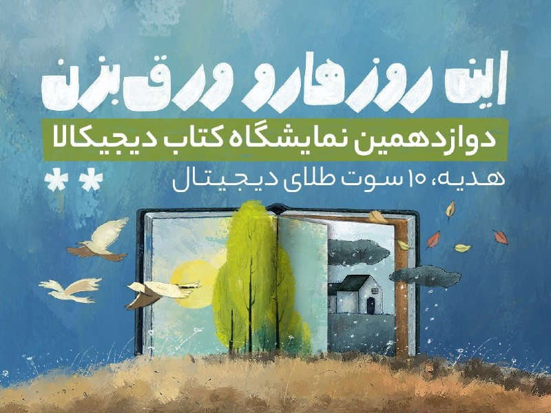

🎁 اولین کتابت رو بخر — ۱۰ سوت طلای دیجیتال هدیه بگیر

شاید مدتیه که یه کتاب توی ذهنته و هنوز نخریدیش. توی بزرگترین نمایشگاه کتاب دیجی‌کالا میتونی هم کتاب بخری هم طلا ببری!

نمایشگاه کتاب دیجی‌کالا تا ۳۱ اردیبهشت ادامه داره؛ ۳۵۰ هزار عنوان و ارسال به سراسر ایران. اولین خریدت که ثبت بشه، کد ۱۰ سوت طلای دیجیتال ظرف ۲۴ ساعت برات ارسال میشه تا در سوپراپ دیجی‌کالا ازش استفاده کنی.

🔗 https://dgka.me/vKutUE

## OfficialPersiaTwiter — post 498775

رئیس اورژانس استان تهران: یک هزار و ۷۲۹ نفر معادل ۳.۱ درصد از کل تماس‌ها با اورژانس در هفته گذشته مزاحم تلفنی بوده‌اند.

》OPT《

@OfficialPersiaTwiter

## OfficialPersiaTwiter — post 498774

  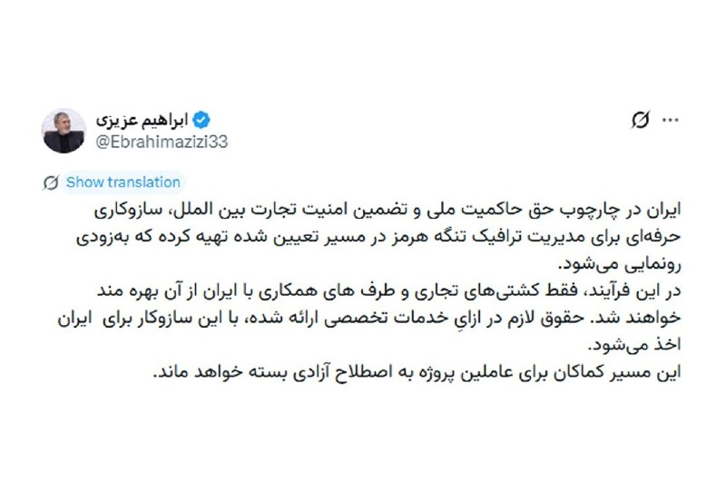

رئیس کمیسیون امنیت‌ملی مجلس: فقط کشتی‌های طرف همکاری با ایران حق عبور از تنگه هرمز دارند

🔹ایران در چارچوب حق حاکمیت ملی و تضمین امنیت تجارت بین الملل، سازوکاری حرفه‌ای برای مدیریت ترافیک تنگه هرمز در مسیر تعیین شده تهیه کرده که به‌زودی رونمایی می‌شود.

🔹در این فرآیند، فقط کشتی‌های تجاری و طرف‌های همکاری با ایران از آن بهره‌مند خواهند شد. حقوق لازم در ازایِ خدمات تخصصی ارائه شده، با این سازوکار برای ایران اخذ می‌شود.

🔹این مسیر کماکان برای عاملین پروژه به اصطلاح آزادی بسته خواهد ماند.

》OPT《

@OfficialPersiaTwiter

## OfficialPersiaTwiter — post 498773

سقف معافیت مالیاتی رسانه‌ها و فعالیت‌های فرهنگی-هنری ۹۶۰ میلیون تومان شد

》OPT《

@OfficialPersiaTwiter

## OfficialPersiaTwiter — post 498772

اقدام عجیب اماراتی‌ها برای مقابله با پهپادهای ایرانی

🔹 پس از ناکامی سامانه‌های پدافندی امارات در برابر پهپادها و موشک‌های ایرانی، رسانه‌های عربی گزارش داده‌اند که امارات متحده عربی اقدام به نصب سازه‌های فلزی و توری‌های محافظ در اطراف تأسیسات ذخیره‌سازی نفت نزدیک فرودگاه بین‌المللی دوبی کرده است؛ سازه‌هایی که خود اماراتی‌ها نام «ضدپهپاد» بر آن گذاشته‌اند.

🔹 این تصاویر نشان می‌دهد امارات در حال ایجاد موانع فیزیکی پیرامون مخازن نفتی است؛ اقدامی که کارشناسان آن را اعتراف ضمنی به شکست سیستم‌های پدافندی موجود در برابر پهپادهای ایرانی می‌دانند.

🔹 به نوشته رسانه‌های عربی، این اقدام در حالی انجام می‌شود که تجربه حملات اخیر نشان داده ایران قادر است با موشک‌های سنگین خود، حتی چنین موانعی را نیز همراه با تأسیسات هدف، به‌طور کامل نابود کند.

🔹 کارشناسان تأکید می‌کنند این اقدام بیشتر جنبه روانی و نمایشی دارد و نشان‌دهنده نگرانی جدی امارات از تکرار حملات و ناتوانی سامانه‌های دفاعی غربی در مقابله با پهپادهای ایرانی است.

》OPT《

@OfficialPersiaTwiter

## OfficialPersiaTwiter — post 498771

امارات مدعی شد: خروج از اوپک و اوپک‌پلاس نشانه اختلاف با شرکا نیست

🔹وزیر انرژی و زیرساخت امارات اعلام کرد تصمیم ابوظبی برای خروج از سازمان اوپک و ائتلاف اوپک‌پلاس بر پایه ملاحظات راهبردی و منافع ملی اتخاذ شده و ارتباطی با اختلافات سیاسی یا شکاف با شرکای این کشور ندارد.

》OPT《

@OfficialPersiaTwiter

## OfficialPersiaTwiter — post 498770

‏کاش اورانیوم بودم.
مهم، غنی، و سر به دست آوردنم دعوا بود.

》SaRa《

@OfficialPersiaTwiter

## OfficialPersiaTwiter — post 498769

‏رژیم بودن خیلی گرونتر از رژیم نبودنه 》ELAAA《 @OfficialPersiaTwiter

## bbcpersian — post 281209

سخنگوی وزارت کشور ایران در نشست خبری روز ۲۶ اردیبهشت گفت: شعارهای تند بعضی در میادین درباره بی‌حجابی،سیاست رسمی نظام و حاکمیت نیست.

علی زینی‌وند گفت: «سیاست کلی نظام جلوگیری قاطع از هر شعار، سخنرانی و اقدامی است که باعث اختلال در انسجام کشور شود.»

پس از اظهارات چهره‌هایی چون امام جمعه رشت که زنان بی‌حجاب را «همراستا با اسکتبار جهانی» خواند، در یکی از تجمع‌های شبانه از زنان کم‌حجاب حاضر به عنوان «نورچشم» یاد شد. 

حجاب اجباری از اصولی است که حکومت ایران برای حفظ آن هزینه‌های بسیاری را کرده و زنان در ایران برای رعایت حجاب اجباری تحت فشار‌های بسیاری بوده‌اند.

بعد از کشته شدن مهسا امینی در بازداشت گشت ارشاد و شکل گرفتن اعترضات سراسری «زن، زندگی، آزادی» که منجر به کشته شدن بسیاری از معترضان شد، گشت ارشاد دیگر به طور رسمی فعالیتی نداشت. گرچه همچنان گزارش‌هایی از بازداشت زنان به دلیل عدم رعایت حجاب اجباری منتشر شد.

حکومت ایران پیش از این هم از زنانی که بدون حجاب اجباری در مراسم حکومتی شرکت می‌کنند، به عنوان نشانه‌ای از «وحدت بین اقشار مختلف مردم برای حفظ نظام» استفاده کرده است.
@BBCPersian

## bbcpersian — post 281208

🔻عضو هیئت رئيسه مجلس: تشکیل ستاد ویژه فضای مجازی خلاف قانون است

علیرضا سلیمی، عضو هیئت رئيسه مجلس ایران، تشکیل ستاد ویژه فضای مجازی از سوی مسعود پزشکیان را «خلاف قانون برنامه هفتم» و «مغایر با سیاست‌های کلی نظام» خواند.

آقای سلیمی گفت: «با توجه به اینکه شورای عالی فضای مجازی و مرکز ملی فضای مجازی نیز هر دو وجود دارند و وظایف آنها کاملاً روشن است، چگونه ممکن است رئیس‌جمهور که خود رئیس شورای عالی فضای مجازی است، اختیارات مربوط به شورا را به ستادی خارج از شورا واگذار کند؟»

تشکیل ویژه فضای مجازی پیش از این هم با انتقادهایی همراه بوده است. مصطفی پوردهقان، دبیر دوم کمیسیون صنایع و معادن مجلس، تشکیل این ستاد را اقدامی «تزئینی» خوانده و گفته بود که «این تصمیم‌ها بیشتر جنبه روانی دارد و قرار نیست تغییر مشخصی ایجاد شود.»

آقای پزشکیان چند روز پیش از تشکیل ستادی ویژه برای ساماندهی فضای مجازی خبر داد و محمدرضا عارف، معاون اول خود، را به سمت رئیس این ستاد انتخاب کرد.

در حکم آقای پزشکیان بر «حکمرانی یکپارچه» در فضای مجازی و پایان دادن به «چندصدایی» و جلوگیری از «موازی‌کاری» میان نهادهای مسئول تأکید شده است.

این ستاد در حالی تشکیل شده است که اینترنت در بیش از ۷۰ روز گذشته یعنی از زمان شروع جنگ آمریکا و اسرائیل با ایران عملا قطع است.

https://bbc.in/4tEavKe
@BBCPersian

## bbcpersian — post 281207

🔻مهدی چمران، رئیس شورای شهر تهران، درباره تمدید رایگان شدن اتوبوس و مترو در پایتخت گفت کار احساسی نمی‌توان انجام داد و قرار نیست تمدید شود.

او در گفت‌وگو با باشگاه خبرنگاران جوان گفت اجرای چنین تصمیمی نیازمند ارائه طرح یا لایحه است، اما تاکنون هیچ‌یک از این دو به شورای شهر ارائه نشده است.

اتوبوس‌های درون‌شهری در تهران اولین‌بار نهم اسفند ۱۴۰۴ و به دنبال شروع جنگ و مترو از ۲۴ اسفند رایگان شد. پس از آن شورای شهر بصورت هفتگی این طرح را تمدید کرد.

پرویز سروری، نایب رئیس شورای شهر تهران پنجم اردیبهشت در تلویزیون ایران اعلام کرد: براساس برنامه‌ریزی صورت گرفته قرار است اتوبوس و مترو با تصویب شورای اسلامی شهر تهران برای همیشه رایگان شود.
او گفت در حال برنامه‌ریزی با نمایندگان و مدیریت شهرداری هستیم تا امکان دائمی‌شدن خدمات رایگان مترو و اتوبوس در تهران انجام شود.

https://bbc.in/4dNI8o4

@BBCPersian

## bbcpersian — post 281206

🔻بنابر گزارش‌ها وزارت دادگستری آمریکا در نظر دارد در روزهای آینده علیه رائول کاسترو، رهبر سابق کوبا، اعلام جرم کند. این پرونده به سرنگونی دو هواپیما با پدافند هوایی کوبا در سال ۱۹۹۶ مربوط می‌شود که در جریان آن چهار نفر کشته شدند. این هواپیماها متعلق به گروه…

## bbcpersian — post 281205

  

🔻بنابر گزارش‌ها وزارت دادگستری آمریکا در نظر دارد در روزهای آینده علیه رائول کاسترو، رهبر سابق کوبا، اعلام جرم کند.

این پرونده به سرنگونی دو هواپیما با پدافند هوایی کوبا در سال ۱۹۹۶ مربوط می‌شود که در جریان آن چهار نفر کشته شدند.

این هواپیماها متعلق به گروه تبعیدی آمریکایی «برادران برای نجات» بود؛ گروهی که خود را نهادی حقوق بشری توصیف می‌کند که هدفش کمک به قایق‌های مهاجرانی است که از کوبا فرار می‌کنند. این گروه قبلا در نزدیکی سواحل کوبا اقدام به پخش اعلامیه‌های ضد دولت کاسترو کرده بود.

دولت کوبا در زمان سرنگونی این هواپیماها مدعی شده بود که هواپیماها حریم هوایی این کشور را نقض کرده‌اند، اما سازمان بین‌المللی هوانوردی غیرنظامی اعلام کرد که حمله در آب‌های بین‌المللی رخ داده است.

به گفته مقام‌های آمریکایی، کیفرخواست احتمالی ممکن است از هفته آینده و پس از تأیید هیئت منصفه صادر شود. این اقدام بخشی از فشارهای فزاینده واشنگتن علیه کوبا ارزیابی می‌شود. فشاری که تحریم‌ها و محدودیت‌های نفتی را شامل می‌شود.

📸Getty Images
@BBCPersian

## Tans_Footbali — post 236334

  <a href="telegram/content/Tans_Footbali_236334_1778929577.mp4" target="_blank">🎬 Download video</a>

تو صدا و سیما به مجری ها اسلحه دادن که برای دشمن رجز بخونن.

@Tans_Footbali

## withyashar — post 11387

شبکه فاکس نیوز: ارتش آمریکا درحال آماده شدن برای دور جدیدی از درگیری های نظامی در ایران است
@withyashar

## withyashar — post 11386

ایال زمیر، رئیس ستاد کل نیروهای مسلح اسرائیل اعلام کرد کشته‌شدن عزالدین الحداد، فرمانده‌ شاخه ‌نظامی «حماس» یک گام مهم و موفقیتی بزرگ در عرصه عملیاتی است.
او افزود اسرائیل «با جدیت» به‌ تعقیب و هدف قرار دادن سایر رهبران و فرماندهان حماس ادامه خواهد داد.
@withyashar

## withyashar — post 11385

  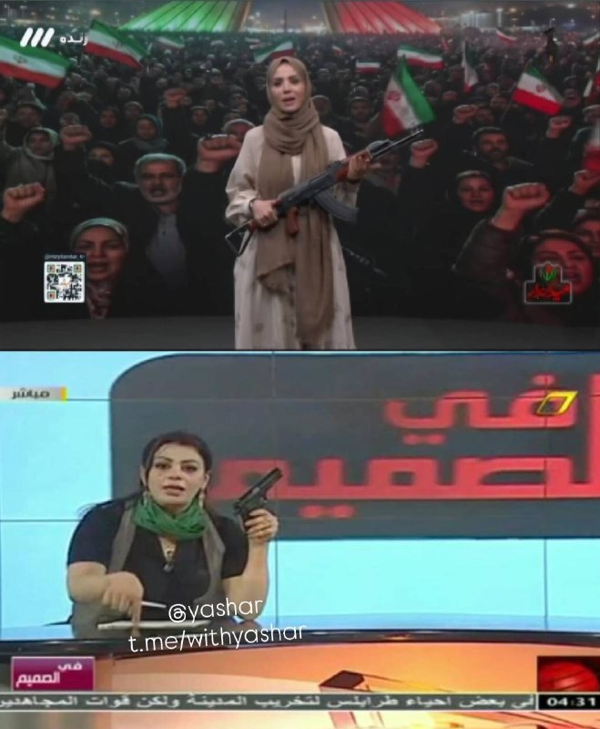

صدا و سیما هم میدونه چی میشه داره آموزش کار با سلاح رو میده 😂 اینا رفتنین شک نکنید 👋🏾👋🏾 @withyashar

---
📅 بروزرسانی: 1405/02/26 13:29
---

## persian_trend_official — post 14233

  

💢فراخوان مشمولان متولد ۱۳۵۵ تا ۱۳۸۷ برای تعیین‌تکلیف سربازی

🔹سازمان وظیفهٔ عمومی فراجا اعلام کرد: همهٔ مشمولان غایب و غیرغایب متولد سال‌های ۱۳۵۵تا ۱۳۸۷ باید خدمت وضعیت خدمتی خود را تعیین‌تکلیف کنند و مشمولانی که در مهلت تعیین‌شده وضعیت خود را مشخص نکنند، وارد غیبت می‌شوند و با محرومیت‌های اجتماعی مواجه خواهند شد.

🫆:Tony

📌 @persian_trend_official
پرشین ترند | متفاوت‌ترین کانال نظامی

## persian_trend_official — post 14230

💢اجرای برنامه ها به صورت مسلح در صداوسیما ..

🫆:Tony

📌 @persian_trend_official
پرشین ترند | متفاوت‌ترین کانال نظامی

## persian_trend_official — post 14229

## persian_trend_official — post 14228

اگر به تاریخ، مسائل نظامی و پشت‌پرده اتفاقات منطقه علاقه داری، پیشنهاد می‌کنم حتماً پادکست پرشین ترند رو هم دنبال کنی.

این‌جا فقط خبر گفته نمی‌شه؛
موضوعات از پایه باز می‌شن، تحلیل می‌شن و با یک روایت قابل فهم ارائه می‌شن.

از بررسی سلاح‌ها و تکنولوژی‌های نظامی گرفته تا اتفاقات تاریخی و تحولات روز، با یک نگاه متفاوت و عمیق.

اگر دوست داری بدونی واقعاً پشت این خبرها چی می‌گذره، این پادکست رو از دست نده 👇

https://castbox.fm/channel/%D9%BE%D8%B1%D8%B4%DB%8C%D9%86-%D8%AA%D8%B1%D9%86%D8%AF-%7C-%D9%85%D8%AA%D9%81%D8%A7%D9%88%D8%AA-%D8%AA%D8%B1%DB%8C%D9%86-%D9%BE%D8%A7%D8%AF%DA%A9%D8%B3%D8%AA-%D8%AA%D8%A7%D8%B1%DB%8C%D8%AE%DB%8C-%D9%88-%D9%86%D8%B8%D8%A7%D9%85%DB%8C-%D9%81%D8%A7%D8%B1%D8%B3%DB%8C-id6056489?nojump=1&country=gb

## OfficialPersiaTwiter — post 498768

جزئیات امتحانات همه پایه‌ها تحصیلی مشخص شد سخنگوی وزارت آموزش و پرورش: 🔹امتحانات دبستانی‌ها غیر حضوری است. 🔹تصمیم گیری برای حضوری یا غیرحضوری بودن امتحانات پایه‌ی هفتم تا دهم با استان‌ها است. 》OPT《 @OfficialPersiaTwiter

## OfficialPersiaTwiter — post 498767

  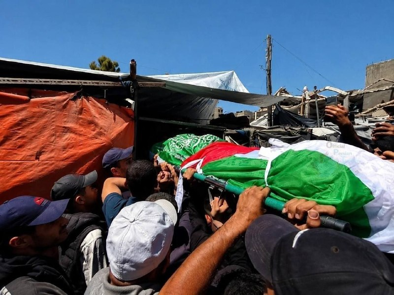

رویترز: مساجد در غزه شهادت عزالدین حداد، فرمانده نظامی حماس را تسلیت می‌گویند؛ حماس تاکنون تأیید نکرده است. 》OPT《 @OfficialPersiaTwiter

## OfficialPersiaTwiter — post 498766

  <a href="telegram/content/OfficialPersiaTwiter_498766_1778925592.mp4" target="_blank">🎬 Download video</a>

🔹شلیک با اسلحه در برنامه زنده صداوسیما!

》OPT《

@OfficialPersiaTwiter

## OfficialPersiaTwiter — post 498765

قهرمان سابق وزنه‌برداری جهان متهم به قتل شد

🔹درگیری فیزیکی میان یکی از قهرمانان سابق وزنه‌برداری ایران، آسیا و جهان در شهر محل زندگی‌اش منجر به قتل شده و پلیس و مقامات قضایی پیگیر این پرونده هستند.

🔹در جریان نزاع دسته‌جمعی که میان این ورزشکار و دوستانش با چند نفر دیگر، ضرباتی به سر مقتول وارد شده و او پس از آنکه چند روز در کما بود، جان خود را از دست داده است.

》OPT《

@OfficialPersiaTwiter

## OfficialPersiaTwiter — post 498764

ارتش اسرائیل به حالت آماده‌باش درآمد 🔹پس از ادعای ترور «عزالدین حداد» فرمانده گردان‌های عزالدین قسام (شاخه نظامی حماس) یک منبع ارتش اسرائیل به وبگاه عبری واللا گفت که ارتش در تمامی جبهه‌ها اعلام آماده‌باش کرده است. 🔹رادیو ارتش اسرائیل نیز مدعی شد که در حمله…

## OfficialPersiaTwiter — post 498761

تحویل رسمی نخست وزیری عراق به الزیدی

🔹علی الزیدی در جریان مراسم تحویل و دریافت منصب نخست وزیری که با حضور محمد شیاع السودانی برگزار شد، به طور رسمی مسئولیت‌های خود به عنوان نخست وزیر و فرمانده کل نیروهای مسلح عراق را تحویل گرفت.

》OPT《

@OfficialPersiaTwiter

## OfficialPersiaTwiter — post 498760

‏رژیم بودن خیلی گرونتر از رژیم نبودنه

》ELAAA《

@OfficialPersiaTwiter

## OfficialPersiaTwiter — post 498759

  

خرید پراید هم رویا شد

پراید که اقتصادی ترین خودروی بازار هست مبلغ ۱/۰۰۰/۰۰۰/۰۰۰ تومان رو رد کرد.
برای خریدش حدود ۳ سال باید کار کنید و ماهی ۳۰ میلیون تومان از درآمد رو پس انداز کنید، تازه اگر دیگه افزایش قیمت نداشته باشیم که...

》Payam《

@OfficialPersiaTwiter

## OfficialPersiaTwiter — post 498758

واشنگتن‌ پست: انتظار می‌رود ناو هواپیمابر یو‌اس‌اس جرالد آر. فورد پس از ۱۰ ماه استقرار برای تعمیرات مورد نیاز، در روزهای آینده خاورمیانه را ترک کند 》OPT《 @OfficialPersiaTwiter

## OfficialPersiaTwiter — post 498755

شب گذشته در بسیاری از برنامه های صداوسیما، مجریان با سلاح حاضر شدند!

》OPT《

@OfficialPersiaTwiter

## OfficialPersiaTwiter — post 498754

پزشکی قانونی: ۸۳۱ نفر در سال ۱۴۰۴ بر اثر گاز گرفتگی جان باختند

🔹سازمان پزشکی قانونی اعلام کرد: در سال ۱۴۰۴، ۸۳۱ نفر در کشور بر اثر مسمومیت با گاز منوکسیدکربن جان خود را از دست دادند. ۶۷ درصد از این تلفات مربوط به نیمه دوم سال است. بیشترین آمار فوتی با ۱۴۹نفر مربوط به بهمن ماه و کمترین آن با ۲۵ نفر مربوط به مرداد ماه بوده است.

》OPT《

@OfficialPersiaTwiter

## bbcpersian — post 281204

🔻اسرائیل از موج تازه حملات علیه مواضع حزب‌الله خبر داد

ارتش اسرائیل می‌گوید که موج تازه‌ای از حملات هوایی را علیه مواضع حزب‌الله در جنوب لبنان آغاز کرده است.

ارتش اسرائیل پیش‌تر به ساکنان چندین منطقه در جنوب لبنان دستور تخلیه داده بود.

این حملات جدید یک روز پس از آن انجام شد که نمایندگان اسرائیل و لبنان در نشستی در واشنگتن، آتش‌بس شکننده جاری را برای ۴۵ روز دیگر تمدید کردند.

پیش‌تر، مقام‌های لبنانی اسرائیل را متهم کردند که عمداً مراکز درمانی را هدف قرار داده است.

وزارت بهداشت لبنان اعلام کرد که اسرائیل یک مرکز امدادرسانی را هدف حمله قرار داده که در نتیجه آن شش نفر، از جمله سه امدادگر، کشته شدند.

اما اسرائیل هدف قرار دادن نیروهای امدادی و پزشکی را رد کرد.

https://bbc.in/4uQiCnV
@BBCPersian

## bbcpersian — post 281203

  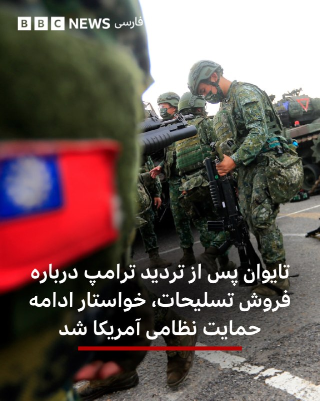

🔻ساعاتی پس از آنکه دونالد ترامپ گفت که هنوز در مورد فروش سلاح به تایوان تصمیم نگرفته است، رئیس‌جمهور تایوان بر اهمیت و لزوم این موضوع تاکید کرده است.

سخنگوی رئیس‌جمهور تایوان گفت که فروش تسلیحات آمریکا به تایوان نه تنها تعهدی حقوقی است، بلکه همواره یک عامل بازدارنده مشترک علیه تهدیدهای منطقه‌ای بوده است.

این موضعگیری تایوان پس از دیداردونالد ترامپ و همتای چینی‌اش شی‌ جین‌پینگ است که در آن رهبر چین هشدار داد که «مدیریت نامناسب» مساله تایوان می‌تواند به درگیری یا جنگ مستقیم بینجامد.

چین تایوان را یک استان متمرد خود می‌داند و امکان استفاده از زور برای تحت کنترل درآوردن آن را رد نکرده است.

واشنگتن بر اساس «قانون روابط با تایوان» موظف است برای این جزیره سلاح فراهم کند.

📷Getty Images
@BBCPersian

## Lichargoo — post 24887

همونطور که سیکس‌پک پسر اسکینی سیکس‌پک محسوب نمیشه، شکم تختِ دختر لاغر مردنی هم شکم تخت محسوب نمیشه. شکم تخت واقعی رو اونی داره که در عین حال یه ذره توپُر هم باشه.

## Tans_Footbali — post 236333

قیمتا جوریه که یا پولت نمیرسه چیزی که میخوای رو بخری
یا اگه هم برسه، دلت نمیاد اون همه پولو خرجش کنی...
Lolek

💛@Tans_Footbali

## withyashar — post 11384

آقا یاشار عزیز،

واقعاً دلم می‌خواست یه چیزی بهت بگم از ته دل.

مرسی که با کارای دلی و عشقیت، بهم نشون دادی وقتی کاریو با دل شروع می‌کنی، چقدر می‌تونه برکت و موفقیت بیاره.

از اون موقع که تو نوجونی اون سایت برای پروموت کردن رپرها ساختی تا همین الان که با تمام وجود وقتت رو پای این کانال خبری (تلگرام و اینستا) می‌ذاری تا مردم خبر درست بگیرن، یه چیز بزرگ یاد گرفتم ازت — اینکه عشق و نیت خالص از هر چیز دیگه‌ای قوی‌تره.

بهم یادآوری و یاد دادی که پیشرفت فقط با کار زیاد نیست، بلکه دلی و با عشق کار کردن توی کاره.

دمت گرم ، واسه همه این زحماتت، واسه الهامی که بهم دادی، و واسه اینکه خودِ واقعی‌ت رو بی‌منت به دنیا نشون میدی💚

## withyashar — post 11383

جسی واترز، مجری فاکس نیوز:

ترامپ درحال آماده‌شدن برای دور جدیدی از حملات نظامی به ایرانه.
@withyashar

## withyashar — post 11382

ترامپ: 5 بار با ایران نزدیک توافق شدم، ولی روز بعدش زدن زیرش
@withyashar

## withyashar — post 11381

نشست آینده تکنولوژی در ایران، با حضور و سخنرانی شاهزاده رضا پهلوی امشب ۸:۳۰ به وقت تهران ۱۰ صبح به وقت غرب آمریکا سانفرانسیسکو
@withyashar

## withyashar — post 11380

سنتکام به نیویورک تایمز : کشتی‌های ایرانی رو با ماهواره و چند روش دیگه ردیابی می‌کنیم
@withyashar

## withyashar — post 11379

آسوشیتدپرس: بازگشت ناو هواپیمابر جرالد فورد به پایگاه پس از ۱۱ ماه مأموریت

وزارت‌جنگ آمریکا اعلام کرد پیت هگست، وزیر جنگ، روز شنبه در پایگاه دریایی نورفولک در ویرجینیا از ناو هواپیمابر جرالد فورد و ۴۵۰۰ ملوان آن پس از ۱۱ ماه مأموریت استقبال می‌کند.
این ناو ۳۲۶ روز در دریا بوده که طولانی‌ترین استقرار یک ناو هواپیمابر آمریکایی در ۵۰ سال گذشته و سومین رکورد از زمان جنگ ویتنام است.
@withyashar

## withyashar — post 11378

کانال N12 اسرائیل: جنگ سوم با ایران نزدیک است
@withyashar

---
📅 بروزرسانی: 1405/02/26 11:59
---

## OfficialPersiaTwiter — post 498753

نه الکل، نه موادمخدر قلب مارادونا، زیادی بزرگ بود 🔹پزشکان مسئول کالبدشکافی دیه‌گو آرماندو مارادونا، اسطوره فوتبال آرژانتین اعلام کردند در بدن او در زمان مرگ هیچ اثری از الکل یا مواد مخدر یافت نشده است با این حال آزمایش‌ها نشانگر آن است که قلب مارادونا به‌شکل…

## OfficialPersiaTwiter — post 498752

‍ امتیاز ۱.۶ به فیلم جدید اصغر فرهادی: از نقدهای منفی تا متوسط دانستن فیلم

🔹روز گذشته نخستین نمایش فیلم «داستانهای موازی» آخرین ساخته اصغر فرهادی در جشنواره کن برگزار شد شد. منتقدان کن اما چندان فیلم را تحویل نگرفتند.
🔹فیلم فرهادی در جدول منتقدان نشریه اسکرین حالا با میانگین امتیاز ۱.۶ پایینترین جایگاه را در میان چهار فیلم اکران شده در بخش مسابقه دارد.
دیوید هامون منتقد وددلاین یکی از معدود حامیان فیلم است و این اثر را بازگشتی قدرتمند برای فرهادی توصیف کرده است و نوشته:«فرهادی با فیلم گیرا و بازآفرینی‌شده‌ و هوشمندانه‌ داستان‌های موازی بازگشته؛ داستانی پیچ‌درپیچ و هوشمندانه. برخلاف نسخه کیشلوفسکی، این یک داستان عاشقانه نیست، بلکه داستانی درباره خلاقیت و تخیل است. این فیلم احتمالا از نظر سبک و مهارتِ محض فیلم‌سازی، بهترین کار فرهادی است و برای من مسلما بهترین اثر او پس از جدایی نادر از سیمین محسوب می‌شود»
🔹پیتر بردشاو از نشریه گاردین به فیلم امتیاز ۳ از ۵ داده و آن را اثری متوسط اما جذاب توصیف کرده است:«فرهادی با یک درام متوسط و جذاب درباره فراداستان، خیانت و پیوند میان تماشاگری پنهانی و خلاقیت، به فرانسه بازگشته است. اما علارغم جذابیت فیلم و بازی های باور پذیر فیلم زمان زیادی را صرف می کند تا به نقطه تنش دراماتیک برسد.»
🔹اوون گیلبرمن منتقد مشهور نشریه ورایتی اما منتقد سرسخت فیلم بوده:«فرهادی در دومین ساخته فرانسوی خود به تامل درباره واقعیت و داستان می‌پردازد اما هرگز ما را به درام نیرنگ و فریب خود جذب نمی‌کند.این فیلم دچار آشفتگی بی‌هدف و تقریبا مبهم است. فرهادی بیش از آن‌که با تماشاگر بازی کند، او را با غیرمستقیم‌بودن شیوه روایتش سردرگم می‌کند.»
🔹دیوید الریک منتقد ایندی وایر هم در نقدی تند نوشته:«فرهادی فیلمی کوتاه درباره عشق کیشلوفسکی را به فیلمی بلند درباره هیچ بدل کرده است؛ واقعا فاجعه‌بار و اسفناک.فیلم از نظر بصری صیقل داده شده و بازیگران بااستعداد تمام تلاش‌شان را می‌کنند، اما فیلمنامه‌ای که فاقد دقت و با فوریت نوشته شده، ناامیدکننده است»
دن شیندل منتقد آمریکایی حتی جلوتر رفته و دوران فرهادی را تمام شده دانسته.
🔹در مجموع با اینکه برخی منتقدان از مواردی مانند بازی بازیگران مخصوصا ایزابل هوپر و فضای بصری فیلم تعریف کردند، اما به نظر مدت زمان طولانی فیلم و نزدیک شدن داستانش به یک اثر ملودرام تلویزیونی، نقاط منفی بوده که باعث شده حتی برخی این فیلم را ضعیفترین اثر بین المللی فرهادی بدانند./سینمادیلی

》OPT《

@OfficialPersiaTwiter

## OfficialPersiaTwiter — post 498751

  <a href="telegram/content/OfficialPersiaTwiter_498751_1778920177.mp4" target="_blank">🎬 Download video</a>

مارکو روبیو: جی‌دی ونس یکی از دوستان بسیار نزدیک من است. اگر جی‌دی برای ریاست‌جمهوری نامزد شود، فکر می‌کنم یک نامزد فوق‌العاده خواهد بود.

🔹قبلاً هم علناً گفته‌ام و دوباره هم می‌گویم: من اولین کسی خواهم بود که ثبت‌نام می‌کنم و از او حمایت می‌کنم. فکر می‌کنم جی‌دی عملکرد بسیار خوبی خواهد داشت.

》OPT《

@OfficialPersiaTwiter

## OfficialPersiaTwiter — post 498750

  <a href="telegram/content/OfficialPersiaTwiter_498750_1778920179.mp4" target="_blank">🎬 Download video</a>

روبیو: کاری که چین می کند، اگر من رهبر چین بودم همان را می کردم

مارکو روبیو، وزیر خارجه آمریکا:
🔹 چین در تلاش است در همه صنایع کلیدی آینده بر جهان مسلط شود.
🔹 ممکن است آمریکا از این سیاست خوشش نیاید، اما چین دارد به نفع خود عمل میکند و آمریکا هم باید به نفع خودش عمل کند.
🔹اگر من جای رهبر چین بودم، دقیقاً همین کار را انجام می دادم.

》OPT《

@OfficialPersiaTwiter

## OfficialPersiaTwiter — post 498749

  <a href="telegram/content/OfficialPersiaTwiter_498749_1778920181.mp4" target="_blank">🎬 Download video</a>

برخورد هواپیما به خانه ای در اوهایو امریکا

🔹️ وقوع آتش سوزی عظیم در پی برخورد هواپیما به خانه ای در اوهاویو.

🔹️ در این حادثه دو نفر جان خود را از دست دادند.

》OPT《

@OfficialPersiaTwiter

## OfficialPersiaTwiter — post 498748

🔴 استفاده رایگان از مترو و اتوبوسرانی تهران تا ۲۷ اردیبهشت‌ماه تمدید شد 🔹شهردار تهران اعلام کرد: خدمات رایگان مترو و اتوبوسرانی تا ۲۷ اردیبهشت ماه تمدید شد و در جلسه شورای شهر به زودی در این زمینه تصمیم‌گیری می‌شود. 》OPT《 @OfficialPersiaTwiter

## OfficialPersiaTwiter — post 498747

  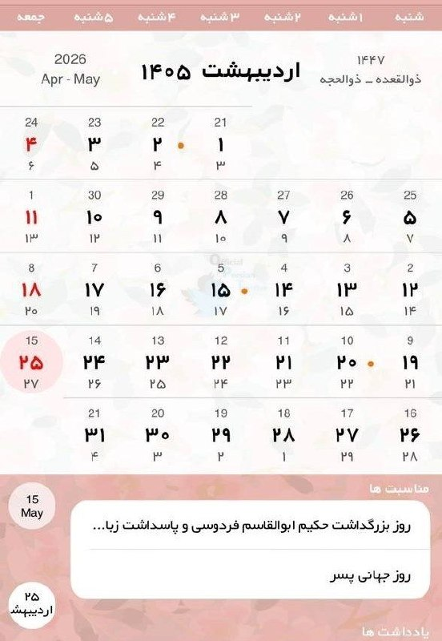

در مورد مظلومیت ما پسرا هرچی بگن واقعا کمه
درحالیکه همه حتی روز الاغ هم تبریک میگن با این‌که روز گذشته روز جهانی پسر بود، هیچکس به روی خودش هم نیاورد :))

》Javid《

@OfficialPersiaTwiter

## OfficialPersiaTwiter — post 498746

سی‌ان‌بی‌سی:
🔹ترامپ چند هفته قبل از آنکه به طور علنی سهام شرکت هوش مصنوعی Palantir Technologies را در شبکه Truth Social تحسین کند، سهام این شرکت را خریداری کرد.
🔹سوابق نشان می‌دهد که ترامپ در اوایل سال ۲۰۲۶ بین حدود ۲۴۷,۰۰۰ تا ۶۳۰,۰۰۰ دلار سهام Palantir خریداری کرده است، از جمله چند خرید در ماه مارس. او بعداً این شرکت را در یک پست در Truth Social در آوریل، در زمانی که سهام فناوری به شدت کاهش یافته بود، تبلیغ کرد.
🔹اسناد همچنین نشان می‌دهد که ترامپ در فوریه تا ۵ میلیون دلار سهام Palantir فروخته و سرمایه‌گذاری‌های بزرگ دیگری در حوزه فناوری انجام داده است، از جمله در Nvidia، Apple، Amazon، Microsoft و Oracle.

》OPT《

@OfficialPersiaTwiter

## OfficialPersiaTwiter — post 498745

آتش‌سوزی در بازارچه جنت/ خسارت دیدگان اغلب زن هستند به گفته کسبه، برخی از غرفه‌ها متعلق به زنان سرپرست خانوار بوده است. 》OPT《 @OfficialPersiaTwiter

## OfficialPersiaTwiter — post 498744

  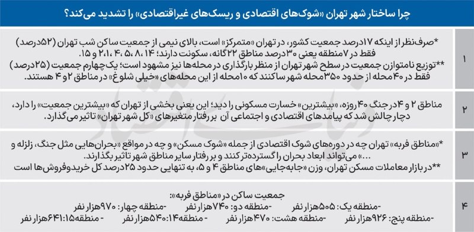

محله‌های فربه و آسیب‌پذیری پایتخت در بحران‌ها

روزنامه دنیای اقتصاد نوشت:
🔹توزیع نامتقارن جمعیت در تهران باعث شکل‌گیری «مناطق و محله‌های فربه» شده است؛ به‌طوری‌که ۵۲درصد جمعیت پایتخت تنها در ۷ منطقه (۱، ۲، ۴، ۵، ۸، ۱۴ و ۱۵) زندگی می‌کنند و حتی ۲۵درصد جمعیت در ۴۰ محله متمرکز است.
🔹این تمرکز جمعیتی هنگام بحران‌ها، مانند جنگ ۴۰روزه، آسیب‌پذیری شهر را افزایش داده و مناطقی مانند ۲ و ۴ بیشترین خسارت را تجربه کرده‌اند.
🔹به‌گفته پژوهشکده امور اقتصادی وزارت اقتصاد، این ساختار جمعیتی علاوه بر ریسک‌های امنیتی، در زمان شوک‌های اقتصادی نیز بحران‌ها را تشدید می‌کند.
🔹در بازار مسکن نیز افزایش سرعت واکنش قیمت‌ها به تنش‌های سیاسی به چهار عامل نسبت داده شده است: سرمایه‌ای شدن تقاضای مسکن، جهش‌های ارزی و شکل‌گیری انتظارات تورمی، افزایش هزینه ساخت و کاهش سرمایه‌گذاری ساختمانی و انتقال با تأخیر شوک‌های سیاسی از بازارهای زودنقدشونده مانند دلار و طلا به بازار مسکن.
🔹جنگ ۱۲روزه این انتقال ریسک را موقتا به تأخیر انداخت، اما در ادامه اثر آن در بازار مسکن نمایان شد./دنیای اقتصاد

》OPT《

@OfficialPersiaTwiter

## OfficialPersiaTwiter — post 498743

برخورد قانونی و پاسخگو کردن والدین رانندگان فاقد گواهینامه و زیر سن قانونی

🔹معاون پلیس راهور فراجا با اشاره به برخورد قانونی پلیس با رانندگان فاقد گواهینامه، گفت: در مواردی که رانندگی توسط افراد زیر سن قانونی انجام شود، علاوه بر برخورد قانونی با راننده، والدین نیز به‌دلیل قصور در نظارت و فراهم کردن شرایط تخلف باید پاسخگو باشند.
🔹متأسفانه رانندگی بدون گواهینامه، به‌ویژه در سنین پایین، در بسیاری از موارد خسارت‌ها و آسیب‌های جبران‌ناپذیری را متوجه خود نوجوانان و خانواده‌های آنان می‌کند.

》OPT《

@OfficialPersiaTwiter

## OfficialPersiaTwiter — post 498742

  <a href="telegram/content/OfficialPersiaTwiter_498742_1778920183.mp4" target="_blank">🎬 Download video</a>

به دستور ممدانی شهردار نیویورک، ۴۰۰ موتور سیکلت این شهر که رانندگان آن ها از کلاه ایمنی استفاده نمی‌کردند منهدم شدند.

🔹به گفته وی، این کار در راستای تقویت فرهنگ استفاده از کلاه ایمنی انجام شده است.

》OPT《

@OfficialPersiaTwiter

## OfficialPersiaTwiter — post 498741

فراخوان مشمولان متولد ۱۳۵۵ تا ۱۳۸۷ برای تعیین‌تکلیف سربازی

سازمان وظیفه عمومی فراجا:
🔹همه مشمولان غایب و غیرغایب متولد سال‌های ۱۳۵۵تا ۱۳۸۷ باید خدمت وضعیت خدمتی خود را تعیین‌تکلیف کنند و مشمولانی که در مهلت تعیین‌شده وضعیت خود را مشخص نکنند، وارد غیبت می‌شوند و با محرومیت‌های اجتماعی مواجه خواهند شد.

》OPT《

@OfficialPersiaTwiter

## OfficialPersiaTwiter — post 498740

  

استوری مشاور محمدباقر قالیباف

》OPT《

@OfficialPersiaTwiter

## OfficialPersiaTwiter — post 498739

الجزیره: ۱۱۲ کشور به قطعنامه آمریکا درباره تنگه هرمز پیوستند 🔹 منابع دیپلماتیک می‌گویند که ۱۱۲ کشور هم‌اکنون از پیش‌نویس قطعنامه پیشنهادی آمریکا به شورای امنیت سازمان ملل درباره تنگه هرمز حمایت می‌کنند. 》OPT《 @OfficialPersiaTwiter

## bbcpersian — post 281202

🔻وزیر نفت عراق: در ماه قبل ۱۰ میلیون بشکه نفت از طریق تنگه هرمز صادر کردیم

وزیر جدید نفت عراق امروز اعلام کرد که این کشور در ماه آوریل ۱۰ میلیون بشکه نفت از طریق تنگه هرمز صادر کرده است.

باسم محمد که در یک نشست خبری صحبت می‌کرد، همچنین گفت که عراق قصد دارد برای افزایش ظرفیت تولید و صادرات نفت خود با اوپک همکاری و رایزنی کند.

به گفته آقای محمد، بغداد در تلاش است تا ظرفیت تولید نفت عراق را به روزانه ۵ میلیون بشکه برساند.

@BBCPersian

## bbcpersian — post 281201

  

🔻کرملین روز شنبه اعلام کرد که ولادیمیر پوتین، رئیس‌جمهور روسیه ۱۹ مه /۲۹ اردیبهشت برای یک سفر دو روزه به چین خواهد رفت. این سفر در پی سفر دونالد ترامپ، رئیس‌جمهور آمریکا به پکن انجام می‌شود.

بر اساس بیانیه کرملین آقای پوتین در این سفر با شی جین‌پینگ، همتای چینی خود، درباره «مشارکت‌ همه‌جانبه و همکاری راهبردی» مسکو و پکن گفت‌وگو خواهد کرد.

به گفته کرملین رهبران دو کشور همچنین درباره «موضوعات مهم بین‌المللی و منطقه‌ای تبادل نظر خواهند کرد» و در پایان مذاکرات، یک بیانیه مشترک امضا خواهند کرد.

در جریان این سفر، آقای پوتین قرار است درباره همکاری‌های اقتصادی و تجاری با لی چیانگ، نخست‌وزیر چین، هم گفت‌وگو کند.

اعلام این سفر در حالی صورت گرفته است که آقای ترامپ دیروز سفر خود به چین را به پایان رساند و به آمریکا بازگشت.

چین که بزرگ‌ترین خریدار سوخت‌های فسیلی روسیه است، پس از اعمال تحریم‌های غرب علیه نفت و گاز روسیه، به مهم‌ترین شریک اقتصادی مسکو تبدیل شده است.

📷Getty Images
@BBCPersian

## bbcpersian — post 281200

🔻دونالد ترامپ، رئیس جمهور آمریکا گفته است که نیروهای آمریکا و نیجریه در یک عملیات مشترک، نفر دوم گروه دولت اسلامی (داعش) را کشته‌اند. آقای ترامپ در پستی در تروث سوشال گفت که ابوبلال المینوکی دیگر به مردم آفریقا آسیب نخواهد زد و نمی‌تواند برای هدف قرار دادن…

## bbcpersian — post 281193

🖊سوفیا بتیزا, بی‌بی‌سی در کی‌یف

کارینا شش‌ ماهه باردار است، اما جنینی که در رحم اوست متعلق به خودش نیست.

این زن ۲۲ ساله اهل شرق اوکراین، یک مادر جایگزین است که رویانی حاصل از تخمک و اسپرم یک زوج چینی را در شکم دارد.

زمانی که کارینا تنها ۱۷ سال داشت، خانه‌اش ویران شد؛ در آن هنگام شهر او، باخموت، در اولین مراحل تهاجم تمام‌عیار روسیه، به یکی از پرکشمکش‌ترین میدان‌های نبرد تبدیل شده بود.

در حالی که بخش اعظم شهر به تلی از آوار و خاکستر بدل شده بود، او و شریک زندگی‌اش راهی کی‌یف شدند، اما در آنجا برای یافتن شغلی پایدار با دشواری روبه‌رو گشتند.

یک روز، وقتی کارینا در فروشگاهی بود و پولش به‌زحمت به خرید نان و پوشک برای دختر یک‌ و نیم‌ ساله‌شان می‌رسید، تصمیم گرفت برای تامین معاش، رحمش را اجاره دهد.

او می‌گوید اگر به خاطر جنگ نبود، هرگز یک مادر جایگزین نمی‌شد؛ جنگی که باعث بیکاری میلیون‌ها نفر و نابودی کسب‌وکارها شده و تورم فزاینده و سقوط شدید تولید ناخالص داخلی اوکراین را به همراه داشته است.

برای خواندن مطلب کامل:
https://bbc.in/4wDd7Le
📷BBC/ Getty/ BioTexCom
@BBCPersian

## Pesari_Ke_Konie — post 44943

صدا و سیما :

@Pesari_Ke_Konie

## Pesari_Ke_Konie — post 44942

شاید باورتون نشه ولی امروز May 16، روز جهانی پسره. @Pesari_Ke_Konie

## Pesari_Ke_Konie — post 44941

  

شاید باورتون نشه ولی امروز May 16، روز جهانی پسره.

@Pesari_Ke_Konie

## Tans_Footbali — post 236332

  

دونالد ترامپ، مدعی شد در جریان یک عملیات مشترک میان نیروهای آمریکایی و نیجریه‌ای، «ابوبلال المنوکی»، مرد شماره دو  داعش را از پای درآوردیم.

💛@Tans_Footbali

## Tans_Footbali — post 236331

کانال ۱۲ اسرائیل: جنگ سوم با ایران نزدیکه.

💛@Tans_Footbali

## Tans_Footbali — post 236330

  <a href="telegram/content/Tans_Footbali_236330_1778920186.mp4" target="_blank">🎬 Download video</a>

مارکو روبیو: چین کاری را انجام می‌دهد که من اگر رهبر چینی بودم انجام می‌دادم. آن‌ها تلاش می‌کنند در تمام این صنایع کلیدی آینده بر جهان مسلط شوند.

شاید ما از آن خوشمان نیاید، اما این همان کاری است که آن‌ها انجام خواهند داد زیرا به نفع بهترین منافع خود عمل می‌کنند. ما نیز باید به نفع بهترین منافع خود عمل کنیم.

💛@Tans_Footbali

## Tans_Footbali — post 236329

  <a href="telegram/content/Tans_Footbali_236329_1778920187.webm" target="_blank">🎬 Download video</a>

🎉  بونوس ویژه ثبت‌نام – ۵۰۰٬۰۰۰ تومان رایگان

💥 با ثبت‌نام در سایت، ۵۰۰٬۰۰۰ تومان بونوس رایگان دریافت کنید و شانس خود را امتحان کنید.

🔥 چگونه کار می‌کند؟

⬅️ ثبت‌نام کنید 

⬅️بونوس ۵۰۰٬۰۰۰ تومانی دریافت کنید 

⬅️ شرط‌بندی کنید و بونوس را به موجودی واقعی تبدیل کنید

🔥 وقتشه بازی رو یه جور دیگه ببینی

⚽️  پوشش کامل مسابقات ورزشی 

📊  پیش‌بینی با بهترین ضرایب 

⚡️  تجربه سریع و حرفه‌ای

😀 پرداخت مستقیم و سریع بدون واسطه، بدون دردسر، واریز و برداشت در سریع‌ترین زمان ممکن 
A24

😀 کانال تلگرام: 

🔴 @winro_io  

😀 هدیه خود را با ثبت نام در سایت دریافت کنید: 

🔴 Winro.io

سایت اصلی در روزهای آینده بازگشایی خواهد شد 
✅

## Tans_Footbali — post 236327

  <a href="telegram/content/Tans_Footbali_236327_1778920188.mp4" target="_blank">🎬 Download video</a>

پسر سرلشگر موسوی رییس ستاد کل نیروهای مسلح جمهوری اسلامی می‌گوید که جنازه پدرش ۳۰ روز زیر آوار بوده.

@Tans_Footbali

## hamclasixii — post 75387

🔴#فوری | نحوه برگزاری امتحانات مدارس تهران مشخص شد!

مجید پارسا، مدیرکل آموزش و پرورش شهر تهران اعلام کرد:
🔹ارزشیابی دانش‌آموزان پایه‌های هفتم تا دهم شهر تهران با مصوبه شورای آموزش و پرورش استان تهران به‌صورت غیرحضوری و بر اساس عملکرد، فعالیت‌ها و روند آموزشی دانش‌آموزان در طول سال تحصیلی انجام خواهد شد.
🔹فرآیند ارزشیابی دانش‌آموزان دوره ابتدایی نیز مطابق اطلاعیه‌های پیشین به‌صورت غیرحضوری برگزار می‌شود و جزئیات و دستورالعمل‌های اجرایی به مدارس ابلاغ خواهد شد.

📚 @hamclasix 📚

## withyashar — post 11377

نامه زرشکیان به پاپ: ما به راهکارهای دیپلماتیک برای حل و فصل مسائل، از جمله پرونده‌های اختلافی با آمریکا، پایبندیم و بعد برقراری امنیت، عبور از تنگه هرمز به حالت عادی بازخواهد گشت
@withyashar

## withyashar — post 11376

رویترز به نقل از یک منبع آگاه گزارش داد که متیاس گرافستروم، دبیرکل فیفا، امروز در استانبول با مقام‌های فدراسیون فوتبال ایران دیدار می‌کند و درباره حضور تیم ملی در جام جهانی ۲۰۲۶ «اطمینان خاطر» خواهد داد. این درحالی است که مهدی تاج پیش از این خواستار تضمین‌هایی از فیفا شده بود.
@withyashar

## withyashar — post 11375

کرملین امروز اعلام کرد که ولادیمیر پوتین، رئیس‌جمهور روسیه ۱۹ مه (۲۹ اردیبهشت) برای یک سفر دو روزه به چین خواهد رفت. این سفر در پی سفر دونالد ترامپ، رئیس‌جمهور آمریکا به پکن انجام می‌شود.
@withyashar

## withyashar — post 11374

چمران رئیس شورای شهر تهران:

رایگان اعلام کردن مترو و اتوبوس در تهران کار احساسی بود و فردا آخرین روز رایگان بودن حمل و نقل عمومی در تهران است و تمدید نخواهد شد.
@withyashar

## withyashar — post 11373

شریعتمداری: مذاکره به جای خود، اما جنگ بدون پاسخ پایان نمی‌یابد/ با شهادت آقا شروع کردند بی‌انتقام تمام نمی‌کنیم
@withyashar

## withyashar — post 11372

کانال ۱۲ اسرائیل گزارش داد انتظار می‌رود دونالد ترامپ، رییس‌جمهوری آمریکا، طی ۲۴ ساعت آینده تیم مشاوران نزدیک خود را تشکیل دهد تا درباره ایران تصمیم نهایی بگیرد. برآوردها در اسرائیل حاکی است تصمیم درباره اقدام نظامی ممکن است بسیار به‌زودی اتخاذ شود.

برنامه تلویزیونی «اولپن شیشی» به نقل از یک مقام ارشد اسرائیلی گزارش داد که «ازسرگیری درگیری نزدیک است» و اسرائیل خود را برای احتمال «چند روز تا چند هفته جنگ» آماده می‌کند.
@withyashar

## withyashar — post 11371

  

استوری مشاور قالیباف تو اینستاگرام 🤣
@withyashar

---
📅 بروزرسانی: 1405/02/26 10:06
---

## persian_trend_official — post 14227

📍بولتن خبری ۲۵ اردیبهشت ۱۴۰۵

گردآوری تحریریه‌پرشین ترند

🇮🇷 ایران

◾️ ایران پنج شرط خود را برای مذاکره با آمریکا از طریق میانجی پاکستانی اعلام کرد؛ واشنگتن در انتظار بررسی شروط است

◾️ تهران تایمز: آمریکا پیشنهاد ۱۴ ماده‌ای ایران را رد کرد؛ واشنگتن مواضع خود به‌ویژه در بحث هسته‌ای را تکرار کرده است

◾️ عراقچی: پیام‌های متناقض از سوی واشنگتن روند مذاکرات را پیچیده کرده؛ پس از رد پیشنهاد ایران، پیام‌های جدیدی از آمریکا مبنی بر تمایل به ادامه گفت‌وگو دریافت شده است

◾️ عراقچی: تنگه هرمز برای تمامی کشتی‌های تجاری باز است به شرط همکاری با نیروی دریایی ایران؛ این آمریکاست که محاصره ایجاد کرده

◾️ صداوسیما: از شب گذشته تاکنون ۳۰ کشتی با هماهنگی ایران از تنگه هرمز عبور کردند؛ از جمله کشتی‌های چینی و یک کشتی ژاپنی

◾️ بریتانیا: یک کشتی در حال پهلوگیری در الفجیره توقیف و به سمت آب‌های ایران حرکت کرده است

◾️ وال استریت ژورنال: یک کشتی با پرچم هند پس از حمله در نزدیکی سواحل عمان غرق شد؛ تمام خدمه نجات یافتند

◾️ کمیسیون امنیت ملی مجلس: پیشنهاد پرداخت ۵۰ میلیون یورو جایزه دولتی به هرکس که ترامپ را بکشد

◾️ سی‌ان‌ان: هکرهای وابسته به جمهوری اسلامی سامانه‌های پمپ‌بنزین در چند ایالت آمریکا را هدف قرار دادند

◾️ سازمان بورس: آمادگی برای بازگشایی بازار سهام از اواسط هفته آینده؛ زمان دقیق به‌زودی اعلام می‌شود

◾️ خاموشی اینترنت در ایران وارد روز ۷۷ام شد و از ۱۸۰۰ ساعت گذشت

---

🇮🇱 اسرائیل و خاورمیانه

◾️ اسرائیل مدعی ترور عزالدین الحداد، فرمانده نظامی حماس در غزه شد؛ ارتش اسرائیل در تمامی جبهه‌ها اعلام آماده‌باش کرده است

◾️ گزارش‌ها از بمباران شدید و غیرعادی در جنوب لبنان

◾️ رئیس ستاد کل ارتش اسرائیل در جریان جنگ مخفیانه به امارات سفر و با شیخ محمد بن زاید دیدار کرد؛ امارات این دیدارها را انکار می‌کند

◾️ امارات تا ۲۰۲۷ ظرفیت صادرات نفت بدون عبور از تنگه هرمز را از طریق خط لوله جدید به بندر فجیره دو برابر می‌کند

◾️ بحرین، امارات، عربستان، قطر، کویت و اردن در بیانیه مشترک ادعاهای ایران درباره مدیریت تنگه هرمز را محکوم کردند

◾️ عراقچی در واکنش: امارات در این جنگ در کنار آمریکا بوده و نمی‌تواند مظلوم‌نمایی کند

◾️ فایننشال تایمز: عربستان سعودی پیشنهاد پیمان عدم تعرض میان کشورهای خاورمیانه و ایران را مطرح کرده است

◾️ در خبری[FBI] مدعی شدهدرهبر حزب‌الله عراق، محمدباقر السعدی را بازداشت کرد؛ او متهم حداقل ۲۰ حمله تروریستی در اروپا و کانادا می‌باشد

---

🌍 آمریکا و جهان

◾️ ترامپ: صبر زیادی نخواهم داشت؛ ایران باید توافق را امضا کند؛ آمریکا آماده پذیرش توقف ۲۰ ساله فعالیت هسته‌ای ایران است

◾️ ترامپ: تأسیسات هسته‌ای ایران زیر نظر ۹ دوربین ۲۴ ساعته است؛ هرگونه تحرک داخلی با واکنش نظامی مستقیم مواجه خواهد شد

◾️ اکسیوس: تیم ترامپ گزینه‌های تشدید نظامی برای شکستن بن‌بست با ایران را بررسی می‌کند

◾️ فرمانده سنتکام در کنگره: مذاکرات حساسی با ایران در جریان است؛ ما آماده‌ایم

◾️ ترامپ پس از دیدار با شی جین‌پینگ پکن را ترک کرد؛ چین آمادگی کمک برای توافق با ایران را اعلام و قول داد تجهیزات نظامی به تهران منتقل نکند

◾️ کاخ سفید: آمریکا و چین بر لزوم باز ماندن تنگه هرمز و مخالفت با هسته‌ای شدن ایران توافق کردند

◾️ الجزیره: مذاکرات شی و ترامپ نقش میانجیگری پاکستان در بحران را تقویت کرده نه تضعیف

◾️ پاکستان: آتش‌بس میان ایران و آمریکا همچنان برقرار است

◾️ مدیر سرویس اطلاعات خارجی روسیه: هیچ نشانه‌ای از پایان درگیری نظامی وجود ندارد؛ آمریکا و اسرائیل برای پیروزی آسان بر ایران شرط‌بندی کردند اما نتیجه نگرفتند

📌 @persian_trend_official
پرشین ترند | متفاوت‌ترین کانال نظامی
💻

## OfficialPersiaTwiter — post 498738

  

ترامب: مرد شماره دو داعش در نیجریه را کشتیم!   🔹ترامپ مدعی شد در جریان یک عملیات مشترک میان نیروهای آمریکایی و نیجریه‌ای، «ابوبلال المنوکی»، مرد شماره دو  داعش را از پای درآوردیم. 》OPT《 @OfficialPersiaTwiter

## OfficialPersiaTwiter — post 498737

تلگراف: احتمالا استارمر به نفع شهردار منچستر از قدرت کناره‌گیری کند

🔹در پی شکست سنگین نخست‌وزیر انگلیس در انتخابات محلی، رسانه انگلیسی گزارش داد که شاید کی‌یر استارمر به صورت داوطلبانه به نفع شهردار منچستر از سمتش به عنوان نخست‌وزیر انگلیس کناره‌گیری کند.

》OPT《

@OfficialPersiaTwiter

## OfficialPersiaTwiter — post 498735

  <a href="telegram/content/OfficialPersiaTwiter_498735_1778913372.mp4" target="_blank">🎬 Download video</a>

تصویر ساخته شده با هوش مصنوعی که در آن ترامپ و ایلان ماسک زیر پرچم داس و چکشِ کمونیست هستند موضوع تحلیل برنامه‌ای در صداوسیما شد.

》OPT《

@OfficialPersiaTwiter

## OfficialPersiaTwiter — post 498734

تندبادهای شدید در راه اصفهان؛ سرعت طوفان به ۹۰ کیلومتر می‌رسد

🔹مدیرکل مدیریت بحران استانداری اصفهان گفت: در ساعات بعدازظهر امروز تا روز دوشنبه وزش باد شدید و تندبادهای لحظه‌ای همراه با گردوغبار در استان پیش‌بینی می‌شود و سرعت باد به ۹۰ کیلومتر می‌رسد.

》OPT《

@OfficialPersiaTwiter

## OfficialPersiaTwiter — post 498733

محاکمه دوباره پسر جوان به اتهام قتل در درگیری خیابانی

🔹خرداد سال گذشته گزارش یک درگیری مرگبار در محله دولت‌آباد به پلیس اعلام شد.
🔹بررسی‌ها نشان داد پسر جوانی به نام مسعود در درگیری با همسن خود سعید او را با ضربه چاقو به قتل رسانده است.
🔹متهم پس از دستگیری به قتل اعتراف کرد و پرونده برای رسیدگی به دادگاه کیفری یک استان تهران ارسال شد.
🔹در نخستین جلسه دادگاه اولیای دم درخواست قصاص کردند.

متهم در دفاعیاتش گفت:
🔹در حمایت از دوستش که دختری مورد مزاحمت قرار گرفته بود با مقتول درگیر شده است.
🔹او مدعی شد روز حادثه مقتول از پشت به او حمله کرده و با گاز اشک‌آور به صورتش اسپری کرده است.
🔹دادگاه در نهایت او را به قصاص محکوم کرد اما با اعتراض متهم پرونده به دیوان عالی کشور رفت.
🔹دیوان عالی با توجه به سن متهم بررسی بلوغ فکری را لازم دانست و پس از تأیید پزشکی قانونی، پرونده برای رسیدگی دوباره به دادگاه بازگشت.

》OPT《

@OfficialPersiaTwiter

## OfficialPersiaTwiter — post 498732

گرفتار شدن ۲۵ گردشگر در دره خوردلان الموت/قزوین

«درگاهی»مدیرعامل هلال‌‌احمر استان قزوین:

🔹️ ساعت ۸:۲۵ صبح امروز، ۲۶ اردیبهشت، گزارش مفقودی و گرفتار شدن یک گروه گردشگری ۲۵ نفره در دره خوردلان در الموت شرقی به هلال‌احمر اعلام و ۲ تیم عملیاتی هلال‌احمر بلافاصله به محل اعزام شدند.

🔹️ با توجه به موقعیت گرفتار شدن این گروه، تمام تلاش‌ها برای نجات افراد مفقودی به کار گرفته شده است.

》OPT《

@OfficialPersiaTwiter

## OfficialPersiaTwiter — post 498731

بارش باران و رعدوبرق در ۱۴ استان

🔹سازمان هواشناسی امروز شنبه برای تهران و ۱۳ استان واقع در نوار شمالی کشور بارش باران و رعدوبرق پیش‌بینی کرد.

🔹در استان‌های آذربایجان شرقی، آذربایجان غربی، اردبیل، کردستان، کرمانشاه، لرستان، زنجان، قزوین، البرز، تهران، همدان، مرکزی، مازندران و گیلان در برخی ساعات بارندگی، رعدوبرق و در نقاط مستعد تگرگ پیش‌بینی می‌شود.

》OPT《

@OfficialPersiaTwiter

## OfficialPersiaTwiter — post 498730

ترامپ: ما ۹ تا دوربین مختلف اطراف سایت هسته ای ایران داریم می‌تونیم اسم طرف رو هم بخونیم مثلاً اگه اسمش محمد باشه، ‌که خب بیشترشون محمدن، تقریباً می‌تونیم حدس بزنیم که حدود ۵۰٪ اطلاعاتش درست در میاد 》OPT《 @OfficialPersiaTwiter

## OfficialPersiaTwiter — post 498729

  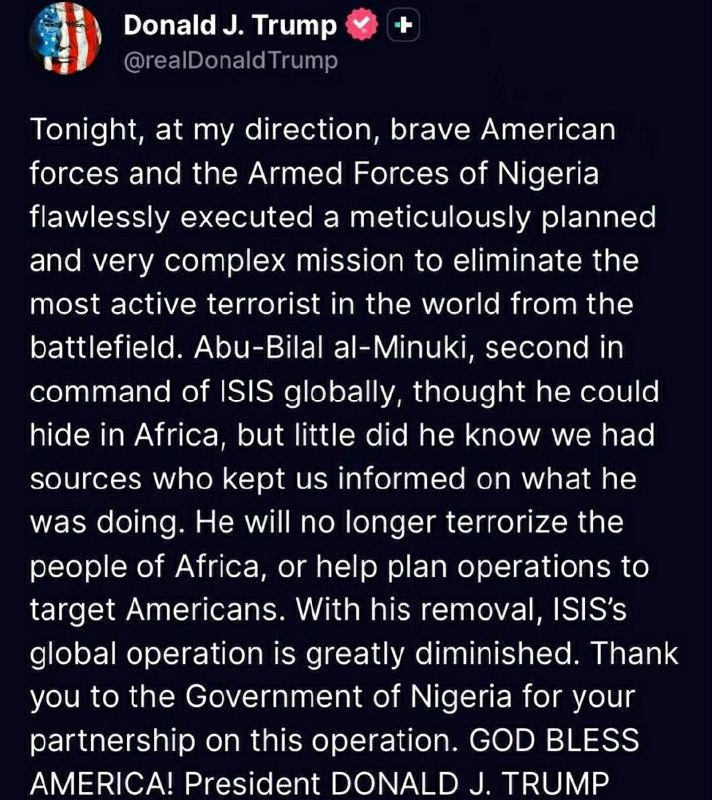

ترامب: مرد شماره دو داعش در نیجریه را کشتیم!
 
🔹ترامپ مدعی شد در جریان یک عملیات مشترک میان نیروهای آمریکایی و نیجریه‌ای، «ابوبلال المنوکی»، مرد شماره دو  داعش را از پای درآوردیم.

》OPT《

@OfficialPersiaTwiter

## bbcpersian — post 281192

🔻انفجار کنترل شده بمب‌های عمل نکرده در شیراز و حومه به مدت سه روز

محمد فرهادی، رئیس ستاد ارشد نظامی ارتش در استان‌های فارس و کهگیلویه و بویراحمد از انفجار کنترل شده بمب‌های عمل نکرده در شیراز طی سه روز خبر داد.

او گفته است که عملیات خنثی سازی و انفجار کنترل شده بمب‌های عمل نکرده جنگ در شیراز و حومه این شهر از امروز به مدت سه روز انجام می شود.

روابط عمومی ستاد ارتش در این استان‌ها هم گفته است که شنیده شدن صدا هر گونه انفجاری مربوط به این عملیات است.
https://bbc.in/3RJvbmB
@BBCPersian

## bbcpersian — post 281191

🔻واکنش اولیانوف به پیشنهاد تعلیق ۲۰ ساله برنامه هسته‌ای ایران: موضع آمریکا فاقد استدلال است

میخائیل اولیانوف، نماینده روسیه در آژانس بین‌المللی انرژی اتمی در وین به پیشنهاد دونالد ترامپ در مورد تعلیق ۲۰ ساله برنامه هسته‌ای ایران واکنش نشان داده و گفته است: «چرا ۲۰ سال و نه ۱۵ یا ۲۵ سال؟»

آقای اولیانوف در پستی در شبکه اجتماعی ایکس موضع آمریکا را «فاقد هر گونه استدلال» و صرفا براساس «ملاحظات ایدئولوژیک» دانسته و افزوده است: «اگر چنین رویکردی برای آمریکا قابل قبول است، لطفا در صورت بی نتیجه بودن آن شکایت نکنید.»

دونالد ترامپ ساعاتی پیش، پس از بازگشت از پکن گفته بود که تعلیق ۲۰ ساله برنامه هسته‌ای ایران را می‌پذیرد.

پیشتر، او از ایران خواسته بود که غنی‌سازی اورانیوم را به طور دائم متوقف کند و از دستیابی به سلاح‌های هسته‌ای برای همیشه جلوگیری شود.

اخیرا ایران پیشنهاد‌های آمریکا برای رسیدن به توافق را رد کرده بود و پس آن هم واشنگتن پیشنهاد‌های تهران را قابل قبول ندانست.

@BBCPersian

## bbcpersian — post 281183

🖊عمر دراز ننگیانه, بی‌بی‌سی اردو،‌ اسلام‌آباد

در حالی که در روزهای اخیر برخی محافل در آمریکا نسبت به نقش پاکستان به عنوان میانجی مذاکرات ایران و آمریکا ابراز تردید کرده‌اند، واشنگتن و تهران بار دیگر بر اعتماد خود به نقش اسلام‌آباد تاکید کرده‌اند.

با این حال، به نظر می‌آید روند میانجی‌گری در بن‌بست قرار گرفته است. ایران چند روز پیش پیشنهادهای خود درباره آتش‌بس را از طریق پاکستان برای آمریکا فرستاد، اما دونالد ترامپ، رئیس‌جمهور آمریکا، این پیشنهادها را «غیرقابل قبول» خواند و رد کرد.

از آن زمان تاکنون، تحول مهمی در این فرایند رخ نداده است.

اما تنها یک روز پیش از آغاز سفر دونالد ترامپ، رئیس‌جمهور آمریکا، به پکن، چین از طریق خبرگزاری رسمی خود پیامی منتشر کرد و از پاکستان خواست «روند میانجی‌گری میان آمریکا و ایران را تسریع کند».

اکنون پرسش اصلی این است که اسلام‌آباد چگونه می‌تواند روند میانجی‌گری را که ظاهرا در بن‌بست قرار گرفته و فعلا بیشتر به انتقال پیام محدود شده، تسریع کند؟

برای خواندن مطلب کامل:
https://bbc.in/4dtS7xK
📸GettyImages/ AFP/ White House/VCG
@BBCPersian

## bbcpersian — post 281182

  

🔻دونالد ترامپ، رئیس جمهور آمریکا گفته است که نیروهای آمریکا و نیجریه در یک عملیات مشترک، نفر دوم گروه دولت اسلامی (داعش) را کشته‌اند.

آقای ترامپ در پستی در تروث سوشال گفت که ابوبلال المینوکی دیگر به مردم آفریقا آسیب نخواهد زد و نمی‌تواند برای هدف قرار دادن آمریکایی‌ها عملیات برنامه‌ریزی کند.

او المینوکی را «فعال‌ترین تروریست جهان» توصیف کرد و گفت که با کشته شدن او، عملیات جهانی این گروه به‌شدت تضعیف شده است.

المینوکی در سال ۲۰۲۳ به دلیل ارتباط با گروه داعش تحت تحریم‌های ایالات متحده قرار گرفته بود.

📷Getty Images
@BBCPersian

## bbcpersian — post 281181

  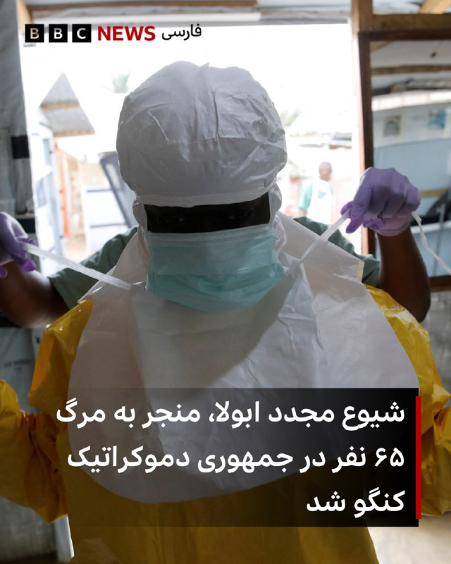

‌ ‌ ‌
آژانس بهداشتی آفریقا شیوع ابولا را در استان شرقی ایتوری جمهوری دموکراتیک کنگو اعلام کرد.

مرکز کنترل و پیشگیری از بیماری‌های آفریقا اعلام کرد که حدود ۲۴۶ مورد ابتلا و ۶۵ مورد مرگ گزارش شده است که عمدتا در شهرهای معدن طلا در مونگوالو و روآمپارا اتفاق افتاده است.

مقامات اوگاندا روز جمعه یک مورد ابتلا به ابولا از جمهوری دموکراتیک کنگو را تایید کردند و وزارت بهداشت آن کشور اعلام کرد که آزمایش یک مرد ۵۹ ساله که روز پنجشنبه درگذشت، مثبت بوده است.

ابولا اولین بار در سال ۱۹۷۶ در جایی که اکنون جمهوری دموکراتیک کنگو است، کشف شد و تصور می‌شود که از خفاش‌ها شیوع یافته باشد. این هفدهمین شیوع این بیماری ویروسی کشنده در آن کشور است.

این بیماری از طریق تماس مستقیم با مایعات بدن و از طریق پوست آسیب دیده منتقل می‌شود و باعث خونریزی شدید و نارسایی اندام می‌شود.

https://bbc.in/4nwKU4t
📷Reuters
@BBCPersian

## bbcpersian — post 281180

  

‌ ‌ ‌
رسانه‌های ایران خبر از درگذشت یحیی دهقان‌پور عکاس پیشکسوت و مدرس رشته عکاسی داده‌اند.

آقای دهقان‌پور متولد سال ۱۳۱۹ خورشیدی بود و در خصوص او نوشته‌اند که «نه‌ تنها به عنوان یک عکاس صاحب‌سبک شناخته می‌شد، بلکه با سال‌ها تدریس در مراکز آموزشی، نسل‌های متعددی از عکاسان را تربیت کرد» و «او در میان شاگردانش به عنوان یکی از پایه‌گذاران نگاه معاصر به آموزش عکاسی شناخته شود.»
از مهم‌ترین آثار او می‌توان به مجموعه تصاویر از مراسم خاکسپاری فروغ فرخزاد در سال ۱۳۴۵ اشاره کرد.

📷Masoud Momenha
@BBCPersian

## bbcpersian — post 281174

‌ ‌ ‌
بر اساس اسنادی که اخیرا از سوی وزارت دادگستری آمریکا منتشر شد، جفری اپستین یک روز پیش از بازداشتش در سال ۲۰۱۹ تلاش کرده بود کاخی چند میلیون دلاری در مراکش بخرد.

جفری اپستین از سال ۲۰۱۱ در پی خرید بين النخيل بود، اما اختلاف‌ها با فروشنده بر سر قیمت و نحوه انجام معامله سال‌ها ادامه داشت.

این قصر باشکوه در محله اعیانی النخیل شهر مراکش واقع شده و به عنوان یک شاهکار معماری توصیف شده است؛ بنایی که توسط ۱۳۰۰ صنعتگر ساخته شده و با نقش‌ونگارها و کاشی‌کاری‌های ظریف آراسته شده است.

اپستین ۵ ژوئیه ۲۰۱۹، یک روز پیش از بازداشتش، حواله بانکی ۱۴/۹۵ میلیون دلاری را امضا کرد؛ این اقدام در پی توافق برای خرید شرکت فراساحلی مالک این ملک به مبلغ ۱۸ میلیون یورو صورت گرفت.

https://bbc.in/4u9JQG8
📷 Getty/ US Department of Justice/ PA
@BBCPersian

## Lichargoo — post 24886

درسته در کوله‌پشتی سربازان خارجی آزادی نیست ولی تو شورت مکرون هست مث اینکه!

## Tans_Footbali — post 236326

واقعاً شاید بهتر باشد آدم در این مملکت بدون حساب و کتاب زندگی کند؛
چون اگر بخواهی حساب کنی، فقط گیج و افسرده می‌شوی…

مرغ همیشه یکی از ارزان‌ترین غذاهای سفره مردم بود؛غذایی برای خانواده‌هایی که توان خرید گوشت گوسفندی را نداشتند.
اما حالا کار به جایی رسیده که یک دوست پیام داده دیروز فقط یک عدد مرغ خریده حدود ۸۵۰٬۰۰۰ تومان!

حالا حساب کنید:
اگر یک خانواده چهار نفره فقط روزی یک مرغ بخرد،نه گوشت، نه میوه، نه لباس، نه اجاره خانه، نه قبض آب و برق و گاز…
فقط یک مرغ برای سه وعده غذا!

آخر ماه هزینه همین «ساده‌ترین غذا» می‌شود حدود ۲۷٬۰۰۰٬۰۰۰ تومان!

بعد تازه می‌گویند مردم صرفه‌جویی کنند، تحمل کنند، مدیریت کنند…

واقعاً قشر حقوق‌بگیر و کارگر در این شرایط چطور زندگی می‌کنند؟
با کدام حقوق؟
با کدام درآمد؟
با کدام امید؟

@Tans_Footbali

## hamclasixii — post 75386

  

🔴امروز 16 May روز جهانی پسربچه‌اس!

+ از اونجا که ما توی ایران "بچه" نداریم؛ این روز رو به تمام گل‌پسرای ایران‌زمین تبریک میگیم. 
😍

📚 @hamclasix 📚

## hamclasixii — post 75385

🔴هر روز یک قرار تازه برای تعیین تکلیف امتحانات نهایی!

🔹سخنگوی آموزش‌وپرورش روز گذشته اعلام کرد که «تا پایان تیرماه صبر می‌کنیم و اگر امکان برگزاری آزمون نهایی فراهم شود، انجام می‌دهیم». تاریخی که تاکنون چندین بار تغییر کرده است.
🔹اولین‌بار سخنگوی آموزش‌وپرورش دو هفتۀ پیش در حاشیۀ نشست خبری‌اش زمان تعیین تکلیف امتحانات نهایی را نیمۀ مرداد ذکر کرد، اما سه روز پیش وزیر آموزش‌وپرورش، این تاریخ را نیمۀ تیرماه عنوان کرد و حالا سخنگو، پانزده روز به آن اضافه کرده است.
🔹دانش‌آموزان می‌گویند که در این شرایط بلاتکلیف هستند اما مسئولان آموزش‌وپرورش به جای توضیح دربارۀ تغییر تاریخ‌ها، می‌گویند که دانش‌آموزان به جای نگرانی، درس‌هایشان را مطالعه کنند تا زمان امتحانات اطلاع‌رسانی شود.

📚 @hamclasix 📚

## hamclasixii — post 75384

🔴تعطیلی ادارات و بانک‌های ایلام به‌دلیل گردوغبار

🔹کارگروه اضطرار آلودگی هوای استان ایلام با توجه به تداوم گردوغبار و افزایش شاخص آلودگی، از تعطیلی تمامی دستگاه‌های اجرایی، ادارات و بانک‌های استان در روز شنبه ۲۶ اردیبهشت‌ماه خبر داد.

📚 @hamclasix 📚

---
📅 بروزرسانی: 1405/02/26 07:32
---

## persian_trend_official — post 14226

  <a href="telegram/content/persian_trend_official_14226_1778904148.mp4" target="_blank">🎬 Download video</a>

صبحتون بخیر ☕️🤍

📝 Nick
📌 @persian_trend_official
پرشین ترند | متفاوت‌ترین کانال نظامی

## bbcpersian — post 281165

‌ ‌ ‌
حمله هوایی اسرائیل که ظهر شنبه گذشته بدون هیچ هشداری رخ داد، ساختمانی را در منطقه سکسکیه در جنوب لبنان ویران کرد که خانواده‌ای آواره از جنگ در آن پناه گرفته بودند. آتش‌بسی که ماه گذشته اعلام شد، نتوانسته درگیری میان اسرائیل و حزب‌الله را متوقف کند. در این بخش از لبنان، حملات اسرائیل شبانه‌روز ادامه دارد.

وقتی به محل رسیدم، نیروهای امدادی جست‌وجو را به پایان رسانده بودند. مردی روی آوارها در سکوت به ویرانی خیره شده بود. همسایه‌ها دوچرخه آسیب‌دیده یک کودک و خرس عروسکی بنفشی را که پوشیده از گرد و خاک بود، از زیر آوار بیرون آورده بودند.

در این حمله ۹ نفر کشته شدند. ارتش اسرائیل گفت اعضایی از حزب‌الله را هدف قرار داده که از ساختمانی با «کاربری نظامی» فعالیت می‌کردند و «تهدیدی فوری» به شمار می‌رفتند. اسرائیل جزئیات بیشتری ارائه نکرد.

https://bbc.in/4wwDC4L
📸Neha Sharma/BBC/ GettyImages/ AFP via Getty Images
@BBCPersian

## bbcpersian — post 281164

🔻 ترامپ از سفر چین به آمریکا بازگشت

دونالد ترامپ، رئیس جمهور آمریکا پس از سفرش به چین به کشورش بازگشت.

به گزارش رویترز، سفر رسمی دو روزه ترامپ به پکن شامل گفت‌وگو با شی جین‌پینگ، رئیس جمهور چین درباره تایوان، ایران و تجارت بود، اما درباره مسائل اختلافی میان دو اقتصاد بزرگ جهان، دستاورد مشخصی به همراه نداشت.

آقای ترامپ پس از ورود به آمریکا به خبرنگاران گفت: «تنها چیزی که می‌توانم بگویم این است که آن سفر موفقیتی بزرگ بود. ما توافق‌های بزرگی انجام دادیم، توافق‌های تجاری بسیار خوبی داشتیم و روابط فوق‌العاده‌ای برقرار کردیم. اتفاقات زیادی افتاده که به‌زودی درباره آن‌ها خواهید شنید. فکر می‌کنم این واقعا یک موفقیت عظیم و لحظه‌ای تاریخی بود.»

او همچنین گفت که شی جین‌پینگ در ماه سپتامبر سال جاری میلادی سفری متقابل به واشنگتن خواهد داشت.

https://bbc.in/4dth6kD
@BBCPersian

## bbcpersian — post 281163

  

‌ ‌ ‌ ‌
یک فرمانده شبه‌نظامیان عراقی به اتهام نقش داشتن در طراحی بیش از ۱۲ حمله «تروریستی» در آمریکای شمالی و اروپا بازداشت شده است؛ حملاتی که به گفته مقام‌های قضایی در واکنش به جنگ با ایران برنامه‌ریزی شده بود.

مقام‌های قضایی آمریکا می‌گویند که محمد باقر سعد داوود ساعدی، ۳۲ ساله، در حال طراحی حمله به یک کنیسه در نیویورک و دو مرکز یهودی در لس‌آنجلس و اسکاتسدیل بوده است.

بر اساس شکایت کیفری، او با شش اتهام مرتبط با تروریسم روبه‌رو است. وکیلش اما می‌گوید که او هدف «پیگردی سیاسی» قرار گرفته است.

به گفته مقام‌های آمریکایی، ساعدی از فرماندهان کتائب حزب‌الله است؛ گروهی مستقر در عراق که آمریکا آن را سازمانی تروریستی می‌داند و روابط نزدیکی با ایران دارد.

او که شهروند عراق است، ابتدا در ترکیه بازداشت شد و سپس به اف‌بی‌آی تحویل داده و به آمریکا منتقل شد.

ساعدی در دادگاه فدرال منهتن حاضر شد و تا زمان برگزاری محاکمه در بازداشت خواهد ماند.

https://bbc.in/4uggfuE
📷US Department of Justice
@BBCPersian

## bbcpersian — post 281162

  

‌ ‌ ‌ ‌
نواف سلام، نخست‌وزیر لبنان، می‌گوید که کشورش دیگر تاب «جنگ‌های بی‌پروا» در خدمت منافع خارجی را ندارد و خواستار حمایت اعراب و جامعه جهانی از مذاکرات لبنان با اسرائیل شد.

آقای سلام در سخنرانی خود در یک ضیافت خیریه ابراز امیدواری کرد که «تمام حمایت‌های عربی و بین‌المللی برای تقویت موضع لبنان در مذاکرات» با اسرائیل بسیج شود.

این اظهارات اندکی پس از پایان تازه‌ترین دور گفت‌وگوها و تمدید آتش‌بس جاری برای ۴۵ روز مطرح شد که با میانجی‌گری آمریکا به اجرا گذاشته می‌شود.

او در انتقادی تلویحی از حزب‌الله، که در حمایت از ایران وارد جنگ خاورمیانه شده بود، گفت که لبنان «به اندازه کافی از این ماجراجویی‌های بی‌پروا در خدمت پروژه‌ها و منافع خارجی آسیب دیده» و تاکید کرد ارتش لبنان باید تنها نیروی مسلح آن کشور باشد.

https://bbc.in/4dxLD0L
📷 EPA/Shutterstock
@BBCPersian

## bbcpersian — post 281161

🔻امارات پس از گزارش حمله به ایران از «اقدامات دفاعی» خود دفاع کرد

امارات متحده عربی روز شنبه اعلام کرد همه اقداماتی را که انجام داده، در چارچوب تدابیر دفاعی با هدف حفاظت از حاکمیت، غیرنظامیان و زیرساخت‌های حیاتی‌اش بوده است.

به گزارش رویترز، این بیانیه پس از آن منتشر شد که روزنامه وال استریت ژورنال روز دوشنبه گزارش داد امارات در اوایل آوریل عملیات نظامی علیه ایران انجام داده است.

با این حال، بیانیه وزارت خارجه امارات به‌طور صریح به حملات گزارش‌شده علیه ایران اشاره نکرده است.

پیشتر امارات متحده عربی پس از اینکه عباس عراقچی آن کشور را به داشتن «نقش فعال» در حملات به ایران متهم کرد، این اظهارات را «تلاش‌ برای توجیه حملات تروریستی ایران» خواند و آن را رد کرد.

خلیفه بن شاهین المرار، از مقام‌های وزارت خارجه امارات که به نمایندگی کشورش در نشست وزرای خارجه بریکس در دهلی‌نو شرکت داشت، گفته بود که «امارات متحده عربی به دنبال حمایت سایر کشورها نیست و کاملا قادر به جلوگیری از این تجاوز بی‌دلیل است.»
https://bbc.in/4fq0iNX
@BBCPersian

## bbcpersian — post 281160

  

‌ ‌ ‌ ‌
نماینده چین در سازمان ملل و و رئیس دوره‌ای شورای امنیت، از پیش‌نویس قطعنامه پیشنهادی آمریکا و بحرین درباره تنگه هرمز انتقاد کرد و گفت که «محتوا و زمان‌بندی آن مناسب نیست و تصویبش کمکی نخواهد کرد.»

به گزارش رویترز، این پیش‌نویس قطعنامه از ایران می‌خواهد که حملات و مین‌گذاری در تنگه هرمز را متوقف کند. اما دیپلمات‌ها گفتند که اگر این قطعنامه به رای گذاشته شود، احتمالا با وتوی روسیه و چین روبه‌رو خواهد شد.

دو کشور ماه گذشته نیز قطعنامه مشابه مورد حمایت آمریکا را وتو کرده بودند و متن آن را علیه ایران «جانبدارانه» خواندند.

https://bbc.in/3R8fHbP
📷 Space Frontiers/Archive Photos/Hulton Archive/Getty Images
@BBCPersian

## bbcpersian — post 281159

🔻 واکنش شاهزاده رضا پهلوی به مصادره اموال ایرانیان داخل و خارج

شاهزاده رضا پهلوی در یک پیام ویدئویی به مصادره اموال ایرانیان داخل و خارج از آن کشور واکنش نشان داده است.

او با انتشار این پیام در شبکه‌های اجتماعی می‌گوید: «نه‌تنها افرادی که در صدور دستور، اجرای آن، یا تسهیل این مصادره‌ها نقش دارند در معرض مسئولیت قرار خواهند گرفت، بلکه کسانی که آگاهانه و داوطلبانه به خرید و فروش این اموال می‌پردازند نیز باید پاسخگو باشند. این مسئولیت، استفاده از اموال یا دارایی‌های آنان برای جبران خسارت واردشده به مالکان اصلی را نیز شامل می‌‌شود.»

آقای پهلوی همچنین گفت که از «کمیته‌ تدوین مقررات عدالت انتقالی ایران خواسته است که درباره‌ دو موضوع مهم، نظر مشورتی خود را ارائه کند: نخست، موضوع مسئولیت کیفری افرادی که با ساختارهای سرکوبگر جمهوری اسلامی همکاری می‌کنند؛ و دوم، موضوع مصادره‌ اموال معترضان و خانواده‌های آنان.»

او می‌گوید که پیام این کمیته مشورتی «روشن است و این اقدامات، همکاری‌های ساده یا بی‌اهمیت نیستند؛ بلکه یاری‌رسانی به جنایت علیه بشریت محسوب می‌شوند. هیچ مقام، هیچ دستور و هیچ بهانه‌ای نمی‌تواند مسئولیت کیفری فردی را از میان ببرد.»

پس از اعتراضات سراسری دی‌ماه ۱۴۰۴ و سرکوب خونین آن از سوی حکومت جمهوری اسلامی، دستگاه قضایی ایران، توقیف و مصادره اموال معترضان را آغاز کرد و پس از جنگ آمریکا و اسرائیل با ایران، به‌شکل فزاینده‌ای این اقدام را از سرگرفت.

قوه قضائیه ایران پیشتر مدعی شد که درآمد ناشی از فروش این اموال را در بازسازی خرابی‌های ناشی از جنگ هزینه خواهد کرد.

https://bbc.in/4dNmz76
@BBCPersian

## withyashar — post 11370

## withyashar — post 11369

@withyashar

## withyashar — post 11368

نیویورک تایمز از قول مقامات نظامی آمریکا:

اگر جزیره خارگ تصرف شود ، نیروهای زمینی برای حفظ آن لازم خواهند بود.

@withyashar

---
📅 بروزرسانی: 1405/02/26 03:38
---

## bbcpersian — post 281158

  

‌ ‌ ‌ ‌
دونالد ترامپ، رئیس جمهور آمریکا، می‌گوید که تعلیق ۲۰ ساله برنامه هسته‌ای ایران را می‌پذیرد، که به نظر می‌رسد یک تغییر اساسی در موضع او مبنی بر برچیده شدن کامل برنامه هسته‌ای ایران باشد.

آقای ترامپ در هواپیمای ریاست جمهور و پس از سفر به پکن گفته است که این تعلیق باید «۲۰ سال واقعی» باشد.

پیشتر، او از ایران خواسته بود که غنی‌سازی اورانیوم را به طور دائم متوقف کند و از دستیابی به سلاح‌های هسته‌ای برای همیشه جلوگیری شود.

اما او همچنین گفت که صبرش در قبال ایران رو به پایان است و هیچ نشانه‌ای از پیشرفت در مذاکرات وجود ندارد.

اخیرا ایران پیشنهادات آمریکا برای رسیدن به توافق را رد کرده بود و پس آن هم واشنگتن پیشنهادات تهران را قابل قبول ندانست.

https://bbc.in/4uedXw9
📷 Reuters
@BBCPersian

## withyashar — post 11367

  <a href="telegram/content/withyashar_11367_1778890082.mp4" target="_blank">🎬 Download video</a>

تنها چیزی که می‌توانم بگویم این است که این یک موفقیت بزرگ بود.»

رئیس جمهور ترامپ پس از سفر به چین به کاخ سفید بازگشت و به خبرنگاران گفت: «ما به توافق‌های بزرگی رسیدیم» و این دیدار را یک لحظه تاریخی خواند.

سپس او به اتفاقات بیشتری در آینده اشاره کرد: «اتفاقات زیادی افتاده است و شما درباره آنها خواهید شنید.»
@withyashar

## withyashar — post 11366

ترامپ: افزایش قیمت‌ بنزین مرتبط با جنگ ایران «درد کوتاه‌مدت» است که بسیار کمتر از چیزی است که مردم انتظار داشتن.

وقتی به کسی میگید که باید کمی بیشتر برای بنزین در یک دوره بسیار کوتاه بپردازید، چون میخوایم جلوی تهدید تکه‌تکه شدن توسط یک دیوانه، یک فرد دیوانه رو بگیریم، و آنها دیوانه هستن با استفاده از سلاح‌های هسته‌ای، همه میگن که این خوب است.
@withyashar

## withyashar — post 11365

## withyashar — post 11364

صادق هدایت میگه دیگه
میگه اگه کارت با سر و کله زدن با ادماس میفهمی چه ملت شریف زبون نفهمی داریم

## withyashar — post 11363

  <a href="telegram/content/withyashar_11363_1778890084.mp4" target="_blank">🎬 Download video</a>

اف‌بی‌آی ترامپ یک توطئه تروریستی بزرگ را که قرار بود توسط یک فرمانده شبه‌نظامی تحت حمایت ایران در خاک ایالات متحده، کانادا و اروپا انجام شود، خنثی کرده است.
محمد السعدی - رهبر کتائب حزب‌الله اسلام‌گرا - بیش از ۲۰ حمله را برنامه‌ریزی کرده بود. هدف او اماکن یهودی، از جمله یکی در نیویورک بود.
جان‌های بیشتری نجات یافت
«بنابراین او به اینجا آورده شد و امروز زودتر در دادگاه حاضر شد.»
می خواهم در مورد این عملیات محتاط باشم تا کسی را به خطر نیندازم، اما همین کافی است که بگویم این تلاشی بود که نه تنها اف‌بی‌آی، بلکه شرکای اجرای قانون ما در خارج از کشور را نیز شامل می‌شد.
@withyashar

---
📅 بروزرسانی: 1405/02/26 02:42
---

## persian_trend_official — post 14225

  <a href="telegram/content/persian_trend_official_14225_1778886753.mp4" target="_blank">🎬 Download video</a>

شبتون بخیر ❤️🔥

📝 Nick
📌 @persian_trend_official
پرشین ترند | متفاوت‌ترین کانال نظامی

## persian_trend_official — post 14224

  

🔴محمدباقر السعدی، رهبر حزب‌الله عراق توسط FBI دستگیر شد

🔹السعدی به دلیل فعالیت‌هایش با گردان‌های حزب‌الله عراق و سپاه پاسداران ایران با شش اتهام روبرو است

💢اداره تحقیقات فدرال آمریکا اعلام کرد «محمد السعدی» که از او به‌عنوان یک هدف باارزش مرتبط با تروریسم بین‌المللی یاد شده، بازداشت و به آمریکا منتقل شده است.

🔻بر اساس بیانیه اف‌بی‌آی:

▪️ السعدی و همدستانش متهم به برنامه‌ریزی، هماهنگی و پذیرش مسئولیت دست‌کم ۲۰ حمله تروریستی در اروپا و کانادا هستند
▪️ مقام‌های آمریکایی مدعی‌اند این شبکه در حال برنامه‌ریزی حملات آینده علیه آمریکا نیز بوده است
▪️ از جمله اهداف احتمالی، مراکز و نهادهای یهودی در نیویورک، کالیفرنیا و آریزونا عنوان شده‌اند

💢اف‌بی‌آی این بازداشت را بخشی از اقدامات دولت ترامپ برای مقابله با تروریسم توصیف کرده است.

🫆:Tony

📌 @persian_trend_official
پرشین ترند | متفاوت‌ترین کانال نظامی

## OfficialPersiaTwiter — post 498728

  <a href="telegram/content/OfficialPersiaTwiter_498728_1778886754.mp4" target="_blank">🎬 Download video</a>

برت بایر: فکر می کنید ایران به زودی تسلیم می شود؟ ترامپ: بله، شک ندارم. 》OPT《 @OfficialPersiaTwiter

## OfficialPersiaTwiter — post 498727

  <a href="telegram/content/OfficialPersiaTwiter_498727_1778886755.mp4" target="_blank">🎬 Download video</a>

برت بایر از فاکس: آیا تاب آوری ایران را دست کم گرفتید؟ 🔹 ترامپ: چیزی را دست کم نگرفتم ما می توانیم پل ها و ظرفیت برق آنها را در دو روز از بین ببریم.‌‌ 》OPT《 @OfficialPersiaTwiter

## OfficialPersiaTwiter — post 498726

  <a href="telegram/content/OfficialPersiaTwiter_498726_1778886756.mp4" target="_blank">🎬 Download video</a>

ترامپ درباره ایران گفت: «ما واقعاً تقریباً به چارچوب یک توافق رسیده بودیم؛ بدون سلاح هسته‌ای. قرار بود آن‌ها “غبار هسته‌ای” را به ما تحویل بدهند... و هر بار که به توافقی می‌رسیدند، روز بعد طوری رفتار می‌کردند که انگار اصلاً چنین گفت‌وگویی نداشته‌ایم.» 》OPT《…

## OfficialPersiaTwiter — post 498725

  <a href="telegram/content/OfficialPersiaTwiter_498725_1778886758.mp4" target="_blank">🎬 Download video</a>

ادعای یدیعوت آحارونت به نقل از منابع خود: در حالی که ترامپ همچنان تهدید می‌کند که ممکن است به گزینه نظامی متوسل شود، فضای انتظار و نگرانی در اسرائیل حاکم شده است؛ همه منتظر تصمیم او درباره ایران هستند، در حالی که تهران می‌گوید پیام‌هایی از واشنگتن دریافت…

## OfficialPersiaTwiter — post 498724

🔴ادعای ترامپ درباره ایران: «خب، به هر حال ما به یک راه‌حل خواهیم رسید. بنابراین یا این مسئله به‌صورت خشونت‌آمیز حل می‌شود یا بدون خشونت. و من خیلی ترجیح می‌دهم که بدون خشونت باشد.» 》OPT《 @OfficialPersiaTwiter

## OfficialPersiaTwiter — post 498723

🔴ادعای ترامپ درباره ایران:

«خب، به هر حال ما به یک راه‌حل خواهیم رسید. بنابراین یا این مسئله به‌صورت خشونت‌آمیز حل می‌شود یا بدون خشونت. و من خیلی ترجیح می‌دهم که بدون خشونت باشد.»

》OPT《

@OfficialPersiaTwiter

## OfficialPersiaTwiter — post 498722

ادعای آمریکا: دستگیری محمدباقر الساعدی، رهبر حزب‌الله عراق و انتقال او به ایالات متحده

🔸وزارت دادگستری آمریکا مدعی شد:

🔹الساعدی به دلیل فعالیت‌هایش با گردان‌های حزب‌الله عراق و سپاه پاسداران ایران با شش اتهام روبه‌رو است.

🔹الساعدی متهم است که دیگران را به حمله به منافع آمریکا و اسرائیل هدایت کرده است/جماران

》OPT《

@OfficialPersiaTwiter

## bbcpersian — post 281157

  

‌ ‌ ‌ ‌
دولت ایالات متحده به دنبال مجازات اعدام برای مظنونی است که سال گذشته به قتل دو نفر از کارکنان سفارت اسرائیل در واشنگتن متهم شده است.

جینین پیرو، دادستان ناحیه کلمبیا، روز جمعه درخواست مجازات اعدام برای سه مورد از مجموع ۱۳ اتهام علیه الیاس رودریگز ۳۱ ساله را ارائه کرد. پس از محدودیت‌های اعمال‌شده در دوره جو بایدن، رئیس جمهور سابق آمریکا، دونالد ترامپ، از مجازات اعدام فدرال حمایت کرد.

مقام‌های قضایی آمریکا ادعا می‌کنند که رودریگز پیش از شلیک در خارج از موزه یهودیان پایتخت به سمت زوج یارون لیشینسکی، ۳۰ ساله، و سارا لین میلگریم، ۲۶ ساله، فریاد زده بود «فلسطین را آزاد کنید.»

آقای رودریگز پس از این حمله دستگیر شد و در دادگاه خود را بی‌گناه دانسته است.

اگر رودریگز به اتهام قتل یک مقام خارجی، شلیک با اسلحه گرم در حین جرم خشونت‌آمیز و قتل از طریق استفاده از اسلحه گرم مجرم شناخته شود، دادستان ناحیه کلمبیا برای او درخواست اعدام خواهد کرد.

https://bbc.in/496s8el
📷 X/Reuters
@BBCPersian

## Tans_Footbali — post 236325

  <a href="telegram/content/Tans_Footbali_236325_1778886759.mp4" target="_blank">🎬 Download video</a>

برت بایر از فاکس: فکر می‌کنی ایران به زودی تسلیم می‌شود؟

ترامپ: بله، هیچ شکی ندارم

💛@Tans_Footbali

## withyashar — post 11361

  <a href="telegram/content/withyashar_11361_1778886761.mp4" target="_blank">🎬 Download video</a>

ترامپ: ما ۹ تا دوربین مختلف در فضا روی سایت هسته ای ایران داریم

می‌تونیم اسم طرف رو هم بخونیم
مثلاً اگه اسمش محمد باشه، ‌که خب بیشترشون محمدن، تقریباً می‌تونیم حدس بزنیم که حدود ۵۰٪ اطلاعاتش درست در میاد
@withyashar

## withyashar — post 11360

ترامپ : ویتنام ۱۹ سال طول کشید، عراق حدود ۱۰ سال، کره ۷ سال، یکی دیگه ۱۴ سال، یکی ۱۲ سال، یکی هم ۹ سال
- ما فقط دو ماه و نیم اونجا بودیم
- چین هم این هفته سه تا نفتکش پر از نفت ایران رو برد، چون ما اجازه دادیم این اتفاق بیفته،شما اجازه دادید
@withyashar

## withyashar — post 11359

  <a href="telegram/content/withyashar_11359_1778886762.mp4" target="_blank">🎬 Download video</a>

مجریان صداوسیما برداشتن یه تصویر هوش مصنوعی رو گذاشتن و دارن تحلیلش میکنن!
😂😂
@withyashar

## withyashar — post 11358

فقط حال من رو فروشنده های بازار که با مردم سر و کله میززند و جماعت زبون نفهم و میبینند درک میکنند

## withyashar — post 11357

## withyashar — post 11356

---
📅 بروزرسانی: 1405/02/26 01:33
---

## persian_trend_official — post 14223

  

واقعا احمدی نژاد چه شد ؟!

## OfficialPersiaTwiter — post 498721

  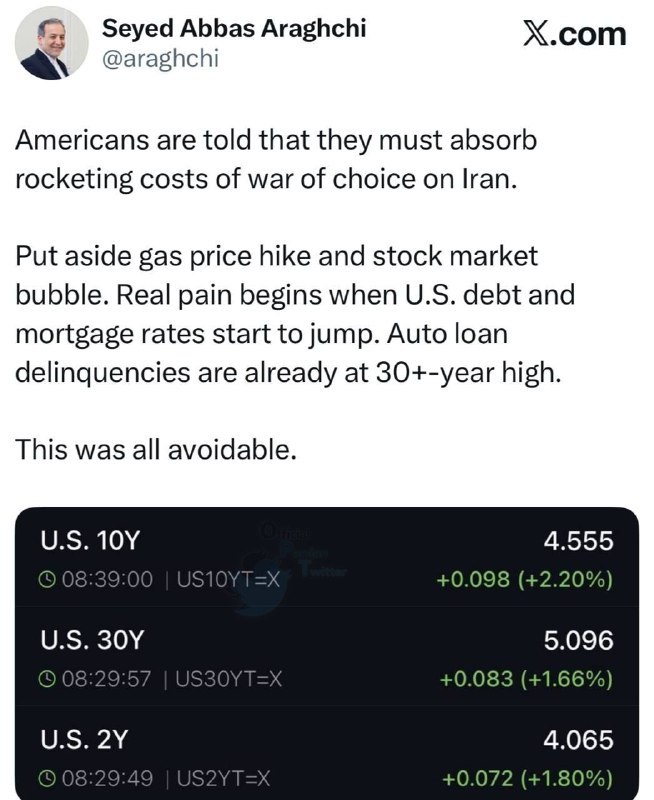

ادعای نیویورک‌تایمز: ترامپ روز جمعه پس از بازگشت از چین، با تصمیم‌های مهمی درباره ایران مواجه شد؛ در حالی که نزدیک‌ترین مشاورانش طرح‌هایی برای ازسرگیری حملات نظامی در صورت تصمیم او برای شکستن بن‌بست از طریق فشار نظامی تهیه کرده‌اند./انتخاب 》OPT《 @OfficialPersiaTwiter

## OfficialPersiaTwiter — post 498720

  

شرکت اسپیس ایکس قیمت جهانی استارلینک مینی را به زیر ۲۰۰دلار (۳۶میلیون تومن) رساند

سایز دیش های این سری از استارلینک‌ها به اندازه‌ی یه کاغذ A4 می‌باشد.

》OPT《

@OfficialPersiaTwiter

## OfficialPersiaTwiter — post 498719

۲۰ هکتار از مزارع گندم کازرون در آتش سوخت

🔹مدیر جهاد کشاورزی کازرون از وقوع آتش‌سوزی در مزارع گندم روستای علی‌آباد دوتو در بخش مرکزی این شهرستان و از بین رفتن ۲۰ هکتار از محصول آماده برداشت خبر داد.
🔹جهاد کشاورزی کازرون ضمن هشدار به کشاورزان نسبت به افزایش احتمال آتش‌سوزی‌ها در فصل برداشت، اعلام داشت: با توجه به خشکی پوشش گیاهی و وزش بادهای موسمی، کوچک‌ترین بی‌احتیاطی می‌تواند به فاجعه‌ای جبران‌ناپذیر منجر شود.

》OPT《

@OfficialPersiaTwiter

## bbcpersian — post 281156

  

‌ ‌ ‌ ‌
نخست‌وزیر و وزیر دفاع اسرائیل با صدور بیانیه‌ای اعلام کردند که عزالدین حداد، فرمانده گردان‌‌های عزالدین قسام، شاخه نظامی حماس در غزه را کشته‌اند.

در بیانیه بنیامین نتانیاهو، و اسرائیل کاتس که در رسانه‌های اسرائیلی منتشر شده، آمده است که حداد یکی از «معماران حملات ۷ اکتبر ۲۰۲۳» به اسرائیل بوده است.

طبق این بیانیه، عزالدین حداد از اجرای توافق دونالد ترامپ، رئیس‌جمهور آمریکا، برای خلع سلاح حماس خودداری کرده بود.

یک مقام ارشد امنیتی گفت که نشانه‌های اولیه حاکیست که او کشته شده است.

شاهدان عینی در غزه به بی‌بی‌سی گفتند که یک آپارتمان هدف حمله موشکی قرار گرفت و سپس خودرویی که گفته می‌شود محل را ترک کرده بود، در حمله‌ای دیگر هدف قرار گرفت؛ حمله‌ای که به کشته شدن سه نفر انجامید.

حماس تاکنون کشته شدن عزالدین حداد را نه تایید کرده و نه رد کرده است.

https://bbc.in/4uPJdl1
📷Reuters
@BBCPersian

## bbcpersian — post 281155

🔻 افزایش قیمت نفت و تنش در تنگه هرمز، سود اوراق آمریکا را به بالاترین سطح یک‌سال اخیر رساند

بازده اوراق خزانه‌داری ایالات متحده آمریکا یا سودی که سرمایه‌گذاران برای خرید اوراق بدهی دولت آمریکا مطالبه می‌کنند، روز جمعه به بالاترین سطح یک سال گذشته رسید.

به گزارش رویترز، افزایش قیمت نفت، نگرانی‌ها درباره تورم و انتظار برای قوی‌تر شدن اقتصاد آمریکا باعث شد بازارها پیش‌بینی کنند که نرخ‌های بهره ممکن است برای مدت طولانی‌تری بالا بماند.

قیمت نفت نیز روز جمعه بیش از سه درصد افزایش یافت؛ پس از آن‌که اظهارات دونالد ترامپ و عباس عراقچی، امیدها به توافقی برای پایان دادن به حملات و توقیف کشتی‌ها در اطراف تنگه هرمز را کاهش داد.

دونالد ترامپ گفت که صبرش در قبال ایران رو به پایان است و شی جین‌پینگ، رئیس جمهور چین نیز در دیدار با آقای ترامپ در پکن موافقت کرد که تهران باید تنگه هرمز را بازگشایی کند.

وزیر خارجه ایران هم گفت که تهران به آمریکا «اعتماد ندارد» و تنها در صورتی به مذاکره علاقه‌مند است که واشنگتن جدیت خود را نشان دهد.

https://bbc.in/3PJL9ww
@BBCPersian

## Tans_Footbali — post 236324

نیویورک‌تایمز: دو مقام خاورمیانه‌ای ادعا کردند که آمریکا و اسرائیل در حال آماده‌سازی گسترده برای احتمال ازسرگیری حملات علیه جمهوری اسلامی هستند؛ آماده‌سازی‌ای که بزرگ‌ترین سطح از زمان آتش‌بس محسوب می‌شود؛ این حمله ممکن است از هفته آینده آغاز شود

مقام‌های نظامی آمریکا به‌طور غیررسمی می‌گویند پیروزی در حملات جدید بسیار دشوار است، زیرا ایران بخش زیادی از توان موشکی و زیرزمینی خود را بازیابی کرده است

گزینه‌های ترامپ در ایران شامل نیروهای ویژه زمینی برای کنترل اورانیوم است

💛@Tans_Footbali

## withyashar — post 11355

## withyashar — post 11354

نیویورک تایمز به نقل از مقامات آمریکا:

دستیاران ترامپ برنامه‌هایی رو برای بازگشت به حملات نظامی به ایران آماده کردن، اگر او تصمیم بگیره با بمباران بیشتر از بن بست خارج بشه.

از جمله گزینه‌ها، اعزام نیروهای ویژه به ایران برای هدف قرار دادن مواد هسته‌ای مدفون شده است و ممکنه از نیروهای ویژه برای کنترل جزیره خارک استفاده بشه.
@withyashar

## withyashar — post 11353

  

جلد جدید مجله تایم: چگونه دیدار ترامپ و شی، نظم نوین جهانی را نشان داد
@withyashar

## withyashar — post 11352

ترامپ خیلی عجله داشته هیچ فیلمی عکسی از رسیدنش نیومده بیرون ! عجبیه

## withyashar — post 11351

  <a href="telegram/content/withyashar_11351_1778882589.mp4" target="_blank">🎬 Download video</a>

🎬 Video

## withyashar — post 11350

حوس لوبیا پلو کردم 😅 امشب که بیداریم درست کنم

## withyashar — post 11349

ترامپ در تروث : تینا را آزاد کنید
@withyashar
تینا پیترز یک مقام انتخاباتی سابق آمریکاست که به‌خاطر دخالت غیرقانونی در سیستم‌های رأی‌گیری بعد از انتخابات 2020 زندانی شده و حالا ترامپ از او حمایت سیاسی می‌کند

## withyashar — post 11348

## withyashar — post 11347

## withyashar — post 11346

## withyashar — post 11345

نیویورک‌تایمز به نقل از ۲ مقام امنیتی:

آمریکا و اسرائیل در حال آماده‌سازی گسترده برای احتمال ازسرگیری حملات علیه جمهوری اسلامی هستند،

این حمله ممکن است از هفته آینده آغاز شود
@withyashar

## withyashar — post 11344

یه مسیج درست اگه تو دایرکت دیدی به من بگو ! انگار‌من کشیش کلیسام ! یا کلانتر محل !

## withyashar — post 11343
<!-- MSG END -->

<!-- NAV START -->

<a href="https://github.com/hosseinyofficial/aio-downloader/blob/main/telegram/content/archive_1.md" style="display:inline-block; padding:6px 12px; margin:0 4px; background-color:#2ea44f; color:white; text-decoration:none; border-radius:4px; font-weight:bold;">صفحه بعد</a>

<!-- NAV END -->
